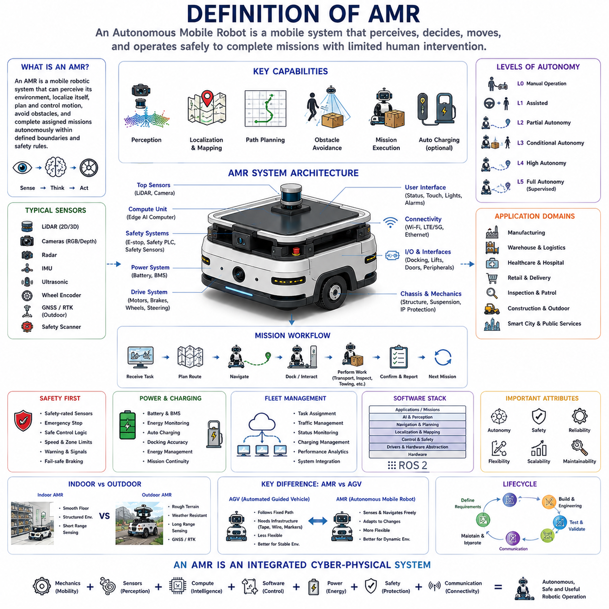
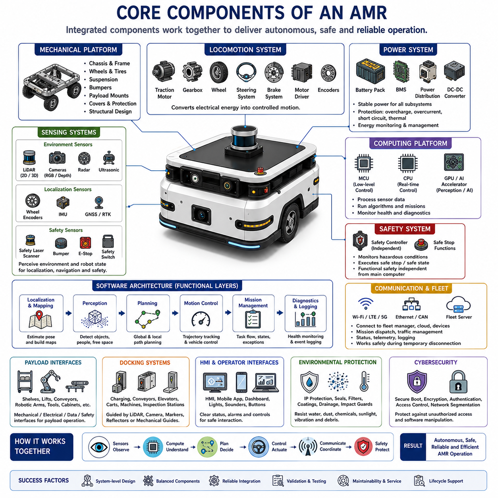
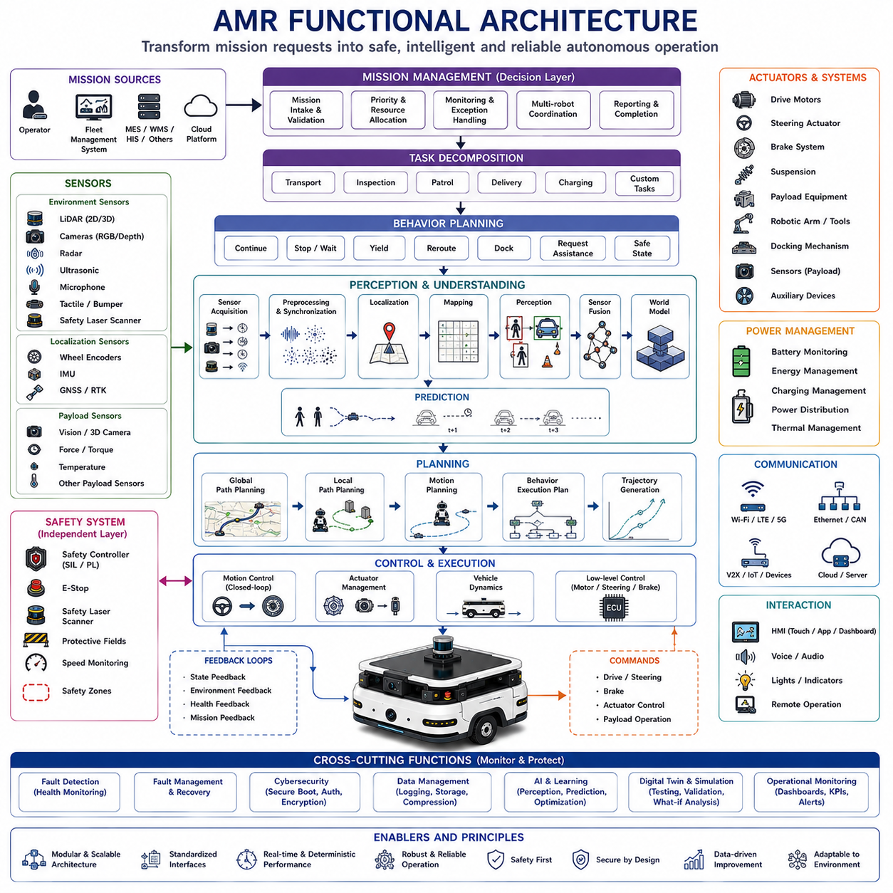
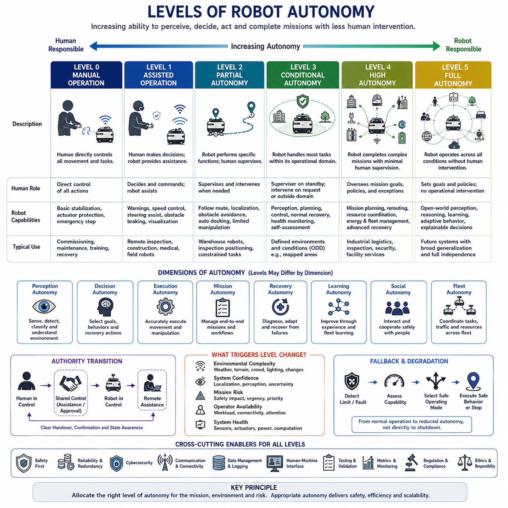
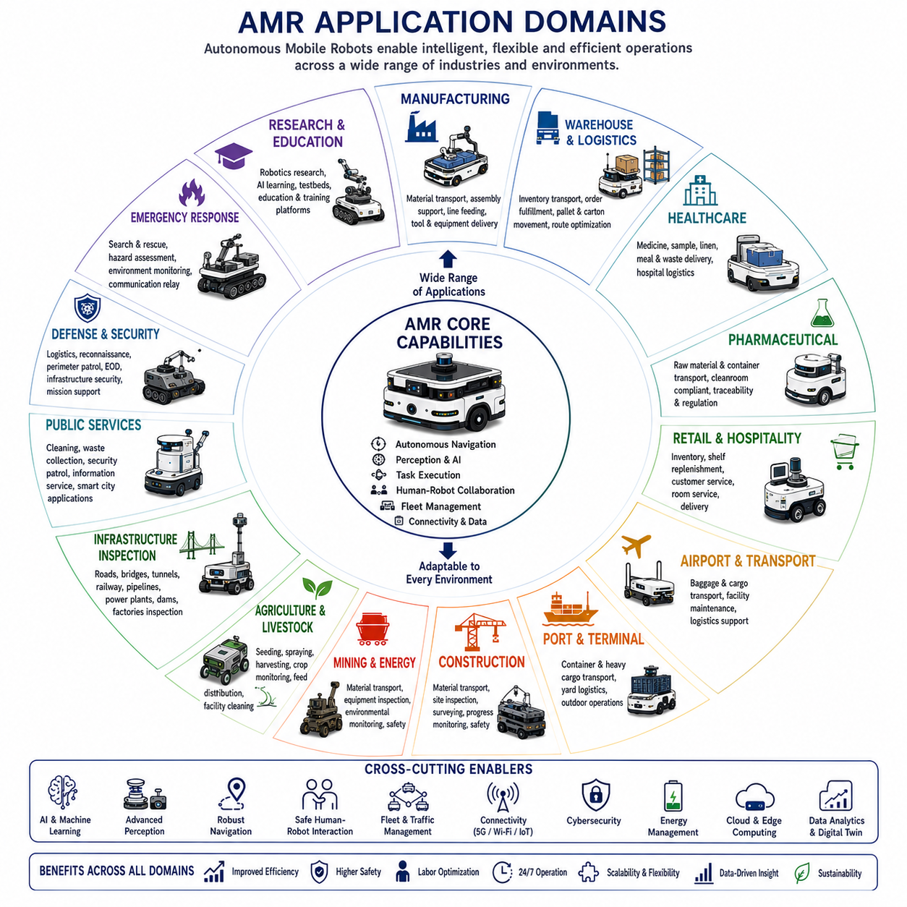

**Volume 01. AMR Foundations and System Architecture**


# 01. What is AMR · AMR이란 무엇인가

##  

## 01.01 Definition of AMR · AMR의 정의

{width="7.268055555555556in" height="7.268055555555556in"}

An Autonomous Mobile Robot (AMR) is a mobile robotic system capable of perceiving its surroundings, estimating its own position, planning movement, avoiding obstacles, and completing assigned missions with limited direct human control. Unlike machines that follow only fixed mechanical paths, an AMR continuously interprets environmental information and selects an appropriate route according to current conditions, operational goals, and safety constraints.

The term autonomous describes the robot's ability to make local operational decisions without requiring an operator to command every movement. Autonomy does not mean that the robot acts without rules or supervision. An AMR operates within defined mission boundaries, safety policies, maps, traffic rules, access permissions, and system-level constraints established by designers, facility managers, fleet controllers, and regulatory requirements.

Mobility refers to the robot's physical ability to move through an environment using wheels, tracks, steering mechanisms, suspension systems, or other locomotion structures. Most industrial AMRs use wheeled platforms because they provide high energy efficiency, controllability, mechanical simplicity, and sufficient payload capacity. The mechanical configuration may include differential drive, omnidirectional wheels, Ackermann steering, four-wheel steering, or multi-axle outdoor platforms.

The robot element means that the machine combines sensing, computation, control, actuation, and communication into a coordinated physical system. An AMR is therefore not merely a powered cart with navigation software. It is an integrated cyber-physical system in which mechanical design, electrical power, embedded computing, sensors, control software, artificial intelligence, communication networks, and safety functions operate as one product.

A fundamental characteristic of an AMR is environment-aware navigation. The robot receives data from sensors such as LiDAR, cameras, depth cameras, radar, ultrasonic sensors, inertial measurement units, wheel encoders, GNSS receivers, and safety scanners. These observations are transformed into information about free space, obstacles, surfaces, people, vehicles, infrastructure, and the robot's own motion.

Localization allows the AMR to estimate where it is within a map or operational area. Depending on the application, localization may use wheel odometry, scan matching, visual features, LiDAR-based simultaneous localization and mapping, fiducial markers, magnetic landmarks, GNSS, real-time kinematic positioning, inertial navigation, or combinations of several methods. Reliable localization is essential because every route decision depends on an accurate understanding of the robot's pose.

Mapping provides the spatial representation used by the robot to understand and navigate its environment. A map may contain walls, lanes, shelves, doors, elevators, docking stations, restricted zones, charging locations, road boundaries, slopes, landmarks, and semantic information. Some AMRs operate with maps created during installation, while others update their maps continuously as the environment changes.

Path planning determines how the robot should travel from its current position to a destination. Global planning selects a route across the larger map, while local planning adjusts the trajectory in response to nearby obstacles and dynamic conditions. A capable AMR can slow down, stop, detour, replan, wait, yield, or request assistance when its original path becomes unsafe or unavailable.

Obstacle avoidance distinguishes an AMR from simpler mobile automation systems that depend heavily on fixed routes. The robot continuously monitors its surroundings and modifies its motion to prevent collisions. However, obstacle avoidance is not simply steering around every detected object. The system must consider braking distance, payload, vehicle dimensions, sensor uncertainty, human movement, traffic rules, and the possibility that stopping may be safer than detouring.

Mission execution gives movement a practical operational purpose. An AMR may transport materials, tow carts, carry shelves, deliver medicine, inspect equipment, patrol facilities, support construction work, move tools, collect data, or position a robotic arm. A mission often contains multiple steps such as receiving a task, traveling to a station, docking, exchanging data, performing work, confirming completion, and proceeding to the next destination.

AMRs are commonly distinguished from Automated Guided Vehicles (AGVs), although the boundary is not always absolute. A traditional AGV usually follows predefined physical or virtual guidance such as magnetic tape, wires, reflectors, markers, or fixed lanes. An AMR generally uses richer sensing and onboard intelligence to localize within a broader environment and to adapt its route when conditions change.

This distinction should not be treated as a simple judgment that AMRs are always better than AGVs. Fixed-route systems can be highly reliable, predictable, inexpensive, and suitable for stable production environments. AMRs provide greater flexibility when layouts change, routes are shared with people, destinations vary, or infrastructure modifications must be minimized. The correct choice depends on the use case, risk level, operational complexity, and lifecycle cost.

An AMR may operate indoors, outdoors, or across mixed environments. Indoor AMRs usually navigate smooth floors, narrow aisles, elevators, doors, production lines, and human workspaces. Outdoor AMRs must additionally handle uneven terrain, slopes, rain, dust, sunlight, temperature variation, vegetation, road traffic, degraded communications, and positioning conditions that may change between open sky and obstructed areas.

The level of autonomy varies widely among AMR products. Some robots autonomously navigate only between predefined stations, while humans manage loading and unloading. More advanced systems can identify objects, manipulate materials, coordinate with machinery, inspect equipment, select task sequences, recover from certain failures, and optimize operations across fleets. Autonomy should therefore be evaluated by function rather than assumed from the product name alone.

Operational autonomy can be understood as the combination of perception, decision-making, control, recovery, and mission management. A robot that can move independently but requires frequent human intervention after minor disturbances has limited practical autonomy. A highly useful AMR must handle common environmental variations, temporary blockages, localization uncertainty, charging needs, communication interruptions, and routine operational exceptions.

Safety is part of the AMR definition rather than an optional additional feature. Autonomous motion in spaces shared with people and equipment creates risks that must be controlled through mechanical design, safety-rated sensors, emergency stops, braking systems, speed limits, protective fields, fault monitoring, safe control logic, warning devices, and validated operating procedures. A robot is not truly operationally autonomous if it cannot maintain an acceptable level of safety.

The safety architecture is often separated from the high-performance autonomy architecture. Artificial intelligence and perception software may provide rich environmental understanding, but certified safety functions typically rely on independently monitored components and deterministic protective behavior. This separation ensures that a failure in advanced navigation or AI software does not automatically remove the robot's essential collision-prevention capability.

An AMR also requires a reliable power system. Batteries, battery management systems, power distribution units, motor drives, DC conversion modules, charging interfaces, thermal management, and energy monitoring determine how long the robot can operate and how safely it can deliver its mission. Energy autonomy includes not only battery capacity but also the ability to schedule charging and return to operation with minimal human assistance.

Automatic charging is an important feature in many AMR systems. The robot may monitor its state of charge, estimate remaining mission energy, reserve sufficient power for safe return, navigate to a charger, dock accurately, initiate charging, and resume interrupted work. In fleet operations, charging decisions must be coordinated to prevent congestion, unbalanced utilization, or excessive numbers of robots becoming unavailable at the same time.

Communication connects the AMR to operators, fleet managers, enterprise systems, machines, doors, elevators, chargers, and cloud services. Wi-Fi, private cellular networks, Ethernet, industrial protocols, and message-oriented middleware may all be used. The robot should continue essential safe behavior when communication is temporarily unavailable, because network connectivity cannot be assumed to be perfectly reliable.

A fleet management system coordinates multiple AMRs at a higher operational level. It assigns missions, manages traffic, prevents route conflicts, distributes workload, monitors status, schedules charging, records performance, and interfaces with warehouse, manufacturing, hospital, or enterprise software. Individual AMR autonomy and fleet-level coordination must work together, because a locally optimal action may create congestion or inefficiency for the overall system.

The onboard computing architecture typically includes several layers. Low-level controllers manage motors, brakes, steering, battery signals, and safety interfaces. Real-time computers execute localization, motion control, and navigation. More powerful processors or GPUs may support perception, deep learning, inspection, language interaction, and complex planning. Clear interfaces between these layers improve reliability, maintainability, and product scalability.

Software is usually organized into functional modules that exchange well-defined data. These modules may include device drivers, sensor synchronization, localization, mapping, perception, planning, control, diagnostics, mission execution, fleet communication, logging, cybersecurity, and user interfaces. Middleware such as ROS 2 is widely used in development because it supports distributed components, standardized messages, modular testing, and integration across diverse hardware.

An AMR should be understood through its complete functional architecture rather than through one highly visible technology such as LiDAR or artificial intelligence. A robot with excellent perception but poor braking, weak mechanical design, unstable power, inaccurate control, or unreliable software cannot provide dependable autonomy. Product performance emerges from balanced system engineering across all hardware and software domains.

Payload is another defining design parameter. Some AMRs carry lightweight documents, medicine, or small packages, while others transport pallets, tow carts, move large industrial assemblies, or support robotic manipulators. Increased payload affects chassis strength, motor torque, braking distance, battery consumption, stability, suspension, tire selection, docking accuracy, and safety-zone design. Payload capability therefore cannot be evaluated independently from the overall platform.

AMRs can be designed for transportation, towing, lifting, manipulation, inspection, surveillance, service, or multi-purpose operation. A transport AMR emphasizes load capacity and logistics interfaces. An inspection AMR emphasizes sensor positioning, data quality, repeatability, and mission coverage. A mobile manipulator combines navigation with a robotic arm and requires accurate docking, base stability, reachability analysis, and coordinated motion control.

The operating environment strongly influences the definition of an appropriate AMR. A hospital robot must consider hygiene, quiet operation, human interaction, elevators, secure compartments, and patient safety. A factory robot must integrate with production equipment and industrial traffic. An outdoor inspection robot requires weather protection, terrain capability, long-range communication, and robust localization. The same generic AMR architecture cannot be applied unchanged to every domain.

Autonomy also depends on environmental infrastructure. Although AMRs reduce dependence on fixed guidance, they often benefit from maps, markers, charging stations, wireless networks, standardized docking interfaces, controlled traffic rules, and digital facility information. Effective deployment therefore involves designing both the robot and the operational environment. A completely infrastructure-free system is rarely necessary or economically optimal.

Adaptability is one of the main business advantages of AMRs. Routes, stations, missions, and priorities can often be modified through software instead of rebuilding physical guidance infrastructure. This allows factories, warehouses, hospitals, and public facilities to respond more quickly to layout changes, product variation, seasonal demand, and new workflows. Nevertheless, flexibility must be controlled through configuration management and validation.

Reliability determines whether an AMR can function as production equipment rather than as a demonstration platform. Reliable operation requires robust hardware, stable localization, predictable control, fault detection, graceful degradation, diagnostic logging, maintainable software, spare-part planning, and clear recovery procedures. The meaningful measure of autonomy is not a short successful demonstration but sustained performance over thousands of missions.

Maintainability must be considered from the beginning of system design. Sensors need accessible mounting and repeatable calibration. Batteries and drive components need service procedures. Software must support logs, remote diagnosis, controlled updates, rollback, and configuration tracking. A technically advanced AMR that is difficult to repair or diagnose may produce unacceptable downtime and operational cost.

Scalability means that the AMR architecture can support different payload classes, sensor packages, computing levels, application modules, and fleet sizes without complete redesign. Platform-based development allows common mechanical, electrical, and software components to be reused across product families. This reduces engineering cost, simplifies manufacturing, and creates a consistent operational ecosystem.

Cybersecurity has become an essential part of AMR autonomy because robots are connected physical machines. Unauthorized access can affect mission data, maps, software updates, fleet commands, cameras, or physical motion. Secure identity, encrypted communication, access control, signed software, network segmentation, vulnerability management, and incident response are necessary to protect both information and physical operations.

Data is generated throughout AMR operation. Sensor recordings, maps, trajectories, battery status, fault codes, mission histories, intervention events, and environmental observations can support debugging, optimization, predictive maintenance, and AI model development. However, data collection must consider storage capacity, communication cost, privacy, security, ownership, and the practical value of each recorded signal.

Artificial intelligence expands AMR capability but does not replace classical robotics. Deep learning may improve perception, language grounding, anomaly detection, terrain understanding, and behavior prediction. Classical estimation, control, planning, safety logic, and system engineering remain essential because they provide mathematical structure, real-time predictability, and verifiable behavior. Effective AMRs combine both approaches.

Human interaction remains important even in highly autonomous systems. Operators assign goals, supervise operations, respond to exceptional conditions, perform maintenance, and improve workflows. Good AMR design presents clear status information, understandable alarms, intuitive mission controls, and safe methods for manual recovery. The objective is not to remove humans entirely but to reduce repetitive intervention while preserving appropriate oversight.

An AMR is therefore best defined as an integrated mobile robotic platform that can perceive its environment, localize itself, plan and control motion, manage missions, respond to change, communicate with surrounding systems, and maintain safe operation within a defined operational domain. Its autonomy emerges from coordinated system capabilities rather than from a single algorithm, sensor, or marketing label.

From a product perspective, the definition must also include lifecycle capability. A complete AMR product is specified, designed, manufactured, validated, deployed, monitored, maintained, updated, and eventually retired through controlled engineering processes. Prototype autonomy demonstrates technical possibility, while product autonomy demonstrates safety, reliability, maintainability, scalability, cybersecurity, and economic value under real operating conditions.

The future AMR will increasingly combine mobile autonomy with embodied artificial intelligence, richer world models, natural-language interaction, fleet learning, digital twins, and autonomous adaptation. Even as these capabilities advance, the fundamental definition will remain stable: an AMR is a mobile cyber-physical system that understands enough of its environment and mission context to move and work safely without continuous direct control.

자율이동로봇(Autonomous Mobile Robot, AMR)은 주변 환경을 인식하고, 자신의 위치를 추정하며, 이동 경로를 계획하고, 장애물을 회피하며, 사람의 지속적인 직접 제어 없이도 주어진 임무를 수행할 수 있는 이동형 로봇 시스템이다. 고정된 기계적 경로만 따라가는 장비와 달리, 자율이동로봇은 환경 정보를 지속적으로 해석하고 현재 상황, 작업 목표, 안전 조건에 따라 적절한 이동 경로를 스스로 선택한다.

자율성(Autonomy)이란 사람이 모든 움직임을 직접 명령하지 않아도 로봇이 지역적인 운용 의사결정을 수행할 수 있는 능력을 의미한다. 그러나 자율성이 아무런 규칙이나 감독 없이 자유롭게 행동한다는 뜻은 아니다. 자율이동로봇은 설계자, 시설 관리자, 플릿 제어 시스템(Fleet Control System), 관련 규정이 정의한 임무 범위, 안전 정책, 지도(Map), 교통 규칙, 접근 권한, 시스템 제약 조건 안에서 운용된다.

이동성(Mobility)은 바퀴, 무한궤도, 조향 장치, 서스펜션, 기타 이동 메커니즘을 이용하여 실제 환경을 주행하는 능력을 의미한다. 대부분의 산업용 자율이동로봇은 높은 에너지 효율, 우수한 제어 성능, 단순한 기계 구조, 충분한 적재 능력을 제공하는 바퀴 기반 플랫폼(Wheeled Platform)을 사용한다. 기계 구조는 차동 구동(Differential Drive), 전방향 바퀴(Omnidirectional Wheel), 애커먼 조향(Ackermann Steering), 사륜 조향(Four-wheel Steering), 다축 실외 플랫폼(Multi-axle Outdoor Platform) 등 다양한 형태를 가진다.

로봇(Robot)이라는 개념은 센싱(Sensing), 계산(Computation), 제어(Control), 구동(Actuation), 통신(Communication)을 하나의 통합된 물리 시스템으로 결합한다는 의미를 가진다. 따라서 자율이동로봇은 단순히 내비게이션 소프트웨어가 탑재된 전동 운반차가 아니라 기계 설계(Mechanical Design), 전력 시스템(Electrical Power), 임베디드 컴퓨팅(Embedded Computing), 센서(Sensor), 제어 소프트웨어(Control Software), 인공지능(Artificial Intelligence), 통신 네트워크(Communication Network), 안전 기능(Safety Function)이 하나의 제품으로 통합된 사이버-물리 시스템(Cyber-physical System)이다.

자율이동로봇의 가장 중요한 특징 가운데 하나는 환경 인식 기반 내비게이션(Environment-aware Navigation)이다. 로봇은 라이다(LiDAR), 카메라(Camera), 깊이 카메라(Depth Camera), 레이더(Radar), 초음파 센서(Ultrasonic Sensor), 관성측정장치(Inertial Measurement Unit, IMU), 휠 엔코더(Wheel Encoder), GNSS 수신기(GNSS Receiver), 안전 스캐너(Safety Scanner) 등 다양한 센서로부터 데이터를 수집한다. 이러한 관측 정보는 자유 공간(Free Space), 장애물(Obstacle), 지면(Surface), 사람(Person), 차량(Vehicle), 시설(Infrastructure), 로봇 자신의 움직임에 대한 정보로 변환된다.

위치추정(Localization)은 로봇이 지도(Map) 또는 운용 공간 내에서 자신의 위치를 계산하는 기능이다. 적용 환경에 따라 휠 오도메트리(Wheel Odometry), 스캔 매칭(Scan Matching), 비전 특징(Visual Feature), 라이다 기반 동시 위치추정 및 지도작성(LiDAR-based Simultaneous Localization and Mapping, SLAM), 마커(Fiducial Marker), 자기 랜드마크(Magnetic Landmark), GNSS, 실시간 이동측위(Real-time Kinematic Positioning, RTK), 관성항법(Inertial Navigation) 등을 단독 또는 복합적으로 활용한다. 정확한 위치추정은 모든 경로 계획과 주행 판단의 기반이 된다.

지도작성(Mapping)은 로봇이 환경을 이해하고 이동하기 위한 공간 표현을 제공한다. 지도에는 벽(Wall), 주행 차선(Lane), 선반(Shelf), 문(Door), 엘리베이터(Elevator), 도킹 스테이션(Docking Station), 제한 구역(Restricted Zone), 충전 위치(Charging Location), 도로 경계(Road Boundary), 경사(Slope), 랜드마크(Landmark), 의미 정보(Semantic Information) 등이 포함될 수 있다. 일부 자율이동로봇은 설치 시 생성한 지도를 사용하고, 다른 시스템은 환경 변화에 따라 지도를 지속적으로 갱신한다.

경로 계획(Path Planning)은 현재 위치에서 목적지까지 어떻게 이동할 것인지를 결정하는 기능이다. 전역 경로 계획(Global Planning)은 전체 지도에서 최적의 이동 경로를 선택하고, 지역 경로 계획(Local Planning)은 주변 장애물과 실시간 환경 변화에 대응하여 주행 궤적을 수정한다. 우수한 자율이동로봇은 위험 상황에서 감속, 정지, 우회, 재계획(Replanning), 대기(Yield), 지원 요청(Request Assistance) 등을 스스로 수행할 수 있다.

장애물 회피(Obstacle Avoidance)는 단순한 이동 자동화 장비와 자율이동로봇을 구분하는 핵심 기능이다. 로봇은 주변 환경을 지속적으로 감시하면서 충돌을 방지하기 위해 이동을 조정한다. 그러나 장애물 회피는 단순히 모든 물체를 우회하는 기능이 아니다. 제동 거리(Braking Distance), 적재 중량(Payload), 차량 크기(Vehicle Dimension), 센서 불확실성(Sensor Uncertainty), 사람의 움직임(Human Motion), 교통 규칙(Traffic Rule), 우회보다 정지가 더 안전한 상황까지 함께 고려해야 한다.

임무 수행(Mission Execution)은 이동 자체를 실제 작업과 연결하는 기능이다. 자율이동로봇은 자재 운반(Material Transport), 카트 견인(Cart Towing), 선반 운송(Shelf Transport), 의약품 배송(Medicine Delivery), 설비 검사(Equipment Inspection), 순찰(Patrol), 건설 지원(Construction Support), 공구 운반(Tool Transport), 데이터 수집(Data Collection), 로봇 암(Robot Arm) 위치 제어 등 다양한 작업을 수행할 수 있다. 하나의 임무는 작업 수신(Task Reception), 이동, 도킹(Docking), 데이터 교환(Data Exchange), 작업 수행, 완료 확인, 다음 목적지 이동과 같은 여러 단계로 구성된다.

자율이동로봇은 자동유도차량(Automated Guided Vehicle, AGV)과 자주 비교되지만 두 시스템의 경계가 항상 절대적인 것은 아니다. 전통적인 자동유도차량은 자기 테이프(Magnetic Tape), 유도선(Wire), 반사판(Reflector), 마커(Marker), 고정 차선(Fixed Lane)과 같은 사전 정의된 안내 구조를 따라 이동한다. 반면 자율이동로봇은 더욱 풍부한 센서와 온보드 지능(Onboard Intelligence)을 이용하여 넓은 환경에서 위치를 추정하고 환경 변화에 따라 경로를 유연하게 변경한다.

그러나 이러한 차이를 단순히 자율이동로봇이 자동유도차량보다 항상 우수하다는 의미로 해석해서는 안 된다. 고정 경로 기반 시스템은 매우 높은 신뢰성, 예측 가능성, 낮은 구축 비용을 제공하며 생산 환경이 거의 변하지 않는 경우에는 매우 효과적이다. 자율이동로봇은 시설 배치가 자주 변경되거나, 사람과 이동 공간을 공유하거나, 목적지가 계속 바뀌거나, 추가 인프라 구축을 최소화해야 하는 환경에서 더욱 큰 장점을 제공한다. 적절한 선택은 사용 사례(Use Case), 위험 수준(Risk Level), 운용 복잡도(Operational Complexity), 생애주기 비용(Lifecycle Cost)에 따라 결정된다.

자율이동로봇은 실내(Indoor), 실외(Outdoor), 또는 혼합 환경(Mixed Environment)에서 운용될 수 있다. 실내용 자율이동로봇은 평탄한 바닥, 좁은 통로, 엘리베이터, 자동문, 생산 라인, 사람과 함께 사용하는 작업 공간에서 주행한다. 반면 실외 자율이동로봇은 비포장 지형(Uneven Terrain), 경사(Slope), 비(Rain), 먼지(Dust), 강한 햇빛(Sunlight), 온도 변화(Temperature Variation), 식생(Vegetation), 차량 통행(Road Traffic), 불안정한 통신, 다양한 위치추정 조건까지 고려해야 한다.

자율성 수준(Level of Autonomy)은 제품마다 매우 다양하다. 일부 로봇은 지정된 정거장 사이만 자율적으로 이동하고 적재와 하역은 사람이 수행한다. 보다 발전된 시스템은 물체를 인식하고, 자재를 조작하며, 설비와 협업하고, 검사 작업을 수행하며, 임무 순서를 최적화하고, 일부 장애 상황에서도 스스로 복구할 수 있다. 따라서 자율성은 제품 이름이 아니라 실제 기능을 기준으로 평가해야 한다.

운용 자율성(Operational Autonomy)은 인지(Perception), 의사결정(Decision-making), 제어(Control), 복구(Recovery), 임무 관리(Mission Management)가 결합된 결과이다. 독립적으로 이동할 수 있지만 작은 장애에도 사람의 개입이 필요한 로봇은 실제 운용 측면에서는 높은 자율성을 가진다고 보기 어렵다. 우수한 자율이동로봇은 환경 변화, 일시적인 장애물, 위치 오차, 충전 요구, 통신 장애, 일반적인 운용 예외 상황을 스스로 처리할 수 있어야 한다.

안전(Safety)은 자율이동로봇 정의의 핵심 요소이며 선택 사항이 아니다. 사람과 장비가 함께 존재하는 공간에서 자율적으로 이동하기 때문에 기계 설계(Mechanical Design), 안전 인증 센서(Safety-rated Sensor), 비상정지(Emergency Stop), 제동 시스템(Braking System), 속도 제한(Speed Limit), 보호 구역(Protective Field), 고장 감시(Fault Monitoring), 안전 제어(Safe Control Logic), 경고 장치(Warning Device), 검증된 운용 절차(Validated Operating Procedure)를 통해 위험을 관리해야 한다. 안전을 유지하지 못하는 로봇은 진정한 자율성을 갖춘 시스템이라고 할 수 없다.

안전 구조(Safety Architecture)는 일반적으로 고성능 자율주행 구조와 분리되어 설계된다. 인공지능과 인지 소프트웨어는 풍부한 환경 이해를 제공하지만, 안전 인증 기능은 독립적으로 감시되는 하드웨어와 결정론적인 보호 동작(Deterministic Protective Behavior)에 의해 수행된다. 이러한 구조는 고급 내비게이션이나 인공지능 소프트웨어에 문제가 발생하더라도 필수적인 충돌 방지 기능이 유지되도록 보장한다.

자율이동로봇은 안정적인 전력 시스템(Power System)도 반드시 필요하다. 배터리(Battery), 배터리 관리 시스템(Battery Management System, BMS), 전력 분배 장치(Power Distribution Unit), 모터 드라이버(Motor Driver), DC 변환기(DC Conversion Module), 충전 인터페이스(Charging Interface), 열 관리(Thermal Management), 에너지 모니터링(Energy Monitoring)은 운용 시간과 안전성에 직접적인 영향을 준다. 에너지 자율성(Energy Autonomy)은 배터리 용량뿐 아니라 충전 시점을 스스로 판단하고 최소한의 사람 개입으로 작업을 재개하는 능력까지 포함한다.

자동 충전(Automatic Charging)은 많은 자율이동로봇에서 매우 중요한 기능이다. 로봇은 배터리 잔량(State of Charge)을 모니터링하고, 남은 작업 가능 에너지를 예측하며, 안전 복귀를 위한 최소 전력을 확보한 후 충전기로 이동하여 정확하게 도킹하고 충전을 시작한 뒤 작업을 자동으로 재개한다. 다수의 로봇이 동시에 운용되는 경우에는 충전 혼잡과 가동률 저하를 방지하기 위한 플릿 수준의 충전 관리가 필요하다.

통신(Communication)은 자율이동로봇과 운용자, 플릿 관리자, 기업 시스템, 생산 설비, 자동문, 엘리베이터, 충전기, 클라우드 서비스를 연결한다. Wi-Fi, 전용 셀룰러 네트워크(Private Cellular Network), 이더넷(Ethernet), 산업용 통신 프로토콜(Industrial Protocol), 메시지 기반 미들웨어(Message-oriented Middleware) 등이 활용될 수 있다. 또한 네트워크가 일시적으로 끊기더라도 필수적인 안전 기능은 항상 유지되어야 한다.

플릿 관리 시스템(Fleet Management System)은 여러 대의 자율이동로봇을 통합적으로 운영한다. 임무 배정(Mission Assignment), 교통 관리(Traffic Management), 경로 충돌 방지(Route Conflict Prevention), 작업 분배(Workload Distribution), 상태 모니터링(Status Monitoring), 충전 스케줄링(Charging Scheduling), 성능 분석(Performance Monitoring), 창고 관리 시스템(Warehouse Management System), 생산 관리 시스템(Manufacturing Execution System), 병원 정보 시스템(Hospital Information System) 등과 연동된다. 개별 로봇의 자율성과 플릿 수준의 최적화는 동시에 고려되어야 한다.

온보드 컴퓨팅 구조(Onboard Computing Architecture)는 일반적으로 여러 계층으로 구성된다. 저수준 제어기(Low-level Controller)는 모터, 브레이크, 조향, 배터리, 안전 인터페이스를 관리하며, 실시간 컴퓨터(Real-time Computer)는 위치추정, 이동 제어, 내비게이션을 수행한다. 보다 강력한 프로세서(Processer)와 GPU는 인지, 딥러닝, 검사, 자연어 상호작용, 복잡한 계획 기능을 수행한다. 이러한 계층 간 명확한 인터페이스는 신뢰성, 유지보수성, 확장성을 향상시킨다.

소프트웨어는 일반적으로 기능별 모듈(Functional Module)로 구성된다. 장치 드라이버(Device Driver), 센서 동기화(Sensor Synchronization), 위치추정(Localization), 지도작성(Mapping), 인지(Perception), 경로 계획(Planning), 제어(Control), 진단(Diagnostics), 임무 수행(Mission Execution), 플릿 통신(Fleet Communication), 로그(Log), 사이버보안(Cybersecurity), 사용자 인터페이스(User Interface) 등이 서로 정의된 데이터 구조를 통해 통신한다. ROS 2와 같은 미들웨어(Middleware)는 분산 구조와 표준 메시지를 제공하여 다양한 하드웨어 통합을 지원한다.

자율이동로봇은 특정 기술 하나가 아니라 전체 기능 구조(Function Architecture)를 기준으로 이해해야 한다. 뛰어난 인지 성능만으로는 완전한 자율성을 제공할 수 없다. 제동 성능, 기계 구조, 전력 시스템, 제어 정확도, 소프트웨어 안정성까지 균형 있게 설계되어야만 실제 제품 수준의 자율성을 확보할 수 있다.

적재 능력(Payload)은 자율이동로봇을 정의하는 중요한 설계 요소이다. 일부 로봇은 문서, 의약품, 소형 화물을 운반하고, 다른 로봇은 팔레트(Pallet), 대형 산업 부품, 견인 카트(Towing Cart), 로봇 암을 함께 운반한다. 적재 중량이 증가하면 차체 강성, 모터 토크, 제동 거리, 배터리 소비, 안정성, 서스펜션, 타이어, 도킹 정밀도, 안전 구역 설계까지 모두 영향을 받기 때문에 전체 시스템 관점에서 평가해야 한다.

자율이동로봇은 운반(Transportation), 견인(Towing), 리프팅(Lifting), 조작(Manipulation), 검사(Inspection), 감시(Surveillance), 서비스(Service), 다목적 운용(Multi-purpose Operation) 등 다양한 형태로 설계될 수 있다. 운반형 로봇은 적재 능력과 물류 인터페이스를 강조하고, 검사형 로봇은 센서 위치, 데이터 품질, 반복 정밀도, 검사 범위를 중요하게 고려한다. 이동형 매니퓰레이터(Mobile Manipulator)는 내비게이션과 로봇 암을 결합하므로 정확한 도킹과 안정성이 필수적이다.

운용 환경(Operating Environment)은 적절한 자율이동로봇을 정의하는 중요한 요소이다. 병원용 로봇은 위생(Hygiene), 저소음(Low Noise), 사람과의 상호작용(Human Interaction), 엘리베이터, 보안 수납함 등을 고려해야 한다. 공장용 로봇은 생산 설비와 산업용 교통 체계와의 연동이 중요하며, 실외 검사 로봇은 방수·방진(Weather Protection), 험지 주행(Terrain Capability), 장거리 통신, 강인한 위치추정이 요구된다. 따라서 하나의 동일한 구조를 모든 산업에 그대로 적용할 수는 없다.

자율성은 환경 인프라(Environmental Infrastructure)의 영향을 함께 받는다. 자율이동로봇은 고정 유도 장치에 대한 의존도를 줄이지만 지도(Map), 마커(Marker), 충전기(Charging Station), 무선 네트워크(Wireless Network), 표준 도킹 인터페이스(Standard Docking Interface), 디지털 시설 정보(Digital Facility Information)와 함께 운용될 때 더욱 높은 성능을 발휘한다. 따라서 성공적인 구축은 로봇뿐 아니라 운용 환경도 함께 설계하는 과정이다.

적응성(Adaptability)은 자율이동로봇의 가장 큰 비즈니스 장점 가운데 하나이다. 이동 경로(Route), 작업 위치(Station), 임무(Mission), 우선순위(Priority)는 물리적인 인프라를 변경하지 않고도 소프트웨어만으로 수정할 수 있는 경우가 많다. 이를 통해 공장, 물류센터, 병원, 공공시설은 시설 변경, 계절 수요 변화, 새로운 작업 흐름에 빠르게 대응할 수 있다. 다만 이러한 유연성도 체계적인 구성 관리(Configuration Management)와 검증(Validation)을 기반으로 운영되어야 한다.

신뢰성(Reliability)은 자율이동로봇이 연구용 시제품이 아니라 실제 생산 설비가 되기 위한 핵심 조건이다. 견고한 하드웨어, 안정적인 위치추정, 예측 가능한 제어, 고장 감지(Fault Detection), 성능 저하 운용(Graceful Degradation), 진단 로그(Diagnostic Logging), 유지보수 가능한 소프트웨어, 예비 부품 계획(Spare-part Planning), 명확한 복구 절차가 모두 필요하다. 진정한 자율성은 짧은 시연이 아니라 수천 번의 임무를 안정적으로 수행하는 능력으로 평가된다.

유지보수성(Maintainability)은 초기 설계 단계부터 고려되어야 한다. 센서는 쉽게 접근할 수 있어야 하며 반복 가능한 보정(Calibration)이 가능해야 한다. 배터리와 구동 장치는 효율적인 정비 절차를 가져야 하고, 소프트웨어는 로그(Log), 원격 진단(Remote Diagnosis), 안전한 업데이트(Update), 롤백(Rollback), 설정 관리(Configuration Tracking)를 지원해야 한다. 아무리 뛰어난 기술이라도 유지보수가 어렵다면 실제 운용 비용은 크게 증가한다.

확장성(Scalability)은 동일한 플랫폼이 다양한 적재 능력, 센서 구성, 컴퓨팅 성능, 응용 모듈, 플릿 규모를 지원할 수 있는 능력을 의미한다. 플랫폼 기반 개발(Platform-based Development)은 기계, 전기, 소프트웨어 구성 요소를 여러 제품군에서 공통으로 사용할 수 있도록 하여 개발 비용을 줄이고 생산성과 운용 효율을 향상시킨다.

사이버보안(Cybersecurity)은 연결된 물리 시스템인 자율이동로봇에서 매우 중요한 요소이다. 무단 접근은 임무 데이터, 지도, 소프트웨어 업데이트, 플릿 명령, 카메라, 실제 주행까지 영향을 줄 수 있다. 안전한 신원 인증(Secure Identity), 암호화 통신(Encrypted Communication), 접근 제어(Access Control), 전자서명 소프트웨어(Signed Software), 네트워크 분리(Network Segmentation), 취약점 관리(Vulnerability Management), 사고 대응(Incident Response)이 반드시 필요하다.

자율이동로봇은 운용 과정에서 매우 많은 데이터를 생성한다. 센서 기록(Sensor Recording), 지도(Map), 이동 궤적(Trajectory), 배터리 상태(Battery Status), 고장 코드(Fault Code), 임무 이력(Mission History), 사람 개입 기록(Intervention Event), 환경 관측(Environmental Observation)은 디버깅(Debugging), 성능 최적화(Optimization), 예지보전(Predictive Maintenance), 인공지능 모델 개발에 활용될 수 있다. 그러나 데이터 저장 공간, 통신 비용, 개인정보 보호, 보안, 데이터 소유권도 함께 고려해야 한다.

인공지능(Artificial Intelligence)은 자율이동로봇의 기능을 크게 향상시키지만 기존 로봇공학(Classical Robotics)을 대체하지는 않는다. 딥러닝(Deep Learning)은 인지, 언어 이해(Language Grounding), 이상 탐지(Anomaly Detection), 지형 이해(Terrain Understanding), 행동 예측(Behavior Prediction)을 향상시킬 수 있다. 반면 추정(Estimation), 제어(Control), 경로 계획(Planning), 안전 논리(Safety Logic), 시스템 공학(System Engineering)은 여전히 실시간성과 검증 가능성을 제공하는 핵심 기술이다. 성공적인 자율이동로봇은 두 접근법을 균형 있게 결합한다.

사람과의 상호작용(Human Interaction)은 고도의 자율 시스템에서도 여전히 매우 중요하다. 운용자는 임무를 부여하고, 전체 시스템을 감독하며, 예외 상황에 대응하고, 유지보수를 수행하며, 작업 절차를 개선한다. 우수한 자율이동로봇은 명확한 상태 정보(Status Information), 이해하기 쉬운 경고(Alarm), 직관적인 임무 제어(Mission Control), 안전한 수동 복구(Manual Recovery)를 제공해야 한다. 목표는 사람을 완전히 제거하는 것이 아니라 반복적인 개입을 줄이고 적절한 감독을 유지하는 것이다.

따라서 자율이동로봇은 주변 환경을 인식하고, 자신의 위치를 추정하며, 이동을 계획하고 제어하고, 임무를 수행하며, 변화에 대응하고, 주변 시스템과 통신하며, 정의된 운용 환경 안에서 안전하게 작업을 수행할 수 있는 통합 이동형 로봇 플랫폼으로 정의할 수 있다. 이러한 자율성은 하나의 알고리즘이나 센서가 아니라 시스템 전체가 조화롭게 동작할 때 비로소 구현된다.

제품(Product) 관점에서 자율이동로봇의 정의는 생애주기(Lifecycle)까지 포함해야 한다. 완전한 자율이동로봇 제품은 요구사항 정의(Requirement Definition), 설계(Design), 제조(Manufacturing), 검증(Validation), 구축(Deployment), 모니터링(Monitoring), 유지보수(Maintenance), 업데이트(Update), 폐기(Retirement)에 이르기까지 체계적인 공학 프로세스를 거친다. 연구용 시제품은 기술 가능성을 보여주지만, 제품 수준의 자율성은 실제 환경에서 안전성, 신뢰성, 유지보수성, 확장성, 사이버보안, 경제성을 모두 만족해야 한다.

미래의 자율이동로봇은 이동 자율성(Mobile Autonomy)에 체화형 인공지능(Embodied Artificial Intelligence), 고도화된 월드 모델(World Model), 자연어 상호작용(Natural-language Interaction), 플릿 학습(Fleet Learning), 디지털 트윈(Digital Twin), 자율 적응(Autonomous Adaptation)을 지속적으로 결합하게 될 것이다. 그러나 이러한 기술이 발전하더라도 자율이동로봇의 본질적인 정의는 변하지 않는다. 자율이동로봇은 자신의 환경과 임무를 충분히 이해하여 사람의 지속적인 직접 제어 없이도 안전하게 이동하고 작업을 수행할 수 있는 이동형 사이버-물리 시스템(Cyber-physical System)이다.

##  

## 01.02 Core Components of AMR · AMR의 핵심 구성요소

{width="7.268055555555556in" height="7.268055555555556in"}

An Autonomous Mobile Robot is created from multiple mechanical, electrical, computational, sensing, software, communication, and safety components that must operate as one coordinated system. No single component provides autonomy by itself. Reliable AMR behavior emerges only when the chassis, drive system, sensors, computing platform, power architecture, control software, and operational interfaces are designed around common requirements.

The mechanical platform forms the physical foundation of the AMR. It includes the chassis, frame, covers, mounting structures, wheels, suspension, payload supports, bumpers, and environmental protection. The platform must withstand static loads, vibration, impact, repeated acceleration, braking forces, and long-term fatigue while preserving the alignment of sensors, motors, and docking equipment.

Chassis design determines the robot's overall dimensions, structural stiffness, center of gravity, ground clearance, turning envelope, payload capacity, and service accessibility. A lightweight chassis can improve energy efficiency, but insufficient stiffness may reduce docking accuracy and sensor calibration stability. Heavy-duty platforms require reinforced structures while avoiding unnecessary mass that increases motor and battery demands.

The locomotion system converts electrical energy into controlled physical movement. It normally includes traction motors, gearboxes, wheels, steering mechanisms, brakes, motor drivers, and feedback sensors. Depending on the mission, an AMR may use differential drive, omnidirectional drive, Ackermann steering, skid steering, four-wheel steering, or multi-axle configurations designed for rough terrain.

Drive motors must provide enough continuous torque for normal movement and sufficient peak torque for acceleration, slopes, threshold crossing, towing, and recovery. Motor selection must consider vehicle mass, payload, wheel diameter, gear ratio, maximum speed, rolling resistance, gradient, thermal limits, and duty cycle. A motor that satisfies peak torque briefly may still overheat during sustained operation.

Wheel and tire selection affects traction, vibration, energy consumption, floor damage, steering behavior, stopping distance, and positioning accuracy. Indoor robots often use polyurethane or rubber wheels optimized for smooth floors, while outdoor robots require pneumatic or durable off-road tires. Tire deformation and slip must be considered because they influence odometry and motion control.

The braking system provides controlled deceleration, parking stability, and emergency stopping capability. Brakes may be integrated into motors or installed as independent mechanical devices. The design must account for maximum vehicle mass, slope holding, power loss, emergency conditions, and stopping distance. Safety-related braking should remain effective even when the main autonomy computer fails.

The power system supplies stable electrical energy to every AMR subsystem. It typically consists of a battery pack, battery management system, contactors, fuses, circuit breakers, power distribution units, DC-DC converters, charging circuits, and energy monitoring devices. The architecture must isolate faults and prevent a failure in one subsystem from disabling essential control or safety functions.

Lithium-ion and lithium iron phosphate batteries are commonly used because they provide practical combinations of energy density, cycle life, charging performance, and safety. Battery capacity must be selected from actual mission energy rather than nominal driving time alone. Computing, sensors, payload devices, communication equipment, cooling, standby operation, and environmental conditions also consume significant energy.

The battery management system monitors cell voltage, current, temperature, state of charge, state of health, and abnormal operating conditions. It protects the battery from overcharge, over-discharge, overcurrent, overheating, and cell imbalance. Accurate battery estimation is important because unreliable energy information can interrupt missions or prevent the robot from returning safely to a charging station.

Charging components may support manual connection, battery swapping, conductive docking, or contactless charging. Automatic charging requires more than a charger because the robot must identify the station, approach it safely, align accurately, verify electrical contact, negotiate charging conditions, and resume operation. Fleet systems must also coordinate charging demand across multiple robots.

The sensing architecture allows the AMR to observe both the external environment and its own internal state. External sensors detect obstacles, people, vehicles, free space, terrain, landmarks, and infrastructure. Internal sensors measure wheel rotation, steering angle, motor current, battery status, temperature, vibration, actuator state, and other conditions needed for control and diagnostics.

LiDAR is widely used for localization, mapping, obstacle detection, and safety monitoring. A two-dimensional LiDAR measures a horizontal scan plane and is effective in structured indoor environments. Three-dimensional LiDAR captures richer geometric information for outdoor navigation, irregular terrain, overhanging obstacles, and complex scenes, but it requires greater computing power and more sophisticated processing.

Cameras provide visual information about color, texture, symbols, objects, people, signs, and semantic context. RGB cameras support recognition and inspection, while stereo and depth cameras estimate three-dimensional structure. Camera performance is affected by lighting, glare, darkness, motion blur, contamination, and weather, so industrial systems often combine visual sensing with LiDAR or radar.

Radar provides distance and relative velocity information and remains useful in rain, fog, dust, and poor lighting. It can detect moving vehicles and large obstacles at longer ranges, although its spatial resolution may be lower than that of cameras or LiDAR. Imaging radar is increasingly important for robust outdoor AMRs operating in changing weather and traffic conditions.

Ultrasonic sensors are commonly installed around the lower body of an AMR to detect nearby objects and support docking or low-speed maneuvering. They are inexpensive and effective at short range, but their measurements depend on target angle, surface material, and environmental conditions. They are therefore normally used as complementary sensors rather than the main perception source.

Wheel encoders measure wheel rotation and provide essential information for odometry, velocity control, and fault monitoring. Encoder-based motion estimation is computationally efficient but accumulates error because of wheel slip, uneven surfaces, tire wear, and mechanical tolerances. Reliable localization combines encoder information with external observations from LiDAR, cameras, GNSS, or landmarks.

An inertial measurement unit measures angular velocity and linear acceleration. It helps estimate orientation, detect rapid motion, stabilize localization, and monitor slope or vibration. IMU data is particularly valuable during short periods when external sensors are degraded, but integration drift prevents it from providing accurate long-term position without correction from other sensing methods.

Outdoor AMRs may use GNSS and real-time kinematic positioning to obtain global location. GNSS performance is strong under open sky but degrades near buildings, trees, tunnels, and metal structures. For reliable operation, GNSS is commonly fused with IMU, wheel odometry, LiDAR localization, or visual localization so that navigation can continue through temporary signal loss.

The safety sensing system may include safety laser scanners, bumpers, emergency-stop buttons, protective switches, speed monitors, and safety-rated encoders. These devices are connected to a safety controller that operates independently from general autonomy software. The safety system supervises hazardous motion and commands a safe stop when required conditions are violated.

The onboard computing platform processes sensor data, runs navigation algorithms, manages missions, monitors system health, and communicates with external systems. An AMR may use microcontrollers for low-level control, industrial computers for real-time robotics software, and GPUs or AI accelerators for perception and learning. Computing resources must match latency, power, thermal, and reliability requirements.

Low-level controllers handle time-critical functions such as motor current, wheel velocity, steering position, brake activation, and hardware monitoring. These functions require deterministic timing and should not depend on high-level artificial intelligence software. Separating low-level control from navigation and mission functions improves stability and allows the robot to enter a safe state during computer or network faults.

The main autonomy computer executes localization, mapping, perception, path planning, motion control, and mission coordination. It receives synchronized sensor data, maintains the robot state, selects routes, generates trajectories, and sends movement commands to lower-level controllers. Its hardware and operating system must support predictable performance under maximum computational load.

AI accelerators and graphics processors are increasingly used for object detection, semantic segmentation, terrain analysis, human behavior prediction, inspection, and language-based interaction. However, high processing capability increases electrical load, heat generation, cost, and software complexity. Compute selection should therefore follow validated application needs instead of simply choosing the most powerful available device.

Thermal management protects batteries, processors, motor drivers, sensors, and communication devices from excessive temperature. Heat sinks, fans, liquid cooling, conductive chassis structures, filtered airflow, and temperature-based power control may be used. Outdoor systems must manage heat while maintaining resistance to water, dust, vibration, and contamination.

The software architecture coordinates the behavior of all hardware components. Device drivers convert raw hardware signals into standardized data, while middleware carries messages between localization, perception, planning, control, mission, and diagnostic modules. Modular architecture allows individual components to be tested, replaced, upgraded, and reused across different AMR product variants.

Localization software estimates the robot's pose from wheel odometry, IMU data, LiDAR scans, camera features, GNSS, and map references. Mapping software creates or updates representations of the environment. These two functions are closely connected through simultaneous localization and mapping, but production systems often separate map creation, map management, and operational localization for stability.

Perception software interprets sensor measurements and identifies obstacles, free space, people, vehicles, terrain, workstations, and other task-relevant elements. It may use geometric algorithms, signal processing, deep learning, or combinations of these methods. The perception output must include uncertainty and timing information so that planning does not treat delayed or unreliable detections as absolute truth.

Navigation software converts mission goals into safe movement. Global planning finds routes through the map, local planning responds to nearby conditions, and motion control converts trajectories into wheel and steering commands. Navigation must respect robot geometry, kinematic constraints, stopping distance, safety fields, payload condition, traffic policies, and operational priorities.

Mission management software defines what the robot should accomplish beyond simple movement. It controls sequences such as receiving a transport request, traveling to a pickup location, docking, confirming payload transfer, moving to a destination, completing delivery, charging, and reporting status. Mission logic must handle timeouts, retries, blocked routes, equipment failures, and operator intervention.

Communication components connect the AMR to fleet management, facility systems, doors, elevators, machines, chargers, cloud platforms, and user interfaces. Wireless communication may use Wi-Fi, private LTE, or 5G, while internal networks commonly use Ethernet, CAN, serial communication, or industrial fieldbuses. Network design must separate critical control traffic from noncritical data transfer.

The fleet management system assigns missions, coordinates traffic, prevents deadlocks, schedules charging, balances robot utilization, and monitors performance. It provides the connection between individual robot autonomy and site-level operations. A well-designed AMR must continue safe local operation during temporary fleet communication loss while avoiding actions that require unavailable authorization or coordination.

Human-machine interfaces allow operators and technicians to understand robot status and interact safely with the system. Typical interfaces include displays, indicator lights, sounders, buttons, mobile applications, dashboards, and maintenance tools. Clear information about mission state, battery level, faults, safety stops, and recovery actions reduces downtime and prevents unsafe manual intervention.

Diagnostic and logging components record sensor health, software state, control commands, faults, mission events, network conditions, and performance indicators. These records support debugging, predictive maintenance, root-cause analysis, and product improvement. Time synchronization is essential because events from different controllers and sensors must be reconstructed in the correct temporal order.

Cybersecurity components protect the AMR from unauthorized access and software manipulation. Secure boot, signed updates, authentication, encryption, access control, network segmentation, key management, and audit logs may be required. Security design must include both remote attacks and physical access because robots often operate in open or shared facilities.

Payload interfaces connect the mobile platform to the equipment that performs useful work. They may include shelves, rollers, lifts, conveyors, towing couplers, robotic arms, inspection sensors, secure cabinets, or customized tools. Mechanical, electrical, communication, and safety interfaces must all be defined so that payload operation remains coordinated with vehicle motion.

Docking systems provide repeatable alignment with chargers, conveyors, production machines, elevators, carts, or inspection stations. Docking may rely on LiDAR features, cameras, markers, reflectors, mechanical guides, or proximity sensors. Accuracy requirements should be defined from the connected equipment because unnecessary precision can greatly increase cost and complexity.

Environmental protection components allow the AMR to survive its intended operating domain. Covers, seals, cable glands, protected connectors, drainage paths, filters, coatings, and impact guards defend against water, dust, oil, chemicals, sunlight, and debris. Protection level must be balanced with cooling, maintenance access, weight, and manufacturing cost.

The complete AMR is therefore a layered system in which mechanics provide mobility, electrical components provide energy, sensors provide observations, computers provide processing, software provides intelligence, communication provides coordination, and safety components limit hazardous behavior. The quality of the robot depends less on any single advanced device than on the consistency of all interfaces between these elements.

Successful AMR engineering requires component selection to follow system-level requirements. Payload, speed, runtime, terrain, localization accuracy, stopping distance, environmental exposure, fleet size, and maintenance strategy must be considered together. When components are selected independently, the resulting robot may suffer from insufficient power, unstable control, poor sensing coverage, overheating, or difficult maintenance.

A production-ready AMR must also support the entire product lifecycle. Components should be available, manufacturable, testable, diagnosable, replaceable, and upgradeable. Mechanical drawings, wiring diagrams, interface specifications, software versions, safety validation, calibration procedures, and service documentation must remain synchronized so that the integrated system can be built and maintained consistently.

자율이동로봇(Autonomous Mobile Robot, AMR)은 여러 기계(Mechanical), 전기(Electrical), 컴퓨팅(Computational), 센싱(Sensing), 소프트웨어(Software), 통신(Communication), 안전(Safety) 구성요소가 하나의 조정된 시스템으로 동작하도록 결합되어 만들어진다. 어떤 하나의 구성요소도 독립적으로 자율성을 제공하지는 못한다. 신뢰할 수 있는 자율이동로봇의 동작은 차체(Chassis), 구동 시스템(Drive System), 센서(Sensor), 컴퓨팅 플랫폼(Computing Platform), 전력 구조(Power Architecture), 제어 소프트웨어(Control Software), 운용 인터페이스(Operational Interface)가 공통 요구사항을 중심으로 설계될 때만 구현된다.

기계 플랫폼(Mechanical Platform)은 자율이동로봇의 물리적 기반을 형성한다. 여기에는 차체(Chassis), 프레임(Frame), 커버(Cover), 장착 구조(Mounting Structure), 바퀴(Wheel), 서스펜션(Suspension), 적재 지지 구조(Payload Support), 범퍼(Bumper), 환경 보호 구조(Environmental Protection)가 포함된다. 플랫폼은 센서, 모터, 도킹 장비의 정렬 상태를 유지하면서 정적 하중, 진동, 충격, 반복적인 가속, 제동력, 장기 피로 하중을 견딜 수 있어야 한다.

차체 설계(Chassis Design)는 로봇의 전체 크기, 구조 강성(Structural Stiffness), 무게중심(Center of Gravity), 지상고(Ground Clearance), 회전 반경(Turning Envelope), 적재 능력(Payload Capacity), 정비 접근성(Service Accessibility)을 결정한다. 경량 차체는 에너지 효율을 향상시킬 수 있지만 강성이 부족하면 도킹 정확도와 센서 보정 안정성이 저하될 수 있다. 중량형 플랫폼(Heavy-duty Platform)은 불필요한 질량 증가로 모터와 배터리 요구량이 커지지 않도록 하면서도 충분히 보강된 구조를 가져야 한다.

이동 구동 시스템(Locomotion System)은 전기 에너지를 제어된 물리적 움직임으로 변환한다. 일반적으로 견인 모터(Traction Motor), 감속기(Gearbox), 바퀴(Wheel), 조향 장치(Steering Mechanism), 브레이크(Brake), 모터 드라이버(Motor Driver), 피드백 센서(Feedback Sensor)로 구성된다. 임무 특성에 따라 자율이동로봇은 차동 구동(Differential Drive), 전방향 구동(Omnidirectional Drive), 애커먼 조향(Ackermann Steering), 스키드 조향(Skid Steering), 사륜 조향(Four-wheel Steering), 험지용 다축 구조(Multi-axle Configuration)를 사용할 수 있다.

구동 모터(Drive Motor)는 정상 주행에 필요한 연속 토크(Continuous Torque)와 가속, 경사로, 문턱 통과, 견인, 복구 동작에 필요한 최대 토크(Peak Torque)를 모두 제공해야 한다. 모터 선정 시 차량 질량, 적재 중량, 바퀴 직경, 감속비, 최대 속도, 구름 저항(Rolling Resistance), 경사도(Gradient), 열 한계(Thermal Limit), 운용 듀티 사이클(Duty Cycle)을 함께 고려해야 한다. 짧은 시간 동안 최대 토크를 만족하는 모터라도 장시간 운용에서는 과열될 수 있다.

바퀴와 타이어 선정(Wheel and Tire Selection)은 접지력(Traction), 진동, 에너지 소비, 바닥 손상, 조향 특성, 정지 거리, 위치 정확도에 영향을 준다. 실내용 로봇은 평탄한 바닥에 최적화된 폴리우레탄(Polyurethane) 또는 고무 바퀴(Rubber Wheel)를 주로 사용하며, 실외 로봇은 공기식 타이어(Pneumatic Tire) 또는 내구성이 높은 오프로드 타이어(Off-road Tire)를 필요로 한다. 타이어 변형과 미끄러짐은 오도메트리(Odometry)와 이동 제어에 영향을 주므로 반드시 고려해야 한다.

제동 시스템(Braking System)은 제어된 감속, 주차 안정성, 비상 정지 기능을 제공한다. 브레이크는 모터 내부에 통합되거나 독립적인 기계 장치로 설치될 수 있다. 설계 시 최대 차량 질량, 경사로 정지 유지, 전원 상실, 비상 상황, 정지 거리를 고려해야 한다. 안전 관련 제동 기능(Safety-related Braking)은 주 자율주행 컴퓨터에 장애가 발생하더라도 유효하게 동작해야 한다.

전력 시스템(Power System)은 자율이동로봇의 모든 하위 시스템에 안정적인 전기 에너지를 공급한다. 일반적으로 배터리 팩(Battery Pack), 배터리 관리 시스템(Battery Management System), 접촉기(Contactor), 퓨즈(Fuse), 회로 차단기(Circuit Breaker), 전력 분배 장치(Power Distribution Unit), DC-DC 컨버터(DC-DC Converter), 충전 회로(Charging Circuit), 에너지 모니터링 장치(Energy Monitoring Device)로 구성된다. 전력 구조는 고장을 격리하고 하나의 하위 시스템 고장이 핵심 제어 또는 안전 기능 전체를 정지시키지 않도록 설계되어야 한다.

리튬이온 배터리(Lithium-ion Battery)와 리튬인산철 배터리(Lithium Iron Phosphate Battery)는 에너지 밀도, 수명, 충전 성능, 안전성 사이에서 실용적인 균형을 제공하기 때문에 널리 사용된다. 배터리 용량은 단순한 명목 주행 시간만이 아니라 실제 임무 에너지 요구량을 기준으로 선정해야 한다. 컴퓨팅 장치, 센서, 적재 장치, 통신 장비, 냉각 시스템, 대기 운용, 환경 조건도 상당한 전력을 소비한다.

배터리 관리 시스템(Battery Management System, BMS)은 셀 전압, 전류, 온도, 충전 상태(State of Charge), 건강 상태(State of Health), 비정상 운용 조건을 모니터링한다. 과충전, 과방전, 과전류, 과열, 셀 불균형으로부터 배터리를 보호한다. 에너지 정보가 부정확하면 임무가 중단되거나 로봇이 안전하게 충전소로 복귀하지 못할 수 있으므로 정확한 배터리 상태 추정이 중요하다.

충전 구성요소(Charging Component)는 수동 연결, 배터리 교환(Battery Swapping), 접촉식 도킹(Conductive Docking), 비접촉 충전(Contactless Charging)을 지원할 수 있다. 자동 충전(Automatic Charging)은 단순히 충전기만 설치한다고 구현되는 것이 아니다. 로봇은 충전소를 식별하고, 안전하게 접근하며, 정밀하게 정렬하고, 전기적 접촉을 확인하며, 충전 조건을 협상하고, 이후 작업을 재개해야 한다. 플릿 시스템(Fleet System)은 여러 로봇의 충전 수요도 함께 조정해야 한다.

센싱 구조(Sensing Architecture)는 자율이동로봇이 외부 환경과 내부 상태를 모두 관찰할 수 있도록 한다. 외부 센서(External Sensor)는 장애물, 사람, 차량, 자유 공간, 지형, 랜드마크, 시설물을 감지한다. 내부 센서(Internal Sensor)는 바퀴 회전, 조향각, 모터 전류, 배터리 상태, 온도, 진동, 액추에이터 상태, 제어와 진단에 필요한 기타 운용 조건을 측정한다.

라이다(LiDAR)는 위치추정, 지도작성, 장애물 검출, 안전 감시에 널리 사용된다. 2차원 라이다(2D LiDAR)는 수평 스캔 평면을 측정하며 구조화된 실내 환경에서 효과적이다. 3차원 라이다(3D LiDAR)는 실외 주행, 불규칙 지형, 상부 장애물, 복잡한 장면에서 더욱 풍부한 기하 정보를 제공하지만 더 높은 컴퓨팅 성능과 정교한 처리 알고리즘을 필요로 한다.

카메라(Camera)는 색상, 질감, 기호, 객체, 사람, 표지판, 의미적 문맥에 대한 시각 정보를 제공한다. RGB 카메라(RGB Camera)는 인식과 검사에 사용되며, 스테레오 카메라(Stereo Camera)와 깊이 카메라(Depth Camera)는 3차원 구조를 추정한다. 카메라 성능은 조명, 반사광, 어둠, 모션 블러(Motion Blur), 오염, 날씨에 영향을 받기 때문에 산업용 시스템은 일반적으로 카메라를 라이다 또는 레이더와 함께 사용한다.

레이더(Radar)는 거리와 상대 속도 정보를 제공하며 비, 안개, 먼지, 저조도 환경에서도 유용하다. 이동 차량과 대형 장애물을 장거리에서 감지할 수 있지만 카메라나 라이다보다 공간 해상도가 낮을 수 있다. 이미징 레이더(Imaging Radar)는 변화가 큰 날씨와 교통 환경에서 운용되는 실외 자율이동로봇의 강인한 인지 기능을 위해 점점 중요해지고 있다.

초음파 센서(Ultrasonic Sensor)는 자율이동로봇의 하부 주변에 설치되어 근거리 물체를 감지하고 도킹이나 저속 조작을 지원하는 경우가 많다. 가격이 저렴하고 단거리 측정에 효과적이지만 목표물의 각도, 표면 재질, 환경 조건에 따라 측정 결과가 달라질 수 있다. 따라서 일반적으로 주 인지 센서가 아니라 보조 센서(Complementary Sensor)로 사용된다.

휠 엔코더(Wheel Encoder)는 바퀴 회전을 측정하고 오도메트리, 속도 제어, 고장 감시에 필요한 핵심 정보를 제공한다. 엔코더 기반 이동 추정은 계산 효율이 높지만 바퀴 미끄러짐, 불균일한 지면, 타이어 마모, 기계 공차 때문에 오차가 누적된다. 신뢰성 있는 위치추정은 엔코더 정보를 라이다, 카메라, GNSS, 랜드마크 기반 외부 관측과 결합한다.

관성측정장치(Inertial Measurement Unit, IMU)는 각속도와 선형 가속도를 측정한다. 자세 추정, 급격한 움직임 감지, 위치추정 안정화, 경사와 진동 모니터링에 도움을 준다. IMU 데이터는 외부 센서가 일시적으로 성능 저하를 겪는 상황에서 특히 유용하지만 적분 오차 누적 때문에 다른 센서의 보정 없이 장기 위치를 정확하게 제공할 수는 없다.

실외 자율이동로봇은 전역 위치를 얻기 위해 GNSS와 실시간 이동측위(Real-time Kinematic Positioning, RTK)를 사용할 수 있다. GNSS는 개방된 하늘 아래에서는 성능이 좋지만 건물, 나무, 터널, 금속 구조물 근처에서는 품질이 저하된다. 안정적인 운용을 위해 GNSS는 일반적으로 IMU, 휠 오도메트리, 라이다 위치추정, 비전 위치추정과 융합되어 일시적인 신호 손실 중에도 내비게이션을 지속하도록 한다.

안전 센싱 시스템(Safety Sensing System)은 안전 레이저 스캐너(Safety Laser Scanner), 범퍼(Bumper), 비상정지 버튼(Emergency-stop Button), 보호 스위치(Protective Switch), 속도 모니터(Speed Monitor), 안전 인증 엔코더(Safety-rated Encoder)로 구성될 수 있다. 이러한 장치는 일반 자율주행 소프트웨어와 독립적으로 동작하는 안전 제어기(Safety Controller)에 연결된다. 안전 시스템은 위험한 움직임을 감시하고 규정 조건이 위반되면 안전 정지를 명령한다.

온보드 컴퓨팅 플랫폼(Onboard Computing Platform)은 센서 데이터를 처리하고, 내비게이션 알고리즘을 실행하며, 임무를 관리하고, 시스템 상태를 감시하며, 외부 시스템과 통신한다. 자율이동로봇은 저수준 제어를 위한 마이크로컨트롤러(Microcontroller), 실시간 로봇 소프트웨어를 위한 산업용 컴퓨터(Industrial Computer), 인지와 학습을 위한 GPU 또는 AI 가속기(AI Accelerator)를 사용할 수 있다. 컴퓨팅 자원은 지연 시간, 전력, 열, 신뢰성 요구사항에 맞추어야 한다.

저수준 제어기(Low-level Controller)는 모터 전류, 바퀴 속도, 조향 위치, 브레이크 작동, 하드웨어 모니터링과 같은 시간 민감 기능을 처리한다. 이러한 기능은 결정론적인 타이밍(Deterministic Timing)을 요구하며 고수준 인공지능 소프트웨어에 의존해서는 안 된다. 저수준 제어를 내비게이션과 임무 기능으로부터 분리하면 안정성이 향상되고 컴퓨터 또는 네트워크 장애 시 로봇이 안전 상태로 전환될 수 있다.

주 자율주행 컴퓨터(Main Autonomy Computer)는 위치추정, 지도작성, 인지, 경로 계획, 이동 제어, 임무 조정을 실행한다. 동기화된 센서 데이터를 수신하고, 로봇 상태를 유지하며, 경로를 선택하고, 궤적을 생성하며, 이동 명령을 저수준 제어기로 전달한다. 하드웨어와 운영체제(Operating System)는 최대 계산 부하에서도 예측 가능한 성능을 제공해야 한다.

AI 가속기(AI Accelerator)와 그래픽 처리장치(Graphics Processing Unit, GPU)는 객체 검출, 의미 분할, 지형 분석, 사람 행동 예측, 검사, 언어 기반 상호작용에 점점 더 많이 사용되고 있다. 그러나 높은 처리 성능은 전력 소비, 발열, 비용, 소프트웨어 복잡성을 증가시킨다. 따라서 컴퓨팅 장치 선정은 단순히 가장 강력한 장비를 선택하는 것이 아니라 검증된 응용 요구사항을 기준으로 이루어져야 한다.

열 관리(Thermal Management)는 배터리, 프로세서, 모터 드라이버, 센서, 통신 장치를 과도한 온도로부터 보호한다. 방열판(Heat Sink), 팬(Fan), 액체 냉각(Liquid Cooling), 전도성 차체 구조(Conductive Chassis Structure), 필터 공기 흐름(Filtered Airflow), 온도 기반 출력 제어(Temperature-based Power Control)를 사용할 수 있다. 실외 시스템은 방수, 방진, 진동, 오염에 대한 보호를 유지하면서 열을 제어해야 한다.

소프트웨어 구조(Software Architecture)는 모든 하드웨어 구성요소의 동작을 조정한다. 장치 드라이버(Device Driver)는 원시 하드웨어 신호를 표준 데이터로 변환하고, 미들웨어(Middleware)는 위치추정, 인지, 계획, 제어, 임무, 진단 모듈 사이의 메시지를 전달한다. 모듈형 구조(Modular Architecture)는 개별 구성요소를 시험하고, 교체하고, 업그레이드하며, 다양한 자율이동로봇 제품군에서 재사용할 수 있도록 한다.

위치추정 소프트웨어(Localization Software)는 휠 오도메트리, IMU 데이터, 라이다 스캔, 카메라 특징, GNSS, 지도 기준 정보를 이용하여 로봇의 자세(Pose)를 추정한다. 지도작성 소프트웨어(Mapping Software)는 환경 표현을 생성하거나 갱신한다. 두 기능은 동시 위치추정 및 지도작성(Simultaneous Localization and Mapping, SLAM)을 통해 밀접하게 연결되지만, 제품 시스템에서는 안정성을 위해 지도 생성, 지도 관리, 운용 위치추정을 분리하는 경우가 많다.

인지 소프트웨어(Perception Software)는 센서 측정값을 해석하여 장애물, 자유 공간, 사람, 차량, 지형, 작업장, 기타 임무 관련 요소를 식별한다. 기하 알고리즘(Geometric Algorithm), 신호 처리(Signal Processing), 딥러닝(Deep Learning), 또는 이들의 조합을 사용할 수 있다. 인지 결과에는 불확실성과 시간 정보가 포함되어야 하며, 계획 시스템이 지연되거나 신뢰하기 어려운 검출 결과를 절대적인 사실로 처리하지 않도록 해야 한다.

내비게이션 소프트웨어(Navigation Software)는 임무 목표를 안전한 이동으로 변환한다. 전역 경로 계획(Global Planning)은 지도 전체에서 경로를 찾고, 지역 경로 계획(Local Planning)은 주변 상황에 대응하며, 이동 제어(Motion Control)는 궤적을 바퀴와 조향 명령으로 변환한다. 내비게이션은 로봇 형상, 운동학 제약(Kinematic Constraint), 정지 거리, 안전 영역, 적재 상태, 교통 정책, 운용 우선순위를 준수해야 한다.

임무 관리 소프트웨어(Mission Management Software)는 단순한 이동을 넘어 로봇이 수행해야 할 작업을 정의한다. 운송 요청 수신, 픽업 위치 이동, 도킹, 적재물 전달 확인, 목적지 이동, 배송 완료, 충전, 상태 보고와 같은 순서를 제어한다. 임무 로직(Mission Logic)은 시간 초과, 재시도, 차단된 경로, 장비 고장, 운용자 개입을 처리할 수 있어야 한다.

통신 구성요소(Communication Component)는 자율이동로봇을 플릿 관리 시스템, 시설 시스템, 자동문, 엘리베이터, 생산 설비, 충전기, 클라우드 플랫폼, 사용자 인터페이스와 연결한다. 무선 통신은 Wi-Fi, 전용 LTE(Private LTE), 5G를 사용할 수 있으며, 내부 네트워크는 주로 이더넷(Ethernet), CAN, 직렬 통신(Serial Communication), 산업용 필드버스(Industrial Fieldbus)를 사용한다. 네트워크 설계는 핵심 제어 트래픽과 비핵심 데이터 전송을 분리해야 한다.

플릿 관리 시스템(Fleet Management System)은 임무를 할당하고, 교통을 조정하며, 교착상태(Deadlock)를 방지하고, 충전을 예약하며, 로봇 사용률을 균등하게 조정하고, 성능을 감시한다. 개별 로봇의 자율성과 현장 전체 운용을 연결하는 역할을 한다. 잘 설계된 자율이동로봇은 일시적인 플릿 통신 장애 중에도 안전한 지역 운용을 유지하면서 승인이나 조정이 필요한 행동은 수행하지 않아야 한다.

인간-기계 인터페이스(Human-machine Interface)는 운용자와 기술자가 로봇 상태를 이해하고 시스템과 안전하게 상호작용하도록 지원한다. 일반적인 인터페이스에는 디스플레이(Display), 표시등(Indicator Light), 경고음 장치(Sounder), 버튼(Button), 모바일 애플리케이션(Mobile Application), 대시보드(Dashboard), 정비 도구(Maintenance Tool)가 포함된다. 임무 상태, 배터리 잔량, 고장, 안전 정지, 복구 조치에 대한 명확한 정보는 가동 중단을 줄이고 위험한 수동 개입을 방지한다.

진단 및 로깅 구성요소(Diagnostic and Logging Component)는 센서 상태, 소프트웨어 상태, 제어 명령, 고장, 임무 이벤트, 네트워크 조건, 성능 지표를 기록한다. 이러한 기록은 디버깅(Debugging), 예지보전(Predictive Maintenance), 근본 원인 분석(Root-cause Analysis), 제품 개선에 활용된다. 서로 다른 제어기와 센서에서 발생한 이벤트를 올바른 시간 순서로 재구성해야 하므로 시간 동기화(Time Synchronization)가 필수적이다.

사이버보안 구성요소(Cybersecurity Component)는 무단 접근과 소프트웨어 조작으로부터 자율이동로봇을 보호한다. 보안 부팅(Secure Boot), 서명된 업데이트(Signed Update), 인증(Authentication), 암호화(Encryption), 접근 제어(Access Control), 네트워크 분리(Network Segmentation), 키 관리(Key Management), 감사 로그(Audit Log)가 필요할 수 있다. 로봇은 개방되거나 공동으로 사용하는 시설에서 운용되는 경우가 많기 때문에 보안 설계는 원격 공격과 물리적 접근을 모두 고려해야 한다.

적재물 인터페이스(Payload Interface)는 이동 플랫폼과 실제 작업을 수행하는 장비를 연결한다. 선반(Shelf), 롤러(Roller), 리프트(Lift), 컨베이어(Conveyor), 견인 커플러(Towing Coupler), 로봇 암(Robot Arm), 검사 센서(Inspection Sensor), 보안 캐비닛(Secure Cabinet), 맞춤형 도구(Customized Tool)가 포함될 수 있다. 적재물 동작이 차량 이동과 조정되도록 기계, 전기, 통신, 안전 인터페이스를 모두 정의해야 한다.

도킹 시스템(Docking System)은 충전기, 컨베이어, 생산 설비, 엘리베이터, 카트, 검사 스테이션과 반복 가능한 정렬을 제공한다. 도킹은 라이다 특징, 카메라, 마커, 반사판, 기계식 가이드, 근접 센서를 사용할 수 있다. 정확도 요구사항은 연결되는 장비의 필요 수준을 기준으로 정의해야 하며 불필요하게 높은 정밀도는 비용과 복잡성을 크게 증가시킬 수 있다.

환경 보호 구성요소(Environmental Protection Component)는 자율이동로봇이 목표 운용 환경에서 생존하도록 한다. 커버, 실(Seal), 케이블 글랜드(Cable Gland), 보호형 커넥터(Protected Connector), 배수 구조(Drainage Path), 필터(Filter), 코팅(Coating), 충격 보호대(Impact Guard)는 물, 먼지, 기름, 화학물질, 햇빛, 이물질로부터 시스템을 보호한다. 보호 수준은 냉각, 정비 접근성, 중량, 제조 비용과 균형을 이루어야 한다.

완전한 자율이동로봇은 기계 시스템이 이동성을 제공하고, 전기 시스템이 에너지를 공급하며, 센서가 관측 정보를 제공하고, 컴퓨터가 이를 처리하며, 소프트웨어가 지능을 구현하고, 통신이 협업을 가능하게 하며, 안전 구성요소가 위험한 행동을 제한하는 계층형 시스템이다. 로봇의 품질은 하나의 고성능 장치보다 이러한 모든 요소 사이의 인터페이스 일관성에 더 크게 좌우된다.

성공적인 자율이동로봇 엔지니어링(AMR Engineering)은 구성요소 선정이 시스템 수준 요구사항(System-level Requirement)을 따라야 한다. 적재 중량, 속도, 운용 시간, 지형, 위치 정확도, 정지 거리, 환경 노출, 플릿 규모, 유지보수 전략을 함께 고려해야 한다. 각 구성요소를 독립적으로 선정하면 전력 부족, 불안정한 제어, 부족한 센싱 범위, 과열, 어려운 유지보수 문제가 발생할 수 있다.

제품 수준의 자율이동로봇(Production-ready AMR)은 전체 제품 생애주기(Product Lifecycle)도 지원해야 한다. 구성요소는 안정적으로 공급 가능하고, 제조 가능하며, 시험할 수 있고, 진단 가능하며, 교체와 업그레이드가 가능해야 한다. 기계 도면, 배선도, 인터페이스 사양, 소프트웨어 버전, 안전 검증, 보정 절차, 서비스 문서는 통합 시스템이 일관되게 생산되고 유지보수될 수 있도록 항상 동기화되어야 한다.

##  

## 01.03 AMR Functional Architecture · AMR 기능 아키텍처

{width="7.268055555555556in" height="7.268055555555556in"}

The functional architecture of an Autonomous Mobile Robot (AMR) defines how individual software and hardware functions cooperate to transform mission requests into safe, intelligent, and reliable autonomous operation. Rather than describing physical components alone, functional architecture focuses on the logical organization of capabilities, information flow, decision-making processes, and interactions between subsystems. A well-designed functional architecture ensures that perception, planning, control, safety, communication, and mission execution operate as an integrated system rather than as independent modules.

Unlike mechanical architecture or electrical architecture, which describe physical implementation, functional architecture represents the operational behavior of the robot. It specifies what functions are required, how they exchange information, when they are activated, how decisions are prioritized, and how failures are managed. This abstraction allows engineers to separate system behavior from hardware implementation, making development, validation, maintenance, and future upgrades significantly more efficient.

A modern AMR functional architecture is generally organized into hierarchical layers. Lower layers interact directly with physical hardware and execute deterministic real-time control, while higher layers perform perception, decision-making, mission planning, optimization, and coordination. Information continuously flows both upward and downward, allowing sensor observations to influence mission decisions while mission objectives determine low-level vehicle behavior.

The hardware abstraction layer provides standardized interfaces between physical devices and software applications. Sensors, actuators, communication devices, safety controllers, battery systems, and motor controllers expose common interfaces regardless of specific manufacturers. This abstraction allows hardware replacement or upgrades with minimal impact on higher software layers while improving portability across multiple robot platforms.

The device management layer supervises all onboard hardware resources. It initializes devices during startup, monitors operational health, detects communication failures, reports diagnostic information, manages firmware versions, and coordinates recovery procedures. Device management also maintains synchronized timestamps, calibration parameters, configuration settings, and hardware status information that are required throughout the entire software architecture.

Sensor acquisition functions continuously collect measurements from LiDAR, cameras, radar, ultrasonic sensors, wheel encoders, IMUs, GNSS receivers, safety scanners, microphones, tactile sensors, and additional payload sensors. Time synchronization is critical because sensor measurements originate at different frequencies and communication delays. Accurate temporal alignment allows multiple sensing modalities to contribute to a coherent representation of the surrounding environment.

Sensor preprocessing converts raw measurements into standardized data suitable for higher-level algorithms. This stage performs filtering, distortion correction, synchronization, calibration compensation, coordinate transformation, noise reduction, image rectification, point cloud registration, signal validation, and data compression when necessary. Reliable preprocessing significantly improves the robustness of all downstream perception modules.

Localization functions estimate the robot\'s position, orientation, velocity, and uncertainty within its operating environment. Multiple localization algorithms may operate simultaneously using wheel odometry, inertial navigation, LiDAR scan matching, visual localization, GNSS positioning, fiducial markers, or hybrid sensor fusion. Localization continuously updates the robot pose while monitoring confidence and automatically detecting localization failures.

Mapping functions maintain spatial representations of the operational environment. Static maps describe permanent infrastructure such as walls, roads, buildings, shelves, charging stations, and workstations. Dynamic maps additionally represent temporary obstacles, moving objects, traffic conditions, environmental changes, and operational restrictions. Future architectures increasingly support persistent world models that accumulate long-term environmental knowledge across repeated missions.

Perception functions transform sensor observations into semantic understanding of the environment. Object detection, semantic segmentation, instance segmentation, free-space estimation, terrain classification, human detection, vehicle recognition, obstacle tracking, anomaly detection, and scene understanding together create a comprehensive description of the robot\'s surroundings. Modern perception increasingly combines geometric reasoning with deep learning and multimodal foundation models.

Sensor fusion integrates complementary observations from multiple sensing modalities into unified environmental representations. Cameras provide appearance information, LiDAR supplies accurate geometry, radar measures long-range motion, IMUs stabilize localization, and GNSS provides global positioning. Sensor fusion improves robustness because the limitations of one sensor are compensated by the strengths of others under varying operational conditions.

World modeling extends perception beyond instantaneous observations. The robot maintains a persistent internal representation containing three-dimensional geometry, semantic objects, dynamic entities, environmental history, uncertainty, physical properties, and predicted future states. World models allow reasoning over time rather than reacting only to current sensor measurements, enabling more intelligent and predictive behavior.

Prediction functions estimate how dynamic objects are likely to evolve over time. Human trajectories, vehicle motion, moving machinery, robotic coworkers, opening doors, elevators, and environmental changes are predicted to improve planning safety and operational efficiency. Probabilistic prediction accounts for uncertainty rather than assuming a single deterministic future.

Mission management represents the highest operational decision layer. Missions may originate from operators, fleet management systems, manufacturing execution systems, warehouse management systems, hospital information systems, inspection scheduling software, or cloud platforms. Mission management validates requests, prioritizes objectives, allocates resources, monitors progress, handles exceptions, and coordinates interactions between multiple functional subsystems.

Task decomposition translates high-level missions into executable task sequences. A transport mission may include navigation, docking, payload verification, transportation, unloading, charging, and reporting. Inspection missions may involve localization, station alignment, sensor positioning, image acquisition, defect analysis, result reporting, and transition to subsequent inspection stations. Modular task decomposition greatly improves software scalability and reuse.

Behavior planning determines the robot\'s immediate operational strategy according to mission objectives and environmental conditions. Rather than directly generating wheel commands, behavior planning decides whether the robot should continue moving, stop, wait, yield, reroute, dock, recharge, request assistance, or enter a safe state. These behavioral decisions guide subsequent path planning and motion control.

Global path planning computes efficient routes between distant locations using maps, traffic rules, restricted zones, charging availability, operational priorities, and environmental constraints. Algorithms optimize travel distance, energy consumption, mission completion time, traffic congestion, and safety simultaneously. Future systems increasingly incorporate predictive traffic models and fleet-wide optimization.

Local path planning responds to nearby obstacles and rapidly changing environmental conditions. It continuously adjusts trajectories while respecting vehicle kinematics, dynamic constraints, safety margins, payload stability, and sensor uncertainty. Local planning ensures smooth, collision-free movement despite unpredictable human behavior and temporary environmental changes.

Motion planning transforms planned trajectories into feasible vehicle motions. Steering angle, wheel velocity, acceleration, deceleration, rotational speed, curvature, braking profiles, and vehicle dynamics are all optimized to satisfy physical constraints while maintaining passenger comfort, payload stability, and operational efficiency. Heavy-duty outdoor AMRs require particularly sophisticated motion planning because of large vehicle mass and uneven terrain.

Motion control executes planned trajectories using closed-loop feedback algorithms. Controllers continuously compare desired motion with measured vehicle behavior and compensate for disturbances, wheel slip, terrain irregularities, mechanical tolerances, actuator delays, and payload variation. Stable control ensures that high-level planning decisions are accurately realized under real operating conditions.

Actuator management coordinates traction motors, steering actuators, brakes, suspension mechanisms, payload equipment, robotic manipulators, docking devices, inspection sensors, and auxiliary hardware. Each actuator must operate within mechanical, electrical, thermal, and safety constraints while remaining synchronized with the robot\'s overall mission state.

Power management supervises battery operation, energy distribution, charging decisions, electrical health, thermal conditions, and remaining operational range. Intelligent power management estimates future energy demand according to mission schedules, terrain, payload, weather, and computational load. It automatically schedules charging while preventing mission interruption and protecting battery lifetime.

Communication management coordinates information exchange between onboard subsystems and external infrastructure. Internal communication connects controllers, sensors, computers, and safety devices, while external communication supports fleet management, cloud services, facility automation, industrial equipment, doors, elevators, traffic infrastructure, and remote operators. Communication architecture must tolerate temporary disconnections without compromising essential safety.

Fleet coordination functions optimize multiple AMRs operating simultaneously within shared environments. Traffic scheduling, mission allocation, congestion avoidance, charging coordination, workload balancing, resource utilization, and collaborative task execution are managed centrally while preserving sufficient local autonomy for each individual robot. Fleet optimization substantially improves overall operational efficiency.

Human-machine interaction enables operators, maintenance personnel, supervisors, and engineers to communicate effectively with the robot. Touchscreens, mobile devices, dashboards, voice interfaces, indicator lights, alarms, augmented reality, and remote operation tools present system status while supporting mission assignment, diagnostics, maintenance, and supervised intervention when necessary.

Safety functions operate independently from general autonomy software. Certified safety controllers supervise emergency stops, safety scanners, protective fields, braking systems, speed limits, safe zones, collision avoidance boundaries, and functional safety requirements. Safety decisions always override operational objectives whenever hazardous conditions are detected.

Fault detection continuously monitors hardware, software, sensors, communication networks, batteries, actuators, localization confidence, perception quality, and computational resources. Diagnostic algorithms identify abnormal behavior before catastrophic failures occur. Early fault detection supports predictive maintenance, graceful degradation, and safe mission recovery.

Fault management determines appropriate responses after anomalies have been detected. Minor failures may trigger sensor redundancy, algorithm switching, reduced operating speed, or temporary mission suspension. More severe failures initiate safe stopping, emergency notification, remote assistance requests, or controlled shutdown procedures. Functional architecture therefore supports resilience rather than assuming perfect hardware reliability.

Cybersecurity functions protect communication channels, software integrity, authentication, access control, encrypted storage, secure boot, firmware updates, identity management, intrusion detection, and audit logging. Because AMRs increasingly interact with enterprise networks and cloud infrastructure, cybersecurity has become an integral functional layer rather than a separate supporting technology.

Data management coordinates storage, retrieval, synchronization, compression, archiving, and distribution of operational information. Sensor recordings, localization data, maps, trajectories, mission histories, diagnostic logs, inspection results, maintenance records, and AI training datasets all require structured lifecycle management. Effective data architecture supports product improvement while minimizing storage cost.

Artificial intelligence increasingly appears throughout multiple functional layers rather than existing as an isolated module. Deep learning supports perception, anomaly detection, language understanding, inspection, behavior prediction, adaptive planning, predictive maintenance, and operator assistance. Nevertheless, deterministic control, state estimation, safety logic, and certified operational behavior remain essential foundations of reliable autonomous systems.

Cloud integration extends onboard functional capabilities through remote computation and centralized knowledge management. Fleet analytics, digital twins, long-term mapping, AI model training, software deployment, maintenance scheduling, operational reporting, and enterprise integration are increasingly performed using hybrid edge-cloud architectures. Critical real-time functions, however, remain onboard to preserve latency and operational safety.

Digital twin functions maintain synchronized virtual representations of physical robots and operational environments. Real-time sensor data updates the digital model continuously, while simulation evaluates software changes, mission strategies, maintenance planning, and failure scenarios before physical deployment. Digital twins significantly reduce validation cost while improving operational confidence.

Learning functions continuously improve robot performance using operational experience. Self-supervised learning, continual learning, fleet learning, reinforcement learning, and adaptive parameter optimization allow future AMRs to refine perception, navigation, planning, and decision-making without requiring complete offline retraining after every deployment.

Operational monitoring provides continuous visibility into robot health, mission execution, environmental conditions, safety events, communication quality, energy consumption, and performance metrics. Dashboards, analytics platforms, and maintenance systems transform operational data into actionable information for engineers, operators, and facility managers responsible for long-term fleet performance.

Scalability is one of the primary objectives of functional architecture. Modular interfaces, standardized data structures, service-oriented software, middleware abstraction, reusable components, and configurable mission logic allow a common architecture to support multiple vehicle sizes, payload classes, application domains, and industrial sectors without extensive redesign.

The functional architecture ultimately serves as the operational blueprint of the AMR. It defines how sensing becomes perception, perception becomes understanding, understanding becomes planning, planning becomes motion, and motion accomplishes meaningful missions while continuously maintaining safety, reliability, efficiency, and adaptability. A successful AMR is therefore not characterized by any individual algorithm or hardware component, but by the seamless coordination of all functional layers into a unified autonomous system capable of reliable long-term operation in complex real-world environments.

자율이동로봇(Autonomous Mobile Robot, AMR)의 기능 아키텍처(Functional Architecture)는 개별 소프트웨어와 하드웨어 기능이 어떻게 협력하여 임무 요청(Mission Request)을 안전하고 지능적이며 신뢰성 있는 자율 운용으로 변환하는지를 정의한다. 기능 아키텍처는 단순히 물리적인 구성요소를 설명하는 것이 아니라 기능의 논리적 구성(Logical Organization), 정보 흐름(Information Flow), 의사결정 과정(Decision-making Process), 하위 시스템 간 상호작용을 중심으로 설계된다. 우수한 기능 아키텍처는 인지(Perception), 계획(Planning), 제어(Control), 안전(Safety), 통신(Communication), 임무 수행(Mission Execution)이 독립적인 모듈이 아니라 하나의 통합 시스템으로 동작하도록 보장한다.

기계 아키텍처(Mechanical Architecture)나 전기 아키텍처(Electrical Architecture)가 물리적인 구현을 설명하는 것과 달리, 기능 아키텍처는 로봇의 운용 동작(Operational Behavior)을 표현한다. 어떤 기능이 필요한지, 기능들이 어떻게 정보를 교환하는지, 언제 활성화되는지, 의사결정 우선순위는 무엇인지, 장애 상황을 어떻게 처리하는지를 정의한다. 이러한 추상화는 시스템 동작과 하드웨어 구현을 분리하여 개발, 검증, 유지보수, 향후 업그레이드를 훨씬 효율적으로 수행할 수 있도록 한다.

현대의 자율이동로봇 기능 아키텍처는 일반적으로 계층형 구조(Hierarchical Architecture)로 구성된다. 하위 계층은 물리 하드웨어와 직접 연결되어 결정론적 실시간 제어(Deterministic Real-time Control)를 수행하고, 상위 계층은 인지, 의사결정, 임무 계획, 최적화, 시스템 조정을 담당한다. 정보는 지속적으로 상향과 하향으로 흐르며 센서 관측 결과가 임무 의사결정에 영향을 주고, 반대로 임무 목표가 저수준 차량 동작을 결정하게 된다.

하드웨어 추상화 계층(Hardware Abstraction Layer)은 물리 장치와 소프트웨어 응용 프로그램 사이에 표준화된 인터페이스를 제공한다. 센서(Sensor), 액추에이터(Actuator), 통신 장치(Communication Device), 안전 제어기(Safety Controller), 배터리 시스템(Battery System), 모터 제어기(Motor Controller)는 제조사와 관계없이 공통 인터페이스를 제공한다. 이러한 추상화는 상위 소프트웨어 계층에 거의 영향을 주지 않고 하드웨어를 교체하거나 업그레이드할 수 있게 하며 여러 로봇 플랫폼 간 이식성을 향상시킨다.

장치 관리 계층(Device Management Layer)은 모든 온보드 하드웨어 자원을 관리한다. 시스템 시작 시 장치를 초기화하고, 운용 상태를 감시하며, 통신 장애를 감지하고, 진단 정보를 보고하며, 펌웨어(Firmware) 버전을 관리하고, 복구 절차를 조정한다. 또한 시간 동기(Time Synchronization), 보정 값(Calibration Parameter), 구성 설정(Configuration Setting), 하드웨어 상태(Hardware Status)를 유지하여 전체 소프트웨어 구조에서 활용할 수 있도록 한다.

센서 획득 기능(Sensor Acquisition Function)은 라이다(LiDAR), 카메라(Camera), 레이더(Radar), 초음파 센서(Ultrasonic Sensor), 휠 엔코더(Wheel Encoder), 관성측정장치(Inertial Measurement Unit, IMU), GNSS 수신기(GNSS Receiver), 안전 스캐너(Safety Scanner), 마이크(Microphone), 촉각 센서(Tactile Sensor), 기타 적재 센서(Payload Sensor)로부터 지속적으로 데이터를 수집한다. 센서마다 동작 주파수와 통신 지연이 다르므로 시간 동기화가 매우 중요하다. 정확한 시간 정렬은 여러 센서가 하나의 일관된 환경 표현을 생성하도록 지원한다.

센서 전처리(Sensor Preprocessing)는 원시 센서 데이터를 상위 알고리즘이 사용할 수 있는 표준 데이터로 변환한다. 이 과정에서는 필터링(Filtering), 왜곡 보정(Distortion Correction), 시간 동기화(Synchronization), 보정 보상(Calibration Compensation), 좌표 변환(Coordinate Transformation), 잡음 제거(Noise Reduction), 영상 보정(Image Rectification), 포인트 클라우드 정합(Point Cloud Registration), 신호 검증(Signal Validation), 데이터 압축(Data Compression) 등을 수행한다. 신뢰성 있는 전처리는 이후 모든 인지 기능의 안정성을 크게 향상시킨다.

위치추정 기능(Localization Function)은 로봇의 위치(Position), 자세(Orientation), 속도(Velocity), 불확실성(Uncertainty)을 지속적으로 추정한다. 휠 오도메트리(Wheel Odometry), 관성항법(Inertial Navigation), 라이다 스캔 정합(LiDAR Scan Matching), 비전 위치추정(Visual Localization), GNSS 위치추정(GNSS Positioning), 마커(Fiducial Marker), 복합 센서 융합(Hybrid Sensor Fusion) 등 여러 알고리즘이 동시에 동작할 수 있다. 위치추정은 로봇 자세(Pose)를 지속적으로 갱신하면서 신뢰도를 평가하고 위치추정 실패도 자동으로 감지한다.

지도작성 기능(Mapping Function)은 운용 환경의 공간 표현을 유지한다. 정적 지도(Static Map)는 벽, 도로, 건물, 선반, 충전소, 작업장과 같은 고정 시설을 표현한다. 동적 지도(Dynamic Map)는 임시 장애물, 이동 객체, 교통 상황, 환경 변화, 운용 제한 사항까지 함께 표현한다. 미래의 기능 아키텍처는 반복 임무를 통해 장기 환경 지식을 축적하는 지속형 월드 모델(Persistent World Model)을 점차 지원하게 될 것이다.

인지 기능(Perception Function)은 센서 관측을 환경에 대한 의미적 이해(Semantic Understanding)로 변환한다. 객체 검출(Object Detection), 의미 분할(Semantic Segmentation), 인스턴스 분할(Instance Segmentation), 자유 공간 추정(Free-space Estimation), 지형 분류(Terrain Classification), 사람 검출(Human Detection), 차량 인식(Vehicle Recognition), 장애물 추적(Obstacle Tracking), 이상 탐지(Anomaly Detection), 장면 이해(Scene Understanding)를 결합하여 로봇 주변 환경에 대한 종합적인 설명을 생성한다. 최신 인지 시스템은 기하학적 추론(Geometric Reasoning)과 딥러닝(Deep Learning), 다중 모달 파운데이션 모델(Multimodal Foundation Model)을 함께 활용한다.

센서 융합(Sensor Fusion)은 여러 센서의 상호 보완적인 정보를 하나의 통합 환경 표현으로 결합한다. 카메라는 외형 정보를 제공하고, 라이다는 정확한 기하 정보를 제공하며, 레이더는 장거리 이동 정보를 제공하고, IMU는 위치추정을 안정화하며, GNSS는 전역 위치를 제공한다. 센서 융합은 하나의 센서가 가지는 한계를 다른 센서가 보완하기 때문에 다양한 운용 환경에서도 높은 강인성을 제공한다.

월드 모델링(World Modeling)은 순간적인 센서 관측을 넘어 지속적인 내부 환경 모델을 유지한다. 로봇은 3차원 기하 구조, 의미 객체, 동적 객체, 환경 이력, 불확실성, 물리적 특성, 미래 예측 상태를 포함하는 내부 표현을 유지한다. 월드 모델(World Model)은 현재 센서 정보에만 반응하는 것이 아니라 시간에 따른 추론을 가능하게 하여 더욱 지능적이고 예측 가능한 행동을 지원한다.

예측 기능(Prediction Function)은 시간에 따라 동적 객체가 어떻게 변화할 것인지를 추정한다. 사람의 이동 경로, 차량 움직임, 이동 설비, 협업 로봇, 자동문, 엘리베이터, 환경 변화 등을 예측하여 계획의 안전성과 운용 효율을 향상시킨다. 확률 기반 예측(Probabilistic Prediction)은 하나의 결정론적 미래만 가정하지 않고 다양한 가능성과 불확실성을 함께 고려한다.

임무 관리(Mission Management)는 가장 상위의 운용 의사결정 계층이다. 임무는 운용자, 플릿 관리 시스템(Fleet Management System), 제조 실행 시스템(Manufacturing Execution System, MES), 창고 관리 시스템(Warehouse Management System, WMS), 병원 정보 시스템(Hospital Information System), 검사 일정 관리 시스템, 클라우드 플랫폼으로부터 생성될 수 있다. 임무 관리 기능은 요청을 검증하고, 우선순위를 결정하며, 자원을 할당하고, 진행 상황을 감시하며, 예외를 처리하고, 여러 기능 계층을 조정한다.

작업 분해(Task Decomposition)는 상위 임무를 실제 수행 가능한 작업 순서로 변환한다. 운송 임무는 이동, 도킹(Docking), 적재 확인(Payload Verification), 운송, 하역(Unloading), 충전(Charging), 결과 보고(Reporting)로 구성될 수 있다. 검사 임무는 위치추정, 검사 위치 정렬, 센서 위치 조정, 영상 획득(Image Acquisition), 결함 분석(Defect Analysis), 결과 보고, 다음 검사 지점 이동으로 분해될 수 있다. 모듈형 작업 분해는 소프트웨어 재사용성과 확장성을 크게 향상시킨다.

행동 계획(Behavior Planning)은 임무 목표와 환경 조건에 따라 로봇의 즉각적인 운용 전략을 결정한다. 행동 계획은 직접 바퀴 명령을 생성하는 것이 아니라 계속 이동할지, 정지할지, 대기할지, 양보할지, 우회할지, 도킹할지, 충전할지, 도움을 요청할지, 안전 상태로 전환할지를 결정한다. 이러한 행동 결정은 이후의 경로 계획과 이동 제어의 기준이 된다.

전역 경로 계획(Global Path Planning)은 지도(Map), 교통 규칙(Traffic Rule), 제한 구역(Restricted Zone), 충전 가능 여부, 운용 우선순위, 환경 제약 조건을 고려하여 먼 거리 목적지까지 효율적인 경로를 계산한다. 알고리즘은 이동 거리, 에너지 소비, 임무 완료 시간, 교통 혼잡, 안전성을 동시에 최적화한다. 미래 시스템은 예측 교통 모델(Predictive Traffic Model)과 플릿 전체 최적화(Fleet-wide Optimization)를 점점 더 적극적으로 활용하게 될 것이다.

지역 경로 계획(Local Path Planning)은 근거리 장애물과 급격한 환경 변화에 대응한다. 차량 운동학(Kinematics), 동적 제약(Dynamic Constraint), 안전 여유(Safety Margin), 적재 안정성(Payload Stability), 센서 불확실성을 고려하면서 지속적으로 이동 궤적을 수정한다. 이를 통해 사람의 예측하기 어려운 움직임과 일시적인 장애물이 존재하더라도 충돌 없는 부드러운 이동을 유지한다.

이동 계획(Motion Planning)은 계획된 경로를 실제 차량이 수행 가능한 움직임으로 변환한다. 조향각(Steering Angle), 바퀴 속도(Wheel Velocity), 가속도(Acceleration), 감속도(Deceleration), 회전 속도(Rotational Speed), 곡률(Curvature), 제동 프로파일(Braking Profile), 차량 동역학(Vehicle Dynamics)을 최적화하여 물리적 제약을 만족하면서 적재 안정성과 운용 효율을 유지한다. 특히 중량형 실외 자율이동로봇은 큰 질량과 험지 환경 때문에 더욱 정교한 이동 계획이 요구된다.

이동 제어(Motion Control)는 폐루프 피드백 제어(Closed-loop Feedback Control)를 이용하여 계획된 궤적을 실행한다. 제어기는 목표 움직임과 실제 차량 거동을 지속적으로 비교하고 외란(Disturbance), 바퀴 미끄러짐(Wheel Slip), 지형 변화, 기계 공차(Mechanical Tolerance), 액추에이터 지연(Actuator Delay), 적재 변화(Payload Variation)를 보상한다. 안정적인 이동 제어는 상위 계획 결과가 실제 환경에서도 정확하게 구현되도록 한다.

액추에이터 관리(Actuator Management)는 구동 모터(Traction Motor), 조향 액추에이터(Steering Actuator), 브레이크(Brake), 서스펜션(Suspension), 적재 장비(Payload Equipment), 로봇 암(Robot Manipulator), 도킹 장치(Docking Device), 검사 센서(Inspection Sensor), 보조 장치를 조정한다. 모든 액추에이터는 기계적, 전기적, 열적, 안전 제약을 만족하면서 전체 임무 상태와 동기화되어야 한다.

전력 관리(Power Management)는 배터리 운용, 에너지 분배, 충전 결정, 전기 시스템 상태, 열 조건, 남은 운용 가능 거리를 관리한다. 지능형 전력 관리(Intelligent Power Management)는 임무 일정, 지형, 적재 중량, 날씨, 계산 부하를 고려하여 미래 에너지 소비를 예측한다. 또한 배터리 수명을 보호하면서 임무가 중단되지 않도록 자동으로 충전을 계획한다.

통신 관리(Communication Management)는 온보드 하위 시스템과 외부 인프라 간 정보 교환을 관리한다. 내부 통신은 제어기, 센서, 컴퓨터, 안전 장치를 연결하고, 외부 통신은 플릿 관리, 클라우드 서비스, 시설 자동화, 산업 장비, 자동문, 엘리베이터, 교통 인프라, 원격 운용자를 지원한다. 통신 구조는 일시적인 연결 끊김이 발생하더라도 핵심 안전 기능이 영향을 받지 않도록 설계되어야 한다.

플릿 조정(Fleet Coordination)은 여러 대의 자율이동로봇이 동일한 환경에서 동시에 운용될 때 전체 시스템을 최적화한다. 교통 스케줄링(Traffic Scheduling), 임무 할당(Mission Allocation), 혼잡 회피(Congestion Avoidance), 충전 조정(Charging Coordination), 작업 부하 균형(Workload Balancing), 공동 작업 수행(Collaborative Task Execution)을 중앙에서 관리하면서도 개별 로봇의 지역 자율성을 유지한다. 이러한 플릿 최적화는 전체 운용 효율을 크게 향상시킨다.

인간-기계 상호작용(Human-machine Interaction)은 운용자, 유지보수 담당자, 관리자, 엔지니어가 로봇과 효과적으로 상호작용할 수 있도록 한다. 터치스크린(Touchscreen), 모바일 장치(Mobile Device), 대시보드(Dashboard), 음성 인터페이스(Voice Interface), 표시등(Indicator Light), 경보(Alarm), 증강현실(Augmented Reality), 원격 운용 도구(Remote Operation Tool)는 시스템 상태를 제공하면서 임무 할당, 진단, 유지보수, 감독 개입을 지원한다.

안전 기능(Safety Function)은 일반 자율주행 소프트웨어와 독립적으로 동작한다. 안전 인증 제어기(Certified Safety Controller)는 비상정지(Emergency Stop), 안전 스캐너(Safety Scanner), 보호 영역(Protective Field), 제동 시스템(Braking System), 속도 제한(Speed Limit), 안전 구역(Safe Zone), 충돌 방지 경계(Collision Avoidance Boundary), 기능 안전 요구사항(Functional Safety Requirement)을 감시한다. 위험 상황에서는 안전 판단이 항상 운용 목표보다 우선한다.

고장 감지(Fault Detection)는 하드웨어, 소프트웨어, 센서, 통신망, 배터리, 액추에이터, 위치추정 신뢰도, 인지 품질, 계산 자원을 지속적으로 모니터링한다. 진단 알고리즘(Diagnostic Algorithm)은 치명적인 장애가 발생하기 전에 이상 상태를 식별한다. 조기 고장 감지는 예지보전(Predictive Maintenance), 성능 저하 운용(Graceful Degradation), 안전한 임무 복구를 지원한다.

고장 관리(Fault Management)는 이상 상태가 감지된 이후 적절한 대응을 결정한다. 경미한 장애는 센서 중복 사용(Sensor Redundancy), 알고리즘 전환(Algorithm Switching), 운용 속도 감소, 임시 임무 중단으로 대응할 수 있다. 심각한 장애는 안전 정지(Safe Stop), 비상 알림(Emergency Notification), 원격 지원 요청(Remote Assistance Request), 제어된 시스템 종료(Controlled Shutdown)를 수행한다. 따라서 기능 아키텍처는 완벽한 하드웨어를 가정하는 것이 아니라 장애를 견딜 수 있는 구조를 제공한다.

사이버보안 기능(Cybersecurity Function)은 통신 채널, 소프트웨어 무결성(Software Integrity), 인증(Authentication), 접근 제어(Access Control), 암호화 저장(Encrypted Storage), 보안 부팅(Secure Boot), 펌웨어 업데이트(Firmware Update), 신원 관리(Identity Management), 침입 탐지(Intrusion Detection), 감사 로그(Audit Logging)를 보호한다. 자율이동로봇이 기업 네트워크와 클라우드 인프라에 점점 더 많이 연결됨에 따라 사이버보안은 보조 기술이 아니라 핵심 기능 계층이 되고 있다.

데이터 관리(Data Management)는 운용 정보의 저장(Storage), 검색(Retrieval), 동기화(Synchronization), 압축(Compression), 보관(Archiving), 분배(Distribution)를 관리한다. 센서 기록, 위치추정 데이터, 지도, 이동 궤적, 임무 이력, 진단 로그, 검사 결과, 유지보수 기록, 인공지능 학습 데이터는 모두 체계적인 생애주기 관리가 필요하다. 우수한 데이터 구조는 저장 비용을 최소화하면서 제품 개선을 지원한다.

인공지능(Artificial Intelligence)은 점점 하나의 독립 모듈이 아니라 여러 기능 계층 전체에 통합되고 있다. 딥러닝(Deep Learning)은 인지, 이상 탐지, 언어 이해(Language Understanding), 검사, 행동 예측, 적응형 계획(Adaptive Planning), 예지보전, 운용자 지원에 활용된다. 그러나 결정론적 제어(Deterministic Control), 상태 추정(State Estimation), 안전 논리(Safety Logic), 인증 가능한 운용 동작(Certified Operational Behavior)은 여전히 신뢰성 있는 자율 시스템의 핵심 기반으로 남아 있다.

클라우드 통합(Cloud Integration)은 원격 계산과 중앙 집중식 지식 관리를 통해 온보드 기능을 확장한다. 플릿 분석(Fleet Analytics), 디지털 트윈(Digital Twin), 장기 지도(Long-term Mapping), 인공지능 모델 학습(AI Model Training), 소프트웨어 배포(Software Deployment), 유지보수 일정(Maintenance Scheduling), 운용 보고(Operational Reporting), 기업 시스템 연동(Enterprise Integration)은 점점 하이브리드 엣지-클라우드 구조(Hybrid Edge-cloud Architecture)에서 수행된다. 그러나 지연 시간이 중요한 실시간 기능은 안전성과 응답성을 위해 반드시 온보드에서 수행된다.

디지털 트윈 기능(Digital Twin Function)은 실제 로봇과 운용 환경의 가상 모델을 지속적으로 동기화한다. 실시간 센서 데이터는 디지털 모델을 계속 갱신하며, 시뮬레이션(Simulation)은 소프트웨어 변경, 임무 전략, 유지보수 계획, 장애 시나리오를 실제 배치 전에 검증한다. 디지털 트윈은 검증 비용을 줄이면서 운용 신뢰성을 크게 향상시킨다.

학습 기능(Learning Function)은 실제 운용 경험을 활용하여 로봇 성능을 지속적으로 향상시킨다. 자기지도학습(Self-supervised Learning), 지속학습(Continual Learning), 플릿 학습(Fleet Learning), 강화학습(Reinforcement Learning), 적응형 파라미터 최적화(Adaptive Parameter Optimization)는 향후 자율이동로봇이 배치 후에도 인지, 내비게이션, 계획, 의사결정을 지속적으로 개선할 수 있도록 지원한다.

운용 모니터링(Operational Monitoring)은 로봇 상태, 임무 수행, 환경 조건, 안전 이벤트, 통신 품질, 에너지 소비, 성능 지표를 지속적으로 감시한다. 대시보드(Dashboard), 분석 플랫폼(Analytics Platform), 유지보수 시스템(Maintenance System)은 이러한 데이터를 엔지니어, 운용자, 시설 관리자에게 의미 있는 정보로 제공하여 장기적인 플릿 성능을 향상시킨다.

확장성(Scalability)은 기능 아키텍처의 가장 중요한 목표 가운데 하나이다. 모듈형 인터페이스(Modular Interface), 표준 데이터 구조(Standardized Data Structure), 서비스 지향 소프트웨어(Service-oriented Software), 미들웨어 추상화(Middleware Abstraction), 재사용 가능한 구성요소(Reusable Component), 설정 가능한 임무 로직(Configurable Mission Logic)은 동일한 구조를 다양한 차량 크기, 적재 능력, 응용 분야, 산업 영역에 적용할 수 있도록 한다.

궁극적으로 기능 아키텍처(Functional Architecture)는 자율이동로봇의 운용 청사진(Operational Blueprint) 역할을 수행한다. 센싱(Sensing)은 인지(Perception)가 되고, 인지는 환경 이해(Understanding)가 되며, 환경 이해는 계획(Planning)이 되고, 계획은 이동(Motion)이 되며, 이동은 의미 있는 임무 수행(Mission Execution)으로 이어진다. 이 모든 과정에서 안전(Safety), 신뢰성(Reliability), 효율성(Efficiency), 적응성(Adaptability)이 지속적으로 유지된다. 따라서 성공적인 자율이동로봇은 특정 알고리즘이나 하드웨어 하나로 정의되는 것이 아니라 모든 기능 계층이 완벽하게 협력하는 통합 자율 시스템(Unified Autonomous System)으로 정의될 수 있으며, 이를 통해 복잡한 실제 환경에서도 장기간 안정적으로 운용될 수 있다.

##  

## 01.04 Levels of Robot Autonomy · 로봇 자율성 수준

{width="7.268055555555556in" height="7.268055555555556in"}

Robot autonomy describes the degree to which a robotic system can perceive its environment, make decisions, execute actions, recover from disturbances, and complete assigned goals without continuous human control. Autonomy is not a single capability but a combination of sensing, reasoning, planning, control, learning, safety, communication, and mission management functions. The level of autonomy therefore depends on how responsibility is divided between the robot, the operator, and the surrounding infrastructure.

A robot with low autonomy performs only limited predefined actions and depends heavily on direct human commands. A highly autonomous robot can interpret complex situations, select appropriate behaviors, adapt to uncertainty, coordinate with other systems, and complete extended missions with minimal supervision. Between these extremes are several intermediate levels that combine automatic functions with different forms of human monitoring, approval, and intervention.

Autonomy should not be confused with automation. Automation usually refers to the repeated execution of predetermined procedures under known conditions, while autonomy involves selecting actions when conditions are uncertain or were not explicitly programmed in advance. An automated conveyor follows a fixed sequence, whereas an autonomous mobile robot may change its route, wait for pedestrians, reassign tasks, or return to a charger according to current conditions.

The lowest practical level is manual operation, where a human directly controls the robot\'s motion and task execution. The operator observes the environment, decides what should be done, and generates steering, speed, manipulation, or mission commands. The robot may provide basic stabilization, actuator protection, or emergency stopping, but it does not independently determine how to achieve the operational goal.

Manual operation is useful during commissioning, maintenance, recovery, training, and highly unusual situations. It also provides a fallback when autonomous functions are unavailable or unreliable. However, continuous manual control limits scalability because each robot requires dedicated human attention, communication quality must remain stable, and operator workload increases rapidly when several robots operate simultaneously.

The next level is assisted operation, in which the human remains responsible for primary decisions while the robot provides limited support. Assistance may include speed stabilization, collision warnings, obstacle-based braking, steering correction, payload protection, or route visualization. The robot reduces operator workload but does not independently manage complete navigation or mission sequences.

Assisted operation is common in remote-controlled inspection robots, construction equipment, medical robots, and field platforms operating in partially unknown environments. The operator may choose the direction of movement while the robot prevents unsafe commands or maintains a safe distance from obstacles. This level improves safety and precision without transferring full responsibility to the machine.

Partial autonomy allows the robot to perform specific functions independently while the operator supervises the overall task. The robot may follow a predefined route, maintain localization, avoid obstacles, dock automatically, or control a robotic arm during a constrained procedure. Human intervention is still expected when the environment changes beyond the supported operating conditions.

At this level, autonomy is usually limited by function, location, speed, weather, object type, or mission class. A warehouse robot may navigate autonomously inside a mapped facility but require manual control outdoors. An inspection robot may position its sensors automatically while a human selects inspection points and interprets uncertain results. The operational boundary must be clearly defined.

Conditional autonomy enables the robot to manage most functions independently within a specified operational design domain. The robot perceives the environment, plans its actions, controls motion, handles normal disturbances, and monitors system health. A human supervisor is not required to control every action but must remain available to respond when the robot requests assistance or encounters conditions beyond its validated capability.

The operational design domain defines the conditions under which autonomous performance is considered valid. It may include specific buildings, road types, terrain classes, lighting levels, weather conditions, speed ranges, payload limits, communication availability, map quality, and interaction rules. A robot can have high autonomy within a narrow domain while remaining incapable outside that domain.

Conditional autonomy requires reliable detection of system limits. The robot must recognize declining localization confidence, blocked routes, sensor contamination, excessive wheel slip, unsafe terrain, unusual human behavior, or hardware degradation. Detecting that the system no longer understands the situation is as important as understanding normal conditions because safe fallback depends on accurate self-assessment.

High autonomy allows the robot to complete complex missions independently across a broad range of expected conditions. It can decompose mission goals, select routes, coordinate with infrastructure, manage energy, recover from common faults, and adapt behavior without immediate operator approval. Human involvement is focused on supervision, policy, maintenance, and handling rare exceptions rather than continuous operation.

A highly autonomous AMR may receive a transport or inspection objective and independently determine the task sequence. It can choose when to navigate, wait, reroute, dock, recharge, collect data, repeat a failed action, or notify the fleet system. It may also negotiate shared resources such as elevators, doors, charging stations, loading zones, and narrow passages.

Full autonomy represents the theoretical ability to perform all relevant missions under all reasonably expected conditions without human intervention. Such a robot would understand unfamiliar environments, manage novel failures, learn new tasks, explain decisions, cooperate naturally with people, and preserve safety despite incomplete information. In practice, full autonomy remains extremely difficult because real-world environments contain unlimited variation and uncertainty.

The distinction between high autonomy and full autonomy is important. A commercial robot may appear fully autonomous during normal operation but still depend on human support for map creation, exceptional recovery, maintenance, software updates, task definition, or regulatory approval. Claims of autonomy should therefore describe specific capabilities and boundaries rather than relying on broad marketing terms.

Levels of autonomy can be analyzed across multiple dimensions rather than represented by a single number. Navigation autonomy, manipulation autonomy, mission autonomy, learning autonomy, maintenance autonomy, social autonomy, and fleet autonomy may differ significantly within the same system. A robot may navigate independently but require a human to define every mission or confirm every manipulation action.

Perception autonomy concerns the robot\'s ability to collect and interpret information without human assistance. Low-level systems depend on operator observation, while advanced systems detect objects, classify terrain, track people, estimate free space, recognize task states, and evaluate uncertainty. Perception autonomy is limited not only by sensor quality but also by the system\'s ability to identify ambiguous or degraded observations.

Decision autonomy describes how independently the robot selects goals, behaviors, and recovery actions. At lower levels, decisions are predetermined or made by operators. At higher levels, the robot evaluates alternatives according to safety, mission priority, energy, time, traffic, uncertainty, and policy. Decision authority must remain consistent with the reliability of perception and prediction.

Execution autonomy refers to the ability to carry out selected actions reliably. A robot may understand what should be done but lack sufficient control accuracy, actuator capability, or environmental robustness to execute it. Motion control, manipulation, docking, payload transfer, and tool operation must therefore be evaluated separately from high-level reasoning.

Mission autonomy measures whether the robot can manage a complete operational workflow rather than isolated movements. This includes accepting a request, checking feasibility, sequencing tasks, coordinating resources, monitoring progress, handling exceptions, reporting completion, and preparing for the next mission. High mission autonomy is essential for large-scale commercial fleets because manual coordination reduces the value of autonomous mobility.

Recovery autonomy determines how the robot reacts when normal execution fails. Low-autonomy systems stop and wait for an operator, while advanced robots diagnose the cause, retry with modified parameters, select alternative routes, switch sensors, reduce speed, request infrastructure support, or return to a safe location. Recovery capability often determines real operational availability more strongly than nominal navigation performance.

Learning autonomy describes how the robot improves through experience. Traditional robots remain fixed until engineers update their software, whereas advanced systems may adapt perception models, optimize routes, refine energy estimates, learn recurring traffic patterns, or share knowledge across a fleet. Learning must be controlled because uncontrolled adaptation can invalidate safety assumptions and create unpredictable behavior.

Human supervision also changes across autonomy levels. Direct control requires continuous attention, while supervisory control allows one person to monitor several robots and intervene only when necessary. At higher levels, the operator manages goals, policies, and exceptions instead of individual movements. The design of alerts and intervention tools becomes increasingly important as continuous observation decreases.

Remote assistance is often used as a practical bridge between conditional and high autonomy. When a robot encounters an unusual situation, a remote operator may provide semantic guidance such as identifying a safe passage, approving a maneuver, or selecting an alternative destination. The robot then continues execution autonomously rather than being driven manually for the entire mission.

Human intervention should be categorized according to urgency and authority. Some situations require immediate emergency control, while others allow delayed approval or advisory input. The system must clearly communicate what happened, what the robot understands, what action is proposed, and what consequences may follow. Poorly designed assistance interfaces can increase risk by forcing operators to decide without sufficient context.

Autonomy levels are closely connected to safety architecture. Higher operational authority must be supported by stronger monitoring, redundancy, fault detection, uncertainty estimation, and fallback behavior. Autonomy software may decide how to accomplish a mission, but independent safety functions must retain the ability to limit speed, stop motion, isolate power, or prevent hazardous actions.

Graceful degradation allows the robot to continue operating at a reduced autonomy level when part of the system becomes unavailable. Loss of a camera may reduce speed, poor GNSS reception may trigger LiDAR localization, and communication failure may restrict the robot to local missions. Instead of changing directly from normal autonomy to complete shutdown, the architecture selects a safe operating mode consistent with remaining capability.

The transition between autonomy levels must be explicitly managed. A robot should not silently transfer responsibility to a human without confirming that the operator is available and understands the situation. Similarly, the robot should not resume autonomous control unexpectedly. Clear state indicators, transition procedures, authority rules, and time limits are necessary to prevent control ambiguity.

Environmental complexity strongly influences effective autonomy. A robot that performs reliably in an empty warehouse may struggle in a crowded hospital, active construction site, public road, or unstructured outdoor terrain. Moving people, weather, dust, poor lighting, surface changes, temporary infrastructure, and unpredictable agents increase the perception and planning demands required for the same nominal autonomy level.

Task complexity also changes autonomy requirements. Point-to-point transportation is simpler than mobile manipulation, collaborative assembly, security patrol, or autonomous inspection. Inspection missions may require the robot to interpret quality criteria, position sensors precisely, decide whether data is sufficient, distinguish defects from normal variation, and determine when additional measurements are necessary.

Infrastructure can increase apparent autonomy by simplifying the environment. Markers, predefined routes, controlled doors, dedicated lanes, standardized docking fixtures, and central traffic management reduce uncertainty and decision complexity. Infrastructure-supported autonomy can be highly effective, but the robot\'s independence should not be overstated because performance may depend on those external systems.

Fleet-level autonomy extends beyond the capability of an individual robot. The fleet system assigns missions, manages congestion, resolves conflicts, schedules charging, balances workloads, and coordinates shared resources. A locally autonomous robot may still depend heavily on centralized decisions, while a distributed fleet may continue operating even when communication with the central server is temporarily unavailable.

Autonomy must be evaluated through measurable performance rather than descriptive labels alone. Relevant metrics include intervention frequency, mission completion rate, recovery success, localization availability, collision-free operating time, human workload, remote assistance duration, domain coverage, fault tolerance, and safe fallback success. These metrics reveal whether autonomy creates practical operational value.

Testing should include normal scenarios, boundary conditions, degraded sensing, communication loss, unexpected obstacles, human interaction, actuator faults, map changes, and recovery situations. A robot should be validated not only for successful execution but also for correct recognition of unsupported conditions. Safe refusal or assistance requests are essential signs of mature autonomy rather than evidence of failure.

Autonomy is also influenced by legal responsibility, organizational policy, and public acceptance. Even when technically capable, a robot may be required to operate with human supervision because of regulations, insurance, workplace rules, or customer expectations. Deployment decisions therefore balance technical capability with acceptable risk and clearly assigned responsibility.

Explainability becomes more important as decision autonomy increases. Operators and engineers need to understand why the robot stopped, rerouted, rejected a mission, requested help, or selected a particular behavior. Explanations should connect sensor evidence, system confidence, safety rules, and mission constraints without overwhelming users with unnecessary internal details.

Cybersecurity is essential because increased autonomy also increases the consequences of unauthorized control or manipulated data. Identity verification, secure communications, access control, software integrity, intrusion detection, and protected updates prevent external actors from changing mission goals or robot behavior. A compromised autonomous system may continue acting physically without immediate human oversight.

Future robots are likely to use adaptive autonomy rather than remaining at one fixed level. The robot may increase or decrease its decision authority according to environmental complexity, sensor confidence, operator availability, mission risk, and regulatory conditions. Adaptive autonomy allows efficient independent operation while preserving human involvement when uncertainty or potential consequence becomes high.

Shared autonomy will remain important even as artificial intelligence improves. Humans provide contextual judgment, ethical responsibility, strategic intent, and flexible reasoning, while robots provide precise sensing, continuous attention, rapid computation, and repeatable execution. Effective systems allocate control dynamically to the participant best able to manage the current situation.

The highest practical objective is not maximum autonomy under every condition, but appropriate autonomy for the intended mission and environment. Excessive autonomy can increase cost, validation burden, and unpredictable behavior, while insufficient autonomy creates high labor requirements and limited scalability. System architects should select the level that produces reliable operational benefit with acceptable risk.

A mature autonomy framework therefore defines capabilities, limitations, operating domains, transition rules, fallback strategies, human responsibilities, performance metrics, and validation evidence. By treating autonomy as a structured allocation of perception, decision, and execution authority, developers can design robots that are not only intelligent but also understandable, controllable, safe, and suitable for sustained real-world deployment.

로봇 자율성(Robot Autonomy)은 로봇 시스템이 사람의 지속적인 제어 없이 주변 환경을 인식하고, 의사결정을 수행하며, 행동을 실행하고, 외란(Disturbance)으로부터 복구하며, 주어진 목표를 완수할 수 있는 정도를 의미한다. 자율성은 하나의 기능이 아니라 센싱(Sensing), 추론(Reasoning), 계획(Planning), 제어(Control), 학습(Learning), 안전(Safety), 통신(Communication), 임무 관리(Mission Management)가 결합된 종합적인 능력이다. 따라서 자율성 수준(Level of Autonomy)은 로봇, 운용자(Operator), 주변 인프라(Infrastructure) 사이에서 책임이 어떻게 분배되는가에 의해 결정된다.

낮은 자율성을 가진 로봇은 제한된 사전 정의된 동작만 수행하며 사람의 직접적인 명령에 크게 의존한다. 반면 높은 자율성을 가진 로봇은 복잡한 상황을 해석하고, 적절한 행동을 선택하며, 불확실성에 적응하고, 다른 시스템과 협력하며, 최소한의 감독만으로 장시간 임무를 수행할 수 있다. 이 두 극단 사이에는 자동 기능과 사람의 감시, 승인, 개입이 다양한 방식으로 결합된 여러 중간 수준의 자율성이 존재한다.

자율성(Autonomy)은 자동화(Automation)와 혼동해서는 안 된다. 자동화는 일반적으로 이미 알려진 조건에서 미리 정의된 절차를 반복적으로 수행하는 것을 의미하는 반면, 자율성은 예측되지 않았거나 사전에 명시되지 않은 상황에서도 적절한 행동을 스스로 선택하는 능력을 의미한다. 자동화된 컨베이어는 정해진 순서를 반복하지만, 자율이동로봇은 현재 상황에 따라 경로를 변경하고, 보행자를 기다리며, 작업을 재할당하거나 충전소로 복귀할 수 있다.

가장 낮은 실용적인 자율성 수준은 수동 운용(Manual Operation)이다. 이 단계에서는 사람이 로봇의 이동과 작업 수행을 직접 제어한다. 운용자는 환경을 관찰하고 수행해야 할 작업을 판단하며 조향(Steering), 속도(Speed), 조작(Manipulation), 임무 명령(Mission Command)을 생성한다. 로봇은 기본적인 자세 안정화(Stabilization), 액추에이터 보호(Actuator Protection), 비상 정지(Emergency Stop)를 제공할 수 있지만 목표를 달성하기 위한 방법은 스스로 결정하지 않는다.

수동 운용은 시운전(Commissioning), 유지보수(Maintenance), 장애 복구(Recovery), 교육(Training), 매우 특수한 상황에서 유용하다. 또한 자율 기능이 사용할 수 없거나 신뢰할 수 없는 경우를 위한 최후의 대체 수단(Fallback) 역할도 한다. 그러나 지속적인 수동 제어는 확장성을 제한한다. 모든 로봇이 별도의 운용자를 필요로 하며, 통신 품질이 항상 유지되어야 하고, 여러 대의 로봇이 동시에 운용될 경우 운용자의 작업 부담이 급격히 증가하기 때문이다.

다음 단계는 보조 운용(Assisted Operation)이다. 이 수준에서는 사람이 주요 의사결정을 계속 담당하지만 로봇이 제한적인 지원 기능을 제공한다. 이러한 지원에는 속도 안정화(Speed Stabilization), 충돌 경고(Collision Warning), 장애물 기반 제동(Obstacle-based Braking), 조향 보정(Steering Correction), 적재물 보호(Payload Protection), 경로 시각화(Route Visualization) 등이 포함된다. 로봇은 운용자의 부담을 줄여 주지만 전체 내비게이션이나 임무를 독립적으로 관리하지는 않는다.

보조 운용은 원격 조종 검사 로봇(Remote-controlled Inspection Robot), 건설 장비(Construction Equipment), 의료 로봇(Medical Robot), 부분적으로 미지의 환경에서 운용되는 현장 플랫폼(Field Platform)에서 널리 사용된다. 운용자는 이동 방향을 결정하고 로봇은 위험한 명령을 방지하거나 장애물과의 안전 거리를 유지한다. 이러한 수준은 모든 책임을 기계에 넘기지 않으면서도 안전성과 정밀도를 향상시킨다.

부분 자율성(Partial Autonomy)은 특정 기능을 로봇이 독립적으로 수행하면서 운용자가 전체 작업을 감독하는 수준이다. 로봇은 미리 정의된 경로를 따라 이동하거나, 위치를 추정하고, 장애물을 회피하며, 자동 도킹을 수행하거나, 제한된 작업에서 로봇 암(Robot Arm)을 제어할 수 있다. 그러나 지원 가능한 운용 조건을 벗어나는 환경 변화가 발생하면 사람의 개입이 여전히 필요하다.

이 단계에서 자율성은 일반적으로 기능(Function), 위치(Location), 속도(Speed), 날씨(Weather), 객체 종류(Object Type), 임무 종류(Mission Class)에 의해 제한된다. 예를 들어 창고 로봇은 지도화된 실내에서는 자율주행을 수행하지만 실외에서는 수동 조작이 필요할 수 있다. 검사 로봇은 센서를 자동으로 위치시키지만 검사 위치 선정과 애매한 결과의 해석은 사람이 수행할 수도 있다. 따라서 운용 경계(Operation Boundary)는 명확하게 정의되어야 한다.

조건부 자율성(Conditional Autonomy)은 지정된 운용 설계 영역(Operational Design Domain, ODD) 내에서 대부분의 기능을 독립적으로 수행할 수 있는 수준이다. 로봇은 환경을 인식하고, 행동을 계획하며, 이동을 제어하고, 일반적인 외란을 처리하며, 시스템 상태를 감시한다. 운용자는 모든 행동을 직접 제어할 필요는 없지만, 로봇이 도움을 요청하거나 검증된 능력을 초과하는 상황을 만났을 때 대응할 수 있도록 준비되어 있어야 한다.

운용 설계 영역(Operational Design Domain, ODD)은 자율 운용이 유효하다고 인정되는 조건을 정의한다. 여기에는 특정 건물, 도로 종류, 지형 유형, 조명 수준, 기상 조건, 속도 범위, 적재 한계, 통신 가능 여부, 지도 품질, 사람과의 상호작용 규칙 등이 포함될 수 있다. 따라서 로봇은 좁은 영역에서는 높은 자율성을 가질 수 있지만 그 범위를 벗어나면 동일한 수준의 자율성을 제공하지 못할 수도 있다.

조건부 자율성은 시스템 한계를 신뢰성 있게 감지할 수 있어야 한다. 로봇은 위치추정 신뢰도 저하, 차단된 경로, 센서 오염, 과도한 바퀴 미끄러짐, 위험한 지형, 비정상적인 사람의 행동, 하드웨어 성능 저하 등을 스스로 인식해야 한다. 정상적인 상황을 이해하는 것만큼이나 시스템이 더 이상 상황을 이해하지 못한다는 사실을 인식하는 것이 중요하며, 안전한 대응(Fallback)은 이러한 자기 인식(Self-assessment)에 의존한다.

고도 자율성(High Autonomy)은 다양한 예상 환경에서 복잡한 임무를 독립적으로 수행할 수 있는 수준이다. 로봇은 임무를 세부 작업으로 분해하고, 경로를 선택하며, 인프라와 협력하고, 에너지를 관리하며, 일반적인 장애를 복구하고, 사람의 즉각적인 승인 없이 행동을 조정할 수 있다. 사람은 지속적인 운용 대신 감독, 정책 관리, 유지보수, 드문 예외 상황 처리에 집중하게 된다.

고도 자율성을 가진 자율이동로봇은 운송이나 검사 목표를 수신하면 작업 순서를 스스로 결정할 수 있다. 언제 이동하고, 언제 대기하며, 언제 우회하고, 언제 도킹하고, 언제 충전하며, 언제 데이터를 수집하고, 실패한 작업을 반복하거나 플릿 관리 시스템(Fleet Management System)에 알릴지를 스스로 결정한다. 또한 엘리베이터(Elevator), 자동문(Door), 충전소(Charging Station), 적재 구역(Loading Zone), 좁은 통로(Narrow Passage)와 같은 공유 자원의 사용도 다른 시스템과 협상할 수 있다.

완전 자율성(Full Autonomy)은 모든 현실적인 환경에서 사람의 개입 없이 모든 관련 임무를 수행할 수 있는 이론적인 능력을 의미한다. 이러한 로봇은 새로운 환경을 이해하고, 새로운 장애를 해결하며, 새로운 작업을 학습하고, 자신의 의사결정을 설명하며, 사람과 자연스럽게 협력하고, 불완전한 정보 속에서도 안전을 유지할 수 있어야 한다. 그러나 현실 세계는 무한한 다양성과 불확실성을 포함하기 때문에 완전 자율성은 아직 매우 어려운 목표이다.

고도 자율성과 완전 자율성의 차이를 이해하는 것은 매우 중요하다. 상용 로봇은 평상시에는 완전 자율처럼 보일 수 있지만 지도 생성(Map Creation), 예외 상황 복구(Exception Recovery), 유지보수(Maintenance), 소프트웨어 업데이트(Software Update), 작업 정의(Task Definition), 규제 승인(Regulatory Approval)에는 여전히 사람의 지원이 필요하다. 따라서 자율성을 설명할 때는 단순한 마케팅 용어보다 실제 가능한 기능과 운용 경계를 명확하게 제시해야 한다.

자율성 수준은 하나의 숫자로만 표현되는 것이 아니라 여러 차원(Multiple Dimensions)에서 평가될 수 있다. 내비게이션 자율성(Navigation Autonomy), 조작 자율성(Manipulation Autonomy), 임무 자율성(Mission Autonomy), 학습 자율성(Learning Autonomy), 유지보수 자율성(Maintenance Autonomy), 사회적 자율성(Social Autonomy), 플릿 자율성(Fleet Autonomy)은 동일한 로봇에서도 서로 크게 다를 수 있다. 예를 들어 로봇은 스스로 이동할 수 있지만 모든 임무는 사람이 지정해야 할 수도 있다.

인지 자율성(Perception Autonomy)은 사람의 도움 없이 정보를 수집하고 해석하는 능력을 의미한다. 낮은 수준에서는 사람이 환경을 직접 관찰해야 하지만, 높은 수준에서는 객체를 검출하고, 지형을 분류하며, 사람을 추적하고, 자유 공간을 추정하며, 작업 상태를 인식하고, 불확실성을 평가할 수 있다. 인지 자율성은 센서 성능뿐 아니라 모호하거나 성능이 저하된 관측을 식별하는 능력에도 크게 좌우된다.

의사결정 자율성(Decision Autonomy)은 목표, 행동, 복구 전략을 얼마나 독립적으로 선택할 수 있는지를 의미한다. 낮은 수준에서는 대부분의 결정이 운용자에 의해 이루어지지만, 높은 수준에서는 로봇이 안전(Safety), 임무 우선순위(Mission Priority), 에너지(Energy), 시간(Time), 교통(Traffic), 불확실성(Uncertainty), 운용 정책(Policy)을 고려하여 여러 대안을 평가한다. 의사결정 권한은 항상 인지와 예측의 신뢰성과 균형을 이루어야 한다.

실행 자율성(Execution Autonomy)은 선택된 행동을 실제 환경에서 안정적으로 수행할 수 있는 능력을 의미한다. 로봇이 무엇을 해야 하는지는 이해하더라도 제어 정확도(Control Accuracy), 액추에이터 성능(Actuator Capability), 환경 적응성(Environmental Robustness)이 부족하면 실제로 수행하지 못할 수 있다. 따라서 이동 제어(Motion Control), 조작(Manipulation), 도킹(Docking), 적재물 전달(Payload Transfer), 도구 운용(Tool Operation)은 상위 수준의 추론과 별도로 평가되어야 한다.

임무 자율성(Mission Autonomy)은 단순한 이동이 아니라 전체 작업 흐름(Operational Workflow)을 관리할 수 있는 능력을 의미한다. 여기에는 작업 요청 수신, 실행 가능성 검토, 작업 순서 구성, 자원 조정, 진행 상황 감시, 예외 처리, 완료 보고, 다음 임무 준비가 포함된다. 높은 임무 자율성은 대규모 상용 플릿에서 매우 중요하며, 사람이 모든 작업을 직접 조정해야 한다면 자율주행의 경제적 가치가 크게 감소한다.

복구 자율성(Recovery Autonomy)은 정상적인 임무 수행이 실패했을 때 로봇이 어떻게 대응하는지를 의미한다. 낮은 자율성에서는 단순히 정지하여 사람을 기다리지만, 높은 자율성에서는 원인을 진단하고, 다른 매개변수로 재시도하거나, 대체 경로를 선택하고, 다른 센서로 전환하거나, 속도를 낮추고, 인프라 지원을 요청하거나, 안전한 위치로 복귀할 수 있다. 실제 운용 가능성은 정상적인 내비게이션 성능보다 복구 능력에 더 크게 좌우되는 경우가 많다.

학습 자율성(Learning Autonomy)은 경험을 통해 스스로 성능을 향상시키는 능력을 의미한다. 전통적인 로봇은 엔지니어가 소프트웨어를 수정해야만 성능이 향상되지만, 고급 시스템은 인지 모델을 개선하고, 경로를 최적화하며, 에너지 소비를 예측하고, 반복되는 교통 패턴을 학습하거나, 플릿 전체에 지식을 공유할 수 있다. 그러나 학습은 안전 가정을 무효화하거나 예측 불가능한 행동을 만들지 않도록 반드시 관리되어야 한다.

사람의 감독 방식도 자율성 수준에 따라 달라진다. 직접 제어에서는 지속적인 집중이 필요하지만 감독 제어(Supervisory Control)에서는 한 명의 운용자가 여러 대의 로봇을 동시에 관리하고 필요한 경우에만 개입한다. 높은 자율성에서는 개별 이동 대신 목표, 정책, 예외 상황을 관리하게 된다. 따라서 경보(Alert)와 개입 인터페이스(Intervention Interface)의 설계가 점점 더 중요해진다.

원격 지원(Remote Assistance)은 조건부 자율성과 고도 자율성 사이를 연결하는 현실적인 방법으로 자주 사용된다. 로봇이 특이한 상황을 만나면 원격 운용자가 안전한 경로를 지정하거나 특정 행동을 승인하거나 대체 목적지를 선택하는 등의 의미적 도움(Semantic Guidance)을 제공한다. 이후 로봇은 다시 자율적으로 임무를 계속 수행하며, 처음부터 끝까지 원격 조종되는 것은 아니다.

사람의 개입(Human Intervention)은 긴급성과 권한에 따라 구분되어야 한다. 어떤 상황은 즉각적인 비상 제어(Emergency Control)가 필요하지만, 다른 상황은 승인이나 조언 수준으로 충분할 수 있다. 시스템은 무엇이 발생했는지, 로봇이 무엇을 이해하고 있는지, 어떤 행동을 제안하는지, 그 결과가 무엇인지를 명확하게 전달해야 한다. 충분한 상황 정보 없이 운용자가 판단하도록 만드는 인터페이스는 오히려 위험을 증가시킬 수 있다.

자율성 수준은 안전 아키텍처(Safety Architecture)와 밀접하게 연결되어 있다. 높은 자율성은 더욱 강력한 상태 감시(Monitoring), 중복성(Redundancy), 고장 감지(Fault Detection), 불확실성 추정(Uncertainty Estimation), 안전 대응(Fallback Behavior)에 의해 뒷받침되어야 한다. 자율성 소프트웨어는 임무 수행 방식을 결정할 수 있지만 독립적인 안전 기능은 항상 속도를 제한하고, 정지시키며, 전원을 차단하거나 위험한 행동을 방지할 수 있어야 한다.

점진적 성능 저하(Graceful Degradation)는 시스템 일부가 사용할 수 없게 되었을 때 더 낮은 자율성 수준으로 안전하게 운용을 계속하는 능력을 의미한다. 카메라가 고장 나면 속도를 줄이고, GNSS 수신이 불량하면 라이다 기반 위치추정으로 전환하며, 통신이 끊기면 지역 임무만 수행하도록 제한할 수 있다. 정상 운용에서 즉시 시스템 종료로 전환하는 대신 남아 있는 기능에 맞는 안전한 운용 모드를 선택한다.

자율성 수준 간 전환(Autonomy Transition)은 명확하게 관리되어야 한다. 로봇은 운용자가 준비되어 있는지 확인하지 않은 상태에서 조용히 책임을 사람에게 넘겨서는 안 된다. 반대로 사람의 제어 중에 갑자기 자율주행으로 복귀해서도 안 된다. 상태 표시(State Indicator), 전환 절차(Transition Procedure), 권한 규칙(Authority Rule), 시간 제한(Time Limit)을 명확하게 정의하여 제어 책임이 모호해지는 것을 방지해야 한다.

환경의 복잡성(Environmental Complexity)은 실제 자율성 수준에 큰 영향을 미친다. 비어 있는 창고에서는 안정적으로 동작하는 로봇도 사람이 많은 병원, 건설 현장, 공공 도로, 비정형 실외 환경에서는 동일한 수준의 자율성을 유지하지 못할 수 있다. 사람의 움직임, 기상 조건, 먼지, 조명 변화, 노면 변화, 임시 시설물, 예측 불가능한 객체는 모두 인지와 계획의 난이도를 크게 높인다.

작업의 복잡성(Task Complexity)도 요구되는 자율성을 변화시킨다. 단순한 물류 운송(Point-to-point Transportation)은 이동 조작(Mobile Manipulation), 협업 조립(Collaborative Assembly), 보안 순찰(Security Patrol), 자율 검사(Autonomous Inspection)보다 훨씬 단순하다. 검사 임무에서는 품질 기준을 이해하고, 센서를 정밀하게 위치시키며, 데이터의 충분성을 판단하고, 결함과 정상 상태를 구분하며, 추가 측정 여부를 결정해야 할 수도 있다.

인프라(Infrastructure)는 환경을 단순하게 만들어 겉보기 자율성을 높일 수 있다. 마커(Marker), 미리 정의된 경로(Predefined Route), 제어되는 자동문, 전용 이동 차선(Dedicated Lane), 표준 도킹 장치(Standardized Docking Fixture), 중앙 교통 관리(Central Traffic Management)는 환경의 불확실성을 줄인다. 이러한 인프라 지원 자율성(Infrastructure-supported Autonomy)은 매우 효과적일 수 있지만 로봇의 독립성이 완전한 것은 아니며 외부 시스템에 의존할 수 있음을 명확히 이해해야 한다.

플릿 수준 자율성(Fleet-level Autonomy)은 개별 로봇을 넘어서는 개념이다. 플릿 시스템은 임무를 할당하고, 혼잡을 관리하며, 충돌을 방지하고, 충전을 계획하며, 작업 부하를 균형 있게 분배하고, 공유 자원을 조정한다. 개별 로봇은 지역적으로 자율적일 수 있지만 전체적인 운용은 중앙 시스템의 의사결정에 크게 의존할 수도 있으며, 반대로 분산형 플릿(Distributed Fleet)은 중앙 서버와의 통신이 일시적으로 끊겨도 계속 운용될 수 있다.

자율성은 단순한 설명이 아니라 측정 가능한 성능으로 평가되어야 한다. 대표적인 지표에는 개입 빈도(Intervention Frequency), 임무 성공률(Mission Completion Rate), 복구 성공률(Recovery Success), 위치추정 가능 시간(Localization Availability), 무충돌 운용 시간(Collision-free Operating Time), 사람의 작업 부담(Human Workload), 원격 지원 시간(Remote Assistance Duration), 운용 영역 범위(Domain Coverage), 장애 허용 능력(Fault Tolerance), 안전 대응 성공률(Safe Fallback Success)이 있다. 이러한 지표는 자율성이 실제 운용 가치를 제공하는지를 객관적으로 보여준다.

시험(Testing)은 정상 상황뿐 아니라 경계 조건(Boundary Condition), 센서 성능 저하(Degraded Sensing), 통신 단절(Communication Loss), 예상하지 못한 장애물, 사람과의 상호작용, 액추에이터 장애, 지도 변경(Map Change), 복구 상황까지 포함해야 한다. 로봇은 임무를 성공적으로 수행하는 능력뿐 아니라 자신이 지원할 수 없는 상황을 정확하게 인식하는 능력도 검증되어야 한다. 안전한 거부(Safe Refusal)와 지원 요청(Assistance Request)은 성숙한 자율성의 중요한 특징이다.

자율성은 기술뿐 아니라 법적 책임(Legal Responsibility), 조직 정책(Organizational Policy), 사회적 수용성(Public Acceptance)의 영향을 받는다. 기술적으로 충분한 능력을 갖추었더라도 법규, 보험, 작업장 규정, 고객 요구에 따라 사람의 감독이 요구될 수 있다. 따라서 실제 배치는 기술적 능력과 허용 가능한 위험 수준, 책임 분배를 함께 고려하여 결정된다.

설명 가능성(Explainability)은 의사결정 자율성이 높아질수록 더욱 중요해진다. 운용자와 엔지니어는 로봇이 왜 정지했는지, 왜 우회했는지, 왜 임무를 거부했는지, 왜 도움을 요청했는지, 왜 특정 행동을 선택했는지를 이해할 수 있어야 한다. 설명은 센서 정보, 시스템 신뢰도, 안전 규칙, 임무 제약을 연결하여 제공되어야 하며 불필요한 내부 세부 사항으로 사용자를 혼란스럽게 해서는 안 된다.

사이버보안(Cybersecurity)은 자율성이 높아질수록 더욱 중요해진다. 권한 없는 제어와 데이터 조작의 영향이 훨씬 커지기 때문이다. 신원 확인(Identity Verification), 보안 통신(Secure Communication), 접근 제어(Access Control), 소프트웨어 무결성(Software Integrity), 침입 탐지(Intrusion Detection), 안전한 업데이트(Protected Update)는 외부 공격자가 임무 목표나 로봇의 행동을 변경하는 것을 방지한다. 자율 시스템이 침해되면 사람의 즉각적인 감독 없이도 물리적인 행동을 계속 수행할 수 있기 때문이다.

미래의 로봇은 하나의 고정된 자율성 수준이 아니라 적응형 자율성(Adaptive Autonomy)을 사용할 가능성이 높다. 환경의 복잡성, 센서 신뢰도, 운용자 가용성, 임무 위험도, 규제 조건에 따라 의사결정 권한을 동적으로 높이거나 낮출 수 있다. 적응형 자율성은 독립적인 운용 효율을 유지하면서도 위험과 불확실성이 높아질 경우 적절한 시점에 사람의 개입을 허용한다.

인공지능이 발전하더라도 공유 자율성(Shared Autonomy)은 계속 중요한 개념으로 남을 것이다. 사람은 상황 판단(Contextual Judgment), 윤리적 책임(Ethical Responsibility), 전략적 목표(Strategic Intent), 유연한 사고(Flexible Reasoning)를 제공하고, 로봇은 정밀한 센싱(Precise Sensing), 지속적인 감시(Continuous Attention), 빠른 계산(Rapid Computation), 반복 가능한 실행(Repeatable Execution)을 제공한다. 효과적인 시스템은 현재 상황을 가장 잘 처리할 수 있는 주체에게 제어 권한을 동적으로 배분한다.

현실적인 목표는 모든 상황에서 최대 자율성을 달성하는 것이 아니라 해당 임무와 환경에 가장 적합한 자율성을 구현하는 것이다. 지나치게 높은 자율성은 비용, 검증 부담, 예측 불가능성을 증가시킬 수 있으며, 반대로 너무 낮은 자율성은 많은 인력과 낮은 확장성을 초래한다. 따라서 시스템 아키텍트(System Architect)는 허용 가능한 위험 수준 안에서 가장 높은 실질적인 운용 가치를 제공하는 자율성 수준을 선택해야 한다.

성숙한 자율성 프레임워크(Autonomy Framework)는 기능(Capability), 한계(Limitation), 운용 영역(Operating Domain), 전환 규칙(Transition Rule), 안전 대응 전략(Fallback Strategy), 사람의 책임(Human Responsibility), 성능 지표(Performance Metric), 검증 근거(Validation Evidence)를 모두 명확하게 정의한다. 자율성을 인지, 의사결정, 실행 권한의 체계적인 분배로 이해할 때 개발자는 단순히 지능적인 로봇이 아니라 이해 가능하고, 제어 가능하며, 안전하고, 실제 환경에서 장기간 안정적으로 운용될 수 있는 자율 로봇을 설계할 수 있다.

##  

## 01.05 AMR Application Domains · AMR 응용 분야

{width="7.268055555555556in" height="7.268055555555556in"}

Autonomous Mobile Robots (AMRs) are deployed across an increasingly diverse range of industries because they combine autonomous navigation, intelligent perception, flexible task execution, and continuous operation within dynamic environments. Unlike fixed automation systems, AMRs are not limited to predetermined routes or dedicated infrastructure. Their ability to adapt to changing surroundings allows the same core technology to support logistics, manufacturing, healthcare, agriculture, construction, inspection, defense, public services, and numerous emerging applications with only application-specific modifications.

The application domain of an AMR is determined not only by its mechanical platform but also by its sensing capabilities, software architecture, payload systems, operational environment, safety requirements, communication infrastructure, and mission objectives. A lightweight indoor delivery robot and a heavy outdoor inspection vehicle may share similar autonomy software while employing completely different mechanical structures, sensors, power systems, and environmental protection technologies.

Manufacturing remains one of the largest application domains for AMRs. Modern factories require flexible transportation systems capable of adapting to frequent production changes without extensive infrastructure modification. AMRs transport raw materials, semi-finished products, finished goods, tools, fixtures, and production equipment between workstations while coordinating with manufacturing execution systems, warehouse management systems, industrial robots, conveyors, and human operators.

Industrial logistics increasingly depends on AMRs to improve operational efficiency while reducing labor-intensive transportation tasks. Distribution centers, warehouses, cross-docking facilities, and fulfillment centers use AMRs to transport pallets, cartons, shelves, containers, and inventory throughout large facilities. Dynamic route optimization, automatic traffic management, intelligent task allocation, and fleet coordination significantly improve throughput while maintaining safe human-robot collaboration.

Warehouse automation represents one of the fastest-growing commercial markets for AMRs. Autonomous robots retrieve inventory, replenish storage locations, transport picking carts, support order fulfillment, and optimize warehouse utilization. Integration with inventory management systems enables real-time visibility of material flow while minimizing travel distance, idle time, and manual handling operations.

Automotive manufacturing extensively utilizes AMRs throughout vehicle assembly, component delivery, battery transportation, quality inspection, and production support. As vehicle models change frequently, manufacturers increasingly prefer flexible mobile robots over fixed conveyor systems. AMRs can rapidly adapt to production line modifications, new product introductions, and changing manufacturing layouts without requiring major infrastructure reconstruction.

Semiconductor manufacturing requires extremely precise and reliable material transportation within highly controlled cleanroom environments. Cleanroom-compatible AMRs transport wafers, process carriers, reticles, chemicals, and production tools while maintaining strict contamination control. Navigation, localization, and traffic coordination must satisfy exceptionally high reliability because even brief interruptions can significantly affect production yield.

Electronics manufacturing benefits from AMRs through flexible transportation of sensitive components, printed circuit boards, finished products, testing equipment, and manufacturing tools. Electrostatic discharge protection, precise positioning, lightweight payload handling, and integration with automated production systems are particularly important within electronics production environments.

Healthcare has become a major growth area for autonomous mobile robotics. Hospitals deploy AMRs to transport medications, laboratory samples, sterile instruments, linens, meals, waste containers, and medical supplies between departments. Robots reduce repetitive transportation tasks, allowing healthcare professionals to devote more attention to patient care while maintaining continuous logistics operations around the clock.

Hospital AMRs operate within highly dynamic environments containing patients, visitors, medical staff, emergency situations, elevators, automatic doors, and constantly changing traffic patterns. These systems require advanced human-aware navigation, safe interaction, intuitive communication, and robust fault recovery because safety and reliability directly influence patient care and clinical operations.

Pharmaceutical manufacturing employs AMRs for transporting raw chemicals, production containers, sterile materials, laboratory equipment, packaging materials, and finished medicines. Strict regulatory compliance, traceability, contamination prevention, and environmental monitoring are integrated into robotic workflows to satisfy pharmaceutical quality standards and manufacturing regulations.

Laboratories increasingly utilize AMRs to automate repetitive transportation between analytical instruments, sample preparation stations, storage facilities, and research workspaces. Autonomous laboratory assistants reduce manual handling errors, improve sample traceability, maintain controlled environmental conditions, and support continuous scientific operations during extended experimental procedures.

Food and beverage industries employ AMRs for ingredient transportation, pallet movement, warehouse logistics, production support, cold-storage operations, and finished product distribution. Food-grade materials, wash-down capability, temperature resistance, contamination prevention, and hygienic mechanical design become essential engineering requirements within these environments.

Retail and commercial facilities use AMRs for inventory monitoring, shelf replenishment, customer assistance, floor cleaning, security patrol, and autonomous delivery. Retail robots navigate safely among customers while continuously collecting operational information that improves inventory accuracy, store management, and customer service without interrupting daily business activities.

Hospitality applications include hotel service robots, room delivery systems, luggage transportation, cleaning assistance, and customer guidance. Hotels increasingly deploy autonomous mobile robots to improve service availability while reducing repetitive manual tasks. Multilingual communication, human interaction, elevator integration, and reliable navigation within public spaces are particularly important capabilities.

Airport logistics represents another important application domain. AMRs transport baggage, maintenance equipment, supplies, catering materials, cleaning equipment, and operational tools throughout large airport facilities. Autonomous navigation improves efficiency across complex transportation networks while reducing delays caused by manual logistics operations.

Ports and container terminals require autonomous transportation systems capable of moving heavy cargo across extensive outdoor environments. Heavy-duty AMRs cooperate with cranes, container handling equipment, trucks, automated storage systems, and terminal management software. Outdoor localization, weather resistance, high payload capacity, and long operating endurance are fundamental technical requirements.

Mining operations present extremely challenging environments for autonomous mobile robots. Underground tunnels, open-pit mines, dust, vibration, poor visibility, and hazardous conditions require highly robust sensing and navigation systems. Mining AMRs perform material transportation, infrastructure inspection, equipment monitoring, environmental measurement, and safety assessment while reducing human exposure to dangerous workplaces.

Agriculture increasingly adopts AMRs to improve productivity, sustainability, and resource efficiency. Autonomous agricultural robots perform seeding, spraying, fertilization, harvesting, crop monitoring, weed removal, soil analysis, irrigation inspection, and precision farming operations. Machine vision, multispectral sensing, GNSS positioning, terrain adaptation, and weather resilience enable intelligent field operations throughout changing seasonal conditions.

Livestock farming also benefits from autonomous mobile robots. Agricultural robots distribute feed, monitor animal health, clean facilities, inspect infrastructure, and collect environmental information. Continuous operation reduces labor requirements while improving animal welfare through consistent monitoring and timely response to abnormal conditions.

Forestry applications include autonomous mapping, environmental monitoring, wildfire assessment, timber inventory, road inspection, and ecological surveying. Forest environments challenge perception systems because vegetation, uneven terrain, changing weather, and inconsistent GNSS coverage require sophisticated sensor fusion and adaptive navigation strategies.

Construction sites represent one of the fastest emerging application domains for outdoor AMRs. Construction robots transport building materials, inspect structural progress, monitor equipment utilization, document project status, perform site surveying, and support safety management. Constantly changing environments require frequent map updates, dynamic obstacle handling, and close coordination with construction personnel.

Infrastructure inspection has become a strategic application area for intelligent mobile robots. Roads, bridges, tunnels, railways, airports, dams, pipelines, transmission lines, power plants, factories, and industrial facilities require regular inspection to ensure operational safety. Mobile robots equipped with cameras, LiDAR, thermal imagers, ultrasonic sensors, acoustic sensors, and AI-based inspection software collect consistent, repeatable inspection data while reducing manual inspection effort.

Industrial inspection robots extend beyond simple image collection by integrating autonomous navigation with intelligent defect detection, condition assessment, anomaly identification, measurement automation, and digital reporting. AI-assisted inspection supports predictive maintenance by identifying deterioration before catastrophic failures occur, thereby reducing maintenance cost and improving asset availability.

Energy industries deploy AMRs within power plants, substations, solar farms, wind farms, oil refineries, offshore facilities, and battery energy storage systems. Robots inspect electrical equipment, thermal conditions, mechanical components, pipelines, valves, safety devices, and environmental conditions while minimizing human exposure to hazardous industrial environments.

Oil and gas operations require autonomous robots capable of functioning in explosive atmospheres, offshore platforms, pipelines, refineries, and remote production facilities. Explosion-resistant hardware, hazardous-area certification, corrosion protection, long-range communication, and reliable remote operation complement autonomous navigation under demanding industrial conditions.

Public utility companies increasingly deploy AMRs for inspection and maintenance of water treatment plants, wastewater facilities, electrical substations, telecommunications infrastructure, gas distribution systems, and urban utility networks. Continuous autonomous inspection improves infrastructure reliability while reducing operational costs associated with manual field inspections.

Smart city applications integrate autonomous robots with intelligent urban infrastructure. Service robots support environmental monitoring, public information, autonomous cleaning, waste collection, security patrol, infrastructure inspection, traffic observation, and emergency response. Integration with cloud platforms, IoT networks, digital twins, and municipal management systems enables coordinated urban operations.

Security and surveillance represent significant application domains for autonomous mobile robots. Security AMRs patrol industrial facilities, warehouses, campuses, airports, power plants, government buildings, and commercial properties. Cameras, thermal imaging, acoustic sensing, access control integration, anomaly detection, and autonomous reporting enhance physical security while reducing routine patrol requirements.

Emergency response robots operate within disaster areas, collapsed buildings, hazardous chemical incidents, radiation environments, flood zones, earthquake sites, and industrial accidents. These robots provide situational awareness, victim search, environmental monitoring, communication relay, and infrastructure assessment while minimizing risks to emergency personnel.

Firefighting support robots navigate hazardous environments where temperatures, smoke, toxic gases, structural instability, and limited visibility challenge human responders. Autonomous systems deliver equipment, map damaged structures, locate hazards, monitor environmental conditions, and support coordinated rescue operations without unnecessary human exposure.

Defense organizations increasingly employ autonomous mobile robots for logistics, reconnaissance, explosive ordnance disposal, infrastructure security, perimeter patrol, convoy support, engineering operations, and battlefield situational awareness. Military systems require highly reliable navigation, communication resilience, cybersecurity, robust environmental performance, and mission adaptability under uncertain operational conditions.

Space exploration extends autonomous mobility beyond Earth. Planetary rovers navigate unknown terrain, analyze geological formations, collect scientific samples, inspect spacecraft, and construct environmental maps despite delayed communication with human operators. Space robotics demonstrates the importance of autonomy whenever direct human supervision becomes impossible because of communication latency or operational distance.

Marine and underwater autonomous robots perform harbor inspection, offshore infrastructure monitoring, environmental observation, scientific exploration, aquaculture support, underwater mapping, and pipeline inspection. Autonomous navigation underwater depends on specialized localization technologies because satellite navigation signals cannot penetrate water.

Educational institutions utilize AMRs as research platforms for robotics, artificial intelligence, autonomous navigation, computer vision, multi-robot systems, human-robot interaction, and reinforcement learning. Modular research platforms allow students and engineers to evaluate new algorithms within realistic operational environments before commercial deployment.

Research laboratories continue expanding AMR applications into embodied artificial intelligence, foundation models, multimodal reasoning, adaptive learning, collaborative robotics, semantic mapping, digital twins, and lifelong autonomy. These research efforts gradually transition experimental technologies into reliable industrial products as algorithms mature and computing capabilities continue advancing.

Service robotics combines mobility with customer interaction across offices, shopping centers, museums, libraries, universities, exhibition halls, and public facilities. Information guidance, visitor assistance, autonomous delivery, cleaning, monitoring, and interactive communication create new service opportunities while improving operational efficiency and user experience.

Environmental monitoring increasingly relies on autonomous mobile robots capable of collecting atmospheric, geological, hydrological, biological, and ecological data over extended periods. Mobile sensing platforms monitor air quality, water quality, vegetation health, biodiversity, pollution sources, and climate conditions while continuously adapting sampling locations according to changing environmental observations.

Autonomous delivery represents one of the most visible commercial application domains. Sidewalk delivery robots, campus logistics vehicles, industrial transport robots, and neighborhood delivery platforms move packages, groceries, meals, and medical supplies directly to customers. Reliable localization, pedestrian interaction, regulatory compliance, and efficient fleet coordination determine large-scale deployment success.

Future application domains will increasingly combine multiple capabilities within a single autonomous platform. A construction robot may simultaneously transport materials, inspect structures, generate digital twins, monitor worker safety, and collect project documentation. Similarly, industrial inspection robots will integrate navigation, manipulation, AI-based diagnostics, predictive maintenance, and enterprise data management into unified operational systems.

The expanding diversity of AMR application domains demonstrates that autonomous mobility has become a foundational enabling technology rather than a single-purpose robotic solution. As perception, artificial intelligence, sensing, computing, communication, and energy technologies continue advancing, autonomous mobile robots will increasingly operate across nearly every industrial, commercial, scientific, and public-service sector. The future of AMRs therefore lies not in isolated applications but in highly adaptable robotic platforms capable of supporting a broad spectrum of missions while maintaining safety, efficiency, reliability, scalability, and continuous autonomous operation within complex real-world environments.

자율이동로봇(Autonomous Mobile Robot, AMR)은 자율 내비게이션(Autonomous Navigation), 지능형 인지(Intelligent Perception), 유연한 작업 수행(Flexible Task Execution), 연속 운용(Continuous Operation)을 결합하여 다양한 산업 분야에서 활용되고 있다. 고정형 자동화 시스템과 달리 자율이동로봇은 미리 정해진 경로나 전용 인프라에 제한되지 않는다. 변화하는 환경에 적응할 수 있는 능력 덕분에 동일한 핵심 기술을 기반으로 물류(Logistics), 제조(Manufacturing), 의료(Healthcare), 농업(Agriculture), 건설(Construction), 검사(Inspection), 국방(Defense), 공공 서비스(Public Service) 등 매우 다양한 분야에 적용할 수 있으며, 필요한 것은 응용 분야에 맞는 일부 기능의 변경뿐이다.

자율이동로봇의 응용 분야(Application Domain)는 단순히 기계 플랫폼(Mechanical Platform)만으로 결정되지 않는다. 센싱(Sensing) 능력, 소프트웨어 아키텍처(Software Architecture), 적재 시스템(Payload System), 운용 환경(Operational Environment), 안전 요구사항(Safety Requirement), 통신 인프라(Communication Infrastructure), 임무 목표(Mission Objective)가 모두 함께 고려된다. 실내용 경량 배송 로봇과 실외 중량형 검사 차량은 동일한 자율주행 소프트웨어를 사용할 수 있지만, 기계 구조, 센서, 전력 시스템, 환경 보호 기술은 완전히 다를 수 있다.

제조 산업(Manufacturing)은 자율이동로봇이 가장 널리 활용되는 분야 가운데 하나이다. 현대 공장은 생산 라인이 자주 변경되므로 대규모 인프라 변경 없이도 유연하게 대응할 수 있는 물류 시스템이 필요하다. 자율이동로봇은 원자재(Raw Material), 반제품(Semi-finished Product), 완제품(Finished Product), 공구(Tool), 지그(Fixture), 생산 장비(Production Equipment)를 작업장 사이에서 운반하며, 제조 실행 시스템(Manufacturing Execution System, MES), 창고 관리 시스템(Warehouse Management System, WMS), 산업용 로봇(Industrial Robot), 컨베이어(Conveyor), 작업자와 협력하여 생산성을 향상시킨다.

산업 물류(Industrial Logistics)는 반복적이고 노동 집약적인 운송 작업을 줄이기 위해 자율이동로봇에 점점 더 의존하고 있다. 물류센터(Distribution Center), 창고(Warehouse), 크로스도킹 시설(Cross-docking Facility), 주문 처리 센터(Fulfillment Center)에서는 팔레트(Pallet), 상자(Carton), 선반(Shelf), 컨테이너(Container), 재고(Inventory)를 자율적으로 운반한다. 동적 경로 최적화(Dynamic Route Optimization), 자동 교통 관리(Automatic Traffic Management), 지능형 작업 할당(Intelligent Task Allocation), 플릿 조정(Fleet Coordination)은 처리량을 크게 향상시키면서도 사람과 로봇의 안전한 협업을 보장한다.

창고 자동화(Warehouse Automation)는 자율이동로봇의 가장 빠르게 성장하는 상용 시장 중 하나이다. 자율 로봇은 재고를 검색하고, 저장 위치를 보충하며, 피킹 카트(Picking Cart)를 운반하고, 주문 처리를 지원하며, 창고 공간 활용도를 최적화한다. 재고 관리 시스템(Inventory Management System)과의 연동을 통해 자재 흐름을 실시간으로 파악할 수 있으며, 이동 거리와 대기 시간을 최소화하여 물류 효율을 향상시킨다.

자동차 제조(Automotive Manufacturing)는 차량 조립(Vehicle Assembly), 부품 공급(Component Delivery), 배터리 운반(Battery Transportation), 품질 검사(Quality Inspection), 생산 지원(Production Support) 전반에서 자율이동로봇을 적극적으로 활용한다. 차량 모델이 자주 변경되기 때문에 제조사는 고정형 컨베이어보다 유연한 이동형 로봇을 선호한다. 자율이동로봇은 새로운 차량 모델이나 생산 라인 변경에도 대규모 설비 변경 없이 빠르게 적응할 수 있다.

반도체 제조(Semiconductor Manufacturing)는 매우 정밀하고 신뢰성 높은 자재 운송을 요구한다. 클린룸(Cleanroom) 환경에 적합한 자율이동로봇은 웨이퍼(Wafer), 공정 캐리어(Process Carrier), 레티클(Reticle), 화학물질(Chemical), 생산 장비를 운반하면서 엄격한 오염 관리(Contamination Control)를 유지한다. 반도체 생산은 잠시의 중단도 생산 수율(Yield)에 영향을 줄 수 있기 때문에 내비게이션(Navigation), 위치추정(Localization), 교통 조정(Traffic Coordination)의 신뢰성이 매우 중요하다.

전자 제조(Electronics Manufacturing)에서는 민감한 전자 부품, 인쇄회로기판(Printed Circuit Board, PCB), 완제품, 시험 장비, 제조 공구를 유연하게 운반하기 위해 자율이동로봇을 사용한다. 정전기 방전 보호(Electrostatic Discharge Protection), 정밀 위치 제어(Precise Positioning), 경량 적재물 처리(Lightweight Payload Handling), 자동 생산 시스템과의 연동이 중요한 요구사항이다.

의료 분야(Healthcare)는 자율이동로봇의 가장 빠르게 성장하는 응용 분야 가운데 하나이다. 병원에서는 의약품(Medication), 검사 샘플(Laboratory Sample), 멸균 기구(Sterile Instrument), 세탁물(Linen), 식사(Meal), 폐기물(Waste Container), 의료 소모품(Medical Supply)을 병동 사이에서 운반한다. 로봇은 반복적인 운송 업무를 대신 수행함으로써 의료진이 환자 치료에 더욱 집중할 수 있도록 하며, 하루 24시간 안정적인 물류 서비스를 제공한다.

병원용 자율이동로봇은 환자(Patient), 방문객(Visitor), 의료진(Medical Staff), 응급 상황(Emergency Situation), 엘리베이터(Elevator), 자동문(Automatic Door), 끊임없이 변화하는 보행 환경에서 운용된다. 따라서 사람을 고려한 내비게이션(Human-aware Navigation), 안전한 상호작용(Safe Interaction), 직관적인 의사소통(Intuitive Communication), 안정적인 장애 복구(Fault Recovery)가 매우 중요한 기능이 된다.

제약 산업(Pharmaceutical Manufacturing)은 원료 화학물질(Raw Chemical), 생산 용기(Production Container), 멸균 자재(Sterile Material), 실험 장비(Laboratory Equipment), 포장 자재(Packaging Material), 완성 의약품(Finished Medicine)의 운송에 자율이동로봇을 활용한다. 추적성(Traceability), 오염 방지(Contamination Prevention), 환경 모니터링(Environmental Monitoring), 규제 준수(Regulatory Compliance)가 로봇 작업 흐름에 통합되어 제약 품질 기준을 만족하도록 한다.

연구실(Laboratory)은 분석 장비(Analytical Instrument), 시료 준비 공간(Sample Preparation Station), 저장 시설(Storage Facility), 연구 공간 사이의 반복적인 운송을 자동화하기 위해 자율이동로봇을 점점 더 많이 도입하고 있다. 자율 실험실 로봇은 사람의 실수를 줄이고, 시료 추적성을 향상시키며, 환경 조건을 일정하게 유지하고, 장시간의 실험을 지속적으로 지원할 수 있다.

식품 및 음료 산업(Food and Beverage Industry)은 원료 운송(Ingredient Transportation), 팔레트 이동(Pallet Movement), 창고 물류(Warehouse Logistics), 생산 지원(Production Support), 저온 창고 운용(Cold-storage Operation), 완제품 배송(Finished Product Distribution)에 자율이동로봇을 활용한다. 식품 등급 재질(Food-grade Material), 세척 가능 구조(Wash-down Capability), 온도 내성(Temperature Resistance), 오염 방지(Hygienic Design)가 중요한 설계 요소이다.

소매 및 상업 시설(Retail and Commercial Facility)은 재고 모니터링(Inventory Monitoring), 선반 보충(Shelf Replenishment), 고객 안내(Customer Assistance), 바닥 청소(Floor Cleaning), 보안 순찰(Security Patrol), 자율 배송(Autonomous Delivery)에 자율이동로봇을 사용한다. 로봇은 고객 사이를 안전하게 이동하면서 운영 정보를 지속적으로 수집하여 재고 정확도와 매장 운영 효율을 향상시킨다.

호텔과 숙박 산업(Hospitality)은 객실 서비스(Room Service), 물품 배송(Delivery Service), 수하물 운반(Luggage Transportation), 청소 지원(Cleaning Assistance), 고객 안내(Customer Guidance)에 자율이동로봇을 활용한다. 다국어 의사소통(Multilingual Communication), 사람과의 상호작용(Human Interaction), 엘리베이터 연동(Elevator Integration), 공용 공간에서의 안정적인 내비게이션이 핵심 기술이다.

공항 물류(Airport Logistics)는 자율이동로봇의 또 다른 중요한 응용 분야이다. 자율이동로봇은 수하물(Baggage), 유지보수 장비(Maintenance Equipment), 공급 자재(Supply Material), 기내식(Catering Material), 청소 장비(Cleaning Equipment), 운영 장비(Operational Tool)를 넓은 공항 시설 전체에서 운반한다. 복잡한 운송 네트워크에서 자율 내비게이션은 운영 효율을 향상시키고 사람 중심의 물류에서 발생하는 지연을 줄인다.

항만과 컨테이너 터미널(Port and Container Terminal)은 광범위한 실외 환경에서 중량 화물을 운송할 수 있는 자율 시스템을 필요로 한다. 중량형 자율이동로봇은 크레인(Crane), 컨테이너 처리 장비(Container Handling Equipment), 트럭(Truck), 자동 창고 시스템(Automated Storage System), 터미널 관리 소프트웨어(Terminal Management Software)와 협력하여 대규모 물류를 수행한다. 실외 위치추정(Outdoor Localization), 기상 내성(Weather Resistance), 대용량 적재 능력(High Payload Capacity), 장시간 운용(Long Operating Endurance)이 필수 요구사항이다.

광산(Mining)은 자율이동로봇이 가장 어려운 환경 중 하나이다. 지하 터널(Underground Tunnel), 노천 광산(Open-pit Mine), 먼지(Dust), 진동(Vibration), 낮은 가시성(Poor Visibility), 위험한 작업 환경(Hazardous Environment)은 매우 강인한 센싱과 내비게이션을 요구한다. 광산용 자율이동로봇은 자재 운반(Material Transportation), 시설 검사(Infrastructure Inspection), 장비 상태 모니터링(Equipment Monitoring), 환경 측정(Environmental Measurement), 안전 점검(Safety Assessment)을 수행하여 작업자의 위험 노출을 줄인다.

농업(Agriculture)은 생산성 향상과 지속가능성을 위해 자율이동로봇을 적극적으로 도입하고 있다. 자율 농업 로봇은 파종(Seeding), 방제(Spraying), 시비(Fertilization), 수확(Harvesting), 작물 모니터링(Crop Monitoring), 잡초 제거(Weed Removal), 토양 분석(Soil Analysis), 관개 시설 점검(Irrigation Inspection), 정밀 농업(Precision Farming)을 수행한다. 머신 비전(Machine Vision), 다중분광 센싱(Multispectral Sensing), GNSS 위치추정(GNSS Positioning), 지형 적응(Terrain Adaptation), 기상 대응(Weather Resilience)이 핵심 기술이다.

축산(Livestock Farming)에서도 자율이동로봇은 사료 공급(Feed Distribution), 가축 건강 모니터링(Animal Health Monitoring), 시설 청소(Facility Cleaning), 시설 점검(Infrastructure Inspection), 환경 정보 수집(Environmental Information Collection)을 수행한다. 지속적인 자동 운용은 노동력을 줄이는 동시에 가축 상태를 지속적으로 감시하여 동물 복지를 향상시킨다.

산림(Forestry) 분야에서는 자율이동로봇이 지도작성(Mapping), 환경 모니터링(Environmental Monitoring), 산불 조사(Wildfire Assessment), 목재 자원 조사(Timber Inventory), 산림 도로 점검(Road Inspection), 생태 조사(Ecological Survey)에 활용된다. 숲은 식생(Vegetation), 불규칙한 지형(Uneven Terrain), 변화하는 날씨, 불안정한 GNSS 신호로 인해 매우 높은 수준의 센서 융합과 적응형 내비게이션을 요구한다.

건설 현장(Construction Site)은 실외 자율이동로봇의 가장 빠르게 성장하는 응용 분야 중 하나이다. 건설 로봇은 자재 운반(Building Material Transportation), 공정 검사(Structural Progress Inspection), 장비 활용도 모니터링(Equipment Utilization Monitoring), 프로젝트 기록(Project Documentation), 현장 측량(Site Survey), 안전 관리(Safety Management)를 수행한다. 끊임없이 변화하는 환경 때문에 지속적인 지도 갱신(Map Update), 동적 장애물 처리(Dynamic Obstacle Handling), 작업자와의 긴밀한 협력이 요구된다.

사회기반시설 검사(Infrastructure Inspection)는 자율이동로봇의 전략적인 응용 분야로 빠르게 성장하고 있다. 도로(Road), 교량(Bridge), 터널(Tunnel), 철도(Railway), 공항(Airport), 댐(Dam), 파이프라인(Pipeline), 송전선(Transmission Line), 발전소(Power Plant), 공장(Factory), 산업 설비(Industrial Facility)는 정기적인 검사가 필요하다. 카메라(Camera), 라이다(LiDAR), 열화상 카메라(Thermal Imager), 초음파 센서(Ultrasonic Sensor), 음향 센서(Acoustic Sensor), 인공지능 기반 검사 소프트웨어(AI-based Inspection Software)를 장착한 자율이동로봇은 반복 가능하고 일관된 검사 데이터를 수집하여 사람의 검사 부담을 크게 줄인다.

산업 검사 로봇(Industrial Inspection Robot)은 단순한 영상 수집을 넘어 자율 내비게이션과 지능형 결함 검출(Intelligent Defect Detection), 상태 평가(Condition Assessment), 이상 탐지(Anomaly Identification), 자동 측정(Measurement Automation), 디지털 보고(Digital Reporting)를 통합한다. 인공지능 기반 검사는 설비 열화를 조기에 발견하여 예지보전(Predictive Maintenance)을 가능하게 하고 유지보수 비용을 절감하며 설비 가동률을 향상시킨다.

에너지 산업(Energy Industry)은 발전소(Power Plant), 변전소(Substation), 태양광 발전소(Solar Farm), 풍력 발전소(Wind Farm), 정유 공장(Oil Refinery), 해양 플랜트(Offshore Facility), 에너지 저장 시스템(Battery Energy Storage System)에서 자율이동로봇을 활용한다. 로봇은 전기 설비(Electrical Equipment), 열 상태(Thermal Condition), 기계 부품(Mechanical Component), 배관(Pipeline), 밸브(Valve), 안전 장치(Safety Device), 환경 조건(Environmental Condition)을 검사하여 작업자의 위험 노출을 줄인다.

석유 및 가스 산업(Oil and Gas Industry)은 방폭 환경(Explosive Atmosphere), 해양 플랫폼(Offshore Platform), 파이프라인(Pipeline), 정유소(Refinery), 원격 생산 시설(Remote Production Facility)에서 운용 가능한 자율이동로봇을 요구한다. 방폭 설계(Explosion-resistant Hardware), 위험지역 인증(Hazardous-area Certification), 부식 방지(Corrosion Protection), 장거리 통신(Long-range Communication), 원격 운용(Remote Operation)은 자율 내비게이션과 함께 필수적인 기술 요소이다.

공공 설비(Public Utility)는 정수장(Water Treatment Plant), 하수 처리 시설(Wastewater Facility), 변전소(Substation), 통신 인프라(Telecommunication Infrastructure), 가스 공급 시설(Gas Distribution System), 도시 기반시설(Urban Utility Network)의 검사와 유지보수에 자율이동로봇을 활용한다. 지속적인 자율 검사는 시설 신뢰성을 향상시키고 현장 점검 비용을 크게 절감한다.

스마트 시티(Smart City)는 자율이동로봇을 지능형 도시 인프라와 통합한다. 서비스 로봇(Service Robot)은 환경 모니터링(Environmental Monitoring), 공공 안내(Public Information), 자율 청소(Autonomous Cleaning), 쓰레기 수거(Waste Collection), 보안 순찰(Security Patrol), 시설 검사(Infrastructure Inspection), 교통 관찰(Traffic Observation), 긴급 대응(Emergency Response)을 수행한다. 클라우드 플랫폼(Cloud Platform), 사물인터넷(IoT), 디지털 트윈(Digital Twin), 도시 운영 시스템(Municipal Management System)과의 연동을 통해 도시 전체를 효율적으로 관리할 수 있다.

보안 및 감시(Security and Surveillance)는 자율이동로봇의 중요한 응용 분야이다. 보안 로봇은 공장, 창고, 캠퍼스, 공항, 발전소, 정부 기관, 상업 시설을 순찰한다. 카메라, 열화상(Thermal Imaging), 음향 센싱(Acoustic Sensing), 출입 통제(Access Control), 이상 탐지(Anomaly Detection), 자동 보고(Autonomous Reporting)를 활용하여 물리적 보안을 강화하고 반복적인 순찰 업무를 줄인다.

재난 대응(Emergency Response)은 자율이동로봇이 사람 대신 위험 지역에 투입될 수 있는 대표적인 분야이다. 붕괴된 건물(Collapsed Building), 화학 사고(Hazardous Chemical Incident), 방사선 지역(Radiation Environment), 홍수(Flood Zone), 지진(Earthquake Site), 산업 사고(Industrial Accident)에서 상황 인식(Situational Awareness), 인명 탐색(Victim Search), 환경 측정(Environmental Monitoring), 통신 중계(Communication Relay), 시설 상태 평가(Infrastructure Assessment)를 수행하여 구조대원의 위험을 줄인다.

소방 지원(Firefighting Support) 로봇은 고온(High Temperature), 연기(Smoke), 독성 가스(Toxic Gas), 구조물 불안정성(Structural Instability), 낮은 가시성(Limited Visibility)이 존재하는 위험 환경에서 운용된다. 자율 시스템은 장비 운반, 구조물 지도작성, 위험 요소 탐지, 환경 상태 모니터링, 구조 작업 지원을 수행하여 사람의 위험 노출을 최소화한다.

국방 분야(Defense)는 자율이동로봇을 물류(Logistics), 정찰(Reconnaissance), 폭발물 처리(Explosive Ordnance Disposal), 시설 보안(Infrastructure Security), 경계 순찰(Perimeter Patrol), 호송 지원(Convoy Support), 공병 작업(Engineering Operation), 전장 상황 인식(Battlefield Situational Awareness)에 활용하고 있다. 군용 시스템은 높은 수준의 내비게이션 신뢰성, 통신 안정성, 사이버보안(Cybersecurity), 환경 적응성, 임무 적응성을 요구한다.

우주 탐사(Space Exploration)는 자율 이동 기술을 지구 밖으로 확장한 대표적인 사례이다. 행성 탐사 로버(Planetary Rover)는 미지의 지형을 이동하고, 지질 구조를 분석하며, 과학 시료를 수집하고, 우주선을 점검하며, 환경 지도를 생성한다. 통신 지연(Communication Latency)이 매우 크기 때문에 우주 로봇은 높은 수준의 자율성이 필수적이다.

해양 및 수중 로봇(Marine and Underwater Robot)은 항만 검사(Harbor Inspection), 해양 플랜트 검사(Offshore Infrastructure Monitoring), 환경 관측(Environmental Observation), 과학 탐사(Scientific Exploration), 양식장 관리(Aquaculture Support), 해저 지도작성(Underwater Mapping), 파이프라인 검사(Pipeline Inspection)에 활용된다. 수중에서는 위성 위치추정 신호가 사용할 수 없기 때문에 특수한 위치추정 기술이 필요하다.

교육 기관(Educational Institution)은 자율이동로봇을 로봇공학(Robotics), 인공지능(Artificial Intelligence), 자율 내비게이션(Autonomous Navigation), 컴퓨터 비전(Computer Vision), 다중 로봇 시스템(Multi-robot System), 사람-로봇 상호작용(Human-Robot Interaction), 강화학습(Reinforcement Learning) 연구 플랫폼으로 활용한다. 모듈형 연구 플랫폼은 새로운 알고리즘을 실제 환경에서 검증할 수 있도록 지원한다.

연구소(Research Laboratory)는 체화형 인공지능(Embodied Artificial Intelligence), 파운데이션 모델(Foundation Model), 다중 모달 추론(Multimodal Reasoning), 적응형 학습(Adaptive Learning), 협업 로봇(Collaborative Robotics), 의미 지도(Semantic Mapping), 디지털 트윈(Digital Twin), 평생 자율성(Lifelong Autonomy)과 같은 차세대 기술 연구를 수행하고 있다. 이러한 연구는 성숙한 기술이 되면 산업용 제품으로 점차 이전된다.

서비스 로봇(Service Robot)은 사무실(Office), 쇼핑몰(Shopping Mall), 박물관(Museum), 도서관(Library), 대학교(University), 전시장(Exhibition Hall), 공공 시설(Public Facility)에서 이동성과 고객 서비스를 결합한다. 정보 안내(Information Guidance), 방문객 지원(Visitor Assistance), 자율 배송(Autonomous Delivery), 청소(Cleaning), 모니터링(Monitoring), 상호작용 서비스(Interactive Communication)를 통해 운영 효율과 사용자 경험을 동시에 향상시킨다.

환경 모니터링(Environmental Monitoring)은 장기간 대기(Atmosphere), 지질(Geology), 수질(Hydrology), 생태(Ecology), 생물 다양성(Biodiversity) 데이터를 수집할 수 있는 자율이동로봇을 적극적으로 활용하고 있다. 이동형 센싱 플랫폼(Mobile Sensing Platform)은 대기질(Air Quality), 수질(Water Quality), 식생 상태(Vegetation Health), 오염원(Pollution Source), 기후 조건(Climate Condition)을 지속적으로 측정하며, 변화하는 환경에 맞추어 측정 위치를 스스로 조정할 수 있다.

자율 배송(Autonomous Delivery)은 가장 널리 알려진 상용 응용 분야 중 하나이다. 보도 배송 로봇(Sidewalk Delivery Robot), 캠퍼스 배송 차량(Campus Logistics Vehicle), 산업용 운송 로봇(Industrial Transport Robot), 지역 배송 플랫폼(Neighborhood Delivery Platform)은 택배(Package), 식료품(Grocery), 음식(Meal), 의료 물품(Medical Supply)을 고객에게 직접 전달한다. 안정적인 위치추정(Localization), 보행자와의 상호작용(Pedestrian Interaction), 규제 준수(Regulatory Compliance), 효율적인 플릿 조정(Fleet Coordination)이 상용화 성공의 핵심 요소이다.

미래의 응용 분야는 하나의 플랫폼에서 여러 기능을 동시에 수행하는 방향으로 발전할 것이다. 예를 들어 건설 로봇은 자재를 운반하면서 구조물을 검사하고, 디지털 트윈을 생성하며, 작업자 안전을 모니터링하고, 프로젝트 문서를 자동으로 생성할 수 있다. 산업 검사 로봇 역시 자율 내비게이션, 조작(Manipulation), 인공지능 기반 진단(AI-based Diagnostics), 예지보전(Predictive Maintenance), 기업 데이터 관리(Enterprise Data Management)를 하나의 통합 시스템으로 제공하게 될 것이다.

점점 확대되는 자율이동로봇의 응용 분야는 자율 이동 기술이 더 이상 특정 산업만을 위한 기술이 아니라 거의 모든 산업의 기반 기술(Foundational Enabling Technology)이 되고 있음을 보여준다. 인지(Perception), 인공지능(Artificial Intelligence), 센서(Sensor), 컴퓨팅(Computing), 통신(Communication), 에너지(Energy) 기술이 지속적으로 발전함에 따라 자율이동로봇은 산업, 상업, 과학, 공공 서비스 전반에서 더욱 폭넓게 활용될 것이다. 미래의 자율이동로봇은 특정 목적만을 위한 장비가 아니라 다양한 임무를 수행할 수 있는 범용 자율 플랫폼(General-purpose Autonomous Platform)으로 발전하며, 복잡한 실제 환경에서도 안전성(Safety), 효율성(Efficiency), 신뢰성(Reliability), 확장성(Scalability), 지속적인 자율 운용(Continuous Autonomous Operation)을 동시에 제공하게 될 것이다.
