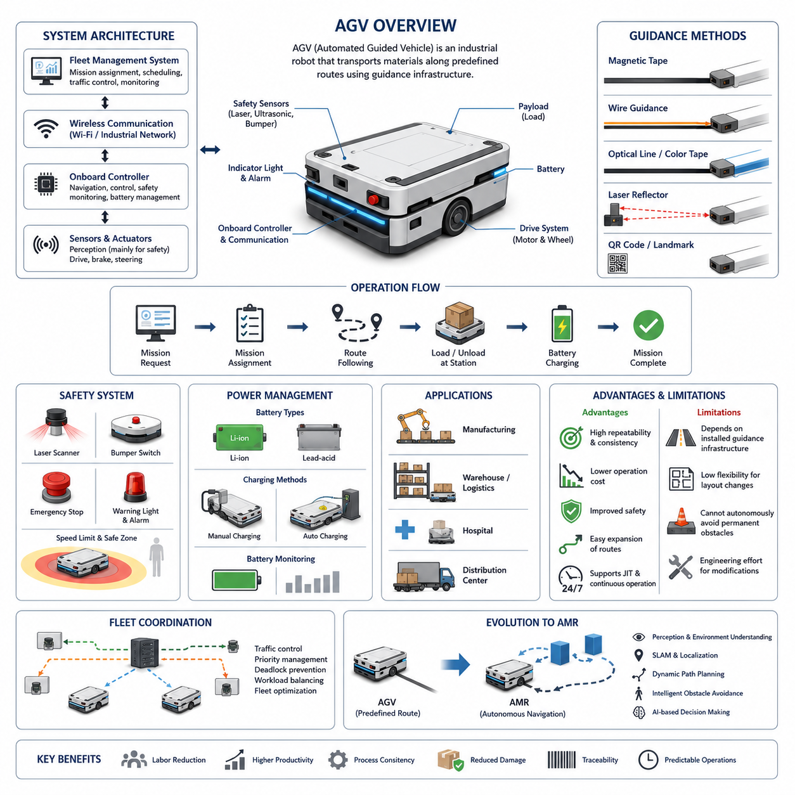
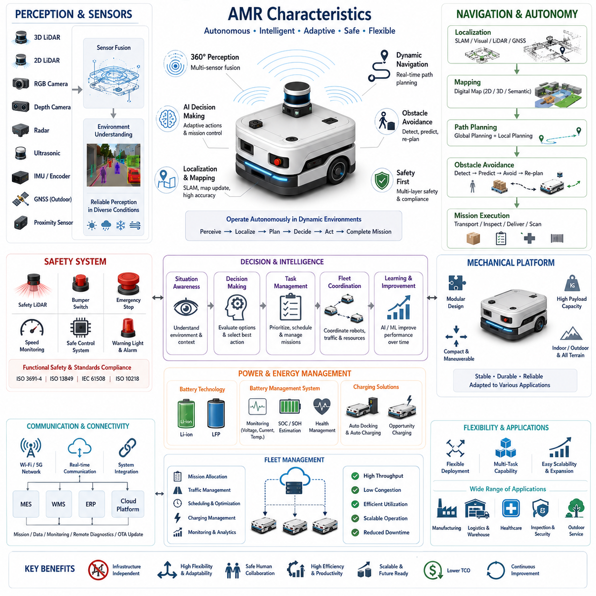
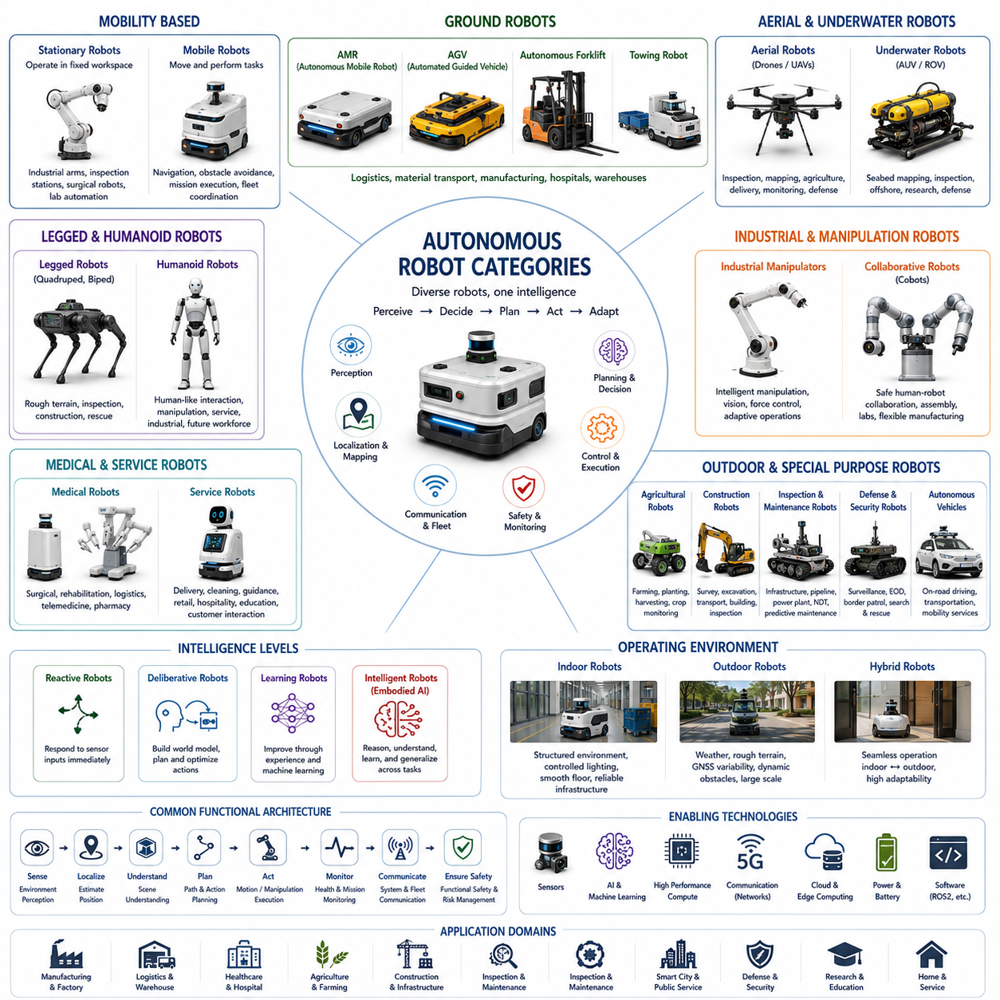
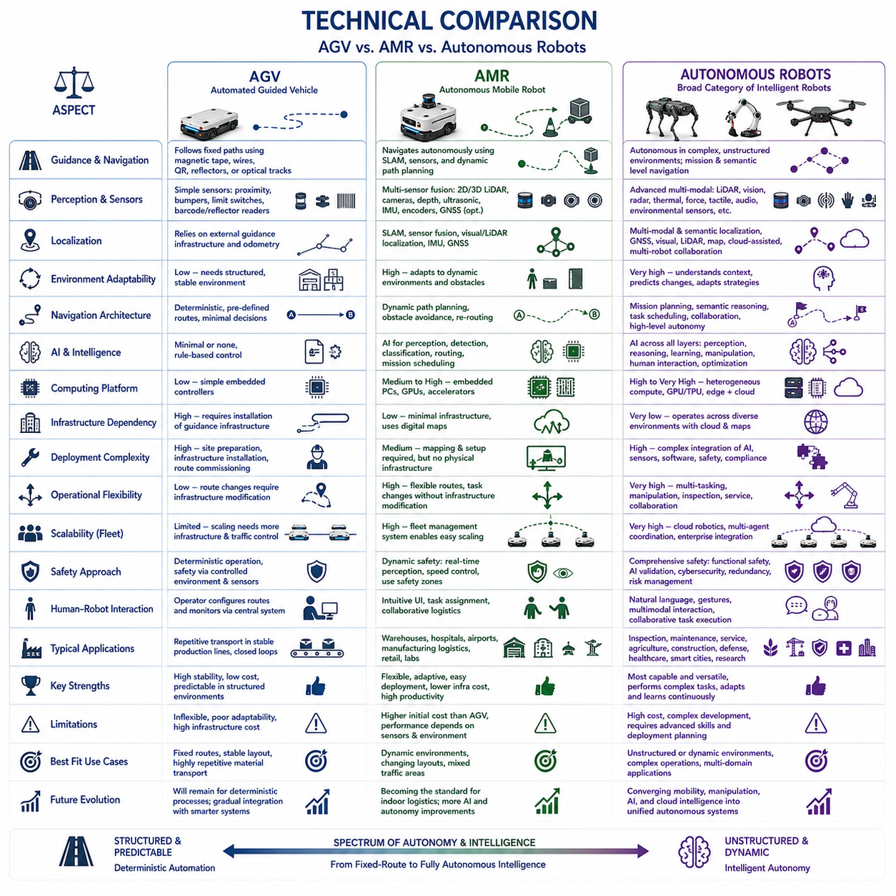
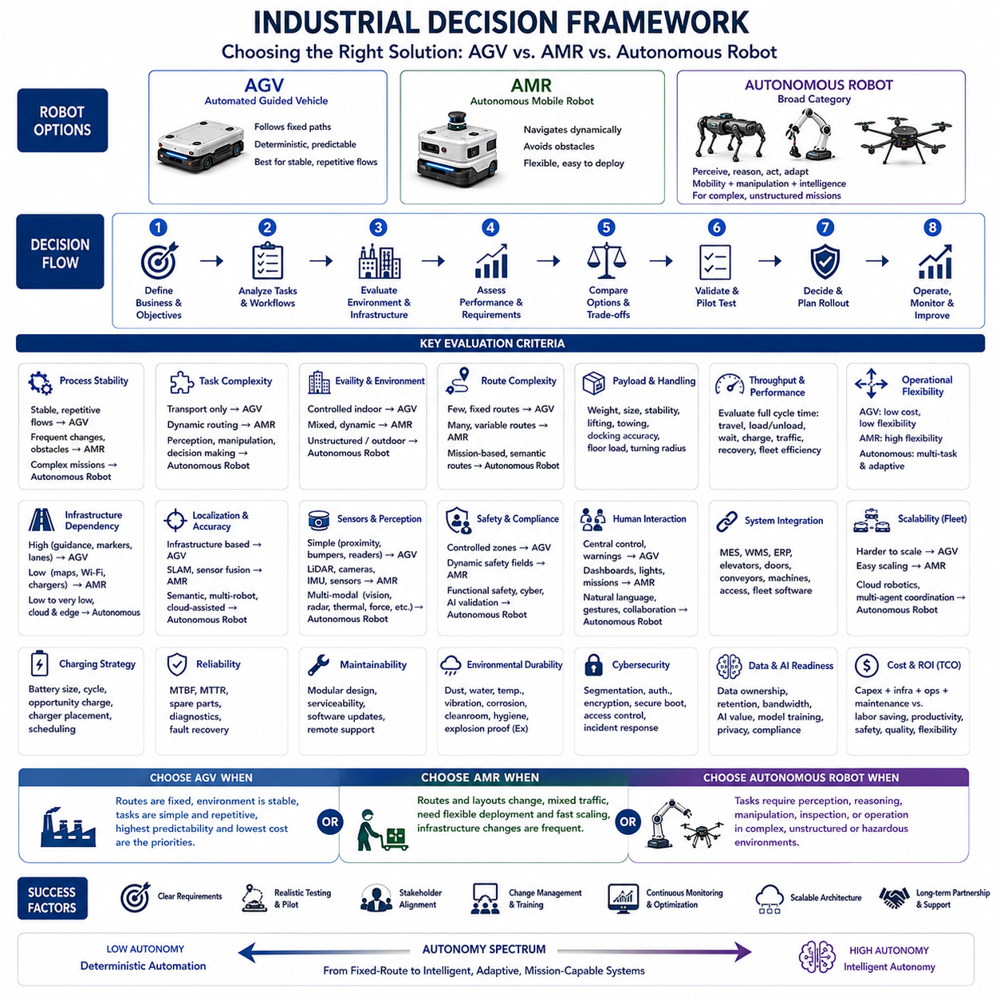

**Volume 01. AMR Foundations and System Architecture**

# 02. AMR vs AGV vs Autonomous Robot

## 02.01 AGV Fundamentals · AGV 기초

{width="7.268055555555556in" height="7.268055555555556in"}

An Automated Guided Vehicle (AGV) is a mobile robotic system designed to transport materials, products, or equipment through predefined routes inside industrial environments. Unlike manually operated vehicles, an AGV follows guidance mechanisms such as magnetic tape, embedded wires, reflective markers, laser reflectors, or QR codes installed throughout a facility. The primary objective of an AGV is to automate repetitive transportation tasks with predictable movements while improving productivity, operational consistency, and workplace safety. AGVs have become a fundamental component of industrial automation because they reduce manual labor, minimize transportation errors, and enable continuous operation across manufacturing plants, warehouses, and distribution centers.

The concept of AGVs originated from the need to replace fixed conveyor systems with more flexible transportation solutions. Traditional conveyor systems require extensive infrastructure modifications whenever production layouts change, whereas AGVs provide mobile transportation without permanently connecting different production stations. Early AGVs were relatively simple vehicles that followed physical guidance paths and executed basic commands such as moving, stopping, loading, and unloading at predefined locations. Although these systems lacked environmental awareness, they significantly improved manufacturing efficiency by automating repetitive logistics operations.

The architecture of a typical AGV consists of several integrated subsystems that work together to accomplish reliable transportation tasks. The mechanical platform provides structural support for payloads while incorporating wheels, suspension components, and drive mechanisms suitable for the operating environment. Electric motors generate propulsion under the supervision of motor controllers that regulate speed, acceleration, and braking. Batteries supply electrical energy to the vehicle, while onboard controllers execute navigation logic and coordinate communication with factory management systems. Safety devices continuously monitor the surroundings to prevent collisions with personnel or equipment.

Navigation in conventional AGV systems relies on predefined infrastructure rather than autonomous environmental understanding. Guidance methods vary depending on application requirements, installation costs, and desired positioning accuracy. Magnetic tape guidance uses adhesive magnetic strips attached to the floor, allowing magnetic sensors to detect the vehicle\'s path. Wire-guided systems employ energized cables buried beneath the floor, generating electromagnetic fields that specialized sensors can follow. Optical guidance relies on painted lines or colored tape, while laser-guided AGVs determine their position by measuring reflections from strategically placed reflectors installed throughout the facility.

Since AGVs operate along predefined routes, route planning is usually performed during system installation rather than dynamically during operation. Engineers define transportation paths connecting workstations, storage locations, loading docks, and charging stations according to production workflows. The onboard controller simply follows these predefined routes while responding to commands received from supervisory software. Route modifications generally require updating facility maps, relocating guidance infrastructure, or reconfiguring navigation parameters. Consequently, layout changes often involve engineering effort and temporary production interruptions.

The control hierarchy of an AGV system typically includes both onboard control software and centralized fleet management software. The onboard controller handles low-level functions such as motor control, sensor monitoring, battery management, emergency stopping, and path following. A central fleet management system assigns transportation missions, schedules vehicle movements, manages traffic priorities, monitors operational status, and coordinates multiple AGVs working simultaneously. Communication between the vehicles and the fleet controller is commonly established through industrial wireless networks, allowing operators to monitor system performance in real time.

Safety represents one of the most critical aspects of AGV operation because these vehicles share working environments with human operators and other industrial equipment. Modern AGVs incorporate emergency stop buttons, bumper switches, laser safety scanners, ultrasonic sensors, warning lights, audible alarms, and speed limitation mechanisms. When an obstacle enters the predefined safety zone, the vehicle slows down or stops according to configured safety rules. Although conventional AGVs generally do not perform intelligent obstacle avoidance, they maintain safe operation by stopping whenever unexpected objects block their predefined travel paths.

Power management plays an essential role in maintaining continuous AGV operation. Most industrial AGVs utilize rechargeable lithium-ion or lead-acid battery systems selected according to payload capacity, operating hours, charging strategy, and maintenance requirements. Charging may occur manually during scheduled maintenance periods or automatically through dedicated charging stations positioned along transportation routes. Fleet management software often schedules charging operations to maximize vehicle availability while preventing excessive battery depletion. Proper battery monitoring contributes significantly to system reliability and operational efficiency.

Industrial applications of AGVs span numerous sectors where repetitive material transportation constitutes a significant portion of operational activities. Manufacturing plants use AGVs to transport raw materials, work-in-progress components, finished products, and tooling between production stations. Warehouses employ AGVs for pallet movement, storage replenishment, order fulfillment, and shipping preparation. Hospitals utilize AGVs to distribute medical supplies, pharmaceuticals, laboratory specimens, meals, and linens. Distribution centers integrate AGVs into automated logistics workflows to improve inventory movement while reducing labor costs and minimizing transportation errors.

One of the primary advantages of AGVs is their ability to deliver highly repeatable transportation performance under stable operating conditions. Because vehicles follow predetermined paths, travel behavior remains consistent over long operating periods. Installation costs are generally lower than building complex conveyor networks, and transportation routes can often be expanded without extensive structural modifications. AGVs also improve workplace safety by reducing manual forklift traffic, lowering the probability of operator fatigue, and providing predictable vehicle movement patterns throughout industrial facilities.

Despite their advantages, conventional AGVs possess inherent limitations resulting from their dependence on predefined guidance infrastructure. They cannot independently generate alternative routes when obstacles permanently block travel paths, nor can they easily navigate around unexpected environmental changes. Production layout modifications frequently require physical relocation of guidance markers or significant reconfiguration efforts. As manufacturing environments become increasingly dynamic, these limitations reduce the flexibility of traditional AGV deployments and increase long-term maintenance costs associated with facility changes.

The distinction between AGVs and newer generations of mobile robots becomes particularly evident when considering environmental perception and decision-making capabilities. Conventional AGVs primarily execute deterministic transportation tasks based on predefined instructions, while environmental intelligence remains minimal. Sensors mainly serve safety functions rather than supporting autonomous navigation or scene understanding. Consequently, AGVs perform exceptionally well in structured environments with predictable workflows but encounter difficulties when operating in highly dynamic environments characterized by frequent obstacles, changing layouts, or complex human interactions.

Fleet coordination becomes increasingly important as the number of AGVs operating within a facility grows. Centralized traffic management systems allocate missions, assign transportation priorities, regulate intersection access, and prevent deadlocks among multiple vehicles. Sophisticated scheduling algorithms optimize fleet utilization by balancing workloads across available vehicles while minimizing idle time and unnecessary travel distance. Effective fleet management significantly improves overall system throughput, particularly in large-scale manufacturing plants where hundreds of transportation requests may occur simultaneously throughout the production process.

The economic value of AGV deployment extends beyond labor reduction alone. Automated transportation improves process consistency, reduces product damage caused by manual handling, enhances production traceability, supports just-in-time manufacturing, and enables continuous operation during multiple work shifts. These benefits contribute to increased manufacturing efficiency, improved product quality, and more predictable logistics performance. Organizations frequently deploy AGVs as part of broader digital manufacturing initiatives that integrate automation, manufacturing execution systems, warehouse management systems, and enterprise resource planning platforms.

Although AGVs remain widely deployed across industrial sectors, they also represent an important evolutionary step toward modern Autonomous Mobile Robots (AMRs). Many architectural concepts originally developed for AGVs---including fleet management, mission scheduling, industrial safety integration, battery management, and automated material handling---continue to serve as foundational technologies for contemporary autonomous robotic platforms. Understanding AGV fundamentals therefore provides essential background for studying the technological advancements that distinguish modern AMRs, including perception-driven navigation, simultaneous localization and mapping, dynamic path planning, intelligent obstacle avoidance, and AI-based decision-making capabilities.

## 02.02 AMR Characteristics · AMR의 특성

{width="7.268055555555556in" height="7.268055555555556in"}

An Autonomous Mobile Robot (AMR) represents a significant advancement beyond traditional automated material handling systems by combining intelligent perception, autonomous decision-making, dynamic navigation, and continuous environmental understanding into a single robotic platform. Unlike conventional Automated Guided Vehicles (AGVs), which depend on predefined guidance infrastructure, AMRs continuously perceive their surroundings, estimate their own position, generate safe paths, avoid obstacles, and accomplish assigned missions with minimal human intervention. Their defining characteristic is not merely autonomous movement but the ability to adapt their behavior to changing environments while maintaining safe and efficient operation. As modern manufacturing, logistics, healthcare, construction, agriculture, and smart-city applications become increasingly dynamic, AMRs have emerged as one of the most important enabling technologies for next-generation industrial automation.

The defining feature of an AMR is autonomous navigation based on environmental perception rather than fixed infrastructure. Instead of following magnetic tape, embedded wires, or painted lines, an AMR continuously observes its surroundings using multiple sensors and calculates its own position within a digital map. Navigation decisions are generated in real time based on current environmental conditions rather than predetermined routes. This infrastructure-independent navigation dramatically increases deployment flexibility because production layouts, warehouse configurations, and operational workflows can change without requiring physical modifications to navigation guidance systems. Consequently, AMRs are particularly suitable for facilities where layouts evolve frequently or operational demands vary over time.

Environmental perception forms the foundation of every AMR. A modern AMR integrates multiple sensing modalities including two-dimensional LiDAR, three-dimensional LiDAR, RGB cameras, depth cameras, radar, ultrasonic sensors, inertial measurement units, wheel encoders, GNSS receivers for outdoor applications, and various proximity sensors. Each sensor contributes complementary information regarding obstacles, free space, terrain conditions, localization references, or environmental context. Sensor fusion algorithms combine these heterogeneous data sources into a unified representation of the surrounding world, providing more reliable and accurate perception than any individual sensor could achieve independently. This comprehensive situational awareness enables robust operation under diverse environmental conditions.

Localization is another essential characteristic distinguishing AMRs from conventional guided vehicles. Rather than relying on externally installed guidance infrastructure, AMRs estimate their position by comparing real-time sensor observations with previously generated maps or continuously updated environmental models. Techniques such as Simultaneous Localization and Mapping (SLAM), visual localization, LiDAR-based localization, multi-sensor localization, and GNSS-assisted positioning allow robots to determine their location with high accuracy even when portions of the environment change. Accurate localization serves as the basis for navigation, obstacle avoidance, task execution, and fleet coordination, ensuring that every autonomous decision is grounded in a reliable estimate of the robot\'s current position.

Mapping capabilities further distinguish AMRs from traditional mobile robots. During deployment, an AMR constructs digital representations of its operating environment using onboard sensors. These maps may include occupancy grids, point clouds, semantic information, traversable regions, landmarks, infrastructure elements, and operational zones. Unlike static guidance paths, digital maps can be updated whenever the facility changes, allowing the robot to adapt to new equipment installations, modified production lines, or relocated storage areas. Long-term mapping techniques continuously refine environmental models, improving localization accuracy and navigation reliability over extended operational periods.

Path planning within an AMR occurs dynamically rather than statically. When assigned a destination, the robot computes an optimal global route using the current map while simultaneously generating local trajectories that respond to immediate environmental changes. If an obstacle temporarily blocks the preferred route, the robot calculates an alternative path without requiring human intervention. Global planning algorithms optimize travel distance, travel time, energy consumption, or operational efficiency, whereas local planning algorithms continuously adjust vehicle motion to maintain safe separation from moving obstacles. This combination enables AMRs to operate effectively in environments populated by workers, forklifts, other robots, and continuously changing equipment.

Obstacle avoidance represents one of the most recognizable characteristics of autonomous mobile robots. Instead of simply stopping when encountering unexpected obstacles, AMRs analyze the surrounding environment, predict obstacle motion when necessary, and determine safe alternative trajectories. Dynamic obstacle avoidance requires continuous sensor monitoring, rapid trajectory generation, collision prediction, and motion control operating within strict real-time constraints. Advanced perception systems distinguish between static infrastructure, moving equipment, pedestrians, and temporary obstacles, enabling robots to respond appropriately according to safety requirements and operational priorities while maintaining efficient mission execution.

Artificial intelligence increasingly enhances the capabilities of modern AMRs. Computer vision algorithms identify objects, recognize operational landmarks, classify environments, and detect humans or vehicles. Deep learning models improve perception robustness under varying illumination, weather conditions, and cluttered industrial scenes. Reinforcement learning techniques optimize navigation policies, while foundation models and multimodal AI systems enable higher-level reasoning regarding complex operational scenarios. Rather than replacing conventional robotics algorithms, AI complements deterministic control systems by improving perception, scene understanding, prediction, and adaptive decision-making in uncertain environments.

Autonomous decision-making extends beyond navigation into mission execution and operational management. AMRs continuously evaluate environmental conditions, task priorities, battery status, traffic congestion, equipment availability, and fleet coordination constraints before selecting appropriate actions. Decision-making mechanisms may involve hierarchical state machines, behavior trees, rule-based reasoning, optimization algorithms, or AI-assisted planners. These decision layers allow robots to suspend tasks, recharge batteries, reroute around blocked corridors, coordinate with other robots, or request operator assistance whenever operational conditions require adaptive responses beyond simple path following.

Safety remains the highest operational priority despite increasing autonomy. Modern AMRs integrate functional safety mechanisms directly into both hardware and software architectures. Safety laser scanners, redundant sensing systems, emergency stop circuits, safety-rated controllers, speed monitoring, protective field switching, and safe motion control continuously evaluate potential hazards. Safety functions operate independently from higher-level AI algorithms to ensure deterministic behavior under fault conditions. Compliance with international industrial safety standards ensures that autonomous robots can safely share workspaces with human operators while maintaining predictable and reliable operation.

Mechanical platform design significantly influences AMR capabilities. Indoor robots often prioritize compact dimensions, tight turning radii, low operating noise, and precise positioning for structured facilities such as factories and hospitals. Outdoor AMRs require larger wheels, suspension systems, weather-resistant enclosures, higher ground clearance, increased payload capacity, and more powerful drive systems capable of traversing uneven terrain. Heavy-duty industrial AMRs may support payloads ranging from several hundred kilograms to multiple tons while maintaining centimeter-level positioning accuracy. The mechanical architecture must therefore balance stability, durability, maneuverability, energy efficiency, and application-specific performance requirements.

Energy management constitutes another critical characteristic of autonomous mobile robots. Battery capacity directly influences mission duration, payload capability, and operational availability. Modern AMRs typically employ lithium-ion or lithium iron phosphate battery technologies due to their high energy density, long service life, and relatively low maintenance requirements. Intelligent battery management systems monitor voltage, current, temperature, state of charge, and state of health while optimizing charging cycles. Autonomous docking and automatic charging allow robots to replenish energy without human intervention, enabling continuous operation across multiple shifts with minimal downtime.

Communication infrastructure enables AMRs to function as connected intelligent systems rather than isolated machines. Wireless networking technologies provide continuous communication between robots, fleet management platforms, manufacturing execution systems, warehouse management systems, enterprise resource planning systems, and cloud-based monitoring services. Real-time communication supports mission assignment, fleet coordination, software updates, health monitoring, remote diagnostics, and operational analytics. Reliable network connectivity allows distributed robotic fleets to function cooperatively while sharing maps, traffic information, task status, and operational intelligence across the entire deployment.

Fleet management becomes increasingly important as organizations deploy dozens or hundreds of AMRs within a single facility. Fleet management software allocates missions, schedules transportation requests, balances workloads, coordinates traffic at intersections, prevents deadlocks, manages charging schedules, and monitors overall fleet performance. Advanced optimization algorithms maximize throughput while minimizing travel distance, waiting time, congestion, and energy consumption. The fleet management layer effectively transforms individual autonomous robots into a coordinated transportation ecosystem capable of supporting large-scale industrial automation.

Scalability distinguishes AMRs from many traditional automation systems. Because navigation depends primarily on digital maps and software rather than fixed physical infrastructure, organizations can expand robotic fleets or modify facility layouts with comparatively little engineering effort. Additional robots may be integrated into existing fleets without redesigning transportation infrastructure, while operational zones can be reconfigured by updating digital maps rather than reinstalling physical guidance equipment. This scalability significantly reduces long-term deployment costs while allowing automation capabilities to grow alongside business requirements.

Operational flexibility provides one of the strongest business justifications for AMR adoption. A single robot platform can perform multiple transportation tasks, inspection missions, inventory scanning, material delivery, or collaborative logistics depending on software configuration and installed payload modules. Mission priorities may change dynamically according to production schedules, emergency requests, equipment failures, or customer demand. This software-defined operational model allows organizations to maximize equipment utilization while rapidly adapting automation strategies to evolving business objectives without replacing hardware platforms.

Human-robot collaboration has become an increasingly important design objective for modern AMRs. Rather than isolating robots behind protective barriers, collaborative AMRs safely operate alongside workers by continuously monitoring human movement, predicting potential interactions, and adjusting speed or trajectory accordingly. Human-machine interfaces provide intuitive methods for assigning tasks, monitoring operations, acknowledging alerts, and requesting assistance. Natural interaction mechanisms such as touch displays, voice interfaces, mobile applications, wearable devices, and visual indicators improve usability while reducing operator training requirements.

Cloud connectivity and edge computing further expand AMR capabilities beyond onboard processing alone. Time-critical perception, localization, and motion control remain on the robot to guarantee deterministic real-time performance, while computationally intensive tasks such as fleet optimization, data analytics, predictive maintenance, AI model training, and digital twin simulation may execute on edge servers or cloud infrastructure. This distributed computing architecture enables continuous improvement through operational data collection while maintaining low-latency control for safety-critical autonomous functions.

Modern AMRs increasingly incorporate digital twin technologies that maintain synchronized virtual representations of physical robots, operational environments, and fleet activities. Digital twins support simulation-based validation, performance analysis, predictive maintenance, software verification, operator training, and mission optimization before deployment into production environments. By comparing simulated behavior with actual operational data, engineers can continuously refine navigation algorithms, improve perception performance, optimize traffic management strategies, and evaluate future facility modifications without disrupting ongoing operations.

The evolution of AMRs reflects the convergence of robotics, artificial intelligence, sensing technologies, high-performance computing, industrial networking, and cloud-based automation. Unlike conventional automated guided systems that primarily automate repetitive transportation along fixed routes, AMRs function as intelligent autonomous systems capable of perceiving complex environments, making informed decisions, adapting to unforeseen situations, coordinating with other robots, and continuously improving operational performance. Their flexibility, scalability, safety, and software-defined functionality make AMRs the foundational technology for next-generation smart factories, intelligent logistics, autonomous inspection systems, healthcare automation, outdoor service robotics, and future embodied AI platforms, establishing them as one of the most transformative technologies in modern industrial automation.

## 02.03 Autonomous Robot Categories · 자율로봇 분류

{width="7.268055555555556in" height="7.268055555555556in"}

An autonomous robot is a broad category of intelligent machines capable of perceiving their environment, making independent decisions, and executing tasks with minimal or no direct human intervention. While Autonomous Mobile Robots (AMRs) represent one of the most widely adopted forms of autonomous robotics, they constitute only a subset of a much larger ecosystem that includes aerial robots, underwater robots, humanoid robots, industrial manipulators, agricultural robots, medical robots, service robots, autonomous vehicles, defense systems, and collaborative robotic platforms. The term "autonomous robot" therefore refers not to a specific mechanical design but to a level of operational intelligence that enables robots to understand their surroundings, evaluate situations, plan appropriate actions, and continuously adapt to dynamic environments. Within the overall structure of AMR Foundations and System Architecture, this topic naturally extends the comparison between AGVs, AMRs, and broader autonomous robotic systems.

The most fundamental classification distinguishes autonomous robots according to their mobility characteristics. Stationary autonomous robots perform intelligent operations while remaining fixed within a defined workspace. Examples include industrial robotic manipulators, automated inspection stations, surgical robots, and laboratory automation systems. Mobile autonomous robots, by contrast, navigate through their environment while simultaneously performing transportation, inspection, surveillance, cleaning, manipulation, or service tasks. Mobile platforms introduce additional technical challenges including localization, navigation, obstacle avoidance, motion planning, terrain adaptation, and fleet coordination, making them significantly more complex than stationary robotic systems.

Ground-based autonomous robots represent the largest commercial category of autonomous robotics. These robots operate on land using wheels, tracks, articulated suspensions, or walking mechanisms depending on application requirements. Indoor warehouse robots, factory logistics robots, hospital delivery robots, outdoor inspection vehicles, autonomous forklifts, construction robots, mining robots, agricultural field robots, military unmanned ground vehicles, and autonomous patrol systems all belong to this category. Although their applications differ considerably, they share common architectural components including perception systems, localization modules, navigation algorithms, motion controllers, safety systems, onboard computing platforms, communication networks, and mission management software.

Autonomous Mobile Robots represent the dominant class of intelligent indoor mobile robots used throughout modern industry. AMRs differ from conventional Automated Guided Vehicles because they navigate using environmental perception instead of predefined physical guidance infrastructure. They continuously construct environmental understanding through LiDAR, cameras, depth sensors, inertial sensors, wheel odometry, and sensor fusion techniques. By combining localization, mapping, path planning, obstacle avoidance, and intelligent mission execution, AMRs provide significantly greater operational flexibility than traditional fixed-route transportation systems. Their software-defined behavior enables deployment in manufacturing facilities, warehouses, hospitals, airports, laboratories, and commercial buildings without extensive infrastructure modifications.

Autonomous Guided Vehicles remain an important category despite the rapid growth of AMRs. AGVs primarily follow predefined routes established by magnetic tape, embedded wires, optical guidance, reflectors, or QR markers. Their deterministic operation provides highly predictable behavior within structured industrial environments where routes change infrequently. AGVs generally require less computational complexity than AMRs because navigation decisions are simplified by fixed infrastructure. Consequently, AGVs remain attractive for repetitive production environments where maximum reliability, lower implementation cost, and standardized transportation workflows outweigh the need for environmental adaptability.

Autonomous forklifts combine traditional industrial material handling equipment with advanced autonomous navigation technologies. Unlike standard AMRs that primarily transport carts or shelves, autonomous forklifts manipulate pallets using lifting mechanisms while navigating warehouse environments. Their perception systems must simultaneously identify pallet geometry, detect rack positions, estimate fork alignment, recognize load stability, and coordinate lifting operations with centimeter-level precision. Autonomous forklifts therefore integrate mobile robotics, industrial manipulation, warehouse management systems, and safety-certified motion control into a single intelligent logistics platform capable of operating continuously within large distribution centers.

Towing robots represent another important subclass of industrial autonomous robots designed to transport multiple carts or trailers efficiently across manufacturing facilities and logistics centers. Rather than carrying payloads directly, towing robots pull multiple connected carts, significantly increasing transportation efficiency for repetitive material flow. Modern towing AMRs incorporate autonomous docking, trailer recognition, precision coupling mechanisms, fleet optimization, and dynamic route planning. Their ability to transport heavy loads over long distances while coordinating with factory production schedules makes them especially valuable for automotive manufacturing, semiconductor production, and large-scale industrial logistics.

Autonomous aerial robots, commonly referred to as Unmanned Aerial Vehicles (UAVs) or drones, extend robotic autonomy into three-dimensional airspace. These systems rely on flight control algorithms, inertial navigation, GNSS positioning, visual localization, obstacle sensing, and aerodynamic stabilization rather than ground locomotion. Applications include infrastructure inspection, aerial mapping, precision agriculture, disaster assessment, environmental monitoring, logistics delivery, cinematography, and defense reconnaissance. Compared with ground robots, autonomous drones must continuously maintain stable flight while compensating for wind disturbances, rapidly changing environmental conditions, and limited onboard energy capacity.

Autonomous underwater robots operate in some of the most challenging environments encountered in robotics. Autonomous Underwater Vehicles (AUVs) and Remotely Operated Vehicles (ROVs) perform seabed mapping, pipeline inspection, offshore infrastructure monitoring, marine biological research, naval operations, underwater archaeology, and environmental observation. Because GNSS signals cannot penetrate water, underwater robots rely on acoustic positioning, inertial navigation, sonar mapping, Doppler velocity logs, pressure sensors, and underwater SLAM technologies for localization. Communication bandwidth is also extremely limited, requiring significant onboard autonomy for extended missions.

Legged robots constitute a rapidly advancing category designed to traverse environments unsuitable for wheeled vehicles. Quadruped robots employ four legs to achieve stable locomotion across stairs, rocky terrain, uneven construction sites, forests, and disaster areas. Humanoid robots extend this capability further by approximating human body structures, enabling operation within infrastructure originally designed for humans. Legged locomotion requires sophisticated whole-body control, dynamic balance estimation, force sensing, gait planning, terrain adaptation, and high-frequency motion optimization. Recent advances in reinforcement learning and model predictive control have significantly improved the stability and adaptability of these robotic platforms.

Humanoid robots represent one of the most ambitious categories of autonomous robotics because they combine mobility, manipulation, perception, reasoning, and human interaction within a single embodied platform. A humanoid robot typically integrates two-legged locomotion, dexterous robotic hands, stereo vision, force sensing, speech recognition, natural language understanding, and multimodal artificial intelligence. The primary objective is not merely to resemble humans physically but to operate effectively within environments originally designed for human workers without requiring infrastructure modifications. Manufacturing, logistics, healthcare, hospitality, retail, inspection, maintenance, and domestic assistance all represent potential future application domains.

Industrial autonomous manipulators focus primarily on intelligent manipulation rather than autonomous navigation. Modern robotic arms increasingly incorporate vision systems, force control, AI-based object recognition, grasp planning, adaptive motion generation, and collaborative safety mechanisms. Instead of repeatedly executing identical preprogrammed trajectories, autonomous manipulators identify object variations, compensate for positioning uncertainty, optimize grasp strategies, and cooperate with human operators. This evolution transforms conventional industrial robots into flexible manufacturing systems capable of supporting high-mix, low-volume production environments.

Collaborative robots, commonly known as cobots, emphasize safe physical interaction between robots and humans. Unlike traditional industrial robots that operate inside protective safety fences, cobots employ force sensing, torque monitoring, collision detection, speed limitation, and intelligent motion planning to safely share workspaces with human workers. Although many collaborative robots still execute operator-defined tasks, increasing integration of computer vision, AI planning, and adaptive control is steadily moving them toward higher levels of autonomy. Collaborative autonomy is becoming particularly important in assembly operations, laboratory automation, medical assistance, and flexible manufacturing.

Medical autonomous robots encompass surgical systems, rehabilitation robots, pharmacy automation, hospital logistics robots, telemedicine platforms, diagnostic assistance systems, and patient monitoring devices. Surgical robots provide highly precise instrument positioning while supporting minimally invasive procedures. Hospital AMRs transport medicine, laboratory samples, food, linens, and medical supplies throughout healthcare facilities. Rehabilitation robots assist patients recovering from neurological or musculoskeletal injuries, while telepresence robots extend specialist expertise across geographically distributed healthcare networks. Reliability, safety, sterility, regulatory compliance, and human-centered interaction are particularly critical within medical robotics.

Agricultural autonomous robots are transforming modern farming through precision agriculture techniques that optimize productivity while reducing resource consumption. Autonomous tractors, harvesting robots, planting systems, crop monitoring platforms, spraying robots, orchard robots, and livestock management systems utilize computer vision, GNSS positioning, multispectral imaging, AI-based crop analysis, and environmental sensing to perform field operations with minimal human supervision. These robots must operate under highly variable outdoor conditions including changing weather, uneven terrain, vegetation growth, dust, mud, and seasonal environmental changes.

Construction robots address physically demanding and hazardous activities associated with infrastructure development. Autonomous construction platforms perform surveying, excavation assistance, material transportation, structural inspection, concrete finishing, brick laying, progress monitoring, safety patrol, and digital twin data acquisition. Because construction sites evolve continuously, these robots require highly adaptive perception systems capable of recognizing partially completed structures, moving machinery, temporary obstacles, and constantly changing work zones. Outdoor localization, robust navigation, and reliable human-robot collaboration become particularly important under such dynamic operating conditions.

Inspection and maintenance robots represent one of the fastest growing categories of autonomous systems. These robots inspect bridges, tunnels, railways, power plants, factories, oil refineries, offshore platforms, pipelines, transmission lines, and industrial equipment using high-resolution cameras, thermal imagers, LiDAR, ultrasonic sensors, acoustic microphones, radar, and non-destructive testing technologies. Rather than replacing human expertise, inspection robots automate repetitive data collection while AI algorithms identify anomalies, estimate defect severity, prioritize maintenance actions, and generate comprehensive inspection reports. Predictive maintenance strategies increasingly rely upon these autonomous inspection platforms.

Autonomous defense and security robots perform surveillance, reconnaissance, explosive ordnance disposal, border monitoring, hazardous material detection, search and rescue, perimeter protection, and disaster response. Depending on operational requirements, these systems may operate on land, in the air, on the water surface, underwater, or through combinations of multiple domains. High levels of environmental robustness, communication resilience, sensor redundancy, cybersecurity, and mission reliability are essential because these robots frequently operate in hazardous, remote, or communication-constrained environments where direct human intervention is difficult or impossible.

Service robots constitute a diverse category focused on supporting everyday human activities. Hotel delivery robots, restaurant service robots, airport guidance robots, shopping assistants, educational robots, domestic cleaning robots, lawn maintenance robots, security patrol systems, and customer interaction platforms all belong to this rapidly expanding market. Advances in speech recognition, large language models, multimodal AI, emotion recognition, and natural human-robot interaction continue to increase the intelligence and usability of service robots operating within public environments containing large numbers of non-expert users.

Autonomous robots can also be categorized according to their operational intelligence. Reactive robots respond immediately to sensor inputs using predefined behaviors without maintaining detailed internal world models. Deliberative robots construct explicit environmental representations, evaluate alternative actions, and generate optimized plans before executing tasks. Learning robots continuously improve performance through experience using machine learning, reinforcement learning, imitation learning, or self-supervised learning techniques. The emergence of foundation models, vision-language models, world models, and embodied AI is enabling robots to reason about unfamiliar situations, generalize across multiple tasks, and transfer knowledge between domains, significantly expanding the scope of autonomous behavior beyond traditional task-specific automation.

Another important classification considers operational environments. Indoor autonomous robots operate within structured environments featuring controlled lighting, relatively smooth floors, reliable wireless connectivity, and known infrastructure. Outdoor autonomous robots must tolerate changing weather, uneven terrain, GNSS variability, dynamic traffic, dust, rain, snow, vegetation, and significantly larger operating areas. Hybrid robots capable of seamless indoor-outdoor transitions represent an increasingly important research direction because they combine the precision of indoor navigation with the robustness required for real-world outdoor deployment.

From a systems engineering perspective, all autonomous robot categories share a common functional architecture despite their mechanical differences. Every autonomous robot must perceive its environment, estimate its state, understand mission objectives, plan actions, execute controlled motion or manipulation, monitor operational health, communicate with external systems, ensure functional safety, and continuously evaluate mission progress. Differences between robot categories arise primarily from application-specific sensing, locomotion mechanisms, computational requirements, environmental constraints, payload capabilities, and regulatory considerations rather than from fundamental architectural principles.

The continued convergence of robotics, artificial intelligence, high-performance computing, advanced sensing, cloud robotics, edge computing, and embodied intelligence is steadily reducing the boundaries between these traditional categories. Future autonomous robotic platforms are expected to combine mobile navigation, dexterous manipulation, multimodal perception, natural language interaction, collaborative reasoning, adaptive learning, and cloud-connected intelligence within unified software-defined architectures. Rather than existing as isolated machine types, autonomous robots will increasingly function as interoperable intelligent agents operating cooperatively across factories, hospitals, logistics networks, smart cities, agricultural environments, construction sites, and public infrastructure, forming the technological foundation for the next generation of intelligent autonomous systems.

## 02.04 Technical Comparison · 기술적 비교

{width="7.268055555555556in" height="7.268055555555556in"}

A technical comparison within this context should therefore build logically upon the three preceding sections by systematically comparing Automated Guided Vehicles (AGVs), Autonomous Mobile Robots (AMRs), and broader Autonomous Robots across architecture, sensing, localization, navigation, intelligence, deployment, scalability, safety, operational flexibility, and long-term technological evolution. Such a comparison is intended not merely to highlight differences but also to clarify the engineering trade-offs that influence robot selection for industrial applications.

The most fundamental distinction among AGVs, AMRs, and Autonomous Robots lies in the way they perceive and interact with their operating environments. AGVs primarily rely on predefined guidance infrastructure such as magnetic tape, embedded wires, QR markers, reflectors, or optical tracks. Their perception requirements are relatively limited because navigation decisions are largely determined by fixed physical references. AMRs, in contrast, continuously observe and interpret their surroundings using LiDAR, cameras, depth sensors, ultrasonic sensors, inertial measurement units, wheel encoders, and sensor fusion algorithms. Autonomous Robots represent the broadest category and may incorporate highly sophisticated multimodal perception systems capable of understanding both structured and unstructured environments while supporting manipulation, reasoning, collaboration, and adaptive decision making.

Navigation architecture represents another major technical distinction. AGVs follow deterministic routes that are defined before deployment and remain largely unchanged during normal operation. Route modifications typically require physical infrastructure updates or manual reconfiguration of guidance systems. AMRs instead construct internal representations of their environments through localization and mapping technologies, enabling them to calculate optimal paths dynamically while responding to temporary obstacles and environmental changes. More advanced Autonomous Robots extend navigation beyond mobility by integrating mission planning, semantic understanding, task scheduling, collaborative behaviors, and high-level reasoning into a unified autonomy framework capable of adapting to complex operational scenarios.

Localization technologies differ significantly across these robotic platforms. Traditional AGVs estimate their positions primarily through external guidance infrastructure and simple odometry corrections. Since their travel paths are predefined, localization accuracy depends largely on the quality of installed navigation references rather than sophisticated environmental understanding. AMRs employ Simultaneous Localization and Mapping (SLAM), sensor fusion, GNSS, visual localization, LiDAR localization, and inertial navigation to continuously estimate vehicle position within dynamically changing environments. Autonomous Robots may additionally combine semantic localization, object-based localization, digital maps, cloud-assisted positioning, and collaborative localization among multiple robots to achieve robust operation in highly diverse environments.

Environmental adaptability is perhaps the defining characteristic separating these technologies. AGVs perform exceptionally well in highly structured facilities where production layouts remain stable and transportation routes change infrequently. However, unexpected obstacles, layout modifications, or temporary construction activities often require manual intervention. AMRs automatically detect obstacles, generate alternative paths, and resume missions without requiring infrastructure modifications. Advanced Autonomous Robots further extend this capability by understanding environmental context, predicting dynamic object behavior, recognizing human activities, and modifying operational strategies according to changing mission objectives, environmental uncertainty, or collaborative task requirements.

Sensor architecture reflects increasing levels of autonomy across the three categories. AGVs generally require relatively simple sensors including proximity sensors, limit switches, bumper sensors, barcode readers, or reflectors to support reliable guidance and basic safety functions. AMRs depend upon integrated perception systems incorporating two-dimensional and three-dimensional LiDAR, RGB cameras, depth cameras, ultrasonic sensors, inertial measurement units, wheel encoders, and optional GNSS receivers. Autonomous Robots frequently employ multimodal sensing architectures combining vision, thermal imaging, radar, force sensing, tactile sensing, microphones, environmental sensors, and advanced AI perception modules to achieve comprehensive situational awareness across diverse operating conditions.

The computational requirements increase substantially as robot autonomy expands. AGVs typically execute deterministic navigation algorithms on relatively modest embedded controllers because environmental complexity is intentionally minimized. AMRs require significantly greater computational capability to process simultaneous localization, obstacle detection, path planning, sensor fusion, and fleet communication in real time. Modern Autonomous Robots frequently incorporate heterogeneous computing platforms consisting of CPUs, GPUs, AI accelerators, edge computing modules, and cloud resources capable of executing advanced computer vision, deep learning, reinforcement learning, large language models, and multimodal reasoning systems simultaneously.

Artificial intelligence plays fundamentally different roles within each platform category. Conventional AGVs utilize minimal AI because operational decisions are predetermined through engineered workflows. AMRs incorporate AI selectively for perception enhancement, object detection, obstacle classification, route optimization, and mission scheduling while still relying heavily on deterministic robotics algorithms for safety-critical navigation. Autonomous Robots increasingly integrate artificial intelligence into nearly every aspect of operation, including scene understanding, semantic reasoning, human interaction, manipulation planning, adaptive learning, predictive maintenance, collaborative decision making, and continuous performance optimization through accumulated operational experience.

Infrastructure dependency represents another critical engineering consideration. AGVs require dedicated guidance infrastructure, carefully prepared operating environments, and route-specific installation procedures before deployment can begin. Facility expansion or workflow modification often necessitates physical reconstruction of navigation infrastructure. AMRs dramatically reduce infrastructure dependency by relying primarily on onboard perception and digital mapping technologies. Autonomous Robots continue this trend by operating across multiple environments with minimal infrastructure assumptions while leveraging cloud connectivity, shared digital maps, distributed intelligence, and adaptive software updates to maintain operational flexibility throughout changing deployment conditions.

Deployment complexity differs according to both hardware installation and software configuration requirements. AGV implementation often involves extensive facility preparation, guide path installation, infrastructure validation, and route commissioning before productive operation can begin. Once deployed, however, AGVs generally provide highly stable and predictable performance. AMRs require initial environmental mapping and localization configuration but eliminate most physical infrastructure installation, allowing considerably faster deployment and easier expansion. Autonomous Robots introduce additional software complexity because intelligent behaviors, AI models, semantic maps, manipulation capabilities, and collaborative functions must all be integrated into a coherent operational architecture while maintaining safety, reliability, and regulatory compliance.

Operational flexibility strongly favors increasingly autonomous robotic systems. AGVs excel at repetitive transportation tasks performed along fixed routes under consistent operating conditions. AMRs accommodate changing workflows by supporting dynamic task allocation, flexible routing, obstacle avoidance, and fleet optimization without requiring infrastructure modifications. Autonomous Robots extend flexibility beyond transportation by combining navigation with intelligent manipulation, inspection, maintenance, human collaboration, environmental analysis, and adaptive mission execution. This broader functional capability enables a single robotic platform to perform multiple operational roles throughout its service lifetime.

Scalability also evolves significantly across these technologies. Expanding an AGV installation often requires additional guide paths, traffic management infrastructure, and careful engineering to prevent route conflicts. AMR fleets scale more naturally because robots coordinate through fleet management software while independently planning local navigation behaviors. Large Autonomous Robot ecosystems may incorporate cloud robotics, distributed task scheduling, digital twins, edge computing, multi-agent coordination, and enterprise resource integration to support hundreds or even thousands of intelligent robotic agents operating cooperatively across geographically distributed facilities.

Safety engineering remains essential regardless of autonomy level, although implementation strategies differ substantially. AGVs achieve safety primarily through controlled environments, predictable routes, emergency stop systems, protective sensors, and deterministic operating behavior. AMRs integrate functional safety with dynamic perception, continuously monitoring surrounding environments while adjusting motion according to detected hazards. Autonomous Robots require even more comprehensive safety architectures combining functional safety, cybersecurity, AI validation, human-aware planning, behavior monitoring, system redundancy, fault diagnosis, and operational risk management because intelligent decision making introduces additional complexity beyond traditional motion control.

Human-robot interaction becomes increasingly sophisticated across the three categories. AGVs generally require operators to configure transportation routes and supervise system operation through centralized control software. AMRs provide more intuitive user interfaces, autonomous mission assignment, and collaborative logistics workflows that reduce operator workload. Autonomous Robots extend interaction through natural language communication, multimodal interfaces, gesture recognition, semantic understanding, collaborative task execution, and AI-assisted decision support. These capabilities allow robots to function not merely as automated machines but as intelligent partners capable of supporting complex human-centered operational environments.

Economic considerations also differ considerably. AGVs generally offer lower initial computational costs and proven reliability within stable production environments, making them attractive for repetitive manufacturing operations where infrastructure changes are infrequent. AMRs often reduce long-term operational costs by minimizing infrastructure installation, shortening deployment time, simplifying layout modifications, and increasing operational flexibility. Autonomous Robots typically require higher initial investment because of advanced sensing, computing, and AI capabilities, but they may generate greater long-term value by automating multiple workflows, adapting to changing operational requirements, reducing labor dependence, and supporting continuous capability expansion through software updates.

Future technological evolution indicates a gradual convergence rather than complete replacement among these robotic categories. AGVs will continue serving highly structured industrial processes where deterministic behavior remains advantageous. AMRs are expected to become the dominant solution for flexible logistics and intelligent material handling across manufacturing, healthcare, and warehouse automation. Autonomous Robots will increasingly integrate mobility, manipulation, perception, reasoning, embodied artificial intelligence, and cloud-connected intelligence into unified software-defined platforms capable of performing diverse physical tasks within continuously changing environments. Instead of existing as isolated product categories, future robotic systems will likely form a spectrum of autonomy in which deterministic automation, adaptive navigation, and intelligent reasoning coexist within modular architectures optimized for specific operational requirements.

## 02.05 Industrial Decision Framework · 산업 의사결정 프레임워크

{width="7.268055555555556in" height="7.268055555555556in"}{width="7.268055555555556in" height="7.268055555555556in"}

An industrial decision framework for selecting between Automated Guided Vehicles, Autonomous Mobile Robots, and broader autonomous robotic systems must begin with the operational problem rather than the technology itself. The central question is not which robot is more advanced, but which platform best satisfies required throughput, safety, flexibility, reliability, integration, and lifecycle cost under actual site conditions.

The first decision factor is process stability. Automated Guided Vehicles are well suited to factories where material flow follows fixed routes, production layouts remain stable, and tasks are highly repetitive. Autonomous Mobile Robots become more attractive when routes change frequently, temporary obstacles are common, or production areas must be reconfigured. Broader autonomous robots are appropriate when mobility must be combined with inspection, manipulation, reasoning, or adaptive task execution.

Task definition should be precise enough to separate transportation from complete mission execution. A vehicle that only moves pallets between two fixed stations may not require advanced autonomy. A robot that must identify a destination, select a route, avoid people, dock accurately, operate equipment, inspect an object, and report results requires a significantly broader autonomous architecture. Unclear task definitions often lead to unnecessary cost or insufficient system capability.

Facility structure is another major selection criterion. A highly controlled indoor environment with flat floors, marked traffic lanes, stable lighting, and limited human movement favors deterministic automation. A mixed environment containing workers, forklifts, movable racks, changing obstacles, narrow passages, or indoor-outdoor transitions requires stronger perception and navigation. Unstructured outdoor sites may demand GNSS, terrain analysis, weather resistance, and advanced environmental understanding.

Route complexity directly affects the technical choice. AGVs perform efficiently when routes are few, predictable, and permanently installed. AMRs provide greater value where many pickup and delivery points must be connected dynamically. Autonomous robots are required when routes are only one element of a larger mission involving semantic destinations, conditional actions, task dependencies, or collaboration with machines and human operators.

Payload characteristics must be evaluated beyond maximum weight. Engineers should consider payload dimensions, center of gravity, load stability, loading method, acceleration limits, floor pressure, turning radius, and docking accuracy. A lightweight AMR may be unsuitable for tall or unstable cargo, while a heavy AGV may be excessive for small parcel transport. Towing, lifting, conveyor transfer, robotic manipulation, and pallet handling each impose different mechanical and control requirements.

Throughput analysis should be based on complete mission cycle time rather than nominal robot speed. Travel time, loading time, unloading time, docking delay, waiting time, charging, traffic congestion, recovery from obstacles, and fleet dispatch efficiency all influence actual productivity. A faster robot may produce lower throughput if it frequently waits at intersections or requires manual intervention. Simulation is often necessary before final platform selection.

Operational flexibility should be assigned an economic value. AGVs may provide the lowest cost for stable routes, but each layout modification can require physical installation work and production interruption. AMRs usually cost more per unit but allow digital route changes and rapid redeployment. Autonomous robots may justify higher investment when one platform can perform multiple tasks or when software updates can expand capability without replacing hardware.

Infrastructure dependency should be assessed across the entire facility lifecycle. AGVs may require magnetic tape, embedded wires, reflectors, markers, traffic controllers, or dedicated lanes. AMRs reduce physical guidance infrastructure but still require maps, wireless coverage, charging stations, and well-managed operational zones. Advanced autonomous robots may need cloud services, edge servers, semantic maps, high-bandwidth networks, and additional computing infrastructure.

Navigation performance should be evaluated under realistic disturbances. A demonstration in an empty facility does not represent normal operation. Testing should include blocked routes, moving workers, forklifts, reflective surfaces, glass walls, narrow aisles, crowded intersections, temporary storage, poor lighting, dust, and communication loss. The correct solution is the one that maintains predictable performance under the most difficult credible operating conditions.

Localization requirements depend on the mission. Basic transportation may tolerate relatively large position errors during travel if final station alignment is mechanically guided. Precision docking, pallet engagement, machine loading, inspection, charging, or manipulation may require centimeter-level repeatability. Engineers must distinguish absolute accuracy, repeatability, route tracking error, docking accuracy, and recovery capability because these metrics are not interchangeable.

Safety requirements must be treated as a primary architectural constraint. The decision framework should identify people, vehicles, machinery, hazardous materials, restricted areas, slopes, drop-offs, and other risks. AGVs rely heavily on predictable routes and controlled zones, while AMRs require dynamic protective fields and reliable obstacle detection. More intelligent robots also require safe behavior monitoring, cybersecurity, fault management, and validation of AI-supported decisions.

Human interaction is critical in shared workspaces. Operators should understand robot intentions, current mission status, alarms, and required actions without specialized technical knowledge. AGVs often use centralized control and fixed warning systems. AMRs may provide tablets, dashboards, lights, sounds, and dynamic mission interfaces. Advanced autonomous robots may add natural language, gesture recognition, or collaborative task planning, but these functions must remain clear and safe.

Integration with existing systems can determine project success more strongly than navigation performance. The selected robot may need to connect with Manufacturing Execution Systems, Warehouse Management Systems, Enterprise Resource Planning, elevators, automatic doors, conveyors, machine controllers, access systems, and fleet software. Interface ownership, message formats, command authority, error handling, and recovery procedures should be defined before procurement.

Fleet size changes the decision significantly. A single AMR can navigate independently, but a large fleet requires traffic management, mission allocation, charging coordination, deadlock prevention, congestion control, and performance monitoring. AGV fleets may depend on centralized route control, while AMR fleets combine central scheduling with local navigation. Large autonomous ecosystems may require distributed coordination, digital twins, and enterprise-level orchestration.

Charging strategy must be included in the early decision process. Battery capacity alone does not determine availability. Engineers should evaluate mission energy consumption, charging duration, opportunity charging, battery aging, charger placement, connector reliability, thermal management, and fleet scheduling. A system with smaller batteries and frequent automatic charging may outperform a platform with a larger battery that requires long periods of manual charging.

Reliability should be evaluated through expected operating conditions and maintenance capability. Mechanical simplicity often favors AGVs in repetitive applications, while sensor-rich AMRs introduce additional calibration, cleaning, computing, and software dependencies. Advanced autonomous robots may require specialized technical support. Mean time between failures, mean time to repair, spare part availability, remote diagnostics, and recovery from common faults should all influence selection.

Maintainability is particularly important for long-term industrial deployment. A technically advanced robot may become an operational burden if sensors are difficult to replace, software updates are risky, logs are inaccessible, or troubleshooting requires vendor engineers. Modular components, standardized connectors, clear diagnostic tools, service documentation, remote monitoring, and local support can generate more value than small differences in navigation performance.

Environmental durability must match the application. Indoor logistics robots may require protection from dust and minor impacts, while outdoor robots face rain, temperature variation, sunlight, mud, vibration, corrosion, and uneven terrain. Food, pharmaceutical, semiconductor, hospital, and hazardous industries impose additional requirements for hygiene, cleanroom compatibility, chemical resistance, electromagnetic compatibility, or explosion protection.

Cybersecurity becomes increasingly important as robots gain connectivity and intelligence. The framework should consider network segmentation, authentication, encryption, secure boot, access control, software signing, vulnerability management, logging, and incident response. Cloud-connected autonomous robots create broader attack surfaces than isolated AGVs. Security responsibilities between robot vendors, system integrators, customers, and cloud providers must be explicitly defined.

Data requirements should also influence platform selection. AGVs generate limited operational data, while AMRs produce maps, localization records, sensor logs, mission histories, and fleet performance metrics. Advanced autonomous robots may collect images, video, thermal data, audio, or inspection results. Organizations must determine data ownership, retention, privacy, bandwidth, labeling, model improvement, and compliance requirements before deployment.

Artificial intelligence should be introduced only where it creates measurable operational value. AI can improve perception, object classification, anomaly detection, route optimization, predictive maintenance, and human interaction. However, unnecessary AI increases validation difficulty, computing cost, power consumption, and maintenance complexity. Safety-critical functions should remain understandable, testable, and deterministic wherever possible, even when AI supports higher-level intelligence.

Economic evaluation should include total cost of ownership rather than purchase price alone. Relevant costs include robots, infrastructure, installation, software licenses, integration, training, charging equipment, network upgrades, maintenance, spare parts, downtime, cybersecurity, support contracts, and future expansion. Benefits should include labor savings, throughput improvement, reduced errors, better safety, increased production flexibility, and improved data quality.

Return on investment should be calculated under multiple scenarios. A stable production line may justify an AGV through predictable savings and low technical risk. A changing warehouse may achieve stronger returns from AMRs because redeployment and scaling are easier. An autonomous inspection robot may create value by reducing shutdown time, increasing inspection frequency, improving defect detection, and protecting workers from hazardous environments.

Vendor evaluation should extend beyond product specifications. Industrial users should examine financial stability, reference deployments, service coverage, software maturity, spare part availability, update policy, cybersecurity practices, documentation quality, and willingness to support integration. A high-performance prototype is not equivalent to a maintainable industrial product. Long-term partnership capability is often more important than a single benchmark result.

Proof-of-concept projects should validate the highest-risk assumptions rather than demonstrate only ideal operation. Testing should focus on difficult routes, worst-case payloads, localization failure, communication interruption, congested traffic, docking precision, charging behavior, emergency recovery, and system integration. Clear acceptance criteria should be agreed before testing so that commercial decisions are based on measurable evidence rather than subjective impressions.

Pilot deployment should follow successful technical validation. The pilot must evaluate sustained operation across real shifts with actual workers, production schedules, maintenance procedures, and facility constraints. Performance should be measured through mission success rate, intervention frequency, cycle time, downtime, localization recovery, safety events, charging efficiency, and operator acceptance. Short demonstrations cannot reveal long-term operational weaknesses.

The framework should also consider organizational readiness. AMRs and autonomous robots change workflows, responsibilities, maintenance practices, and workforce skills. Operators must understand how to request missions, respond to alarms, manage blocked routes, and work safely around robots. Maintenance teams need electrical, mechanical, software, and network knowledge. Management must define ownership of fleet performance, data, cybersecurity, and continuous improvement.

A phased adoption strategy often reduces risk. Organizations may begin with a limited AGV or AMR deployment in a well-defined process, then expand routes, fleet size, and system integration after operational stability is confirmed. More advanced autonomy can be added gradually through inspection modules, manipulation systems, AI functions, digital twins, and cloud analytics. This approach preserves investment while avoiding excessive initial complexity.

Decision scoring can improve transparency when multiple alternatives appear viable. Each platform may be rated against weighted criteria such as safety, throughput, flexibility, payload, navigation complexity, integration, deployment time, scalability, reliability, maintainability, cybersecurity, and lifecycle cost. Weightings should reflect business priorities rather than vendor strengths. Sensitivity analysis can reveal whether a decision changes when assumptions vary.

No single robot category is universally superior. AGVs are often the best solution for fixed, repetitive, predictable transport. AMRs are generally preferable for dynamic logistics, changing layouts, mixed traffic, and rapid deployment. Broader autonomous robots become necessary when missions require perception-driven inspection, manipulation, semantic understanding, adaptive planning, or operation in complex and unstructured environments.

The final industrial decision should align technical capability with operational necessity. Excessive autonomy increases cost and complexity, while insufficient autonomy creates manual intervention, low productivity, and poor scalability. The best system is therefore the least complex architecture that reliably meets current requirements while providing an acceptable path for future expansion, integration, and software-based capability growth.

As industrial robotics evolves, decision frameworks will increasingly evaluate autonomy as a configurable spectrum rather than a fixed product category. Deterministic guidance, autonomous navigation, intelligent perception, manipulation, and embodied reasoning may coexist within modular platforms. Successful organizations will select and combine these capabilities according to measurable operational value, controlled technical risk, and long-term system strategy.
