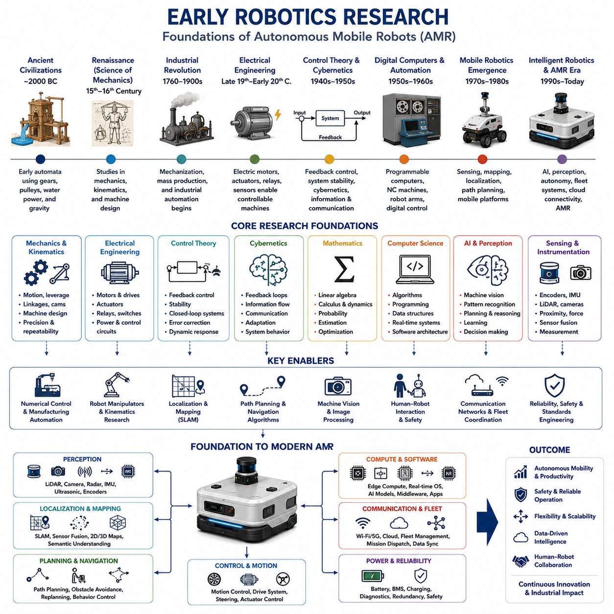
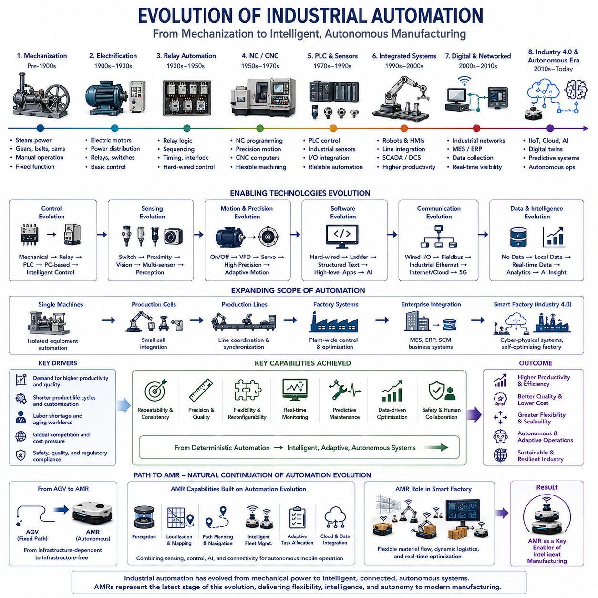
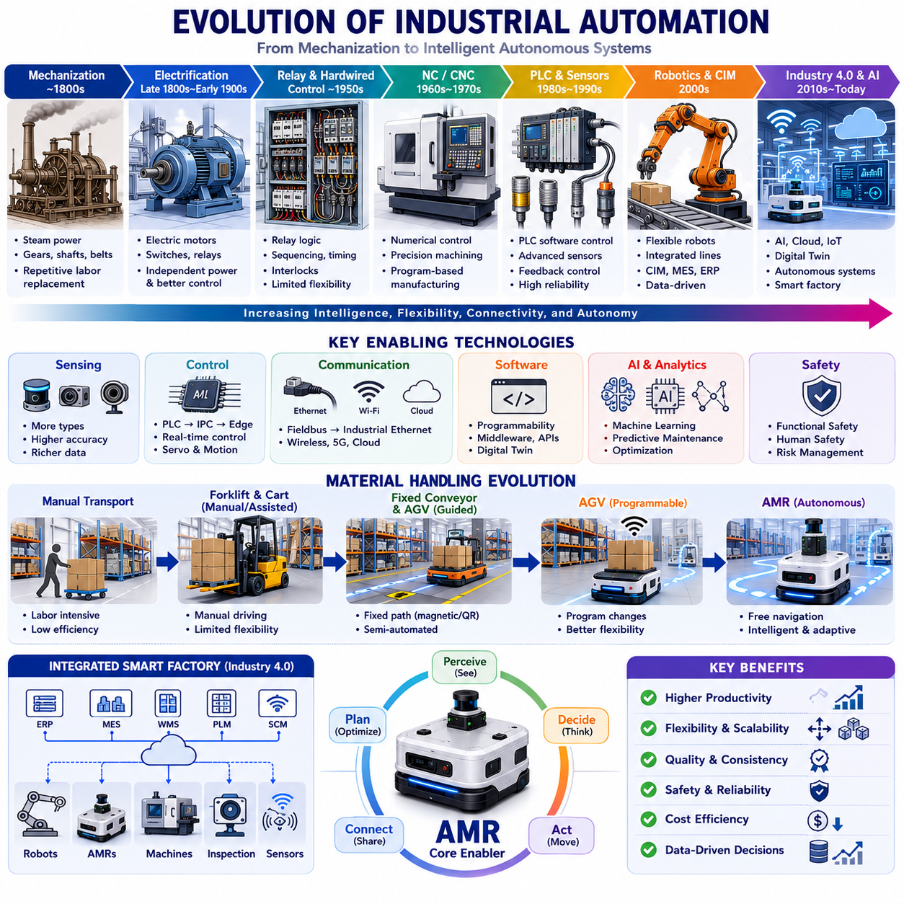
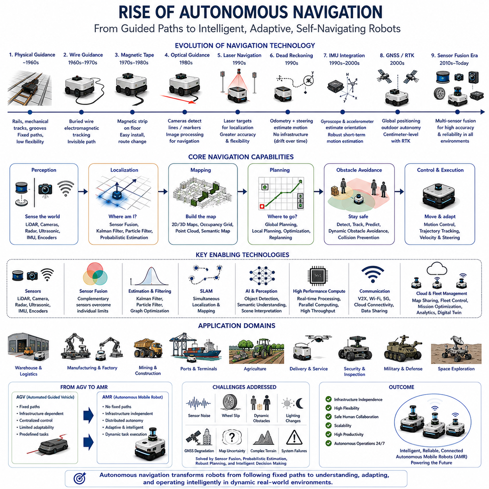
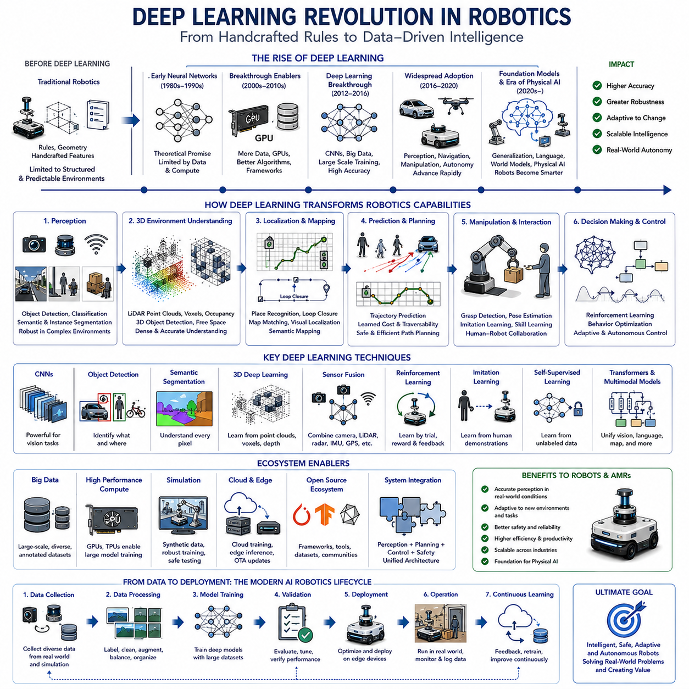
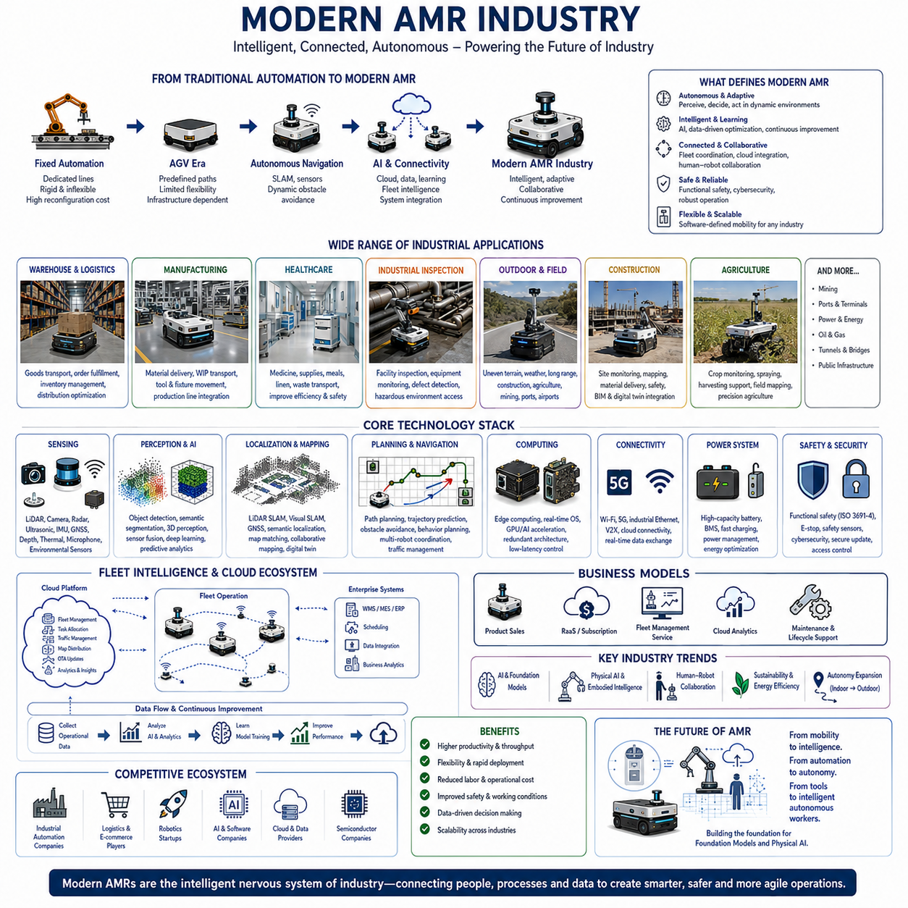

**Volume 01. AMR Foundations and System Architecture**

# 03. History of AMR · AMR의 역사

## 03.01 Early Robotics Research · 초기 로봇공학 연구

{width="7.268055555555556in" height="7.268055555555556in"}

Early robotics research represents the scientific foundation upon which all modern autonomous robots, industrial robots, service robots, and Autonomous Mobile Robots (AMRs) have been built. Although today\'s intelligent robotic systems integrate artificial intelligence, high-performance computing, advanced sensing, and autonomous navigation, these capabilities are the result of decades of interdisciplinary research in mechanics, electronics, control theory, computer science, mathematics, cybernetics, and artificial intelligence. Understanding the historical evolution of robotics provides valuable insight into why current AMR architectures are designed as they are and why certain engineering principles continue to influence modern robotic system development.

The concept of automated mechanical devices predates modern robotics by thousands of years. Ancient civilizations developed mechanical automata capable of performing predefined movements through gears, pulleys, cams, water pressure, and gravity. Although these early machines possessed no sensing or decision-making capability, they demonstrated that mechanical systems could execute repeatable tasks without continuous human manipulation. These inventions established fundamental ideas concerning mechanical motion, energy transfer, timing mechanisms, and programmable behavior that would later become essential elements of robotic engineering.

Scientific progress during the Renaissance significantly accelerated the understanding of mechanics and machine design. Engineers and inventors investigated kinematics, leverage, rotational motion, structural analysis, and mechanical transmission systems while proposing increasingly sophisticated automated mechanisms. These studies expanded humanity\'s understanding of how complex machines could replicate aspects of human movement. Although practical robots remained technologically impossible, the theoretical principles established during this period formed an essential intellectual foundation for later developments in automation and robotics.

The Industrial Revolution transformed automation from isolated mechanical demonstrations into economically valuable manufacturing technologies. Steam engines, precision machining, interchangeable components, mass production techniques, and improved mechanical reliability enabled increasingly complex machinery to perform repetitive industrial tasks. Automation during this era focused primarily on increasing manufacturing productivity rather than achieving machine intelligence. Nevertheless, industrial automation introduced concepts of process optimization, machine repeatability, production efficiency, and system reliability that continue to influence robotic engineering today.

The development of electrical engineering fundamentally changed the future of robotics. Electric motors provided controllable rotational power that greatly exceeded the flexibility of purely mechanical systems. Electromagnetic actuators, electrical relays, switches, sensors, and feedback devices allowed machines to perform more sophisticated sequences of operations. Electrical power also enabled rapid control, precise positioning, and continuous operation, making automated machines significantly more capable than earlier mechanically driven systems.

Control theory emerged as one of the most influential scientific disciplines supporting robotic development. Rather than relying solely on predefined mechanical motion, engineers began designing systems capable of measuring outputs and adjusting their behavior accordingly. Feedback control introduced concepts such as stability, error correction, closed-loop regulation, disturbance rejection, and dynamic system response. These principles remain fundamental to virtually every robotic subsystem, including motor control, steering, localization, navigation, manipulation, battery management, and autonomous mission execution.

Cybernetics introduced a revolutionary perspective by studying communication and control within both biological and artificial systems. Researchers recognized similarities between living organisms and engineered machines, emphasizing continuous sensing, information processing, decision making, and corrective action. Cybernetics demonstrated that intelligent behavior could emerge from closed feedback loops rather than simple predetermined mechanical sequences. Many architectural concepts employed in modern autonomous robots, including perception, feedback, adaptation, and behavioral control, can trace their origins to cybernetic research.

Advances in mathematics contributed substantially to robotics by providing formal methods for describing motion, geometry, optimization, estimation, and dynamic systems. Linear algebra enabled coordinate transformations and robot kinematics. Calculus supported motion planning and dynamic analysis. Probability theory provided frameworks for uncertainty estimation. Optimization methods enabled efficient trajectory generation and resource allocation. These mathematical foundations continue to support localization algorithms, sensor fusion, simultaneous localization and mapping, path planning, computer vision, and artificial intelligence throughout modern AMR systems.

The invention of digital computers represented another transformative milestone. Mechanical and analog controllers could execute only limited operations, whereas programmable digital computers allowed robotic behavior to be modified through software rather than hardware redesign. Programmability dramatically increased flexibility by separating machine functionality from mechanical construction. Modern robots continue to rely upon this principle, with software architectures determining perception, navigation, planning, diagnostics, communication, and mission management while hardware provides sensing and physical actuation.

The emergence of numerical control and programmable manufacturing systems demonstrated that complex industrial operations could be automated through digital instructions. Early programmable machine tools established concepts of trajectory generation, coordinate systems, interpolation, repeatability, and computer-controlled motion. These technologies directly influenced later industrial robot controllers and remain closely related to contemporary motion planning algorithms used by AMRs and robotic manipulators.

Research into robotic manipulators became increasingly important as manufacturing demanded greater automation. Engineers investigated articulated mechanisms capable of performing positioning, assembly, welding, painting, and material handling operations. Kinematic analysis described relationships between joint motion and end-effector position, while inverse kinematics addressed the problem of calculating joint configurations necessary to achieve desired tool locations. These mathematical and mechanical concepts remain central to robot arm design and integrated mobile manipulation systems.

The development of sensors marked another major transition in robotic capability. Early automated machines primarily relied upon switches or mechanical stops. Researchers gradually introduced position encoders, proximity sensors, force sensors, optical devices, ultrasonic sensors, inertial measurement systems, and later laser range sensors and cameras. Each new sensing technology expanded the robot\'s ability to perceive environmental conditions rather than simply executing predefined sequences. Modern AMRs employ this same philosophy through multimodal sensor fusion integrating LiDAR, vision, GNSS, IMU, radar, wheel encoders, and environmental sensing.

Machine vision research fundamentally expanded robotic perception. Cameras enabled robots to observe objects, recognize patterns, estimate positions, inspect products, and interpret dynamic environments. Initially limited by computational capability, early vision systems concentrated on simple geometric recognition under carefully controlled conditions. Continuous improvements in computing power, image processing, and artificial intelligence eventually transformed machine vision into one of the most important technologies supporting autonomous navigation, quality inspection, object detection, semantic understanding, and human-robot interaction.

Artificial intelligence research introduced the possibility that machines could perform reasoning rather than merely executing predefined instructions. Early AI focused on symbolic reasoning, rule-based systems, search algorithms, logical inference, and expert systems. Although these methods experienced practical limitations, they established fundamental ideas regarding knowledge representation, decision making, planning, and intelligent behavior. Many high-level planning architectures used in autonomous robotic systems continue to incorporate concepts originally developed during early artificial intelligence research.

Path planning research sought methods enabling robots to move efficiently while avoiding obstacles and satisfying operational constraints. Researchers developed graph search methods, configuration space representations, visibility graphs, potential field approaches, sampling-based planning, and optimization techniques. These algorithms eventually became essential components of autonomous navigation systems, allowing robots to compute safe and efficient trajectories within both structured and unstructured environments.

Localization research addressed one of robotics\' most fundamental questions: determining a robot\'s position within its environment. Initial approaches relied upon external references, dead reckoning, and odometry, but accumulated errors limited long-distance accuracy. Researchers therefore investigated landmark recognition, probabilistic estimation, Kalman filtering, particle filtering, and later simultaneous localization and mapping techniques. These developments eventually enabled autonomous robots to navigate independently without relying exclusively on external infrastructure.

Mapping research evolved alongside localization because autonomous operation requires environmental understanding in addition to position estimation. Early digital maps consisted of relatively simple geometric models, while later research introduced occupancy grids, topological maps, feature-based representations, semantic maps, and three-dimensional world models. Modern AMRs combine these mapping techniques with real-time perception to continuously update internal representations supporting navigation, obstacle avoidance, fleet coordination, and autonomous decision making.

Mobile robotics emerged as a distinct research discipline when engineers recognized that autonomous intelligence should not be restricted to fixed industrial manipulators. Experimental mobile platforms investigated wheeled locomotion, steering mechanisms, obstacle detection, autonomous navigation, battery management, and onboard computing. These prototypes demonstrated that intelligent robots could move independently through changing environments while continuously sensing and responding to surrounding conditions. This transition from stationary automation toward autonomous mobility ultimately led to the development of modern AMRs.

Research into human-robot interaction emphasized that robots should function safely and efficiently alongside people rather than replacing them entirely. Investigators studied intuitive interfaces, operator supervision, shared control, collaborative behavior, safety monitoring, and ergonomic design. These early efforts established principles that later evolved into collaborative robotics, intuitive fleet management systems, human-aware navigation, and natural interaction technologies supporting industrial, medical, logistics, and service robotics.

Communication technologies gradually transformed isolated robotic machines into connected intelligent systems. Early industrial robots typically operated independently with minimal external communication. Subsequent research introduced fieldbus networks, industrial Ethernet, wireless communication, distributed control, cloud connectivity, and fleet coordination architectures. Modern AMRs depend extensively upon reliable communication for mission assignment, remote monitoring, software updates, map sharing, diagnostics, digital twins, and enterprise integration.

Reliability engineering became increasingly important as robots transitioned from laboratory prototypes to industrial production systems. Researchers investigated fault detection, redundancy, component durability, preventive maintenance, environmental robustness, and safety certification. These studies demonstrated that practical robotic systems require far more than advanced algorithms; successful industrial deployment depends equally upon mechanical reliability, electrical robustness, software quality, maintainability, and predictable long-term performance.

Standardization efforts contributed significantly to widespread robotics adoption. Common interface definitions, communication protocols, safety standards, coordinate conventions, software architectures, and industrial regulations enabled components from multiple manufacturers to interoperate effectively. Standardization reduced development cost, simplified integration, improved maintainability, and accelerated commercial deployment. Contemporary robotic ecosystems continue to benefit from these foundational engineering practices through standardized middleware, industrial communication networks, functional safety requirements, and modular hardware architectures.

Academic research laboratories played a central role throughout early robotics development by providing environments where fundamental scientific questions could be investigated without immediate commercial constraints. Universities explored robot kinematics, control algorithms, perception methods, planning techniques, artificial intelligence, sensor technologies, locomotion systems, and autonomous behaviors. Many technologies that now appear in commercial AMRs originated as long-term university research projects before being refined by industrial development teams.

Government research organizations also accelerated robotics progress through investments supporting manufacturing automation, transportation, aerospace, defense, medical technology, and scientific exploration. Public research funding enabled investigation of challenging engineering problems whose commercial value was not yet fully understood. Many breakthroughs in autonomous navigation, computer vision, mobile robotics, sensor fusion, and intelligent control benefited from sustained research programs extending over multiple decades.

The historical progression of robotics demonstrates that modern autonomous systems did not emerge through a single technological breakthrough. Instead, they evolved through continuous integration of advances across mechanics, electrical engineering, computer science, mathematics, artificial intelligence, sensing, communications, manufacturing, and systems engineering. Each generation built upon previous discoveries while solving increasingly complex problems of perception, mobility, intelligence, and reliability.

From the perspective of Autonomous Mobile Robot development, early robotics research established nearly every foundational discipline required by contemporary intelligent robotic systems. Mechanical design provided mobility platforms, electrical engineering supplied actuation and sensing, control theory enabled stable motion, computer science introduced programmable intelligence, mathematics supported estimation and optimization, artificial intelligence expanded decision-making capability, and systems engineering unified these technologies into complete autonomous platforms. Modern AMRs therefore represent not an isolated invention but the cumulative result of decades of multidisciplinary scientific research that continues to shape the future evolution of intelligent autonomous robotics.

## 03.02 Evolution of Industrial Automation · 산업 자동화의 발전

{width="7.268055555555556in" height="7.268055555555556in"}{width="7.268055555555556in" height="7.268055555555556in"}

The evolution of industrial automation represents one of the most important technological transitions leading to the development of modern Autonomous Mobile Robots (AMRs). Industrial automation did not emerge as a single invention but evolved through continuous advances in mechanical engineering, electrical engineering, manufacturing technology, computer science, control systems, communications, and artificial intelligence. Each generation of automation solved limitations encountered by previous systems while gradually increasing productivity, precision, flexibility, reliability, and autonomy. Modern AMRs should therefore be viewed as the latest stage in the long evolution of industrial automation rather than as an entirely separate technological revolution.

The earliest stage of industrial automation focused primarily on replacing repetitive manual labor with mechanical machinery. Early manufacturing systems relied on human operators to perform nearly every production activity, while machines provided mechanical assistance through gears, shafts, belts, pulleys, cams, and steam-powered mechanisms. Productivity improvements resulted primarily from mechanization rather than intelligence. Machines performed predefined physical motions repeatedly, but they possessed no sensing capability, environmental awareness, or decision-making functions. Nevertheless, these early automated mechanisms established the industrial principle that repetitive physical work could be transferred from humans to machines.

The Industrial Revolution dramatically accelerated automation by introducing standardized manufacturing processes supported by increasingly capable mechanical equipment. Steam engines, improved metallurgy, precision machining, interchangeable components, and mass production methods enabled factories to produce goods at scales previously impossible. Automation during this period remained largely mechanical, with machine behavior determined by physical mechanisms rather than programmable logic. Even so, concepts such as production flow, repeatability, quality consistency, equipment utilization, and process optimization became central objectives that continue to influence industrial automation today.

Electrification fundamentally transformed industrial automation by replacing many mechanical transmission systems with electric motors and electrical control equipment. Electric power provided precise speed regulation, rapid start-stop operation, flexible power distribution, and improved equipment reliability. Manufacturers no longer depended entirely upon centralized mechanical drive shafts, allowing machines to operate more independently and efficiently. Electrical relays, switches, contactors, and protective devices further expanded automation by enabling increasingly sophisticated control sequences throughout manufacturing facilities.

The introduction of relay-based control systems marked the beginning of logical automation within industrial environments. Instead of relying exclusively on mechanical linkages, engineers designed electrical circuits capable of implementing conditional operations, sequencing, timing functions, and interlocking mechanisms. Although relay logic required extensive wiring and was difficult to modify, it demonstrated that industrial machines could perform increasingly complex operations according to predefined logical rules. Many concepts introduced during relay automation later evolved directly into programmable digital control systems.

Numerical Control (NC) represented a major breakthrough by separating manufacturing behavior from purely mechanical construction. Machine tools could now execute precise motions according to coded numerical instructions rather than manually adjusted mechanisms. Coordinate systems, interpolation, motion profiles, and repeatable positioning became software-defined instead of mechanically constrained. Numerical Control significantly improved machining accuracy, manufacturing consistency, and production efficiency while establishing many of the computational principles that later influenced robotic motion control.

Computer Numerical Control (CNC) further advanced manufacturing automation by integrating digital computers directly into machine operation. Unlike earlier NC equipment that depended upon fixed instruction media, CNC systems enabled flexible programming, rapid process modification, complex machining strategies, and automated production optimization. Software became increasingly important within manufacturing systems, allowing engineers to modify production behavior without redesigning mechanical equipment. This transition toward software-defined manufacturing would later become a defining characteristic of industrial robotics and AMRs.

The development of programmable logic controllers fundamentally changed factory automation. Before programmable controllers, modifying production lines often required extensive rewiring of relay circuits. Programmable Logic Controllers (PLCs) replaced hardware logic with software-based control programs, greatly simplifying system modification, maintenance, diagnostics, and expansion. PLCs rapidly became the dominant industrial control platform because they combined reliability, deterministic execution, real-time response, and ease of programming while supporting increasingly complex manufacturing processes.

Industrial sensors evolved simultaneously with programmable control systems. Early automation relied primarily upon limit switches and mechanical contact devices for machine feedback. As sensor technology matured, photoelectric sensors, inductive proximity sensors, capacitive sensors, pressure sensors, temperature sensors, encoders, laser sensors, vision systems, force sensors, and environmental monitoring devices dramatically expanded the amount of information available to automated systems. Manufacturing equipment gradually transitioned from executing predefined sequences toward responding intelligently to continuously changing operational conditions.

Feedback control became increasingly sophisticated as automation systems evolved. Early machinery simply executed commands without evaluating outcomes. Closed-loop control introduced continuous measurement of system behavior, enabling controllers to compensate automatically for disturbances, wear, process variation, and environmental changes. Servo systems provided highly accurate position, velocity, and torque control, making precision manufacturing, robotic manipulation, semiconductor production, and automated assembly practical on an industrial scale. These same feedback principles remain fundamental to AMR navigation, steering, localization, and motion control.

Manufacturing automation gradually expanded from individual machines to complete production lines. Instead of optimizing isolated equipment, engineers began coordinating multiple machines into integrated manufacturing systems. Material handling equipment, conveyors, robotic manipulators, inspection stations, storage systems, and quality control processes became interconnected through centralized control architectures. Production planning, scheduling, workflow optimization, and equipment synchronization transformed automation from machine-level control into factory-wide system engineering.

Flexible Manufacturing Systems emerged to address growing demand for product variety without sacrificing productivity. Traditional automation excelled at producing identical products in large quantities but struggled when production requirements changed. Flexible manufacturing introduced programmable equipment, automated tooling changes, adaptive production scheduling, and computer-integrated manufacturing techniques capable of supporting smaller production batches while maintaining high efficiency. This emphasis on flexibility strongly influenced the subsequent development of autonomous mobile robotics.

Industrial robots introduced programmable mechanical manipulation into manufacturing environments. Unlike dedicated automation equipment designed for a single repetitive task, industrial robot arms could be reprogrammed to perform welding, painting, assembly, packaging, machine tending, material handling, inspection, and palletizing. Robot manipulators demonstrated that programmable automation could achieve substantially greater versatility than purely mechanical systems. This transition from dedicated automation toward flexible robotic automation established many engineering principles later adopted by autonomous mobile robots.

Computer-Integrated Manufacturing represented another major evolutionary step by connecting engineering design, manufacturing planning, production scheduling, inventory management, quality assurance, and factory control through digital information systems. Data became as important as physical production equipment. Computer-aided design, computer-aided manufacturing, enterprise databases, and production management software created integrated digital manufacturing environments capable of coordinating increasingly complex industrial operations.

Communication networks fundamentally transformed industrial automation by allowing distributed control systems to exchange information rapidly and reliably. Fieldbus technologies, industrial Ethernet, deterministic communication protocols, wireless networking, and real-time distributed architectures enabled sensors, controllers, robots, manufacturing equipment, and enterprise software to function as coordinated systems rather than isolated machines. Modern AMRs continue this trend through fleet management, cloud connectivity, digital twins, remote diagnostics, and distributed mission coordination.

Quality control also evolved from manual inspection toward automated measurement and intelligent process monitoring. Traditional manufacturing relied heavily upon post-production inspection to identify defective products. Industrial automation gradually introduced in-process sensing, statistical process control, machine vision, dimensional measurement, and automated defect detection capable of identifying quality issues during production rather than afterward. This shift toward real-time quality assurance significantly improved manufacturing efficiency while reducing waste and rework.

Machine vision became one of the most influential technologies supporting modern industrial automation. Cameras combined with image processing algorithms enabled automated inspection, object recognition, dimensional verification, barcode reading, guidance, defect detection, and process monitoring without physical contact. Initially limited to relatively simple image analysis tasks, machine vision systems steadily evolved into intelligent perception platforms capable of supporting robotic manipulation, autonomous navigation, semantic scene understanding, and AI-assisted manufacturing.

The increasing computational capability of industrial computers expanded automation beyond deterministic logic into optimization and adaptive control. Faster processors enabled complex mathematical modeling, predictive algorithms, simulation, diagnostics, statistical analysis, and real-time optimization. Manufacturing systems could evaluate operational data continuously, improving equipment utilization, reducing energy consumption, minimizing downtime, and increasing production quality. These computational advances created the foundation for intelligent autonomous robotics.

Artificial intelligence gradually entered industrial automation through expert systems, optimization algorithms, predictive maintenance, anomaly detection, scheduling optimization, and machine learning. Rather than replacing deterministic industrial control, AI initially complemented existing automation by improving decision quality in areas involving uncertainty or large amounts of operational data. Modern manufacturing increasingly combines traditional control theory with artificial intelligence to enhance perception, planning, forecasting, diagnostics, and process optimization.

Predictive maintenance represents one of the most successful applications of intelligent industrial automation. Traditional maintenance strategies relied either on scheduled service intervals or corrective repair after failure occurred. Industrial monitoring systems now continuously evaluate vibration, temperature, current consumption, pressure, lubrication condition, sensor health, and equipment performance to estimate remaining useful life and predict failures before production interruptions occur. Similar health-monitoring architectures are becoming essential components of modern AMRs.

Material handling automation evolved substantially throughout industrial history. Early factories depended heavily upon manual transportation using carts, forklifts, cranes, and conveyors. Fixed conveyor systems improved efficiency but offered limited flexibility when production layouts changed. Automated Guided Vehicles (AGVs) introduced programmable transportation using predefined guide paths, while Autonomous Mobile Robots later removed much of the physical guidance infrastructure by relying upon onboard perception, localization, mapping, and intelligent navigation. This evolution represents one of the clearest examples of automation progressing from deterministic infrastructure toward adaptive autonomy.

Factory information systems became increasingly integrated as manufacturing complexity grew. Manufacturing Execution Systems (MES), Enterprise Resource Planning (ERP), Warehouse Management Systems (WMS), Product Lifecycle Management (PLM), and Supply Chain Management (SCM) software established digital information flow across entire organizations. Automation therefore expanded beyond physical production into enterprise-wide coordination involving planning, logistics, quality management, maintenance, inventory control, and customer fulfillment. Modern AMRs operate as intelligent participants within these digital manufacturing ecosystems.

Safety engineering evolved alongside automation because increasingly capable machines introduced new operational risks. Mechanical guards, emergency stops, safety relays, redundant control systems, light curtains, laser safety scanners, functional safety standards, and certified safety controllers progressively improved protection for human workers. Modern collaborative automation extends these principles through dynamic safety monitoring, human-aware motion planning, speed adaptation, collision avoidance, and intelligent risk assessment integrated directly into autonomous robotic platforms.

Industrial automation also became increasingly modular throughout its evolution. Early manufacturing systems were typically designed as monolithic installations optimized for a single production purpose. Modern automation emphasizes standardized interfaces, modular equipment, reusable software components, scalable architectures, and interoperable communication protocols. This modular philosophy greatly simplifies system expansion, maintenance, technology upgrades, and customization while reducing lifecycle costs. AMR architectures strongly inherit these modular engineering principles.

Cloud computing and Industrial Internet of Things technologies further extended automation beyond factory boundaries. Manufacturing equipment now generates continuous operational data supporting remote monitoring, centralized analytics, predictive maintenance, software updates, digital twins, fleet coordination, and enterprise optimization. Automation is no longer confined to local machine controllers but increasingly operates within distributed cyber-physical systems connecting production facilities, logistics networks, engineering organizations, and cloud-based intelligence platforms.

The emergence of Industry 4.0 marked another significant milestone in the evolution of industrial automation. Industry 4.0 emphasizes cyber-physical systems, digital twins, artificial intelligence, industrial connectivity, cloud computing, edge computing, advanced analytics, autonomous decision making, and highly flexible manufacturing. Rather than optimizing isolated production equipment, Industry 4.0 seeks to create intelligent manufacturing ecosystems capable of continuous adaptation, self-optimization, and data-driven decision making throughout the complete product lifecycle.

Within Industry 4.0, Autonomous Mobile Robots occupy a central role because they provide flexible physical mobility linking otherwise independent manufacturing systems. Unlike fixed conveyors or dedicated transportation infrastructure, AMRs dynamically connect production equipment, warehouses, inspection stations, charging facilities, human operators, and logistics processes. Their ability to combine autonomous navigation, intelligent fleet coordination, adaptive task allocation, and software-defined operation makes them fundamental components of modern smart factories.

The evolution of industrial automation demonstrates a consistent technological trend. Each generation reduced dependence on fixed mechanical infrastructure while increasing software capability, sensing intelligence, connectivity, flexibility, and autonomous decision making. Mechanization evolved into electrification, electrification evolved into programmable control, programmable control evolved into digital manufacturing, digital manufacturing evolved into intelligent automation, and intelligent automation continues evolving toward fully autonomous cyber-physical production systems.

From the perspective of AMR development, the history of industrial automation provides far more than historical background. It explains why modern AMRs integrate mechanical engineering, electrical systems, programmable control, industrial communication, perception, localization, artificial intelligence, cloud connectivity, fleet management, and enterprise integration into a unified architecture. Autonomous Mobile Robots therefore represent the natural continuation of more than two centuries of industrial automation evolution, combining the reliability of traditional manufacturing engineering with the adaptability and intelligence required by future autonomous production environments.

## 03.03 Rise of Autonomous Navigation · 자율 내비게이션의 부상

{width="7.268055555555556in" height="7.268055555555556in"}

Autonomous navigation represents one of the most significant technological breakthroughs in the history of robotics because it transformed machines from fixed, infrastructure-dependent systems into intelligent mobile platforms capable of operating independently within dynamic environments. Before autonomous navigation emerged, most automated machines performed useful work only when constrained by predefined mechanical paths, fixed production layouts, or external guidance infrastructure. The development of autonomous navigation fundamentally changed this paradigm by allowing robots to perceive their surroundings, estimate their own position, plan safe routes, avoid obstacles, and continuously adapt their behavior without requiring continuous human intervention.

The earliest automated transportation systems relied entirely upon predetermined physical guidance. Factory vehicles followed rails embedded within the floor, mechanical tracks, cables, or guide grooves that physically constrained movement. These systems offered excellent repeatability and reliability under controlled conditions but lacked flexibility. Any modification to factory layouts required expensive infrastructure changes, making adaptation difficult as manufacturing processes evolved. Nevertheless, these early guided systems demonstrated that automated transportation could significantly improve industrial productivity while reducing repetitive manual labor.

Wire-guided navigation became one of the first practical methods for automated industrial vehicles. Electrical wires buried beneath factory floors generated electromagnetic fields detected by onboard sensors, enabling vehicles to follow invisible predefined routes. Wire guidance eliminated visible tracks while improving routing flexibility compared to purely mechanical guidance. However, navigation remained completely dependent upon infrastructure installation, and route modifications still required construction work within production facilities. Despite these limitations, wire-guided systems became widely adopted throughout manufacturing and warehouse automation.

Magnetic tape guidance represented another evolutionary improvement in automated vehicle navigation. Magnetic strips attached directly to floor surfaces replaced buried guidance wires, greatly simplifying installation and route modification. Factories could redesign transportation routes by repositioning magnetic tape rather than reconstructing infrastructure beneath the floor. This increased deployment flexibility while maintaining relatively low system complexity. However, vehicles continued to follow fixed paths and possessed little capability for autonomous decision making when encountering unexpected obstacles or changing operational conditions.

Optical guidance introduced cameras and visual markers into automated navigation systems. Instead of detecting magnetic or electromagnetic guidance, vehicles recognized painted lines, reflective markers, colored paths, or optical landmarks distributed throughout operating environments. Image processing techniques gradually improved vehicle positioning accuracy while reducing dependence upon specialized infrastructure. Although optical guidance remained largely deterministic, it introduced computer vision into industrial navigation and established many perception concepts later expanded within autonomous robotics.

The emergence of laser guidance significantly improved navigation accuracy within industrial environments. Laser scanners detected reflective targets positioned throughout facilities, enabling vehicles to estimate their positions through geometric calculations rather than following physical guidance paths directly. Laser-based localization provided substantially greater routing flexibility while supporting larger operational areas. Automated Guided Vehicles equipped with laser navigation could travel between multiple destinations using programmable routes rather than remaining restricted to single predefined tracks.

Dead reckoning became an important navigation technique supporting mobile robots operating beyond fixed guidance infrastructure. By continuously integrating wheel encoder measurements, steering angles, and vehicle motion estimates, robots could approximate their current positions relative to previous locations. Although dead reckoning accumulated errors over time due to wheel slip, uneven terrain, mechanical tolerances, and sensor noise, it demonstrated that robots could estimate their own movement independently without relying exclusively upon external references. Modern autonomous systems continue to incorporate dead reckoning within larger multi-sensor localization architectures.

The integration of inertial measurement technology further enhanced mobile navigation. Gyroscopes and accelerometers provided direct measurements of rotational and translational motion, allowing robots to estimate orientation and movement even when external positioning references became temporarily unavailable. Initially developed for aerospace and military applications, Inertial Measurement Units eventually became standard components of autonomous mobile robots. Although inertial sensors experience cumulative drift, they provide critical short-term motion estimation supporting continuous localization during challenging operating conditions.

Global Navigation Satellite Systems revolutionized outdoor autonomous navigation by providing absolute global positioning capabilities. Satellite-based navigation enabled autonomous vehicles to determine geographic position over extremely large operational areas without requiring dedicated local guidance infrastructure. Differential corrections and Real-Time Kinematic positioning significantly improved positioning accuracy from meter-level estimates to centimeter-level precision under favorable conditions. Nevertheless, satellite navigation alone proved insufficient because signal blockage, multipath effects, urban environments, tunnels, forests, and industrial structures frequently degraded positioning performance.

Researchers therefore recognized that no individual navigation sensor could provide sufficient reliability across all operating environments. Sensor fusion emerged as a fundamental principle within autonomous navigation by combining complementary measurements from GNSS receivers, IMUs, wheel encoders, cameras, LiDARs, radar systems, ultrasonic sensors, and environmental observations. Each sensor compensated for limitations present within other sensors, producing localization performance substantially more accurate and robust than any individual measurement source could achieve independently.

Localization research became increasingly sophisticated as autonomous navigation matured. Early navigation methods estimated position primarily through deterministic geometric calculations. However, real-world environments introduced uncertainty arising from sensor noise, environmental variability, wheel slip, changing lighting conditions, and imperfect measurements. Probabilistic localization methods therefore modeled uncertainty explicitly using statistical estimation techniques, enabling robots to maintain reliable position estimates despite incomplete or noisy information. These probabilistic frameworks became central to modern autonomous navigation.

Kalman filtering represented one of the earliest widely adopted probabilistic estimation methods supporting autonomous navigation. By continuously combining predicted vehicle motion with incoming sensor observations, Kalman filters produced statistically optimal state estimates under appropriate assumptions. Numerous variants, including Extended Kalman Filters and Unscented Kalman Filters, expanded applicability to nonlinear robotic systems. These estimation techniques remain important components of navigation systems integrating GNSS, IMU, odometry, and additional sensor measurements.

Particle filtering further extended localization capability within complex and nonlinear environments. Instead of representing uncertainty using only Gaussian distributions, particle filters maintained multiple hypothetical vehicle positions simultaneously while updating probabilities according to sensor observations. This approach significantly improved localization performance under ambiguous environmental conditions where multiple possible robot positions existed. Particle filtering remains widely employed within autonomous navigation, particularly for mobile robots operating in previously mapped environments.

Mapping became equally important because autonomous robots require environmental understanding in addition to self-localization. Early digital maps consisted primarily of geometric floor plans or manually constructed reference models. However, researchers recognized that robots should generate and continuously update maps independently while exploring unknown environments. Mapping therefore evolved from static reference information toward dynamic environmental representation supporting perception, planning, obstacle avoidance, and long-term operational autonomy.

Simultaneous Localization and Mapping represented one of the most influential breakthroughs in robotics research. Rather than assuming that accurate maps already existed, SLAM enabled robots to estimate their own positions while constructing maps of previously unknown environments at the same time. This dual estimation problem had challenged researchers for decades because localization depends upon maps while mapping depends upon localization. Advances in probabilistic estimation, optimization algorithms, graph theory, and sensor technology eventually enabled practical SLAM systems capable of supporting reliable autonomous navigation.

LiDAR technology transformed autonomous navigation by providing highly accurate three-dimensional geometric measurements of surrounding environments. Laser scanners generated dense point clouds describing nearby structures with remarkable precision regardless of ambient illumination. LiDAR-based perception greatly improved localization robustness, obstacle detection, environmental modeling, and mapping accuracy while supporting autonomous operation across warehouses, factories, campuses, mining sites, ports, and outdoor transportation environments.

Vision-based navigation expanded robotic perception beyond purely geometric information. Cameras enabled robots to recognize landmarks, identify semantic features, classify objects, interpret traffic signs, detect pedestrians, estimate traversable terrain, and understand scene context. Advances in computer vision allowed robots to utilize naturally occurring environmental features rather than depending exclusively upon artificial markers or dedicated infrastructure. Visual localization consequently became an essential component of modern autonomous navigation architectures.

Visual SLAM combined computer vision with localization and mapping to create detailed environmental models using one or more cameras. Unlike LiDAR-based systems emphasizing geometric structure, Visual SLAM exploited image features, feature matching, epipolar geometry, and bundle adjustment to estimate both camera motion and environmental structure. Improvements in computational capability gradually enabled real-time Visual SLAM suitable for numerous indoor and outdoor robotic applications while reducing hardware cost relative to specialized ranging sensors.

Obstacle detection evolved alongside navigation because accurate localization alone cannot guarantee safe operation. Autonomous robots must identify both static and dynamic obstacles while predicting future environmental changes. Early obstacle detection relied upon simple proximity sensors and contact switches. Modern autonomous navigation instead integrates LiDAR, stereo vision, radar, depth cameras, ultrasonic sensing, and artificial intelligence to detect, classify, track, and predict the motion of surrounding objects continuously during operation.

Path planning became increasingly sophisticated as robots gained richer environmental awareness. Early navigation algorithms generated relatively simple collision-free routes through static environments. Later research introduced graph search algorithms, optimization-based planning, sampling-based planners, dynamic replanning, behavioral planning, and predictive trajectory generation capable of responding continuously to changing environmental conditions. Modern AMRs therefore plan not only feasible paths but also efficient, safe, comfortable, and operationally optimal trajectories.

Dynamic obstacle avoidance represented another major milestone within autonomous navigation. Industrial environments contain people, forklifts, mobile equipment, pallets, vehicles, and continuously changing obstacles that cannot be represented completely within static maps. Autonomous navigation systems therefore evolved toward continuous environmental perception, motion prediction, behavioral reasoning, and real-time trajectory modification, enabling robots to coexist safely with humans while maintaining productive operation.

Semantic understanding gradually expanded navigation beyond geometric mapping alone. Robots increasingly recognize doors, corridors, loading stations, charging docks, elevators, traffic lanes, storage racks, machinery, workstations, and pedestrian zones as meaningful environmental entities rather than collections of geometric points. Semantic maps provide contextual information supporting higher-level reasoning, mission planning, human interaction, and intelligent decision making across complex operational environments.

Navigation architectures simultaneously evolved from centralized control toward distributed autonomy. Earlier automated transportation systems relied heavily upon centralized supervisory controllers assigning deterministic routes. Modern autonomous robots increasingly perform perception, localization, planning, obstacle avoidance, health monitoring, and behavioral decision making locally while coordinating with fleet management systems through high-level mission commands. This distributed intelligence improves scalability, robustness, responsiveness, and operational flexibility across large robotic deployments.

Outdoor autonomous navigation introduced substantially greater complexity than indoor environments. Outdoor robots encounter uneven terrain, changing weather, varying illumination, vegetation, mud, snow, rain, dust, construction activities, dynamic traffic, GNSS degradation, and long operational distances. These challenges required substantial advances in sensor fusion, environmental perception, localization robustness, terrain analysis, adaptive planning, and system reliability beyond those required for indoor factory automation.

Autonomous navigation also expanded beyond industrial logistics into numerous application domains. Mining vehicles, agricultural robots, construction equipment, autonomous forklifts, port transportation systems, warehouse robots, military platforms, delivery robots, airport service vehicles, inspection robots, and planetary exploration systems all adopted increasingly sophisticated navigation technologies tailored to their specific operational environments. Each application contributed new algorithms, sensing methods, validation techniques, and engineering experience that collectively accelerated progress throughout the robotics industry.

Functional safety became increasingly integrated with navigation as robots transitioned from isolated research platforms toward commercial deployment. Navigation systems must not only estimate positions accurately but also recognize uncertainty, detect failures, enter safe operational states, and respond appropriately to hazardous situations. Safety-certified localization, redundant sensing, integrity monitoring, fail-safe behaviors, and continuous health diagnostics therefore became essential components of modern autonomous navigation architectures supporting reliable long-term operation in human-populated environments.

Cloud computing and connected fleet management further expanded navigation capability by enabling map sharing, collaborative localization, centralized mission optimization, traffic coordination, software updates, digital twins, and operational analytics across multiple robots simultaneously. Although individual robots maintain autonomous decision-making capability locally, cloud-connected navigation systems improve overall fleet efficiency by coordinating information exchange throughout entire robotic ecosystems.

The emergence of autonomous navigation fundamentally changed the design philosophy of mobile robotics. Navigation evolved from infrastructure-dependent guidance toward perception-driven intelligence, from deterministic motion toward adaptive decision making, and from isolated vehicle control toward connected autonomous systems capable of understanding, interpreting, and interacting with continuously changing environments. Modern Autonomous Mobile Robots inherit every major technological advancement introduced during this evolution, integrating perception, localization, mapping, planning, sensor fusion, communication, artificial intelligence, and functional safety into unified navigation architectures capable of supporting reliable autonomous operation across an increasingly diverse range of industrial and commercial applications.

## 03.04 Deep Learning Revolution · 딥러닝 혁명

{width="7.268055555555556in" height="7.268055555555556in"}

The deep learning revolution fundamentally transformed robotics by replacing manually engineered perception and decision-making algorithms with data-driven learning systems capable of extracting complex representations directly from large datasets. Earlier generations of robotic systems depended heavily upon handcrafted features, geometric models, deterministic rules, and carefully tuned parameters that required significant engineering effort for every new operating environment. While these approaches achieved considerable success within structured industrial settings, they struggled when robots encountered variability in lighting, weather, object appearance, sensor noise, environmental complexity, and dynamic obstacles. Deep learning introduced a fundamentally different paradigm in which robots learned representations directly from experience, enabling substantial improvements in perception, localization, planning, manipulation, and autonomous decision making.

Although artificial neural networks had existed for several decades, practical deployment remained limited by computational capability, available training data, and optimization techniques. Early neural network research demonstrated the theoretical possibility of machine learning but was constrained by shallow architectures, limited computing resources, and relatively small datasets. Researchers recognized the potential advantages of multilayer learning systems but lacked the hardware and algorithms necessary to train large-scale networks efficiently. Consequently, robotics continued relying primarily upon traditional control theory, rule-based reasoning, and manually engineered computer vision throughout much of its early development.

Several technological advances converged to enable the deep learning revolution. High-performance Graphics Processing Units provided massively parallel computation suitable for training extremely large neural networks. Large annotated datasets became available through advances in digital imaging, internet-scale data collection, industrial automation, and autonomous vehicle research. Improvements in optimization algorithms, activation functions, regularization methods, normalization techniques, and software frameworks significantly accelerated neural network training while improving convergence stability. Together, these developments transformed deep learning from an academic research topic into a practical engineering technology applicable across numerous robotic domains.

Convolutional Neural Networks represented one of the earliest major breakthroughs influencing robotics. CNN architectures demonstrated exceptional performance in image classification, object detection, feature extraction, and visual recognition by automatically learning hierarchical representations directly from image data. Unlike traditional computer vision algorithms requiring manually designed feature descriptors, convolutional networks learned increasingly abstract visual representations through multiple layers of nonlinear processing. This capability dramatically improved robotic perception across industrial inspection, warehouse automation, autonomous driving, agricultural robotics, service robotics, and manufacturing quality assurance.

Object detection rapidly became one of the most influential applications of deep learning within autonomous robotics. Classical detection methods frequently struggled with changing illumination, occlusion, cluttered scenes, varying viewpoints, and complex object appearances. Deep learning-based detectors significantly improved recognition accuracy while simultaneously identifying object categories and estimating object locations. Robots gained the ability to recognize pedestrians, vehicles, pallets, shelving, machinery, traffic signs, tools, containers, infrastructure components, and numerous other environmental objects with substantially greater robustness than previous vision systems.

Semantic segmentation further expanded robotic environmental understanding by assigning semantic labels to every pixel within an image rather than merely detecting isolated objects. Instead of recognizing individual obstacles alone, robots learned to distinguish roads, sidewalks, warehouse floors, vegetation, buildings, walls, workstations, storage racks, loading zones, pedestrian areas, and traversable terrain. Dense semantic understanding enabled autonomous systems to interpret operational environments more similarly to human perception, supporting increasingly sophisticated navigation, safety reasoning, task execution, and environmental interaction.

Instance segmentation introduced additional capability by simultaneously recognizing object categories while separating multiple individual instances belonging to the same class. For example, autonomous robots could distinguish multiple people standing together, identify individual pallets stacked within warehouses, recognize separate vehicles within traffic environments, or manipulate individual components during manufacturing operations. This richer scene understanding significantly improved manipulation, inventory management, autonomous inspection, and human-robot collaboration.

Deep learning also transformed three-dimensional perception by enabling neural networks to process LiDAR point clouds, depth images, voxel representations, occupancy grids, and multimodal spatial data. Traditional geometric algorithms often required carefully designed heuristics for feature extraction and environmental modeling. Neural architectures instead learned geometric representations directly from data, improving object recognition, obstacle detection, free-space estimation, terrain classification, localization support, and environmental mapping. These advances greatly enhanced autonomous navigation across both indoor and outdoor environments.

Sensor fusion experienced similar advances through deep learning. Earlier fusion architectures relied primarily upon manually designed probabilistic models integrating measurements from cameras, LiDAR, radar, GNSS, IMUs, ultrasonic sensors, and wheel encoders. Deep learning introduced data-driven sensor fusion capable of learning complex relationships between heterogeneous sensing modalities automatically. Neural fusion architectures improved robustness under challenging environmental conditions including rain, fog, snow, nighttime operation, dust, glare, partial sensor failures, and dynamic urban environments where traditional fusion methods often struggled.

Localization systems also benefited from deep learning through learned feature extraction, place recognition, loop closure detection, visual localization, and map matching. Rather than depending exclusively upon handcrafted geometric descriptors, neural networks learned highly discriminative environmental features capable of recognizing previously visited locations despite substantial appearance changes. This significantly improved long-term navigation reliability across environments experiencing seasonal variation, lighting changes, structural modifications, or repetitive industrial layouts.

Mapping technologies evolved simultaneously with learned perception. Traditional maps represented geometry through manually engineered feature extraction and probabilistic occupancy estimation. Deep learning expanded mapping toward semantic world models integrating geometric structure with object identity, environmental context, traversability, infrastructure understanding, and operational knowledge. Robots increasingly generated maps describing not only where obstacles existed but also what those obstacles represented and how they influenced future navigation and task execution.

Path planning gradually incorporated learned environmental understanding rather than relying solely upon predefined cost functions and manually tuned heuristics. Deep learning enabled robots to estimate traversability, predict environmental dynamics, anticipate pedestrian behavior, recognize operational constraints, and optimize navigation decisions according to learned experience. Although deterministic planning algorithms remain important, learned representations increasingly provide richer environmental information supporting safer and more efficient autonomous decision making.

Deep learning similarly transformed robotic manipulation. Earlier manipulation systems required highly structured environments with precisely defined object positions and carefully engineered grasping strategies. Neural networks enabled robots to recognize arbitrary objects, estimate grasp points, infer object properties, predict successful manipulations, and adapt to uncertain operating conditions. Robots gradually became capable of handling previously unseen objects while maintaining acceptable reliability across manufacturing, logistics, warehouse automation, service robotics, and agricultural applications.

Reinforcement learning expanded deep learning beyond perception into autonomous behavior optimization. Instead of programming explicit control strategies manually, reinforcement learning enabled robots to discover effective behaviors through interaction with simulated or physical environments. By maximizing cumulative rewards, robots learned navigation strategies, manipulation skills, docking procedures, balancing behaviors, energy-efficient motion, collaborative interaction, and adaptive task execution. Reinforcement learning demonstrated that complex robotic behaviors could emerge from experience rather than exclusively from manually engineered control logic.

Imitation learning provided another important approach for robotic intelligence by allowing robots to acquire skills directly from expert demonstrations. Human operators performed representative tasks while robots learned underlying behavioral policies from recorded observations. This significantly reduced manual programming effort for repetitive industrial tasks while enabling rapid deployment across changing operational environments. Combined with reinforcement learning, imitation learning accelerated development of adaptive robotic behaviors requiring minimal explicit engineering.

Simulation became increasingly important throughout the deep learning revolution because collecting sufficient real-world robotic data remained expensive, time-consuming, and potentially hazardous. High-fidelity simulation environments enabled researchers to generate millions of training examples safely while exploring diverse operational scenarios impossible to reproduce consistently in physical environments. Domain randomization, synthetic data generation, and sim-to-real transfer techniques reduced the gap between virtual training and real-world deployment, enabling neural models trained primarily within simulation to operate successfully on physical robotic platforms.

Transfer learning further accelerated robotics development by allowing neural networks trained for one application to adapt efficiently to related tasks using relatively small additional datasets. Instead of training every robotic perception model entirely from scratch, engineers reused pretrained visual representations acquired from massive general-purpose datasets. Transfer learning reduced computational cost, shortened development time, improved generalization, and enabled smaller organizations to deploy advanced robotic intelligence using limited data resources.

Self-supervised learning addressed another important limitation by reducing dependence upon manually labeled training data. Robots continuously generate enormous quantities of sensor observations during normal operation, yet manually annotating these datasets remains prohibitively expensive. Self-supervised methods enabled neural networks to learn meaningful representations directly from unlabeled sensor data using internal consistency objectives. This approach significantly improved scalability while allowing robotic systems to benefit from continuously growing operational experience.

Multimodal learning became increasingly important because autonomous robots perceive the world through numerous complementary sensing modalities simultaneously. Rather than processing cameras, LiDAR, radar, language, audio, force sensors, and proprioceptive measurements independently, multimodal neural architectures learned unified representations integrating heterogeneous information sources. These integrated representations improved environmental understanding, navigation robustness, manipulation performance, human interaction, and high-level reasoning across increasingly complex operational scenarios.

Transformer architectures represented another major milestone within deep learning. Originally developed for natural language processing, transformers demonstrated exceptional capability for modeling long-range relationships within sequential and spatial data. Vision transformers, multimodal transformers, and large-scale attention mechanisms significantly expanded robotic perception while enabling unified architectures processing images, point clouds, language, maps, and temporal sensor observations simultaneously. Transformers gradually became foundational components supporting increasingly capable robotic intelligence.

Large Vision-Language Models further expanded robotic capability by combining visual perception with natural language understanding. Robots gained the ability to interpret human instructions, describe surrounding environments, answer questions about operational situations, reason about task objectives, and coordinate actions using conversational interfaces. Vision-language integration significantly reduced dependence upon rigid command interfaces while improving collaboration between robots and human operators throughout industrial and service environments.

The deep learning revolution also transformed autonomous navigation by improving every stage of the navigation pipeline. Learned perception enhanced obstacle detection and semantic understanding. Learned localization improved place recognition and map matching. Learned prediction estimated future trajectories of pedestrians and vehicles. Learned planning generated safer and smoother navigation strategies under uncertain conditions. Rather than replacing traditional robotics algorithms entirely, deep learning increasingly complemented deterministic estimation and control techniques by providing richer environmental understanding and more adaptive decision-making capability.

Industrial inspection experienced particularly significant benefits from deep learning because neural networks excelled at recognizing subtle visual defects difficult to describe using manually engineered rules. Surface scratches, manufacturing defects, weld imperfections, corrosion, cracks, contamination, missing components, assembly errors, and structural anomalies could be detected automatically with increasing accuracy. Deep learning therefore expanded robotics beyond transportation and manipulation into intelligent quality assurance, predictive maintenance, infrastructure inspection, and industrial diagnostics.

Cloud computing and distributed training further accelerated deep learning adoption within robotics. Large centralized computing clusters trained increasingly sophisticated models using enormous datasets collected across multiple robots, production facilities, and operational environments. Trained models could then be deployed efficiently onto edge computing platforms operating directly onboard autonomous robots. Continuous cloud-based improvement combined with edge inference created highly scalable deployment architectures supporting rapidly evolving robotic capabilities.

The deep learning revolution also introduced new engineering challenges. Neural networks require extensive computational resources, high-quality datasets, careful validation, explainability analysis, bias mitigation, uncertainty estimation, cybersecurity protection, and continuous performance monitoring throughout deployment. Unlike deterministic algorithms whose behavior can often be analyzed directly, learned models require comprehensive validation across diverse operational conditions to ensure reliable, safe, and predictable performance within industrial applications. Consequently, modern robotics increasingly integrates traditional systems engineering with machine learning engineering to achieve dependable autonomous operation.

From the perspective of Autonomous Mobile Robot development, the deep learning revolution represents far more than an improvement in computer vision. It fundamentally shifted robotics from manually programmed behavior toward data-driven intelligence capable of continuous learning, adaptation, and increasingly sophisticated environmental understanding. Modern AMRs combine deep neural perception, multimodal sensor fusion, semantic mapping, intelligent localization, predictive planning, reinforcement learning, cloud-based model improvement, and high-performance edge computing within unified software architectures. This transformation established the technological foundation upon which the subsequent generation of foundation models, multimodal reasoning systems, and Physical AI continues to build, moving robotics progressively closer to truly intelligent autonomous systems capable of operating safely, efficiently, and adaptively across diverse real-world environments.

## 03.05 Modern AMR Industry · 현대 AMR 산업

{width="7.268055555555556in" height="7.268055555555556in"}

The modern Autonomous Mobile Robot industry represents the convergence of more than a century of progress in industrial automation, robotics, computer science, sensing technologies, artificial intelligence, cloud computing, and advanced manufacturing. Unlike earlier generations of automated machines that primarily executed predefined tasks within structured environments, modern AMRs operate as intelligent autonomous systems capable of perceiving complex surroundings, making independent decisions, collaborating with humans, and continuously improving through data-driven learning. The current AMR industry therefore represents not simply an evolution of Automated Guided Vehicles but the emergence of an entirely new class of intelligent industrial infrastructure.

Modern AMRs combine multiple technological disciplines into unified robotic platforms. Mechanical engineering provides robust mobile platforms capable of carrying payloads across diverse environments. Electrical engineering supplies efficient power systems, motor drives, batteries, sensors, and communication hardware. Computer science enables distributed software architectures, real-time operating systems, and autonomous decision making. Artificial intelligence contributes perception, prediction, reasoning, and adaptive behavior, while systems engineering integrates these components into reliable commercial products capable of operating continuously within demanding industrial environments.

The transition from fixed automation toward flexible mobility has become one of the defining characteristics of the modern AMR industry. Traditional factories relied heavily upon conveyors, fixed production lines, dedicated transportation equipment, and static material handling infrastructure. Although these systems achieved high productivity under stable manufacturing conditions, they offered limited adaptability when product designs, production volumes, or factory layouts changed. Modern AMRs replace much of this fixed infrastructure with software-defined mobility, enabling manufacturing facilities to modify workflows rapidly while minimizing physical reconstruction costs.

Warehouse automation represents one of the largest application sectors within the modern AMR industry. Rapid growth in global e-commerce has significantly increased demand for flexible order fulfillment, inventory management, goods transportation, and distribution center optimization. AMRs transport inventory between storage locations, workstations, packaging areas, shipping docks, and quality inspection stations while dynamically adapting routes according to traffic conditions, operational priorities, and changing warehouse configurations. Their flexibility enables logistics operators to increase throughput without extensive infrastructure modification.

Manufacturing environments have also become major adopters of AMR technology. Mobile robots transport raw materials, work-in-progress components, finished products, tools, fixtures, and production equipment throughout factories while integrating directly with Manufacturing Execution Systems, Enterprise Resource Planning platforms, Warehouse Management Systems, and industrial control networks. Instead of following rigid production schedules determined solely by fixed automation, manufacturing increasingly utilizes intelligent robotic fleets capable of responding dynamically to real-time production demands, machine availability, quality events, and supply chain variability.

Healthcare has emerged as another important application domain. Hospitals employ AMRs to transport pharmaceuticals, laboratory specimens, medical supplies, meals, linens, sterile equipment, and waste materials while reducing repetitive workloads for healthcare professionals. Autonomous navigation enables robots to operate safely within dynamic environments containing patients, visitors, medical staff, and continuously changing operational conditions. Integration with hospital information systems further improves scheduling efficiency, resource utilization, and service reliability.

Industrial inspection has experienced rapid transformation through the integration of autonomous mobility with advanced sensing technologies. Modern inspection robots combine cameras, LiDAR, thermal imaging, ultrasonic sensing, gas detection, acoustic monitoring, and artificial intelligence to inspect manufacturing facilities, power plants, refineries, tunnels, warehouses, ports, pipelines, and public infrastructure. Autonomous inspection reduces human exposure to hazardous environments while improving inspection frequency, consistency, traceability, and data quality through continuous automated monitoring.

Outdoor autonomous mobile robots represent one of the fastest-growing segments within the industry. Unlike indoor environments characterized by relatively structured operating conditions, outdoor robots must navigate uneven terrain, changing weather, dynamic traffic, varying illumination, vegetation, construction activity, and long-distance missions. These challenges require advanced sensor fusion, robust localization, terrain analysis, weather-resistant hardware, functional safety, and significantly greater computational capability than traditional indoor logistics robots. Consequently, outdoor AMRs increasingly resemble autonomous ground vehicles while maintaining industrial operational objectives.

Construction automation has become an important emerging market for modern AMRs. Mobile robotic platforms perform site inspection, progress monitoring, digital mapping, equipment transportation, material delivery, safety monitoring, environmental sensing, and quality verification throughout complex construction environments. Integration with Building Information Modeling, digital twins, and project management systems enables construction robots to support continuous project monitoring while improving productivity, documentation quality, and worker safety.

Agricultural robotics similarly demonstrates the expanding diversity of modern AMR applications. Autonomous agricultural platforms perform crop monitoring, precision spraying, harvesting assistance, field mapping, soil analysis, irrigation monitoring, and autonomous transportation across large outdoor environments. These applications require navigation under highly variable environmental conditions while integrating machine vision, multispectral sensing, weather data, satellite positioning, and artificial intelligence to support precision agriculture with improved resource efficiency and sustainability.

Mining, ports, airports, energy facilities, and logistics terminals increasingly deploy autonomous mobile systems capable of operating continuously across large industrial environments. Heavy-duty AMRs transport materials, inspect infrastructure, monitor equipment, and coordinate logistics while reducing human exposure to hazardous conditions. High-capacity batteries, industrial-grade computing, redundant sensing, robust communications, and functional safety architectures enable reliable long-duration autonomous operation despite demanding environmental conditions.

Cloud connectivity has become a defining characteristic of the modern AMR industry. Individual robots no longer function as isolated autonomous machines but instead participate within connected robotic ecosystems. Fleet Management Systems coordinate task allocation, traffic management, charging schedules, software deployment, diagnostics, operational analytics, and map distribution across entire robotic fleets. Cloud infrastructure supports centralized learning, remote monitoring, predictive maintenance, and enterprise integration while individual robots continue performing real-time autonomous decision making locally.

Fleet intelligence distinguishes contemporary AMRs from earlier automated vehicles. Rather than optimizing individual robot performance alone, modern systems optimize entire fleets according to operational objectives including productivity, energy efficiency, congestion reduction, equipment utilization, maintenance scheduling, and mission prioritization. Multi-robot coordination algorithms continuously balance workloads while dynamically assigning transportation tasks based upon current fleet conditions and operational requirements.

Artificial intelligence has expanded beyond perception into nearly every aspect of AMR operation. Deep learning improves environmental understanding, object recognition, semantic mapping, obstacle prediction, and human detection. Reinforcement learning contributes adaptive behavioral optimization. Predictive analytics support maintenance planning and operational forecasting. Large multimodal models increasingly enhance human-robot communication, mission planning, knowledge representation, and high-level reasoning. Modern AMRs therefore rely upon AI throughout perception, planning, execution, diagnostics, and lifecycle management.

Edge computing has become increasingly important because autonomous robots require low-latency decision making even when cloud connectivity becomes unavailable. High-performance embedded computing platforms execute perception, localization, navigation, safety monitoring, obstacle avoidance, motion planning, and artificial intelligence directly onboard the robot. Cloud computing complements edge intelligence by supporting model training, long-term storage, fleet analytics, and software lifecycle management rather than replacing onboard autonomy.

Sensor technology has advanced substantially throughout the modern AMR industry. Contemporary robots integrate multiple complementary sensing modalities including LiDAR, cameras, depth sensors, radar, ultrasonic sensors, IMUs, GNSS receivers, wheel encoders, force sensors, microphones, environmental sensors, and increasingly thermal imaging systems. Multimodal sensor fusion enables robust operation across diverse environments while improving perception accuracy, localization reliability, obstacle detection, and functional safety performance.

Localization and mapping technologies continue evolving rapidly. Modern AMRs employ combinations of LiDAR SLAM, Visual SLAM, GNSS positioning, semantic localization, landmark recognition, map matching, probabilistic estimation, and cloud-assisted mapping depending upon operational requirements. Continuous map maintenance, collaborative mapping, semantic world models, and large-scale digital twin integration enable increasingly sophisticated autonomous operation across complex industrial environments.

Cybersecurity has become an essential consideration within the modern AMR industry because robots increasingly connect directly to enterprise information systems, cloud platforms, wireless networks, and remote service infrastructures. Secure communications, authentication, encrypted software updates, access control, intrusion detection, vulnerability management, and secure boot mechanisms protect robotic systems from unauthorized access while ensuring operational integrity across connected industrial environments.

Functional safety remains a fundamental requirement for commercial AMR deployment. Modern robots operate in close proximity to human workers while transporting valuable equipment and navigating dynamic industrial facilities. Safety-certified sensors, redundant computing architectures, emergency stopping systems, speed monitoring, protective fields, safety controllers, integrity monitoring, fault detection, and fail-safe operational strategies ensure robots maintain predictable behavior under both nominal and abnormal operating conditions. Compliance with international safety standards has therefore become a prerequisite for large-scale commercial adoption.

The software architecture of modern AMRs has evolved toward modular, service-oriented, and highly scalable designs. Middleware platforms, containerized software deployment, standardized communication interfaces, reusable software components, and application programming interfaces simplify integration with enterprise software, industrial automation systems, and third-party robotic applications. This modularity accelerates product development while enabling long-term maintainability, technology upgrades, and ecosystem interoperability.

Digital twins increasingly support the complete lifecycle of autonomous mobile robots. Virtual representations synchronize continuously with physical robots, enabling simulation, predictive maintenance, operational analysis, fleet optimization, software validation, and engineering collaboration. Digital twins also facilitate commissioning, operator training, performance benchmarking, and continuous system improvement by integrating operational data collected throughout real-world deployment.

Business models within the AMR industry continue evolving alongside technological capability. In addition to traditional equipment sales, manufacturers increasingly provide Robotics-as-a-Service, subscription-based software, fleet management services, cloud analytics, maintenance contracts, and lifecycle support. These recurring-service models reduce customer investment barriers while enabling continuous software improvement, feature deployment, and operational optimization throughout the lifetime of deployed robotic systems.

Competition within the AMR industry has intensified significantly as robotics expands beyond traditional manufacturing. Established industrial automation companies, logistics specialists, startup innovators, autonomous vehicle developers, artificial intelligence companies, cloud service providers, and semiconductor manufacturers all contribute technologies supporting increasingly capable robotic ecosystems. This competitive environment accelerates innovation while encouraging standardization, interoperability, cost reduction, and rapid commercialization across global markets.

The modern AMR industry also reflects increasing convergence between robotics and information technology. Autonomous robots now operate as intelligent edge devices connected to enterprise software, industrial internet platforms, cloud computing services, artificial intelligence infrastructure, and digital manufacturing ecosystems. Data generated during robotic operation becomes a strategic organizational asset supporting process optimization, predictive analytics, quality improvement, operational intelligence, and continuous product evolution.

Looking toward the future, the AMR industry is expected to continue evolving from autonomous navigation platforms toward comprehensive Physical AI systems capable of reasoning, learning, collaboration, and generalized task execution. Foundation models, multimodal intelligence, world models, lifelong learning, natural language interaction, cloud-edge collaboration, and increasingly capable embodied artificial intelligence will enable robots to perform broader classes of industrial, commercial, and service tasks with substantially reduced engineering effort for individual deployments. Rather than serving as specialized transportation equipment alone, future AMRs will function as intelligent autonomous workers capable of understanding operational context, coordinating with humans, adapting to unfamiliar environments, and continuously improving throughout their operational lifetime.

From the perspective of AMR history, the modern AMR industry represents the culmination of successive technological revolutions including industrial automation, programmable control, autonomous navigation, artificial intelligence, cloud computing, deep learning, and advanced robotics. Each generation expanded the capabilities of mobile robotic systems while reducing dependence upon fixed infrastructure and manual programming. The present industry therefore provides the technological bridge between traditional industrial robotics and the emerging era of foundation models, Physical AI, and fully intelligent autonomous robotic ecosystems that will define the next stage of robotics evolution.
