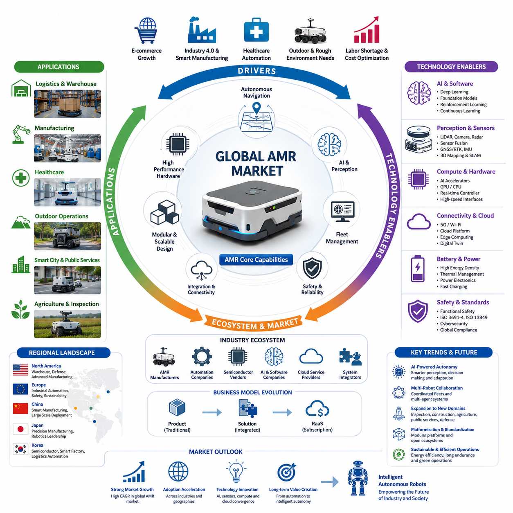
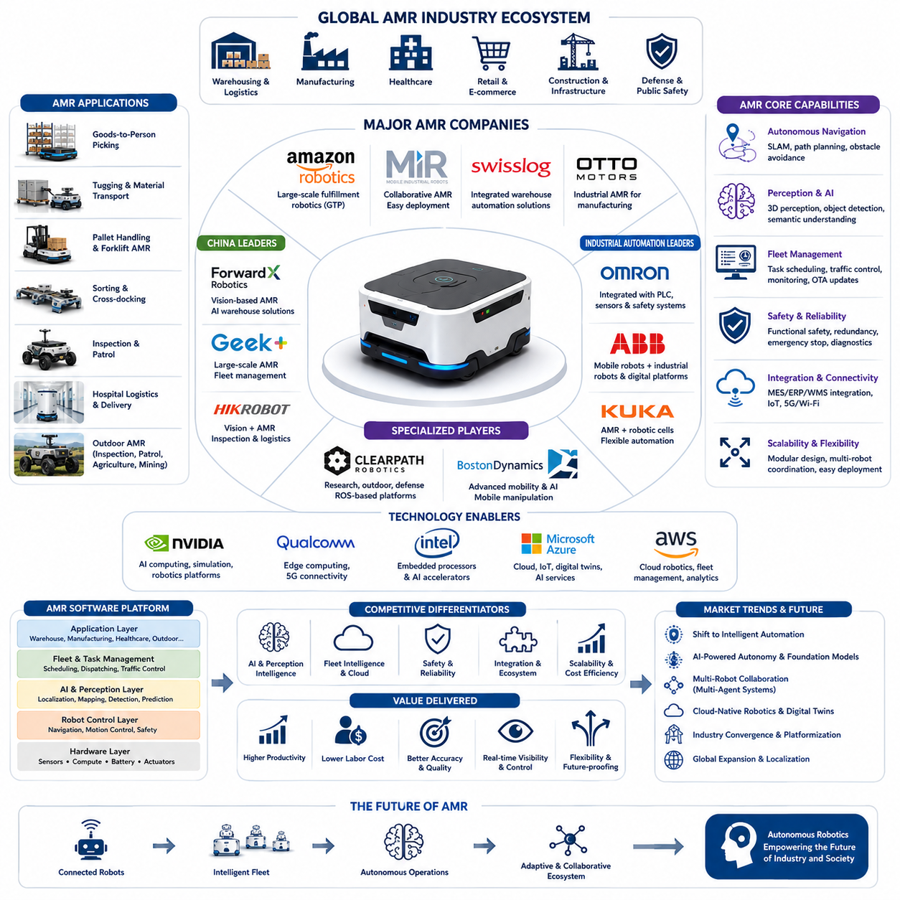
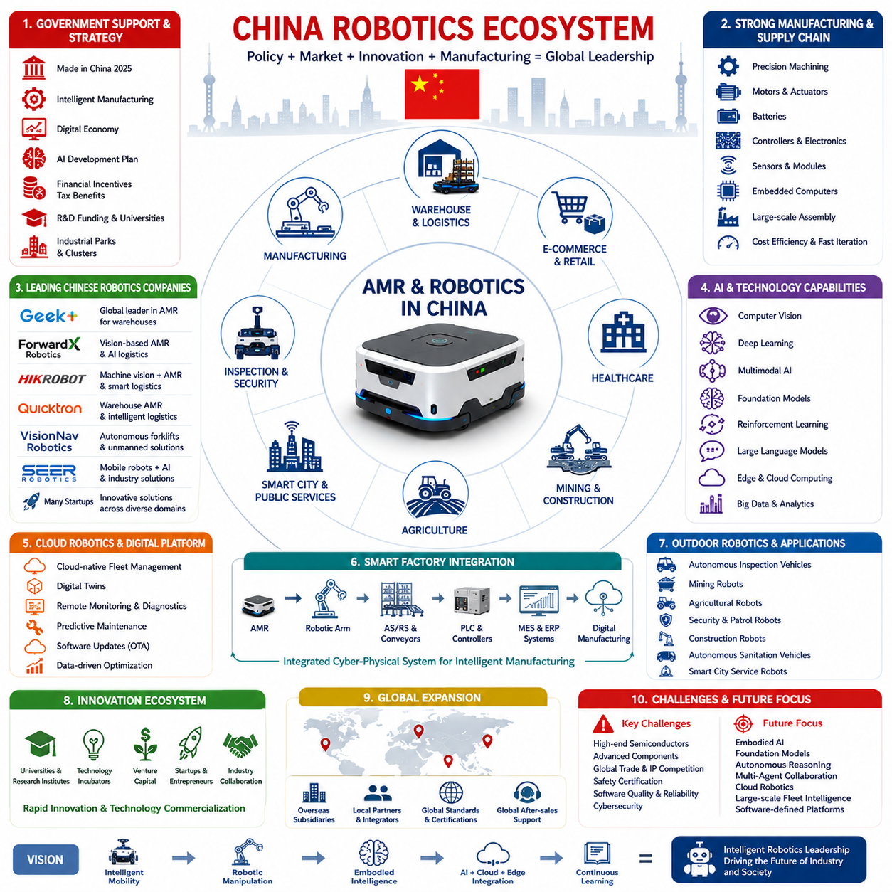
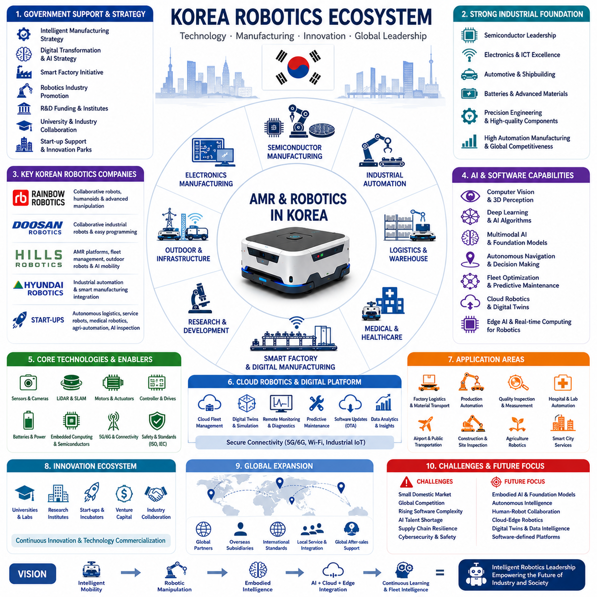
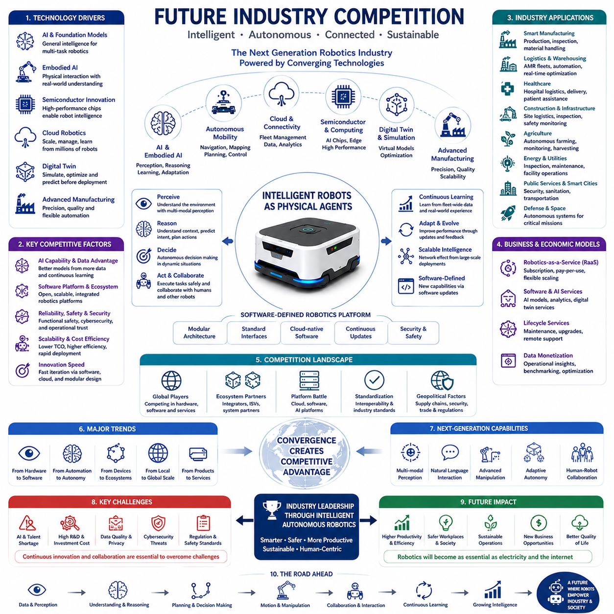

**Volume 01. AMR Foundations and System Architecture**

# 04. AMR Industry Landscape · AMR 산업 현황

## 04.01 Global AMR Market · 글로벌 AMR 시장

{width="7.268055555555556in" height="7.268055555555556in"}

글로벌 자율이동로봇(Autonomous Mobile Robot, AMR) 시장은 틈새 자동화 분야에서 산업용 로봇(Industrial Robotics) 산업 전체를 대표하는 가장 빠르게 성장하는 분야 가운데 하나로 발전하였다. 기존의 무인이송차(Automated Guided Vehicle, AGV)는 사전에 정의된 경로와 고정된 인프라에 의존하는 반면, AMR은 동시적 위치추정 및 지도작성(Simultaneous Localization and Mapping, SLAM), 센서 융합(Sensor Fusion), 인공지능(Artificial Intelligence, AI), 동적 경로 계획(Dynamic Path Planning)을 활용하여 변화하는 환경에서도 안전하게 자율 주행할 수 있다. 이러한 기술은 설치 복잡성을 크게 줄이는 동시에 운영 유연성을 향상시켜, 기존 시설을 거의 변경하지 않고도 로봇을 도입할 수 있도록 한다. 제조, 물류, 의료, 소매, 건설, 공공 인프라 등 다양한 산업에서 디지털 전환(Digital Transformation)이 가속화되면서 AMR은 단순한 운반 장비가 아니라 전략적 자산으로 인식되고 있다. 또한 기업용 소프트웨어, 클라우드(Cloud) 플랫폼, 산업용 사물인터넷(Industrial Internet of Things, IIoT)과의 통합 능력은 현대 자동화 아키텍처에서 AMR의 역할을 더욱 확대하고 있다.

전자상거래(E-commerce)의 급속한 성장은 글로벌 AMR 시장을 견인하는 가장 강력한 요인 가운데 하나이다. 온라인 유통업체와 제3자 물류기업(Third-Party Logistics, 3PL)은 지속적으로 증가하는 주문량을 높은 배송 속도와 정확도로 처리해야 하는 압박을 받고 있다. 현대 물류창고는 계절별 수요 변화, 빈번한 재고 배치 변경, 다양한 주문 패턴에 유연하게 대응할 수 있는 자동화 시스템을 요구한다. AMR은 고정식 컨베이어나 유도 경로 없이도 자율 운송, 피킹(Picking) 지원, 재고 이동, 지능형 보충 작업을 수행할 수 있다. 또한 작업자와 협업하여 생산성을 향상시키고 반복적인 육체 노동을 줄임으로써 24시간 운영되는 물류센터에서 매우 높은 가치를 제공한다. 소비자의 배송 기대 수준이 계속 높아짐에 따라 물류 기업들은 AMR을 선택적인 자동화 기술이 아니라 확장 가능한 창고 자동화를 위한 핵심 기술로 인식하고 있다.

제조 산업 역시 산업 4.0(Industry 4.0)을 중심으로 높은 유연성을 요구하면서 동일한 변화를 경험하고 있다. 현대 제조 환경은 대량 생산(Mass Production)에서 다품종 소량 생산(High-Mix, Low-Volume Manufacturing)으로 빠르게 전환되고 있으며, 이에 따라 생산 일정 변화에 신속히 대응할 수 있는 자재 운송 시스템이 필요하다. AMR은 부품의 적시 공급(Just-in-Time Delivery), 공정 중 자재(Work-in-Progress) 운송, 생산 라인 공급(Line Feeding), 로봇 작업 셀(Robotic Workcell)과의 협업을 수행할 수 있다. 또한 제조 실행 시스템(Manufacturing Execution System, MES), 전사적 자원관리(Enterprise Resource Planning, ERP), 창고관리시스템(Warehouse Management System, WMS), 디지털 트윈(Digital Twin)과 연계되어 생산 상태에 따라 물류를 실시간으로 최적화한다. 따라서 AMR은 단순한 운송 장비가 아니라 변화하는 생산 환경과 운영 상황에 자율적으로 대응하는 사이버-물리 생산 시스템(Cyber-Physical Production System)의 핵심 구성요소가 되고 있다.

의료 분야 역시 AMR이 빠르게 확산되는 대표적인 산업이다. 병원은 의약품, 검사 샘플, 식사, 멸균 장비, 의료 폐기물 등을 복잡한 시설 내부에서 지속적으로 운반해야 하기 때문이다. 의료용 AMR은 반복적인 운송 업무를 자동화하는 동시에 의료진이 감염 위험 환경에 노출되는 시간을 줄여준다. 최신 병원용 로봇은 엘리베이터 호출, 출입문 개방, 혼잡한 복도 주행, 여러 진료 부서 간 배송 업무를 자율적으로 수행할 수 있다. 병원 정보 시스템(Hospital Information System)과의 연계를 통해 긴급 배송을 우선 처리하고 민감한 의료 물품의 운송 기록도 관리할 수 있다. 의료기관이 인력 부족 문제를 해결하면서 운영 효율성을 높이고자 함에 따라 AMR은 기존 의료 업무를 방해하지 않으면서 환자 안전과 자원 활용을 동시에 향상시키는 중요한 기술로 자리 잡고 있다.

실외 자율이동로봇(Outdoor Autonomous Mobile Robot)은 AMR 시장에서 가장 빠르게 성장하는 분야 중 하나이다. 실내 로봇이 비교적 구조화된 환경에서 운용되는 반면, 실외 AMR은 거친 지형, 다양한 기상 조건, 불규칙한 노면, 변화하는 조명, 차량과 보행자 등 복잡한 환경을 처리해야 한다. 주요 적용 분야에는 보안 순찰(Security Patrol), 산업 설비 점검(Industrial Inspection), 건설 현장 모니터링, 광산 작업, 농업 자동화, 공항 물류, 철도 점검, 공공시설 유지보수, 스마트 시티(Smart City), 국방 지원 등이 포함된다. 이러한 로봇은 위성항법시스템(Global Navigation Satellite System, GNSS), 실시간 이동측위(Real-Time Kinematic, RTK), LiDAR SLAM, 비전 기반 위치추정(Visual Localization), 관성항법(Inertial Navigation), 레이더(Radar), 의미 기반 지도(Semantic Mapping)를 결합한 고도화된 위치추정 기술이 필요하다. 따라서 실외 AMR은 실내 시스템보다 더욱 높은 연산 성능, 견고한 기계 구조, 우수한 환경 내구성, 정교한 인지 알고리즘을 요구한다.

AMR 산업의 경쟁 구도는 전문 로봇 기업뿐 아니라 산업 자동화 기업, 자동차 제조사, 반도체 기업, 클라우드 서비스 기업, 인공지능 기업까지 포함하는 거대한 생태계로 확대되고 있다. 전통적인 로봇 기업은 산업 자동화와 기능 안전(Functional Safety) 분야의 풍부한 경험을 제공하는 반면, 신생 기업은 혁신적인 자율주행 알고리즘, 클라우드 기반 플릿 관리(Fleet Management), AI 기반 인지 기술을 빠르게 발전시키고 있다. 반도체 기업은 고성능 임베디드 AI 프로세서를 제공하여 대규모 신경망(Neural Network)을 낮은 지연 시간과 높은 전력 효율로 실행할 수 있도록 지원한다. 클라우드 기업은 대규모 플릿 제어, 예지보전(Predictive Maintenance), 원격 소프트웨어 배포, 운영 데이터 분석을 가능하게 한다. 이러한 산업 간 융합은 장기적인 경쟁력 확보에서 기계 설계뿐 아니라 소프트웨어 혁신 역시 핵심 요소가 되고 있음을 보여준다.

지역별 산업 구조 역시 글로벌 AMR 시장 발전에 큰 영향을 미친다. 북미는 창고 자동화, 첨단 제조, 국방 로봇, 클라우드 기반 자율 시스템에 강점을 보이고 있다. 유럽은 산업 자동화, 기능 안전, 협동 로봇(Collaborative Robot), 지속가능한 제조 기술에 집중하고 있다. 중국은 정부 주도의 스마트 제조 정책과 강력한 공급망을 기반으로 제조 능력과 로봇 보급을 매우 빠르게 확대하였다. 일본은 정밀 제조와 로봇 공학 분야에서 오랜 경쟁력을 유지하면서 고도 자동화 생산 시스템에 AMR을 적극 활용하고 있다. 대한민국 역시 반도체 제조, 스마트 팩토리(Smart Factory), 물류 자동화, 서비스 로봇 분야를 중심으로 경쟁력을 강화하고 있으며, 전자기술과 산업용 소프트웨어 역량을 기반으로 글로벌 시장에서 중요한 위치를 차지하고 있다. 이러한 지역별 특성은 기술 혁신을 가속화하는 동시에 글로벌 경쟁을 더욱 치열하게 만들고 있다.

인공지능의 발전은 AMR의 기능을 기존 자율주행 수준을 넘어서는 방향으로 변화시키고 있다. 초기 로봇은 제한적인 규칙 기반 알고리즘에 의존했지만, 최신 AMR은 심층학습(Deep Learning), 강화학습(Reinforcement Learning), 멀티모달 AI(Multimodal AI), 파운데이션 모델(Foundation Model), 대규모 언어모델(Large Language Model, LLM)을 활용하여 환경을 더욱 깊이 이해하고 자율적인 의사결정을 수행한다. AI는 복잡한 장면 인식(Scene Understanding), 의미 기반 환경 해석(Semantic Understanding), 사람의 이동 예측(Human Motion Prediction), 장애물 분류, 주행 가능 영역 추정, 임무 최적화를 가능하게 한다. 또한 지속적 학습(Continuous Learning) 구조를 통해 플릿 전체에서 축적된 데이터를 활용하여 시간이 지날수록 성능이 향상되는 자율 시스템을 구축할 수 있다.

플릿 관리(Fleet Management)는 독립형 모바일 로봇과 기업용 AMR 플랫폼을 구분하는 가장 중요한 특징 가운데 하나이다. 대규모 산업 현장에서는 수십 대에서 수백 대의 로봇이 동시에 운영되므로, 플릿 관리 시스템(Fleet Management System, FMS)은 작업 할당(Task Allocation), 교통 제어(Traffic Control), 혼잡 회피(Congestion Avoidance), 충전 일정 관리, 유지보수 계획, 소프트웨어 업데이트, 운영 분석 등을 통합적으로 수행한다. 고급 스케줄링 알고리즘은 로봇 활용률을 극대화하면서 대기 시간과 에너지 소비를 최소화한다. 또한 클라우드 연결을 통해 여러 지역에 배치된 로봇을 중앙 관제센터에서 모니터링하고 예지보전과 운영 최적화를 수행할 수 있다. 따라서 플릿 지능(Fleet Intelligence)은 글로벌 AMR 시장에서 중요한 경쟁 차별화 요소가 되고 있다.

현대 AMR의 하드웨어 아키텍처(Hardware Architecture)는 반도체 기술의 발전과 함께 빠르게 진화하고 있다. 고성능 임베디드 GPU(Graphics Processing Unit), AI 가속기(Accelerator), 멀티코어 CPU, 실시간 제어기(Real-Time Controller), 고속 센서 인터페이스는 복잡한 인지 및 경로 계획 알고리즘을 로봇 내부에서 직접 실행할 수 있도록 지원한다. 최신 플랫폼은 다수의 LiDAR, RGB 카메라, 깊이 카메라(Depth Camera), 레이더(Radar), 초음파 센서(Ultrasonic Sensor), GNSS 수신기, 관성측정장치(Inertial Measurement Unit, IMU), 휠 엔코더(Wheel Encoder), 환경 센서를 통합하여 강력한 인지 시스템을 구축한다. 또한 배터리, 열 관리(Thermal Management), 전력 전자(Power Electronics), 산업용 네트워크 기술의 발전은 높은 연산 성능을 장시간 안정적으로 유지할 수 있도록 지원하며 차세대 지능형 로봇의 기반을 제공하고 있다.

AMR 산업의 비즈니스 모델 역시 크게 변화하고 있다. 과거에는 로봇을 단순한 자본 장비(Capital Equipment)로 판매하는 방식이 일반적이었지만, 최근에는 서비스형 로보틱스(Robotics-as-a-Service, RaaS)가 빠르게 확산되고 있다. 이를 통해 고객은 초기 투자 비용을 줄이고 예측 가능한 운영 비용으로 자동화를 도입할 수 있다. 또한 구독 기반 소프트웨어 플랫폼은 플릿 관리, 클라우드 분석, 예지보전, 사이버보안(Cybersecurity) 업데이트, 디지털 트윈, AI 모델 개선 서비스를 지속적으로 제공하며 반복적인 수익 구조를 형성한다. 이러한 변화는 하드웨어 중심 산업에서 하드웨어·소프트웨어·서비스가 통합된 플랫폼 산업으로 AMR 시장이 발전하고 있음을 의미하며, 고객은 더욱 빠르고 유연하게 최신 자동화 기술을 도입할 수 있게 된다.

안전(Safety)은 글로벌 AMR 보급을 결정하는 핵심 요소이다. 산업용 로봇은 사람과 동일한 작업 공간에서 협업하는 경우가 증가하고 있으므로, 중복 센서(Redundant Sensors), 비상 제동(Emergency Braking), 속도 제어(Speed Adaptation), 보호 영역 감시(Protective Field Monitoring), 고장 진단(Fault Diagnostics), 사이버보안 기능을 포함하는 종합적인 기능 안전 아키텍처가 요구된다. 또한 국제 안전 표준은 협동 로봇 운용, 자율주행, 무선 통신 보안, AI 기반 의사결정까지 포함하도록 지속적으로 발전하고 있다. 이러한 안전 인증은 작업자를 보호할 뿐 아니라 고객 신뢰를 높여 글로벌 시장 진출을 위한 중요한 경쟁력이 되고 있다.

미래의 글로벌 AMR 시장은 단순한 자율 운송 시스템을 넘어 인지, 추론, 조작, 통신, 협업 의사결정을 수행하는 체화형 지능(Embodied Intelligence) 플랫폼으로 발전할 것으로 예상된다. 파운데이션 모델(Foundation Model), 멀티모달 AI(Multimodal AI), 클라우드 로보틱스(Cloud Robotics), 디지털 트윈(Digital Twin), 엣지 컴퓨팅(Edge Computing), 다중 에이전트(Multi-Agent) 협업 기술이 하나의 통합된 로봇 아키텍처로 융합될 것이다. 이에 따라 AMR은 물류뿐 아니라 산업 설비 점검, 유지보수, 인프라 관리, 건설, 농업, 공공 서비스, 의료 지원 등 다양한 분야에서 핵심 역할을 수행하게 된다. 인공지능이 로봇 플랫폼에 더욱 깊이 통합될수록 자율 이동과 지능형 물리 작업의 경계는 점차 사라질 것이며, AMR은 차세대 지능형 산업 생태계를 구성하는 핵심 기반 기술로 자리매김할 것이다.

## 04.02 Major AMR Companies · 주요 AMR 기업

{width="7.268055555555556in" height="7.268055555555556in"}

자율이동로봇(Autonomous Mobile Robot, AMR) 산업은 로봇 제조사, 산업 자동화 기업, 인공지능(Artificial Intelligence, AI) 개발사, 반도체 기업, 클라우드 서비스 제공업체, 시스템 통합(System Integration) 전문기업으로 구성된 매우 경쟁적인 글로벌 생태계로 발전하였다. 초기 모바일 로봇 산업에서는 기계 설계(Mechanical Design)가 주요 경쟁 요소였지만, 오늘날의 선도적인 AMR 기업들은 통합 소프트웨어 플랫폼, 자율주행 지능(Autonomous Navigation Intelligence), 플릿 관리(Fleet Management), 인지 알고리즘(Perception Algorithms), AI 기반 의사결정, 그리고 제품의 전체 생애주기(Lifecycle)를 지원하는 서비스 역량으로 경쟁하고 있다. 글로벌 AMR 시장에서 성공하기 위해서는 신뢰성 높은 하드웨어와 지속적으로 발전하는 소프트웨어, 클라우드 연결성(Cloud Connectivity), 확장 가능한 배포 아키텍처를 통합한 종합적인 자율 시스템을 제공해야 한다. 따라서 경쟁의 중심은 개별 로봇 판매에서 기업 전체의 자동화를 지원하는 지능형 로봇 생태계(Intelligent Robotic Ecosystem)를 구축하는 방향으로 이동하고 있다.

창고 자동화 분야에서 가장 큰 영향력을 가진 기업 가운데 하나는 아마존 로보틱스(Amazon Robotics)이다. 아마존은 키바 시스템즈(Kiva Systems)를 인수하여 개발한 자율 물류 플랫폼을 기반으로 전 세계 물류센터 운영 방식을 혁신하였다. 이 시스템은 상품을 작업자에게 직접 운반하는 GTP(Goods-to-Person) 방식을 채택하여 작업자의 이동 시간을 크게 줄이고 창고의 저장 밀도를 향상시키며 주문 처리 효율을 극대화하였다. 단순한 물류 운송을 넘어 AI 기반 작업 스케줄링, 재고 최적화, 로봇 협업 제어, 창고 시뮬레이션 기술까지 지속적으로 발전시키고 있다. 아마존은 물류 운영 데이터와 로봇 기술을 긴밀하게 통합함으로써 로봇이 기업 경쟁력의 핵심 전략이 될 수 있음을 보여주는 대표적인 사례이다.

유럽에서는 모바일 인더스트리얼 로봇(Mobile Industrial Robots, MiR)이 협업형 산업 물류 분야를 선도하는 기업으로 자리 잡았다. MiR은 제조 공장, 병원, 연구소, 물류센터 등에서 작업자와 안전하게 협업할 수 있는 유연한 AMR을 개발하고 있다. 이들의 자율주행 시스템은 LiDAR 기반 위치추정(Localization), 장애물 회피(Obstacle Avoidance), 동적 경로 계획(Dynamic Route Planning), 사용자 친화적인 플릿 관리 소프트웨어를 결합하여 복잡한 인프라 변경 없이도 신속한 구축이 가능하다. MiR은 기존 생산 시스템과의 통합을 강조하여 기업이 운영 중단 없이 단계적으로 자동화를 확대할 수 있도록 지원하며, 이러한 모듈형(Modular) 접근 방식은 자동화를 처음 도입하는 기업들에게 높은 매력을 제공하고 있다.

스위스로그(Swisslog)는 AMR을 종합적인 창고 자동화 솔루션의 일부로 통합하는 대표적인 기업이다. 단순히 모바일 로봇만 공급하는 것이 아니라 자동창고 시스템(Automated Storage and Retrieval System, AS/RS), 로봇 피킹(Robotic Picking), 컨베이어 시스템(Conveyor System), 창고관리시스템(Warehouse Management System, WMS)을 하나의 통합 플랫폼으로 구성한다. 이러한 시스템 수준(System-Level)의 접근 방식은 개별 운송 작업이 아니라 창고 전체의 물류 흐름을 최적화할 수 있도록 한다. 고급 소프트웨어는 로봇, 컨베이어, 승강기, 재고 데이터베이스를 실시간으로 통합 제어하며, AMR이 독립적으로 운용될 때보다 훨씬 높은 가치를 창출할 수 있음을 보여준다.

오토 모터스(OTTO Motors)는 제조 공장의 산업용 자재 운송(Material Handling)에 특화된 기업으로 국제적인 명성을 얻었다. 자율주행 차량은 원자재, 부품, 완제품, 생산 장비를 복잡한 공장 환경에서 안전하게 운송하며 제조 실행 시스템(Manufacturing Execution System, MES), 전사적 자원관리(Enterprise Resource Planning, ERP), 산업 제어 시스템과 긴밀하게 연동된다. OTTO는 지게차(Forklift), 작업자, 다양한 생산 장비가 지속적으로 이동하는 환경에서도 안정적인 자율주행 성능을 제공하는 데 중점을 둔다. 이러한 접근 방식은 핵심 생산 공정에서 운영 안정성(Reliability)이 얼마나 중요한 경쟁 요소인지를 잘 보여준다.

포워드엑스 로보틱스(ForwardX Robotics)는 컴퓨터 비전(Computer Vision), AI 인지, 지능형 창고 자동화를 기반으로 빠르게 성장한 중국의 대표적인 AMR 기업이다. 기존의 인프라 중심 내비게이션과 달리 비전 기반 위치추정(Vision-Based Localization), 대규모 플릿 제어, AI 기반 창고 최적화를 핵심 기술로 발전시켰다. 이들의 시스템은 전자상거래 물류센터에서 주문 처리, 재고 운송, 자율 물류를 지원하며 높은 효율성을 제공한다. 중국의 강력한 제조 기반과 공급망, 대규모 내수 시장은 포워드엑스와 같은 기업들이 하드웨어 비용 경쟁력과 AI 소프트웨어 기술을 동시에 빠르게 향상시키는 기반이 되고 있다.

긱플러스(Geek+)는 세계 최대 규모의 창고용 AMR 공급업체 가운데 하나로 성장하였다. 이 회사는 선반 운반(Shelf Transportation), 피킹 지원, 자동 분류(Sorting), 팔레트 운송(Pallet Movement), 창고 재고 관리 등 다양한 자율 물류 솔루션을 제공한다. 특히 하나의 플릿 관리 시스템 아래에서 수백 대에서 수천 대의 다양한 로봇을 동시에 운영할 수 있는 확장 가능한 소프트웨어 플랫폼을 구축하였다. 이는 대규모 창고 자동화에서는 개별 로봇 성능보다 전체 플릿을 효율적으로 제어하는 소프트웨어 아키텍처가 더욱 중요한 경쟁력이 될 수 있음을 보여준다.

하이크로봇(Hikrobot)은 중국의 산업 기술 생태계 안에서 머신 비전(Machine Vision)과 자율이동로봇을 통합한 기업이다. 산업용 카메라, 머신 비전 알고리즘, 바코드 인식, AI 기반 검사 기술을 AMR과 결합하여 단순한 물류 운송뿐 아니라 자동 식별(Identification), 품질 검사(Quality Inspection), 재고 확인, 생산 이력 추적(Traceability)까지 동시에 수행할 수 있도록 한다. 이러한 융합은 산업용 비전 시스템과 자율주행 로봇이 점점 하나의 통합 기술로 발전하고 있음을 보여주는 대표적인 사례이다.

오므론(Omron)은 AMR을 자사의 산업 자동화 포트폴리오에 통합하여 프로그래머블 로직 컨트롤러(Programmable Logic Controller, PLC), 산업용 센서, 기계 안전 시스템(Machine Safety System), 공장 자동화 소프트웨어와 함께 제공한다. 오므론은 AMR을 독립적인 제품으로 판매하기보다 로봇 암(Robot Arm), 조립 설비, 컨베이어, 생산 장비와 연동되는 통합 자동화 플랫폼을 구축하는 데 중점을 두고 있다. 이러한 통합 아키텍처는 생산성과 안전성을 동시에 향상시키며, 오랜 산업 제어 기술 경험을 활용하여 기존 제조 환경과의 높은 호환성을 제공한다.

ABB는 세계 최대 산업 자동화 기업 가운데 하나로, 자율이동로봇을 산업용 로봇과 디지털 제조 플랫폼(Digital Manufacturing Platform)에 통합하고 있다. ABB는 모바일 로봇과 산업용 AI, 클라우드 분석(Cloud Analytics), 디지털 트윈(Digital Twin), 예지보전(Predictive Maintenance), 유연 생산 셀(Flexible Manufacturing Cell)을 결합하는 전략을 추진하고 있다. 이러한 접근은 고정형 산업용 로봇과 이동형 로봇이 하나의 지능형 생산 환경에서 함께 동작하는 미래 제조 시스템을 보여준다. 이를 통해 창고에서 생산라인, 품질 검사 공정까지 완전 자동화된 물류 흐름을 구축할 수 있다.

쿠카(KUKA) 역시 산업용 로봇과 연계되는 자율이동 플랫폼을 개발하고 있다. 쿠카의 AMR은 모바일 운송 로봇과 산업용 매니퓰레이터(Manipulator)가 긴밀하게 협력하여 부품 공급, 공구 교환, 완제품 운송을 사람의 개입 없이 수행하도록 설계되어 있다. 이러한 접근 방식은 독립적인 로봇 작업 셀에서 벗어나 이동성과 생산성이 통합된 지능형 제조 시스템으로 산업이 발전하고 있음을 보여준다. 또한 디지털 생산 계획(Digital Production Planning)과 공장 시뮬레이션을 연계하여 운영 효율을 더욱 향상시키고 있다.

클리어패스 로보틱스(Clearpath Robotics)는 연구용 로봇, 국방, 실외 자율주행, 자율차량 개발 분야에서 높은 명성을 확보하였다. 창고 자동화 중심 기업과 달리 연구기관, 국방, 광산, 농업, 산업 점검 분야에서 사용할 수 있는 매우 유연한 로봇 플랫폼을 제공한다. 이러한 플랫폼은 자율주행, 인공지능, 다중 로봇 협업(Multi-Robot Coordination), 고급 인지 기술을 개발하는 연구 기반으로 널리 활용되고 있다. 특히 개방형 소프트웨어(Open Software)와 ROS(Robot Operating System) 기반 개발 환경을 적극 지원하여 전 세계 로봇 연구 생태계 발전에 큰 영향을 주고 있다.

보스턴 다이내믹스(Boston Dynamics)는 기존 물류 자동화와는 다른 독특한 위치를 차지하고 있다. 이 회사는 스팟(Spot)과 같은 다족 보행 로봇(Legged Robot)을 통해 동적 이동성(Dynamic Mobility), 균형 제어(Balance Control), 고급 AI 인지 기술을 세계 최고 수준으로 발전시켰다. 또한 창고 자동화 분야에서도 모바일 매니퓰레이션(Mobile Manipulation)을 이용한 자율 물류 및 산업 점검 기술을 개발하고 있다. 보스턴 다이내믹스는 기존 바퀴형 로봇이 접근하기 어려운 환경에서도 자율 이동이 가능한 차세대 모바일 로봇 기술의 가능성을 보여주고 있다.

엔비디아(NVIDIA)는 직접 AMR을 제조하지는 않지만, 전 세계 로봇 산업에서 가장 중요한 기술 공급업체 가운데 하나이다. 고성능 임베디드 컴퓨팅 플랫폼, GPU(Graphics Processing Unit), AI 개발 프레임워크, 시뮬레이션 기술, 디지털 트윈 플랫폼을 제공하여 로봇 기업들이 더욱 고도화된 인지, 위치추정, 경로 계획, 파운데이션 모델(Foundation Model) 기반 AI를 구현할 수 있도록 지원한다. 강력한 엣지 컴퓨팅(Edge Computing) 성능을 통해 최신 AMR은 복잡한 신경망을 로봇 내부에서 실시간으로 실행할 수 있게 되었으며, 이러한 반도체 기술의 발전은 AMR 산업 전체를 발전시키는 핵심 동력이 되고 있다.

AMR 시장의 경쟁은 점차 하드웨어 중심에서 소프트웨어 중심으로 이동하고 있다. 선도 기업들은 플릿 지능(Fleet Intelligence), 클라우드 로보틱스(Cloud Robotics), AI 기반 인지, 자율 의사결정, 예지보전, 사이버보안(Cybersecurity), 지속적인 소프트웨어 업데이트에 막대한 투자를 진행하고 있다. 고객 역시 적재중량(Payload), 최고 속도(Maximum Speed), 배터리 용량과 같은 단순한 하드웨어 사양보다 총소유비용(Total Cost of Ownership, TCO), 확장성(Scalability), 시스템 통합 용이성, 신뢰성(Reliability), AI 성능, 장기 서비스 지원을 더욱 중요한 평가 요소로 고려하고 있다.

미래에는 로봇 제조사, 인공지능 기업, 산업 자동화 기업, 클라우드 컴퓨팅 기업 간의 경계가 점점 사라질 것으로 예상된다. 차세대 시장 선도 기업은 물리적 로봇, 파운데이션 모델(Foundation Model), 멀티모달 AI(Multimodal AI), 클라우드 기반 플릿 관리(Cloud-Native Fleet Management), 디지털 트윈(Digital Twin), 엣지 컴퓨팅(Edge Computing), 사이버보안(Cybersecurity), 지속적 학습(Continuous Learning)을 하나의 통합 플랫폼으로 제공하게 될 것이다. 자율 시스템이 인지(Perception), 추론(Reasoning), 협업(Collaboration), 적응형 의사결정(Adaptive Decision Making) 능력을 지속적으로 향상시킴에 따라 미래의 경쟁력은 개별 하드웨어 기술보다 소프트웨어 중심의 확장 가능한 로봇 생태계(Software-Defined Robotic Ecosystem)를 구축하는 능력에 의해 결정될 것이다.

## 04.03 China Robotics Ecosystem · 중국 로봇 생태계

{width="7.268055555555556in" height="7.268055555555556in"}

중국은 정부 정책, 제조 역량, 공급망 통합(Supply Chain Integration), 인공지능(Artificial Intelligence, AI) 개발, 반도체 투자, 그리고 거대한 내수 시장 수요를 하나의 통합된 산업 전략으로 결합함으로써 세계에서 가장 크고 가장 포괄적인 로봇 생태계(Robotics Ecosystem)를 구축하였다. 민간 기업의 혁신을 중심으로 성장한 국가들과 달리, 중국의 로봇 산업은 지능형 제조(Intelligent Manufacturing)와 로봇 산업을 국가 전략 산업으로 지정한 장기적인 국가 발전 정책의 강력한 지원을 받아 성장하였다. 이러한 체계적인 접근 방식은 자율이동로봇(Autonomous Mobile Robot, AMR), 산업용 로봇(Industrial Robot), 협동 로봇(Collaborative Robot), 물류 자동화 시스템(Logistics Automation System), 체화형 인공지능(Embodied AI)의 상용화를 빠르게 촉진하였다. 그 결과 중국은 경쟁력 있는 로봇 기업뿐만 아니라 로봇 제품을 설계하고 제조하며 배치하고 지속적으로 개선할 수 있는 완전한 산업 생태계를 세계 최고 수준의 속도로 구축하게 되었다.

정부 정책은 중국 로봇 생태계를 형성하는 가장 중요한 요소 가운데 하나였다. \'메이드 인 차이나 2025(Made in China 2025)\', 지능형 제조(Intelligent Manufacturing) 정책, 디지털 경제(Digital Economy) 전략, AI 발전 로드맵(AI Development Roadmap)과 같은 국가 프로젝트는 로봇 산업의 전체 가치사슬(Value Chain)에 대한 대규모 투자를 촉진하였다. 금융 지원, 세제 혜택, 산업 단지, 연구개발 자금, 대학 협력, 기술 창업 지원 프로그램은 기존 제조기업과 신생 스타트업(Start-up) 모두에게 유리한 환경을 제공하였다. 또한 지방정부들은 로봇 기업을 유치하기 위해 경쟁적으로 전문 산업 클러스터(Industrial Cluster)를 조성하였으며, 이곳에서는 부품 공급업체, 소프트웨어 개발사, 연구기관, 제조공장이 지리적으로 가까운 위치에서 협력하고 있다. 이러한 정책 중심의 산업 생태계는 개발 비용을 크게 절감하는 동시에 기술 이전(Technology Transfer)과 상용화를 빠르게 가속화하고 있다.

중국의 제조 역량(Manufacturing Capability)은 세계 로봇 시장에서 가장 강력한 경쟁력 가운데 하나이다. 정밀 가공(Precision Machining), 전기 모터(Electric Motor), 배터리(Battery), 제어기(Controller), 산업용 전자장치, 센서(Sensor), 통신 모듈(Communication Module), 임베디드 컴퓨터(Embedded Computer), 구조 재료(Structural Material), 대규모 조립 설비까지 거의 모든 핵심 부품을 자체 공급망에서 조달할 수 있다. 대부분의 로봇 제조업체는 필요한 하드웨어를 국내에서 조달할 수 있기 때문에 해외 공급망 의존도를 줄이고 제품 개발 주기를 크게 단축할 수 있다. 또한 부품 제조업체와 로봇 시스템 통합업체(System Integrator) 간의 긴밀한 협력은 빠른 설계 변경, 신속한 시제품 제작, 효율적인 원가 절감을 가능하게 한다. 이러한 제조 효율성은 중국 로봇 기업들이 글로벌 경쟁사보다 훨씬 빠른 속도로 신제품을 출시할 수 있는 중요한 기반이 되고 있다.

거대한 내수 시장 역시 중국 로봇 산업 발전을 가속화하는 핵심 요소이다. 중국은 세계 최대 규모의 제조 산업과 함께 전자상거래(E-commerce), 물류(Logistics), 의료(Healthcare), 광산(Mining), 농업(Agriculture), 스마트 시티(Smart City) 프로젝트를 동시에 운영하고 있다. 이러한 다양한 산업은 창고 자동화(Warehouse Automation), 산업 물류, 자율 점검(Autonomous Inspection), 서비스 로봇(Service Robot), 실외 자율주행 차량에 대한 지속적인 수요를 창출한다. 대규모 현장 운영은 방대한 운영 데이터를 생성하며, 이는 자율주행 알고리즘, 인지 모델(Perception Model), 플릿 관리(Fleet Management), AI 의사결정 기술을 지속적으로 향상시키는 기반이 된다. 시장 규모가 작은 국가에서는 이러한 데이터 축적이 오랜 시간이 걸리지만, 중국은 대규모 상용 운용을 통해 제품을 매우 빠르게 개선할 수 있는 환경을 갖추고 있다.

창고 자동화는 중국 로봇 생태계에서 가장 강력한 성장 분야 가운데 하나이다. 전자상거래 산업의 폭발적인 성장으로 하루 수백만 건의 주문을 처리할 수 있는 지능형 물류센터(Intelligent Fulfillment Center)에 대한 수요가 급격히 증가하였다. 중국의 AMR 기업들은 GTP(Goods-to-Person) 물류, 팔레트 운송(Pallet Transportation), 선반 이동(Shelf Movement), 자동 분류(Automated Sorting), 크로스도킹(Cross-Docking), 재고 보충(Inventory Replenishment), 창고 점검을 지원하는 다양한 자율 시스템을 개발하였다. 플릿 관리 소프트웨어는 수백 대에서 수천 대의 로봇을 동시에 제어하며, AI를 활용하여 교통 흐름, 작업 할당, 충전 일정, 재고 이동을 지속적으로 최적화한다. 이러한 기술은 대규모 물류 운영에서 뛰어난 확장성과 운영 효율성을 실현하고 있다.

긱플러스(Geek+), 포워드엑스 로보틱스(ForwardX Robotics), 하이크로봇(Hikrobot), 퀵트론(Quicktron), 비전내브 로보틱스(VisionNav Robotics), SEER Robotics를 비롯한 여러 중국 기업들은 적극적인 기술 혁신과 글로벌 시장 진출을 통해 세계적인 인지도를 확보하였다. 이들 기업은 창고 자동화, 산업 물류, 자율 지게차(Autonomous Forklift), 점검 로봇(Inspection Robot), 플릿 관리 플랫폼(Fleet Management Platform) 등 다양한 제품군을 제공하고 있다. 단순히 하드웨어 가격 경쟁에 의존하지 않고 소프트웨어 아키텍처, AI 인지, 클라우드 연결성(Cloud Connectivity), 디지털 트윈(Digital Twin), 지능형 운영 관리(Intelligent Operations)를 핵심 경쟁력으로 발전시키고 있다. 제조 비용 경쟁력과 첨단 소프트웨어 기술을 동시에 확보함으로써 중국은 글로벌 로봇 시장에서 영향력을 지속적으로 확대하고 있다.

인공지능은 중국 로봇 생태계에 깊이 통합되어 있다. 컴퓨터 비전(Computer Vision), 심층학습(Deep Learning), 강화학습(Reinforcement Learning), 멀티모달 AI(Multimodal AI), 대규모 언어모델(Large Language Model, LLM), 파운데이션 모델(Foundation Model)은 인지, 자율주행, 작업 계획(Task Planning), 인간-로봇 상호작용(Human-Robot Interaction)에 적극 활용되고 있다. 중국의 대형 기술 기업들은 AI 인프라, 클라우드 컴퓨팅(Cloud Computing), 엣지 컴퓨팅(Edge Computing), 대규모 데이터 처리 시스템에 지속적으로 투자하고 있으며, 로봇 개발 기업들은 이러한 컴퓨팅 자원을 적극 활용하고 있다. AI 연구의 지속적인 발전은 의미 기반 환경 이해(Semantic Understanding), 장애물 인식, 행동 예측(Behavior Prediction), 적응형 자율주행(Adaptive Navigation), 자율 의사결정을 지속적으로 향상시키고 있다. 이러한 AI 기술은 단순한 운송 로봇을 지능형 자율 시스템으로 발전시키는 핵심 요소가 되고 있다.

반도체 기술은 중국 로봇 산업을 지원하는 또 다른 전략 분야이다. 첨단 프로세서 분야에서는 여전히 세계적인 경쟁이 치열하지만, 중국은 자체적인 칩 설계(Chip Design), 임베디드 AI 가속기(Embedded AI Accelerator), 산업용 프로세서, 통신 하드웨어, 로봇 전용 컴퓨팅 플랫폼에 지속적으로 투자하고 있다. 로봇 소프트웨어 역시 CPU(Central Processing Unit), GPU(Graphics Processing Unit), AI 가속기, FPGA(Field Programmable Gate Array), 비전 프로세서를 결합한 이기종 컴퓨팅(Heterogeneous Computing)에 최적화되고 있다. 이러한 방향은 미래의 로봇 성능이 기계 설계나 자율주행 알고리즘뿐 아니라 강력한 온보드(Onboard) 연산 능력에 크게 의존하게 될 것임을 보여준다.

클라우드 로보틱스(Cloud Robotics)는 중국의 지능형 제조 생태계에서 매우 중요한 구성 요소가 되고 있다. 최신 AMR 플랫폼은 클라우드 기반 플릿 관리, 디지털 트윈, 원격 진단(Remote Diagnostics), 예지보전(Predictive Maintenance), 소프트웨어 업데이트, 운영 분석(Operational Analytics), 중앙 관제 기능을 통합하고 있다. 클라우드 플랫폼은 수천 대의 로봇에서 수집된 데이터를 통합하여 자율주행 모델, 인지 알고리즘, 배터리 관리, 임무 계획(Mission Planning)을 지속적으로 개선한다. 기업 고객은 로봇 활용률, 운영 효율성, 유지보수 상태, 물류 성과를 실시간으로 확인할 수 있으며, 이러한 클라우드 기반 아키텍처는 여러 지역에 분산된 제조공장과 물류센터를 효율적으로 운영할 수 있도록 지원한다.

스마트 팩토리(Smart Factory)에 대한 중국의 집중적인 투자는 로봇과 산업 자동화의 융합을 더욱 가속화하고 있다. AMR은 산업용 매니퓰레이터(Industrial Manipulator), 자동창고(Automated Storage System), 생산 설비, 프로그래머블 로직 컨트롤러(Programmable Logic Controller, PLC), 제조 실행 시스템(Manufacturing Execution System, MES), 전사적 자원관리(Enterprise Resource Planning, ERP)와 긴밀하게 연계되어 하나의 디지털 제조 환경(Digital Manufacturing Environment)을 구축한다. 자재 운송(Material Transportation), 부품 공급(Component Delivery), 품질 검사(Quality Inspection), 재고 관리, 생산 일정 관리가 모두 실시간으로 통합되어 사이버-물리 시스템(Cyber-Physical System)을 구성한다. 이에 따라 AMR은 독립적으로 동작하는 장비가 아니라 전체 생산 생태계에서 지능형 에이전트(Intelligent Agent)의 역할을 수행하게 된다.

실외 로봇(Outdoor Robot) 분야 역시 중국에서 빠르게 성장하고 있다. 자율 점검 차량, 광산 로봇, 농업 로봇, 보안 순찰 로봇(Security Patrol Robot), 건설 로봇, 자율 청소 차량, 스마트 시티 서비스 로봇은 매우 다양한 환경에서 운용되고 있다. 이러한 시스템은 위성항법시스템(Global Navigation Satellite System, GNSS), LiDAR SLAM, 비전 기반 위치추정(Visual Localization), 레이더(Radar), 의미 기반 지도(Semantic Mapping), AI 인지를 결합하여 복잡한 실외 환경에서도 안정적으로 자율주행을 수행한다. 정부의 인프라 현대화와 스마트 시티 정책은 이러한 실외 자율 시스템의 대규모 보급을 촉진하며 중국 로봇 생태계를 실내 물류 중심에서 다양한 산업 분야로 확장시키고 있다.

대학과 산업계의 긴밀한 협력 역시 중국 로봇 산업의 중요한 특징이다. 대학, 국가 연구소(National Laboratory), 기술 연구기관, 산업체는 AI, 로봇 인지, 자율주행, 인간-로봇 상호작용, 고급 제어 시스템, 체화형 지능에 관한 다양한 공동 연구를 수행한다. 대학원 연구 인력은 졸업 후 스타트업이나 산업 연구소로 빠르게 이동하여 최신 연구 결과가 상용 제품 개발에 직접 반영되는 구조를 형성하고 있다. 이러한 산학협력은 새로운 로봇 기술을 매우 빠르게 산업 현장에 적용할 수 있는 중요한 원동력이 되고 있다.

중국의 로봇 생태계는 매우 활발한 스타트업 환경에서도 큰 혜택을 받고 있다. 다수의 벤처캐피털(Venture Capital)은 로봇, 인공지능, 자동화 소프트웨어, 센서, 반도체, 산업 디지털화 기술에 적극적으로 투자하고 있다. 기술 인큐베이터(Technology Incubator)와 혁신 단지(Innovation Park)는 초기 기업에게 연구 시설, 제조 설비, 엔지니어링 지원, 사업 개발 서비스를 제공한다. 치열한 경쟁은 새로운 로봇 아키텍처, 소프트웨어 플랫폼, 자율주행 기술, AI 기반 운영 모델에 대한 빠른 실험과 혁신을 촉진한다. 많은 기업이 아직 성장 단계에 있지만 이러한 경쟁 환경은 중국 로봇 산업 전체의 기술 발전 속도를 지속적으로 높이고 있다.

글로벌 시장 확대(Global Expansion)는 중국 로봇 기업들의 중요한 전략 목표가 되었다. 많은 기업들은 아시아, 유럽, 북미, 중동 지역에 해외 법인, 서비스 센터, 기술 지원 조직, 현지 시스템 통합 파트너를 설립하고 있다. 제품은 국제 안전 표준(International Safety Standards), 산업 통신 프로토콜(Industrial Communication Protocol), 사이버보안 요구사항, 지역 인증 체계에 맞추어 개발되고 있다. 중국 기업들은 더 이상 국내 시장에만 의존하지 않고 글로벌 제조기업과 물류기업을 지원하는 국제적인 로봇 솔루션 공급업체(Global Robotics Solution Provider)로 성장하고 있다.

눈부신 성과에도 불구하고 중국 로봇 생태계는 여전히 여러 전략적 과제를 안고 있다. 고성능 반도체 의존성, 초정밀 핵심 부품, 국제 무역 규제, 지식재산권(Intellectual Property) 경쟁, 기능 안전(Functional Safety) 인증, 점점 높아지는 소프트웨어 품질 요구사항은 지속적인 투자가 필요한 분야이다. 동시에 글로벌 경쟁은 중국 기업들이 단순한 제조 규모나 가격 경쟁력에 의존하지 않고 지속적인 기술 혁신을 추진하도록 요구하고 있다. 앞으로의 경쟁력은 체화형 AI(Embodied AI), 파운데이션 모델(Foundation Model), 자율 추론(Autonomous Reasoning), 다중 에이전트 협업(Multi-Agent Coordination), 사이버보안, 클라우드 로보틱스, 지능형 소프트웨어 플랫폼을 얼마나 효과적으로 구현하는가에 의해 결정될 것이다.

미래의 중국 로봇 생태계는 단순한 대규모 제조 강국에서 세계 최고의 지능형 로봇 플랫폼 국가로 발전할 것으로 예상된다. 자율 이동(Autonomous Mobility), 로봇 매니퓰레이션(Robot Manipulation), 체화형 지능(Embodied Intelligence), 멀티모달 AI(Multimodal AI), 클라우드-엣지 협업(Cloud-Edge Collaboration), 디지털 트윈(Digital Twin), 지속적 학습(Continuous Learning), 대규모 플릿 지능(Large-Scale Fleet Intelligence)이 하나의 소프트웨어 중심 로봇 플랫폼(Software-Defined Robotic Platform)으로 통합될 것이다. 로봇이 복잡한 환경을 이해하고 사람과 협업하며 변화하는 작업 환경에 자율적으로 적응하는 능력이 더욱 향상될수록, 중국의 통합 산업 생태계는 차세대 지능형 로봇 산업의 글로벌 발전을 가속화하는 강력한 기반이 될 것으로 전망된다.

## 04.04 Korea Robotics Ecosystem · 한국 로봇 생태계

{width="7.268055555555556in" height="7.268055555555556in"}

대한민국은 세계 최고 수준의 제조 산업, 반도체(Semiconductor) 경쟁력, 정보통신기술(Information and Communication Technology, ICT), 정밀 엔지니어링(Precision Engineering), 그리고 지능형 자동화(Intelligent Automation)에 대한 강력한 정부 지원을 바탕으로 세계에서 가장 발전된 로봇 생태계(Robotics Ecosystem) 가운데 하나를 구축하였다. 비록 국내 시장 규모는 중국이나 미국보다 작지만, 한국은 지속적으로 고부가가치 기술, 산업 신뢰성(Industrial Reliability), 수출 중심 혁신(Export-Oriented Innovation)에 집중해 왔다. 이러한 전략을 통해 산업용 로봇(Industrial Robot), 자율이동로봇(Autonomous Mobile Robot, AMR), 협동 로봇(Collaborative Robot), 반도체 자동화, 의료 로봇(Medical Robotics), 지능형 물류 시스템(Intelligent Logistics System) 분야에서 강력한 경쟁력을 확보하였다. 단순한 생산 규모 경쟁보다 로봇 산업 전반에 걸친 첨단 기술, 시스템 통합(System Integration), 그리고 고품질 엔지니어링을 핵심 경쟁력으로 발전시키고 있다.

정부 정책은 대한민국 로봇 산업을 성장시키는 가장 중요한 원동력 가운데 하나이다. 지능형 제조(Intelligent Manufacturing), 디지털 전환(Digital Transformation), 인공지능(Artificial Intelligence, AI), 첨단 제조(Advanced Manufacturing)를 중심으로 한 국가 전략은 로봇 연구개발, 산업 현장 보급, 상용화에 대한 장기적인 투자를 지속적으로 추진하였다. 정부 출연 연구기관(Government-Funded Research Institute), 대학 연구실, 기술 단지(Technology Park), 산학협력(Public-Private Partnership)은 로봇 산업 전반의 혁신을 지원하고 있다. 또한 스마트 팩토리(Smart Factory), 자율이동(Autonomous Mobility), 반도체 산업 경쟁력 강화, AI 육성 정책은 로봇 스타트업(Start-up)의 성장과 산학협력을 동시에 촉진하고 있다. 이러한 장기적이고 일관된 정책은 한국 로봇 산업이 지속적으로 기술을 발전시킬 수 있는 안정적인 기반을 제공하고 있다.

대한민국의 제조 산업은 로봇 기술이 발전하기에 매우 이상적인 환경을 제공한다. 세계 최고 수준의 반도체, 전자제품, 자동차, 조선, 배터리, 디스플레이 산업은 산업 자동화에 대한 지속적인 수요를 창출하고 있다. 생산 현장은 자율 물류, 유연한 자재 운송(Material Handling), 지능형 검사(Intelligent Inspection), AI 기반 제조 공정을 필요로 한다. AMR은 산업용 로봇, 자동화 생산라인, 창고 시스템, 품질 검사 장비와 함께 운영되며 생산성을 높이고 반복적인 작업을 줄이는 역할을 수행한다. 고도로 자동화된 제조 환경은 차세대 로봇 기술을 실제 산업 현장에서 시험하고 개선할 수 있는 매우 중요한 테스트베드(Testbed)가 되고 있다.

반도체 제조는 대한민국 로봇 생태계를 대표하는 핵심 산업이다. 반도체 생산 공정은 극도로 높은 정밀도(Precision), 청정도(Cleanliness), 신뢰성(Reliability), 그리고 24시간 연속 운영을 요구한다. 자율 로봇은 웨이퍼(Wafer), 생산 자재, 장비, 검사 도구를 클린룸(Cleanroom) 환경에서 안전하게 운반한다. 이러한 환경에서는 자율주행 정확도, 진동 제어(Vibration Control), 오염 방지(Contamination Prevention), 예지보전(Predictive Maintenance)이 매우 중요한 기술 요소가 된다. 반도체 공장은 생산성을 지속적으로 향상시키고 불량률을 최소화해야 하기 때문에, 이 시장을 대상으로 하는 로봇 기업들은 매우 높은 신뢰성의 하드웨어와 정교한 제어 시스템, 고도화된 플릿 관리(Fleet Management) 소프트웨어를 개발하고 있다.

대한민국의 세계적인 반도체 기술 경쟁력은 로봇 컴퓨팅 플랫폼(Robotics Computing Platform) 발전에도 크게 기여하고 있다. 메모리(Memory), AI 가속기(AI Accelerator), 임베디드 프로세서(Embedded Processor), 저장장치(Storage), 초고속 통신 반도체를 생산하는 기업들은 지능형 로봇에 필요한 핵심 부품을 공급한다. 최신 AMR은 SLAM(Simultaneous Localization and Mapping), 심층학습 추론(Deep Learning Inference), 센서 융합(Sensor Fusion), 궤적 최적화(Trajectory Optimization), 멀티모달 인지(Multimodal Perception)를 실시간으로 수행하기 위해 매우 높은 연산 성능을 요구한다. 한국의 반도체 산업은 로봇 기업과 전자부품 제조업체 간의 긴밀한 협력을 가능하게 하며, 산업용 로봇에 최적화된 하드웨어와 소프트웨어를 빠르게 개발할 수 있도록 지원하고 있다.

전자 산업(Electronics Manufacturing) 역시 대한민국 로봇 산업의 중요한 경쟁력이다. 고품질 센서(Sensor), 카메라(Camera), 디스플레이(Display), 배터리(Battery), 모터 제어기(Motor Controller), 통신 모듈(Communication Module), 임베디드 시스템(Embedded System), 산업용 전자부품을 국내 공급망에서 안정적으로 확보할 수 있다. 전자 기업과 로봇 기업 간의 긴밀한 협력은 개발 기간을 단축하고 제품 신뢰성과 제조 품질을 동시에 향상시킨다. 이러한 수직 통합(Vertical Integration) 구조는 한국 기업들이 신속하게 시제품을 제작하고 검증하며, 글로벌 산업 고객이 요구하는 높은 품질 수준을 유지하면서 상용화를 추진할 수 있도록 한다.

자율이동로봇은 대한민국의 제조 및 물류 산업에서 점점 더 중요한 역할을 수행하고 있다. 스마트 팩토리, 물류센터, 병원, 공항, 연구소, 반도체 공장에서는 자율 운송, 자재 공급, 창고 자동화, 산업 점검, 협업 물류를 위해 AMR을 적극적으로 활용하고 있다. 한국 기업들은 높은 신뢰성의 자율주행, 정밀 위치제어, 견고한 안전 시스템(Safety System), 제조 실행 시스템(Manufacturing Execution System, MES), 전사적 자원관리(Enterprise Resource Planning, ERP), 창고관리시스템(Warehouse Management System, WMS), 공장관리시스템(Factory Management System, FMS)과의 원활한 통합을 매우 중요하게 생각한다. 따라서 AMR은 단순한 운송 장비가 아니라 디지털 제조 생태계(Digital Manufacturing Ecosystem)의 핵심 구성요소로 발전하고 있다.

대한민국에는 다양한 분야에서 경쟁력을 갖춘 로봇 기업들이 성장하고 있다. 레인보우로보틱스(Rainbow Robotics)는 협동 로봇, 휴머노이드(Humanoid Robot), 고급 매니퓰레이션(Manipulation) 기술로 세계적인 주목을 받고 있다. 두산로보틱스(Doosan Robotics)는 안전성과 사용 편의성이 뛰어난 협동 로봇을 통해 글로벌 시장을 선도하고 있다. 힐스로보틱스(Hills Robotics)는 지능형 AMR 플랫폼, 플릿 관리, 자율주행, 실외 로봇, AI 기반 산업용 이동성 분야를 중심으로 기술을 발전시키고 있다. 현대로보틱스(Hyundai Robotics)는 산업 자동화를 지속적으로 확대하면서 스마트 제조 환경과의 통합을 추진하고 있다. 이외에도 자율 물류, 서비스 로봇(Service Robot), 농업 자동화, 의료 로봇, AI 기반 검사 시스템을 개발하는 다양한 스타트업들이 새로운 기술 혁신을 이끌고 있다.

인공지능은 대한민국 로봇 생태계의 핵심 기술 가운데 하나이다. 컴퓨터 비전(Computer Vision), 심층학습(Deep Learning), 강화학습(Reinforcement Learning), 멀티모달 AI(Multimodal AI), 파운데이션 모델(Foundation Model), 대규모 언어모델(Large Language Model, LLM), 체화형 AI(Embodied AI)는 인지(Perception), 자율주행(Navigation), 자율 의사결정, 인간-로봇 상호작용(Human-Robot Interaction)을 지속적으로 향상시키고 있다. 국내 대학, 연구기관, 기술 기업들은 높은 신뢰성과 실시간 성능이 요구되는 산업용 AI 알고리즘을 활발히 개발하고 있다. 또한 AI는 단순한 인지 기능을 넘어 플릿 최적화(Fleet Optimization), 예지보전, 운영 분석(Operational Analytics), 적응형 자율주행(Adaptive Navigation), 자율 임무 계획(Autonomous Mission Planning)까지 적용 범위를 확대하고 있다.

클라우드 로보틱스(Cloud Robotics)와 디지털 전환은 대한민국 제조 산업 전반으로 빠르게 확산되고 있다. 최신 로봇 시스템은 플릿 관리, 예지보전, 소프트웨어 업데이트, 운영 모니터링, 디지털 트윈(Digital Twin), 중앙 집중형 데이터 분석 기능을 제공하는 클라우드 플랫폼과 긴밀하게 연결된다. 기업 고객은 여러 공장의 로봇 활용률, 생산 효율, 유지보수 일정, 운영 상태를 하나의 통합 대시보드(Integrated Dashboard)에서 관리할 수 있다. 또한 클라우드와 엣지 컴퓨팅(Edge Computing)의 협업을 통해 연산 작업을 효율적으로 분산하면서도 안전이 중요한 로봇 제어에서는 매우 낮은 지연 시간(Low Latency)을 유지할 수 있다.

대한민국은 스마트 팩토리 분야에서도 세계적인 경쟁력을 확보하고 있다. 디지털 제조 환경에서는 산업용 로봇, AMR, 프로그래머블 로직 컨트롤러(Programmable Logic Controller, PLC), 산업용 사물인터넷(Industrial Internet of Things, IIoT), 머신 비전(Machine Vision), 기업용 소프트웨어, 클라우드 분석 기술이 하나의 사이버-물리 생산 시스템(Cyber-Physical Production System)으로 통합된다. 자율 운송은 생산 일정, 재고 관리, 품질 검사, 설비 모니터링과 실시간으로 연동된다. 이러한 통합 구조는 생산 유연성을 향상시키고 운영 비용을 절감하며 변화하는 생산 요구사항에 신속하게 대응할 수 있도록 한다. 스마트 팩토리는 첨단 로봇 기술의 주요 고객이자 동시에 새로운 기술을 검증하는 중요한 실증 환경이 되고 있다.

의료 로봇은 대한민국 로봇 생태계에서 빠르게 성장하는 또 하나의 분야이다. 병원에서는 의약품 배송, 검사 샘플 운반, 멸균 장비 물류, 식사 배달, 환자 지원 서비스를 위해 자율 로봇을 적극 도입하고 있다. 한국의 선진 의료 인프라는 병원 정보 시스템(Hospital Information System), 엘리베이터 제어, 자동문, 의료 물류 소프트웨어와 AMR을 통합할 수 있는 우수한 환경을 제공한다. 높은 안전성과 신뢰성 기준은 의료용 로봇 기술의 지속적인 발전을 촉진하며, 산업용 로봇을 넘어 다양한 서비스 로봇 시장으로 활용 범위를 확대하고 있다.

실외 로봇 역시 최근 대한민국에서 중요한 연구개발 분야로 성장하고 있다. 자율 점검 로봇은 산업 시설, 에너지 설비, 건설 현장, 항만, 공항, 철도, 농업, 스마트 시티에서 활용되고 있다. 이러한 로봇은 위성항법시스템(Global Navigation Satellite System, GNSS), 실시간 이동측위(Real-Time Kinematic, RTK), LiDAR SLAM, 비전 기반 위치추정(Visual Localization), 레이더(Radar), 관성항법(Inertial Navigation), AI 기반 환경 인지 기술을 통합하여 복잡한 실외 환경에서도 안정적으로 운용된다. 한국 기업들은 통신 기술, 임베디드 컴퓨팅, 산업용 전자 기술을 활용하여 높은 신뢰성을 갖춘 실외 자율 플랫폼을 개발하고 있다.

학계 연구는 대한민국 로봇 생태계에서 매우 중요한 역할을 수행한다. 대학은 산업체와 긴밀하게 협력하여 로봇 인지, 자율주행, AI 알고리즘, 반도체 기술, 인간-로봇 상호작용, 자율주행 차량, 체화형 지능에 대한 연구를 수행한다. 정부 출연 연구기관은 장기적인 원천 기술 연구를 수행하는 동시에 스타트업 육성과 산업 협력을 통해 기술 상용화를 지원한다. 대학원 연구 인력은 졸업 후 로봇 기업으로 빠르게 진출하여 연구 성과가 실제 제품 개발에 직접 반영되는 구조를 형성하고 있다. 이러한 산학 협력은 대한민국이 지속적으로 로봇 기술을 발전시킬 수 있는 중요한 기반이 되고 있다.

대한민국의 스타트업 생태계 역시 로봇과 AI 분야에서 빠르게 성장하고 있다. 벤처캐피털(Venture Capital)은 AMR, 서비스 로봇, AI 소프트웨어 플랫폼, 산업 자동화, 물류 시스템, 디지털 트윈, 자율 점검, 반도체 기술을 개발하는 기업에 활발하게 투자하고 있다. 창업 지원 센터(Start-up Accelerator), 혁신 센터(Innovation Center), 정부 지원 창업 프로그램은 기술 개발, 투자 유치, 시험 설비, 사업화를 적극 지원한다. 중국과 비교하면 스타트업 수는 적지만, 한국 기업들은 대량 생산보다는 글로벌 산업 시장을 목표로 하는 고부가가치 전문 기술 개발에 집중하는 특징을 가지고 있다.

대한민국 로봇 산업은 뛰어난 기술력을 보유하고 있지만 몇 가지 전략적인 과제도 안고 있다. 국내 시장 규모가 상대적으로 작기 때문에 기업들은 성장 초기부터 해외 시장 진출을 적극 추진해야 한다. 또한 글로벌 경쟁 심화, 소프트웨어 복잡성 증가, 사이버보안(Cybersecurity), 기능 안전(Function Safety) 인증, AI 전문 인력 확보, 공급망 안정성 확보를 위해 지속적인 투자가 필요하다. 저비용 제조 국가와의 경쟁이 심화됨에 따라 한국 기업들은 가격 경쟁보다는 첨단 엔지니어링, 고품질 제품, 통합 소프트웨어 플랫폼, 전문 산업 기술을 중심으로 차별화를 추진하고 있다.

미래의 대한민국은 반도체, 인공지능, 첨단 제조, 정보통신기술, 시스템 엔지니어링(System Engineering)의 강점을 바탕으로 지능형 산업용 로봇 분야의 글로벌 리더로 성장할 가능성이 매우 높다. 차세대 로봇 플랫폼은 자율 이동(Autonomous Mobility), 로봇 매니퓰레이션(Robot Manipulation), 멀티모달 AI(Multimodal AI), 파운데이션 모델(Foundation Model), 디지털 트윈(Digital Twin), 클라우드-엣지 컴퓨팅(Cloud-Edge Computing), 지속적 학습(Continuous Learning), 플릿 지능(Fleet Intelligence)을 하나의 소프트웨어 중심 아키텍처(Software-Defined Architecture)로 통합할 것으로 예상된다. 체화형 AI(Embodied AI)가 산업 자동화를 근본적으로 변화시키는 시대에, 대한민국이 보유한 높은 신뢰성, 정밀 엔지니어링, 통합 기술 개발 역량은 세계 시장에서 경쟁력 있는 차세대 지능형 자율 로봇 시스템을 개발하는 강력한 기반이 될 것이다.

## 04.05 Future Industry Competition · 미래 산업 경쟁

{width="7.268055555555556in" height="7.268055555555556in"}

미래의 로봇 산업 경쟁은 단순한 기계 하드웨어(Mechanical Hardware)의 성능 향상을 넘어설 것이다. 차세대 산업 경쟁은 인공지능(Artificial Intelligence, AI), 자율 이동(Autonomous Mobility), 클라우드 컴퓨팅(Cloud Computing), 반도체(Semiconductor), 첨단 제조(Advanced Manufacturing), 디지털 트윈(Digital Twin), 그리고 대규모 소프트웨어 플랫폼(Software Platform)의 통합 능력에 의해 결정될 것이다. 자율이동로봇(Autonomous Mobile Robot, AMR)은 단순한 운송 장비를 넘어 인지(Perception), 추론(Reasoning), 협업(Collaboration), 자율 의사결정(Autonomous Decision Making)을 수행하는 지능형 물리 에이전트(Intelligent Physical Agent)로 발전하게 된다. 이러한 기술을 확장 가능한 소프트웨어 중심 로봇 생태계(Software-Defined Robotic Ecosystem)에 성공적으로 통합하는 기업은 전통적인 하드웨어 중심 기업보다 훨씬 강력한 경쟁 우위를 확보하게 될 것이다. 로봇 산업이 점점 소프트웨어 중심 산업으로 변화함에 따라 생산 능력보다 지속적인 기술 혁신이 장기적인 시장 지배력을 결정하는 핵심 요소가 될 것이다.

인공지능은 미래 로봇 산업의 모든 분야에서 가장 중요한 경쟁 요소가 될 것이다. 기존의 자율주행은 규칙 기반 알고리즘과 사람이 설계한 소프트웨어 모듈에 크게 의존하였다. 그러나 미래의 로봇은 심층학습(Deep Learning), 강화학습(Reinforcement Learning), 멀티모달 AI(Multimodal AI), 파운데이션 모델(Foundation Model), 체화형 지능(Embodied Intelligence)을 활용하여 복잡한 환경을 이해하고 미래 상황을 예측하며 사람의 의도를 해석하고 이전에 경험하지 못한 상황에도 적응하게 될 것이다. 또한 플릿(Fleet) 전체에서 축적되는 운영 데이터를 지속적으로 학습함으로써 배치 이후에도 성능이 계속 향상되는 구조를 갖추게 된다. 따라서 우수한 AI 인프라, 고품질 학습 데이터셋(Dataset), 모델 최적화 기술을 보유한 기업이 미래 시장에서 매우 큰 경쟁 우위를 확보하게 될 것이다.

파운데이션 모델은 향후 10년 동안 로봇 개발 방식을 근본적으로 변화시킬 것으로 예상된다. 지금까지는 특정 작업마다 별도의 소프트웨어를 개발해야 했지만, 앞으로는 하나의 범용 지능 모델이 여러 산업용 작업을 동시에 수행할 수 있게 된다. 하나의 로봇이 자재 운반, 설비 점검, 작업자와의 의사소통, 유지보수 절차 이해, 엔지니어링 도면 해석, 다른 자율 시스템과의 협업을 모두 하나의 지식 표현 체계(Knowledge Representation)를 기반으로 수행할 수 있게 된다. 이는 자연어 처리(Natural Language Processing) 분야에서 하나의 대규모 언어모델(Large Language Model, LLM)이 다양한 응용 서비스를 지원하는 방식과 매우 유사하다. 미래의 로봇 기업들은 개별 작업 알고리즘보다 파운데이션 모델의 품질, 확장성, 적응 능력을 중심으로 경쟁하게 될 것이다.

체화형 AI(Embodied AI)는 미래 산업 경쟁을 변화시키는 또 하나의 핵심 기술이다. 기존 AI는 주로 디지털 정보를 처리하는 데 집중하였지만, 체화형 지능은 인지, 물리적 상호작용, 이동 계획(Motion Planning), 매니퓰레이션(Manipulation), 환경 추론(Environmental Reasoning), 지속적인 피드백을 실제 물리 환경에서 통합적으로 수행한다. 체화형 AI를 탑재한 로봇은 단순히 영상을 인식하는 수준을 넘어 물체의 사용 가능성(Object Affordance), 공간 관계(Spatial Relationship), 물리적 제약 조건, 인간의 행동까지 이해할 수 있다. 이러한 능력은 복잡한 산업 작업에서 높은 수준의 추론과 실제 물리적 작업을 동시에 수행할 수 있도록 한다. 체화형 AI 분야를 선도하는 기업은 제조, 물류, 의료, 건설, 농업, 국방, 사회 기반시설 관리 등 다양한 산업에서 시장을 주도할 가능성이 매우 높다.

반도체 기술은 미래 로봇 경쟁의 가장 전략적인 기반 기술 가운데 하나로 남을 것이다. 최신 자율 로봇은 인지 알고리즘, 센서 융합(Sensor Fusion), 동시적 위치추정 및 지도작성(Simultaneous Localization and Mapping, SLAM), 경로 계획(Trajectory Planning), 신경망 추론(Neural Network Inference), 멀티모달 추론(Multimodal Reasoning)을 동시에 수행하기 위해 막대한 연산 능력을 요구한다. 미래의 로봇 플랫폼은 AI 가속기(AI Accelerator), 이기종 컴퓨팅(Heterogeneous Computing), 고대역폭 메모리(High-Bandwidth Memory), 전력 관리(Power Management), 고성능 엣지 컴퓨팅 프로세서(Edge Computing Processor)에 더욱 의존하게 될 것이다. 이러한 반도체 생태계를 확보한 국가와 기업은 로봇의 지능, 응답성, 운영 효율성을 크게 향상시킬 수 있기 때문에 매우 중요한 전략적 우위를 확보하게 된다.

클라우드 로보틱스(Cloud Robotics)는 미래 로봇 시스템의 규모를 획기적으로 확대할 것이다. 개별적으로 운영되던 로봇은 앞으로 클라우드를 통해 플릿 관리(Fleet Management), 소프트웨어 배포, 디지털 트윈, 예지보전(Predictive Maintenance), 사이버보안(Cybersecurity), 운영 분석(Operational Analytics), 집단 학습(Collective Learning)을 수행하게 된다. 모든 로봇은 현장에서 얻은 경험을 지속적으로 공유하여 전체 플릿의 성능을 향상시킨다. 이러한 구조는 대규모 네트워크 효과(Network Effect)를 만들어 더 많은 로봇을 운영하는 기업이 더 많은 데이터를 확보하고, 더 우수한 AI 모델과 소프트웨어를 더욱 빠르게 개발할 수 있도록 한다. 따라서 클라우드 인프라는 단순한 지원 기술이 아니라 핵심 경쟁 자산이 될 것이다.

디지털 트윈은 로봇 산업의 설계, 제조, 운영 방식을 근본적으로 변화시킬 것이다. 로봇, 생산 시설, 물류 네트워크, 산업 인프라를 가상 환경에 동일하게 구현함으로써 실제 배치 전에 다양한 운영 시나리오를 시뮬레이션할 수 있다. AI는 디지털 트윈 환경에서 자율주행 전략, 생산 일정, 유지보수 계획, 배터리 활용, 교통 흐름을 최적화하면서 실제 운영 위험을 최소화할 수 있다. 또한 실제 로봇과 가상 환경을 지속적으로 동기화함으로써 예측 진단(Predictive Diagnostics)과 실시간 운영 최적화도 가능해진다. 디지털 트윈을 로봇 개발 전 과정에 통합하는 기업은 개발 비용을 크게 절감하고 혁신 속도를 더욱 높일 수 있다.

미래의 경쟁은 소프트웨어 정의 로보틱스(Software-Defined Robotics) 구조로 빠르게 이동할 것이다. 과거에는 새로운 기능을 추가하기 위해 하드웨어를 다시 설계해야 하는 경우가 많았지만, 앞으로는 소프트웨어 업데이트만으로 새로운 자율주행 기능, AI 모델, 사이버보안 기능, 운영 최적화, 새로운 산업 응용 기능을 지속적으로 추가할 수 있게 된다. 이러한 구조는 제품 수명을 크게 연장하고 운영 비용을 절감하며 고객 만족도를 높인다. 따라서 모듈형 소프트웨어 아키텍처(Modular Software Architecture), 표준 인터페이스(Standard Interface), 클라우드 기반 소프트웨어 배포 체계를 구축하는 기업이 하드웨어 중심 기업보다 훨씬 높은 확장성을 확보하게 될 것이다.

미래 로봇 시장에서는 개별 하드웨어 제조기업보다 완전한 생태계를 제공하는 플랫폼 기업이 더욱 유리한 위치를 차지하게 될 것이다. 고객은 단순한 로봇이 아니라 플릿 관리, 기업용 소프트웨어 통합, 디지털 트윈, 클라우드 분석, 예지보전, 사이버보안, 인공지능, 제품 생애주기 지원을 포함하는 종합 솔루션을 원한다. 따라서 성공적인 기업은 제조 실행 시스템(Manufacturing Execution System, MES), 전사적 자원관리(Enterprise Resource Planning, ERP), 창고관리시스템(Warehouse Management System, WMS), 산업용 사물인터넷(Industrial Internet of Things, IIoT), 프로그래머블 로직 컨트롤러(Programmable Logic Controller, PLC), 자율 로봇을 하나의 산업 생태계로 연결하는 플랫폼을 제공하게 될 것이다. 이러한 통합은 고객의 전환 비용(Switching Cost)을 높이는 동시에 지속적인 소프트웨어와 서비스 수익을 창출한다.

국가 간 산업 경쟁 역시 국가 전략에 의해 더욱 크게 영향을 받을 것이다. 반도체, 인공지능, 첨단 제조, 클라우드 인프라, 로봇 교육, 산업 디지털화를 동시에 추진하는 국가는 글로벌 경쟁력을 지속적으로 강화하게 된다. 연구개발 투자, 스타트업 생태계 조성, 기술 상용화, 스마트 제조, 산업 자동화를 지원하는 정부 정책은 국내 로봇 산업을 빠르게 성장시킬 수 있다. 국제 협력과 표준화 활동은 여전히 중요하지만, 반도체 공급망, AI 기술, 사이버보안, 국가 핵심 인프라를 둘러싼 지정학적(Geopolitical) 경쟁 역시 미래 산업 경쟁을 크게 좌우하게 될 것이다.

자율 이동 기술은 창고 물류를 넘어 거의 모든 산업으로 확대될 것이다. 미래의 AMR은 공장, 건설 현장, 병원, 공항, 항만, 철도, 발전소, 농업, 광산, 스마트 시티, 국방, 우주 탐사까지 다양한 환경에서 활용될 것이다. 이러한 환경은 매우 복잡하고 지속적으로 변화하기 때문에 로봇은 높은 안전성, 신뢰성, 운영 효율성을 유지하면서도 스스로 환경에 적응할 수 있어야 한다. 따라서 여러 산업 분야를 하나의 플랫폼으로 지원할 수 있는 범용 자율 이동 플랫폼(Generalized Autonomous Mobility Platform)을 개발하는 기업은 특정 분야에만 집중하는 기업보다 훨씬 큰 글로벌 시장을 확보하게 될 것이다.

인간-로봇 협업(Human-Robot Collaboration)은 더욱 자연스럽고 지능적인 방향으로 발전할 것이다. 대규모 언어모델(Large Language Model, LLM), 멀티모달 인지(Multimodal Perception), 음성 인식(Speech Recognition), 제스처 인식(Gesture Recognition), 의미 기반 추론(Semantic Reasoning)을 활용하여 로봇은 단순히 명령을 수행하는 수준을 넘어 사람과 자연스럽게 협력할 수 있게 된다. 미래의 산업용 로봇은 음성 명령을 이해하고 작업 이유를 설명하며, 불확실한 상황에서는 질문을 통해 확인하고, 사람과 함께 복잡한 작업을 수행하게 된다. 이러한 기술은 생산성을 향상시키는 동시에 자동화 전문 인력이 부족한 기업에서도 로봇을 쉽게 활용할 수 있도록 만든다.

사이버보안은 로봇 산업 경쟁에서 매우 중요한 요소가 될 것이다. 클라우드, 무선 통신, 기업 시스템, 원격 유지보수와 연결된 로봇은 새로운 보안 위협에 노출되므로, 안전한 소프트웨어 구조(Secure Software Architecture), 암호화 통신(Encrypted Communication), 인증(Authentication), 침입 탐지(Intrusion Detection), 지속적인 취약점 관리가 필수적이다. 특히 국가 기반시설, 의료, 국방, 반도체 공장과 같은 분야에서는 기능 성능뿐 아니라 보안 수준이 중요한 경쟁 요소가 되므로, 높은 사이버보안 역량을 보유한 기업이 더욱 큰 신뢰를 얻게 될 것이다.

환경 지속가능성(Environmental Sustainability) 역시 미래 로봇 산업 경쟁에 중요한 영향을 미칠 것이다. 산업계가 탄소 저감(Carbon Reduction), 에너지 효율(Energy Efficiency), 순환 제조(Circular Manufacturing)를 추진함에 따라, 지능형 로봇은 운송 경로를 최적화하고 에너지 소비와 자재 낭비를 줄이며 생산 효율을 높이고 예지보전을 통해 설비 수명을 연장하게 된다. 또한 배터리 기술(Battery Technology), 에너지 관리 시스템(Energy Management System), 경량 소재(Lightweight Material), 고효율 컴퓨팅 아키텍처 역시 중요한 설계 요소가 된다. 지속가능성을 적극 반영하는 기업은 규제 대응과 운영 비용 절감이라는 두 가지 경쟁력을 동시에 확보하게 될 것이다.

비즈니스 경쟁 역시 하드웨어 판매 중심에서 반복적인 서비스 중심으로 빠르게 이동하고 있다. 서비스형 로보틱스(Robotics-as-a-Service, RaaS), 클라우드 구독 서비스, 플릿 분석(Fleet Analytics), AI 모델 라이선스(Model Licensing), 예지보전 계약, 디지털 트윈 서비스, 소프트웨어 업데이트 프로그램은 장기적이고 안정적인 수익 구조를 형성한다. 고객은 더 이상 초기 구매 가격만을 평가하지 않고 총소유비용(Total Cost of Ownership, TCO), 운영 효율성, 확장성, 소프트웨어 기능, 생애주기 지원을 종합적으로 고려한다. 따라서 통합형 구독 기반 로봇 플랫폼을 제공하는 기업이 장기적으로 더욱 우수한 재무 성과를 달성할 가능성이 높다.

미래의 로봇 산업은 컴퓨터 산업이 발전해 온 과정과 매우 유사한 방향으로 변화할 것으로 예상된다. 하드웨어는 여전히 중요한 기반이지만, 소프트웨어, 인공지능, 클라우드 서비스, 디지털 생태계가 훨씬 더 큰 경제적 가치를 창출하게 된다. 미래의 산업 리더는 가장 많은 로봇을 생산하는 기업이 아니라 지속적인 학습(Continuous Learning), 대규모 협업(Large-Scale Coordination), 적응형 의사결정(Adaptive Decision Making), 글로벌 산업 인프라와의 원활한 통합을 지원하는 지능형 자율 플랫폼(Intelligent Autonomous Platform)을 구축하는 기업이 될 것이다. 체화형 AI(Embodied AI), 파운데이션 모델(Foundation Model), 클라우드 로보틱스(Cloud Robotics), 반도체 혁신(Semiconductor Innovation), 디지털 트윈(Digital Twin), 소프트웨어 정의 아키텍처(Software-Defined Architecture)의 융합은 미래 산업 경쟁의 기준을 새롭게 정의하며, 로봇 산업을 향후 수십 년 동안 가장 전략적으로 중요한 산업 가운데 하나로 자리매김하게 만들 것이다.
