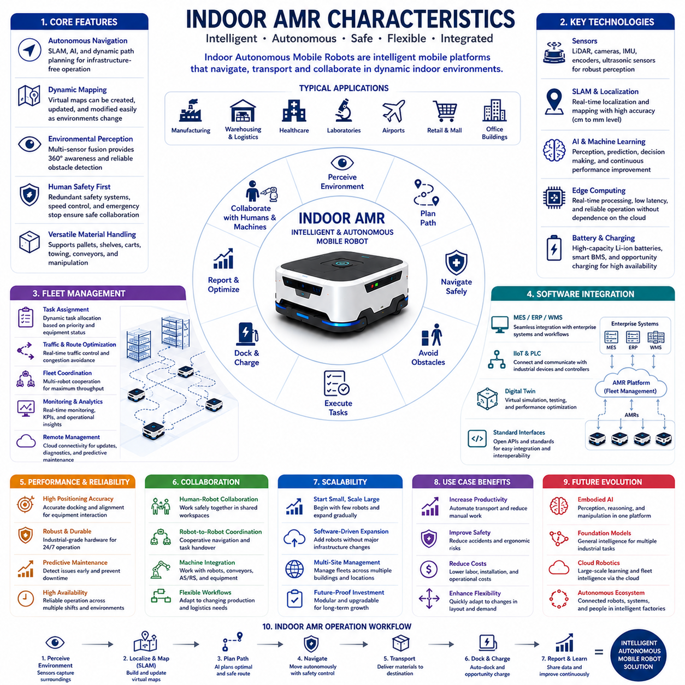
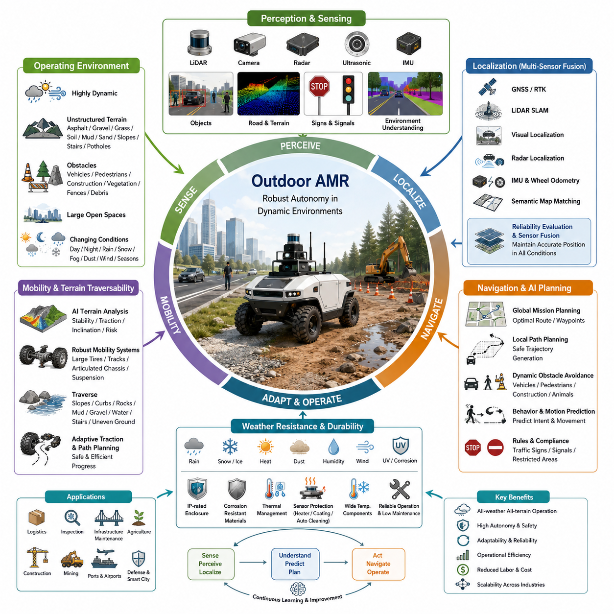
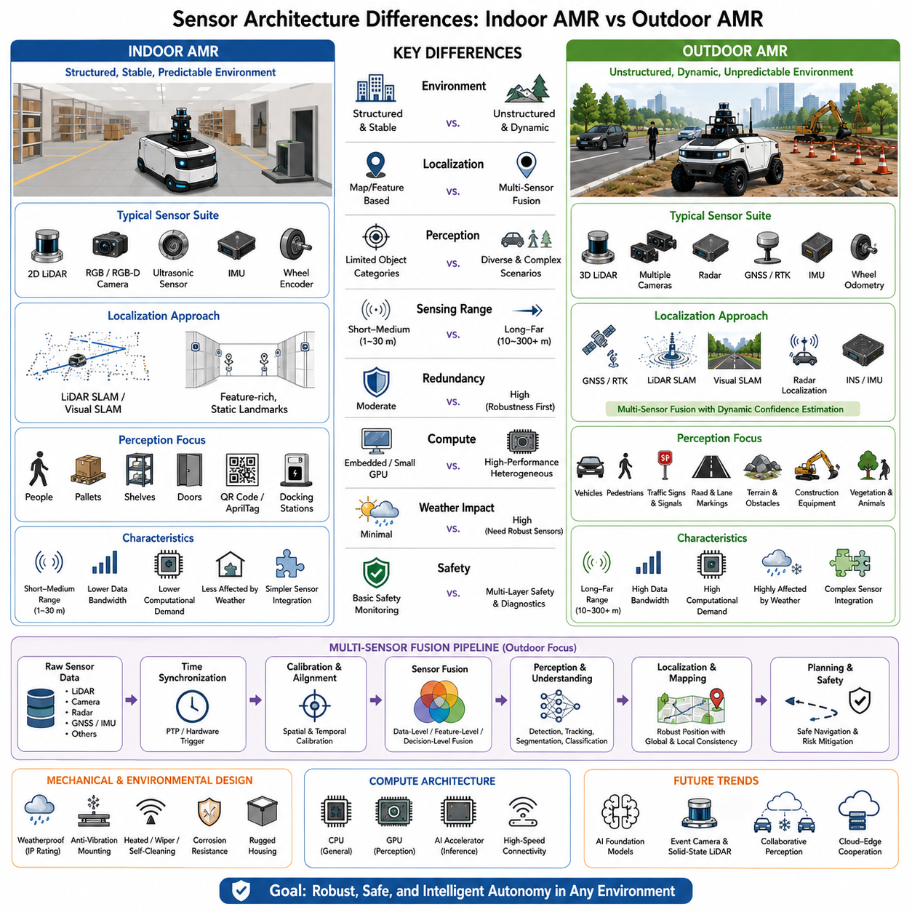
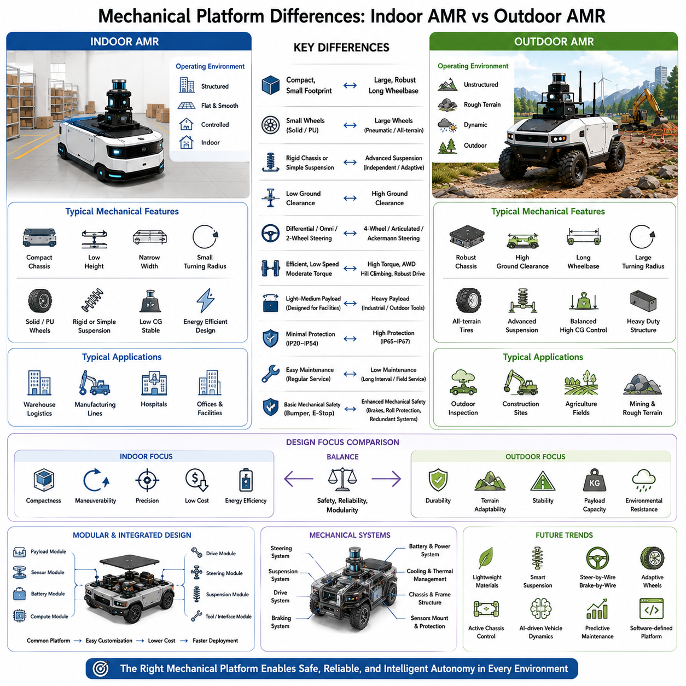
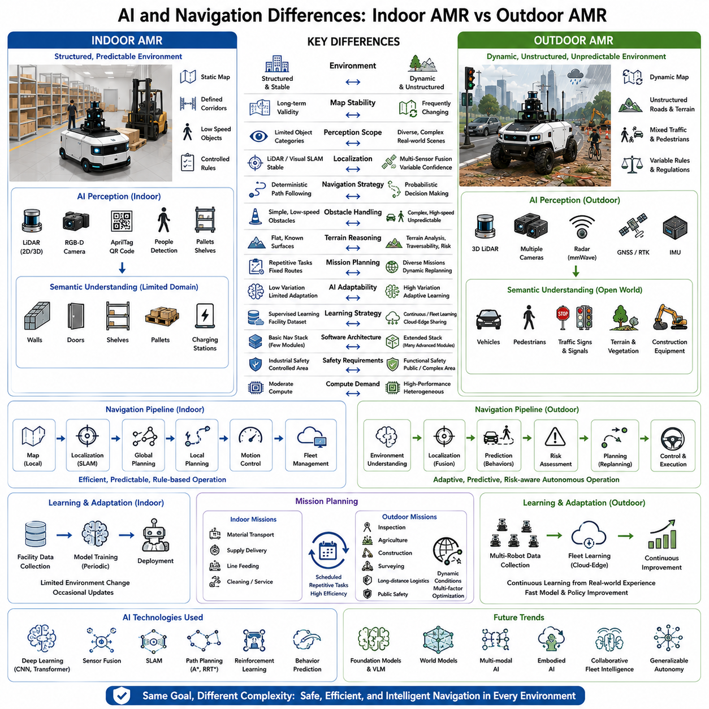

**Volume 01. AMR Foundations and System Architecture**

# 05. Indoor vs Outdoor AMR · 실내 vs 실외 AMR

## 05.01 Indoor AMR Characteristics · 실내 AMR 특성

{width="7.268055555555556in" height="7.268055555555556in"}

실내 자율이동로봇(Indoor Autonomous Mobile Robot, AMR)은 공장, 물류창고, 병원, 연구소, 공항, 쇼핑센터, 사무실과 같은 구조화된 실내 환경에서 운용되도록 설계된 지능형 로봇 플랫폼이다. 기존의 무인이송차(Automated Guided Vehicle, AGV)가 사전에 설치된 유도 시스템을 따라 이동하는 것과 달리, 실내 AMR은 온보드(Onboard) 센서, 동시적 위치추정 및 지도작성(Simultaneous Localization and Mapping, SLAM), 인공지능(Artificial Intelligence, AI), 동적 경로 계획(Dynamic Path Planning)을 활용하여 스스로 환경을 인식하고 자율적으로 이동한다. 고정된 인프라에 의존하지 않고 변화하는 환경에 적응할 수 있기 때문에 기업은 더욱 높은 운영 유연성, 짧은 구축 기간, 낮은 설치 비용을 확보할 수 있다. 다양한 산업에서 디지털 전환(Digital Transformation)이 가속화됨에 따라 실내 AMR은 단순한 물류 운반 장비를 넘어 복잡한 산업 작업을 지원하는 지능형 이동 플랫폼으로 발전하고 있다.

실내 AMR이 운용되는 환경은 일반적으로 실외보다 훨씬 구조화되고 예측 가능하다. 바닥은 대부분 평탄하며, 이동 경계가 명확하고, 조명 조건이 비교적 일정하며, 비나 눈과 같은 기상 변화의 영향을 받지 않는다. 이러한 환경은 위치추정(Localization), 환경 인지(Perception), 장애물 회피(Obstacle Avoidance), 이동 계획(Motion Planning)을 실외 환경보다 상대적으로 단순하게 만든다. 그러나 작업자, 지게차(Forklift), 운반 카트(Cart), 팔레트 트럭(Pallet Truck), 다른 이동 로봇들이 지속적으로 이동하기 때문에 실내 환경 역시 매우 동적인 특성을 가진다. 따라서 실내 AMR은 정확한 지도(Map)와 실시간 장애물 인식, 적응형 자율주행 전략을 결합하여 사람과 장비가 함께 사용하는 작업 공간에서 안전하고 효율적으로 운용되어야 한다.

자율주행(Navigation)은 실내 AMR을 대표하는 핵심 기술이다. 대부분의 시스템은 LiDAR, 카메라(Camera), 관성측정장치(Inertial Measurement Unit, IMU), 휠 엔코더(Wheel Encoder), 경우에 따라 인공 랜드마크(Artificial Landmark)를 함께 활용하는 SLAM 기술을 사용하여 자신의 위치를 추정하는 동시에 주변 환경의 지도를 생성한다. 기존 AGV처럼 자기 테이프(Magnetic Tape), 반사 마커(Reflective Marker), 매설 유도선(Guide Wire)을 설치할 필요 없이 소프트웨어 기반의 가상 지도(Virtual Map)를 생성하고 관리할 수 있다. 공장의 생산라인이나 물류창고의 배치가 변경되더라도 소프트웨어 수정만으로 새로운 경로를 생성할 수 있기 때문에 구축과 유지보수가 매우 유연하다. 또한 지도 갱신 과정이 빠르므로 공장 레이아웃 변경 시 운영 중단 시간을 최소화할 수 있다.

인지 시스템(Perception System)은 실내 AMR이 주변 환경을 정확하게 이해하도록 지원한다. 2차원 및 3차원 LiDAR는 주변 장애물을 높은 기하학적 정확도로 탐지하며, RGB 카메라와 깊이 카메라(Depth Camera)는 팔레트(Pallet), 선반(Shelf), 작업대(Workstation), 출입문(Door), 작업자를 인식한다. 초음파 센서(Ultrasonic Sensor)는 로봇 근접 영역의 장애물을 감지하며, 관성 센서는 가속과 회전 중에도 안정적인 위치추정을 지원한다. 센서 융합(Sensor Fusion) 알고리즘은 다양한 센서 정보를 통합하여 조명 변화, 일시적인 가림(Occlusion), 혼잡한 작업 환경에서도 높은 인식 성능을 유지한다. 이러한 멀티모달 인지(Multimodal Perception) 구조는 일부 센서의 성능이 일시적으로 저하되더라도 안전한 자율주행을 가능하게 한다.

사람의 안전(Human Safety)은 실내 AMR 설계에서 가장 중요한 요소 가운데 하나이다. 대부분의 실내 AMR은 사람과 동일한 공간에서 물리적인 안전 펜스 없이 함께 작업하기 때문이다. 기능 안전(Functional Safety) 구조는 중복 센서(Redundant Sensor)를 이용하여 로봇 주변의 보호 영역(Protective Zone)을 지속적으로 감시한다. 작업자가 경고 영역에 접근하면 로봇은 자동으로 속도를 줄이며, 충돌 위험이 허용 기준을 초과하면 즉시 비상 제동(Emergency Braking)을 수행한다. 국제 안전 표준을 만족하기 위해서는 고장 진단(Fault Detection), 비상 정지(Emergency Stop), 중복 통신(Redundant Communication), 종합적인 진단 기능이 요구된다. 이러한 구조는 사람을 대체하기보다 작업자와 안전하게 협업하면서 반복적인 운반 작업을 줄이고 작업 환경을 개선하는 것을 목표로 한다.

자재 운송(Material Handling)은 실내 AMR의 가장 대표적인 활용 분야이다. 로봇은 원자재(Raw Material), 부품(Component), 완제품(Finished Product), 팔레트, 컨테이너(Container), 의료 물품, 연구 샘플, 유지보수 장비를 작업 구역 간에 자율적으로 운반한다. 최신 AMR은 선반 리프팅(Shelf Lifting), 팔레트 운반, 카트 견인(Cart Towing), 컨베이어 연동(Conveyor Integration), 로봇 매니퓰레이션(Robotic Manipulation) 등 다양한 운송 방식을 지원한다. 자동 작업 스케줄링은 물류 작업을 지속적으로 수행하면서 사람의 반복적인 운반 업무를 크게 줄여준다. 생산 방식이 더욱 유연해질수록 실내 AMR은 별도의 대규모 인프라 변경 없이도 내부 물류를 효율적으로 자동화할 수 있는 핵심 장비가 된다.

플릿 관리(Fleet Management)는 다수의 실내 AMR을 운영할 때 전체 시스템의 효율성을 크게 향상시킨다. 대형 공장과 물류센터에서는 수십 대에서 수백 대의 AMR이 동시에 운행되므로, 플릿 관리 소프트웨어는 작업 할당(Task Allocation), 교통 흐름(Traffic Flow) 최적화, 충전 일정 관리(Charging Schedule), 작업 부하 분산(Workload Distribution), 교차로와 협소 구간의 혼잡 방지(Congestion Prevention)를 수행한다. 로봇 간의 실시간 통신을 통해 개별 로봇이 아니라 전체 시스템의 물류 효율을 최적화하는 협업 자율주행(Cooperative Navigation)이 가능하다. 또한 클라우드(Cloud) 기반 관리 시스템은 중앙 모니터링, 소프트웨어 업데이트, 예지보전(Predictive Maintenance), 장기 운영 분석을 지원하여 여러 사업장의 로봇을 통합 관리할 수 있도록 한다.

위치 정확도(Localization Accuracy)는 실내 AMR의 핵심 성능 지표이다. 제조 현장에서는 로봇이 작업대, 컨베이어, 도킹 스테이션(Docking Station), 충전기, 산업용 로봇 셀(Robot Cell)에 매우 정확하게 정지해야 한다. 일반 물류에서는 수 센티미터 수준의 정확도가 요구되며, 자동화 설비와 직접 연동되는 경우에는 밀리미터(Millimeter) 수준의 정밀도가 필요한 경우도 있다. 이러한 정밀 위치추정은 LiDAR 스캔 매칭(Scan Matching), 비전 특징 인식(Visual Feature Recognition), 피듀셜 마커(Fiducial Marker), 휠 오도메트리(Wheel Odometry), IMU를 결합하여 구현된다. 지속적인 위치 보정은 바퀴 미끄러짐, 바닥 마모, 주변 환경 변화에도 안정적인 자율주행을 유지하도록 지원한다.

배터리 기술(Battery Technology)은 실내 AMR의 생산성과 가동률을 결정하는 중요한 요소이다. 리튬이온 배터리(Lithium-Ion Battery)와 리튬인산철 배터리(Lithium Iron Phosphate, LFP)는 높은 에너지 밀도(Energy Density), 긴 수명, 빠른 충전 속도, 낮은 유지보수 비용을 제공한다. 지능형 배터리 관리 시스템(Battery Management System, BMS)은 온도, 전압 균형, 충전 횟수, 잔여 용량, 배터리 상태를 지속적으로 모니터링한다. 많은 공장에서는 작업이 없는 시간에 자동으로 충전하는 기회 충전(Opportunity Charging) 방식을 적용하여 생산을 중단하지 않고도 배터리를 관리한다. 이러한 에너지 관리 기술은 로봇의 가동 시간을 최대화하고 운영 비용을 최소화하는 데 중요한 역할을 한다.

소프트웨어 통합(Software Integration)은 최신 실내 AMR의 가장 중요한 특징 가운데 하나이다. 실내 AMR은 더 이상 독립적인 운송 장비가 아니라 제조 실행 시스템(Manufacturing Execution System, MES), 전사적 자원관리(Enterprise Resource Planning, ERP), 창고관리시스템(Warehouse Management System, WMS), 제조 제어 시스템(Manufacturing Control System), 산업용 사물인터넷(Industrial Internet of Things, IIoT), 프로그래머블 로직 컨트롤러(Programmable Logic Controller, PLC), 디지털 트윈(Digital Twin)과 긴밀하게 연동된다. 표준 통신 인터페이스(Standard Communication Interface)를 통해 생산 일정, 재고 상태, 품질 검사 결과, 고객 주문 정보를 기반으로 작업이 자동 생성된다. 이러한 통합은 실내 AMR을 단순한 이동 장비가 아니라 지능형 사이버-물리 제조 시스템(Cyber-Physical Manufacturing System)의 핵심 구성요소로 발전시키고 있다.

인공지능은 기존의 자율주행 기능을 넘어 실내 AMR의 운영 능력을 지속적으로 향상시키고 있다. 머신러닝(Machine Learning)은 장애물 인식, 의미 기반 장면 이해(Semantic Scene Understanding), 팔레트 식별, 사람의 이동 의도 예측, 교통 흐름 최적화, 적응형 임무 계획(Adaptive Mission Planning)에 활용된다. 심층학습은 비전 검사(Visual Inspection), 객체 분류(Object Classification), 이상 탐지(Anomaly Detection), 예지보전을 지원하며, 플릿 전체에서 수집된 데이터를 이용하여 지속적으로 성능을 개선한다. AI 기반 스케줄링은 생산 우선순위, 설비 가동 상태, 시설 활용도를 고려하여 물류 효율을 최적화한다. AI 기술이 발전할수록 실내 AMR은 더욱 자율적이고 적응력이 뛰어나며 복잡한 산업 의사결정을 지원하는 플랫폼으로 발전하게 된다.

협업 운용(Collaborative Operation)은 실내 AMR의 또 다른 중요한 특징이다. 여러 대의 로봇은 산업용 매니퓰레이터(Industrial Manipulator), 자동창고(Automated Storage System), 생산 설비, 검사 장비, 작업자와 함께 협력하여 하나의 생산 공정을 수행한다. 개별 로봇의 성능을 최적화하는 것이 아니라 자재 운송, 작업 할당, 자원 공유를 동기화하여 생산 공정 전체의 효율을 높이는 것이 목표이다. 표준 통신 프로토콜(Standard Communication Protocol)은 서로 다른 제조사의 장비 간 상호운용성(Interoperability)을 제공하며, 생산 요구사항 변화에 따라 자동화 시스템을 단계적으로 확장할 수 있는 모듈형 자동화 구조를 지원한다.

확장성(Scalability)은 실내 AMR이 기존 자동화 설비와 차별화되는 중요한 특징이다. 대부분의 기업은 소수의 로봇으로 물류 자동화를 시작한 후 운영 경험에 따라 여러 부서와 여러 공장으로 점진적으로 확대한다. 자율주행 지도, 플릿 관리 소프트웨어, 기업 시스템 연동 구조는 대부분 소프트웨어 기반이기 때문에 로봇 수를 늘리더라도 인프라를 크게 변경할 필요가 없다. 이러한 단계적 확장은 초기 투자 위험을 줄이는 동시에 생산량 증가와 운영 요구사항 변화에 맞추어 자동화를 유연하게 확대할 수 있도록 한다.

신뢰성(Reliability)과 유지보수성(Maintainability)은 산업용 실내 AMR에서 반드시 확보되어야 하는 요소이다. 산업용 하드웨어는 진동(Vibration), 먼지(Dust), 온도 변화, 장시간 연속 운전을 견디면서도 높은 위치 정확도와 안정적인 자율주행 성능을 유지해야 한다. 예지보전 알고리즘은 센서 데이터, 모터 성능, 배터리 상태, 기계적 마모를 분석하여 고장을 사전에 예측한다. 또한 원격 진단(Remote Diagnostics), 소프트웨어 업데이트, 클라우드 기반 모니터링은 유지보수 비용을 절감하고 플릿 가동률을 극대화한다. 높은 신뢰성은 생산 공정 전체의 효율과 직접 연결되므로 산업용 AMR의 가장 중요한 경쟁력 가운데 하나이다.

미래의 실내 AMR은 단순한 자율 운송 플랫폼을 넘어 인지, 매니퓰레이션, 추론, 의사소통, 지속적 학습을 수행하는 지능형 체화형 로봇(Intelligent Embodied Robot)으로 발전할 것이다. 파운데이션 모델(Foundation Model), 멀티모달 AI(Multimodal AI), 클라우드 로보틱스(Cloud Robotics), 디지털 트윈(Digital Twin), 엣지 컴퓨팅(Edge Computing), 협업 로봇 생태계(Collaborative Robot Ecosystem)가 하나의 소프트웨어 중심 로봇 아키텍처(Software-Defined Robotic Architecture)로 통합될 것이다. 미래의 실내 로봇은 단순한 물류 운송뿐 아니라 설비 점검, 재고 확인, 자율 매니퓰레이션, 생산 지원, 품질 검사, 작업자 및 다른 로봇과의 적응형 협업까지 수행하게 될 것이다. 산업 자동화가 완전한 지능형 공장(Intelligent Factory)으로 발전함에 따라 실내 AMR은 유연하고 회복력이 뛰어나며 높은 자율성을 갖춘 차세대 제조 생태계의 핵심 기반 인프라가 될 것이다.

## 05.02 Outdoor AMR Characteristics · 실외 AMR 특성

{width="7.268055555555556in" height="7.268055555555556in"}

실외 자율이동로봇(Outdoor Autonomous Mobile Robot, AMR)은 기존의 실내 자율주행 기술만으로는 대응하기 어려운 복잡하고 동적이며 예측하기 어려운 실외 환경에서 운용되도록 설계된 지능형 로봇 시스템이다. 평탄한 바닥과 구조화된 시설 내부를 이동하는 실내 AMR과 달리, 실외 로봇은 울퉁불퉁한 지형, 변화하는 기상 조건, 다양한 조명 환경, 자연 장애물, 이동 차량, 보행자, 넓은 개방 공간을 스스로 인식하며 주행해야 한다. 따라서 실외 AMR은 고성능 환경 인지(Perception), 위치추정(Localization), 인공지능(Artificial Intelligence, AI), 기계공학(Mechanical Engineering), 환경 적응(Environmental Adaptation)을 모두 통합해야 하는 매우 높은 수준의 자율 시스템이다. 산업 현장의 자동화가 확대됨에 따라 실외 AMR은 물류, 산업 점검, 사회 기반시설 유지보수, 농업, 건설, 광산, 항만, 공항, 국방, 스마트 시티(Smart City) 분야에서 핵심 플랫폼으로 자리 잡고 있다.

운용 환경은 실외 AMR을 실내 로봇과 구분하는 가장 큰 특징이다. 실외 환경은 햇빛, 그림자, 비, 눈, 안개, 먼지, 바람, 식생 변화, 공사 현장, 교통 상황, 계절 변화에 따라 지속적으로 변한다. 또한 노면은 아스팔트(Asphalt), 콘크리트(Concrete), 자갈(Gravel), 잔디(Grass), 흙(Soil), 진흙(Mud), 모래(Sand), 경사면(Slope), 배수로, 파손된 도로 등 매우 다양한 형태를 가진다. 실내처럼 지도가 장기간 동일하게 유지되는 환경과 달리, 실외에서는 변화하는 주변 상황을 지속적으로 해석하면서도 안전한 자율주행을 유지해야 한다. 따라서 실외 AMR은 실내 시스템보다 훨씬 높은 수준의 환경 인지 능력과 환경 적응성, 그리고 자율 의사결정 능력을 요구한다.

위치추정은 실외 자율주행에서 가장 어려운 기술 가운데 하나이다. 실내 AMR이 주로 LiDAR 기반 SLAM(Simultaneous Localization and Mapping)에 의존하는 것과 달리, 실외 AMR은 위성항법시스템(Global Navigation Satellite System, GNSS), 실시간 이동측위(Real-Time Kinematic, RTK), 관성항법시스템(Inertial Navigation System, INS), 휠 오도메트리(Wheel Odometry), LiDAR SLAM, 비전 기반 위치추정(Visual Localization), 레이더 기반 위치추정(Radar Localization), 의미 기반 지도 매칭(Semantic Map Matching)을 함께 활용한다. 어느 하나의 위치추정 기술만으로는 모든 환경에서 안정적인 성능을 제공할 수 없다. 고층 건물, 터널, 숲, 교량, 대형 장비, 악천후에서는 GNSS 성능이 저하될 수 있으며, 먼지나 폭우 또는 반복적인 지형은 비전과 LiDAR 성능에도 영향을 준다. 따라서 다중 센서 위치추정(Multi-Sensor Localization)은 각 센서의 신뢰도를 실시간으로 평가하고 여러 센서 정보를 융합하여 다양한 환경에서도 안정적인 위치를 유지한다.

실외 AMR의 환경 인지 시스템은 실내 시스템보다 훨씬 복잡하다. 장거리 LiDAR는 지형 형상과 원거리 장애물을 탐지하며, 카메라는 차량, 보행자, 교통표지판, 차선(Road Marking), 식생, 건설 장비, 각종 시설물을 인식한다. 밀리미터파 레이더(Millimeter-Wave Radar)는 비, 안개, 눈, 먼지와 같이 광학 센서의 성능이 저하되는 환경에서도 안정적인 인지를 제공한다. 초음파 센서(Ultrasonic Sensor)는 저속 주행 시 근거리 장애물을 감지하며, 관성 센서는 차량의 움직임을 지속적으로 추정한다. 고급 센서 융합(Sensor Fusion) 알고리즘은 기하학적 정보, 영상 정보, 관성 정보, 레이더 정보를 하나의 통합된 환경 모델(Environment Model)로 결합하여 빠르게 변화하는 실외 환경에서도 안정적인 자율주행을 지원한다.

지형 주행성(Terrain Traversability)은 실외 AMR의 중요한 특징이다. 평탄한 산업용 바닥을 주행하는 실내 로봇과 달리, 실외 플랫폼은 경사면, 울퉁불퉁한 노면, 포트홀(Pothole), 연석(Curb), 암석(Rock), 진흙, 자갈길, 고인 물, 공사 장애물을 안전하게 통과해야 한다. AI 기반 지형 분석(Terrain Analysis)은 특정 구간을 통과하기 전에 노면 안정성, 접지력(Traction), 경사도(Inclination), 이동 위험도를 평가한다. 서스펜션(Suspension), 대형 공기 타이어(Pneumatic Tire), 궤도식 주행(Tracked Mechanism), 관절형 차체(Articulated Chassis), 적응형 구동력 제어(Adaptive Traction Control)는 험지에서의 이동성을 크게 향상시킨다. 또한 지능형 경로 계획은 이동 효율과 지형 안전성을 동시에 고려하여 임무 수행과 주행 안정성을 균형 있게 유지한다.

기상 환경 대응(Weather Resistance)은 실외 자율 로봇 설계에서 반드시 고려해야 하는 요소이다. 산업용 실외 플랫폼은 사계절 동안 비, 눈, 얼음, 고온, 습기, 먼지, 염분(Salt Spray), 자외선(Ultraviolet Radiation), 강풍에 지속적으로 노출된다. 따라서 기계 구조는 내식성(Corrosion Resistance) 소재, 밀폐형 전자함(Sealed Enclosure), 방수 커넥터(Waterproof Connector), 산업용 냉각 시스템, 광범위 온도에서 동작 가능한 전자부품을 사용해야 한다. 센서 역시 히터(Heater), 보호창(Protective Window), 발수 코팅(Hydrophobic Coating), 자동 세척 장치, 환경 보정 알고리즘을 적용하여 악천후에서도 안정적인 성능을 유지한다. 이러한 환경 대응 설계는 장기간 현장 운용 시 높은 가동률을 유지하고 유지보수 비용을 줄이는 데 중요한 역할을 한다.

실외 자율주행은 실내 물류 환경보다 훨씬 복잡한 경로 계획(Path Planning)을 요구한다. 알고리즘은 도로 구조, 지형 상태, 이동 차량, 보행자, 공사 구역, 교통 규칙(Traffic Regulation), 임시 장애물, 제한 구역, 임무 우선순위를 동시에 고려해야 한다. 상위 수준의 임무 계획(Mission Planning)은 전체 이동 경로를 결정하고, 지역 경로 계획(Local Planner)은 실시간으로 안전한 회피 경로를 생성한다. AI는 사람과 차량의 움직임을 예측하여 충돌 위험을 줄이고 주행 효율을 향상시킨다. 따라서 실외 AMR은 고정된 경로를 따라 이동하는 것이 아니라 환경 변화와 임무 목표에 맞추어 자율주행 전략을 지속적으로 수정한다.

안전(Safety)은 실외 AMR에서 더욱 복잡한 문제이다. 실외 로봇은 보행자, 자전거, 승용차, 산업 차량, 건설 장비와 같은 다양한 이동체가 함께 사용하는 공간에서 운용되기 때문이다. 기능 안전(Functional Safety) 시스템은 중복 환경 인지 장치를 이용하여 여러 단계의 보호 영역을 지속적으로 감시한다. 비상 제동(Emergency Braking), 속도 자동 조절(Speed Adaptation), 충돌 예측(Collision Prediction), 안전 정지 거리 계산(Safe Stopping Distance), 장애 발생 시 안전 모드(Fail-Safe Mode)는 다양한 위험 상황에서 사고를 최소화한다. 또한 국제 안전 표준을 만족하기 위해서는 다양한 기상 조건, 조명 환경, 지형, 교통 상황에서 광범위한 검증이 수행되어야 한다. 따라서 실외 안전 기술은 단순한 충돌 회피를 넘어 전체 운용 위험을 관리하는 체계로 발전하고 있다.

통신 인프라(Communication Infrastructure)는 실외 로봇 운영에서 매우 중요한 역할을 수행한다. Wi-Fi, 산업용 전용망, LTE(Long Term Evolution), 5G, 위성 통신(Satellite Communication), 메시 네트워크(Mesh Network)를 통해 원격 관제, 플릿 관리, 클라우드 연결, 소프트웨어 업데이트, 예지보전, 운영 분석이 이루어진다. 그러나 실외 환경에서는 지형, 건물, 터널, 원격 지역 때문에 통신이 일시적으로 끊어질 가능성이 높다. 따라서 실외 AMR은 통신이 끊기더라도 스스로 안전하게 임무를 수행할 수 있는 온보드 지능(Onboard Intelligence)을 갖추어야 하며, 통신이 복구되면 운영 데이터를 자동으로 동기화해야 한다. 이러한 클라우드-엣지 컴퓨팅(Cloud-Edge Computing) 구조는 자율성과 중앙 관리 기능을 동시에 제공한다.

플릿 관리(Fleet Management)는 실외 로봇이 대규모 산업 시설, 항만, 공항, 캠퍼스, 야적장, 광산, 사회 기반시설에서 운용될수록 더욱 중요한 역할을 수행한다. 플릿 관리 플랫폼은 임무 할당, 교통 관리, 충전 운영, 유지보수 계획, 소프트웨어 배포, 운영 모니터링, 자원 배분을 통합적으로 수행한다. AI 기반 스케줄링은 플릿 활용률을 높이고 대기 시간을 줄이며 에너지 소비와 불필요한 이동을 최소화한다. 클라우드 분석은 여러 로봇에서 수집된 데이터를 통합하여 자율주행 모델, 유지보수 전략, 임무 계획, 장기적인 운영 성능을 지속적으로 개선한다.

에너지 관리(Energy Management)는 실외 AMR에서 더욱 중요한 과제가 된다. 경사면을 오르거나 연약 지반을 주행하거나 무거운 화물을 운반하거나 혹한 및 혹서 환경에서 운용하면 배터리 소모량이 크게 증가한다. 지능형 에너지 관리 시스템은 지형 난이도, 기상 예보, 적재 중량, 임무 복잡도를 함께 고려하여 남은 운행 가능 거리를 지속적으로 계산한다. 자율 충전 스테이션(Autonomous Charging Station), 배터리 교환 시스템(Battery Swapping System), 재생에너지 연계(Renewable Energy Integration), 기회 충전(Opportunity Charging)은 장시간 임무 수행을 지원한다. 따라서 효율적인 에너지 계획은 원격 산업 현장에서 장시간 자율 운용을 가능하게 하는 핵심 기술이다.

실외 AMR의 산업 적용 분야는 매우 빠르게 확대되고 있다. 제조업에서는 야드 물류(Yard Logistics), 건물 간 자재 운송, 산업 설비 점검에 활용된다. 건설 분야에서는 공정 모니터링(Progress Monitoring), 자재 운반, 현장 측량(Site Survey), 안전 점검을 수행한다. 농업에서는 작물 모니터링(Crop Monitoring), 정밀 방제(Precision Spraying), 수확 지원(Harvesting Assistance), 농경지 분석(Field Analysis)에 활용된다. 광산에서는 위험 지역 자재 운송, 장비 점검, 환경 모니터링을 수행하며, 에너지 산업에서는 발전소, 변전소(Substation), 송유관(Pipeline), 풍력발전소(Wind Farm), 태양광 발전소(Solar Installation)를 점검한다. 또한 공공 인프라에서는 도로 점검, 철도 모니터링, 공항 물류, 항만 운영, 스마트 시티 유지관리 등에 활용되고 있다. 이러한 다양한 활용 사례는 실외 자율주행 기술이 매우 폭넓은 산업적 가치를 가지고 있음을 보여준다.

인공지능은 기존의 자율주행 기능을 넘어 실외 AMR의 성능을 크게 향상시키고 있다. 심층학습은 의미 기반 장면 이해(Semantic Scene Understanding), 객체 인식(Object Recognition), 장애물 분류(Obstacle Classification), 기상 적응(Weather Adaptation), 지형 분할(Terrain Segmentation), 이상 탐지(Anomaly Detection)를 수행한다. 강화학습은 실제 운용 경험을 축적하여 자율주행 전략을 지속적으로 개선하며, 멀티모달 AI(Multimodal AI)는 영상, 기하학, 관성, 레이더, 언어 정보를 통합하여 더욱 높은 수준의 환경 이해를 제공한다. 또한 파운데이션 모델(Foundation Model)은 복잡한 상황에서도 별도의 프로그래밍 없이 새로운 환경에 적응할 수 있는 일반화된 추론 능력을 제공하기 시작하고 있다. 플릿 전체의 지속적인 학습은 로봇이 운용될수록 인지 성능과 임무 수행 능력을 함께 향상시키는 기반이 된다.

기계공학적 요구사항(Mechanical Engineering Requirements)은 실내 플랫폼과 비교하여 훨씬 엄격하다. 차체는 진동, 충격 하중(Shock Load), 물, 반복적인 온도 변화, 부식, 험지 장시간 운행을 견딜 수 있어야 한다. 서스펜션 구조, 조향 시스템(Steering System), 구동계(Drivetrain), 바퀴 선택, 제동 시스템(Braking System), 구조 강성(Structural Durability)은 모두 전체 주행 성능에 직접적인 영향을 준다. 대형 산업용 플랫폼은 적용 분야에 따라 사륜 조향(Four-Wheel Steering), 관절형 서스펜션, 차동 잠금(Differential Lock), 사륜 구동(All-Wheel Drive), 궤도식 구동을 채택하기도 한다. 특히 원격 산업 현장에서는 유지보수 기회가 제한되므로 높은 기계적 신뢰성이 매우 중요한 경쟁력이 된다.

미래의 실외 AMR은 단순한 자율 운송 플랫폼을 넘어 설비 점검, 유지보수, 매니퓰레이션, 물류, 환경 모니터링, 사회 기반시설 관리, 건설 협업, 정밀 농업, 산업 서비스까지 수행하는 지능형 체화형 로봇(Intelligent Embodied Robot)으로 발전할 것이다. 파운데이션 모델(Foundation Model), 체화형 AI(Embodied AI), 클라우드 로보틱스(Cloud Robotics), 디지털 트윈(Digital Twin), 엣지 컴퓨팅(Edge Computing), 고성능 환경 인지, 자율 추론(Autonomous Reasoning), 플릿 지능(Fleet Intelligence)이 하나의 소프트웨어 중심 로봇 아키텍처(Software-Defined Robotic Architecture)로 통합될 것이다. 자율 이동 기술이 산업 현장을 넘어 더욱 복잡한 실제 환경으로 확대될수록, 실외 AMR은 교통, 제조, 에너지, 사회 기반시설, 환경 관리 분야를 연결하는 회복력 있고 지속가능하며 지능적인 산업 생태계의 핵심 기반 기술로 자리 잡게 될 것이다.

## 05.03 Sensor Architecture Differences · 센서 아키텍처 차이

{width="7.268055555555556in" height="7.268055555555556in"}

실내 자율이동로봇(Autonomous Mobile Robot, AMR)과 실외 자율이동로봇은 모두 주변 환경을 인식하여 안전한 자율주행을 수행한다는 동일한 기본 목적을 가지고 있지만, 운용되는 환경이 근본적으로 다르기 때문에 센서 아키텍처(Sensor Architecture) 역시 크게 달라진다. 실내 AMR은 구조화된 공간에서 안정적인 조명, 평탄한 바닥, 예측 가능한 장애물, 그리고 신뢰할 수 있는 환경 기준점을 활용하여 운용된다. 반면 실외 AMR은 날씨, 지형, 조도, 교통, 그리고 다양한 환경적 불확실성이 지속적으로 변화하는 개방형 환경에서 동작해야 한다. 이러한 차이는 센서의 종류, 배치, 중복성(Redundancy), 연산 구조, 그리고 인식 알고리즘 설계에 직접적인 영향을 미친다. 따라서 센서 아키텍처는 단순히 여러 센서를 나열한 구성이 아니라, 각 운용 환경에 최적화된 통합 인지 시스템으로 설계되어야 한다.

실내 AMR은 일반적으로 근거리 및 중거리 환경 인식에 최적화된 비교적 단순한 센서 구성을 사용한다. 2차원 라이다(2D LiDAR)는 벽, 선반, 팔레트와 같은 구조물을 정확하게 감지하고, 동시적 위치추정 및 지도작성(Simultaneous Localization and Mapping, SLAM)을 수행하기 위한 핵심 센서 역할을 한다. RGB 카메라(RGB Camera) 또는 RGB-D 카메라(RGB-D Camera)는 사람, 물체, QR 코드(QR Code), AprilTag, 도킹 스테이션(Docking Station) 등을 인식하는 기능을 보완한다. 초음파 센서(Ultrasonic Sensor)는 도킹이나 협소한 공간에서의 근거리 충돌 방지를 담당하며, 휠 엔코더(Wheel Encoder)와 관성측정장치(Inertial Measurement Unit, IMU)는 위치추정 갱신 사이의 차량 운동을 계산한다. 실내 환경은 비교적 안정적이므로 이러한 센서 조합만으로도 적절한 계산량에서 높은 수준의 자율주행 성능을 구현할 수 있다.

실외 AMR은 어떠한 단일 센서도 모든 환경에서 안정적으로 동작할 수 없기 때문에 훨씬 다양한 센서 구성을 요구한다. 장거리 3차원 라이다(3D LiDAR)는 넓은 공간의 지형과 장애물을 정밀하게 측정하며, 다수의 고해상도 RGB 카메라는 도로, 보행자, 차량, 교통표지판, 식생, 기반시설 등을 다양한 시야각에서 관찰한다. 밀리미터파 레이더(Millimeter-wave Radar)는 비, 안개, 눈, 먼지, 야간과 같이 광학 센서의 성능이 저하되는 환경에서도 안정적인 장애물 탐지를 제공한다. 전역위성항법시스템(Global Navigation Satellite System, GNSS)과 실시간 이동측위(Real-Time Kinematic, RTK)는 넓은 지역에서 전역 위치를 제공하며, 관성항법시스템(Inertial Navigation System, INS)과 휠 오도메트리(Wheel Odometry)는 위성 신호가 불안정할 때에도 차량의 운동 상태를 지속적으로 추정한다. 이러한 센서 아키텍처는 특정 센서 하나에 의존하지 않고 상호 보완적인 센서 융합(Sensor Fusion)을 중심으로 설계된다.

위치추정(Localization) 구조에서도 실내와 실외는 설계 철학이 크게 다르다. 실내 시스템은 위성 신호를 사용할 수 없기 때문에 대부분 라이다 기반 SLAM(LiDAR SLAM)이나 비전 기반 SLAM(Visual SLAM)에 의존한다. 벽, 기둥, 천장, 복도와 같은 구조물이 안정적인 기준점 역할을 하므로 지속적인 위치추정이 가능하다. 반면 실외에서는 공사, 차량 이동, 계절 변화, 식생 성장 등으로 주변 환경이 계속 변화하기 때문에 단순한 지도 기반 위치추정만으로는 충분하지 않다. 따라서 GNSS, RTK, LiDAR SLAM, Visual SLAM, 레이더 위치추정(Radar Localization), INS, 휠 오도메트리, 그리고 의미론적 랜드마크 인식(Semantic Landmark Recognition)을 동시에 융합하여 위치를 계산한다. 또한 실시간 신뢰도 평가(Confidence Estimation)를 통해 각 센서의 품질을 지속적으로 분석하고, 특정 센서의 성능이 저하될 경우 다른 센서의 비중을 자동으로 높이는 적응형 위치추정 구조를 사용한다.

환경 인지(Environment Perception)의 범위 역시 크게 다르다. 실내 AMR은 사람, 팔레트, 지게차, 선반, 문, 엘리베이터, 충전 스테이션과 같은 제한된 객체를 인식하는 것이 주된 목표이며, 인식 대상의 종류도 비교적 적다. 반면 실외 AMR은 도로 경계, 차선, 보도, 다양한 지형 유형, 건설 장비, 교통 신호, 자전거, 동물, 식생, 공공 인프라, 그리고 수많은 종류의 이동 차량까지 이해해야 한다. 따라서 의미론적 장면 이해(Semantic Scene Understanding)는 훨씬 복잡하며, 변화하는 환경에서도 수천 종류의 객체를 안정적으로 인식할 수 있는 고성능 딥러닝(Deep Learning) 모델이 요구된다.

센서의 탐지 거리(Sensing Range) 역시 센서 아키텍처 설계에 큰 차이를 만든다. 실내 AMR은 일반적으로 수십 미터 범위 내에서 저속으로 이동하므로 비교적 짧은 탐지 거리와 제한된 시야(Field of View)만으로도 충분하다. 그러나 실외 AMR은 더 높은 속도로 주행하며, 수백 미터 전방까지 도로 상황, 차량, 교차로, 지형 변화 및 장애물을 조기에 인식해야 한다. 따라서 장거리 LiDAR, 망원 카메라(Telephoto Camera), 광각 카메라(Wide-angle Camera), 레이더, 그리고 파노라마 센서(Panoramic Sensor)를 조합하여 근거리부터 원거리까지 연속적인 환경 정보를 확보하는 구조를 채택한다.

환경이 복잡해질수록 센서 중복성(Redundancy)의 중요성도 증가한다. 실내 환경에서는 하나의 센서 성능이 일시적으로 저하되더라도 비교적 안정적인 환경 덕분에 다른 센서만으로도 주행을 지속할 수 있는 경우가 많다. 그러나 실외에서는 태양광 눈부심, 비, 눈, 진흙, 먼지, 진동, 또는 센서 일부의 고장 등 다양한 문제가 발생할 수 있으므로 단일 센서에 의존하는 것은 매우 위험하다. 따라서 서로 다른 물리 원리를 사용하는 여러 센서가 동일한 환경을 중복 관측하도록 설계된다. 예를 들어 카메라의 시야가 안개로 제한될 경우 레이더와 LiDAR가 장애물 탐지를 계속 수행하며, GNSS 신호가 교량이나 고층 건물 주변에서 약화되면 LiDAR SLAM과 INS가 위치추정을 유지한다. 이러한 기능적 중복성은 시스템의 안전성과 신뢰성을 크게 향상시킨다.

센서의 기계적 통합(Mechanical Integration) 방식도 서로 다르다. 실내 AMR은 비, 자외선, 극한 온도, 먼지 등에 거의 노출되지 않으므로 센서 보호 요구사항이 비교적 단순하다. 반면 실외 로봇은 방수, 방진, 진동, 부식, 온도 변화, 충격 등에 견딜 수 있는 견고한 하우징(Housing)이 필요하다. 센서 보호창에는 발수 코팅(Hydrophobic Coating), 히터(Heater), 와이퍼(Wiper), 압축공기 청소 시스템(Air Cleaning System), 자동 세척(Self-cleaning) 장치 등이 적용되어 악천후에서도 센서 성능을 유지한다. 또한 진동 절연(Vibration Isolation)을 통해 LiDAR, 카메라, IMU와 같은 정밀 센서의 측정 정확도를 보호한다.

센서 종류가 많아질수록 시간 동기화(Time Synchronization)의 중요성도 커진다. 실내 AMR은 비교적 적은 수의 센서를 사용하기 때문에 약간의 시간 오차가 전체 성능에 미치는 영향이 제한적이다. 그러나 실외 플랫폼은 다수의 카메라, LiDAR, 레이더, GNSS, IMU, 휠 엔코더 등 서로 다른 주기로 동작하는 다양한 센서를 동시에 사용한다. 따라서 정밀시간프로토콜(Precision Time Protocol, PTP), 하드웨어 트리거(Hardware Trigger), 또는 전용 시간 분배 시스템(Timing Distribution System)을 이용하여 모든 센서 데이터를 동일한 시간 기준으로 정렬해야 한다. 시간 오차가 발생하면 위치추정 오차나 장애물 인식 오류가 발생할 수 있으며, 특히 고속 주행에서는 이러한 문제가 더욱 심각해질 수 있다.

연산 아키텍처(Compute Architecture)는 센서의 복잡도에 비례하여 확장된다. 실내 AMR은 상대적으로 적은 데이터량을 처리하므로 임베디드 프로세서(Embedded Processor)나 소형 GPU만으로도 충분한 경우가 많다. 반면 실외 센서 아키텍처는 매우 많은 데이터를 생성하기 때문에 CPU, GPU, AI 가속기(AI Accelerator), 그리고 비전 프로세서(Vision Processor)를 결합한 고성능 이기종 컴퓨팅(Heterogeneous Computing) 플랫폼이 필요하다. 이러한 시스템에서는 객체 탐지(Object Detection), 의미론적 분할(Semantic Segmentation), 지형 분류(Terrain Classification), 위치추정, 센서 융합, 경로 계획(Path Planning), 안전 감시(Safety Monitoring) 등을 동시에 실시간으로 수행해야 한다. 따라서 엣지 인공지능(Edge AI) 컴퓨팅은 센서 시스템과 분리된 요소가 아니라 센서 아키텍처 자체의 핵심 구성 요소가 된다.

현대의 센서 아키텍처에서는 인공지능(Artificial Intelligence, AI)의 역할이 지속적으로 확대되고 있다. 과거에는 LiDAR나 카메라 데이터에서 기하학적 특징만을 추출하는 방식이 주류였지만, 현재의 실외 AMR은 딥러닝을 이용하여 장면 의미 이해, 객체 분류, 주행 가능 지형 분석, 기상 상태 추정, 객체 행동 예측, 이상 상황 탐지 등을 수행한다. 또한 멀티모달 AI(Multimodal AI)는 영상, 기하학, 관성 정보, 레이더 정보 등을 통합하여 개별 센서보다 훨씬 강인한 환경 표현(Environment Representation)을 생성한다. 이러한 학습 기반 접근법은 다양한 환경에 대한 일반화 능력을 향상시키며, 축적된 운용 데이터를 통해 지속적으로 성능을 개선할 수 있도록 한다.

기능안전(Functional Safety) 역시 센서 아키텍처 설계에 중요한 영향을 미친다. 실내 AMR은 일반적으로 안전 인증을 받은 LiDAR를 이용하여 보호 영역(Protective Zone)을 감시하고, 장애물이 접근하면 즉시 비상 정지(Emergency Stop)를 수행한다. 반면 실외 로봇은 차량, 보행자, 자전거, 건설 장비 등 훨씬 복잡한 위험 요소를 고려해야 한다. 따라서 다중 독립 센서 채널, 중복 인식 경로, 진단 모니터링(Diagnostic Monitoring), 그리고 고장 시에도 안전하게 동작하는 페일 오퍼레이셔널(Fail-operational) 구조를 적용한다. 또한 센서 상태, 통신 품질, 시간 동기화, 연산 성능 등을 지속적으로 감시하여 자율주행이 항상 안전 기준 내에서 수행되도록 보장한다.

미래의 센서 아키텍처는 인공지능, 엣지 컴퓨팅(Edge Computing), 그리고 구현형 AI(Embodied AI)의 발전과 함께 더욱 통합된 멀티모달 인지 플랫폼으로 진화할 것이다. 파운데이션 모델(Foundation Model)은 개별 인식 알고리즘을 넘어 일반화된 추론 능력을 활용하여 센서 데이터를 해석하게 될 것이며, 이벤트 카메라(Event Camera), 솔리드스테이트 LiDAR(Solid-state LiDAR), 이미징 레이더(Imaging Radar), 초분광 센서(Hyperspectral Sensor), 분산 센서 네트워크(Distributed Sensor Network), 그리고 협력 인지(Collaborative Perception)가 환경 이해 능력을 크게 향상시킬 것이다. 또한 클라우드-엣지 협업(Cloud-Edge Collaboration)을 통해 다수의 로봇이 의미 지도(Semantic Map), 인식 결과, 학습된 환경 표현을 공유함으로써, 실외 AMR은 더욱 지능적이고 적응력이 뛰어나며 신뢰성 높은 자율 시스템으로 발전하게 될 것이다.

## 05.04 Mechanical Platform Differences · 기구 플랫폼 차이

{width="7.268055555555556in" height="7.268055555555556in"}

실내 자율이동로봇(Autonomous Mobile Robot, AMR)과 실외 자율이동로봇은 센서와 인공지능뿐만 아니라 자율주행을 가능하게 하는 기계 플랫폼(Mechanical Platform)에서도 큰 차이를 보인다. 기계 플랫폼은 인지(Perception), 위치추정(Localization), 내비게이션(Navigation), 그리고 매니퓰레이션(Manipulation) 기능을 모두 지탱하는 물리적 기반이다. 두 종류의 로봇 모두 구조적 강성(Structural Integrity), 이동성(Mobility), 동력 전달(Power Transmission), 안전성(Safety)과 같은 기본적인 기계공학 원리는 공유하지만, 운용 환경과 임무가 근본적으로 다르기 때문에 기계 설계는 크게 달라진다. 실내 플랫폼은 소형화, 효율성, 정밀성, 그리고 낮은 운영 비용을 중시하는 반면, 실외 플랫폼은 내구성(Durability), 지형 적응성(Terrain Adaptability), 환경 저항성(Environmental Resistance), 그리고 장기간 운용 신뢰성을 우선적으로 고려한다. 따라서 기계 플랫폼은 실내와 실외 자율로봇을 구분하는 가장 중요한 요소 가운데 하나이다.

실내 AMR은 일반적으로 평탄하고 매끄러운 산업용 바닥에서 운용되도록 설계된다. 창고, 병원 복도, 제조 공장, 물류센터는 비교적 일정한 바닥 상태와 최소한의 높이 변화만 존재하는 환경이다. 따라서 실내 플랫폼은 좁은 통로, 엘리베이터, 제한된 작업 공간에서 높은 기동성을 확보하기 위해 가볍고 컴팩트한 차체(Chassis)를 채택한다. 작은 직경의 바퀴와 강체(Rigid) 차체 구조, 그리고 낮은 최저지상고(Ground Clearance)는 충분한 이동성을 확보하면서도 전체 높이와 제조 비용을 최소화할 수 있도록 한다. 이러한 기계적 특성은 높은 위치 정밀도와 효율적인 실내 운용을 가능하게 하며, 과도한 구조적 복잡성을 요구하지 않는다.

실외 AMR은 임무 수행 과정에서 도로, 자갈, 잔디, 흙, 진흙, 모래, 암석, 공사 현장, 배수로, 경사면, 손상된 포장도로 등 매우 다양한 지형을 지속적으로 만나게 된다. 이러한 환경은 실내보다 훨씬 높은 기계적 부하를 발생시키므로, 실외 플랫폼은 진동, 충격, 비틀림(Torsional Stress), 반복적인 충격 하중을 견딜 수 있는 보강된 차체 구조를 필요로 한다. 높은 최저지상고는 장애물과 차체 하부의 충돌을 방지하며, 강화된 구조 강성은 지속적인 기계적 하중 속에서도 센서 정렬과 차량 안정성을 유지한다. 따라서 원격지에서의 고장과 임무 실패를 최소화하기 위해 기계적 견고성(Robustness)은 실외 플랫폼 설계의 핵심 목표가 된다.

차량의 크기와 비율 역시 크게 다르다. 실내 AMR은 건물의 출입문 폭, 복도 폭, 통로 크기, 엘리베이터 적재 한계 등에 의해 제한되므로 가능한 작은 차체와 높은 회전성을 유지해야 한다. 반면 실외 로봇은 넓은 공간에서 운용되므로 회전 반경과 전체 크기에 대한 제약이 상대적으로 적다. 따라서 실외 플랫폼은 더 긴 휠베이스(Wheelbase), 넓은 윤거(Track Width), 그리고 큰 차체를 사용하여 직진 안정성, 적재 능력, 고속 주행 성능을 향상시킨다. 또한 넓어진 공간은 대용량 배터리, 다수의 컴퓨팅 장치, 복합 센서 시스템, 통신 장비, 산업용 작업 장비를 효율적으로 탑재할 수 있도록 한다.

바퀴(Wheel)의 선택도 중요한 차이점이다. 실내 AMR은 일반적으로 고무(Solid Rubber) 또는 폴리우레탄(Polyurethane) 코팅 바퀴를 사용하여 산업용 바닥에서 낮은 구름 저항(Rolling Resistance), 높은 위치 정밀도, 낮은 유지보수 비용, 그리고 바닥 손상 최소화를 달성한다. 반면 실외 플랫폼은 공기 타이어(Pneumatic Tire), 농업용 타이어(Agricultural Tire), 전지형 타이어(All-terrain Tire), 런플랫 타이어(Run-flat Tire) 등 다양한 험지용 바퀴를 사용한다. 바퀴 직경도 훨씬 커지며, 이는 장애물 극복 능력, 거친 노면에서의 주행 효율, 그리고 차량 안정성을 향상시킨다. 따라서 바퀴의 선택은 이동성, 승차감, 서스펜션 성능, 그리고 전체 운용 능력에 직접적인 영향을 미친다.

최저지상고(Ground Clearance)는 운용 환경에 따라 신중하게 설계된다. 실내 로봇은 지나치게 높은 차체가 구조 강성을 떨어뜨리고 무게중심(Center of Gravity)을 불필요하게 높이기 때문에 일반적으로 낮은 지상고를 유지한다. 실내 바닥은 평탄하므로 작은 단차 정도만 극복하면 충분하다. 그러나 실외 AMR은 암석, 연석(Curb), 포트홀(Pothole), 식생, 배수로, 적설, 공사 잔해 등을 통과해야 하므로 훨씬 높은 지상고가 요구된다. 높은 지상고는 차체 손상을 방지하고 다양한 지형에서의 운용 능력을 향상시키지만, 동시에 무게중심을 높이므로 지형 적응성과 차량 안정성 사이의 균형을 고려한 설계가 필요하다.

서스펜션(Suspension)은 실내와 실외 플랫폼의 차이를 가장 명확하게 보여주는 기계 요소이다. 대부분의 실내 AMR은 바닥이 평탄하고 속도가 낮기 때문에 강체 차체 또는 단순한 수동 서스펜션(Passive Suspension)만으로 충분하다. 오히려 단단한 구조는 높은 위치 정밀도를 유지하는 데 유리하다. 반면 실외 플랫폼은 지속적인 진동과 충격으로 인해 센서 성능 저하, 부품 수명 감소, 적재물 불안정 등이 발생할 수 있다. 따라서 독립현가장치(Independent Suspension), 관절형 서스펜션(Articulated Suspension), 스윙암(Swing Arm), 토션바(Torsion Bar), 에어 서스펜션(Air Suspension), 능동 감쇠 시스템(Adaptive Damping) 등이 적용된다. 이러한 구조는 모든 바퀴가 지면과 지속적으로 접촉하도록 유지하면서 센서와 전자장치를 효과적으로 보호한다.

조향 시스템(Steering Architecture) 역시 운용 환경에 따라 발전한다. 실내 AMR은 차동 구동(Differential Drive), 전방향 바퀴(Omnidirectional Wheel), 메카넘 휠(Mecanum Wheel), 또는 단순한 2륜 조향(Two-wheel Steering) 방식을 사용하여 좁은 공간에서 높은 기동성을 확보한다. 실외 플랫폼은 고속 안정성과 저속 기동성을 동시에 만족시키기 위해 4륜 조향(Four-wheel Steering), 애커만 조향(Ackermann Steering), 관절형 조향(Articulated Steering), 스키드 조향(Skid Steering), 또는 하이브리드 조향(Hybrid Steering)을 적용하는 경우가 많다. 특히 4륜 조향은 대형 산업용 차량의 회전 반경을 줄이면서도 고속 주행 시 안정성을 향상시키는 중요한 기술이다.

구동 시스템(Drive System)도 서로 다른 이동 요구사항을 반영한다. 실내 AMR은 비교적 낮은 속도와 중간 수준의 적재량에서 빈번한 정지와 출발을 반복하므로, 에너지 효율과 정밀한 위치 제어, 그리고 저소음 운전을 중시한다. 반면 실외 플랫폼은 무거운 적재물을 싣고 경사면을 오르거나 거친 지형을 통과해야 하므로 더 큰 견인력(Traction), 등판 능력(Hill-climbing Capability), 지속적인 토크(Torque)가 필요하다. 이를 위해 사륜구동(All-wheel Drive), 전자식 차동 제어(Electronic Differential Control), 토크 벡터링(Torque Vectoring), 차동 잠금(Differential Lock), 다중 모터 추진(Multi-motor Propulsion) 구조 등이 적용되어 다양한 지형에서도 안정적인 이동 성능을 확보한다.

적재 능력(Payload Capacity)은 플랫폼 구조를 크게 좌우한다. 실내 물류 로봇은 표준 컨테이너, 팔레트, 의료 물품, 제조 자재 등을 운반하도록 설계되며, 작업 흐름에 맞춘 적재 용량을 제공한다. 반면 실외 AMR은 산업 검사 장비, 로봇 매니퓰레이터, 측량 장비, 농업용 작업기, 건설 장비, 통신 장비, 방위산업용 탑재체 등 훨씬 다양한 장비를 장착한다. 따라서 강화된 프레임(Frame), 모듈식 장착 인터페이스(Modular Mounting Interface), 진동 절연 장비실(Vibration-isolated Equipment Bay), 균형 잡힌 중량 배분이 요구된다. 결과적으로 실외 플랫폼은 응용 분야에 따라 훨씬 더 높은 수준의 기계적 통합(Mechanical Integration)이 필요하다.

환경 보호(Environmental Protection)는 플랫폼 구조에서 매우 큰 차이를 만든다. 실내 로봇은 온도와 습도가 일정한 실내에서 운용되므로 비, 자외선(Ultraviolet Radiation), 먼지 폭풍, 염분, 혹독한 기후 등에 거의 노출되지 않는다. 반면 실외 플랫폼은 방수 베어링(Sealed Bearing), 부식 방지 재료(Corrosion-resistant Material), 방수 커넥터(Waterproof Connector), 강화된 케이블 배선, 산업용 코팅(Industrial Coating), 그리고 높은 방진·방수 등급(Ingress Protection, IP Rating)을 갖추어야 한다. 또한 반복적인 온도 변화, 수분, 진흙, 화학 물질, 자외선 노출 속에서도 수년간 안정적으로 운용될 수 있도록 설계되어야 하므로, 환경 내구성은 선택 사항이 아니라 필수적인 기계 설계 요소가 된다.

유지보수(Maintenance) 철학도 크게 다르다. 실내 로봇은 서비스 장비와 예비 부품을 쉽게 확보할 수 있는 공장이나 병원 등에서 정기적인 유지보수를 수행할 수 있다. 그러나 실외 로봇은 광범위한 산업 시설, 농장, 광산, 항만, 원격지에서 운용되는 경우가 많아 유지보수 기회가 제한된다. 따라서 긴 정비 주기(Long Service Interval), 모듈식 교체(Modular Replacement), 예지보전(Predictive Maintenance), 간단한 현장 점검, 그리고 마모에 강한 부품을 사용하여 가동 중단 시간을 최소화하는 것이 매우 중요하다. 현장에서의 정비 용이성은 성능과 신뢰성만큼 중요한 설계 목표가 된다.

기계적 안전(Mechanical Safety) 요구사항 역시 실외 환경에서 훨씬 복잡해진다. 실내 로봇은 교육받은 작업자가 있는 통제된 환경에서 운용되므로 비교적 예측 가능한 상황을 전제로 한다. 반면 실외 로봇은 보행자, 자동차, 자전거, 건설 장비, 야생동물 등 다양한 요소와 공간을 공유한다. 따라서 강력한 제동 시스템(Braking System), 중복 조향(Redundant Steering), 보호 범퍼(Protective Bumper), 전복 방지(Rollover Resistance), 충격 흡수 구조(Impact-absorbing Structure), 기계식 비상 조작(Emergency Mechanical Override), 그리고 고장 안전 구동(Fail-safe Drive Mechanism) 등을 적용하여 예상치 못한 상황에서도 차량 제어 능력을 유지하도록 설계한다. 이러한 수동적 기계 안전(Passive Mechanical Safety)은 능동 전자 안전 시스템과 함께 전체 시스템의 안전성을 높인다.

기계적 모듈성(Mechanical Modularity)은 실내와 실외 플랫폼 모두에서 점점 더 중요한 설계 원칙이 되고 있다. 표준화된 차체 플랫폼은 동일한 구조 부품을 기반으로 하면서도 적재 장치, 센서 구성, 배터리 시스템, 구동 장치 등을 응용 분야에 맞게 쉽게 변경할 수 있도록 한다. 특히 실외 플랫폼은 물류, 산업 검사, 농업, 건설, 광산, 에너지, 국방 등 매우 다양한 응용 분야를 지원해야 하므로 모듈형 구조의 장점이 더욱 크다. 이러한 플랫폼 전략은 개발 비용을 절감하고, 유지보수를 단순화하며, 고객 맞춤형 제품 개발을 가속화하고, 전체 플랫폼을 새로 설계하지 않고도 하드웨어를 지속적으로 업그레이드할 수 있도록 한다.

미래의 기계 플랫폼은 경량 복합재(Lightweight Composite Material), 구조 최적화(Structural Optimization), 지능형 서스펜션(Intelligent Suspension), 능동 차체 제어(Active Chassis Control), 전자식 조향(Steer-by-wire), 전자식 제동(Brake-by-wire), 적응형 바퀴(Adaptive Wheel System), 그리고 소프트웨어 정의 차량 동역학(Software-defined Vehicle Dynamics)을 적극적으로 통합하게 될 것이다. 또한 기계공학은 인공지능과 더욱 긴밀하게 결합되어, 로봇이 실시간 지형 분석과 임무 목표에 따라 서스펜션, 구동력 배분, 조향 특성, 제동 성능을 스스로 최적화하는 방향으로 발전할 것이다. 구현형 AI(Embodied AI)의 발전과 함께 미래의 기계 플랫폼은 단순한 구조물이 아니라, 이동성, 효율성, 내구성, 그리고 안전성을 스스로 조정하는 지능형 물리 시스템(Intelligent Physical System)으로 진화하게 될 것이다.

## 05.05 AI and Navigation Differences · AI 및 내비게이션 차이

{width="7.268055555555556in" height="7.268055555555556in"}

인공지능(Artificial Intelligence, AI)과 자율 내비게이션(Autonomous Navigation)은 모든 자율이동로봇(Autonomous Mobile Robot, AMR)의 인지적 기반(Cognitive Foundation)을 구성하며, 로봇이 주변 환경을 인식하고, 이해하며, 판단하고, 안전하게 상호작용할 수 있도록 한다. 실내와 실외 AMR 모두 AI 기반의 인지(Perception), 위치추정(Localization), 경로 계획(Planning), 의사결정(Decision-making)에 의존하지만, 운용 환경이 크게 다르기 때문에 내비게이션 시스템의 복잡성 역시 상당한 차이를 보인다. 실내 내비게이션은 일반적으로 지도(Map)가 거의 변하지 않고 운영 규칙이 안정적인 구조화된 시설에서 이루어진다. 반면 실외 내비게이션은 변화하는 교통 상황, 기상 조건, 다양한 지형, 환경의 불확실성, 그리고 예측하기 어려운 수많은 상황을 지속적으로 처리해야 한다. 따라서 실외 로봇은 실내 시스템보다 훨씬 높은 수준의 인공지능, 더 강력한 연산 자원, 그리고 더욱 적응적인 내비게이션 아키텍처(Navigation Architecture)를 요구한다.

실내 AMR은 일반적으로 운영 효율성을 고려하여 설계된 환경에서 이동한다. 창고, 병원, 제조 공장, 물류센터는 명확한 통로, 고정된 선반, 구획된 작업 공간, 그리고 통제된 보행자 흐름을 제공한다. 따라서 내비게이션은 미리 정의된 목적지 사이를 이동하면서 사람이나 지게차와 같은 일시적인 장애물을 회피하는 것이 주요 목표가 된다. 환경 변화가 비교적 느리기 때문에 전역 지도(Global Map)는 장기간 유효하게 유지되며, 경로 계획 알고리즘은 상대적으로 낮은 계산량으로 최적 경로를 생성할 수 있다. 이러한 구조화된 환경은 환경 탐색보다는 효율성과 반복성을 중심으로 하는 성숙한 내비게이션 기술을 통해 매우 안정적인 자율주행을 가능하게 한다.

실외 내비게이션은 전혀 다른 가정을 기반으로 동작한다. 도로는 공사, 불법 주차 차량, 임시 장애물, 쓰러진 나무, 침수, 적설 등으로 언제든지 변경될 수 있으며, 보행자, 자전거, 자동차, 중장비, 동물 등도 주변 환경을 지속적으로 변화시킨다. 또한 하루 동안 조도가 변화하고, 비, 안개, 먼지, 계절에 따른 식생 변화가 인지 성능에도 영향을 미친다. 따라서 실외 내비게이션은 단순히 사전에 정의된 경로를 따라가는 것이 아니라 환경 변화를 지속적으로 해석하고 미래 상황을 예측하며, 안전성과 임무 목표를 유지하기 위해 실시간으로 주행 전략을 수정해야 한다. 이 때문에 인공지능은 단순한 인지 기능이 아니라 내비게이션의 모든 단계에 깊이 통합되는 핵심 기술이 된다.

환경 이해(Environmental Understanding)는 실내와 실외 AI의 가장 큰 차이 가운데 하나이다. 실내 로봇은 주로 벽, 문, 선반, 팔레트, 엘리베이터, 충전 스테이션과 같은 제한된 객체를 인식하며, 의미론적 이해(Semantic Understanding) 역시 물류나 제조 작업에 필요한 요소를 중심으로 이루어진다. 반면 실외 로봇은 도로, 보도, 교차로, 교통표지판, 신호등, 식생, 건설 장비, 공공 인프라, 다양한 종류의 차량, 기상 조건, 지형 변화, 사람의 행동까지 훨씬 풍부한 장면을 이해해야 한다. 따라서 딥러닝(Deep Learning) 모델은 제한된 산업 환경이 아니라 매우 다양한 실제 환경에서도 일반화(Generalization)가 가능한 대규모 학습 데이터를 필요로 한다.

실내 내비게이션에서 인공지능은 정확한 위치추정을 기반으로 하는 결정론적 경로 계획(Deterministic Planning)에 초점을 맞춘다. 로봇이 정적 지도 내에서 자신의 위치를 확인하면 전역 경로 계획기(Global Planner)가 효율적인 경로를 생성하고, 지역 경로 계획기(Local Planner)가 일시적인 장애물을 회피한다. 운영 규칙이 거의 변하지 않기 때문에 의사결정 역시 비교적 단순하다. 반면 실외 AI는 환경의 불확실성을 지속적으로 평가하면서 동시에 주행 가능 지형(Traversable Terrain), 객체의 행동 예측, 교통 규칙 해석, 환경 위험도 평가, 그리고 적절한 주행 전략 선택을 수행해야 한다. 따라서 내비게이션은 단순한 경로 추종(Path Following)이 아니라 불확실성 하에서의 확률적 의사결정(Probabilistic Decision-making)으로 발전하게 된다.

위치추정(Localization)의 신뢰도는 실내와 실외 모두에서 내비게이션 성능에 직접적인 영향을 미치지만, 접근 방식은 크게 다르다. 실내 시스템은 LiDAR 기반 SLAM(LiDAR SLAM), 비전 기반 SLAM(Visual SLAM), 또는 시설 내부의 기준 구조물을 활용하여 매우 안정적인 위치를 유지한다. 건물은 구조가 일정하므로 위치추정 실패도 비교적 제한적이다. 반면 실외에서는 GNSS, RTK, LiDAR SLAM, Visual SLAM, 관성항법(Inertial Navigation), 레이더 위치추정(Radar Localization), 의미론적 랜드마크(Semantic Landmark), 지도 정합(Map Matching)을 동시에 융합하면서 각 센서의 신뢰도를 지속적으로 계산해야 한다. 위치추정의 신뢰도가 낮아질 경우 내비게이션은 자동으로 속도를 낮추거나 안전 거리를 확대하고, 필요하면 다른 경로를 선택하여 안전성을 유지한다.

장애물 회피(Obstacle Avoidance)의 복잡성 역시 실외 환경에서 크게 증가한다. 실내 로봇은 보행자, 카트, 팔레트, 지게차 정도를 주로 만나며, 대부분 낮은 속도로 이동하고 일정한 작업 절차를 따른다. 따라서 움직임 예측(Motion Prediction)은 비교적 단순하다. 그러나 실외 로봇은 다양한 속도로 이동하는 차량, 자전거, 예측하기 어려운 보행자, 건설 장비, 동물, 도로 장애물 등을 동시에 고려해야 한다. 이를 위해 인공지능은 미래 이동 경로(Trajectory), 행동 의도(Intent), 충돌 확률(Collision Probability), 환경 변화를 사전에 예측하여 가장 안전한 주행 결정을 수행한다. 이러한 예측 기반 내비게이션(Predictive Navigation)은 안전성과 운용 효율을 동시에 확보하기 위한 필수 기술이 된다.

지형 추론(Terrain Reasoning)은 또 다른 중요한 차이점이다. 실내 로봇은 대부분 평탄한 바닥을 전제로 하므로 내비게이션 알고리즘은 이동 거리와 교통 흐름 최적화에 집중하며 차량 동역학(Vehicle Dynamics)은 거의 고려하지 않는다. 반면 실외 시스템은 경사(Slope), 노면 거칠기(Roughness), 토양 안정성(Soil Stability), 접지력(Traction), 물 고임(Water Accumulation), 자갈, 진흙, 식생 밀도 등을 지속적으로 평가하여 특정 경로를 선택할지를 결정한다. AI 기반 지형 분류(Terrain Classification)는 단순히 이동 가능 여부뿐만 아니라 에너지 소비(Energy Consumption), 차량 안정성(Stability), 전복 위험(Rollover Risk), 예상 이동 시간까지 함께 예측한다. 따라서 내비게이션은 기하학적 경로 계획을 넘어 차량의 기계적 성능과 긴밀하게 연결된다.

임무 계획(Mission Planning)도 실내와 실외에서 서로 다른 특성을 가진다. 실내 플릿 관리(Fleet Management)는 반복적인 물류 운송, 생산라인 지원, 병원 물품 배송과 같은 작업을 효율적으로 스케줄링하며, 시설 구조가 거의 변하지 않기 때문에 경로 역시 안정적으로 최적화된다. 반면 실외 임무는 시설 점검, 농업 작업, 건설 모니터링, 환경 조사, 공공 안전, 장거리 물류 등 다양한 형태를 가진다. 인공지능은 임무 우선순위를 결정하는 동시에 기상 예보, 지형 접근성, 통신 가능 여부, 배터리 잔량, 교통 상황, 운영 위험 등을 함께 고려하여 전체 임무를 최적화해야 한다. 따라서 전략적 계획(Strategic Planning)은 단순한 내비게이션을 넘어 종합적인 임무 관리 기능으로 확장된다.

실외 내비게이션에서는 환경 변화에 적응하기 위한 인공지능의 역할이 더욱 커진다. 실내에서는 조명, 바닥 상태, 교통량이 크게 변하지 않으므로 대부분의 내비게이션 파라미터가 일정하게 유지된다. 그러나 실외 AI는 기상 조건, 시야 확보 정도, 지형 상태, 계절 변화, 임무 우선순위에 따라 인지 임계값, 위치추정 전략, 장애물 탐지 민감도, 차량 속도, 경로 계획 파라미터를 지속적으로 조정한다. 이러한 적응형 학습(Adaptive Learning)은 수천 번의 실제 운용 경험을 통해 내비게이션 정책을 지속적으로 개선할 수 있도록 한다.

학습 전략(Learning Strategy) 역시 실내와 실외 자율주행을 구분하는 요소이다. 실내 로봇은 일반적으로 시설 내부에서 수집한 제한된 데이터셋을 이용한 지도학습(Supervised Learning)에 의존하며, 배포 이후에는 비교적 드물게 모델을 업데이트한다. 반면 실외 AI는 다양한 지역에서 운용되는 여러 로봇의 데이터를 지속적으로 수집하는 연속 학습(Continuous Learning) 구조를 적극 활용한다. 플릿 학습(Fleet Learning)은 여러 로봇이 지형 이해, 기상 적응, 객체 인식, 위치추정 안정성, 의사결정 경험을 클라우드-엣지(Cloud-Edge) 인프라를 통해 공유함으로써 전체 시스템의 성능을 빠르게 향상시킨다.

이와 함께 내비게이션 소프트웨어 아키텍처(Navigation Software Architecture)도 훨씬 복잡해진다. 실내 내비게이션 스택(Navigation Stack)은 일반적으로 인지, 위치추정, 지도작성(Mapping), 전역 경로 계획, 지역 경로 계획, 차량 제어, 플릿 관리 정도의 모듈로 구성된다. 반면 실외 시스템은 의미론적 추론(Semantic Reasoning), 지형 분석(Terrain Analysis), 기상 적응(Weather Adaptation), 행동 예측(Behavior Prediction), 위험도 평가(Risk Assessment), 동적 임무 재계획(Dynamic Mission Replanning), 통신 관리(Communication Management), 에너지 최적화(Energy Optimization), 운영 진단(Operational Diagnostics)과 같은 추가 계층을 포함한다. 이러한 모듈들은 고대역폭 미들웨어(High-bandwidth Middleware)를 통해 실시간으로 정보를 교환하면서도 엄격한 실시간 성능을 유지해야 한다. 결과적으로 소프트웨어 구조는 단순한 내비게이션 실행을 넘어 종합적인 자율 의사결정 시스템으로 발전한다.

기능안전(Functional Safety) 요구사항 역시 실외 AI 설계에 큰 영향을 준다. 실내 내비게이션은 통제된 산업 환경에서 충돌을 방지하는 것이 주요 목표이다. 그러나 실외 자율시스템은 공공도로, 보행자, 산업 장비, 사회기반시설 등과 상호작용하기 때문에 훨씬 높은 수준의 안전성을 요구한다. 이를 위해 AI는 불확실성 추정(Uncertainty Estimation), 설명 가능한 의사결정(Explainable Decision-making), 중복 인지 파이프라인(Redundant Perception Pipeline), 안전 감독기(Safety Supervisor), 신뢰도 기반 경로 계획(Confidence-aware Planning), 그리고 고장 안전 운용(Fail-safe Operation)을 포함한다. 내비게이션은 항상 운영 효율보다 안전을 우선하도록 설계되며, 환경 불확실성이 증가할수록 더욱 보수적인 의사결정을 수행한다.

내비게이션의 복잡성이 증가함에 따라 계산 자원(Computational Resources)도 크게 증가한다. 실내 로봇은 제한된 인지와 경로 계획만 수행하므로 임베디드 프로세서(Embedded Processor)와 중간 수준의 GPU만으로 충분한 경우가 많다. 그러나 실외 시스템은 객체 탐지(Object Detection), 의미론적 분할(Semantic Segmentation), 지형 분석, 위치추정, 이동 경로 예측(Trajectory Prediction), 행동 계획(Behavior Planning), 환경 추론(Environmental Reasoning), 안전 검증(Safety Validation) 등 여러 딥러닝 모델을 동시에 실행해야 한다. 따라서 CPU, GPU, AI 가속기(AI Accelerator), 전용 인지 프로세서(Perception Processor)를 결합한 고성능 이기종 컴퓨팅(Heterogeneous Computing) 플랫폼이 실시간 자율주행을 위해 필수적이다.

미래에는 내비게이션과 인공지능의 경계가 점점 사라지면서 로봇은 일반화된 추론 능력을 갖춘 구현형 자율 시스템(Embodied Autonomous System)으로 발전하게 될 것이다. 파운데이션 모델(Foundation Model)은 기존의 단순한 인지를 넘어 자연어 명령을 이해하고, 환경의 의미를 추론하며, 복잡한 상호작용을 예측하고, 방대한 규칙을 직접 프로그래밍하지 않아도 상황에 맞는 내비게이션 전략을 생성할 수 있게 할 것이다. 또한 월드 모델(World Model), 멀티모달 학습(Multimodal Learning), 강화학습(Reinforcement Learning), 플릿 지능(Fleet Intelligence)은 규칙 기반 자율주행을 경험 기반의 지능형 행동으로 발전시킬 것이다. 이러한 기술이 성숙함에 따라 미래의 실내 및 실외 AMR은 동일한 AI 기반을 공유하면서도, 각각의 운용 환경에 최적화된 기계 구조와 운용 특성을 유지하는 방향으로 발전하게 될 것이다.
