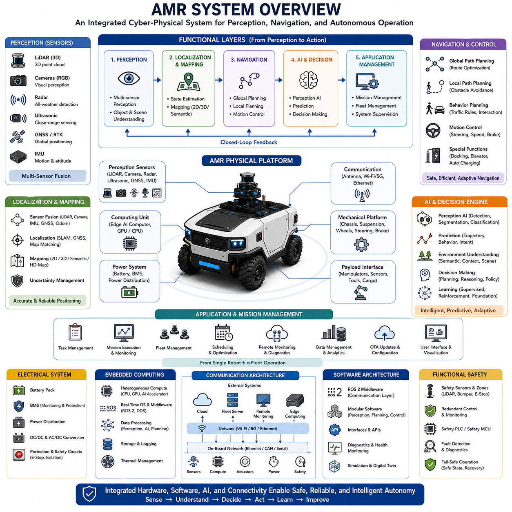
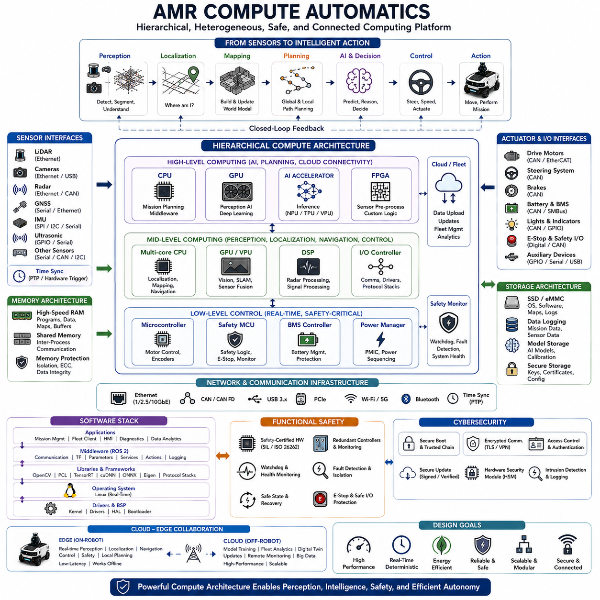
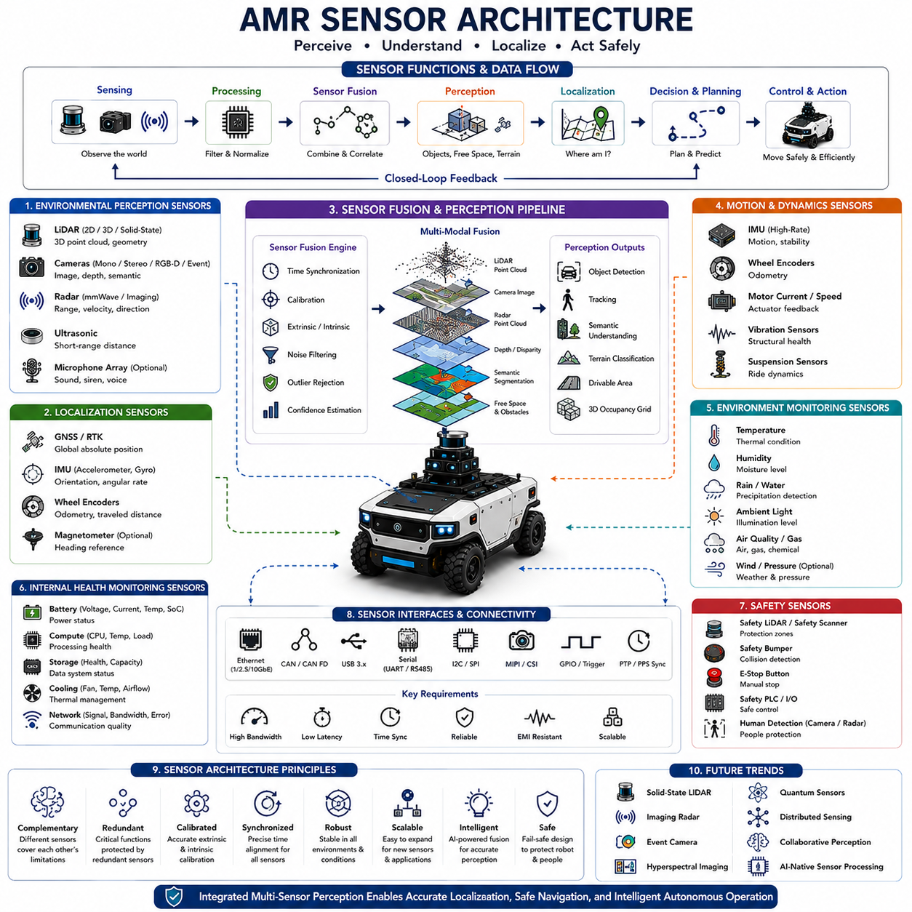
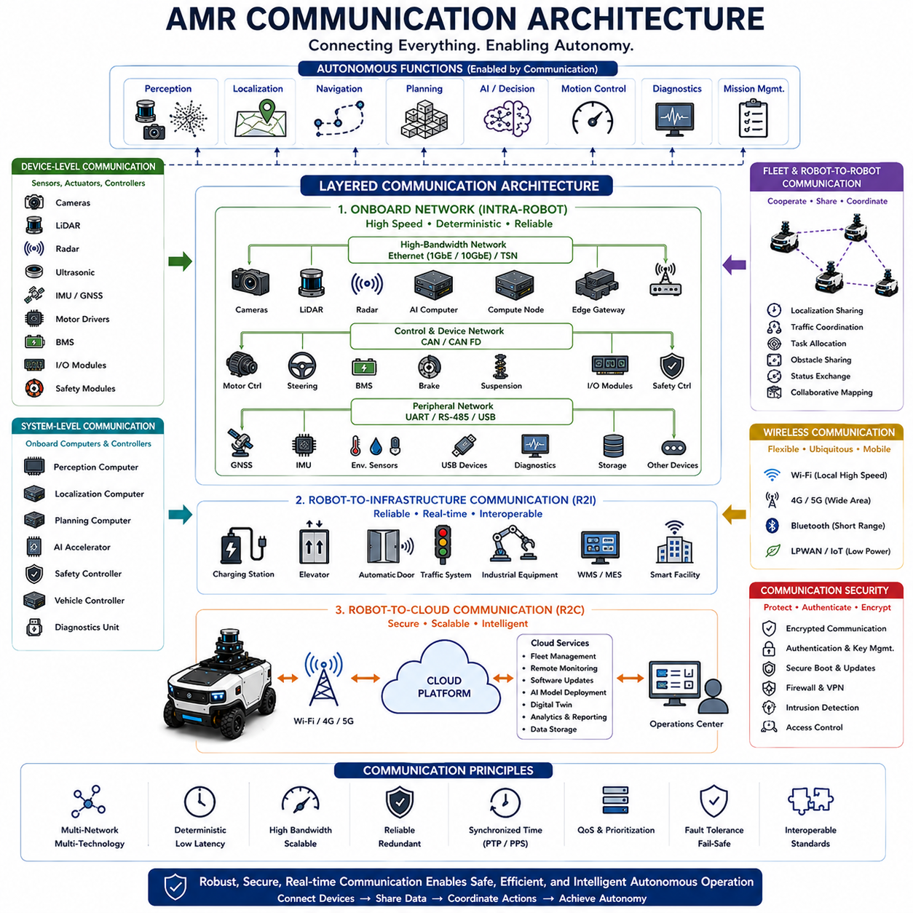
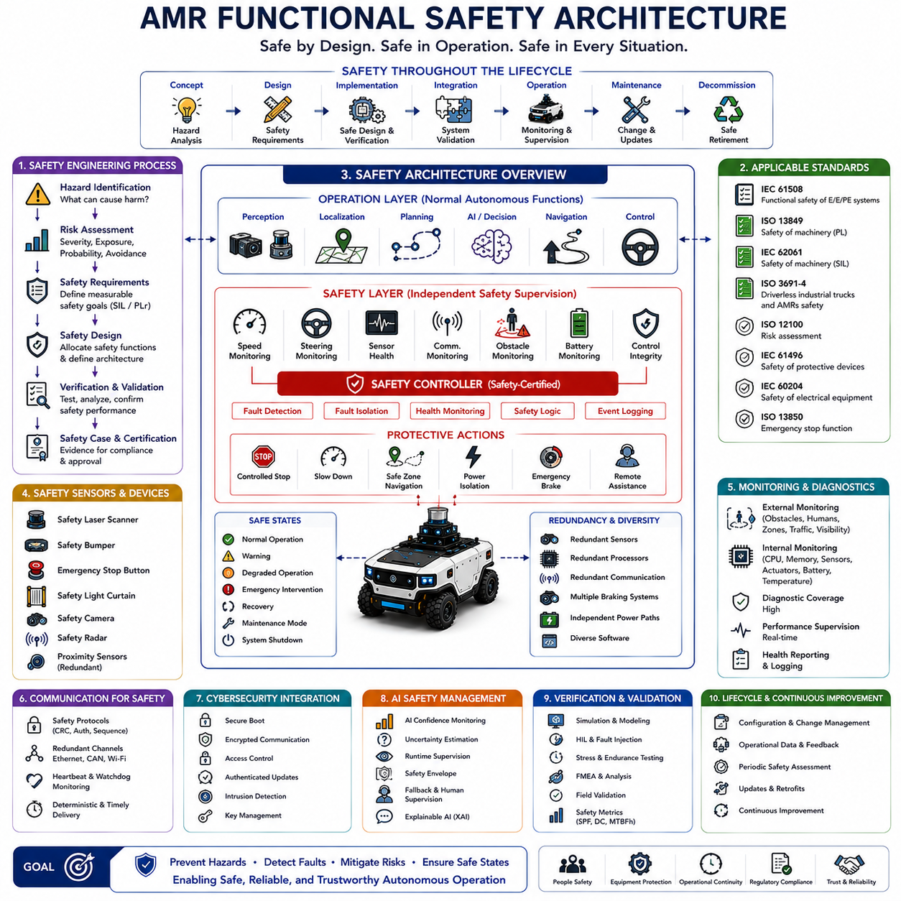

**Volume 01. AMR Foundations and System Architecture**

# 06. AMR System Architecture · AMR 시스템 아키텍처

## 06.01 AMR System Overview · AMR 시스템 개요

{width="7.268055555555556in" height="7.268055555555556in"}

An Autonomous Mobile Robot is an intelligent cyber-physical system that integrates mechanical engineering, electrical engineering, sensing technologies, artificial intelligence, embedded computing, communication networks, and autonomous decision-making into a unified platform capable of performing complex tasks without continuous human intervention. Unlike conventional automated machines that follow predefined paths or fixed sequences, an AMR continuously perceives its surroundings, estimates its own position, understands environmental changes, plans safe trajectories, executes missions, and adapts its behavior according to real-time operational conditions. The entire system operates as a closed-loop architecture in which sensing, reasoning, planning, control, and execution continuously exchange information to achieve reliable autonomous operation. An AMR therefore represents not a single technology but a tightly integrated collection of interdisciplinary engineering systems working together toward common operational objectives.

At the highest level, an AMR system can be viewed as several interconnected functional layers that transform raw environmental information into intelligent physical actions. The physical platform forms the foundation by providing structural support, mobility, power delivery, and payload capacity. Above this layer, perception systems observe the surrounding environment through multiple sensing modalities. Localization and mapping modules estimate the robot\'s position while maintaining an internal representation of the world. Navigation systems determine safe and efficient routes toward mission objectives, while artificial intelligence continuously interprets environmental context, predicts future events, and supports autonomous decision-making. Finally, application software coordinates missions, manages operational workflows, communicates with external systems, and supervises overall robot behavior. Each layer depends upon the reliability and performance of every other layer, making system integration one of the most critical engineering challenges in AMR development.

The mechanical subsystem provides the physical mobility required for autonomous operation. Chassis design determines structural rigidity, payload capacity, environmental durability, and installation space for batteries, sensors, computing hardware, and application equipment. Drive systems generate propulsion through electric motors, transmissions, and wheel assemblies, while steering mechanisms control vehicle direction according to platform architecture. Suspension systems, braking mechanisms, and structural vibration management influence vehicle stability, sensor accuracy, and operational safety. The mechanical platform therefore directly affects navigation precision, perception quality, energy efficiency, and long-term reliability across diverse operating environments ranging from controlled indoor facilities to rugged outdoor terrain.

Electrical architecture supplies, distributes, and manages energy throughout the entire robotic system. Battery technology provides portable power, while battery management systems monitor voltage, current, temperature, state of charge, and overall battery health. Power distribution units allocate electrical energy to motors, sensors, computers, communication devices, and auxiliary equipment through protected electrical networks. Voltage conversion modules provide appropriate operating voltages for heterogeneous electronic components, while emergency stop circuits and functional safety hardware ensure rapid power isolation during hazardous conditions. Robust electrical engineering therefore enables stable operation while protecting critical subsystems from overload, electrical faults, and environmental disturbances.

Perception serves as the sensory interface between the robot and its environment. Multiple sensors simultaneously observe surrounding objects, terrain, infrastructure, and dynamic obstacles using complementary physical principles. LiDAR measures three-dimensional geometry, cameras capture visual appearance, radar detects objects under adverse weather conditions, ultrasonic sensors monitor nearby obstacles, GNSS estimates global position, and inertial measurement units measure vehicle motion. Individual sensing technologies possess different strengths and limitations, making multi-sensor fusion essential for constructing accurate and robust environmental models. Perception software transforms raw sensor measurements into meaningful semantic information including detected objects, traversable terrain, free space, traffic participants, and operational hazards required for autonomous navigation.

Localization and mapping modules determine where the robot is and how the surrounding environment is organized. Localization algorithms combine wheel odometry, inertial navigation, LiDAR SLAM, Visual SLAM, GNSS positioning, radar localization, and semantic landmark recognition to estimate vehicle pose continuously. Simultaneously, mapping systems construct geometric, semantic, or high-definition representations of the operational environment that support navigation and long-term autonomy. Modern localization architectures continuously evaluate sensor confidence while dynamically adapting sensor fusion strategies whenever environmental conditions reduce the reliability of individual positioning technologies. Accurate localization therefore provides the spatial foundation upon which every autonomous decision depends.

Navigation transforms localization information and mission objectives into executable vehicle motion. Global planning determines efficient routes across known environments, while local planning continuously generates collision-free trajectories around dynamic obstacles. Motion control algorithms translate planned trajectories into steering, acceleration, braking, and vehicle stabilization commands while respecting mechanical constraints and safety requirements. Advanced navigation additionally incorporates traffic management, behavioral planning, docking procedures, elevator interaction, charging operations, and multi-robot coordination. Rather than simply following predefined paths, modern navigation systems continuously adapt trajectories according to changing environmental conditions, mission priorities, and operational objectives.

Artificial intelligence increasingly serves as the cognitive engine of modern AMRs. Deep learning enables object detection, semantic segmentation, terrain classification, anomaly detection, and environmental understanding. Reinforcement learning optimizes navigation strategies through accumulated operational experience, while multimodal AI integrates geometric, visual, inertial, radar, and contextual information into unified scene representations. Foundation models further extend robotic capability by providing generalized reasoning, language understanding, and adaptive problem-solving across unfamiliar situations. Rather than replacing traditional robotics algorithms, artificial intelligence complements deterministic control systems by providing higher-level interpretation, prediction, and adaptive decision-making capabilities.

Embedded computing infrastructure executes every software component in real time while coordinating interactions among hardware subsystems. Modern AMRs frequently employ heterogeneous computing architectures combining multi-core CPUs, high-performance GPUs, AI accelerators, field-programmable gate arrays, and dedicated microcontrollers. Real-time operating systems, middleware frameworks, device drivers, communication buses, and distributed software architectures enable deterministic execution despite computational complexity. Compute architecture must balance processing performance, energy consumption, thermal management, physical size, reliability, and long-term maintainability while satisfying increasingly demanding perception and artificial intelligence workloads.

Communication architecture connects internal robot components while simultaneously enabling interaction with external systems. High-speed Ethernet networks, CAN buses, serial communication interfaces, wireless networking, industrial fieldbus technologies, and time synchronization protocols allow reliable data exchange among sensors, controllers, computers, and actuators. Beyond internal communication, cloud connectivity, fleet management systems, remote monitoring platforms, software update mechanisms, and edge computing infrastructure enable centralized supervision of geographically distributed robotic fleets. Robust communication architectures therefore support both autonomous independence and coordinated multi-robot operation within larger industrial ecosystems.

Software architecture organizes the enormous complexity of autonomous robotics into modular, maintainable, and scalable components. Middleware platforms such as ROS 2 provide standardized communication mechanisms among independent software nodes implementing perception, localization, navigation, planning, diagnostics, safety, and mission management. Modular software design simplifies development, testing, debugging, deployment, and long-term maintenance while allowing individual subsystems to evolve independently. Well-defined interfaces additionally facilitate integration of third-party sensors, industrial automation equipment, cloud services, and customer-specific applications without redesigning the complete robotic platform.

Mission management coordinates high-level robot behavior according to operational objectives. Mission execution systems assign tasks, monitor progress, prioritize competing objectives, allocate resources, and recover from unexpected failures. Fleet management extends these capabilities across multiple robots by optimizing traffic flow, battery charging schedules, maintenance planning, workload balancing, and resource utilization. Intelligent scheduling algorithms maximize operational efficiency while minimizing idle time, congestion, energy consumption, and mission delays. Mission management therefore transforms individual autonomous robots into coordinated robotic ecosystems capable of supporting complex industrial operations.

Functional safety permeates every subsystem within an AMR architecture. Safety-certified sensors monitor protective zones, redundant controllers supervise critical functions, diagnostic systems continuously evaluate hardware health, and fail-safe mechanisms ensure controlled system behavior whenever faults occur. Emergency braking, safe speed monitoring, obstacle protection, communication integrity, power isolation, and operational risk assessment collectively reduce the probability and severity of hazardous events. Safety engineering is therefore not an isolated subsystem but an architectural principle integrated throughout mechanical design, electrical systems, software architecture, artificial intelligence, and operational procedures.

Data management has become an increasingly valuable component of modern AMR systems. Operational logs, sensor recordings, localization data, perception outputs, mission histories, diagnostic information, and maintenance records provide valuable resources for system optimization. Machine learning pipelines utilize accumulated operational data to improve perception models, navigation performance, predictive maintenance algorithms, and fleet efficiency. Cloud-edge synchronization enables distributed robots to collectively learn from operational experience while maintaining secure and reliable data exchange. Continuous data collection therefore supports ongoing improvement throughout the robot lifecycle rather than limiting optimization to initial development.

Future AMR system architectures will increasingly converge toward software-defined, AI-native robotic platforms in which perception, navigation, reasoning, communication, and physical control operate as tightly integrated intelligent systems. Foundation models, embodied artificial intelligence, digital twins, cloud robotics, edge computing, multimodal perception, collaborative fleet intelligence, and autonomous software adaptation will further expand robotic capability beyond conventional task automation. Rather than functioning solely as autonomous vehicles, future AMRs will evolve into intelligent physical agents capable of understanding complex environments, collaborating with humans and other robots, adapting to unfamiliar situations, and continuously improving through lifelong learning across diverse industrial, commercial, and public applications.

## 06.02 Compute Architecture · 컴퓨트 아키텍처

{width="7.268055555555556in" height="7.268055555555556in"}

Modern Autonomous Mobile Robots rely on sophisticated compute architectures that transform raw sensor information into intelligent autonomous behavior in real time. The compute architecture serves as the digital nervous system of the robot, connecting perception, localization, navigation, planning, artificial intelligence, communication, safety, and mission management into a unified computational platform. Unlike traditional industrial automation systems that execute fixed control logic, AMRs continuously process enormous volumes of heterogeneous sensor data while simultaneously making autonomous decisions under dynamic environmental conditions. As robot intelligence increases through artificial intelligence and multimodal perception, compute architecture has evolved from simple embedded controllers into heterogeneous high-performance computing platforms capable of executing hundreds of concurrent software processes with deterministic real-time performance.

At the highest level, an AMR compute architecture is organized into multiple computational layers, each responsible for different categories of processing tasks. Low-level embedded controllers manage motor control, battery management, safety monitoring, and real-time actuator interfaces. Mid-level computing platforms execute localization, mapping, perception, sensor fusion, communication, and vehicle control algorithms. High-level computing resources perform artificial intelligence inference, mission planning, semantic reasoning, fleet coordination, and cloud connectivity. This layered organization isolates time-critical control functions from computationally intensive artificial intelligence workloads while maintaining efficient communication among all subsystems. Such hierarchical computing architectures significantly improve reliability, scalability, maintainability, and fault isolation.

Central Processing Units remain the backbone of most robotic computing systems because they execute general-purpose software requiring deterministic execution and flexible control logic. Multi-core processors simultaneously manage middleware, operating systems, localization algorithms, navigation planning, communication protocols, diagnostics, mission management, data logging, and system supervision. Modern industrial CPUs provide high computational throughput while maintaining deterministic scheduling characteristics necessary for safety-critical robotic applications. Careful task allocation across multiple processor cores minimizes latency, balances computational load, and prevents interference among concurrent software modules executing under real-time operating constraints.

Graphics Processing Units have become indispensable components within modern AMR compute architectures due to the rapid growth of deep learning and computer vision workloads. Convolutional neural networks, transformer models, semantic segmentation, object detection, depth estimation, visual localization, terrain classification, and multimodal perception require massive parallel computation that conventional CPUs cannot efficiently provide. GPUs execute thousands of processing threads simultaneously, dramatically accelerating neural network inference while enabling real-time perception from multiple high-resolution cameras, LiDAR point clouds, radar signals, and sensor fusion pipelines. Consequently, GPU performance directly influences overall robotic intelligence and environmental understanding.

Artificial Intelligence accelerators further optimize compute efficiency by providing dedicated hardware specifically designed for neural network execution. Tensor Processing Units, Neural Processing Units, Vision Processing Units, and custom AI inference chips significantly reduce power consumption while maintaining high inference throughput for machine learning applications. These specialized processors efficiently execute matrix operations, tensor computations, convolution kernels, and transformer attention mechanisms commonly used by modern artificial intelligence models. Integrating AI accelerators alongside CPUs and GPUs enables heterogeneous computing architectures that optimize performance according to workload characteristics rather than relying upon a single processor type.

Microcontrollers remain essential despite the increasing sophistication of high-performance computing hardware. Dedicated microcontrollers execute deterministic low-level control tasks including motor control, encoder processing, battery management, sensor interfaces, safety monitoring, emergency stop logic, and hardware diagnostics. Separating these time-critical functions from computationally intensive AI processing improves overall system robustness because essential control functions continue operating even when high-level computing experiences temporary overload or software failure. This architectural separation represents a fundamental principle of dependable robotic system design.

Memory architecture plays an equally important role in determining computational performance. High-speed system memory stores operating systems, middleware, application software, neural network parameters, localization maps, sensor buffers, planning data structures, and temporary computational results. Large-capacity memory becomes increasingly necessary as robots execute multiple deep learning models while simultaneously maintaining three-dimensional maps and processing high-bandwidth sensor streams. Memory bandwidth directly affects perception latency because enormous quantities of camera images, LiDAR point clouds, radar measurements, and neural network tensors must continuously move between processors and storage devices. Efficient memory hierarchy therefore significantly improves overall computational throughput.

Persistent storage supports both operational software and accumulated robotic knowledge. Solid-state drives typically store operating systems, application software, high-definition maps, calibration parameters, mission databases, diagnostic logs, software updates, machine learning models, and recorded sensor datasets. Modern autonomous robots generate terabytes of operational data throughout long-term deployment, requiring reliable storage systems capable of sustained high-speed recording while maintaining resistance against vibration, shock, and environmental stress. Storage architecture therefore supports not only immediate operation but also continuous improvement through data-driven system optimization.

Sensor interfaces provide the communication pathways through which environmental information enters the computing platform. High-bandwidth Ethernet connections support LiDARs, industrial cameras, radar systems, and high-performance communication devices. USB interfaces frequently connect vision sensors and auxiliary devices, while CAN buses support motor controllers, battery management systems, and industrial actuators. Serial interfaces integrate GNSS receivers, inertial measurement units, environmental sensors, and specialized embedded hardware. Synchronization hardware aligns sensor timestamps using Precision Time Protocol or hardware trigger mechanisms, ensuring temporally consistent sensor fusion despite diverse communication technologies and sampling frequencies.

Middleware provides the software infrastructure connecting independent computational modules into a coherent robotic system. Frameworks such as ROS 2 enable distributed communication among perception, localization, navigation, artificial intelligence, diagnostics, mission management, and visualization processes through standardized message interfaces. Publish-subscribe communication, service calls, action interfaces, and parameter management allow software components to exchange information while remaining independently developed and maintained. Middleware therefore substantially simplifies integration, debugging, software reuse, and long-term platform evolution across increasingly complex robotic systems.

Operating systems coordinate hardware resources while providing deterministic software execution. Linux distributions dominate high-performance robotic computing because they offer extensive hardware support, networking capability, open-source development ecosystems, and compatibility with modern artificial intelligence frameworks. Real-time Linux extensions improve scheduling determinism for latency-sensitive robotics applications. Dedicated real-time operating systems frequently manage microcontroller-based control systems responsible for motor control and safety supervision. Hybrid operating system architectures therefore combine the flexibility of general-purpose computing with the deterministic behavior required by safety-critical embedded control.

Distributed computing increasingly characterizes advanced AMR platforms. Rather than concentrating all computation within a single processor, modern robots frequently employ multiple interconnected computing modules dedicated to perception, navigation, artificial intelligence, functional safety, communication, or application-specific processing. High-speed Ethernet networks and time synchronization protocols enable coordinated execution across distributed computational resources while reducing thermal concentration, simplifying hardware upgrades, and improving fault tolerance. Distributed architectures additionally facilitate modular platform development in which computational capability expands according to application complexity.

Cloud-edge computing extends onboard compute architecture beyond the physical robot itself. Time-critical perception, localization, navigation, and safety functions execute locally on edge computers to minimize latency and preserve autonomous operation even without network connectivity. Computationally intensive training, fleet analytics, predictive maintenance, digital twin simulation, software deployment, and large-scale data analysis occur within cloud infrastructure where virtually unlimited computational resources become available. Cloud-edge collaboration therefore balances local responsiveness with centralized intelligence, allowing robotic fleets collectively to improve operational performance through shared learning and distributed optimization.

Functional safety significantly influences compute architecture design. Safety-certified processors, redundant controllers, independent monitoring circuits, watchdog timers, memory protection mechanisms, secure boot procedures, hardware diagnostics, and fault detection algorithms collectively reduce the probability of hazardous computational failures. Critical safety functions remain isolated from high-level artificial intelligence processing to prevent software faults from compromising fundamental vehicle control. Safety architectures continuously monitor processor utilization, memory integrity, communication quality, execution timing, sensor availability, and software health while initiating controlled recovery whenever abnormal conditions are detected.

Cybersecurity has become an increasingly important consideration within robotic compute architecture. Secure hardware modules, encrypted communication, trusted boot chains, authenticated software updates, hardware security modules, access control mechanisms, and intrusion detection systems protect autonomous robots against unauthorized access and malicious software manipulation. As AMRs become increasingly connected through cloud services, fleet management systems, industrial networks, and remote diagnostics, compute architecture must integrate cybersecurity directly into hardware and software design rather than treating security as an optional software feature.

Future compute architectures will increasingly evolve toward AI-native heterogeneous platforms integrating CPUs, GPUs, AI accelerators, programmable logic, high-bandwidth memory, advanced networking, and intelligent power management into tightly optimized computational ecosystems. Foundation models, embodied artificial intelligence, multimodal reasoning, world models, collaborative fleet intelligence, and lifelong learning will require exponentially greater computational capability while maintaining strict power, thermal, size, and reliability constraints. Emerging processors specifically designed for robotics will dynamically allocate computational resources according to mission priorities, environmental complexity, and operational risk, enabling future Autonomous Mobile Robots to achieve unprecedented levels of intelligence, adaptability, efficiency, and autonomous decision-making across highly diverse industrial and public environments.

## 06.03 Sensor Architecture · 센서 아키텍처

{width="7.268055555555556in" height="7.268055555555556in"}

Sensor architecture is one of the most fundamental elements of an Autonomous Mobile Robot because it provides the robot with the ability to perceive, interpret, and interact with the physical world. Without an effective sensor architecture, even the most advanced artificial intelligence algorithms cannot make reliable decisions because they depend entirely on accurate environmental information. Modern AMRs integrate multiple sensing technologies into a unified perception framework that continuously observes the robot itself, surrounding obstacles, infrastructure, terrain, environmental conditions, and dynamic objects. Rather than relying on a single sensor, sensor architecture combines complementary sensing modalities through sensor fusion to compensate for individual limitations and maximize perception robustness. As autonomous systems become increasingly intelligent, sensor architecture evolves from a simple collection of devices into an integrated perception ecosystem supporting reliable real-time autonomous operation.

At the highest level, AMR sensor architecture can be divided into several functional categories according to the information each sensor provides. Environmental perception sensors observe the surrounding world, localization sensors estimate the robot\'s position and orientation, motion sensors monitor vehicle dynamics, internal monitoring sensors supervise system health, and safety sensors protect both the robot and nearby humans. Each category contributes different types of information that together form a comprehensive representation of the robot\'s operating environment. The compute architecture continuously synchronizes, filters, and integrates these heterogeneous sensor streams into a unified environmental model supporting navigation, planning, manipulation, and autonomous decision-making.

LiDAR remains one of the most important sensing technologies within modern AMR platforms because it provides highly accurate three-dimensional geometric information independent of ambient lighting conditions. By emitting laser pulses and measuring their return time, LiDAR generates dense point clouds representing surrounding structures, obstacles, and terrain geometry. Two-dimensional LiDAR commonly supports indoor localization, obstacle avoidance, and safety monitoring, while three-dimensional LiDAR enables outdoor terrain modeling, object detection, semantic mapping, and high-speed autonomous navigation. Modern solid-state LiDAR technologies further improve reliability by eliminating rotating mechanical components while reducing size, weight, power consumption, and manufacturing cost.

Camera systems provide rich visual information unavailable through purely geometric sensors. Monocular cameras capture appearance, texture, color, and semantic information necessary for recognizing traffic signs, people, packages, industrial equipment, lane markings, and numerous environmental features. Stereo camera systems estimate depth through binocular vision, while RGB-D cameras directly combine color imagery with depth measurements. Event cameras represent an emerging sensing technology capable of detecting extremely fast motion with very low latency by recording changes in pixel intensity rather than conventional image frames. Camera-based perception therefore significantly expands environmental understanding beyond purely geometric measurements.

Radar complements optical sensing technologies by providing reliable perception under adverse environmental conditions where cameras and LiDAR experience degraded performance. Millimeter-wave radar penetrates rain, fog, snow, dust, smoke, and darkness while accurately estimating object distance, relative velocity, and motion direction. Radar therefore plays an increasingly important role in outdoor autonomous navigation, particularly for collision avoidance, vehicle detection, and high-speed operation. Imaging radar technologies continue advancing toward higher spatial resolution, allowing radar to contribute not only motion detection but also increasingly detailed environmental understanding through artificial intelligence-based signal interpretation.

Ultrasonic sensors provide simple, reliable, and cost-effective short-range obstacle detection. These sensors measure distance using reflected acoustic waves and perform particularly well during docking, parking, elevator interaction, charging alignment, and close-proximity maneuvering where precise short-distance measurement becomes essential. Although ultrasonic sensors possess relatively limited range and angular resolution compared with LiDAR or cameras, they remain valuable because they detect nearby obstacles that may be difficult for longer-range sensors to observe. Their robustness and simplicity make them indispensable components of many industrial robotic platforms.

Global Navigation Satellite Systems enable absolute positioning across large outdoor environments where satellite visibility remains available. Standard GNSS provides meter-level positioning suitable for general navigation, while Real-Time Kinematic correction significantly improves positioning accuracy to centimeter-level precision. GNSS receivers frequently integrate multiple satellite constellations including GPS, GLONASS, Galileo, and BeiDou to improve coverage and reliability. Since satellite signals may degrade beneath trees, bridges, tunnels, or urban canyons, GNSS rarely operates alone but instead participates within broader multi-sensor localization architectures combining inertial navigation, LiDAR SLAM, Visual SLAM, and map matching.

Inertial Measurement Units continuously estimate vehicle motion independent of external references. Accelerometers measure linear acceleration while gyroscopes estimate angular velocity across multiple axes. Sensor fusion algorithms integrate these measurements to estimate robot orientation, velocity, and short-term trajectory during temporary loss of external localization signals. Although inertial navigation gradually accumulates drift over time, IMUs provide extremely high-frequency motion information essential for stabilizing localization, compensating for vehicle vibration, improving sensor synchronization, and supporting dynamic vehicle control during rapid maneuvers.

Wheel encoders represent another fundamental component of robotic localization architecture. By measuring wheel rotation, encoders estimate vehicle displacement, traveled distance, and relative motion through odometry calculations. Encoder measurements remain highly reliable on stable surfaces under normal traction conditions, providing continuous motion estimation between absolute localization updates. However, wheel slip, uneven terrain, loose soil, and mechanical wear gradually reduce odometric accuracy. Consequently, wheel odometry is rarely used independently but instead contributes as one information source within integrated localization frameworks utilizing complementary sensing technologies.

Environmental monitoring sensors extend robotic perception beyond navigation by measuring surrounding physical conditions. Temperature sensors monitor thermal environments affecting electronic equipment, while humidity sensors detect atmospheric moisture influencing sensor performance. Rain sensors identify precipitation, ambient light sensors estimate illumination levels, wind sensors evaluate environmental disturbances, and air quality sensors monitor hazardous industrial conditions. Specialized applications additionally employ gas sensors, radiation detectors, vibration monitors, magnetic field sensors, pressure sensors, and chemical detection systems according to operational requirements. These environmental measurements allow autonomous systems to adapt operational strategies according to changing environmental conditions.

Internal health monitoring sensors continuously supervise the condition of the robot itself. Battery voltage, current, temperature, state of charge, motor temperature, gearbox vibration, processor utilization, memory usage, storage capacity, cooling performance, and communication quality provide critical diagnostic information supporting predictive maintenance and operational reliability. Health monitoring enables autonomous robots to detect abnormal conditions before failures occur, allowing intelligent mission replanning, preventive maintenance scheduling, and safe operational shutdown whenever necessary. Such self-monitoring capabilities significantly improve system availability while reducing maintenance cost throughout long-term deployment.

Sensor fusion represents the core intelligence underlying modern sensor architecture. Every sensing technology possesses unique strengths and unavoidable limitations arising from its underlying physical measurement principles. Cameras provide semantic richness but struggle under poor lighting. LiDAR delivers precise geometry but lacks visual appearance. Radar performs well during adverse weather yet offers relatively limited spatial resolution. GNSS provides absolute positioning but depends upon satellite visibility. Sensor fusion algorithms combine these complementary observations into unified environmental representations that significantly exceed the reliability achievable by any individual sensing modality. Probabilistic estimation, Bayesian filtering, Kalman filtering, particle filtering, factor graph optimization, and deep learning-based fusion techniques collectively improve localization accuracy, obstacle detection reliability, semantic understanding, and overall system robustness.

Time synchronization constitutes another critical aspect of sensor architecture because all sensor observations must correspond to the same physical moment despite differing communication interfaces and sampling frequencies. Precision Time Protocol, hardware trigger systems, pulse-per-second synchronization, timestamp correction, and deterministic communication networks ensure temporal consistency among cameras, LiDARs, radars, IMUs, GNSS receivers, and actuator controllers. Even millisecond-level synchronization errors may significantly degrade localization accuracy, object tracking performance, and sensor fusion quality, particularly during high-speed autonomous operation. Accurate temporal alignment therefore represents a fundamental prerequisite for reliable perception.

Future sensor architectures will increasingly emphasize intelligent multimodal perception rather than isolated sensing devices. Emerging technologies including solid-state LiDAR, imaging radar, event cameras, hyperspectral imaging, quantum sensors, distributed sensor networks, collaborative perception, and AI-native sensor processing will dramatically expand environmental awareness. Foundation models will interpret heterogeneous sensor information through generalized reasoning rather than isolated perception pipelines, while cloud-edge collaboration will allow robotic fleets to share environmental knowledge in real time. Sensor architecture will therefore continue evolving from hardware-centered measurement systems into adaptive intelligent perception ecosystems capable of supporting highly autonomous, safe, efficient, and continuously learning robotic platforms operating across increasingly complex real-world environments.

## 06.04 Communication Architecture · 통신 아키텍처

{width="7.268055555555556in" height="7.268055555555556in"}

Communication architecture is a fundamental component of an Autonomous Mobile Robot because it enables continuous information exchange among sensors, computing units, controllers, actuators, fleet management systems, cloud services, and external infrastructure. Every autonomous function---including perception, localization, navigation, artificial intelligence, motion control, diagnostics, and mission management---depends upon reliable communication to operate correctly. Unlike conventional industrial automation systems that often rely on a single communication bus, modern AMRs integrate multiple communication technologies operating simultaneously at different bandwidths, latencies, reliability levels, and physical layers. Communication architecture therefore functions as the nervous system of the robot, ensuring that distributed hardware and software components cooperate as one intelligent autonomous system while maintaining deterministic real-time behavior and operational safety.

At the highest level, communication architecture can be divided into several interconnected layers according to communication scope and functional responsibility. Device-level communication connects sensors, actuators, batteries, and embedded controllers to local processing units. System-level communication exchanges information among onboard computers responsible for perception, localization, planning, artificial intelligence, and safety supervision. Robot-to-infrastructure communication enables interaction with charging stations, elevators, traffic control systems, industrial equipment, and smart facilities. Robot-to-cloud communication supports fleet management, remote monitoring, software deployment, digital twins, and operational analytics. Each communication layer operates with different performance requirements while remaining tightly integrated through standardized networking protocols and software middleware.

Onboard communication forms the foundation of every AMR communication system because all autonomous functions rely upon continuous data exchange among internal components. High-speed sensor data generated by cameras, LiDARs, radar systems, and artificial intelligence accelerators must reach computing platforms with minimal latency, while lower-bandwidth status information continuously flows among controllers, battery management systems, motor drivers, and diagnostic modules. Communication scheduling therefore balances deterministic timing for safety-critical control with efficient bandwidth utilization for computationally intensive perception tasks. Well-designed onboard communication minimizes latency, prevents data loss, and guarantees predictable information flow despite highly heterogeneous hardware architectures.

Ethernet has become the dominant high-speed communication technology within modern robotic platforms. Gigabit Ethernet and increasingly 10 Gigabit Ethernet provide sufficient bandwidth for high-resolution cameras, three-dimensional LiDAR, industrial radar, distributed computing modules, and large artificial intelligence workloads. Ethernet additionally supports standardized Internet Protocol networking, allowing flexible integration of heterogeneous computing hardware using mature networking infrastructure. Industrial Ethernet variants further improve deterministic communication through time-sensitive networking, enabling predictable latency for robotic control applications while preserving compatibility with conventional networking technologies.

Controller Area Network remains one of the most widely deployed communication buses for embedded robotic control. CAN provides robust, deterministic, and fault-tolerant communication suitable for motor controllers, steering systems, battery management systems, safety modules, braking systems, suspension controllers, and numerous industrial actuators. Error detection, message prioritization, and electrical robustness allow CAN networks to operate reliably despite electromagnetic interference, vibration, temperature variation, and harsh industrial environments. CAN FD extends conventional CAN by increasing payload capacity and communication speed while maintaining compatibility with existing industrial control architectures.

Serial communication continues serving numerous specialized sensing and control applications due to its simplicity and reliability. Universal Asynchronous Receiver Transmitter interfaces frequently connect GNSS receivers, inertial measurement units, environmental sensors, diagnostic tools, and industrial peripheral devices. RS-232 and RS-485 remain common within industrial automation because they support long communication distances while resisting electrical noise. Serial interfaces provide low-cost integration for devices requiring relatively modest bandwidth, complementing higher-performance communication technologies used by perception sensors and distributed computing systems.

Universal Serial Bus supports many commercial sensing devices including cameras, storage systems, wireless communication modules, and diagnostic equipment. USB provides plug-and-play hardware integration together with sufficient bandwidth for medium-performance vision systems and auxiliary computing devices. Modern USB standards significantly improve transfer rates while supplying electrical power to connected peripherals, reducing wiring complexity inside robotic platforms. Although USB generally lacks deterministic timing required for critical control functions, it remains valuable for non-safety-critical sensing and maintenance applications due to its widespread hardware compatibility.

Wireless communication extends robotic capability beyond onboard operation by connecting AMRs with external infrastructure and fleet management systems. Wi-Fi provides high-bandwidth local communication inside factories, warehouses, hospitals, and industrial campuses where wireless infrastructure already exists. Cellular technologies including 4G LTE and 5G enable reliable long-distance connectivity across geographically distributed outdoor operations. Bluetooth supports local device configuration, diagnostics, and accessory integration, while emerging low-power wireless technologies enable specialized industrial Internet of Things applications. Wireless communication therefore transforms autonomous robots from isolated machines into connected intelligent agents participating within broader digital ecosystems.

Robot-to-robot communication becomes increasingly important as autonomous fleets expand in size and operational complexity. Multiple robots exchange localization information, traffic status, mission assignments, obstacle reports, environmental observations, battery status, and operational priorities to coordinate collaborative activities. Fleet communication enables distributed task allocation, collision avoidance, cooperative transportation, shared mapping, collaborative perception, and synchronized mission execution across large robotic deployments. Rather than operating independently, future robotic fleets will increasingly function as cooperative distributed intelligent systems sharing knowledge continuously through robust communication infrastructure.

Robot-to-infrastructure communication allows AMRs to interact intelligently with surrounding facilities and industrial equipment. Elevators communicate availability and floor status, automatic doors coordinate opening requests, charging stations negotiate charging schedules, manufacturing equipment exchanges production status, warehouse management systems assign logistics missions, and industrial automation systems synchronize robotic activities with production workflows. Standardized communication interfaces significantly simplify integration between robotic platforms and existing industrial infrastructure while improving operational efficiency across entire facilities.

Cloud communication extends robotic capability through centralized computing and data management. Fleet management systems monitor robot health, operational status, battery condition, mission progress, and maintenance requirements across geographically distributed deployments. Cloud infrastructure additionally supports software updates, artificial intelligence model deployment, digital twin synchronization, predictive maintenance analytics, operational reporting, and long-term data storage. Time-critical autonomous functions remain onboard to preserve real-time responsiveness, while computationally intensive analysis and fleet optimization benefit from virtually unlimited cloud computing resources. Cloud-edge collaboration therefore balances local autonomy with centralized intelligence.

Middleware serves as the software communication backbone connecting distributed computational modules regardless of underlying hardware implementation. ROS 2 has become one of the most influential middleware frameworks within modern robotics because it provides standardized publish-subscribe communication, service interfaces, action protocols, parameter management, and lifecycle coordination among independent software components. Middleware abstracts hardware complexity while enabling modular software development, distributed execution, simplified debugging, and long-term platform scalability. Standardized software communication significantly accelerates integration of sensors, artificial intelligence, navigation algorithms, industrial automation equipment, and third-party software modules.

Time synchronization is a critical requirement within communication architecture because distributed sensing and computing require temporally consistent information exchange. Precision Time Protocol synchronizes cameras, LiDARs, radars, GNSS receivers, inertial sensors, computing platforms, and actuator controllers with sub-millisecond accuracy. Hardware trigger systems, pulse-per-second synchronization, deterministic networking, and synchronized timestamp generation ensure that sensor fusion algorithms process measurements corresponding to identical physical moments. Without accurate synchronization, localization drift, object tracking errors, and degraded perception performance rapidly accumulate, particularly during high-speed autonomous operation involving multiple heterogeneous sensing technologies.

Communication quality directly influences overall autonomous system performance. Latency determines response time between sensing and control actions, bandwidth limits sensor throughput and artificial intelligence processing capability, reliability affects operational continuity, and packet loss may degrade localization or perception accuracy. Communication architecture therefore continuously monitors network utilization, transmission errors, signal quality, synchronization status, and hardware health while dynamically adapting communication priorities according to mission requirements. Quality-of-service mechanisms allocate bandwidth preferentially to safety-critical functions while preventing lower-priority traffic from interfering with essential autonomous operation.

Functional safety places strict requirements upon communication architecture because communication failures may directly influence vehicle behavior. Redundant communication channels, fail-safe network topologies, watchdog supervision, communication heartbeat monitoring, cyclic redundancy checking, message authentication, timeout detection, and fault isolation mechanisms ensure that critical information remains available despite hardware failures or network disturbances. Safety controllers continuously verify communication integrity while transitioning the robot into controlled safe states whenever communication quality falls below acceptable thresholds. Communication reliability therefore represents an essential element of overall functional safety engineering rather than merely a networking consideration.

Cybersecurity has become inseparable from communication architecture as autonomous robots become increasingly connected. Secure communication protocols, encrypted data transmission, mutual authentication, certificate management, secure key exchange, virtual private networking, intrusion detection, firewall protection, secure boot mechanisms, and authenticated software updates collectively protect robotic systems against unauthorized access and cyber threats. Communication security must extend across onboard networks, wireless links, cloud infrastructure, fleet management platforms, and industrial control systems to ensure trustworthy autonomous operation throughout the robot lifecycle.

Future communication architectures will evolve toward intelligent software-defined networking capable of dynamically optimizing communication according to mission priorities, environmental conditions, computational workload, and operational risk. Time-Sensitive Networking, 6G wireless communication, edge-cloud orchestration, collaborative perception, distributed artificial intelligence, digital twins, and autonomous network management will further transform communication infrastructure into an active participant within robotic intelligence rather than a passive transport mechanism. As autonomous systems continue expanding across industrial, commercial, public, and infrastructure applications, communication architecture will increasingly determine the scalability, intelligence, reliability, security, and collaborative capability of next-generation Autonomous Mobile Robot ecosystems.

## 06.05 Functional Safety Architecture · 기능 안전 아키텍처

{width="7.268055555555556in" height="7.268055555555556in"}

Functional safety architecture is one of the most critical foundations of an Autonomous Mobile Robot because it ensures that the robot operates safely even when hardware faults, software defects, communication failures, sensor degradation, environmental disturbances, or unexpected operational conditions occur. Unlike conventional safety systems that simply stop machines whenever abnormalities are detected, functional safety architecture continuously evaluates operational risks, detects failures, isolates faulty components, and transitions the system into predefined safe states while minimizing unnecessary interruptions. Modern AMRs therefore integrate safety as an inherent system property rather than as an independent protective feature. Functional safety architecture combines hardware redundancy, software supervision, deterministic control, safety-certified components, and systematic engineering processes to reduce operational risks to acceptable levels throughout the complete product lifecycle.

The primary objective of functional safety architecture is to prevent hazardous situations before they lead to accidents involving people, equipment, facilities, or the robot itself. Since AMRs frequently operate within dynamic environments shared by humans, forklifts, industrial machinery, and autonomous vehicles, safety must remain active throughout every operational phase including startup, autonomous navigation, obstacle avoidance, docking, charging, manipulation, maintenance, emergency recovery, and system shutdown. Functional safety therefore extends far beyond emergency stop mechanisms and encompasses continuous risk assessment, fault diagnosis, operational supervision, and intelligent safety decision-making integrated directly into every subsystem of the robot.

Functional safety begins with systematic hazard identification and risk assessment during the earliest stages of system development. Engineers analyze all foreseeable operating conditions, environmental situations, hardware failures, software defects, human interactions, maintenance procedures, misuse scenarios, and external disturbances that could potentially create hazardous events. Each identified hazard is evaluated according to severity, frequency of exposure, probability of occurrence, and possibility of avoidance. These analyses establish measurable safety requirements that subsequently guide the design of hardware architecture, software architecture, communication systems, control algorithms, and operational procedures. Safety engineering therefore becomes an integral component of system architecture rather than an activity performed after product completion.

International functional safety standards provide structured engineering methodologies for developing safe autonomous systems. IEC 61508 establishes general functional safety principles for electrical and electronic programmable systems, while ISO 13849 focuses on machinery safety through performance levels for safety-related control systems. IEC 62061 further addresses industrial machinery safety, and ISO 3691-4 specifically defines safety requirements for driverless industrial trucks and autonomous mobile robots operating within industrial environments. Additional standards including ISO 12100, IEC 61496, IEC 60204, and ISO 13850 address machine risk assessment, protective sensing devices, electrical equipment safety, and emergency stop functions. Compliance with these standards provides systematic guidance for developing reliable and certifiable robotic safety architectures.

Safety architecture typically separates operational control from safety supervision by introducing independent safety control layers. The primary computing platform executes perception, localization, planning, navigation, and artificial intelligence algorithms responsible for normal autonomous operation. In parallel, dedicated safety controllers independently monitor critical system variables including vehicle speed, steering angle, sensor health, communication status, emergency devices, battery condition, obstacle proximity, and control integrity. Whenever unsafe conditions are detected, the safety controller overrides normal operational commands and immediately executes predefined protective actions regardless of the state of higher-level autonomous software. This architectural separation significantly reduces the probability that software failures compromise essential safety functions.

Safety sensors represent the first layer of environmental protection within functional safety architecture. Safety-certified laser scanners continuously monitor protective zones surrounding the robot and detect approaching people or obstacles with high reliability. Safety bumpers immediately identify physical contact through redundant pressure sensing mechanisms. Emergency stop buttons allow operators to disable hazardous motion manually at any time. Safety light curtains, safety cameras, safety radar, and redundant proximity sensors further expand protective coverage depending upon application requirements. These devices differ from ordinary perception sensors because they satisfy strict certification requirements regarding reliability, diagnostic coverage, response time, and predictable failure behavior.

Redundancy forms one of the most important design principles within functional safety architecture because single-point failures should never directly create hazardous situations. Redundant sensors independently observe critical environmental information, redundant communication channels protect safety messages against transmission failures, and redundant processors verify computational consistency through mutual supervision. Multiple braking mechanisms, duplicated power monitoring circuits, independent watchdog systems, and separate emergency control paths ensure that safety remains available even if one subsystem experiences malfunction. Redundancy significantly improves fault tolerance by allowing safe operation despite partial hardware failures while supporting graceful degradation rather than immediate system shutdown whenever possible.

Safety monitoring continuously evaluates both external environmental conditions and internal system health throughout robot operation. External monitoring includes obstacle detection, human presence, restricted zones, traffic interactions, environmental visibility, and operational workspace conditions. Internal monitoring supervises processor utilization, memory integrity, sensor status, actuator response, battery condition, communication quality, software execution timing, thermal behavior, and hardware diagnostics. Sophisticated fault detection algorithms compare expected behavior with actual system performance, enabling rapid identification of abnormal operating conditions before hazardous failures develop. Continuous supervision therefore transforms safety from reactive protection into proactive operational management.

Fault detection, fault isolation, and fault recovery collectively enable autonomous systems to maintain safe operation under degraded conditions. Diagnostic algorithms identify failed sensors, communication interruptions, actuator malfunctions, computational errors, and abnormal software behavior through continuous consistency checking and cross-validation among independent information sources. Once faults are detected, isolation mechanisms prevent erroneous data from propagating throughout the system while healthy components continue operating whenever feasible. Recovery strategies may include sensor substitution, degraded operating modes, reduced vehicle speed, simplified navigation behavior, remote operator assistance, or controlled mission termination depending upon fault severity. Intelligent fault management therefore maximizes operational availability without compromising safety.

Safe state management defines how the robot responds whenever hazardous situations or critical failures occur. Different operational contexts require different safe states rather than universal emergency stopping. Under some conditions, controlled deceleration followed by safe stopping minimizes operational risk more effectively than immediate braking. In other situations, autonomous navigation toward predefined safety zones, controlled docking, emergency power isolation, or remote teleoperation may represent more appropriate protective responses. Safety architecture therefore includes state machines governing transitions among normal operation, warning, degraded operation, emergency intervention, recovery procedures, maintenance mode, and complete system shutdown while ensuring deterministic behavior during every transition.

Communication plays a critical role within functional safety architecture because delayed, corrupted, or lost messages may directly affect vehicle behavior. Safety communication protocols incorporate message authentication, cyclic redundancy checking, sequence monitoring, timeout supervision, redundant transmission paths, and deterministic scheduling to guarantee reliable delivery of safety-critical information. Safety networks continuously verify communication integrity through heartbeat monitoring and mutual supervision among controllers. Whenever communication quality falls below predefined safety thresholds, the robot automatically transitions into appropriate safe operating states. Reliable communication therefore becomes an essential safety mechanism rather than merely a networking function.

Cybersecurity increasingly intersects with functional safety because malicious attacks may produce safety-critical consequences. Unauthorized software modification, falsified sensor data, communication spoofing, denial-of-service attacks, or compromised control commands can potentially create hazardous robot behavior equivalent to hardware failures. Consequently, secure boot mechanisms, encrypted communication, authenticated software updates, hardware security modules, access control policies, intrusion detection systems, and secure key management become integral components of modern safety architecture. Future autonomous systems will increasingly integrate safety engineering and cybersecurity into unified dependability frameworks capable of addressing both accidental failures and intentional cyber threats.

Artificial intelligence introduces both new capabilities and new challenges for functional safety architecture. AI significantly improves perception, semantic understanding, anomaly detection, predictive maintenance, and adaptive navigation; however, deep neural networks may produce uncertain outputs under unfamiliar operating conditions. Safety architectures therefore separate safety-certified deterministic controllers from non-deterministic learning algorithms while continuously evaluating AI confidence levels before allowing autonomous decisions to influence vehicle motion. Runtime monitoring, explainable artificial intelligence, uncertainty estimation, and safety envelopes ensure that machine learning enhances operational capability without compromising fundamental safety requirements. Human supervision remains available whenever AI confidence becomes insufficient for fully autonomous operation.

Verification and validation constitute essential activities throughout functional safety development because safety cannot be demonstrated through design alone. Engineers perform simulation, software testing, hardware-in-the-loop evaluation, fault injection, environmental stress testing, redundancy verification, failure mode analysis, long-duration endurance testing, and real-world operational validation across representative scenarios. Safety performance metrics including fault detection coverage, diagnostic latency, emergency stopping performance, reliability, availability, maintainability, and mean time between hazardous failures provide quantitative evidence supporting certification. Comprehensive validation therefore establishes confidence that safety architecture performs as intended under both normal and abnormal operating conditions.

Lifecycle management ensures that functional safety remains effective throughout manufacturing, deployment, operation, maintenance, software updates, component replacement, and eventual system retirement. Configuration management controls hardware and software versions, change management evaluates safety impacts before modifications are introduced, maintenance procedures preserve certified safety functions, and operational data continuously supports safety improvement through field feedback. Periodic safety assessments verify that evolving operating environments, artificial intelligence models, communication infrastructure, and hardware upgrades remain consistent with original safety objectives. Functional safety therefore extends far beyond initial product development and becomes a continuous engineering discipline throughout the complete operational life of autonomous robotic systems.

Future functional safety architectures will evolve toward intelligent, predictive, and collaborative safety ecosystems integrating artificial intelligence, digital twins, distributed sensing, edge-cloud computing, and autonomous fleet coordination. Predictive safety algorithms will anticipate hazardous situations before they emerge, collaborative perception will allow multiple robots to share safety information in real time, digital twins will continuously evaluate operational risk, and adaptive safety policies will optimize protective behavior according to changing environmental conditions. Rather than functioning solely as protective mechanisms that respond to failures, future safety architectures will become active cognitive systems that continuously predict, prevent, coordinate, learn, and improve operational safety while enabling increasingly autonomous, productive, and trustworthy robotic platforms across diverse real-world applications.
