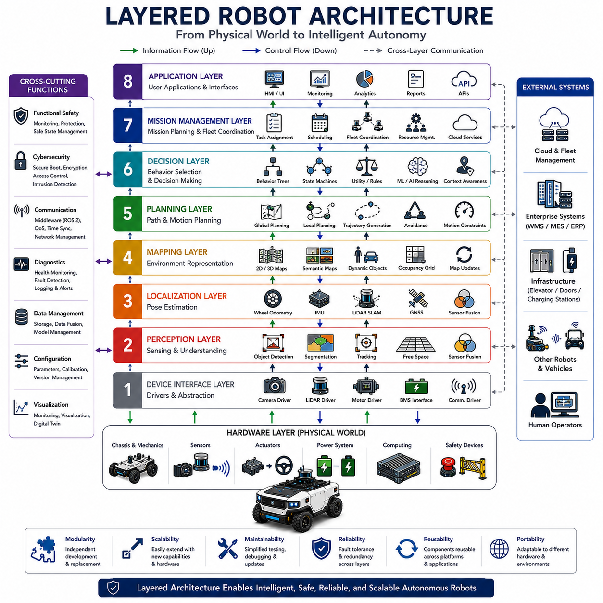
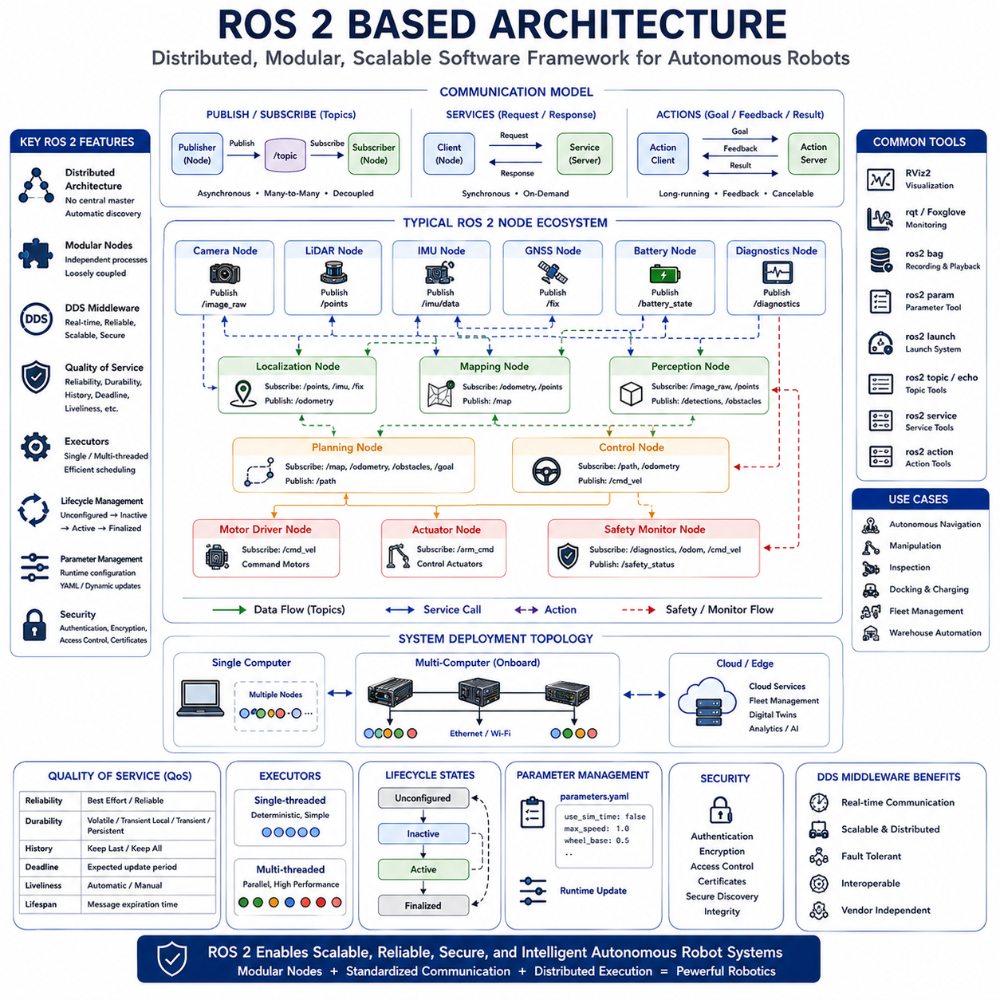
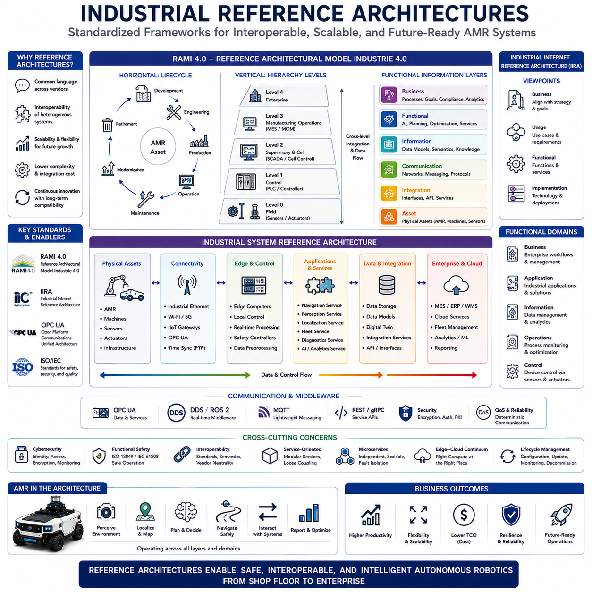
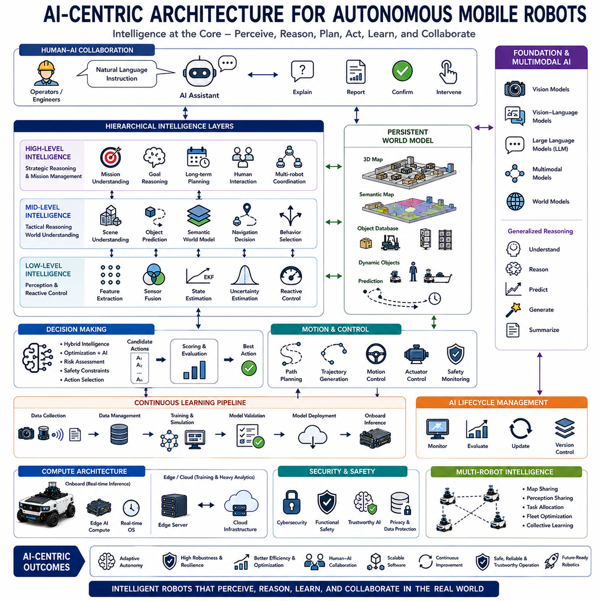
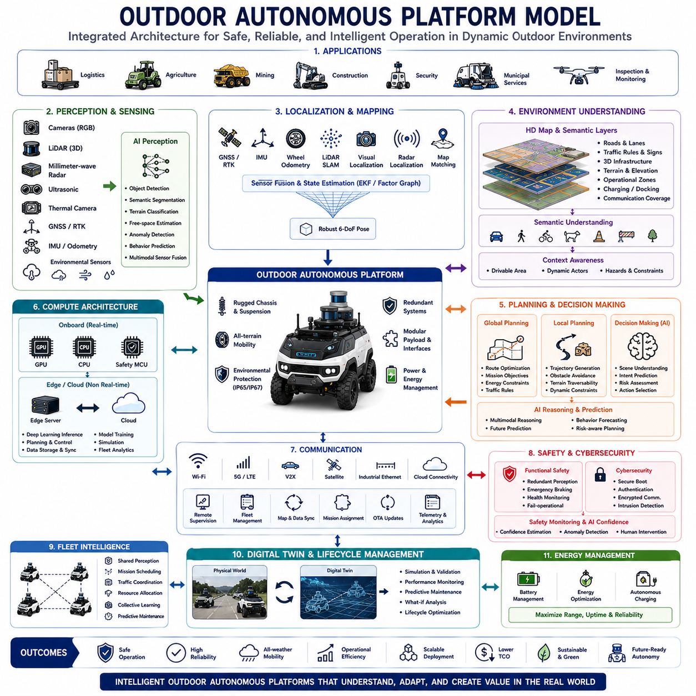

**Volume 01. AMR Foundations and System Architecture**


# 07. AMR Reference Models · AMR 레퍼런스 모델

##  

## 07.01 Layered Robot Architectures · 계층형 로봇 아키텍처

{width="7.268055555555556in" height="7.268055555555556in"}

Layered robot architecture is one of the most widely adopted system design methodologies in modern robotics because it organizes complex robotic functionality into multiple abstraction layers with clearly defined responsibilities and interfaces. Instead of building robotic software as one monolithic application, layered architecture divides perception, decision-making, planning, control, communication, and hardware interaction into independent modules that cooperate through standardized interfaces. This separation significantly improves system scalability, maintainability, reliability, portability, and development efficiency. As Autonomous Mobile Robots become increasingly intelligent and computationally sophisticated, layered architectures provide the structural foundation that enables complex autonomous behaviors while maintaining manageable software and hardware complexity across the entire robotic platform.

The fundamental philosophy of layered architecture is abstraction. Each layer focuses exclusively on its own functional responsibilities while hiding internal implementation details from higher or lower layers. Higher layers request services without requiring knowledge of hardware implementation, while lower layers execute commands without understanding high-level mission objectives. This abstraction minimizes interdependencies among software components and allows individual modules to evolve independently. Consequently, engineers can improve localization algorithms, perception models, navigation planners, communication systems, or hardware controllers without redesigning the entire robotic system. Layered abstraction therefore accelerates long-term platform evolution while reducing engineering risk during development.

At the highest level, layered robot architecture is commonly divided into hardware, device interface, perception, localization, planning, decision, mission management, and application layers. Although different robotic platforms may use slightly different terminology, the overall organizational principles remain remarkably consistent across industrial robots, service robots, autonomous vehicles, warehouse automation systems, and humanoid robots. Information generally flows upward from physical sensors toward increasingly abstract reasoning layers, while control commands propagate downward toward motors and actuators. This bidirectional information flow enables continuous interaction between physical environments and intelligent decision-making throughout autonomous operation.

The hardware layer represents the physical foundation of the entire robotic system. It includes chassis structures, drive mechanisms, steering systems, braking systems, manipulators, batteries, computing hardware, communication interfaces, power electronics, sensors, actuators, cooling systems, and safety devices. Every autonomous capability ultimately depends upon reliable hardware operation because software intelligence cannot compensate for mechanical failures or inadequate sensing capability. Hardware architecture therefore emphasizes robustness, environmental durability, modularity, maintainability, energy efficiency, and functional safety while providing standardized electrical, mechanical, and communication interfaces supporting higher software layers.

Immediately above the hardware layer lies the device interface layer, which establishes standardized communication between physical devices and higher-level software modules. Device drivers convert hardware-specific communication protocols into consistent software interfaces independent of individual manufacturers. Camera drivers acquire image streams, LiDAR drivers process point cloud measurements, motor drivers execute motion commands, battery management interfaces monitor electrical status, and communication drivers exchange information across onboard networks. Device abstraction significantly simplifies software development because upper layers interact with standardized interfaces rather than vendor-specific hardware implementations.

The perception layer transforms raw sensor measurements into meaningful environmental understanding. Multiple sensing technologies including cameras, LiDAR, radar, ultrasonic sensors, inertial measurement units, and GNSS receivers continuously generate heterogeneous data describing surrounding environments. Perception algorithms perform sensor fusion, object detection, semantic segmentation, terrain classification, obstacle recognition, free-space estimation, tracking, and environmental modeling. Artificial intelligence increasingly enhances perception through deep neural networks capable of extracting semantic information beyond traditional geometric processing. The perception layer therefore converts low-level sensor signals into structured environmental knowledge supporting higher-level autonomous reasoning.

Closely coupled with perception, the localization layer continuously estimates the robot\'s position, orientation, velocity, and motion relative to surrounding environments. Localization integrates wheel odometry, inertial navigation, satellite positioning, visual odometry, LiDAR SLAM, map matching, and probabilistic estimation techniques to maintain accurate positioning under varying operational conditions. Robust localization remains essential because every navigation decision depends upon knowing where the robot currently resides. Modern localization architectures dynamically combine multiple complementary sensing modalities, allowing autonomous operation despite temporary sensor degradation, environmental uncertainty, or changing operating conditions.

The mapping layer maintains structured representations of the environment that support autonomous navigation and reasoning. Static maps describe permanent infrastructure such as buildings, corridors, roads, and production facilities, while dynamic maps continuously update temporary obstacles, moving vehicles, people, and changing environmental conditions. Semantic maps extend purely geometric representations by assigning meaningful labels such as doors, charging stations, intersections, storage locations, inspection points, or hazardous areas. High-definition maps further incorporate detailed geometric information supporting centimeter-level navigation accuracy. The mapping layer therefore provides long-term environmental memory enabling efficient autonomous operation across large and complex workspaces.

The planning layer determines how the robot should accomplish assigned objectives while satisfying operational constraints. Global planners calculate efficient routes between distant locations using known environmental maps, whereas local planners continuously generate collision-free trajectories responding to dynamic obstacles and changing environmental conditions. Motion planning additionally considers vehicle kinematics, dynamics, steering limitations, terrain characteristics, safety margins, energy consumption, and mission priorities. Advanced planning algorithms increasingly integrate prediction models capable of anticipating future environmental changes rather than merely reacting to current observations. Planning therefore serves as the bridge connecting environmental understanding with physical robot motion.

The decision layer coordinates autonomous behavior by selecting appropriate actions according to current operational context, mission objectives, environmental conditions, and system status. Decision-making algorithms evaluate competing priorities including safety, efficiency, productivity, battery condition, mission urgency, traffic conditions, communication quality, and resource availability before determining optimal robot behavior. Rule-based systems, finite state machines, behavior trees, utility-based reasoning, reinforcement learning, and foundation model reasoning increasingly contribute to autonomous decision processes. The decision layer therefore transforms planning alternatives into concrete operational choices aligned with organizational objectives while continuously adapting to changing operational situations.

Mission management represents one of the highest abstraction layers within modern robotic architectures. Rather than controlling individual robot movements directly, mission management coordinates complete operational workflows involving multiple robots, external infrastructure, industrial equipment, cloud services, and human operators. Mission schedulers assign tasks, optimize fleet utilization, monitor operational progress, coordinate charging activities, allocate resources, resolve conflicts, and synchronize collaborative activities across entire robotic deployments. Mission management therefore shifts robotic intelligence from individual autonomous machines toward coordinated multi-robot ecosystems capable of executing large-scale industrial operations efficiently.

The communication layer operates horizontally across nearly every architectural level, enabling reliable information exchange among distributed software modules, onboard computers, cloud services, industrial infrastructure, and fleet management systems. Middleware platforms such as ROS 2 provide standardized publish-subscribe communication, service interfaces, parameter management, lifecycle coordination, and distributed execution across independent computational modules. Communication architecture ensures deterministic timing for safety-critical control while simultaneously supporting high-bandwidth perception, artificial intelligence processing, remote monitoring, software updates, and digital twin synchronization. Reliable communication therefore integrates all architectural layers into one coherent autonomous system.

Functional safety spans every architectural layer rather than existing as an isolated subsystem. Safety monitoring supervises hardware health, sensor integrity, communication reliability, software execution, environmental hazards, and operational behavior throughout the robot. Independent safety controllers continuously verify that autonomous functions remain within predefined safety boundaries while initiating protective actions whenever hazardous situations emerge. Safety-certified sensors, redundant communication channels, fault detection algorithms, emergency stopping mechanisms, controlled degradation strategies, and safe state management collectively ensure that failures within individual layers never directly compromise overall operational safety. Layered safety architecture therefore distributes protection mechanisms throughout the complete robotic system.

Artificial intelligence increasingly influences nearly every layer of modern robot architecture. Deep learning enhances perception, probabilistic estimation improves localization, reinforcement learning optimizes planning, large language models assist mission reasoning, predictive analytics supports maintenance, and foundation models integrate multimodal understanding across diverse sensing modalities. Rather than replacing conventional deterministic algorithms entirely, artificial intelligence complements traditional robotics by improving adaptability, semantic understanding, uncertainty management, and autonomous decision quality. Hybrid architectures combining deterministic engineering with machine learning provide practical pathways toward increasingly capable autonomous systems while preserving reliability and explainability.

One of the greatest advantages of layered architecture is modular scalability. New sensors, improved artificial intelligence models, upgraded communication technologies, additional computing hardware, or entirely new robotic capabilities can be integrated into existing platforms without redesigning the complete system. Standardized interfaces allow hardware replacement, software upgrades, distributed computing expansion, cloud integration, and fleet-level coordination while preserving compatibility with existing architectural components. This modularity significantly reduces development cost, accelerates product evolution, simplifies maintenance, and enables long-term technological adaptation as robotic capabilities continue advancing.

Future layered robot architectures will evolve toward highly distributed cognitive systems integrating edge computing, cloud intelligence, digital twins, collaborative perception, autonomous fleets, software-defined robotics, and foundation model reasoning into unified architectural frameworks. Traditional hierarchical boundaries between perception, planning, reasoning, and execution will become increasingly interconnected through shared knowledge representations and continuous learning mechanisms. Despite these technological advances, the fundamental principles of layered abstraction, modular responsibility, standardized interfaces, independent evolution, deterministic safety, and scalable integration will remain essential foundations supporting the next generation of intelligent Autonomous Mobile Robot platforms operating across increasingly diverse, dynamic, and collaborative real-world environments.

계층형 로봇 아키텍처(Layered Robot Architecture)는 현대 로봇공학에서 가장 널리 사용되는 시스템 설계 방법론 가운데 하나이며, 복잡한 로봇 기능을 명확한 책임과 인터페이스를 가진 여러 추상화 계층(Abstraction Layer)으로 구성한다. 하나의 거대한 소프트웨어(Monolithic Application)로 전체 로봇을 구현하는 대신, 계층형 아키텍처는 인지(Perception), 의사결정(Decision-making), 경로 계획(Planning), 제어(Control), 통신(Communication), 하드웨어 인터페이스(Hardware Interface)를 독립적인 모듈(Module)로 분리하고 표준화된 인터페이스(Standardized Interface)를 통해 상호 협력하도록 설계한다. 이러한 구조는 시스템의 확장성(Scalability), 유지보수성(Maintainability), 신뢰성(Reliability), 이식성(Portability), 개발 효율성을 크게 향상시킨다. 자율이동로봇(Autonomous Mobile Robot, AMR)이 점점 더 지능화되고 복잡해질수록 계층형 아키텍처는 전체 시스템의 복잡성을 효과적으로 관리하면서도 다양한 자율 기능을 구현할 수 있는 핵심 기반이 된다.

계층형 아키텍처의 가장 중요한 철학은 추상화(Abstraction)이다. 각 계층은 자신의 기능적 책임만 수행하며 내부 구현 세부사항은 상위 계층이나 하위 계층으로부터 숨긴다. 상위 계층은 하드웨어의 구현 방식을 알 필요 없이 필요한 서비스를 요청하고, 하위 계층은 상위 임무의 목적을 이해하지 않아도 명령을 실행한다. 이러한 추상화는 소프트웨어 구성 요소 간의 의존성을 최소화하며 각 모듈이 독립적으로 발전할 수 있도록 한다. 따라서 위치추정(Localization), 인지, 내비게이션(Navigation), 통신, 하드웨어 제어기 등을 개별적으로 개선하더라도 전체 시스템을 다시 설계할 필요가 없다. 이러한 계층형 추상화는 장기적인 플랫폼 발전을 촉진하고 개발 과정에서 발생하는 기술적 위험을 크게 줄여 준다.

가장 일반적인 계층형 로봇 아키텍처는 하드웨어(Hardware), 장치 인터페이스(Device Interface), 인지, 위치추정, 경로 계획, 의사결정, 임무 관리(Mission Management), 응용(Application) 계층으로 구성된다. 로봇 플랫폼에 따라 명칭은 조금씩 다를 수 있지만, 산업용 로봇, 서비스 로봇(Service Robot), 자율주행 차량, 물류 자동화 시스템, 휴머노이드 로봇(Humanoid Robot) 모두 유사한 구조를 사용한다. 정보는 일반적으로 물리 센서에서 시작하여 점차 높은 수준의 추론 계층으로 전달되고, 제어 명령은 상위 계층에서 하위 계층을 거쳐 모터와 액추에이터(Actuator)로 전달된다. 이러한 양방향 정보 흐름은 물리 환경과 지능형 의사결정 사이의 지속적인 상호작용을 가능하게 한다.

하드웨어 계층(Hardware Layer)은 전체 로봇 시스템의 물리적 기반을 구성한다. 여기에는 차체(Chassis), 구동 장치(Drive Mechanism), 조향 시스템(Steering System), 제동 시스템(Braking System), 매니퓰레이터(Manipulator), 배터리(Battery), 컴퓨팅 하드웨어(Computing Hardware), 통신 인터페이스(Communication Interface), 전력 전자장치(Power Electronics), 센서(Sensor), 액추에이터, 냉각 시스템(Cooling System), 안전 장치(Safety Device)가 포함된다. 모든 자율 기능은 신뢰성 있는 하드웨어를 기반으로 하므로, 소프트웨어의 지능만으로는 기계적인 고장이나 부족한 센서 성능을 보완할 수 없다. 따라서 하드웨어 계층은 높은 내구성(Robustness), 환경 적응성(Environmental Durability), 모듈화(Modularity), 유지보수성, 에너지 효율(Energy Efficiency), 기능안전(Functional Safety)을 고려하여 설계되며, 상위 소프트웨어 계층을 위한 표준화된 전기(Electrical), 기계(Mechanical), 통신 인터페이스를 제공한다.

하드웨어 바로 위에는 장치 인터페이스 계층(Device Interface Layer)이 위치하며, 물리 장치와 상위 소프트웨어 사이의 표준화된 통신을 담당한다. 장치 드라이버(Device Driver)는 제조사마다 다른 하드웨어 통신 방식을 통일된 소프트웨어 인터페이스로 변환한다. 카메라 드라이버(Camera Driver)는 영상 데이터를 수집하고, LiDAR 드라이버는 포인트 클라우드(Point Cloud)를 처리하며, 모터 드라이버(Motor Driver)는 구동 명령을 실행하고, 배터리 관리 인터페이스(Battery Management Interface)는 전기적 상태를 감시하며, 통신 드라이버는 온보드 네트워크(Onboard Network)를 통해 정보를 교환한다. 이러한 장치 추상화(Device Abstraction)는 상위 소프트웨어가 특정 제조사의 하드웨어에 종속되지 않도록 하여 개발을 크게 단순화한다.

인지 계층(Perception Layer)은 센서의 원시 데이터(Raw Sensor Data)를 의미 있는 환경 정보로 변환하는 역할을 수행한다. 카메라, LiDAR, 레이더(Radar), 초음파 센서(Ultrasonic Sensor), 관성측정장치(Inertial Measurement Unit, IMU), 전역위성항법시스템(Global Navigation Satellite System, GNSS)은 서로 다른 형태의 데이터를 지속적으로 생성한다. 인지 알고리즘은 센서 융합(Sensor Fusion), 객체 탐지(Object Detection), 의미론적 분할(Semantic Segmentation), 지형 분류(Terrain Classification), 장애물 인식(Obstacle Recognition), 자유 공간 추정(Free-space Estimation), 객체 추적(Tracking), 환경 모델링(Environmental Modeling)을 수행한다. 최근에는 딥러닝(Deep Learning)이 이러한 인지 기능을 더욱 향상시키며 단순한 기하학적 정보뿐 아니라 의미 정보(Semantic Information)까지 이해할 수 있도록 발전하고 있다.

인지 계층과 밀접하게 연결된 위치추정 계층(Localization Layer)은 로봇의 위치(Position), 자세(Orientation), 속도(Velocity), 이동 상태(Motion)를 지속적으로 계산한다. 위치추정은 휠 오도메트리(Wheel Odometry), 관성항법(Inertial Navigation), GNSS, 비주얼 오도메트리(Visual Odometry), LiDAR SLAM, 지도 정합(Map Matching), 확률 기반 추정(Probabilistic Estimation)을 통합하여 다양한 환경에서도 안정적인 위치를 계산한다. 정확한 위치추정은 모든 내비게이션과 의사결정의 기초가 되므로 매우 중요한 계층이다. 현대의 위치추정 구조는 여러 센서를 동적으로 결합하여 일부 센서가 일시적으로 성능이 저하되더라도 안정적인 자율주행을 유지할 수 있도록 설계된다.

지도 계층(Mapping Layer)은 자율주행과 고수준 추론을 위한 환경 표현(Environment Representation)을 관리한다. 정적 지도(Static Map)는 건물, 복도, 도로, 생산 설비와 같은 변하지 않는 구조를 저장하며, 동적 지도(Dynamic Map)는 이동하는 사람, 차량, 장애물과 같은 변하는 환경 정보를 지속적으로 갱신한다. 의미 지도(Semantic Map)는 단순한 기하학적 구조를 넘어 출입문(Door), 충전 스테이션(Charging Station), 교차로(Intersection), 보관 위치(Storage Location), 검사 지점(Inspection Point), 위험 구역(Hazardous Area)과 같은 의미 정보를 포함한다. 고정밀 지도(High-definition Map)는 센티미터(Centimeter) 수준의 정밀 내비게이션을 지원하는 상세한 기하 정보를 제공한다. 지도 계층은 장기간에 걸쳐 축적된 환경 정보를 유지하여 대규모 작업 공간에서도 효율적인 자율 운용을 가능하게 한다.

경로 계획 계층(Planning Layer)은 주어진 임무를 수행하기 위한 최적의 이동 방법을 결정한다. 전역 경로 계획기(Global Planner)는 알려진 지도에서 출발지와 목적지 사이의 최적 경로를 계산하며, 지역 경로 계획기(Local Planner)는 주변의 동적 장애물과 변화하는 환경을 고려하여 충돌 없는 궤적(Trajectory)을 실시간으로 생성한다. 경로 계획은 차량의 운동학(Kinematics), 동역학(Dynamics), 조향 한계, 지형 특성, 안전 거리, 에너지 소비, 임무 우선순위를 모두 고려한다. 최근의 계획 알고리즘은 현재 환경에 반응하는 것을 넘어 미래의 환경 변화를 예측(Prediction)하여 보다 효율적인 이동을 수행하도록 발전하고 있다. 경로 계획 계층은 환경 이해와 실제 로봇 이동을 연결하는 핵심 계층이다.

의사결정 계층(Decision Layer)은 현재의 운용 상황과 임무 목표에 따라 적절한 행동을 선택한다. 의사결정 알고리즘은 안전(Safety), 효율(Efficiency), 생산성(Productivity), 배터리 상태, 임무 긴급도, 교통 상황, 통신 품질, 자원 활용(Resource Availability) 등을 종합적으로 평가하여 최적의 행동을 결정한다. 규칙 기반 시스템(Rule-based System), 유한 상태 기계(Finite State Machine), 행동 트리(Behavior Tree), 효용 기반 추론(Utility-based Reasoning), 강화학습(Reinforcement Learning), 파운데이션 모델(Foundation Model) 기반 추론은 모두 의사결정에 활용될 수 있다. 이 계층은 다양한 계획 결과 가운데 가장 적절한 행동을 선택하고 변화하는 환경에 지속적으로 적응하는 역할을 수행한다.

임무 관리 계층(Mission Management Layer)은 현대 로봇 아키텍처에서 가장 높은 수준의 추상화 계층 가운데 하나이다. 이 계층은 개별 로봇의 움직임을 제어하기보다 여러 대의 로봇, 외부 설비, 산업 장비, 클라우드 서비스, 작업자를 포함하는 전체 작업 흐름(Workflow)을 관리한다. 임무 스케줄러(Mission Scheduler)는 작업을 할당하고, 플릿 활용률(Fleet Utilization)을 최적화하며, 운용 진행 상황을 모니터링하고, 충전 일정을 조정하며, 자원을 할당하고, 충돌을 해결하며, 여러 로봇의 협업을 조정한다. 따라서 임무 관리는 개별 로봇 중심의 지능을 다수의 로봇이 협력하는 대규모 자율 시스템으로 확장시키는 역할을 수행한다.

통신 계층(Communication Layer)은 거의 모든 계층을 가로지르는 수평적(Horizontal) 계층으로 존재하며, 분산된 소프트웨어 모듈, 온보드 컴퓨터, 클라우드 서비스, 산업 인프라, 플릿 관리 시스템 사이의 안정적인 정보 교환을 담당한다. ROS 2와 같은 미들웨어(Middleware)는 발행-구독(Publish-Subscribe), 서비스(Service), 파라미터 관리(Parameter Management), 라이프사이클 관리(Lifecycle Management), 분산 실행(Distributed Execution)을 지원하여 독립적인 계산 모듈들을 연결한다. 통신 계층은 안전 제어를 위한 결정론적 시간 보장을 유지하면서도 대용량 인지 데이터, 인공지능 처리, 원격 모니터링, 소프트웨어 업데이트, 디지털 트윈 동기화를 동시에 지원한다. 이를 통해 모든 계층은 하나의 통합된 자율 시스템으로 동작하게 된다.

기능안전(Functional Safety)은 특정 계층에만 존재하는 것이 아니라 모든 계층을 관통하는 공통 기능이다. 안전 모니터링(Safety Monitoring)은 하드웨어 상태, 센서 무결성(Sensor Integrity), 통신 신뢰성, 소프트웨어 실행 상태, 환경 위험 요소를 지속적으로 감시한다. 독립적인 안전 제어기(Safety Controller)는 자율 기능이 항상 허용된 안전 범위(Safety Boundary) 안에서 동작하는지 확인하며, 위험 상황이 발생하면 즉시 보호 동작(Protective Action)을 수행한다. 안전 인증 센서(Safety-certified Sensor), 중복 통신(Redundant Communication), 고장 탐지(Fault Detection), 비상정지(Emergency Stop), 성능 저하 운용(Controlled Degradation), 안전 상태 관리(Safe State Management)는 어느 한 계층에서 문제가 발생하더라도 전체 시스템의 안전이 유지되도록 한다. 이러한 계층형 안전 구조는 시스템 전체에 보호 기능을 분산 배치하는 것이 특징이다.

인공지능(Artificial Intelligence, AI)은 현대 로봇 아키텍처의 거의 모든 계층에 영향을 미치고 있다. 딥러닝은 인지 성능을 향상시키고, 확률 기반 추정은 위치추정을 개선하며, 강화학습은 경로 계획을 최적화하고, 대규모 언어 모델(Large Language Model, LLM)은 임무 추론을 지원하며, 예측 분석(Predictive Analytics)은 유지보수를 향상시키고, 파운데이션 모델은 다양한 센서 정보를 통합적으로 이해할 수 있도록 한다. 그러나 인공지능은 기존의 결정론적 알고리즘을 완전히 대체하는 것이 아니라 상호 보완적으로 사용된다. 결정론적 제어와 머신러닝(Machine Learning)을 결합한 하이브리드 아키텍처(Hybrid Architecture)는 높은 신뢰성과 설명 가능성(Explainability)을 유지하면서도 더욱 뛰어난 자율성을 제공한다.

계층형 아키텍처의 가장 큰 장점 가운데 하나는 모듈형 확장성(Modular Scalability)이다. 새로운 센서, 향상된 AI 모델, 최신 통신 기술, 추가적인 컴퓨팅 하드웨어, 새로운 자율 기능을 기존 플랫폼에 통합하더라도 전체 시스템을 다시 설계할 필요가 없다. 표준화된 인터페이스는 하드웨어 교체, 소프트웨어 업그레이드, 분산 컴퓨팅 확장, 클라우드 통합, 플릿 수준의 협업을 기존 시스템과 호환되도록 지원한다. 이러한 모듈성(Modularity)은 개발 비용을 줄이고 제품 진화를 가속화하며 유지보수를 단순화하고, 빠르게 발전하는 로봇 기술에 장기간 적응할 수 있도록 한다.

미래의 계층형 로봇 아키텍처는 엣지 컴퓨팅(Edge Computing), 클라우드 지능(Cloud Intelligence), 디지털 트윈(Digital Twin), 협력 인지(Collaborative Perception), 자율 플릿(Autonomous Fleet), 소프트웨어 정의 로보틱스(Software-defined Robotics), 파운데이션 모델 기반 추론(Foundation Model Reasoning)을 하나의 통합 구조로 연결하는 분산 인지 시스템(Distributed Cognitive System)으로 발전할 것이다. 인지, 경로 계획, 추론, 실행 사이의 전통적인 계층 경계는 점차 유연해지고 공유 지식 표현(Shared Knowledge Representation)과 지속적인 학습 메커니즘(Continuous Learning Mechanism)을 통해 더욱 긴밀하게 연결될 것이다. 그럼에도 불구하고 계층형 추상화, 모듈별 책임 분리, 표준화된 인터페이스, 독립적인 진화, 결정론적 안전성, 확장 가능한 통합이라는 기본 원칙은 앞으로도 더욱 지능적이고 협력적인 차세대 자율이동로봇 플랫폼을 구축하는 핵심 기반으로 계속 유지될 것이다.

##  

## 07.02 ROS2 Based Architecture · ROS2 기반 아키텍처

{width="7.268055555555556in" height="7.268055555555556in"}

ROS 2 has become one of the most influential software frameworks in modern robotics because it provides a standardized middleware architecture capable of connecting distributed software components into a unified autonomous robotic system. Unlike traditional monolithic robot software, ROS 2 organizes robotic functionality into independent nodes that communicate through standardized interfaces while remaining loosely coupled. This architectural approach significantly improves modularity, scalability, maintainability, portability, and system reliability. As Autonomous Mobile Robots become increasingly sophisticated, ROS 2 serves not merely as a programming framework but as the software backbone supporting perception, localization, navigation, artificial intelligence, communication, fleet management, and cloud integration throughout the entire robotic platform.

The architectural philosophy of ROS 2 emphasizes distributed computing rather than centralized software execution. Individual software components execute independently while exchanging information through middleware communication mechanisms without requiring direct knowledge of each other\'s internal implementation. Every computational function, including sensor acquisition, localization, object detection, mapping, planning, motor control, diagnostics, and user interfaces, operates as an independent process called a node. This decentralized architecture improves software flexibility because nodes can be developed, tested, updated, restarted, or replaced independently without interrupting the entire robotic system. Distributed execution also enables robotic applications to scale efficiently across multiple processors and multiple onboard computers.

Nodes represent the fundamental computational units within ROS 2 architecture. Each node performs one clearly defined functional responsibility while interacting with other nodes exclusively through standardized communication interfaces. Camera drivers publish image streams, LiDAR nodes generate point clouds, localization nodes estimate robot position, navigation nodes calculate trajectories, planning nodes generate motion commands, battery monitoring nodes supervise power systems, and actuator nodes execute low-level control actions. Since every node remains independent, software developers can combine existing nodes into new robotic applications without modifying their internal implementations. This modular design significantly accelerates software development while promoting code reuse across multiple robotic platforms.

Communication between ROS 2 nodes primarily occurs through the publish-subscribe communication model. Publishers continuously distribute information onto named topics without knowing which components consume the data, while subscribers receive information from topics relevant to their functional responsibilities. Camera nodes publish images, localization modules subscribe to sensor measurements, mapping systems receive localization updates, navigation algorithms consume environmental maps, and visualization tools observe nearly every operational topic simultaneously. The publish-subscribe model eliminates tight coupling among software modules while enabling flexible many-to-many communication across distributed robotic systems. Information producers and consumers therefore evolve independently without requiring architectural redesign.

Topics represent asynchronous communication channels optimized for continuous data streaming throughout robotic systems. High-frequency sensor measurements including camera images, LiDAR point clouds, inertial measurements, odometry estimates, battery status, diagnostic information, environmental observations, and motion commands are typically transmitted through topics. Because publishers and subscribers remain independent, multiple software modules may simultaneously consume identical sensor streams without increasing sensor workload. Topics therefore provide efficient information distribution while supporting highly scalable robotic architectures where new functionality can be introduced simply by subscribing to existing information streams rather than modifying established software components.

Services provide synchronous request-response communication for operations requiring immediate interaction between software components. Unlike continuously streaming topics, services execute only when explicitly requested. Typical service applications include requesting map information, changing operational parameters, resetting localization systems, loading configuration files, querying hardware status, calibrating sensors, initiating diagnostics, or controlling specialized robot functions. The requesting node waits until the service provider completes the requested operation before continuing execution. Services therefore support deterministic interactions appropriate for configuration, management, initialization, and maintenance procedures requiring direct software coordination.

Actions extend service communication by supporting long-running tasks requiring continuous feedback and possible cancellation during execution. Autonomous navigation provides a typical example because traveling toward a destination may require several minutes while continuously reporting progress. Action interfaces allow navigation systems, manipulation controllers, inspection procedures, docking operations, charging sequences, mapping missions, and complex robotic workflows to communicate execution status throughout task completion. Clients receive progress updates, intermediate results, completion notifications, and error reports while retaining the ability to interrupt or modify ongoing operations whenever operational priorities change. Actions therefore represent an essential communication mechanism for mission-level robotic behavior.

ROS 2 introduces significant architectural improvements over the original ROS by replacing the centralized ROS Master with a fully distributed discovery mechanism based upon the Data Distribution Service standard. Nodes automatically discover one another without requiring centralized coordination, improving robustness, scalability, and fault tolerance. Eliminating single points of failure significantly enhances reliability for industrial autonomous systems because communication continues functioning despite failures affecting individual software components. Distributed discovery additionally simplifies deployment across multiple computers, allowing large robotic systems to expand dynamically while preserving communication consistency throughout heterogeneous computing environments.

The Data Distribution Service middleware provides the communication foundation underlying ROS 2 architecture. DDS offers standardized real-time publish-subscribe communication supporting reliability, deterministic timing, configurable quality of service, automatic discovery, multicast communication, security, and distributed execution across heterogeneous hardware platforms. Different DDS implementations optimize communication for varying operational requirements including embedded systems, industrial automation, autonomous vehicles, and cloud-connected robotic fleets. By adopting DDS, ROS 2 inherits mature industrial networking technologies while preserving vendor independence and interoperability across multiple commercial middleware providers.

Quality of Service represents one of the most powerful capabilities introduced within ROS 2 architecture. Different robotic data streams require different communication behaviors depending upon operational importance, timing requirements, bandwidth limitations, and reliability objectives. Critical control commands demand reliable deterministic delivery, whereas high-frequency camera streams may prioritize minimal latency over guaranteed packet delivery. Quality of Service policies allow developers to configure reliability, durability, history depth, message lifetime, communication deadlines, and liveliness monitoring independently for every communication channel. These configurable policies enable ROS 2 to support both real-time control and computationally intensive perception within a unified communication architecture.

Executors coordinate node execution and callback scheduling throughout ROS 2 applications. Since multiple communication events may occur simultaneously, executors determine how callbacks associated with subscriptions, services, timers, and actions are scheduled for execution. Single-threaded executors provide deterministic sequential processing suitable for relatively simple robotic applications, whereas multi-threaded executors exploit modern multicore processors by executing independent callbacks concurrently. Appropriate executor selection significantly influences computational efficiency, responsiveness, resource utilization, and real-time behavior, particularly within perception systems processing multiple high-bandwidth sensor streams simultaneously.

Lifecycle nodes introduce systematic state management for complex robotic software components. Rather than immediately executing after startup, lifecycle nodes progress through well-defined operational states including unconfigured, inactive, active, finalized, and transitional phases. This structured execution model enables deterministic startup sequences, orderly shutdown procedures, controlled software updates, parameter validation, fault recovery, and coordinated system initialization across large robotic deployments. Lifecycle management significantly improves operational reliability because complex robotic systems frequently require carefully orchestrated activation rather than uncontrolled parallel initialization of independent software modules.

Parameter management provides flexible runtime configuration throughout ROS 2 architecture without requiring software recompilation. Individual nodes expose configurable parameters controlling sensor calibration, localization settings, planning behavior, navigation constraints, communication options, safety thresholds, artificial intelligence models, controller gains, and operational preferences. Parameters may be loaded from configuration files, modified dynamically during operation, or managed remotely through supervisory software. This architectural capability significantly simplifies deployment across different robotic platforms while enabling rapid adaptation to changing environments, hardware configurations, and operational requirements without altering application source code.

ROS 2 strongly supports distributed computing across multiple onboard computers and cloud-connected computational resources. Computationally intensive perception algorithms may execute on GPU-equipped artificial intelligence computers, while localization, navigation, control, diagnostics, and fleet management execute on separate processors connected through high-speed Ethernet networks. Additional computing resources may reside within edge servers or cloud infrastructure supporting digital twins, fleet optimization, machine learning deployment, predictive maintenance, and long-term operational analytics. Distributed ROS 2 architectures therefore scale naturally from small educational robots to large industrial autonomous fleets consisting of hundreds of cooperating robotic systems.

Security represents a major enhancement introduced by ROS 2 for industrial and commercial deployment. Secure communication mechanisms provide authentication, encryption, access control, certificate management, secure discovery, and integrity verification protecting robotic communication against unauthorized access and cyber threats. Security policies define which nodes may communicate, which topics remain accessible, and how cryptographic credentials are managed throughout distributed robotic deployments. Secure communication becomes increasingly essential as autonomous robots integrate with enterprise networks, cloud platforms, industrial automation systems, and critical infrastructure requiring trustworthy operation under potentially hostile cybersecurity environments.

Future ROS 2-based architectures will increasingly integrate artificial intelligence, foundation models, digital twins, collaborative perception, software-defined robotics, edge-cloud orchestration, autonomous fleets, and heterogeneous computing into highly distributed cognitive robotic ecosystems. Standardized middleware communication will continue separating functional modules while enabling increasingly sophisticated autonomous reasoning across multiple robots, cloud infrastructure, and industrial environments. As robotic systems evolve toward greater intelligence, scalability, adaptability, and collaboration, the architectural principles established by ROS 2---including modular nodes, standardized communication, distributed execution, configurable quality of service, lifecycle management, and hardware abstraction---will remain fundamental building blocks supporting the next generation of safe, reliable, and intelligent Autonomous Mobile Robot platforms.

ROS 2(ROS 2)는 현대 로봇공학에서 가장 영향력이 큰 소프트웨어 프레임워크(Software Framework) 가운데 하나이며, 분산된 소프트웨어 구성 요소를 하나의 통합된 자율 로봇 시스템으로 연결할 수 있는 표준화된 미들웨어 아키텍처(Middleware Architecture)를 제공한다. 기존의 단일 구조(Monolithic) 로봇 소프트웨어와 달리 ROS 2는 로봇의 기능을 독립적인 노드(Node)로 구성하고, 표준화된 인터페이스(Standardized Interface)를 통해 상호 통신하도록 설계되었다. 이러한 구조는 모듈성(Modularity), 확장성(Scalability), 유지보수성(Maintainability), 이식성(Portability), 시스템 신뢰성(Reliability)을 크게 향상시킨다. 자율이동로봇(Autonomous Mobile Robot, AMR)이 점점 더 복잡해질수록 ROS 2는 단순한 프로그래밍 프레임워크를 넘어 인지(Perception), 위치추정(Localization), 내비게이션(Navigation), 인공지능(Artificial Intelligence, AI), 통신(Communication), 플릿 관리(Fleet Management), 클라우드 연동(Cloud Integration)을 모두 지원하는 소프트웨어의 핵심 기반 역할을 수행한다.

ROS 2 아키텍처의 가장 중요한 철학은 중앙집중형 소프트웨어(Centralized Software)가 아니라 분산 컴퓨팅(Distributed Computing)에 있다. 각각의 소프트웨어 구성 요소는 독립적으로 실행되며, 서로의 내부 구현을 알 필요 없이 미들웨어를 통해 정보를 교환한다. 센서 데이터 수집, 위치추정, 객체 탐지(Object Detection), 지도 작성(Mapping), 경로 계획(Planning), 모터 제어(Motor Control), 진단(Diagnostics), 사용자 인터페이스(User Interface)와 같은 모든 기능은 각각 하나의 독립적인 노드(Node)로 실행된다. 이러한 분산 구조는 개별 노드를 독립적으로 개발하고 시험하며 업데이트하거나 재시작할 수 있도록 하므로 전체 시스템을 중단하지 않고도 유지보수가 가능하다. 또한 여러 프로세서와 여러 온보드 컴퓨터(Onboard Computer)에 계산을 분산시킬 수 있어 대규모 자율 시스템에 매우 적합하다.

노드(Node)는 ROS 2 아키텍처의 가장 기본적인 계산 단위(Computational Unit)이다. 각각의 노드는 하나의 명확한 기능만 수행하며 다른 노드와는 표준화된 통신 인터페이스를 통해서만 상호작용한다. 카메라 드라이버(Camera Driver)는 영상을 발행(Publish)하고, LiDAR 노드는 포인트 클라우드(Point Cloud)를 생성하며, 위치추정 노드는 로봇의 위치를 계산하고, 내비게이션 노드는 이동 경로를 생성하며, 경로 계획 노드는 주행 명령을 생성하고, 배터리 감시 노드는 전원 상태를 관리하며, 액추에이터 노드는 저수준 제어(Low-level Control)를 수행한다. 모든 노드가 독립적으로 동작하기 때문에 개발자는 기존 노드를 수정하지 않고도 새로운 응용 프로그램을 쉽게 조합할 수 있으며, 이러한 모듈 구조는 코드 재사용(Code Reuse)을 촉진하고 개발 기간을 크게 단축시킨다.

ROS 2에서 노드 간 통신은 주로 발행-구독(Publish-Subscribe) 모델을 사용한다. 발행자(Publisher)는 특정 토픽(Topic)에 데이터를 지속적으로 전송하며, 구독자(Subscriber)는 자신이 필요한 토픽의 데이터를 수신한다. 발행자는 누가 데이터를 사용하는지 알 필요가 없고, 구독자도 데이터가 어디에서 생성되는지 알 필요가 없다. 예를 들어 카메라 노드는 영상을 발행하고, 위치추정 노드는 센서 데이터를 구독하며, 지도 작성 시스템은 위치 정보를 구독하고, 내비게이션 알고리즘은 지도를 활용하며, 시각화 도구(Visualization Tool)는 여러 토픽을 동시에 모니터링할 수 있다. 이러한 발행-구독 구조는 소프트웨어 간의 강한 결합(Tight Coupling)을 제거하여 정보 생산자와 소비자가 독립적으로 발전할 수 있도록 한다.

토픽(Topic)은 ROS 2에서 지속적인 데이터 스트리밍(Continuous Data Streaming)을 위한 비동기(Asynchronous) 통신 채널이다. 카메라 영상(Camera Image), LiDAR 포인트 클라우드, 관성측정장치(Inertial Measurement Unit, IMU) 데이터, 오도메트리(Odometry), 배터리 상태(Battery Status), 진단 정보(Diagnostic Information), 환경 정보(Environmental Observation), 모션 명령(Motion Command)과 같은 고주기 데이터는 대부분 토픽을 통해 전달된다. 발행자와 구독자가 서로 독립적으로 동작하므로 여러 개의 소프트웨어 모듈이 동일한 센서 데이터를 동시에 사용할 수 있으며, 센서의 부하를 증가시키지 않는다. 새로운 기능은 기존 토픽을 구독하기만 하면 쉽게 추가할 수 있으므로 ROS 2는 매우 높은 확장성을 제공한다.

서비스(Service)는 요청(Request)-응답(Response) 방식의 동기식(Synchronous) 통신을 제공한다. 토픽과 달리 서비스는 필요할 때만 호출되며 즉각적인 결과를 반환한다. 예를 들어 지도 정보 요청(Map Request), 운용 파라미터 변경(Parameter Update), 위치추정 초기화(Localization Reset), 설정 파일(Configuration File) 로드, 하드웨어 상태 조회(Hardware Status Query), 센서 보정(Sensor Calibration), 진단 실행(Diagnostics) 등이 서비스의 대표적인 응용이다. 서비스를 요청한 노드는 작업이 완료될 때까지 기다린 후 결과를 받아 다음 작업을 수행한다. 따라서 서비스는 설정(Configuration), 초기화(Initialization), 관리(Management), 유지보수(Maintenance)와 같이 직접적인 상호작용이 필요한 작업에 적합하다.

액션(Action)은 서비스를 확장한 개념으로, 장시간 수행되는 작업(Long-running Task)에 적합한 통신 방식이다. 예를 들어 목적지까지 자율주행하는 과정은 수분 이상이 소요될 수 있으며, 진행 상황을 지속적으로 보고해야 한다. 액션 인터페이스(Action Interface)는 내비게이션, 매니퓰레이션, 검사(Inspection), 도킹(Docking), 충전(Charging), 지도 작성(Mapping), 복잡한 임무 수행 과정에서 현재 진행률(Progress), 중간 결과(Intermediate Result), 완료 상태(Completion), 오류(Error)를 지속적으로 전달한다. 또한 운용 중에도 작업을 중단하거나 취소(Cancel)하거나 새로운 목표를 부여할 수 있으므로, 액션은 임무 수준(Mission-level)의 로봇 동작을 구현하는 핵심 통신 방식이다.

ROS 2는 기존 ROS와 비교하여 가장 큰 구조적 개선점으로 ROS 마스터(ROS Master)를 제거하고 데이터 분산 서비스(Data Distribution Service, DDS)를 기반으로 하는 완전한 분산 탐색(Distributed Discovery) 구조를 채택하였다. 노드들은 중앙 서버 없이도 자동으로 서로를 탐색하고 연결할 수 있으며, 특정 노드나 컴퓨터에 장애가 발생해도 전체 시스템은 계속 동작할 수 있다. 이러한 구조는 단일 장애점(Single Point of Failure)을 제거하여 산업용 자율 시스템의 신뢰성을 크게 향상시킨다. 또한 여러 컴퓨터에 걸친 대규모 시스템을 쉽게 구성할 수 있으며, 새로운 컴퓨터가 추가되어도 자동으로 통신에 참여할 수 있다.

데이터 분산 서비스(Data Distribution Service, DDS)는 ROS 2 통신의 핵심 기반 기술이다. DDS는 실시간(Real-time) 발행-구독 통신을 위한 국제 표준으로, 높은 신뢰성, 결정론적 시간 보장(Deterministic Timing), 서비스 품질(Quality of Service, QoS), 자동 탐색(Automatic Discovery), 멀티캐스트(Multicast), 보안(Security), 분산 실행(Distributed Execution)을 지원한다. 다양한 DDS 구현체는 임베디드 시스템(Embedded System), 산업 자동화, 자율주행 차량, 클라우드 기반 플릿 시스템 등 서로 다른 응용 환경에 최적화되어 있다. ROS 2는 DDS를 채택함으로써 산업용 네트워크 기술을 그대로 활용하면서도 특정 제조사에 종속되지 않는 높은 상호운용성(Interoperability)을 제공한다.

서비스 품질(Quality of Service, QoS)은 ROS 2에서 새롭게 도입된 가장 강력한 기능 가운데 하나이다. 서로 다른 데이터는 서로 다른 통신 특성을 필요로 한다. 예를 들어 제어 명령(Control Command)은 반드시 신뢰성 있게 전달되어야 하지만, 초당 수십 장 이상의 카메라 영상은 약간의 패킷 손실(Packet Loss)이 발생하더라도 지연 시간(Latency)이 낮은 것이 더 중요할 수 있다. QoS 정책은 신뢰성(Reliability), 내구성(Durability), 히스토리 깊이(History Depth), 메시지 수명(Message Lifetime), 통신 마감 시간(Deadline), 활성 상태 감시(Liveliness Monitoring)를 각각의 통신 채널마다 독립적으로 설정할 수 있도록 한다. 이를 통해 ROS 2는 하나의 통합된 구조 안에서 실시간 제어와 대용량 인지 처리를 동시에 지원할 수 있다.

실행기(Executor)는 ROS 2에서 노드의 실행과 콜백(Callback)의 스케줄링을 담당한다. 여러 개의 통신 이벤트가 동시에 발생할 수 있기 때문에 실행기는 구독, 서비스, 타이머(Timer), 액션과 연결된 콜백이 언제 실행될지를 결정한다. 단일 스레드 실행기(Single-threaded Executor)는 순차적인 실행을 통해 결정론적 동작을 제공하며, 다중 스레드 실행기(Multi-threaded Executor)는 멀티코어 프로세서(Multicore Processor)를 활용하여 여러 콜백을 동시에 수행한다. 적절한 실행기 선택은 계산 효율, 응답성(Response), 자원 활용(Resource Utilization), 실시간 성능에 큰 영향을 미치며, 특히 여러 개의 고대역폭 센서를 동시에 처리하는 인지 시스템에서 매우 중요하다.

라이프사이클 노드(Lifecycle Node)는 복잡한 로봇 소프트웨어의 체계적인 상태 관리(State Management)를 지원한다. 일반 노드와 달리 라이프사이클 노드는 시작과 동시에 동작하지 않으며, 미구성(Unconfigured), 비활성(Inactive), 활성(Active), 종료(Finalized), 전이(Transition) 상태를 순차적으로 거친다. 이러한 구조는 시스템 초기화(System Initialization), 안전한 종료(System Shutdown), 소프트웨어 업데이트, 파라미터 검증(Parameter Validation), 고장 복구(Fault Recovery)를 체계적으로 수행할 수 있도록 한다. 특히 대규모 로봇 시스템에서는 수많은 노드가 동시에 시작되는 것이 아니라 올바른 순서대로 활성화되어야 하므로 라이프사이클 관리는 운용 신뢰성을 크게 향상시킨다.

파라미터 관리(Parameter Management)는 프로그램을 다시 컴파일하지 않고도 운용 중 다양한 설정을 변경할 수 있도록 한다. 각 노드는 센서 보정(Sensor Calibration), 위치추정 설정(Localization Setting), 경로 계획 동작, 내비게이션 제한, 통신 옵션, 안전 임계값(Safety Threshold), AI 모델, 제어기 이득(Controller Gain), 운용 환경과 관련된 파라미터를 제공한다. 이러한 값은 설정 파일(Configuration File)에서 읽어올 수도 있고, 운용 중 동적으로 변경하거나 원격으로 관리할 수도 있다. 따라서 동일한 소프트웨어를 다양한 로봇 플랫폼과 다양한 환경에 손쉽게 적용할 수 있으며, 소스 코드를 수정하지 않고도 빠르게 시스템을 최적화할 수 있다.

ROS 2는 여러 대의 온보드 컴퓨터와 클라우드 자원을 활용하는 분산 컴퓨팅을 강력하게 지원한다. 계산량이 큰 인지 알고리즘은 GPU가 장착된 AI 컴퓨터에서 실행되고, 위치추정, 내비게이션, 제어, 진단, 플릿 관리는 별도의 프로세서에서 수행될 수 있다. 또한 엣지 서버(Edge Server)나 클라우드에서는 디지털 트윈(Digital Twin), 플릿 최적화(Fleet Optimization), 머신러닝 모델 배포(Machine Learning Deployment), 예지보전(Predictive Maintenance), 장기 운영 분석(Long-term Operational Analytics)을 수행할 수 있다. 이러한 분산 ROS 2 구조는 교육용 소형 로봇부터 수백 대 규모의 산업용 자율 플릿까지 자연스럽게 확장될 수 있다.

보안(Security)은 ROS 2가 산업용과 상용 시스템을 위해 크게 강화한 중요한 기능이다. ROS 2는 인증(Authentication), 암호화(Encryption), 접근 제어(Access Control), 인증서 관리(Certificate Management), 안전한 탐색(Secure Discovery), 무결성 검증(Integrity Verification)을 제공하여 로봇 통신을 무단 접근과 사이버 공격으로부터 보호한다. 또한 보안 정책(Security Policy)은 어떤 노드가 통신할 수 있는지, 어떤 토픽에 접근 가능한지, 암호화 자격 증명(Cryptographic Credential)을 어떻게 관리할지를 정의한다. 자율로봇이 기업 네트워크, 클라우드, 산업 자동화 시스템, 사회기반시설과 연결될수록 이러한 보안 기능은 신뢰성 있는 운용을 위한 필수 요소가 된다.

미래의 ROS 2 기반 아키텍처는 인공지능, 파운데이션 모델(Foundation Model), 디지털 트윈, 협력 인지(Collaborative Perception), 소프트웨어 정의 로보틱스(Software-defined Robotics), 엣지-클라우드 오케스트레이션(Edge-Cloud Orchestration), 자율 플릿(Autonomous Fleet), 이기종 컴퓨팅(Heterogeneous Computing)을 하나의 분산 인지 생태계(Distributed Cognitive Ecosystem)로 통합하는 방향으로 발전할 것이다. 표준화된 미들웨어 통신은 앞으로도 다양한 기능 모듈을 분리하면서도 여러 대의 로봇과 클라우드, 산업 환경이 하나의 지능형 시스템처럼 협력하도록 지원할 것이다. 자율로봇이 더욱 지능화되고 확장되며 협업 능력이 향상될수록, ROS 2가 제시한 모듈형 노드(Modular Node), 표준화된 통신(Standardized Communication), 분산 실행(Distributed Execution), 설정 가능한 서비스 품질(Configurable QoS), 라이프사이클 관리(Lifecycle Management), 하드웨어 추상화(Hardware Abstraction)는 차세대 자율이동로봇 플랫폼을 구성하는 가장 중요한 소프트웨어 기반으로 계속 자리매김할 것이다.

##  

## 07.03 Industrial Reference Architectures · 산업 레퍼런스 아키텍처

{width="7.268055555555556in" height="7.268055555555556in"}

Industrial reference architectures provide standardized system design frameworks that guide the development, integration, deployment, and operation of complex industrial automation systems, including Autonomous Mobile Robots. Rather than defining a single hardware configuration or software implementation, a reference architecture establishes common structural principles, functional layers, communication models, interface definitions, and engineering methodologies that enable interoperability among diverse technologies and vendors. As industrial robotics becomes increasingly connected with cloud computing, artificial intelligence, digital twins, Industrial Internet of Things infrastructures, and enterprise information systems, reference architectures offer a common engineering language that reduces system complexity while improving scalability, maintainability, and long-term compatibility. Modern AMR platforms increasingly adopt these architectural principles to ensure seamless integration with existing industrial ecosystems.

The primary purpose of an industrial reference architecture is to separate concerns by organizing complex systems into logical layers with clearly defined responsibilities. Physical devices, communication infrastructure, control systems, manufacturing execution systems, enterprise resource planning platforms, cloud services, and business applications each operate within specialized architectural domains while interacting through standardized interfaces. This layered organization allows independent evolution of hardware, software, networking, and business systems without disrupting the entire production environment. For autonomous robotics, such architectural separation simplifies system integration while supporting continuous technological advancement throughout the operational lifecycle.

One of the most influential industrial reference architectures is the Reference Architectural Model Industry 4.0, commonly known as RAMI 4.0. Developed within Germany\'s Industry 4.0 initiative, RAMI 4.0 provides a three-dimensional architectural framework that organizes industrial systems according to lifecycle phases, hierarchical automation levels, and functional information layers. Rather than focusing on specific technologies, RAMI 4.0 establishes a universal conceptual model capable of describing manufacturing assets, digital representations, communication services, information management, business processes, and enterprise integration. Autonomous Mobile Robots naturally fit into this framework as intelligent cyber-physical assets capable of interacting with production equipment, digital services, and factory management systems.

The horizontal dimension of RAMI 4.0 describes the complete lifecycle of industrial assets from product development through engineering, production, operation, maintenance, modernization, and retirement. Every physical asset possesses corresponding digital information that evolves continuously throughout its lifecycle. For AMRs, lifecycle management includes mechanical design, electrical integration, software development, manufacturing, deployment, operational monitoring, predictive maintenance, software updates, fleet optimization, component replacement, and eventual decommissioning. This lifecycle perspective emphasizes that industrial robots are continuously evolving systems rather than static products delivered only once.

The vertical hierarchy within RAMI 4.0 extends traditional industrial automation models by incorporating modern intelligent systems. Individual sensors, actuators, field devices, controllers, workstations, production cells, manufacturing facilities, enterprise management platforms, and cloud services all occupy different hierarchical levels while remaining interconnected through standardized communication. Autonomous Mobile Robots frequently operate across multiple hierarchical levels simultaneously because they physically interact with field devices, coordinate with production systems, exchange information with manufacturing execution systems, and communicate with enterprise-level fleet management and cloud analytics platforms. This cross-layer integration distinguishes modern intelligent robots from conventional industrial machinery.

RAMI 4.0 additionally defines several functional information layers that organize digital capabilities throughout industrial systems. The Asset layer represents physical equipment including robots, sensors, machines, and infrastructure. The Integration layer connects physical assets with digital services through standardized interfaces. The Communication layer provides networking and messaging services. The Information layer manages data models and semantic representations. The Functional layer executes computational services including artificial intelligence, planning, optimization, and analytics. Finally, the Business layer coordinates organizational processes, enterprise objectives, regulatory compliance, and economic decision-making. Together these layers provide a comprehensive framework for integrating autonomous robotic systems within digital manufacturing environments.

Another highly influential industrial architecture is the Industrial Internet Reference Architecture developed by the Industrial Internet Consortium. While RAMI 4.0 primarily emphasizes manufacturing environments, the Industrial Internet Reference Architecture addresses broader industrial cyber-physical systems spanning manufacturing, transportation, healthcare, energy, logistics, infrastructure, and smart cities. The architecture organizes systems according to business, usage, functional, and implementation viewpoints, ensuring that technical solutions remain aligned with operational objectives, stakeholder requirements, and organizational processes. This multidimensional approach provides valuable guidance for deploying autonomous robots across diverse industrial sectors beyond traditional factory automation.

The functional architecture defined by the Industrial Internet Reference Architecture separates industrial systems into control, operations, information, application, and business domains. Control functions interact directly with physical equipment through sensors and actuators. Operational functions supervise industrial processes. Information services manage data storage, analytics, and knowledge representation. Applications deliver specialized industrial capabilities, while business systems coordinate organizational objectives and enterprise workflows. Autonomous Mobile Robots naturally participate within every functional domain because they integrate physical control, autonomous operation, environmental perception, artificial intelligence, fleet coordination, and enterprise logistics into one comprehensive industrial platform.

Open Platform Communications Unified Architecture has become one of the most important industrial communication standards supporting reference architectures across modern manufacturing environments. OPC UA provides secure, platform-independent, service-oriented communication among industrial devices, automation systems, enterprise software, and cloud infrastructure. Beyond simple data transmission, OPC UA defines standardized information models allowing heterogeneous systems to exchange semantically meaningful information rather than isolated communication variables. Autonomous Mobile Robots increasingly employ OPC UA for integration with manufacturing execution systems, programmable logic controllers, supervisory control systems, warehouse management platforms, quality management applications, and enterprise resource planning environments.

Industrial reference architectures increasingly emphasize service-oriented architecture principles rather than tightly coupled system integration. Individual software components expose standardized services accessible through well-defined interfaces independent of implementation details. Navigation services provide route planning capabilities, perception services deliver environmental understanding, localization services estimate robot position, fleet services coordinate multiple robots, diagnostic services supervise system health, and artificial intelligence services support predictive analytics. Service-oriented architectures significantly simplify software evolution because new capabilities can be introduced through additional services without disrupting existing industrial workflows.

Microservice architecture extends service-oriented principles by decomposing complex industrial applications into numerous small, independently deployable software services. Each microservice performs one narrowly defined responsibility while communicating with other services through lightweight communication protocols. Fleet management, mission scheduling, traffic coordination, charging optimization, predictive maintenance, digital twin synchronization, map management, user authentication, and reporting may all execute as separate microservices distributed across cloud infrastructure, edge servers, and onboard computing platforms. This architectural approach improves scalability, fault isolation, continuous deployment, and long-term maintainability throughout large robotic ecosystems.

Edge computing has become an essential architectural component within modern industrial reference architectures because autonomous robots require deterministic local decision-making while simultaneously benefiting from centralized computational resources. Time-critical functions including perception, localization, motion control, collision avoidance, and safety supervision execute onboard with minimal latency. Computationally intensive analytics, machine learning model training, fleet optimization, historical analysis, and enterprise reporting execute within edge servers or cloud infrastructure possessing substantially greater computational capacity. Reference architectures therefore carefully define computational boundaries balancing local autonomy with centralized intelligence according to latency, bandwidth, reliability, and operational safety requirements.

Digital twins represent another major architectural element incorporated into contemporary industrial reference models. Every physical robotic asset possesses a continuously synchronized digital representation containing structural information, operational status, maintenance history, software configuration, environmental context, and performance analytics. Digital twins support predictive maintenance, remote diagnostics, operational optimization, virtual commissioning, simulation-based validation, software testing, and lifecycle management throughout industrial deployments. Rather than functioning solely as visualization tools, digital twins increasingly become active decision-support systems interacting continuously with autonomous robots and enterprise information infrastructure.

Cybersecurity occupies a fundamental position within industrial reference architectures because industrial automation increasingly depends upon interconnected digital systems. Secure communication, authenticated device identity, encrypted information exchange, access control, certificate management, secure software updates, network segmentation, intrusion detection, vulnerability monitoring, and security event management collectively protect industrial operations against unauthorized access and cyber threats. Reference architectures integrate cybersecurity throughout every architectural layer rather than treating it as an isolated protective technology. Autonomous Mobile Robots therefore inherit comprehensive cybersecurity requirements extending across onboard computing, wireless communication, cloud infrastructure, enterprise integration, and operational technology networks.

Functional safety remains equally important within industrial reference architectures because intelligent autonomous systems directly interact with people, industrial machinery, and critical production processes. Safety architectures define redundant sensing, deterministic communication, fault detection, emergency intervention, controlled degradation, safe operational states, and certified control mechanisms ensuring predictable behavior under both normal and abnormal operating conditions. Modern industrial reference architectures increasingly coordinate functional safety with cybersecurity, recognizing that malicious cyber attacks may produce safety-critical consequences equivalent to hardware failures. This integrated perspective supports dependable autonomous operation across complex industrial environments.

One of the greatest strengths of industrial reference architectures is interoperability among heterogeneous technologies. Robots from different manufacturers, industrial sensors, programmable logic controllers, machine vision systems, enterprise databases, warehouse management systems, cloud services, and artificial intelligence platforms can cooperate through standardized interfaces despite independent hardware designs and software implementations. Interoperability reduces vendor lock-in, simplifies system expansion, accelerates technology adoption, and protects long-term industrial investment. Autonomous Mobile Robots therefore become flexible components within evolving digital manufacturing ecosystems rather than isolated automation equipment.

Future industrial reference architectures will increasingly evolve toward highly distributed intelligent ecosystems integrating artificial intelligence, foundation models, collaborative perception, autonomous fleets, edge-cloud orchestration, software-defined manufacturing, digital twins, Industrial Internet of Things infrastructures, and cognitive enterprise systems into unified architectural frameworks. Reference architectures will continue providing stable engineering principles while allowing rapid technological innovation through modular interfaces, standardized communication, semantic interoperability, and scalable system integration. As industrial automation progresses toward fully connected intelligent factories and autonomous supply chains, reference architectures will remain indispensable engineering foundations enabling safe, reliable, interoperable, and continuously evolving Autonomous Mobile Robot systems across global industrial environments.

산업 참조 아키텍처(Industrial Reference Architecture)는 자율이동로봇(Autonomous Mobile Robot, AMR)을 포함한 복잡한 산업 자동화 시스템의 개발, 통합, 구축, 운영을 위한 표준화된 시스템 설계 프레임워크(System Design Framework)를 제공한다. 참조 아키텍처는 특정 하드웨어 구성이나 소프트웨어 구현을 정의하는 것이 아니라, 다양한 기술과 제조사 간의 상호운용성(Interoperability)을 가능하게 하는 공통 구조 원칙(Structural Principle), 기능 계층(Functional Layer), 통신 모델(Communication Model), 인터페이스 정의(Interface Definition), 엔지니어링 방법론(Engineering Methodology)을 제시한다. 산업용 로봇이 클라우드 컴퓨팅(Cloud Computing), 인공지능(Artificial Intelligence, AI), 디지털 트윈(Digital Twin), 산업용 사물인터넷(Industrial Internet of Things, IIoT), 기업 정보 시스템(Enterprise Information System)과 긴밀하게 연결됨에 따라, 참조 아키텍처는 시스템 복잡성을 줄이면서도 확장성(Scalability), 유지보수성(Maintainability), 장기 호환성(Long-term Compatibility)을 향상시키는 공통 엔지니어링 언어(Common Engineering Language)를 제공한다. 현대의 AMR은 기존 산업 생태계와의 원활한 통합을 위해 이러한 참조 아키텍처의 원칙을 적극적으로 채택하고 있다.

산업 참조 아키텍처의 가장 중요한 목적은 복잡한 시스템을 명확한 책임을 가진 논리적 계층(Logical Layer)으로 구성하여 관심사를 분리(Separation of Concerns)하는 것이다. 물리 장치(Physical Device), 통신 인프라(Communication Infrastructure), 제어 시스템(Control System), 제조 실행 시스템(Manufacturing Execution System, MES), 전사적 자원 관리(Enterprise Resource Planning, ERP), 클라우드 서비스, 비즈니스 응용 프로그램(Business Application)은 각각 독립적인 아키텍처 영역에서 동작하지만 표준화된 인터페이스를 통해 상호 연결된다. 이러한 계층 구조는 하드웨어, 소프트웨어, 네트워크, 비즈니스 시스템이 서로 영향을 최소화하면서 독립적으로 발전할 수 있도록 한다. 자율로봇 분야에서는 이러한 구조적 분리가 시스템 통합을 단순화하고 운용 기간 전체에 걸쳐 지속적인 기술 발전을 가능하게 한다.

가장 영향력 있는 산업 참조 아키텍처 가운데 하나는 RAMI 4.0(Reference Architectural Model Industry 4.0)이다. 독일의 인더스트리 4.0(Industry 4.0) 전략에서 개발된 RAMI 4.0은 산업 시스템을 생애주기(Lifecycle), 자동화 계층(Hierarchical Automation Level), 기능 정보 계층(Functional Information Layer)의 세 가지 차원으로 구성하는 3차원 아키텍처 프레임워크(Three-dimensional Architectural Framework)를 제공한다. RAMI 4.0은 특정 기술을 정의하기보다 제조 자산(Manufacturing Asset), 디지털 표현(Digital Representation), 통신 서비스(Communication Service), 정보 관리(Information Management), 비즈니스 프로세스(Business Process), 기업 시스템 통합(Enterprise Integration)을 설명할 수 있는 범용 개념 모델(Universal Conceptual Model)을 제공한다. 자율이동로봇은 생산 설비, 디지털 서비스, 공장 관리 시스템과 상호작용하는 지능형 사이버-물리 시스템(Cyber-Physical System, CPS)의 핵심 자산으로 자연스럽게 이 구조 안에 포함된다.

RAMI 4.0의 수평 축(Horizontal Dimension)은 제품 개발(Product Development)부터 설계(Engineering), 생산(Production), 운영(Operation), 유지보수(Maintenance), 현대화(Modernization), 폐기(Retirement)에 이르는 산업 자산의 전체 생애주기를 표현한다. 모든 물리적 자산은 이에 대응하는 디지털 정보를 가지며, 이 정보는 자산의 생애주기 동안 지속적으로 변화하고 발전한다. AMR의 경우 생애주기에는 기계 설계(Mechanical Design), 전기 시스템 통합(Electrical Integration), 소프트웨어 개발, 제조, 구축(Deployment), 운영 모니터링(Operational Monitoring), 예지보전(Predictive Maintenance), 소프트웨어 업데이트, 플릿 최적화(Fleet Optimization), 부품 교체(Component Replacement), 시스템 폐기(Decommissioning)가 모두 포함된다. 이러한 생애주기 관점은 산업용 로봇이 일회성 제품이 아니라 지속적으로 진화하는 시스템임을 강조한다.

RAMI 4.0의 수직 계층(Vertical Hierarchy)은 기존 산업 자동화 모델을 확장하여 현대의 지능형 시스템을 포함한다. 센서(Sensor), 액추에이터(Actuator), 필드 장치(Field Device), 제어기(Controller), 작업 스테이션(Workstation), 생산 셀(Production Cell), 생산 공장(Manufacturing Facility), 기업 관리 플랫폼(Enterprise Management Platform), 클라우드 서비스는 각각 서로 다른 계층에 위치하지만 표준화된 통신을 통해 긴밀하게 연결된다. 자율이동로봇은 필드 장치와 직접 상호작용하고, 생산 시스템과 협력하며, 제조 실행 시스템과 정보를 교환하고, 기업 수준의 플릿 관리 시스템 및 클라우드 분석과 연결되므로 여러 계층에 동시에 걸쳐 동작하는 대표적인 지능형 시스템이다. 이러한 다계층 통합은 기존 산업 기계와 현대 AMR을 구분하는 중요한 특징이다.

RAMI 4.0은 또한 산업 시스템의 디지털 기능을 구성하는 여러 정보 계층을 정의한다. 자산 계층(Asset Layer)은 로봇, 센서, 기계, 인프라와 같은 물리적 장비를 표현한다. 통합 계층(Integration Layer)은 물리 자산과 디지털 서비스를 연결하며, 통신 계층(Communication Layer)은 네트워크와 메시징 서비스를 담당한다. 정보 계층(Information Layer)은 데이터 모델(Data Model)과 의미 정보(Semantic Information)를 관리하고, 기능 계층(Functional Layer)은 인공지능, 경로 계획, 최적화, 분석과 같은 계산 서비스를 수행한다. 마지막으로 비즈니스 계층(Business Layer)은 조직의 업무 프로세스, 기업 목표, 규제 준수(Regulatory Compliance), 경제적 의사결정을 관리한다. 이러한 계층들은 자율로봇을 디지털 제조 환경과 통합하기 위한 포괄적인 프레임워크를 제공한다.

또 다른 중요한 산업 참조 아키텍처는 산업 인터넷 컨소시엄(Industrial Internet Consortium, IIC)이 개발한 산업 인터넷 참조 아키텍처(Industrial Internet Reference Architecture, IIRA)이다. RAMI 4.0이 제조 환경에 중점을 두는 반면, IIRA는 제조뿐 아니라 운송(Transportation), 의료(Healthcare), 에너지(Energy), 물류(Logistics), 사회기반시설(Infrastructure), 스마트시티(Smart City)를 포함하는 광범위한 산업용 사이버-물리 시스템을 대상으로 한다. IIRA는 시스템을 비즈니스 관점(Business Viewpoint), 사용 관점(Usage Viewpoint), 기능 관점(Functional Viewpoint), 구현 관점(Implementation Viewpoint)으로 구분하여 기술적 해결책이 실제 운영 목표와 조직의 요구사항에 부합하도록 설계한다. 이러한 다차원 접근 방식은 다양한 산업 분야에서 자율로봇을 구축하는 데 중요한 지침을 제공한다.

IIRA의 기능 아키텍처(Functional Architecture)는 산업 시스템을 제어(Control), 운영(Operation), 정보(Information), 응용(Application), 비즈니스(Business) 영역으로 구분한다. 제어 기능은 센서와 액추에이터를 통해 물리 장비를 직접 제어하고, 운영 기능은 생산 공정을 감독한다. 정보 서비스는 데이터 저장(Data Storage), 분석(Analytics), 지식 표현(Knowledge Representation)을 수행하며, 응용 계층은 산업별 특화 기능을 제공한다. 비즈니스 시스템은 조직의 목표와 기업 업무를 관리한다. 자율이동로봇은 물리 제어, 자율 운용, 환경 인지, 인공지능, 플릿 관리, 기업 물류를 하나의 플랫폼으로 통합하기 때문에 이러한 모든 기능 영역에 동시에 참여하는 대표적인 산업 시스템이다.

개방형 플랫폼 통신 통합 아키텍처(Open Platform Communications Unified Architecture, OPC UA)는 현대 제조 환경에서 가장 중요한 산업 통신 표준 가운데 하나이다. OPC UA는 산업 장치, 자동화 시스템, 기업 소프트웨어, 클라우드 인프라 간의 안전하고 플랫폼 독립적인 서비스 지향 통신(Service-oriented Communication)을 제공한다. 단순한 데이터 전송을 넘어 표준화된 정보 모델(Standardized Information Model)을 정의함으로써 서로 다른 시스템이 단순한 변수 값이 아니라 의미를 가진 정보(Semantically Meaningful Information)를 교환할 수 있도록 한다. AMR은 제조 실행 시스템, 프로그래머블 로직 제어기(Programmable Logic Controller, PLC), 감시 제어 시스템(Supervisory Control System), 창고 관리 시스템(Warehouse Management System, WMS), 품질 관리 시스템(Quality Management System), ERP와 통합하기 위해 OPC UA를 점점 더 많이 활용하고 있다.

현대 산업 참조 아키텍처는 긴밀하게 결합된 시스템(Tightly Coupled System)보다 서비스 지향 아키텍처(Service-oriented Architecture, SOA)를 중심으로 발전하고 있다. 각각의 소프트웨어 구성 요소는 구현 방식과 무관하게 표준화된 서비스(Service)를 제공하며, 다른 시스템은 정의된 인터페이스를 통해 이를 이용한다. 내비게이션 서비스(Navigation Service)는 경로 계획을 제공하고, 인지 서비스(Perception Service)는 환경 정보를 제공하며, 위치추정 서비스(Localization Service)는 로봇의 위치를 계산하고, 플릿 서비스(Fleet Service)는 여러 대의 로봇을 관리하며, 진단 서비스(Diagnostic Service)는 시스템 상태를 감시하고, AI 서비스는 예측 분석을 수행한다. 이러한 서비스 중심 구조는 새로운 기능을 기존 시스템에 영향을 주지 않고 쉽게 추가할 수 있도록 한다.

마이크로서비스 아키텍처(Microservice Architecture)는 서비스 지향 구조를 더욱 세분화하여 복잡한 응용 프로그램을 작은 독립 서비스로 분리한다. 각각의 마이크로서비스는 하나의 명확한 기능만 수행하며, 가벼운 통신 프로토콜(Lightweight Communication Protocol)을 이용하여 서로 연결된다. 플릿 관리(Fleet Management), 임무 스케줄링(Mission Scheduling), 교통 관리(Traffic Coordination), 충전 최적화(Charging Optimization), 예지보전, 디지털 트윈 동기화(Digital Twin Synchronization), 지도 관리(Map Management), 사용자 인증(User Authentication), 보고서 생성(Reporting)은 각각 독립된 서비스로 클라우드, 엣지 서버(Edge Server), 온보드 컴퓨터에 분산 배치될 수 있다. 이러한 구조는 확장성, 장애 격리(Fault Isolation), 지속적 배포(Continuous Deployment), 장기 유지보수성을 크게 향상시킨다.

엣지 컴퓨팅(Edge Computing)은 현대 산업 참조 아키텍처의 핵심 요소가 되었다. 자율로봇은 실시간 의사결정을 위해 로컬에서 계산을 수행해야 하지만, 동시에 중앙의 강력한 컴퓨팅 자원을 활용할 필요도 있기 때문이다. 인지, 위치추정, 모션 제어(Motion Control), 충돌 방지(Collision Avoidance), 안전 감시(Safety Supervision)는 로봇 내부에서 최소 지연 시간으로 수행된다. 반면, 대규모 데이터 분석, 머신러닝 모델 학습(Machine Learning Model Training), 플릿 최적화, 장기 분석(Historical Analysis), 기업 보고서는 엣지 서버나 클라우드에서 처리된다. 참조 아키텍처는 지연 시간(Latency), 대역폭(Bandwidth), 신뢰성(Reliability), 기능안전(Functional Safety)을 고려하여 로컬 자율성과 중앙 집중형 지능의 경계를 명확하게 정의한다.

디지털 트윈(Digital Twin)은 현대 산업 참조 모델의 중요한 구성 요소이다. 모든 물리적 로봇은 구조 정보, 운영 상태, 유지보수 이력, 소프트웨어 구성, 환경 정보, 성능 분석을 포함하는 지속적으로 동기화된 디지털 복제본(Digital Representation)을 가진다. 디지털 트윈은 예지보전, 원격 진단(Remote Diagnostics), 운영 최적화(Operational Optimization), 가상 시운전(Virtual Commissioning), 시뮬레이션 기반 검증(Simulation-based Validation), 소프트웨어 시험(Software Testing), 생애주기 관리를 지원한다. 단순한 시각화 도구를 넘어, 디지털 트윈은 자율로봇과 기업 정보 시스템이 지속적으로 상호작용하는 능동적인 의사결정 지원 시스템(Decision Support System)으로 발전하고 있다.

사이버보안(Cybersecurity)은 산업 자동화가 상호 연결된 디지털 시스템에 의존하게 되면서 산업 참조 아키텍처의 핵심 요소가 되었다. 안전한 통신(Secure Communication), 장치 인증(Device Authentication), 암호화 정보 교환(Encrypted Information Exchange), 접근 제어(Access Control), 인증서 관리(Certificate Management), 안전한 소프트웨어 업데이트(Secure Software Update), 네트워크 분리(Network Segmentation), 침입 탐지(Intrusion Detection), 취약점 모니터링(Vulnerability Monitoring), 보안 이벤트 관리(Security Event Management)는 산업 시스템을 무단 접근과 사이버 공격으로부터 보호한다. 참조 아키텍처는 보안을 독립적인 기술이 아니라 모든 계층에 통합되는 핵심 설계 요소로 취급한다. 따라서 AMR은 온보드 컴퓨팅, 무선 통신, 클라우드, 기업 시스템, 운영 기술 네트워크(Operational Technology Network) 전반에 걸쳐 일관된 사이버보안 체계를 갖추어야 한다.

기능안전(Functional Safety) 역시 산업 참조 아키텍처에서 매우 중요한 요소이다. 지능형 자율 시스템은 사람, 산업 기계, 생산 공정과 직접 상호작용하기 때문이다. 안전 아키텍처는 중복 센싱(Redundant Sensing), 결정론적 통신(Deterministic Communication), 고장 탐지(Fault Detection), 비상 개입(Emergency Intervention), 성능 저하 운용(Controlled Degradation), 안전 상태(Safe State), 인증된 제어 메커니즘(Certified Control Mechanism)을 정의하여 정상 및 비정상 상황에서도 예측 가능한 동작을 보장한다. 또한 현대 산업 참조 아키텍처는 사이버 공격이 하드웨어 고장과 동일한 수준의 안전 문제를 유발할 수 있다는 점을 고려하여 기능안전과 사이버보안을 통합적으로 관리한다. 이러한 통합 접근은 복잡한 산업 환경에서도 신뢰할 수 있는 자율 운용을 가능하게 한다.

산업 참조 아키텍처의 가장 큰 장점 가운데 하나는 서로 다른 기술 간의 상호운용성이다. 서로 다른 제조사의 로봇, 산업용 센서, PLC, 머신비전 시스템(Machine Vision System), 기업 데이터베이스, 창고 관리 시스템, 클라우드 서비스, 인공지능 플랫폼은 표준화된 인터페이스를 통해 하나의 시스템처럼 협력할 수 있다. 이러한 상호운용성은 특정 공급업체에 대한 종속성(Vendor Lock-in)을 줄이고, 시스템 확장을 단순화하며, 새로운 기술 도입을 가속화하고, 장기적인 산업 투자를 보호한다. 따라서 자율이동로봇은 독립적인 자동화 장비가 아니라 지속적으로 발전하는 디지털 제조 생태계(Digital Manufacturing Ecosystem)의 유연한 구성 요소가 된다.

미래의 산업 참조 아키텍처는 인공지능, 파운데이션 모델(Foundation Model), 협력 인지(Collaborative Perception), 자율 플릿(Autonomous Fleet), 엣지-클라우드 오케스트레이션(Edge-Cloud Orchestration), 소프트웨어 정의 제조(Software-defined Manufacturing), 디지털 트윈, 산업용 사물인터넷, 인지형 기업 시스템(Cognitive Enterprise System)을 하나의 통합 프레임워크로 연결하는 고도로 분산된 지능형 생태계로 발전할 것이다. 참조 아키텍처는 앞으로도 모듈형 인터페이스(Modular Interface), 표준화된 통신, 의미적 상호운용성(Semantic Interoperability), 확장 가능한 시스템 통합을 통해 안정적인 엔지니어링 원칙을 제공하면서도 새로운 기술 혁신을 지속적으로 수용할 것이다. 산업 자동화가 완전히 연결된 지능형 공장(Intelligent Factory)과 자율 공급망(Autonomous Supply Chain)으로 발전할수록, 산업 참조 아키텍처는 안전하고 신뢰성 있으며 상호운용 가능한 차세대 자율이동로봇 시스템을 구축하기 위한 핵심 기반으로 계속 활용될 것이다.

##  

## 07.04 AI-Centric Architectures · AI 중심 아키텍처

{width="7.268055555555556in" height="7.268055555555556in"}

Artificial Intelligence has gradually evolved from being an isolated software component into the central decision-making capability of modern autonomous robotic systems. Traditional robot architectures treated artificial intelligence as an optional module responsible for perception or path planning, while deterministic software managed most operational functions. In contrast, AI-centric architectures position intelligent reasoning at the core of the system, allowing perception, planning, navigation, manipulation, communication, optimization, and human interaction to operate as coordinated cognitive processes. Instead of executing predefined algorithms independently, multiple software modules continuously exchange knowledge through AI models that understand context, predict future events, reason about uncertainty, and generate adaptive behaviors. As Autonomous Mobile Robots become increasingly capable of operating in complex and dynamic environments, AI-centric architectures provide the flexibility, scalability, and learning capability required for long-term autonomous operation.

The primary objective of an AI-centric architecture is to organize every major robotic function around intelligent decision making rather than around individual hardware devices or software modules. Sensor systems continuously observe the environment, localization systems estimate robot pose, perception models interpret surrounding objects, planning algorithms generate possible actions, and control systems execute motion commands. Rather than functioning independently, these components contribute information to shared AI reasoning processes that evaluate environmental conditions, mission objectives, operational constraints, safety requirements, and predicted future states before selecting optimal actions. This integrated intelligence transforms robots from automated machines into adaptive autonomous systems capable of continuously improving operational performance.

Unlike conventional layered architectures that primarily emphasize software modularity, AI-centric architectures introduce hierarchical intelligence operating at multiple cognitive levels. Low-level intelligence processes raw sensor signals, detects features, filters noise, estimates uncertainty, and performs immediate environmental interpretation. Mid-level intelligence integrates multiple perception results, constructs semantic world models, predicts object behavior, and coordinates navigation decisions. High-level intelligence understands mission objectives, optimizes operational efficiency, reasons about long-term goals, interacts with human operators, and coordinates multiple autonomous agents. These hierarchical reasoning layers cooperate continuously, allowing both rapid local reactions and strategic long-term planning within the same autonomous system.

Perception serves as one of the most computationally intensive components within AI-centric architectures. Multiple cameras, LiDARs, radars, ultrasonic sensors, GNSS receivers, IMUs, microphones, and additional sensing modalities simultaneously generate enormous volumes of heterogeneous information. Deep neural networks perform object detection, semantic segmentation, instance segmentation, depth estimation, free-space detection, terrain classification, anomaly detection, and environmental understanding. Rather than relying upon individual sensor outputs, AI models perform multimodal sensor fusion that combines complementary observations into coherent scene representations. This integrated perception provides significantly greater robustness under changing weather, lighting, occlusion, and environmental uncertainty than traditional rule-based sensing pipelines.

World models occupy a central position within many emerging AI-centric robotic architectures. Instead of maintaining only geometric maps, robots construct comprehensive internal representations describing static structures, movable objects, semantic categories, dynamic behaviors, operational constraints, historical observations, and predicted future states. These world models continuously evolve as new sensory information becomes available. Artificial intelligence reasons directly upon these structured representations when selecting navigation routes, planning inspection sequences, avoiding hazards, coordinating multiple robots, and anticipating future environmental changes. Such persistent environmental understanding enables significantly more intelligent decision making than isolated frame-by-frame perception.

Foundation Models are becoming foundational computational engines within next-generation AI-centric robotic architectures. Large Vision Models, Vision-Language Models, Large Language Models, Multimodal Foundation Models, and World Models provide generalized reasoning capabilities that extend beyond narrowly trained perception networks. Rather than training separate models for every individual robotic function, a single foundation model can interpret instructions, analyze images, understand spatial relationships, answer operator questions, generate navigation strategies, summarize operational events, and assist with maintenance diagnostics. This unified intelligence dramatically simplifies software architecture while expanding the range of cognitive capabilities available to autonomous robots.

Multimodal reasoning represents another defining characteristic of AI-centric architectures. Modern robots no longer process vision, language, maps, sensor measurements, and mission objectives independently. Instead, multimodal models jointly analyze visual observations, spoken commands, textual documentation, CAD models, digital twins, localization information, environmental measurements, and historical operational data. Integrated reasoning across multiple information sources enables robots to understand complex industrial environments more naturally while supporting richer interactions with human operators. Multimodal intelligence also improves robustness because complementary information sources compensate for missing or unreliable sensor observations.

Decision-making within AI-centric architectures increasingly combines traditional optimization algorithms with machine learning. Classical graph search, probabilistic planning, model predictive control, optimization theory, and deterministic safety verification remain highly effective for mathematically structured problems. Artificial intelligence complements these methods by predicting uncertain environmental behavior, estimating semantic context, evaluating operational risk, generating candidate solutions, and adapting strategies through experience. Hybrid architectures therefore combine the mathematical guarantees of traditional robotics with the adaptive learning capabilities of modern artificial intelligence, achieving significantly greater robustness than either approach independently.

Learning occupies a continuous role throughout AI-centric robotic systems rather than ending after offline model training. Robots accumulate operational experience during deployment by observing environmental changes, monitoring task performance, evaluating prediction accuracy, identifying failure cases, and recording operator interventions. These operational datasets support continual learning, incremental model improvement, active learning, reinforcement learning, and domain adaptation. Although safety-critical decision making typically relies upon validated models during deployment, collected operational knowledge continuously improves future software versions through structured machine learning pipelines integrated within the broader robotic development lifecycle.

AI-centric architectures increasingly separate inference from training while maintaining close interaction between both computational processes. Edge computers onboard autonomous robots execute optimized inference models providing real-time perception, localization, navigation, and decision making under strict latency constraints. Cloud infrastructure, edge servers, and high-performance computing clusters perform computationally intensive model training, hyperparameter optimization, large-scale simulation, synthetic data generation, validation, and model deployment. This distributed architecture balances deterministic onboard performance with virtually unlimited centralized computational resources, enabling continuous advancement of robotic intelligence without compromising operational safety.

Explainability has become an essential architectural requirement as artificial intelligence assumes greater responsibility for autonomous decision making. Industrial operators, maintenance engineers, safety inspectors, and regulatory authorities increasingly require understandable explanations describing why specific actions were selected. Explainable AI mechanisms record perception confidence, reasoning pathways, prediction uncertainty, planning alternatives, decision priorities, and supporting evidence throughout autonomous operation. Rather than functioning as opaque black boxes, AI systems become transparent cognitive assistants whose reasoning processes can be inspected, audited, validated, and continuously improved during industrial deployment.

Trustworthy artificial intelligence represents another critical design principle within AI-centric architectures. Reliable autonomous operation requires robust handling of uncertainty, anomaly detection, confidence estimation, fault isolation, out-of-distribution detection, adversarial robustness, cybersecurity protection, functional safety integration, and ethical decision constraints. AI systems must recognize situations beyond their competence, request human assistance when necessary, degrade gracefully under unexpected conditions, and maintain predictable behavior despite sensor failures or environmental uncertainty. Consequently, trustworthy AI extends far beyond prediction accuracy and becomes an integrated architectural property spanning perception, reasoning, communication, control, and lifecycle management.

Human-AI collaboration is becoming increasingly important as industrial robots operate alongside engineers, technicians, inspectors, and production personnel. Rather than replacing human expertise, AI-centric architectures provide intelligent decision support that augments human capabilities. Operators may issue natural language instructions, request operational explanations, modify mission priorities, validate inspection results, or intervene during exceptional situations. Artificial intelligence interprets human intent, translates high-level objectives into executable robotic behaviors, continuously reports operational progress, and adapts plans according to changing production requirements. This collaborative interaction improves productivity while maintaining appropriate levels of human oversight.

Digital twins closely complement AI-centric architectures by providing continuously synchronized virtual representations supporting simulation, prediction, optimization, and validation. Artificial intelligence analyzes both real-world observations and simulated future scenarios before selecting operational strategies. Candidate navigation routes, fleet schedules, maintenance plans, inspection sequences, and production workflows can be evaluated virtually before execution within physical environments. This predictive capability significantly reduces operational risk while enabling optimization based upon both current observations and anticipated future conditions.

Multi-robot intelligence represents another emerging capability enabled by AI-centric architectures. Individual robots no longer function as isolated autonomous agents but instead cooperate through distributed artificial intelligence sharing maps, perception results, localization estimates, operational experiences, mission assignments, and environmental knowledge. Collective intelligence enables collaborative exploration, distributed inspection, coordinated logistics, adaptive traffic management, and resilient mission execution even when individual robots experience failures or communication interruptions. Shared learning across fleets further accelerates continuous improvement because operational knowledge acquired by one robot becomes immediately available to all compatible platforms.

Modern AI-centric architectures increasingly employ software-defined robotics principles that separate intelligent behavior from hardware implementation. Perception models, planning strategies, language understanding, mission logic, safety policies, fleet coordination algorithms, and digital twin synchronization execute as modular software services independent of specific robotic platforms. Standardized interfaces allow identical AI services to operate across different mobile robots, manipulators, industrial vehicles, and collaborative robotic systems. This abstraction greatly improves software portability while reducing engineering effort across diverse robotic product families.

Future AI-centric robotic architectures will evolve toward fully cognitive autonomous systems built upon multimodal foundation models, persistent world models, distributed intelligence, collaborative perception, edge-cloud orchestration, lifelong learning, trustworthy AI, digital twins, and large-scale autonomous fleet coordination. Rather than viewing perception, planning, control, communication, and learning as separate software modules, future architectures will integrate these capabilities into unified intelligent reasoning systems capable of understanding complex environments, adapting continuously to changing conditions, collaborating naturally with humans, and optimizing industrial operations throughout the complete lifecycle of autonomous robotic platforms.

인공지능(Artificial Intelligence, AI)은 점차 독립적인 소프트웨어 구성 요소에서 벗어나 현대 자율로봇 시스템의 핵심 의사결정 기능으로 발전하고 있다. 기존의 로봇 아키텍처(Robot Architecture)는 인공지능을 인지(Perception)나 경로 계획(Path Planning)을 담당하는 선택적 모듈로 취급하고 대부분의 운용 기능은 결정론적 소프트웨어(Deterministic Software)가 수행하였다. 반면 AI 중심 아키텍처(AI-centric Architecture)는 지능형 추론(Intelligent Reasoning)을 시스템의 중심에 배치하여 인지, 계획(Planning), 내비게이션(Navigation), 매니퓰레이션(Manipulation), 통신(Communication), 최적화(Optimization), 인간-로봇 상호작용(Human-Robot Interaction)이 하나의 통합된 인지 과정(Cognitive Process)으로 협력하도록 설계된다. 각각의 모듈이 독립적인 알고리즘을 실행하는 것이 아니라, 여러 소프트웨어 구성 요소가 AI 모델을 통해 지속적으로 지식을 공유하면서 상황(Context)을 이해하고 미래를 예측하며 불확실성을 추론하고 적응적인 행동을 생성한다. 자율이동로봇(Autonomous Mobile Robot, AMR)이 더욱 복잡하고 동적인 환경에서 운용됨에 따라 AI 중심 아키텍처는 장기간 자율 운용을 위한 유연성(Flexibility), 확장성(Scalability), 학습 능력(Learning Capability)을 제공한다.

AI 중심 아키텍처의 가장 중요한 목적은 개별 하드웨어나 소프트웨어 모듈이 아니라 지능형 의사결정(Intelligent Decision Making)을 중심으로 모든 주요 로봇 기능을 구성하는 것이다. 센서 시스템(Sensor System)은 환경을 지속적으로 관측하고, 위치추정(Localization)은 로봇의 위치를 계산하며, 인지 모델(Perception Model)은 주변 객체를 이해하고, 계획 알고리즘은 가능한 행동을 생성하며, 제어 시스템(Control System)은 실제 움직임을 수행한다. 그러나 이러한 구성 요소는 독립적으로 동작하지 않고 공통 AI 추론 프로세스(Shared AI Reasoning Process)에 정보를 제공하여 환경 상태, 임무 목표(Mission Objective), 운용 제약(Operation Constraint), 안전 요구사항(Safety Requirement), 미래 예측 상태(Predicted Future State)를 종합적으로 평가한 후 최적의 행동을 선택한다. 이러한 통합 지능은 자동화 기계를 스스로 적응하는 자율 시스템으로 변화시킨다.

기존의 계층형 아키텍처(Layered Architecture)가 주로 소프트웨어 모듈성(Modularity)을 강조하는 것과 달리, AI 중심 아키텍처는 여러 수준에서 동작하는 계층형 지능(Hierarchical Intelligence)을 도입한다. 저수준 지능(Low-level Intelligence)은 원시 센서 데이터를 처리하고 특징을 추출하며 잡음을 제거하고 불확실성을 추정하여 즉각적인 환경 해석을 수행한다. 중간 수준 지능(Mid-level Intelligence)은 다양한 인지 결과를 통합하고 의미 기반 세계 모델(Semantic World Model)을 구축하며 객체의 행동을 예측하고 내비게이션 결정을 조정한다. 고수준 지능(High-level Intelligence)은 임무 목표를 이해하고 장기적인 운영 효율을 최적화하며 미래 목표를 계획하고 인간과 상호작용하며 여러 자율 에이전트(Autonomous Agent)를 조정한다. 이러한 계층형 추론은 빠른 지역 반응과 장기적인 전략 계획을 동시에 가능하게 한다.

인지(Perception)는 AI 중심 아키텍처에서 가장 많은 계산량을 요구하는 핵심 구성 요소 가운데 하나이다. 여러 대의 카메라(Camera), LiDAR, 레이더(Radar), 초음파 센서(Ultrasonic Sensor), 위성항법시스템(Global Navigation Satellite System, GNSS), 관성측정장치(Inertial Measurement Unit, IMU), 마이크(Microphone), 기타 다양한 센서는 동시에 방대한 양의 이질적인 데이터를 생성한다. 심층신경망(Deep Neural Network)은 객체 탐지(Object Detection), 의미 분할(Semantic Segmentation), 인스턴스 분할(Instance Segmentation), 깊이 추정(Depth Estimation), 자유 공간 탐지(Free-space Detection), 지형 분류(Terrain Classification), 이상 탐지(Anomaly Detection), 환경 이해(Environment Understanding)를 수행한다. AI 모델은 개별 센서에 의존하지 않고 다중모달 센서 융합(Multimodal Sensor Fusion)을 통해 다양한 정보를 하나의 일관된 환경 표현(Scene Representation)으로 통합한다. 이러한 통합 인지는 날씨, 조명, 가림(Occlusion), 환경 불확실성이 변화하는 상황에서도 기존 규칙 기반 시스템보다 훨씬 높은 강건성(Robustness)을 제공한다.

세계 모델(World Model)은 차세대 AI 중심 로봇 아키텍처에서 핵심적인 위치를 차지한다. 로봇은 단순한 기하학적 지도(Geometric Map)만 유지하는 것이 아니라, 고정 구조물, 이동 객체, 의미 정보(Semantic Category), 동적 행동(Dynamic Behavior), 운용 제약, 과거 관측 이력(Historical Observation), 미래 예측 상태를 모두 포함하는 내부 환경 모델을 구축한다. 이러한 세계 모델은 새로운 센서 정보가 들어올 때마다 지속적으로 갱신된다. AI는 이 구조화된 환경 표현을 기반으로 내비게이션 경로를 선택하고, 검사 순서를 계획하며, 위험 요소를 회피하고, 여러 로봇을 협력시키며, 미래 환경 변화를 예측한다. 이러한 지속적인 환경 이해는 프레임 단위(Frame-by-frame) 인지보다 훨씬 높은 수준의 지능형 의사결정을 가능하게 한다.

파운데이션 모델(Foundation Model)은 차세대 AI 중심 로봇 아키텍처의 핵심 계산 엔진으로 자리 잡고 있다. 대규모 비전 모델(Large Vision Model), 비전-언어 모델(Vision-Language Model), 대규모 언어 모델(Large Language Model, LLM), 다중모달 파운데이션 모델(Multimodal Foundation Model), 세계 모델(World Model)은 특정 작업을 넘어서는 일반화된 추론 능력을 제공한다. 각각의 로봇 기능마다 별도의 모델을 개발하는 대신 하나의 파운데이션 모델이 작업 지시를 이해하고, 영상을 분석하며, 공간 관계를 이해하고, 운용자의 질문에 답하며, 내비게이션 전략을 생성하고, 운용 상황을 요약하며, 유지보수 진단을 지원할 수 있다. 이러한 통합 지능은 소프트웨어 구조를 단순화하면서 로봇의 인지 능력을 크게 확장한다.

다중모달 추론(Multimodal Reasoning)은 AI 중심 아키텍처를 대표하는 또 하나의 핵심 특징이다. 현대의 로봇은 영상, 언어, 지도(Map), 센서 데이터, 임무 목표를 각각 독립적으로 처리하지 않는다. 대신 다중모달 모델은 영상 정보, 음성 명령, 텍스트 문서, 컴퓨터 지원 설계(Computer-Aided Design, CAD) 모델, 디지털 트윈, 위치 정보, 환경 데이터, 과거 운용 기록을 동시에 분석한다. 이러한 통합 추론은 복잡한 산업 환경을 더욱 자연스럽게 이해하게 하며 인간 운용자와의 풍부한 상호작용을 지원한다. 또한 여러 정보원이 서로를 보완하므로 일부 센서가 실패하거나 데이터가 부족한 상황에서도 높은 신뢰성을 유지할 수 있다.

AI 중심 아키텍처의 의사결정(Decision Making)은 점점 더 전통적인 최적화 알고리즘과 머신러닝(Machine Learning)을 결합하는 방향으로 발전하고 있다. 그래프 탐색(Graph Search), 확률 기반 계획(Probabilistic Planning), 모델 예측 제어(Model Predictive Control, MPC), 최적화 이론(Optimization Theory), 결정론적 안전 검증(Deterministic Safety Verification)은 수학적으로 정의 가능한 문제를 해결하는 데 매우 효과적이다. AI는 여기에 환경의 불확실성을 예측하고, 의미 정보를 해석하며, 운용 위험을 평가하고, 다양한 해결책을 생성하며, 경험을 통해 전략을 적응시키는 역할을 수행한다. 이러한 하이브리드 아키텍처(Hybrid Architecture)는 기존 로봇공학의 수학적 안정성과 현대 AI의 적응 능력을 동시에 활용하여 더욱 강건한 자율 시스템을 구현한다.

학습(Learning)은 AI 중심 로봇 시스템에서 오프라인 모델 학습 이후에도 지속적으로 이루어진다. 로봇은 실제 운용 과정에서 환경 변화, 작업 성능, 예측 정확도, 실패 사례, 운용자의 개입을 지속적으로 기록하며 새로운 경험을 축적한다. 이러한 데이터는 지속 학습(Continual Learning), 점진적 모델 개선(Incremental Model Improvement), 능동 학습(Active Learning), 강화학습(Reinforcement Learning), 도메인 적응(Domain Adaptation)에 활용된다. 실제 운용 중에는 검증된 모델이 안전을 보장하지만, 축적된 운용 데이터는 이후 머신러닝 개발 과정에서 새로운 모델을 지속적으로 개선하는 기반이 된다.

AI 중심 아키텍처는 학습(Training)과 추론(Inference)을 분리하면서도 두 과정이 긴밀하게 연결되도록 설계된다. 로봇 내부의 엣지 컴퓨터(Edge Computer)는 실시간 인지, 위치추정, 내비게이션, 의사결정을 수행하기 위해 최적화된 추론 모델을 실행한다. 반면 클라우드(Cloud), 엣지 서버, 고성능 컴퓨팅(High Performance Computing, HPC) 시스템은 모델 학습, 하이퍼파라미터 최적화(Hyperparameter Optimization), 대규모 시뮬레이션, 합성 데이터 생성(Synthetic Data Generation), 검증(Validation), 모델 배포(Deployment)를 수행한다. 이러한 분산 구조는 온보드 시스템의 실시간 성능을 유지하면서도 중앙의 강력한 계산 자원을 활용하여 지속적인 AI 성능 향상을 가능하게 한다.

설명 가능한 인공지능(Explainable Artificial Intelligence, XAI)은 AI가 자율 의사결정을 담당할수록 반드시 필요한 아키텍처 요구사항이 되고 있다. 산업 현장의 운용자, 유지보수 엔지니어, 안전 관리자, 규제 기관은 로봇이 특정 행동을 선택한 이유를 이해할 수 있어야 한다. XAI는 인지 신뢰도(Perception Confidence), 추론 과정(Reasoning Path), 예측 불확실성(Prediction Uncertainty), 계획 대안(Planning Alternative), 의사결정 우선순위(Decision Priority), 근거 정보(Supporting Evidence)를 기록한다. 이를 통해 AI는 불투명한 블랙박스(Black Box)가 아니라 설명 가능하고 검증 가능한 지능형 의사결정 지원 시스템으로 발전한다.

신뢰 가능한 인공지능(Trustworthy AI)은 AI 중심 아키텍처의 또 다른 핵심 설계 원칙이다. 안정적인 자율 운용을 위해서는 불확실성 처리(Uncertainty Handling), 이상 탐지(Anomaly Detection), 신뢰도 추정(Confidence Estimation), 고장 격리(Fault Isolation), 분포 외 탐지(Out-of-distribution Detection), 적대적 공격 강건성(Adversarial Robustness), 사이버보안(Cybersecurity), 기능안전(Functional Safety), 윤리적 의사결정(Ethical Decision Constraint)이 모두 통합되어야 한다. AI는 자신의 한계를 인식하고, 필요한 경우 인간의 도움을 요청하며, 예상하지 못한 상황에서도 안전하게 성능을 저하시켜 예측 가능한 동작을 유지해야 한다. 따라서 신뢰 가능한 AI는 단순한 예측 정확도가 아니라 시스템 전체에 걸친 통합적인 아키텍처 특성이다.

인간-AI 협업(Human-AI Collaboration)은 산업용 로봇이 엔지니어, 기술자, 검사원, 생산 작업자와 함께 작업하게 되면서 더욱 중요해지고 있다. AI 중심 아키텍처는 인간을 대체하기보다 인간의 의사결정을 지원하고 역량을 증강하는 방향으로 설계된다. 운용자는 자연어(Natural Language)로 작업을 지시하고, 로봇의 행동 이유를 질문하며, 임무 우선순위를 변경하거나 검사 결과를 확인하고, 예외 상황에서는 직접 개입할 수 있다. AI는 이러한 인간의 의도를 이해하여 실행 가능한 로봇 행동으로 변환하고, 작업 진행 상황을 지속적으로 보고하며, 변화하는 생산 환경에 맞추어 계획을 적응시킨다. 이러한 협력 구조는 인간의 통제를 유지하면서도 생산성과 운용 효율을 크게 향상시킨다.

디지털 트윈(Digital Twin)은 AI 중심 아키텍처와 긴밀하게 결합되어 시뮬레이션(Simulation), 예측(Prediction), 최적화(Optimization), 검증(Validation)을 지원한다. AI는 실제 환경뿐 아니라 미래 상황을 가상으로 시뮬레이션한 결과까지 함께 분석하여 최적의 운용 전략을 선택한다. 내비게이션 경로, 플릿 일정(Fleet Schedule), 유지보수 계획, 검사 순서, 생산 공정은 실제 실행 전에 디지털 트윈 환경에서 먼저 평가될 수 있다. 이러한 예측 기반 의사결정은 운용 위험을 줄이고 현재와 미래 상황을 동시에 고려한 최적화를 가능하게 한다.

다중 로봇 지능(Multi-robot Intelligence)은 AI 중심 아키텍처가 제공하는 중요한 미래 기능이다. 개별 로봇은 독립적으로 동작하는 것이 아니라 지도, 인지 결과, 위치 정보, 운용 경험, 임무 정보, 환경 지식을 공유하는 분산 인공지능(Distributed Artificial Intelligence)을 통해 협력한다. 이러한 집단 지능(Collective Intelligence)은 협력 탐색(Collaborative Exploration), 분산 검사(Distributed Inspection), 협력 물류(Cooperative Logistics), 적응형 교통 관리(Adaptive Traffic Management), 장애 상황에서도 지속되는 임무 수행을 가능하게 한다. 또한 한 대의 로봇이 학습한 경험은 동일한 플랫폼의 모든 로봇에 즉시 공유되어 전체 플릿의 성능 향상을 가속화한다.

현대의 AI 중심 아키텍처는 소프트웨어 정의 로보틱스(Software-defined Robotics) 개념을 적극적으로 활용하여 지능형 기능을 하드웨어와 분리한다. 인지 모델, 계획 전략, 언어 이해, 임무 로직(Mission Logic), 안전 정책(Safety Policy), 플릿 관리 알고리즘, 디지털 트윈 동기화는 모두 하드웨어와 독립된 소프트웨어 서비스(Software Service)로 실행된다. 표준화된 인터페이스를 통해 동일한 AI 서비스는 다양한 이동로봇, 매니퓰레이터(Manipulator), 산업 차량, 협동로봇(Collaborative Robot)에 그대로 적용될 수 있다. 이러한 추상화(Abstraction)는 소프트웨어 재사용성과 이식성을 크게 향상시키며 다양한 로봇 제품군에서 개발 비용을 줄여준다.

미래의 AI 중심 로봇 아키텍처는 다중모달 파운데이션 모델, 지속적인 세계 모델, 분산 지능, 협력 인지, 엣지-클라우드 오케스트레이션(Edge-Cloud Orchestration), 평생 학습(Lifelong Learning), 신뢰 가능한 AI, 디지털 트윈, 대규모 자율 플릿 협력을 기반으로 완전한 인지형 자율 시스템(Cognitive Autonomous System)으로 발전할 것이다. 미래의 아키텍처는 인지, 계획, 제어, 통신, 학습을 서로 독립된 기능으로 취급하지 않고 하나의 통합 지능형 추론 시스템(Unified Intelligent Reasoning System)으로 통합할 것이다. 이를 통해 자율로봇은 복잡한 환경을 이해하고, 변화에 지속적으로 적응하며, 인간과 자연스럽게 협력하고, 자율로봇 플랫폼의 전체 생애주기(Lifecycle)에 걸쳐 산업 운영을 지속적으로 최적화하는 핵심 지능 시스템으로 발전하게 될 것이다.

##  

## 07.05 Outdoor Autonomous Platform Models · 실외 자율 플랫폼 모델

{width="7.268055555555556in" height="7.268055555555556in"}

Outdoor autonomous platforms represent one of the most challenging applications of modern robotics because they must operate safely, reliably, and efficiently within highly dynamic environments that cannot be fully controlled or predicted. Unlike indoor Autonomous Mobile Robots that navigate structured factory floors or warehouses, outdoor autonomous platforms continuously encounter changing terrain, weather conditions, natural obstacles, moving vehicles, pedestrians, animals, vegetation, construction zones, and complex traffic situations. Consequently, outdoor robotic systems require significantly more sophisticated system architectures integrating perception, localization, navigation, environmental understanding, artificial intelligence, functional safety, and high-performance computing into a unified autonomous platform capable of adapting to continuously changing operational conditions.

An outdoor autonomous platform is not simply a mobile robot equipped with additional sensors. It represents a complete cyber-physical system integrating mechanical engineering, electrical engineering, embedded computing, artificial intelligence, communication networks, cloud infrastructure, and operational software into a coordinated autonomous ecosystem. The platform must simultaneously manage vehicle dynamics, environmental perception, mission execution, energy management, health monitoring, cybersecurity, functional safety, and interaction with external infrastructure. Successful outdoor autonomy therefore depends on balanced system integration rather than excellence within any individual subsystem.

Outdoor autonomous platforms are designed for a wide variety of industrial applications. Logistics robots transport materials across industrial campuses and distribution centers. Agricultural robots perform precision farming, crop monitoring, and autonomous harvesting. Mining vehicles operate within hazardous environments while reducing human exposure to dangerous conditions. Construction robots conduct surveying, inspection, transportation, and site monitoring. Security robots patrol large facilities, airports, ports, military bases, and critical infrastructure. Municipal service robots perform street cleaning, waste collection, snow removal, and environmental monitoring. Although these applications differ significantly, they share common architectural principles supporting reliable autonomous mobility under highly variable outdoor conditions.

The mechanical platform forms the physical foundation supporting every autonomous capability. Outdoor mobile robots generally employ four-wheel, six-wheel, tracked, articulated, skid-steering, or omnidirectional drive configurations depending upon terrain characteristics and operational objectives. Suspension systems absorb terrain irregularities while maintaining wheel contact and vehicle stability. Ground clearance, wheelbase, approach angle, departure angle, payload distribution, structural rigidity, environmental protection, and vibration isolation directly influence operational capability across uneven terrain. Mechanical architecture therefore strongly determines mobility performance before software algorithms become involved.

Vehicle dynamics become considerably more complex outdoors than within controlled indoor environments. Autonomous platforms must continuously compensate for wheel slip, loose gravel, mud, sand, snow, ice, steep slopes, water accumulation, uneven surfaces, potholes, and variable tire-ground friction. Dynamic control systems estimate vehicle stability, wheel traction, lateral acceleration, yaw motion, roll angle, and braking performance while adapting steering and speed accordingly. Modern outdoor platforms increasingly integrate model-based control with artificial intelligence to predict terrain behavior before instability develops, significantly improving both safety and mobility.

Localization represents one of the most critical architectural challenges for outdoor autonomy. Unlike indoor robots relying primarily upon simultaneous localization and mapping, outdoor systems combine multiple complementary positioning technologies. Global Navigation Satellite Systems provide global positioning, while Real-Time Kinematic corrections improve centimeter-level accuracy under favorable satellite visibility. Inertial Measurement Units maintain short-term position estimates during satellite degradation. Wheel odometry estimates incremental motion, while LiDAR-based localization, visual localization, radar localization, landmark recognition, and map matching provide additional robustness when satellite signals become unreliable. Modern outdoor platforms continuously fuse these heterogeneous localization sources into unified state estimates capable of maintaining reliable navigation across highly diverse operating conditions.

Environmental perception requires significantly greater sensing diversity than indoor robotics because outdoor environments exhibit enormous variability. Multiple cameras observe visual appearance under changing illumination. LiDAR sensors generate detailed three-dimensional geometric structure independent of lighting conditions. Millimeter-wave radar provides reliable detection during rain, fog, dust, and snow while measuring object velocity directly. Ultrasonic sensors support short-range obstacle avoidance. Thermal cameras detect humans and animals during darkness or low visibility. Environmental sensors monitor temperature, humidity, precipitation, wind, air quality, and surface conditions. Artificial intelligence continuously fuses these complementary sensing modalities into comprehensive environmental understanding that remains reliable despite changing weather and environmental uncertainty.

Semantic perception has become increasingly important within outdoor autonomous platforms because geometric obstacle detection alone cannot support intelligent decision making. Artificial intelligence identifies roads, sidewalks, vegetation, buildings, construction barriers, traffic signs, lane markings, intersections, pedestrians, cyclists, parked vehicles, moving vehicles, animals, and temporary obstacles while understanding their semantic meaning and expected behavior. Context-aware perception enables autonomous platforms to distinguish between safely traversable terrain, restricted operational zones, hazardous areas, temporary obstacles, and dynamic traffic participants. Such semantic understanding significantly improves navigation quality beyond purely geometric path planning.

Navigation within outdoor environments involves considerably greater complexity than simple obstacle avoidance. Global route planning selects efficient travel corridors using road networks, digital maps, terrain information, operational priorities, energy constraints, and mission objectives. Local planning continuously adjusts trajectories according to newly observed obstacles, dynamic traffic, terrain conditions, safety constraints, and vehicle dynamics. Motion planning simultaneously considers curvature limits, stopping distance, terrain traversability, actuator limitations, passenger comfort when applicable, and operational efficiency. Hierarchical planning architectures coordinate strategic route optimization with real-time reactive obstacle avoidance while maintaining overall mission objectives.

High-definition maps increasingly serve as foundational knowledge representations within advanced outdoor autonomous platforms. Rather than containing only road geometry, modern digital maps include lane boundaries, traffic rules, speed limits, semantic landmarks, three-dimensional infrastructure models, road surface characteristics, elevation profiles, docking stations, charging facilities, operational restrictions, communication coverage, and historical environmental observations. Artificial intelligence continuously compares live sensor observations against these digital maps to improve localization accuracy, detect environmental changes, identify temporary hazards, and update operational knowledge throughout long-term deployment.

Artificial intelligence now occupies the central decision-making role within many outdoor autonomous platform architectures. Deep neural networks perform perception, semantic segmentation, object detection, free-space estimation, terrain classification, anomaly detection, behavior prediction, and scene understanding. Foundation Models increasingly support multimodal reasoning by integrating visual observations, maps, operational instructions, historical experience, and environmental context into unified cognitive representations. Rather than solving isolated perception tasks independently, AI coordinates multiple autonomous functions through comprehensive environmental reasoning that continuously predicts future situations before selecting optimal operational strategies.

Edge computing enables real-time autonomous decision making despite the enormous computational demands of modern artificial intelligence. High-performance GPUs execute deep neural network inference onboard while dedicated embedded processors supervise deterministic vehicle control, sensor synchronization, communication management, and safety monitoring. Computational workloads are distributed according to latency requirements, ensuring that time-critical perception, localization, obstacle avoidance, and vehicle control execute locally while computationally intensive optimization, fleet coordination, model training, and digital twin simulation execute within edge servers or cloud infrastructure. This distributed architecture balances real-time responsiveness with scalable computational capability.

Communication architecture plays an increasingly important role as outdoor autonomous platforms become connected members of larger intelligent transportation ecosystems. Wireless technologies including Wi-Fi, private 5G, cellular communication, satellite communication, industrial Ethernet, Vehicle-to-Everything communication, and cloud connectivity support fleet coordination, remote supervision, software updates, map synchronization, mission assignment, predictive maintenance, and operational analytics. Communication systems must tolerate intermittent connectivity while ensuring that essential autonomous capabilities continue operating safely even during complete network loss. Consequently, outdoor platforms prioritize operational independence while leveraging connected infrastructure whenever available.

Functional safety and cybersecurity are deeply integrated throughout outdoor autonomous platform architectures because failures may directly threaten human safety and critical infrastructure. Redundant perception, independent emergency braking, health monitoring, diagnostic systems, fail-operational computing, redundant communication channels, secure authentication, encrypted communication, intrusion detection, secure software updates, and continuous system verification collectively ensure dependable autonomous operation. Artificial intelligence additionally estimates operational confidence, detects anomalous environmental conditions, identifies sensor degradation, and requests human intervention whenever autonomous confidence falls below acceptable safety thresholds.

Fleet intelligence extends autonomous capability beyond individual vehicles by enabling cooperative operation among multiple outdoor platforms. Shared perception allows robots to exchange environmental observations and obstacle information. Fleet management optimizes mission scheduling, charging operations, traffic coordination, maintenance planning, and resource allocation across large operational deployments. Collective learning enables operational experience acquired by one platform to improve decision-making across the entire fleet. Distributed intelligence therefore transforms independent autonomous vehicles into coordinated robotic ecosystems capable of solving complex industrial missions collaboratively.

Digital twins provide continuously synchronized virtual representations supporting lifecycle management, simulation, predictive maintenance, and operational optimization throughout outdoor autonomous deployments. Engineers evaluate software updates, navigation strategies, energy consumption, mission planning, hardware modifications, and environmental scenarios within simulation before physical implementation. Operational telemetry continuously updates digital twin models, allowing artificial intelligence to predict component failures, estimate remaining useful life, optimize maintenance scheduling, and evaluate future operational strategies. This integration significantly reduces operational risk while supporting continuous platform improvement throughout extended deployment periods.

Future outdoor autonomous platform models will increasingly evolve toward software-defined, AI-centric, foundation-model-driven robotic ecosystems integrating multimodal perception, persistent world models, collaborative intelligence, digital twins, edge-cloud orchestration, lifelong learning, and autonomous fleet coordination into unified cognitive architectures. Rather than functioning as isolated mobile machines, outdoor autonomous platforms will become intelligent infrastructure participants capable of understanding complex environments, cooperating naturally with humans and other autonomous systems, adapting continuously to changing operational conditions, and optimizing industrial, commercial, agricultural, and public service operations throughout the complete lifecycle of autonomous mobility.

실외 자율 플랫폼(Outdoor Autonomous Platform)은 완전히 통제하거나 예측할 수 없는 매우 동적인 환경에서 안전하고 신뢰성 있으며 효율적으로 운용되어야 하기 때문에 현대 로봇공학에서 가장 어려운 응용 분야 가운데 하나이다. 구조화된 공장이나 창고에서 이동하는 실내 자율이동로봇(Autonomous Mobile Robot, AMR)과 달리, 실외 자율 플랫폼은 변화하는 지형(Terrain), 기상 조건(Weather Condition), 자연 장애물(Natural Obstacle), 이동 차량, 보행자(Pedestrian), 동물, 식생(Vegetation), 공사 구역(Construction Zone), 복잡한 교통 상황(Traffic Situation)을 지속적으로 마주한다. 따라서 실외 자율 시스템은 인지(Perception), 위치추정(Localization), 내비게이션(Navigation), 환경 이해(Environmental Understanding), 인공지능(Artificial Intelligence, AI), 기능안전(Functional Safety), 고성능 컴퓨팅(High-performance Computing)을 하나의 통합 플랫폼으로 결합하여 변화하는 운용 환경에 지속적으로 적응할 수 있어야 한다.

실외 자율 플랫폼은 단순히 센서를 추가한 이동로봇이 아니다. 이는 기계공학(Mechanical Engineering), 전기공학(Electrical Engineering), 임베디드 컴퓨팅(Embedded Computing), 인공지능, 통신 네트워크(Communication Network), 클라우드 인프라(Cloud Infrastructure), 운용 소프트웨어(Operational Software)를 하나의 자율 생태계(Autonomous Ecosystem)로 통합한 완전한 사이버-물리 시스템(Cyber-Physical System, CPS)이다. 플랫폼은 차량 동역학(Vehicle Dynamics), 환경 인지, 임무 수행(Mission Execution), 에너지 관리(Energy Management), 상태 모니터링(Health Monitoring), 사이버보안(Cybersecurity), 기능안전, 외부 인프라와의 상호작용을 동시에 관리해야 한다. 따라서 성공적인 실외 자율주행은 특정 구성 요소의 성능보다 전체 시스템의 균형 잡힌 통합(System Integration)에 달려 있다.

실외 자율 플랫폼은 다양한 산업 분야에서 활용된다. 물류 로봇(Logistics Robot)은 산업 단지와 물류센터에서 자재를 운반하고, 농업 로봇(Agricultural Robot)은 정밀 농업(Precision Farming), 작물 모니터링(Crop Monitoring), 자율 수확(Autonomous Harvesting)을 수행한다. 광산 차량(Mining Vehicle)은 위험한 작업 환경에서 사람의 노출을 줄이며 운용되고, 건설 로봇(Construction Robot)은 측량(Surveying), 검사(Inspection), 운반, 현장 모니터링을 담당한다. 보안 로봇(Security Robot)은 공항, 항만, 군사기지, 중요 시설을 순찰하고, 공공 서비스 로봇(Municipal Service Robot)은 도로 청소, 폐기물 수거, 제설(Snow Removal), 환경 모니터링을 수행한다. 응용 분야는 다양하지만, 이들 모두는 변화가 심한 실외 환경에서 안정적인 자율 이동을 지원하는 공통 아키텍처 원칙을 공유한다.

기계 플랫폼(Mechanical Platform)은 모든 자율 기능을 지탱하는 물리적 기반이다. 실외 이동로봇은 운용 목적과 지형 특성에 따라 4륜(Four-wheel), 6륜(Six-wheel), 무한궤도(Tracked), 굴절식(Articulated), 스키드 조향(Skid Steering), 전방향 구동(Omnidirectional Drive)과 같은 다양한 구동 방식을 사용한다. 서스펜션 시스템(Suspension System)은 지면의 요철을 흡수하여 바퀴의 접지력과 차량 안정성을 유지한다. 최저 지상고(Ground Clearance), 휠베이스(Wheelbase), 접근각(Approach Angle), 이탈각(Departure Angle), 적재 하중 분포(Payload Distribution), 구조 강성(Structural Rigidity), 환경 보호(Environmental Protection), 진동 절연(Vibration Isolation)은 모두 험지 주행 성능에 직접적인 영향을 미친다. 따라서 기계 아키텍처는 소프트웨어가 개입하기 이전부터 플랫폼의 이동 성능을 결정하는 중요한 요소이다.

실외 환경에서는 차량 동역학(Vehicle Dynamics)이 실내보다 훨씬 복잡하다. 자율 플랫폼은 바퀴 미끄러짐(Wheel Slip), 자갈길, 진흙, 모래, 눈, 얼음, 급경사(Steep Slope), 물웅덩이, 불규칙한 노면, 포트홀(Pothole), 변화하는 노면 마찰력(Tire-Ground Friction)에 지속적으로 대응해야 한다. 동적 제어 시스템(Dynamic Control System)은 차량 안정성, 접지력(Traction), 횡가속도(Lateral Acceleration), 요 운동(Yaw Motion), 롤 각도(Roll Angle), 제동 성능(Braking Performance)을 실시간으로 추정하고 이에 따라 조향과 속도를 조정한다. 최신 실외 플랫폼은 모델 기반 제어(Model-based Control)와 인공지능을 결합하여 차량이 불안정해지기 전에 지형의 특성을 예측함으로써 안전성과 주행 성능을 동시에 향상시키고 있다.

위치추정(Localization)은 실외 자율주행에서 가장 중요한 기술적 과제 가운데 하나이다. 실내 로봇이 주로 동시적 위치추정 및 지도작성(Simultaneous Localization and Mapping, SLAM)에 의존하는 것과 달리, 실외 플랫폼은 여러 위치추정 기술을 동시에 활용한다. 위성항법시스템(Global Navigation Satellite System, GNSS)은 전역 위치를 제공하며, 실시간 이동측위(Real-Time Kinematic, RTK)는 양호한 위성 환경에서 센티미터 수준의 정확도를 제공한다. 관성측정장치(Inertial Measurement Unit, IMU)는 위성 신호가 약해질 때 단기 위치를 유지하고, 휠 오도메트리(Wheel Odometry)는 이동 거리를 계산한다. 또한 LiDAR 기반 위치추정, 비전 기반 위치추정(Visual Localization), 레이더 기반 위치추정(Radar Localization), 랜드마크 인식(Landmark Recognition), 지도 정합(Map Matching)이 함께 사용되어 위성 신호가 불안정한 환경에서도 안정적인 위치추정을 유지한다. 현대의 실외 플랫폼은 이러한 다양한 위치 정보를 지속적으로 융합하여 신뢰성 높은 상태 추정(State Estimation)을 수행한다.

환경 인지(Environmental Perception)는 실외 환경의 높은 다양성 때문에 실내보다 훨씬 많은 종류의 센서를 필요로 한다. 여러 대의 카메라는 다양한 조명 조건에서 시각 정보를 제공하고, LiDAR는 조명과 관계없이 정밀한 3차원 구조를 생성한다. 밀리미터파 레이더(Millimeter-wave Radar)는 비, 안개, 먼지, 눈과 같은 악천후에서도 안정적으로 객체를 탐지하며 속도를 직접 측정할 수 있다. 초음파 센서(Ultrasonic Sensor)는 근거리 장애물 회피를 지원하고, 열화상 카메라(Thermal Camera)는 야간이나 저시야 환경에서 사람과 동물을 탐지한다. 환경 센서(Environmental Sensor)는 온도, 습도, 강수량, 풍속, 대기질, 노면 상태를 측정한다. 인공지능은 이러한 다양한 센서를 융합하여 변화하는 기상 조건에서도 안정적인 환경 이해를 제공한다.

의미 기반 인지(Semantic Perception)는 단순한 기하학적 장애물 탐지만으로는 충분하지 않은 실외 환경에서 점점 더 중요한 역할을 한다. 인공지능은 도로(Road), 보도(Sidewalk), 식생(Vegetation), 건물(Building), 공사 장벽(Construction Barrier), 교통 표지(Traffic Sign), 차선(Lane Marking), 교차로(Intersection), 보행자, 자전거(Cyclist), 주차 차량(Parked Vehicle), 이동 차량(Moving Vehicle), 동물, 임시 장애물을 인식할 뿐 아니라 각각의 의미와 예상 행동을 이해한다. 이러한 상황 인지(Context-aware Perception)는 주행 가능한 영역(Traversable Terrain), 제한 구역(Restricted Zone), 위험 지역(Hazardous Area), 임시 장애물, 교통 참여자를 구분할 수 있도록 하며, 단순한 기하학 기반 경로 계획보다 훨씬 지능적인 내비게이션을 가능하게 한다.

실외 내비게이션(Navigation)은 단순한 장애물 회피를 넘어 훨씬 복잡한 의사결정을 포함한다. 전역 경로 계획(Global Route Planning)은 도로망(Road Network), 디지털 지도(Digital Map), 지형 정보(Terrain Information), 임무 우선순위(Mission Priority), 에너지 제약(Energy Constraint), 작업 목표를 고려하여 최적의 이동 경로를 선택한다. 지역 경로 계획(Local Planning)은 새롭게 발견된 장애물, 교통 상황, 지형 변화, 안전 제약, 차량 동역학에 맞추어 경로를 실시간으로 수정한다. 모션 계획(Motion Planning)은 회전 반경(Curvature Limit), 제동 거리(Stopping Distance), 지형 통과 가능성(Terrain Traversability), 액추에이터 한계, 승차감(Passenger Comfort), 운용 효율을 동시에 고려한다. 이러한 계층형 계획(Hierarchical Planning)은 전략적인 경로 최적화와 실시간 장애물 회피를 함께 수행하면서 전체 임무 목표를 유지한다.

고정밀 지도(High-definition Map, HD Map)는 첨단 실외 자율 플랫폼의 핵심 지식 표현(Knowledge Representation)으로 자리 잡고 있다. 현대의 디지털 지도는 단순한 도로 형상뿐 아니라 차선 경계(Lane Boundary), 교통 규칙(Traffic Rule), 제한 속도(Speed Limit), 의미 기반 랜드마크(Semantic Landmark), 3차원 인프라 모델, 노면 특성(Road Surface Characteristic), 고도 정보(Elevation Profile), 도킹 스테이션(Docking Station), 충전 시설(Charging Facility), 운용 제한(Operation Restriction), 통신 범위(Communication Coverage), 과거 환경 정보(Historical Environmental Observation)를 포함한다. 인공지능은 실시간 센서 정보와 이러한 지도를 비교하여 위치추정 정확도를 높이고, 환경 변화를 감지하며, 임시 위험 요소를 식별하고, 장기간 운용 지식을 지속적으로 갱신한다.

인공지능은 현재 많은 실외 자율 플랫폼에서 핵심 의사결정 기능을 담당하고 있다. 심층신경망은 객체 탐지, 의미 분할(Semantic Segmentation), 자유 공간 추정(Free-space Estimation), 지형 분류(Terrain Classification), 이상 탐지(Anomaly Detection), 행동 예측(Behavior Prediction), 장면 이해(Scene Understanding)를 수행한다. 또한 파운데이션 모델(Foundation Model)은 영상, 지도, 작업 지시, 과거 경험, 환경 정보를 통합하는 다중모달 추론(Multimodal Reasoning)을 지원한다. AI는 개별 인지 작업을 독립적으로 수행하는 것이 아니라, 다양한 자율 기능을 통합적으로 조정하며 미래 상황을 예측한 후 최적의 운용 전략을 선택한다.

엣지 컴퓨팅(Edge Computing)은 현대 AI가 요구하는 막대한 계산량에도 불구하고 실시간 자율 의사결정을 가능하게 한다. 고성능 그래픽 처리 장치(Graphics Processing Unit, GPU)는 온보드(Onboard)에서 심층신경망 추론을 수행하고, 전용 임베디드 프로세서(Embedded Processor)는 차량 제어, 센서 동기화(Sensor Synchronization), 통신 관리, 안전 감시를 담당한다. 계산 작업은 지연 시간 요구사항에 따라 분산되며, 인지, 위치추정, 장애물 회피, 차량 제어는 로컬에서 수행되고, 플릿 관리(Fleet Management), 모델 학습, 디지털 트윈 시뮬레이션은 엣지 서버와 클라우드에서 수행된다. 이러한 분산 구조는 실시간 응답성과 대규모 계산 능력을 동시에 제공한다.

통신 아키텍처(Communication Architecture)는 실외 자율 플랫폼이 지능형 교통 생태계(Intelligent Transportation Ecosystem)의 구성 요소가 되면서 더욱 중요한 역할을 수행한다. 무선랜(Wi-Fi), 전용 5세대 이동통신(Private 5G), 셀룰러 통신(Cellular Communication), 위성 통신(Satellite Communication), 산업용 이더넷(Industrial Ethernet), 차량-사물 통신(Vehicle-to-Everything, V2X), 클라우드 연결은 플릿 관리, 원격 감독(Remote Supervision), 소프트웨어 업데이트, 지도 동기화(Map Synchronization), 임무 할당(Mission Assignment), 예지보전, 운용 분석을 지원한다. 통신은 일시적으로 끊어질 수 있으므로 플랫폼은 네트워크가 완전히 끊어진 상황에서도 필수 자율 기능을 안전하게 유지할 수 있어야 하며, 연결이 가능할 때는 외부 인프라를 적극적으로 활용한다.

기능안전과 사이버보안은 사람과 사회기반시설의 안전을 보호하기 위해 실외 자율 플랫폼 전체에 통합되어 있다. 중복 인지(Redundant Perception), 독립 비상 제동(Independent Emergency Braking), 상태 모니터링, 진단 시스템(Diagnostic System), 장애 지속 운용 컴퓨팅(Fail-operational Computing), 중복 통신(Redundant Communication), 안전한 인증(Authentication), 암호화 통신(Encrypted Communication), 침입 탐지(Intrusion Detection), 안전한 소프트웨어 업데이트(Secure Software Update), 지속적인 시스템 검증(System Verification)이 신뢰성 있는 자율 운용을 보장한다. 또한 AI는 운용 신뢰도(Operational Confidence)를 지속적으로 평가하고, 이상 환경을 감지하며, 센서 성능 저하를 식별하고, 신뢰도가 허용 수준 이하로 떨어질 경우 사람의 개입을 요청한다.

플릿 지능(Fleet Intelligence)은 여러 대의 실외 자율 플랫폼이 협력하여 동작할 수 있도록 지원한다. 공유 인지(Shared Perception)는 로봇 간에 환경 정보와 장애물 정보를 공유하며, 플릿 관리는 임무 일정(Mission Scheduling), 충전 계획(Charging Operation), 교통 관리(Traffic Coordination), 유지보수 계획(Maintenance Planning), 자원 배분(Resource Allocation)을 최적화한다. 집단 학습(Collective Learning)은 한 대의 플랫폼이 얻은 경험을 전체 플릿이 공유하도록 하여 지속적인 성능 향상을 가능하게 한다. 이러한 분산 지능(Distributed Intelligence)은 개별 자율 차량을 협력형 로봇 생태계(Cooperative Robotic Ecosystem)로 발전시킨다.

디지털 트윈은 실외 자율 플랫폼의 생애주기 관리(Lifecycle Management), 시뮬레이션, 예지보전, 운용 최적화를 지원하는 지속적으로 동기화된 가상 표현(Virtual Representation)이다. 엔지니어는 실제 시스템에 적용하기 전에 소프트웨어 업데이트, 내비게이션 전략, 에너지 소비(Energy Consumption), 임무 계획, 하드웨어 변경, 다양한 환경 시나리오를 시뮬레이션에서 검증할 수 있다. 실제 운용 데이터(Telemetry)는 디지털 트윈을 지속적으로 갱신하며, AI는 이를 기반으로 부품 고장을 예측하고, 잔여 수명(Remaining Useful Life)을 추정하며, 유지보수 일정을 최적화하고, 향후 운용 전략을 평가한다. 이러한 구조는 운용 위험을 줄이고 플랫폼의 지속적인 성능 향상을 지원한다.

미래의 실외 자율 플랫폼 모델은 소프트웨어 정의(Software-defined), AI 중심(AI-centric), 파운데이션 모델 기반(Foundation Model-driven)의 로봇 생태계로 발전할 것이다. 다중모달 인지(Multimodal Perception), 지속적인 세계 모델(Persistent World Model), 협력 지능(Collaborative Intelligence), 디지털 트윈, 엣지-클라우드 오케스트레이션(Edge-Cloud Orchestration), 평생 학습(Lifelong Learning), 자율 플릿 협력이 하나의 통합된 인지 아키텍처(Cognitive Architecture)로 결합될 것이다. 미래의 실외 자율 플랫폼은 더 이상 독립적인 이동 기계가 아니라 복잡한 환경을 이해하고, 사람과 다른 자율 시스템과 자연스럽게 협력하며, 변화하는 운용 환경에 지속적으로 적응하고, 산업, 물류, 농업, 공공 서비스 전반의 운영을 플랫폼의 전체 생애주기에 걸쳐 지속적으로 최적화하는 지능형 사회 인프라(Intelligent Infrastructure)의 핵심 구성 요소로 발전하게 될 것이다.
