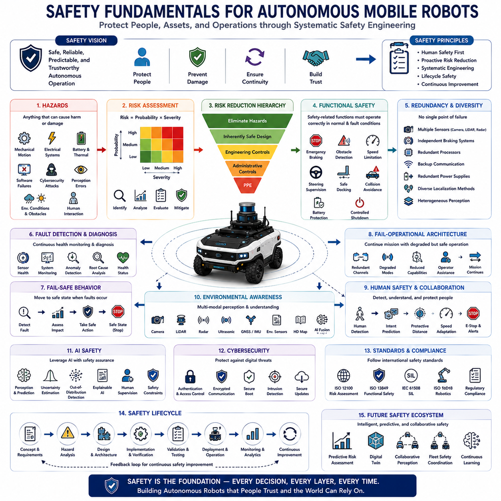
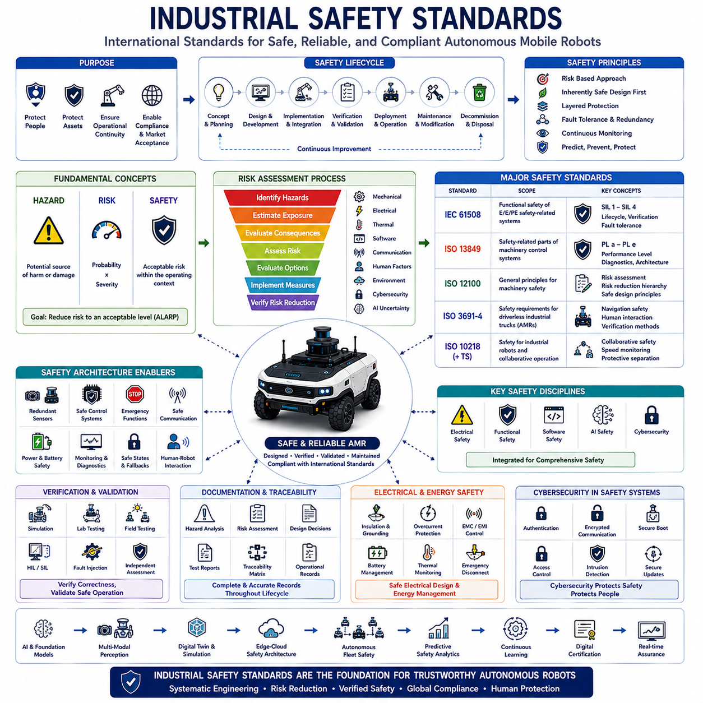
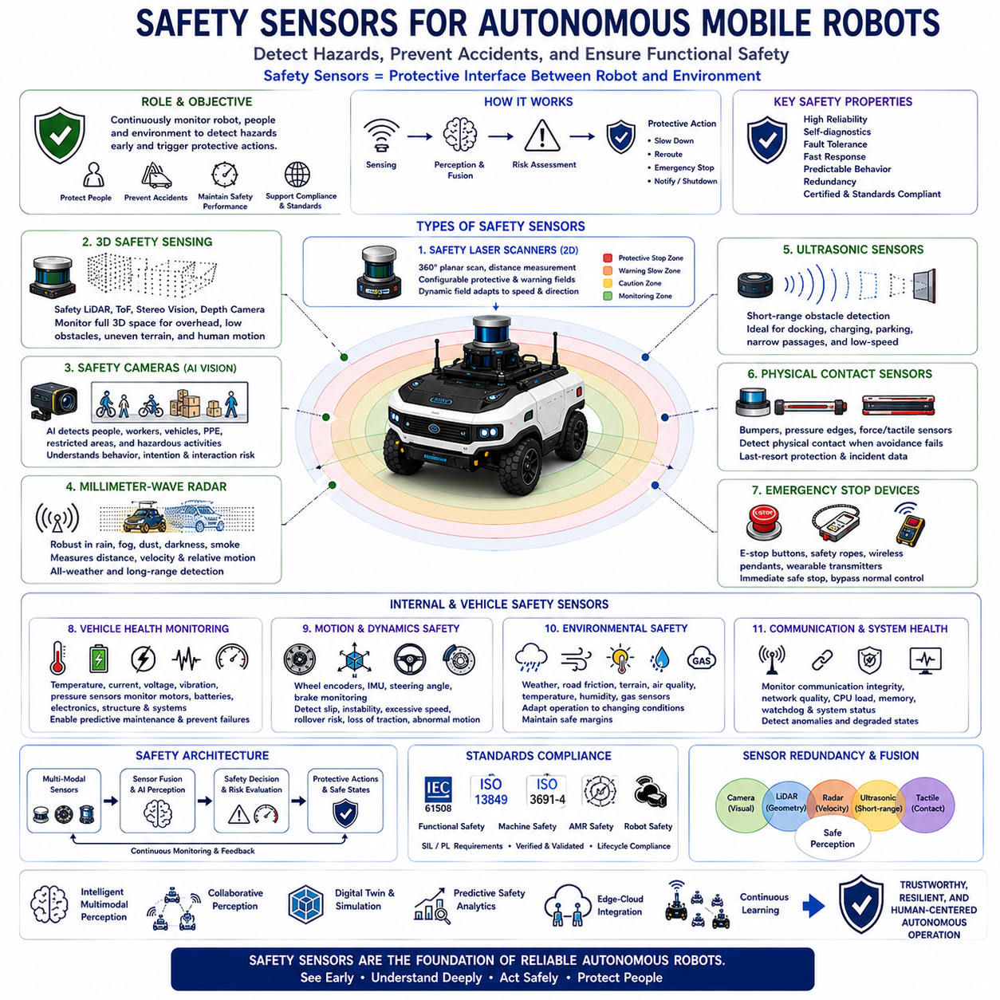
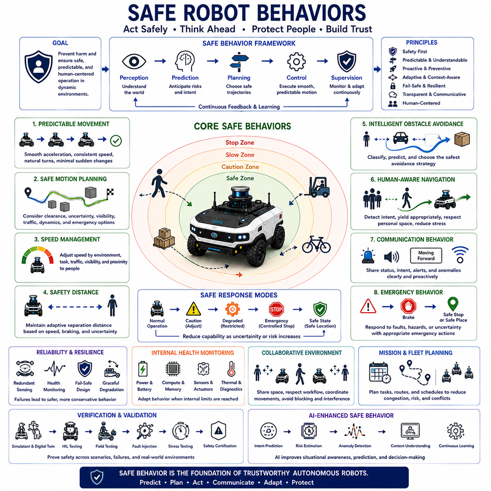
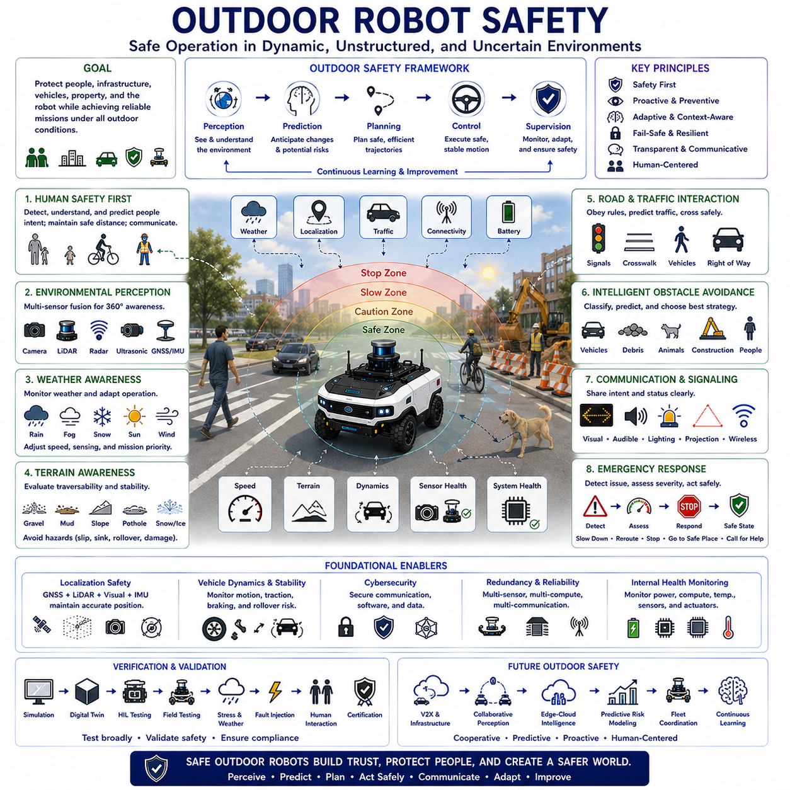

**Volume 01. AMR Foundations and System Architecture**

# 08. Functional Safety · 기능 안전

## 08.01 Safety Fundamentals · 안전 기초

{width="7.268055555555556in" height="7.268055555555556in"}

Safety is one of the most fundamental principles governing the design, development, deployment, and operation of Autonomous Mobile Robots. Unlike conventional industrial machines that typically operate inside isolated work cells, autonomous robots frequently share workspaces with people, vehicles, equipment, and dynamic environments. Consequently, safety is no longer limited to preventing mechanical failures but extends to ensuring predictable, reliable, and trustworthy behavior under all operating conditions. Safety fundamentals establish the engineering principles that protect human life, prevent property damage, maintain operational continuity, and build confidence in autonomous robotic systems. Every architectural decision, from mechanical design to artificial intelligence, must ultimately support safe system behavior throughout the complete operational lifecycle.

The concept of safety in robotics extends beyond the simple absence of accidents. A safe robotic system continuously identifies hazards, evaluates operational risks, predicts potentially dangerous situations, and actively prevents unsafe conditions before accidents occur. Modern safety engineering therefore emphasizes proactive risk reduction rather than reactive failure response. Autonomous systems must operate safely not only during normal missions but also during abnormal situations including hardware failures, software faults, communication interruptions, environmental uncertainty, sensor degradation, and unexpected human behavior. Safety is achieved through systematic engineering rather than relying upon individual protective devices.

Hazards represent any source of potential harm capable of causing injury, equipment damage, environmental impact, or operational disruption. In autonomous robotics, hazards may originate from mechanical motion, electrical systems, batteries, thermal conditions, hazardous materials, software failures, cybersecurity attacks, perception errors, localization inaccuracies, communication failures, or incorrect human interaction. Dynamic environments further introduce external hazards including moving vehicles, pedestrians, animals, falling objects, unstable terrain, adverse weather, and unexpected obstacles. Comprehensive hazard identification forms the starting point of every safety engineering process because effective protection requires understanding every credible source of danger before appropriate mitigation strategies can be designed.

Risk combines the probability that a hazardous event will occur with the severity of its potential consequences. Risk assessment evaluates both factors systematically to determine whether identified hazards require additional protective measures. High-severity hazards demand mitigation even when occurrence probability is relatively low, while frequently occurring minor hazards may also require engineering controls due to cumulative operational exposure. Modern robotic development follows structured risk assessment methodologies that identify hazards, estimate exposure frequency, evaluate avoidance possibilities, determine acceptable risk levels, and recommend appropriate technical or procedural safeguards. Continuous risk evaluation remains essential throughout system development because design modifications frequently introduce new operational conditions.

Safety engineering follows the principle that hazards should be eliminated whenever possible rather than merely controlled after they appear. Inherently safe design removes hazards directly through engineering choices including reduced operating energy, lower speeds, protected mechanical structures, stable vehicle dynamics, safer battery chemistry, simplified system architecture, and improved environmental awareness. When hazards cannot be eliminated completely, engineering controls such as protective guarding, redundant monitoring, emergency intervention, operational restrictions, warning systems, and administrative procedures progressively reduce remaining risk. This hierarchical approach ensures that safety begins with system design rather than depending exclusively upon operator behavior.

Functional safety focuses on ensuring that safety-related control systems operate correctly whenever required. Unlike physical safety features such as protective covers or mechanical barriers, functional safety relies upon electronic hardware, embedded software, sensors, controllers, communication systems, and actuators performing their intended protective functions under both normal and fault conditions. Autonomous Mobile Robots employ functional safety for emergency braking, obstacle detection, speed limitation, steering supervision, battery protection, safe docking, collision avoidance, and controlled shutdown procedures. Functional safety therefore integrates intelligent decision making directly into the protective architecture of autonomous robotic systems.

Redundancy represents one of the most important engineering principles supporting dependable safety. Critical functions should not rely upon a single component whose failure could produce unsafe behavior. Multiple perception sensors, independent braking systems, redundant processors, backup communication channels, duplicated power supplies, parallel localization methods, and diverse environmental observations collectively improve system reliability by allowing safe operation despite individual component failures. Modern autonomous platforms increasingly combine heterogeneous redundancy where different sensing technologies compensate for one another because diverse systems are less likely to fail simultaneously under identical environmental conditions.

Fault detection and fault diagnosis play essential roles within autonomous safety architectures. Every critical subsystem continuously monitors its own operational health while supervising neighboring components through diagnostic communication. Sensors evaluate signal quality, controllers verify computational integrity, communication networks monitor packet reliability, localization systems estimate uncertainty, and artificial intelligence evaluates prediction confidence. When abnormal conditions are detected, diagnostic systems identify probable failure sources, estimate operational impact, and determine appropriate recovery strategies before hazardous situations develop. Continuous health monitoring therefore transforms safety from passive protection into active operational supervision.

Fail-safe behavior ensures that autonomous systems transition toward predetermined safe states whenever unacceptable faults occur. Rather than attempting to continue operation under uncertain conditions, the robot progressively reduces operational capability according to predefined safety policies. Depending upon fault severity, fail-safe responses may include speed reduction, restricted navigation, increased sensor verification, controlled stopping, emergency braking, remote operator notification, or complete system shutdown. Safe-state management prioritizes predictable behavior over mission completion, recognizing that operational continuity must never compromise human safety.

Modern autonomous robots increasingly employ fail-operational architectures for applications requiring continuous availability. Instead of immediately stopping after every detected fault, the system maintains limited but safe functionality using redundant components while requesting maintenance or operator assistance. Independent computational channels, backup localization systems, degraded perception modes, alternative communication paths, and reduced operational capabilities allow essential missions to continue safely despite partial system failures. Fail-operational design is particularly valuable for large industrial facilities, mining operations, agriculture, and critical infrastructure where immediate shutdown may itself create unacceptable operational risks.

Human safety remains the highest priority throughout robotic system design. Autonomous robots must continuously detect nearby people, estimate human motion, predict future trajectories, recognize vulnerable situations, and adapt operational behavior accordingly. Protective separation distances, speed adjustment, emergency stopping, collaborative operation modes, human intention prediction, and natural communication collectively reduce collision probability while improving human trust. Modern perception systems increasingly distinguish humans from other obstacles so that robot behavior can be specifically optimized for safe human interaction rather than generic obstacle avoidance alone.

Environmental awareness significantly contributes to operational safety because autonomous decisions depend directly upon accurate perception. Cameras, LiDAR, radar, ultrasonic sensors, GNSS receivers, inertial sensors, environmental sensors, and digital maps collectively provide comprehensive understanding of surrounding conditions. Artificial intelligence fuses these heterogeneous information sources to identify obstacles, terrain conditions, weather effects, temporary hazards, traffic participants, and operational constraints while estimating uncertainty associated with every observation. Reliable environmental awareness allows proactive safety decisions long before dangerous situations become unavoidable.

Artificial intelligence introduces both new opportunities and new challenges for robotic safety. Machine learning substantially improves perception, prediction, anomaly detection, semantic understanding, and adaptive decision making compared with traditional deterministic algorithms. However, AI models may exhibit uncertainty, distribution shifts, unexpected behavior, incomplete generalization, or sensitivity to adversarial conditions. Consequently, AI safety requires confidence estimation, uncertainty quantification, out-of-distribution detection, explainable reasoning, continuous validation, human supervision, and deterministic safety constraints ensuring that learning-based systems remain bounded within predictable operational limits.

Cybersecurity has become inseparable from safety because malicious digital attacks may directly influence physical robot behavior. Unauthorized software modification, communication interception, sensor spoofing, navigation manipulation, or denial-of-service attacks can create hazardous operating conditions comparable to hardware failures. Therefore, modern safety architectures integrate authentication, encrypted communication, secure boot mechanisms, certificate management, access control, intrusion detection, software integrity verification, and secure over-the-air updates throughout the complete robotic platform. Safety and cybersecurity increasingly function as complementary engineering disciplines protecting both digital infrastructure and physical operation.

Safety validation extends throughout the entire system development lifecycle rather than occurring only during final testing. Requirements analysis defines safety objectives before design begins. Simulation evaluates hazardous scenarios impossible to reproduce safely in real environments. Laboratory testing verifies subsystem behavior. Controlled field testing validates integrated operation under representative conditions. Long-term operational monitoring continuously evaluates safety performance after deployment while identifying opportunities for improvement through collected operational data. This lifecycle perspective ensures that safety evolves continuously together with system capability rather than remaining a one-time certification activity.

International safety standards provide structured engineering guidance supporting consistent development practices across the robotics industry. Standards define terminology, hazard analysis procedures, functional safety requirements, validation methods, documentation practices, performance criteria, and certification processes that improve interoperability and regulatory compliance. Although standards cannot guarantee absolute safety, they establish proven engineering methodologies that significantly reduce development risk while promoting systematic verification of safety-critical functions. Compliance with internationally recognized standards therefore strengthens both technical reliability and commercial acceptance.

Future safety architectures will increasingly integrate artificial intelligence, predictive risk assessment, collaborative perception, digital twins, foundation models, autonomous fleet coordination, continuous learning, and real-time operational analytics into proactive safety ecosystems. Rather than responding only after hazardous conditions emerge, intelligent safety systems will anticipate future risks, simulate alternative actions, estimate operational confidence, coordinate protective behavior across multiple robots, and continuously optimize safety policies using accumulated operational knowledge. As autonomous robotics expands into transportation, logistics, construction, agriculture, healthcare, and public infrastructure, safety fundamentals will remain the permanent engineering foundation upon which every intelligent robotic capability must ultimately depend.

## 08.02 Industrial Safety Standards · 산업 안전 표준

{width="7.268055555555556in" height="7.268055555555556in"}

Industrial safety standards establish internationally recognized engineering principles, technical requirements, validation procedures, and operational practices that ensure industrial equipment operates safely throughout its entire lifecycle. Rather than prescribing specific hardware designs or software implementations, safety standards define systematic methodologies for identifying hazards, evaluating risks, implementing protective measures, verifying system behavior, and maintaining acceptable safety performance under both normal and abnormal operating conditions. As Autonomous Mobile Robots become increasingly integrated into manufacturing, logistics, healthcare, construction, mining, and public infrastructure, compliance with industrial safety standards has become essential not only for regulatory approval but also for technical reliability, commercial acceptance, and long-term operational sustainability.

The primary objective of industrial safety standards is to reduce the probability of accidents while minimizing the consequences of unavoidable failures. Modern safety engineering recognizes that no complex industrial system can be completely free of faults throughout its operational lifetime. Instead, systems must be designed to detect abnormal conditions, tolerate predictable failures, transition into safe operating states, and prevent hazardous situations from escalating into accidents. Safety standards therefore emphasize systematic engineering processes rather than relying solely upon individual protective devices or operator experience. This structured approach provides a repeatable framework for designing dependable autonomous robotic systems.

Safety standards generally distinguish between hazard, risk, and safety because these concepts serve different engineering purposes. A hazard represents any potential source of physical harm, equipment damage, environmental impact, or operational disruption. Risk combines the probability of a hazardous event with the severity of its consequences. Safety represents the acceptable reduction of risk to a level considered tolerable within a specific operational context. This conceptual framework forms the foundation of nearly every international safety standard and guides engineers throughout system design, implementation, verification, validation, deployment, and maintenance activities.

Risk assessment represents one of the most important activities required by industrial safety standards. Engineers systematically identify potential hazards, estimate exposure frequency, evaluate possible consequences, determine avoidance capability, and calculate overall risk levels before selecting appropriate protective measures. This structured evaluation considers mechanical motion, electrical energy, thermal hazards, software behavior, communication failures, environmental conditions, human interaction, cybersecurity threats, and artificial intelligence uncertainty. Risk assessment is not performed only once during development but continues throughout the operational lifecycle whenever significant design changes or environmental modifications occur.

One of the most influential international safety standards is IEC 61508, which establishes the general framework for functional safety of electrical, electronic, and programmable electronic safety-related systems. Rather than targeting a specific industrial application, IEC 61508 defines lifecycle processes covering concept development, hazard analysis, system architecture, hardware design, software development, verification, validation, operation, maintenance, modification, and decommissioning. Many industry-specific functional safety standards derive directly from IEC 61508 because it provides a comprehensive engineering methodology applicable across numerous industrial sectors.

IEC 61508 introduces the concept of Safety Integrity Level, commonly abbreviated as SIL, to quantify the reliability required for safety-related functions. Higher SIL classifications require progressively lower probabilities of dangerous failure and more rigorous engineering processes. Safety Integrity Levels range from SIL 1 through SIL 4, with SIL 4 representing the highest integrity requirements for applications where failures could produce catastrophic consequences. Although many autonomous robotic applications typically implement SIL 1 or SIL 2 functions, higher integrity requirements may become necessary within hazardous industrial environments or critical infrastructure applications.

ISO 13849 represents another highly important international standard focusing specifically on safety-related parts of machinery control systems. Unlike IEC 61508, which primarily addresses electronic functional safety, ISO 13849 considers complete machine safety architectures including mechanical, hydraulic, pneumatic, electrical, and programmable control components. The standard introduces Performance Level classifications that evaluate the probability of dangerous failures while considering diagnostic coverage, fault tolerance, component reliability, common cause failures, and system architecture. Performance Levels range from PL a through PL e, with PL e representing the highest machine safety performance.

ISO 12100 provides the fundamental framework for machinery safety by defining general principles for risk assessment and risk reduction. The standard introduces a systematic design philosophy beginning with hazard identification, followed by inherently safe design measures, engineering safeguards, administrative controls, warning information, and operational procedures. This hierarchical approach encourages engineers to eliminate hazards through intelligent design before introducing protective devices or relying upon operator intervention. Consequently, ISO 12100 serves as the conceptual foundation supporting numerous additional machinery safety standards throughout industrial automation.

For Autonomous Mobile Robots operating within industrial environments, ISO 3691-4 has become one of the most relevant safety standards. This international standard specifies safety requirements and verification methods for driverless industrial trucks and their operating environments. It addresses navigation safety, obstacle detection, emergency stopping, speed control, braking performance, human interaction, warning systems, environmental conditions, operational zones, and system verification. ISO 3691-4 recognizes that autonomous mobile robots interact continuously with dynamic industrial environments and therefore require specialized safety principles beyond those applicable to conventional stationary machinery.

Collaborative robotic applications frequently reference ISO 10218 and its associated technical specifications governing industrial robot safety. Although originally developed for robotic manipulators, many concepts regarding collaborative operation, speed monitoring, protective separation distances, emergency intervention, and human-robot interaction have influenced broader autonomous robotics safety practices. These standards emphasize that safe collaboration requires continuous monitoring of both robot behavior and human presence rather than relying solely upon physical isolation between machines and people.

Electrical safety remains another essential aspect addressed by industrial standards. Safe electrical architecture includes insulation, grounding, overcurrent protection, battery management, electromagnetic compatibility, electrical isolation, fault detection, thermal monitoring, emergency disconnect mechanisms, and protection against electric shock. High-capacity lithium battery systems employed within modern autonomous robots require particularly careful attention because thermal runaway, electrical faults, mechanical damage, or charging failures may introduce significant operational hazards. Electrical safety standards therefore complement functional safety by addressing physical energy management throughout robotic platforms.

Software has become a safety-critical component within modern autonomous robotic systems, leading safety standards to emphasize structured software engineering processes. Requirements traceability, configuration management, version control, coding guidelines, unit testing, integration testing, static analysis, dynamic verification, fault injection, regression testing, and documentation collectively improve software reliability. Safety-related software must demonstrate deterministic behavior under defined operating conditions while providing appropriate responses to abnormal situations. Increasingly sophisticated artificial intelligence requires additional validation methods ensuring predictable behavior despite data-driven learning processes.

Artificial intelligence introduces unique challenges because traditional safety standards were originally developed for deterministic control systems. Machine learning models may exhibit uncertainty, incomplete generalization, distribution shifts, probabilistic outputs, and continuously evolving behavior that cannot always be verified using conventional engineering methods. Consequently, current industrial practice increasingly supplements existing standards with explainable artificial intelligence, uncertainty estimation, confidence monitoring, runtime supervision, safety envelopes, human oversight, and continuous operational validation. Future revisions of international standards will likely incorporate more comprehensive guidance addressing learning-enabled autonomous systems.

Cybersecurity has become tightly integrated with industrial safety because successful cyber attacks may directly create hazardous physical behavior. Modern safety standards increasingly recognize authentication, encrypted communication, secure software updates, certificate management, access control, intrusion detection, secure boot mechanisms, integrity verification, and network segmentation as essential engineering requirements supporting safe autonomous operation. Rather than treating cybersecurity independently, industrial systems increasingly integrate digital protection into comprehensive safety architectures protecting both information systems and physical robotic behavior.

Verification and validation constitute fundamental requirements throughout every industrial safety standard. Verification demonstrates that the implemented system satisfies specified design requirements, while validation confirms that the completed system performs safely within its intended operational environment. Simulation, laboratory testing, environmental testing, field trials, fault injection, hardware-in-the-loop evaluation, software-in-the-loop evaluation, long-duration operational testing, and independent safety assessment collectively provide evidence supporting system certification. Comprehensive verification and validation significantly reduce the likelihood of undiscovered safety deficiencies before commercial deployment.

Documentation forms an equally important component of industrial safety standards because safe systems require complete engineering traceability throughout their lifecycle. Hazard analyses, risk assessments, design decisions, verification reports, validation evidence, software versions, hardware configurations, maintenance procedures, operational limitations, and incident records must remain accurately documented. Complete documentation supports certification activities, regulatory compliance, maintenance planning, accident investigation, software updates, and continuous safety improvement while preserving organizational knowledge across multiple generations of system development.

Industrial safety standards continue evolving alongside advances in autonomous robotics, artificial intelligence, cloud computing, digital twins, collaborative robotics, autonomous fleets, and intelligent infrastructure. Future standards will increasingly address multimodal perception, foundation models, continuous learning, distributed intelligence, edge-cloud architectures, predictive safety analytics, digital certification, and real-time operational assurance while preserving the systematic engineering principles established by existing international standards. As autonomous robotic systems become more intelligent, connected, and widely deployed across society, industrial safety standards will remain the essential engineering framework ensuring that technological innovation continues to advance together with human safety, operational reliability, and public trust.

## 08.03 Safety Sensors · 안전 센서

{width="7.268055555555556in" height="7.268055555555556in"}

Safety sensors form the primary protective interface between autonomous robotic systems and their surrounding environment. Unlike general perception sensors that primarily support navigation and task execution, safety sensors are specifically designed to prevent hazardous situations, protect human operators, detect dangerous environmental conditions, and ensure compliance with functional safety requirements. Autonomous Mobile Robots frequently operate in dynamic environments where people, vehicles, industrial equipment, and autonomous systems coexist within shared workspaces. Consequently, safety sensors continuously monitor operational conditions, identify potential hazards, initiate protective actions, and maintain acceptable safety performance even during abnormal system behavior. Rather than serving as optional accessories, safety sensors constitute fundamental components of the overall safety architecture upon which reliable autonomous operation depends.

The primary objective of safety sensors is to detect hazardous conditions before accidents occur. Modern safety engineering emphasizes proactive protection by continuously monitoring the robot itself, nearby humans, surrounding obstacles, vehicle dynamics, environmental conditions, communication integrity, and internal system health. Whenever predefined safety limits are exceeded, protective actions such as speed reduction, trajectory modification, emergency braking, controlled stopping, operator notification, or system shutdown are automatically initiated. This preventive approach significantly reduces accident probability while maintaining operational productivity within acceptable risk boundaries.

Safety sensors differ fundamentally from conventional perception sensors because they must satisfy rigorous functional safety requirements regarding reliability, diagnostic capability, fault tolerance, response time, and predictable behavior. A standard camera may occasionally misclassify an object without directly compromising safety, whereas a certified safety laser scanner must consistently detect human presence within specified protective zones under defined environmental conditions. Consequently, safety sensors generally incorporate redundant hardware, continuous self-diagnostics, fault monitoring, deterministic processing, certified firmware, and validated operating characteristics supporting compliance with international safety standards such as IEC 61508, ISO 13849, and ISO 3691-4.

Safety laser scanners represent one of the most widely deployed safety sensing technologies within industrial autonomous robotics. These devices continuously scan two-dimensional environments using rotating laser beams while measuring distances to surrounding objects with high precision. Configurable protective fields define regions surrounding the robot where different safety responses are triggered according to obstacle proximity. Objects entering warning zones may initiate speed reduction, whereas intrusion into protective zones immediately activates emergency stopping. Modern safety laser scanners dynamically adjust protective field geometry according to vehicle speed, steering angle, travel direction, payload characteristics, and operational mode, allowing efficient mobility while maintaining consistent safety margins.

Three-dimensional safety sensing has become increasingly important as autonomous platforms operate within more complex environments. Safety LiDAR systems, stereo vision, time-of-flight cameras, structured light sensors, and depth cameras collectively monitor volumetric spaces surrounding autonomous robots rather than only planar protective fields. These sensors detect suspended obstacles, overhanging structures, loading equipment, elevated platforms, stairways, uneven terrain, and complex human body movements that cannot be adequately monitored using traditional two-dimensional sensing alone. Three-dimensional safety perception substantially improves protection within warehouses, construction sites, logistics centers, and outdoor industrial facilities.

Safety cameras increasingly complement traditional laser scanners by providing richer semantic understanding of human behavior. Artificial intelligence identifies pedestrians, workers, maintenance personnel, cyclists, vehicles, personal protective equipment, restricted zones, and hazardous activities while estimating motion direction, posture, intention, and interaction risk. Rather than simply detecting object presence, intelligent safety vision systems interpret behavioral context, allowing robots to respond more naturally while maintaining safe operation. Human-aware perception reduces unnecessary emergency stops while improving both productivity and operational safety in collaborative environments.

Millimeter-wave radar provides highly robust safety sensing under adverse environmental conditions including heavy rain, fog, dust, smoke, snow, darkness, and airborne debris where optical sensing performance may degrade significantly. Radar directly measures object distance, velocity, and relative motion while maintaining reliable operation despite challenging weather conditions. Modern autonomous outdoor platforms frequently combine radar with LiDAR and vision systems to establish redundant environmental perception supporting both operational performance and safety integrity. Multi-sensor redundancy ensures that safety functions remain available even when individual sensing modalities become temporarily unreliable.

Ultrasonic sensors provide reliable short-range obstacle detection surrounding autonomous vehicles. Although their sensing range remains relatively limited, ultrasonic sensors excel at detecting nearby obstacles during docking, charging, loading, parking, narrow corridor navigation, and low-speed maneuvering. These sensors effectively identify transparent materials, dark surfaces, reflective objects, and complex geometries that occasionally challenge optical sensing systems. Consequently, ultrasonic sensing frequently serves as the final protective layer immediately surrounding autonomous robots, complementing longer-range perception technologies.

Physical contact sensors remain essential despite significant advances in non-contact perception technologies. Safety bumpers, pressure-sensitive edges, collision strips, force sensors, tactile skins, torque sensors, and compliant mechanical structures detect unexpected physical interaction whenever obstacle avoidance fails. Contact detection immediately initiates emergency stopping while recording collision information supporting incident analysis and future system improvement. Although modern autonomous robots attempt to prevent all collisions through proactive perception, physical contact sensing provides indispensable last-resort protection against unforeseen events and residual operational risk.

Emergency stop devices constitute mandatory safety components throughout nearly every industrial autonomous robotic platform. Emergency stop buttons, safety ropes, wireless emergency controllers, wearable emergency transmitters, and remote shutdown systems allow immediate interruption of hazardous robot motion whenever human operators identify dangerous situations. Emergency stop systems bypass normal software control and directly activate certified safety functions ensuring rapid transition into predefined safe states. International safety standards specify strict performance requirements governing emergency stop availability, accessibility, reliability, response time, reset procedures, and operational verification.

Vehicle health monitoring sensors continuously supervise the internal condition of autonomous robotic platforms. Temperature sensors monitor motors, batteries, processors, power electronics, and charging systems. Current sensors detect abnormal electrical consumption. Voltage sensors identify battery degradation and power instability. Vibration sensors detect mechanical wear, bearing failures, structural damage, and drivetrain abnormalities. Pressure sensors supervise hydraulic and pneumatic systems where applicable. These diagnostic sensors support predictive maintenance while preventing equipment failures from developing into hazardous operating conditions.

Motion safety sensors continuously evaluate dynamic vehicle behavior during autonomous operation. Wheel encoders monitor wheel rotation while detecting unexpected slip or mechanical failures. Inertial Measurement Units estimate acceleration, angular velocity, roll angle, pitch angle, and vehicle stability. Steering angle sensors supervise directional control, while brake monitoring sensors verify braking effectiveness during emergency intervention. Vehicle dynamics monitoring enables autonomous platforms to recognize unstable operating conditions including excessive speed, rollover risk, terrain instability, wheel lift, loss of traction, and abnormal motion before hazardous situations develop.

Environmental safety sensors monitor external conditions that may directly influence operational safety. Weather stations measure wind speed, precipitation, humidity, temperature, atmospheric pressure, and solar radiation. Surface sensors estimate road friction, ice formation, standing water, loose gravel, and terrain stability. Air quality sensors detect hazardous gases, combustible vapors, smoke, oxygen deficiency, or airborne contaminants within industrial environments. Continuous environmental monitoring enables autonomous systems to adapt operational behavior according to changing external conditions while maintaining acceptable safety margins.

Functional safety increasingly relies upon sensor redundancy rather than individual sensor performance. Multiple independent sensing technologies observe identical environmental regions using complementary physical principles. Cameras provide semantic understanding, LiDAR generates precise geometry, radar measures velocity under adverse weather, ultrasonic sensors detect nearby obstacles, and tactile sensors confirm physical contact. Artificial intelligence continuously compares observations, estimates confidence, identifies inconsistencies, and isolates sensor failures before hazardous decisions occur. Redundant sensing substantially improves reliability because simultaneous failure across diverse sensing technologies remains significantly less probable than failure of any individual sensor.

Sensor fusion has become one of the defining architectural principles supporting modern safety systems. Individual sensors possess inherent limitations caused by lighting, weather, environmental geometry, material properties, or measurement uncertainty. Safety fusion algorithms integrate multiple heterogeneous observations into unified environmental models while estimating uncertainty associated with every detected object. Rather than simply averaging sensor measurements, intelligent fusion evaluates observation reliability, historical consistency, contextual information, and operational conditions before generating safety-critical decisions. This probabilistic reasoning significantly increases robustness compared with isolated sensor processing.

Artificial intelligence increasingly enhances safety sensing beyond conventional threshold-based detection. Deep neural networks recognize complex environmental patterns, identify hazardous behaviors, estimate collision probability, predict pedestrian trajectories, detect abnormal operating conditions, recognize sensor degradation, and classify previously unseen obstacles. Foundation Models further expand safety capabilities by integrating visual observations, operational instructions, historical experience, semantic understanding, and contextual reasoning into comprehensive environmental interpretation. Nevertheless, deterministic safety mechanisms continue supervising AI outputs to guarantee predictable protective behavior whenever learning-based models encounter uncertain situations.

Future safety sensor architectures will evolve toward intelligent multimodal perception ecosystems integrating certified sensing hardware, distributed artificial intelligence, collaborative perception, connected infrastructure, digital twins, predictive safety analytics, edge-cloud processing, autonomous fleet coordination, and continuous learning. Rather than detecting hazards only after they appear, future safety sensors will anticipate dangerous situations through long-term behavioral prediction, environmental modeling, operational experience, and cooperative information sharing among multiple autonomous systems. As autonomous robotics expands across increasingly complex industrial environments, safety sensors will continue evolving from passive detection devices into intelligent cognitive systems forming the foundation of trustworthy, resilient, and human-centered autonomous operation.

## 08.04 Safe Robot Behaviors · 로봇 안전 동작

{width="7.268055555555556in" height="7.268055555555556in"}

Safe robot behaviors represent the collection of operational principles, decision-making strategies, motion control policies, and interaction mechanisms that allow autonomous robots to perform useful tasks while continuously minimizing risk to humans, equipment, infrastructure, and the surrounding environment. Safety is not achieved solely through dedicated safety hardware or emergency systems but emerges from the robot\'s overall behavior during perception, planning, navigation, manipulation, communication, and mission execution. Modern Autonomous Mobile Robots operate in dynamic environments shared with people, vehicles, industrial machines, and other autonomous systems, making safe behavior an essential capability rather than an optional feature. Every movement, decision, and interaction should be designed to preserve predictable, reliable, and human-centered operation.

The primary objective of safe robot behavior is to prevent hazardous situations before emergency intervention becomes necessary. Rather than reacting only after danger is detected, intelligent robots continuously predict potential conflicts, evaluate environmental uncertainty, estimate collision probability, and proactively modify their behavior to maintain acceptable safety margins. This preventive philosophy shifts safety from reactive accident mitigation toward continuous risk management throughout the robot\'s operational lifecycle. Safe behavior therefore combines perception, prediction, planning, control, and supervision into a unified decision-making framework that continuously adapts to changing operational conditions.

Predictability is one of the most important characteristics of safe robot behavior. Human workers naturally anticipate the movement of nearby robots based on observed trajectories, speed, direction, and previous actions. Sudden acceleration, unpredictable turning, abrupt stopping, or unnecessary path changes may confuse nearby people even if no collision occurs. Consequently, autonomous robots should exhibit smooth, consistent, and easily understandable motion patterns that allow surrounding humans to accurately anticipate future robot behavior. Predictable movement significantly improves trust, reduces psychological stress, and enables safer human-robot collaboration within shared industrial environments.

Motion planning plays a central role in achieving safe behavior. Safe trajectory generation considers not only the shortest or fastest route but also obstacle clearance, visibility, environmental uncertainty, pedestrian density, vehicle dynamics, braking capability, and emergency escape possibilities. Modern planning algorithms continuously update robot trajectories as new sensor information becomes available while maintaining smooth transitions between successive motion plans. Safe path planning therefore balances efficiency, comfort, productivity, and risk reduction rather than optimizing a single performance objective.

Speed management represents another fundamental aspect of safe robotic operation. Robot velocity should continuously adapt according to surrounding environmental conditions, operational tasks, sensor confidence, terrain characteristics, weather, visibility, traffic density, and proximity to humans. High-speed travel may be appropriate within isolated transport corridors, whereas significantly reduced speed becomes necessary when operating near pedestrians, loading stations, intersections, narrow passages, or collaborative workspaces. Intelligent speed adaptation allows autonomous systems to maintain operational efficiency while preserving adequate stopping distance under all expected operating conditions.

Maintaining appropriate safety distance is essential for preventing collisions and supporting comfortable human interaction. Protective separation distances depend upon robot speed, obstacle motion, braking performance, localization accuracy, perception uncertainty, environmental complexity, and human reaction capability. Rather than relying upon fixed safety margins, modern autonomous systems dynamically adjust protective zones according to continuously changing operational conditions. Adaptive safety distances allow robots to move efficiently in open environments while providing greater protection in crowded or uncertain situations.

Obstacle avoidance behavior extends beyond simply preventing physical contact. Safe robots classify obstacles according to their characteristics, predict future motion, estimate interaction risk, and select appropriate avoidance strategies. Static infrastructure, moving vehicles, pedestrians, animals, suspended objects, temporary construction equipment, and unknown obstacles each require different behavioral responses. Instead of applying identical avoidance rules to every detected object, intelligent robotic systems consider semantic understanding, contextual information, operational priorities, and long-term mission objectives before selecting the safest behavioral alternative.

Human-aware navigation has become one of the defining characteristics of modern autonomous robotics. Rather than treating humans as moving obstacles, advanced robots recognize pedestrian intention, body orientation, walking direction, group behavior, attention level, and interaction context. Robots yield appropriately, avoid unnecessary interference, respect personal space, reduce speed near vulnerable individuals, and communicate movement intentions through predictable actions. Human-aware behavior enables autonomous systems to integrate naturally into workplaces while reducing stress and increasing operator confidence.

Communication behavior contributes significantly to operational safety. Autonomous robots should continuously communicate their operational status, intended motion, current mission, abnormal conditions, and emergency situations using visual indicators, audible signals, displays, projection systems, wireless notifications, or natural language interfaces where appropriate. Effective communication reduces uncertainty surrounding robot behavior and improves human situational awareness. Transparent communication enables operators to understand why robots make specific decisions, thereby increasing both operational efficiency and user trust.

Emergency behavior defines how autonomous robots respond when normal operation can no longer be maintained safely. Sensor failures, localization degradation, communication loss, mechanical malfunction, unexpected obstacles, environmental hazards, or software anomalies require carefully designed emergency procedures. Rather than immediately shutting down in every abnormal situation, robots may first reduce speed, enter degraded operational modes, request human assistance, move toward predefined safe locations, or perform controlled stopping according to the severity of detected failures. Well-designed emergency behavior minimizes secondary hazards while preserving overall system safety.

Fail-safe behavior ensures that system failures naturally lead toward safer operating conditions. Whenever uncertainty exceeds predefined limits or critical safety functions become unavailable, autonomous robots automatically reduce operational capability instead of continuing normal mission execution. Typical fail-safe responses include controlled braking, actuator deactivation, manipulation lockout, navigation suspension, protective field expansion, emergency notification, and transition into certified safe states. The fundamental principle is that increasing uncertainty should always produce increasingly conservative robot behavior.

Graceful degradation represents an important extension of fail-safe operation. Instead of terminating all autonomous functions after relatively minor failures, intelligent systems continue operating with reduced functionality whenever acceptable safety can still be maintained. For example, partial sensor degradation may reduce maximum speed, communication loss may limit operational range, localization uncertainty may require simplified navigation, or hardware failures may disable selected mission functions while preserving safe mobility. Graceful degradation improves system availability without compromising fundamental safety requirements.

Safe robot behavior also depends upon continuous monitoring of internal system health. Autonomous platforms supervise battery condition, processor utilization, memory availability, communication latency, actuator performance, sensor diagnostics, thermal status, software integrity, and computational workload. Behavioral adaptation occurs whenever internal performance indicators approach operational limits. For example, thermal overload may reduce processing capability, requiring simplified perception algorithms or reduced vehicle speed until normal operating conditions are restored. Internal awareness therefore complements environmental perception in maintaining comprehensive operational safety.

Artificial intelligence increasingly supports safe behavioral decision-making by recognizing complex environmental situations, predicting future events, estimating uncertainty, identifying abnormal operating patterns, and optimizing protective actions. Machine learning models classify human activities, estimate collision probability, detect unsafe driving behavior, recognize hazardous environmental conditions, and predict evolving traffic interactions. However, learning-based behavioral decisions remain supervised by deterministic safety mechanisms ensuring that uncertainty, model failure, or unexpected observations cannot directly generate hazardous robot behavior. Safety supervision therefore remains independent from adaptive learning processes.

Collaborative environments require robots to exhibit socially acceptable behaviors that extend beyond traditional collision avoidance. Robots should avoid unnecessarily blocking walkways, respect human workflow, minimize interruption of manual tasks, coordinate movement with nearby operators, avoid aggressive maneuvering, and demonstrate polite navigation behavior similar to human social conventions. Such behavioral refinement improves workplace acceptance while reducing confusion and supporting efficient collaboration between autonomous systems and human personnel.

Mission planning also contributes to safe operational behavior. Autonomous systems should schedule tasks to minimize traffic congestion, reduce unnecessary interaction with pedestrians, avoid hazardous environmental conditions, coordinate fleet movement, balance workload, and optimize charging schedules without creating operational conflicts. Safe mission planning therefore extends safety considerations beyond individual robot control toward fleet-level coordination and overall facility management. Intelligent mission orchestration reduces both operational risk and infrastructure congestion through globally optimized task allocation.

Verification and validation of safe robot behaviors require comprehensive evaluation under diverse operating conditions. Simulation, digital twins, hardware-in-the-loop testing, field experiments, fault injection, long-duration endurance testing, human interaction studies, environmental stress testing, and safety certification collectively verify that behavioral algorithms consistently satisfy predefined safety requirements. Validation extends beyond demonstrating successful task completion by confirming that autonomous systems remain safe under unexpected situations, degraded sensing conditions, equipment failures, and complex real-world operational environments.

Future safe robot behaviors will increasingly incorporate cognitive reasoning, foundation models, multimodal perception, collaborative intelligence, digital infrastructure, predictive risk analysis, distributed decision-making, and lifelong learning. Rather than simply avoiding immediate hazards, next-generation autonomous systems will anticipate future risks through behavioral prediction, environmental understanding, historical operational knowledge, and cooperative information sharing among connected robots and intelligent infrastructure. As Physical AI continues advancing toward increasingly autonomous industrial ecosystems, safe robot behaviors will evolve from reactive protective mechanisms into intelligent behavioral frameworks that continuously balance productivity, efficiency, adaptability, and human safety throughout every stage of autonomous operation.

## 08.05 Outdoor Robot Safety · 실외 로봇 안전

{width="7.268055555555556in" height="7.268055555555556in"}

Outdoor robot safety encompasses the engineering principles, operational strategies, environmental awareness, and protective mechanisms that enable autonomous robotic systems to perform tasks safely within complex and continuously changing outdoor environments. Unlike indoor facilities where operating conditions are relatively structured and predictable, outdoor environments introduce diverse terrain, dynamic weather, uncontrolled human activity, moving vehicles, animals, construction zones, vegetation, and uncertain sensing conditions. Consequently, outdoor safety extends far beyond traditional obstacle avoidance by requiring autonomous systems to continuously evaluate environmental uncertainty, adapt operational behavior, anticipate hazards, and maintain acceptable risk levels throughout every stage of autonomous operation. Safety therefore becomes an adaptive capability that evolves in response to constantly changing external conditions.

The primary objective of outdoor robot safety is to protect people, infrastructure, vehicles, property, and the robotic platform itself while maintaining reliable mission execution under diverse environmental conditions. Safe outdoor operation requires the robot to understand not only where obstacles exist but also how the environment may change over time. Weather, terrain, traffic, visibility, communication quality, localization accuracy, and human activity continuously influence operational risk. Modern outdoor autonomous systems therefore integrate environmental perception, predictive modeling, dynamic planning, and functional safety into a unified architecture that continuously balances productivity with risk reduction.

Outdoor environments exhibit significantly greater uncertainty than controlled indoor workplaces. Roads, sidewalks, construction sites, industrial facilities, farms, ports, campuses, and public spaces continuously change as vehicles move, pedestrians appear unexpectedly, temporary obstacles emerge, and weather conditions evolve. Autonomous robots cannot assume that previously mapped environments remain unchanged. Instead, they must continuously compare current sensor observations against historical maps while identifying new hazards, removed structures, altered terrain, and unexpected environmental events. Continuous environmental adaptation forms one of the defining characteristics of safe outdoor autonomy.

Human safety represents the highest priority throughout every outdoor robotic mission. Outdoor robots frequently share operational space with pedestrians, cyclists, maintenance workers, delivery personnel, children, elderly individuals, and people with varying levels of mobility or situational awareness. Safe robotic behavior requires continuous human detection, intention estimation, trajectory prediction, speed adaptation, protective separation, and clear communication of future movement. Rather than expecting humans to adapt to robotic behavior, autonomous systems should naturally adjust their operation to accommodate human activity while minimizing disruption and preserving public trust.

Environmental perception serves as the foundation of outdoor safety. Modern autonomous robots combine cameras, LiDAR, radar, ultrasonic sensors, GNSS receivers, inertial measurement units, wheel encoders, and environmental monitoring sensors into comprehensive perception systems capable of detecting both static and dynamic hazards. Sensor fusion integrates geometric measurements, semantic understanding, motion estimation, and environmental context into unified world models supporting reliable safety decisions. Because no individual sensing technology remains reliable under every outdoor condition, redundant multimodal perception significantly improves both robustness and operational safety.

Weather conditions substantially influence outdoor robot safety by directly affecting sensing performance, vehicle dynamics, and operational decision-making. Rain may reduce camera visibility while generating reflective surfaces that complicate LiDAR interpretation. Fog and snow decrease optical sensing range, dust interferes with laser measurements, strong sunlight introduces visual glare, and high winds affect vehicle stability. Safe outdoor robots continuously evaluate weather conditions while adjusting speed, sensor weighting, localization strategies, protective distances, and mission priorities according to current environmental limitations. In severe weather, robots may suspend operation entirely until safe conditions are restored.

Terrain awareness constitutes another essential component of outdoor safety. Unlike smooth indoor floors, outdoor surfaces include gravel, mud, sand, grass, slopes, curbs, potholes, loose rocks, standing water, snow, ice, uneven pavement, and unstable ground. Autonomous systems continuously estimate terrain traversability by evaluating surface geometry, friction characteristics, slope angle, sinkage probability, wheel traction, and vehicle stability. Safe terrain assessment enables robots to avoid hazardous regions before excessive wheel slip, immobilization, rollover, or structural damage occurs.

Vehicle dynamics become increasingly important as outdoor robots operate at higher speeds than typical indoor autonomous platforms. Safe operation requires continuous monitoring of acceleration, braking performance, steering behavior, suspension response, wheel slip, rollover risk, center of gravity movement, and tire-ground interaction. Dynamic stability control continuously adjusts vehicle behavior according to speed, payload distribution, terrain characteristics, and environmental conditions. Rather than following planned trajectories regardless of physical limitations, outdoor robots ensure that every planned maneuver remains dynamically feasible throughout execution.

Localization safety plays a critical role in outdoor autonomy because navigation errors may directly generate hazardous situations. GNSS signals may become degraded by urban canyons, tunnels, dense vegetation, multipath reflections, atmospheric disturbances, or intentional interference. Consequently, safe outdoor robots combine satellite positioning with LiDAR mapping, visual localization, inertial navigation, wheel odometry, landmark recognition, and map matching to maintain reliable positioning under diverse conditions. Localization confidence continuously influences operational decisions, with increasing uncertainty automatically producing more conservative robot behavior.

Road crossing and interaction with moving traffic introduce some of the most challenging safety scenarios in outdoor robotics. Autonomous systems must recognize traffic signals, road markings, crosswalks, vehicle priority, pedestrian movement, cyclist behavior, and local traffic regulations while predicting future vehicle trajectories. Safe crossing decisions require sufficient visibility, reliable perception, adequate crossing time, and conservative risk evaluation. Outdoor robots should never rely solely upon vehicle cooperation but instead maintain independent safety margins capable of accommodating unexpected driver behavior or traffic anomalies.

Obstacle avoidance in outdoor environments extends beyond collision prevention by considering semantic understanding, environmental context, and long-term mission objectives. Temporary construction barriers, parked vehicles, fallen branches, animals, road debris, flooded areas, emergency responders, and utility maintenance activities each require different behavioral responses. Intelligent obstacle classification enables robots to distinguish between passable terrain, movable objects, temporary hazards, permanent infrastructure, and vulnerable road users while selecting appropriate avoidance strategies that preserve both safety and operational efficiency.

Communication contributes significantly to outdoor safety because surrounding people often possess limited familiarity with autonomous robotic behavior. Robots should clearly communicate intended motion, operational status, emergency conditions, and temporary operational limitations through visual indicators, audible warnings, displays, lighting systems, projection technology, wireless communication, or standardized signaling. Effective communication improves situational awareness while reducing uncertainty among nearby pedestrians, vehicle operators, maintenance personnel, and emergency responders. Transparent communication also strengthens public confidence in autonomous robotic systems.

Cybersecurity has become inseparable from outdoor robot safety because external communication networks expose autonomous platforms to potential digital attacks capable of creating hazardous physical behavior. Secure authentication, encrypted communication, protected software updates, intrusion detection, secure boot mechanisms, integrity verification, access control, and network monitoring collectively protect safety-critical functions against malicious interference. Outdoor robots should never allow compromised communication channels to directly influence vehicle control without independent safety verification. Safety supervision therefore remains isolated from external communication whenever necessary.

Emergency response behavior is essential because outdoor robots inevitably encounter situations exceeding normal operational assumptions. Sensor degradation, communication failures, unexpected obstacles, severe weather, mechanical faults, battery emergencies, software anomalies, or rapidly evolving public hazards require carefully designed protective actions. Rather than responding identically to every abnormal event, intelligent systems evaluate failure severity before selecting appropriate responses including speed reduction, degraded operation, rerouting, controlled stopping, movement toward predefined safe locations, remote operator assistance, or complete mission termination. Flexible emergency behavior minimizes both operational disruption and residual safety risk.

Redundancy significantly improves outdoor safety by ensuring that critical protective functions remain available despite component failures. Independent sensing technologies observe identical environments using different physical principles, while redundant computing platforms supervise safety-critical decision making. Multiple communication channels maintain operational connectivity, redundant power systems preserve emergency functionality, and diversified localization methods maintain navigation capability during partial failures. This layered architecture prevents single-point failures from immediately compromising overall system safety.

Artificial intelligence increasingly enhances outdoor safety by recognizing complex environmental patterns, predicting hazardous situations, estimating uncertainty, understanding semantic context, and optimizing protective decisions. Deep neural networks classify road users, estimate pedestrian intention, recognize unusual environmental conditions, detect sensor anomalies, identify infrastructure changes, and anticipate evolving traffic interactions. Foundation Models further integrate multimodal environmental understanding, historical operational experience, and contextual reasoning into more comprehensive safety awareness. Nevertheless, deterministic functional safety mechanisms continuously supervise AI outputs to guarantee predictable behavior whenever uncertainty exceeds acceptable operational limits.

Verification and validation of outdoor robot safety require considerably broader testing than equivalent indoor systems. Simulation, digital twins, closed-course experiments, hardware-in-the-loop evaluation, environmental stress testing, weather exposure, terrain diversity assessment, long-duration endurance trials, cybersecurity evaluation, fault injection, human interaction studies, and real-world operational testing collectively demonstrate safe behavior under representative environmental conditions. Validation must confirm not only successful mission completion but also reliable performance during degraded sensing, communication failures, adverse weather, unexpected obstacles, and diverse operational scenarios encountered throughout the robot\'s intended deployment lifecycle.

Future outdoor robot safety will evolve toward intelligent cooperative ecosystems integrating connected infrastructure, vehicle-to-everything communication, collaborative perception, edge-cloud intelligence, predictive environmental modeling, autonomous fleet coordination, digital twins, and continuously learning safety architectures. Rather than responding only to immediately observable hazards, future autonomous systems will anticipate developing risks through shared environmental knowledge, collective operational experience, behavioral prediction, and distributed decision-making across multiple intelligent agents. As Physical AI becomes increasingly integrated into transportation, logistics, agriculture, construction, public services, and industrial operations, outdoor robot safety will continue evolving from reactive protection toward proactive, predictive, and cooperative safety frameworks that maximize both operational capability and human well-being.
