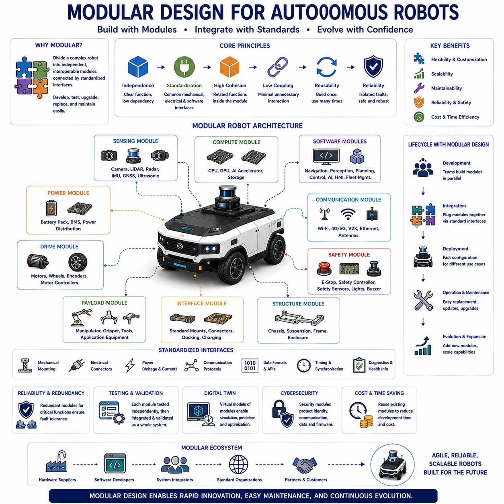
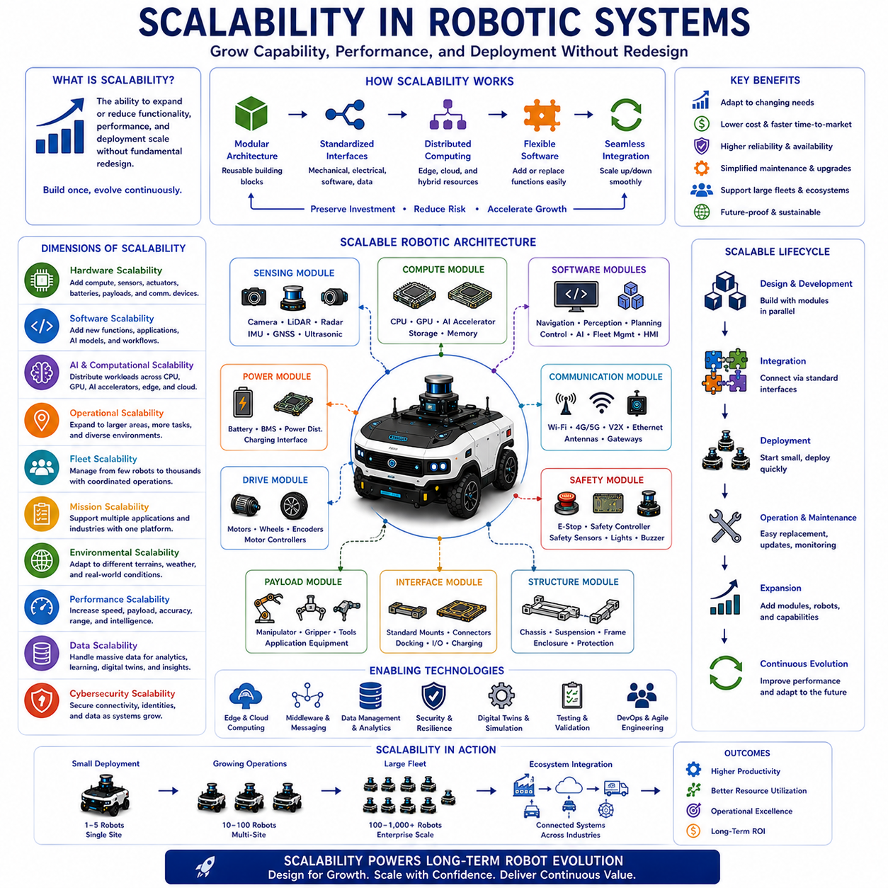
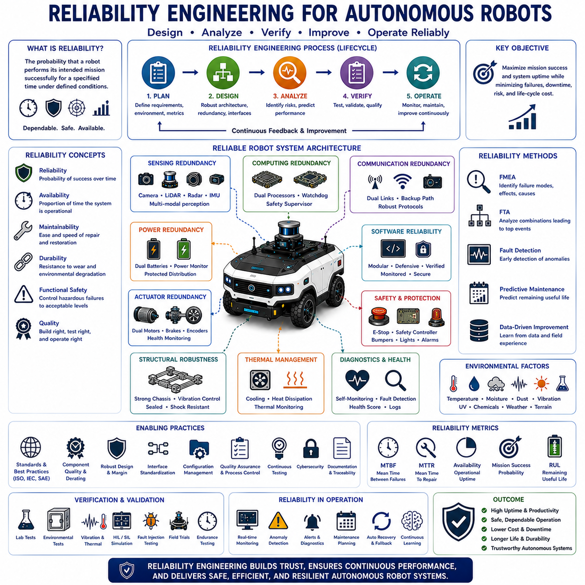
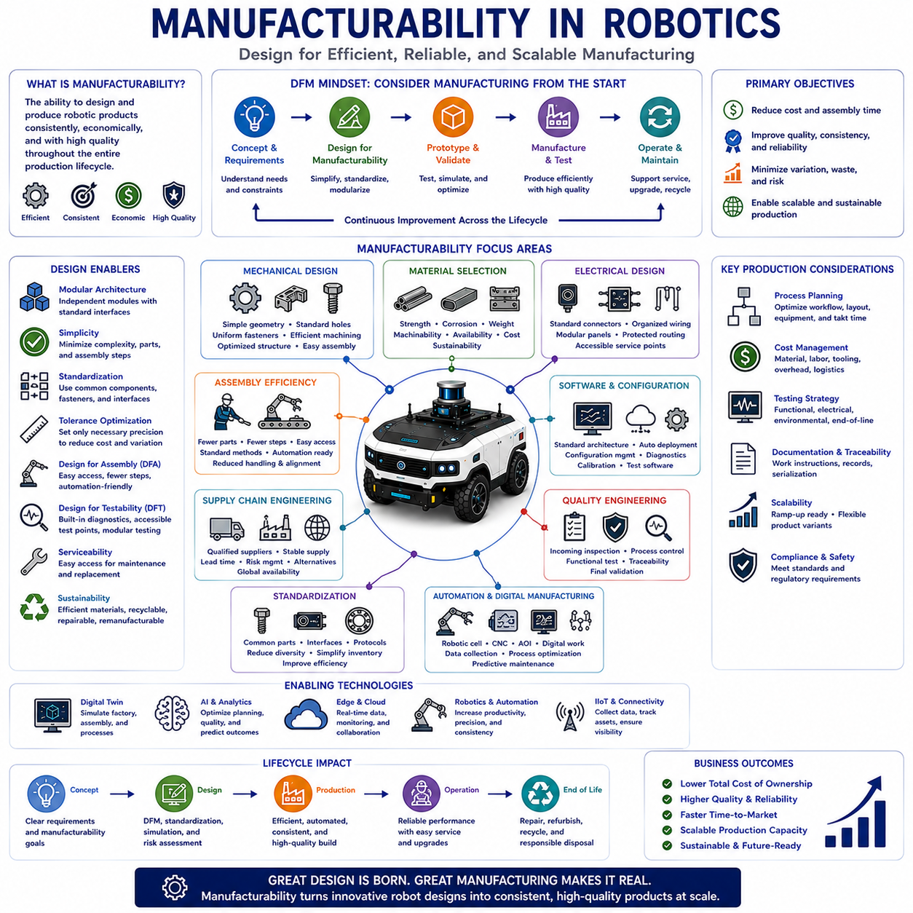
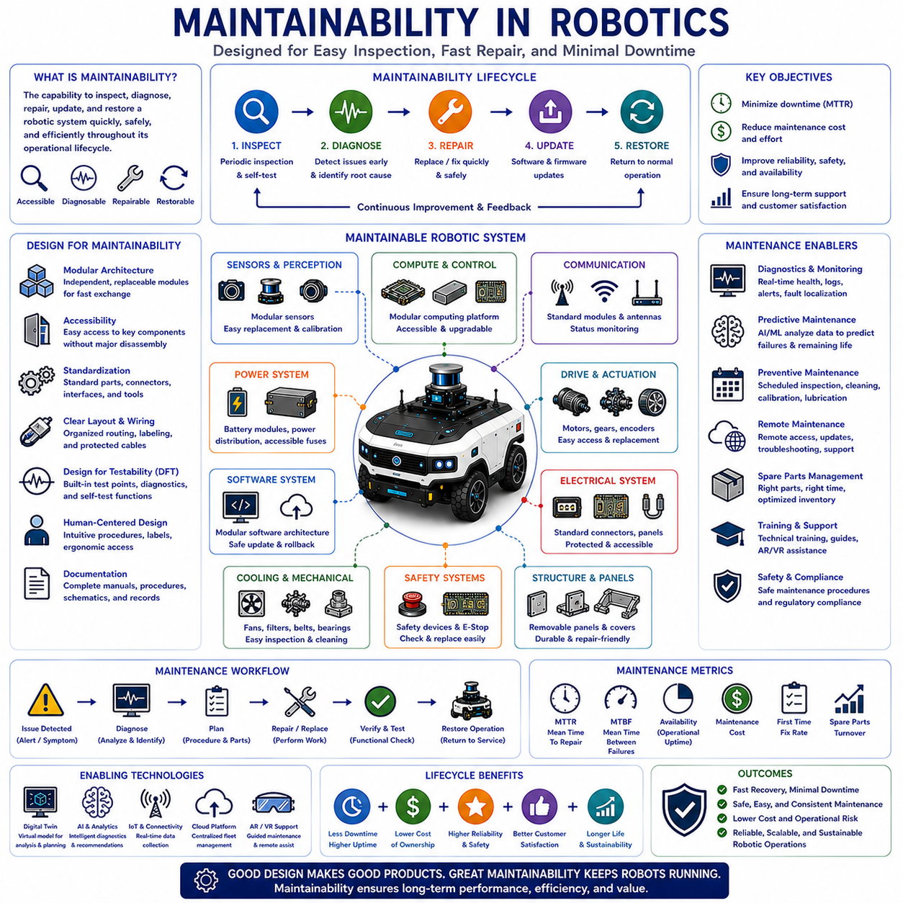

**Volume 01. AMR Foundations and System Architecture**


# 09. AMR Design Principles · AMR 설계 원칙

##  

## 09.01 Modular Design · 모듈러 설계

{width="7.268055555555556in" height="7.268055555555556in"}

Modular design is a systematic engineering approach that divides a complex robotic system into independent yet interoperable functional units called modules. Each module performs a well-defined responsibility while communicating with other modules through standardized mechanical, electrical, and software interfaces. Rather than developing an autonomous robot as a single integrated structure, modular design enables engineers to construct systems from reusable building blocks that can be independently developed, tested, upgraded, replaced, and maintained. This philosophy has become one of the fundamental architectural principles supporting modern Autonomous Mobile Robots, Physical AI systems, industrial automation platforms, and intelligent robotic ecosystems because it improves flexibility, scalability, reliability, and long-term sustainability throughout the product lifecycle.

The primary objective of modular design is to reduce system complexity while improving engineering efficiency. Large robotic systems often involve mechanical structures, power electronics, sensing devices, computing platforms, communication networks, navigation software, artificial intelligence, and application-specific tools that evolve at different rates. Modular architecture isolates these engineering domains so that improvements or modifications within one subsystem have minimal impact on others. Consequently, development teams can work simultaneously on independent modules while reducing integration risks, shortening development cycles, and improving overall product quality.

A well-designed module possesses several important characteristics. It performs a clearly defined function, minimizes dependencies on other modules, exposes standardized interfaces, hides internal implementation details, and can operate predictably within the overall system architecture. High cohesion within each module ensures that related functions remain closely connected, while low coupling between modules minimizes unnecessary interactions. These software engineering principles equally apply to mechanical assemblies, electrical hardware, communication networks, and artificial intelligence components, allowing complex robotic systems to evolve without requiring complete architectural redesign.

Mechanical modularity forms the physical foundation of many autonomous robotic platforms. The chassis, suspension, steering system, drive units, battery pack, sensor mast, robotic manipulator, payload interface, charging connector, and protective enclosure may each exist as independent mechanical modules connected through standardized mounting interfaces. Such architecture allows manufacturers to develop multiple robot variants using common structural components while adapting payload capacity, mobility characteristics, sensing capability, or application equipment according to customer requirements. Mechanical modularity significantly reduces manufacturing cost while improving maintenance efficiency and product customization.

Electrical modularity separates power distribution, motor control, battery management, sensor interfaces, communication electronics, computing hardware, and safety circuitry into independently replaceable functional units. Standardized electrical connectors, voltage specifications, communication protocols, grounding schemes, and diagnostic interfaces simplify hardware integration while supporting future expansion. When individual electronic modules become obsolete or require technological improvement, replacement can occur without redesigning the entire electrical architecture. This approach significantly extends product lifetime while reducing maintenance complexity and inventory requirements.

Software modularity represents one of the most influential aspects of modern robotic architecture. Navigation, localization, perception, mapping, motion planning, obstacle avoidance, mission management, diagnostics, fleet management, human-machine interfaces, cybersecurity, and artificial intelligence each operate as independent software modules communicating through standardized application programming interfaces and middleware. Software modularity enables individual functions to evolve independently while preserving compatibility across the complete robotic platform. Frameworks such as the Robot Operating System demonstrate how modular software architecture accelerates robotic research, commercial development, and long-term maintainability.

Artificial intelligence has further expanded the importance of modular software architecture. Modern AI systems frequently separate sensor preprocessing, feature extraction, object detection, semantic segmentation, localization, world modeling, trajectory prediction, decision making, language understanding, and multimodal reasoning into specialized computational modules. Foundation Models introduce even greater modularity by providing generalized reasoning capabilities that can support multiple downstream applications without requiring task-specific model redesign. AI modularization enables computational resources to be allocated efficiently while simplifying validation, optimization, and continuous model improvement.

Interface standardization represents the essential mechanism enabling modular design. Mechanical dimensions, electrical connections, communication protocols, data formats, software interfaces, timing requirements, synchronization methods, and diagnostic procedures must all remain clearly defined and consistently implemented. Standardized interfaces allow independently developed modules to operate together without requiring knowledge of each other\'s internal implementation. Well-defined interface specifications therefore reduce integration complexity while supporting interoperability among hardware from different manufacturers and software developed by separate engineering teams.

Communication middleware plays an important role in modular robotic systems because distributed modules continuously exchange information throughout autonomous operation. Sensor measurements, localization estimates, environmental maps, mission commands, diagnostic information, actuator requests, safety notifications, and artificial intelligence results flow across standardized communication frameworks connecting independently executing software components. Middleware abstracts low-level communication details while providing message routing, synchronization, service discovery, quality-of-service management, fault detection, and distributed execution support across heterogeneous computing platforms.

Scalability naturally emerges from modular architecture because additional functionality can be incorporated by introducing new modules rather than redesigning existing ones. A basic autonomous mobile platform may initially include navigation, localization, and obstacle avoidance. Future expansion may integrate robotic manipulation, visual inspection, warehouse automation, predictive maintenance, conversational artificial intelligence, or collaborative fleet coordination simply by adding compatible functional modules. Scalable architecture therefore supports gradual capability growth while protecting existing engineering investment and minimizing redevelopment effort.

Maintainability improves substantially through modular design because faults can be isolated within specific components rather than requiring investigation of the complete system. Diagnostic procedures identify malfunctioning modules while replacement occurs without extensive disassembly or software modification. Preventive maintenance, firmware updates, hardware upgrades, sensor calibration, battery replacement, and subsystem testing become more efficient because individual modules remain independently accessible. Reduced maintenance time directly increases system availability while lowering operational cost throughout the robot\'s deployment lifecycle.

Reliability also benefits from modular architecture because independent modules simplify fault isolation, redundancy implementation, and failure recovery. Critical functions such as safety supervision, emergency stopping, localization, communication, or power management may employ redundant modules operating independently while continuously monitoring one another. When one module experiences abnormal behavior, redundant components maintain essential functionality while initiating diagnostic procedures or graceful degradation. Modular redundancy therefore significantly improves system resilience without unnecessarily increasing overall architectural complexity.

Product family development becomes considerably more efficient through modular engineering. Manufacturers frequently construct multiple robot models using common modules while varying only selected components according to payload capacity, environmental requirements, operational speed, battery size, sensor configuration, or application equipment. Shared modules reduce engineering duplication, simplify manufacturing, accelerate certification, and improve spare part management across entire product portfolios. Customers likewise benefit because familiar maintenance procedures, compatible software, and interchangeable components remain consistent throughout multiple generations of robotic products.

Digital twins increasingly leverage modular design by representing each physical subsystem as an independent virtual model synchronized with its real-world counterpart. Mechanical wear, battery condition, thermal behavior, sensor health, computational performance, communication quality, and mission execution can each be simulated independently before integrating into comprehensive system-level analysis. Modular digital twins enable engineers to predict maintenance requirements, evaluate upgrades, validate software changes, optimize operational strategies, and investigate failures with significantly greater accuracy than monolithic simulation approaches.

Cybersecurity similarly benefits from modular architecture because security mechanisms can be distributed throughout multiple independent layers rather than centralized within a single protection system. Authentication, encryption, secure communication, access control, software integrity verification, intrusion detection, and hardware security modules operate independently while collectively protecting the complete robotic platform. Security updates affecting one module need not disrupt unrelated system functionality, thereby reducing operational downtime while maintaining consistent protection against evolving cyber threats.

Verification and validation become more manageable within modular systems because each module can undergo independent testing before system-level integration. Unit testing verifies individual functionality, integration testing confirms interface compatibility, subsystem testing evaluates coordinated operation, and complete system validation demonstrates overall mission performance. Fault injection, hardware-in-the-loop simulation, software-in-the-loop evaluation, digital twins, and field testing collectively ensure that each module satisfies predefined functional and safety requirements before deployment. Modular testing significantly reduces debugging complexity while improving engineering confidence throughout development.

Future modular robotic architectures will evolve toward highly distributed ecosystems integrating standardized hardware modules, service-oriented software, edge computing, cloud intelligence, Foundation Models, collaborative perception, digital twins, autonomous fleets, and continuously learning artificial intelligence. Rather than designing each robotic platform independently, future engineering will increasingly assemble intelligent systems from reusable modules capable of adapting across multiple industries and applications. As Physical AI expands into manufacturing, logistics, agriculture, healthcare, construction, public infrastructure, and autonomous transportation, modular design will remain one of the most important architectural principles supporting rapid innovation, scalable deployment, efficient maintenance, and sustainable long-term technological evolution.

모듈형 설계(Modular Design)는 복잡한 로봇 시스템을 모듈(Module)이라 불리는 독립적이면서도 상호 운용 가능한 기능 단위로 분할하는 체계적인 엔지니어링 접근 방식이다. 각각의 모듈은 명확하게 정의된 역할을 수행하며, 표준화된 기계(Mechanical), 전기(Electrical), 소프트웨어(Software) 인터페이스를 통해 다른 모듈과 통신한다. 자율로봇을 하나의 거대한 통합 구조로 개발하는 대신, 모듈형 설계는 독립적으로 개발, 시험, 업그레이드, 교체 및 유지보수가 가능한 재사용 가능한 구성 요소(Building Block)를 조합하여 시스템을 구축할 수 있도록 한다. 이러한 설계 철학은 유연성(Flexibility), 확장성(Scalability), 신뢰성(Reliability), 장기적인 지속 가능성(Long-term Sustainability)을 향상시키므로 현대의 자율이동로봇(Autonomous Mobile Robot, AMR), 물리적 인공지능(Physical AI), 산업 자동화 플랫폼(Industrial Automation Platform), 지능형 로봇 생태계(Intelligent Robotic Ecosystem)를 구성하는 가장 중요한 아키텍처 원칙 가운데 하나가 되었다.

모듈형 설계의 가장 중요한 목적은 시스템의 복잡성을 줄이면서 엔지니어링 효율성을 향상시키는 것이다. 대규모 로봇 시스템은 기계 구조(Mechanical Structure), 전력 전자(Power Electronics), 센서 장치(Sensing Device), 컴퓨팅 플랫폼(Computing Platform), 통신 네트워크(Communication Network), 내비게이션 소프트웨어(Navigation Software), 인공지능, 응용 장비(Application-specific Tool) 등 서로 다른 속도로 발전하는 다양한 기술 분야로 구성된다. 모듈형 아키텍처는 이러한 기술 영역을 서로 분리하여 한 서브시스템의 개선이나 변경이 다른 부분에 미치는 영향을 최소화한다. 따라서 여러 개발 팀이 서로 독립적인 모듈을 동시에 개발할 수 있으며, 시스템 통합 위험을 줄이고 개발 기간을 단축하며 전체 제품의 품질을 향상시킬 수 있다.

우수한 모듈은 몇 가지 중요한 특성을 가진다. 하나의 모듈은 명확하게 정의된 기능을 수행하고, 다른 모듈에 대한 의존성을 최소화하며, 표준화된 인터페이스(Standardized Interface)를 제공하고, 내부 구현 세부 사항을 외부에 노출하지 않으며, 전체 시스템 아키텍처 안에서 예측 가능한 방식으로 동작해야 한다. 높은 응집도(High Cohesion)는 서로 관련된 기능을 하나의 모듈 안에 밀접하게 유지하며, 낮은 결합도(Low Coupling)는 모듈 간의 불필요한 상호 의존성을 최소화한다. 이러한 소프트웨어 공학 원칙은 기계 구조, 전기 하드웨어, 통신 네트워크, 인공지능 구성 요소에도 동일하게 적용되어 복잡한 로봇 시스템이 전체 아키텍처를 다시 설계하지 않고도 지속적으로 발전할 수 있도록 한다.

기계적 모듈화(Mechanical Modularity)는 많은 자율로봇 플랫폼의 물리적인 기반을 형성한다. 섀시(Chassis), 서스펜션(Suspension), 조향 시스템(Steering System), 구동 장치(Drive Unit), 배터리 팩(Battery Pack), 센서 마스트(Sensor Mast), 로봇 매니퓰레이터(Robotic Manipulator), 페이로드 인터페이스(Payload Interface), 충전 커넥터(Charging Connector), 보호 외함(Protective Enclosure)은 각각 독립적인 기계 모듈로 설계될 수 있으며 표준 장착 인터페이스(Standardized Mounting Interface)를 통해 연결된다. 이러한 구조는 제조사가 동일한 기본 부품을 이용하여 다양한 로봇 모델을 제작할 수 있도록 하며, 고객 요구에 따라 적재 능력(Payload Capacity), 이동 성능(Mobility Characteristic), 센서 구성(Sensing Capability), 응용 장비를 유연하게 변경할 수 있도록 한다. 기계적 모듈화는 제조 비용을 절감하는 동시에 유지보수 효율성과 제품 맞춤화(Product Customization)를 크게 향상시킨다.

전기적 모듈화(Electrical Modularity)는 전력 분배(Power Distribution), 모터 제어(Motor Control), 배터리 관리(Battery Management), 센서 인터페이스(Sensor Interface), 통신 전자장치(Communication Electronics), 컴퓨팅 하드웨어(Computing Hardware), 안전 회로(Safety Circuit)를 독립적으로 교체 가능한 기능 단위로 분리한다. 표준화된 전기 커넥터(Electrical Connector), 전압 규격(Voltage Specification), 통신 프로토콜(Communication Protocol), 접지 방식(Grounding Scheme), 진단 인터페이스(Diagnostic Interface)는 하드웨어 통합을 단순화하고 향후 시스템 확장을 지원한다. 개별 전자 모듈이 노후화되거나 새로운 기술로 교체되어야 하는 경우에도 전체 전기 아키텍처를 다시 설계할 필요 없이 해당 모듈만 교체할 수 있다. 이러한 접근 방식은 제품의 수명을 연장하고 유지보수 복잡성과 부품 재고 관리 비용을 감소시킨다.

소프트웨어 모듈화(Software Modularity)는 현대 로봇 아키텍처에서 가장 중요한 요소 가운데 하나이다. 내비게이션(Navigation), 위치 추정(Localization), 인지(Perception), 지도 작성(Mapping), 운동 계획(Motion Planning), 장애물 회피(Obstacle Avoidance), 임무 관리(Mission Management), 진단(Diagnostics), 플릿 관리(Fleet Management), 인간-기계 인터페이스(Human-Machine Interface), 사이버보안(Cybersecurity), 인공지능은 각각 독립적인 소프트웨어 모듈로 구성되며, 응용 프로그램 인터페이스(Application Programming Interface, API)와 미들웨어(Middleware)를 통해 서로 통신한다. 이러한 소프트웨어 모듈화는 각 기능이 독립적으로 발전하면서도 전체 플랫폼과의 호환성을 유지할 수 있도록 한다. 로봇 운영 체제(Robot Operating System, ROS)와 같은 프레임워크는 모듈형 소프트웨어 구조가 로봇 연구와 상용 개발, 장기 유지보수를 얼마나 효과적으로 지원하는지를 보여주는 대표적인 사례이다.

인공지능(AI)의 발전은 소프트웨어 모듈화의 중요성을 더욱 확대하였다. 현대 AI 시스템은 센서 전처리(Sensor Preprocessing), 특징 추출(Feature Extraction), 객체 검출(Object Detection), 의미 분할(Semantic Segmentation), 위치 추정, 세계 모델(World Model), 경로 예측(Trajectory Prediction), 의사결정(Decision Making), 언어 이해(Language Understanding), 다중모달 추론(Multimodal Reasoning)을 각각 전문화된 계산 모듈로 분리하여 구성한다. 또한 파운데이션 모델(Foundation Model)은 일반화된 추론 능력을 제공함으로써 개별 작업마다 새로운 AI 모델을 개발하지 않고도 다양한 응용 분야를 지원할 수 있게 한다. 이러한 AI 모듈화는 계산 자원을 효율적으로 활용할 수 있도록 하며 검증, 최적화, 지속적인 모델 개선을 더욱 쉽게 수행할 수 있도록 한다.

인터페이스 표준화(Interface Standardization)는 모듈형 설계를 가능하게 하는 핵심 요소이다. 기계 치수(Mechanical Dimension), 전기 연결(Electrical Connection), 통신 프로토콜, 데이터 형식(Data Format), 소프트웨어 인터페이스, 타이밍 요구사항(Timing Requirement), 동기화 방법(Synchronization Method), 진단 절차(Diagnostic Procedure)는 모두 명확하게 정의되고 일관성 있게 구현되어야 한다. 표준화된 인터페이스를 사용하면 서로 독립적으로 개발된 모듈이 내부 구현을 알지 못하더라도 함께 동작할 수 있다. 따라서 잘 정의된 인터페이스 규격은 시스템 통합의 복잡성을 줄이고 서로 다른 제조사의 하드웨어와 다양한 개발 조직의 소프트웨어 간 상호 운용성(Interoperability)을 보장한다.

통신 미들웨어(Communication Middleware)는 분산된 모듈이 자율 운용 중 지속적으로 정보를 교환하기 때문에 모듈형 로봇 시스템에서 중요한 역할을 한다. 센서 데이터(Sensor Measurement), 위치 추정 결과(Localization Estimate), 환경 지도(Environmental Map), 임무 명령(Mission Command), 진단 정보(Diagnostic Information), 액추에이터 제어 요청(Actuator Request), 안전 알림(Safety Notification), 인공지능 결과(AI Result)는 독립적으로 실행되는 소프트웨어 모듈 사이에서 지속적으로 교환된다. 미들웨어는 저수준 통신 세부 사항을 추상화(Abstract)하여 메시지 전달(Message Routing), 동기화(Synchronization), 서비스 탐색(Service Discovery), 서비스 품질 관리(Quality of Service, QoS), 고장 탐지(Fault Detection), 분산 실행(Distributed Execution)을 지원한다.

확장성(Scalability)은 모듈형 아키텍처가 제공하는 가장 큰 장점 가운데 하나이다. 새로운 기능을 추가하기 위해 기존 시스템 전체를 다시 설계할 필요 없이 새로운 모듈만 추가하면 된다. 기본적인 자율이동 플랫폼은 처음에는 내비게이션, 위치 추정, 장애물 회피 기능만 포함할 수 있지만 이후 로봇 매니퓰레이션(Robotic Manipulation), 비전 검사(Visual Inspection), 창고 자동화(Warehouse Automation), 예지보전(Predictive Maintenance), 대화형 인공지능(Conversational AI), 협력 플릿 관리(Collaborative Fleet Coordination)를 새로운 모듈로 쉽게 추가할 수 있다. 이러한 확장 가능한 구조는 기존의 개발 자산을 보호하면서도 점진적인 기능 확장을 가능하게 한다.

유지보수성(Maintainability)은 모듈형 설계를 통해 크게 향상된다. 고장이 발생하면 전체 시스템을 분석할 필요 없이 특정 모듈만 진단하면 되며, 해당 모듈만 쉽게 교체할 수 있다. 예방 정비(Preventive Maintenance), 펌웨어 업데이트(Firmware Update), 하드웨어 업그레이드(Hardware Upgrade), 센서 보정(Sensor Calibration), 배터리 교체(Battery Replacement), 서브시스템 시험(Subsystem Testing)도 각각의 모듈 단위로 수행할 수 있으므로 유지보수 시간이 크게 감소한다. 이러한 구조는 시스템 가동률(System Availability)을 높이고 전체 운용 비용을 절감하는 데 크게 기여한다.

신뢰성(Reliability) 또한 모듈형 아키텍처를 통해 크게 향상된다. 독립적인 모듈은 고장 위치를 쉽게 분리할 수 있으며 중복 구조(Redundancy)를 구현하기에도 유리하다. 안전 감독(Safety Supervision), 비상 정지(Emergency Stopping), 위치 추정, 통신, 전력 관리(Power Management)와 같은 핵심 기능은 서로 독립적인 중복 모듈을 통해 상호 감시할 수 있다. 하나의 모듈에서 이상이 발생하면 다른 모듈이 핵심 기능을 유지하면서 진단 절차를 수행하거나 점진적 성능 저하(Graceful Degradation)를 실행한다. 이러한 모듈형 중복 구조는 전체 시스템의 복잡성을 크게 증가시키지 않으면서도 높은 회복력(System Resilience)을 제공한다.

제품군(Product Family)의 개발은 모듈형 설계를 통해 매우 효율적으로 수행될 수 있다. 제조사는 동일한 공통 모듈(Common Module)을 사용하면서 적재 능력, 운용 환경, 최고 속도, 배터리 용량, 센서 구성, 응용 장비만 변경하여 다양한 로봇 모델을 제작할 수 있다. 공통 모듈은 중복 개발을 줄이고 제조를 단순화하며 인증(Certification)을 가속화하고 예비 부품 관리(Spare Part Management)를 효율적으로 만든다. 고객 또한 여러 세대의 제품에서 동일한 유지보수 절차와 호환 가능한 소프트웨어, 상호 교환 가능한 부품을 사용할 수 있다는 장점을 얻는다.

디지털 트윈(Digital Twin)은 모듈형 설계를 적극적으로 활용하는 대표적인 기술이다. 기계 마모(Mechanical Wear), 배터리 상태(Battery Condition), 열 특성(Thermal Behavior), 센서 상태(Sensor Health), 계산 성능(Computational Performance), 통신 품질(Communication Quality), 임무 수행(Mission Execution)은 각각 독립적인 가상 모델(Virtual Model)로 표현되며 실제 시스템과 지속적으로 동기화된다. 이러한 모듈형 디지털 트윈은 시스템 전체를 통합하기 전에 각 서브시스템을 개별적으로 분석할 수 있도록 하여 유지보수 시기 예측, 업그레이드 평가, 소프트웨어 변경 검증, 운용 전략 최적화, 고장 분석을 더욱 정확하게 수행할 수 있게 한다.

사이버보안(Cybersecurity) 역시 모듈형 아키텍처의 이점을 크게 활용한다. 인증(Authentication), 암호화(Encryption), 보안 통신(Secure Communication), 접근 제어(Access Control), 소프트웨어 무결성 검증(Software Integrity Verification), 침입 탐지(Intrusion Detection), 하드웨어 보안 모듈(Hardware Security Module)은 각각 독립적인 계층으로 동작하면서 전체 로봇 플랫폼을 보호한다. 특정 보안 모듈의 업데이트는 다른 기능에 영향을 주지 않으므로 시스템의 운용 중단 시간을 줄이면서도 새로운 보안 위협에 신속하게 대응할 수 있다.

검증(Verification)과 확인(Validation)은 모듈형 시스템에서 훨씬 효율적으로 수행된다. 각각의 모듈은 먼저 단위 시험(Unit Testing)을 통해 기능을 검증하고, 이후 통합 시험(Integration Testing)을 통해 인터페이스 호환성을 확인하며, 서브시스템 시험(Subsystem Testing)과 전체 시스템 확인(System Validation)을 통해 최종적인 임무 수행 능력을 평가한다. 결함 주입(Fault Injection), 하드웨어-인-더-루프(Hardware-in-the-Loop, HIL), 소프트웨어-인-더-루프(Software-in-the-Loop, SIL), 디지털 트윈, 현장 시험(Field Testing)은 각각의 모듈이 정의된 기능과 안전 요구사항을 만족하는지를 체계적으로 검증한다. 이러한 모듈 기반 시험은 디버깅(Debugging)의 복잡성을 줄이고 개발 과정 전체에서 엔지니어의 신뢰성을 높여준다.

미래의 모듈형 로봇 아키텍처(Modular Robotic Architecture)는 표준화된 하드웨어 모듈(Standardized Hardware Module), 서비스 지향 소프트웨어(Service-oriented Software), 엣지 컴퓨팅(Edge Computing), 클라우드 지능(Cloud Intelligence), 파운데이션 모델(Foundation Model), 협력 인지(Collaborative Perception), 디지털 트윈, 자율 플릿(Autonomous Fleet), 지속적으로 학습하는 인공지능(Continuously Learning AI)을 통합하는 고도로 분산된 생태계(Highly Distributed Ecosystem)로 발전할 것이다. 미래에는 각각의 로봇을 처음부터 새롭게 설계하는 대신 다양한 산업과 응용 분야에서 재사용 가능한 지능형 모듈을 조합하여 새로운 시스템을 구축하는 방식이 일반화될 것이다. 물리적 인공지능이 제조(Manufacturing), 물류(Logistics), 농업(Agriculture), 의료(Healthcare), 건설(Construction), 사회기반시설(Public Infrastructure), 자율 운송(Autonomous Transportation)으로 더욱 확대됨에 따라 모듈형 설계는 빠른 혁신(Rapid Innovation), 대규모 확장(Scalable Deployment), 효율적인 유지보수(Efficient Maintenance), 지속 가능한 장기 기술 발전(Sustainable Long-term Technological Evolution)을 가능하게 하는 가장 중요한 아키텍처 원칙으로 계속 자리매김할 것이다.

##  

## 09.02 Scalability · 확장성

{width="7.268055555555556in" height="7.268055555555556in"}

Scalability is the architectural capability that enables a robotic system to increase or decrease its functionality, computational capacity, operational coverage, performance, and deployment scale without requiring fundamental redesign of the underlying architecture. Rather than developing separate robotic platforms for every application or performance requirement, scalable systems are intentionally designed to evolve through modular expansion, standardized interfaces, distributed computing, and flexible software architectures. Scalability allows Autonomous Mobile Robots, Physical AI platforms, and intelligent robotic ecosystems to adapt efficiently to changing customer requirements, technological advances, operational complexity, and business growth throughout the entire product lifecycle. As autonomous systems become increasingly integrated into large industrial infrastructures, scalability has become one of the defining characteristics of successful robotic architectures.

The primary objective of scalability is to preserve engineering investment while supporting continuous growth. Robotic platforms should accommodate increasing computational demand, additional sensors, larger operational environments, expanded software functionality, and growing robot fleets without requiring complete redevelopment. Instead of replacing existing systems whenever new capabilities become necessary, scalable architecture allows incremental enhancement through carefully designed extension mechanisms. This engineering philosophy reduces development cost, shortens deployment time, minimizes technical risk, and enables organizations to respond rapidly to evolving operational requirements.

Scalability exists in multiple dimensions rather than representing a single engineering characteristic. Hardware scalability addresses physical expansion through additional computing units, sensors, actuators, batteries, payload modules, and communication devices. Software scalability enables new functional capabilities, application services, artificial intelligence models, and operational workflows. Computational scalability supports increasing processing requirements through distributed computing and heterogeneous hardware acceleration. Operational scalability extends autonomous behavior across larger facilities, more complex environments, and increasing mission diversity. Organizational scalability supports collaboration among expanding engineering teams while preserving architectural consistency and long-term maintainability.

Hardware scalability forms the physical foundation supporting long-term robotic evolution. Modular chassis architectures permit multiple payload capacities using common structural components. Computing platforms accommodate additional graphics processors, AI accelerators, storage devices, memory modules, and communication interfaces through standardized expansion mechanisms. Sensor systems support new cameras, LiDAR units, radar modules, ultrasonic sensors, environmental monitoring devices, and specialized industrial instrumentation without fundamentally altering the overall system architecture. Such flexibility enables manufacturers to construct diverse product families while maximizing component reuse and minimizing engineering duplication.

Software scalability has become increasingly important as robotic functionality continues expanding beyond traditional navigation and automation tasks. Well-designed software architectures separate perception, localization, mapping, planning, control, diagnostics, cybersecurity, fleet management, digital twins, artificial intelligence, and application-specific functions into independently deployable services communicating through standardized interfaces. New software modules can therefore be introduced without modifying existing functional components, allowing continuous capability growth while preserving software stability. Service-oriented architecture and microservice principles have become widely adopted because they naturally support scalable robotic software ecosystems.

Artificial intelligence introduces unique scalability requirements because computational demand grows rapidly as robotic intelligence becomes more sophisticated. Deep neural networks, multimodal perception, semantic understanding, language models, world models, and Foundation Models require substantial processing resources that frequently exceed the capabilities of conventional embedded systems. Scalable AI architectures therefore distribute computation across CPUs, GPUs, AI accelerators, edge devices, and cloud platforms while dynamically allocating workloads according to latency, bandwidth, energy consumption, and operational priorities. This flexible computational architecture allows robotic intelligence to expand without unnecessary hardware replacement.

Edge computing and cloud computing collectively provide an effective framework supporting computational scalability. Time-critical functions including motor control, obstacle avoidance, localization, and emergency safety remain within low-latency onboard computing systems, while computationally intensive tasks such as large-scale mapping, fleet optimization, historical analytics, predictive maintenance, model training, and knowledge management execute within cloud infrastructure. Dynamic workload distribution continuously balances computational efficiency, communication availability, operational responsiveness, and system reliability. Hybrid edge-cloud architectures therefore enable robotic systems to utilize virtually unlimited computational resources while preserving deterministic real-time behavior.

Communication scalability enables increasing numbers of distributed robotic components to exchange information efficiently without degrading overall system performance. Modern robotic platforms employ high-speed Ethernet, wireless communication, middleware frameworks, publish-subscribe messaging, quality-of-service management, and distributed synchronization mechanisms supporting thousands of concurrent information exchanges among sensors, controllers, artificial intelligence modules, cloud services, and fleet management systems. Scalable communication architecture minimizes bandwidth congestion while ensuring reliable information delivery across increasingly complex autonomous ecosystems.

Fleet scalability represents one of the most important requirements for industrial autonomous mobile robotics. Initial deployments may consist of only a few robots operating independently within limited facilities. As operational demand increases, organizations frequently expand toward dozens, hundreds, or even thousands of coordinated autonomous platforms sharing maps, tasks, charging infrastructure, communication resources, and mission priorities. Scalable fleet management coordinates traffic, workload balancing, charging schedules, maintenance planning, software updates, resource allocation, and collaborative task execution while maintaining overall operational efficiency despite continuously increasing system complexity.

Mission scalability allows robotic systems to perform increasingly diverse operational tasks without architectural redesign. Early deployments often focus on simple transportation or inspection missions. As organizations gain operational experience, additional applications including inventory management, environmental monitoring, predictive maintenance, security patrol, automated cleaning, agricultural operations, collaborative manipulation, construction inspection, and intelligent logistics can be integrated into the same autonomous platform. Mission scalability enables one robotic architecture to support multiple industries and continuously expanding application domains throughout its operational lifetime.

Environmental scalability addresses the robot\'s ability to operate safely and efficiently across increasingly diverse physical environments. Autonomous systems may initially function within structured warehouses before expanding toward factories, hospitals, airports, campuses, construction sites, ports, farms, mines, public roads, and mixed urban environments. Scalable environmental adaptation requires flexible localization strategies, multimodal perception, robust navigation algorithms, adaptive safety mechanisms, terrain awareness, weather resilience, and semantic environmental understanding capable of generalizing across diverse operational conditions.

Performance scalability enables robotic systems to satisfy progressively increasing operational requirements without compromising stability or safety. Increased sensor resolution, higher navigation speed, larger payload capacity, improved localization accuracy, expanded perception range, more sophisticated artificial intelligence, and higher communication throughput all require proportional growth in computational capability and system architecture. Performance scalability therefore balances processing power, energy consumption, thermal management, communication bandwidth, and software optimization while maintaining deterministic real-time behavior essential for autonomous safety.

Data scalability has become increasingly important as autonomous robots continuously generate massive volumes of sensor information, operational logs, artificial intelligence outputs, environmental maps, diagnostic records, and maintenance history. Efficient storage architectures organize structured and unstructured data while supporting rapid retrieval, distributed synchronization, compression, indexing, security, and long-term archival. Scalable data infrastructure enables continuous learning, operational analytics, digital twins, predictive maintenance, and fleet-wide optimization without overwhelming computational or storage resources.

Cybersecurity scalability ensures that expanding robotic ecosystems remain protected despite increasing connectivity, computational distribution, and organizational complexity. Authentication services, encrypted communication, certificate management, access control, intrusion detection, software integrity verification, security monitoring, and threat response mechanisms must all scale proportionally with system growth. Rather than introducing centralized security bottlenecks, distributed security architectures protect independent subsystems while maintaining coordinated defense across entire robotic infrastructures.

Reliability and fault tolerance become increasingly important as scalable systems expand in size and complexity. Larger robotic ecosystems naturally contain more potential failure points, making redundancy, graceful degradation, fault isolation, self-diagnostics, predictive maintenance, automatic recovery, and distributed supervision essential architectural features. Scalable systems should maintain acceptable operational performance despite localized hardware failures, communication interruptions, sensor degradation, software anomalies, or computational overload. Robust fault management therefore enables scalability without sacrificing dependability.

Verification and validation become progressively more challenging as scalability increases because engineers must demonstrate correct operation across vastly expanded combinations of hardware configurations, software modules, environmental conditions, operational scenarios, and fleet interactions. Hierarchical testing strategies evaluate individual modules, integrated subsystems, complete robotic platforms, multi-robot coordination, cloud services, cybersecurity mechanisms, and large-scale operational workflows independently before validating complete system behavior. Simulation, digital twins, hardware-in-the-loop evaluation, software-in-the-loop testing, stress testing, scalability benchmarking, and field deployment collectively verify that system performance remains predictable as operational scale increases.

Business scalability represents an equally important consideration because engineering architecture directly influences manufacturing efficiency, product customization, maintenance cost, customer support, software distribution, certification, regulatory compliance, and long-term product evolution. A scalable product architecture enables manufacturers to introduce new product variants rapidly, enter additional markets, reduce inventory complexity, simplify spare part logistics, accelerate software deployment, and support expanding customer bases without proportionally increasing engineering effort. Technical scalability therefore becomes a strategic business advantage supporting sustainable commercial growth.

Future scalability in autonomous robotics will increasingly depend upon modular hardware ecosystems, distributed artificial intelligence, Foundation Models, collaborative fleets, cloud-native software, digital twins, standardized interfaces, edge-cloud orchestration, autonomous infrastructure, and continuously learning systems. Rather than viewing scalability as merely increasing system size, future robotic architectures will treat scalability as the ability to adapt intelligently across diverse applications, industries, operational environments, and technological generations. As Physical AI continues expanding throughout manufacturing, logistics, healthcare, agriculture, construction, transportation, and public infrastructure, scalable architecture will remain one of the essential engineering principles enabling intelligent robotic systems to evolve efficiently while preserving reliability, safety, interoperability, and long-term sustainability.

확장성(Scalability)은 로봇 시스템이 기본 아키텍처를 근본적으로 다시 설계하지 않고도 기능(Functionality), 계산 성능(Computational Capacity), 운용 범위(Operational Coverage), 성능(Performance), 배치 규모(Deployment Scale)를 확대하거나 축소할 수 있도록 하는 아키텍처적 능력이다. 각각의 응용 분야나 성능 요구사항마다 별도의 로봇 플랫폼을 개발하는 대신, 확장 가능한 시스템은 모듈형 확장(Modular Expansion), 표준화된 인터페이스(Standardized Interface), 분산 컴퓨팅(Distributed Computing), 유연한 소프트웨어 아키텍처(Flexible Software Architecture)를 기반으로 지속적으로 발전할 수 있도록 설계된다. 이러한 확장성은 자율이동로봇(Autonomous Mobile Robot, AMR), 물리적 인공지능(Physical AI) 플랫폼, 지능형 로봇 생태계(Intelligent Robotic Ecosystem)가 고객 요구사항, 기술 발전, 운용 복잡성, 사업 성장에 효율적으로 대응할 수 있도록 지원하며 제품의 전체 생애주기(Product Lifecycle) 동안 지속적인 진화를 가능하게 한다. 자율 시스템이 대규모 산업 인프라에 점점 더 많이 적용됨에 따라 확장성은 성공적인 로봇 아키텍처를 결정하는 핵심 요소가 되었다.

확장성의 가장 중요한 목적은 기존의 엔지니어링 투자(Engineering Investment)를 보호하면서 지속적인 시스템 성장을 지원하는 것이다. 로봇 플랫폼은 계산 요구사항 증가, 추가 센서, 더 넓은 운용 환경, 새로운 소프트웨어 기능, 증가하는 로봇 플릿(Fleet)을 전체 시스템을 다시 개발하지 않고도 수용할 수 있어야 한다. 새로운 기능이 필요할 때마다 기존 시스템을 교체하는 대신, 확장 가능한 아키텍처는 점진적인 기능 향상(Incremental Enhancement)을 가능하게 하는 구조를 제공한다. 이러한 엔지니어링 철학은 개발 비용을 절감하고 구축 기간을 단축하며 기술적 위험을 줄이고 변화하는 운용 요구사항에 신속하게 대응할 수 있도록 한다.

확장성은 하나의 특성이 아니라 여러 차원의 능력으로 구성된다. 하드웨어 확장성(Hardware Scalability)은 추가 컴퓨팅 장치, 센서, 액추에이터(Actuator), 배터리, 페이로드 모듈(Payload Module), 통신 장치를 통해 물리적인 시스템 확장을 지원한다. 소프트웨어 확장성(Software Scalability)은 새로운 기능, 응용 서비스(Application Service), 인공지능 모델, 운용 절차(Operational Workflow)를 쉽게 추가할 수 있도록 한다. 계산 확장성(Computational Scalability)은 분산 컴퓨팅과 이기종 하드웨어 가속(Heterogeneous Hardware Acceleration)을 통해 증가하는 계산 요구사항을 처리한다. 운용 확장성(Operational Scalability)은 더 넓은 시설과 복잡한 환경, 다양한 임무를 지원하며, 조직 확장성(Organizational Scalability)은 개발 조직이 커지더라도 아키텍처의 일관성과 장기 유지보수성을 유지하도록 지원한다.

하드웨어 확장성은 장기적인 로봇 플랫폼 발전을 가능하게 하는 물리적 기반이다. 모듈형 섀시(Modular Chassis)는 동일한 기본 구조를 이용하여 다양한 적재 용량(Payload Capacity)을 지원할 수 있으며, 컴퓨팅 플랫폼은 그래픽 처리 장치(Graphics Processing Unit, GPU), 인공지능 가속기(AI Accelerator), 저장 장치(Storage Device), 메모리(Memory), 통신 인터페이스를 표준 확장 방식으로 추가할 수 있다. 센서 시스템 역시 카메라(Camera), 라이다(LiDAR), 레이더(Radar), 초음파 센서(Ultrasonic Sensor), 환경 감지 장치(Environmental Monitoring Device), 산업용 계측기(Specialized Industrial Instrumentation)를 자유롭게 추가할 수 있도록 설계된다. 이러한 유연성은 다양한 제품군(Product Family)을 구축하면서도 부품 재사용(Component Reuse)을 극대화하고 중복 개발을 최소화할 수 있도록 한다.

소프트웨어 확장성은 로봇의 기능이 기존의 내비게이션과 자동화를 넘어 지속적으로 확대됨에 따라 더욱 중요해지고 있다. 우수한 소프트웨어 아키텍처는 인지(Perception), 위치 추정(Localization), 지도 작성(Mapping), 경로 계획(Planning), 제어(Control), 진단(Diagnostics), 사이버보안(Cybersecurity), 플릿 관리(Fleet Management), 디지털 트윈(Digital Twin), 인공지능(AI), 응용 기능(Application-specific Function)을 독립적으로 배치 가능한 서비스(Deployable Service)로 분리하며 표준 인터페이스를 통해 서로 통신한다. 새로운 기능은 기존 시스템을 수정하지 않고도 독립적인 모듈(Module)로 추가할 수 있으므로 지속적인 기능 향상이 가능하다. 이러한 이유로 서비스 지향 아키텍처(Service-oriented Architecture, SOA)와 마이크로서비스(Microservice)는 확장 가능한 로봇 소프트웨어 구조에서 널리 활용되고 있다.

인공지능은 로봇의 지능 수준이 높아질수록 계산 요구사항이 급격히 증가하기 때문에 새로운 형태의 확장성을 요구한다. 심층신경망(Deep Neural Network), 다중모달 인지(Multimodal Perception), 의미 이해(Semantic Understanding), 언어 모델(Language Model), 세계 모델(World Model), 파운데이션 모델(Foundation Model)은 기존 임베디드 시스템만으로는 처리하기 어려운 수준의 계산 능력을 필요로 한다. 따라서 확장 가능한 AI 아키텍처는 중앙처리장치(Central Processing Unit, CPU), GPU, AI 가속기, 엣지 장치(Edge Device), 클라우드 플랫폼(Cloud Platform)에 계산 작업을 분산시키고, 지연 시간(Latency), 통신 대역폭(Bandwidth), 에너지 소비(Energy Consumption), 운용 우선순위에 따라 계산 부하를 동적으로 배분한다. 이러한 유연한 계산 구조는 불필요한 하드웨어 교체 없이도 AI 기능을 지속적으로 확장할 수 있도록 한다.

엣지 컴퓨팅(Edge Computing)과 클라우드 컴퓨팅(Cloud Computing)은 계산 확장성을 구현하는 대표적인 구조이다. 모터 제어(Motor Control), 장애물 회피(Obstacle Avoidance), 위치 추정, 비상 안전(Emergency Safety)과 같이 실시간 응답이 필요한 기능은 차량 내부의 저지연(Low-latency) 컴퓨팅 시스템에서 수행된다. 반면 대규모 지도 생성(Large-scale Mapping), 플릿 최적화(Fleet Optimization), 운용 분석(Operational Analytics), 예지보전(Predictive Maintenance), AI 모델 학습(Model Training), 지식 관리(Knowledge Management)는 클라우드 인프라에서 수행된다. 이러한 동적 작업 분배(Dynamic Workload Distribution)는 계산 효율성, 통신 상태, 응답성, 시스템 신뢰성을 균형 있게 유지하며 사실상 무제한의 계산 자원을 활용할 수 있도록 한다.

통신 확장성(Communication Scalability)은 분산된 로봇 구성 요소들이 성능 저하 없이 효율적으로 정보를 교환할 수 있도록 한다. 현대의 로봇 시스템은 고속 이더넷(High-speed Ethernet), 무선 통신(Wireless Communication), 미들웨어(Middleware), 발행-구독(Publish-Subscribe) 메시징, 서비스 품질(Quality of Service, QoS) 관리, 분산 동기화(Distributed Synchronization)를 이용하여 센서, 제어기, AI 모듈, 클라우드 서비스, 플릿 관리 시스템 간의 수천 건 이상의 정보 교환을 지원한다. 확장 가능한 통신 구조는 대역폭 혼잡을 최소화하면서도 복잡한 자율 시스템 전체에서 안정적인 정보 전달을 보장한다.

플릿 확장성(Fleet Scalability)은 산업용 자율이동로봇에서 가장 중요한 요구사항 가운데 하나이다. 초기에는 소수의 로봇이 제한된 공간에서 독립적으로 운용되지만, 운용 규모가 커지면 수십 대, 수백 대, 나아가 수천 대의 자율 플랫폼이 지도(Map), 작업(Task), 충전 인프라(Charging Infrastructure), 통신 자원, 임무 우선순위를 공유하며 협력하게 된다. 확장 가능한 플릿 관리는 교통 제어(Traffic Control), 작업 부하 균형(Workload Balancing), 충전 일정(Charging Schedule), 유지보수 계획(Maintenance Planning), 소프트웨어 업데이트(Software Update), 자원 할당(Resource Allocation), 협업 작업(Collaborative Task Execution)을 효율적으로 관리하여 시스템 규모가 커져도 높은 운영 효율성을 유지한다.

임무 확장성(Mission Scalability)은 동일한 로봇 플랫폼이 점점 더 다양한 작업을 수행할 수 있도록 지원한다. 초기에는 단순한 운반(Transportation)이나 검사(Inspection) 임무만 수행하던 로봇이 시간이 지나면서 재고 관리(Inventory Management), 환경 모니터링(Environmental Monitoring), 예지보전, 보안 순찰(Security Patrol), 자동 청소(Automated Cleaning), 농업 작업(Agricultural Operation), 협업 매니퓰레이션(Collaborative Manipulation), 건설 검사(Construction Inspection), 지능형 물류(Intelligent Logistics)까지 수행할 수 있도록 확장될 수 있다. 이러한 임무 확장성은 하나의 로봇 플랫폼을 다양한 산업과 응용 분야에 활용할 수 있도록 한다.

환경 확장성(Environmental Scalability)은 로봇이 다양한 물리적 환경에서 안전하고 효율적으로 운용될 수 있는 능력을 의미한다. 자율 시스템은 처음에는 구조화된 창고(Warehouse)에서 운용되다가 이후 공장(Factory), 병원(Hospital), 공항(Airport), 캠퍼스(Campus), 건설 현장(Construction Site), 항만(Port), 농장(Farm), 광산(Mine), 공공도로(Public Road), 복합 도시 환경(Mixed Urban Environment)까지 적용될 수 있다. 이러한 확장을 위해서는 유연한 위치 추정 전략(Localization Strategy), 다중모달 인지, 강건한 내비게이션 알고리즘(Robust Navigation Algorithm), 적응형 안전 메커니즘(Adaptive Safety Mechanism), 지형 인식(Terrain Awareness), 기상 대응 능력(Weather Resilience), 의미 기반 환경 이해(Semantic Environmental Understanding)가 필요하다.

성능 확장성(Performance Scalability)은 시스템의 안정성과 안전성을 유지하면서 더욱 높은 성능 요구사항을 만족시키는 능력이다. 센서 해상도 증가(Higher Sensor Resolution), 더 높은 주행 속도(Higher Navigation Speed), 더 큰 적재 용량(Larger Payload Capacity), 더욱 정밀한 위치 추정(Improved Localization Accuracy), 더 넓은 인지 범위(Expanded Perception Range), 더욱 복잡한 AI 기능, 높은 통신 처리량(Higher Communication Throughput)은 모두 계산 능력과 시스템 구조의 비례적인 성장을 요구한다. 성능 확장성은 처리 능력(Processing Power), 에너지 소비, 열 관리(Thermal Management), 통신 대역폭, 소프트웨어 최적화를 균형 있게 유지하면서 실시간 결정론적 동작(Deterministic Real-time Behavior)을 보장한다.

데이터 확장성(Data Scalability)은 자율로봇이 지속적으로 생성하는 방대한 양의 데이터를 효율적으로 처리하기 위한 능력이다. 센서 데이터(Sensor Data), 운용 로그(Operational Log), AI 결과, 환경 지도, 진단 기록(Diagnostic Record), 유지보수 이력(Maintenance History)은 모두 대용량 데이터 인프라를 요구한다. 확장 가능한 저장 구조(Storage Architecture)는 구조화 데이터(Structured Data)와 비정형 데이터(Unstructured Data)를 효율적으로 저장하고, 빠른 검색(Rapid Retrieval), 분산 동기화, 압축(Compression), 인덱싱(Indexing), 보안(Security), 장기 보관(Long-term Archival)을 지원한다. 이러한 데이터 확장성은 지속 학습(Continuous Learning), 운용 분석, 디지털 트윈, 예지보전, 플릿 전체 최적화를 가능하게 한다.

사이버보안 확장성(Cybersecurity Scalability)은 연결성 증가와 분산 구조 확대에도 불구하고 전체 로봇 생태계의 보안을 유지하는 능력이다. 인증(Authentication), 암호화 통신(Encrypted Communication), 인증서 관리(Certificate Management), 접근 제어(Access Control), 침입 탐지(Intrusion Detection), 소프트웨어 무결성 검증(Software Integrity Verification), 보안 모니터링(Security Monitoring), 위협 대응(Threat Response)은 시스템이 커질수록 함께 확장되어야 한다. 중앙 집중식 보안 구조 대신 분산 보안 아키텍처(Distributed Security Architecture)를 적용하면 독립적인 서브시스템을 보호하면서도 전체 시스템의 통합 보안을 유지할 수 있다.

시스템 규모가 커질수록 신뢰성(Reliability)과 고장 허용성(Fault Tolerance)의 중요성도 함께 증가한다. 대규모 로봇 생태계는 더 많은 고장 가능성을 가지므로 중복 구조(Redundancy), 점진적 성능 저하(Graceful Degradation), 고장 분리(Fault Isolation), 자체 진단(Self-diagnostics), 예지보전, 자동 복구(Automatic Recovery), 분산 감독(Distributed Supervision)이 필수적인 아키텍처 요소가 된다. 확장 가능한 시스템은 일부 하드웨어 고장, 통신 장애, 센서 성능 저하, 소프트웨어 이상, 계산 과부하가 발생하더라도 허용 가능한 수준의 운용 성능을 유지해야 한다. 이러한 강건한 고장 관리(Fault Management)는 시스템의 확장성과 신뢰성을 동시에 확보하는 핵심 요소이다.

확장성이 증가할수록 검증(Verification)과 확인(Validation)은 더욱 어려워진다. 다양한 하드웨어 구성(Hardware Configuration), 소프트웨어 모듈, 환경 조건(Environmental Condition), 운용 시나리오(Operational Scenario), 플릿 상호작용(Fleet Interaction)의 조합이 기하급수적으로 증가하기 때문이다. 따라서 계층적 시험(Hierarchical Testing)은 개별 모듈, 통합 서브시스템, 전체 로봇 플랫폼, 다중 로봇 협력(Multi-robot Coordination), 클라우드 서비스, 사이버보안 메커니즘, 대규모 운용 절차를 각각 독립적으로 검증한 후 전체 시스템을 확인한다. 시뮬레이션(Simulation), 디지털 트윈(Digital Twin), 하드웨어-인-더-루프(Hardware-in-the-Loop, HIL), 소프트웨어-인-더-루프(Software-in-the-Loop, SIL), 스트레스 시험(Stress Testing), 확장성 벤치마크(Scalability Benchmark), 현장 시험(Field Deployment)은 시스템 규모가 증가해도 예측 가능한 성능을 유지하는지를 입증한다.

비즈니스 확장성(Business Scalability) 또한 매우 중요한 요소이다. 아키텍처는 제조 효율성(Manufacturing Efficiency), 제품 맞춤화(Product Customization), 유지보수 비용(Maintenance Cost), 고객 지원(Customer Support), 소프트웨어 배포(Software Distribution), 인증(Certification), 규제 준수(Regulatory Compliance), 장기적인 제품 발전에 직접적인 영향을 미친다. 확장 가능한 제품 아키텍처는 새로운 제품 모델(Product Variant)을 빠르게 개발하고, 새로운 시장에 진출하며, 재고 관리를 단순화하고, 예비 부품 물류(Spare Part Logistics)를 효율화하며, 소프트웨어 배포를 가속화하고, 증가하는 고객 기반을 추가적인 엔지니어링 비용 증가 없이 지원할 수 있도록 한다. 따라서 기술적 확장성은 지속 가능한 사업 성장을 위한 중요한 전략적 경쟁력이 된다.

미래의 자율로봇 확장성(Future Scalability)은 모듈형 하드웨어 생태계(Modular Hardware Ecosystem), 분산 인공지능(Distributed Artificial Intelligence), 파운데이션 모델(Foundation Model), 협력 플릿(Collaborative Fleet), 클라우드 네이티브 소프트웨어(Cloud-native Software), 디지털 트윈, 표준화된 인터페이스(Standardized Interface), 엣지-클라우드 오케스트레이션(Edge-Cloud Orchestration), 자율 인프라(Autonomous Infrastructure), 지속적으로 학습하는 시스템(Continuously Learning System)을 기반으로 발전할 것이다. 미래에는 확장성을 단순히 시스템 규모를 키우는 능력이 아니라 다양한 산업, 응용 분야, 운용 환경, 기술 세대에 지능적으로 적응하는 능력으로 정의하게 될 것이다. 물리적 인공지능이 제조(Manufacturing), 물류(Logistics), 의료(Healthcare), 농업(Agriculture), 건설(Construction), 운송(Transportation), 사회기반시설(Public Infrastructure) 전반으로 확대됨에 따라 확장 가능한 아키텍처는 신뢰성, 안전성, 상호운용성(Interoperability), 장기 지속 가능성(Long-term Sustainability)을 유지하면서 지능형 로봇 시스템의 지속적인 진화를 가능하게 하는 가장 중요한 엔지니어링 원칙 가운데 하나로 자리 잡을 것이다.

##  

## 09.03 Reliability Engineering · 신뢰성 공학

{width="7.268055555555556in" height="7.268055555555556in"}

Reliability engineering is the systematic discipline of designing, analyzing, verifying, and continuously improving engineering systems so that they perform their intended functions consistently over a specified period under defined operating conditions. In autonomous robotics, reliability extends beyond preventing component failures by ensuring continuous mission execution despite environmental uncertainty, hardware degradation, software complexity, communication disturbances, and operational variability. Autonomous Mobile Robots, Physical AI platforms, and intelligent industrial systems increasingly operate in mission-critical environments where unexpected downtime directly impacts productivity, safety, maintenance cost, and business continuity. Consequently, reliability engineering has become one of the fundamental design principles supporting dependable autonomous operation throughout the entire product lifecycle.

The primary objective of reliability engineering is to maximize the probability that a robotic system successfully completes its intended mission without unacceptable failure. Rather than assuming failures can be eliminated entirely, reliability engineering recognizes that every component possesses finite lifetime characteristics influenced by manufacturing variation, environmental stress, operational load, aging, and random uncertainty. Engineering therefore focuses on understanding failure mechanisms, minimizing failure probability, detecting abnormal behavior early, preventing fault propagation, and ensuring graceful recovery whenever failures occur. Reliability thus becomes an actively managed system characteristic instead of merely a statistical performance indicator.

Reliability differs from several closely related engineering concepts. Reliability measures the probability of successful operation over time, while availability represents the proportion of time that a system remains operational considering both failures and repair activities. Maintainability evaluates how efficiently failures can be diagnosed, repaired, and restored. Durability focuses on long-term resistance against wear and environmental degradation. Functional safety ensures hazardous failures remain acceptably controlled, whereas reliability seeks to minimize all operational failures regardless of safety consequences. Together, these complementary engineering disciplines create robust autonomous systems capable of supporting continuous industrial operation.

Reliability engineering begins during the earliest stages of system architecture rather than after prototype development. Architectural decisions regarding modularity, redundancy, interface standardization, communication topology, computing distribution, thermal management, power distribution, diagnostic capability, and software organization strongly influence long-term reliability. Systems designed with reliability as a primary architectural objective generally require fewer corrective modifications during later development stages while exhibiting lower maintenance cost and higher operational stability throughout deployment.

Component reliability forms the foundation of overall system dependability. Every mechanical part, electronic device, communication interface, battery cell, actuator, sensor, processor, connector, and software module possesses measurable reliability characteristics determined through laboratory testing, field operation, manufacturer specifications, and statistical analysis. System reliability depends not only upon individual component quality but also upon interaction among interconnected subsystems. Consequently, highly reliable components alone cannot guarantee overall system reliability if architectural integration introduces unnecessary complexity or failure dependencies.

Failure mechanisms vary significantly across different engineering domains. Mechanical components experience wear, fatigue, corrosion, vibration damage, lubrication degradation, bearing failure, gear wear, and structural cracking. Electronic systems encounter thermal stress, voltage instability, electromagnetic interference, connector degradation, semiconductor aging, capacitor failure, and solder fatigue. Batteries gradually lose capacity through repeated charge-discharge cycles while communication systems experience signal degradation, interference, bandwidth congestion, and synchronization loss. Software failures arise from algorithmic errors, memory corruption, resource exhaustion, timing anomalies, unexpected input conditions, and integration defects. Reliability engineering therefore requires multidisciplinary understanding spanning mechanical, electrical, software, and operational domains.

Environmental conditions strongly influence robotic reliability. Temperature extremes accelerate electronic aging while affecting battery performance and mechanical tolerances. Moisture promotes corrosion and insulation degradation. Dust contaminates optical sensors and cooling systems. Vibration increases connector fatigue and mechanical wear. Ultraviolet radiation gradually degrades polymer materials. Chemical exposure damages seals and electronic assemblies. Outdoor autonomous systems additionally encounter rain, snow, ice, mud, sand, salt, wind, and solar heating. Reliability engineering therefore evaluates equipment performance across representative environmental conditions rather than assuming ideal laboratory operation.

Reliability prediction estimates expected system performance before physical deployment. Statistical reliability models combine component failure data, environmental stress factors, operational profiles, redundancy architecture, maintenance schedules, and historical experience to estimate metrics including failure probability, mission success rate, mean time between failures, expected operational lifetime, and maintenance frequency. Although predictive models cannot perfectly anticipate every real-world failure, they provide valuable engineering guidance supporting design optimization, component selection, resource planning, and lifecycle cost estimation.

Failure Mode and Effects Analysis represents one of the most widely applied reliability engineering methodologies. Engineers systematically identify potential failure modes for every subsystem while evaluating their causes, operational consequences, detection capability, occurrence probability, and overall system impact. High-risk failure modes receive priority mitigation through improved design, redundancy, monitoring, preventive maintenance, software protection, or enhanced diagnostic capability. Structured failure analysis enables organizations to address vulnerabilities proactively before deployment rather than reacting after operational failures occur.

Fault Tree Analysis complements failure mode analysis by examining how combinations of multiple failures collectively generate undesirable system-level events. Logical relationships among hardware faults, software anomalies, communication failures, human error, environmental disturbances, and operational conditions reveal complex dependency structures that may remain hidden during component-level evaluation. Fault tree modeling therefore supports systematic reliability improvement while identifying critical single-point failures requiring architectural modification or additional protective mechanisms.

Redundancy significantly improves reliability by ensuring critical functions remain operational despite localized failures. Sensor redundancy combines cameras, LiDAR, radar, ultrasonic sensors, and inertial measurement units observing identical environments through complementary physical principles. Computing redundancy employs independent processors supervising safety-critical algorithms. Communication redundancy provides alternative network paths during connectivity disruption. Power redundancy incorporates backup batteries and protected power distribution. Functional redundancy enables different algorithms to achieve identical operational objectives using diverse computational approaches. Carefully designed redundancy substantially increases mission reliability while minimizing vulnerability to individual component failures.

Fault detection and diagnostic capability represent essential elements of modern reliability engineering. Autonomous robots continuously monitor sensor health, processor utilization, communication latency, battery condition, actuator performance, thermal behavior, localization confidence, software integrity, and operational consistency. Diagnostic algorithms identify abnormal patterns before complete failure occurs, allowing corrective intervention while normal operation remains possible. Self-monitoring transforms reliability engineering from passive failure analysis into continuous operational supervision supporting intelligent maintenance and adaptive mission management.

Predictive maintenance has emerged as one of the most valuable applications of reliability engineering. Rather than replacing components according to fixed schedules or waiting until failures occur, predictive maintenance continuously analyzes operational data to estimate remaining useful life, degradation rate, failure probability, and maintenance priority. Machine learning models identify subtle behavioral changes preceding mechanical wear, battery degradation, motor failure, communication instability, or sensor contamination. Maintenance activities therefore become data-driven, reducing unnecessary replacement while preventing unexpected operational interruptions.

Software reliability has become increasingly important because modern autonomous robots depend heavily upon millions of software instructions controlling perception, localization, planning, artificial intelligence, communication, diagnostics, and mission execution. Reliable software architecture emphasizes modular design, standardized interfaces, defensive programming, deterministic execution, exception handling, automated testing, continuous integration, version management, cybersecurity, and formal verification where appropriate. Software quality assurance extends beyond debugging by establishing disciplined engineering processes supporting long-term reliability across continuous product evolution.

Artificial intelligence introduces additional reliability considerations because learning-based algorithms may exhibit uncertainty beyond conventional deterministic software. Dataset quality, model generalization, environmental diversity, sensor variation, adversarial conditions, and unexpected operational scenarios all influence AI reliability. Modern autonomous systems therefore combine machine learning with deterministic safety supervision, confidence estimation, uncertainty modeling, sensor fusion, fallback algorithms, and explainable artificial intelligence supporting robust decision-making under diverse operating conditions. Reliable AI architecture emphasizes predictable operational behavior despite continuously evolving environmental complexity.

Verification and validation play central roles throughout reliability engineering. Laboratory experiments, environmental testing, vibration qualification, thermal cycling, electromagnetic compatibility evaluation, endurance testing, accelerated lifetime testing, hardware-in-the-loop simulation, software-in-the-loop verification, digital twins, fault injection, field trials, and long-duration operational testing collectively demonstrate that reliability objectives have been achieved. Comprehensive validation extends beyond demonstrating normal functionality by intentionally exposing robotic systems to abnormal conditions, degraded sensing, communication disruption, hardware faults, software anomalies, and realistic environmental variability.

Reliability metrics provide quantitative measures supporting engineering decisions and lifecycle management. Mean Time Between Failures, Mean Time To Repair, Mean Time To Failure, operational availability, mission success probability, repair rate, diagnostic coverage, fault detection latency, and remaining useful life collectively characterize overall system dependability. Continuous monitoring of these indicators enables manufacturers to compare product generations, optimize maintenance strategies, identify emerging reliability concerns, and evaluate engineering improvements using objective statistical evidence rather than subjective observation.

Future reliability engineering will increasingly integrate digital twins, edge computing, cloud analytics, Foundation Models, distributed artificial intelligence, autonomous diagnostics, collaborative fleet learning, predictive analytics, self-healing software architectures, adaptive redundancy, and continuously evolving reliability models. Rather than treating reliability as a static design objective verified before deployment, future autonomous systems will continuously evaluate their own operational health, predict emerging degradation, coordinate maintenance across entire robotic fleets, and autonomously optimize system configuration according to changing environmental conditions and mission requirements. As Physical AI expands into transportation, manufacturing, logistics, healthcare, agriculture, construction, mining, and public infrastructure, reliability engineering will remain one of the most essential engineering disciplines ensuring dependable, resilient, efficient, and trustworthy autonomous robotic operation throughout increasingly complex industrial ecosystems.

신뢰성 공학(Reliability Engineering)은 정의된 운용 조건(Operating Condition)에서 일정 기간 동안 시스템이 의도한 기능을 지속적으로 수행할 수 있도록 시스템을 설계하고, 분석하며, 검증하고, 지속적으로 개선하는 체계적인 공학 분야이다. 자율로봇 분야에서 신뢰성은 단순히 부품의 고장을 방지하는 것을 넘어 환경의 불확실성(Environmental Uncertainty), 하드웨어 열화(Hardware Degradation), 소프트웨어 복잡성(Software Complexity), 통신 장애(Communication Disturbance), 운용 변화(Operational Variability)가 존재하더라도 임무를 지속적으로 수행할 수 있는 능력을 의미한다. 자율이동로봇(Autonomous Mobile Robot, AMR), 물리적 인공지능(Physical AI) 플랫폼, 지능형 산업 시스템(Intelligent Industrial System)은 생산성, 안전성, 유지보수 비용, 사업 연속성(Business Continuity)에 직접적인 영향을 미치는 핵심 환경에서 운용되는 경우가 점점 증가하고 있다. 따라서 신뢰성 공학은 제품의 전체 생애주기(Product Lifecycle)에 걸쳐 안정적인 자율 운용을 보장하는 가장 중요한 설계 원칙 가운데 하나가 되었다.

신뢰성 공학의 가장 중요한 목적은 로봇 시스템이 허용할 수 없는 고장 없이 의도된 임무를 성공적으로 수행할 확률을 최대화하는 것이다. 신뢰성 공학은 모든 고장을 완전히 제거할 수 있다고 가정하지 않는다. 대신 모든 구성 요소는 제조 편차(Manufacturing Variation), 환경 스트레스(Environmental Stress), 운용 부하(Operational Load), 노화(Aging), 확률적인 불확실성(Random Uncertainty)에 의해 유한한 수명 특성을 가진다는 사실을 전제로 한다. 따라서 신뢰성 공학은 고장 메커니즘(Failure Mechanism)을 이해하고, 고장 발생 확률을 최소화하며, 이상 상태를 조기에 탐지하고, 고장의 전파(Fault Propagation)를 방지하며, 고장이 발생하더라도 시스템이 자연스럽게 복구(Recovery)될 수 있도록 설계하는 데 초점을 둔다. 이처럼 신뢰성은 단순한 통계 지표가 아니라 지속적으로 관리되는 시스템 특성이 된다.

신뢰성은 서로 관련된 다른 공학 개념과 구별된다. 신뢰성(Reliability)은 일정 시간 동안 시스템이 정상적으로 동작할 확률을 의미하며, 가용성(Availability)은 고장과 수리 시간을 모두 고려했을 때 시스템이 실제로 운용 가능한 시간의 비율을 의미한다. 유지보수성(Maintainability)은 고장을 얼마나 빠르고 효율적으로 진단하고 수리하며 복구할 수 있는지를 평가한다. 내구성(Durability)은 장기간의 마모(Wear)와 환경 열화(Environmental Degradation)에 대한 저항 능력을 의미한다. 기능안전(Functional Safety)은 위험한 고장을 허용 가능한 수준으로 제어하는 것을 목표로 하지만, 신뢰성은 안전 여부와 관계없이 모든 운용상의 고장을 최소화하는 것을 목표로 한다. 이러한 공학 분야는 서로 보완적으로 작용하여 장기간 안정적으로 운용 가능한 자율 시스템을 구현한다.

신뢰성 공학은 시제품(Prototype)이 완성된 이후가 아니라 시스템 아키텍처(System Architecture)를 설계하는 초기 단계부터 시작되어야 한다. 모듈화(Modularity), 중복 구조(Redundancy), 인터페이스 표준화(Interface Standardization), 통신 구조(Communication Topology), 분산 컴퓨팅(Distributed Computing), 열 관리(Thermal Management), 전력 분배(Power Distribution), 진단 기능(Diagnostic Capability), 소프트웨어 구조는 모두 장기적인 신뢰성에 직접적인 영향을 미친다. 초기부터 신뢰성을 핵심 목표로 설계된 시스템은 개발 후반부의 수정 작업이 적고 유지보수 비용이 낮으며, 실제 운용 과정에서도 높은 안정성을 유지할 수 있다.

구성 요소 신뢰성(Component Reliability)은 전체 시스템 신뢰성의 기반이 된다. 모든 기계 부품(Mechanical Part), 전자 장치(Electronic Device), 통신 인터페이스(Communication Interface), 배터리 셀(Battery Cell), 액추에이터(Actuator), 센서(Sensor), 프로세서(Processor), 커넥터(Connector), 소프트웨어 모듈은 각각 시험 결과, 현장 운용 데이터, 제조사 사양, 통계 분석을 통해 신뢰성 특성을 평가할 수 있다. 그러나 전체 시스템의 신뢰성은 단순히 개별 부품의 품질만으로 결정되지 않는다. 서로 연결된 서브시스템 간의 상호작용 또한 중요한 영향을 미친다. 따라서 아무리 우수한 부품을 사용하더라도 시스템 통합 과정에서 불필요한 복잡성이나 의존성이 생기면 전체 신뢰성은 크게 저하될 수 있다.

고장 메커니즘은 공학 분야마다 서로 다르게 나타난다. 기계 부품은 마모(Wear), 피로(Fatigue), 부식(Corrosion), 진동 손상(Vibration Damage), 윤활 열화(Lubrication Degradation), 베어링 고장(Bearing Failure), 기어 마모(Gear Wear), 구조 균열(Structural Cracking)이 발생한다. 전자 시스템은 열 스트레스(Thermal Stress), 전압 불안정(Voltage Instability), 전자기 간섭(Electromagnetic Interference), 커넥터 열화(Connector Degradation), 반도체 노화(Semiconductor Aging), 커패시터 고장(Capacitor Failure), 납땜 피로(Solder Fatigue)가 발생할 수 있다. 배터리는 반복적인 충·방전으로 용량이 감소하며, 통신 시스템은 신호 열화(Signal Degradation), 간섭(Interference), 대역폭 혼잡(Bandwidth Congestion), 동기화 손실(Synchronization Loss)을 경험한다. 소프트웨어는 알고리즘 오류(Algorithmic Error), 메모리 손상(Memory Corruption), 자원 고갈(Resource Exhaustion), 시간 오류(Timing Anomaly), 예기치 않은 입력, 시스템 통합 결함(Integration Defect)에 의해 문제가 발생할 수 있다. 따라서 신뢰성 공학은 기계, 전기, 소프트웨어, 운용 전반에 걸친 다학제적 접근을 요구한다.

환경 조건(Environmental Condition)은 로봇의 신뢰성에 매우 큰 영향을 미친다. 극한 온도(Temperature Extreme)는 전자 부품의 노화를 가속시키고 배터리 성능과 기계 공차(Mechanical Tolerance)에 영향을 준다. 습기(Moisture)는 부식과 절연 열화를 유발하며, 먼지(Dust)는 광학 센서와 냉각 시스템을 오염시킨다. 진동(Vibration)은 커넥터 피로와 기계 마모를 증가시키고, 자외선(Ultraviolet Radiation)은 고분자 재료를 열화시킨다. 화학 물질(Chemical Exposure)은 밀봉재(Seal)와 전자 부품을 손상시킬 수 있다. 실외 자율 시스템은 여기에 비(Rain), 눈(Snow), 얼음(Ice), 진흙(Mud), 모래(Sand), 염분(Salt), 강풍(Wind), 태양열(Solar Heating)까지 추가로 고려해야 한다. 따라서 신뢰성 공학은 이상적인 실험실 조건이 아니라 실제 운용 환경을 기준으로 시스템 성능을 평가한다.

신뢰성 예측(Reliability Prediction)은 실제 배치 이전에 예상되는 시스템 성능을 계산하는 과정이다. 통계적 신뢰성 모델(Statistical Reliability Model)은 부품 고장 데이터(Component Failure Data), 환경 스트레스, 운용 조건(Operational Profile), 중복 구조, 유지보수 일정(Maintenance Schedule), 과거 운용 경험을 종합하여 고장 확률(Failure Probability), 임무 성공률(Mission Success Rate), 평균 고장 간격(Mean Time Between Failures, MTBF), 예상 수명(Expected Operational Lifetime), 유지보수 주기(Maintenance Frequency)를 예측한다. 예측 모델이 모든 실제 고장을 완벽하게 예측할 수는 없지만 설계 최적화, 부품 선정, 자원 계획, 생애주기 비용(Lifecycle Cost) 분석에 매우 중요한 자료를 제공한다.

고장 형태 및 영향 분석(Failure Mode and Effects Analysis, FMEA)은 가장 널리 사용되는 신뢰성 분석 기법 가운데 하나이다. 엔지니어는 각 서브시스템에서 발생 가능한 고장 형태(Failure Mode)를 체계적으로 식별하고, 원인(Cause), 영향(Effect), 탐지 가능성(Detection Capability), 발생 확률(Occurrence Probability), 시스템 영향(System Impact)을 평가한다. 위험도가 높은 고장은 설계 개선, 중복 구조, 모니터링, 예방 정비, 소프트웨어 보호, 향상된 진단 기능을 통해 우선적으로 개선된다. 이러한 체계적인 분석은 실제 운용 이후 문제가 발생한 뒤 대응하는 것이 아니라 사전에 취약점을 제거하도록 한다.

고장수목분석(Fault Tree Analysis, FTA)은 여러 개의 고장이 결합되어 시스템 수준의 문제를 발생시키는 과정을 분석하는 기법이다. 하드웨어 고장(Hardware Fault), 소프트웨어 이상(Software Anomaly), 통신 장애, 인간 오류(Human Error), 환경 영향, 운용 조건 사이의 논리적인 관계를 분석함으로써 개별 부품 수준에서는 발견하기 어려운 복합적인 고장 구조를 이해할 수 있다. 이러한 분석은 단일 고장점(Single-point Failure)을 식별하고 추가적인 보호 구조나 아키텍처 개선이 필요한 부분을 찾는 데 매우 효과적이다.

중복성(Redundancy)은 일부 구성 요소가 고장 나더라도 핵심 기능을 계속 유지할 수 있도록 하여 신뢰성을 크게 향상시킨다. 센서 중복성(Sensor Redundancy)은 카메라, LiDAR, 레이더(Radar), 초음파 센서, 관성측정장치(Inertial Measurement Unit, IMU)가 동일한 환경을 서로 다른 물리 원리로 관측하도록 구성한다. 컴퓨팅 중복성(Computing Redundancy)은 독립적인 프로세서가 안전 관련 알고리즘을 상호 감시하도록 하며, 통신 중복성(Communication Redundancy)은 통신 장애 시 대체 네트워크를 제공한다. 전원 중복성(Power Redundancy)은 예비 배터리와 보호된 전력 분배 시스템을 포함하며, 기능 중복성(Functional Redundancy)은 서로 다른 알고리즘이 동일한 목적을 수행하도록 구성한다. 이러한 적절한 중복 설계는 개별 구성 요소의 고장에 대한 시스템의 취약성을 크게 줄인다.

고장 탐지(Fault Detection)와 진단 기능(Diagnostic Capability)은 현대 신뢰성 공학의 핵심 요소이다. 자율로봇은 센서 상태(Sensor Health), 프로세서 사용률(Processor Utilization), 통신 지연(Communication Latency), 배터리 상태(Battery Condition), 액추에이터 성능, 열 상태(Thermal Behavior), 위치 추정 신뢰도(Localization Confidence), 소프트웨어 무결성(Software Integrity), 운용 일관성(Operational Consistency)을 지속적으로 감시한다. 진단 알고리즘은 완전한 고장이 발생하기 전에 이상 징후를 발견하여 정상 운용이 가능한 상태에서 미리 대응할 수 있도록 한다. 이러한 자체 감시(Self-monitoring)는 신뢰성 공학을 단순한 사후 분석이 아닌 실시간 운용 관리 체계로 발전시키고 있다.

예지보전(Predictive Maintenance)은 신뢰성 공학에서 가장 가치 있는 응용 분야 가운데 하나이다. 일정한 주기에 따라 부품을 교체하거나 고장이 발생한 이후에 수리하는 대신, 운용 데이터를 지속적으로 분석하여 잔여 수명(Remaining Useful Life), 열화 속도(Degradation Rate), 고장 확률, 유지보수 우선순위를 예측한다. 머신러닝(Machine Learning)은 기계 마모, 배터리 열화, 모터 고장, 통신 불안정, 센서 오염 이전에 나타나는 미세한 변화까지 학습하여 예측할 수 있다. 이러한 데이터 기반 유지보수는 불필요한 부품 교체를 줄이면서도 예상하지 못한 시스템 중단을 예방할 수 있다.

소프트웨어 신뢰성(Software Reliability)은 현대 자율로봇에서 점점 더 중요한 요소가 되고 있다. 인지, 위치 추정, 경로 계획, 인공지능, 통신, 진단, 임무 수행은 수백만 줄 이상의 소프트웨어 코드에 의존하기 때문이다. 신뢰성 있는 소프트웨어는 모듈형 설계(Modular Design), 표준 인터페이스(Standardized Interface), 방어적 프로그래밍(Defensive Programming), 결정론적 실행(Deterministic Execution), 예외 처리(Exception Handling), 자동 시험(Automated Testing), 지속적 통합(Continuous Integration), 버전 관리(Version Management), 사이버보안, 형식 검증(Formal Verification)을 기반으로 개발된다. 소프트웨어 품질 보증(Quality Assurance)은 단순한 디버깅(Debugging)을 넘어 장기적인 제품 발전을 지원하는 체계적인 개발 프로세스를 의미한다.

인공지능(AI)은 기존의 결정론적 소프트웨어보다 더 많은 불확실성을 가지므로 새로운 신뢰성 문제를 제기한다. 데이터셋 품질(Dataset Quality), 모델 일반화(Model Generalization), 환경 다양성(Environmental Diversity), 센서 변화(Sensor Variation), 적대적 환경(Adversarial Condition), 예상하지 못한 운용 시나리오 모두 AI의 신뢰성에 영향을 미친다. 따라서 현대의 자율 시스템은 머신러닝과 함께 결정론적 안전 감독(Deterministic Safety Supervision), 신뢰도 추정(Confidence Estimation), 불확실성 모델링(Uncertainty Modeling), 센서 융합(Sensor Fusion), 대체 알고리즘(Fallback Algorithm), 설명 가능한 인공지능(Explainable Artificial Intelligence, XAI)을 함께 사용하여 다양한 환경에서도 안정적인 의사결정을 수행하도록 설계된다.

검증(Verification)과 확인(Validation)은 신뢰성 공학 전반에서 매우 중요한 역할을 수행한다. 실험실 시험(Laboratory Experiment), 환경 시험(Environmental Testing), 진동 시험(Vibration Qualification), 열 순환 시험(Thermal Cycling), 전자기 적합성 시험(Electromagnetic Compatibility Evaluation), 내구 시험(Endurance Testing), 가속 수명 시험(Accelerated Lifetime Testing), 하드웨어-인-더-루프(Hardware-in-the-Loop, HIL), 소프트웨어-인-더-루프(Software-in-the-Loop, SIL), 디지털 트윈(Digital Twin), 결함 주입(Fault Injection), 현장 시험(Field Trial), 장시간 운용 시험(Long-duration Operational Testing)은 모두 신뢰성 목표가 실제로 달성되었는지를 검증한다. 이러한 확인 과정은 정상 기능만 시험하는 것이 아니라 센서 성능 저하, 통신 장애, 하드웨어 고장, 소프트웨어 이상, 다양한 실제 환경까지 의도적으로 포함하여 수행된다.

신뢰성 지표(Reliability Metric)는 공학적 의사결정과 생애주기 관리를 위한 정량적인 기준을 제공한다. 평균 고장 간격(Mean Time Between Failures, MTBF), 평균 수리 시간(Mean Time To Repair, MTTR), 평균 고장 시간(Mean Time To Failure, MTTF), 운용 가용성(Operational Availability), 임무 성공 확률(Mission Success Probability), 수리율(Repair Rate), 진단 범위(Diagnostic Coverage), 고장 탐지 지연(Fault Detection Latency), 잔여 수명(Remaining Useful Life)은 전체 시스템의 신뢰성을 평가하는 핵심 지표이다. 이러한 수치를 지속적으로 관리하면 제품 세대 간 비교, 유지보수 전략 최적화, 새로운 신뢰성 문제 발견, 설계 개선 효과를 객관적인 데이터로 평가할 수 있다.

미래의 신뢰성 공학은 디지털 트윈(Digital Twin), 엣지 컴퓨팅(Edge Computing), 클라우드 분석(Cloud Analytics), 파운데이션 모델(Foundation Model), 분산 인공지능(Distributed Artificial Intelligence), 자율 진단(Autonomous Diagnostics), 플릿 기반 협력 학습(Collaborative Fleet Learning), 예측 분석(Predictive Analytics), 자기 치유(Self-healing) 소프트웨어 아키텍처, 적응형 중복성(Adaptive Redundancy), 지속적으로 진화하는 신뢰성 모델을 적극적으로 활용하게 될 것이다. 미래의 자율 시스템은 신뢰성을 배치 이전에 한 번 검증하는 정적인 설계 목표로 보지 않고, 스스로 자신의 상태를 지속적으로 평가하며, 열화를 예측하고, 플릿 전체의 유지보수를 협력적으로 계획하며, 변화하는 환경과 임무에 맞추어 시스템 구성을 자율적으로 최적화하는 방향으로 발전할 것이다. 물리적 인공지능이 운송(Transportation), 제조(Manufacturing), 물류(Logistics), 의료(Healthcare), 농업(Agriculture), 건설(Construction), 광업(Mining), 사회기반시설(Public Infrastructure)로 확대될수록 신뢰성 공학은 복잡한 산업 생태계에서 자율로봇의 안정성, 회복력(Resilience), 효율성(Efficiency), 신뢰성(Trustworthiness)을 보장하는 가장 핵심적인 공학 분야로 계속 발전하게 될 것이다.

##  

## 09.04 Manufacturability · 제조 가능성

{width="7.268055555555556in" height="7.268055555555556in"}

Manufacturability is the engineering capability that enables a product to be manufactured efficiently, consistently, economically, and at high quality throughout its entire production lifecycle. In autonomous robotics, manufacturability extends far beyond simply assembling components by considering how mechanical structures, electrical systems, software, supply chains, production processes, testing procedures, maintenance requirements, and quality assurance interact during mass production. A highly innovative robotic platform provides little commercial value if it cannot be manufactured reliably, maintained efficiently, or scaled economically. Consequently, manufacturability has become one of the most important engineering principles connecting research, product development, manufacturing, and long-term business success within the robotics industry.

The primary objective of manufacturability is to reduce production complexity while maximizing product quality, manufacturing efficiency, and economic competitiveness. Engineering teams seek to minimize production cost, assembly time, material waste, manufacturing variation, and process uncertainty while improving consistency, repeatability, reliability, and customer satisfaction. Rather than treating manufacturing as a separate activity following product design, modern engineering integrates manufacturing considerations from the earliest architectural planning stages. This Design for Manufacturability philosophy enables engineering decisions to support efficient production before prototypes are even constructed.

Manufacturability begins with product architecture because structural organization directly influences production efficiency. Modular architectures divide complex robotic systems into independently manufacturable assemblies that can be fabricated, tested, and integrated separately. Standardized interfaces simplify assembly while reducing engineering dependencies across multiple manufacturing teams. Well-defined subsystem boundaries improve production planning, inventory management, quality inspection, maintenance accessibility, and future product upgrades. Consequently, modular product architecture supports both manufacturing flexibility and long-term product evolution.

Mechanical design strongly influences manufacturing complexity. Components should minimize unnecessary geometric complexity while maintaining structural integrity, functional performance, and safety. Standard hole sizes, uniform fasteners, simplified machining operations, repeatable welding procedures, optimized tolerances, accessible assembly directions, and efficient structural layouts significantly improve manufacturing productivity. Engineers continually evaluate whether each design feature contributes meaningful functional value or merely increases production difficulty. Simplicity often improves both manufacturing efficiency and product reliability simultaneously.

Material selection represents another critical manufacturability consideration. Mechanical strength, corrosion resistance, thermal behavior, machinability, weldability, weight, availability, environmental durability, recyclability, and cost must all be balanced throughout product development. Aluminum alloys, structural steel, stainless steel, engineering plastics, composite materials, and lightweight alloys each provide different manufacturing advantages depending upon application requirements. Selecting materials readily available through stable supply chains reduces procurement risk while simplifying inventory management and production scheduling.

Tolerance engineering plays a central role in manufacturability because excessive precision frequently increases manufacturing cost without proportional functional benefit. Engineers identify which dimensions genuinely require high precision while relaxing noncritical tolerances wherever possible. Proper tolerance allocation simplifies machining, inspection, assembly, and supplier qualification while reducing scrap rates and production variability. Statistical tolerance analysis further ensures that accumulated dimensional variation does not compromise overall system performance or assembly compatibility.

Assembly efficiency directly affects manufacturing cost and production throughput. Products designed for efficient assembly minimize the number of unique components, reduce assembly steps, standardize fastening methods, improve accessibility, eliminate unnecessary adjustments, and simplify alignment procedures. Design for Assembly methodologies encourage engineers to reduce handling complexity while supporting automation wherever feasible. Robotic systems benefiting from simplified assembly generally exhibit improved consistency, reduced labor requirements, shorter production cycles, and fewer assembly-related defects.

Electrical manufacturability addresses efficient integration of wiring harnesses, connectors, printed circuit boards, sensors, actuators, communication devices, batteries, power distribution systems, and embedded computing platforms. Organized cable routing, standardized connectors, modular electrical panels, accessible maintenance points, protected wiring channels, and simplified diagnostic interfaces reduce assembly time while improving long-term serviceability. Electrical architecture should simultaneously satisfy functional requirements, electromagnetic compatibility, safety regulations, and manufacturing efficiency without unnecessary complexity.

Software also contributes significantly to manufacturability despite being physically intangible. Standardized software architecture, automated deployment tools, configuration management, version control, calibration procedures, diagnostic interfaces, cybersecurity implementation, and manufacturing test software all simplify production operations. Factory software installation, hardware configuration, sensor calibration, firmware verification, and functional validation become repeatable automated processes rather than manual engineering activities. Digital manufacturing therefore increasingly depends upon robust software engineering practices supporting efficient production.

Supply chain engineering represents an essential aspect of manufacturability because production reliability depends upon stable availability of qualified components. Engineers evaluate supplier capability, manufacturing capacity, component lifecycle, quality consistency, logistics performance, lead time, geopolitical risk, regulatory compliance, and alternative sourcing options during product development. Designing products using globally available standard components improves manufacturing resilience while reducing vulnerability to supply disruptions. Flexible sourcing strategies further enhance long-term manufacturing sustainability.

Standardization significantly improves manufacturability by reducing unnecessary variation across products, production processes, documentation, tooling, testing, and maintenance. Standard fasteners, connectors, bearings, motors, sensors, electrical interfaces, communication protocols, and software frameworks simplify procurement while reducing inventory diversity. Manufacturing personnel become more efficient through repetitive experience with common components and standardized procedures. Product families sharing standardized modules likewise benefit from reduced engineering duplication and simplified lifecycle support.

Automation increasingly transforms modern robotic manufacturing. Computer numerical control machining, robotic welding, automated assembly, laser cutting, additive manufacturing, automated optical inspection, coordinate measuring machines, digital work instructions, and intelligent quality monitoring improve manufacturing consistency while reducing labor-intensive operations. Digital manufacturing systems continuously collect production data supporting process optimization, predictive maintenance, quality analytics, and continuous improvement throughout the manufacturing lifecycle. Manufacturing automation therefore enhances both productivity and repeatability.

Quality engineering remains inseparable from manufacturability because production efficiency possesses little value without consistent product quality. Incoming material inspection, process monitoring, statistical process control, dimensional verification, electrical testing, software validation, functional testing, environmental qualification, traceability management, and final acceptance testing collectively ensure manufacturing consistency. Rather than relying solely upon final product inspection, modern manufacturing emphasizes building quality directly into production processes through systematic prevention of defects at every stage.

Testing strategy should be considered during initial product design because inaccessible components, inadequate diagnostic capability, or poorly designed interfaces significantly complicate manufacturing validation. Design for Testability introduces accessible measurement points, built-in diagnostics, automated testing interfaces, standardized verification procedures, and modular subsystem testing throughout production. Manufacturing personnel can therefore rapidly identify assembly errors, calibration problems, electrical faults, software anomalies, or mechanical defects before final product integration. Efficient testing reduces production delay while improving customer confidence.

Serviceability and maintainability closely influence manufacturability because products requiring excessive maintenance complexity often indicate unnecessary manufacturing complexity as well. Components requiring routine replacement should remain easily accessible without extensive disassembly. Modular replacement strategies reduce maintenance time while supporting spare part standardization across product families. Engineering decisions benefiting manufacturing frequently improve maintenance efficiency simultaneously, demonstrating the close relationship among design, production, operation, and lifecycle support.

Sustainability has become an increasingly important manufacturability consideration as manufacturers pursue environmentally responsible production. Material utilization, energy efficiency, waste reduction, recyclable materials, environmentally friendly surface treatments, optimized logistics, repairability, remanufacturing, and circular economy principles all influence manufacturing strategy. Products designed for disassembly, refurbishment, and material recovery reduce environmental impact while supporting long-term economic sustainability. Sustainable manufacturing therefore extends beyond regulatory compliance toward responsible lifecycle engineering.

Digital twins increasingly support manufacturability by representing manufacturing processes within virtual environments before physical production begins. Engineers simulate assembly sequences, robotic work cells, manufacturing tolerances, production scheduling, equipment utilization, quality inspection, logistics flow, and factory layout while identifying inefficiencies before implementation. Manufacturing digital twins reduce development risk while accelerating production readiness, improving resource utilization, and supporting continuous optimization throughout factory operation.

Artificial intelligence has begun transforming manufacturability through intelligent production planning, automated quality inspection, predictive maintenance, supply chain optimization, anomaly detection, process optimization, workforce assistance, and autonomous manufacturing analytics. Machine learning continuously analyzes manufacturing data to identify subtle relationships among equipment performance, material characteristics, environmental conditions, operator behavior, and product quality. Foundation Models further support engineering documentation, manufacturing knowledge management, technical assistance, and process standardization across global manufacturing organizations.

Future manufacturability will increasingly integrate modular product architectures, highly automated factories, collaborative robotics, edge-cloud manufacturing intelligence, digital twins, artificial intelligence, standardized industrial interfaces, autonomous quality control, predictive production planning, and sustainable manufacturing ecosystems. Rather than optimizing individual production steps independently, future manufacturing systems will coordinate engineering design, supplier networks, factory operations, logistics, quality management, lifecycle support, and customer feedback within unified digital environments. As Physical AI expands throughout manufacturing, logistics, healthcare, construction, agriculture, transportation, and industrial automation, manufacturability will remain one of the most essential engineering disciplines enabling reliable, scalable, economical, and sustainable production of increasingly intelligent robotic systems.

제조 용이성(Manufacturability)은 제품이 전체 생산 생애주기(Production Lifecycle) 동안 효율적이고, 일관되며, 경제적이고, 높은 품질로 제조될 수 있도록 하는 공학적 능력을 의미한다. 자율로봇 분야에서 제조 용이성은 단순히 부품을 조립하는 수준을 넘어 기계 구조(Mechanical Structure), 전기 시스템(Electrical System), 소프트웨어(Software), 공급망(Supply Chain), 생산 공정(Production Process), 시험 절차(Testing Procedure), 유지보수 요구사항(Maintenance Requirement), 품질 보증(Quality Assurance)이 대량 생산(Mass Production) 과정에서 어떻게 상호작용하는지를 함께 고려한다. 아무리 혁신적인 로봇 플랫폼이라도 안정적으로 생산할 수 없거나, 효율적으로 유지보수할 수 없으며, 경제적으로 확장할 수 없다면 상업적인 가치가 크게 제한된다. 따라서 제조 용이성은 로봇 산업에서 연구, 제품 개발, 제조, 장기적인 사업 성공을 연결하는 가장 중요한 공학 원칙 가운데 하나가 되었다.

제조 용이성의 가장 중요한 목적은 생산의 복잡성을 줄이면서 제품 품질(Product Quality), 제조 효율성(Manufacturing Efficiency), 경제적 경쟁력(Economic Competitiveness)을 극대화하는 것이다. 엔지니어는 생산 비용(Production Cost), 조립 시간(Assembly Time), 재료 낭비(Material Waste), 제조 편차(Manufacturing Variation), 공정의 불확실성(Process Uncertainty)을 최소화하는 동시에 일관성(Consistency), 반복성(Repeatability), 신뢰성(Reliability), 고객 만족도(Customer Satisfaction)를 향상시키고자 한다. 현대의 제품 개발에서는 제조를 설계 이후의 별도 단계로 취급하지 않고, 초기 아키텍처 설계 단계부터 제조를 함께 고려한다. 이러한 제조를 고려한 설계(Design for Manufacturability, DFM)는 시제품이 제작되기 전부터 생산 효율성을 반영한 설계 결정을 가능하게 한다.

제조 용이성은 제품 아키텍처(Product Architecture)에서부터 시작된다. 제품의 구조는 생산 효율성에 직접적인 영향을 미치기 때문이다. 모듈형 아키텍처(Modular Architecture)는 복잡한 로봇 시스템을 독립적으로 제조 가능한 조립체(Assembly)로 분리하여 각각을 별도로 제작하고 시험한 후 최종적으로 통합할 수 있도록 한다. 표준화된 인터페이스(Standardized Interface)는 조립을 단순화하고 여러 생산 팀 간의 의존성을 줄여준다. 명확하게 정의된 서브시스템 경계는 생산 계획(Production Planning), 재고 관리(Inventory Management), 품질 검사(Quality Inspection), 유지보수 접근성(Maintenance Accessibility), 향후 제품 업그레이드(Product Upgrade)를 더욱 효율적으로 만든다. 따라서 모듈형 제품 구조는 제조의 유연성과 장기적인 제품 발전을 동시에 지원한다.

기계 설계(Mechanical Design)는 제조의 복잡성에 매우 큰 영향을 미친다. 부품은 구조적 강도(Structural Integrity), 기능 성능(Functional Performance), 안전성(Safety)을 유지하면서도 불필요한 형상 복잡성(Geometric Complexity)을 최소화해야 한다. 표준 홀 규격(Standard Hole Size), 동일한 체결 부품(Uniform Fastener), 단순한 가공 공정(Simplified Machining), 반복 가능한 용접 절차(Repeatable Welding Procedure), 최적화된 공차(Tolerance), 조립이 쉬운 접근 방향(Accessible Assembly Direction), 효율적인 구조 설계는 제조 생산성을 크게 향상시킨다. 엔지니어는 모든 설계 요소가 실제 기능적 가치를 제공하는지 아니면 단순히 생산을 어렵게 만드는지를 지속적으로 평가해야 한다. 단순한 설계는 제조 효율성과 제품 신뢰성을 동시에 향상시키는 경우가 많다.

재료 선정(Material Selection)은 제조 용이성에서 매우 중요한 요소이다. 기계적 강도(Mechanical Strength), 내식성(Corrosion Resistance), 열 특성(Thermal Behavior), 가공성(Machinability), 용접성(Weldability), 중량(Weight), 공급 가능성(Availability), 환경 내구성(Environmental Durability), 재활용성(Recyclability), 비용(Cost)을 모두 균형 있게 고려해야 한다. 알루미늄 합금(Aluminum Alloy), 구조용 강재(Structural Steel), 스테인리스강(Stainless Steel), 엔지니어링 플라스틱(Engineering Plastic), 복합재료(Composite Material), 경량 합금(Lightweight Alloy)은 각각의 응용 분야에서 서로 다른 제조상의 장점을 제공한다. 안정적인 공급망을 통해 쉽게 확보할 수 있는 재료를 선택하면 조달 위험을 줄이고 재고 관리와 생산 일정을 단순화할 수 있다.

공차 설계(Tolerance Engineering)는 제조 용이성의 핵심 요소이다. 지나치게 높은 정밀도는 실제 기능 향상에 비해 제조 비용만 증가시키는 경우가 많기 때문이다. 엔지니어는 높은 정밀도가 반드시 필요한 치수와 그렇지 않은 치수를 구분하여 불필요한 공차를 완화해야 한다. 적절한 공차 배분은 가공(Machining), 검사(Inspection), 조립(Assembly), 공급업체 인증(Supplier Qualification)을 단순화하며 불량률(Scrap Rate)과 생산 편차를 줄여준다. 또한 통계적 공차 분석(Statistical Tolerance Analysis)은 여러 부품의 공차가 누적되더라도 시스템 성능과 조립 호환성이 유지되도록 보장한다.

조립 효율성(Assembly Efficiency)은 제조 비용과 생산량(Production Throughput)에 직접적인 영향을 준다. 제조를 고려한 제품은 부품 수(Number of Components)를 최소화하고, 조립 단계를 줄이며, 체결 방식을 표준화하고, 접근성을 향상시키며, 불필요한 조정(Adjustment)을 제거하고, 정렬 절차(Alignment Procedure)를 단순화한다. 조립을 고려한 설계(Design for Assembly, DFA)는 부품 취급의 복잡성을 줄이고 가능한 경우 생산 자동화를 적극 활용하도록 유도한다. 이러한 구조를 가진 로봇 시스템은 생산의 일관성이 높아지고 작업 인력이 줄어들며 생산 시간이 단축되고 조립 결함도 감소한다.

전기적 제조 용이성(Electrical Manufacturability)은 와이어 하니스(Wiring Harness), 커넥터(Connector), 인쇄회로기판(Printed Circuit Board, PCB), 센서, 액추에이터, 통신 장치, 배터리, 전력 분배 시스템(Power Distribution System), 임베디드 컴퓨팅 플랫폼(Embedded Computing Platform)을 효율적으로 통합하는 것을 의미한다. 체계적인 케이블 배선(Cable Routing), 표준 커넥터, 모듈형 전기 패널(Modular Electrical Panel), 접근이 쉬운 유지보수 위치, 보호된 배선 통로, 단순한 진단 인터페이스는 조립 시간을 줄이는 동시에 장기적인 유지보수성을 향상시킨다. 전기 아키텍처는 기능 요구사항뿐 아니라 전자기 적합성(Electromagnetic Compatibility, EMC), 안전 규격, 제조 효율성을 동시에 만족해야 한다.

소프트웨어(Software)는 물리적인 형태는 없지만 제조 용이성에 매우 중요한 역할을 한다. 표준화된 소프트웨어 아키텍처(Standardized Software Architecture), 자동 배포 도구(Automated Deployment Tool), 설정 관리(Configuration Management), 버전 관리(Version Control), 보정 절차(Calibration Procedure), 진단 인터페이스, 사이버보안 구현(Cybersecurity Implementation), 제조 시험 소프트웨어는 생산 과정을 크게 단순화한다. 공장에서는 소프트웨어 설치, 하드웨어 설정, 센서 보정, 펌웨어 검증(Firmware Verification), 기능 시험(Function Validation)을 자동화된 절차로 수행할 수 있다. 따라서 현대의 디지털 제조(Digital Manufacturing)는 안정적인 소프트웨어 공학에 크게 의존한다.

공급망 공학(Supply Chain Engineering)은 제조 용이성에서 매우 중요한 요소이다. 안정적인 생산은 품질이 검증된 부품을 지속적으로 확보할 수 있는 공급망에 의존하기 때문이다. 제품 개발 단계에서는 공급업체의 생산 능력(Supplier Capability), 제조 용량(Manufacturing Capacity), 부품 생애주기(Component Lifecycle), 품질 일관성(Quality Consistency), 물류(Logistics), 납기(Lead Time), 지정학적 위험(Geopolitical Risk), 규제 준수(Regulatory Compliance), 대체 공급원(Alternative Sourcing)을 함께 평가해야 한다. 세계적으로 쉽게 구할 수 있는 표준 부품(Standard Component)을 사용하면 공급망의 안정성을 높이고 공급 중단 위험을 줄일 수 있다.

표준화(Standardization)는 제품, 생산 공정, 문서, 생산 장비(Tooling), 시험, 유지보수 전반에서 불필요한 다양성을 줄여 제조 용이성을 크게 향상시킨다. 표준 체결 부품(Standard Fastener), 커넥터, 베어링(Bearing), 모터(Motor), 센서, 전기 인터페이스(Electrical Interface), 통신 프로토콜, 소프트웨어 프레임워크를 사용하면 조달과 재고 관리가 단순해진다. 생산 작업자는 동일한 부품과 절차를 반복적으로 수행함으로써 작업 효율성을 높일 수 있으며, 공통 모듈(Common Module)을 공유하는 제품군(Product Family)은 중복 개발을 줄이고 생애주기 지원도 단순화할 수 있다.

생산 자동화(Automation)는 현대 로봇 제조를 근본적으로 변화시키고 있다. 컴퓨터 수치제어 가공(Computer Numerical Control, CNC), 로봇 용접(Robotic Welding), 자동 조립(Automated Assembly), 레이저 절단(Laser Cutting), 적층 제조(Additive Manufacturing), 자동 광학 검사(Automated Optical Inspection, AOI), 3차원 측정기(Coordinate Measuring Machine, CMM), 디지털 작업 지시서(Digital Work Instruction), 지능형 품질 모니터링(Intelligent Quality Monitoring)은 제조의 일관성을 높이고 사람의 반복 작업을 줄여준다. 디지털 제조 시스템은 생산 데이터를 지속적으로 수집하여 공정 최적화(Process Optimization), 예지보전(Predictive Maintenance), 품질 분석(Quality Analytics), 지속적인 개선(Continuous Improvement)을 지원한다.

품질 공학(Quality Engineering)은 제조 용이성과 분리될 수 없는 분야이다. 생산 효율성이 아무리 높더라도 제품 품질이 일정하지 않으면 제조의 의미가 없기 때문이다. 입고 검사(Incoming Material Inspection), 공정 모니터링(Process Monitoring), 통계적 공정 관리(Statistical Process Control, SPC), 치수 검사(Dimensional Verification), 전기 시험(Electrical Testing), 소프트웨어 검증(Software Validation), 기능 시험(Functional Testing), 환경 시험(Environmental Qualification), 추적성 관리(Traceability Management), 최종 출하 검사(Final Acceptance Testing)는 모두 안정적인 품질 확보를 위해 필요하다. 현대 제조에서는 최종 검사에 의존하기보다 생산 과정 전체에서 결함을 예방하는 것이 더욱 중요하다.

시험 전략(Testing Strategy)은 제품 설계 초기부터 함께 고려되어야 한다. 접근이 어려운 부품이나 진단 기능이 부족한 구조는 생산 과정의 검증을 매우 어렵게 만들기 때문이다. 시험을 고려한 설계(Design for Testability, DFT)는 측정 포인트(Measurement Point), 내장 진단(Built-in Diagnostics), 자동 시험 인터페이스, 표준 검증 절차, 모듈 단위 시험을 제공한다. 이를 통해 생산 현장에서 조립 오류, 보정 문제, 전기적 결함, 소프트웨어 이상, 기계적 결함을 최종 조립 이전에 빠르게 발견할 수 있다. 효율적인 시험은 생산 지연을 줄이고 고객의 신뢰를 높인다.

정비성(Serviceability)과 유지보수성(Maintainability)은 제조 용이성과 매우 밀접한 관계를 가진다. 유지보수가 지나치게 복잡한 제품은 제조 구조 역시 불필요하게 복잡한 경우가 많다. 정기적으로 교체해야 하는 부품은 복잡한 분해 과정 없이 쉽게 접근할 수 있어야 하며, 모듈 교체 전략(Modular Replacement Strategy)은 유지보수 시간을 줄이고 제품군 전체에서 예비 부품을 공통으로 사용할 수 있도록 한다. 제조를 고려한 설계는 대부분 유지보수 효율성도 함께 향상시키며, 설계, 생산, 운용, 생애주기 지원이 서로 긴밀하게 연결되어 있음을 보여준다.

지속 가능성(Sustainability)은 현대 제조에서 점점 더 중요한 요소가 되고 있다. 재료 활용(Material Utilization), 에너지 효율(Energy Efficiency), 폐기물 감소(Waste Reduction), 재활용 가능한 재료(Recyclable Material), 친환경 표면 처리(Environmentally Friendly Surface Treatment), 최적화된 물류, 수리 가능성(Repairability), 재제조(Remanufacturing), 순환 경제(Circular Economy)는 모두 제조 전략에 영향을 미친다. 분해(Disassembly), 재사용(Refurbishment), 재료 회수(Material Recovery)를 고려하여 설계된 제품은 환경 영향을 줄이는 동시에 장기적인 경제성도 향상시킨다. 지속 가능한 제조는 단순한 규제 준수를 넘어 제품 생애주기 전체를 고려하는 공학적 접근으로 발전하고 있다.

디지털 트윈(Digital Twin)은 실제 생산 이전에 제조 공정을 가상 환경에서 검증함으로써 제조 용이성을 크게 향상시킨다. 엔지니어는 조립 순서(Assembly Sequence), 로봇 작업 셀(Robotic Work Cell), 제조 공차, 생산 일정, 장비 활용도, 품질 검사, 물류 흐름(Logistics Flow), 공장 배치(Factory Layout)를 시뮬레이션하여 실제 생산 전에 비효율성을 발견할 수 있다. 제조용 디지털 트윈은 개발 위험을 줄이고 생산 준비 기간을 단축하며 자원 활용도를 높이고 공장 운영 전반의 지속적인 최적화를 지원한다.

인공지능(AI)은 지능형 생산 계획(Intelligent Production Planning), 자동 품질 검사(Automated Quality Inspection), 예지보전, 공급망 최적화(Supply Chain Optimization), 이상 탐지(Anomaly Detection), 공정 최적화, 작업자 지원(Workforce Assistance), 자율 제조 분석(Autonomous Manufacturing Analytics)을 통해 제조 용이성을 크게 향상시키고 있다. 머신러닝(Machine Learning)은 생산 데이터를 지속적으로 분석하여 장비 성능, 재료 특성, 환경 조건, 작업자 행동, 제품 품질 사이의 복잡한 관계를 발견한다. 또한 파운데이션 모델(Foundation Model)은 기술 문서 작성(Engineering Documentation), 제조 지식 관리(Manufacturing Knowledge Management), 기술 지원(Technical Assistance), 공정 표준화(Process Standardization)를 지원하며 글로벌 제조 조직의 생산성을 향상시키고 있다.

미래의 제조 용이성(Future Manufacturability)은 모듈형 제품 아키텍처(Modular Product Architecture), 고도 자동화 공장(Highly Automated Factory), 협업 로봇(Collaborative Robotics), 엣지-클라우드 제조 지능(Edge-Cloud Manufacturing Intelligence), 디지털 트윈, 인공지능, 표준화된 산업 인터페이스(Standardized Industrial Interface), 자율 품질 관리(Autonomous Quality Control), 예측 생산 계획(Predictive Production Planning), 지속 가능한 제조 생태계(Sustainable Manufacturing Ecosystem)를 중심으로 발전할 것이다. 미래의 제조 시스템은 각각의 생산 공정을 개별적으로 최적화하는 것이 아니라 제품 설계, 공급망, 공장 운영, 물류, 품질 관리, 생애주기 지원, 고객 피드백을 하나의 통합된 디지털 환경(Unified Digital Environment)에서 동시에 관리하게 될 것이다. 물리적 인공지능(Physical AI)이 제조, 물류, 의료, 건설, 농업, 운송, 산업 자동화 전반으로 확대될수록 제조 용이성은 지능형 로봇 시스템을 안정적이고, 확장 가능하며, 경제적이고, 지속 가능하게 생산하기 위한 가장 핵심적인 공학 분야로 계속 발전하게 될 것이다.

##  

## 09.05 Maintainability · 유지보수성

{width="7.268055555555556in" height="7.268055555555556in"}

Maintainability is the engineering capability that enables a robotic system to be inspected, diagnosed, repaired, updated, and restored to normal operation quickly, safely, and efficiently throughout its operational lifecycle. In autonomous robotics, maintainability extends beyond replacing failed components by considering accessibility, diagnostics, modular architecture, software updates, spare part management, maintenance planning, and lifecycle support. As autonomous robots become increasingly sophisticated and operate continuously in industrial environments, downtime caused by difficult maintenance directly affects productivity, operational cost, customer satisfaction, and business competitiveness. Consequently, maintainability has become one of the fundamental engineering principles supporting reliable, scalable, and economically sustainable robotic systems.

The primary objective of maintainability is to minimize the time, cost, complexity, and risk associated with restoring a robotic system to full operational capability after maintenance activities become necessary. Rather than assuming failures can always be prevented, maintainability recognizes that inspection, calibration, software updates, preventive maintenance, component replacement, and unexpected repairs will inevitably occur throughout a product\'s lifetime. Engineering therefore focuses on reducing maintenance effort while improving repair quality, operational safety, diagnostic efficiency, and service consistency across different operating environments.

Maintainability differs from several closely related engineering concepts. Reliability measures the probability that a system operates without failure over time, while maintainability measures how efficiently the system can be restored after maintenance becomes necessary. Availability combines both reliability and maintainability by representing the proportion of time that the system remains operational. Serviceability generally emphasizes practical maintenance accessibility, whereas maintainability encompasses broader engineering considerations including diagnostics, modular design, documentation, training, spare parts, and lifecycle planning. Together, these disciplines establish dependable robotic systems capable of sustained long-term operation.

Maintainability begins during the earliest stages of system architecture rather than after hardware development is complete. Decisions regarding modular organization, subsystem independence, standardized interfaces, cable routing, connector accessibility, maintenance clearance, software architecture, and diagnostic capability significantly influence future service operations. Systems designed with maintenance in mind generally require fewer specialized tools, less technician effort, shorter repair times, and reduced operational interruption compared with systems optimized solely for functional performance.

Modular architecture represents one of the most effective approaches for improving maintainability. Complex robotic systems are divided into independently replaceable modules including sensing units, computing platforms, power systems, drive assemblies, communication devices, batteries, and actuator packages. Faulty modules can be rapidly exchanged without extensive disassembly or complicated repair procedures. Modular replacement minimizes downtime while simplifying inventory management, technician training, logistics planning, and product upgrades throughout multiple generations of robotic platforms.

Mechanical maintainability requires that components expected to undergo periodic inspection or replacement remain easily accessible. Batteries, filters, cooling fans, belts, wheels, bearings, connectors, protective covers, lubrication points, and wearable mechanical components should be positioned for efficient servicing without unnecessary removal of unrelated assemblies. Engineers carefully evaluate maintenance accessibility during product development because even small design improvements can substantially reduce lifetime maintenance cost and service duration.

Electrical maintainability emphasizes organized wiring architecture, standardized connectors, protected cable routing, clearly labeled interfaces, modular electrical panels, accessible diagnostic ports, and simplified power distribution. Poor cable management frequently complicates troubleshooting while increasing maintenance errors and accidental damage during repair activities. Standardized electrical design allows technicians to identify, isolate, replace, and verify electrical components rapidly while minimizing operational disruption and ensuring consistent maintenance quality.

Software maintainability has become equally important because autonomous robots depend upon increasingly complex software controlling perception, localization, navigation, planning, artificial intelligence, communication, diagnostics, and mission execution. Well-structured software architecture employs modular programming, standardized interfaces, version management, automated testing, continuous integration, configuration management, comprehensive documentation, and cybersecurity protection. Software updates should be deployed safely with rollback capability, compatibility verification, and minimal interruption to operational services.

Diagnostic capability represents a cornerstone of maintainability. Autonomous robots continuously monitor processor utilization, battery condition, sensor health, actuator performance, communication quality, thermal behavior, localization confidence, storage utilization, software integrity, and mission execution status. Intelligent diagnostic systems identify abnormal conditions before catastrophic failure occurs while providing technicians with precise fault localization, probable root causes, recommended maintenance procedures, and historical operational trends. Effective diagnostics dramatically reduce troubleshooting time while improving repair accuracy.

Built-in self-test functions further enhance maintainability by automatically evaluating system health during startup, shutdown, scheduled inspection intervals, or continuous operation. Self-test procedures verify sensors, processors, memory, communication networks, power systems, safety devices, storage media, software integrity, and control algorithms without requiring extensive manual intervention. Automated health assessment allows maintenance personnel to focus on confirmed issues rather than performing repetitive diagnostic procedures across healthy subsystems.

Predictive maintenance transforms traditional maintenance strategies through continuous monitoring of equipment condition. Rather than replacing components according to fixed schedules or waiting until complete failure occurs, predictive maintenance analyzes vibration, temperature, electrical current, battery performance, motor efficiency, communication quality, software behavior, and environmental conditions to estimate remaining useful life. Machine learning models identify subtle degradation patterns supporting maintenance scheduling before operational failures interrupt production activities.

Preventive maintenance remains an essential complement to predictive approaches. Scheduled inspection, cleaning, lubrication, calibration, software updates, battery replacement, mechanical adjustment, safety verification, and environmental protection reduce cumulative degradation while extending operational lifetime. Well-planned preventive maintenance balances maintenance frequency against operational availability, avoiding both excessive servicing and insufficient inspection. Engineering organizations continually optimize preventive maintenance schedules using operational experience, statistical analysis, and manufacturer recommendations.

Documentation plays a critical role in maintainability because efficient maintenance depends upon accurate technical information. Assembly drawings, electrical schematics, software architecture, maintenance procedures, troubleshooting guides, calibration instructions, spare part catalogs, inspection records, revision history, and service manuals provide essential support for maintenance personnel. Digital documentation integrated with maintenance management systems enables rapid information retrieval while ensuring technicians always access current engineering data throughout the product lifecycle.

Spare part management significantly influences maintenance efficiency. Frequently replaced components should remain readily available through standardized inventory systems while maintaining compatibility across multiple product generations whenever possible. Standardized fasteners, sensors, actuators, communication modules, batteries, electronic assemblies, and software components simplify logistics while reducing inventory complexity and procurement cost. Effective spare part planning minimizes repair delay while supporting long-term customer service commitments.

Human factors strongly influence maintainability because maintenance activities involve technicians possessing varying levels of experience and expertise. Products should provide intuitive maintenance procedures, clear labeling, ergonomic component access, simplified adjustment mechanisms, visual indicators, standardized tools, and user-friendly diagnostic interfaces. Engineering teams increasingly evaluate maintenance operations using human-centered design principles to reduce operator fatigue, maintenance errors, training requirements, and workplace safety risks.

Remote maintenance has become increasingly valuable as robotic fleets expand across geographically distributed industrial facilities. Secure network connectivity enables remote diagnostics, software updates, configuration management, operational monitoring, fault analysis, cybersecurity maintenance, and technical support without requiring on-site engineering visits. Cloud-connected maintenance platforms further enable centralized fleet supervision while supporting predictive analytics, performance benchmarking, and coordinated maintenance planning across hundreds or thousands of autonomous robotic systems.

Digital twins increasingly support maintainability by providing virtual representations of robotic systems synchronized with operational data. Maintenance engineers analyze component degradation, simulate repair procedures, evaluate software modifications, predict remaining useful life, optimize maintenance scheduling, and investigate abnormal system behavior within virtual environments before implementing physical interventions. Digital twins therefore reduce maintenance uncertainty while improving planning accuracy and minimizing operational disruption.

Artificial intelligence is rapidly transforming maintainability through intelligent diagnostics, automated anomaly detection, maintenance recommendation systems, predictive analytics, knowledge management, technical assistance, and autonomous troubleshooting. Machine learning continuously analyzes operational data collected from sensors, computing systems, communication networks, and maintenance records to identify relationships invisible through conventional engineering analysis. Foundation Models further support maintenance documentation, technical question answering, repair guidance, multilingual service support, and engineering knowledge preservation across global organizations.

Future maintainability will increasingly integrate modular hardware architectures, intelligent diagnostics, collaborative robotics, digital twins, predictive maintenance, cloud-edge analytics, autonomous inspection, augmented reality maintenance assistance, standardized industrial interfaces, self-healing software, and continuously learning artificial intelligence. Rather than responding only after failures occur, future robotic systems will continuously evaluate their own health, predict degradation, recommend maintenance actions, coordinate spare part logistics, optimize service scheduling, and automatically recover from selected faults whenever possible. As Physical AI expands throughout manufacturing, logistics, healthcare, agriculture, transportation, construction, mining, and public infrastructure, maintainability will remain one of the most essential engineering disciplines ensuring long-term reliability, operational efficiency, economic sustainability, and dependable autonomous robotic operation across increasingly complex industrial ecosystems.

유지보수성(Maintainability)은 로봇 시스템이 운용 생애주기(Operational Lifecycle) 동안 신속하고, 안전하며, 효율적으로 점검(Inspection), 진단(Diagnosis), 수리(Repair), 업데이트(Update), 그리고 정상 운용 상태로 복구(Restoration)될 수 있도록 하는 공학적 능력을 의미한다. 자율로봇 분야에서 유지보수성은 단순히 고장 난 부품을 교체하는 것을 넘어 접근성(Accessibility), 진단 기능(Diagnostics), 모듈형 아키텍처(Modular Architecture), 소프트웨어 업데이트, 예비 부품 관리(Spare Part Management), 유지보수 계획(Maintenance Planning), 생애주기 지원(Lifecycle Support)까지 함께 고려하는 개념이다. 자율로봇이 점점 더 복잡해지고 산업 환경에서 연속적으로 운용됨에 따라 유지보수가 어려워 발생하는 가동 중단(Downtime)은 생산성(Productivity), 운영 비용(Operational Cost), 고객 만족도(Customer Satisfaction), 사업 경쟁력(Business Competitiveness)에 직접적인 영향을 미친다. 따라서 유지보수성은 신뢰성 있고, 확장 가능하며, 경제적으로 지속 가능한 로봇 시스템을 구현하기 위한 가장 중요한 공학 원칙 가운데 하나가 되었다.

유지보수성의 가장 중요한 목적은 유지보수가 필요한 상황에서 로봇 시스템을 정상적인 운용 상태로 복구하는 데 필요한 시간(Time), 비용(Cost), 복잡성(Complexity), 위험(Risk)을 최소화하는 것이다. 유지보수성은 모든 고장을 완전히 예방할 수 있다고 가정하지 않는다. 대신 점검, 보정(Calibration), 소프트웨어 업데이트, 예방 정비(Preventive Maintenance), 부품 교체(Component Replacement), 예상하지 못한 수리(Unplanned Repair)가 제품의 전체 생애주기 동안 반드시 발생한다는 사실을 전제로 한다. 따라서 유지보수성은 유지보수 작업의 부담을 줄이면서 수리 품질(Repair Quality), 운용 안전성(Operational Safety), 진단 효율성(Diagnostic Efficiency), 서비스 일관성(Service Consistency)을 향상시키는 데 초점을 둔다.

유지보수성은 서로 밀접한 관련이 있는 다른 공학 개념과 구별된다. 신뢰성(Reliability)은 시스템이 일정 시간 동안 고장 없이 동작할 확률을 의미하는 반면, 유지보수성은 유지보수가 필요해졌을 때 시스템을 얼마나 효율적으로 복구할 수 있는지를 의미한다. 가용성(Availability)은 신뢰성과 유지보수성을 함께 고려하여 시스템이 실제로 운용 가능한 시간의 비율을 나타낸다. 정비성(Serviceability)은 실제 유지보수 작업의 접근성과 편의성에 중점을 두는 반면, 유지보수성은 진단(Diagnostics), 모듈 설계, 문서화(Documentations), 교육(Training), 예비 부품, 생애주기 계획까지 포함하는 보다 넓은 공학 개념이다. 이러한 요소들은 서로 결합되어 장기간 안정적으로 운용 가능한 자율로봇 시스템을 구성한다.

유지보수성은 하드웨어 개발이 완료된 이후가 아니라 시스템 아키텍처(System Architecture)를 설계하는 초기 단계부터 고려되어야 한다. 모듈 구조(Modular Organization), 서브시스템 독립성(Subsystem Independence), 표준 인터페이스(Standardized Interface), 케이블 배선(Cable Routing), 커넥터 접근성(Connector Accessibility), 유지보수 공간(Maintenance Clearance), 소프트웨어 구조, 진단 기능은 향후 유지보수 효율성에 매우 큰 영향을 미친다. 유지보수를 고려하여 설계된 시스템은 기능만을 우선한 시스템보다 전문 장비의 사용이 적고, 기술자의 작업 부담이 낮으며, 수리 시간이 짧고, 운용 중단도 최소화된다.

모듈형 아키텍처(Modular Architecture)는 유지보수성을 향상시키는 가장 효과적인 방법 가운데 하나이다. 복잡한 로봇 시스템을 센서 모듈(Sensing Unit), 컴퓨팅 플랫폼(Computing Platform), 전원 시스템(Power System), 구동 장치(Drive Assembly), 통신 장치(Communication Device), 배터리(Battery), 액추에이터 패키지(Actuator Package)와 같은 독립적으로 교체 가능한 모듈로 분리한다. 고장 난 모듈은 복잡한 분해나 수리 과정 없이 빠르게 교체할 수 있다. 이러한 모듈 교체 방식은 시스템의 가동 중단 시간을 줄일 뿐 아니라 재고 관리(Inventory Management), 기술자 교육, 물류 계획(Logistics Planning), 제품 업그레이드(Product Upgrade)도 함께 단순화한다.

기계적 유지보수성(Mechanical Maintainability)은 정기적으로 점검하거나 교체해야 하는 부품이 쉽게 접근 가능한 위치에 배치되는 것을 의미한다. 배터리, 필터(Filter), 냉각 팬(Cooling Fan), 벨트(Belt), 바퀴(Wheel), 베어링(Bearing), 커넥터, 보호 커버(Protective Cover), 윤활 지점(Lubrication Point), 마모성 기계 부품(Wearable Mechanical Component)은 관련 없는 다른 부품을 불필요하게 분해하지 않고도 쉽게 접근할 수 있어야 한다. 엔지니어는 제품 개발 단계에서 유지보수 접근성을 지속적으로 검토하며, 작은 설계 개선만으로도 전체 생애주기의 유지보수 비용과 작업 시간을 크게 줄일 수 있다.

전기적 유지보수성(Electrical Maintainability)은 체계적인 배선 구조(Organized Wiring Architecture), 표준 커넥터, 보호된 케이블 배선(Protected Cable Routing), 명확한 인터페이스 표시(Clearly Labeled Interface), 모듈형 전기 패널(Modular Electrical Panel), 접근이 쉬운 진단 포트(Diagnostic Port), 단순한 전력 분배 구조를 포함한다. 정리가 되지 않은 배선은 문제 해결(Troubleshooting)을 어렵게 만들고 유지보수 과정에서 실수와 추가 손상을 유발하는 주요 원인이 된다. 표준화된 전기 설계는 기술자가 전기 부품을 신속하게 식별하고 분리하며 교체하고 검증할 수 있도록 하여 작업 시간을 줄이고 유지보수 품질을 향상시킨다.

소프트웨어 유지보수성(Software Maintainability)은 현대 자율로봇에서 매우 중요한 요소이다. 인지(Perception), 위치 추정(Localization), 자율주행(Navigation), 경로 계획(Planning), 인공지능(AI), 통신, 진단, 임무 수행(Mission Execution)은 매우 복잡한 소프트웨어에 의해 수행되기 때문이다. 유지보수가 쉬운 소프트웨어는 모듈형 프로그래밍(Modular Programming), 표준 인터페이스(Standardized Interface), 버전 관리(Version Management), 자동 시험(Automated Testing), 지속적 통합(Continuous Integration), 설정 관리(Configuration Management), 충분한 문서화(Documentation), 사이버보안(Cybersecurity)을 기반으로 한다. 또한 소프트웨어 업데이트는 이전 버전으로 복구(Rollback)가 가능하고, 호환성 검증(Compatibility Verification)을 수행하며, 서비스 중단을 최소화하도록 설계되어야 한다.

진단 기능(Diagnostic Capability)은 유지보수성의 핵심 요소이다. 자율로봇은 프로세서 사용률(Processor Utilization), 배터리 상태(Battery Condition), 센서 상태(Sensor Health), 액추에이터 성능, 통신 품질(Communication Quality), 열 상태(Thermal Behavior), 위치 추정 신뢰도(Localization Confidence), 저장 장치(Storage Utilization), 소프트웨어 무결성(Software Integrity), 임무 수행 상태(Mission Execution Status)를 지속적으로 감시한다. 지능형 진단 시스템은 심각한 고장이 발생하기 전에 이상 상태를 발견하고, 기술자에게 정확한 고장 위치(Fault Localization), 예상 원인(Root Cause), 권장 유지보수 절차(Recommended Maintenance Procedure), 과거 운용 이력(Historical Operational Trend)을 제공한다. 이러한 진단 기능은 문제 해결 시간을 크게 단축시키고 수리 정확도를 향상시킨다.

내장 자체 시험(Built-in Self-Test, BIST) 기능은 유지보수성을 더욱 향상시킨다. 시스템은 시동(Startup), 종료(Shutdown), 정기 점검, 또는 운용 중에 센서, 프로세서, 메모리(Memory), 통신망(Communication Network), 전원 시스템, 안전 장치(Safety Device), 저장 장치(Storage Media), 소프트웨어 무결성, 제어 알고리즘(Control Algorithm)을 자동으로 검사한다. 이러한 자동 건강 진단(Health Assessment)은 기술자가 정상적인 시스템까지 반복적으로 점검하는 대신 실제 문제가 확인된 부분에만 집중할 수 있도록 해 유지보수 효율성을 크게 높인다.

예지보전(Predictive Maintenance)은 장비 상태를 지속적으로 감시하여 기존의 유지보수 방식을 크게 변화시키고 있다. 정해진 주기에 따라 부품을 교체하거나 완전히 고장 난 이후에 수리하는 대신, 진동(Vibration), 온도(Temperature), 전류(Electrical Current), 배터리 성능, 모터 효율(Motor Efficiency), 통신 품질, 소프트웨어 동작, 환경 조건을 분석하여 잔여 수명(Remaining Useful Life)을 예측한다. 머신러닝(Machine Learning)은 미세한 열화 패턴(Degradation Pattern)을 발견하여 실제 운용 중단이 발생하기 전에 유지보수를 계획할 수 있도록 지원한다.

예방 정비(Preventive Maintenance)는 예지보전과 함께 중요한 유지보수 전략이다. 정기적인 점검, 청소(Cleaning), 윤활(Lubrication), 보정(Calibration), 소프트웨어 업데이트, 배터리 교체, 기계 조정(Mechanical Adjustment), 안전 확인(Safety Verification), 환경 보호(Environmental Protection)는 장기적인 성능 저하를 줄이고 제품 수명을 연장한다. 잘 계획된 예방 정비는 유지보수 빈도와 시스템 가용성 사이의 균형을 유지하여 불필요한 정비도 줄이고 점검 부족도 방지한다. 엔지니어는 실제 운용 경험과 통계 분석, 제조사 권장 사항을 활용하여 예방 정비 계획을 지속적으로 최적화한다.

문서화(Documentation)는 유지보수에서 매우 중요한 역할을 한다. 효율적인 유지보수는 정확한 기술 문서에 크게 의존하기 때문이다. 조립도(Assembly Drawing), 전기 회로도(Electrical Schematic), 소프트웨어 구조, 유지보수 절차(Maintenance Procedure), 문제 해결 가이드(Troubleshooting Guide), 보정 지침(Calibration Instruction), 예비 부품 목록(Spare Part Catalog), 점검 기록(Inspection Record), 변경 이력(Revision History), 서비스 매뉴얼(Service Manual)은 유지보수 담당자에게 필수적인 정보를 제공한다. 유지보수 관리 시스템(Maintenance Management System)과 연동된 디지털 문서는 항상 최신 정보를 빠르게 검색할 수 있도록 지원한다.

예비 부품 관리(Spare Part Management)는 유지보수 효율성에 직접적인 영향을 미친다. 자주 교체되는 부품은 표준화된 재고 시스템(Standardized Inventory System)을 통해 항상 확보되어야 하며, 가능한 경우 여러 제품 세대(Product Generation)에서 공통으로 사용할 수 있어야 한다. 표준 체결 부품(Standard Fastener), 센서, 액추에이터, 통신 모듈, 배터리, 전자 장치, 소프트웨어 구성 요소는 물류를 단순화하고 재고 비용과 조달 비용을 줄여준다. 효과적인 예비 부품 계획은 수리 지연을 최소화하고 장기적인 고객 서비스(Customer Service)를 안정적으로 지원한다.

인적 요소(Human Factor)는 유지보수성에 큰 영향을 미친다. 유지보수 작업은 서로 다른 경험과 기술 수준을 가진 기술자가 수행하기 때문이다. 제품은 직관적인 유지보수 절차(Intuitive Maintenance Procedure), 명확한 표시(Clear Labeling), 인체공학적 접근성(Ergonomic Component Access), 단순한 조정 장치(Simplified Adjustment Mechanism), 시각적 표시기(Visual Indicator), 표준 공구(Standardized Tool), 사용하기 쉬운 진단 인터페이스(User-friendly Diagnostic Interface)를 제공해야 한다. 최근에는 인간 중심 설계(Human-centered Design)를 적용하여 작업자의 피로(Fatigue), 유지보수 오류, 교육 시간, 작업 안전 위험을 줄이는 방향으로 발전하고 있다.

원격 유지보수(Remote Maintenance)는 로봇 플릿(Robot Fleet)이 여러 지역으로 확대되면서 점점 더 중요한 기술이 되고 있다. 안전한 네트워크 연결을 통해 원격 진단(Remote Diagnostics), 소프트웨어 업데이트, 설정 관리(Configuration Management), 운용 모니터링(Operational Monitoring), 고장 분석(Fault Analysis), 사이버보안 유지보수, 기술 지원(Technical Support)을 현장 방문 없이 수행할 수 있다. 또한 클라우드 기반 유지보수 플랫폼(Cloud-connected Maintenance Platform)은 전체 플릿을 중앙에서 관리하고 예측 분석(Predictive Analytics), 성능 비교(Performance Benchmarking), 유지보수 일정 최적화를 지원한다.

디지털 트윈(Digital Twin)은 실제 시스템과 동기화된 가상 모델(Virtual Representation)을 제공하여 유지보수성을 크게 향상시킨다. 유지보수 엔지니어는 부품 열화(Component Degradation), 수리 절차(Repair Procedure), 소프트웨어 변경, 잔여 수명, 유지보수 일정, 이상 동작을 가상 환경에서 먼저 분석하고 검증한 후 실제 시스템에 적용할 수 있다. 디지털 트윈은 유지보수의 불확실성을 줄이고 계획 정확도를 높이며 운용 중단을 최소화하는 데 큰 역할을 한다.

인공지능(AI)은 지능형 진단(Intelligent Diagnostics), 자동 이상 탐지(Automated Anomaly Detection), 유지보수 추천(Maintenance Recommendation), 예측 분석(Predictive Analytics), 지식 관리(Knowledge Management), 기술 지원(Technical Assistance), 자율 문제 해결(Autonomous Troubleshooting)을 통해 유지보수성을 빠르게 향상시키고 있다. 머신러닝은 센서, 컴퓨팅 시스템, 통신망, 유지보수 기록으로부터 수집된 데이터를 지속적으로 분석하여 기존의 공학적 분석으로는 발견하기 어려운 관계를 찾아낸다. 또한 파운데이션 모델(Foundation Model)은 유지보수 문서 작성(Maintenance Documentation), 기술 질의응답(Technical Question Answering), 수리 안내(Repair Guidance), 다국어 기술 지원(Multilingual Service Support), 기술 지식 보존(Engineering Knowledge Preservation)을 지원한다.

미래의 유지보수성(Future Maintainability)은 모듈형 하드웨어 아키텍처(Modular Hardware Architecture), 지능형 진단, 협업 로봇(Collaborative Robotics), 디지털 트윈, 예지보전, 클라우드-엣지 분석(Cloud-Edge Analytics), 자율 점검(Autonomous Inspection), 증강현실 기반 유지보수 지원(Augmented Reality Maintenance Assistance), 표준 산업 인터페이스(Standardized Industrial Interface), 자기 치유(Self-healing) 소프트웨어, 지속적으로 학습하는 인공지능을 중심으로 발전하게 될 것이다. 미래의 자율로봇은 고장이 발생한 이후에 대응하는 것이 아니라 스스로 자신의 상태를 지속적으로 평가하고, 열화를 예측하며, 유지보수 작업을 추천하고, 예비 부품 물류를 조정하며, 서비스 일정을 최적화하고, 가능한 경우에는 일부 고장을 스스로 복구하는 방향으로 발전할 것이다. 물리적 인공지능(Physical AI)이 제조(Manufacturing), 물류(Logistics), 의료(Healthcare), 농업(Agriculture), 운송(Transportation), 건설(Construction), 광업(Mining), 사회기반시설(Public Infrastructure) 전반으로 확대될수록 유지보수성은 장기적인 신뢰성(Long-term Reliability), 운영 효율성(Operational Efficiency), 경제적 지속 가능성(Economic Sustainability), 안정적인 자율로봇 운용(Dependable Autonomous Robotic Operation)을 보장하는 가장 핵심적인 공학 분야 가운데 하나로 계속 발전하게 될 것이다.
