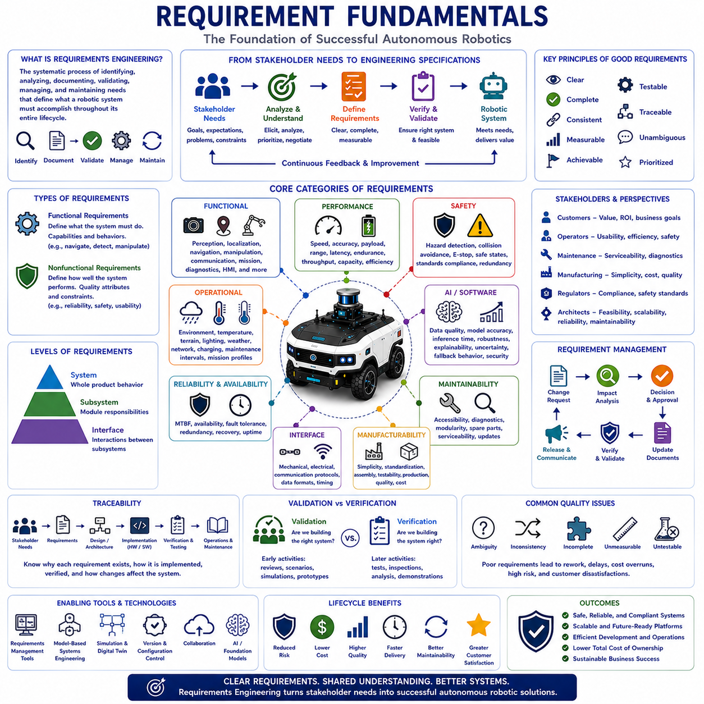
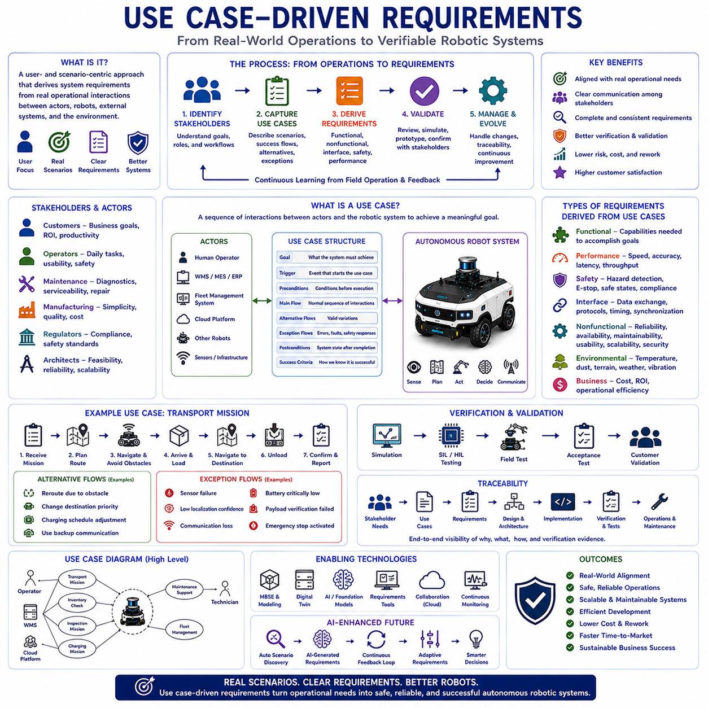
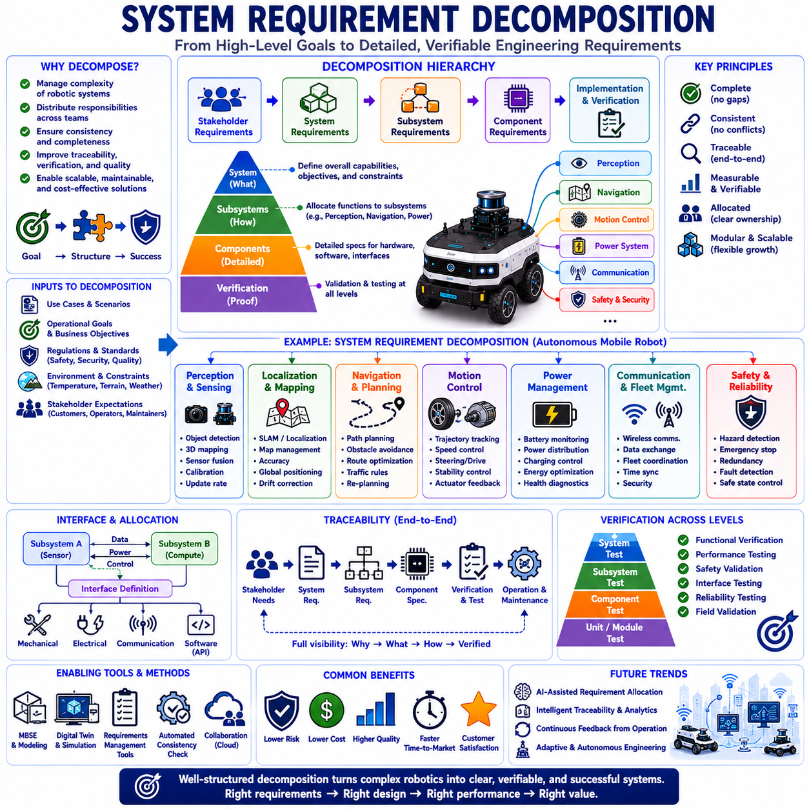
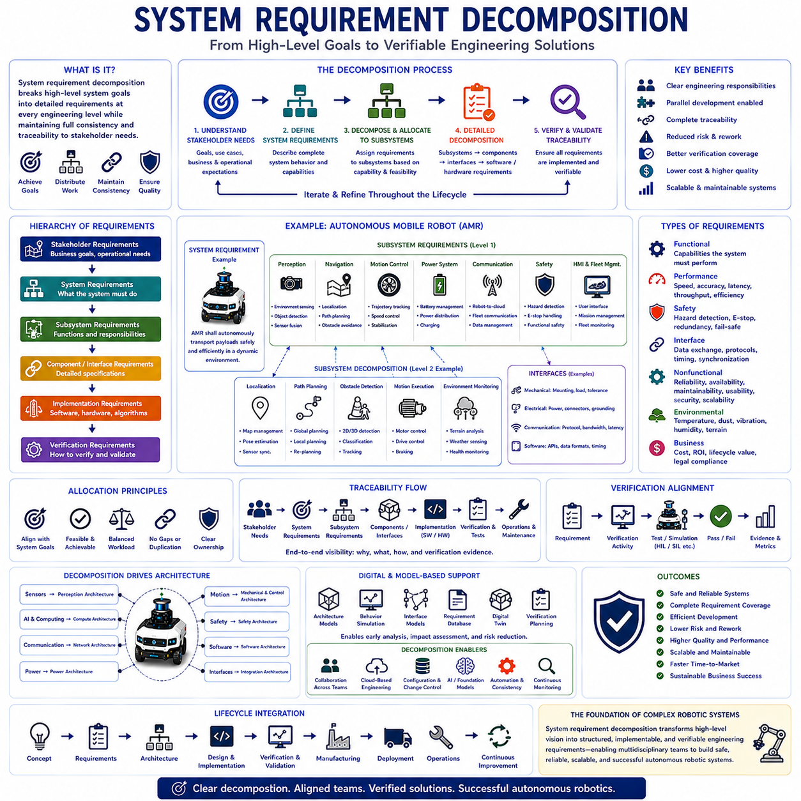
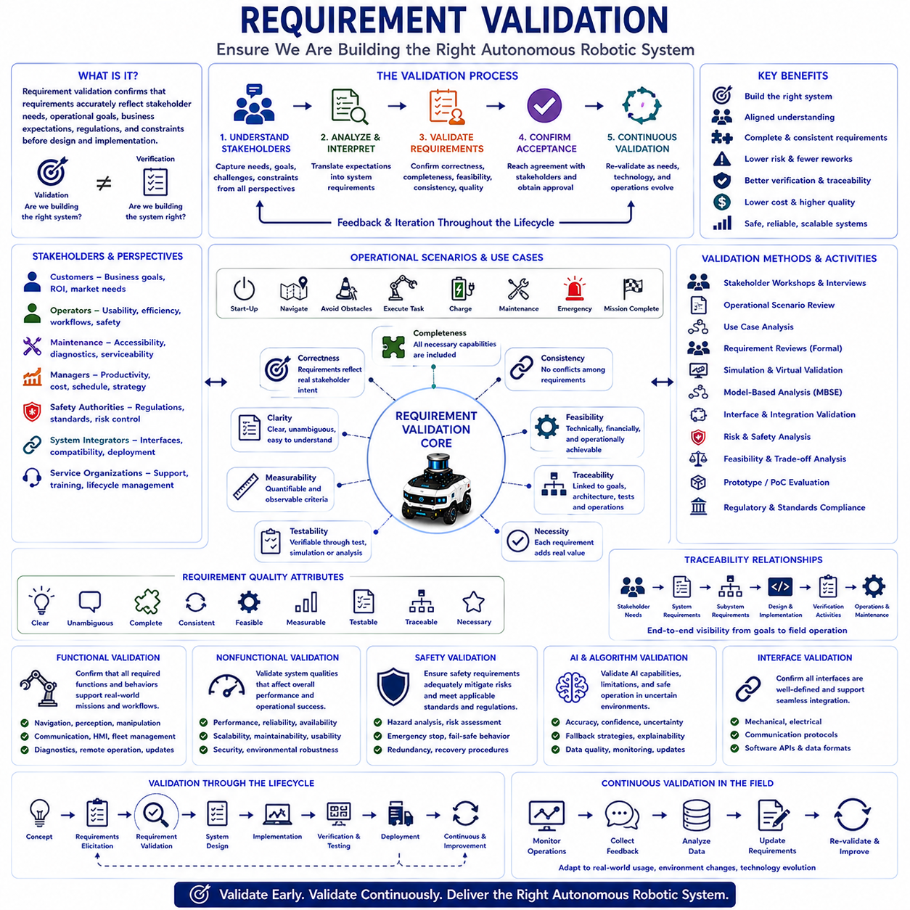
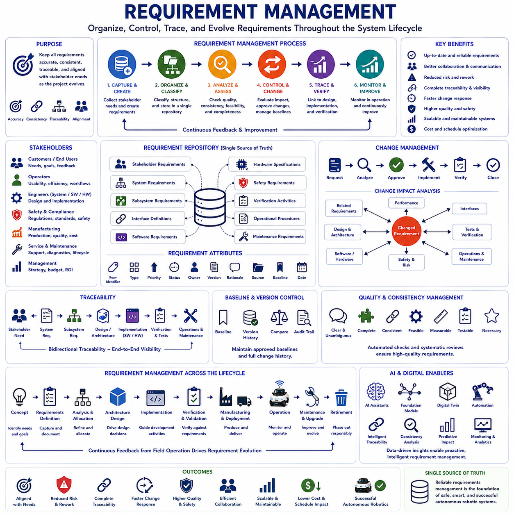

**Volume 01. AMR Foundations and System Architecture**

# 10. AMR Requirements Engineering · AMR 요구사항 공학

## 10.01 Requirement Fundamentals · 요구사항 기초

{width="7.268055555555556in" height="7.268055555555556in"}

Requirements engineering is the systematic process of identifying, analyzing, documenting, validating, managing, and maintaining the needs and expectations that define what a robotic system must accomplish throughout its entire lifecycle. In autonomous robotics, requirements establish the foundation for every engineering activity, including system architecture, hardware selection, software development, artificial intelligence, testing, manufacturing, deployment, maintenance, and future upgrades. Well-defined requirements provide a common understanding among customers, system architects, developers, manufacturers, operators, and maintenance teams, ensuring that complex robotic systems evolve toward consistent objectives while minimizing ambiguity, technical risk, and unnecessary redesign throughout product development.

The primary objective of requirements engineering is to translate stakeholder expectations into clear, measurable, achievable, and verifiable engineering specifications. Customers typically describe operational goals rather than technical solutions, while engineers must transform these goals into precise system behaviors, performance targets, functional capabilities, safety constraints, environmental limitations, and operational conditions. Effective requirements therefore bridge the gap between business objectives and engineering implementation by providing a structured framework that guides every design decision from initial concept development to final product validation.

Requirements differ from design solutions. A requirement defines what the system must accomplish, while design describes how the system will achieve those objectives. For example, stating that an autonomous robot shall operate continuously for eight hours defines a requirement, whereas selecting a lithium iron phosphate battery, optimizing power management software, or implementing energy-efficient motion planning represents design decisions. Maintaining a clear separation between requirements and implementation preserves engineering flexibility, allowing multiple technical solutions to satisfy identical operational objectives while encouraging innovation throughout product development.

Requirements originate from many different stakeholders, each contributing unique perspectives and expectations. Customers focus on operational value, productivity, and return on investment. Operators emphasize usability, efficiency, and safety during daily operation. Maintenance personnel prioritize accessibility, diagnostics, and serviceability. Manufacturing teams seek simplicity, standardization, and production efficiency. Regulatory authorities establish legal compliance and safety standards. System architects balance technical feasibility, scalability, reliability, and long-term maintainability. Requirements engineering therefore integrates diverse stakeholder interests into a coherent system specification supporting both technical excellence and commercial success.

Functional requirements define the capabilities that a robotic system must perform to accomplish its intended mission. These include perception, localization, navigation, obstacle detection, path planning, motion control, manipulation, communication, fleet management, charging, diagnostics, data recording, mission execution, human-machine interaction, and autonomous decision-making. Functional requirements describe observable system behavior under defined operational conditions and provide the basis for software implementation, subsystem integration, verification, and acceptance testing. Each function should possess clearly defined inputs, outputs, operating conditions, and measurable success criteria.

Nonfunctional requirements describe how well the system performs rather than what functions it provides. Performance, reliability, maintainability, availability, scalability, cybersecurity, safety, usability, interoperability, manufacturability, environmental durability, power efficiency, response time, computational capacity, communication latency, and lifecycle cost all represent important nonfunctional characteristics. Although these requirements may not directly define system functionality, they strongly influence architecture, component selection, verification strategy, and long-term operational performance. Successful autonomous robotic systems require balanced optimization across both functional and nonfunctional requirements.

System requirements describe complete product behavior at the highest engineering level, while subsystem requirements allocate responsibilities to individual modules such as sensing, computing, power, communication, mechanical structures, actuators, and software platforms. Interface requirements define interactions among subsystems through mechanical connections, electrical signals, communication protocols, timing relationships, data formats, and operational sequencing. Proper requirement decomposition enables complex robotic systems to be developed by multiple engineering teams while maintaining consistency across independently developed components.

Operational requirements define how robotic systems are expected to function within real deployment environments. Engineers specify operating temperatures, humidity, dust exposure, vibration, shock, terrain characteristics, lighting conditions, weather, electromagnetic interference, network availability, charging infrastructure, maintenance intervals, transportation requirements, storage conditions, and expected mission profiles. These operational constraints ensure that laboratory prototypes evolve into robust products capable of reliable field operation across diverse industrial environments and varying customer applications.

Performance requirements establish measurable engineering targets supporting objective system evaluation. Typical performance metrics include maximum speed, acceleration, payload capacity, positioning accuracy, navigation precision, obstacle detection range, localization error, battery endurance, charging duration, processor utilization, communication bandwidth, latency, sensor resolution, computational throughput, mission completion time, and overall system efficiency. Quantitative performance requirements eliminate subjective interpretation while enabling engineers to verify compliance through repeatable testing procedures and statistical analysis.

Safety requirements define conditions necessary to protect human operators, surrounding equipment, infrastructure, transported materials, and the robotic system itself. Autonomous robots must detect hazards, avoid collisions, respond appropriately to emergencies, enter safe operational states during abnormal conditions, and comply with applicable industrial safety standards. Safety requirements frequently include emergency stopping performance, fault detection capability, diagnostic coverage, redundancy, fail-safe behavior, functional safety integrity, cybersecurity protection, and controlled recovery following system disturbances. Safety therefore becomes an integral engineering requirement rather than an isolated compliance activity.

Artificial intelligence introduces additional requirement categories because learning-based systems exhibit probabilistic rather than fully deterministic behavior. AI requirements specify dataset quality, model accuracy, inference latency, confidence estimation, uncertainty management, robustness against environmental variation, explainability, fairness, adaptation limits, cybersecurity resilience, continuous monitoring, and fallback behavior whenever confidence becomes insufficient. AI requirements increasingly emphasize predictable operational performance despite changing environments while maintaining transparency, safety, and engineering accountability throughout autonomous decision-making.

Requirement quality significantly influences overall project success. High-quality requirements should be clear, concise, complete, consistent, measurable, achievable, testable, traceable, and unambiguous. Each requirement should describe only one engineering objective while avoiding subjective language, conflicting statements, hidden assumptions, unnecessary implementation details, or multiple interpretations. Poorly written requirements frequently generate misunderstanding, design inconsistency, project delays, increased development cost, verification difficulty, and customer dissatisfaction. Requirement quality therefore represents one of the most important indicators of engineering maturity.

Requirement traceability connects stakeholder expectations to system architecture, subsystem specifications, software implementation, hardware components, verification procedures, validation activities, and operational documentation. Traceability enables engineers to determine why each requirement exists, how it has been implemented, where it has been verified, and which engineering artifacts depend upon it. When customer needs change, traceability rapidly identifies affected components while minimizing unnecessary redesign. Comprehensive traceability therefore supports efficient change management throughout complex multidisciplinary robotic development.

Requirement validation confirms that documented requirements accurately represent stakeholder needs before detailed engineering begins. Validation activities include stakeholder reviews, operational scenario analysis, simulations, prototypes, use-case evaluation, requirement inspections, and technical feasibility assessments. Validation differs from verification because validation asks whether engineers are building the correct system, whereas verification determines whether the implemented system satisfies documented requirements. Early validation substantially reduces development risk by identifying misunderstanding before expensive implementation activities commence.

Requirement management continues throughout the entire product lifecycle because customer expectations, technology, regulations, operating environments, and business priorities continuously evolve. Engineering organizations establish formal change management processes evaluating technical impact, development effort, implementation priority, verification requirements, documentation updates, cost implications, and schedule effects before approving requirement modifications. Controlled requirement evolution ensures that product improvements remain technically consistent while preserving system integrity across multiple software releases and hardware generations.

Modern requirements engineering increasingly relies upon digital engineering tools supporting collaborative authoring, version management, configuration control, traceability analysis, model-based systems engineering, automated consistency checking, simulation, requirement verification, digital twins, and lifecycle documentation. Cloud-based engineering platforms enable globally distributed development teams to maintain synchronized system specifications while integrating requirements directly with architecture models, software repositories, testing environments, manufacturing documentation, and maintenance records. Digital engineering therefore improves collaboration, consistency, and engineering productivity throughout complex robotic development.

Future requirements engineering will increasingly integrate artificial intelligence, Foundation Models, model-based systems engineering, digital twins, autonomous verification, continuous requirement monitoring, cloud-edge collaboration, automated traceability, and intelligent lifecycle management. Rather than serving as static documents prepared only during early development, future requirements will evolve into living engineering knowledge systems continuously synchronized with operational data, customer feedback, manufacturing experience, maintenance history, and field performance. As Physical AI expands into manufacturing, logistics, transportation, healthcare, agriculture, construction, mining, and public infrastructure, requirements engineering will remain the essential discipline that transforms stakeholder expectations into safe, reliable, scalable, maintainable, and commercially successful autonomous robotic systems.

## 10.02 Use Case Driven Requirements · 유스케이스 기반 요구사항

{width="7.268055555555556in" height="7.268055555555556in"}

Use case-driven requirements engineering is a systematic approach that derives system requirements from realistic operational scenarios describing how users, autonomous robots, external systems, and surrounding environments interact to accomplish specific objectives. Rather than beginning with isolated technical functions, this methodology starts by understanding the practical activities that occur during real-world operations. In autonomous robotics, use cases connect customer expectations, business objectives, engineering requirements, and system architecture into a unified development framework. They ensure that engineering decisions remain closely aligned with operational needs while reducing ambiguity, improving communication among stakeholders, and supporting efficient verification throughout the product lifecycle.

The primary objective of use case-driven requirements engineering is to transform operational workflows into complete and verifiable system requirements. Customers often describe their business processes instead of individual technical functions, making it difficult for engineers to understand all system expectations through simple requirement lists. Use cases provide structured descriptions of operational interactions that reveal required functions, performance expectations, environmental constraints, safety considerations, exceptional conditions, and system interfaces. Engineering teams therefore obtain a more comprehensive understanding of system behavior before architecture design and implementation begin.

A use case represents a sequence of interactions between one or more actors and the robotic system that achieves a meaningful operational goal. An actor may be a human operator, maintenance technician, production supervisor, fleet management system, warehouse management system, cloud platform, sensor infrastructure, or another autonomous robot. Each use case describes how actors initiate interactions, how the robotic system responds, how operational objectives are achieved, and how abnormal situations are managed. Consequently, use cases describe complete operational behavior rather than isolated software functions or hardware components.

Use case-driven development emphasizes user goals instead of technological implementation. Engineers first determine what stakeholders expect the system to accomplish before discussing sensors, processors, communication protocols, artificial intelligence models, or software algorithms. This separation prevents premature design decisions while allowing multiple engineering solutions to satisfy identical operational objectives. By maintaining focus on operational intent rather than implementation details, engineering teams preserve architectural flexibility and encourage innovation throughout system development.

The development of use cases begins with identifying stakeholders and understanding their operational responsibilities. Customers define business objectives and productivity expectations. Operators describe daily workflows, navigation tasks, loading procedures, mission scheduling, charging operations, and human-robot interaction. Maintenance engineers explain diagnostic activities, software updates, calibration procedures, and repair requirements. Manufacturing engineers contribute production workflows while regulatory authorities specify legal compliance and safety obligations. Collecting these diverse operational perspectives enables engineers to construct realistic use cases representing actual deployment environments rather than theoretical system behavior.

Every use case includes several essential elements that define operational context clearly. The use case identifies participating actors, operational objectives, triggering events, initial conditions, normal operational sequences, alternative execution paths, exceptional conditions, completion criteria, and post-operation system states. Additional information may include environmental assumptions, timing constraints, safety requirements, communication dependencies, performance expectations, and external system interactions. Together, these elements provide engineers with a complete understanding of operational behavior before technical implementation begins.

The normal operational flow describes the expected sequence of interactions when all system components operate correctly. For example, an autonomous mobile robot may receive a transportation mission, calculate a navigation route, avoid obstacles, arrive at a pickup station, verify payload loading, navigate toward the destination, unload materials, confirm mission completion, and report operational status to fleet management. This primary scenario establishes baseline system behavior while identifying required functional capabilities supporting successful mission execution.

Alternative flows describe acceptable variations that still achieve operational objectives despite changing conditions. Navigation routes may change because of temporary obstacles, loading stations may become unavailable, communication may switch to backup networks, operators may modify destination priorities, or charging schedules may be adjusted according to battery conditions. These alternative scenarios ensure that robotic systems remain flexible while supporting practical operational variability encountered during real industrial deployment.

Exceptional flows describe abnormal situations requiring fault handling, safety responses, recovery procedures, or operator intervention. Sensors may fail, localization confidence may decrease, batteries may become critically low, communication links may disconnect, emergency stop devices may activate, payload verification may fail, or environmental hazards may prevent safe navigation. Modeling these exceptional situations during requirement development ensures that robotic systems respond predictably while maintaining safety, operational integrity, and regulatory compliance under adverse conditions.

Use cases naturally reveal functional requirements because every operational interaction requires corresponding system capabilities. Navigation scenarios require localization, path planning, obstacle detection, motion control, and traffic management. Charging scenarios require battery monitoring, docking alignment, charging control, and power management. Inspection scenarios require perception, data acquisition, artificial intelligence inference, reporting, and operator notification. Rather than generating isolated requirement lists, use cases demonstrate how multiple functional requirements cooperate to accomplish meaningful operational objectives.

Use cases also reveal important nonfunctional requirements that may otherwise remain overlooked. Mission completion time establishes performance expectations. Continuous operation defines availability requirements. Emergency response behavior introduces safety constraints. Outdoor navigation requires environmental robustness. Fleet coordination creates scalability requirements. Remote diagnostics influence maintainability. Secure communication introduces cybersecurity requirements. Consequently, use case-driven analysis simultaneously develops both functional and nonfunctional requirements within realistic operational contexts.

System interfaces become significantly clearer when analyzed through operational use cases. Human-machine interaction defines operator interface requirements while interactions with warehouse management systems, manufacturing execution systems, enterprise resource planning platforms, cloud services, charging infrastructure, safety controllers, and external sensors establish communication interfaces, data exchange protocols, timing relationships, and synchronization requirements. Interface requirements therefore emerge naturally from operational workflows instead of being developed independently without sufficient contextual understanding.

Use case diagrams provide high-level visual representations of relationships among actors and operational scenarios. Although diagrams summarize system interactions effectively, textual use case descriptions provide substantially greater engineering detail by explaining operational sequences, decision logic, exception handling, preconditions, postconditions, and performance expectations. Engineering teams therefore typically combine graphical overviews with detailed textual specifications to support both stakeholder communication and technical development activities.

Artificial intelligence significantly expands use case complexity because autonomous decision-making depends upon uncertain environmental perception and probabilistic reasoning. AI-oriented use cases include perception confidence assessment, object recognition under varying lighting conditions, adaptive navigation through crowded environments, anomaly detection during inspection, autonomous mission replanning, human behavior prediction, and confidence-based fallback strategies. These scenarios enable engineers to define AI-specific requirements regarding inference accuracy, uncertainty estimation, explainability, safety supervision, and operational boundaries before implementation begins.

Use cases provide valuable support for verification and validation throughout system development. Every operational scenario can be transformed into verification procedures, simulation environments, laboratory experiments, hardware-in-the-loop testing, software-in-the-loop validation, field demonstrations, acceptance testing, and customer evaluation. Because each test directly corresponds to documented operational behavior, engineers obtain objective evidence that implemented systems satisfy stakeholder expectations while reducing verification ambiguity and improving traceability across the development lifecycle.

Requirement traceability becomes more effective when organized around operational use cases. Stakeholder objectives generate use cases, which produce system requirements, subsystem specifications, software functions, hardware components, interface definitions, verification procedures, and maintenance documentation. When customer expectations evolve, engineers can identify affected operational scenarios and determine precisely which engineering artifacts require modification. This structured relationship significantly simplifies change management while preserving consistency across multidisciplinary engineering activities.

Model-Based Systems Engineering increasingly integrates use cases with architecture models, behavioral simulations, digital twins, interface definitions, requirement databases, and verification frameworks. Digital engineering platforms maintain synchronized relationships among operational scenarios, engineering requirements, system models, software implementation, hardware configuration, manufacturing documentation, and operational maintenance records. This integration improves collaboration while reducing inconsistency among engineering teams working simultaneously across multiple technical disciplines.

Future use case-driven requirements engineering will increasingly incorporate Foundation Models, artificial intelligence-assisted requirement generation, digital twins, continuous operational monitoring, autonomous scenario discovery, cloud-based collaboration, intelligent traceability, and adaptive lifecycle management. Rather than documenting only anticipated operational behavior before deployment, future engineering environments will continuously learn from field operation, maintenance history, customer feedback, and autonomous fleet performance to refine existing use cases and generate new operational scenarios automatically. As Physical AI systems become increasingly autonomous and interconnected across manufacturing, logistics, healthcare, agriculture, transportation, construction, mining, and public infrastructure, use case-driven requirements engineering will remain an essential methodology for transforming real operational needs into safe, reliable, scalable, maintainable, and commercially successful autonomous robotic systems.

## 10.03 System Requirement Decomposition · 시스템 요구사항 분해

{width="7.268055555555556in" height="7.268055555555556in"}

{width="7.268055555555556in" height="7.268055555555556in"}

System requirement decomposition is the systematic engineering process of transforming high-level system requirements into progressively more detailed subsystem, component, interface, software, hardware, and verification requirements while preserving complete consistency with the original system objectives. In autonomous robotics, complex systems integrate perception, localization, navigation, motion control, artificial intelligence, communication, power management, safety, human-machine interaction, and fleet coordination within a unified architecture. Because no single engineering team can efficiently develop every subsystem simultaneously, system requirement decomposition provides the structured framework that distributes engineering responsibilities while ensuring that all development activities collectively satisfy the original stakeholder expectations.

The primary objective of system requirement decomposition is to convert broad operational goals into precise engineering specifications that individual development teams can implement, verify, and maintain independently. Customers typically define overall operational capabilities such as autonomous transportation, industrial inspection, warehouse automation, or outdoor delivery without specifying internal technical implementation. Systems engineers analyze these high-level expectations and allocate them into coordinated technical requirements for mechanical structures, electrical systems, software platforms, sensing technologies, communication infrastructure, artificial intelligence, cybersecurity, diagnostics, and maintenance functions. Decomposition therefore bridges strategic system objectives and practical engineering implementation.

Requirement decomposition follows a hierarchical engineering structure. At the highest level, stakeholder requirements define business objectives and operational expectations. These evolve into system requirements describing complete product behavior. System requirements are subsequently allocated into subsystem requirements addressing sensing, computing, navigation, manipulation, communication, power, safety, software, and mechanical architecture. Subsystem requirements continue decomposing into component specifications, interface definitions, implementation requirements, verification procedures, and maintenance documentation. Each level preserves traceability to higher-level objectives while providing progressively greater engineering detail supporting implementation.

Successful decomposition maintains clear parent-child relationships among requirements. Every lower-level requirement should directly support one or more higher-level requirements while introducing no unnecessary functionality unrelated to system objectives. Likewise, every high-level requirement must be completely allocated across lower-level engineering activities without leaving undefined implementation gaps. This hierarchical consistency enables engineers to demonstrate that every design decision contributes directly to satisfying stakeholder expectations while avoiding unnecessary complexity, duplicated functionality, or conflicting subsystem responsibilities.

Functional decomposition divides overall system behavior into manageable engineering functions. For an autonomous mobile robot, mission execution may decompose into mission planning, localization, navigation, obstacle detection, path planning, motion control, docking, charging, fleet communication, diagnostics, and mission reporting. Navigation further decomposes into map management, localization algorithms, route generation, obstacle avoidance, trajectory optimization, motion execution, and environmental monitoring. This structured allocation enables specialized engineering teams to develop individual capabilities while maintaining complete system integration.

Nonfunctional requirements require equally careful decomposition because characteristics such as reliability, maintainability, safety, scalability, cybersecurity, manufacturability, usability, and performance influence every subsystem simultaneously. For example, an overall availability requirement affects battery reliability, software stability, communication robustness, maintenance procedures, redundancy architecture, and diagnostic capability. Rather than assigning nonfunctional requirements to isolated components, engineers distribute responsibility throughout multiple interacting subsystems while preserving coordinated system-level performance objectives.

Performance requirement decomposition transforms overall operational targets into measurable subsystem specifications. If an autonomous robot must navigate at two meters per second with ten-millimeter positioning accuracy, engineers allocate corresponding requirements for localization precision, sensor update frequency, processor latency, actuator response time, communication delay, trajectory planning performance, wheel control accuracy, and environmental perception capability. Each subsystem contributes quantifiable performance characteristics supporting achievement of the complete system objective under realistic operating conditions.

Safety requirement decomposition ensures that protection mechanisms exist throughout every architectural level. High-level safety objectives become subsystem requirements for hazard detection, obstacle avoidance, emergency stopping, fault diagnostics, redundancy, functional safety monitoring, communication integrity, power protection, cybersecurity defense, and controlled system recovery. Mechanical structures, electrical hardware, embedded software, artificial intelligence, communication networks, and operator interfaces each receive clearly defined safety responsibilities. Comprehensive safety decomposition therefore establishes multiple coordinated protection layers throughout the autonomous robotic system.

Artificial intelligence introduces additional decomposition complexity because intelligent decision-making depends upon perception quality, computational resources, software architecture, operational boundaries, and continuous monitoring. AI requirements decompose into dataset quality, sensor synchronization, preprocessing algorithms, neural network inference, confidence estimation, uncertainty management, explainability, fallback behavior, cybersecurity protection, computational acceleration, and model lifecycle management. These specialized requirements ensure that learning-based systems operate predictably while satisfying overall system safety and performance objectives despite uncertain environmental conditions.

Interface decomposition defines interactions among independently developed subsystems. Mechanical interfaces specify mounting geometry, structural loads, tolerances, accessibility, and serviceability. Electrical interfaces define power distribution, voltage levels, connector standards, grounding, and protection mechanisms. Communication interfaces specify protocols, bandwidth, latency, synchronization, message formats, security, and fault handling. Software interfaces establish application programming interfaces, service definitions, data structures, timing behavior, and exception management. Well-defined interfaces enable parallel subsystem development while minimizing integration uncertainty during final system assembly.

Allocation decisions represent one of the most important engineering activities within requirement decomposition. Engineers determine which subsystem should assume responsibility for each requirement according to functional capability, technical feasibility, cost, reliability, maintainability, scalability, and architectural consistency. Proper allocation balances engineering workload while avoiding redundant implementation or undefined ownership. Clear requirement ownership additionally improves project management by establishing measurable responsibilities across multidisciplinary engineering teams throughout the development lifecycle.

Requirement decomposition significantly influences system architecture because subsystem boundaries frequently emerge directly from allocated responsibilities. Sensing requirements define perception architecture. Motion requirements determine mechanical and control architecture. Communication requirements establish networking infrastructure. Artificial intelligence requirements influence computing architecture. Safety requirements define supervisory control layers. Consequently, requirement decomposition and architecture development proceed iteratively, continuously refining one another until functional responsibilities become both technically feasible and operationally efficient.

Requirement traceability becomes increasingly important as decomposition progresses across multiple engineering levels. Every subsystem requirement should reference its originating system requirement, while component specifications, software functions, hardware designs, verification procedures, and maintenance documentation remain linked through complete hierarchical relationships. Traceability enables engineers to determine why each engineering activity exists, how it contributes to system objectives, and which implementation artifacts require modification whenever stakeholder expectations evolve. Comprehensive traceability therefore supports disciplined engineering change management throughout complex robotic development.

Verification planning benefits substantially from systematic decomposition because every allocated requirement generates corresponding verification activities. System-level requirements require integrated operational testing, while subsystem requirements produce functional validation, interface testing, performance measurement, safety evaluation, environmental qualification, software verification, hardware inspection, and maintenance assessment. Structured decomposition therefore establishes a direct relationship between engineering implementation and objective verification evidence, ensuring complete requirement coverage throughout the product validation process.

Model-Based Systems Engineering provides powerful support for system requirement decomposition by integrating requirement hierarchies with architecture models, behavioral simulations, interface definitions, verification plans, digital twins, and lifecycle documentation. Engineers visualize relationships among stakeholder expectations, functional allocation, subsystem responsibilities, software implementation, hardware configuration, manufacturing processes, maintenance activities, and operational performance within unified digital engineering environments. Model-based decomposition reduces inconsistency while improving collaboration across geographically distributed multidisciplinary engineering teams.

Digital twins increasingly enhance requirement decomposition by enabling engineers to evaluate subsystem allocation before physical implementation. Virtual system models simulate interactions among sensing, navigation, artificial intelligence, communication, motion control, safety supervision, power management, and environmental conditions while identifying architectural conflicts or missing responsibilities. Early virtual validation allows engineers to refine decomposition strategies before expensive hardware development begins, reducing technical risk while improving development efficiency and overall system quality.

Collaborative engineering becomes substantially more effective when supported by structured requirement decomposition. Mechanical engineers, electrical engineers, software developers, artificial intelligence specialists, systems engineers, manufacturing teams, quality engineers, cybersecurity experts, and maintenance organizations can work simultaneously using clearly allocated engineering responsibilities. Standardized interfaces and traceable requirement relationships reduce communication ambiguity while enabling parallel development without compromising overall system consistency or integration quality.

Future system requirement decomposition will increasingly incorporate artificial intelligence, Foundation Models, autonomous engineering assistants, model-based systems engineering, digital twins, continuous requirement monitoring, intelligent traceability, automated consistency analysis, cloud-based collaboration, and adaptive lifecycle management. Rather than relying solely upon manually created hierarchical specifications, future engineering environments will automatically recommend requirement allocation, detect architectural inconsistencies, predict verification gaps, optimize subsystem responsibilities, and continuously refine decomposition according to operational feedback collected from deployed autonomous robotic fleets. As Physical AI systems become increasingly intelligent, interconnected, and multidisciplinary across manufacturing, logistics, transportation, healthcare, agriculture, construction, mining, and public infrastructure, systematic requirement decomposition will remain one of the most essential engineering methodologies enabling safe, reliable, scalable, maintainable, and commercially successful autonomous robotic systems.

## 10.04 Requirement Validation · 요구사항 검증

{width="7.268055555555556in" height="7.268055555555556in"}

Requirement validation is the systematic engineering process of confirming that specified requirements accurately represent stakeholder needs, operational objectives, business expectations, regulatory obligations, and technical constraints before system design and implementation begin. Unlike requirement verification, which evaluates whether individual requirements are correctly written and internally consistent, validation determines whether the engineering team is building the correct system to solve the intended problem. In autonomous robotics, requirement validation ensures that navigation, perception, artificial intelligence, safety, communication, power management, maintenance, and operational capabilities truly satisfy the real-world expectations of customers and end users. Early validation significantly reduces development risk by preventing incorrect assumptions from propagating throughout the engineering lifecycle.

The primary objective of requirement validation is to establish confidence that the proposed system will successfully achieve its intended operational mission. Customers often describe business goals, operational challenges, or desired outcomes without explicitly defining detailed engineering requirements. Systems engineers therefore interpret these expectations and transform them into technical specifications. Requirement validation confirms that this interpretation remains faithful to stakeholder intent while ensuring that no essential operational capability has been misunderstood, omitted, or incorrectly prioritized. Successful validation creates a shared understanding among customers, engineers, operators, management, manufacturers, and regulatory organizations before substantial engineering investment begins.

Requirement validation begins by thoroughly understanding stakeholder expectations. Customers, operators, maintenance personnel, production managers, safety authorities, system integrators, and service organizations frequently possess different perspectives regarding system behavior. Operators emphasize usability and operational efficiency, maintenance teams prioritize accessibility and diagnostics, safety authorities focus on regulatory compliance, while business managers emphasize productivity, cost reduction, and return on investment. Effective validation integrates these diverse viewpoints into a consistent engineering understanding while resolving conflicting expectations through collaborative discussion and systematic engineering trade-off analysis.

Operational scenarios provide one of the most effective foundations for requirement validation because they demonstrate how requirements perform under realistic working conditions. Engineers construct representative mission sequences describing system startup, autonomous navigation, obstacle avoidance, task execution, charging, maintenance activities, emergency situations, communication interruptions, environmental changes, and mission completion. Stakeholders review these scenarios to determine whether the proposed requirements accurately support expected operational workflows. Scenario-based validation frequently reveals missing requirements, ambiguous behavior, unrealistic assumptions, or overlooked operational conditions long before hardware or software development begins.

Use case validation extends operational scenario analysis by examining interactions between system actors and autonomous robotic functions. Human operators, fleet management systems, warehouse management software, cloud services, inspection equipment, charging infrastructure, and external sensing systems interact through well-defined operational procedures. Reviewing complete use cases allows stakeholders to verify that every required interaction is adequately represented by system requirements while ensuring that alternative operational paths, exception handling, maintenance procedures, and safety responses remain fully supported. Comprehensive use case validation therefore strengthens functional completeness throughout system development.

Requirement quality plays a central role in successful validation. Every validated requirement should be clear, unambiguous, complete, consistent, feasible, measurable, testable, traceable, and necessary. Ambiguous wording permits multiple interpretations, incomplete requirements create implementation uncertainty, conflicting requirements introduce architectural inconsistency, and unverifiable requirements cannot demonstrate engineering success objectively. Validation reviews therefore evaluate both the technical correctness of requirements and their overall quality as engineering specifications supporting multidisciplinary development.

Consistency analysis examines relationships among individual requirements throughout the complete system specification. Requirements should support one another rather than introducing conflicting objectives. For example, navigation performance targets should remain consistent with localization accuracy, sensor capabilities, communication latency, computational resources, and safety constraints. Power consumption requirements must align with battery capacity, thermal management, operational duration, and payload limitations. Validation identifies contradictory assumptions before system architecture becomes fixed, reducing expensive redesign later in development.

Completeness assessment ensures that every significant operational capability has corresponding engineering requirements. Autonomous robotic systems require coordinated capabilities including perception, localization, mapping, navigation, motion control, manipulation, communication, cybersecurity, diagnostics, safety supervision, power management, human-machine interaction, remote operation, fleet coordination, software updating, maintenance, manufacturing, and lifecycle support. Validation reviews systematically compare operational expectations against documented requirements to identify missing engineering functionality or insufficient operational coverage.

Feasibility evaluation determines whether validated requirements can realistically be implemented using available technology, engineering resources, budget, schedule, manufacturing capability, and organizational expertise. Performance objectives exceeding sensor limitations, unrealistic computational demands, unattainable positioning accuracy, excessive environmental robustness, or incompatible cost constraints may satisfy stakeholder desires but remain technically impractical. Requirement validation therefore balances ambition with engineering reality while encouraging transparent discussion regarding achievable system performance and acceptable trade-offs.

Artificial intelligence introduces unique validation challenges because learning-based systems operate probabilistically rather than deterministically. AI-related requirements include dataset quality, perception accuracy, uncertainty estimation, confidence thresholds, explainability, fallback behavior, continuous monitoring, model updates, cybersecurity protection, and operational boundaries. Validation ensures that stakeholders understand both the capabilities and limitations of machine learning technologies. Engineers must clearly communicate situations where AI confidence decreases, human intervention becomes necessary, or deterministic backup strategies assume operational control to preserve system safety.

Safety requirement validation represents one of the most critical engineering activities throughout autonomous robotic development. Safety engineers evaluate hazard analyses, risk assessments, emergency procedures, functional safety mechanisms, cybersecurity threats, fail-safe behavior, human interaction scenarios, environmental hazards, redundancy strategies, and recovery procedures. Validation confirms that proposed safety requirements adequately mitigate identified operational risks while satisfying applicable international standards, regulatory expectations, and organizational safety policies before detailed system implementation begins.

Interface validation ensures that communication among subsystems, external equipment, operators, and enterprise information systems remains fully defined and operationally consistent. Mechanical interfaces specify installation geometry and service access, electrical interfaces define power compatibility and protection, communication interfaces establish protocols and synchronization, while software interfaces describe data structures, timing, application programming interfaces, and exception handling. Interface validation reduces integration uncertainty by confirming that independently developed subsystems will operate together successfully within the complete autonomous robotic platform.

Requirement traceability significantly strengthens validation by linking stakeholder expectations directly to system requirements, subsystem specifications, architecture decisions, software implementation, hardware components, verification activities, operational procedures, and maintenance documentation. Traceability demonstrates how every engineering activity supports higher-level business objectives while enabling engineers to identify the downstream impact of requirement modifications. During validation, traceability confirms that every stakeholder expectation has corresponding engineering implementation and that unnecessary functionality has not been introduced.

Requirement validation increasingly benefits from Model-Based Systems Engineering by integrating requirement databases with architecture models, behavioral simulations, operational scenarios, interface definitions, digital twins, verification planning, and lifecycle documentation. Engineers visualize relationships among stakeholder objectives, functional allocation, subsystem responsibilities, implementation strategies, and operational performance within unified engineering environments. Model-based validation improves multidisciplinary collaboration while detecting inconsistencies automatically before expensive physical development begins.

Simulation provides powerful support for validating complex autonomous robotic requirements under diverse operational conditions. Virtual environments evaluate navigation performance, perception reliability, communication robustness, fleet coordination, environmental adaptation, emergency response, power consumption, artificial intelligence behavior, and maintenance procedures before physical prototypes exist. Stakeholders observe representative operational scenarios and determine whether validated requirements accurately support expected system behavior. Early simulation substantially reduces technical risk while improving requirement quality and architectural confidence.

Formal requirement reviews remain essential throughout validation. Multidisciplinary review teams including systems engineers, software developers, hardware engineers, artificial intelligence specialists, manufacturing experts, quality engineers, safety engineers, project managers, customers, and operational personnel collectively evaluate requirement quality and completeness. Structured review checklists examine clarity, feasibility, consistency, traceability, testability, regulatory compliance, maintainability, cybersecurity, scalability, manufacturability, and operational effectiveness. Collaborative reviews frequently identify overlooked issues that isolated engineering disciplines cannot recognize independently.

Requirement validation is not a one-time activity but a continuous engineering process extending throughout the complete system lifecycle. Customer expectations evolve, regulations change, operational environments become more demanding, technologies advance, and field experience reveals opportunities for improvement. Continuous validation ensures that requirements remain aligned with current stakeholder needs while supporting iterative system refinement, software updates, hardware improvements, manufacturing optimization, and operational expansion without compromising architectural consistency or long-term product sustainability.

Future requirement validation will increasingly integrate Foundation Models, artificial intelligence, digital twins, autonomous engineering assistants, continuous operational monitoring, cloud-based collaboration, intelligent traceability, automated consistency analysis, predictive risk assessment, and adaptive lifecycle engineering. AI systems will automatically evaluate requirement quality, detect inconsistencies, recommend missing requirements, predict implementation conflicts, generate validation scenarios, analyze operational feedback, and continuously refine engineering specifications using data collected from deployed autonomous robotic fleets. As Physical AI systems become increasingly intelligent, connected, adaptive, and multidisciplinary across manufacturing, logistics, transportation, healthcare, agriculture, construction, mining, and public infrastructure, requirement validation will remain one of the most essential engineering disciplines ensuring that autonomous robotic systems satisfy genuine operational needs while achieving safe, reliable, scalable, maintainable, and commercially successful deployment.

## 10.05 Requirement Management · 요구사항 관리

{width="7.268055555555556in" height="7.268055555555556in"}

Requirement management is the systematic engineering discipline of organizing, maintaining, controlling, tracing, analyzing, and continuously improving requirements throughout the entire system lifecycle. While requirement elicitation identifies stakeholder needs, requirement specification documents engineering expectations, and requirement validation confirms correctness, requirement management ensures that every requirement remains accurate, consistent, traceable, and synchronized as the project evolves. In autonomous robotics, where mechanical systems, electronics, software, artificial intelligence, communication networks, safety functions, manufacturing processes, and operational procedures continuously interact, effective requirement management provides the organizational framework that prevents inconsistency, uncontrolled changes, duplicated development, and integration failures across multidisciplinary engineering teams.

The primary objective of requirement management is to maintain alignment between stakeholder expectations and engineering implementation throughout development and operational deployment. Customer needs evolve, technologies mature, regulations change, operational environments become more demanding, and business priorities shift over time. Without systematic management, requirements quickly become outdated, inconsistent, or disconnected from actual implementation. Requirement management establishes controlled engineering processes that ensure modifications are properly evaluated, approved, implemented, verified, documented, and communicated to every affected engineering discipline before changes propagate throughout the system architecture.

Requirement management begins with the creation of a structured requirement repository that serves as the single authoritative source for all engineering requirements. Every stakeholder requirement, system requirement, subsystem requirement, interface definition, software requirement, hardware specification, safety requirement, verification activity, operational procedure, and maintenance requirement is uniquely identified and organized within a controlled database. Standardized identification enables engineers to reference individual requirements accurately while eliminating ambiguity created by duplicated or inconsistent documentation distributed across multiple engineering teams.

Requirement classification organizes engineering information into logical categories supporting efficient analysis and management. Requirements may be classified according to stakeholder expectations, functional capabilities, nonfunctional characteristics, safety objectives, performance targets, environmental conditions, regulatory obligations, cybersecurity constraints, interface definitions, operational procedures, manufacturing considerations, maintenance activities, verification methods, and lifecycle responsibilities. Classification allows engineers to analyze related requirements collectively while simplifying impact assessment whenever project modifications occur.

Unique identification represents one of the fundamental principles of professional requirement management. Every requirement receives a permanent identifier independent of document versions or engineering implementation. These identifiers enable precise communication among multidisciplinary development teams while supporting automated traceability, configuration management, verification planning, change analysis, and digital engineering integration. Stable identification prevents confusion when requirements evolve repeatedly throughout long-term development programs involving thousands of interconnected engineering specifications.

Requirement traceability forms the foundation of effective requirement management. Every stakeholder expectation should connect directly to system requirements, subsystem specifications, architecture decisions, software functions, hardware components, interface definitions, manufacturing activities, verification procedures, operational documentation, maintenance plans, and customer acceptance tests. Bidirectional traceability enables engineers to understand why every engineering activity exists while simultaneously determining which implementation artifacts are affected whenever a requirement changes. Complete traceability significantly improves engineering transparency and project control throughout complex autonomous robotic development.

Requirement allocation ensures that engineering responsibilities remain clearly distributed among subsystems and development organizations. High-level system requirements are systematically allocated to perception systems, localization modules, navigation algorithms, motion control systems, communication infrastructure, artificial intelligence, safety supervision, power management, human-machine interfaces, cybersecurity mechanisms, fleet management software, manufacturing processes, and maintenance organizations. Clear ownership prevents duplicated implementation while ensuring that every engineering responsibility receives appropriate technical attention and verification.

Change management represents one of the most critical functions within requirement management because engineering projects inevitably evolve throughout development. New customer expectations, regulatory updates, emerging technologies, field experience, manufacturing improvements, safety assessments, and business priorities frequently require requirement modification. Structured change management evaluates technical feasibility, cost implications, schedule impact, implementation risk, architectural consistency, verification consequences, and operational effects before approving modifications. Controlled change processes prevent uncontrolled engineering divergence while maintaining overall system integrity.

Change impact analysis determines how individual requirement modifications influence related engineering activities throughout the complete system architecture. Altering navigation accuracy requirements, for example, may affect localization algorithms, sensor selection, computational resources, communication latency, safety functions, battery consumption, testing procedures, manufacturing costs, maintenance activities, and customer acceptance criteria. Comprehensive impact analysis allows engineers to understand the full consequences of proposed modifications before implementation begins, reducing unexpected integration problems later in development.

Requirement baselines establish formally approved engineering reference points throughout the project lifecycle. After major reviews or project milestones, validated requirements become baseline configurations supporting architecture development, implementation, verification, manufacturing, and deployment. Future modifications occur through controlled engineering change processes while preserving historical versions for regulatory compliance, customer communication, certification activities, and engineering audits. Baseline management provides stability without preventing necessary system evolution.

Version control maintains complete historical records of requirement evolution throughout development. Every approved modification records the reason for change, responsible engineering authority, implementation date, affected requirements, verification status, supporting evidence, and associated engineering documentation. Version history enables engineers to reconstruct project decisions, analyze design evolution, resolve technical disagreements, support certification activities, and understand why specific engineering choices were made during previous development phases.

Requirement consistency management continuously examines relationships among engineering specifications to identify contradictions, duplicated functionality, incomplete definitions, conflicting performance objectives, incompatible interface assumptions, and inconsistent terminology. Automated consistency checking within modern engineering tools detects many conflicts before implementation begins. Regular consistency reviews reduce architectural instability while improving communication among multidisciplinary engineering teams responsible for different system components.

Requirement quality management ensures that every engineering specification satisfies established quality criteria before approval. Requirements should remain clear, concise, complete, measurable, feasible, testable, traceable, consistent, implementation-independent where appropriate, and necessary for successful system operation. Quality reviews eliminate ambiguous language, subjective terminology, hidden assumptions, unnecessary complexity, duplicated statements, and unverifiable objectives that complicate implementation or verification throughout large autonomous robotic development projects.

Verification management links every requirement directly to objective verification evidence. Functional requirements correspond to operational testing, performance requirements generate quantitative measurements, safety requirements require hazard validation, interface requirements support integration testing, environmental requirements produce qualification testing, and maintenance requirements establish service demonstrations. Requirement management therefore ensures complete verification coverage while identifying unverified engineering specifications before customer acceptance or regulatory certification activities begin.

Artificial intelligence introduces additional requirement management complexity because learning-based capabilities continuously evolve through dataset improvements, model updates, operational feedback, and algorithm refinement. AI requirement management includes monitoring dataset quality, model versions, training procedures, inference accuracy, uncertainty estimation, explainability, cybersecurity protection, operational boundaries, validation datasets, continuous learning policies, and deployment approval criteria. Managing AI requirements requires integrating software engineering practices with machine learning lifecycle management while maintaining complete traceability between trained models and original stakeholder expectations.

Model-Based Systems Engineering significantly enhances requirement management by integrating requirement repositories with architecture models, behavioral simulations, interface specifications, digital twins, verification planning, configuration management, manufacturing documentation, maintenance planning, and operational monitoring. Engineers visualize relationships among thousands of interconnected requirements within unified digital engineering environments while automatically identifying inconsistencies, missing traceability, architectural conflicts, and incomplete verification coverage. Model-based requirement management substantially improves engineering collaboration across geographically distributed multidisciplinary organizations.

Digital engineering platforms increasingly automate requirement management throughout the complete system lifecycle. Cloud-based collaboration environments synchronize requirement databases, architecture models, software repositories, hardware configurations, simulation environments, verification reports, manufacturing records, operational feedback, and maintenance documentation in real time. Automated notifications immediately inform affected engineering teams whenever approved requirement modifications occur, significantly reducing communication delays and preventing inconsistent implementation across independent development organizations.

Requirement management extends beyond product development into manufacturing, deployment, operation, maintenance, upgrades, and retirement. Field observations frequently identify opportunities for improving safety, reliability, maintainability, usability, energy efficiency, cybersecurity, artificial intelligence performance, environmental robustness, and operational productivity. These observations generate new stakeholder requirements that enter controlled engineering workflows supporting continuous product evolution without compromising system stability or certification integrity. Lifecycle requirement management therefore enables sustainable long-term product improvement based on real operational experience.

Future requirement management will increasingly incorporate Foundation Models, artificial intelligence, autonomous engineering assistants, digital twins, intelligent traceability, automated consistency analysis, predictive impact assessment, continuous operational monitoring, cloud-native engineering platforms, adaptive configuration management, and closed-loop lifecycle optimization. AI systems will automatically organize requirement repositories, detect inconsistencies, recommend missing specifications, evaluate implementation risks, generate traceability links, predict change impacts, monitor operational performance, and continuously refine engineering documentation using data collected from deployed autonomous robotic fleets. As Physical AI systems become increasingly intelligent, interconnected, software-defined, and multidisciplinary across manufacturing, logistics, transportation, healthcare, agriculture, construction, mining, and public infrastructure, requirement management will remain one of the most essential engineering disciplines ensuring that complex autonomous robotic systems evolve in a controlled, traceable, verifiable, maintainable, scalable, and commercially successful manner throughout their entire operational lifecycle.
