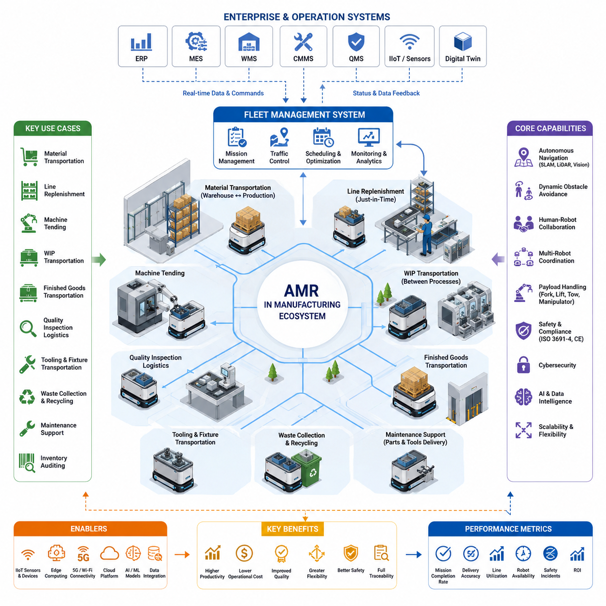
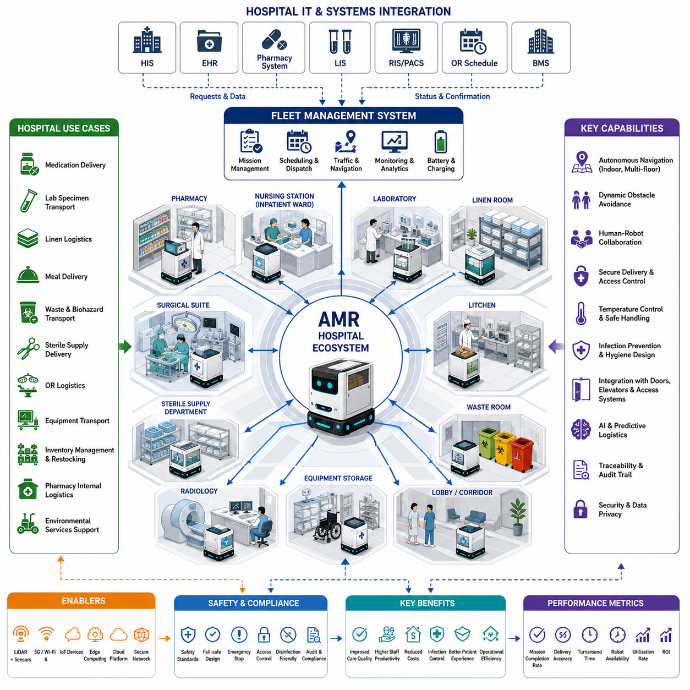
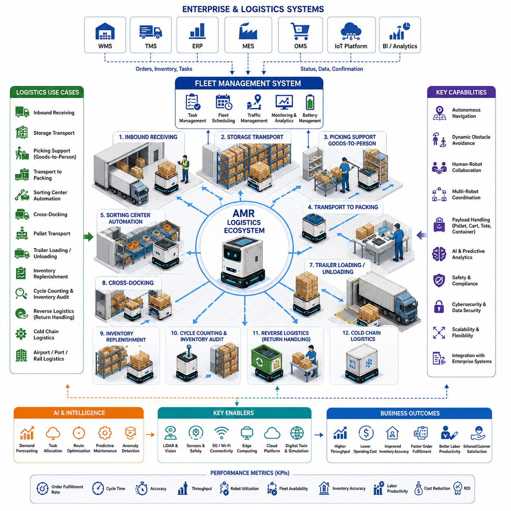
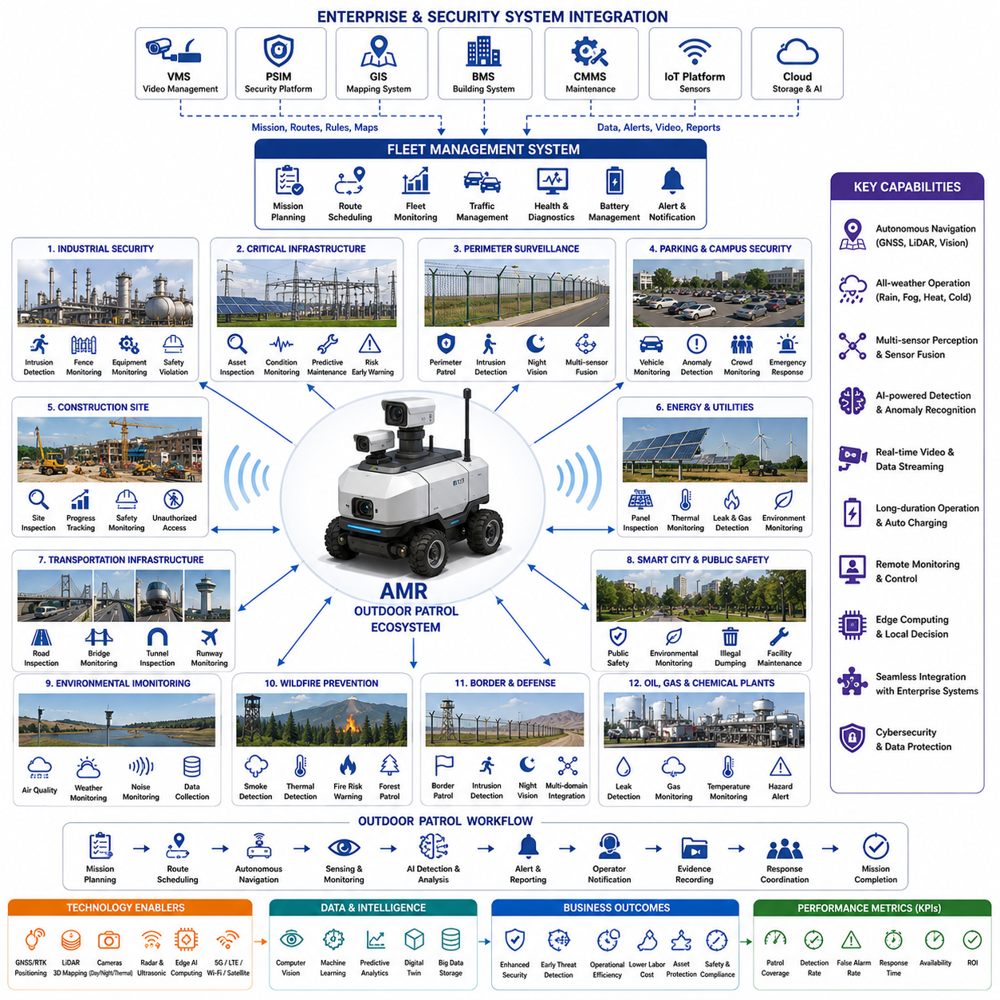
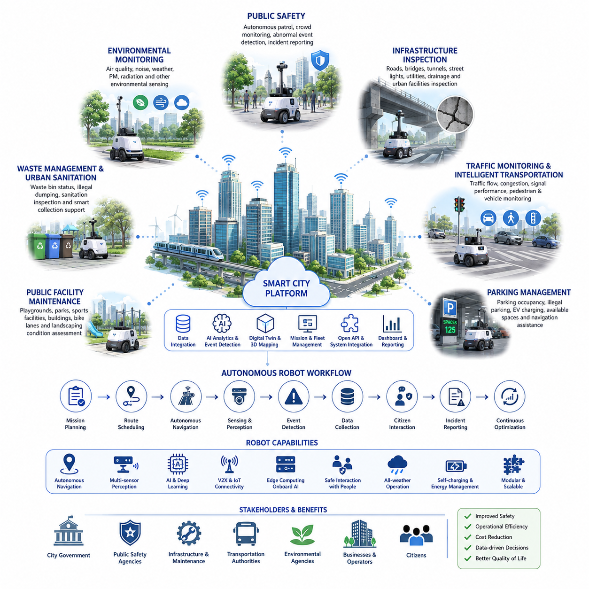

**Volume 01. AMR Foundations and System Architecture**

# 11. Use Case Definition · 유스케이스 정의

## 11.01 Manufacturing Use Cases · 제조 유스케이스

{width="7.268055555555556in" height="7.268055555555556in"}

현대 제조(Manufacturing) 환경은 자율이동로봇(Autonomous Mobile Robot, AMR)의 가장 성숙하고 경제적 가치가 높은 적용 분야 중 하나이다. 기존의 무인운반차(Automated Guided Vehicle, AGV)가 미리 정의된 경로를 따라 이동하는 것과 달리, AMR은 주변 환경을 지속적으로 인식하고, 자신의 위치를 계속 추정하며, 사람·설비·다른 로봇과 상호작용하면서 가장 안전하고 효율적인 경로를 스스로 결정한다. 따라서 제조 분야의 활용 사례(Use Cases)는 지속적으로 변화하는 생산 환경에서 운영 유연성, 확장성, 그리고 지능형 의사결정을 중심으로 구성된다. 공장이 산업 4.0(Industry 4.0)과 데이터 중심 운영으로 발전함에 따라 AMR은 생산 설비, 물류 인프라, 기업 소프트웨어, 작업자를 하나의 통합된 자율 제조 생태계로 연결하는 이동형 사이버 물리 시스템(Cyber-Physical System)으로 발전하고 있다.

제조 분야의 활용 사례는 로봇 하드웨어를 선택하는 것보다 생산 워크플로(Workflow)를 이해하는 것에서 시작된다. 모든 구축 프로젝트는 먼저 자재 흐름(Material Flow), 생산 병목(Bottleneck), 운송 빈도, 안전 요구사항, 환경 제약, 적재물(Payload)의 특성, 기존 자동화 시스템과의 연계 방식을 분석해야 한다. 성공적인 활용 사례는 단순히 로봇이 무엇을 운반하는지를 정의하는 것이 아니라, 왜 운반이 필요한지, 언제 작업(Mission)이 생성되는지, 예외 상황을 어떻게 처리하는지, 그리고 어떤 운영 지표(KPI)가 프로젝트 성공을 판단하는지를 함께 정의한다. 이러한 프로세스 중심 접근법은 AMR이 단순히 사람의 운반 작업을 대체하는 것이 아니라 제조 시스템 전체를 향상시키도록 만든다.

가장 대표적인 제조 활용 사례 중 하나는 창고(Warehouse)와 생산 라인(Production Line) 사이의 자율 자재 운송이다. 원자재(Raw Material), 반제품(Semi-finished Product), 포장 자재(Packaging Supply), 생산 도구(Tool)는 생산 일정에 맞추어 정확한 시점에 공급되어야 하며, 생산 흐름을 방해해서는 안 된다. AMR은 제조 실행 시스템(Manufacturing Execution System, MES), 창고 관리 시스템(Warehouse Management System, WMS), 전사적 자원 관리(Enterprise Resource Planning, ERP), 또는 생산 설비로부터 직접 운송 요청을 받아 생산 수요 변화에 실시간으로 대응한다. 이러한 적시 공급(Just-in-Time)은 불필요한 재고를 줄이고 생산 연속성을 향상시키며 수작업 운반을 최소화한다.

생산 라인 보충(Line Replenishment) 또한 높은 가치를 제공하는 활용 사례이다. 조립(Assembly), 가공(Machining), 용접(Welding), 도장(Painting), 포장(Packaging) 공정에서는 부품이 지속적으로 소비되므로 생산이 중단되기 전에 적시에 자재를 공급해야 한다. AMR은 MES 연동, RFID, 바코드(Barcode), 스마트 선반(Smart Shelf) 센서를 이용하여 재고 수준을 지속적으로 확인한다. 재고가 설정된 임계값(Threshold)에 도달하면 운송 작업이 자동 생성되며, 로봇은 창고에서 부품을 가져와 필요한 작업장(Workstation)에 직접 공급한다. 이러한 방식은 생산 중단을 줄이고 생산 효율성과 재고 정확도를 동시에 향상시킨다.

반제품(Work-in-Progress)의 자율 운송 역시 유연 생산 시스템(Flexible Manufacturing System)에서 매우 중요하다. 제품은 가공, 검사(Inspection), 열처리(Heat Treatment), 조립, 세척(Cleaning), 코팅(Coating), 품질 검증(Quality Verification) 등 여러 공정을 거치며 이동한다. 고정형 컨베이어(Conveyor)를 사용하는 대신 AMR은 독립적인 생산 셀(Cell)을 현재 생산 일정에 맞추어 동적으로 연결한다. 생산 우선순위가 변경되면 운송 경로(Route), 작업 순서(Task Sequence), 목적지(Destination)는 소프트웨어를 통해 즉시 변경할 수 있으며, 공장 레이아웃(Layout)을 물리적으로 수정할 필요가 없다.

설비 지원(Machine Tending)은 또 다른 대표적인 제조 활용 사례이다. 로봇 팔(Robotic Manipulator)이나 특수 적재 장치를 탑재한 AMR은 CNC 머신, 사출 성형기(Injection Molding Machine), 레이저 절단기(Laser Cutter), 3D 프린터, 자동 조립 설비 등에 부품을 공급한다. 가공이 완료되면 완성된 부품을 회수하여 다음 공정으로 운반한다. 설비 제어기와의 연동을 통해 적재와 회수를 자동으로 동기화함으로써 설비의 유휴 시간을 줄이고 가동률(Utilization)을 높이며, 무인 생산(Lights-Out Manufacturing)까지 지원할 수 있다.

완제품(Finished Goods) 운송은 제조와 창고 운영을 연결하는 핵심 과정이다. 최종 검사, 포장, 라벨링(Labeling)을 마친 제품은 AMR을 통해 생산 구역에서 창고, 출하장(Shipping Station), 자동 보관 시스템(Automated Storage System)으로 운송된다. 지능형 플릿 관리(Fleet Management)는 긴급 출하를 우선 처리하고 운송 부하를 균형 있게 분배하며 공장 통로의 혼잡을 최소화한다. 이를 통해 생산량이 증가하고 고객 주문에 더욱 신속하게 대응할 수 있으며, 별도의 운반 인력을 지속적으로 운영할 필요도 줄어든다.

품질 검사(Quality Inspection)를 위한 물류(Logistics) 또한 중요한 제조 활용 사례이다. 치수 측정(Dimensional Inspection), 광학 검사(Optical Inspection), X선 검사(X-ray Inspection), 기능 시험(Functional Testing), 실험실 분석(Laboratory Verification)이 필요한 제품은 검사 장비와 생산 라인을 효율적으로 오가야 한다. AMR은 완성된 제품을 자동으로 수거하여 검사 장비로 운반하고, 필요 시 검사 완료를 기다린 후 합격 제품은 생산 라인으로 되돌리거나 불합격 제품은 격리 구역(Quarantine Area)으로 이동시킨다. 운송 이력은 검사 결과와 함께 디지털 추적성(Digital Traceability)을 형성하여 품질 보증(Quality Assurance)과 규제 대응(Regulatory Compliance)을 지원한다.

제조 환경에서는 특수 공구(Tool), 지그(Fixture), 금형(Mold), 용접 장비, 교정 장비(Calibration Instrument), 유지보수 자원(Maintenance Resource)의 이동도 자주 발생한다. AMR은 생산 일정 변화에 따라 이러한 자산을 필요한 생산 라인으로 신속하게 운반한다. 모든 작업장에 동일한 장비를 중복 배치하는 대신 여러 생산 셀이 고가의 장비를 공동 활용할 수 있으며, 지능형 스케줄링(Scheduling)은 필요한 시점 이전에 장비가 도착하도록 하여 설비 활용도를 높이고 초기 투자 비용(Capital Investment)을 절감한다.

많은 공장에서는 폐기물(Waste)과 재활용(Recycling)을 위한 자율 운송에도 AMR을 활용한다. 제조 공정에서는 스크랩(Scrap), 불량품(Defective Product), 포장 폐기물, 금속 칩(Metal Chip), 플라스틱 잔여물, 각종 소모품이 지속적으로 발생한다. AMR은 미리 정의된 일정이나 센서 기반 적재량(Fill Level)에 따라 폐기물 용기를 수거하여 중앙 재활용 시설 또는 폐기 시설로 운반한다. 생산 물류와 폐기물 처리를 분리함으로써 작업자의 이동을 줄이고 더욱 깨끗하고 안전한 작업 환경을 유지할 수 있다.

유지보수(Maintenance) 지원도 점점 중요성이 커지는 제조 활용 사례이다. 유지보수 엔지니어는 예비 부품(Spare Part), 진단 장비(Diagnostic Equipment), 윤활유(Lubricant), 배터리(Battery), 특수 공구를 공장 전체에 걸쳐 반복적으로 운반하는 경우가 많다. AMR은 유지보수 관리 시스템(Computerized Maintenance Management System, CMMS)의 작업 지시를 받아 필요한 자원을 기술자에게 자동으로 전달한다. 이로 인해 기술자의 이동 시간이 줄어들고 설비 복구 속도가 빨라지며 생산 설비의 가동률(Availability)이 향상된다.

자율 재고 조사(Autonomous Inventory Auditing)는 디지털 제조(Digital Manufacturing)에서 중요한 활용 사례로 자리 잡고 있다. 바코드 스캐너, RFID 리더, 카메라(Camera), 컴퓨터 비전(Computer Vision)을 탑재한 AMR은 창고와 생산 구역을 자율적으로 이동하면서 재고 수량과 저장 위치를 지속적으로 확인한다. 수집된 정보는 창고 데이터베이스와 동기화되어 재고 불일치, 잘못 배치된 자재, 유효기간이 지난 부품, 누락된 재고를 자동으로 식별한다. 이러한 자동 재고 관리는 공급망(Supply Chain)의 정확도를 높이고 반복적인 수작업 재고 조사 업무를 줄여준다.

협업 제조(Collaborative Manufacturing) 환경에서는 로봇이 작업자, 지게차(Forklift), AGV, 자율 지게차(Autonomous Forklift), 다른 AMR과 안전하게 공존해야 한다. 따라서 제조 활용 사례는 동적 장애물 회피(Dynamic Obstacle Avoidance), 사람의 의도 예측(Human Intention Prediction), 적응형 속도 제어(Adaptive Speed Control), 상황 인식(Context-aware) 기반 주행을 중요하게 다룬다. 로봇은 보행자(Pedestrian), 임시 장애물, 생산 카트(Cart), 열린 안전 게이트(Safety Gate), 변화하는 작업 공간을 인식하면서도 항상 안전 거리를 유지해야 한다. 이러한 협업 환경은 로봇이 사람을 대체하기보다는 작업을 지원하는 방향으로 발전하도록 만든다.

유연 생산 시스템(Flexible Manufacturing System)은 신제품 도입이나 생산 전환(Changeover)에 빠르게 대응해야 한다. AMR은 컨베이어나 가이드 레일(Guide Rail)과 같은 고정형 물류 설비를 제거함으로써 생산 셀을 자유롭게 재배치할 수 있도록 지원한다. 새로운 제품이나 계절별 생산량 변화가 발생하더라도 작업(Mission), 지도(Map), 물류 워크플로는 소프트웨어를 통해 수정되므로 대규모 설비 변경 없이도 생산 시스템을 빠르게 재구성할 수 있다.

대규모 제조 시설에서는 견인형 AMR(Towing AMR), 팔레트 운반 로봇(Pallet Moving Robot), 자율 지게차, 검사 로봇(Inspection Robot), 협동 로봇(Collaborative Manipulator) 등 다양한 로봇이 동시에 운영된다. 플릿 관리 시스템(Fleet Management System, FMS)은 작업 할당(Mission Allocation), 교통 제어(Traffic Control), 충전 스케줄(Charging Schedule), 경로 최적화(Route Optimization), 자원 활용(Resource Utilization)을 통합적으로 관리한다. 따라서 제조 활용 사례는 개별 로봇이 아니라 중앙 집중형 스케줄링과 분산형 자율성이 결합된 다중 로봇 생태계(Multi-Robot Ecosystem)를 중심으로 발전한다.

제조 활용 사례는 산업용 사물인터넷(Industrial Internet of Things, IIoT)과의 통합에서도 큰 가치를 제공한다. 스마트 센서(Smart Sensor), 프로그램 가능 논리 제어기(Programmable Logic Controller, PLC), 디지털 트윈(Digital Twin), 환경 모니터링 시스템(Environmental Monitoring System), 엣지 컴퓨팅(Edge Computing)은 실시간 운영 데이터를 생성하며 로봇의 의사결정에 직접 활용된다. AMR은 생산 우선순위, 설비 상태, 작업장 가용성, 재고 정보, 유지보수 경보를 실시간으로 수신하여 제조 환경 변화에 따라 운송 전략을 자동으로 조정한다. 물리적 생산 시스템과 디지털 시스템의 긴밀한 연결은 지속적인 공정 최적화를 가능하게 한다.

인공지능(Artificial Intelligence, AI)은 제조 활용 사례를 더욱 지능적으로 발전시킨다. 머신러닝(Machine Learning)은 생산 수요를 예측하고, 운송 부하를 분석하며, 플릿 배치를 최적화하고, 배터리 사용량을 예측하며, 혼잡 패턴을 분석하여 보다 효율적인 물류 전략을 제안한다. 컴퓨터 비전은 팔레트 인식, 컨테이너 식별, 작업장 위치 확인, 이상 상황 탐지(Anomaly Detection)를 수행한다. 파운데이션 모델(Foundation Model)과 멀티모달 AI(Multimodal AI)는 복잡한 제조 환경을 이해하고 작업자의 명령을 해석하며 새로운 작업 환경에도 안전하게 적응할 수 있는 차세대 제조 로봇의 핵심 기술로 발전하고 있다.

실외 제조 시설(Outdoor Manufacturing Facility)에서는 생산동(Building), 창고, 적재장(Loading Dock), 자재 야적장(Material Yard), 검사 시설을 연결하는 운송이 중요한 활용 사례가 된다. 실외 AMR은 불규칙한 지형(Rough Terrain), 다양한 기상 조건, 조명 변화, 차량과 사람의 혼합 교통(Mixed Traffic) 속에서도 높은 위치 추정(Localization) 정확도와 안정성을 유지해야 한다. 이를 위해 GNSS(Global Navigation Satellite System), LiDAR, 카메라, 레이더(Radar), IMU(Inertial Measurement Unit), 센서 융합(Sensor Fusion)이 함께 활용되어 대규모 산업 단지에서도 안정적인 자율주행을 수행한다.

안전(Safety)은 모든 제조 활용 사례에서 가장 기본적인 요구사항이다. 로봇은 산업 안전 표준(Industrial Safety Standards)을 만족하면서 중복 센서(Redundant Sensing), 비상 정지(Emergency Stop), 고장 진단(Fault Diagnosis), 기능 안전(Functional Safety), 사이버 보안(Cybersecurity)을 구현해야 한다. 위험성 평가(Risk Assessment)는 적재물 특성, 주행 속도, 작업 공간 공유, 작업자와의 상호작용을 종합적으로 분석한다. 안전한 운영은 제동 거리 제어, 작업자 주변 감속, 수동 제어 기능, 핵심 시스템의 상태 모니터링을 포함하며, 안전은 개발 이후 추가되는 기능이 아니라 활용 사례 정의 단계부터 함께 설계되어야 한다.

성공적인 제조 구축은 단순한 운송 속도만으로 평가되지 않는다. 주요 성능 지표(Key Performance Indicator, KPI)에는 작업 완료율(Mission Completion Rate), 배송 정확도(Delivery Accuracy), 생산 라인 가동률(Line Utilization), 운송 사이클 시간(Cycle Time), 플릿 효율(Fleet Efficiency), 로봇 가용성(Availability), 배터리 활용도(Battery Utilization), 유지보수 빈도(Maintenance Frequency), 자율주행 신뢰성(Navigation Reliability), 작업자 개입 횟수(Human Intervention Rate), 안전 사고 발생률, 재고 정확도, 투자 대비 수익(Return on Investment, ROI)이 포함된다. 이러한 지표를 지속적으로 분석함으로써 제조 워크플로를 반복적으로 개선하고 AMR 구축 효과를 객관적으로 검증할 수 있다.

제조 산업이 더욱 연결되고 지능화된 자율 공장(Autonomous Factory)으로 발전함에 따라 AMR의 활용 사례 역시 단순 물류 자동화를 넘어 생산 전체를 지능적으로 조율하는 방향으로 확대되고 있다. 미래의 제조 로봇은 디지털 트윈(Digital Twin), AI 기반 생산 계획 시스템, 자율 생산 설비, 협동 로봇 팔(Collaborative Robot Arm), 예지 보전(Predictive Maintenance), 기업 의사결정 시스템과 긴밀하게 협력하게 될 것이다. 차세대 AMR은 단순한 자율 운반 장비를 넘어 생산 목표를 이해하고, 여러 지능형 시스템과 협업하며, 제조 공정을 실시간으로 최적화하는 지능형 제조 에이전트(Intelligent Manufacturing Agent)로 발전하여 높은 수준의 안전성, 신뢰성, 유연성, 운영 효율성을 동시에 실현하게 될 것이다.

## 11.02 Hospital Use Cases · 병원 유스케이스

{width="7.268055555555556in" height="7.268055555555556in"}

병원(Hospital)은 자율이동로봇(Autonomous Mobile Robot, AMR)이 적용되는 가장 복잡하고 규제가 엄격한 운영 환경 중 하나이다. 생산 효율성을 중시하는 제조 공장이나 물류 처리량을 우선하는 창고와 달리, 병원에서는 로봇이 환자(Patient), 의료진(Healthcare Professional), 방문객(Visitor), 민감한 의료 장비(Medical Equipment)와 함께 안전하게 운영되면서도 의료 서비스(Clinical Workflow)를 방해하지 않아야 한다. 따라서 병원 활용 사례(Use Cases)는 단순한 물품 운송을 넘어 의료 서비스 품질(Quality of Care), 운영 효율성(Operational Efficiency), 감염 관리(Infection Control), 추적성(Traceability), 의료진 생산성(Productivity), 환자 경험(Patient Experience)을 향상시키는 데 초점을 둔다. 현대 의료 환경이 디지털 전환(Digital Transformation)을 가속화함에 따라 AMR은 물리적 물류와 병원 정보 시스템(Hospital Information System), 진료 일정, 실시간 운영 관리까지 통합하는 지능형 서비스 플랫폼(Intelligent Service Platform)으로 발전하고 있다.

병원 활용 사례의 정의는 로봇 기술보다 의료 업무 흐름(Medical Workflow)을 이해하는 것에서 시작된다. 병원은 응급실(Emergency Department), 입원 병동(Inpatient Ward), 수술실(Operating Room), 중환자실(Intensive Care Unit), 약국(Pharmacy), 검사실(Laboratory), 영상의학과(Radiology), 중앙 공급실(Central Sterile Supply Department), 주방(Kitchen), 물류 시설(Logistics Facility) 등 다양한 부서로 구성된다. 각 부서는 고유한 운송 요구사항, 운영 우선순위, 출입 제한, 위생 규정을 가진다. 성공적인 AMR 구축은 의약품(Medication), 검체(Specimen), 린넨(Linen), 식사(Meal), 의료 장비(Medical Equipment), 폐기물(Waste) 등이 병원 전체에서 어떻게 이동하는지를 분석하는 것부터 시작하며, 반복적인 운반 업무를 줄여 의료진이 환자 진료에 더 많은 시간을 사용할 수 있도록 하는 것을 목표로 한다.

자율 의약품 배송(Autonomous Medication Delivery)은 병원에서 가장 널리 활용되는 사례 중 하나이다. 약국에서는 의사의 처방(Prescription)에 따라 약을 조제하고, AMR은 이를 간호사실(Nursing Station), 병동, 응급실, 외래 진료실(Outpatient Clinic), 수술실로 안전하게 운반한다. 보안 전자 수납함(Secure Electronic Compartment), 사용자 인증(User Authentication), 접근 기록(Access Logging), 배송 확인(Delivery Confirmation)을 통해 운송 과정에서 의약품의 보안이 유지된다. 병원 정보 시스템(Hospital Information System), 전자의무기록(Electronic Medical Record, EMR), 약국 관리 시스템과의 연동을 통해 배송 요청이 자동으로 생성되며, 조제부터 최종 전달까지 모든 과정이 디지털 추적성(Digital Traceability)을 유지한다.

검체 운송(Laboratory Specimen Transportation)은 병원의 핵심 활용 사례 중 하나이다. 혈액(Blood Sample), 조직(Tissue Specimen), 소변(Urine Sample), 미생물 배양(Microbiological Culture), 진단용 검체는 오염 없이 신속하게 검사실로 운반되어야 한다. AMR은 온도 제어(Temperature Control), 진동 저감(Vibration Reduction), 밀폐형 운송 용기(Sealed Container)를 이용하여 생물학적 시료를 안전하게 운송한다. 자동 스케줄링은 운송 지연을 줄이고 검사 결과 반환 시간(Turnaround Time)을 단축하며, 특히 응급 진료에서는 빠른 진단을 통해 환자의 치료 결과를 향상시키는 데 기여한다.

병원 린넨 물류(Hospital Linen Logistics)는 자동화를 통해 큰 운영 효과를 제공한다. 깨끗한 린넨(Clean Linen), 환자복(Patient Gown), 수건(Towel), 담요(Blanket), 수술용 섬유(Surgical Textile)는 여러 병동으로 지속적으로 공급되어야 하며, 사용한 린넨은 세탁 시설(Laundry Facility)로 회수되어야 한다. AMR은 하루 동안 계획된 일정에 따라 린넨을 운반하여 병원 직원이 무거운 운반 카트(Cart)를 직접 이동시키는 부담을 줄인다. 깨끗한 린넨과 오염된 린넨의 운송을 전용 로봇 또는 분리된 적재 공간으로 구분함으로써 병원은 감염 예방 수준을 더욱 향상시키고 필수 의료용 섬유의 안정적인 공급을 유지할 수 있다.

식사 배송(Meal Delivery)과 영양 지원(Nutrition Support)은 중요한 비임상(Non-clinical) 활용 사례이다. 병원 주방은 당뇨 식단(Diabetic Diet), 저염식(Low-sodium Diet), 소아 식단(Pediatric Nutrition), 치료 식단(Therapeutic Diet) 등 의사의 처방에 맞는 식사를 준비한다. AMR은 지정된 식사 시간에 맞추어 식사 카트(Meal Cart)를 병동으로 운반하며, 음식의 적정 온도를 유지한다. 식사가 끝난 후에는 빈 식판을 회수하여 주방으로 운반하고 세척 공정으로 연결한다. 이러한 자동화는 식사 배송의 일관성을 높이고 영양 서비스 담당자의 육체적 부담을 줄인다.

폐기물 수거(Waste Collection)와 의료 폐기물(Biohazard Transportation)의 운송은 병원에서 엄격하게 관리되어야 하는 업무이다. 병원에서는 일반 폐기물, 재활용품, 의약품 폐기물, 감염성 폐기물, 생물학적 위험 물질(Hazardous Biological Material)이 지속적으로 발생하며 각각 다른 처리 절차를 따른다. AMR은 밀폐된 폐기물 용기를 안전 규정에 따라 운송하여 의료진이 위험 물질에 노출되는 가능성을 최소화한다. 전용 운송 경로(Route), 분리된 적재 공간, 접근 제한을 통해 폐기물 운송은 일반 의료 물류와 완전히 분리되어 병원 전체의 오염 위험을 줄인다.

멸균 물품 공급(Sterile Supply Distribution)은 병원의 또 다른 중요한 활용 사례이다. 중앙 공급실(Central Sterile Supply Department)은 수술 기구(Surgical Instrument), 멸균 트레이(Sterile Tray), 의료 기기(Medical Device), 재사용 장비를 지속적으로 멸균 처리한 후 각 부서에 공급한다. AMR은 밀폐된 적재 공간을 이용하여 멸균 상태를 유지한 채 장비를 운송한다. 배송 요청은 수술 일정(Surgical Schedule)과 임상 수요(Clinical Demand)에 따라 자동 생성되며, 필요한 장비가 수술 전에 정확하게 도착하도록 지원하고 고가 의료 장비의 활용도를 향상시킨다.

수술실 물류(Operating Room Logistics)는 매우 정밀한 시간 관리가 필요한 병원 활용 사례이다. 수술에는 수술 기구, 임플란트(Implant), 소모품(Consumable), 혈액(Blood Product), 의약품, 영상 장비(Imaging Device), 특수 의료 장비가 정확한 시간에 준비되어야 한다. AMR은 수술 시작 전에 필요한 자원을 운반하고, 수술 종료 후에는 조직 검체를 병리학과(Pathology Laboratory)로 즉시 운반한다. 수술실 일정 관리 시스템과의 연동을 통해 수술 일정이 변경되더라도 물류 계획이 자동으로 조정되어 효율적인 수술 지원이 가능하다.

병원 의료 장비 운송(Hospital Equipment Transportation)도 지속적으로 확대되고 있는 활용 분야이다. 이동형 초음파 장비(Mobile Ultrasound System), 환자 모니터(Patient Monitoring Equipment), 수액 펌프(Infusion Pump), 인공호흡기(Ventilator), 이동형 영상 장비(Portable Imaging System), 휠체어(Wheelchair), 특수 진단 장비는 여러 병동에서 공동으로 사용된다. AMR은 이러한 장비를 필요한 부서로 자동 운반하거나 견인(Towing)하여 장비 부족으로 인한 진료 지연을 줄이고 고가 장비의 활용률(Utilization)을 높인다. 지능형 스케줄링은 장비 공유를 최적화하여 중복 구매를 줄이고 병원의 투자 효율성을 높인다.

병원 재고 관리(Inventory Management)는 AMR을 통해 더욱 효율적으로 운영될 수 있다. 의료 소모품(Medical Consumable), 개인 보호 장비(Personal Protective Equipment, PPE), 주사기(Syringe), 장갑(Glove), 드레싱(Dressing), 카테터(Catheter), 수액 공급품(IV Supply), 응급 의료 자재(Emergency Supply)는 항상 충분한 재고를 유지해야 한다. 바코드 스캐너(Barcode Scanner), RFID 리더, 재고 확인 시스템을 탑재한 AMR은 저장 위치를 순회하면서 재고 부족을 확인하고 중앙 창고로부터 필요한 물품을 자동 보충한다. 지속적인 재고 가시성(Inventory Visibility)은 운영 준비 상태를 향상시키고 유효기간 만료나 긴급 재고 부족 문제를 줄인다.

병원 약국은 내부 재고 운송과 자동 보충(Restocking)에서도 AMR의 도움을 받을 수 있다. 약국은 수천 종의 의약품을 보관하며 재고 관리, 유효기간 관리, 보안 관리가 매우 중요하다. AMR은 저장 구역(Storage Zone), 자동 약품 보관 장치(Automated Dispensing Cabinet), 조제 구역(Compounding Facility), 약사 작업 공간 사이에서 의약품을 운반하며 모든 이동 기록을 전자적으로 저장한다. 이를 통해 재고 정확도를 높이고 수작업 오류를 줄이며, 향정신성 의약품과 고가 의약품의 규제 준수(Regulatory Compliance)를 지원한다.

환경 관리 서비스(Environmental Service) 역시 병원에서 중요한 활용 사례이다. 청소 장비(Cleaning Equipment), 소독제(Disinfectant), 바닥 관리 장비(Floor Care Supply), 폐기물 용기, 위생 관리 자원은 병원 전체에 효율적으로 배치되어야 한다. AMR은 청소 일정에 맞추어 이러한 자원을 운반하고 환경 관리 인력(Housekeeping Personnel)과 협력한다. 미래에는 자율 바닥 청소 로봇과 물류 AMR이 통합되어 병원의 위생 관리(Hygiene Management)를 더욱 자동화할 것으로 기대된다.

병원은 여러 개의 건물(Building), 복도(Corridor), 지하 통로(Underground Tunnel), 엘리베이터(Elevator), 서비스 통로(Service Pathway)로 연결된 복잡한 구조를 가진다. 따라서 AMR은 복잡한 실내 환경에서 신뢰성 높은 자율주행(Autonomous Navigation)을 수행해야 한다. 자동문(Automatic Door), 엘리베이터, 출입 통제 시스템(Access Control System), 건물 관리 시스템(Building Management System)과의 연동을 통해 여러 부서를 안전하게 이동할 수 있으며, 환자와 의료진의 이동을 최소한으로 방해하도록 설계된다. 특히 병원 복도에는 환자, 침대(Stretcher), 휠체어, 의료 카트(Medical Cart), 방문객, 응급 대응팀(Emergency Response Team)이 예측하기 어려운 형태로 이동하므로 동적 장애물 회피(Dynamic Obstacle Avoidance)가 매우 중요하다.

사람과 로봇의 협업(Human-Robot Collaboration)은 병원 로봇의 핵심 특징이다. 산업 현장처럼 통제된 공간에서 작업하는 것이 아니라 간호사(Nurse), 의사(Physician), 의료 기사(Technician), 환자, 방문객, 유지보수 직원과 지속적으로 함께 운영된다. 따라서 자율주행 시스템은 부드러운 경로 계획(Smooth Motion Planning), 사회적으로 자연스러운 이동 경로(Socially Acceptable Path), 적응형 속도 제어(Adaptive Speed Control), 사람의 의도 예측(Human Intention Prediction), 양보 행동(Courteous Yielding), 디스플레이(Display), 음성(Audio Notification), 상태 표시(Status Indicator)를 통한 명확한 의사소통을 제공해야 한다. 궁극적인 목표는 로봇이 단순한 이동 장애물이 아니라 신뢰할 수 있는 의료 보조자(Trusted Assistant)가 되는 것이다.

감염 예방(Infection Prevention)은 병원 활용 사례에서 가장 중요한 설계 요소 중 하나이다. 로봇 외장은 병원용 소독제(Hospital-grade Cleaning Agent)를 반복적으로 사용해도 센서와 전자 장치가 손상되지 않도록 설계되어야 한다. 비접촉식 전달(Contactless Delivery), 밀폐형 적재 공간(Sealed Storage Compartment), 항균 소재(Antimicrobial Material), 자동 세척 절차(Automated Cleaning Procedure)는 오염 가능성을 더욱 줄인다. 또한 멸균 물품, 오염 물질, 의약품, 일반 물류의 이동 경로를 분리하여 병원 전체의 교차 오염(Cross-contamination)을 최소화할 수 있다.

인공지능(Artificial Intelligence, AI)은 병원 물류를 더욱 지능적으로 발전시킨다. 머신러닝(Machine Learning)은 의약품 수요를 예측하고, 의료 자재 소비량을 분석하며, 운송 부하를 예측하고, 플릿 배치를 최적화하며, 운영 병목(Bottleneck)을 사전에 발견한다. 컴퓨터 비전(Computer Vision)은 복도 모니터링, 장애물 인식, 혼잡도 분석, 자율 도킹(Docking)을 수행하며, 멀티모달 AI(Multimodal AI)는 음성 명령을 이해하고 디지털 작업 지시를 해석하며 병원 정보 시스템과 협력한다. AI는 병원 물류를 단순한 운송에서 예측 기반 운영 지원(Proactive Operational Support)으로 발전시킨다.

플릿 관리(Fleet Management)는 수십 대에서 수백 대의 로봇이 동시에 운영되는 대형 병원에서 핵심적인 역할을 수행한다. 플릿 관리 시스템(Fleet Management System, FMS)은 작업 긴급도(Urgency), 배터리 상태(Battery Level), 부서 우선순위, 운송 거리, 로봇 가용성, 교통 상황을 고려하여 작업을 할당한다. 응급 의약품 배송은 일반 린넨 운송보다 높은 우선순위를 가지며, 검사 검체는 엄격한 배송 시간을 만족해야 한다. 지능형 스케줄링은 로봇 전체의 작업 부하를 지속적으로 균형 있게 조정하여 의료 서비스 품질을 유지하면서도 물류 효율을 극대화한다.

사이버 보안(Cybersecurity)과 데이터 프라이버시(Data Privacy)는 병원 로봇 시스템에서 필수적인 요구사항이다. 병원은 민감한 환자 정보와 핵심 의료 인프라를 운영하므로 로봇은 암호화된 통신(Encrypted Communication)을 통해 병원 서버와 안전하게 연결되어야 한다. 인증(Authentication), 권한 관리(Authorization), 감사 기록(Audit Logging), 보안 소프트웨어 업데이트(Secure Software Update), 네트워크 분리(Network Segmentation)는 의료 정보와 로봇 운영을 사이버 공격으로부터 보호한다. 로봇 시스템의 안정성(System Integrity)은 의료 서비스 연속성에 직접적인 영향을 미치므로 매우 중요하다.

병원 AMR 구축의 성능 평가는 단순한 운송 속도나 처리량만으로 이루어지지 않는다. 병원에서는 작업 완료율(Mission Completion Rate), 의약품 배송 정확도(Delivery Accuracy), 검체 검사 시간(Turnaround Time), 의료진 이동 거리 감소, 환자 대기 시간 감소, 로봇 가용성(Availability), 플릿 활용도(Fleet Utilization), 배터리 효율(Battery Efficiency), 감염 관리 성과(Infection Control Performance), 의료 장비 활용도, 유지보수 빈도(Maintenance Frequency), 투자 대비 수익(Return on Investment, ROI)을 함께 평가한다. 또한 임상 성과(Clinical Outcome), 의료진 만족도, 운영 안정성(Operational Resilience), 환자 경험(Patient Experience) 역시 기술적인 성능만큼 중요한 성공 지표로 평가된다.

미래의 병원 활용 사례는 디지털 병원(Digital Hospital), 스마트 의료 기기(Smart Medical Device), 전자의무기록(Electronic Health Record, EHR), AI 진단 시스템(AI Diagnostic System), 자율 서비스 로봇(Autonomous Service Robot), 예측형 병원 운영 플랫폼(Predictive Hospital Management Platform)이 하나의 통합된 의료 생태계(Intelligent Healthcare Ecosystem)를 구성하는 방향으로 발전할 것이다. 차세대 병원 AMR은 단순한 자율 운송 장비를 넘어 병원의 우선순위를 이해하고, 환자 상태 변화에 적응하며, 다양한 의료 시스템과 협력하고, 병원 운영을 지속적으로 최적화하는 지능형 의료 물류 에이전트(Intelligent Clinical Logistics Agent)로 발전하여 최고 수준의 환자 안전(Patient Safety), 운영 신뢰성(Operational Reliability), 규제 준수(Regulatory Compliance), 의료 서비스 품질(Healthcare Quality)을 동시에 실현하게 될 것이다.

## 11.03 Logistics Use Cases · 물류 유스케이스

{width="7.268055555555556in" height="7.268055555555556in"}

물류(Logistics) 환경은 자율이동로봇(Autonomous Mobile Robot, AMR)의 가장 큰 시장이자 가장 빠르게 성장하는 적용 분야 중 하나이다. 전자상거래(E-commerce), 옴니채널 유통(Omnichannel Retail), 글로벌 공급망(Global Supply Chain), 그리고 더욱 빠른 배송을 요구하는 고객 기대(Customer Expectation)의 확대로 인해 물류는 단순한 운송 기능을 넘어 지능형(Intelligent) 데이터 기반(Data-driven) 운영 생태계(Operational Ecosystem)로 변화하고 있다. 생산 공장이 비교적 일정한 생산 공정을 따라 자재를 이동시키는 것과 달리, 물류 환경은 주문량(Order Volume), 재고 위치(Inventory Location), 운송 우선순위(Transportation Priority), 고객 수요(Customer Demand)가 지속적으로 변화한다. 따라서 AMR은 창고 운영(Warehouse Operation), 운송 활동(Transportation Activity), 재고 관리(Inventory Management), 유통 프로세스(Distribution Process)를 통합적으로 조율하는 지능형 물류 에이전트(Intelligent Logistics Agent)로 발전하고 있으며, 높은 운영 효율성과 서비스 신뢰성을 동시에 달성하는 역할을 수행한다.

물류 활용 사례(Logistics Use Cases)는 창고(Warehouse), 주문 처리 센터(Fulfillment Center), 크로스 도킹(Cross-docking Facility), 물류 센터(Distribution Center), 운송 허브(Transportation Hub)에 걸친 전체 자재 흐름(Material Flow)을 분석하는 것에서 시작된다. 성공적인 구축은 입고(Inbound Receiving), 보관(Storage), 주문 처리(Order Fulfillment), 피킹(Picking), 분류(Sorting), 출고(Outbound Shipping), 재고 보충(Replenishment), 반품 물류(Reverse Logistics)를 모두 이해해야 한다. AMR은 단순히 특정 운송 작업을 자동화하는 것이 아니라 이동 거리를 줄이고, 대기 시간을 최소화하며, 재고 가시성(Inventory Visibility)을 높이고, 여러 운영 구역 간 자재 흐름을 최적화함으로써 전체 물류 프로세스를 개선해야 한다. 이러한 시스템 수준(System-level)의 접근 방식은 개별 작업이 아니라 공급망(Supply Chain) 전체의 효율을 향상시킨다.

입고 처리(Inbound Receiving)는 AMR이 가장 먼저 적용되는 물류 프로세스 중 하나이다. 공급업체(Supplier)로부터 도착한 제품은 하역(Unloading), 식별(Identification), 검사(Inspection), 라벨 부착(Labeling)을 거쳐 임시 보관 구역(Staging Area)이나 최종 저장 위치(Storage Location)로 이동해야 한다. AMR은 입고 문서 처리가 완료되면 창고 관리 시스템(Warehouse Management System, WMS)으로부터 자동으로 운송 작업을 수신한다. 바코드 스캐너(Barcode Scanner), RFID 리더(RFID Reader), 비전 시스템(Vision System), 자동 식별 기술(Auto Identification Technology)과 연동하여 팔레트(Pallet), 컨테이너(Container), 박스(Carton), 재사용 운반 용기(Returnable Transport Unit)를 지정된 위치로 운반한다. 이를 통해 하역장의 혼잡을 줄이고 재고를 신속하게 운영에 투입할 수 있다.

창고 보관 운송(Warehouse Storage Transportation)은 물류의 가장 기본적인 활용 사례이다. 입고가 완료된 재고는 랙(Storage Rack), 자동 창고 시스템(Automated Storage System), 바닥 적재 구역(Floor Location), 또는 특수 환경 저장 구역(Environmental Storage Area)으로 효율적으로 이동되어야 한다. AMR은 창고 통로(Aisle)를 자율주행하면서 지게차(Forklift), 팔레트 운반 장비(Pallet Mover), 컨베이어(Conveyor), 작업자와 협력한다. 지능형 저장 위치 결정 알고리즘(Intelligent Storage Assignment Algorithm)은 재고 회전율(Inventory Turnover), 제품 크기(Product Dimension), 취급 조건(Handling Requirement), 향후 수요(Future Demand)를 고려하여 최적의 저장 위치를 결정한다. 이러한 동적 저장 전략(Dynamic Storage Strategy)은 창고 활용도를 높이고 향후 피킹 거리와 물류 비용을 줄인다.

주문 피킹(Order Picking) 지원은 물류 AMR의 가장 높은 가치 중 하나이다. 작업자가 긴 거리를 이동하며 상품을 수집하는 대신 AMR이 작업자와 함께 이동하거나 피킹이 완료된 주문 컨테이너(Order Container)를 포장 구역(Packing Station)으로 자동 운반한다. 이러한 사람 중심(Goods-to-Person) 작업 방식은 작업자의 이동 시간을 크게 줄이고 피킹 생산성을 높이며 육체적 피로를 감소시킨다. AI 기반 작업 할당(Task Allocation)은 주문 우선순위(Order Priority), 로봇 가용성(Robot Availability), 창고 교통 상황(Traffic Condition)을 분석하여 가장 적합한 로봇을 배정함으로써 주문 처리 효율을 극대화한다.

피킹과 포장(Packing) 공정 사이의 자율 운송 역시 창고 생산성을 크게 향상시킨다. 고객 주문이 피킹되면 AMR은 완성된 주문 컨테이너를 포장 작업대로 운반하여 상품 확인(Verification), 포장(Packaging), 라벨 부착(Labeling), 출하 준비(Shipment Preparation)가 이루어지도록 한다. 지능형 스케줄링(Intelligent Scheduling)은 포장 작업장 간 작업량을 균형 있게 분배하여 대기 시간을 최소화한다. 창고 실행 시스템(Warehouse Execution System)과의 연동을 통해 피킹이 완료되는 즉시 운송 작업이 자동 생성되므로 불필요한 수작업이 줄어들고 주문 처리 시간이 단축된다.

분류 센터(Sorting Center)의 자동화는 또 다른 중요한 물류 활용 사례이다. 대규모 물류 센터에서는 소포(Parcel), 박스(Carton), 컨테이너(Container)가 입고 컨베이어(Inbound Conveyor), 자동 분류기(Sorting System), 목적지 레인(Destination Lane), 출하 구역(Outbound Loading Area) 사이를 지속적으로 이동한다. AMR은 배송 경로(Route), 고객 목적지(Customer Destination), 운송사(Carrier), 지역 물류 센터(Regional Distribution Hub)에 따라 물품을 그룹화하여 운반한다. 동적 경로 최적화(Dynamic Route Optimization)는 물량과 우선순위 변화에 따라 운송 계획을 실시간으로 조정하여 피크 시간대(Peak Period)의 병목(Bottleneck)을 줄이고 처리량(Throughput)을 높인다.

크로스 도킹(Cross-docking)은 재고를 장기간 보관하지 않고 입고 차량에서 출고 차량으로 직접 이동시키는 물류 방식으로, AMR의 활용 가치가 매우 높다. 로봇은 입고 도크(Receiving Dock)와 출고 도크(Shipping Dock) 사이를 신속하게 이동하면서 운송 일정(Transportation Schedule)과 고객 납기(Delivery Requirement)에 맞추어 물품을 전달한다. 크로스 도킹은 저장 시간을 최소화하는 것이 핵심이므로 AMR은 운송 관리 시스템(Transportation Management System, TMS)과 긴밀히 연동하여 트럭 출발 시간 이전에 모든 물품이 적재 위치에 도착하도록 지원한다.

팔레트 운송(Pallet Transportation)은 산업 물류에서 가장 일반적인 활용 사례이다. 완제품(Finished Product), 원자재(Raw Material), 포장 제품(Packaged Goods), 소매 재고(Retail Inventory)를 적재한 중량 팔레트는 창고와 물류 센터 전체를 지속적으로 이동한다. 팔레트 운반 AMR(Pallet-moving AMR)과 자율 지게차(Autonomous Forklift)는 저장 위치, 생산 구역, 집하 구역(Consolidation Zone), 출하장(Shipping Dock) 사이에서 높은 위치 정밀도(Positioning Accuracy)를 유지하며 팔레트를 운반한다. LiDAR, 카메라(Camera), IMU(Inertial Measurement Unit), 안전 스캐너(Safety Scanner)를 결합한 센서 융합(Sensor Fusion)은 지속적으로 변화하는 창고 환경에서도 안정적인 자율주행을 가능하게 한다.

트레일러 적재 및 하역(Trailer Loading and Unloading)은 물류 자동화가 발전하면서 점점 확대되고 있는 활용 사례이다. AMR은 대기 구역(Staging Area)에서 트레일러(Trailer) 내부까지 팔레트와 컨테이너를 최적의 적재 순서에 따라 운반한다. 도크 관리 시스템(Loading Dock Management System)과의 연동을 통해 트럭 도착 시간과 출하 우선순위에 맞추어 작업을 자동으로 수행한다. 자동 적재는 작업자의 부담을 줄이고 적재 품질을 향상시키며 차량 적재 효율과 출하 처리 속도를 높인다.

재고 보충(Inventory Replenishment)은 효율적인 창고 운영을 위한 필수 요소이다. 회전율이 높은 피킹 구역은 재고 부족이 발생하기 전에 예비 저장 구역(Reserve Storage)으로부터 지속적으로 보충되어야 한다. AMR은 WMS를 통해 재고 수준을 실시간으로 확인하고 피킹 위치가 비기 전에 필요한 재고를 자동 운반한다. 예측 기반 재고 보충(Predictive Replenishment)은 과거 수요(Historical Demand), 계절 변화(Seasonal Trend), 프로모션(Promotion), 주문 예측(Order Forecast)을 분석하여 미리 재고를 이동시킴으로써 작업 중단을 방지한다.

순환 재고 조사(Cycle Counting)와 재고 감사(Inventory Auditing)는 컴퓨터 비전(Computer Vision), RFID, 바코드 스캐너, AI 기반 인식 시스템을 탑재한 AMR을 통해 자동화되고 있다. AMR은 창고 통로를 자율 이동하면서 재고 수량, 저장 위치, 제품 라벨, 포장 상태를 지속적으로 확인한다. 자동 재고 조사는 수작업 재고 조사에 필요한 시간을 크게 줄이면서 재고 정확도를 향상시킨다. 창고 데이터베이스와의 실시간 동기화를 통해 재고 불일치, 잘못 저장된 제품, 손상된 재고, 누락된 재고를 즉시 발견할 수 있다.

반품 물류(Reverse Logistics)는 전자상거래 확대와 함께 점점 더 중요한 활용 사례가 되고 있다. 반품된 제품(Returned Product)은 검사(Inspection), 품질 평가(Quality Evaluation), 분류(Sorting), 재생(Refurbishment), 재포장(Repackaging), 재활용(Recycling), 폐기(Disposal)를 거쳐 다시 재고에 편입되거나 공급망에서 제외된다. AMR은 반품 제품을 검사 구역, 수리 센터(Repair Center), 품질 보증(Quality Assurance), 창고 저장 구역 사이로 운반한다. AI 기반 분류 시스템은 제품 상태와 반품 사유(Return Reason)를 분석하여 가장 적합한 처리 절차를 결정한다.

콜드체인 물류(Cold Chain Logistics)는 의약품(Pharmaceutical), 백신(Vaccine), 신선 식품(Fresh Food), 냉동 제품(Frozen Product), 온도 민감 자재(Temperature-sensitive Material)를 운송하기 위한 특수 활용 사례이다. AMR은 단열(Insulated) 또는 능동 온도 제어(Active Temperature Control) 적재 공간을 이용하여 운송 중에도 적절한 온도를 유지한다. 실시간 온도 기록(Temperature Logging), 경보(Alarm), 디지털 추적성(Digital Traceability)은 규제 준수(Regulatory Compliance)를 지원하고 제품 품질을 보장한다. 이러한 기능은 의료, 바이오(Biotechnology), 식품 산업에서 특히 중요하다.

공항 화물 터미널(Airport Cargo Terminal), 항만 물류 센터(Seaport Logistics Center), 철도 화물 시설(Railway Freight Facility), 복합 운송 허브(Multimodal Transportation Hub)에서도 AMR의 활용이 증가하고 있다. 컨테이너(Container), 화물(Cargo), 수하물(Baggage), 소포(Parcel)는 저장 구역, 세관(Customs Inspection), 보안 검색(Security Checkpoint), 적재 장비(Loading Equipment), 운송 차량 사이를 지속적으로 이동한다. 자율주행 시스템은 트럭(Truck), 지게차(Forklift), 크레인(Crane), 작업자와 안전하게 협력하면서 넓은 실외 및 반실외 환경에서 안정적으로 운용된다.

사람과 로봇의 협업(Human-Robot Collaboration)은 물류 운영 전반에서 매우 중요하다. 창고는 자동화 설비뿐 아니라 숙련된 작업자(Skilled Worker)에 의해 함께 운영되기 때문이다. AMR은 무거운 적재물 운반과 반복적인 물류 작업을 수행하는 반면, 작업자는 품질 확인(Quality Verification), 예외 처리(Exception Handling), 고객 요구(Customer Requirement), 의사결정(Decision Making)에 집중한다. 자율주행 시스템은 안전한 장애물 회피(Safe Obstacle Avoidance), 적응형 속도 제어(Adaptive Speed Control), 사람의 의도 예측(Human Intention Prediction), 직관적인 상호작용(Intuitive Interaction)을 제공하여 사람과 자연스럽게 협력하도록 설계된다.

인공지능(Artificial Intelligence, AI)은 물류 활용 사례를 예측형(Predictive) 물류 관리로 발전시킨다. 머신러닝(Machine Learning)은 주문량(Order Volume), 운송 수요(Transportation Demand), 창고 교통(Warehouse Traffic), 배터리 사용량(Battery Consumption), 플릿 활용도(Fleet Utilization)를 예측하고 운영 병목(Bottleneck)을 사전에 발견한다. 컴퓨터 비전은 박스(Box), 팔레트(Pallet), 컨테이너(Container)를 인식하고 이상 상황(Anomaly)을 탐지한다. 멀티모달 AI(Multimodal AI)는 운영 명령을 이해하고 물류 이벤트(Logistics Event)를 해석하며 기업 물류 시스템과 동적으로 협력한다.

플릿 관리 시스템(Fleet Management System, FMS)은 수십 대에서 수백 대의 AMR이 운영되는 물류 환경의 핵심 지능 계층(Intelligence Layer)이다. 작업 할당(Mission Allocation)은 주문 우선순위(Order Priority), 운송 거리, 적재 용량(Payload Capacity), 배터리 상태(Battery State), 충전 일정(Charging Schedule), 교통 상황(Traffic Condition), 설비 가용성(Equipment Availability), 운영 마감 시간(Operational Deadline)을 종합적으로 고려한다. 교통 관리(Traffic Management)는 좁은 창고 통로, 교차로(Intersection), 도크(Dock), 엘리베이터(Elevator), 공유 작업 구역에서 로봇 간 충돌과 혼잡을 방지한다. 이러한 지능형 플릿 운영은 로봇 활용률(Utilization)을 높이고 물류 지연을 최소화한다.

사이버 보안(Cybersecurity)과 디지털 통합(Digital Integration)은 현대 물류에서 매우 중요한 요소이다. 창고 관리 시스템(WMS), 전사적 자원 관리(Enterprise Resource Planning, ERP), 운송 관리 시스템(TMS), 제조 실행 시스템(Manufacturing Execution System, MES), 클라우드 서비스(Cloud Service), 사물인터넷(IoT), AMR 플릿은 지속적으로 데이터를 교환한다. 보안 통신 프로토콜(Secure Communication Protocol), 사용자 인증(Authentication), 암호화(Encryption), 소프트웨어 무결성 검증(Software Integrity Verification), 네트워크 분리(Network Segmentation)는 사이버 공격으로부터 물류 시스템을 보호하고 고객 정보를 안전하게 유지한다.

물류 환경에서의 성능 평가는 단순한 로봇 속도만으로 이루어지지 않는다. 주문 처리율(Order Fulfillment Rate), 운송 사이클 시간(Transportation Cycle Time), 재고 정확도(Inventory Accuracy), 피킹 생산성(Picking Productivity), 출하 처리 시간(Shipment Turnaround Time), 창고 처리량(Warehouse Throughput), 로봇 활용률(Robot Utilization), 배터리 효율(Battery Efficiency), 플릿 가용성(Fleet Availability), 작업자 생산성(Labor Productivity), 배송 정확도(Delivery Accuracy), 운영 비용 절감(Cost Reduction), 투자 대비 수익(Return on Investment, ROI) 등을 지속적으로 측정한다. 이러한 지표는 창고 설계 개선, 플릿 확대, AI 기반 운영 최적화를 위한 핵심 자료로 활용되며, 변화하는 고객 요구에 신속하게 대응할 수 있도록 지원한다.

미래의 물류 활용 사례는 자율 지게차(Autonomous Forklift), 로봇 피킹 시스템(Robotic Picking System), 자동 보관 및 검색 시스템(Automated Storage and Retrieval System, AS/RS), 지능형 컨베이어(Intelligent Conveyor), 드론 재고 조사(Drone Inventory Inspection), 디지털 트윈(Digital Twin), AI 기반 계획 엔진(AI Planning Engine), 클라우드 물류 플랫폼(Cloud-based Logistics Platform)이 하나의 완전한 자율 공급망 생태계(Fully Autonomous Supply Chain Ecosystem)를 구성하는 방향으로 발전할 것이다. 차세대 물류 로봇은 단순한 자율 운송 장비를 넘어 기업의 비즈니스 우선순위를 이해하고, 창고 전체를 협업적으로 운영하며, 시장 수요 변화에 실시간으로 적응하고, 공급망 전체를 지속적으로 최적화하는 지능형 공급망 에이전트(Intelligent Supply Chain Agent)로 발전하여 높은 수준의 안전성(Safety), 확장성(Scalability), 신뢰성(Reliability), 운영 유연성(Operational Flexibility), 고객 서비스 품질(Customer Service Excellence)을 동시에 실현하게 될 것이다.

## 11.04 Outdoor Patrol Use Cases · 실외 순찰 유스케이스

{width="7.268055555555556in" height="7.268055555555556in"}

실외 순찰(Outdoor Patrol)은 자율이동로봇(Autonomous Mobile Robot, AMR)의 가장 까다로운 적용 분야 중 하나이다. 로봇은 넓고 비정형적이며 지속적으로 변화하는 환경에서 안전하고 안정적으로 운영되어야 하기 때문이다. 실내 환경과 달리 실외 순찰 로봇은 다양한 기상 조건(Weather), 변화하는 조명(Illumination), 울퉁불퉁한 지형(Uneven Terrain), 동적 장애물(Dynamic Obstacle), 보행자(Pedestrian), 자전거(Bicycle), 차량(Vehicle), 산업 장비(Industrial Equipment)가 혼재하는 환경을 지속적으로 마주하게 된다. 또한 임무는 단순한 자율주행(Autonomous Mobility)을 넘어 지속적인 환경 인식(Environmental Awareness), 보안 감시(Security Monitoring), 시설 점검(Infrastructure Inspection), 이상 상황 탐지(Incident Detection), 실시간 보고(Real-time Reporting)까지 포함한다. 따라서 실외 순찰 활용 사례는 장시간 자율 운용(Long-duration Autonomous Operation), 강인한 인지(Robust Perception), 운영 복원력(Operational Resilience), 그리고 기업 보안 시스템 및 시설 관리 시스템과의 긴밀한 통합에 중점을 둔다.

실외 순찰 활용 사례(Outdoor Patrol Use Cases)는 센서나 로봇 플랫폼을 선택하는 것보다 운영 목표(Operational Objective)를 먼저 분석하는 것에서 시작된다. 조직은 어떤 자산(Asset)을 보호해야 하는지, 어떤 구역을 지속적으로 감시해야 하는지, 순찰 빈도는 얼마나 되어야 하는지, 어떤 이상 상황을 탐지해야 하는지, 그리고 사고 발생 시 로봇이 어떻게 대응해야 하는지를 먼저 정의해야 한다. 완전한 순찰 워크플로(Patrol Workflow)는 임무 계획(Mission Planning), 경로 스케줄링(Route Scheduling), 자율주행, 환경 인식(Environmental Sensing), 이상 탐지(Anomaly Detection), 이벤트 보고(Event Reporting), 운영자 알림(Operator Notification), 증거 기록(Evidence Recording), 임무 완료 검증(Mission Completion Verification)으로 구성된다. 이러한 임무 중심 접근(Mission-oriented Approach)은 로봇 순찰이 단순히 사람의 순찰을 대체하는 것이 아니라 실제 운영 가치를 창출하도록 한다.

산업 시설 보안(Industrial Facility Security)은 가장 대표적인 실외 순찰 활용 사례이다. 제조 공장, 정유 공장(Refinery), 발전소(Power Station), 반도체 단지(Semiconductor Campus), 물류 센터(Logistics Center), 대규모 산업 단지는 외곽 펜스(Perimeter Fence), 제한 구역(Restricted Area), 야적장(Storage Yard), 적재장(Loading Dock), 배관(Pipeline), 변전소(Substation), 생산 설비를 지속적으로 감시해야 한다. AMR은 미리 정의된 순찰 경로를 자율적으로 이동하면서 영상(Video), 열화상(Thermal Image), 환경 데이터(Environmental Data), 센서 측정값(Sensor Measurement)을 지속적으로 수집한다. AI 기반 이벤트 탐지(AI-based Event Detection)는 무단 침입(Unauthorized Access), 열린 출입문(Open Gate), 장비 이상, 시설 손상, 비정상적인 활동을 자동으로 식별하여 보안 담당자가 사고가 확대되기 전에 대응할 수 있도록 지원한다.

핵심 기반 시설(Critical Infrastructure) 감시는 또 다른 중요한 실외 순찰 활용 사례이다. 변전소(Substation), 신재생 에너지 시설(Renewable Energy Facility), 정수장(Water Treatment Plant), 통신 시설(Telecommunication Infrastructure), 철도 시스템(Railway System), 공항(Airport), 항만(Port), 공공 설비(Utility Installation)는 매우 넓은 지역에 분산되어 있어 사람이 지속적으로 점검하기 어렵다. 순찰 로봇은 계획된 일정에 따라 설비 상태(Equipment Status), 구조 건전성(Structural Integrity), 환경 조건(Environmental Condition), 운영 안전성(Operational Safety)을 지속적으로 점검한다. 이러한 자율 감시는 점검 주기를 단축하고 예방 정비(Preventive Maintenance)를 강화하며 국가 기반 시설의 운영 신뢰성을 높인다.

외곽 경계 감시(Perimeter Surveillance)는 실외 순찰 로봇의 가장 기본적인 임무이다. 대규모 산업 단지, 연구 시설, 군사 시설(Military Facility), 창고, 상업 단지는 경계 펜스(Boundary Fence), 출입 게이트(Entry Gate), 제한 구역, 취약 지점을 지속적으로 감시해야 한다. 로봇은 가시광 카메라(Visible Camera), 열화상 카메라(Thermal Camera), LiDAR, 레이더(Radar), 마이크(Microphone), 지능형 영상 분석(Intelligent Analytics)을 결합하여 침입 시도(Intrusion Attempt), 펜스 손상, 무단 차량, 의심 물체(Suspicious Object), 이상 행동(Abnormal Behavior)을 탐지한다. 다중 센서 융합(Multi-sensor Fusion)은 주간과 야간 모두 높은 탐지 신뢰성을 제공한다.

주차장 감시(Parking Area Monitoring)는 상업 분야에서 빠르게 확대되는 활용 사례이다. 쇼핑몰, 병원, 오피스 단지, 공항, 대학, 호텔, 문화 시설은 넓은 야외 주차장을 운영하며 차량 도난(Vehicle Theft), 사고(Accident), 안전 문제(Safety Concern)가 발생할 수 있다. 순찰 로봇은 주차장을 자율주행하면서 교통 상황(Traffic Condition), 불법 주차(Illegal Parking), 방치 물체(Abandoned Object), 사고를 탐지하고 실시간 영상 스트리밍(Video Streaming)과 경보(Alert)를 통해 보안 요원을 지원한다. 지속적인 순찰은 상황 인식(Situational Awareness)을 향상시키고 반복적인 수작업 순찰을 줄인다.

캠퍼스 보안(Campus Security)은 또 다른 중요한 적용 분야이다. 대학, 기업 본사, 연구소, 테크노파크(Technology Park), 정부 시설은 넓은 야외 공간을 24시간 감시해야 한다. 로봇은 보행로(Pedestrian Path), 광장(Public Square), 휴식 공간(Recreational Facility), 주차장(Parking Structure), 건물 출입구(Building Entrance)를 순찰하면서 눈에 보이는 보안 존재감(Security Presence)을 제공한다. 출입 통제 시스템(Access Control System), 비상 통신 시스템(Emergency Communication Infrastructure), 중앙 보안 관제 센터(Security Operation Center)와 연동하여 사건 발생 시 신속하게 대응하고 전체 캠퍼스의 안전 수준을 향상시킨다.

건설 현장 순찰(Construction Site Patrol)은 건설 프로젝트가 대형화되고 디지털화되면서 점점 중요성이 커지고 있다. 건설 현장에는 고가 장비, 임시 구조물, 위험 작업 구역(Hazardous Area), 지속적으로 변화하는 작업 환경이 존재한다. 실외 순찰 로봇은 공정 진행 상황(Construction Progress)을 점검하고, 장비 위치를 확인하며, 안전 위험 요소(Safety Hazard)를 탐지하고, 야간 무단 침입을 감시하며, 먼지(Dust), 소음(Noise), 기상 조건(Weather Condition)을 모니터링한다. AI는 현재 상태를 디지털 건설 계획(Digital Construction Plan)과 비교하여 공정 진행률과 이상 상황을 자동으로 분석할 수 있다.

태양광 발전소(Solar Farm), 풍력 발전소(Wind Farm), 신재생 에너지 시설은 넓은 지역에 동일한 설비가 반복적으로 설치되어 있어 자율 순찰에 매우 적합한 환경이다. 로봇은 태양광 패널(Photovoltaic Panel), 전기 연결부(Electrical Connection), 인버터(Inverter Station), 변압기(Transformer), 지지 구조물(Support Structure), 주변 환경을 점검하면서 열화상과 운영 데이터를 수집한다. 과열된 패널, 손상된 설비, 잡초 과다 성장(Vegetation Overgrowth), 환경 위험을 조기에 발견하여 발전 효율을 높이고 예지 보전(Predictive Maintenance)을 통해 유지보수 비용을 절감할 수 있다.

석유(Oil), 가스(Gas), 석유화학(Petrochemical) 시설은 파이프라인(Pipeline), 저장 탱크(Storage Tank), 펌프장(Pumping Station), 밸브(Valve), 공정 설비(Processing Equipment), 위험 지역(Hazardous Area)에 대한 지속적인 점검이 필요하다. 순찰 로봇은 누출(Leak), 이상 온도(Abnormal Temperature), 진동(Vibration), 연기(Smoke), 화재(Fire Indicator), 가스 농도(Gas Concentration), 무단 접근을 지속적으로 감시하면서 위험 지역과 안전 거리를 유지한다. 산업 안전 시스템(Industrial Safety System)과의 연동을 통해 임계값을 초과하는 이상 상태가 발생하면 즉시 경보를 발생시켜 운영 위험을 줄이고 작업자의 안전을 향상시킨다.

스마트 시티(Smart City)에서는 공원(Park), 보행자 거리(Pedestrian Street), 광장(Public Square), 교통 허브(Transportation Terminal), 자전거 도로(Bicycle Lane), 도시 기반 시설(Municipal Infrastructure)을 감시하는 용도로 순찰 로봇이 활용되고 있다. 로봇은 파손된 공공 시설, 불법 투기(Illegal Dumping), 교통 혼잡(Traffic Congestion), 낙서(Graffiti), 환경 위험(Environmental Hazard), 가득 찬 쓰레기통(Overflowing Waste Container), 공공 안전 사고를 탐지한다. 도시 관리 플랫폼(City Management Platform)과의 연동을 통해 유지보수 작업을 효율적으로 계획하고 공공 서비스 품질을 향상시킬 수 있다.

환경 모니터링(Environmental Monitoring)은 실외 순찰의 중요한 확장 분야이다. 로봇은 단순한 영상 감시뿐 아니라 공기 질(Air Quality), 온도(Temperature), 습도(Humidity), 기압(Atmospheric Pressure), 미세먼지(Particulate Matter), 소음(Noise Level), 방사선(Radiation), 가스 농도(Gas Concentration), 기상 조건을 지속적으로 측정한다. 이러한 센서 데이터는 환경 규제(Environmental Compliance), 산업 안전, 재난 예방(Disaster Prevention), 공공 보건(Public Health)에 활용된다. 장기간 축적된 데이터는 디지털 트윈(Digital Twin)과 연계되어 예측 분석(Predictive Analysis), 규제 보고(Regulatory Reporting), 시설 계획(Infrastructure Planning)에 중요한 자료가 된다.

산불 예방(Wildfire Prevention)과 산림 감시(Forest Monitoring)는 새롭게 주목받는 실외 순찰 활용 사례이다. 자율 순찰 로봇은 산림 도로(Forest Road), 공원, 보호 구역(Protected Natural Area), 전력선 통로(Utility Corridor)를 순찰하면서 연기(Smoke), 비정상적인 열원(Heat Source), 불법 취사(Illegal Campfire), 쓰러진 나무(Fallen Tree), 위험 환경을 탐지한다. 열화상과 AI 기반 화재 탐지(Fire Detection)는 대형 산불로 발전하기 전에 초기 위험을 조기에 발견할 수 있도록 한다. 지속적인 자율 순찰은 사람이 수행하기 어려운 넓은 지역을 경제적으로 감시할 수 있게 한다.

국경 보안(Border Security)과 국방(Defense) 분야는 극한 환경에서도 장시간 운용 가능한 강인한 순찰 시스템을 요구한다. 순찰 로봇은 국경 펜스(Border Fence), 감시 구역(Surveillance Zone), 군사 시설, 탄약 저장소(Ammo Storage Area), 제한 구역을 순찰하면서 침입 시도, 의심스러운 이동, 무단 차량을 탐지한다. 무인 항공기(Unmanned Aerial System), 고정형 감시 장비(Fixed Surveillance Infrastructure), 지휘 통제 시스템(Command and Control System)과의 연동을 통해 다영역(Multi-domain) 상황 인식(Situational Awareness)을 구현할 수 있다.

교통 기반 시설(Transportation Infrastructure) 점검도 빠르게 확대되는 활용 사례이다. 도로(Road), 교량(Bridge), 터널(Tunnel), 철도(Railway Corridor), 공항 활주로(Runway), 항만 시설은 구조 손상(Structural Damage), 이물질(Debris), 안전 위험, 운영 이상을 정기적으로 점검해야 한다. 실외 순찰 로봇은 고해상도 영상(High-resolution Image), 3차원 포인트 클라우드(3D Point Cloud), 열화상(Thermal Measurement), 구조 상태 데이터를 수집한다. AI 기반 결함 인식(Defect Recognition)은 노면 균열(Pavement Crack), 부식(Corrosion), 느슨한 부품(Loose Component), 잡초 침입(Vegetation Encroachment), 배수 문제(Drainage Problem)를 조기에 발견하여 유지보수 비용을 절감한다.

실외 순찰 로봇은 실내보다 훨씬 불확실한 환경에서 동작하기 때문에 고성능 인지 시스템(Advanced Perception System)이 필수적이다. GNSS(Global Navigation Satellite System), RTK(Real-Time Kinematic), LiDAR, 카메라(Camera), 레이더(Radar), 초음파 센서(Ultrasonic Sensor), IMU(Inertial Measurement Unit), 기상 센서(Weather Sensor)를 결합한 멀티모달 센서 융합(Multi-modal Sensor Fusion)은 비(Rain), 안개(Fog), 먼지(Dust), 눈(Snow), 강한 햇빛(Sunlight), 일부 센서 고장 상황에서도 안정적인 위치 추정(Localization)과 장애물 탐지를 수행한다. 이러한 중복 인지(Redundant Perception)는 어려운 환경에서도 안전한 자율주행을 보장한다.

인공지능(Artificial Intelligence, AI)은 실외 순찰을 단순한 감시에서 능동적인 보안 및 운영 지능(Proactive Security and Operational Intelligence)으로 발전시킨다. 컴퓨터 비전(Computer Vision)은 사람(Human), 차량(Vehicle), 동물(Animal), 연기(Smoke), 화재(Fire), 손상된 시설, 이상 행동, 안전 규정 위반을 탐지한다. 머신러닝(Machine Learning)은 탐지된 이벤트를 위험 수준(Risk Level), 과거 사고 패턴(Historical Incident Pattern), 지리적 위치(Context), 운영 정책에 따라 우선순위를 부여한다. 파운데이션 모델(Foundation Model)과 멀티모달 AI(Multimodal AI)는 영상, 열화상, 음향(Audio), 환경 데이터, 운영 정보를 종합적으로 분석하여 더욱 높은 수준의 상황 이해(Scene Understanding)를 제공한다.

플릿 관리(Fleet Management)는 여러 대의 순찰 로봇이 넓은 실외 환경에서 동시에 운영될 때 매우 중요한 역할을 한다. 플릿 관리 시스템(Fleet Management System, FMS)은 순찰 일정(Patrol Schedule), 경로 배정(Route Allocation), 배터리 충전(Battery Charging), 임무 재할당(Mission Reassignment), 교통 관리(Traffic Management), 유지보수 계획(Maintenance Planning), 긴급 대응(Emergency Response)을 통합적으로 관리한다. 동적 임무 스케줄링(Dynamic Mission Scheduling)은 기상 변화, 사고 발생, 보안 경보, 운영자 요청, 시설 유지보수 상황에 따라 순찰 우선순위를 자동으로 변경하여 보다 효율적인 감시를 수행한다.

신뢰성 높은 통신 인프라(Communication Infrastructure)는 성공적인 실외 순찰의 핵심 요소이다. 로봇은 Wi-Fi, 전용 LTE(Private LTE), 5G, 위성 통신(Satellite Communication), 하이브리드 네트워크(Hybrid Networking)를 이용하여 운영 상태(Status), 센서 데이터, 자율주행 정보, 영상 스트림(Video Stream), 사고 보고서를 클라우드 플랫폼(Cloud Platform), 보안 관제 센터(Security Operation Center), 원격 운영자(Remote Operator)와 지속적으로 교환한다. 엣지 컴퓨팅(Edge Computing)은 통신이 일시적으로 끊겨도 로컬에서 의사결정을 수행할 수 있도록 하며, 클라우드는 플릿 협업, 장기 데이터 저장, AI 모델 업데이트, 운영 분석을 지원한다.

실외 순찰의 성능 평가는 단순한 자율주행 정확도나 임무 완료 여부만으로 이루어지지 않는다. 순찰 범위(Patrol Coverage), 사고 탐지율(Incident Detection Rate), 오경보(False Alarm) 발생률, 대응 시간(Response Time), 위치 정확도(Localization Accuracy), 운영 가용성(Operational Availability), 배터리 지속 시간(Battery Endurance), 통신 신뢰성(Communication Reliability), 환경 적응성(Environmental Robustness), 점검 완성도(Inspection Completeness), 유지보수 효율(Maintenance Efficiency), 사이버 보안 복원력(Cybersecurity Resilience), 운영자 업무 감소(Operator Workload Reduction), 투자 대비 수익(Return on Investment, ROI) 등이 함께 평가된다. 이러한 지표는 자율 순찰이 안전성, 운영 효율성, 시설 신뢰성을 향상시키고 장기 운영 비용을 절감한다는 객관적인 근거를 제공한다.

미래의 실외 순찰 활용 사례는 지상 로봇(Ground Robot), 드론(Drone), 고정형 감시 카메라(Fixed Surveillance Camera), 환경 센서 네트워크(Environmental Sensor Network), 디지털 트윈(Digital Twin), AI 관제 센터(AI Command Center), 자율 비상 대응 시스템(Autonomous Emergency Response System)이 하나의 통합된 지능형 보안 생태계(Intelligent Security Ecosystem)를 구성하는 방향으로 발전할 것이다. 차세대 순찰 로봇은 단순한 이동형 감시 장비를 넘어 운영 상황을 이해하고, 잠재적인 위험을 예측하며, 다양한 로봇 시스템과 협업하고, 보안 운영을 지속적으로 최적화하는 지능형 자율 보안 에이전트(Intelligent Autonomous Security Agent)로 발전하여 최고 수준의 안전성(Safety), 신뢰성(Reliability), 복원력(Resilience), 확장성(Scalability), 자율 의사결정(Autonomous Decision Making)을 동시에 실현하게 될 것이다.

## 11.05 Smart City Use Cases · 스마트시티 유스케이스

{width="7.268055555555556in" height="7.268055555555556in"}

스마트 시티(Smart City)는 교통(Transportation), 공공 안전(Public Safety), 도시 기반 시설 관리(Infrastructure Management), 환경 모니터링(Environmental Monitoring), 도시 행정 서비스(Municipal Service), 시민 중심 운영(Citizen-centered Operation)을 하나의 디지털 생태계(Digital Ecosystem)로 통합하는 가장 광범위하고 복합적인 자율이동로봇(Autonomous Mobile Robot, AMR) 적용 분야 중 하나이다. 특정 운영 목표에 집중하는 산업 시설과 달리 스마트 시티에서는 로봇이 다양한 도시 환경에서 보행자(Pedestrian), 차량(Vehicle), 도시 기반 시설(Urban Infrastructure), 연결된 센서(Connected Sensor), 여러 공공기관(Government Agency)과 함께 안전하게 운영되어야 한다. 따라서 자율 로봇은 지속적으로 정보를 수집하고, 도시 운영을 지원하며, 도시 효율성을 향상시키고, 안전하고 신뢰성 있는 자율 서비스를 통해 시민의 삶의 질을 높이는 지능형 도시 서비스 에이전트(Intelligent Urban Service Agent)로 발전한다.

스마트 시티 활용 사례(Smart City Use Cases)는 로봇 기술 자체보다 도시 운영 목표(Urban Operational Objective)를 이해하는 것에서 시작된다. 도시 계획자는 어떤 도시 서비스를 자동화해야 하는지, 어떤 공공 자산(Public Asset)을 지속적으로 모니터링해야 하는지, 어떤 정보를 수집해야 하는지, 운영 주기는 어떻게 설정해야 하는지, 그리고 로봇 서비스가 기존 스마트 시티 플랫폼과 어떻게 연계되어야 하는지를 먼저 정의해야 한다. 완전한 운영 워크플로(Operational Workflow)는 임무 계획(Mission Planning), 경로 스케줄링(Route Scheduling), 자율주행(Autonomous Navigation), 환경 인식(Environmental Sensing), 이벤트 탐지(Event Detection), 데이터 수집(Data Collection), 시민 상호작용(Citizen Interaction), 사고 보고(Incident Reporting), 지속적인 서비스 최적화(Service Optimization)로 구성된다. 이러한 서비스 중심 접근(Service-oriented Approach)은 자율 로봇이 도시 운영과 공공 서비스의 실질적인 개선에 기여하도록 한다.

공공 안전(Public Safety)은 스마트 시티에서 가장 중요한 활용 분야 중 하나이다. 도시 공원(Urban Park), 보행자 거리(Pedestrian Street), 교통 터미널(Transportation Terminal), 광장(Public Plaza), 문화 지구(Cultural District), 휴식 공간(Recreational Area)은 인력을 크게 늘리지 않으면서도 지속적인 안전 관리가 필요하다. 로봇은 정기적인 순찰(Patrol)을 수행하면서 군중 밀집도(Crowd Density), 이상 행동(Unusual Behavior), 사고(Accident), 방치 물체(Abandoned Object), 시설 훼손(Vandalism), 긴급 상황(Emergency Situation)을 지속적으로 감시한다. AI 기반 인지(AI-assisted Perception)는 이상 상황을 조기에 식별하여 공공 안전 담당자가 신속하게 대응할 수 있도록 하며, 넓은 도시 공간에 대한 지속적인 상황 인식(Situational Awareness)을 제공한다.

도시 기반 시설 점검(Municipal Infrastructure Inspection)은 또 다른 핵심 활용 사례이다. 도로(Road), 보도(Sidewalk), 교량(Bridge), 터널(Tunnel), 가로등(Street Lighting), 교통 신호(Traffic Signal), 전기 설비함(Utility Cabinet), 배수 시설(Drainage System), 버스 정류장(Bus Stop), 공공 벤치(Public Bench)와 같은 도시 시설은 공공 안전과 운영 신뢰성을 유지하기 위해 정기적인 점검이 필요하다. 자율 로봇은 고해상도 영상(High-resolution Image), 3차원 지도 데이터(Three-dimensional Mapping Data), 열화상(Thermal Measurement), 구조 상태 정보를 수집하면서 정기적인 점검을 수행한다. AI 기반 결함 탐지(Defect Detection)는 도로 균열(Pavement Crack), 파손된 시설물(Damaged Street Furniture), 부식(Corrosion), 누수(Water Leakage), 느슨한 부품(Loose Component), 시설 노후화(Infrastructure Deterioration)를 조기에 발견하여 유지보수 효율을 높인다.

환경 모니터링(Environmental Monitoring)은 스마트 시티 운영의 핵심 구성 요소로 자리 잡고 있다. 자율 로봇은 도시 전역을 이동하면서 공기 질(Air Quality), 온도(Temperature), 습도(Humidity), 기압(Atmospheric Pressure), 미세먼지(Particulate Matter), 소음(Noise Level), 방사선(Radiation), 기상 조건(Weather Condition) 등 다양한 환경 정보를 지속적으로 측정한다. 이동형 측정은 고정형 측정소(Fixed Monitoring Station)보다 훨씬 높은 공간적·시간적 해상도를 제공한다. 이러한 환경 데이터는 대기오염 관리(Pollution Control), 기후 적응(Climate Adaptation), 공공 보건(Public Health), 재난 예방(Disaster Prevention), 장기 도시 계획(Urban Planning)을 위한 핵심 정보로 활용된다.

교통 모니터링(Traffic Monitoring)과 지능형 교통 지원(Intelligent Transportation Support)은 점점 더 중요한 스마트 시티 활용 분야가 되고 있다. 로봇은 차량 흐름(Vehicle Flow), 보행자 이동(Pedestrian Movement), 자전거 통행(Bicycle Traffic), 주차 이용률(Parking Utilization), 도로 혼잡(Road Congestion), 교통 신호 성능(Traffic Signal Performance), 공사 구간(Construction Zone)을 지속적으로 모니터링하고 실시간 정보를 지능형 교통 시스템(Intelligent Transportation System)에 제공한다. 연결형 교통 인프라(Connected Traffic Infrastructure)와의 연계를 통해 도시 운영 기관은 교통 제어 전략을 최적화하고, 도로 안전성을 향상시키며, 혼잡을 줄이고, 긴급 차량(Emergency Vehicle)의 우선 통행을 효과적으로 지원할 수 있다.

주차 관리(Parking Management)는 자율 도시 로봇의 중요한 적용 분야이다. 대규모 주차장(Parking Facility), 상업 지구(Commercial District), 공항(Airport), 병원(Hospital), 대학(University), 행사장(Event Venue)은 주차 공간 이용률, 불법 주차(Illegal Parking), 방치 차량(Abandoned Vehicle), 전기차 충전소(Electric Vehicle Charging Station), 보행자 안전을 지속적으로 관리해야 한다. 로봇은 주차장을 자율 순찰하면서 빈 주차 공간을 안내하고, 충전 시설을 점검하며, 이상 상황을 중앙 관리 시스템(Centralized Management System)에 보고한다. 지능형 주차 분석(Intelligent Parking Analytics)은 공간 활용도를 높이고 시민 편의성과 운영 효율을 향상시킨다.

폐기물 관리(Waste Management)와 도시 위생(Urban Sanitation)은 자율 로봇이 매우 효과적으로 수행할 수 있는 도시 서비스이다. 스마트 시티 로봇은 쓰레기 수거 지점(Waste Collection Point), 재활용 시설(Recycling Station), 공공 쓰레기통(Public Trash Container), 불법 투기 지역(Illegal Dumping Location), 위생 상태(Sanitation Condition)를 지속적으로 점검한다. AI 기반 영상 분석(Image Analysis)은 가득 찬 쓰레기통, 쓰레기 적치(Litter Accumulation), 위험 폐기물(Hazardous Waste), 손상된 수거 장비(Damaged Collection Equipment), 불법 투기를 자동으로 탐지한다. 실제 현장 상태를 기반으로 우선순위가 결정되므로 고정 일정 기반 수거보다 운영 효율이 높고 환경 부담도 줄일 수 있다.

공공 시설 유지관리(Public Facility Maintenance)는 지속적인 자율 점검을 통해 큰 효과를 얻을 수 있다. 놀이터(Playground), 공원(Park), 체육 시설(Sports Facility), 분수(Fountain), 공공 건물(Public Building), 자전거 도로(Bicycle Lane), 보행로(Pedestrian Path), 도시 조경(Urban Landscaping)은 정기적인 상태 점검이 필요하다. 로봇은 파손된 시설(Damaged Equipment), 잡초 과다 성장(Vegetation Overgrowth), 고장 난 조명(Broken Lighting), 관수 시스템(Irrigation System) 이상, 노면 손상(Surface Deterioration), 유지보수 요구 사항을 자동으로 식별한다. 도시 자산 관리 시스템(Municipal Asset Management System)과 연계하여 예지 보전(Predictive Maintenance)과 효율적인 유지보수 자원 배분(Resource Allocation)을 지원한다.

에너지 관리(Energy Management)와 공공 설비 모니터링(Utility Monitoring)은 지속적으로 확대되는 스마트 시티 활용 사례이다. 자율 로봇은 전력 설비(Electrical Distribution Equipment), 신재생 에너지 시설(Renewable Energy Installation), 지역 난방 시스템(District Heating System), 상수도 시설(Water Distribution Infrastructure), 가스 배관(Gas Pipeline), 통신 설비(Communication Network)를 점검하면서 운영 상태를 지속적으로 감시한다. 열화상(Thermal Imaging), 음향 센싱(Acoustic Sensing), 환경 측정(Environmental Measurement)은 장비 이상, 누출, 과열, 시설 노후화를 조기에 발견하여 도시 핵심 설비의 신뢰성을 높이고 유지보수 비용을 절감한다.

비상 대응 지원(Emergency Response Support)은 스마트 시티 로봇의 중요한 기능으로 발전하고 있다. 화재(Fire), 홍수(Flood), 교통 사고(Traffic Accident), 위험물 사고(Hazardous Material Incident), 악천후(Severe Weather), 공공 재난(Public Emergency) 발생 시 자율 로봇은 구조 인력이 현장에 완전히 진입하기 전에 상황을 신속하게 파악한다. 로봇은 영상, 열화상, 환경 데이터, 구조 정보를 수집하고 위험 요소(Hazard), 차단된 경로(Blocked Route), 부상자(Injured Individual), 시설 손상을 식별한다. 이러한 실시간 정보는 의사결정의 정확성을 높이고 구조 인력의 위험을 줄이는 데 크게 기여한다.

스마트 시티에서의 의료 지원(Healthcare Support)은 병원을 넘어 지역 사회 전체로 확장되고 있다. 로봇은 노인(Elderly Population)의 보행 안전을 지원하고, 응급 호출 시스템(Emergency Call System)을 보조하며, 지역 의료 시설 간 의료 물품(Medical Supply)을 운반하고, 공공장소에서 건강 정보를 제공한다. 감염병과 같은 공공 보건 비상 상황(Public Health Emergency)에서는 환경 소독(Environmental Disinfection), 비대면 배송(Contactless Delivery), 군중 관리(Crowd Management), 공공 안내 방송(Public Information Broadcasting)을 수행하여 사람의 위험 노출을 줄일 수 있다.

관광(Tourism)과 공공 정보 서비스(Public Information Service)는 시민과 방문객이 가장 쉽게 체감할 수 있는 스마트 시티 활용 사례이다. 로봇은 다국어 안내(Multilingual Visitor Assistance), 도시 안내(City Guidance), 길 안내(Navigation Support), 역사 정보(Historical Information), 교통 안내(Transportation Guidance), 행사 추천(Event Recommendation), 접근성 지원(Accessibility Assistance)을 제공한다. 도시 정보 시스템(City Information System)과 연동하여 교통 시간표(Transportation Schedule), 기상 정보(Weather Condition), 공공 행사(Public Event), 긴급 공지(Emergency Notification), 주변 행정 서비스를 실시간으로 안내함으로써 방문객 경험을 향상시킨다.

스마트 시티 로봇은 문화유산 보존(Cultural Heritage Preservation)에도 활용될 수 있다. 역사적 건축물(Historical Building), 기념물(Monument), 고고학 유적지(Archaeological Site), 박물관(Museum), 공공 예술 작품(Public Artwork)을 지속적으로 점검하면서 구조 열화(Structural Deterioration), 환경 손상(Environmental Damage), 무단 접근, 낙서(Graffiti), 훼손(Vandalism), 이상 환경 조건을 탐지한다. 고해상도 디지털 기록(High-resolution Digital Documentation)은 디지털 트윈(Digital Twin)과 연계되어 장기적인 문화유산 보존과 변화 분석(Historical Change Analysis)을 지원한다.

인공지능(Artificial Intelligence, AI)은 자율 로봇을 단순한 이동형 센서 플랫폼(Mobile Sensing Platform)에서 지능형 도시 서비스 시스템(Intelligent Urban Service System)으로 발전시키는 핵심 계층(Intelligence Layer)이다. 컴퓨터 비전(Computer Vision)은 시설 결함(Infrastructure Defect), 환경 위험(Environmental Hazard), 차량, 보행자, 자전거(Bicycle), 동물(Animal), 쓰레기(Waste), 이상 활동(Abnormal Activity)을 탐지한다. 머신러닝(Machine Learning)은 탐지된 이벤트를 중요도, 과거 추세(Historical Trend), 위치 정보(Geographical Context), 도시 운영 정책(Municipal Policy)에 따라 우선순위를 부여한다. 파운데이션 모델(Foundation Model)과 멀티모달 AI(Multimodal AI)는 영상, 환경 측정값, 센서 데이터, 지리 정보(Geographic Information), 운영 지식을 통합하여 종합적인 도시 상황 인식(Urban Situational Awareness)과 의사결정을 지원한다.

대규모 도시에서 다수의 자율 로봇이 동시에 운영될 경우 플릿 관리(Fleet Management)는 필수 요소가 된다. 플릿 관리 시스템(Fleet Management System, FMS)은 임무 스케줄링(Mission Scheduling), 경로 최적화(Route Optimization), 충전 관리(Charging Management), 유지보수 계획(Maintenance Planning), 운영 우선순위(Operational Priority), 교통 조정(Traffic Coordination), 긴급 임무 배정(Emergency Task Allocation)을 통합적으로 수행한다. 동적 임무 재배치(Dynamic Mission Reassignment)는 기상 변화, 긴급 상황, 공공 행사, 시설 고장, 운영 우선순위 변화에 맞추어 로봇의 임무를 자동으로 조정하여 도시 서비스 범위와 운영 효율을 극대화한다.

통신 인프라(Communication Infrastructure)는 스마트 시티 로봇 운영의 디지털 기반(Digital Backbone)이다. 자율 로봇은 Wi-Fi, 전용 LTE(Private LTE), 5G, 엣지 컴퓨팅 플랫폼(Edge Computing Platform), 클라우드 인프라(Cloud Infrastructure), 사물인터넷 네트워크(Internet of Things Network)를 이용하여 자율주행 정보(Navigation Information), 운영 상태(Status), 센서 데이터(Sensor Measurement), 영상 스트림(Video Stream), AI 추론 결과(AI Inference Result), 서비스 보고서(Service Report)를 지속적으로 교환한다. 엣지 컴퓨팅은 통신 장애 시에도 로컬에서 자율 의사결정을 수행하며, 클라우드는 장기 분석(Long-term Analytics), 디지털 트윈 동기화(Digital Twin Synchronization), AI 모델 업데이트, 도시 전체 운영 협업을 지원한다.

사이버 보안(Cybersecurity), 개인정보 보호(Privacy Protection), 규제 준수(Regulatory Compliance)는 공공 환경에서 운영되는 스마트 시티 로봇의 필수 요구사항이다. 로봇은 많은 운영 정보와 환경 데이터를 수집하므로 안전한 통신 프로토콜(Secure Communication Protocol), 암호화 데이터 전송(Encrypted Data Transmission), 인증 기반 접근 제어(Authenticated Access Control), 개인정보 보호 AI 처리(Privacy-preserving AI Processing), 소프트웨어 무결성 검증(Software Integrity Verification), 규제 준수 체계가 반드시 필요하다. 책임 있는 데이터 거버넌스(Responsible Data Governance)는 도시 운영의 효율성과 시민의 개인정보 보호 사이의 균형을 유지하는 핵심 요소이다.

스마트 시티 로봇 서비스의 성능 평가는 단순한 자율주행 성능만으로 이루어지지 않는다. 도시 안전 향상(Public Safety Improvement), 기반 시설 점검 정확도(Infrastructure Inspection Accuracy), 환경 모니터링 범위(Environmental Monitoring Coverage), 서비스 가용성(Service Availability), 비상 대응 시간(Emergency Response Time), 운영 효율성(Operational Efficiency), 유지보수 비용 절감(Maintenance Cost Reduction), 시민 만족도(Citizen Satisfaction), 환경 지속가능성(Environmental Sustainability), 에너지 효율(Energy Efficiency), 자산 활용도(Asset Utilization), 플릿 신뢰성(Fleet Reliability), 사이버 보안 복원력(Cybersecurity Resilience), 투자 대비 수익(Return on Investment, ROI) 등을 종합적으로 평가한다. 이러한 성과 지표는 자율 로봇 시스템이 보다 효율적이고, 안전하며, 친환경적이고, 복원력이 높은 도시를 만드는 데 실질적으로 기여하고 있음을 객관적으로 보여준다.

미래의 스마트 시티 활용 사례는 자율주행 지상 로봇(Autonomous Ground Robot), 드론(Aerial Drone), 연결형 차량(Connected Vehicle), 지능형 기반 시설(Intelligent Infrastructure), 디지털 트윈(Digital Twin), 엣지 AI 플랫폼(Edge AI Platform), 클라우드 컴퓨팅(Cloud Computing), 도시 통합 관제 센터(Municipal Command Center)가 하나의 통합된 사이버 물리 시스템(Cyber-Physical System)으로 협력하는 방향으로 발전할 것이다. 차세대 자율 로봇은 단순한 도시 서비스 장비를 넘어 도시의 운영 상황을 이해하고, 잠재적인 위험을 예측하며, 다양한 자율 시스템과 협업하고, 데이터 기반 정책(Data-driven Policy)을 지원하며, 공공 서비스를 지속적으로 최적화하는 지능형 도시 서비스 에이전트(Intelligent City Service Agent)로 발전하여 최고 수준의 안전성(Safety), 확장성(Scalability), 지속가능성(Sustainability), 복원력(Resilience), 상호운용성(Interoperability), 시민 중심 자율 운영(Citizen-centered Autonomous Operation)을 동시에 실현하게 될 것이다.
