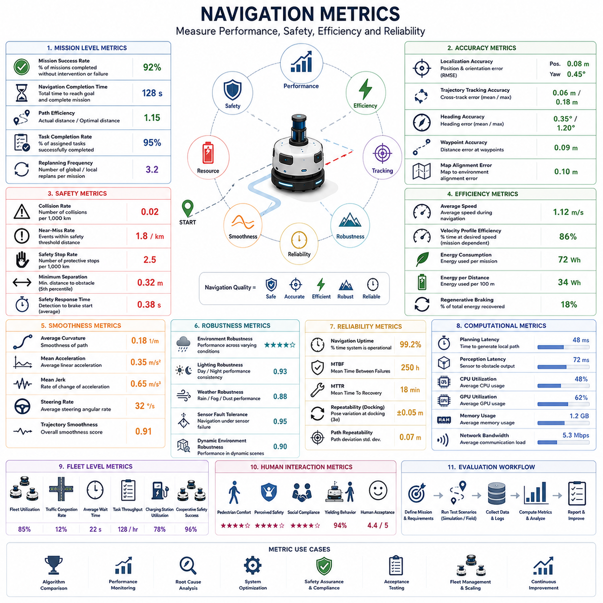
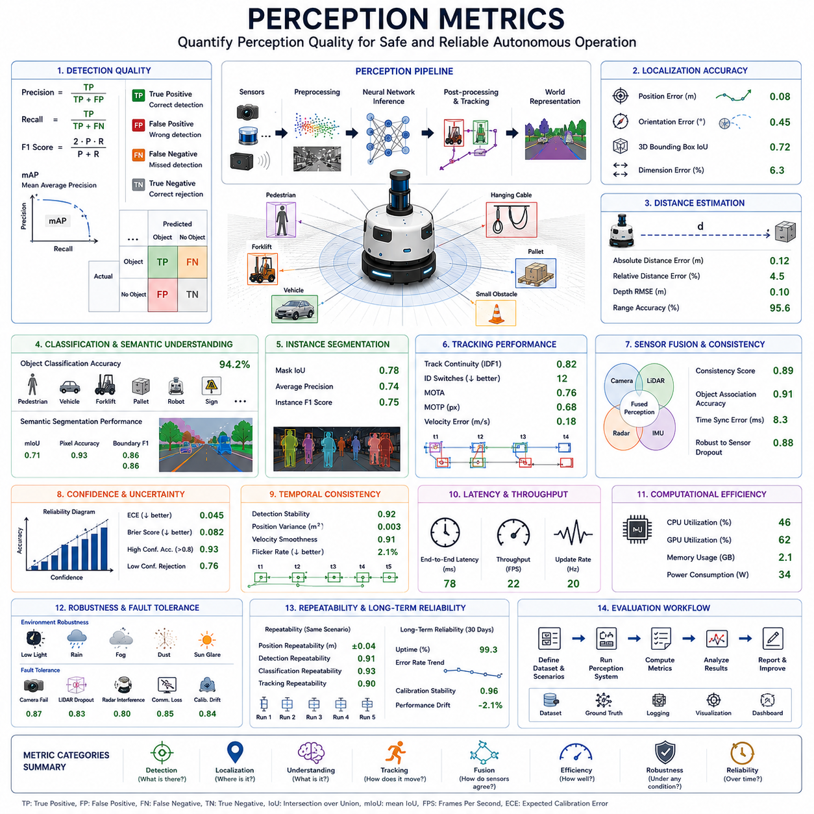
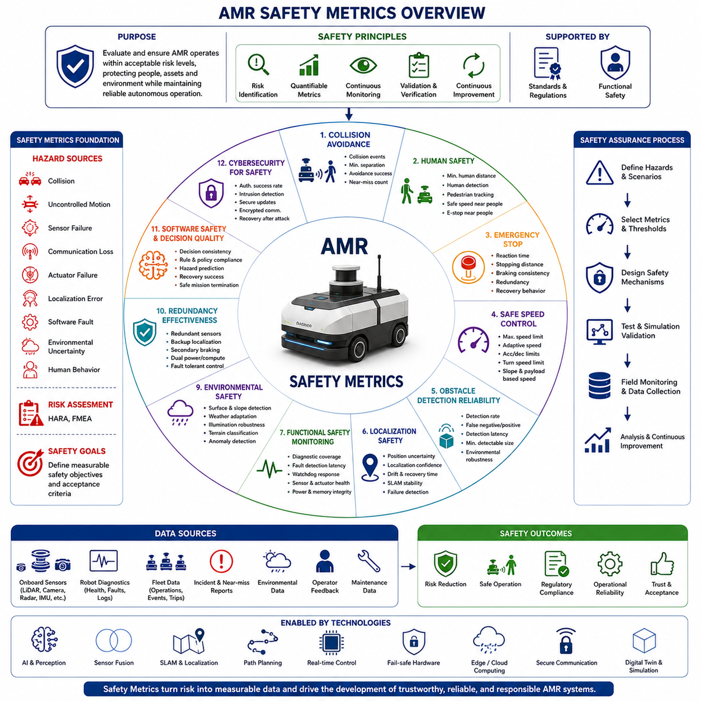
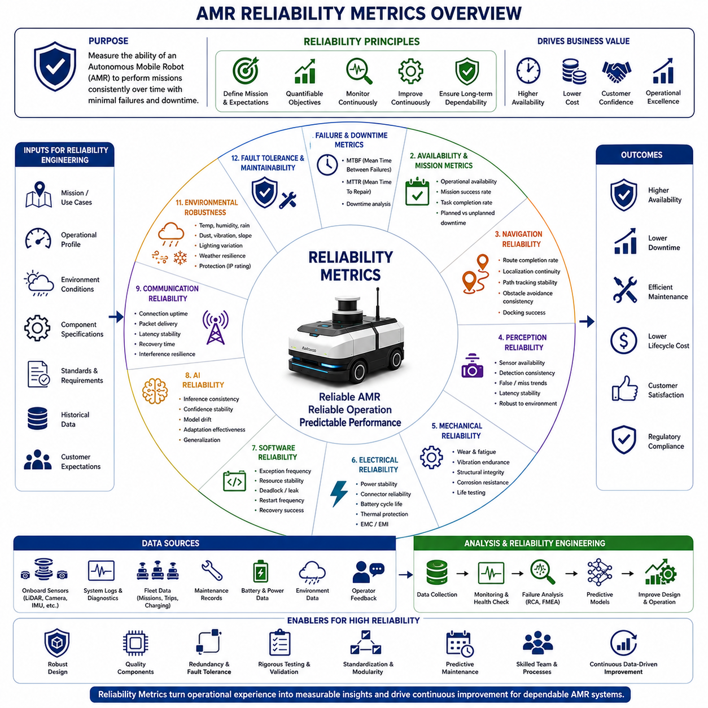
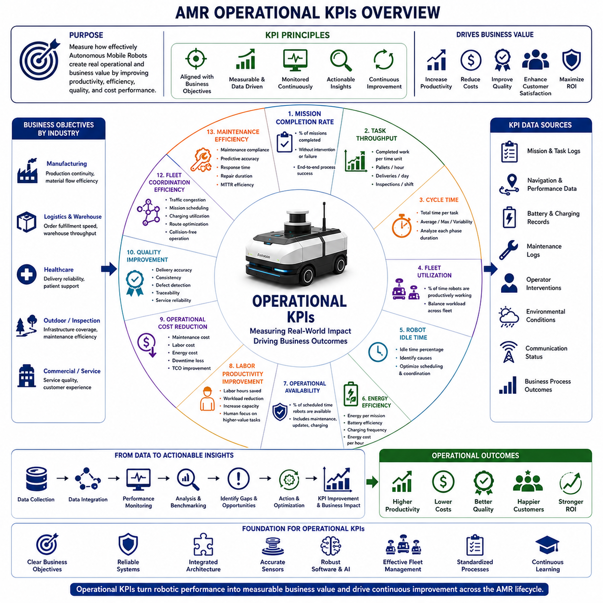

**Volume 01. AMR Foundations and System Architecture**

# 12. AMR Performance Metrics · AMR 성능 지표

## 12.01 Navigation Metrics · 내비게이션 지표

{width="7.268055555555556in" height="7.268055555555556in"}

내비게이션 지표(내비게이션 지표, Navigation Metrics)는 자율주행 모바일 로봇(Autonomous Mobile Robot, AMR)의 내비게이션 성능, 안전성, 효율성, 강인성(Robustness), 신뢰성을 객관적이고 정량적으로 평가하기 위한 방법이다. 주관적인 관찰이나 정성적인 평가와 달리, 내비게이션 지표는 로봇의 움직임과 동작을 측정 가능한 수치로 변환하여 엔지니어링 분석, 시스템 최적화, 제품 벤치마킹(Benchmarking), 인수 시험(Acceptance Testing)에 활용할 수 있도록 한다. 명확하게 정의된 지표는 알고리즘 간 성능 비교, 개선 효과 검증, 성능 저하 분석, 다양한 환경과 운용 조건에서 시스템이 요구사항을 지속적으로 만족하는지 확인하는 데 중요한 역할을 수행한다.

내비게이션 지표의 가장 중요한 목적은 로봇이 안전성, 효율성, 신뢰성을 유지하면서 주어진 임무를 성공적으로 수행하는지를 평가하는 것이다. 목적지에 도착했다는 사실만으로 내비게이션이 성공했다고 판단할 수는 없다. 실제 평가는 계획된 경로를 얼마나 정확하게 따라갔는지, 장애물을 얼마나 효율적으로 회피했는지, 얼마나 부드럽게 이동했는지, 환경 변화에 얼마나 빠르게 대응했는지, 그리고 다양한 운용 환경에서 얼마나 일관된 성능을 유지했는지를 종합적으로 고려해야 한다. 따라서 내비게이션 성능 평가는 단일 지표가 아니라 여러 개의 상호 보완적인 평가 지표를 함께 사용해야 한다.

임무 성공률(임무 성공률, Mission Success Rate)은 가장 상위 수준의 내비게이션 성능 지표 가운데 하나이다. 이는 작업자의 개입 없이 충돌, 안전 규정 위반, 임무 중단 없이 전체 임무를 성공적으로 완료한 비율을 의미한다. 일반적으로 성공적인 임무는 목적지 도착, 할당된 작업 수행, 그리고 미리 정의된 제약 조건 내에서 정상적인 운용 상태로 복귀하는 것을 포함한다. 임무 성공률은 개별 기능의 성능이 아니라 실제 운용 환경에서 전체 내비게이션 시스템이 얼마나 효과적으로 동작하는지를 평가하는 대표적인 지표이다.

내비게이션 완료 시간(내비게이션 완료 시간, Navigation Completion Time)은 시작 위치에서 목적지까지 이동하면서 임무를 완료하는 데 걸린 전체 시간을 의미한다. 이 지표는 경로 계획(Path Planning), 장애물 회피(Obstacle Avoidance), 차량 제어(Vehicle Dynamics), 환경과의 상호작용(Environment Interaction) 등을 모두 포함하는 종합적인 운용 효율성을 나타낸다. 완료 시간이 과도하게 길다면 비효율적인 경로 계획, 지나치게 보수적인 안전 정책, 위치 추정 오차(Localization Uncertainty), 또는 계산 성능 저하와 같은 문제가 존재할 가능성이 있다.

경로 효율성(경로 효율성, Path Efficiency)은 실제 주행 경로가 최적 또는 계획된 경로와 얼마나 유사한지를 평가하는 지표이다. 실제 이동 거리와 이론적으로 가능한 최단 경로의 비율을 계산하면 직관적으로 내비게이션 품질을 평가할 수 있다. 값이 1에 가까울수록 효율적인 경로를 따라 이동한 것이며, 값이 크게 증가하면 불필요한 우회, 반복적인 재경로 계획(Replanning), 위치 추정 드리프트(Drift), 비효율적인 장애물 회피 등이 발생했음을 의미한다. 경로 효율성은 임무 수행 시간, 배터리 소비, 플릿(Fleet) 전체 생산성에 직접적인 영향을 미친다.

궤적 추종 정확도(궤적 추종 정확도, Trajectory Tracking Accuracy)는 로봇이 계획된 경로를 얼마나 정확하게 따라가는지를 측정하는 지표이다. 위치 오차(Position Error), 방향 오차(Heading Error), 횡방향 오차(Cross-Track Error), 자세 안정성(Orientation Consistency) 등을 경로 전체에서 지속적으로 평가한다. 높은 추종 정확도는 도킹(Docking), 좁은 복도 주행, 정밀 물류 작업, 로봇 암(Robot Arm)을 이용한 작업과 같이 위치 정확도가 매우 중요한 응용 분야에서 필수적인 성능 요소이다.

위치 추정 정확도(위치 추정 정확도, Localization Accuracy)는 모든 내비게이션 의사결정의 기반이 되는 핵심 지표이다. 위치 오차와 자세 오차는 모션 캡처 시스템(Motion Capture System), 토털 스테이션(Total Station), 고정밀 GNSS(Global Navigation Satellite System), 또는 정밀 기준 지도(Ground Truth Map)를 이용하여 측정한다. 위치 추정 정확도는 정적 환경과 동적 환경 모두에서 평가해야 하며, 장기적인 드리프트(Long-Term Drift), 위치 복구 능력(Recovery), 환경 변화에 대한 강인성도 함께 검증해야 한다.

장애물 회피 성능(장애물 회피 성능, Obstacle Avoidance Performance)은 로봇이 장애물을 탐지하고 충돌 위험을 예측하며 안전한 우회 경로를 생성하는 능력을 평가한다. 주요 평가 항목에는 장애물 검출 성공률, 최소 안전 거리(Minimum Separation Distance), 충돌 발생 빈도(Collision Frequency), 근접 위험(Near-Miss) 발생 횟수, 회피 중 궤적의 부드러움(Trajectory Smoothness), 장애물이 제거된 이후의 회복 시간(Recovery Time) 등이 포함된다. 우수한 장애물 회피는 단순히 장애물을 멀리 피하는 것이 아니라 안전성과 작업 효율 사이의 균형을 유지하는 것을 의미한다.

충돌률(충돌률, Collision Rate)은 안전성과 직접적으로 관련된 가장 중요한 내비게이션 지표 가운데 하나이다. 이는 운용 중 로봇이 장애물, 시설물, 차량, 사람과 실제로 접촉한 빈도를 측정한다. 작은 충돌이라도 장비 손상, 생산 중단, 사용자 신뢰 저하, 산업 안전 규정 위반을 초래할 수 있다. 따라서 많은 상용 시스템에서는 충돌 없는 운용(Collision-Free Operation)을 단순한 목표가 아니라 필수적인 인수 기준으로 정의한다.

근접 위험 사건(근접 위험 사건, Near-Miss Event)은 실제 충돌이 발생하지 않았더라도 매우 중요한 안전 정보를 제공한다. 일반적으로 실제 접촉은 발생하지 않았지만 장애물과의 거리가 미리 정의된 안전 임계값 이하로 감소한 상황을 의미한다. 근접 위험 발생 빈도를 지속적으로 분석하면 실제 사고가 발생하기 전에 위험한 내비게이션 동작을 발견할 수 있다. 충돌은 드물게 발생하는 사건이므로 근접 위험을 줄이는 것이 장기적인 안전성 향상에 더욱 효과적인 경우가 많다.

안전 정지 성능(안전 정지 성능, Safety Stopping Performance)은 위험 상황이 발생했을 때 로봇이 얼마나 빠르고 안정적으로 반응하는지를 평가한다. 응답 지연 시간(Reaction Latency), 제동 시작 시간(Braking Initiation Time), 정지 거리(Stopping Distance), 감속 안정성(Deceleration Consistency), 비상 정지(Emergency Stop)의 신뢰성, 기능 안전 요구사항 준수 여부 등을 측정한다. 이러한 평가는 보호 동작이 요구된 시간 내에 수행되는지를 확인하는 동시에 불필요한 긴급 정지가 작업 효율을 저하시키지 않는지도 함께 평가한다.

주행 부드러움(주행 부드러움, Navigation Smoothness)은 기계적 특성과 운용 품질을 동시에 나타내는 중요한 지표이다. 부드러운 주행은 급격한 조향 변화, 과도한 가속, 진동성 움직임, 불필요한 속도 변화 등을 최소화한다. 평균 곡률(Average Curvature), 조향 변화율(Steering Rate), 가속도(Acceleration), 저크(Jerk), 각속도 변화(Angular Velocity Variation), 궤적 연속성(Trajectory Continuity) 등이 대표적인 평가 항목이다. 부드러운 내비게이션은 승차감 향상뿐 아니라 적재물 안정성, 기계 내구성, 센서 안정성, 에너지 효율 향상에도 기여한다.

속도 프로파일 평가(속도 프로파일 평가, Velocity Profile Evaluation)는 다양한 주행 상황에서 로봇이 적절한 속도를 유지하는지를 분석한다. 목표 속도(Commanded Velocity)와 실제 차량 속도를 비교하면서 가속, 감속, 속도 제어 정확도, 속도 안정성을 평가한다. 우수한 속도 제어는 복도의 폭, 장애물 밀도, 보행자 활동, 노면 상태, 임무 우선순위 등에 따라 자연스럽게 속도를 조절하면서도 안전 규정을 항상 만족해야 한다.

에너지 효율성(에너지 효율성, Energy Efficiency)은 배터리 기반 자율주행 모바일 로봇에서 점점 더 중요한 내비게이션 지표가 되고 있다. 경로 선택(Route Selection), 가속 방식, 정지 빈도, 조향 동작, 공회전 시간은 모두 전력 소비에 직접적인 영향을 준다. 일반적으로 킬로미터당 소비 전력(Watt-Hours per Kilometer), 임무당 소비 에너지, 배터리 활용 효율(Battery Utilization Efficiency), 회생 제동(Regenerative Braking) 효과, 잔여 주행 가능 거리 예측 정확도 등이 주요 평가 항목으로 사용된다.

계산 성능 지표(계산 성능 지표, Computational Performance Metrics)는 내비게이션 소프트웨어가 실시간 요구사항을 만족하는지를 평가한다. 경로 계획 지연(Path Planning Latency), 장애물 처리 시간, 위치 추정 갱신 주기, 센서 융합 처리량(Throughput), CPU 사용률, GPU 사용률, 메모리 사용량, 통신 대역폭, 스케줄링 안정성 등을 평가한다. 안정적인 계산 성능은 자율주행 시스템이 예측 가능한 실시간 동작을 유지하기 위한 필수 조건이다.

강인성 지표(강인성 지표, Robustness Metrics)는 이상적인 실험실 환경이 아니라 다양한 어려운 환경에서 내비게이션 성능을 평가한다. 저조도, 비, 안개, 먼지, 복잡한 환경, 이동 장애물, 비포장 노면, 위치 추정 성능 저하, 센서 고장, 통신 장애, 지도 불일치 등의 조건을 포함하여 시험을 수행한다. 우수한 강인성을 가진 시스템은 이러한 다양한 환경 변화 속에서도 허용 가능한 수준의 내비게이션 성능을 유지해야 한다.

복구 성능(복구 성능, Recovery Performance)은 예상하지 못한 오류나 비정상 상황 이후 시스템이 얼마나 효과적으로 정상 상태로 복귀하는지를 평가한다. 위치 추정 실패(Localization Loss), 센서 고장, 차단된 경로(Blocked Path), 통신 장애, 액추에이터(Actuator) 이상, 긴급 정지 이후의 복구를 포함한다. 복구 성공률, 복구 시간, 재경로 계획 횟수, 작업자 개입 빈도, 임무 지속 가능성 등이 주요 평가 지표이다.

반복성(반복성, Repeatability)은 동일한 임무를 동일한 조건에서 여러 번 수행했을 때 얼마나 일관된 결과를 얻는지를 평가하는 지표이다. 위치 반복성(Position Repeatability), 도킹 반복성(Docking Repeatability), 경로 일관성(Path Consistency), 시간 편차(Time Variation), 내비게이션 정확도 분산(Accuracy Variance)을 측정한다. 높은 반복성은 산업 자동화에서 매우 중요하며 후속 공정이 항상 동일한 로봇 동작을 기대할 수 있도록 한다.

가용성 및 신뢰성 지표(가용성 및 신뢰성 지표, Availability and Reliability Metrics)는 장기간 운용에서 시스템의 실질적인 성능을 평가한다. 평균 고장 간격(Mean Time Between Failures, MTBF), 평균 복구 시간(Mean Time To Recovery, MTTR), 임무 가용성(Mission Availability), 내비게이션 가동 시간(Uptime), 소프트웨어 안정성, 센서 신뢰성, 통신 신뢰성, 유지보수 빈도 등을 종합적으로 평가한다. 특히 산업 환경에서는 예기치 않은 시스템 중단이 생산성에 직접적인 영향을 미치므로 높은 가용성이 매우 중요하다.

플릿 수준 내비게이션 지표(플릿 수준 내비게이션 지표, Fleet-Level Navigation Metrics)는 개별 로봇이 아니라 여러 대의 로봇이 함께 운용되는 시스템 전체를 평가한다. 플릿 활용률(Fleet Utilization), 교통 혼잡 빈도, 교차로 대기 시간, 작업 스케줄링 효율(Task Scheduling Efficiency), 충전 스테이션 활용률, 평균 작업 처리량(Throughput), 협력형 충돌 회피(Cooperative Collision Avoidance), 전체 시스템 생산성 등이 주요 평가 대상이다. 이러한 지표는 전체 플릿의 운용 효율을 최적화하는 데 활용된다.

사람과의 상호작용 지표(사람과의 상호작용 지표, Human Interaction Metrics)는 사람과 함께 운용되는 환경에서 내비게이션 품질을 평가한다. 보행자의 편안함(Pedestrian Comfort), 체감 안전성(Perceived Safety), 사회적 규범 준수(Social Compliance), 양보 행동(Yielding Behavior), 사용자 수용성(Human Acceptance), 작업 방해 빈도, 움직임의 예측 가능성(Predictability) 등을 평가한다. 병원, 창고, 공항, 캠퍼스, 공공시설과 같은 환경에서는 기술적 성능뿐 아니라 사람이 신뢰할 수 있는 자연스러운 움직임도 매우 중요하다.

내비게이션 성능 평가는 정량적인 수치뿐 아니라 정성적인 엔지니어링 분석을 함께 수행해야 한다. 통계 분석(Statistical Analysis), 시각화 도구(Visualization Tool), 재생 시스템(Replay System), 실패 분석(Failure Investigation), 원인 분석(Root Cause Analysis), 장기 운용 모니터링(Long-Term Monitoring)은 단순한 수치만으로는 발견하기 어려운 성능 변화와 문제점을 파악하는 데 도움을 준다. 이러한 지속적인 성능 모니터링은 제품 개발과 상용 운용 전 과정에서 반복적인 시스템 개선을 가능하게 한다.

미래의 내비게이션 지표(Navigation Metrics)는 파운데이션 모델(Foundation Model), 디지털 트윈(Digital Twin), 의미 기반 월드 모델(Semantic World Model), 클라우드 기반 플릿 분석(Cloud-Based Fleet Analytics), 자기지도학습(Self-Supervised Learning), 예측 기반 성능 평가(Predictive Performance Evaluation)를 적극적으로 활용하게 될 것이다. 미래의 평가 시스템은 과거의 내비게이션 성능만 분석하는 것이 아니라 미래의 위험을 예측하고, 고장이 발생하기 전에 성능 저하를 예측하며, 자동으로 어려운 시험 시나리오를 생성하고, 실제 운용 중 수집된 데이터를 이용하여 평가 기준 자체를 지속적으로 발전시킬 것이다. 이러한 지능형 평가 체계는 차세대 자율주행 모바일 로봇의 내비게이션 성능을 더욱 종합적이고 신뢰성 있게 평가하는 핵심 기술이 될 것이다.

## 12.02 Perception Metrics · 인지 지표

{width="7.268055555555556in" height="7.268055555555556in"}

인지 지표(인지 지표, Perception Metrics)는 자율주행 모바일 로봇(Autonomous Mobile Robot, AMR)이 주변 환경을 얼마나 정확하고 안정적으로 인식하고 이해하며 해석하는지를 객관적이고 정량적으로 평가하기 위한 방법이다. 자율주행의 모든 내비게이션, 경로 계획(Path Planning), 의사결정(Decision Making)은 인지 결과를 기반으로 수행되므로 인지 시스템의 성능을 정확하게 평가하는 것은 시스템 개발과 상용화 전 과정에서 매우 중요하다. 정성적인 관찰과 달리 인지 지표는 센서 출력과 알고리즘의 동작을 수치화하여 엔지니어링 최적화, 알고리즘 비교, 제품 검증, 장기적인 성능 모니터링에 활용할 수 있도록 한다. 적절하게 설계된 인지 지표는 다양한 환경, 센서 구성, 운용 조건에서도 시스템이 요구 성능을 지속적으로 만족하는지를 객관적으로 검증할 수 있게 해준다.

인지 지표의 가장 중요한 목적은 인지 시스템이 안전하고 효율적인 자율주행을 수행하기 위해 충분히 신뢰할 수 있는 환경 정보를 제공하는지를 평가하는 것이다. 성공적인 인지는 단순히 객체를 많이 검출하는 것만으로 판단되지 않는다. 객체 인식(Object Recognition), 위치 추정(Localization), 의미 이해(Semantic Understanding), 센서 융합(Sensor Fusion), 환경 변화에 대한 강인성(Robustness), 계산 효율성(Computational Efficiency), 시간적 안정성(Temporal Stability) 등을 종합적으로 고려해야 한다. 인지 기능은 여러 요소가 서로 긴밀하게 연결되어 있으므로 단일 지표만으로는 성능을 충분히 평가할 수 없으며, 다양한 평가 지표를 함께 사용하는 것이 필수적이다.

검출 정확도(검출 정확도, Detection Accuracy)는 가장 기본적인 인지 성능 지표 가운데 하나이다. 이는 실제 환경에 존재하는 객체를 인지 시스템이 얼마나 정확하게 발견하는지를 평가한다. 검출 정확도는 센서 성능, 환경 조건, 객체의 형태와 재질, 알고리즘 성능, 센서 보정(Calibration) 등에 의해 영향을 받는다. 시험은 정적 객체와 동적 객체를 모두 포함해야 하며, 사람(Human), 차량(Vehicle), 자율주행 로봇, 팔레트(Pallet), 산업 장비, 건설 자재, 소형 장애물(Small Obstacle), 매달린 장애물(Hanging Obstacle), 불규칙한 구조물 등 실제 운용 환경에서 발생할 수 있는 다양한 대상에 대해 수행되어야 한다.

정밀도(정밀도, Precision)는 인지 시스템이 검출한 객체 가운데 실제 존재하는 객체가 차지하는 비율을 의미한다. 높은 정밀도는 잘못된 객체를 검출하는 오검출(False Positive)이 적다는 것을 의미한다. 오검출이 많으면 로봇은 불필요하게 감속하거나 장애물을 회피하려고 하며 계산 부하가 증가하고 임무 수행 효율도 감소한다. 따라서 다양한 환경 조건에서도 높은 검출 민감도를 유지하면서 동시에 오검출을 최소화하는 것이 중요하다.

재현율(재현율, Recall)은 실제 존재하는 객체 가운데 인지 시스템이 성공적으로 검출한 객체의 비율을 나타낸다. 높은 재현율은 미검출(False Negative)을 줄여 충돌 위험을 감소시키는 데 중요한 역할을 한다. 검출되지 않은 장애물은 내비게이션과 충돌 회피에서 전혀 고려될 수 없으므로 매우 위험한 실패로 간주된다. 일반적으로 정밀도와 재현율은 서로 영향을 주기 때문에 다양한 운용 환경에서 두 지표의 균형을 적절하게 유지하는 것이 중요하다.

F1 점수(F1 Score)는 정밀도와 재현율을 하나의 지표로 결합하여 전체 검출 성능을 평가하는 방법이다. 이 지표는 특정 요소만 강조하지 않고 전체적인 검출 품질을 균형 있게 평가할 수 있기 때문에 서로 다른 인지 알고리즘을 비교할 때 매우 유용하다. 알고리즘 벤치마크(Benchmark), 하이퍼파라미터(Hyperparameter) 최적화, 회귀 시험(Regression Testing) 등에서 소프트웨어 개선 효과를 평가하는 대표적인 지표로 활용된다.

평균 정밀도(mAP, mean Average Precision)는 현대 객체 검출(Object Detection) 알고리즘을 평가하는 가장 널리 사용되는 표준 지표 가운데 하나이다. 이 지표는 여러 신뢰도 임계값(Confidence Threshold)과 객체 종류에 대해 검출 정확도와 위치 정확도를 함께 평가한다. 다양한 신경망 구조(Neural Network Architecture), 데이터셋(Dataset), 학습 방법으로 개발된 객체 검출 모델을 동일한 기준으로 비교할 수 있기 때문에 컴퓨터 비전(Computer Vision) 연구와 산업용 인지 시스템 개발에서 매우 중요하게 사용된다.

위치 추정 정확도(위치 추정 정확도, Localization Accuracy)는 검출된 객체가 로봇 좌표계(Robot Coordinate System)에서 얼마나 정확한 위치에 존재하는지를 평가하는 지표이다. 위치 오차(Position Error), 자세 오차(Orientation Error), 바운딩 박스(Bounding Box) 정확도, 3차원 중심점(Centroid) 계산 정확도, 객체 크기 추정(Object Dimension Estimation) 등이 주요 평가 대상이다. 내비게이션, 장애물 회피, 로봇 암 제어, 플릿(Fleet) 협업은 모두 정확한 위치 정보를 기반으로 수행되므로 단순한 객체 검출보다 위치 정확도가 더욱 중요한 경우가 많다.

거리 추정 정확도(거리 추정 정확도, Distance Estimation Accuracy)는 로봇과 주변 객체 사이의 거리를 얼마나 정확하게 계산하는지를 평가한다. 카메라는 기하학적 계산을 통해 간접적으로 거리를 추정하는 반면, LiDAR, 레이더(Radar), 깊이 카메라(Depth Camera)는 보다 직접적으로 거리를 측정한다. 거리 추정은 객체의 크기, 재질, 환경 조건, 측정 거리 등에 따라 성능이 달라질 수 있으므로 다양한 조건에서 정량적으로 평가해야 한다.

객체 분류 정확도(객체 분류 정확도, Object Classification Accuracy)는 검출된 객체가 올바른 의미적 범주(Semantic Category)로 분류되는지를 평가한다. 인지 시스템은 일반적으로 사람, 지게차(Forklift), 자율주행 로봇, 승용차, 트럭, 팔레트, 박스(Box), 교통 표지판(Traffic Sign), 건설 장비, 식생(Vegetation), 건물(Building), 기타 장애물 등을 구분한다. 정확한 의미 기반 분류는 객체 종류에 따라 서로 다른 안전 거리, 행동 전략, 경로 계획을 적용할 수 있도록 지원한다.

의미 분할 성능(의미 분할 성능, Semantic Segmentation Performance)은 영상의 모든 픽셀이나 포인트 클라우드(Point Cloud)의 모든 점이 올바른 의미 클래스로 분류되는지를 평가한다. 객체 검출과 달리 의미 분할은 도로(Road), 바닥(Floor), 벽(Wall), 식생, 건물, 보도(Sidewalk), 장애물, 주행 가능 영역(Traversable Region), 배경(Background) 등을 동시에 구분하여 밀집된(Dense) 환경 표현을 생성한다. 대표적인 평가 지표로는 픽셀 정확도(Pixel Accuracy), 평균 IoU(mean Intersection over Union), Dice 계수(Dice Coefficient), 경계 정확도(Boundary Accuracy), 클래스별 분할 성능 등이 사용된다.

인스턴스 분할(인스턴스 분할, Instance Segmentation)은 동일한 클래스에 속하는 여러 객체를 각각 독립적으로 구분하는 성능을 평가한다. 예를 들어 여러 명의 보행자를 하나의 그룹으로 처리하는 것이 아니라 각각 독립된 객체로 분리하여 인식한다. 마스크(Mask) 정확도, 객체 분리 성능(Object Separation), 경계 정확도(Boundary Precision), 밀집 환경에서의 분할 안정성 등이 주요 평가 대상이며, 객체 추적과 행동 예측에서 매우 중요한 역할을 수행한다.

객체 추적 지표(객체 추적 지표, Object Tracking Metrics)는 인지 시스템이 시간에 따라 동일한 객체를 얼마나 안정적으로 추적하는지를 평가한다. 추적 연속성(Track Continuity), 객체 ID 유지(Identity Preservation), 이동 경로 안정성(Trajectory Stability), 속도 추정 정확도(Velocity Estimation Accuracy), 가속도 추정(Acceleration Estimation), 일시적인 가림(Occlusion) 이후의 추적 복구 성능 등이 포함된다. 안정적인 객체 추적은 행동 예측, 동적 장애물 회피, 협력형 자율주행을 위해 매우 중요하다.

다중 객체 추적 성능(다중 객체 추적 성능, Multi-Object Tracking Performance)은 복잡한 산업 환경이나 도심 환경에서 특히 중요한 지표이다. 인지 시스템은 서로 다른 객체가 교차하거나 일시적으로 가려지더라도 각각의 객체 ID를 유지해야 한다. MOTA(Multiple Object Tracking Accuracy), MOTP(Multiple Object Tracking Precision), 객체 ID 변경(Identity Switch), 추적 단절(Fragmentation), 추적 일관성 등이 대표적인 평가 지표이며, 실제 운용 환경에서의 추적 안정성을 종합적으로 평가한다.

센서 융합 일관성(센서 융합 일관성, Sensor Fusion Consistency)은 서로 다른 센서의 정보를 하나의 통합된 환경 표현으로 얼마나 안정적으로 결합하는지를 평가한다. 융합 결과와 개별 센서의 결과를 비교하면서 센서 간 일치도(Agreement), 신뢰도 추정(Confidence Estimation), 객체 연관(Object Association), 시간 동기화(Time Synchronization), 센서 고장 시의 강인성 등을 함께 분석한다. 우수한 센서 융합은 일부 센서의 성능이 저하되더라도 전체 인지 성능을 안정적으로 유지할 수 있어야 한다.

신뢰도 추정 품질(신뢰도 추정 품질, Confidence Estimation Quality)은 인지 시스템이 출력하는 신뢰도 값이 실제 검출 정확도를 얼마나 잘 반영하는지를 평가한다. 높은 신뢰도를 가진 객체는 대부분 실제 객체여야 하며, 낮은 신뢰도는 실제로 불확실한 상황을 의미해야 한다. 신뢰도가 정확하게 보정되어 있을수록 내비게이션과 경로 계획은 불확실성을 고려한 더욱 안전한 의사결정을 수행할 수 있다.

시간적 일관성(시간적 일관성, Temporal Consistency)은 연속된 센서 프레임(Frame) 사이에서 인지 결과가 얼마나 안정적으로 유지되는지를 평가한다. 실제 변화가 없음에도 객체가 반복적으로 나타났다가 사라지거나 위치가 급격하게 변해서는 안 된다. 시간적 일관성이 낮으면 경로 계획이 불안정해지고, 반복적인 재경로 계획(Replanning)과 진동성 주행(Oscillatory Navigation)이 발생하여 계산 효율과 주행 품질이 모두 저하된다.

지연 시간(지연 시간, Latency)은 센서 데이터가 인지 결과로 변환되기까지 걸리는 전체 시간을 의미한다. 센서 데이터 획득, 전처리(Preprocessing), 신경망 추론(Inference), 센서 융합, 후처리(Post-Processing), 객체 추적, 내비게이션 시스템으로의 데이터 전달 시간을 모두 포함한다. 낮은 지연 시간은 특히 고속 자율주행에서 빠른 장애물 회피와 정확한 이동 경로 예측을 가능하게 한다.

처리량(처리량, Throughput)은 인지 시스템이 실시간으로 얼마나 많은 센서 데이터를 지속적으로 처리할 수 있는지를 평가한다. 일반적으로 초당 처리 프레임 수(Frames Per Second), 포인트 클라우드 갱신 주기, 센서 융합 갱신율(Update Rate), 장시간 운용 시의 처리 안정성 등을 측정한다. 일정한 처리량을 유지하는 것은 실시간 자율주행에서 결정론적(Deterministic) 동작을 유지하기 위해 매우 중요하다.

계산 효율성(계산 효율성, Computational Efficiency)은 CPU 사용률, GPU 사용률, 메모리 사용량(Memory Consumption), 저장 장치 대역폭(Storage Bandwidth), 통신 부하(Communication Overhead), 전력 소비(Energy Consumption)를 평가한다. 효율적인 인지 알고리즘은 제한된 연산 자원과 전력 환경에서도 높은 인지 성능을 유지하여 임베디드(Embedded) 컴퓨팅 시스템에서도 안정적으로 동작할 수 있어야 한다.

환경 강인성(환경 강인성, Environmental Robustness)은 이상적인 실험실 환경이 아니라 다양한 실제 운용 환경에서 인지 성능을 평가하는 지표이다. 저조도(Low Illumination), 직사광선, 그림자, 비(Rain), 안개(Fog), 눈(Snow), 먼지(Dust), 연기(Smoke), 반사 표면(Reflective Surface), 투명 물체(Transparent Material), 울퉁불퉁한 노면, 복잡한 산업 환경, 식생, 다양한 기상 조건 등을 포함하여 시험을 수행한다. 강인한 인지 시스템은 이러한 환경 변화에도 허용 가능한 수준의 성능을 유지해야 한다.

고장 허용성(고장 허용성, Fault Tolerance)은 일부 하드웨어가 고장 나거나 센서 성능이 저하된 상황에서도 인지 시스템이 얼마나 안정적으로 동작하는지를 평가한다. 카메라 고장, LiDAR 데이터 손실(Packet Loss), 레이더 간섭, 통신 장애, 센서 보정 오차, 위치 추정 저하, 프로세서 과부하, 시간 동기화 오류 등이 대표적인 시험 조건이다. 우수한 인지 시스템은 이러한 상황에서도 점진적 성능 저하(Graceful Degradation)를 통해 최소한의 안전한 운용 능력을 유지해야 한다.

반복성(반복성, Repeatability)은 동일한 조건에서 동일한 인지 작업을 여러 번 수행했을 때 얼마나 일관된 결과를 얻는지를 평가한다. 객체 위치, 객체 분류, 신뢰도 값, 분할 경계, 추적 경로 등이 반복 실험에서도 안정적으로 유지되어야 한다. 높은 반복성은 알고리즘 검증을 단순화하고 산업 자동화 환경에서 예측 가능한 시스템 동작을 보장한다.

장기 신뢰성(장기 신뢰성, Long-Term Reliability)은 오랜 기간 자율주행을 수행하는 동안 인지 시스템이 얼마나 안정적으로 동작하는지를 평가한다. 센서 노화(Sensor Aging), 온도 변화(Thermal Effect), 센서 보정 안정성, 소프트웨어 안정성, 통신 신뢰성, 메모리 무결성(Memory Integrity), 계산 성능, 환경 적응성 등을 수주 또는 수개월 동안 지속적으로 분석한다. 산업용 자율주행 로봇은 최소한의 유지보수만으로 장기간 운용되어야 하므로 장기 신뢰성이 매우 중요한 평가 요소가 된다.

인지 성능 평가는 정량적인 수치뿐 아니라 정성적인 엔지니어링 분석을 함께 수행해야 한다. 통계 분석(Statistical Analysis), 시각화 도구(Visualization Tool), 동기화 데이터 재생(Data Replay), 오류 분포(Error Distribution), 혼동 행렬(Confusion Matrix), 실패 분석(Failure Investigation), 원인 분석(Root Cause Analysis), 장기 모니터링(Long-Term Monitoring)은 단순한 수치만으로 발견하기 어려운 문제를 찾아내는 데 도움을 준다. 이러한 지속적인 평가는 제품 개발과 상용 운용 전 과정에서 반복적인 성능 향상을 가능하게 한다.

미래의 인지 지표(Perception Metrics)는 파운데이션 모델(Foundation Model), 멀티모달 월드 모델(Multimodal World Model), 디지털 트윈(Digital Twin), 자기지도학습(Self-Supervised Learning), 클라우드 기반 플릿 분석(Cloud-Based Fleet Analytics), 불확실성 기반 평가(Uncertainty-Aware Evaluation), 예측 기반 성능 분석(Predictive Performance Assessment)을 적극적으로 활용하게 될 것이다. 미래의 평가 시스템은 과거의 인지 성능만 분석하는 것이 아니라 미래의 운용 위험을 예측하고, 성능 저하를 사전에 발견하며, 자동으로 어려운 시험 시나리오를 생성하고, 실제 운용 데이터를 이용하여 평가 기준을 지속적으로 개선하게 될 것이다. 이러한 지능형 평가 체계는 차세대 자율주행 인지 시스템의 신뢰성, 적응성, 안전성을 크게 향상시키는 핵심 기술이 될 것이다.

## 12.03 Safety Metrics · 안전 지표

{width="7.268055555555556in" height="7.268055555555556in"}

안전성 지표(Safety Metrics)는 자율이동로봇(Autonomous Mobile Robot, AMR)이 사람, 장비, 기반 시설(Infrastructure), 주변 환경과의 상호작용에서 허용 가능한 위험 수준(Acceptable Risk Level) 내에서 안전하게 운용되는지를 객관적으로 평가하기 위한 방법을 제공한다. 효율성이나 생산성을 측정하는 성능 지표(Performance Metrics)와 달리 안전성 지표는 위험 상황(Hazardous Situation)을 회피하고, 운영 위험(Operational Risk)을 최소화하며, 정상 및 비정상 조건 모두에서 예측 가능한 동작(Predictable Behavior)을 유지하는 능력을 정량적으로 평가한다. 이러한 측정은 AMR 시스템의 전체 생명주기(Lifecycle)에 걸쳐 엔지니어링 검증(Engineering Validation), 규제 준수(Regulatory Compliance), 지속적인 개선(Continuous Improvement), 장기 운영 신뢰성(Long-term Operational Reliability)을 지원한다. 로봇이 산업 현장을 넘어 병원(Hospital), 물류창고(Warehouse), 공장(Factory), 공공장소(Public Space), 물류센터(Logistics Center), 스마트 시티(Smart City)와 같이 사람과 긴밀하게 상호작용하는 환경으로 확대되면서 안전성 지표의 중요성은 더욱 커지고 있다.

안전성 지표의 개발은 운영 위험 요소(Operational Hazard)와 허용 가능한 위험 수준을 명확히 이해하는 것에서 시작된다. 엔지니어는 충돌(Collision), 제어 불가능한 이동(Uncontrolled Motion), 센서 고장(Sensor Failure), 통신 장애(Communication Loss), 액추에이터 고장(Actuator Malfunction), 위치 추정 오류(Localization Error), 소프트웨어 결함(Software Fault), 환경 불확실성(Environmental Uncertainty), 사람의 행동(Human Behavior) 등 잠재적인 위험 요소를 먼저 식별한다. 이후 각각의 위험 요소에 대해 개발과 운영 과정에서 지속적으로 모니터링 가능한 정량적 안전성 지표(Safety Indicator)를 정의한다. 이러한 체계적인 접근은 추상적인 안전 요구사항(Safety Requirement)을 시험(Test), 시뮬레이션(Simulation), 현장 운용(Field Operation)을 통해 검증 가능한 엔지니어링 목표로 전환하며, 위험 분석 및 평가(Hazard Analysis and Risk Assessment, HARA)와 고장 형태 및 영향 분석(Failure Mode and Effects Analysis, FMEA)과 같은 위험 분석 방법론을 효과적으로 지원한다.

충돌 회피 성능(Collision Avoidance Performance)은 자율이동로봇의 가장 기본적인 안전성 지표 가운데 하나이다. 평가 항목에는 충돌 발생 횟수(Number of Collision Events), 무충돌 주행 거리(Collision-free Operating Distance), 장애물과의 최소 이격 거리(Minimum Separation Distance), 비상 개입 빈도(Emergency Intervention Frequency), 장애물 회피 성공률(Obstacle Avoidance Success Rate), 동적 환경(Dynamic Environment)에서의 안전한 주행 능력이 포함된다. 안전성 검증은 단순히 충돌이 발생하지 않았는지만 평가하는 것이 아니라 모든 주행 상황에서 충분한 안전 여유(Safety Margin)를 유지했는지를 함께 확인한다. 실제 충돌보다 근접 위험 상황(Near-miss Event)에 대한 지속적인 분석이 오히려 더 중요한 정보를 제공하는 경우가 많으며, 이는 실제 사고 이전에 안전 여유가 얼마나 확보되고 있는지를 보여준다.

사람 안전성 지표(Human Safety Metrics)는 작업자(Worker), 운영자(Operator), 방문객(Visitor), 보행자(Pedestrian)를 보호하기 위한 항목에 초점을 맞춘다. 주요 측정 항목으로는 사람과의 최소 안전 거리(Minimum Human Separation Distance), 사람 탐지 정확도(Human Detection Accuracy), 보행자 추적 신뢰성(Pedestrian Tracking Reliability), 제한 구역 접근 시 비상 정지(Emergency Stop) 응답 성능, 사람 주변에서의 안전 속도 제어(Safe Speed Adaptation), 협업 운용(Collaborative Operation) 요구사항 준수 여부 등이 있다. 사람 인식 기반 주행(Human-aware Navigation)은 보행자의 이동을 예측하고, 불필요한 간섭을 줄이며, 적절한 상호작용 거리를 유지하고, 사람에게 혼란이나 불안을 주지 않는 자연스러운 이동을 수행하는 능력으로 평가된다.

비상 정지 성능(Emergency Stop Performance)은 이상 상황이 감지된 이후 위험을 얼마나 신속하게 완화할 수 있는지를 결정하는 핵심 기능 안전성(Functional Safety) 지표이다. 엔지니어는 비상 정지 반응 시간(Emergency Stop Reaction Time), 다양한 적재 조건에서의 정지 거리(Stopping Distance), 제동 일관성(Braking Consistency), 감속 안정성(Deceleration Stability), 이중 정지 기능(Redundant Stopping Capability), 비상 정지 이후의 시스템 복구 동작(System Recovery Behavior)을 평가한다. 시험은 하드웨어 비상 정지 회로(Hardware Emergency Stop Circuit)와 소프트웨어 기반 안전 정지(Software Safety Stop)를 모두 포함하며, 최고 속도(Maximum Speed), 최대 적재량(Maximum Payload), 내리막 주행, 악조건 환경에서도 안전 기능이 정상적으로 동작하는지를 확인한다.

안전 속도 제어 지표(Safe Speed Control Metrics)는 로봇이 현재 환경과 운용 상황에 적절한 속도를 지속적으로 유지하는지를 평가한다. 최대 허용 속도(Maximum Allowable Speed), 사람 주변에서의 자동 감속(Adaptive Speed Reduction), 가속도 제한(Acceleration Limit), 감속의 부드러움(Deceleration Smoothness), 회전 속도 제한(Turning Speed Limitation), 경사도 기반 속도 조절(Slope-dependent Speed Adjustment), 적재량 기반 속도 제한(Payload-dependent Velocity Constraint) 등이 주요 측정 대상이다. 동적 속도 제어(Dynamic Speed Regulation)는 다양한 환경에서도 운동 에너지(Kinetic Energy)를 허용 범위 내로 유지하면서 작업 효율도 동시에 확보하도록 설계된다.

장애물 탐지 신뢰성(Obstacle Detection Reliability)은 모든 자율주행 의사결정이 환경 인식(Perception)에 의존하기 때문에 매우 중요한 안전성 지표이다. 주요 항목에는 장애물 탐지율(Obstacle Detection Rate), 미탐지율(False Negative Frequency), 오탐지율(False Positive Frequency), 탐지 지연 시간(Detection Latency), 최소 탐지 가능 크기(Minimum Detectable Obstacle Size), 센서 커버리지(Sensor Coverage), 악천후 환경에서의 인식 성능(Environmental Robustness) 등이 포함된다. 센서 융합(Sensor Fusion) 구조는 일부 센서가 일시적으로 성능이 저하되거나 고장 나더라도 안정적인 장애물 인식을 유지할 수 있는 능력을 평가한다.

위치 추정 안전성 지표(Localization Safety Metrics)는 로봇이 자율 의사결정을 수행하기 전에 자신의 위치를 충분한 신뢰도로 추정하고 있는지를 평가한다. 위치 불확실성(Position Uncertainty), 위치 추정 신뢰도(Localization Confidence), 지도 일관성(Map Consistency), 위치 복구 시간(Localization Recovery Time), 누적 드리프트(Drift Accumulation), GNSS 가용성(GNSS Availability), SLAM 안정성(SLAM Stability), 위치 추정 실패 감지(Localization Failure Detection)를 지속적으로 모니터링한다. 안전 중심 자율주행 시스템은 위치 신뢰도가 사전에 정의된 임계값 이하로 떨어질 경우 자동으로 속도를 줄이거나 운영자 개입을 요청하거나 안전 상태(Safe State)로 전환하여 잘못된 위치 정보로 인한 위험한 자율주행을 방지한다.

기능 안전성 모니터링(Functional Safety Monitoring)은 주행뿐 아니라 하드웨어와 소프트웨어의 전체 상태를 지속적으로 감시한다. 진단 범위(Diagnostic Coverage), 고장 탐지 시간(Fault Detection Latency), 프로세서 이중화(Processor Redundancy), 통신 무결성(Communication Integrity), 워치독(Watchdog) 응답 시간, 센서 상태 진단(Sensor Health Monitoring), 액추에이터 진단(Actuator Diagnostics), 메모리 무결성(Memory Integrity), 전원 시스템 모니터링(Power System Monitoring), 고장 분리(Fault Isolation Capability)를 평가하여 위험 상황으로 발전하기 전에 이상 상태를 조기에 탐지하도록 한다. 이러한 지표는 기능 안전 표준 준수와 Fail-safe 또는 Fail-operational 시스템 구현을 지원한다.

통신 신뢰성(Communication Reliability)은 특히 플릿 관리(Fleet Management) 환경에서 직접적인 안전 요소가 된다. 주요 측정 항목으로는 통신 가용성(Communication Availability), 지연 시간(Latency), 패킷 손실률(Packet Loss Rate), 시간 동기화 정확도(Synchronization Accuracy), 명령 전달 신뢰성(Command Delivery Reliability), 네트워크 복구 시간(Network Recovery Time), 일시적인 통신 장애에 대한 복원력(Communication Resilience)이 있다. 자율 로봇은 통신이 끊어진 경우에도 로컬(Local)에서 안전한 의사결정을 유지해야 하며, 통신 복구 후에는 중앙 플릿 관리 시스템과 원활하게 재동기화되어야 한다.

환경 안전성 지표(Environmental Safety Metrics)는 변화하는 운용 환경에 로봇이 얼마나 안전하게 적응하는지를 평가한다. 노면 상태 인식(Surface Condition Recognition), 경사 감지(Slope Detection), 기상 적응(Weather Adaptation), 조도 변화 대응(Illumination Robustness), 침수 감지(Water Intrusion Detection), 지형 분류(Terrain Classification), 장애물 예측(Obstacle Prediction), 환경 이상 탐지(Environmental Anomaly Identification)가 주요 평가 대상이다. 특히 실외 자율로봇(Outdoor Autonomous Robot)은 기상 변화, 험지, 식생, 공사 구간, 혼합 교통 환경 등 지속적으로 변화하는 조건에서도 안전성을 유지해야 한다.

이중화 효과(Redundancy Effectiveness)는 미션 크리티컬(Mission-critical) 로봇에서 필수적인 안전성 지표이다. 엔지니어는 이중 센서 일치도(Redundant Sensor Agreement), 백업 위치 추정 성능(Backup Localization Performance), 이중 제동 시스템(Secondary Braking Capability), 이중 통신 채널(Redundant Communication Channel), 이중 전원(Dual Power Supply), 프로세서 전환 동작(Processor Failover Behavior), 고장 허용 제어(Fault-tolerant Control Strategy)를 평가한다. 효과적인 이중화는 단일 부품의 고장이 즉시 위험 상황으로 이어지는 것을 방지하며, 시스템이 안전한 운용 모드로 전환될 수 있도록 한다.

안전성 지표는 비정상 상황에서 소프트웨어의 의사결정 품질도 함께 평가한다. 의사결정 일관성(Decision Consistency), 규칙 준수(Rule Compliance), 안전 정책 적용(Safety Policy Enforcement), 위험 예측 정확도(Hazard Prediction Accuracy), 충돌 상황 해결 능력(Conflict Resolution Reliability), 자율 복구 성공률(Autonomous Recovery Success Rate), 안전한 임무 종료(Safe Mission Termination Behavior)는 고수준 자율성(High-level Autonomy)의 신뢰성을 정량적으로 평가하는 기준이 된다. 인공지능(AI)은 이전에 경험하지 못한 상황에서도 예측 가능한 동작을 유지해야 하며, 불확실한 환경에서는 보다 보수적인 의사결정을 수행해야 한다.

사이버 보안(Cybersecurity)은 현대의 연결형 로봇에서 물리적 안전성과 직접 연결된다. 주요 안전 관련 보안 지표에는 인증 성공률(Authentication Success Rate), 비인가 접근 탐지(Unauthorized Access Detection), 소프트웨어 무결성 검증(Software Integrity Verification), 안전한 업데이트 신뢰성(Secure Update Reliability), 암호화 통신 적용률(Encrypted Communication Coverage), 침입 탐지 시간(Intrusion Detection Latency), 사이버 공격 이후 복구 능력(Recovery Capability), 악의적인 제어 시도에 대한 복원력(Resilience Against Malicious Control Attempt)이 포함된다. 안전한 로봇 아키텍처는 사이버 공격이 물리적 안전성이나 자율 의사결정에 직접적인 영향을 미치지 않도록 설계되어야 한다.

현장 운용(Field Deployment)에서 수집되는 운영 안전성 지표(Operational Safety Metrics)는 지속적인 안전성 향상을 위한 중요한 자료가 된다. 사고 발생 빈도(Incident Frequency), 근접 위험 상황(Near-miss Occurrence), 운영자 개입률(Operator Intervention Rate), 비상 정지 빈도(Emergency Stop Activation Frequency), 임무 중단 통계(Mission Abort Statistics), 유지보수 관련 안전 이벤트(Maintenance-related Safety Event), 소프트웨어 예외 보고(Software Exception Report), 환경 위험 정보(Environmental Hazard Observation)는 플릿 수준(Fleet-level)의 운영 데이터를 통해 지속적으로 분석된다. 장기적인 안전 분석(Long-term Safety Analytics)은 반복적으로 발생하는 위험 요소를 식별하고, 안전 파라미터를 최적화하며, AI 모델을 개선하고, 실제 운용 데이터를 기반으로 위험 완화 전략(Risk Mitigation Strategy)을 지속적으로 발전시키는 데 활용된다.

시뮬레이션 기반 안전성 검증(Simulation-based Safety Validation)은 실제 환경에서 재현하기 어려운 희귀 위험 상황을 평가하기 위한 필수적인 개발 과정이다. 엔지니어는 시나리오 커버리지(Scenario Coverage), 위험 상황 재현(Hazardous Event Reproduction), 안전 여유 검증(Safety Margin Verification), 몬테카를로 분석(Monte Carlo Robustness Analysis), 코너 케이스(Corner Case) 성능, 디지털 트윈(Digital Twin) 기반 검증을 수행하여 수천 개 이상의 다양한 운용 조건에서 로봇의 안전성을 평가한다. 이러한 시뮬레이션은 개발 비용과 검증 시간을 줄이면서 실제 환경 투입 이전에 다양한 저확률·고위험 상황을 체계적으로 검증할 수 있도록 지원한다.

궁극적으로 안전성 지표(Safety Metrics)는 자율이동로봇이 허용 가능한 잔여 위험(Residual Risk) 수준 내에서 신뢰성 있고 예측 가능하며 책임 있는 자율 동작을 수행하고 있음을 객관적으로 입증하는 기준이 된다. 개별 지표만으로 안전성을 평가하는 것이 아니라 환경 인식 성능(Perception Performance), 자율주행 신뢰성(Navigation Reliability), 비상 대응 능력(Emergency Response Capability), 기능 안전 진단(Functional Safety Diagnostics), 사람과의 상호작용 품질(Human Interaction Quality), 사이버 보안 복원력(Cybersecurity Resilience), 환경 적응성(Environmental Adaptability), 운영 통계(Operational Statistics), 규제 준수(Regulatory Compliance)를 통합한 종합적인 안전 보증 체계(Safety Assurance Framework)를 구축해야 한다. 앞으로 자율로봇이 더욱 복잡한 인간 중심 환경(Human-centered Environment)으로 확대됨에 따라 안전성 지표는 단순한 규정 준수 항목을 넘어 실시간 운영 위험을 지속적으로 평가하고, 적응형 안전 관리(Adaptive Safety Management)를 지원하며, 다양한 산업 및 공공 환경에서 장기간 신뢰할 수 있는 자율 시스템(Trustworthy Autonomous System)의 핵심 기반으로 발전하게 될 것이다.

## 12.04 Reliability Metrics · 신뢰성 지표

{width="7.268055555555556in" height="7.268055555555556in"}

신뢰성 지표(Reliability Metrics)는 자율이동로봇(Autonomous Mobile Robot, AMR)이 예상치 못한 고장이나 허용할 수 없는 성능 저하 없이 장기간 동안 의도된 기능을 지속적으로 수행할 수 있는 능력을 객관적으로 측정하는 기준을 제공한다. 안전성 지표(Safety Metrics)가 로봇이 위험한 상황을 발생시키지 않고 운용될 수 있는지를 평가한다면, 신뢰성 지표는 다양한 운용 환경에서 예상되는 서비스 수명(Service Life) 동안 시스템이 지속적으로 임무를 수행할 수 있는지를 평가한다. 높은 신뢰성은 운영 중단을 최소화하고 유지보수 비용을 절감하며 고객 신뢰를 향상시키고 산업, 상업, 의료, 물류, 실외 환경에서 예측 가능한 장기 운용을 가능하게 한다. AMR이 자동화 시스템의 핵심 구성 요소가 되면서 신뢰성은 단순한 하드웨어 특성이 아니라 기계(Mechanical), 전기(Electrical), 센서(Sensor), 소프트웨어(Software), 인공지능(AI), 통신(Communication), 운영 절차(Operational Procedure)가 상호작용하여 만들어지는 시스템 수준(System-level)의 특성으로 인식되고 있다.

신뢰성 엔지니어링(Reliability Engineering)의 출발점은 제품 개발 이전에 임무 프로파일(Mission Profile)과 운용 목표를 명확하게 정의하는 것이다. 엔지니어는 예상 운용 시간(Expected Operating Hours), 임무 수행 빈도(Mission Frequency), 환경 조건(Environmental Conditions), 적재량 변화(Payload Variation), 충전 주기(Charging Cycle), 유지보수 주기(Maintenance Interval), 통신 가용성(Communication Availability), 허용 가능한 다운타임(Acceptable Downtime)을 정의한다. 이러한 운용 가정은 측정 가능한 신뢰성 목표(Reliability Objectives)를 설정하며, 이는 부품 선정(Component Selection), 시스템 아키텍처(System Architecture), 검증 계획(Validation Planning), 제품 생명주기 관리(Lifecycle Management)의 기준이 된다. 따라서 신뢰성 지표는 단순한 운영 이후의 평가 기준이 아니라 AMR 개발 전 과정에 영향을 주는 핵심 엔지니어링 요구사항이다.

평균 고장 간 시간(Mean Time Between Failures, MTBF)은 산업용 로봇에서 가장 널리 사용되는 신뢰성 지표이다. MTBF는 수리나 복구가 필요한 연속적인 고장 사이의 평균 운용 시간을 의미한다. MTBF 값이 높을수록 시스템은 장기간 안정적으로 운용될 수 있음을 의미한다. 그러나 무엇을 고장(Failure)으로 정의할 것인지는 매우 중요하다. 일시적인 센서 이상(Sensor Anomaly), 자동 복구된 소프트웨어 예외(Software Exception), 운영자의 간단한 개입(Operator Intervention), 치명적인 하드웨어 고장(Hardware Breakdown)은 운영에 미치는 영향이 서로 다르기 때문이다. 일관된 고장 분류 체계는 MTBF가 실제 현장의 신뢰성을 정확하게 반영하도록 만들어 준다.

평균 수리 시간(Mean Time To Repair, MTTR)은 MTBF를 보완하는 대표적인 신뢰성 지표이다. MTTR은 고장이 발생한 이후 로봇을 정상 운용 상태로 복구하는 데 필요한 평균 시간을 의미한다. 여기에는 고장 진단(Fault Diagnosis), 부품 교체(Component Replacement), 소프트웨어 복구(Software Recovery), 시스템 검증(System Verification), 운용 재개(Return-to-Service)가 모두 포함된다. MTTR이 짧을수록 일부 고장이 발생하더라도 전체 다운타임(Downtime)을 크게 줄일 수 있다. 최신 AMR 플랫폼은 모듈형 하드웨어(Modular Hardware), 표준화된 인터페이스(Standardized Interface), 자동 진단 시스템(Automatic Diagnostics), 원격 유지보수(Remote Maintenance), 예측형 고장 분석(Predictive Fault Localization)을 통해 MTTR을 지속적으로 감소시키고 있다.

운용 가용성(Operational Availability)은 고장 빈도와 복구 효율을 동시에 반영하는 가장 실질적인 신뢰성 지표 가운데 하나이다. 일반적으로 전체 예정된 운용 시간 중 로봇이 실제로 생산적인 작업을 수행할 수 있었던 비율로 정의된다. 계획된 유지보수(Planned Maintenance), 충전(Charging), 소프트웨어 업데이트(Software Update), 예기치 않은 고장(Unexpected Failure), 통신 장애(Communication Interruption), 운영자 개입은 모두 가용성에 영향을 미친다. 실제 플릿 운영자(Fleet Operator)는 개별 신뢰성 지표보다 전체 가용성을 더욱 중요하게 생각하는 경우가 많으며, 이는 실제 생산성과 직접 연결되기 때문이다.

임무 성공률(Mission Success Rate)은 사람의 개입이나 운영 실패 없이 계획된 작업을 성공적으로 완료한 비율을 의미한다. 이는 단순한 하드웨어 신뢰성이 아니라 자율주행(Navigation), 환경 인식(Perception), 위치 추정(Localization), 작업 수행(Task Execution), 도킹(Docking), 통신(Communication), 충전(Charging), 소프트웨어 협조(Software Coordination)를 포함하는 전체 시스템의 기능을 평가한다. 일부 작업 완료, 긴급 임무 종료(Emergency Mission Termination), 운영자 지원, 성능 저하 운용 모드(Degraded Mode)는 응용 분야에 따라 별도로 분류될 수 있다. 이러한 임무 중심 평가는 실제 운용 환경에서 로봇이 기대한 결과를 지속적으로 제공하는지를 종합적으로 보여준다.

자율주행 신뢰성(Navigation Reliability)은 장기간 운용 과정에서 이동 성능이 얼마나 일관되게 유지되는지를 평가한다. 주요 항목에는 경로 완료율(Route Completion Rate), 위치 추정 연속성(Localization Continuity), 경로 추종 정확도(Path Tracking Accuracy), 장애물 회피 일관성(Obstacle Avoidance Consistency), 도킹 성공률(Docking Success Rate), 자율 복구 능력(Autonomous Recovery), 경로 재계획(Rerouting Capability)이 포함된다. 이는 단순히 실험실에서의 단기 성능을 평가하는 것이 아니라 수천 번의 반복 임무와 장기간 지도(Map) 변화 속에서도 안정적인 성능을 유지하는지를 확인하는 과정이다.

환경 인식 신뢰성(Perception Reliability)은 장기간 운용 중에도 센서 기반 환경 인식이 얼마나 안정적으로 유지되는지를 평가한다. 센서 가용성(Sensor Availability), 보정 안정성(Calibration Stability), 환경 적응성(Environmental Robustness), 객체 인식 일관성(Object Detection Consistency), 오탐지 및 미탐지 추세(False Detection Trend), 인식 지연(Perception Latency), 센서 동기화(Sensor Synchronization), 환경 변화에 대한 복원력(Resilience Against Environmental Disturbance)이 주요 평가 항목이다. 신뢰성 높은 환경 인식 시스템은 센서 노화(Aging), 조명 변화(Lighting Variation), 오염(Contamination), 진동(Vibration), 온도 변화, 악천후 환경에서도 지속적으로 안정적인 성능을 유지해야 한다.

기계적 신뢰성(Mechanical Reliability)은 반복적인 운용 하중을 받는 기계 부품의 내구성을 평가한다. 구동 모터(Drive Motor), 조향 시스템(Steering System), 서스펜션(Suspension), 바퀴(Wheel Assembly), 베어링(Bearing), 브레이크(Brake), 커플러(Coupler), 리프팅 장치(Lifting Mechanism), 차체 구조(Chassis Structure), 보호 케이스(Protective Enclosure)가 장기간 운용 중 반복적인 응력을 받는다. 엔지니어는 마모율(Wear Rate), 피로 수명(Fatigue Resistance), 진동 내구성(Vibration Endurance), 구조 건전성(Structural Integrity), 부식 저항성(Corrosion Resistance), 밀봉 성능(Sealing Effectiveness), 열팽창(Thermal Expansion), 장기 치수 안정성(Long-term Dimensional Stability)을 평가한다. 가속 수명 시험(Accelerated Life Testing)은 실제 수년간의 운용 조건을 단기간에 재현하여 대규모 배치 이전에 기계적 신뢰성을 예측하는 데 활용된다.

전기적 신뢰성(Electrical Reliability)은 전력 분배(Power Distribution), 전자 제어 시스템(Electronic Control System), 배선(Wiring), 커넥터(Connector), 배터리(Battery), 충전 시스템(Charging Equipment), 임베디드 제어기(Embedded Controller)의 안정성을 평가한다. 전압 안정성(Voltage Stability), 커넥터 유지력(Connector Retention), 절연 성능(Insulation Integrity), 배터리 수명(Battery Cycle Life), 충전 효율(Charging Efficiency), 열 보호(Thermal Protection), 전원 중단 빈도(Power Interruption Frequency), 전자파 적합성(Electromagnetic Compatibility)이 주요 평가 항목이다. 견고한 전기 시스템은 현장에서 진단하기 어려운 간헐적인 고장을 최소화하면서 다양한 운용 조건에서도 안정적인 동작을 유지하도록 설계된다.

소프트웨어 신뢰성(Software Reliability)은 현대 자율로봇에서 하드웨어만큼 중요한 요소가 되었다. 주요 지표에는 소프트웨어 예외 발생 빈도(Software Exception Frequency), 메모리 사용 안정성(Memory Utilization Stability), 프로세서 부하 안정성(Processor Load Consistency), 통신 타임아웃(Communication Timeout), 데드락(Deadlock), 자원 누수(Resource Leakage), 재시작 빈도(Restart Frequency), 자율 복구 성공률(Autonomous Recovery Success)이 포함된다. 장시간 연속 운용 시험(Long-duration Endurance Test)은 메모리 단편화(Memory Fragmentation), 자원 고갈(Resource Exhaustion), 수치 불안정성(Numerical Instability), 동시성 문제(Concurrency Failure)와 같이 단기 시험에서는 나타나지 않는 문제를 발견하는 데 매우 효과적이다.

인공지능 신뢰성(AI Reliability)은 기존의 결정론적(Deterministic) 소프트웨어와는 다른 새로운 신뢰성 평가 요소를 제공한다. 주요 지표에는 추론 일관성(Inference Consistency), 예측 신뢰도(Prediction Confidence Stability), 미지 환경에 대한 강건성(Robustness), 적응 능력(Adaptation Effectiveness), 모델 드리프트(Model Drift), 이상 탐지 능력(Anomaly Detection), 다양한 환경에서의 성능 일관성이 포함된다. 머신러닝(Machine Learning) 기반 시스템은 계절 변화, 조명 변화, 센서 잡음, 환경 변화가 발생하더라도 반복 가능한 결과를 제공해야 한다. 지속적인 검증(Continuous Validation)은 새로운 AI 모델이 성능을 향상시키면서도 기존의 신뢰성을 저하시키지 않는지를 확인한다.

통신 신뢰성(Communication Reliability)은 플릿 관리 시스템(Fleet Management System), 클라우드(Cloud), 엣지 컴퓨팅(Edge Computing), 다른 자율 시스템과의 안정적인 연결을 유지하는 능력을 평가한다. 주요 항목에는 통신 가동률(Communication Uptime), 패킷 전달 성공률(Packet Delivery Success), 시간 동기화(Synchronization Accuracy), 네트워크 복구 시간(Network Recovery Time), 대역폭 활용(Bandwidth Utilization), 메시지 지연(Message Latency Stability), 로밍 성능(Roaming Performance), 무선 간섭에 대한 복원력(Wireless Interference Resilience)이 있다. 안정적인 통신은 플릿 전체의 협업을 가능하게 하며, 일시적인 통신 장애가 발생하더라도 자율 기능이 지속될 수 있도록 한다.

배터리 신뢰성(Battery Reliability)은 자율로봇의 전체 운용 성능을 좌우하는 핵심 요소이다. 엔지니어는 배터리 용량 유지율(Battery Capacity Retention), 충전 수용 능력(Charge Acceptance Consistency), 방전 효율(Discharge Efficiency), 열 특성(Thermal Behavior), 충방전 수명(Cycle Lifetime), 상태 추정 정확도(State-of-Health Estimation Accuracy), 충전 신뢰성(Charging Reliability), 에너지 예측 정확도(Energy Prediction Precision)를 지속적으로 평가한다. 배터리 열화 모델(Battery Degradation Model)은 예측 유지보수(Predictive Maintenance)를 지원하며 장기간 운용 중 예상치 못한 전력 부족으로 인한 운영 중단을 예방한다.

환경 강건성(Environmental Robustness)은 이상적인 실험실 환경이 아닌 다양한 실제 운용 환경에서의 신뢰성을 평가한다. 극한 온도(Temperature Extremes), 습도(Humidity), 비(Rain), 눈(Snow), 먼지(Dust), 진동(Vibration), 험지(Uneven Terrain), 전자파 간섭(Electromagnetic Interference), 조명 변화(Lighting Variation), 공기 중 오염물질(Airborne Contaminants)은 모두 시스템 신뢰성에 영향을 준다. 환경 적합성 시험(Qualification Testing)은 지정된 환경 범위 내에서 안정적인 성능을 유지할 수 있는지를 검증하며, 성능 저하가 시작되는 한계를 찾아 적절한 운용 제한이나 유지보수 기준을 설정한다.

고장 허용성(Fault Tolerance)은 고신뢰성 로봇 시스템의 핵심 특성이다. 따라서 신뢰성 평가는 자동 고장 탐지(Fault Detection Accuracy), 진단 범위(Diagnostic Coverage), 고장 분리(Fault Isolation Capability), 점진적 성능 저하(Graceful Degradation), 이중화 시스템 활용(Redundant Subsystem Utilization), 자율 복구 성공률(Autonomous Recovery Success), 고장 후 지속 운용(Fail-operational Behavior)을 함께 평가한다. 신뢰성이 높은 로봇은 단일 부품의 고장이 발생했다고 즉시 임무를 중단하는 것이 아니라 안전이 허용되는 범위에서 백업 시스템을 활용하여 핵심 기능을 지속적으로 수행하도록 설계된다.

유지보수 관련 신뢰성 지표(Maintenance-related Reliability Metrics)는 제품의 전체 생명주기 관리(Lifecycle Management)를 지원한다. 예방 유지보수 효과(Preventive Maintenance Effectiveness), 예측 유지보수 정확도(Predictive Maintenance Accuracy), 예비 부품 활용도(Spare Part Utilization), 유지보수 주기 최적화(Maintenance Interval Optimization), 기술자 작업량(Technician Workload), 유지보수 비용(Service Cost Trend), 유지보수로 인한 다운타임(Maintenance-induced Downtime)을 정량적으로 평가한다. 장비 상태를 지속적으로 모니터링하면 실제 부품 상태에 따라 유지보수를 수행할 수 있어 불필요한 정비를 줄이면서도 치명적인 고장을 사전에 예방할 수 있다.

플릿 신뢰성(Fleet Reliability)은 개별 로봇을 넘어 다수의 로봇이 함께 운용되는 시스템 전체의 신뢰성을 평가한다. 플릿 가용성(Fleet Availability), 동기화된 임무 완료(Synchronized Mission Completion), 부하 분산 효율(Load Balancing Efficiency), 충전 스케줄 최적화(Coordinated Charging Performance), 고장 분포(Failure Distribution), 공유 자원 활용(Shared Resource Utilization), 전체 운영 복원력(Operational Resilience)이 주요 지표이다. 수십 대에서 수백 대의 AMR이 동시에 운용되는 산업 환경에서는 개별 로봇의 고장이 전체 생산성에 큰 영향을 주지 않는 것이 매우 중요하다.

현장 신뢰성 평가(Field Reliability Assessment)는 로봇의 전체 생명주기 동안 수집되는 실제 운영 데이터를 기반으로 수행된다. 고장 기록(Failure Log), 경고(Warning), 유지보수 기록(Maintenance Record), 환경 조건(Environmental Condition), 운영자 피드백(Operator Feedback), 소프트웨어 업데이트(Software Update), 센서 진단(Sensor Diagnostics), 임무 수행 결과(Mission Outcome)를 지속적으로 분석하여 실제 현장의 신뢰성을 통계적으로 평가한다. 디지털 트윈(Digital Twin)과 클라우드 기반 플릿 분석(Cloud-based Fleet Analytics)은 반복적인 고장 패턴을 찾아내고 부품 열화를 예측하며 유지보수 전략을 검증하고 전체 제품군(Product Family)의 지속적인 품질 향상을 지원한다.

궁극적으로 신뢰성 지표(Reliability Metrics)는 자율이동로봇이 장기간 동안 안정적인 성능을 유지하면서 예측 가능한 유지보수와 운영 비용으로 지속적인 서비스를 제공할 수 있음을 정량적으로 입증하는 기준이다. 현대의 신뢰성 엔지니어링은 단순한 부품 내구성을 평가하는 것이 아니라 기계적 견고성(Mechanical Robustness), 전기적 안정성(Electrical Stability), 소프트웨어 성숙도(Software Maturity), 인공지능 일관성(AI Consistency), 통신 복원력(Communication Resilience), 에너지 관리(Energy Management), 환경 적응성(Environmental Adaptability), 고장 허용성(Fault Tolerance), 유지보수성(Maintainability), 플릿 수준 운영 분석(Fleet-level Operational Analytics)을 하나의 통합된 신뢰성 프레임워크(Reliability Framework)로 관리한다. 앞으로 자율로봇이 더욱 복잡하고 미션 크리티컬(Mission-critical)한 환경으로 확대될수록 신뢰성 지표는 실시간 상태 진단(Real-time Health Assessment), 예측 기반 생명주기 최적화(Predictive Lifecycle Optimization), 자율 유지보수 계획(Autonomous Maintenance Planning), 자기 개선(Self-improving) 로봇 시스템의 핵심 기반으로 발전하여 최대 가용성(Maximum Operational Availability)과 최소 생애주기 비용(Minimum Lifecycle Cost), 그리고 예기치 않은 서비스 중단의 최소화를 동시에 달성하게 될 것이다.

## 12.05 Operational KPIs · 운영 KPI

{width="7.268055555555556in" height="7.268055555555556in"}

운영 핵심 성과 지표(Operational Key Performance Indicators, Operational KPIs)는 자율이동로봇(Autonomous Mobile Robot, AMR)이 단순히 기술적인 성능을 발휘하는지를 넘어 실제 운영 목표(Operational Objectives)에 얼마나 효과적으로 기여하는지를 평가하기 위한 비즈니스 중심(Business-oriented)의 정량적 지표이다. 자율주행 지표(Navigation Metrics)가 위치 추정 정확도를 평가하고, 안전성 지표(Safety Metrics)가 위험 감소를 평가하며, 신뢰성 지표(Reliability Metrics)가 장기적인 시스템 안정성을 평가한다면, 운영 KPI는 생산성(Productivity) 향상, 운영 비용(Operational Cost) 절감, 서비스 품질(Service Quality) 향상, 자원 활용(Resource Utilization) 최적화, 조직 목표(Organizational Goals) 달성 등 실질적인 운영 가치를 창출하는지를 측정한다. 이러한 지표는 엔지니어링 성능과 비즈니스 성과를 직접 연결하여 제조사, 플릿 운영자(Fleet Operator), 시설 관리자(Facility Manager), 고객이 AMR 도입의 투자 대비 효과(Return on Investment, ROI)를 제품의 전체 운영 생명주기(Operational Lifecycle)에 걸쳐 객관적으로 평가할 수 있도록 지원한다.

운영 KPI는 자율로봇을 도입하는 조직의 핵심 비즈니스 목표(Business Objectives)를 먼저 정의하는 것에서 시작된다. 산업 분야마다 운영 환경과 업무 방식이 다르므로 중요하게 생각하는 KPI도 서로 다르다. 제조 공장(Manufacturing Facility)은 생산 연속성(Production Continuity)과 물류 흐름(Material Flow Efficiency)을 중시하고, 물류센터(Logistics Center)는 주문 처리 속도(Order Fulfillment Speed)와 창고 처리량(Warehouse Throughput)을 우선시한다. 병원(Hospital)은 배송 신뢰성과 환자 지원을 중요하게 여기며, 실외 점검 로봇(Outdoor Inspection Robot)은 인프라 점검 범위(Infrastructure Coverage)와 유지보수 효율(Maintenance Efficiency)을 핵심 목표로 삼는다. 따라서 운영 KPI는 일반적인 로봇 기능이 아니라 실제 측정 가능한 업무 프로세스(Business Process)를 기준으로 정의되며, 이를 통해 시스템 최적화가 조직의 운영 성과와 직접 연결된다.

임무 완료율(Mission Completion Rate)은 가장 기본적인 운영 KPI 가운데 하나로, 로봇이 계획된 작업을 얼마나 성공적으로 수행하는지를 직접 나타낸다. 이 지표는 운영자의 개입(Operator Intervention), 긴급 종료(Emergency Termination), 심각한 성능 저하 없이 예정된 임무를 완료한 비율을 의미한다. 임무 완료는 자율주행(Navigation), 환경 인식(Perception), 위치 추정(Localization), 작업 수행(Task Execution), 도킹(Docking), 충전(Charging), 통신(Communication), 소프트웨어 협업(Software Coordination)을 하나의 통합된 운영 과정으로 평가한다. 높은 임무 완료율은 실제 환경에서도 자율로봇이 안정적으로 서비스를 제공하며 운영 중단과 수작업 개입을 최소화하고 있음을 의미한다.

작업 처리량(Task Throughput)은 일정 시간 동안 완료된 생산적인 작업의 양을 의미한다. 응용 분야에 따라 시간당 운반한 팔레트 수(Transported Pallets per Hour), 교대 근무당 완료한 검사 수(Completed Inspections per Shift), 하루 동안 배송한 의료 물품 수(Delivered Medical Supplies per Day), 시간당 청소 면적(Cleaned Floor Area per Hour), 임무당 점검한 인프라 길이(Inspected Infrastructure Length per Mission), 처리한 고객 요청 수(Customer Requests per Operational Cycle) 등 다양한 형태로 측정된다. 처리량은 실제 운영 생산성을 직접 나타내며, 기존 수작업이나 다른 자동화 시스템과 객관적인 성능 비교를 가능하게 한다. 또한 지속적인 처리량 분석은 전체 시스템 효율을 제한하는 병목 구간(Bottleneck)을 식별하는 데 중요한 역할을 한다.

사이클 시간(Cycle Time)은 하나의 작업이 시작되어 성공적으로 완료될 때까지 필요한 전체 시간을 의미한다. 일반적인 임무 사이클은 작업 할당(Task Assignment), 경로 계획(Route Planning), 자율주행(Autonomous Navigation), 장애물 회피(Obstacle Avoidance), 도착 확인(Arrival Verification), 작업 수행(Task Execution), 결과 보고(Reporting), 대기 위치 또는 충전소 복귀(Return to Standby or Charging)로 구성된다. 엔지니어는 평균 사이클 시간(Average Cycle Time), 최대 사이클 시간(Maximum Cycle Time), 사이클 시간의 변동성(Cycle Time Variability), 각 단계별 소요 시간을 분석한다. 각 단계에서 불필요한 지연을 줄이면 전체 생산성이 향상되고 동일한 시간 동안 더 많은 임무를 수행할 수 있다.

플릿 활용률(Fleet Utilization)은 여러 대의 자율로봇이 하루 동안 얼마나 효율적으로 활용되는지를 평가하는 KPI이다. 일반적으로 전체 운용 가능 시간 가운데 실제 생산적인 작업을 수행한 시간의 비율로 정의되며, 대기(Idle), 충전(Charging), 작업 대기(Waiting for Assignment), 유지보수(Maintenance) 시간은 제외된다. 적절한 활용률은 투자 효율을 극대화하면서 특정 로봇에 과도한 부하가 집중되는 것을 방지한다. 플릿 관리 시스템(Fleet Management System)은 작업 부하를 지속적으로 분석하여 여러 대의 로봇에 임무를 균형 있게 배분한다.

로봇 유휴 시간(Robot Idle Time)은 활용률과 함께 분석되는 중요한 운영 KPI이다. 과도한 유휴 시간은 작업 스케줄(Task Scheduling)이 비효율적이거나 자산이 충분히 활용되지 못하고 있음을 의미한다. 유휴 시간은 작업 부족, 통신 지연, 비효율적인 경로 설정, 엘리베이터 대기, 적재 지점 혼잡, 충전 대기, 사람과의 협업 지연 등 다양한 원인으로 발생한다. 유휴 시간을 지속적으로 분석하면 작업 흐름을 최적화하고 플릿 협업을 개선하며 추가 장비 없이도 전체 생산성을 향상시킬 수 있다.

에너지 효율(Energy Efficiency)은 대규모 산업 및 상업 환경에서 장시간 운용되는 AMR의 중요한 운영 KPI가 되고 있다. 주요 측정 항목에는 임무당 에너지 소비(Energy Consumption per Mission), 운반 단위당 에너지 사용량(Energy Usage per Transported Unit), 배터리 활용 효율(Battery Utilization Efficiency), 충전 빈도(Charging Frequency), 충전 시간(Charging Duration), 회생 에너지(Regenerative Energy Recovery), 대기 전력 소비(Standby Power Consumption), 시간당 에너지 비용(Energy Cost per Operational Hour)이 포함된다. 에너지 효율을 향상시키면 운용 시간이 늘어나고 충전으로 인한 중단이 감소하며 전력 비용을 절감할 수 있어 지속 가능한 운영(Sustainable Operation)을 지원한다.

운영 가용성(Operational Availability)은 예정된 서비스 시간 중 로봇이 실제로 작업을 수행할 수 있는 비율을 의미한다. 이는 신뢰성과 달리 계획된 유지보수, 소프트웨어 업데이트, 충전, 운영 일정, 조직의 운용 정책까지 함께 반영한다. 높은 운영 가용성은 로봇이 필요할 때 항상 서비스를 제공할 수 있음을 의미하며 생산 일정, 물류 작업, 병원 서비스, 공공 서비스의 중단을 최소화하고 투자 가치를 극대화한다.

노동 생산성 향상(Labor Productivity Improvement)은 AMR 도입의 가장 중요한 경제적 목표 가운데 하나이다. 운영 KPI는 반복적인 운반 작업, 정기 점검, 단순 자재 이송, 반복 행정 업무가 자율화됨으로써 얼마나 감소했는지를 평가한다. 절감된 작업 시간(Labor Hours Saved), 운영자 업무 감소(Operator Workload Reduction), 생산 능력 증가(Increased Production Capacity), 인력 운용의 유연성(Staffing Flexibility), 고부가가치 업무(Higher-value Activities)로의 인력 재배치 등이 주요 평가 대상이 된다.

운영 비용 절감(Operational Cost Reduction)은 장기간 운영에서 로봇이 제공하는 경제적 효과를 평가하는 KPI이다. 유지보수 비용(Maintenance Cost), 인건비(Labor Cost), 운송 비용(Transportation Cost), 에너지 비용(Energy Expense), 다운타임 손실(Downtime Loss), 재고 이동 비용(Inventory Movement Cost), 검사 비용(Inspection Expense), 시설 운영 비용(Facility Operating Cost)을 자동화 전후로 비교 분석한다. 이러한 비용 분석은 초기 장비 가격뿐 아니라 운영 비용, 소프트웨어 유지관리, 예비 부품, 교육, 인프라 구축, 생산성 향상까지 포함하는 총소유비용(Total Cost of Ownership, TCO)을 평가하는 데 활용된다.

품질 향상(Quality Improvement)은 자율 시스템이 반복 작업을 사람보다 더욱 일관되게 수행할 수 있기 때문에 중요한 운영 KPI가 된다. 응용 분야에 따라 배송 정확도(Delivery Accuracy), 검사 반복성(Inspection Repeatability), 위치 정밀도(Positioning Precision), 재고 정확도(Inventory Accuracy), 결함 탐지 일관성(Defect Detection Consistency), 문서화 완전성(Documentation Completeness), 추적성(Traceability), 서비스 신뢰성(Service Reliability)을 평가한다. 표준화된 자율 작업은 작업자 숙련도나 교대 근무에 관계없이 일정한 품질을 유지하도록 한다.

고객 서비스 성능(Customer Service Performance)은 병원, 호텔, 공항, 쇼핑몰, 사무실, 스마트 시티 등에서 로봇이 고객과 직접 상호작용하면서 더욱 중요한 KPI가 되고 있다. 주요 평가 항목은 응답 시간(Response Time), 서비스 완료 신뢰성(Service Completion Reliability), 고객 대기 시간(Customer Waiting Time), 요청 처리율(Request Fulfillment Rate), 사용자 만족도(User Satisfaction), 상호작용 품질(Interaction Quality), 다국어 지원(Multilingual Assistance), 접근성 지원(Accessibility Support)이다. 긍정적인 고객 경험은 조직의 신뢰도를 높이고 자율기술에 대한 사회적 수용성을 향상시키는 데 기여한다.

플릿 협업 효율(Fleet Coordination Efficiency)은 여러 대의 로봇이 서로 충돌하거나 불필요한 지연 없이 협업할 수 있는 능력을 평가한다. 교통 혼잡 발생 빈도(Traffic Congestion Frequency), 협업 임무 스케줄링(Coordinated Mission Scheduling), 충전소 활용률(Charging Station Utilization), 무충돌 플릿 운용(Collision-free Fleet Operation), 공유 자원 활용(Shared Resource Allocation), 경로 최적화(Route Optimization), 협업 작업 수행(Cooperative Task Execution)이 주요 KPI이다. 효율적인 플릿 협업은 이동 거리와 대기 시간을 줄이고 전체 시스템의 생산성을 높인다.

유지보수 효율(Maintenance Efficiency)은 유지보수 활동이 제품의 장기적인 성능 유지에 얼마나 효과적인지를 평가한다. 예방 유지보수 수행률(Preventive Maintenance Compliance), 예측 유지보수 정확도(Predictive Maintenance Accuracy), 유지보수 응답 시간(Maintenance Response Time), 예비 부품 가용성(Spare Part Availability), 수리 시간(Repair Duration), 기술자 생산성(Technician Productivity), 시간당 유지보수 비용(Maintenance Cost per Operating Hour), 유지보수로 인한 다운타임(Maintenance-related Downtime)이 주요 측정 대상이다. 데이터 기반 유지보수 전략은 운영 연속성을 향상시키면서도 예기치 않은 고장을 줄이고 유지보수 자원을 효율적으로 활용할 수 있도록 지원한다.

인공지능(AI)은 누적된 운영 데이터를 기반으로 의사결정을 지속적으로 최적화함으로써 운영 KPI 향상에 직접 기여한다. AI 기반 분석(AI-driven Analytics)은 작업 흐름의 비효율성을 찾아내고 병목을 예측하며 경로를 최적화하고 충전 스케줄을 개선하며 유지보수를 예측하고 임무 우선순위를 자동으로 조정한다. 파운데이션 모델(Foundation Model), 멀티모달 인공지능(Multimodal AI), 머신러닝(Machine Learning)은 기존 규칙 기반 자동화를 넘어 지능형 운영 최적화를 가능하게 한다.

운영 KPI의 지속적인 모니터링은 실제 운용 중 수집되는 데이터를 기반으로 이루어진다. 플릿 관리 시스템은 임무 기록(Mission History), 자율주행 통계(Navigation Statistics), 충전 기록(Charging Record), 유지보수 로그(Maintenance Log), 운영자 개입(Operator Intervention), 환경 정보(Environmental Observation), 통신 상태(Communication Status), 센서 진단(Sensor Diagnostics), 업무 수행 결과(Business Process Outcome)를 중앙 데이터베이스(Centralized Operational Database)에 통합한다. 클라우드 기반 분석은 이러한 데이터를 운영 대시보드(Operational Dashboard)로 변환하여 성능 추세를 분석하고 시설 간 비교(Benchmarking)와 지속적인 개선 기회를 제공한다.

벤치마킹(Benchmarking)은 운영 KPI를 해석하는 데 필수적인 기준을 제공한다. 단순한 수치만으로는 실제 의미를 판단하기 어렵기 때문에 현재 성능을 과거 데이터(Historical Baseline), 기존 수작업(Manual Operation), 다른 자동화 시스템(Alternative Automation System), 산업 모범 사례(Industry Best Practice), 계약상의 서비스 수준(Service Requirement), 사전에 정의된 비즈니스 목표(Business Objective)와 비교한다. 이러한 비교 분석은 배치 성공 여부를 객관적으로 평가하고 향후 투자와 제품 개발, 운영 최적화 전략을 수립하는 근거가 된다.

궁극적으로 운영 핵심 성과 지표(Operational KPIs)는 뛰어난 엔지니어링 성능을 실제 비즈니스 가치(Business Value)로 연결하는 핵심 도구이다. 운영 KPI는 자율주행 정확도(Navigation Accuracy), 환경 인식 성능(Perception Quality), 하드웨어 신뢰성(Hardware Reliability)만을 평가하는 것이 아니라 생산성(Productivity), 가용성(Availability), 운영 효율(Efficiency), 품질(Quality), 고객 만족(Customer Satisfaction), 비용 절감(Cost Reduction), 플릿 협업(Fleet Coordination), 유지보수 효율(Maintenance Effectiveness), 전략적 비즈니스 목표(Strategic Business Objectives)를 하나의 통합된 운영 성과 프레임워크(Operational Performance Framework)로 관리한다. 앞으로 자율로봇이 더욱 다양한 산업으로 확대될수록 운영 KPI는 실시간 비즈니스 인텔리전스(Real-time Business Intelligence) 플랫폼으로 발전하여 로봇 운영을 지속적으로 최적화하고 조직 성과를 예측하며 자율적인 의사결정을 지원하고 지능형 로봇 생태계(Intelligent Robotic Ecosystem)가 창출하는 장기적인 경제적·운영적 가치를 극대화하게 될 것이다.
