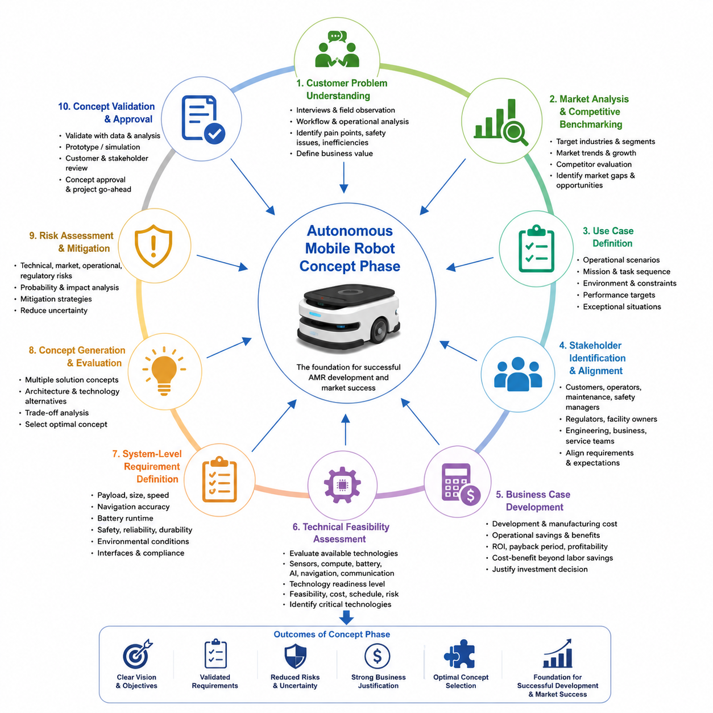
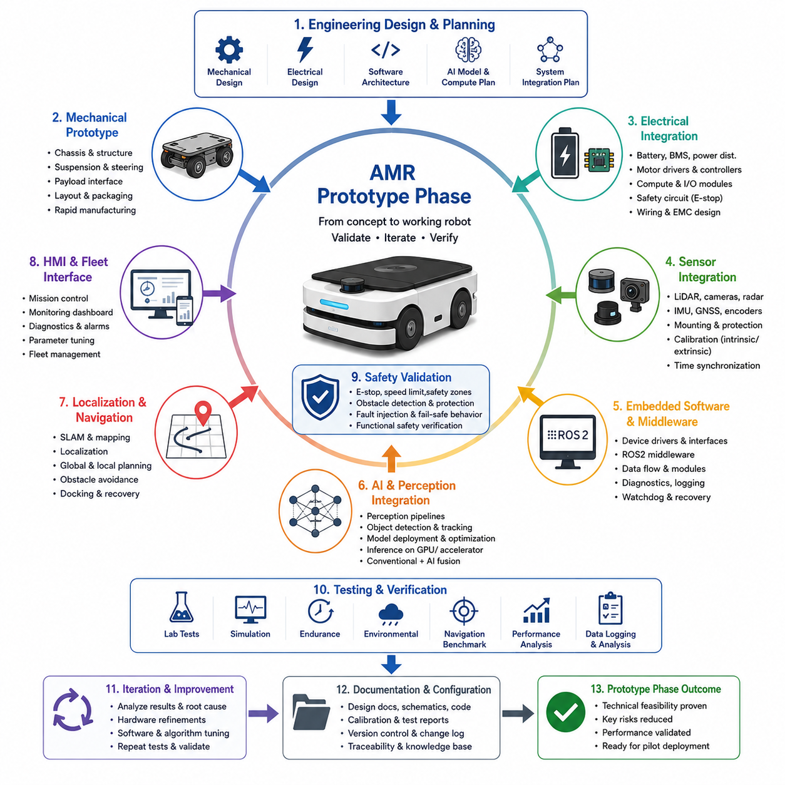
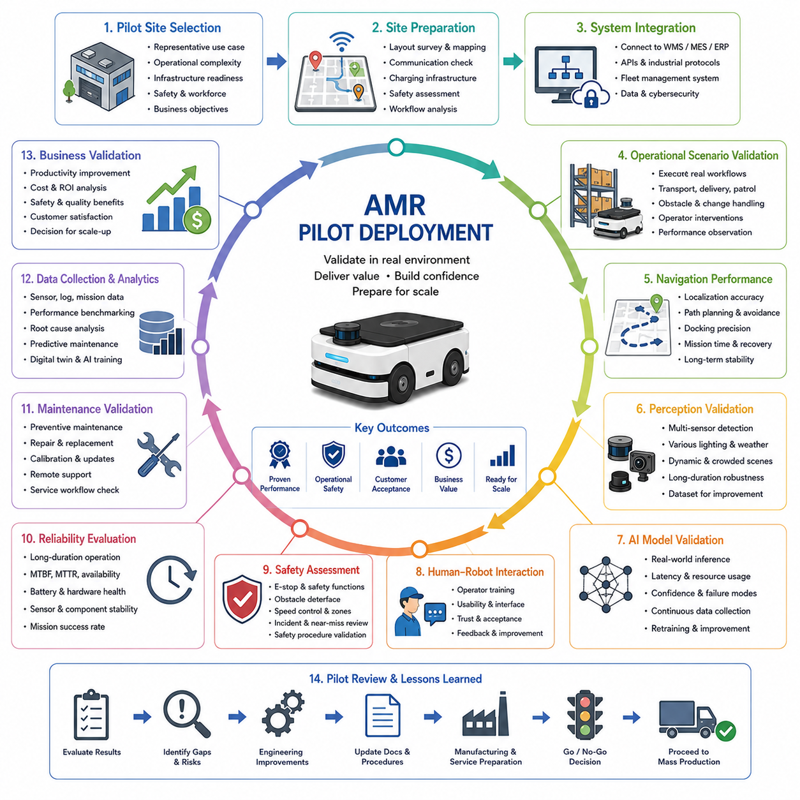
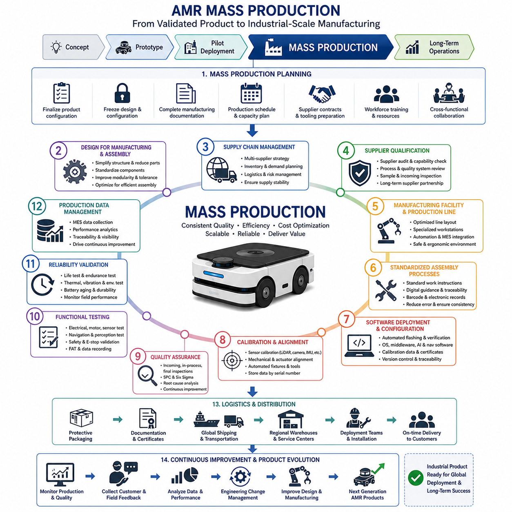
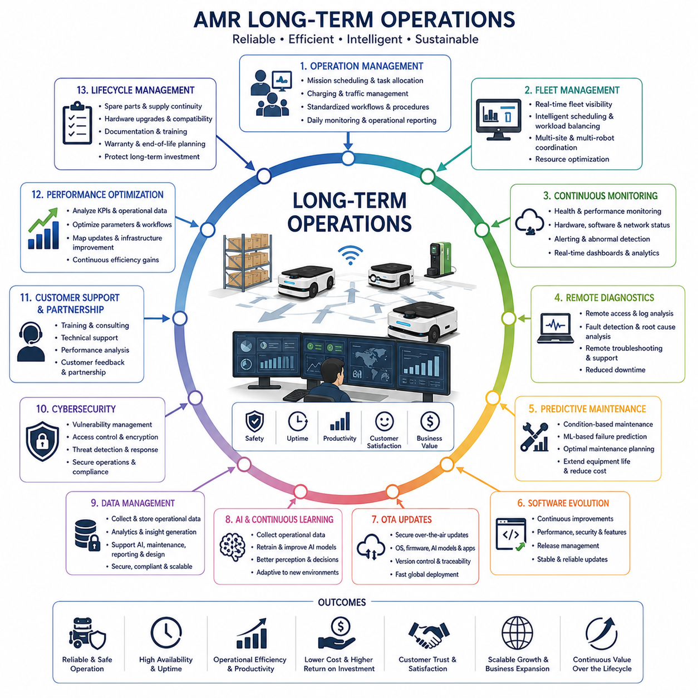

**Volume 01. AMR Foundations and System Architecture**

# Chapter 13. AMR Project Lifecycle

## 13.1 Concept Phase

{width="7.268055555555556in" height="7.268055555555556in"}

개념 단계(Concept Phase)는 성공적인 자율이동로봇(Autonomous Mobile Robot, AMR) 개발 프로젝트의 출발점이며, 본격적인 엔지니어링 자원이 투입되기 전에 전략적 방향(Strategic Direction), 기술적 실현 가능성(Technical Feasibility), 사업 타당성(Business Justification), 장기적인 제품 비전(Long-term Product Vision)을 수립하는 가장 중요한 단계이다. 이 시기에 내려지는 결정은 이후의 시스템 아키텍처(System Architecture), 하드웨어 선정(Hardware Selection), 소프트웨어 설계(Software Design), 인공지능(AI) 기능, 제조 전략(Manufacturing Strategy), 규제 준수(Regulatory Compliance), 사업화(Commercialization Planning)에 이르기까지 거의 모든 개발 과정에 영향을 미친다. 구현(Implementation)에 집중하는 후속 개발 단계와 달리 개념 단계는 해결해야 할 문제를 정확히 이해하고, 고객 가치(Customer Value)를 정의하며, 다양한 기술 대안을 평가하고, 체계적인 분석(Systematic Analysis)을 통해 불확실성을 줄이는 데 초점을 맞춘다. 성공적으로 수행된 개념 단계는 개발 위험을 크게 낮추고 제품 경쟁력(Product Competitiveness), 개발 효율(Development Efficiency), 장기적인 시장 성공(Long-term Market Success)을 높여준다.

개념 단계는 기술적인 해결책을 제시하는 것보다 고객이 실제로 겪고 있는 문제(Customer Problem)를 명확하게 정의하는 것에서 시작된다. 엔지니어링 팀은 자동화가 왜 필요한지, 현재 업무 흐름(Workflow)에 어떤 비효율이 존재하는지, 기존 운영의 한계가 무엇인지, 그리고 자율로봇이 어떤 방식으로 측정 가능한 비즈니스 가치를 창출할 수 있는지를 먼저 이해해야 한다. 이를 위해 고객 인터뷰(Customer Interview), 현장 관찰(Field Observation), 운영 분석(Operational Study), 업무 흐름 분석(Workflow Analysis), 이해관계자 논의(Stakeholder Discussion)를 수행하여 운영상의 문제, 안전 요구사항, 인력 부족, 생산성 제약, 품질 요구사항, 장기적인 사업 목표를 조사한다. 이러한 고객 중심(Customer-centered)의 접근 방식은 기술 중심 개발(Technology-driven Development)로 인해 실제 활용 가치가 낮은 시스템이 만들어지는 것을 방지한다.

시장 분석(Market Analysis)은 개념 단계에서 매우 중요한 활동이다. 제품의 성공은 단순한 기술 혁신이 아니라 실제 시장 수요(Market Demand)를 충족하는 데 달려 있기 때문이다. 엔지니어와 제품 관리자(Product Manager)는 목표 산업(Target Industry), 고객 세분화(Customer Segment), 경쟁 로봇 플랫폼(Competing Robotic Platform), 가격 구조(Pricing Structure), 시장 성장 추세(Market Growth Trend), 규제 환경(Regulatory Environment), 새로운 기술 기회(Emerging Technology Opportunity)를 조사한다. 경쟁 제품 분석(Competitive Benchmarking)은 적재 능력(Payload Capacity), 자율주행 성능(Navigation Performance), 센서 아키텍처(Sensing Architecture), 인공지능 기능(AI Capability), 플릿 관리(Fleet Management), 안전 인증(Safety Certification), 운영 비용(Operational Cost), 고객 지원(Customer Support) 등을 비교하여 시장의 공백(Market Gap)과 차별화 가능성(Competitive Advantage)을 찾는 데 활용된다.

유스케이스 정의(Use Case Definition)는 고객의 요구사항을 실제 운영 시나리오(Operational Scenario)로 변환하는 과정이며, 이후 전체 개발 방향을 결정하는 기준이 된다. 각 유스케이스는 운영 목표(Operational Objective), 환경 조건(Environmental Condition), 임무 순서(Mission Sequence), 사용자 상호작용(User Interaction), 기대 결과(Expected Output), 성능 요구사항(Performance Requirement), 운영 제약사항(Operational Constraint), 예외 상황(Exceptional Situation)을 명확하게 정의한다. 실내 물류(Indoor Logistics), 실외 점검(Outdoor Inspection), 병원 배송(Hospital Delivery), 창고 운송(Warehouse Transportation), 농업 모니터링(Agricultural Monitoring), 보안 순찰(Security Patrol), 인프라 점검(Infrastructure Inspection), 스마트 시티(Smart City) 응용 분야는 각각 서로 다른 환경 복잡성과 운영 우선순위를 가진다. 명확한 유스케이스는 측정 가능한 엔지니어링 목표를 제공하고 개발 범위(Project Scope)가 불필요하게 확대되는 것을 방지한다.

이해관계자 식별(Stakeholder Identification)은 로봇 시스템의 영향을 받는 모든 개인과 조직을 초기 단계부터 고려하도록 한다. 주요 이해관계자는 고객(Customer), 운영자(Operator), 유지보수 담당자(Maintenance Personnel), 안전 관리자(Safety Manager), 시설 관리자(Facility Owner), 규제 기관(Regulatory Authority), 생산 엔지니어(Production Engineer), 소프트웨어 개발자(Software Developer), 경영진(Business Executive), 서비스 조직(Service Organization) 등이다. 각 이해관계자는 서로 다른 요구사항, 운영 기대치, 평가 기준을 제시하며 이는 시스템 아키텍처와 제품 기능에 직접적인 영향을 준다. 초기 단계에서 이해관계자의 의견을 조율하면 기술팀과 사업팀 간의 요구사항 충돌을 줄이고 프로젝트 전체의 의사소통을 원활하게 만들 수 있다.

사업성 분석(Business Case Development)은 제안된 로봇 시스템이 투자할 만큼 충분한 경제적 가치를 제공하는지를 평가하는 과정이다. 재무 분석(Financial Analysis)은 개발 비용(Development Cost), 제조 비용(Manufacturing Expense), 운영 절감 효과(Operational Saving), 유지보수 비용(Maintenance Requirement), 예상 판매량(Projected Sales Volume), 가격 전략(Pricing Strategy), 투자 수익률(Return on Investment, ROI), 투자 회수 기간(Payback Period), 장기 수익성(Long-term Profitability)을 평가한다. 비용 편익 분석(Cost-benefit Analysis)은 단순한 인건비 절감뿐 아니라 품질 향상(Quality Improvement), 운영 유연성(Operational Flexibility), 안전성 향상(Safety Enhancement), 인력 최적화(Workforce Optimization), 다운타임 감소(Reduced Downtime), 예측 유지보수(Predictive Maintenance), 데이터 기반 운영(Data-driven Operational Intelligence)의 효과까지 포함한다. 현실적인 사업성 분석은 프로젝트 승인과 향후 투자 판단의 객관적인 근거가 된다.

기술적 실현 가능성 평가(Technical Feasibility Assessment)는 현재의 기술이 허용 가능한 비용, 일정, 위험 수준 안에서 고객 요구사항을 만족시킬 수 있는지를 검토하는 과정이다. 엔지니어는 센서(Sensor), 컴퓨팅 플랫폼(Compute Platform), 배터리(Battery), 통신 시스템(Communication System), 자율주행 기술(Navigation Technology), 인공지능 알고리즘(AI Algorithm), 기계 구조(Mechanical Architecture), 안전 부품(Safety Component), 제조 기술(Manufacturing Capability)을 분석한다. 기술 성숙도 수준(Technology Readiness Level, TRL)을 활용하여 산업에서 충분히 검증된 기술인지, 추가 연구개발이 필요한 실험적 기술인지를 구분한다. 이러한 초기 검토는 비현실적인 프로젝트 목표를 방지하고 집중적인 기술 개발이 필요한 핵심 요소를 조기에 식별하는 데 도움을 준다.

시스템 수준 요구사항(System-level Requirement Definition)은 고객 요구사항과 운영 시나리오를 측정 가능한 엔지니어링 목표로 변환한다. 대표적인 요구사항에는 적재 능력(Payload Capacity), 차량 크기(Vehicle Dimensions), 운행 속도(Operating Speed), 위치 정확도(Navigation Accuracy), 배터리 운용 시간(Battery Operating Time), 환경 보호 등급(Environmental Protection), 통신 거리(Communication Range), 환경 인식 능력(Perception Capability), 안전 성능(Safety Performance), 신뢰성(Reliability), 유지보수성(Maintainability), 확장성(Scalability), 규제 준수(Regulatory Compliance)가 포함된다. 요구사항은 명확하고 측정 가능하며 검증 가능하고 달성 가능해야 하며 전체 개발 과정에서 추적 가능성(Traceability)을 유지해야 한다.

개념 시스템 아키텍처(Conceptual System Architecture)는 주요 시스템 구성 요소들이 어떻게 상호작용하여 운영 요구사항을 만족하는지를 최초로 통합적으로 표현하는 단계이다. 이 단계에서는 상세 구현이 아니라 환경 인식(Perception), 위치 추정(Localization), 자율주행(Navigation), 이동 제어(Motion Control), 인공지능(AI), 통신(Communication), 플릿 관리(Fleet Management), 전원 시스템(Power System), 안전 감시(Safety Supervision), 인간-기계 인터페이스(Human-Machine Interface)와 같은 핵심 기능 모듈을 정의한다. 기능 분해(Functional Decomposition)를 통해 복잡한 로봇 기능을 관리 가능한 하위 시스템으로 나누고 소프트웨어, 전자, 기계, 운영 서비스 간의 인터페이스를 정의한다.

기계 개념 설계(Mechanical Concept Development)는 목표 운영 환경에 적합한 차량 구조를 비교 검토하는 과정이다. 차동 구동(Differential Drive), 사륜 조향(Four-wheel Steering), 육륜 플랫폼(Six-wheel Platform), 무한궤도 차량(Tracked Vehicle), 전방향 이동 시스템(Omnidirectional System), 견인 구조(Towing Architecture), 리프팅 메커니즘(Lifting Mechanism), 서스펜션(Suspension), 적재 구조(Payload Integration), 모듈형 차체(Modular Chassis)를 비교한다. 평가 항목에는 안정성(Stability), 기동성(Maneuverability), 적재 하중 분포(Payload Distribution), 환경 적응성(Environmental Robustness), 제조성(Manufacturability), 유지보수 접근성(Maintenance Accessibility), 향후 확장성(Future Scalability)이 포함된다. 초기 구조 해석과 패키징 검토를 통해 실현 가능성이 낮은 설계를 조기에 제외할 수 있다.

전기 및 전자 개념 설계(Electrical and Electronic Concept Development)는 전체 전기 시스템의 기본 구조를 정의하는 단계이다. 주요 내용에는 전력 분배(Power Distribution), 배터리 기술(Battery Technology), 충전 전략(Charging Strategy), 모터 제어 구조(Motor Control Architecture), 임베디드 컴퓨팅(Embedded Computing), 통신 네트워크(Communication Network), 센서 인터페이스(Sensor Interface), 비상 정지(Emergency Stop), 이중 안전 회로(Redundant Safety Circuit), 전기 보호(Electrical Protection)가 포함된다. 또한 예상 전력 소비(Power Consumption), 열 관리(Thermal Requirement), 전기 부하(Electrical Load), 케이블 배선(Cable Routing), 커넥터 전략(Connector Strategy), 향후 확장성(Future Expansion)을 함께 검토하여 산업 표준과 안전 규정을 만족하도록 설계한다.

인공지능 개념 설계(AI Concept Planning)는 현대 AMR에서 점점 더 중요한 부분이 되고 있다. 엔지니어는 어떤 기능을 기존 알고리즘으로 구현하고 어떤 기능을 머신러닝(Machine Learning), 컴퓨터 비전(Computer Vision), 멀티모달 인공지능(Multimodal AI), 강화학습(Reinforcement Learning), 파운데이션 모델(Foundation Model), 거대언어모델(Large Language Model, LLM)로 구현할 것인지를 결정한다. 또한 데이터 요구사항(Data Requirement), 연산 자원(Computational Resource), 모델 배포(Model Deployment Strategy), 클라우드-엣지 구조(Cloud-edge Distribution), 지속 학습(Continuous Learning), 운영 모니터링(Operation Monitoring)을 함께 정의한다. 이러한 초기 AI 아키텍처 설계는 적절한 컴퓨팅 플랫폼을 선택하고 성능과 비용, 소비전력, 구현 복잡도 사이의 균형을 맞추는 데 중요한 역할을 한다.

위험 식별(Risk Identification)은 개념 단계부터 시작되어야 한다. 대부분의 개발 위험은 초기 아키텍처 결정에서 발생하기 때문이다. 기술적 위험에는 미성숙 기술(Immature Technology), 연산 자원 부족(Insufficient Computational Resource), 위치 추정 불확실성(Localization Uncertainty), 환경 인식 한계(Perception Limitation), 배터리 제약(Battery Constraint), 통신 신뢰성(Communication Reliability), 복잡한 운영 환경(Environmental Complexity), 소프트웨어 통합 문제(Software Integration Challenge), 공급망 문제(Supply Chain Availability), 제조 확장성(Manufacturing Scalability)이 포함된다. 사업적 위험에는 시장 불확실성(Market Uncertainty), 규제 변화(Regulatory Change), 경쟁 심화(Competitive Pressure), 고객 수용성(Customer Adoption), 투자 제한(Investment Limitation), 사업화 일정(Commercialization Timing)이 있다. 이러한 위험을 조기에 분석하면 효과적인 위험 완화 전략(Risk Mitigation Strategy)을 설계에 반영할 수 있다.

규제 및 표준 분석(Regulatory and Standards Analysis)은 초기 개념 단계부터 관련 규정을 고려하도록 한다. 엔지니어는 기능 안전 표준(Functional Safety Standard), 기계 안전 규정(Machinery Regulation), 전자파 적합성(Electromagnetic Compatibility, EMC), 배터리 운송 규정(Battery Transportation Regulation), 무선 통신 인증(Wireless Communication Certification), 사이버 보안(Cybersecurity), 환경 보호(Environmental Protection Requirement), 산업별 운용 기준(Industry-specific Operational Guideline)을 조사한다. 초기부터 규제 준수를 고려하면 이후 제품 검증과 인증 과정에서 대규모 설계 변경을 줄일 수 있다.

개발 계획(Development Planning)은 전략적 개념을 실제 개발 프로젝트로 전환하는 단계이다. 프로젝트 범위(Project Scope), 조직 구조(Organizational Structure), 자원 배분(Resource Allocation), 개발 일정(Milestone Schedule), 기술 검증 계획(Technology Validation), 시제품 계획(Prototype Planning), 협력사 선정(Supplier Engagement), 예산 배분(Budget Distribution), 검증 전략(Verification Strategy)을 정의한다. 기계, 전기, 소프트웨어, 인공지능, 제조, 품질, 안전, 구매, 사업 개발 등 다양한 분야가 긴밀하게 협력해야 하며, 기술적 도전과 실제 개발 가능성 사이의 균형을 유지하면서 향후 개선 여지도 확보해야 한다.

시제품 전략(Prototype Strategy)은 본격적인 제품 개발 이전에 핵심 가정을 어떻게 검증할 것인지를 정의한다. 초기 시제품은 소프트웨어 시뮬레이션(Software Simulation), 디지털 트윈(Digital Twin), 부분 시스템 시험(Sub-system Demonstrator), 하드웨어 개념 검증(Hardware Proof-of-Concept), 환경 인식 검증 시스템(Perception Validation System), 자율주행 시험 차량(Navigation Test Vehicle), 기계 목업(Mechanical Mockup) 형태가 될 수 있다. 초기 시제품의 목적은 완성된 제품을 만드는 것이 아니라 핵심 기술의 불확실성을 줄이는 것이다. 이러한 점진적 검증(Incremental Validation)은 잘못된 아키텍처로 인한 개발 비용을 크게 줄일 수 있다.

검증 계획(Verification Planning)은 상세 설계 이전부터 준비되어야 한다. 개념 단계에서는 향후 요구사항을 시뮬레이션(Simulation), 실험실 시험(Laboratory Testing), 현장 평가(Field Evaluation), 고객 승인(Customer Acceptance), 규제 인증(Regulatory Certification), 장기 운영 평가(Long-term Operational Assessment)를 통해 어떻게 검증할 것인지를 정의한다. 또한 성능 지표(Performance Metric), 검증 시나리오(Validation Scenario), 운영 벤치마크(Operational Benchmark), 환경 시험 조건(Environmental Test Condition), 안전성 검증(Safety Demonstration), 신뢰성 목표(Reliability Target), 승인 기준(Acceptance Criteria)을 함께 정의한다. 이러한 초기 검증 계획은 전체 개발 과정이 명확한 목표를 향해 진행되도록 보장한다.

개념 단계는 최종적으로 시스템 개념 검토(System Concept Review)를 통해 마무리된다. 이 과정에서는 기술적 실현 가능성(Technical Feasibility), 사업성(Business Viability), 고객 요구사항(Customer Requirement), 운영 시나리오(Operational Scenario), 시스템 아키텍처(System Architecture), 위험 분석(Risk Assessment), 재무 분석(Financial Analysis), 규제 요구사항(Regulatory Consideration), 개발 계획(Development Plan)을 종합적으로 검토한다. 이 단계에서는 상세 설계를 승인하는 것이 아니라 시제품 개발 단계로 진행할 만큼 충분한 근거가 확보되었는지를 확인한다. 성공적인 개념 검토는 조직의 신뢰를 확보하고 개발 자원을 승인받으며 다양한 분야의 팀을 하나의 목표로 정렬하고 이후 개발을 위한 안정적인 전략적 기반을 마련한다. 앞으로 자율이동로봇은 인공지능(AI), 클라우드 로보틱스(Cloud Robotics), 디지털 트윈(Digital Twin), 대규모 플릿 협업(Large-scale Fleet Coordination)이 결합되면서 더욱 복잡한 시스템으로 발전할 것이며, 개념 단계 역시 기술 혁신(Technology Innovation), 사업 전략(Business Strategy), 운영 인텔리전스(Operational Intelligence), 고객 가치(Customer Value)를 하나의 통합된 개발 비전으로 연결하는 다학제적 시스템 엔지니어링(Multidisciplinary Systems Engineering) 과정으로 지속적으로 발전하게 될 것이다.

## 13.2 Prototype Phase

{width="7.268055555555556in" height="7.268055555555556in"}

프로토타입 단계(Prototype Phase)는 자율이동로봇(Autonomous Mobile Robot, AMR)의 개념적 비전(Conceptual Vision)을 실제로 동작하는 공학 시스템(Engineering System)으로 구현하여, 제안된 시스템 아키텍처(System Architecture)가 실제 운용 환경에서 기술적으로 실현 가능한지를 검증하는 단계이다. 개념 단계(Concept Phase)가 전략적 방향성과 상위 수준의 시스템 요구사항(System Requirements)을 수립하는 과정이라면, 프로토타입 단계는 이러한 가정을 측정 가능한 공학적 근거(Engineering Evidence)로 전환하는 과정이다. 이 단계는 이론적인 설계와 양산 가능한 제품 개발 사이를 연결하는 중요한 과정으로, 기계 구조(Mechanical Structure), 전기 시스템(Electrical System), 임베디드 제어기(Embedded Controller), 인지 센서(Perception Sensor), 인공지능(Artificial Intelligence, AI) 소프트웨어, 자율주행(Navigation) 알고리즘, 안전 메커니즘(Safety Mechanism)을 하나의 동작 가능한 플랫폼으로 통합한다. 이 단계의 목적은 완성된 상용 제품을 만드는 것이 아니라 기술적 불확실성을 줄이고, 시스템 간 상호작용을 검증하며, 아키텍처의 약점을 발견하고, 파일럿(Pilot) 구축과 양산(Mass Production)에 앞서 충분한 기술적 신뢰를 확보하는 데 있다.

프로토타입 개발은 시스템 수준(System-Level)의 요구사항을 각 분야에서 구현 가능한 상세 공학 사양(Engineering Specification)으로 구체화하는 작업에서 시작된다. 기계 설계(Mechanical Engineering) 팀은 차체(Chassis) 크기, 구조 배치, 서스펜션(Suspension), 적재부(Payload Interface), 유지보수성을 구체화하며, 전기(Electrical) 팀은 전력 분배(Power Distribution), 배터리(Battery), 모터 제어기(Motor Controller), 통신 네트워크(Communication Network), 안전 회로(Safety Circuit), 센서 인터페이스(Sensor Interface)를 설계한다. 소프트웨어 아키텍트(Software Architect)는 미들웨어(Middleware), 통신 인터페이스, 소프트웨어 모듈, 데이터 흐름(Data Flow)을 정의하고, 인공지능(AI) 엔지니어는 추론(Inference) 파이프라인, 모델 배치(Model Deployment), 연산 자원(Computational Resource), 하드웨어 가속(Hardware Acceleration) 전략을 결정한다. 이러한 다학제적 협업은 모든 하위 시스템이 동일한 시스템 아키텍처를 기반으로 개발되도록 보장한다.

기계 프로토타입(Mechanical Prototype) 제작은 로봇 플랫폼의 첫 번째 물리적 구현(Physical Realization)이다. 초기 차체는 제조 최적화보다 설계 변경의 유연성을 우선시하기 때문에 반복적인 수정이 가능하도록 구성된다. 엔지니어는 구조 강성(Structural Rigidity), 무게 중심(Center of Gravity), 하중 분배(Weight Distribution), 서스펜션 성능, 휠 구성(Wheel Configuration), 조향 구조(Steering Geometry), 적재부 장착 방식, 냉각 공기 흐름(Thermal Airflow), 케이블 배선(Cable Routing), 유지보수 접근성(Maintenance Accessibility)을 평가한다. CNC 가공(CNC Machining), 레이저 절단(Laser Cutting), 적층 제조(Additive Manufacturing), 알루미늄 프로파일(Modular Aluminum Profile)과 같은 신속 제작(Rapid Manufacturing) 기술은 개발 속도를 높이고 비용을 절감한다. 실제 조립 과정에서는 디지털 설계에서는 확인하기 어려운 간섭 문제, 진동, 구조적 충돌, 유지보수의 어려움 등이 발견되며 이후 설계 개선의 중요한 근거가 된다.

전기 프로토타입(Electrical Prototype) 통합은 안정적인 전력 공급과 하드웨어 간 통신을 구축하는 핵심 단계이다. 배터리(Battery), 배터리 관리 시스템(Battery Management System, BMS), DC-DC 컨버터(DC-DC Converter), 모터 드라이버(Motor Driver), 임베디드 제어기(Embedded Controller), 산업용 컴퓨터(Industrial Computer), 이더넷 스위치(Ethernet Switch), CAN 버스(CAN Bus), 비상 정지(Emergency Stop), 이중화 안전 회로(Redundant Safety Circuit)를 하나의 전기 아키텍처(Electrical Architecture)로 통합한다. 케이블 배선은 전자기 간섭(Electromagnetic Interference, EMI), 커넥터 접근성, 발열, 진동 저항성, 유지보수성을 모두 고려하여 설계된다. 이후 전압 안정성, 전류 용량, 열 성능(Thermal Performance), 고장 격리(Fault Isolation), 시동(Start-up), 비상 정지 동작 등을 검증하여 소프트웨어 통합 이전에 하드웨어 신뢰성을 확보한다.

센서 통합(Sensor Integration)은 자율주행 성능을 결정하는 가장 중요한 작업 중 하나이다. 엔지니어는 라이다(LiDAR), RGB 카메라(Camera), 깊이 카메라(Depth Camera), 레이더(Radar), 초음파 센서(Ultrasonic Sensor), 위성항법장치(Global Navigation Satellite System, GNSS), 관성측정장치(Inertial Measurement Unit, IMU), 휠 엔코더(Wheel Encoder), 환경 센서(Environmental Sensor)를 설치하면서 시야(Field of View), 진동 차단(Vibration Isolation), 방수 및 방진(Weather Protection), 유지보수 접근성을 동시에 고려한다. 하드웨어 트리거(Hardware Trigger), 정밀 시간 프로토콜(Precision Time Protocol, PTP), 시간 동기화(Time Synchronization)를 이용하여 모든 센서 데이터를 동일한 시간 기준으로 정렬한다. 또한 내부 보정(Intrinsic Calibration)과 외부 보정(Extrinsic Calibration)을 수행하여 센서 융합(Sensor Fusion), 위치추정(Localization), 지도 작성(Mapping), 인지(Perception)에 필요한 정확한 좌표 변환(Coordinate Transformation)을 확보한다.

임베디드 소프트웨어(Embedded Software) 개발은 통합된 하드웨어를 실제로 동작하는 자율 시스템으로 전환하는 과정이다. 저수준 소프트웨어(Low-Level Software)는 하드웨어 초기화, 시스템 상태 모니터링(System Health Monitoring), 모터 제어기와의 통신, 전원 관리, 센서 데이터 수집, 실시간 운영(Real-Time Operation)을 담당한다. ROS2와 같은 미들웨어(Middleware)는 모듈 간 통신을 담당하며 확장 가능한 소프트웨어 구조를 제공한다. 또한 로그(Log), 진단(Diagnostic), 파라미터(Parameter) 관리, 워치독(Watchdog), 오류 복구(Fault Recovery) 기능을 초기부터 구현함으로써 시스템 복잡도가 증가하더라도 효율적인 디버깅(Debugging)이 가능하도록 한다. 이러한 기반 위에서 상위 수준의 자율 기능이 점진적으로 구축된다.

인공지능(AI) 통합은 결정론적 알고리즘(Deterministic Algorithm)을 넘어 의미 이해(Semantic Understanding), 객체 인식(Object Recognition), 이상 탐지(Anomaly Detection), 적응형 의사결정(Adaptive Decision Making)과 같은 고급 기능을 프로토타입에 추가한다. 딥러닝(Deep Learning) 모델은 GPU(Graphics Processing Unit)나 AI 가속기(AI Accelerator)에 배치되어 실시간 추론(Real-Time Inference)을 수행한다. 엔지니어는 추론 지연시간(Latency), 연산 자원 사용률, 메모리 소비(Memory Consumption), 열 발생(Thermal Behavior), 에너지 효율(Energy Efficiency)을 평가하며, 정확도와 연산 비용 간의 균형을 최적화한다. 또한 기존 알고리즘과 AI 기반 모델이 하나의 인지 파이프라인(Perception Pipeline) 안에서 안정적으로 협력하도록 설계하여, AI가 안전성이 요구되는 자율 시스템을 보완하도록 한다.

위치추정(Localization) 및 자율주행(Navigation) 개발은 로봇이 실제 환경에서 자율적으로 이동할 수 있는지를 검증하는 핵심 과정이다. 엔지니어는 오도메트리(Odometry), 관성 센서(Inertial Sensor), 라이다 SLAM(LiDAR SLAM), 비전 SLAM(Visual SLAM), GNSS 기반 위치추정, 지도 관리(Map Management), 위치추정 필터(Localization Filter), 전역 경로 계획(Global Path Planning), 지역 경로 생성(Local Trajectory Generation), 장애물 회피(Obstacle Avoidance), 도킹(Docking), 복구 동작(Recovery Behavior)을 하나의 자율주행 프레임워크(Navigation Framework)로 통합한다. 초기 시험은 통제된 실험실 환경에서 수행되며 이후 실제 공장, 병원, 물류센터 또는 실외 환경으로 확장된다. 엔지니어는 위치 오차(Localization Drift), 지도 정확도(Map Consistency), 경로 정확도(Path Accuracy), 장애물 회피 성능, 주행 부드러움(Trajectory Smoothness), 연산 지연, 임무 수행률(Mission Completion Rate)을 지속적으로 분석하며 알고리즘을 개선한다.

사람-기계 인터페이스(Human-Machine Interface, HMI) 개발은 운영자(Operator), 유지보수 엔지니어(Maintenance Engineer), 시스템 관리자(System Administrator)가 로봇과 효율적으로 상호작용할 수 있도록 지원한다. 프로토타입에서는 터치 디스플레이(Touch Display), 원격 모니터링(Remote Monitoring), 웹 기반 관리 도구(Web-Based Management Tool), 명령줄 인터페이스(Command-Line Interface), 모바일 애플리케이션(Mobile Application), 플릿 관리(Fleet Management) 화면 등을 개발한다. 엔지니어는 임무 제어(Mission Control), 시스템 시각화(System Visualization), 진단 정보(Diagnostic Information), 소프트웨어 업데이트, 경고(Alarm), 로그 관리(Log Management), 파라미터 조정(Parameter Adjustment), 사용자 인증(User Authentication)을 검증한다. 우수한 인터페이스는 디버깅 시간을 단축시키고 고객 시연(Customer Demonstration)과 실제 운영 준비에도 큰 도움을 준다.

안전성 검증(Safety Validation)은 프로토타입 운용 초기부터 수행되어야 한다. 개발 중인 시스템은 하드웨어와 소프트웨어가 계속 변경되므로 다양한 위험 요소가 존재하기 때문이다. 엔지니어는 비상 정지(Emergency Stop), 속도 제한(Speed Limitation), 장애물 감지(Obstacle Detection), 보호 영역 감시(Protective Field Monitoring), 안전 통신(Fail-Safe Communication), 워치독(Watchdog), 배터리 보호(Battery Protection), 안전 정지(Control Shutdown) 기능을 실제 환경에서 검증한다. 또한 하드웨어 고장, 통신 단절, 센서 오류, 전원 이상, 소프트웨어 예외 상황을 의도적으로 발생시켜 시스템이 항상 예측 가능한 안전 상태(Safe State)로 전환되는지를 확인한다. 이러한 조기 안전 검증은 향후 기능 안전(Functional Safety) 인증을 위한 중요한 기반이 된다.

프로토타입 검증(Prototype Verification)은 단순한 시연(Demonstration)이 아니라 체계적인 시험(Testing)에 기반한다. 엔지니어는 실험실 시험(Laboratory Test), 시뮬레이션(Simulation), 서브시스템 평가(Sub-System Evaluation), 내구 시험(Endurance Test), 환경 시험(Environmental Test), 자율주행 성능 시험(Navigation Benchmark), 인지 정확도 분석(Perception Accuracy Analysis), 기계 강도 시험(Mechanical Stress Test), 통합 임무 검증(Integrated Mission Validation)을 수행한다. 모든 시험에서는 센서 데이터, 제어기 상태, 연산 성능, 장애 발생 기록, 주행 궤적, 네트워크 통신, 운영 로그를 지속적으로 저장하여 정량적인 성능 분석과 회귀 시험(Regression Test)에 활용한다.

반복 개선(Iteration)은 성공적인 프로토타입 개발의 핵심 특징이다. 최초의 통합 시스템은 대부분 목표 성능을 만족하지 못하기 때문에 엔지니어는 실패를 분석하고 근본 원인(Root Cause)을 규명하며 기계 설계를 수정하고 알고리즘을 개선하며 소프트웨어를 업데이트하고 제어 파라미터(Control Parameter)를 최적화한 후 동일한 시험을 반복 수행한다. 기계, 전기, 소프트웨어, 인공지능, 제조, 시스템 엔지니어링(System Engineering) 팀 간의 빠른 피드백은 문제 해결 속도를 높이고 특정 분야의 최적화가 전체 시스템 성능을 저하시킬 가능성을 줄인다. 이러한 반복 개발 과정은 최종 제품의 기술적 완성도를 지속적으로 향상시키는 핵심 활동이다.

프로토타입이 성숙해질수록 제조성(Manufacturability)에 대한 고려도 점차 중요해진다. 초기 프로토타입은 설계 변경의 유연성을 우선하지만, 이후에는 표준 부품(Standard Component), 조립 단순화(Simplified Assembly), 모듈화(Modular Architecture), 유지보수성(Serviceability), 부품 수 감소(Reduced Part Count), 공급망(Supply Chain), 비용 절감(Cost Optimization), 생산 반복성(Manufacturing Repeatability)을 고려하기 시작한다. 제조를 위한 설계(Design for Manufacturing, DFM)와 조립을 위한 설계(Design for Assembly, DFA)를 점진적으로 적용하여 실험의 자유도를 유지하면서도 양산 단계로 자연스럽게 전환할 수 있도록 한다.

프로토타입 문서화(Prototype Documentation)는 반복 개발 과정에서 축적된 기술 지식을 체계적으로 관리하기 위해 필수적이다. 엔지니어는 기계 도면(Mechanical Drawing), 전기 회로도(Electrical Schematic), 소프트웨어 아키텍처 문서(Software Architecture Document), 인터페이스 정의(Interface Definition), 보정 기록(Calibration Record), 검증 보고서(Validation Report), 형상 관리(Configuration Management), 위험 분석(Risk Assessment), 이슈 추적(Issue Tracking), 설계 변경 이력(Engineering Change History)을 지속적으로 관리한다. 이러한 문서는 다학제 협업을 지원하고 조직의 기술 자산을 보존하며 규제 대응(Regulatory Compliance), 유지보수, 파일럿 구축(Pilot Deployment), 양산(Mass Production)으로의 전환을 효율적으로 지원한다.

프로토타입 단계는 시스템이 다음 개발 단계로 진행할 준비가 되었는지를 종합적으로 평가하는 기술 검토(Engineering Evaluation)로 마무리된다. 시스템 아키텍트(System Architect)는 통합 성능(Integrated Performance), 안전성(Safety), 자율주행(Navigation), 인지(Perception), 인공지능(AI), 기계적 내구성(Mechanical Durability), 전기적 신뢰성(Electrical Reliability), 제조 준비도(Manufacturing Readiness), 운영 편의성(Operational Usability), 초기 요구사항 충족 여부를 종합적으로 검토한다. 또한 남아 있는 기술적 위험(Risk), 해결되지 않은 한계(Limitation), 향후 개선 방향(Improvement Plan)을 정리한 후 파일럿 구축 단계(Pilot Deployment)로의 진행 여부를 결정한다. 성공적인 프로토타입 단계는 제안된 자율이동로봇(Autonomous Mobile Robot, AMR) 아키텍처가 실제 환경에서 하나의 통합 공학 시스템으로 안정적으로 동작할 수 있음을 객관적으로 입증하며, 대규모 현장 검증(Field Validation), 제품 산업화(Product Industrialization), 상용화(Commercialization)를 위한 기술적 기반을 확립하는 중요한 전환점이 된다.

## 13.3 Pilot Deployment

{width="7.268055555555556in" height="7.268055555555556in"}

파일럿 배포 단계(Pilot Deployment Phase)는 자율이동로봇(Autonomous Mobile Robot, AMR) 제품 개발 생애주기(Product Lifecycle)에서 엔지니어링 개발(Engineering Development)과 실제 현장 운영(Real-World Operation)을 연결하는 가장 중요한 전환 단계이다. 프로토타입 단계(Prototype Phase)가 통제된 환경에서 로봇이 하나의 통합 공학 시스템으로 정상적으로 동작함을 입증하는 과정이라면, 파일럿 배포 단계는 실제 고객 환경(Customer Environment)에서 전체 시스템이 신뢰성(Reliability), 안전성(Safety), 운영 효율성(Operation Efficiency)을 유지하며 지속적으로 운용될 수 있는지를 검증하는 과정이다. 이 단계에서는 실험실이나 시뮬레이션(Simulation)에서는 재현하기 어려운 실제 작업 흐름(Workflow), 운영 변화(Operational Variability), 환경 불확실성(Environmental Uncertainty), 사람과의 상호작용(Human Interaction)을 경험하게 된다. 따라서 목표는 단순히 기술 성능을 확인하는 것이 아니라 운영 가치(Operational Value), 고객 수용성(Customer Acceptance), 배포 방법론(Deployment Methodology), 서비스 준비도(Service Readiness), 장기적인 상용화 가능성(Commercial Feasibility)을 검증하여 양산(Mass Production) 이전에 충분한 신뢰를 확보하는 데 있다.

파일럿 배포는 적절한 시험 현장(Pilot Site)을 선정하는 작업에서 시작된다. 현장 검증(Field Validation)의 품질은 실제 상용 환경을 얼마나 잘 대표하는지에 크게 좌우되기 때문이다. 엔지니어링 팀은 고객과 협력하여 실제 적용 대상과 유사하면서도 기술적·운영적으로 관리 가능한 시설을 선정한다. 후보 현장은 운영 복잡도(Operational Complexity), 인프라 준비도(Infrastructure Readiness), 환경 조건(Environmental Condition), 통신 인프라(Communication Infrastructure), 안전 요구사항(Safety Requirement), 운영 인력 협조도, 유지보수 접근성(Maintenance Accessibility), 사업 목표(Business Objective) 등을 기준으로 평가된다. 제조 공장(Manufacturing Plant), 물류 창고(Logistics Warehouse), 병원(Hospital), 공항(Airport), 실외 산업 시설(Outdoor Industrial Facility), 건설 현장(Construction Site), 스마트 캠퍼스(Smart Campus), 사회기반시설 검사 환경(Infrastructure Inspection Environment)은 각각 서로 다른 운영 특성을 가지므로 적절한 시험 환경을 선택하는 것이 매우 중요하다.

로봇을 실제 운영에 투입하기 전에 현장 준비(Site Preparation)가 체계적으로 수행된다. 엔지니어는 시설의 구조(Layout)를 조사하고, 디지털 지도(Digital Map)를 생성하며, 내비게이션 기준점(Navigation Landmark)을 설정하고, 무선 통신(Wireless Communication) 품질을 확인하며, 충전 인프라(Charging Infrastructure)를 구축하고, 바닥 상태(Floor Condition), 보행자 및 차량 이동(Pedestrian and Vehicle Traffic), 잠재적 위험 요소(Safety Hazard), 기존 작업 절차(Operational Workflow)를 분석한다. 또한 조명 변화(Lighting Variation), 기상 조건(Weather Exposure), 먼지(Dust), 온도 변화(Temperature Fluctuation), 반사면(Reflective Surface), 전자기 간섭(Electromagnetic Interference, EMI), 위성 신호(GNSS Visibility) 등 다양한 환경 요소도 함께 평가한다. 이러한 사전 준비는 예기치 못한 운영 문제를 줄이고 체계적인 성능 검증을 위한 재현 가능한 시험 환경을 구축하는 데 중요한 역할을 한다.

파일럿 배포에서의 시스템 통합(System Integration)은 로봇 자체만이 아니라 기존 운영 시스템과의 연결까지 포함한다. 플릿 관리 시스템(Fleet Management System)은 창고 관리 시스템(Warehouse Management System, WMS), 제조 실행 시스템(Manufacturing Execution System, MES), 병원 정보 시스템(Hospital Information System), 전사적 자원 관리(Enterprise Resource Planning, ERP), 산업 제어 시스템(Industrial Control System), 클라우드 모니터링(Cloud Monitoring), 시설 관리 시스템(Facility Management System)과 연동된다. 이러한 연동은 표준 API(Application Programming Interface), 산업용 통신 프로토콜(Industrial Protocol), 미들웨어(Middleware), 사이버보안(Cybersecurity) 메커니즘을 이용하여 검증된다. 성공적인 통합은 로봇이 독립적인 장비가 아니라 전체 운영 생태계(Operational Ecosystem)의 일부로 안정적으로 동작함을 의미한다.

운영 시나리오 검증(Operational Scenario Validation)은 실제 고객 업무를 그대로 재현하는 임무(Mission)를 수행하는 과정이다. 로봇은 물류 운송(Material Transportation), 검사 작업(Inspection Mission), 자재 이송(Material Handling), 자동 배송(Automated Delivery), 재고 이동(Inventory Movement), 순찰(Patrol), 충전(Charging), 도킹(Docking), 사람과의 협업(Human Interaction) 등을 실제 일정에 맞추어 수행한다. 엔지니어는 동적 장애물(Dynamic Obstacle), 환경 변화(Environmental Change), 경로 차단(Route Blockage), 작업자 개입(Operator Intervention), 장비 고장(Equipment Failure), 생산량 변화(Production Demand) 등에 대해 자율 시스템이 어떻게 대응하는지를 면밀히 관찰한다. 이러한 실제 시나리오는 실험실에서는 발견하기 어려운 다양한 운영 특성과 시스템의 강건성(Robustness)을 확인할 수 있는 중요한 기회를 제공한다.

파일럿 배포 동안 자율주행(Navigation) 성능은 가장 집중적으로 평가되는 요소 가운데 하나이다. 엔지니어는 위치추정 정확도(Localization Accuracy), 지도 안정성(Map Stability), 전역 경로 계획(Global Route Planning), 지역 장애물 회피(Local Obstacle Avoidance), 도킹 정확도(Docking Precision), 임무 수행 시간(Mission Completion Time), 복구 동작(Recovery Behavior), 교통 관리(Traffic Management), 반복 주행 정확도(Navigation Repeatability)를 지속적으로 평가한다. 작업자, 지게차(Forklift), 차량(Vehicle), 팔레트(Pallet), 이동식 장비(Movable Equipment), 임시 공사 구역(Construction Area)과 같은 다양한 동적 요소는 위치추정(Localization)과 경로 계획(Path Planning)에 지속적인 영향을 준다. 장기간의 시험은 시간이 지나면서 변화하는 환경 속에서도 위치추정이 안정적으로 유지되는지를 확인하는 중요한 과정이다.

인지 성능 검증(Perception Validation)은 센서 아키텍처(Sensor Architecture)가 실제 환경에서도 안정적으로 주변 환경을 인식할 수 있는지를 평가한다. 카메라(Camera), 라이다(LiDAR), 레이더(Radar), 초음파 센서(Ultrasonic Sensor), 위성항법장치(Global Navigation Satellite System, GNSS), 관성측정장치(Inertial Measurement Unit, IMU), 센서 융합(Sensor Fusion)은 장애물 감지(Obstacle Detection), 기준점 인식(Navigation Landmark Recognition), 작업 대상(Object Recognition), 자유 공간 추정(Free Space Estimation), 환경 변화(Environment Monitoring)를 지속적으로 수행한다. 엔지니어는 조명 변화, 비(Rain), 안개(Fog), 먼지(Dust), 반사 재질(Reflective Material), 그림자(Shadow), 혼잡한 환경(Crowded Environment), 계절 변화(Seasonal Change)에서 인지 정확도를 분석한다. 장기간 운용 과정에서는 기존에 경험하지 못했던 예외 상황(Corner Case)이 발견되며, 이러한 데이터는 이후 알고리즘 개선과 인공지능(AI) 학습을 위한 중요한 자산이 된다.

파일럿 환경에서 운용되는 인공지능(AI) 모델은 개발 단계보다 훨씬 다양한 환경 조건을 경험한다. 컴퓨터 비전(Computer Vision) 알고리즘은 객체 분류(Object Classification), 이상 탐지(Anomaly Detection), 장면 이해(Scene Understanding), 의미 정보 추정(Semantic Information), 자율 의사결정(Autonomous Decision Making)을 수행하면서 새로운 환경에 적응한다. 엔지니어는 추론 지연시간(Inference Latency), 연산 자원 사용률(Computational Resource Utilization), 예측 신뢰도(Prediction Confidence), 실패 유형(Failure Mode), 모델 안정성(Model Stability)을 지속적으로 모니터링한다. 또한 파일럿 단계에서 수집된 운영 데이터(Operation Dataset)는 인지 모델(Perception Model)의 재학습(Retraining), 오탐(False Detection) 감소, 강건성 향상, 지속 학습(Continuous Learning)의 핵심 데이터셋으로 활용된다.

사람-로봇 상호작용(Human-Robot Interaction, HRI)은 성공적인 상용화를 결정하는 중요한 요소이다. 작업자는 로봇의 기능(Capability), 한계(Limitation), 비상 대응 절차(Emergency Procedure), 유지보수 방법(Maintenance Routine), 사용자 인터페이스(User Interface), 임무 관리(Mission Management)에 대한 교육을 받는다. 엔지니어는 작업자의 행동 변화, 업무 부담(Workload), 시스템 신뢰도(Trust), 개입 빈도(Intervention Frequency), 사용자 만족도(Acceptance Level), 의사소통 효율성(Communication Effectiveness)을 지속적으로 분석한다. 고객의 피드백(Customer Feedback)은 기술 성능과 직접적인 관련이 없더라도 사용성(Usability)과 장기적인 제품 성공에 매우 중요한 개선 사항을 제공한다.

안전성 평가(Safety Assessment)는 실제 운영 환경에서 지속적으로 수행된다. 기능 안전(Functional Safety), 장애물 감지(Obstacle Detection), 비상 정지(Emergency Stop), 속도 제어(Speed Regulation), 보호 구역(Protective Zone), 오류 복구(Fault Recovery), 사이버보안(Cybersecurity), 운영 절차(Operational Procedure)는 작업자와 설비가 함께 존재하는 환경에서 반복적으로 검증된다. 안전 사고(Safety Incident), 사고 직전 상황(Near-Miss Event), 예기치 않은 시스템 반응(System Response), 통신 장애(Communication Failure), 센서 성능 저하(Sensor Degradation), 환경 위험(Environmental Hazard)은 모두 기록되고 원인 분석(Root Cause Analysis)이 수행된다. 이러한 지속적인 안전성 검증은 상용화 이전에 고객과 엔지니어 모두에게 충분한 신뢰를 제공한다.

신뢰성 평가(Reliability Evaluation)는 장기간 운용을 통해 수행된다. 많은 문제는 장시간 사용 후에야 나타나기 때문이다. 엔지니어는 하드웨어 내구성(Hardware Durability), 배터리 노화(Battery Aging), 열 안정성(Thermal Stability), 센서 오염(Sensor Contamination), 커넥터 신뢰성(Connector Reliability), 메모리 사용량(Memory Usage), 네트워크 안정성(Network Stability), 구동기 마모(Actuator Wear), 보정 오차(Calibration Drift), 임무 성공률(Mission Success Rate)을 수 주 또는 수개월 동안 지속적으로 분석한다. 평균 고장 간격(Mean Time Between Failures, MTBF), 평균 수리 시간(Mean Time To Repair, MTTR), 가동률(Operational Availability), 유지보수 빈도(Maintenance Frequency), 배터리 상태(Battery Health), 부품 교체 주기(Component Replacement Interval)는 제품 성숙도를 나타내는 중요한 지표가 된다.

유지보수 검증(Maintenance Validation)은 실제 현장에서 서비스(Service)가 효율적으로 수행될 수 있는지를 확인하는 과정이다. 예방 정비(Preventive Maintenance), 소프트웨어 업데이트(Software Update), 하드웨어 교체(Hardware Replacement), 센서 재보정(Sensor Recalibration), 배터리 정비(Battery Servicing), 고장 진단(Fault Diagnosis), 예비 부품(Spare Parts), 원격 지원(Remote Troubleshooting), 예지보전(Predictive Maintenance) 기능을 실제 운영 환경에서 시험한다. 유지보수 엔지니어는 접근성(Accessibility), 수리 시간(Repair Time), 필요 공구(Required Tool), 문서 품질(Document Quality), 진단 인터페이스(Diagnostic Interface), 서비스 절차(Service Workflow)를 평가하며 운영 중단 시간을 최소화할 수 있는 개선점을 찾는다. 상용 고객에게는 높은 시스템 가동률이 매우 중요하기 때문에 유지보수 체계는 자율주행 성능만큼 중요한 요소이다.

운영 데이터 수집(Operational Data Collection)은 파일럿 배포의 가장 중요한 결과물 가운데 하나이다. 로봇은 모든 임무 수행 과정에서 센서 데이터(Sensor Stream), 위치추정 결과(Localization Result), 주행 궤적(Navigation Trajectory), 인지 결과(Perception Output), 시스템 진단(System Diagnostic), 에너지 소비(Energy Consumption), 통신 정보(Communication Statistics), 작업자 개입(Operator Intervention), 유지보수 기록(Maintenance Activity), 환경 정보(Environmental Condition), 임무 결과(Mission Outcome)를 지속적으로 저장한다. 이러한 데이터는 성능 분석(Performance Benchmark), 원인 분석(Root Cause Analysis), 인공지능 재학습(AI Retraining), 예지보전(Predictive Maintenance), 회귀 시험(Regression Test), 디지털 트윈(Digital Twin), 차세대 제품 개선(Product Optimization)에 활용된다. 따라서 파일럿 배포는 단순한 현장 시험이 아니라 지속적인 공학 학습(Continuous Engineering Learning) 과정으로 발전하게 된다.

사업성 검증(Business Validation)은 기술적 성능뿐 아니라 실제 고객에게 제공되는 경제적 가치(Economic Value)를 평가하는 과정이다. 생산성 향상(Productivity Improvement), 인력 절감(Labor Reduction), 운영 유연성(Operational Flexibility), 안전성 향상(Safety Enhancement), 품질 일관성(Quality Consistency), 에너지 효율(Energy Efficiency), 유지보수 비용(Maintenance Cost), 구축 비용(Deployment Cost), 투자 대비 수익(Return on Investment, ROI), 고객 만족도(Customer Satisfaction)가 객관적인 운영 지표를 기반으로 평가된다. 고객은 이러한 결과를 바탕으로 추가 구매(Future Procurement), 플릿 확장(Fleet Expansion), 인프라 투자(Infrastructure Investment), 장기 운영(Long-Term Adoption)을 결정하게 된다. 긍정적인 사업 성과는 향후 상용화 전략과 마케팅 활동에서도 중요한 성공 사례(Reference Case)가 된다.

파일럿 배포 단계는 엔지니어링 팀, 고객, 안전 전문가(Safety Specialist), 제조 조직(Manufacturing Team), 서비스 조직(Service Organization), 사업 담당자(Business Stakeholder)가 함께 참여하는 종합 운영 검토(Operational Review)를 통해 마무리된다. 기술 성능(Technical Performance), 운영 신뢰성(Operational Reliability), 안전성(Safety Compliance), 인공지능 성능(AI Effectiveness), 유지보수 준비도(Maintenance Readiness), 고객 피드백(Customer Feedback), 재무 성과(Financial Outcome), 배포 방법론(Deployment Methodology), 남아 있는 개발 위험(Development Risk)을 종합적으로 평가한다. 현장에서 얻어진 교훈(Lesson Learned)은 하드웨어 개선(Hardware Redesign), 소프트웨어 고도화(Software Refinement), 제조 준비(Manufacturing Preparation), 문서 업데이트(Document Update), 운영 절차(Operation Procedure), 상용화 전략(Commercialization Planning)에 반영된다. 성공적인 파일럿 배포 단계는 자율이동로봇(Autonomous Mobile Robot, AMR)이 실제 고객 환경에서 안정적으로 운용될 수 있으며, 고객 요구사항(Customer Requirement)을 만족하고, 실질적인 사업적 가치(Business Value)를 제공하며, 양산(Mass Production), 대규모 배포(Large-Scale Deployment), 장기 상용 운영(Long-Term Commercial Operation)으로 진입할 수 있을 만큼 충분한 기술적 성숙도(Technical Maturity)를 확보했음을 객관적으로 입증하는 마지막 검증 단계가 된다.

## 13.4 Mass Production

{width="7.268055555555556in" height="7.268055555555556in"}

양산 단계(Mass Production)는 자율이동로봇(Autonomous Mobile Robot, AMR) 제품 생애주기(Product Lifecycle)에서 엔지니어링 검증(Engineering Validation)을 산업 규모의 제조(Industrial-Scale Manufacturing)로 전환하는 단계이다. 개념 단계(Concept Phase), 프로토타입 단계(Prototype Phase), 파일럿 배포 단계(Pilot Deployment)를 통해 기술적 실현 가능성(Technical Feasibility), 운영 신뢰성(Operational Reliability), 고객 수용성(Customer Acceptance), 사업적 가치(Commercial Value)가 충분히 입증되면 개발의 중심은 안정적이고 경제적인 대량 생산으로 이동한다. 프로토타입 제작이 설계 변경의 유연성과 빠른 반복 개발(Rapid Iteration)을 우선시했다면, 양산은 반복 생산성(Repeatability), 생산 효율(Efficiency), 비용 최적화(Cost Optimization), 공급망 안정성(Supply Chain Stability), 제조 품질(Manufacturing Quality), 대규모 생산 능력(Scalability)을 최우선 목표로 한다. 따라서 양산의 목적은 단순히 더 많은 로봇을 생산하는 것이 아니라 동일한 성능을 갖는 제품을 예측 가능한 비용과 품질로 지속적으로 공급할 수 있는 산업 생태계(Industrial Ecosystem)를 구축하는 데 있다.

양산 계획(Mass Production Planning)은 실제 생산이 시작되기 훨씬 이전부터 준비된다. 성공적인 산업화(Industrialization)는 엔지니어링, 구매(Procurement), 제조(Manufacturing), 품질보증(Quality Assurance), 물류(Logistics), 공급업체(Supplier), 재무(Finance), 고객지원(Customer Support) 조직 간의 긴밀한 협력이 필요하기 때문이다. 제품 구성(Product Configuration)은 최종 확정되고, 형상 관리(Configuration Management)를 통해 설계 변경(Engineering Change)은 공식적으로 동결된다. 제조 문서(Manufacturing Documentation)가 완성되고, 생산 일정(Production Schedule), 공급 계약(Supplier Agreement), 생산 설비(Tooling), 작업자 교육(Workforce Training), 공장 자원(Factory Resource)이 모두 준비된다. 이러한 다부서 협업은 검증된 설계가 실제 생산 환경에서도 안정적으로 구현될 수 있도록 하며, 생산 직전의 설계 변경으로 인한 위험을 최소화한다.

제조를 위한 설계(Design for Manufacturing, DFM)는 양산 단계에서 가장 중요한 엔지니어링 활동 중 하나이다. 프로토타입에서 사용되었던 부품과 구조는 기능은 유지하면서도 생산성을 높일 수 있도록 다시 설계된다. 엔지니어는 기계 조립(Mechanical Assembly)을 단순화하고, 부품 수를 줄이며, 체결 부품(Fastener)을 표준화하고, 케이블 배선(Cable Routing)을 최적화하며, 모듈화(Modularity)를 확대하고, 수작업 조정(Manual Adjustment)을 최소화하며, 공차(Tolerance)를 최적화하고, 불필요한 구조적 복잡성을 제거한다. 이러한 제조 중심 설계는 조립 시간을 단축하고 생산 비용을 절감하며 제품의 일관성과 유지보수성을 향상시키면서도 프로토타입 단계에서 검증된 시스템 아키텍처(System Architecture)를 그대로 유지하도록 한다.

조립을 위한 설계(Design for Assembly, DFA)는 실제 조립 공정의 효율성을 향상시키기 위한 활동이다. 기계 인터페이스(Mechanical Interface)는 표준화되고, 전기 커넥터(Electrical Connector)는 접근성을 높이며, 센서 장착 절차(Sensor Mounting Procedure)는 단순화되고, 와이어링 하니스(Wiring Harness)는 사전 조립된다. 또한 생산 라인에서 사용할 보정 장치(Calibration Fixture)가 공정 안에 직접 통합된다. 엔지니어는 작업자의 이동을 최소화하고 조립 오류를 줄일 수 있도록 작업 순서(Assembly Sequence)를 분석하며, 품질 검사(Quality Inspection)를 단순화하고 작업 환경의 인체공학(Ergonomics)을 개선한다. 이러한 조립 최적화는 생산 주기 단축, 인건비 절감, 생산량 증가, 품질 향상으로 직접 연결된다.

공급망 관리(Supply Chain Management)는 양산 성공을 결정하는 핵심 요소이다. 자율이동로봇은 배터리(Battery), 산업용 컴퓨터(Industrial Computer), GPU(Graphics Processing Unit), 임베디드 제어기(Embedded Controller), 라이다(LiDAR), 카메라(Camera), 모터(Motor), 감속기(Gearbox), 베어링(Bearing), 커넥터(Connector), 와이어링 하니스(Wiring Harness), 구조 부품(Structural Component), 전자 모듈(Electronic Module), 안전 장치(Safety Device) 등 수백에서 수천 개의 부품으로 구성되며, 이들 대부분은 다양한 국가와 공급업체에서 조달된다. 구매 조직은 장기 공급 계약(Long-Term Supplier Agreement), 대체 공급업체(Alternative Vendor), 재고 수준(Inventory Level), 수요 예측(Demand Forecast), 운송 위험(Transportation Risk), 단일 공급원 의존성(Single Source Dependency)을 지속적으로 관리한다. 안정적인 공급망은 부품 부족, 지정학적 위험, 운송 지연, 시장 변화에도 생산을 지속할 수 있도록 보장한다.

공급업체 인증(Supplier Qualification)은 외부에서 공급되는 부품이 지속적으로 동일한 품질을 유지하는지를 검증하는 과정이다. 새로운 공급업체는 기술 감사(Technical Audit), 생산 능력 평가(Manufacturing Capability Assessment), 품질 시스템(Quality System), 공정 검증(Process Validation), 재료 인증(Material Certification), 샘플 검사(Sample Inspection)를 통과해야 생산 승인을 받을 수 있다. 입고되는 부품은 치수 정확도(Dimensional Accuracy), 전기 성능(Electrical Performance), 환경 내구성(Environmental Durability), 신뢰성(Reliability), 문서 완전성(Document Completeness)을 기준으로 검사된다. 철저한 공급업체 관리는 생산 편차를 줄이고 장기적인 제품 개선과 생산 확대를 안정적으로 지원하는 기반이 된다.

제조 시설(Manufacturing Facility)은 효율적이고 반복 가능한 생산을 위해 설계된다. 생산 라인은 차체 조립(Chassis Assembly), 전기 장착(Electrical Installation), 배선 조립(Wiring Integration), 센서 장착(Sensor Installation), 컴퓨팅 플랫폼 설치(Compute Platform Integration), 배터리 장착(Battery Installation), 소프트웨어 기록(Software Flashing), 보정(Calibration), 품질 검사(Quality Inspection), 기능 시험(Functional Testing), 포장(Packaging), 출하 준비(Shipment Preparation) 등 여러 작업 구역으로 구성된다. 자재 흐름(Material Flow), 작업대 배치(Workstation Layout), 공구 위치(Tooling Placement), 인체공학, 안전 절차(Safety Procedure), 자동화(Automation)가 모두 최적화되어 생산성을 극대화하면서도 높은 제조 품질을 유지하도록 설계된다. 최근에는 디지털 제조(Digital Manufacturing), 산업 자동화(Industrial Automation), 제조 실행 시스템(Manufacturing Execution System, MES)을 활용하여 생산 상태를 실시간으로 관리하는 공장이 점차 증가하고 있다.

조립 공정(Assembly Process)은 작업자의 숙련도나 생산량과 관계없이 모든 로봇이 동일한 품질로 생산되도록 표준 작업 지침(Standard Work Instruction)에 따라 수행된다. 작업 문서에는 체결 토크(Torque), 조립 순서(Assembly Sequence), 커넥터 확인 방법, 케이블 배선 기준, 접착제 적용 절차, 보정 방법(Calibration Procedure), 검사 지점(Inspection Checkpoint), 안전 절차(Safety Procedure)가 상세하게 정의된다. 디지털 작업 지침(Digital Work Instruction), 바코드(Barcode) 스캔, 전자 생산 기록(Electronic Manufacturing Record), 자동 검증 시스템(Automated Verification System)은 작업자의 실수를 줄이고 생산 이력을 완벽하게 추적할 수 있도록 지원한다. 이러한 표준화는 여러 생산 라인과 여러 생산 공장에서도 동일한 품질을 유지하는 핵심 요소가 된다.

양산 단계의 소프트웨어 배포(Software Deployment)는 모든 로봇이 출하 전에 동일한 펌웨어(Firmware), 운영체제(Operating System), 미들웨어(Middleware), 인공지능 모델(AI Model), 자율주행 소프트웨어(Navigation Software), 보정 데이터(Calibration Parameter), 보안 인증서(Security Certificate), 설정 파일(Configuration File)을 설치받도록 관리된다. 자동 기록 시스템(Automated Flashing System)은 임베디드 제어기와 산업용 컴퓨터에 소프트웨어를 자동 설치하며, 암호학적 검증(Cryptographic Validation)과 버전 관리(Version Control)를 통해 무결성을 확인한다. 또한 하드웨어 일련번호(Serial Number), 소프트웨어 버전, 보정 정보, 생산 이력을 연결하여 유지보수와 향후 업데이트를 위한 완전한 추적성을 확보한다.

보정(Calibration)은 양산 공정의 필수 단계이다. 자율주행 성능과 인지 정확도는 센서, 기계 구조, 계산 모델 간의 정밀한 정렬에 크게 의존하기 때문이다. 카메라(Camera), 라이다(LiDAR), 레이더(Radar), 관성측정장치(Inertial Measurement Unit, IMU), 휠 엔코더(Wheel Encoder), 조향 장치(Steering Mechanism), 구동기(Actuator)는 자동 보정 장치와 정밀 측정 시스템을 이용하여 개별적으로 보정된다. 보정 결과는 각 로봇의 고유 일련번호와 함께 데이터베이스(Database)에 저장된다. 자동 보정은 작업자의 숙련도에 따른 편차를 줄이고 위치추정(Localization), 인지(Perception), 자율주행(Navigation)의 일관성을 크게 향상시킨다.

품질보증(Quality Assurance)은 최종 검사(Final Inspection)에만 의존하지 않고 생산 전 과정에서 지속적으로 수행된다. 입고 검사(Incoming Inspection)는 공급 부품의 품질을 확인하고, 공정 중 검사(In-Process Inspection)는 기계 조립, 전기 설치, 소프트웨어 기록, 보정, 토크 확인, 기능 통합 등을 지속적으로 확인한다. 최종 검사는 완성된 로봇이 모든 요구사항을 만족하는지를 검증한다. 통계적 공정 관리(Statistical Process Control, SPC), 식스 시그마(Six Sigma), 공정 능력 분석(Process Capability Analysis), 원인 분석(Root Cause Investigation), 지속적 개선(Continuous Improvement)은 결함이 생산 라인 전체로 확산되기 전에 문제를 조기에 발견할 수 있도록 한다. 예방 중심의 품질 관리는 보증 비용(Warranty Cost)을 줄이고 고객 만족도를 높이는 핵심 전략이다.

기능 시험(Functional Testing)은 생산된 모든 로봇이 공장을 출하하기 전에 설계 사양(Engineering Specification)을 만족하는지를 확인하는 마지막 단계이다. 자동 시험 장비(Automated Test Station)는 전기 기능(Electrical Function), 배터리 충전(Battery Charging), 모터 성능(Motor Performance), 센서 동작(Sensor Operation), 통신 인터페이스(Communication Interface), 비상 정지(Emergency Stop), 자율주행(Navigation), 인지 정확도(Perception Accuracy), 소프트웨어 무결성(Software Integrity), 열 특성(Thermal Behavior), 안전 제어(Safety Supervision)를 모두 검사한다. 공장 인수 시험(Factory Acceptance Test, FAT)은 실제 운영 시나리오를 모사하여 전체 시스템 기능을 검증하며, 시험 결과는 제조 데이터베이스에 자동 저장되어 향후 유지보수와 문제 분석에도 활용된다.

신뢰성 검증(Reliability Validation)은 양산이 시작된 이후에도 계속 수행된다. 생산 공정 변경, 공급업체 변화, 제조 최적화 과정에서 예상하지 못한 성능 차이가 발생할 수 있기 때문이다. 일부 생산 제품은 가속 수명 시험(Accelerated Life Test), 진동 시험(Vibration Test), 열 순환(Thermal Cycling), 환경 시험(Environmental Exposure), 장시간 운전(Endurance Test), 배터리 노화(Battery Aging), 장기 임무 수행(Long-Duration Mission)을 반복적으로 수행한다. 신뢰성 엔지니어(Reliability Engineer)는 실제 현장 데이터(Field Performance)와 제조 데이터를 비교하여 성능 저하의 초기 징후를 발견하고 예방적인 설계 개선을 수행한다.

생산 데이터 관리(Production Data Management)는 공장을 데이터 기반(Data-Driven)의 지속적 개선 시스템으로 발전시키는 핵심 요소이다. 제조 실행 시스템(MES)은 조립 시간(Assembly Duration), 결함 발생(Defect Occurrence), 시험 결과(Test Result), 보정 값(Calibration Value), 부품 추적(Component Traceability), 작업자 성과(Operator Performance), 설비 가동률(Equipment Utilization), 생산 효율(Production Efficiency)을 지속적으로 수집한다. 데이터 분석(Data Analytics)은 공정 병목(Bottleneck), 반복 결함(Recurring Defect), 공급업체 품질 추세(Supplier Quality Trend), 설비 고장(Equipment Failure), 생산성 개선 기회를 발견하는 데 활용된다. 또한 MES, 전사적 자원 관리(Enterprise Resource Planning, ERP), 품질 관리 시스템(Quality Management System), 제품 생애주기 관리(Product Lifecycle Management, PLM)가 서로 연동되어 제조 전체를 통합적으로 관리한다.

물류 및 유통(Logistics and Distribution)은 완성된 자율이동로봇이 고객에게 안전하게 전달되도록 하는 과정이다. 포장 시스템(Packaging System)은 센서, 전자 장비, 배터리, 기계 구조를 진동(Vibration), 충격(Shock), 습기(Humidity), 오염(Environmental Contamination)으로부터 보호한다. 출하 문서(Shipping Documentation)에는 제품 구성(Configuration Record), 소프트웨어 버전, 보정 인증서(Calibration Certificate), 품질 보고서(Quality Report), 규제 인증(Regulatory Certification), 유지보수 문서(Maintenance Instruction), 고객 문서(Customer Documentation)가 포함된다. 또한 공장, 지역 물류창고(Regional Warehouse), 서비스 센터(Service Center), 설치 팀(Deployment Team), 고객 설치 일정(Customer Installation Schedule)이 긴밀히 연계되어 전 세계 고객에게 효율적으로 제품을 공급한다.

양산 단계는 개발의 끝이 아니라 지속적인 제품 진화(Product Evolution)의 시작이다. 제조 조직은 생산 품질(Quality), 고객 피드백(Customer Feedback), 현장 신뢰성(Field Reliability), 보증 통계(Warranty Statistics), 유지보수 기록(Maintenance Record), 운영 성능(Operational Performance), 공급망 동향(Supply Chain Behavior)을 지속적으로 모니터링하며 개선 기회를 찾는다. 엔지니어링 변경 관리(Engineering Change Management)는 검증된 설계 개선 사항을 생산 안정성을 유지하면서 체계적으로 제품에 반영할 수 있도록 지원한다. 제조, 현장 운영, 고객 사용 과정에서 얻어진 다양한 경험은 다음 세대 제품 개발에 반영되어 자율이동로봇 플랫폼은 더욱 높은 신뢰성, 더 뛰어난 지능(Intelligence), 더 낮은 비용(Cost-Effectiveness), 더 우수한 확장성(Scalability)을 갖춘 제품으로 발전하게 된다. 성공적인 양산 단계는 자율이동로봇이 더 이상 엔지니어링 시제품이 아니라, 일관된 품질로 생산되고 전 세계에 공급되며 효율적으로 유지보수되고 전체 상용 생애주기(Commercial Lifecycle)를 안정적으로 지원할 수 있는 완전한 산업용 제품으로 성숙했음을 의미한다.

## 13.5 Long-Term Operations

{width="7.268055555555556in" height="7.268055555555556in"}

장기 운영(Long-Term Operations)은 자율이동로봇(Autonomous Mobile Robot, AMR) 제품 생애주기(Product Lifecycle)에서 가장 긴 기간을 차지하는 동시에 가장 높은 가치를 창출하는 단계이다. 자율 로봇 시스템의 진정한 성공은 개발 과정에서 달성한 기술적 성과보다 실제 현장에 배치된 이후 수년 동안 얼마나 안정적으로 운영되는지에 의해 결정된다. 로봇이 상용 서비스(Commercial Service)에 투입되면 엔지니어링의 중심은 초기 구현(Initial Implementation)에서 운영 신뢰성(Operational Reliability), 지속적인 최적화(Continuous Optimization), 생애주기 관리(Lifecycle Management), 고객 만족(Customer Satisfaction), 장기적인 사업 지속성(Long-Term Business Sustainability)으로 이동한다. 이전 단계가 설계, 검증, 제조에 집중하였다면 장기 운영 단계는 변화하는 운영 환경(Operational Environment), 고객 요구사항(Customer Requirement), 기술 발전(Technology Evolution), 사업 확장(Business Expansion)에 지속적으로 적응하면서 안전하고 효율적이며 지능적인 서비스를 오랜 기간 유지하는 것을 목표로 한다.

장기 운영은 로봇, 운영자(Operator), 유지보수 엔지니어(Maintenance Engineer), 플릿 관리자(Fleet Supervisor), 고객 관리자(Customer Administrator), 원격 지원 조직(Remote Support Organization)을 유기적으로 연결하는 안정적인 운영 관리 체계(Operational Management Process)를 구축하는 것에서 시작된다. 일상적인 운영은 임무 스케줄링(Mission Scheduling), 작업 할당(Task Allocation), 플릿 균형(Fleet Balancing), 충전 관리(Charging Management), 교통 제어(Traffic Coordination), 시스템 모니터링(System Monitoring), 장애 대응(Incident Response), 운영 보고(Operational Reporting)를 포함한다. 명확한 운영 절차(Operation Procedure)는 로봇이 예측 가능한 방식으로 작업을 수행하도록 하며, 불필요한 가동 중단(Downtime)을 최소화하고 자원(Resource) 충돌을 방지하며 일관된 서비스 품질(Service Quality)을 유지하도록 지원한다. 또한 표준화된 운영 방식은 운영자 교육을 단순화하고 고객과 서비스 조직 간의 협업을 향상시킨다.

플릿 관리(Fleet Management)는 단일 로봇에서 수십 또는 수백 대 규모의 로봇으로 운영이 확대될수록 더욱 중요해진다. 플릿 관리 시스템(Fleet Management System)은 로봇의 가용성(Availability), 배터리 상태(Battery Status), 임무 진행(Mission Progress), 교통 상황(Traffic Condition), 작업 분배(Workload Distribution), 유지보수 일정(Maintenance Schedule), 운영 우선순위(Operation Priority)를 지속적으로 모니터링한다. 지능형 스케줄링(Intelligent Scheduling) 알고리즘은 로봇의 현재 위치(Current Location), 남은 배터리(Remaining Energy), 수행 능력(Capability), 작업 긴급도(Task Urgency)를 고려하여 최적의 임무를 자동 배정한다. 중앙 집중형 플릿 제어(Centralized Fleet Coordination)는 개별 로봇이 독립적으로 운영될 때보다 훨씬 높은 생산성과 자원 활용률(Resource Utilization)을 제공하며, 복잡한 산업 환경에서도 효율적인 운영을 가능하게 한다.

지속적인 운영 모니터링(Continuous Operational Monitoring)은 배치된 로봇의 상태와 성능을 실시간으로 파악하기 위한 핵심 기능이다. 임베디드 진단 소프트웨어(Embedded Diagnostic Software)는 하드웨어 상태(Hardware Status), 프로세서 사용률(Processor Utilization), 메모리 사용량(Memory Consumption), 네트워크 통신(Network Communication), 센서 상태(Sensor Functionality), 배터리 상태(Battery Condition), 구동기 성능(Actuator Performance), 열 특성(Thermal Behavior), 소프트웨어 실행 상태(Software Execution)를 지속적으로 감시한다. 클라우드 기반 모니터링 플랫폼(Cloud-Based Monitoring Platform)은 여러 지역에 분산된 로봇의 운영 정보를 통합하여 엔지니어가 이상 징후(Abnormal Trend), 고장 발생(Emerging Failure), 통신 장애(Communication Interruption), 성능 저하(Performance Degradation)를 조기에 발견할 수 있도록 지원한다. 실시간 모니터링은 유지보수를 단순한 문제 해결에서 예방 중심(Proactive)의 운영 관리로 전환시키는 핵심 요소이다.

원격 진단(Remote Diagnostics)은 엔지니어가 고객 현장을 직접 방문하지 않고도 로봇의 상태를 분석할 수 있도록 하여 유지보수 비용과 서비스 대응 시간을 크게 줄여준다. 진단 시스템은 안전한 원격 연결(Secure Remote Connection)을 통해 운영 로그(Operational Log), 소프트웨어 상태(Software Status), 하드웨어 상태(Hardware Health), 센서 데이터(Sensor Measurement), 네트워크 통계(Network Statistics), 위치추정 이력(Localization History), 자율주행 성능(Navigation Performance), 인지 결과(Perception Output), 고장 기록(Fault Record)을 제공한다. 엔지니어는 저장된 운영 데이터를 기반으로 문제를 재현하고 원인(Root Cause)을 분석한 후, 소프트웨어 수정(Software Patch), 설정 변경(Configuration Adjustment), 하드웨어 교체(Hardware Replacement)를 제안할 수 있다. 이러한 원격 진단 기능은 고객 지원(Customer Support)의 효율성을 높이는 동시에 운영 중단 시간을 최소화한다.

예지보전(Predictive Maintenance)은 일정 주기에 따라 수행되는 기존의 유지보수(Time-Based Maintenance)를 데이터 기반의 상태 중심 유지보수(Condition-Based Maintenance)로 전환한다. 기계학습(Machine Learning) 알고리즘은 진동(Vibration), 모터 전류(Motor Current), 배터리 열화(Battery Degradation), 온도 변화(Temperature Trend), 구동기 성능, 센서 안정성(Sensor Stability), 충전 횟수(Charging Cycle), 통신 품질(Communication Quality), 과거 유지보수 기록(Historical Maintenance Record)을 분석하여 부품의 수명(Component Health)을 예측한다. 유지보수는 실제 고장이 발생하기 전에 계획적으로 수행되므로 예기치 않은 가동 중단을 줄이고 장비 수명을 연장할 수 있다. 예지보전은 운영 가용성(Operational Availability)을 높이고 유지보수 비용을 절감하며 예비 부품(Spare Part) 재고를 최적화하고 고객 신뢰도를 향상시킨다.

소프트웨어 유지보수(Software Maintenance)는 로봇이 배치된 이후에도 지속적으로 이루어진다. 엔지니어링 팀은 자율주행 성능(Navigation Performance), 인지 정확도(Perception Accuracy), 사이버보안(Cybersecurity), 인공지능 모델(AI Model), 에너지 효율(Energy Efficiency), 시스템 안정성(Operational Stability), 사용자 인터페이스(User Interface), 고객 요구 기능(Customer Requested Functionality)을 지속적으로 개선한 새로운 소프트웨어를 배포한다. 이러한 업데이트는 릴리즈 관리(Release Management)에 따라 검증 시험(Validation Testing), 호환성 확인(Compatibility Verification), 롤백 계획(Rollback Planning), 배포 일정(Deployment Scheduling), 운영 모니터링을 거쳐 수행된다. 체계적인 소프트웨어 진화는 하드웨어 교체 없이도 로봇의 기능을 지속적으로 향상시키면서 운영 안정성을 유지하도록 한다.

무선 소프트웨어 업데이트(Over-the-Air, OTA) 시스템은 전 세계에 배치된 로봇에 안전하게 소프트웨어를 배포하는 핵심 기술이다. 운영체제(Operating System), 펌웨어(Firmware), 미들웨어(Middleware), 자율주행 소프트웨어(Navigation Software), 인공지능 모델(AI Model), 설정 파일(Configuration File), 보안 인증서(Security Certificate), 진단 프로그램(Diagnostic Application)을 암호화된 통신(Encrypted Communication)을 통해 원격으로 업데이트할 수 있다. OTA 시스템은 설치 전에 소프트웨어 무결성(Software Integrity)을 확인하고 버전 추적(Version Traceability)을 유지하며 단계적 배포(Staged Deployment)와 설치 실패 자동 복구(Automatic Recovery)를 지원한다. 이러한 원격 업데이트는 유지보수 비용을 크게 줄이는 동시에 보안 패치(Security Patch)와 성능 개선을 전 세계 고객에게 신속하게 제공할 수 있도록 한다.

인공지능(AI) 모델은 운영 환경이 지속적으로 변화하기 때문에 끊임없이 개선되어야 한다. 새로운 조명(Lighting), 계절 변화(Seasonal Variation), 시설 변경(Infrastructure Modification), 고객 작업 방식(Customer Workflow), 예외 상황(Unexpected Operational Scenario)은 초기 학습 데이터에 존재하지 않았던 새로운 데이터 분포(Data Distribution)를 생성한다. 현장에서 수집된 운영 데이터(Operation Dataset)는 인지 모델(Perception Model)의 재학습(Retraining), 객체 인식(Object Recognition) 향상, 의미 이해(Semantic Understanding) 확장, 오탐(False Detection) 감소, 자율 의사결정(Autonomous Decision Making) 개선에 활용된다. 지속 학습(Continuous Learning)은 검증된 안전성(Safety Requirement)을 유지하면서도 시간이 지날수록 더욱 지능적인 로봇 시스템으로 발전하도록 만든다.

데이터 관리(Data Management)는 장기 운영에서 가장 중요한 전략적 자산 가운데 하나이다. 로봇은 센서 데이터(Sensor Recording), 주행 궤적(Navigation Trajectory), 위치추정(Localization Estimate), 인지 결과(Perception Output), 유지보수 기록(Maintenance Record), 임무 통계(Mission Statistic), 배터리 성능(Battery Performance), 통신 로그(Communication Log), 작업자 상호작용(Operator Interaction), 환경 정보(Environmental Observation)를 지속적으로 생성한다. 이러한 데이터는 클라우드 인프라(Cloud Infrastructure)에 저장되어 인공지능 개선(AI Improvement), 예지보전(Predictive Maintenance), 디지털 트윈(Digital Twin), 회귀 시험(Regression Testing), 고객 보고(Customer Reporting), 차세대 제품 설계(Product Design)에 활용된다. 효과적인 데이터 거버넌스(Data Governance)는 개인정보 보호(Privacy Protection), 규제 준수(Regulatory Compliance), 사이버보안(Cybersecurity), 장기적인 지식 관리(Knowledge Preservation)를 보장한다.

사이버보안 관리(Cybersecurity Management)는 네트워크에 연결된 로봇이 지속적으로 클라우드(Cloud), 기업 시스템(Enterprise System), 무선 통신망(Wireless Network), 원격 유지보수(Remote Maintenance)와 연결되기 때문에 장기 운영 전반에 걸쳐 매우 중요한 역할을 수행한다. 보안 운영(Security Operation)은 취약점 분석(Vulnerability Assessment), 사용자 인증(Authentication Management), 암호화(Encryption), 인증서 갱신(Certificate Renewal), 침입 탐지(Intrusion Detection), 보안 패치(Security Patch), 접근 제어(Access Control), 보안 사고 대응(Incident Response)을 지속적으로 수행한다. 이러한 지속적인 보안 관리는 변화하는 사이버 위협으로부터 고객의 운영을 보호하고 규제 준수를 유지하며 산업 현장에서 자율 로봇에 대한 신뢰를 확보하는 기반이 된다.

고객 지원(Customer Support)은 단순한 기술 서비스가 아니라 장기적인 엔지니어링 파트너십(Engineering Partnership)으로 발전한다. 서비스 조직(Service Organization)은 운영 교육(Training), 운영 컨설팅(Operational Consulting), 예방 정비(Preventive Maintenance), 소프트웨어 지원(Software Assistance), 문제 해결(Troubleshooting), 시스템 확장 계획(Deployment Expansion), 성능 분석(Performance Analysis), 기술 자문(Engineering Recommendation)을 제공한다. 또한 사용성(Usability), 운영 문제(Operational Challenge), 추가 기능 요청(Requested Functionality), 유지보수 요구(Maintenance Concern), 사업 목표(Business Objective)에 대한 고객 피드백은 차세대 제품 개발에 직접 반영된다. 이러한 장기적인 고객 관계는 제품 품질을 높이고 지속적인 사업 성장을 지원하는 중요한 기반이 된다.

성능 최적화(Performance Optimization)는 운영 환경이 지속적으로 변화하기 때문에 장기 운영 동안 계속 수행된다. 엔지니어는 임무 완료 시간(Mission Completion Time), 에너지 효율(Energy Efficiency), 자율주행 정확도(Navigation Accuracy), 플릿 활용률(Fleet Utilization), 교통 혼잡(Traffic Congestion), 충전 전략(Charging Strategy), 스케줄링 효율(Scheduling Efficiency), 작업 분배(Workload Balancing), 인공지능 성능(AI Performance)을 지속적으로 분석한다. 파라미터 최적화(Parameter Optimization), 작업 절차 개선(Workflow Refinement), 지도 갱신(Map Update), 인프라 개선(Infrastructure Improvement), 소프트웨어 개선(Software Enhancement)을 통해 별도의 하드웨어 변경 없이도 운영 생산성을 지속적으로 향상시킬 수 있다. 이러한 지속적인 최적화는 변화하는 운영 요구사항에 대응하면서도 경제적인 경쟁력을 유지하도록 한다.

생애주기 관리(Lifecycle Management)는 제품이 처음 배치된 순간부터 최종 폐기(End-of-Life)될 때까지 모든 지원 활동을 통합적으로 관리한다. 엔지니어링 조직은 예비 부품 공급(Spare Parts Availability), 소프트웨어 호환성(Software Compatibility), 하드웨어 업그레이드(Hardware Upgrade), 공급망 지속성(Supplier Continuity), 규제 준수(Regulatory Compliance), 문서 업데이트(Document Update), 유지보수 절차(Maintenance Procedure), 교육 자료(Training Material), 보증 관리(Warranty Management), 제품 종료 계획(End-of-Life Planning)을 장기간 유지한다. 체계적인 생애주기 관리는 고객의 운영 중단을 최소화하면서 기술 발전을 점진적으로 반영할 수 있도록 하며, 고객의 장기적인 투자 가치를 보호한다.

장기 운영을 통해 축적되는 현장 경험(Field Experience)은 차세대 제품 개발을 위한 가장 중요한 엔지니어링 자산이다. 운영 중 발생한 사고(Operation Incident), 유지보수 기록(Maintenance Record), 고객 피드백(Customer Feedback), 신뢰성 통계(Reliability Statistic), 인공지능 성능(AI Performance), 소프트웨어 개선(Software Evolution), 제조 경험(Manufacturing Experience), 현장 배포 경험(Deployment Experience)은 개발 단계에서는 확인할 수 없었던 제품의 강점과 한계를 명확하게 보여준다. 엔지니어링 팀은 이러한 경험을 기반으로 더욱 우수한 하드웨어 아키텍처(Hardware Architecture), 더욱 안정적인 소프트웨어 플랫폼(Software Platform), 향상된 인지 알고리즘(Perception Algorithm), 최적화된 제조 공정(Manufacturing Process), 강화된 안전 메커니즘(Safety Mechanism), 효율적인 운영 절차(Operational Procedure)를 개발한다. 장기 운영에서 축적된 지식은 제품 개발의 전체 피드백 루프(Engineering Feedback Loop)를 완성하며, 이를 통해 차세대 자율이동로봇(Autonomous Mobile Robot, AMR)은 더욱 높은 신뢰성(Reliability), 지능(Intelligence), 유지보수성(Maintainability), 확장성(Scalability), 사업성(Commercial Success)을 갖춘 제품으로 지속적으로 발전하고 고객에게 제공하는 가치를 끊임없이 향상시키게 된다.
