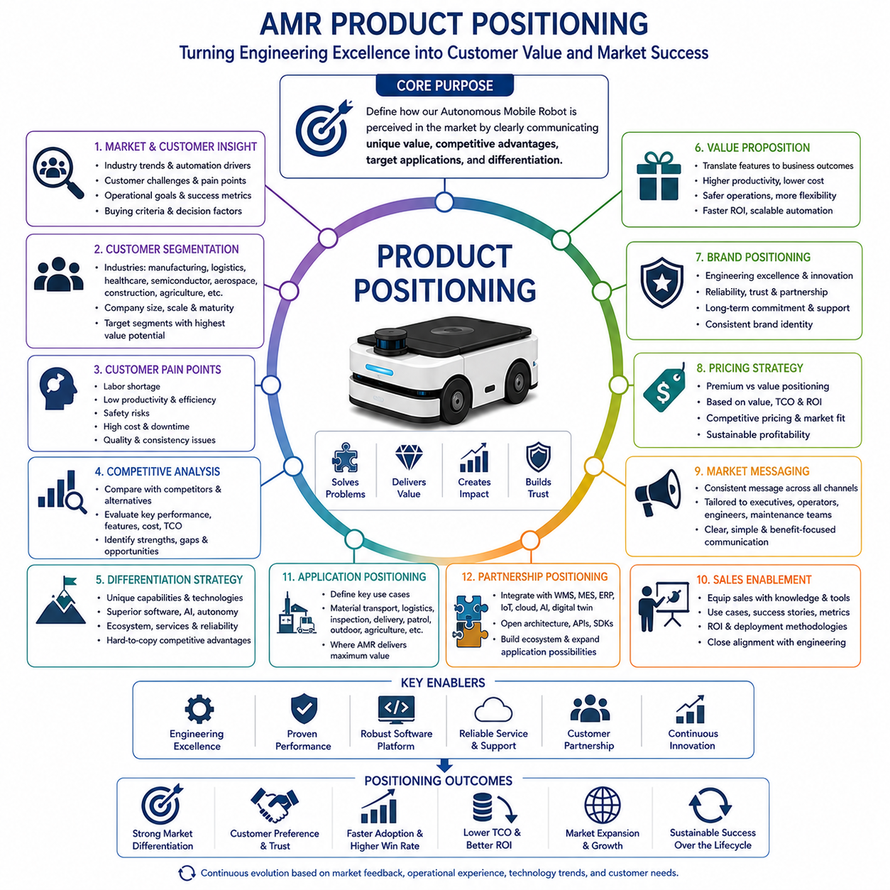
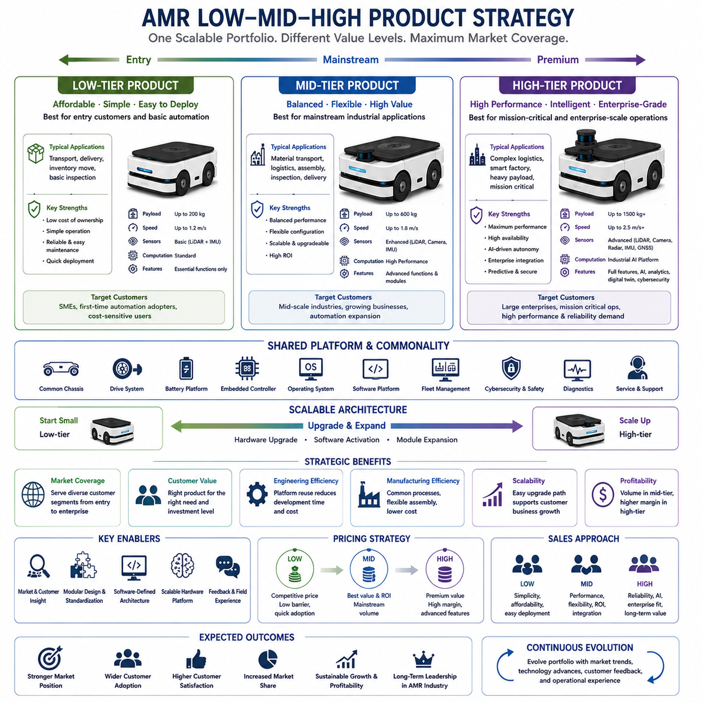
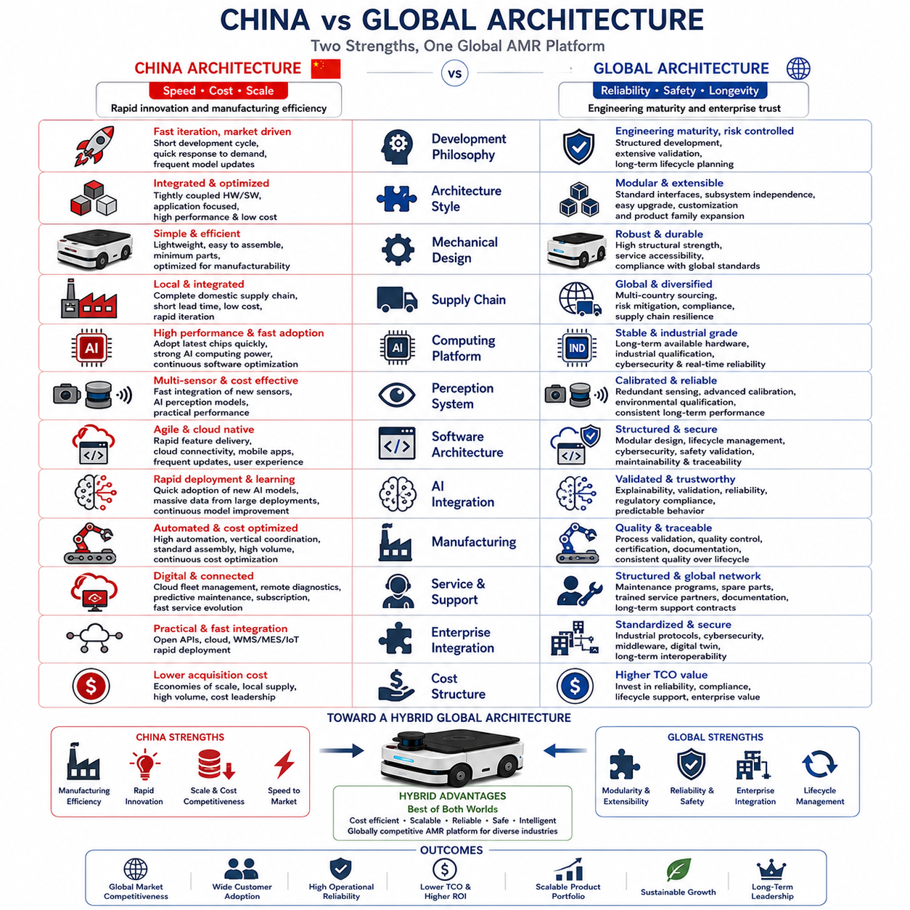
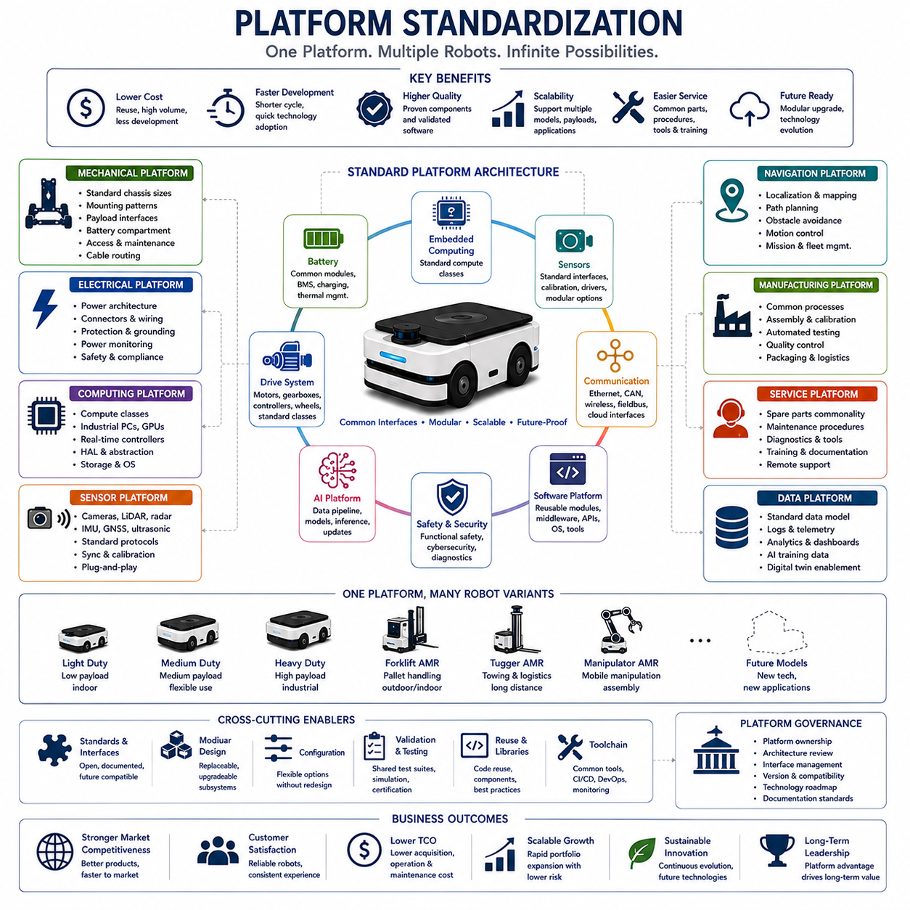
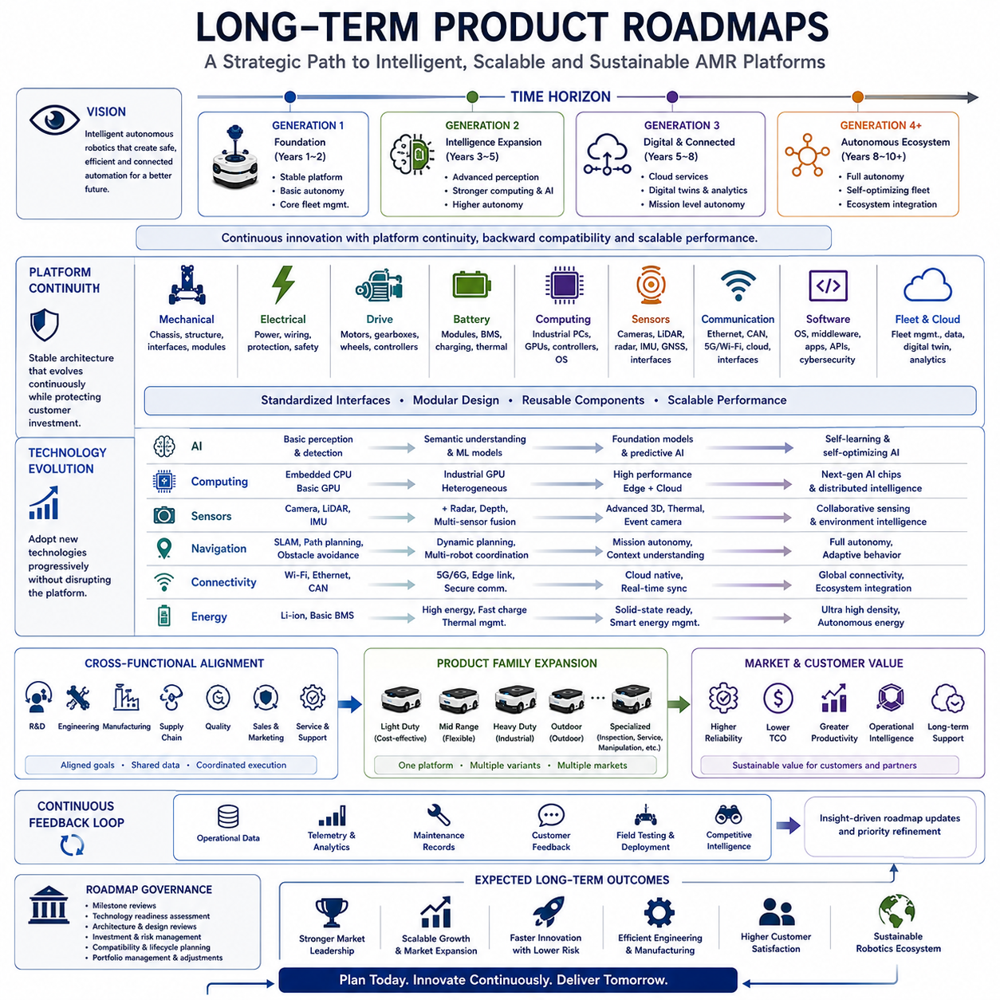

**Volume 01. AMR Foundations and System Architecture**

# 14. AMR Product Strategy · AMR 제품 전략

## 14.01 Product Positioning · 제품 포지셔닝

{width="7.268055555555556in" height="7.268055555555556in"}

제품 포지셔닝(Product Positioning)은 자율이동로봇(Autonomous Mobile Robot, AMR)이 목표 시장(Target Market)에서 어떠한 제품으로 인식될 것인지를 정의하는 전략적 활동이다. 이는 제품의 고유한 가치(Unique Value), 경쟁 우위(Competitive Advantage), 적용 분야(Intended Application), 경쟁 제품과의 차별성(Differentiation)을 명확하게 전달함으로써 뛰어난 기술력을 실제 사업적 성공(Commercial Success)으로 연결하는 역할을 수행한다. 아무리 뛰어난 기술을 가진 로봇이라도 고객이 왜 해당 제품이 우수한지, 어떤 운영 문제를 해결하는지, 기존 방식과 비교하여 어떤 생산성 향상을 제공하는지를 즉시 이해하지 못한다면 시장에서 성공하기 어렵다. 따라서 제품 포지셔닝은 엔지니어링(Engineering), 마케팅(Marketing), 영업(Sales), 제조(Manufacturing), 고객지원(Customer Support), 사업개발(Business Development)이 동일한 제품 가치(Value Proposition)를 공유하도록 만드는 전략적 기반이 된다.

제품 포지셔닝은 내부 기술 중심의 사고가 아니라 시장 요구사항(Market Requirement)에 대한 철저한 이해에서 시작된다. 시장 조사(Market Research)를 통해 산업 동향(Industrial Trend), 고객의 어려움(Customer Challenge), 운영상의 문제점(Operational Pain Point), 인력 부족(Workforce Shortage), 자동화 요구(Automation Demand), 디지털 전환(Digital Transformation), 지속가능성(Sustainability), 신기술(Emerging Technology) 기회를 분석한다. 엔지니어링 팀은 마케팅 조직과 협력하여 고객이 로봇을 평가하는 기준(Evaluation Criteria), 구매 결정(Purchasing Decision)에 영향을 주는 요소, 실제 사업적 가치를 제공하는 성능 특성을 이해해야 한다. 성공적인 제품 포지셔닝은 제품 사양(Product Specification)이 아니라 고객 요구(Customer Need)를 중심으로 구축되며, 이를 통해 엔지니어링 투자가 실제 시장 기회와 직접 연결될 수 있다.

고객 세분화(Customer Segmentation)는 적절한 목표 시장(Target Market)을 정의하는 핵심 과정이다. 자율이동로봇은 제조(Manufacturing), 물류(Logistics), 의료(Healthcare), 반도체(Semiconductor), 항공우주(Aerospace), 건설(Construction), 농업(Agriculture), 광산(Mining), 국방(Defense), 스마트시티(Smart City), 사회기반시설 검사(Infrastructure Inspection) 등 매우 다양한 산업에서 활용된다. 각 산업은 운영 환경(Operational Environment), 규제 요구사항(Regulatory Requirement), 생산성 목표(Productivity Expectation), 안전 기준(Safety Standard), 시스템 통합(System Integration), 투자 우선순위(Investment Priority)가 서로 다르다. 동일한 산업 안에서도 기업 규모(Company Size), 운영 규모(Operation Scale), 자동화 수준(Automation Maturity), 기존 인프라(Infrastructure), 인력 확보 수준(Labor Availability), 디지털 전환 전략에 따라 요구사항이 달라진다. 따라서 제품 포지셔닝은 모든 시장을 동시에 만족시키려 하기보다 가장 높은 사업적 가치를 제공할 수 있는 고객군(Customer Segment)을 우선적으로 정의해야 한다.

고객의 문제점(Customer Pain Point)을 이해하는 것은 성공적인 제품 포지셔닝의 핵심이다. 고객은 첨단 센서(Advanced Sensor), 인공지능(AI), 복잡한 소프트웨어 아키텍처(Software Architecture) 자체를 구매하는 것이 아니라, 실제 운영 문제를 해결하기 위해 자율이동로봇을 도입한다. 기업은 인력 부족(Labor Shortage)을 해결하고, 생산성(Productivity)을 향상시키며, 작업 안전(Safety)을 높이고, 공정의 일관성(Process Consistency)을 확보하며, 가동 중단(Downtime)을 줄이고, 운영 비용(Operational Cost)을 절감하며, 품질(Quality)을 향상시키고, 자원 활용(Resource Utilization)을 최적화하며, 경쟁력(Competitiveness)을 강화하기 위해 자동화를 도입한다. 따라서 제품 포지셔닝은 기술적 특징(Technical Feature)을 고객이 이해하기 쉬운 운영 성과(Operational Outcome)와 사업적 효과(Business Benefit)로 변환하여 설명해야 한다.

경쟁 분석(Competitive Analysis)은 자사의 로봇이 기존 시장 제품과 어떻게 다른지를 명확하게 파악하는 과정이다. 엔지니어는 직접 경쟁사(Direct Competitor), 간접 경쟁사(Indirect Competitor), 기존 자동화 시스템(Conventional Automation), 수작업(Manual Operation), 차세대 로봇 기술(Emerging Robotic Technology)을 대상으로 적재 능력(Payload Capacity), 자율주행 성능(Navigation Performance), 인지 능력(Perception Capability), 인공지능 통합(AI Integration), 배터리 수명(Battery Life), 충전 방식(Charging Strategy), 소프트웨어 생태계(Software Ecosystem), 플릿 관리(Fleet Management), 안전 인증(Safety Certification), 구축 난이도(Deployment Complexity), 유지보수(Maintenance), 확장성(Scalability), 신뢰성(Reliability), 총소유비용(Total Cost of Ownership, TCO)을 비교한다. 이러한 벤치마킹(Benchmarking)은 경쟁 제품과 쉽게 구별될 수 있는 지속 가능한 경쟁 우위(Sustainable Competitive Advantage)를 발견하는 데 중요한 역할을 한다.

차별화 전략(Differentiation Strategy)은 엔지니어링 역량을 시장에서 인식되는 독창적인 제품 정체성(Product Identity)으로 전환하는 과정이다. 어떤 자율이동로봇은 고하중 운송(High Payload Transportation)에 집중하고, 다른 제품은 정밀 검사(Precision Inspection), 협업 작업(Collaborative Operation), 실외 주행(Outdoor Mobility), 지능형 인지(Intelligent Perception), 모듈형 아키텍처(Modular Architecture), 인공지능 기반 자율성(AI-Driven Autonomy)을 핵심 가치로 내세운다. 또한 우수한 소프트웨어 플랫폼(Software Platform), 빠른 구축(Deployment), 클라우드 서비스(Cloud Service), 예지보전(Predictive Maintenance), 사이버보안(Cybersecurity), 디지털 트윈(Digital Twin), 통합 운영 생태계(End-to-End Operational Ecosystem) 역시 중요한 차별화 요소가 될 수 있다. 성공적인 차별화는 모든 성능에서 최고가 되는 것이 아니라 특정 운영 환경에서 고객에게 가장 큰 가치를 제공하는 것이다.

가치 제안(Value Proposition)은 고객이 경쟁 제품이 아닌 해당 제품을 선택해야 하는 이유를 명확하게 설명하는 핵심 메시지이다. 우수한 가치 제안은 기술적 성능과 운영 성과를 연결하여 생산성 향상(Productivity Improvement), 운영 비용 절감(Cost Reduction), 안전성 향상(Safety Enhancement), 운영 유연성(Flexibility), 유지보수 비용 절감(Maintenance Reduction), 구축 단순화(Simplified Deployment), 빠른 투자 회수(Return on Investment, ROI), 확장 가능한 자동화(Scalable Automation)를 구체적으로 제시한다. 단순한 기술 사양보다 실제 운영에서 얻을 수 있는 사업적 결과(Business Outcome)를 설명하는 것이 고객의 구매 의사결정에 훨씬 큰 영향을 미친다. 또한 엔지니어링 검증과 파일럿 운영(Pilot Deployment)에서 확보한 정량적 성능 데이터는 고객의 신뢰를 높이고 구매 위험을 줄이는 중요한 근거가 된다.

브랜드 포지셔닝(Brand Positioning)은 개별 제품을 넘어 기업 전체의 장기적인 시장 이미지를 구축하는 활동이다. 고객은 로봇 자체뿐 아니라 제조사의 엔지니어링 역량(Engineering Expertise), 기술 리더십(Technology Leadership), 제품 신뢰성(Product Reliability), 서비스 능력(Service Capability), 혁신 문화(Innovation Culture), 장기적인 지원 의지(Long-Term Commitment)를 함께 평가한다. 일관된 브랜드 이미지는 신뢰성(Trustworthiness), 기술 우수성(Engineering Excellence), 고객과의 파트너십(Customer Partnership), 지속적인 혁신(Continuous Innovation), 운영 안정성(Operational Reliability)을 전달하며, 향후 출시될 새로운 제품에도 긍정적인 영향을 준다. 강력한 브랜드는 제품 포지셔닝을 더욱 강화하고 장기적인 시장 확대(Market Expansion)를 지원하는 기반이 된다.

가격 전략(Pricing Strategy)은 제품 포지셔닝에 직접적인 영향을 미친다. 고객은 가격을 기술 수준(Technology Capability), 신뢰성(Reliability), 서비스 품질(Service Quality), 장기적인 가치(Long-Term Value)의 지표로 인식하는 경우가 많다. 프리미엄 포지셔닝(Premium Positioning)은 고급 기능, 높은 신뢰성, 포괄적인 서비스, 장기적인 운영 성능을 강조하며, 가치 중심(Value-Oriented) 포지셔닝은 합리적인 가격, 빠른 구축, 낮은 초기 투자, 운영 효율성을 강조한다. 가격 결정은 제조 비용(Manufacturing Cost), 생애주기 지원(Lifecycle Support), 소프트웨어 라이선스(Software Licensing), 유지보수 서비스(Maintenance Service), 경쟁 가격(Competitive Pricing), 고객 구매 행동(Purchasing Behavior), 투자 대비 수익(Return on Investment)을 모두 고려하여 이루어진다. 성공적인 가격 전략은 단순한 저가 정책이 아니라 고객이 느끼는 가치와 기업의 지속 가능한 수익성을 동시에 만족시키는 균형을 추구한다.

시장 메시지(Market Messaging)는 고객과 접촉하는 모든 채널에서 동일한 제품 이미지를 전달하도록 한다. 마케팅 자료(Marketing Material), 기술 문서(Technical Documentation), 제품 시연(Product Demonstration), 전시회(Trade Exhibition), 디지털 콘텐츠(Digital Media), 영업 발표(Sales Presentation), 고객 교육(Customer Training), 엔지니어링 미팅(Engineering Discussion)은 모두 동일한 핵심 가치(Value Proposition)를 전달해야 한다. 최고경영진(Executive)은 투자 효과와 사업 전략을 중요하게 생각하며, 운영 관리자(Operation Manager)는 생산성과 효율성을, 엔지니어는 기술 구조와 시스템 통합 능력을, 유지보수 조직은 신뢰성과 서비스성을 중점적으로 평가한다. 일관된 메시지는 다양한 이해관계자(Stakeholder)가 자신의 관점에서 제품 가치를 쉽게 이해할 수 있도록 한다.

영업 지원(Sales Enablement)은 제품 포지셔닝을 실제 영업 활동으로 연결하는 과정이다. 영업 조직은 기술 자료(Technical Knowledge), 경쟁 제품 비교(Competitive Comparison), 적용 사례(Application Example), 고객 성공 사례(Customer Success Story), 운영 성능 지표(Operational Performance Metric), 구축 방법론(Deployment Methodology), 투자 효과 분석(Return-on-Investment Analysis)을 활용하여 고객에게 제품을 설명한다. 영업 엔지니어(Sales Engineer)는 복잡한 기술 내용을 고객 중심의 언어(Customer-Oriented Language)로 설명하면서 실제 운영 문제를 어떻게 해결할 수 있는지를 제시한다. 엔지니어링 조직과 영업 조직 간의 긴밀한 협력은 고객에게 검증된 기술 수준을 정확하게 전달하고 과도한 기대를 방지하는 데 중요한 역할을 한다.

적용 분야 포지셔닝(Application Positioning)은 자율이동로봇이 가장 높은 효과를 발휘할 수 있는 구체적인 운영 시나리오(Operation Scenario)를 정의하는 과정이다. 단순히 이동 기능(Mobility Capability)을 설명하는 것이 아니라 자동 자재 운송(Automated Material Transportation), 창고 물류(Warehouse Logistics), 산업 검사(Industrial Inspection), 병원 배송(Hospital Delivery), 보안 순찰(Security Patrol), 사회기반시설 모니터링(Infrastructure Monitoring), 정밀 농업(Precision Agriculture), 건설 현장 지원(Construction Site Support), 공항 물류(Airport Logistics), 제조 자동화(Manufacturing Automation), 스마트 시설 관리(Intelligent Facility Management)와 같은 구체적인 적용 사례를 제시한다. 이러한 명확한 적용 분야 정의는 고객이 실제 운영 모습을 쉽게 상상할 수 있도록 하며 구매 결정을 더욱 단순하게 만든다.

파트너십 포지셔닝(Partnership Positioning)은 자율이동로봇이 독립적인 장비가 아니라 산업 생태계(Industrial Ecosystem)의 일부로 동작한다는 점을 강조한다. 현대의 자율이동로봇은 창고 관리 시스템(Warehouse Management System, WMS), 제조 실행 시스템(Manufacturing Execution System, MES), 전사적 자원 관리(Enterprise Resource Planning, ERP), 클라우드 컴퓨팅(Cloud Computing), 산업용 사물인터넷(Industrial Internet of Things, IIoT), 인공지능 서비스(AI Service), 디지털 트윈(Digital Twin), 로봇 매니퓰레이터(Robotic Manipulator), 산업용 센서(Industrial Sensor), 다양한 자동화 장비와 긴밀하게 연동된다. 개방형 아키텍처(Open Architecture), 표준 인터페이스(Standard Interface), 소프트웨어 개발 키트(Software Development Kit, SDK), 응용프로그램 인터페이스(Application Programming Interface, API), 모듈형 통합 프레임워크(Modular Integration Framework)는 고객의 시스템 통합 위험을 줄이고 향후 다양한 응용 분야로 확장할 수 있는 기반을 제공한다.

제품 포지셔닝은 시장 환경과 고객 요구사항이 지속적으로 변화하기 때문에 끊임없이 발전하는 전략이다. 고객 피드백(Customer Feedback), 운영 경험(Operational Experience), 현장 구축 결과(Field Deployment Result), 신기술(Emerging Technology), 규제 변화(Regulatory Development), 인공지능 발전(AI Advancement), 노동 환경 변화(Workforce Transformation), 지속가능성(Sustainability), 경쟁 시장 변화(Competitive Market Dynamics)는 모두 제품 포지셔닝 전략에 영향을 준다. 엔지니어링 조직은 검증된 기술 역량을 유지하면서도 시장 변화에 맞추어 제품 메시지를 지속적으로 개선해야 한다. 따라서 장기적인 제품 포지셔닝은 일회성 마케팅 활동이 아니라 지속적으로 발전하는 전략적 활동이며, 이를 통해 자율이동로봇(Autonomous Mobile Robot, AMR)은 제품 생애주기(Product Lifecycle) 전반에 걸쳐 시장 경쟁력을 유지하고, 기술적 차별성을 확보하며, 변화하는 고객 요구에 지속적으로 대응할 수 있는 제품으로 성장하게 된다.

## 14.02 Low / Mid / High Product Strategy · Low/Mid/High 제품 전략

{width="7.268055555555556in" height="7.268055555555556in"}

저가(Low), 중가(Mid), 고가(High) 제품 전략(Low, Mid, High Product Strategy)은 자율이동로봇(Autonomous Mobile Robot, AMR) 제조사가 다양한 고객층(Customer Segment)을 효과적으로 대응하면서 시장 점유율(Market Coverage), 엔지니어링 효율성(Engineering Efficiency), 장기적인 수익성(Long-Term Profitability)을 동시에 확보하기 위한 제품 포트폴리오(Product Portfolio) 전략이다. 모든 고객 요구사항마다 완전히 새로운 제품을 개발하는 대신, 공통 기술(Common Technology), 소프트웨어 플랫폼(Software Platform), 제조 공정(Manufacturing Process), 서비스 인프라(Service Infrastructure)를 공유하는 하나의 제품군(Product Family)을 구축하고, 성능 수준(Performance Level), 기능(Feature Set), 가격(Pricing)을 차별화하여 여러 시장을 동시에 공략한다. 이러한 전략은 자동화를 처음 도입하는 고객부터 대규모 산업 고객까지 하나의 통합된 제품 생태계(Product Ecosystem) 안에서 모두 대응할 수 있도록 하며, 플랫폼 재사용(Platform Reuse)을 통해 엔지니어링 복잡성과 제조 비용을 줄이면서 시장 경쟁력을 높이는 데 중요한 역할을 한다.

제품 등급(Product Tier) 전략은 시장 세분화(Market Segmentation)와 고객의 구매 행동(Purchasing Behavior)을 충분히 이해하는 것에서 시작된다. 고객은 운영 규모(Operation Scale), 투자 여력(Investment Capacity), 자동화 성숙도(Automation Maturity), 기술 수준(Technical Expertise), 기존 인프라(Infrastructure Readiness), 투자 대비 수익(Return on Investment, ROI)에 대한 기대가 서로 다르다. 중소기업(Small and Medium-Sized Enterprise, SME)은 자동화를 처음 도입하는 경우가 많기 때문에 저렴한 비용(Affordability), 단순한 운영(Simplicity), 빠른 구축(Rapid Deployment)을 우선시한다. 중견 산업 고객(Medium-Scale Industrial Organization)은 성능과 비용의 균형(Balanced Performance), 시스템 통합(Integration), 확장성(Expansion Capability)을 중요하게 생각한다. 대기업(Large Enterprise)은 초기 도입 비용보다 운영 최적화(Operational Optimization), 인공지능(AI), 기업 시스템 연동(Enterprise Integration), 사이버보안(Cybersecurity), 높은 가용성(High Availability), 예지보전(Predictive Maintenance), 장기 확장성(Long-Term Scalability)을 더욱 중요하게 평가한다. 제품 전략은 이러한 고객별 요구사항을 정확히 반영하여 기술과 사업 가치를 연결해야 한다.

저가 제품(Low-Tier Product)은 자율이동로봇 제품군의 진입 모델(Entry-Level Product)로서 가장 낮은 총소유비용(Total Cost of Ownership, TCO)으로 기본적인 자율 기능을 제공하는 것을 목표로 한다. 이러한 제품은 최고 성능보다 단순성(Simplicity), 신뢰성(Reliability), 구축 용이성(Ease of Deployment), 낮은 유지보수 비용(Minimal Maintenance)을 우선한다. 자율주행(Navigation)은 검증된 위치추정(Localization) 기술을 기반으로 하며, 센서 이중화(Sensor Redundancy)와 연산 성능(Computational Capability)은 기본 수준으로 구성된다. 적재 능력(Payload Capacity), 주행 속도(Travel Speed), 인지 범위(Perception Range), 지능형 의사결정(Intelligent Decision Making)은 단순 운송(Transportation), 배송(Delivery), 재고 이동(Inventory Movement), 기본 검사(Basic Inspection)와 같은 일반적인 작업에 최적화된다. 또한 불필요한 하드웨어 복잡성을 줄이면서도 향후 기능 확장을 위한 업그레이드 가능성(Upgrade Capability)은 유지하도록 설계된다. 이러한 저가 제품은 비용에 민감한 고객이 자동화를 쉽게 도입할 수 있도록 진입 장벽을 크게 낮추는 역할을 한다.

저가 제품의 엔지니어링 철학(Engineering Philosophy)은 맞춤형(Customization)보다 표준화(Standardization)를 중심으로 한다. 기계 구조(Mechanical Structure)는 공통 차체(Common Chassis Platform), 표준 구동 시스템(Standardized Drive System), 모듈형 배터리(Modular Battery), 공용 전자 제어기(Shared Electronic Controller), 단순화된 센서 구성(Simplified Sensor Configuration)을 사용하여 제조 편차를 최소화한다. 소프트웨어 아키텍처(Software Architecture)는 상위 제품과 호환성을 유지하면서도 엔트리급(Entry-Level)에서 필요하지 않은 고급 기능은 제한한다. 플릿 관리(Fleet Management), 자율주행(Navigation), 안전 감시(Safety Supervision), 진단(Diagnostics) 기능은 모두 검증된 상태를 유지하지만 계산량을 줄이고 운영을 단순화하기 위해 필요한 수준으로 최적화된다. 이러한 공통 플랫폼은 개발 비용을 줄이고 전체 제품군의 제조와 유지보수를 더욱 효율적으로 만든다.

중가 제품(Mid-Tier Product)은 성능(Capability), 유연성(Flexibility), 투자 효율성(Investment Efficiency)의 균형을 원하는 고객을 대상으로 한다. 이 제품군은 저가 제품보다 더 높은 적재 능력(Payload Capacity), 향상된 인지 성능(Perception Performance), 더욱 안정적인 자율주행(Navigation Robustness), 강력한 컴퓨팅 성능(Computing Capability), 확장된 소프트웨어 기능(Software Functionality), 높은 시스템 통합 능력(Integration Flexibility)을 제공하지만, 최고급 제품 수준의 복잡성과 비용은 유지하지 않는다. 대부분의 산업 고객이 요구하는 기능을 만족하면서도 총소유비용(TCO)을 합리적으로 유지할 수 있기 때문에 실제 시장에서는 가장 높은 판매량(Sales Volume)을 차지하는 제품군이 되는 경우가 많다. 따라서 중가 제품은 가격 대비 성능(Balance between Affordability and Performance)이 가장 중요한 시장을 대상으로 하는 핵심 제품이다.

중가 제품의 엔지니어링은 높은 수준의 모듈화(Modularity)를 제공하여 고객이 운영 환경에 맞게 시스템을 선택적으로 구성할 수 있도록 한다. 추가 센서(Additional Sensor), 대용량 배터리(Larger Battery), 고성능 산업용 컴퓨터(Enhanced Industrial Computer), 고급 무선 통신(Advanced Wireless Communication), 확장된 플릿 관리 기능(Expanded Fleet Management), 선택형 소프트웨어 모듈(Configurable Software Module)이 제공된다. 또한 인공지능(AI)은 향상된 인지 모델(Improved Perception Model), 의미 이해(Semantic Understanding), 적응형 자율주행(Adaptive Navigation), 지능형 장애물 회피(Intelligent Obstacle Avoidance), 운영 분석(Predictive Operational Analytics)을 통해 더욱 중요한 역할을 수행한다. 모듈형 구조는 고객이 현재 필요한 기능만 구매한 후 향후 운영 규모가 증가하면 점진적으로 기능을 확장할 수 있도록 지원한다.

고가 제품(High-Tier Product)은 최고의 성능(Maximum Performance), 운영 안정성(Operational Resilience), 지능형 자율성(Intelligent Autonomy), 대규모 기업 운영(Enterprise-Scale Deployment)을 요구하는 고객을 위한 최상위 제품군이다. 프리미엄 시스템(Premium System)은 최고 수준의 인지 센서(Perception Sensor), 산업용 컴퓨팅 플랫폼(Industrial Computing Platform), 이중화 안전 구조(Redundant Safety Architecture), 고성능 인공지능(AI), 대용량 배터리(High-Capacity Battery), 고급 플릿 관리(Fleet Coordination), 예지보전(Predictive Maintenance), 디지털 트윈(Digital Twin), 사이버보안(Cybersecurity), 기업 시스템 연동(Enterprise Connectivity)을 모두 포함한다. 이러한 시스템은 생산성과 안정성이 기업 운영에 직접적인 영향을 미치는 복잡하고 동적인 산업 환경에서 사용되므로 초기 도입 비용보다 최고의 기술력과 운영 품질을 우선시한다.

프리미엄 제품의 엔지니어링 설계는 최고 수준의 성능을 제공하면서도 높은 신뢰성을 유지하는 데 초점을 맞춘다. 라이다(LiDAR), 레이더(Radar), 비전 시스템(Vision System), 관성항법(Inertial Navigation), 위성항법(Global Navigation Satellite System, GNSS), 센서 융합(Sensor Fusion)을 활용하여 매우 강력한 환경 인지(Environmental Awareness)를 구현한다. 고성능 GPU(Graphics Processing Unit)는 딥러닝 추론(Deep Learning Inference), 의미 기반 인지(Semantic Perception), 지능형 경로 계획(Intelligent Planning)을 실시간으로 수행하면서도 결정론적 제어(Deterministic Real-Time Control)를 유지한다. 또한 이중화 통신(Redundant Communication), 산업용 안전 제어기(Industrial Safety Controller), 고급 진단(Advanced Diagnostics), 예지보전 알고리즘, 클라우드 기반 운영 분석(Cloud-Based Operational Intelligence)을 통해 극한의 산업 환경에서도 지속적인 운영을 지원한다. 대기업 고객은 높은 수준의 소프트웨어 맞춤화(Custom Software), 사이버보안 인증(Cybersecurity Compliance), 규제 인증(Regulatory Certification), 디지털 제조 인프라(Digital Manufacturing Infrastructure)와의 연동을 요구하는 경우가 많다.

제품 등급 간의 성능 차이가 존재하더라도 성공적인 제조사는 최대한 높은 플랫폼 공통성(Platform Commonality)을 유지한다. 기계 인터페이스(Mechanical Interface), 배터리 기술(Battery Technology), 임베디드 제어기(Embedded Controller), 운영체제(Operating System), 미들웨어(Middleware), 소프트웨어 아키텍처(Software Architecture), 플릿 관리(Fleet Management), 사이버보안(Cybersecurity), 진단 시스템(Diagnostic Framework), 유지보수 절차(Maintenance Procedure)는 가능한 한 동일한 플랫폼을 공유한다. 이러한 공통 플랫폼은 개발 비용을 줄이고, 소프트웨어 유지보수를 단순화하며, 제조 효율을 높이고, 예비 부품 재고를 최소화하며, 기술자 교육을 쉽게 하고, 장기적인 제품 발전(Product Evolution)을 지원한다. 또한 고객 역시 동일한 플랫폼을 사용함으로써 상위 제품으로 쉽게 전환할 수 있는 장점을 얻는다.

소프트웨어 플랫폼 전략(Software Platform Strategy)은 현대 자율이동로봇의 경쟁력이 하드웨어보다 소프트웨어에서 결정되는 경우가 많기 때문에 매우 중요한 요소이다. 자율주행(Navigation), 위치추정(Localization), 통신(Communication), 안전 관리(Safety Management), 진단(Diagnostics), 사이버보안(Cybersecurity), 플릿 제어(Fleet Coordination), 인공지능 프레임워크(AI Framework)는 가능한 한 모든 제품 등급에서 동일한 구조를 유지한다. 제품 간 차별화는 완전히 다른 소프트웨어를 개발하는 것이 아니라 소프트웨어 라이선스(Software Licensing), 연산 성능(Computational Capability), 센서 구성(Sensor Availability), 기능 활성화(Feature Activation)를 통해 이루어진다. 이러한 통합 소프트웨어 구조는 검증 비용을 줄이고 전체 제품군의 기능을 지속적으로 발전시키는 기반이 된다.

확장 가능한 하드웨어 아키텍처(Scalable Hardware Architecture)는 효율적인 제조와 미래 업그레이드를 동시에 지원한다. 엔트리급 제품은 향후 대용량 배터리(Larger Battery), 추가 인지 센서(Additional Perception Sensor), 고성능 산업용 컴퓨터(Upgraded Industrial Computer), 향상된 무선 통신(Improved Wireless Communication), 인공지능 기능 확장(Expanded AI Capability)을 통해 점진적으로 성능을 향상시킬 수 있다. 중가 제품도 하드웨어 추가와 소프트웨어 활성화를 통해 프리미엄 제품 수준으로 발전할 수 있다. 이러한 확장 가능한 구조는 고객의 초기 투자를 보호하고, 운영 규모가 증가함에 따라 기능을 단계적으로 확장할 수 있도록 하며, 제품 수명을 연장하고 생애주기 비용(Lifecycle Cost)을 절감하는 중요한 역할을 한다.

다양한 제품 등급을 위한 가격 전략(Pricing Strategy)은 시장 접근성(Market Accessibility)과 기업 수익성(Business Profitability)의 균형을 고려하여 설계된다. 저가 제품은 낮은 초기 투자 비용과 간단한 구축을 통해 신규 고객을 확보한다. 중가 제품은 투자 대비 운영 가치(Operational Value)를 극대화하여 가장 많은 판매량을 확보하는 핵심 제품군이 된다. 고가 제품은 고급 기능, 기업 시스템 통합, 특수 응용 분야(Specialized Application), 장기 서비스(Lifecycle Service)를 통해 높은 수익성을 창출한다. 가격 차이는 단순한 하드웨어 성능이 아니라 고객에게 제공되는 실제 운영 가치(Measurable Operational Value)를 기준으로 결정되며, 고객은 자신의 운영 목적에 가장 적합한 제품을 선택할 수 있도록 명확한 사업적 근거를 제공받는다.

제품 등급별 영업 전략(Sales Strategy)은 고객의 구매 동기가 서로 다르기 때문에 차별화되어야 한다. 저가 제품 고객은 가격 경쟁력(Affordability), 구축 용이성(Ease of Deployment), 빠른 도입(Rapid Implementation), 단순한 운영(Simplicity)을 중요하게 생각한다. 중가 제품 고객은 생산성 향상(Productivity Improvement), 운영 유연성(Operational Flexibility), 시스템 통합(Integration Capability), 장기적인 투자 수익(Return on Investment)을 중시한다. 프리미엄 고객은 사업 연속성(Business Continuity), 지능형 자동화(Intelligent Automation), 사이버보안(Cybersecurity), 예지보전(Predictive Maintenance), 디지털 전환(Digital Transformation), 기업 시스템 연결(Enterprise Connectivity), 전략적 운영 최적화(Strategic Operational Optimization)를 핵심 가치로 평가한다. 따라서 영업 조직은 고객의 수준에 맞추어 설명 자료, 제품 시연(Demonstration), 기술 문서(Technical Documentation), 경제성 분석(Financial Analysis), 구축 계획(Deployment Planning)을 차별화하면서도 제품의 핵심 가치는 일관되게 유지해야 한다.

제품 등급 기반의 제조 전략(Manufacturing Strategy)은 표준화된 생산 공정(Standardized Production Process)을 통해 여러 제품을 하나의 생산 라인(Assembly Line)에서 효율적으로 생산할 수 있도록 한다. 동일한 조립 공정(Assembly Process), 보정 절차(Calibration Procedure), 품질보증(Quality Assurance), 소프트웨어 설치(Software Deployment), 시험 인프라(Test Infrastructure), 물류(Logistics), 서비스 조직(Service Organization)을 공통으로 활용하면서, 최종 조립 단계(Final Assembly)에서 필요한 모듈(Module)을 선택하여 제품 등급을 구분한다. 이러한 방식은 생산 효율을 높이고 재고 관리의 복잡성을 줄이며 납기를 단축하고 시장 수요 변화에도 빠르게 대응할 수 있도록 하면서도 일관된 품질을 유지할 수 있는 장점을 제공한다.

저가·중가·고가 제품 전략의 장기적인 성공은 고객 피드백(Customer Feedback), 현장 운영 경험(Field Experience), 경쟁 분석(Competitive Analysis), 기술 발전(Technology Advancement), 제조 최적화(Manufacturing Optimization), 시장 변화(Market Transformation)를 기반으로 지속적으로 제품 포트폴리오를 발전시키는 데 달려 있다. 기술이 성숙하고 부품 가격(Component Cost)이 하락하며 인공지능 성능(AI Capability)이 향상되고 고객 요구사항(Customer Expectation)이 증가함에 따라 제품 등급의 경계도 점진적으로 변화한다. 초기에는 프리미엄 제품에서만 제공되던 기능이 시간이 지나면서 중가 제품으로 확산되고, 이후에는 저가 제품에서도 기본 기능으로 제공되는 경우가 많다. 이러한 단계적인 기술 이전(Technology Transfer)은 제품 간의 차별성을 유지하면서도 전체 제품군의 경쟁력을 지속적으로 향상시킨다. 성공적인 제품 등급 전략은 엔지니어링 혁신(Engineering Innovation), 제조 효율(Manufacturing Efficiency), 고객 만족(Customer Satisfaction), 사업 성장(Commercial Growth), 자율이동로봇 산업(Autonomous Mobile Robot Industry)에서의 장기적인 시장 리더십(Long-Term Market Leadership)을 동시에 실현할 수 있는 지속 가능한 발전 로드맵(Sustainable Roadmap)을 제공한다.

## 14.03 China vs Global Architecture · 중국 vs 글로벌 아키텍처

{width="7.268055555555556in" height="7.268055555555556in"}

중국(China)과 글로벌(Global) 자율이동로봇(Autonomous Mobile Robot, AMR) 아키텍처는 서로 다른 산업 환경(Industrial Environment), 고객 요구(Customer Expectation), 제조 생태계(Manufacturing Ecosystem), 사업 전략(Business Strategy) 속에서 발전해 왔다. 두 아키텍처 모두 자율주행(Autonomous Navigation), 지능형 인지(Intelligent Perception), 플릿 관리(Fleet Management), 산업 자동화(Industrial Automation)를 공통 목표로 하지만, 비용(Cost), 확장성(Scalability), 시스템 통합(System Integration), 제품 생애주기(Product Lifecycle), 소프트웨어 아키텍처(Software Architecture), 기술 차별화(Technological Differentiation)에 대해서는 서로 다른 우선순위를 가진다. 국제 경쟁력을 갖춘 로봇 플랫폼을 개발하려는 제조사에게 이러한 차이를 이해하는 것은 매우 중요하다. 실제로 성공적인 글로벌 제품은 중국이 강점을 가진 제조 효율성(Manufacturing Efficiency)과 빠른 상용화(Rapid Commercialization), 그리고 글로벌 기업이 강조하는 신뢰성(Reliability), 모듈화(Modularity), 기능 안전(Functional Safety), 기업 시스템 통합(Enterprise Integration)을 결합하는 방향으로 발전하고 있다. 따라서 현대의 엔지니어링은 두 가지 접근 방식을 경쟁 관계가 아닌 상호 보완적인 설계 전략(Complementary Design Strategy)으로 인식하며 하나의 글로벌 제품 아키텍처(Global Product Architecture) 안에서 통합하려는 방향으로 나아가고 있다.

중국의 로봇 산업 생태계(Robotics Ecosystem)는 강력한 제조 기반(Manufacturing Infrastructure), 수직 계열화된 공급망(Vertically Integrated Supply Chain), 거대한 내수 시장(Domestic Demand), 공격적인 상용화 전략(Aggressive Commercialization)을 바탕으로 매우 빠르게 성장하였다. 대량 생산(High Production Volume)은 하드웨어 비용을 크게 낮추는 동시에 지속적인 현장 배포(Field Deployment)를 통해 제품을 빠르게 개선할 수 있도록 지원한다. 엔지니어링 의사결정은 장기간의 플랫폼 호환성(Long-Term Platform Compatibility)보다 제조성(Manufacturability), 공급망 효율(Supply Chain Efficiency), 하드웨어 표준화(Hardware Standardization), 빠른 제품 진화(Rapid Product Evolution)를 우선하는 경우가 많다. 제품 개발 주기(Product Development Cycle) 역시 짧아 고객 요구와 시장 변화에 신속하게 대응하면서 새로운 모델을 빠르게 출시할 수 있다. 이러한 개발 문화는 중국 제조사가 가격 경쟁력이 중요한 산업 자동화 시장에서 매우 높은 경쟁력을 확보하는 데 중요한 역할을 하였다.

글로벌 로봇 제조사는 전통적으로 엔지니어링 성숙도(Engineering Maturity), 장기 신뢰성(Long-Term Reliability), 기능 안전(Functional Safety), 인증(Certification), 기업 수준의 생애주기 지원(Enterprise-Scale Lifecycle Support)을 중요하게 생각한다. 제품 개발은 요구사항 분석(Requirements Analysis), 공식 검증(Formal Verification), 광범위한 시험(Extensive Validation), 규제 준수(Regulatory Compliance), 장기 유지보수 계획(Long-Term Maintenance Planning)과 같은 체계적인 개발 절차를 따른다. 개발 기간은 중국보다 긴 경우가 많지만, 이는 상용화 이전에 기술적 위험(Technical Risk)을 최대한 줄이기 위한 것이다. 이러한 접근 방식은 제품 출시 속도는 다소 늦을 수 있지만, 장기간의 연속 운전이 요구되는 산업 환경에서는 높은 신뢰성과 안정성을 제공하는 장점이 있다.

아키텍처 철학(Architectural Philosophy) 역시 두 접근 방식에서 큰 차이를 보인다. 중국의 많은 로봇 플랫폼은 특정 고객 응용 분야(Customer Application)에 맞추어 하드웨어와 소프트웨어를 긴밀하게 통합(Tightly Coupled)함으로써 성능, 비용, 제조 효율을 동시에 최적화하는 방향을 선택한다. 반면 글로벌 아키텍처는 모듈화(Modularity), 표준 인터페이스(Standardized Interface), 서브시스템 독립성(Sub-System Independence), 플랫폼 확장성(Platform Extensibility)을 더욱 중요하게 고려한다. 기계 구조(Mechanical Structure), 인지 시스템(Perception System), 컴퓨팅 플랫폼(Compute Platform), 자율주행 소프트웨어(Navigation Software), 플릿 관리(Fleet Management), 기업 시스템 인터페이스(Enterprise Interface)는 모두 독립적으로 교체 가능한 모듈(Module) 형태로 설계되는 경우가 많다. 이러한 모듈형 구조는 유지보수(Maintenance), 업그레이드(Upgrade), 고객 맞춤화(Customization), 제품군(Product Family) 확장을 더욱 쉽게 만든다.

기계 플랫폼(Mechanical Platform) 설계에서도 중요한 차이가 나타난다. 중국 제조사는 제조 효율(Manufacturing Efficiency), 단순한 구조(Simple Structure), 경량화(Lightweight Construction), 빠른 조립(Rapid Assembly), 최소 부품 수(Minimum Component Count)를 우선적으로 고려하는 경우가 많다. 또한 부품 선택은 국내 공급망(Domestic Supply Availability)과 대량 생산성(Manufacturing Scalability)을 중심으로 이루어진다. 글로벌 제조사는 구조 강성(Structural Robustness), 환경 내구성(Environmental Durability), 유지보수 접근성(Service Accessibility), 모듈 교체(Modular Replacement), 장기 피로 수명(Long-Term Fatigue Resistance), 국제 산업 규격(International Industrial Standard)을 더욱 중요하게 고려한다. 이러한 접근은 제조 비용을 증가시킬 수 있지만 장기간 운영되는 산업 현장에서 더욱 높은 신뢰성을 제공한다.

공급망 아키텍처(Supply Chain Architecture)는 양측의 가장 큰 경쟁력 차이 가운데 하나이다. 중국 로봇 기업은 배터리(Battery), 모터(Motor), 제어기(Controller), 산업용 컴퓨터(Industrial Computer), 센서(Sensor), 전자 부품(Electronic Component), 기계 가공(Mechanical Fabrication), 최종 조립(Final Assembly)까지 대부분을 하나의 산업 지역에서 조달할 수 있는 지역 중심 제조 생태계(Local Manufacturing Ecosystem)의 장점을 가진다. 이러한 구조는 구매 기간(Procurement Time), 물류(Logistics), 제조 비용, 제품 개선 주기를 크게 단축시킨다. 반면 글로벌 제조사는 여러 국가에 분산된 공급업체(Global Supplier Network)를 활용하여 부품 다양성(Component Diversification), 규제 대응(Regulatory Compliance), 전문 기술(Specialized Technology), 공급망 안정성(Supply Chain Resilience)을 확보한다. 이러한 분산 구조는 관리가 복잡하지만 특정 지역에 대한 의존도를 줄이는 장점이 있다.

컴퓨팅 아키텍처(Computing Architecture)는 인공지능(AI)의 발전과 함께 점점 더 중요한 요소가 되고 있다. 중국의 로봇 플랫폼은 최신 프로세서(Processor), GPU(Graphics Processing Unit), 임베디드 제어기(Embedded Controller), 인공지능 가속기(AI Accelerator)를 매우 빠르게 제품에 적용하는 경우가 많으며, 운영 경험을 바탕으로 소프트웨어를 지속적으로 개선한다. 글로벌 제조사는 새로운 컴퓨팅 플랫폼을 도입하기 전에 산업용 인증(Industrial Qualification), 장기 공급 가능성(Long-Term Availability), 열 검증(Thermal Validation), 사이버보안 인증(Cybersecurity Certification), 결정론적 실시간 제어(Deterministic Real-Time Behavior)를 충분히 검증한다. 따라서 글로벌 제품은 연산 성능뿐 아니라 장기적인 운영 안정성과 유지보수까지 함께 고려하여 플랫폼을 선정한다.

인지 아키텍처(Perception Architecture) 역시 서로 다른 엔지니어링 철학을 보여준다. 중국 플랫폼은 다양한 상용 카메라(Camera), 라이다(LiDAR), 레이더(Radar), 인공지능 인지 알고리즘(AI Perception Algorithm)을 빠르게 통합하여 높은 성능과 경쟁력 있는 가격을 동시에 추구한다. 새로운 센서 기술이 등장하면 매우 빠르게 제품에 반영되는 경우가 많다. 반면 글로벌 시스템은 다중 센서 보정(Multi-Sensor Calibration), 장기 안정성(Long-Term Stability), 환경 인증(Environmental Qualification), 센서 이중화(Redundant Sensing), 결정론적 성능(Deterministic Performance), 다양한 환경에서의 종합 검증(Comprehensive Validation)을 중요하게 생각한다. 철저한 센서 보정과 검증은 장기간 운영에서도 안정적인 위치추정(Localization)과 인지 성능(Perception Performance)을 유지하는 기반이 된다.

소프트웨어 아키텍처(Software Architecture)는 오늘날 하드웨어 이상의 경쟁력을 결정하는 요소가 되었다. 중국의 로봇 소프트웨어는 빠른 기능 추가(Rapid Feature Delivery), 사용자 경험(User Experience), 클라우드 연결(Cloud Connectivity), 인공지능 통합(AI Integration), 모바일 애플리케이션(Mobile Application), 원격 관리(Remote Management), 빈번한 소프트웨어 업데이트(Frequent Software Release)를 중시한다. 글로벌 소프트웨어는 모듈 설계(Modular Design), 소프트웨어 생애주기 관리(Software Lifecycle Management), 사이버보안(Cybersecurity), 형상 관리(Configuration Control), 버전 추적(Version Traceability), 호환성 유지(Compatibility Preservation), 안전성 검증(Safety Validation), 장기 유지보수(Long-Term Maintainability)를 우선한다. 이러한 체계적인 개발 방식은 인증(Certification), 기업 환경 구축(Enterprise Deployment), 장기 서비스(Lifecycle Support)에 매우 유리하다.

인공지능 통합(AI Integration)은 양측의 가장 큰 차별화 요소 가운데 하나이다. 중국 제조사는 새로운 딥러닝 모델(Deep Learning Model), 파운데이션 모델(Foundation Model), 비전-언어 모델(Vision-Language Model), 자율 의사결정 알고리즘(Autonomous Decision Algorithm)을 빠르게 상용 제품에 적용하는 경향이 있다. 또한 대규모 현장 운영을 통해 방대한 운영 데이터(Operation Dataset)를 확보하여 모델을 지속적으로 개선한다. 글로벌 제조사는 설명 가능성(Explainability), 검증(Validation), 신뢰성(Reliability), 규제 준수(Regulatory Compliance), 예측 가능한 운영(Predictable Operational Behavior)을 충분히 확보한 이후에 새로운 인공지능 기술을 적용한다. 이러한 신중한 접근은 안전성이 중요한 산업 환경에서 고객의 신뢰를 유지하는 데 큰 장점을 가진다.

제조 아키텍처(Manufacturing Architecture)는 제품 경쟁력을 결정하는 또 하나의 핵심 요소이다. 중국 제조사는 자동화 생산(Automated Manufacturing), 수직 통합 공급망(Vertically Coordinated Supplier), 디지털 생산 모니터링(Digital Production Monitoring), 표준 조립(Standardized Assembly), 빠른 제품 개선(Rapid Product Iteration), 적극적인 비용 절감(Cost Optimization)을 통해 높은 생산 효율을 달성한다. 대량 생산은 규모의 경제(Economies of Scale)를 통해 단가를 지속적으로 낮추는 효과를 가져온다. 글로벌 제조사는 생산 추적성(Manufacturing Traceability), 품질보증(Quality Assurance), 공정 검증(Process Validation), 통계적 품질 관리(Statistical Quality Control), 국제 인증(International Certification), 문서 관리(Document Management), 생애주기 형상 관리(Lifecycle Configuration Management)를 더욱 중요하게 생각한다. 이러한 생산 방식은 장기적인 품질과 규제 대응을 지원하는 강점을 가진다.

서비스 아키텍처(Service Architecture) 역시 시장별 우선순위가 다르게 나타난다. 중국 기업은 클라우드 기반 플릿 관리(Cloud-Based Fleet Management), 예지보전(Predictive Maintenance), 원격 진단(Remote Diagnostics), 모바일 서비스 애플리케이션(Mobile Service Application), 소프트웨어 구독(Software Subscription), 운영 분석(Operational Analytics)을 하나의 디지털 생태계(Digital Ecosystem)로 제공하는 방향으로 빠르게 발전하고 있다. 글로벌 제조사는 체계적인 유지보수 프로그램(Structured Maintenance Program), 예비 부품 관리(Spare Part Management), 인증 서비스 조직(Certified Service Organization), 기술 문서(Technical Documentation), 고객 교육(Customer Training), 예방 정비(Preventive Maintenance), 장기 서비스 계약(Lifecycle Support Agreement), 글로벌 서비스 네트워크(Global Service Infrastructure)를 더욱 중요하게 생각한다. 특히 대기업 고객은 초기 제품 성능만큼이나 장기적인 서비스 품질을 매우 중요하게 평가한다.

기업 시스템 통합(Enterprise Integration)은 양측 모두 빠르게 발전하고 있지만 구현 방식에는 차이가 있다. 중국 플랫폼은 창고 관리 시스템(Warehouse Management System, WMS), 제조 실행 시스템(Manufacturing Execution System, MES), 클라우드 서비스(Cloud Service), 사물인터넷(Internet of Things, IoT), 산업 자동화 시스템과의 빠른 연동을 지원하는 실용적인 인터페이스(Application Interface)를 제공하는 경우가 많다. 글로벌 아키텍처는 표준 산업 통신 프로토콜(Standardized Industrial Communication Protocol), 사이버보안 규격(Cybersecurity Compliance), 모듈형 미들웨어(Modular Middleware), 기업 아키텍처 호환성(Enterprise Architecture Compatibility), 디지털 트윈(Digital Twin), 장기적인 상호운용성(Long-Term Interoperability)을 더욱 중요하게 고려한다. 이러한 표준화는 여러 국가와 다양한 공장을 운영하는 글로벌 기업에게 매우 중요한 장점이 된다.

비용 구조(Cost Structure)는 두 아키텍처의 가장 눈에 띄는 차이 가운데 하나이다. 중국 제조사는 지역 중심 생산(Local Manufacturing), 대량 생산(Mass Manufacturing), 빠른 제품 개선(Rapid Iteration), 통합 공급망(Integrated Supply Chain)을 활용하여 구매 비용(Acquisition Cost)을 최소화하면서도 높은 기능을 제공한다. 글로벌 제조사는 제조 비용이 다소 높더라도 신뢰성(Reliability), 규제 준수(Regulatory Compliance), 장기 지원(Long-Term Support), 광범위한 검증(Comprehensive Validation), 완전한 기술 문서(Advanced Documentation), 기업 수준의 서비스(Enterprise-Level Service)를 제공하는 방향을 선택하는 경우가 많다. 따라서 고객은 단순한 구매 가격뿐 아니라 총소유비용(Total Cost of Ownership, TCO), 운영 신뢰성(Operational Reliability), 유지보수 비용(Maintenance Requirement), 소프트웨어 발전(Software Evolution), 장기 서비스(Lifecycle Support), 장기적인 사업 가치(Long-Term Business Value)를 함께 고려하여 제품을 선택하게 된다.

미래의 자율이동로봇 아키텍처(Future Autonomous Mobile Robot Architecture)는 점차 서로 다른 방향으로 발전하기보다 하나로 융합되는 방향으로 변화하고 있다. 중국 제조사는 글로벌 시장 진출을 위해 기능 안전(Functional Safety), 기업용 소프트웨어(Enterprise Software), 모듈형 아키텍처(Modular Architecture), 국제 인증(International Certification), 장기 생애주기 관리(Long-Term Lifecycle Management)에 지속적으로 투자하고 있다. 반대로 글로벌 제조사는 민첩한 개발 방법론(Agile Development Methodology), 빠른 소프트웨어 릴리즈(Faster Software Release), 인공지능 혁신(AI Innovation), 클라우드 네이티브 아키텍처(Cloud-Native Architecture), 비용 최적화(Cost Optimization), 효율적인 제조 전략(Manufacturing Strategy)을 적극적으로 도입하고 있다. 앞으로 글로벌 시장에서 성공하는 자율이동로봇 플랫폼은 중국이 가진 제조 효율성, 빠른 혁신 속도, 높은 가격 경쟁력과 글로벌 제조사가 축적해 온 모듈형 엔지니어링(Modular Engineering), 신뢰성(Reliability), 기능 안전(Functional Safety), 사이버보안(Cybersecurity), 기업 시스템 통합(Enterprise Integration), 생애주기 관리(Lifecycle Management)를 하나의 통합 아키텍처(Hybrid Architecture)로 결합하게 될 가능성이 매우 높다. 이러한 하이브리드 아키텍처(Hybrid Architecture)는 다양한 글로벌 산업 시장에서 활용 가능한 확장성(Scalability), 지능(Intelligence), 사업 지속성(Commercial Sustainability)을 동시에 확보할 수 있는 가장 강력한 기반이 될 것이다.

## 14.04 Platform Standardization · 플랫폼 표준화

{width="7.268055555555556in" height="7.268055555555556in"}

플랫폼 표준화(Platform Standardization)는 확장 가능하고(Scalable), 신뢰성이 높으며(Reliable), 상업적으로 성공적인(Commercially Successful) 자율이동로봇(Autonomous Mobile Robot, AMR) 시스템을 개발하기 위한 가장 중요한 엔지니어링 전략 가운데 하나이다. 제조사는 모든 로봇을 각각 독립적인 제품으로 설계하는 대신, 여러 로봇 모델(Robot Model), 적재 용량(Payload Capacity), 산업 응용 분야(Industrial Application), 미래 기술 업그레이드(Future Technology Upgrade)를 지원할 수 있는 공통 엔지니어링 플랫폼(Common Engineering Platform)을 구축한다. 표준화는 하드웨어(Hardware), 소프트웨어(Software), 제조 공정(Manufacturing Process), 시험 절차(Testing Procedure), 서비스 인프라(Service Infrastructure)를 재사용할 수 있도록 하여 개발 비용을 절감하고 제품 개발 기간(Product Development Cycle)을 단축시킨다. 또한 이미 검증된 부품(Proven Component)과 소프트웨어 모듈(Validated Software Module)을 여러 제품군(Product Family)에 반복적으로 적용할 수 있으므로 전체 제품 품질도 향상된다. 자율이동로봇이 더욱 지능화(Intelligent)되고 상호 연결(Interconnected)될수록 플랫폼 표준화는 엔지니어링 효율성(Engineering Efficiency), 제조 확장성(Manufacturing Scalability), 장기적인 사업 경쟁력(Long-Term Business Competitiveness)을 결정하는 핵심 요소가 된다.

플랫폼 표준화는 여러 세대의 제품(Product Generation)에서 공통적으로 유지되는 시스템 아키텍처(Common System Architecture)를 정의하는 것에서 시작된다. 이 아키텍처는 기계 시스템(Mechanical System), 전기 시스템(Electrical System), 임베디드 컴퓨팅(Embedded Computing), 인지 센서(Perception Sensor), 통신 네트워크(Communication Network), 인공지능(Artificial Intelligence), 자율주행 소프트웨어(Navigation Software), 플릿 관리(Fleet Management), 클라우드 서비스(Cloud Service) 간의 관계를 정의한다. 모든 서브시스템(Sub-System)은 표준 인터페이스(Standardized Interface)를 기반으로 설계되며, 개별 기술이 발전하더라도 전체 플랫폼과의 호환성(Compatibility)을 유지한다. 새로운 하드웨어가 등장할 때마다 전체 시스템을 다시 설계하는 대신 필요한 서브시스템만 교체하면 되므로 엔지니어링 부담이 크게 줄고 새로운 기술도 빠르게 적용할 수 있다.

기계 플랫폼 표준화(Mechanical Platform Standardization)는 확장 가능한 제품 개발의 물리적인 기반을 제공한다. 차체 크기(Chassis Dimension), 구조 인터페이스(Structural Interface), 장착 패턴(Mounting Pattern), 적재부 연결 위치(Payload Attachment Location), 배터리 공간(Battery Compartment), 휠 모듈(Wheel Module), 서스펜션(Suspension System), 보호 커버(Protective Cover), 유지보수 접근부(Maintenance Access Point), 케이블 배선(Cable Routing)은 가능한 한 공통 규격으로 설계된다. 이를 통해 여러 종류의 로봇이 동일한 구조 부품(Common Structural Component)을 공유하면서도 서로 다른 적재 능력과 주행 성능을 제공할 수 있다. 또한 대형 모델은 소형 모델에서 이미 검증된 구조를 기반으로 확장되므로 완전히 새로운 설계를 반복할 필요가 없다. 제조 측면에서도 공용 부품을 대량 생산할 수 있어 재고 관리와 공급업체 관리가 더욱 효율적이다.

구동 시스템 표준화(Drive System Standardization)는 공통 모터(Motor Family), 감속기(Gearbox), 휠 어셈블리(Wheel Assembly), 모터 제어기(Motor Controller), 조향 액추에이터(Steering Actuator), 제동 시스템(Braking System), 동력 전달 구조(Power Transmission Architecture)를 정의함으로써 플랫폼 효율을 더욱 높인다. 제조사는 제품마다 새로운 구동계를 개발하는 대신 경량(Light-Duty), 중형(Medium-Duty), 중량(Heavy-Duty), 고성능(High-Performance) 등 성능 등급(Performance Class)을 정의하여 공통 플랫폼을 구축한다. 동일한 통신 프로토콜(Communication Protocol), 전기 인터페이스(Electrical Interface), 진단 기능(Diagnostic Function), 유지보수 절차(Maintenance Procedure)를 사용하므로 소프트웨어 통합이 쉬워지고 서비스 복잡성도 크게 줄어든다. 또한 하나의 제어 알고리즘(Control Algorithm)을 여러 제품에 그대로 적용할 수 있다는 장점도 제공한다.

전기 플랫폼 표준화(Electrical Platform Standardization)는 다양한 로봇 구성을 지원하는 통합 전력 분배 구조(Unified Power Distribution Architecture)를 구축하는 데 목적이 있다. 배터리 전압(Battery Voltage), 커넥터 규격(Connector Specification), 보호 회로(Protection Circuit), 충전 인터페이스(Charging Interface), 비상 전원 관리(Emergency Power Management), 퓨즈 설계(Fuse Design), 전력 모니터링(Power Monitoring), 접지 방식(Grounding Method), 전기 안전(Electrical Safety)은 제품군 전체에서 동일한 원칙을 따른다. 이러한 표준 전기 구조는 인증(Certification), 유지보수(Maintenance), 문제 해결(Troubleshooting), 제조(Manufacturing), 미래 업그레이드(Future Upgrade)를 모두 단순화한다. 또한 새로운 센서, 산업용 컴퓨터, 로봇 암(Robot Manipulator), 특수 장비(Specialized Payload)를 추가할 때도 표준 인터페이스를 활용하여 통합 위험을 줄이고 시스템 신뢰성을 향상시킬 수 있다.

배터리 플랫폼 표준화(Battery Platform Standardization)는 산업용 로봇의 적용 범위가 확대될수록 더욱 중요한 요소가 되고 있다. 제조사는 서로 다른 에너지 용량(Energy Capacity)을 지원하면서도 동일한 전기 인터페이스(Electrical Interface), 배터리 관리 시스템(Battery Management System, BMS), 충전 프로토콜(Charging Protocol), 열 관리(Thermal Management), 기계 장착 구조(Mechanical Mounting System), 진단 소프트웨어(Diagnostic Software)를 공유하는 공통 배터리 모듈(Common Battery Module)을 구축하는 경우가 많다. 소형 로봇은 적은 수의 배터리 모듈을 사용하고 대형 로봇은 여러 개를 조합하여 사용하지만 기본 기술은 동일하다. 이러한 모듈형 배터리 전략(Modular Battery Strategy)은 제조 비용을 절감하고 유지보수를 단순화하며 핵심 배터리 기술을 여러 제품에서 함께 활용할 수 있도록 한다.

임베디드 컴퓨팅 표준화(Embedded Computing Standardization)는 여러 로봇 플랫폼 간의 소프트웨어 이식성(Software Portability)을 가능하게 한다. 산업용 컴퓨터(Industrial Computer), 임베디드 제어기(Embedded Controller), GPU(Graphics Processing Unit), 실시간 프로세서(Real-Time Processor), 네트워크 장치(Network Hardware), 저장장치(Storage System), 운영체제(Operating System)는 제품별 요구사항이 아니라 표준 컴퓨팅 등급(Standardized Computing Class)에 따라 선택된다. 엔트리급 제품은 소형 컴퓨팅 모듈을 사용하고 프리미엄 제품은 고성능 프로세서를 사용하더라도 기본적인 소프트웨어 아키텍처는 동일하게 유지된다. 또한 하드웨어 추상화 계층(Hardware Abstraction Layer, HAL)을 통해 자율주행, 인공지능, 인지, 플릿 관리 소프트웨어를 최소한의 수정만으로 여러 하드웨어에서 실행할 수 있다.

센서 플랫폼 표준화(Sensor Platform Standardization)는 카메라(Camera), 라이다(LiDAR), 레이더(Radar), 초음파 센서(Ultrasonic Sensor), 관성측정장치(Inertial Measurement Unit, IMU), 위성항법수신기(Global Navigation Satellite System Receiver, GNSS Receiver), 환경 센서(Environmental Sensor), 마이크(Microphone), 조명 시스템(Lighting System) 등 다양한 센서를 공통 방식으로 통합할 수 있도록 한다. 표준 통신 프로토콜(Standard Communication Protocol), 시간 동기화(Synchronization), 보정 절차(Calibration Procedure), 진단 인터페이스(Diagnostic Interface), 타임스탬프 관리(Timestamp Management), 소프트웨어 드라이버(Software Driver)를 공통으로 사용하면 서로 다른 제조사의 센서도 동일한 플랫폼에서 쉽게 사용할 수 있다. 또한 고객은 핵심 소프트웨어를 변경하지 않고도 필요한 센서를 자유롭게 선택하여 시스템을 구성할 수 있다.

통신 아키텍처 표준화(Communication Architecture Standardization)는 점점 복잡해지는 로봇 시스템 내부에서 안정적인 데이터 교환(Data Exchange)을 지원한다. 이더넷(Ethernet), CAN, RS-485, USB, 무선 통신(Wireless Communication), 산업용 필드버스(Industrial Fieldbus), 클라우드 인터페이스(Cloud Interface), 진단 통신(Diagnostic Communication)은 모두 공통 네트워크 원칙(Standardized Networking Principle)에 따라 동작한다. 이러한 통합 통신 구조는 인지 시스템, 자율주행, 제어기, 배터리 관리 시스템, 산업용 로봇 암, 안전 제어기, 플릿 관리 시스템이 동일한 메시징 구조(Messaging Architecture)를 통해 정보를 교환하도록 하며, 소프트웨어 개발을 단순화하고 다양한 산업 환경에서 상호운용성(Interoperability)을 높인다.

소프트웨어 플랫폼 표준화(Software Platform Standardization)는 현대 로봇 아키텍처에서 가장 중요한 요소 가운데 하나이다. 운영체제(Operating System), 미들웨어(Middleware), 위치추정(Localization), 자율주행(Navigation), 지도 생성(Mapping), 인지(Perception), 안전 감시(Safety Supervision), 진단(Diagnostics), 사이버보안(Cybersecurity), 플릿 제어(Fleet Coordination), 클라우드 통신(Cloud Communication), 데이터 기록(Data Logging), 인공지능 추론(AI Inference), 시스템 관리(System Management)는 특정 제품을 위한 소프트웨어가 아니라 재사용 가능한 소프트웨어 컴포넌트(Reusable Software Component)로 개발된다. 각각의 모듈은 표준 인터페이스를 통해 연결되며 특정 하드웨어에 종속되지 않는다. 따라서 소프트웨어를 지속적으로 개선하면 하나의 제품뿐 아니라 전체 플랫폼 기반 제품군이 동시에 발전할 수 있다.

인공지능 플랫폼 표준화(Artificial Intelligence Platform Standardization)는 머신러닝(Machine Learning) 기술을 제품군 전체에 효율적으로 확장할 수 있도록 한다. 공통 데이터 파이프라인(Common Data Pipeline), 모델 배포 프레임워크(Model Deployment Framework), 추론 엔진(Inference Engine), 데이터셋 관리(Dataset Management), 학습 인프라(Training Infrastructure), 검증 절차(Validation Procedure), 성능 모니터링(Performance Monitoring), 업데이트 메커니즘(Update Mechanism)을 표준화하여 다양한 로봇에서 동일한 인공지능 운영 환경을 구축한다. 제품별로 사용하는 신경망 모델(Neural Network Model)은 다를 수 있지만 배포 구조는 동일하므로 유지보수가 쉬워지고 현장에서 생성되는 데이터를 활용한 지속적인 학습(Continuous Learning)도 효율적으로 수행할 수 있다.

자율주행 플랫폼 표준화(Navigation Platform Standardization)는 위치추정(Localization), 지도 생성(Mapping), 경로 계획(Path Planning), 장애물 회피(Obstacle Avoidance), 주행 제어(Motion Control), 미션 수행(Mission Execution), 플릿 제어(Fleet Coordination)가 모든 제품에서 동일한 방식으로 동작하도록 한다. 제품마다 사용하는 센서 구성이 다를 수 있지만 자율주행 소프트웨어의 기본 구조는 동일하게 유지된다. 표준 인터페이스를 통해 새로운 위치추정 기술이나 인지 알고리즘을 추가하더라도 상위 미션 관리 시스템에는 영향을 주지 않는다. 이러한 일관된 구조는 검증을 단순화하고 장기간 유지보수 비용도 줄여 준다.

안전 플랫폼 표준화(Safety Platform Standardization)는 제품군 전체에서 동일한 기능 안전(Functional Safety) 원칙을 적용하는 것을 의미한다. 비상 정지(Emergency Stop), 안전 제어기(Safety Controller), 보호 영역 감시(Protective Field Monitoring), 속도 감시(Speed Supervision), 고장 감지(Fault Detection), 이중화 관리(Redundancy Management), 진단 보고(Diagnostic Reporting), 사이버보안 보호(Cybersecurity Protection), 복구 절차(Operational Recovery Procedure)는 로봇의 크기와 응용 분야에 관계없이 동일한 설계 철학을 따른다. 이러한 표준 안전 구조는 인증을 단순화하고 고객에게 예측 가능한 동작을 제공함으로써 신뢰성을 높인다. 또한 이미 인증된 하드웨어와 소프트웨어를 재사용할 수 있으므로 개발 기간도 크게 단축된다.

제조 플랫폼 표준화(Manufacturing Platform Standardization)는 엔지니어링의 일관성을 생산 효율성으로 연결한다. 공통 제조 공정(Common Manufacturing Process), 조립 순서(Assembly Sequence), 보정 절차(Calibration Procedure), 소프트웨어 설치(Software Deployment), 자동 시험 장비(Automated Testing Equipment), 품질보증(Quality Assurance), 검사 기준(Inspection Criteria), 포장 절차(Packaging Procedure), 물류(Logistics)는 대부분 동일한 생산 인프라를 공유한다. 제조 엔지니어는 완전히 다른 생산 방식을 사용하는 대신 모듈을 선택하여 최종 제품을 구성한다. 이러한 방식은 생산 비용을 줄이고 생산 유연성을 높이며 제품 납기를 단축시키는 효과를 가져온다.

서비스 플랫폼 표준화(Service Platform Standardization)는 생애주기 지원(Lifecycle Support)의 복잡성을 크게 줄여 준다. 예비 부품(Spare Part), 유지보수 절차(Maintenance Procedure), 진단 소프트웨어(Diagnostic Software), 서비스 문서(Service Documentation), 기술자 교육(Technician Training), 예지보전(Predictive Maintenance), 펌웨어 업데이트(Firmware Update), 원격 진단(Remote Diagnostics), 클라우드 관리 도구(Cloud Management Tool), 고객 지원(Customer Support)은 제품군 전체에서 동일한 방식으로 운영된다. 현장 엔지니어는 제품마다 다른 유지보수 절차를 배우는 대신 하나의 표준 작업 절차(Standard Maintenance Workflow)를 익히면 된다. 고객 역시 로봇을 추가 도입할 때 새로운 유지보수 조직이나 교육 체계를 다시 구축할 필요가 없다.

데이터 플랫폼 표준화(Data Platform Standardization)는 산업용 로봇이 생성하는 방대한 운영 데이터를 효율적으로 활용하기 위한 핵심 요소가 되고 있다. 센서 기록(Sensor Recording), 진단 정보(Diagnostic Information), 자율주행 성능(Navigation Performance), 플릿 통계(Fleet Statistics), 유지보수 이력(Maintenance History), 인공지능 학습 데이터(AI Training Data), 사이버보안 로그(Cybersecurity Log), 생산 지표(Production Metrics), 고객 사용 정보(Customer Usage Information)는 표준 데이터 구조(Standardized Data Structure)와 메타데이터(Metadata)를 사용하여 저장된다. 이러한 통합 데이터 구조는 기업 분석(Enterprise Analytics), 예지보전(Predictive Maintenance), 머신러닝(Machine Learning), 디지털 트윈(Digital Twin), 운영 최적화(Operational Optimization), 차세대 인공지능 개발(Future AI Capability)을 지원한다. 또한 엔지니어링, 제조, 품질보증, 고객 지원 조직 간의 데이터 상호운용성도 크게 향상된다.

장기적인 플랫폼 거버넌스(Platform Governance)는 표준화가 시간이 지나면서 분산되지 않고 체계적으로 발전하도록 관리하는 역할을 수행한다. 이를 위해 플랫폼 소유권(Platform Ownership), 아키텍처 검토 절차(Architecture Review Process), 인터페이스 관리(Interface Management Procedure), 버전 관리 정책(Version Control Policy), 기술 이전 전략(Technology Migration Strategy), 문서 표준(Document Standard), 호환성 요구사항(Compatibility Requirement), 생애주기 계획(Lifecycle Planning Guideline)을 체계적으로 정의한다. 새로운 기술을 도입할 때마다 공통 플랫폼에 미치는 영향을 먼저 검토한 후 상용 제품에 적용함으로써 불필요한 아키텍처 분산(Architectural Divergence)을 방지하고 안정적인 기술 발전을 유지할 수 있다. 성공적인 플랫폼 관리는 안정성(Stability)과 기술 혁신(Technological Advancement)의 균형을 유지하는 핵심 요소이다.

미래의 자율이동로봇 플랫폼 표준화(Future Autonomous Mobile Robot Platform Standardization)는 개별 제조사를 넘어 더욱 개방적인 산업 생태계(Open Industrial Ecosystem)로 확대될 것이다. 인지 시스템(Perception System), 인공지능 프레임워크(AI Framework), 배터리 기술(Battery Technology), 통신 프로토콜(Communication Protocol), 클라우드 서비스(Cloud Service), 플릿 관리(Fleet Management), 사이버보안(Cybersecurity), 디지털 트윈(Digital Twin), 산업 자동화(Industrial Automation)를 위한 표준 인터페이스(Standard Interface)는 다양한 로봇 제조사, 산업 장비 공급업체, 소프트웨어 개발사, 기업 고객 간의 상호운용성을 크게 향상시킬 것이다. 내부적으로 높은 수준의 플랫폼 표준화를 구축한 기업은 이러한 새로운 산업 표준에도 더욱 빠르게 대응할 수 있으며, 엔지니어링 일관성(Engineering Consistency), 개발 비용 절감(Development Cost Reduction), 제품 혁신(Product Innovation), 고객 만족(Customer Satisfaction), 그리고 빠르게 성장하는 글로벌 로봇 산업(Global Robotics Industry)에서의 장기적인 경쟁력(Long-Term Competitiveness)을 지속적으로 확보할 수 있을 것이다.

## 14.05 Long-Term Product Roadmaps · 장기 제품 로드맵

{width="7.268055555555556in" height="7.268055555555556in"}

장기 제품 로드맵(Long-Term Product Roadmap)은 자율이동로봇(Autonomous Mobile Robot, AMR) 플랫폼이 수년 동안 기술적 일관성(Technological Consistency), 엔지니어링 효율성(Engineering Efficiency), 상업적 경쟁력(Commercial Competitiveness), 고객 신뢰(Customer Confidence)를 유지하면서 지속적으로 발전할 수 있도록 방향을 제시하는 전략적 계획이다. 제조사는 각각의 제품 세대를 독립적인 개발 프로젝트로 바라보는 것이 아니라, 연구개발(Research), 엔지니어링(Engineering), 제조(Manufacturing), 소프트웨어 진화(Software Evolution), 인공지능(Artificial Intelligence), 공급망 개발(Supply Chain Development), 사업 전략(Business Strategy)을 하나의 장기 비전(Long-Term Vision) 안에서 연결하는 연속적인 로드맵을 구축한다. 잘 정의된 로드맵은 기술 변화(Technological Change)를 예측하고 투자 의사결정(Investment Decision)을 조율하며 개발 위험(Development Risk)을 줄이고 여러 세대에 걸친 플랫폼 재사용(Platform Reuse)을 극대화한다. 이를 통해 제품 개발은 개별 프로젝트의 집합이 아니라 안정적인 아키텍처를 기반으로 지속적인 혁신을 실현하는 체계적인 프로세스로 발전하게 된다.

장기 로드맵(Long-Term Roadmap) 수립은 현재 고객 요구사항(Current Customer Requirement)만이 아니라 미래 시장의 변화(Future Market Evolution)를 이해하는 것에서 시작된다. 산업 자동화(Industrial Automation), 물류(Logistics), 제조(Manufacturing), 의료(Healthcare), 국방(Defense), 농업(Agriculture), 광업(Mining), 스마트 시티(Smart City), 인프라 검사(Infrastructure Inspection)는 인공지능(AI), 연결성(Connectivity), 클라우드 컴퓨팅(Cloud Computing), 자율 기술(Autonomous Technology)의 발전과 함께 지속적으로 변화하고 있다. 제품 기획자는 향후 5년에서 10년 동안 고객 기대(Customer Expectation), 규제 환경(Regulatory Environment), 노동력 부족(Labor Shortage), 지속가능성(Sustainability), 디지털 전환(Digital Transformation), 산업 경쟁력(Industrial Competitiveness)이 어떻게 변화할지를 분석한다. 따라서 로드맵은 현재의 엔지니어링 목표뿐 아니라 미래의 시장 기회를 함께 반영하는 전략 문서가 된다.

비전(Vision)은 로드맵 계층(Roadmap Hierarchy)의 가장 상위 개념으로 제품군(Product Family)이 궁극적으로 어떤 모습이 되어야 하는지를 정의한다. 비전은 개별 기술 기능(Technical Feature)을 나열하는 것이 아니라 플랫폼이 지향하는 궁극적인 목적(Ultimate Purpose)을 설명한다. 예를 들어 지능형 자율 이동(Intelligent Autonomous Mobility), 완전 연결형 산업 자동화(Fully Connected Industrial Automation), 확장 가능한 물류 플랫폼(Scalable Logistics Platform), 협업 로봇(Collaborative Robotics), 디지털 제조 통합(Digital Manufacturing Integration), AI 기반 운영 지능(AI-Driven Operational Intelligence) 등이 장기 비전이 될 수 있다. 이러한 비전은 기술과 시장이 계속 변화하더라도 엔지니어링 의사결정의 일관성을 유지하게 하며, 모든 주요 아키텍처 결정은 이러한 전략적 목표를 달성하는 방향으로 이루어져야 한다.

제품 로드맵(Product Roadmap)은 일반적으로 여러 세대(Product Generation)로 구성되며, 각 세대는 이전 투자와의 호환성을 유지하면서도 측정 가능한 기술 발전(Technological Advancement)을 제공하도록 설계된다. 첫 번째 세대는 안정적인 하드웨어 플랫폼(Hardware Platform), 기본 자율주행(Navigation Capability), 기본 플릿 관리(Fleet Management Infrastructure)를 구축한다. 두 번째 세대는 향상된 인지(Perception), 더욱 강력한 컴퓨팅(Computing Capability), 발전된 인공지능(AI), 높은 자율성(Operational Autonomy)을 제공한다. 세 번째 세대는 클라우드 서비스(Cloud Service), 디지털 트윈(Digital Twin), 예지보전(Predictive Maintenance), 기업 시스템 연동(Enterprise Connectivity), 고도 자율 미션 수행(Autonomous Mission Execution)을 통합하는 방향으로 발전한다. 이후의 세대들은 플랫폼의 근본적인 구조를 유지하면서도 지능(Intelligence), 확장성(Scalability), 효율성(Efficiency), 운영 가치(Operational Value)를 지속적으로 향상시킨다.

플랫폼 연속성(Platform Continuity)은 성공적인 장기 로드맵 수행의 핵심 요소이다. 기계 아키텍처(Mechanical Architecture), 전기 시스템(Electrical System), 통신 인터페이스(Communication Interface), 임베디드 소프트웨어(Embedded Software), 미들웨어(Middleware), 플릿 관리(Fleet Management), 사이버보안(Cybersecurity), 엔지니어링 프로세스(Engineering Process)는 세대마다 완전히 변경되는 것이 아니라 점진적으로 발전해야 한다. 고객은 로봇 시스템에 장기적으로 투자하기 때문에 긴 제품 수명(Long Product Lifecycle), 예측 가능한 유지보수(Predictable Maintenance), 소프트웨어 호환성(Software Compatibility), 업그레이드 기회(Upgrade Opportunity)를 기대한다. 안정적인 플랫폼 발전은 고객의 투자를 보호하는 동시에 기술 재사용을 통해 엔지니어링 비용을 절감하며 제조, 서비스, 문서 관리, 소프트웨어 유지보수까지 모두 단순화한다.

기술 예측(Technology Forecasting)은 장기 로드맵에서 점점 더 중요한 역할을 수행한다. 엔지니어링 조직은 배터리 화학(Battery Chemistry), 전동 구동 시스템(Electric Drive System), 인공지능 가속기(AI Accelerator), 임베디드 프로세서(Embedded Processor), 인지 센서(Perception Sensor), 통신 표준(Communication Standard), 로봇 운영체제(Robotics Operating System), 클라우드 인프라(Cloud Infrastructure), 사이버보안 기술(Cybersecurity Method), 반도체(Semiconductor), 첨단 제조 기술(Advanced Manufacturing Technology)의 발전을 지속적으로 모니터링한다. 기술 예측은 미래 제품을 정확히 예측하는 것이 아니라 경쟁력을 결정할 핵심 기술의 흐름을 파악하는 과정이다. 따라서 로드맵에는 새로운 기술이 상용화 단계에 도달했을 때 플랫폼 전체를 흔들지 않고 점진적으로 적용할 수 있는 기술 이전 경로(Technology Migration Path)가 포함된다.

인공지능(AI)은 현대 로봇 로드맵에서 가장 빠르게 발전하는 기술 요소 가운데 하나이다. 초기 제품은 자율주행, 객체 검출(Object Detection), 기본 인지(Basic Perception)에 집중하지만 이후 세대에서는 의미 이해(Semantic Understanding), 멀티모달 인지(Multi-Modal Perception), 비전-언어 추론(Vision-Language Reasoning), 예측 계획(Predictive Planning), 협업 의사결정(Collaborative Decision-Making), 파운데이션 모델(Foundation Model), 자기지도학습(Self-Supervised Learning), 적응형 행동(Adaptive Behavior), 자율 최적화(Autonomous Optimization)까지 발전한다. 새로운 AI 기술이 등장할 때마다 전체 소프트웨어를 다시 개발하는 대신 모듈형 AI 인프라(Modular AI Infrastructure)를 구축하면 지속적으로 새로운 모델을 적용하면서도 운영 안정성을 유지할 수 있다.

컴퓨팅 로드맵(Computing Roadmap)은 인공지능 발전과 함께 지속적으로 진화한다. 초기 플랫폼은 위치추정과 자율주행에 충분한 임베디드 CPU(Embedded CPU)와 소형 GPU(Graphics Processing Unit)를 사용한다. 이후 세대에서는 산업용 GPU(Industrial GPU), 이기종 컴퓨팅(Heterogeneous Processing Architecture), 하드웨어 보안 모듈(Hardware Security Module), 실시간 AI 추론(Real-Time AI Inference)을 지원한다. 장기적으로는 파운데이션 모델, 디지털 트윈, 고급 시뮬레이션(Advanced Simulation), 분산 로봇 지능(Distributed Robotics Intelligence), 협업 플릿 최적화(Collaborative Fleet Optimization)를 지원하는 고성능 임베디드 컴퓨팅 플랫폼으로 발전한다. 이러한 구조는 상위 소프트웨어를 변경하지 않고도 컴퓨팅 성능만 점진적으로 향상시킬 수 있도록 설계된다.

센서 발전(Sensor Evolution) 역시 체계적인 로드맵에 따라 이루어진다. 초기 플랫폼은 카메라(Camera), 라이다(LiDAR), 관성측정장치(Inertial Measurement Unit, IMU), 휠 엔코더(Wheel Encoder)를 중심으로 안정적인 자율주행을 구현한다. 이후 세대에서는 레이더(Radar), 이벤트 카메라(Event Camera), 열화상(Thermal Imaging), 초분광 센서(Hyperspectral Sensing), 고급 3차원 인지(Advanced Three-Dimensional Perception), 환경 모니터링(Environmental Monitoring), 정밀 위치결정(Precision Positioning), 플릿 협업 인지(Collaborative Sensing)가 추가된다. 표준 센서 인터페이스(Standard Sensor Interface)는 새로운 센서를 도입하더라도 전체 소프트웨어를 다시 설계하지 않아도 되도록 지원하며, 장기간의 기술 투자도 보호한다.

소프트웨어 로드맵(Software Roadmap)은 단순히 새로운 기능을 추가하는 것을 넘어 제품의 장기적인 가치를 결정한다. 운영체제(Operating System), 미들웨어(Middleware), 응용프로그램 인터페이스(Application Programming Interface, API), 클라우드 연결(Cloud Connectivity), 사이버보안(Cybersecurity), 진단(Diagnostics), 플릿 관리(Fleet Management), 디지털 트윈(Digital Twin), 시뮬레이션 환경(Simulation Environment), 소프트웨어 배포 시스템(Software Deployment System), 데이터 분석(Data Analytics), 사용자 인터페이스(User Interface)는 제품 생애주기(Product Lifecycle) 동안 지속적으로 발전한다. 모듈형 소프트웨어 아키텍처(Modular Software Architecture)는 각각의 서비스가 독립적으로 발전하면서도 플랫폼 전체의 안정성을 유지할 수 있도록 지원한다. 또한 지속적 통합(Continuous Integration, CI), 자동 시험(Automated Testing), 데브옵스(DevOps), OTA(Over-the-Air) 업데이트는 소프트웨어 복잡성이 증가할수록 더욱 중요한 요소가 된다.

제조 로드맵(Manufacturing Roadmap)은 제품 발전과 함께 생산 능력을 지속적으로 향상시키는 역할을 한다. 초기 단계에서는 제품 안정화(Product Stabilization), 공급업체 인증(Supplier Qualification), 품질보증(Quality Assurance), 확장 가능한 조립 공정(Scalable Assembly Procedure)을 구축한다. 이후에는 자동화 생산(Manufacturing Automation), 디지털 제조(Digital Manufacturing), 예측 품질 분석(Predictive Quality Analytics), 유연 생산 시스템(Flexible Production System), 첨단 검사 기술(Advanced Inspection Technology), 공급망 최적화(Supply Chain Coordination)를 도입한다. 제조 혁신은 제품 발전과 함께 진행되어야 하며, 높은 기술 수준이 생산 복잡성과 비용 증가로 이어지지 않도록 장기적으로 관리되어야 한다.

공급망 로드맵(Supply Chain Roadmap)은 장기적인 제품 안정성을 확보하기 위해 특정 공급업체에 대한 의존도를 줄이고 전략적 기술 협력(Strategic Technology Partnership)을 강화한다. 제조사는 다수의 공급업체(Multiple Supplier), 지역별 생산 거점(Regional Manufacturing Capability), 표준 부품(Standardized Component), 대체 반도체(Semiconductor Vendor), 다양한 배터리(Battery Technology), 센서(Sensor Provider), 산업용 컴퓨팅 플랫폼(Industrial Computing Platform)을 지속적으로 확보한다. 이러한 공급망 다변화(Diversified Supply Chain)는 세계 경제 변화(Global Economic Fluctuation), 지정학적 위험(Geopolitical Uncertainty), 물류 문제(Transportation Disruption), 기술 변화(Technology Transition)가 발생하더라도 안정적인 생산을 유지할 수 있도록 한다.

제품군 확장(Product Family Expansion)은 장기 로드맵의 또 다른 중요한 목표이다. 제조사는 서로 다른 로봇을 독립적으로 개발하는 대신 하나의 공통 플랫폼(Common Platform)을 다양한 시장으로 확장한다. 엔트리급 제품(Entry-Level Robot)은 가격 경쟁력을 중심으로 설계되고, 중간급 제품(Mid-Range Product)은 적재 능력(Payload Capacity), 유연성(Flexibility), 지능형 기능(Intelligent Functionality)을 강화한다. 프리미엄 제품(Premium System)은 기업 시스템 통합(Enterprise Integration), 고급 자율성(Advanced Autonomy), 예지보전(Predictive Maintenance), 디지털 트윈(Digital Twin), 미션 크리티컬 신뢰성(Mission-Critical Reliability)을 제공한다. 또한 실외 주행(Outdoor Operation), 산업 검사(Industrial Inspection), 물류(Logistics), 중량 운송(Heavy Transportation), 협업 조작(Collaborative Manipulation), 서비스 로봇(Service Application)과 같은 특수 모델도 동일한 플랫폼을 기반으로 개발된다.

사업 전략(Business Strategy)과 기술 전략(Technical Strategy)은 장기 로드맵에서 항상 함께 발전해야 한다. 제품 출시(Product Launch), 제조 투자(Manufacturing Investment), 소프트웨어 라이선스(Software Licensing), 애프터서비스(Aftermarket Service), 해외 시장 확대(Regional Expansion), 인증 활동(Certification Activity), 전략적 협력(Strategic Partnership), 클라우드 서비스(Cloud Service), 구독 모델(Subscription Model), 고객 지원(Customer Support)은 엔지니어링 개발 일정과 일관성을 유지해야 한다. 따라서 엔지니어링 조직은 경영진(Executive Management), 마케팅(Marketing), 제조(Manufacturing), 재무(Finance), 영업(Sales), 고객 지원(Customer Support)과 긴밀히 협력하여 기술 발전이 사업 목표를 직접 지원하도록 해야 한다.

고객 피드백(Customer Feedback)은 제품 생애주기(Product Lifecycle) 전체에서 로드맵을 지속적으로 개선하는 중요한 정보가 된다. 운영 데이터(Operational Data), 유지보수 기록(Maintenance Record), 소프트웨어 텔레메트리(Software Telemetry), 플릿 분석(Fleet Analytics), 기술 지원 사례(Technical Support Case), 고객 인터뷰(Customer Interview), 현장 시험(Field Testing), 구축 경험(Deployment Experience), 경쟁 분석(Competitive Benchmarking)은 향후 제품 개선 방향을 제시한다. 엔지니어링 조직은 모든 고객 요청을 즉시 반영하는 것이 아니라 장기 플랫폼 전략(Long-Term Platform Strategy), 아키텍처 일관성(Architectural Consistency), 사업 가치(Commercial Value), 구현 복잡성(Implementation Complexity)을 종합적으로 고려하여 우선순위를 결정한다. 이를 통해 플랫폼의 일관성을 유지하면서도 실제 현장의 요구를 지속적으로 반영할 수 있다.

로드맵 거버넌스(Roadmap Governance)는 장기 계획이 시장 변화 속에서도 현실적이고 측정 가능하며 유연하게 유지되도록 관리한다. 엔지니어링 리더십은 마일스톤 검토(Milestone Review), 기술 성숙도 평가(Technology Readiness Assessment), 아키텍처 검토(Architecture Review), 투자 평가(Investment Evaluation), 위험 관리(Risk Management), 호환성 관리(Compatibility Requirement), 생애주기 계획(Lifecycle Planning), 포트폴리오 관리(Portfolio Management)를 지속적으로 수행한다. 새로운 기술이 예상보다 빠르게 발전하거나 고객 요구, 규제, 경쟁 환경이 변화할 경우 전략도 함께 수정된다. 이러한 거버넌스는 장기적인 안정성과 새로운 기회를 활용할 수 있는 유연성을 동시에 유지하며, 플랫폼이 불필요하게 분산되는 것을 방지한다.

미래의 자율이동로봇 제품 로드맵(Future Autonomous Mobile Robot Product Roadmap)은 개별 로봇이 아니라 지능형 생태계(Intelligent Ecosystem)를 중심으로 발전하게 될 것이다. 각각의 로봇은 클라우드 지능(Cloud Intelligence), 전사적 자원 관리(Enterprise Resource Planning, ERP), 제조 실행 시스템(Manufacturing Execution System, MES), 디지털 트윈(Digital Twin), 산업용 사물인터넷(Industrial Internet of Things, IIoT), 협업 로봇(Collaborative Robot), 자율주행 차량(Autonomous Vehicle), 엣지 컴퓨팅(Edge Computing), 파운데이션 모델 기반 인공지능(Foundation Model-Driven Artificial Intelligence)과 연결되는 하나의 구성 요소가 된다. 따라서 장기 로드맵은 상호운용성(Interoperability), 모듈화(Modularity), 확장 가능한 소프트웨어 플랫폼(Scalable Software Platform), 지속적인 AI 진화(Continuous Artificial Intelligence Evolution), 사이버보안(Cybersecurity Resilience), 지속가능한 제조(Sustainable Manufacturing), 글로벌 생애주기 지원(Global Lifecycle Support)을 중심으로 발전하게 된다. 기술 혁신에 지속적으로 적응하면서도 체계적인 로드맵을 유지하는 기업이 급속히 성장하는 글로벌 로봇 산업(Global Robotics Industry)에서 가장 강력한 경쟁력을 확보하게 될 것이다.
