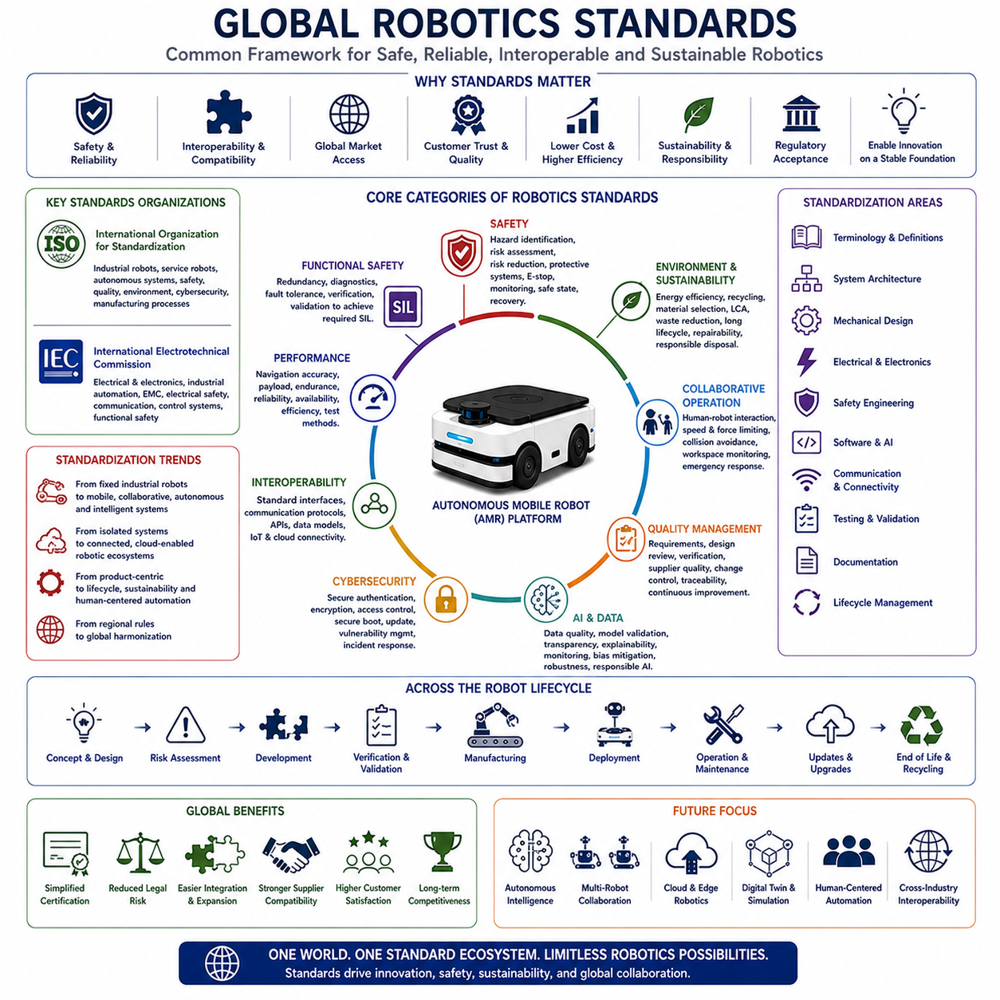
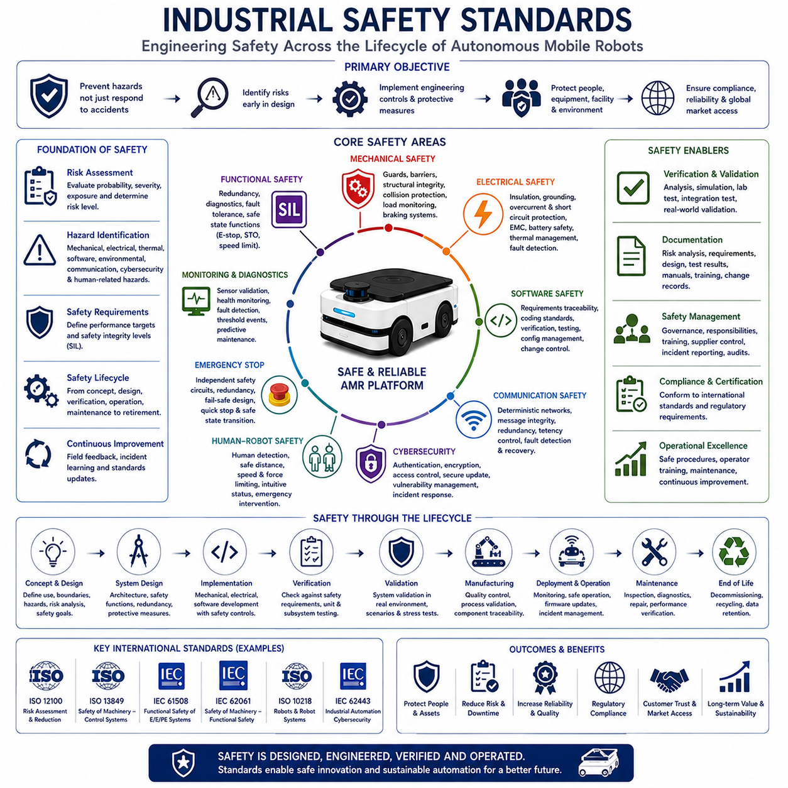
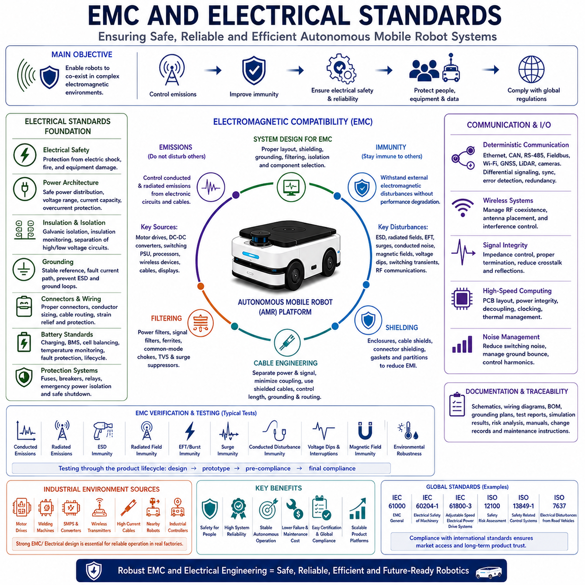
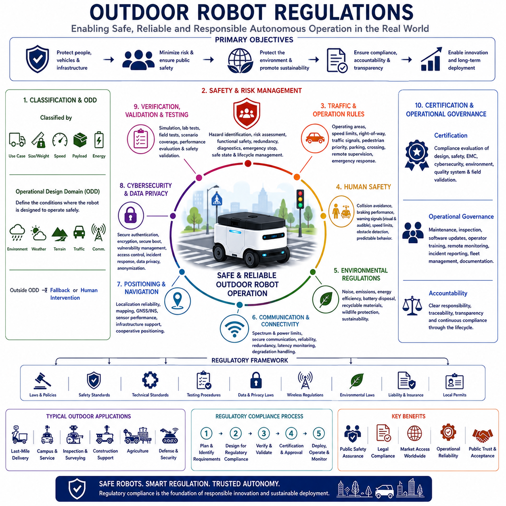
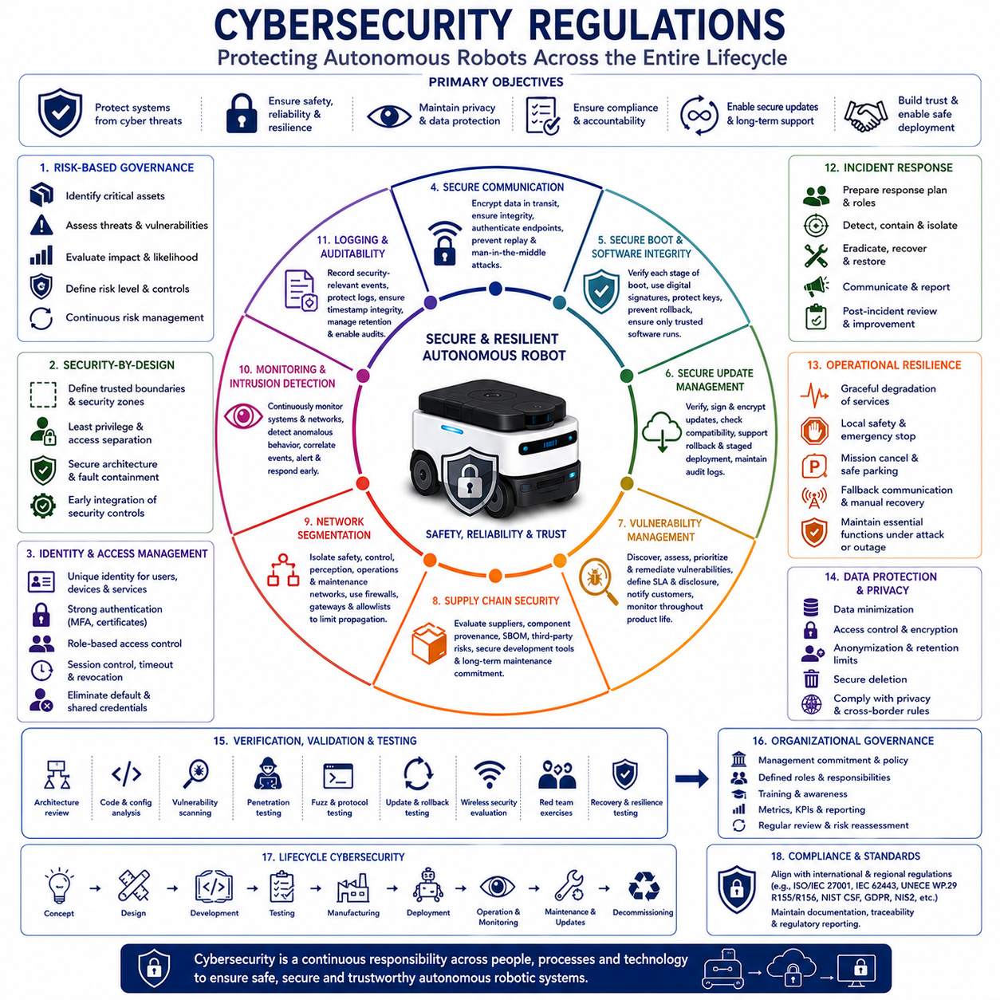

**Volume 01. AMR Foundations and System Architecture**


# 15. AMR Standards and Regulations · AMR 표준 및 규제

##  

## 15.01 Global Robotics Standards · 글로벌 로봇 표준

{width="7.268055555555556in" height="7.268055555555556in"}

Global robotics standards provide the common engineering framework that enables robots developed by different manufacturers to operate safely, reliably, and interoperably across international markets. As Autonomous Mobile Robots become increasingly integrated into manufacturing, logistics, healthcare, construction, agriculture, defense, and public infrastructure, compliance with internationally recognized standards has become a fundamental requirement rather than an optional engineering objective. Standards establish common terminology, safety principles, performance expectations, testing methodologies, documentation requirements, communication protocols, and quality management practices that support global commercialization. Rather than restricting innovation, international standards create a stable engineering foundation that allows technological advancement while ensuring compatibility, customer confidence, regulatory acceptance, and long-term product sustainability.

The primary objective of global robotics standards is to establish a common technical language across manufacturers, suppliers, regulators, researchers, and end users. Without internationally accepted standards, robotic systems would be developed according to incompatible engineering assumptions, making integration, certification, maintenance, and global deployment significantly more difficult. Standardized terminology ensures that concepts such as autonomy, safety, localization, navigation, collaborative operation, payload capacity, positioning accuracy, functional safety, and risk assessment have consistent definitions regardless of geographic region. Common terminology improves communication among multidisciplinary engineering teams while reducing ambiguity throughout product development and commercial deployment.

The International Organization for Standardization (ISO) serves as one of the most influential organizations governing global robotics standards. ISO develops internationally recognized specifications covering industrial robotics, service robots, autonomous systems, safety engineering, quality management, environmental responsibility, cybersecurity, and manufacturing processes. ISO standards provide manufacturers with structured engineering guidance while supporting international regulatory harmonization. Organizations developing robotic platforms for worldwide deployment frequently adopt ISO standards during the earliest phases of system architecture because compliance becomes significantly more efficient when incorporated into initial engineering decisions rather than added after product completion.

The International Electrotechnical Commission (IEC) complements ISO by developing standards focused primarily on electrical engineering, electronic systems, industrial automation, embedded computing, communication networks, electromagnetic compatibility, electrical safety, programmable controllers, and functional safety. Modern Autonomous Mobile Robots integrate complex electrical architectures combining high-power drive systems, embedded computing platforms, artificial intelligence accelerators, industrial communication networks, perception sensors, battery management systems, and cloud connectivity. IEC standards establish engineering practices that improve electrical reliability, system interoperability, and operational safety throughout the complete product lifecycle.

Industrial robot standards traditionally concentrated on fixed robotic manipulators operating within isolated manufacturing cells. However, modern robotics increasingly emphasizes mobile, collaborative, intelligent, and autonomous systems operating within dynamic environments shared with human workers. Consequently, global standards continue evolving beyond conventional industrial automation toward service robotics, mobile robotics, collaborative operation, autonomous navigation, intelligent perception, cybersecurity, artificial intelligence governance, and cloud-connected robotic ecosystems. Manufacturers therefore monitor ongoing standardization activities continuously because emerging standards frequently influence future product architecture long before regulatory adoption becomes mandatory.

Safety represents the most critical category within global robotics standardization. International safety standards establish systematic engineering approaches for hazard identification, risk analysis, hazard reduction, protective system design, emergency stopping, operational monitoring, fault detection, safe state transition, recovery procedures, and lifecycle validation. Safety engineering considers mechanical hazards, electrical hazards, thermal risks, software failures, communication faults, perception uncertainty, human interaction, environmental conditions, and cybersecurity threats. Rather than addressing individual hazards independently, modern safety standards require integrated system-level analysis ensuring predictable behavior throughout all operational conditions.

Functional safety has become particularly important as robotics systems rely increasingly upon software, electronic control systems, artificial intelligence, and distributed communication networks. Functional safety standards define methods for ensuring that safety-related electronic systems continue performing required protective functions despite hardware failures, software defects, sensor degradation, communication errors, or unexpected operational conditions. Engineers implement redundancy, diagnostic monitoring, fault tolerance, independent verification, deterministic control, and systematic validation to achieve required safety integrity levels. Functional safety therefore extends beyond hardware reliability into comprehensive system architecture supporting dependable autonomous operation.

Risk assessment forms the foundation of nearly every international robotics safety standard. Engineers systematically identify hazards, estimate potential consequences, evaluate exposure frequency, determine risk severity, assess existing protective measures, and implement additional safeguards where necessary. Risk assessment continues throughout the complete product lifecycle, beginning with conceptual design and extending through manufacturing, deployment, operation, maintenance, software updates, and eventual system retirement. Continuous risk evaluation ensures that evolving technologies, changing operating environments, and newly identified hazards are incorporated into future product improvements while maintaining regulatory compliance.

Collaborative robotics standards address situations where robots and humans intentionally share operational workspaces without complete physical separation. Unlike traditional industrial robots operating inside protective barriers, collaborative robotic systems require continuous monitoring of human presence, safe motion planning, collision avoidance, force limitation, speed supervision, emergency response, and intuitive human-machine interaction. Mobile robots operating within factories, hospitals, warehouses, airports, and public facilities increasingly depend upon collaborative safety principles because autonomous navigation frequently occurs alongside workers, visitors, customers, and service personnel within dynamic environments.

Performance standards establish objective methods for evaluating robotic capability using repeatable engineering measurements. Navigation accuracy, positioning repeatability, payload capacity, obstacle detection, battery endurance, environmental robustness, localization reliability, communication latency, operational availability, recovery behavior, energy efficiency, and maintenance performance are measured according to standardized testing methodologies whenever possible. Standardized performance evaluation enables customers to compare products fairly while encouraging manufacturers to optimize engineering quality based upon measurable technical criteria rather than marketing claims alone.

Interoperability standards enable robotic platforms developed by different manufacturers to exchange information through compatible communication architectures. Industrial Ethernet, fieldbus networks, wireless communication, cloud interfaces, industrial Internet of Things frameworks, application programming interfaces, middleware, and standardized messaging protocols support communication among robots, manufacturing systems, warehouse management platforms, enterprise resource planning systems, digital twins, and cloud analytics services. Interoperability significantly reduces system integration complexity while enabling customers to deploy heterogeneous robotic fleets within unified industrial environments.

Cybersecurity has emerged as a rapidly expanding component of international robotics standardization. Connected robots increasingly exchange operational data through wireless networks, cloud platforms, industrial communication systems, and enterprise information infrastructure. Cybersecurity standards define secure authentication, encrypted communication, software integrity verification, access control, secure boot procedures, vulnerability management, incident response, firmware protection, update validation, and operational monitoring practices. Strong cybersecurity architecture protects both operational continuity and sensitive industrial information while maintaining customer trust within digitally connected manufacturing ecosystems.

Artificial intelligence introduces new challenges for international robotics standardization because machine learning algorithms behave differently from conventional deterministic software. Emerging standards increasingly address dataset quality, model validation, algorithm transparency, explainability, performance monitoring, continuous learning, bias mitigation, robustness evaluation, uncertainty estimation, and responsible artificial intelligence deployment. As foundation models and advanced reasoning systems become integrated into robotics platforms, standardization will provide engineering guidance supporting reliable, ethical, and predictable AI-assisted autonomous decision making across diverse operational environments.

Quality management standards contribute significantly to long-term product reliability by establishing systematic engineering processes rather than focusing exclusively on technical specifications. Structured requirements management, configuration control, design reviews, verification planning, supplier qualification, documentation management, change control, manufacturing traceability, corrective action, continuous improvement, and customer feedback integration support consistent engineering quality throughout product development. Quality management standards therefore strengthen every phase of the robotic lifecycle while improving organizational engineering maturity.

Environmental and sustainability standards are becoming increasingly important as robotics manufacturers address global environmental responsibility. Energy efficiency, battery recycling, material selection, manufacturing emissions, lifecycle assessment, resource utilization, waste reduction, packaging optimization, maintenance efficiency, and end-of-life product recovery increasingly influence engineering decisions. Sustainable design principles encourage manufacturers to develop modular platforms supporting long operational lifetimes, component reuse, repairability, software upgrades, and environmentally responsible disposal while reducing total lifecycle environmental impact.

Compliance with international robotics standards provides significant commercial advantages beyond regulatory approval alone. Products designed according to globally recognized engineering standards typically experience simplified certification, improved customer acceptance, reduced legal liability, easier international market access, lower lifecycle maintenance cost, stronger supplier compatibility, enhanced engineering documentation, greater investment confidence, and improved long-term competitiveness. Standards therefore function not only as engineering requirements but also as strategic business assets supporting sustainable global expansion.

The future of global robotics standardization will increasingly focus upon autonomous intelligence, multi-robot collaboration, cloud robotics, edge computing, digital twins, artificial intelligence governance, human-centered automation, cybersecurity resilience, sustainability, and cross-industry interoperability. Future standards will likely evolve from defining individual product requirements toward governing complete robotic ecosystems operating across intelligent factories, smart cities, transportation networks, healthcare systems, and global industrial infrastructure. Organizations actively participating in international standardization while incorporating compliance into their engineering architecture from the earliest development phases will be better positioned to deliver globally competitive robotic platforms that combine technological innovation with operational safety, regulatory acceptance, commercial scalability, and long-term customer value.

글로벌 로봇 표준(Global Robotics Standards)은 서로 다른 제조사가 개발한 로봇이 전 세계 시장에서 안전하게(Safely), 신뢰성 있게(Reliably), 그리고 상호운용 가능하게(Interoperably) 동작할 수 있도록 지원하는 공통 엔지니어링 프레임워크(Common Engineering Framework)를 제공한다. 자율이동로봇(Autonomous Mobile Robot, AMR)이 제조(Manufacturing), 물류(Logistics), 의료(Healthcare), 건설(Construction), 농업(Agriculture), 국방(Defense), 공공 인프라(Public Infrastructure) 등 다양한 산업으로 확대됨에 따라 국제적으로 인정받는 표준(Internationally Recognized Standards)의 준수는 선택이 아니라 필수 요소가 되었다. 표준은 공통 용어(Common Terminology), 안전 원칙(Safety Principle), 성능 기준(Performance Expectation), 시험 방법(Test Methodology), 문서화 요구사항(Documentation Requirement), 통신 프로토콜(Communication Protocol), 품질 관리(Quality Management) 체계를 정의하여 글로벌 상용화(Global Commercialization)를 지원한다. 국제 표준은 혁신을 제한하는 것이 아니라 기술 발전을 안정적으로 지원하면서 호환성(Compatibility), 고객 신뢰(Customer Confidence), 규제 수용(Regulatory Acceptance), 장기적인 제품 지속성(Long-Term Product Sustainability)을 보장하는 기반이 된다.

글로벌 로봇 표준(Global Robotics Standards)의 가장 중요한 목적은 제조사(Manufacturer), 공급업체(Supplier), 규제기관(Regulator), 연구기관(Researcher), 최종 사용자(End User) 간에 공통된 기술 언어(Common Technical Language)를 확립하는 것이다. 국제적으로 통일된 표준이 없다면 로봇 시스템은 서로 다른 설계 가정(Engineering Assumption)을 기반으로 개발되어 시스템 통합(System Integration), 인증(Certification), 유지보수(Maintenance), 글로벌 배포(Global Deployment)가 매우 어려워질 수 있다. 표준화된 용어(Standardized Terminology)는 자율성(Autonomy), 안전(Safety), 위치추정(Localization), 자율주행(Navigation), 협업 운용(Collaborative Operation), 적재 용량(Payload Capacity), 위치 정확도(Positioning Accuracy), 기능 안전(Functional Safety), 위험성 평가(Risk Assessment) 등의 개념을 지역과 국가에 관계없이 동일하게 정의한다. 이러한 공통 용어는 다학제 엔지니어링 팀(Multidisciplinary Engineering Team)의 의사소통을 향상시키고 제품 개발(Product Development)과 상용화 과정에서 발생할 수 있는 해석의 차이를 줄여준다.

국제표준화기구(International Organization for Standardization, ISO)는 글로벌 로봇 표준을 제정하는 가장 영향력 있는 기관 가운데 하나이다. ISO는 산업용 로봇(Industrial Robot), 서비스 로봇(Service Robot), 자율 시스템(Autonomous System), 안전 공학(Safety Engineering), 품질 관리(Quality Management), 환경 책임(Environmental Responsibility), 사이버보안(Cybersecurity), 제조 공정(Manufacturing Process)에 관한 국제 표준을 개발한다. ISO 표준은 제조사에게 체계적인 엔지니어링 지침(Engineering Guidance)을 제공하며 국가 간 규제 조화(Regulatory Harmonization)를 지원한다. 세계 시장을 목표로 하는 로봇 제조사는 제품 개발 초기 단계부터 ISO 표준을 시스템 아키텍처(System Architecture)에 반영하는 경우가 많으며, 이는 제품 개발 이후에 표준을 추가 적용하는 것보다 훨씬 효율적이다.

국제전기기술위원회(International Electrotechnical Commission, IEC)는 전기(Electrical Engineering), 전자 시스템(Electronic System), 산업 자동화(Industrial Automation), 임베디드 컴퓨팅(Embedded Computing), 통신 네트워크(Communication Network), 전자파 적합성(Electromagnetic Compatibility, EMC), 전기 안전(Electrical Safety), 프로그래머블 제어기(Programmable Controller), 기능 안전(Functional Safety)을 중심으로 하는 국제 표준을 개발한다. 현대의 자율이동로봇은 고출력 구동 시스템(High-Power Drive System), 임베디드 컴퓨팅 플랫폼(Embedded Computing Platform), 인공지능 가속기(AI Accelerator), 산업용 통신 네트워크(Industrial Communication Network), 인지 센서(Perception Sensor), 배터리 관리 시스템(Battery Management System, BMS), 클라우드 연결성(Cloud Connectivity)을 하나의 시스템으로 통합하고 있기 때문에 IEC 표준은 전기적 신뢰성(Electrical Reliability), 시스템 상호운용성(System Interoperability), 운영 안전성(Operational Safety)을 확보하는 데 중요한 역할을 한다.

초기의 산업용 로봇 표준(Industrial Robot Standards)은 보호 울타리 내부에서 동작하는 고정형 산업용 로봇 암(Fixed Robotic Manipulator)을 중심으로 개발되었다. 그러나 현대의 로봇은 이동형(Mobile), 협업형(Collaborative), 지능형(Intelligent), 자율형(Autonomous) 시스템으로 발전하면서 사람과 함께 동적인 환경(Dynamic Environment)에서 작업하는 형태가 증가하고 있다. 이에 따라 국제 표준도 기존의 산업 자동화 중심에서 서비스 로봇(Service Robotics), 이동형 로봇(Mobile Robotics), 협업 운용(Collaborative Operation), 자율주행(Autonomous Navigation), 지능형 인지(Intelligent Perception), 사이버보안(Cybersecurity), 인공지능 거버넌스(Artificial Intelligence Governance), 클라우드 기반 로봇 생태계(Cloud-Connected Robotic Ecosystem)까지 지속적으로 확대되고 있다. 제조사는 새로운 국제 표준의 발전 방향을 지속적으로 모니터링하여 미래 제품 아키텍처(Product Architecture)에 반영해야 한다.

안전(Safety)은 글로벌 로봇 표준에서 가장 중요한 분야이다. 국제 안전 표준은 위험 요소 식별(Hazard Identification), 위험 분석(Risk Analysis), 위험 감소(Hazard Reduction), 보호 시스템 설계(Protective System Design), 비상 정지(Emergency Stopping), 운영 모니터링(Operational Monitoring), 고장 감지(Fault Detection), 안전 상태 전환(Safe State Transition), 복구 절차(Recovery Procedure), 생애주기 검증(Lifecycle Validation)을 체계적으로 수행하도록 요구한다. 안전 공학은 기계적 위험(Mechanical Hazard), 전기적 위험(Electrical Hazard), 열 위험(Thermal Risk), 소프트웨어 오류(Software Failure), 통신 오류(Communication Fault), 인지 불확실성(Perception Uncertainty), 사람과의 상호작용(Human Interaction), 환경 조건(Environmental Condition), 사이버보안 위협(Cybersecurity Threat)을 모두 고려한다. 현대의 안전 표준은 각각의 위험을 개별적으로 다루기보다 시스템 전체(System-Level Analysis)의 관점에서 모든 운영 조건에서 예측 가능한 동작을 보장하도록 설계된다.

기능 안전(Functional Safety)은 로봇 시스템이 소프트웨어(Software), 전자 제어 시스템(Electronic Control System), 인공지능(AI), 분산 통신 네트워크(Distributed Communication Network)에 크게 의존하게 되면서 더욱 중요한 분야가 되었다. 기능 안전 표준은 하드웨어 고장(Hardware Failure), 소프트웨어 결함(Software Defect), 센서 성능 저하(Sensor Degradation), 통신 오류(Communication Error), 예기치 않은 운영 조건(Unexpected Operational Condition)이 발생하더라도 안전 관련 시스템(Safety-Related Electronic System)이 보호 기능을 지속적으로 수행할 수 있는 방법을 정의한다. 이를 위해 이중화(Redundancy), 진단 모니터링(Diagnostic Monitoring), 고장 허용(Fault Tolerance), 독립 검증(Independent Verification), 결정론적 제어(Deterministic Control), 체계적인 검증(Systematic Validation)을 적용하여 요구되는 안전 무결성 수준(Safety Integrity Level, SIL)을 달성한다. 기능 안전은 단순한 하드웨어 신뢰성을 넘어 전체 시스템 아키텍처(System Architecture)의 신뢰성을 확보하는 개념이다.

위험성 평가(Risk Assessment)는 거의 모든 국제 로봇 안전 표준의 출발점이 된다. 엔지니어는 위험 요소(Hazard)를 식별하고 발생 가능한 결과(Potential Consequence)를 분석하며 노출 빈도(Exposure Frequency), 위험 수준(Risk Severity), 기존 보호 조치(Existing Protective Measure)를 평가한 후 필요한 추가 보호 대책(Additional Safeguard)을 설계한다. 이러한 위험성 평가는 개념 설계(Conceptual Design)부터 제조(Manufacturing), 배포(Deployment), 운영(Operation), 유지보수(Maintenance), 소프트웨어 업데이트(Software Update), 제품 폐기(System Retirement)에 이르기까지 생애주기 전체에서 반복적으로 수행된다. 지속적인 위험 평가는 새로운 기술과 운영 환경 변화가 제품 개선에 반영되도록 하면서도 규제 준수(Regulatory Compliance)를 유지하는 데 중요한 역할을 한다.

협업 로봇 표준(Collaborative Robotics Standards)은 사람(Human)과 로봇(Robot)이 물리적으로 완전히 분리되지 않은 동일한 작업 공간(Shared Workspace)에서 함께 작업하는 환경을 대상으로 한다. 기존 산업용 로봇은 보호 울타리(Protective Barrier) 안에서 동작했지만 협업 로봇은 사람의 존재를 지속적으로 감시(Human Presence Monitoring)하고 안전한 경로 계획(Safe Motion Planning), 충돌 회피(Collision Avoidance), 힘 제한(Force Limitation), 속도 감시(Speed Supervision), 비상 대응(Emergency Response), 직관적인 인간-기계 상호작용(Intuitive Human-Machine Interaction)을 수행해야 한다. 공장, 병원, 물류창고, 공항, 공공시설에서 운용되는 이동형 로봇은 이러한 협업 안전 원칙(Collaborative Safety Principle)에 크게 의존한다.

성능 표준(Performance Standards)은 반복 가능한 엔지니어링 시험(Repeatable Engineering Measurement)을 통해 로봇의 성능을 객관적으로 평가하는 방법을 정의한다. 자율주행 정확도(Navigation Accuracy), 위치 반복 정밀도(Positioning Repeatability), 적재 능력(Payload Capacity), 장애물 검출(Obstacle Detection), 배터리 지속 시간(Battery Endurance), 환경 내구성(Environmental Robustness), 위치추정 신뢰성(Localization Reliability), 통신 지연(Communication Latency), 운영 가용성(Operational Availability), 복구 성능(Recovery Behavior), 에너지 효율(Energy Efficiency), 유지보수 성능(Maintenance Performance)은 가능한 한 표준화된 시험 방법(Standardized Testing Methodology)에 따라 평가된다. 이러한 성능 표준은 고객이 서로 다른 제품을 공정하게 비교할 수 있도록 하며, 제조사가 단순한 마케팅이 아니라 객관적인 기술 성능을 기반으로 제품을 개선하도록 유도한다.

상호운용성 표준(Interoperability Standards)은 서로 다른 제조사의 로봇 플랫폼이 호환 가능한 통신 구조(Compatible Communication Architecture)를 통해 정보를 교환할 수 있도록 지원한다. 산업용 이더넷(Industrial Ethernet), 필드버스(Fieldbus), 무선 통신(Wireless Communication), 클라우드 인터페이스(Cloud Interface), 산업용 사물인터넷(Industrial Internet of Things, IIoT), 응용프로그램 인터페이스(Application Programming Interface, API), 미들웨어(Middleware), 표준 메시징 프로토콜(Standardized Messaging Protocol)은 로봇과 제조 시스템, 창고 관리 시스템(Warehouse Management System, WMS), 전사적 자원 관리(Enterprise Resource Planning, ERP), 디지털 트윈(Digital Twin), 클라우드 분석(Cloud Analytics) 간의 정보 교환을 가능하게 한다. 이러한 상호운용성은 시스템 통합 복잡성을 크게 줄이고 다양한 제조사의 로봇을 하나의 산업 환경에서 함께 운영할 수 있도록 한다.

사이버보안(Cybersecurity)은 국제 로봇 표준에서 가장 빠르게 발전하는 분야 가운데 하나이다. 연결된 로봇은 무선 네트워크(Wireless Network), 클라우드 플랫폼(Cloud Platform), 산업용 통신 시스템(Industrial Communication System), 기업 정보 시스템(Enterprise Information Infrastructure)을 통해 지속적으로 데이터를 교환한다. 사이버보안 표준은 안전한 인증(Authentication), 암호화 통신(Encrypted Communication), 소프트웨어 무결성 검증(Software Integrity Verification), 접근 제어(Access Control), 보안 부팅(Secure Boot), 취약점 관리(Vulnerability Management), 사고 대응(Incident Response), 펌웨어 보호(Firmware Protection), 업데이트 검증(Update Validation), 운영 모니터링(Operational Monitoring)을 규정한다. 강력한 사이버보안 아키텍처는 운영 연속성(Operational Continuity)과 산업 정보를 동시에 보호하며 디지털 제조 환경에서 고객 신뢰를 유지하는 핵심 요소가 된다.

인공지능(Artificial Intelligence)은 기존의 결정론적 소프트웨어(Deterministic Software)와는 다른 특성을 가지기 때문에 국제 로봇 표준에도 새로운 과제를 제시하고 있다. 새로운 국제 표준은 데이터셋 품질(Dataset Quality), 모델 검증(Model Validation), 알고리즘 투명성(Algorithm Transparency), 설명 가능성(Explainability), 성능 모니터링(Performance Monitoring), 지속적 학습(Continuous Learning), 편향 완화(Bias Mitigation), 강건성 평가(Robustness Evaluation), 불확실성 추정(Uncertainty Estimation), 책임 있는 AI 운영(Responsible Artificial Intelligence Deployment)을 점점 더 중요하게 다루고 있다. 앞으로 파운데이션 모델(Foundation Model)과 고급 추론 시스템(Advanced Reasoning System)이 로봇 플랫폼에 적용될수록 국제 표준은 신뢰할 수 있고 윤리적이며 예측 가능한 AI 기반 자율 의사결정을 위한 엔지니어링 지침을 제공하게 될 것이다.

품질 관리 표준(Quality Management Standards)은 단순한 기술 규격이 아니라 체계적인 엔지니어링 프로세스(Systematic Engineering Process)를 구축함으로써 장기적인 제품 신뢰성을 향상시킨다. 요구사항 관리(Requirements Management), 형상 관리(Configuration Control), 설계 검토(Design Review), 검증 계획(Verification Planning), 공급업체 인증(Supplier Qualification), 문서 관리(Documentation Management), 변경 관리(Change Control), 제조 추적성(Manufacturing Traceability), 시정 조치(Corrective Action), 지속적 개선(Continuous Improvement), 고객 피드백(Customer Feedback Integration)은 제품 개발 전 과정에서 일관된 품질을 유지하도록 지원한다. 이러한 품질 관리 표준은 조직 전체의 엔지니어링 성숙도(Engineering Maturity)를 높이는 기반이 된다.

환경(Environmental) 및 지속가능성(Sustainability) 표준은 전 세계적으로 환경 책임(Environmental Responsibility)이 중요해짐에 따라 로봇 산업에서도 점점 더 중요한 요소가 되고 있다. 에너지 효율(Energy Efficiency), 배터리 재활용(Battery Recycling), 재료 선택(Material Selection), 제조 과정의 탄소 배출(Manufacturing Emissions), 생애주기 평가(Lifecycle Assessment), 자원 활용(Resource Utilization), 폐기물 감소(Waste Reduction), 포장 최적화(Packaging Optimization), 유지보수 효율(Maintenance Efficiency), 제품 회수(End-of-Life Product Recovery)는 엔지니어링 의사결정에 직접적인 영향을 미친다. 지속가능한 설계(Sustainable Design)는 모듈형 플랫폼(Modular Platform), 긴 제품 수명(Long Operational Lifetime), 부품 재사용(Component Reuse), 수리 가능성(Repairability), 소프트웨어 업그레이드(Software Upgrade), 친환경 폐기(Environmentally Responsible Disposal)를 장려하여 제품 생애주기 전체의 환경 영향을 줄인다.

국제 로봇 표준(International Robotics Standards)의 준수는 단순히 규제 승인(Regulatory Approval)을 받기 위한 것 이상의 상업적 이점을 제공한다. 국제적으로 인정된 엔지니어링 표준을 기반으로 개발된 제품은 인증(Certification)이 쉬워지고 고객 수용성(Customer Acceptance)이 향상되며 법적 책임(Legal Liability)이 감소하고 해외 시장 진출(Global Market Access)이 용이해진다. 또한 유지보수 비용(Lifecycle Maintenance Cost)이 감소하고 공급업체 호환성(Supplier Compatibility)이 향상되며 엔지니어링 문서화(Engineering Documentation)가 체계화되고 투자 신뢰(Investment Confidence)와 장기 경쟁력(Long-Term Competitiveness)도 높아진다. 따라서 국제 표준은 단순한 기술 요구사항이 아니라 지속 가능한 글로벌 사업 확장을 지원하는 핵심적인 전략 자산(Strategic Business Asset)이라고 할 수 있다.

미래의 글로벌 로봇 표준(Global Robotics Standardization)은 자율 지능(Autonomous Intelligence), 다중 로봇 협업(Multi-Robot Collaboration), 클라우드 로보틱스(Cloud Robotics), 엣지 컴퓨팅(Edge Computing), 디지털 트윈(Digital Twin), 인공지능 거버넌스(Artificial Intelligence Governance), 인간 중심 자동화(Human-Centered Automation), 사이버보안 복원력(Cybersecurity Resilience), 지속가능성(Sustainability), 산업 간 상호운용성(Cross-Industry Interoperability)을 중심으로 더욱 발전할 것이다. 앞으로의 표준은 개별 제품(Product Requirement)을 정의하는 수준을 넘어 지능형 공장(Intelligent Factory), 스마트 시티(Smart City), 교통 시스템(Transportation Network), 의료 시스템(Healthcare System), 글로벌 산업 인프라(Global Industrial Infrastructure) 전체를 구성하는 로봇 생태계(Robotic Ecosystem)를 관리하는 방향으로 발전할 가능성이 높다. 국제 표준화 활동에 적극적으로 참여하고 초기 설계 단계부터 표준을 시스템 아키텍처(System Architecture)에 반영하는 기업은 기술 혁신(Technological Innovation), 운영 안전성(Operational Safety), 규제 수용(Regulatory Acceptance), 사업 확장성(Commercial Scalability), 장기적인 고객 가치(Long-Term Customer Value)를 동시에 확보하는 글로벌 경쟁력을 갖춘 로봇 플랫폼을 개발할 수 있을 것이다.

##  

## 15.02 Industrial Safety Standards · 산업 안전 표준

{width="7.268055555555556in" height="7.268055555555556in"}

Industrial safety standards establish the engineering principles, technical requirements, operational procedures, and management practices necessary to ensure that industrial equipment, automated machinery, and Autonomous Mobile Robot systems operate without creating unacceptable risks for workers, facilities, equipment, or surrounding environments. As industrial automation becomes increasingly intelligent and interconnected, safety can no longer rely solely on physical protective barriers or operator experience. Instead, modern safety standards define systematic engineering methodologies that integrate mechanical design, electrical engineering, embedded software, functional safety, artificial intelligence, communication systems, cybersecurity, maintenance, and operational management into a unified safety architecture. Compliance with industrial safety standards therefore represents a fundamental engineering responsibility as well as a critical requirement for global commercialization.

The primary objective of industrial safety standards is hazard prevention rather than accident response. Traditional safety practices often focused on minimizing damage after failures occurred, whereas modern safety engineering emphasizes eliminating hazards during the earliest stages of product design. Engineers systematically identify potential risks, evaluate their severity, estimate operational exposure, determine failure probabilities, and implement engineering controls before products enter commercial operation. This proactive approach significantly reduces lifecycle risk while improving reliability, operational efficiency, regulatory compliance, and customer confidence. Safety therefore becomes an integral design parameter equivalent to performance, cost, manufacturability, and maintainability rather than an independent verification activity performed near project completion.

Industrial safety engineering follows a structured lifecycle beginning with conceptual system definition and continuing through product retirement. During concept development, engineers define system boundaries, operational environments, intended applications, user interaction scenarios, maintenance activities, and reasonably foreseeable misuse. Hazard identification then evaluates potential mechanical, electrical, thermal, chemical, software, environmental, communication, cybersecurity, and human-related risks associated with every operational mode. Safety requirements derived from this analysis become engineering specifications guiding architecture development, subsystem design, verification planning, manufacturing, deployment, maintenance, software updates, and long-term operational support throughout the complete product lifecycle.

Risk assessment serves as the analytical foundation of industrial safety standards. Rather than assuming that every hazard requires identical treatment, engineers evaluate both the probability of occurrence and the severity of potential consequences. Frequently occurring low-impact hazards may require different mitigation strategies than rare but catastrophic failures. Risk assessment also considers exposure duration, environmental variability, human behavior, equipment accessibility, maintenance procedures, operator training, and system complexity. The resulting risk profile determines appropriate engineering controls while ensuring that resources focus on reducing the highest operational risks. Continuous reassessment accompanies product evolution because changing technologies and applications introduce new operational conditions throughout the system lifecycle.

Mechanical safety standards establish engineering requirements preventing injuries caused by moving components, structural failures, unstable loads, crushing hazards, shearing mechanisms, sharp edges, excessive vibration, falling objects, or unexpected mechanical motion. Mechanical engineers incorporate structural safety factors, protective guards, physical barriers, emergency stopping mechanisms, collision protection, load monitoring, braking systems, mechanical redundancy, and controlled failure modes throughout product development. Mechanical architecture is designed so that predictable component degradation does not immediately produce hazardous conditions, thereby providing sufficient opportunity for maintenance, diagnostics, and safe operational recovery before catastrophic failure occurs.

Electrical safety standards protect personnel and equipment from hazards associated with electrical energy. Industrial robotic systems frequently combine high-voltage battery systems, motor drives, power electronics, embedded computers, communication hardware, sensors, industrial networks, and charging infrastructure within compact mobile platforms. Electrical safety therefore addresses insulation integrity, grounding systems, overcurrent protection, short-circuit prevention, electromagnetic compatibility, isolation monitoring, connector design, emergency power isolation, battery protection, thermal management, and fault detection. Proper electrical engineering minimizes fire risk, electrical shock, equipment damage, communication interference, and uncontrolled system behavior during abnormal operating conditions.

Functional safety has become one of the most influential concepts within modern industrial automation. Unlike conventional hardware reliability, functional safety focuses specifically on ensuring that safety-related control systems perform their intended protective functions correctly despite hardware failures, software defects, communication interruptions, sensor degradation, environmental disturbances, or unexpected operating conditions. Safety-related functions such as emergency stopping, speed limitation, obstacle detection, protective field monitoring, braking control, safe torque off, and operational supervision must remain dependable under fault conditions. Functional safety therefore requires systematic engineering methodologies including redundancy, diagnostics, fault tolerance, deterministic software behavior, independent verification, and documented lifecycle management.

Programmable electronic systems introduce additional safety challenges because software cannot be evaluated using traditional mechanical reliability methods alone. Embedded software increasingly controls navigation, motion planning, perception, battery management, communication, diagnostics, artificial intelligence, and fleet coordination. Safety standards therefore require structured software development processes including requirements traceability, modular architecture, coding standards, verification planning, static analysis, dynamic testing, configuration management, version control, defect tracking, regression testing, and independent safety validation. Software quality directly influences overall system safety because unexpected software behavior may produce hazardous physical consequences despite perfectly functioning hardware.

Autonomous Mobile Robots introduce unique safety considerations beyond conventional industrial machinery because they operate dynamically within changing environments while interacting directly with workers, vehicles, equipment, and infrastructure. Mobile robots continuously interpret sensor information, plan motion, avoid obstacles, coordinate with fleet management systems, communicate wirelessly, and make autonomous operational decisions. Safety standards therefore address localization uncertainty, perception limitations, communication delays, navigation failures, dynamic obstacle interaction, environmental variability, docking operations, charging procedures, autonomous recovery, and mission interruption. Comprehensive safety architecture must accommodate both predictable operational behavior and unexpected environmental changes without compromising human protection.

Human-robot interaction represents one of the fastest-growing areas within industrial safety engineering. Collaborative industrial environments require robots to detect nearby personnel, monitor separation distances, regulate motion speed, limit collision forces, provide intuitive status indication, support emergency intervention, and recover safely following operational interruptions. Safety engineering considers not only physical protection but also human factors including operator awareness, cognitive workload, interface design, alarm management, maintenance accessibility, procedural clarity, and predictable robot behavior. Human-centered safety design reduces operational errors while improving user confidence and workplace productivity.

Emergency stop architecture remains a fundamental requirement across virtually every industrial safety standard. Emergency stopping systems must immediately place equipment into predefined safe states whenever hazardous conditions arise. Safety engineers define stopping categories according to operational requirements, balancing rapid hazard reduction with equipment protection and controlled recovery. Emergency stop circuits typically operate independently of standard control software while utilizing redundant monitoring, fail-safe design, diagnostic supervision, and periodic validation testing. Modern autonomous systems additionally integrate software-controlled safety transitions supporting safe shutdown, controlled deceleration, autonomous fault isolation, and coordinated fleet-wide emergency response when multiple robotic platforms operate simultaneously.

Protective monitoring systems continuously supervise equipment health and operational safety throughout normal operation. Safety monitoring includes sensor validation, communication integrity, battery condition, processor health, actuator feedback, localization confidence, environmental awareness, obstacle detection, braking performance, cybersecurity status, thermal management, and diagnostic reporting. When abnormal conditions exceed predefined safety thresholds, protective systems initiate warnings, operational restrictions, controlled performance degradation, or safe shutdown procedures depending upon risk severity. Continuous monitoring enables predictive maintenance while preventing hazardous failures from developing unnoticed during extended autonomous operation.

Industrial communication networks increasingly influence operational safety because modern robotic systems exchange large volumes of safety-related information among controllers, sensors, fleet management servers, cloud platforms, and enterprise information systems. Communication safety addresses message integrity, deterministic timing, synchronization accuracy, redundancy management, secure transmission, fault detection, network availability, latency control, and recovery following communication disruption. Safety-critical information must remain distinguishable from non-critical operational traffic while maintaining predictable behavior under abnormal network conditions. Reliable communication architecture therefore becomes essential for distributed autonomous systems operating collaboratively across complex industrial environments.

Cybersecurity has become inseparable from industrial safety because malicious attacks can compromise operational integrity as effectively as hardware failures or software defects. Industrial safety standards increasingly recognize that unauthorized access, malicious software, communication interception, data manipulation, or remote system compromise may directly create hazardous physical conditions. Secure authentication, encrypted communication, secure software updates, access control, intrusion detection, vulnerability management, secure boot mechanisms, incident response planning, and continuous security monitoring therefore contribute directly to operational safety. Modern safety engineering treats cybersecurity as an integrated protective layer supporting trustworthy autonomous operation.

Verification and validation ensure that implemented safety measures perform exactly as intended before commercial deployment. Verification confirms that engineering solutions satisfy specified safety requirements through analysis, inspection, simulation, laboratory testing, and integration testing. Validation demonstrates that the complete robotic system safely fulfills intended operational objectives within realistic environments reflecting expected customer applications. Safety validation includes normal operation, abnormal conditions, fault injection, environmental stress testing, emergency scenarios, maintenance procedures, software updates, communication failures, and recovery behavior. Comprehensive validation provides objective evidence supporting certification, regulatory approval, and customer acceptance.

Safety documentation forms an essential component of industrial safety compliance because engineering decisions must remain traceable throughout the complete product lifecycle. Hazard analyses, risk assessments, safety requirements, architecture descriptions, verification reports, validation results, maintenance procedures, operating instructions, training materials, software revisions, change records, incident investigations, and corrective actions are systematically documented according to standardized engineering practices. Documentation supports regulatory review, customer confidence, maintenance activities, product improvements, and future engineering development while preserving organizational knowledge across multiple product generations.

Safety management extends beyond technical engineering into organizational culture and continuous operational improvement. Manufacturers establish safety governance structures defining engineering responsibilities, design reviews, change management, supplier qualification, incident reporting, corrective action processes, periodic audits, employee training, competency development, and lifecycle monitoring. Operational experience collected from field deployments continuously refines future product designs, risk assessments, maintenance strategies, and engineering standards. Effective safety management therefore transforms isolated technical compliance into a sustainable organizational capability supporting long-term product quality and customer trust.

The future of industrial safety standards will increasingly address artificial intelligence, autonomous decision making, multi-robot collaboration, cloud robotics, digital twins, edge computing, advanced cybersecurity, sustainable automation, and human-centered intelligent workplaces. Future standards will move beyond protecting individual machines toward governing complete autonomous industrial ecosystems where robots, humans, intelligent infrastructure, enterprise software, and artificial intelligence cooperate continuously. Organizations that integrate industrial safety principles into every phase of engineering---from concept development through lifecycle support---will deliver robotic platforms that combine technological innovation with operational reliability, regulatory compliance, commercial success, and long-term societal acceptance.

산업 안전 표준(Industrial Safety Standards)은 산업 설비(Industrial Equipment), 자동화 기계(Automated Machinery), 자율이동로봇(Autonomous Mobile Robot, AMR) 시스템이 작업자(Worker), 시설(Facility), 장비(Equipment), 주변 환경(Surrounding Environment)에 허용할 수 없는 위험(Unacceptable Risk)을 발생시키지 않도록 하기 위한 엔지니어링 원칙(Engineering Principle), 기술 요구사항(Technical Requirement), 운영 절차(Operational Procedure), 관리 체계(Management Practice)를 정의한다. 산업 자동화가 점점 더 지능화(Intelligent)되고 상호 연결(Interconnected)되면서 안전은 더 이상 물리적인 보호 울타리(Physical Protective Barrier)나 작업자의 경험(Operator Experience)에만 의존할 수 없다. 현대의 안전 표준은 기계 설계(Mechanical Design), 전기 공학(Electrical Engineering), 임베디드 소프트웨어(Embedded Software), 기능 안전(Functional Safety), 인공지능(Artificial Intelligence), 통신 시스템(Communication System), 사이버보안(Cybersecurity), 유지보수(Maintenance), 운영 관리(Operational Management)를 하나의 통합 안전 아키텍처(Unified Safety Architecture)로 구성하는 체계적인 엔지니어링 방법론(Systematic Engineering Methodology)을 정의한다. 따라서 산업 안전 표준의 준수는 글로벌 상용화(Global Commercialization)를 위한 필수 조건이자 엔지니어링의 기본적인 책임이다.

산업 안전 표준의 가장 중요한 목적은 사고 대응(Accident Response)이 아니라 위험 예방(Hazard Prevention)이다. 과거의 안전 관리 방식은 사고가 발생한 이후 피해를 최소화하는 데 초점을 맞추는 경우가 많았지만, 현대의 안전 공학(Safety Engineering)은 제품 설계 초기 단계(Earliest Stage of Product Design)에서 위험 요소를 제거하는 것을 목표로 한다. 엔지니어는 잠재적인 위험(Potential Risk)을 체계적으로 식별하고, 위험의 심각도(Severity), 작업자의 노출 정도(Operational Exposure), 고장 발생 가능성(Failure Probability)을 평가한 후 제품이 상용화되기 전에 적절한 엔지니어링 제어(Engineering Control)를 적용한다. 이러한 예방 중심 접근(Proactive Approach)은 제품 생애주기(Product Lifecycle) 전반의 위험을 줄이는 동시에 신뢰성(Reliability), 운영 효율(Operational Efficiency), 규제 준수(Regulatory Compliance), 고객 신뢰(Customer Confidence)를 향상시킨다. 안전은 프로젝트 종료 직전에 수행되는 독립적인 검증 활동이 아니라 성능(Performance), 비용(Cost), 제조성(Manufacturability), 유지보수성(Maintainability)과 동일한 수준의 핵심 설계 요소가 된다.

산업 안전 공학(Industrial Safety Engineering)은 개념 설계(Conceptual System Definition)에서 시작하여 제품 폐기(Product Retirement)에 이르기까지 체계적인 생애주기(Lifecycle)를 따른다. 개념 설계 단계에서는 시스템 경계(System Boundary), 운영 환경(Operational Environment), 예상 사용 목적(Intended Application), 사람과의 상호작용(Human Interaction Scenario), 유지보수 활동(Maintenance Activity), 예상 가능한 오용(Reasonably Foreseeable Misuse)을 정의한다. 이후 위험 요소 식별(Hazard Identification)을 통해 기계적 위험(Mechanical Risk), 전기적 위험(Electrical Risk), 열 위험(Thermal Risk), 화학적 위험(Chemical Risk), 소프트웨어 위험(Software Risk), 환경 위험(Environmental Risk), 통신 위험(Communication Risk), 사이버보안 위험(Cybersecurity Risk), 인간 관련 위험(Human-Related Risk)을 분석한다. 이러한 분석을 통해 도출된 안전 요구사항(Safety Requirement)은 시스템 아키텍처(System Architecture), 서브시스템 설계(Sub-System Design), 검증 계획(Verification Planning), 제조(Manufacturing), 구축(Deployment), 유지보수(Maintenance), 소프트웨어 업데이트(Software Update), 장기 운영(Long-Term Operation)까지 모든 개발 단계의 기준이 된다.

위험성 평가(Risk Assessment)는 산업 안전 표준의 분석적 기반(Analytical Foundation)을 제공한다. 모든 위험이 동일한 수준의 대응을 필요로 하는 것은 아니므로 엔지니어는 위험 발생 가능성(Probability of Occurrence)과 결과의 심각도(Severity of Consequence)를 함께 평가한다. 자주 발생하지만 영향이 작은 위험(Frequently Occurring Low-Impact Hazard)은 드물지만 치명적인 위험(Rare but Catastrophic Failure)과 다른 방식으로 관리된다. 위험성 평가는 작업 시간(Exposure Duration), 환경 변화(Environmental Variability), 작업자의 행동(Human Behavior), 장비 접근성(Equipment Accessibility), 유지보수 절차(Maintenance Procedure), 작업자 교육(Operator Training), 시스템 복잡성(System Complexity)까지 함께 고려한다. 이렇게 작성된 위험 프로파일(Risk Profile)은 가장 위험한 요소에 자원을 집중하도록 하며, 기술과 운영 환경이 변화함에 따라 제품 생애주기 전반에서 지속적으로 갱신된다.

기계 안전 표준(Mechanical Safety Standards)은 움직이는 부품(Moving Component), 구조 파손(Structural Failure), 불안정한 하중(Unstable Load), 압착 위험(Crushing Hazard), 절단 위험(Shearing Mechanism), 날카로운 모서리(Sharp Edge), 과도한 진동(Excessive Vibration), 낙하물(Falling Object), 예기치 않은 기계 동작(Unexpected Mechanical Motion)으로 인한 사고를 방지하기 위한 요구사항을 정의한다. 기계 엔지니어는 구조 안전계수(Structural Safety Factor), 보호 커버(Protective Guard), 물리적 방호장치(Physical Barrier), 비상 정지 장치(Emergency Stopping Mechanism), 충돌 보호(Collision Protection), 하중 감시(Load Monitoring), 제동 시스템(Braking System), 기계적 이중화(Mechanical Redundancy), 안전한 고장 모드(Controlled Failure Mode)를 설계에 반영한다. 또한 부품이 점진적으로 열화되더라도 즉시 위험한 상태가 되지 않도록 설계하여 유지보수와 진단을 수행할 충분한 시간을 확보하도록 한다.

전기 안전 표준(Electrical Safety Standards)은 전기 에너지(Electrical Energy)로부터 작업자와 장비를 보호하는 것을 목적으로 한다. 산업용 로봇은 고전압 배터리 시스템(High-Voltage Battery System), 모터 드라이브(Motor Drive), 전력 전자장치(Power Electronics), 임베디드 컴퓨터(Embedded Computer), 통신 장비(Communication Hardware), 센서(Sensor), 산업용 네트워크(Industrial Network), 충전 시스템(Charging Infrastructure)을 하나의 이동형 플랫폼에 통합하고 있다. 따라서 전기 안전은 절연 성능(Insulation Integrity), 접지 시스템(Grounding System), 과전류 보호(Overcurrent Protection), 단락 방지(Short-Circuit Prevention), 전자파 적합성(Electromagnetic Compatibility, EMC), 절연 감시(Isolation Monitoring), 커넥터 설계(Connector Design), 비상 전원 차단(Emergency Power Isolation), 배터리 보호(Battery Protection), 열 관리(Thermal Management), 고장 감지(Fault Detection)를 포함한다. 올바른 전기 설계는 화재(Fire), 감전(Electrical Shock), 장비 손상(Equipment Damage), 통신 간섭(Communication Interference), 비정상 동작(Uncontrolled System Behavior)을 예방하는 핵심 요소이다.

기능 안전(Functional Safety)은 현대 산업 자동화에서 가장 중요한 개념 가운데 하나이다. 일반적인 하드웨어 신뢰성(Hardware Reliability)이 장비의 정상 동작을 의미한다면, 기능 안전은 하드웨어 고장(Hardware Failure), 소프트웨어 결함(Software Defect), 통신 중단(Communication Interruption), 센서 성능 저하(Sensor Degradation), 환경 변화(Environmental Disturbance), 예상하지 못한 운영 조건(Unexpected Operating Condition)이 발생하더라도 안전 관련 제어 시스템(Safety-Related Control System)이 보호 기능을 정확하게 수행하도록 보장하는 것을 의미한다. 비상 정지(Emergency Stopping), 속도 제한(Speed Limitation), 장애물 감지(Obstacle Detection), 보호 영역 감시(Protective Field Monitoring), 제동 제어(Braking Control), 안전 토크 차단(Safe Torque Off, STO), 운영 감시(Operational Supervision)는 이러한 기능 안전의 대표적인 기능이다. 이를 위해 이중화(Redundancy), 진단(Diagnostics), 고장 허용(Fault Tolerance), 결정론적 소프트웨어(Deterministic Software), 독립 검증(Independent Verification), 생애주기 관리(Lifecycle Management)를 체계적으로 적용한다.

프로그램 가능한 전자 시스템(Programmable Electronic System)은 기존 기계 시스템과는 다른 안전 문제를 발생시킨다. 임베디드 소프트웨어는 자율주행(Navigation), 경로 계획(Motion Planning), 인지(Perception), 배터리 관리(Battery Management), 통신(Communication), 진단(Diagnostics), 인공지능(AI), 플릿 관리(Fleet Coordination)를 직접 제어하기 때문에 소프트웨어 품질은 전체 시스템 안전성과 직결된다. 산업 안전 표준은 요구사항 추적성(Requirements Traceability), 모듈형 아키텍처(Modular Architecture), 코딩 표준(Coding Standard), 검증 계획(Verification Planning), 정적 분석(Static Analysis), 동적 시험(Dynamic Testing), 형상 관리(Configuration Management), 버전 관리(Version Control), 결함 관리(Defect Tracking), 회귀 시험(Regression Testing), 독립적인 안전 검증(Independent Safety Validation)을 요구한다. 하드웨어가 정상적으로 동작하더라도 소프트웨어 오류는 실제 위험한 물리적 사고를 발생시킬 수 있기 때문에 소프트웨어 품질은 산업 안전의 핵심 요소이다.

자율이동로봇(Autonomous Mobile Robot, AMR)은 기존 산업용 기계보다 더욱 복잡한 안전 요구사항을 가진다. 이동형 로봇은 끊임없이 센서 정보를 분석하고, 경로를 계획하며, 장애물을 회피하고, 플릿 관리 시스템(Fleet Management System)과 통신하며, 스스로 의사결정을 수행한다. 따라서 산업 안전 표준은 위치추정 오차(Localization Uncertainty), 인지 한계(Perception Limitation), 통신 지연(Communication Delay), 자율주행 실패(Navigation Failure), 동적 장애물(Dynamic Obstacle), 환경 변화(Environmental Variability), 도킹(Docking Operation), 충전(Charging Procedure), 자율 복구(Autonomous Recovery), 미션 중단(Mission Interruption)까지 모두 고려한다. 안전 아키텍처는 정상적인 운용뿐 아니라 예기치 않은 환경 변화에서도 사람을 보호할 수 있도록 설계되어야 한다.

사람-로봇 상호작용(Human-Robot Interaction, HRI)은 산업 안전 공학에서 가장 빠르게 발전하는 분야 가운데 하나이다. 협업 환경(Collaborative Environment)에서는 로봇이 작업자의 존재를 감지(Human Detection)하고, 안전 거리(Safety Distance)를 유지하며, 이동 속도(Motion Speed)를 조절하고, 충돌 힘(Collision Force)을 제한하며, 직관적인 상태 표시(Status Indication)를 제공하고, 비상 개입(Emergency Intervention)을 지원하며, 작업 중단 이후에도 안전하게 복구(Safe Recovery)되어야 한다. 또한 인간 중심 안전 설계(Human-Centered Safety Design)는 물리적인 보호뿐 아니라 작업자의 인지 부담(Cognitive Workload), 사용자 인터페이스(User Interface), 경보 관리(Alarm Management), 유지보수 접근성(Maintenance Accessibility), 절차의 명확성(Procedural Clarity), 예측 가능한 로봇 동작(Predictable Robot Behavior)까지 함께 고려한다. 이러한 설계는 작업 오류를 줄이고 생산성과 사용자 신뢰를 동시에 향상시킨다.

비상 정지 아키텍처(Emergency Stop Architecture)는 거의 모든 산업 안전 표준에서 요구되는 핵심 기능이다. 비상 정지 시스템(Emergency Stopping System)은 위험 상황이 발생하면 장비를 미리 정의된 안전 상태(Predefined Safe State)로 즉시 전환해야 한다. 안전 엔지니어는 장비 보호와 위험 감소의 균형을 고려하여 정지 범주(Stopping Category)를 정의한다. 비상 정지 회로는 일반 제어 소프트웨어(Standard Control Software)와 독립적으로 동작하며 이중화 감시(Redundant Monitoring), 페일세이프 설계(Fail-Safe Design), 진단 감시(Diagnostic Supervision), 정기적인 검증 시험(Periodic Validation Testing)을 수행한다. 현대의 자율 시스템은 여기에 안전한 감속(Controlled Deceleration), 자율 고장 격리(Autonomous Fault Isolation), 플릿 전체의 동시 비상 대응(Coordinated Fleet-Wide Emergency Response)까지 추가적으로 지원한다.

보호 모니터링 시스템(Protective Monitoring System)은 정상 운전 중에도 장비의 상태와 안전성을 지속적으로 감시한다. 보호 모니터링은 센서 검증(Sensor Validation), 통신 무결성(Communication Integrity), 배터리 상태(Battery Condition), 프로세서 상태(Processor Health), 액추에이터 피드백(Actuator Feedback), 위치추정 신뢰도(Localization Confidence), 환경 인식(Environmental Awareness), 장애물 감지(Obstacle Detection), 제동 성능(Braking Performance), 사이버보안 상태(Cybersecurity Status), 열 관리(Thermal Management), 진단 보고(Diagnostic Reporting)를 포함한다. 이상 상태가 허용 범위를 초과하면 시스템은 위험 수준에 따라 경고(Warning), 성능 제한(Operational Restriction), 단계적 성능 저하(Controlled Performance Degradation), 안전 정지(Safe Shutdown)를 수행한다. 이러한 지속적인 모니터링은 예지보전(Predictive Maintenance)을 가능하게 하면서 위험한 고장이 발생하기 전에 문제를 예방하는 역할을 한다.

산업용 통신 네트워크(Industrial Communication Network)는 현대 자율 시스템의 안전에 직접적인 영향을 미친다. 로봇은 제어기(Controller), 센서(Sensor), 플릿 관리 서버(Fleet Management Server), 클라우드 플랫폼(Cloud Platform), 기업 정보 시스템(Enterprise Information System)과 지속적으로 안전 관련 정보를 교환한다. 통신 안전(Communication Safety)은 메시지 무결성(Message Integrity), 결정론적 타이밍(Deterministic Timing), 시간 동기화(Synchronization Accuracy), 이중화 관리(Redundancy Management), 보안 전송(Secure Transmission), 고장 감지(Fault Detection), 네트워크 가용성(Network Availability), 지연 시간 제어(Latency Control), 통신 장애 복구(Recovery Following Communication Disruption)를 포함한다. 안전 관련 정보는 일반 운영 데이터와 명확히 구분되어야 하며 비정상적인 네트워크 환경에서도 예측 가능한 동작을 유지해야 한다.

사이버보안(Cybersecurity)은 하드웨어 고장이나 소프트웨어 오류만큼이나 산업 안전과 밀접하게 연결되어 있다. 악의적인 공격(Malicious Attack)은 운영 시스템의 무결성(Operational Integrity)을 손상시켜 실제 물리적 위험을 발생시킬 수 있다. 따라서 현대 산업 안전 표준은 안전한 인증(Secure Authentication), 암호화 통신(Encrypted Communication), 안전한 소프트웨어 업데이트(Secure Software Update), 접근 제어(Access Control), 침입 탐지(Intrusion Detection), 취약점 관리(Vulnerability Management), 보안 부팅(Secure Boot), 사고 대응 계획(Incident Response Planning), 지속적인 보안 모니터링(Continuous Security Monitoring)을 산업 안전의 일부로 포함한다. 현대의 안전 공학은 사이버보안을 자율 시스템의 신뢰성을 보장하는 핵심 보호 계층(Integrated Protective Layer)으로 간주한다.

검증 및 확인(Verification and Validation)은 구현된 안전 기능이 설계 의도대로 정확히 동작하는지를 확인하는 과정이다. 검증(Verification)은 분석(Analysis), 검사(Inspection), 시뮬레이션(Simulation), 실험실 시험(Laboratory Testing), 통합 시험(Integration Testing)을 통해 안전 요구사항이 충족되었는지를 확인한다. 확인(Validation)은 실제 운영 환경에서 시스템이 안전하게 목적을 수행하는지를 검증한다. 안전 확인은 정상 운전(Normal Operation), 비정상 상황(Abnormal Condition), 고장 주입(Fault Injection), 환경 스트레스 시험(Environmental Stress Testing), 비상 상황(Emergency Scenario), 유지보수(Maintenance Procedure), 소프트웨어 업데이트(Software Update), 통신 장애(Communication Failure), 복구 동작(Recovery Behavior)까지 모두 포함한다. 이러한 종합적인 검증과 확인은 인증(Certification), 규제 승인(Regulatory Approval), 고객 신뢰(Customer Acceptance)를 위한 객관적인 근거가 된다.

안전 문서화(Safety Documentation)는 산업 안전 준수(Industrial Safety Compliance)의 필수 요소이다. 위험 분석(Hazard Analysis), 위험성 평가(Risk Assessment), 안전 요구사항(Safety Requirement), 아키텍처 설명(Architecture Description), 검증 보고서(Verification Report), 확인 결과(Validation Result), 유지보수 절차(Maintenance Procedure), 운용 지침(Operating Instruction), 교육 자료(Training Material), 소프트웨어 변경 이력(Software Revision), 변경 기록(Change Record), 사고 조사(Incident Investigation), 시정 조치(Corrective Action)는 표준화된 엔지니어링 절차(Standardized Engineering Practice)에 따라 체계적으로 관리된다. 이러한 문서는 규제기관 심사(Regulatory Review), 고객 신뢰 확보, 유지보수, 제품 개선, 차세대 제품 개발에서 중요한 역할을 수행하며 조직의 기술 자산(Knowledge Asset)을 장기적으로 보존한다.

안전 관리(Safety Management)는 단순한 기술 활동을 넘어 조직 문화(Organizational Culture)와 지속적인 개선(Continuous Operational Improvement)까지 포함하는 개념이다. 제조사는 안전 거버넌스(Safety Governance)를 구축하여 엔지니어링 책임(Engineering Responsibility), 설계 검토(Design Review), 변경 관리(Change Management), 공급업체 인증(Supplier Qualification), 사고 보고(Incident Reporting), 시정 조치(Corrective Action Process), 정기 감사(Periodic Audit), 직원 교육(Employee Training), 역량 개발(Competency Development), 생애주기 모니터링(Lifecycle Monitoring)을 체계적으로 운영한다. 현장에서 축적되는 운영 경험(Field Deployment Experience)은 차세대 제품 설계, 위험성 평가, 유지보수 전략, 안전 표준을 지속적으로 개선하는 기반이 된다. 효과적인 안전 관리는 단순한 규정 준수를 넘어 조직 전체의 장기적인 품질 경쟁력과 고객 신뢰를 구축하는 핵심 역량이 된다.

미래의 산업 안전 표준(Future Industrial Safety Standards)은 인공지능(Artificial Intelligence), 자율 의사결정(Autonomous Decision Making), 다중 로봇 협업(Multi-Robot Collaboration), 클라우드 로보틱스(Cloud Robotics), 디지털 트윈(Digital Twin), 엣지 컴퓨팅(Edge Computing), 고급 사이버보안(Advanced Cybersecurity), 지속가능한 자동화(Sustainable Automation), 인간 중심 지능형 작업장(Human-Centered Intelligent Workplace)을 중심으로 더욱 발전할 것이다. 앞으로의 표준은 개별 장비(Machine)를 보호하는 수준을 넘어 로봇, 사람, 지능형 인프라(Intelligent Infrastructure), 기업 소프트웨어(Enterprise Software), 인공지능이 함께 협력하는 자율 산업 생태계(Autonomous Industrial Ecosystem)를 관리하는 방향으로 발전하게 될 것이다. 개념 설계(Concept Development)부터 생애주기 지원(Lifecycle Support)에 이르기까지 모든 엔지니어링 과정에 산업 안전 원칙을 통합하는 기업은 기술 혁신(Technological Innovation), 운영 신뢰성(Operational Reliability), 규제 준수(Regulatory Compliance), 상업적 성공(Commercial Success), 사회적 수용성(Long-Term Societal Acceptance)을 동시에 확보한 차세대 로봇 플랫폼을 제공할 수 있을 것이다.

##  

## 15.03 EMC and Electrical Standards · EMC 및 전기 표준

{width="7.268055555555556in" height="7.268055555555556in"}

Electromagnetic Compatibility and electrical standards establish the engineering principles required to ensure that Autonomous Mobile Robot systems operate safely, reliably, and efficiently in electrically complex industrial environments. Modern robotic platforms integrate high-power electric motors, battery systems, embedded computers, artificial intelligence accelerators, industrial communication networks, perception sensors, wireless connectivity, and precision electronic control systems within a compact mobile platform. Each subsystem both generates and receives electromagnetic energy, making electromagnetic compatibility an essential design consideration rather than a final compliance activity. Electrical standards therefore define comprehensive engineering requirements covering electrical safety, electromagnetic emissions, immunity, grounding, power quality, insulation, protection systems, testing procedures, documentation, and lifecycle maintenance to guarantee stable operation throughout diverse industrial applications.

The primary objective of electromagnetic compatibility is to ensure that electronic equipment neither produces excessive electromagnetic interference nor becomes excessively vulnerable to interference generated by surrounding devices. Every industrial environment contains numerous potential sources of electromagnetic energy including motor drives, switching power supplies, welding equipment, wireless communication systems, industrial controllers, high-current cables, radio transmitters, and neighboring robotic systems. Without proper electromagnetic compatibility engineering, interference may degrade sensor accuracy, interrupt communication, corrupt data, destabilize embedded processors, trigger false safety events, or even create hazardous operational behavior. EMC engineering therefore seeks to achieve coexistence among all electronic systems operating within shared electromagnetic environments.

Electrical engineering standards define the fundamental architecture governing safe and reliable power distribution throughout robotic platforms. Industrial robots combine battery systems, high-current motor controllers, embedded computers, communication hardware, perception sensors, charging interfaces, safety controllers, lighting systems, auxiliary equipment, and industrial manipulators operating simultaneously under varying electrical loads. Electrical standards specify acceptable voltage ranges, current capacity, insulation methods, conductor sizing, protective devices, connector requirements, grounding principles, isolation strategies, fault detection mechanisms, and emergency power management. Standardized electrical architecture improves system reliability while simplifying manufacturing, maintenance, certification, troubleshooting, and future platform expansion.

Power system architecture forms the electrical backbone of Autonomous Mobile Robots. Energy flows from battery systems through power distribution units toward motor drives, embedded computing platforms, sensors, communication equipment, cooling systems, and auxiliary electronics. Engineers design hierarchical power distribution networks separating high-power propulsion circuits from sensitive low-power electronics while minimizing electrical noise coupling. Power architecture includes voltage conversion, current monitoring, overcurrent protection, redundant supply paths, load prioritization, emergency shutdown capability, thermal protection, and diagnostic monitoring. Proper power architecture ensures stable operation during acceleration, regenerative braking, charging, heavy computational workloads, and unexpected fault conditions.

Battery electrical standards become increasingly important as mobile robotics adopts higher-capacity lithium battery technologies supporting extended operational endurance. Battery systems must safely manage charging, discharging, balancing, temperature monitoring, current limitation, insulation monitoring, fault detection, emergency isolation, state estimation, lifecycle management, and thermal protection throughout thousands of operational cycles. Battery Management Systems continuously supervise cell voltage, temperature distribution, charging efficiency, aging characteristics, fault conditions, and remaining useful capacity. Electrical standards ensure batteries maintain predictable performance while minimizing risks associated with thermal runaway, short circuits, overcharging, deep discharge, mechanical damage, or abnormal environmental conditions.

Grounding architecture represents one of the most important yet frequently underestimated aspects of industrial electrical engineering. Proper grounding establishes stable electrical reference points while safely dissipating fault currents, reducing electromagnetic interference, protecting sensitive electronics, preventing electrostatic discharge, and improving operational safety. Robotic platforms frequently implement multiple grounding strategies including protective earth, chassis grounding, signal grounding, functional grounding, and isolated reference grounds depending upon subsystem requirements. Engineers carefully manage grounding topology to avoid ground loops, circulating currents, electrical noise propagation, and unpredictable signal behavior while maintaining electrical safety throughout the complete system.

Electrical isolation protects both personnel and electronic equipment by preventing hazardous voltages from propagating into low-voltage control circuits. Isolation barriers separate battery systems, motor drives, charging equipment, communication interfaces, embedded processors, sensor electronics, and external industrial networks whenever necessary. Galvanic isolation techniques utilizing transformers, opto-isolators, isolated power converters, differential communication interfaces, and isolated measurement systems significantly reduce fault propagation while improving noise immunity. Isolation architecture becomes particularly important for mobile robots integrating high-power propulsion systems with highly sensitive perception hardware and precision measurement electronics.

Electromagnetic emissions originate whenever electronic equipment switches electrical energy rapidly. Motor controllers, DC-DC converters, switching power supplies, communication transmitters, processors, display systems, high-speed digital interfaces, and wireless devices all generate electromagnetic radiation across broad frequency ranges. EMC emission standards define maximum allowable conducted and radiated emissions measured using standardized laboratory procedures. Reducing emissions requires optimized circuit layout, proper shielding, filtering, cable routing, switching optimization, enclosure design, grounding strategies, and careful component selection. Lower electromagnetic emissions reduce interference affecting neighboring equipment while simplifying compliance with international regulatory requirements.

Electromagnetic immunity complements emission control by ensuring robotic systems continue operating correctly despite external electromagnetic disturbances. Industrial facilities frequently expose robotic platforms to electrostatic discharge, conducted interference, radiated electromagnetic fields, electrical fast transients, surge voltages, magnetic fields, voltage dips, switching noise, and radio-frequency communication systems. Immunity engineering strengthens electronic systems through robust hardware design, signal filtering, differential communication, shielding, software fault recovery, redundant sensing, diagnostic monitoring, and electrical isolation. Strong immunity ensures stable autonomous operation even within electrically demanding industrial environments.

Cable engineering significantly influences both EMC performance and electrical reliability. High-current propulsion cables, communication wiring, sensor interfaces, encoder signals, power distribution, charging connections, antenna cables, and safety circuits must be routed carefully to minimize electromagnetic coupling. Engineers separate noisy power circuits from sensitive signal paths while controlling cable length, shielding continuity, connector quality, grounding termination, twisting geometry, and mechanical protection. Proper cable architecture reduces conducted interference, radiated emissions, signal degradation, communication errors, and maintenance complexity throughout the robotic lifecycle.

Shielding provides one of the most effective methods for controlling electromagnetic interference. Conductive enclosures, cable shields, connector shielding, grounded housings, metallic partitions, and electromagnetic gaskets reduce both radiated emissions and external electromagnetic susceptibility. Shield effectiveness depends upon material conductivity, enclosure continuity, grounding quality, mechanical assembly, ventilation design, and cable entry configuration. Engineers balance shielding performance with thermal management, manufacturing cost, service accessibility, and product weight to achieve practical industrial solutions supporting long-term operational reliability.

Filtering prevents unwanted electrical noise from propagating through power lines, communication networks, and signal interfaces. Power filters suppress conducted emissions generated by switching electronics before they reach external equipment. Signal filters remove high-frequency interference affecting sensor accuracy and communication integrity. Engineers select passive filters, active filters, ferrite components, common-mode chokes, differential filters, surge suppressors, and transient voltage protection devices according to frequency characteristics and operational requirements. Effective filtering substantially improves EMC compliance while increasing measurement accuracy and communication reliability.

Communication systems require careful EMC engineering because industrial robots increasingly depend upon high-speed digital networking for autonomous operation. Ethernet, CAN, RS-485, USB, wireless communication, industrial fieldbus networks, GNSS receivers, cameras, LiDAR sensors, radar systems, and cloud connectivity operate simultaneously within electrically noisy environments. Communication architecture incorporates differential signaling, synchronization methods, error detection, redundancy management, shielding, isolation, deterministic timing, and robust protocol design to maintain reliable information exchange despite electromagnetic disturbances. Stable communication directly supports navigation accuracy, fleet coordination, safety functions, and operational efficiency.

High-speed embedded computing introduces additional EMC challenges because modern artificial intelligence accelerators, industrial GPUs, multi-core processors, high-speed memory systems, PCI Express interfaces, Ethernet switching, and wireless modules generate substantial electromagnetic energy. Printed circuit board layout, impedance control, power integrity, decoupling networks, clock distribution, return current management, signal integrity analysis, and thermal design significantly influence electromagnetic behavior. Computing platform engineers therefore integrate EMC considerations throughout hardware architecture rather than attempting corrective modifications during final product testing.

Thermal management indirectly contributes to electrical reliability because excessive temperature accelerates insulation aging, semiconductor degradation, battery deterioration, connector oxidation, capacitor failure, and electronic drift. Electrical standards therefore incorporate temperature monitoring, cooling system design, airflow management, heat sink optimization, thermal simulation, environmental qualification, and protective shutdown mechanisms. Stable thermal conditions improve long-term EMC performance by maintaining consistent electrical characteristics throughout varying operational environments.

EMC verification follows standardized laboratory testing procedures that objectively evaluate conducted emissions, radiated emissions, electrostatic discharge immunity, radiated field immunity, electrical fast transient immunity, surge immunity, conducted disturbance immunity, power interruption tolerance, magnetic field resistance, and environmental robustness. Testing occurs throughout product development rather than exclusively before certification. Early prototype evaluation identifies design weaknesses before manufacturing investment while final compliance testing confirms conformity with international regulations. Comprehensive verification significantly reduces redesign cost while increasing engineering confidence before commercial deployment.

Documentation forms an essential component of electrical compliance because engineering decisions must remain traceable throughout the complete product lifecycle. Electrical schematics, wiring diagrams, grounding plans, connector definitions, cable specifications, insulation analyses, EMC simulation results, laboratory test reports, verification procedures, maintenance instructions, component qualifications, configuration records, and change histories support manufacturing, certification, maintenance, troubleshooting, regulatory review, and future platform development. Well-maintained documentation also preserves engineering knowledge across multiple product generations while facilitating global product support.

The future of EMC and electrical standards will increasingly address electrified mobility, artificial intelligence computing, high-power battery technologies, wireless charging, collaborative robotics, edge computing, autonomous industrial ecosystems, advanced semiconductor architectures, sustainable energy management, and intelligent electrical diagnostics. As robotic systems become more interconnected and computationally intensive, electrical engineering and electromagnetic compatibility will evolve from compliance-oriented disciplines into strategic technologies enabling higher autonomy, greater reliability, improved cybersecurity, scalable industrial deployment, and long-term operational excellence across the rapidly expanding global robotics industry.

전자기 적합성(Electromagnetic Compatibility, EMC) 및 전기 표준(Electrical Standards)은 자율이동로봇(Autonomous Mobile Robot, AMR) 시스템이 전기적으로 복잡한 산업 환경(Electrically Complex Industrial Environment)에서 안전하게(Safely), 신뢰성 있게(Reliably), 그리고 효율적으로(Efficiently) 동작하도록 보장하기 위한 엔지니어링 원칙(Engineering Principle)을 정의한다. 현대의 로봇 플랫폼은 고출력 전기 모터(High-Power Electric Motor), 배터리 시스템(Battery System), 임베디드 컴퓨터(Embedded Computer), 인공지능 가속기(AI Accelerator), 산업용 통신 네트워크(Industrial Communication Network), 인지 센서(Perception Sensor), 무선 통신(Wireless Connectivity), 정밀 전자 제어 시스템(Precision Electronic Control System)을 하나의 소형 이동 플랫폼 안에 통합하고 있다. 각각의 서브시스템(Sub-System)은 전자기 에너지(Electromagnetic Energy)를 발생시키는 동시에 외부 전자기 영향을 받기 때문에 EMC는 최종 인증 단계가 아닌 설계 초기부터 고려해야 하는 핵심 요소가 되었다. 따라서 전기 표준은 전기 안전(Electrical Safety), 전자파 방출(Electromagnetic Emission), 내성(Immunity), 접지(Grounding), 전력 품질(Power Quality), 절연(Insulation), 보호 시스템(Protection System), 시험 절차(Test Procedure), 문서화(Documentation), 생애주기 유지보수(Lifecycle Maintenance)에 대한 포괄적인 요구사항을 정의하여 다양한 산업 환경에서 안정적인 운영을 보장한다.

전자기 적합성(EMC)의 가장 중요한 목적은 전자 장비(Electronic Equipment)가 과도한 전자파 간섭(Electromagnetic Interference, EMI)을 발생시키지 않으면서 동시에 주변 장치가 발생시키는 간섭에도 안정적으로 동작하도록 하는 것이다. 산업 현장에는 모터 드라이브(Motor Drive), 스위칭 전원공급장치(Switching Power Supply), 용접 장비(Welding Equipment), 무선 통신 시스템(Wireless Communication System), 산업용 제어기(Industrial Controller), 대전류 케이블(High-Current Cable), 무선 송신기(Radio Transmitter), 주변 로봇 시스템(Neighboring Robotic System) 등 다양한 전자기 에너지 발생원이 존재한다. 적절한 EMC 설계가 이루어지지 않으면 센서 정확도(Sensor Accuracy)가 저하되고, 통신이 중단되며, 데이터가 손상되고, 임베디드 프로세서(Embedded Processor)가 불안정해지거나, 잘못된 안전 이벤트(False Safety Event)가 발생하며, 심각한 경우 위험한 동작(Hazardous Operational Behavior)이 나타날 수 있다. EMC 공학은 동일한 전자기 환경에서 모든 전자 시스템이 서로 간섭 없이 공존하도록 만드는 것을 목표로 한다.

전기 공학 표준(Electrical Engineering Standards)은 로봇 플랫폼 전체에서 안전하고 신뢰성 있는 전력 분배(Power Distribution)를 위한 기본 아키텍처(Fundamental Architecture)를 정의한다. 산업용 로봇은 배터리 시스템(Battery System), 대전류 모터 제어기(High-Current Motor Controller), 임베디드 컴퓨터(Embedded Computer), 통신 장비(Communication Hardware), 인지 센서(Perception Sensor), 충전 인터페이스(Charging Interface), 안전 제어기(Safety Controller), 조명 시스템(Lighting System), 보조 장비(Auxiliary Equipment), 산업용 로봇 암(Industrial Manipulator)을 동시에 운용한다. 전기 표준은 허용 전압 범위(Acceptable Voltage Range), 전류 용량(Current Capacity), 절연 방법(Insulation Method), 전선 규격(Conductor Sizing), 보호 장치(Protective Device), 커넥터 요구사항(Connector Requirement), 접지 원칙(Grounding Principle), 절연 구조(Isolation Strategy), 고장 감지(Fault Detection), 비상 전원 관리(Emergency Power Management)를 규정한다. 표준화된 전기 아키텍처는 시스템 신뢰성을 향상시키고 제조, 유지보수, 인증, 문제 해결, 향후 플랫폼 확장을 더욱 쉽게 만든다.

전력 시스템 아키텍처(Power System Architecture)는 자율이동로봇의 전기적 기반(Electrical Backbone)을 형성한다. 에너지는 배터리 시스템에서 전력 분배 장치(Power Distribution Unit)를 거쳐 모터 드라이브(Motor Drive), 임베디드 컴퓨팅 플랫폼(Embedded Computing Platform), 센서(Sensor), 통신 장비(Communication Equipment), 냉각 시스템(Cooling System), 보조 전자장치(Auxiliary Electronics)로 공급된다. 엔지니어는 고출력 추진 회로(High-Power Propulsion Circuit)와 민감한 저전력 전자장치(Low-Power Electronics)를 분리하는 계층형 전력 분배 구조(Hierarchical Power Distribution Network)를 설계하여 전기적 잡음(Electrical Noise)의 영향을 최소화한다. 이러한 구조에는 전압 변환(Voltage Conversion), 전류 모니터링(Current Monitoring), 과전류 보호(Overcurrent Protection), 이중 전원 경로(Redundant Supply Path), 부하 우선순위(Load Prioritization), 비상 전원 차단(Emergency Shutdown), 열 보호(Thermal Protection), 진단 모니터링(Diagnostic Monitoring)이 포함된다. 올바른 전력 아키텍처는 급가속, 회생 제동(Regenerative Braking), 충전, 고부하 AI 연산, 예기치 않은 고장 상황에서도 안정적인 동작을 보장한다.

배터리 전기 표준(Battery Electrical Standards)은 대용량 리튬 배터리(Lithium Battery)가 산업용 로봇에 널리 적용되면서 더욱 중요해지고 있다. 배터리 시스템은 충전(Charging), 방전(Discharging), 셀 밸런싱(Cell Balancing), 온도 모니터링(Temperature Monitoring), 전류 제한(Current Limitation), 절연 감시(Insulation Monitoring), 고장 감지(Fault Detection), 비상 차단(Emergency Isolation), 상태 추정(State Estimation), 생애주기 관리(Lifecycle Management), 열 보호(Thermal Protection)를 수천 번의 충방전 동안 안전하게 수행해야 한다. 배터리 관리 시스템(Battery Management System, BMS)은 셀 전압(Cell Voltage), 온도 분포(Temperature Distribution), 충전 효율(Charging Efficiency), 열화 특성(Aging Characteristic), 이상 상태(Fault Condition), 잔여 용량(Remaining Useful Capacity)을 지속적으로 감시한다. 전기 표준은 열폭주(Thermal Runaway), 단락(Short Circuit), 과충전(Overcharging), 과방전(Deep Discharge), 기계적 손상(Mechanical Damage), 이상 환경 조건(Abnormal Environmental Condition)에서도 예측 가능한 성능을 유지하도록 요구한다.

접지 아키텍처(Grounding Architecture)는 산업용 전기 설계에서 가장 중요하지만 종종 과소평가되는 요소 가운데 하나이다. 적절한 접지(Grounding)는 안정적인 기준 전위(Reference Potential)를 제공하고 고장 전류(Fault Current)를 안전하게 방전시키며 전자파 간섭을 줄이고 민감한 전자장치를 보호하며 정전기 방전(Electrostatic Discharge, ESD)을 방지한다. 로봇 플랫폼은 보호 접지(Protective Earth), 섀시 접지(Chassis Ground), 신호 접지(Signal Ground), 기능 접지(Functional Ground), 절연 기준 접지(Isolated Reference Ground) 등 다양한 접지 방식을 서브시스템의 특성에 맞추어 사용한다. 엔지니어는 접지 루프(Ground Loop), 순환 전류(Circulating Current), 전기적 잡음(Electrical Noise), 예측 불가능한 신호 동작(Unpredictable Signal Behavior)이 발생하지 않도록 접지 구조를 신중하게 설계해야 한다.

전기 절연(Electrical Isolation)은 위험한 전압(Hazardous Voltage)이 저전압 제어 회로(Low-Voltage Control Circuit)로 전달되는 것을 방지하여 작업자와 전자 장비를 보호한다. 절연 장벽(Isolation Barrier)은 배터리 시스템(Battery System), 모터 드라이브(Motor Drive), 충전 장치(Charging Equipment), 통신 인터페이스(Communication Interface), 임베디드 프로세서(Embedded Processor), 센서 전자회로(Sensor Electronics), 외부 산업용 네트워크(External Industrial Network)를 서로 분리한다. 변압기(Transformer), 광절연기(Opto-Isolator), 절연형 전원 변환기(Isolated Power Converter), 차동 통신(Differential Communication Interface), 절연 계측 시스템(Isolated Measurement System)을 이용한 갈바닉 절연(Galvanic Isolation)은 고장 전파(Fault Propagation)를 줄이고 전기적 잡음에 대한 내성을 향상시킨다. 이러한 절연 구조는 고출력 추진 시스템과 고감도 센서를 동시에 사용하는 이동형 로봇에서 특히 중요하다.

전자파 방출(Electromagnetic Emission)은 전자 장비가 전력을 빠르게 스위칭할 때 발생한다. 모터 제어기(Motor Controller), DC-DC 컨버터(DC-DC Converter), 스위칭 전원공급장치(Switching Power Supply), 통신 송신기(Communication Transmitter), 프로세서(Processor), 디스플레이(Display System), 고속 디지털 인터페이스(High-Speed Digital Interface), 무선 장치(Wireless Device)는 모두 넓은 주파수 대역에서 전자파를 발생시킨다. EMC 방출 표준은 전도성 방출(Conducted Emission)과 복사 방출(Radiated Emission)의 최대 허용 수준을 표준 시험 절차(Standardized Laboratory Procedure)에 따라 규정한다. 방출을 줄이기 위해서는 회로 배치(Circuit Layout), 차폐(Shielding), 필터(Filter), 케이블 배선(Cable Routing), 스위칭 최적화(Switching Optimization), 외함 설계(Enclosure Design), 접지 전략(Grounding Strategy), 부품 선정(Component Selection)을 최적화해야 한다. 전자파 방출이 줄어들면 주변 장비에 대한 간섭도 감소하며 국제 인증도 더욱 쉽게 획득할 수 있다.

전자파 내성(Electromagnetic Immunity)은 외부 전자파 간섭이 존재하는 환경에서도 로봇이 정상적으로 동작하도록 보장하는 기술이다. 산업 환경에서는 정전기 방전(Electrostatic Discharge, ESD), 전도성 간섭(Conducted Interference), 복사 전자기장(Radiated Electromagnetic Field), 전기적 과도 현상(Electrical Fast Transient), 서지 전압(Surge Voltage), 자기장(Magnetic Field), 전압 강하(Voltage Dip), 스위칭 잡음(Switching Noise), 무선 통신 시스템(Radio-Frequency Communication System) 등 다양한 전자기 환경이 존재한다. 내성 설계는 견고한 하드웨어(Robust Hardware), 신호 필터링(Signal Filtering), 차동 통신(Differential Communication), 차폐(Shielding), 소프트웨어 오류 복구(Software Fault Recovery), 이중 센서(Redundant Sensing), 진단 모니터링(Diagnostic Monitoring), 전기 절연(Electrical Isolation)을 활용하여 시스템의 안정성을 확보한다. 높은 전자파 내성은 전기적으로 매우 복잡한 산업 환경에서도 자율이동로봇이 안정적으로 운용될 수 있도록 한다.

케이블 엔지니어링(Cable Engineering)은 EMC 성능과 전기적 신뢰성에 매우 큰 영향을 미친다. 대전류 추진 케이블(High-Current Propulsion Cable), 통신 케이블(Communication Wiring), 센서 인터페이스(Sensor Interface), 엔코더 신호(Encoder Signal), 전력 분배(Power Distribution), 충전 연결(Charging Connection), 안테나 케이블(Antenna Cable), 안전 회로(Safety Circuit)는 전자기 결합(Electromagnetic Coupling)을 최소화하도록 배선되어야 한다. 엔지니어는 고출력 회로(Noisy Power Circuit)와 민감한 신호 회로(Sensitive Signal Path)를 분리하고 케이블 길이(Cable Length), 차폐 연속성(Shielding Continuity), 커넥터 품질(Connector Quality), 접지 종단(Ground Termination), 꼬임 구조(Twisting Geometry), 기계적 보호(Mechanical Protection)를 고려하여 설계한다. 적절한 케이블 설계는 전도성 간섭, 복사 간섭, 신호 왜곡, 통신 오류, 유지보수 복잡성을 크게 줄여 준다.

차폐(Shielding)는 전자파 간섭을 제어하는 가장 효과적인 방법 가운데 하나이다. 전도성 외함(Conductive Enclosure), 차폐 케이블(Cable Shield), 차폐 커넥터(Connector Shielding), 접지된 하우징(Grounded Housing), 금속 격벽(Metallic Partition), EMC 개스킷(Electromagnetic Gasket)은 전자파 방출과 외부 전자파의 영향을 모두 감소시킨다. 차폐 성능은 재료의 전도도(Material Conductivity), 외함의 연속성(Enclosure Continuity), 접지 품질(Grounding Quality), 기계 조립(Mechanical Assembly), 통풍 설계(Ventilation Design), 케이블 입구 구조(Cable Entry Configuration)에 의해 결정된다. 엔지니어는 차폐 성능과 열 관리(Thermal Management), 제조 비용(Manufacturing Cost), 유지보수성(Service Accessibility), 제품 무게(Product Weight) 사이의 균형을 고려하여 설계해야 한다.

필터링(Filtering)은 불필요한 전기적 잡음(Electrical Noise)이 전원선(Power Line), 통신망(Communication Network), 신호 인터페이스(Signal Interface)를 통해 전달되는 것을 방지한다. 전원 필터(Power Filter)는 스위칭 전자장치가 생성한 전도성 노이즈를 억제하며, 신호 필터(Signal Filter)는 센서 정확도와 통신 무결성에 영향을 주는 고주파 간섭을 제거한다. 엔지니어는 수동 필터(Passive Filter), 능동 필터(Active Filter), 페라이트(Ferrite Component), 공통 모드 초크(Common-Mode Choke), 차동 필터(Differential Filter), 서지 보호기(Surge Suppressor), 과도전압 보호장치(Transient Voltage Protection Device)를 주파수 특성과 시스템 요구사항에 맞게 선택한다. 효과적인 필터링은 EMC 성능을 향상시키고 측정 정확도와 통신 신뢰성을 동시에 높인다.

통신 시스템(Communication System)은 현대 산업용 로봇에서 매우 중요한 EMC 설계 대상이다. 이더넷(Ethernet), CAN, RS-485, USB, 무선 통신(Wireless Communication), 산업용 필드버스(Industrial Fieldbus), 위성항법수신기(Global Navigation Satellite System, GNSS), 카메라(Camera), 라이다(LiDAR), 레이더(Radar), 클라우드 연결(Cloud Connectivity)은 모두 전기적으로 복잡한 환경에서 동시에 동작한다. 통신 아키텍처는 차동 신호(Differential Signaling), 시간 동기화(Synchronization), 오류 검출(Error Detection), 이중화 관리(Redundancy Management), 차폐(Shielding), 절연(Isolation), 결정론적 타이밍(Deterministic Timing), 견고한 프로토콜(Robust Protocol Design)을 적용하여 전자파 간섭이 존재하는 환경에서도 안정적인 정보 교환을 보장한다. 이러한 안정적인 통신은 자율주행 정확도, 플릿 관리, 안전 기능, 운영 효율성을 직접적으로 향상시킨다.

고속 임베디드 컴퓨팅(High-Speed Embedded Computing)은 최신 AI 시스템에서 새로운 EMC 과제를 만들어낸다. 산업용 GPU(Industrial GPU), 멀티코어 프로세서(Multi-Core Processor), 고속 메모리(High-Speed Memory), PCI Express 인터페이스, 이더넷 스위치(Ethernet Switching), 무선 모듈(Wireless Module)은 상당한 수준의 전자파를 발생시킨다. PCB 배치(Printed Circuit Board Layout), 임피던스 제어(Impedance Control), 전원 무결성(Power Integrity), 디커플링 네트워크(Decoupling Network), 클록 분배(Clock Distribution), 리턴 전류 관리(Return Current Management), 신호 무결성 분석(Signal Integrity Analysis), 열 설계(Thermal Design)는 전자파 특성에 큰 영향을 미친다. 따라서 컴퓨팅 플랫폼 설계자는 최종 시험 단계에서 수정하는 것이 아니라 초기 하드웨어 설계 단계부터 EMC를 함께 고려해야 한다.

열 관리(Thermal Management)는 과도한 온도가 절연 열화(Insulation Aging), 반도체 성능 저하(Semiconductor Degradation), 배터리 열화(Battery Deterioration), 커넥터 산화(Connector Oxidation), 커패시터 고장(Capacitor Failure), 전기적 특성 변화(Electronic Drift)를 유발하기 때문에 전기적 신뢰성과 밀접하게 연결되어 있다. 전기 표준은 온도 모니터링(Temperature Monitoring), 냉각 시스템(Cooling System), 공기 흐름 관리(Airflow Management), 방열판 최적화(Heat Sink Optimization), 열 시뮬레이션(Thermal Simulation), 환경 시험(Environmental Qualification), 보호 정지(Protective Shutdown Mechanism)를 포함한다. 안정적인 열 환경은 전자 부품의 특성을 일정하게 유지하여 장기간 EMC 성능을 안정적으로 유지하도록 한다.

EMC 검증(EMC Verification)은 국제 표준에 따른 시험실(Laboratory Testing)에서 수행된다. 시험 항목에는 전도성 방출(Conducted Emission), 복사 방출(Radiated Emission), 정전기 방전 내성(Electrostatic Discharge Immunity), 복사 전자기장 내성(Radiated Field Immunity), 전기적 과도 현상 내성(Electrical Fast Transient Immunity), 서지 내성(Surge Immunity), 전도성 간섭 내성(Conducted Disturbance Immunity), 전원 중단 내성(Power Interruption Tolerance), 자기장 내성(Magnetic Field Resistance), 환경 내구성(Environmental Robustness)이 포함된다. 이러한 시험은 제품 개발 마지막 단계뿐 아니라 초기 시제품 단계(Early Prototype Evaluation)에서도 수행되어 설계 문제를 조기에 발견하고 최종 인증(Final Compliance Testing) 전에 충분한 개선이 이루어질 수 있도록 한다.

문서화(Documentation)는 전기 표준 준수(Electrical Compliance)의 필수 요소이다. 회로도(Electrical Schematic), 배선도(Wiring Diagram), 접지 계획(Grounding Plan), 커넥터 정의(Connector Definition), 케이블 규격(Cable Specification), 절연 분석(Insulation Analysis), EMC 시뮬레이션 결과(EMC Simulation Result), 시험 보고서(Laboratory Test Report), 검증 절차(Verification Procedure), 유지보수 지침(Maintenance Instruction), 부품 인증(Component Qualification), 형상 관리(Configuration Record), 변경 이력(Change History)은 제조, 인증, 유지보수, 문제 해결, 규제 심사, 차세대 플랫폼 개발을 지원한다. 또한 체계적인 문서화는 여러 세대의 제품에서 엔지니어링 지식을 지속적으로 보존하는 중요한 역할을 한다.

미래의 EMC 및 전기 표준(Future EMC and Electrical Standards)은 전동화 이동체(Electrified Mobility), 인공지능 컴퓨팅(AI Computing), 대용량 배터리(High-Power Battery Technology), 무선 충전(Wireless Charging), 협업 로봇(Collaborative Robotics), 엣지 컴퓨팅(Edge Computing), 자율 산업 생태계(Autonomous Industrial Ecosystem), 첨단 반도체 아키텍처(Advanced Semiconductor Architecture), 지속가능한 에너지 관리(Sustainable Energy Management), 지능형 전기 진단(Intelligent Electrical Diagnostics)을 중심으로 더욱 발전할 것이다. 로봇 시스템이 더욱 고성능 연산과 연결성을 갖추게 될수록 전기 공학(Electrical Engineering)과 전자기 적합성(EMC)은 단순한 규제 준수 기술이 아니라 더 높은 자율성(Higher Autonomy), 높은 신뢰성(Greater Reliability), 향상된 사이버보안(Improved Cybersecurity), 확장 가능한 산업 적용(Scalable Industrial Deployment), 장기적인 운영 우수성(Long-Term Operational Excellence)을 가능하게 하는 핵심 전략 기술로 발전하게 될 것이다.

##  

## 15.04 Outdoor Robot Regulations · 실외 로봇 규정

{width="7.268055555555556in" height="7.268055555555556in"}

Outdoor robot regulations establish the legal, technical, operational, and safety requirements governing the deployment of autonomous robotic systems within public spaces, industrial sites, transportation corridors, construction areas, agricultural fields, campuses, ports, airports, military facilities, and other outdoor environments. Unlike indoor robots operating within controlled facilities, outdoor Autonomous Mobile Robots encounter unpredictable weather, changing terrain, dynamic traffic, pedestrians, cyclists, animals, construction activities, and diverse infrastructure while interacting directly with the public. Regulatory frameworks therefore extend beyond traditional industrial safety by incorporating transportation law, environmental protection, public safety, cybersecurity, wireless communication, privacy protection, functional safety, and autonomous system governance. Compliance with outdoor robot regulations has become an essential engineering requirement supporting safe commercialization, public acceptance, and long-term operational sustainability.

The primary objective of outdoor robot regulation is to ensure that autonomous systems coexist safely with people, vehicles, infrastructure, and natural environments. Regulatory authorities seek to minimize risks without unnecessarily restricting technological innovation. Rather than prescribing specific engineering solutions, modern regulations increasingly define measurable safety objectives, operational performance requirements, accountability frameworks, testing procedures, documentation standards, and certification processes. This outcome-based regulatory philosophy encourages manufacturers to develop innovative technologies while demonstrating equivalent or improved levels of operational safety through objective engineering evidence.

Regulatory environments vary considerably among countries because transportation systems, legal structures, public infrastructure, labor practices, and societal expectations differ across regions. Manufacturers intending global commercialization therefore evaluate regulations applicable to each target market during the earliest stages of product planning. Design decisions involving vehicle dimensions, operating speed, lighting systems, warning devices, wireless communication, autonomous functions, emergency response, and operator supervision frequently depend upon regional legal requirements. Global product platforms consequently require configurable architectures supporting regulatory adaptation without requiring complete hardware redesign for every geographic market.

Classification represents one of the first regulatory considerations for outdoor robotic systems. Different countries categorize autonomous platforms according to intended application, operational environment, size, weight, maximum speed, payload capacity, energy source, supervision level, and interaction with public infrastructure. A delivery robot operating on sidewalks may follow entirely different regulations than an agricultural robot, construction vehicle, industrial inspection robot, autonomous mining platform, airport logistics system, or military support vehicle. Correct classification determines applicable certification requirements, safety standards, insurance obligations, operational limitations, and governmental oversight throughout the product lifecycle.

Operational Design Domain, commonly abbreviated as ODD, has become a fundamental regulatory concept within autonomous system governance. The Operational Design Domain precisely defines environmental, geographical, weather, lighting, traffic, terrain, infrastructure, communication, and operational conditions under which autonomous systems are designed to function safely. Regulatory approval increasingly depends upon clearly documenting ODD limitations rather than claiming unrestricted autonomous capability. Engineers therefore define measurable operational boundaries including maximum slope, road surface quality, visibility conditions, precipitation intensity, temperature range, wind conditions, localization availability, traffic density, and communication coverage. Safe operation outside the approved ODD requires predefined fallback procedures or human intervention.

Functional safety regulations remain central to outdoor robotic deployment because autonomous systems must maintain safe behavior despite equipment failures, environmental uncertainty, communication interruptions, software defects, sensor degradation, or unexpected operational conditions. Safety regulations require systematic hazard identification, risk assessment, fault detection, redundancy, diagnostic monitoring, emergency stopping, safe state transition, operational supervision, and documented lifecycle management. Outdoor environments introduce additional uncertainties including weather variability, moving obstacles, uneven terrain, temporary infrastructure changes, and communication disruption, requiring safety architectures substantially more robust than equivalent indoor robotic systems.

Human safety receives the highest regulatory priority because outdoor robots frequently operate alongside pedestrians, maintenance personnel, cyclists, construction workers, emergency responders, and conventional vehicles. Regulations define requirements governing collision avoidance, braking performance, stopping distance, warning signals, visual indicators, acoustic alerts, emergency intervention, obstacle detection, speed limitation, safe maneuvering, and predictable autonomous behavior. Human-centered safety engineering extends beyond preventing collisions by ensuring that autonomous robots communicate operational intent clearly enough for surrounding people to anticipate robot behavior confidently within shared environments.

Traffic regulations increasingly influence outdoor robotics as autonomous delivery vehicles, service robots, inspection platforms, and logistics systems begin utilizing sidewalks, service roads, industrial transportation corridors, campuses, ports, and designated public infrastructure. Regulatory agencies define permissible operating areas, speed limits, right-of-way rules, interaction with traffic signals, pedestrian priority, lane usage, parking behavior, crossing procedures, remote supervision, and emergency response requirements. Outdoor robotic systems therefore require navigation software capable of interpreting traffic regulations while adapting safely to dynamic real-world situations that frequently differ from idealized digital maps.

Environmental regulations govern how autonomous robotic systems interact with natural surroundings throughout extended operational lifecycles. Noise emissions, lighting intensity, exhaust emissions where applicable, battery disposal, energy efficiency, electromagnetic compatibility, environmental protection, wildlife disturbance, water contamination prevention, recyclable materials, and lifecycle sustainability increasingly influence product approval. Manufacturers design quieter drive systems, energy-efficient electronics, environmentally responsible battery technologies, recyclable structural materials, and sustainable manufacturing processes supporting long-term environmental responsibility alongside commercial competitiveness.

Wireless communication regulations significantly affect outdoor robotic operation because autonomous systems depend upon reliable communication for fleet coordination, cloud connectivity, remote supervision, software updates, positioning correction, cybersecurity monitoring, and emergency response. National regulatory authorities allocate radio spectrum while specifying transmission power limits, interference protection, communication security, equipment certification, and coexistence requirements with other wireless systems. Communication architecture therefore incorporates licensed and unlicensed frequency bands, redundancy management, secure communication protocols, latency monitoring, and graceful degradation strategies supporting safe operation during communication degradation or complete network interruption.

Positioning and navigation regulations become increasingly important as robotic systems expand into public outdoor environments. High-accuracy Global Navigation Satellite System receivers, inertial navigation systems, LiDAR localization, visual positioning, high-definition maps, roadside infrastructure, and cooperative positioning technologies collectively support reliable navigation. Regulatory authorities increasingly require manufacturers to demonstrate localization reliability under varying environmental conditions including urban canyons, dense vegetation, tunnels, adverse weather, temporary construction, and degraded satellite visibility. Positioning performance therefore becomes a measurable regulatory requirement directly influencing operational approval within specific environments.

Cybersecurity regulations recognize that unauthorized access to autonomous systems may create physical safety hazards comparable to mechanical failures or software defects. Outdoor robots connected continuously to cloud platforms, enterprise systems, wireless infrastructure, and remote operators require secure authentication, encrypted communication, software integrity verification, secure boot procedures, vulnerability management, intrusion detection, access control, incident response, and secure update mechanisms. Regulatory frameworks increasingly require cybersecurity risk assessment throughout the complete product lifecycle while ensuring manufacturers maintain vulnerability management programs following commercial deployment.

Data privacy regulations become particularly significant whenever outdoor robots collect visual imagery, audio information, location data, environmental observations, infrastructure information, or personally identifiable information from public environments. Cameras, microphones, LiDAR sensors, GNSS receivers, environmental monitoring systems, and communication devices generate large volumes of operational data potentially affecting personal privacy. Regulations define permissible data collection, storage duration, anonymization procedures, access control, consent requirements, international data transfer, cybersecurity protection, and accountability mechanisms. Privacy-aware system architecture therefore becomes an integral component of outdoor robotic platform design.

Verification and validation regulations require manufacturers to demonstrate objective evidence that autonomous systems satisfy applicable legal, technical, and operational requirements before commercial deployment. Verification confirms engineering compliance with documented specifications through analysis, simulation, laboratory testing, integration testing, and inspection. Validation demonstrates safe operational behavior under representative environmental conditions including weather variation, dynamic traffic, pedestrian interaction, communication disruption, sensor degradation, emergency scenarios, infrastructure changes, and extended autonomous missions. Field testing often progresses through carefully controlled operational phases before unrestricted commercial deployment receives regulatory approval.

Certification provides formal recognition that robotic systems comply with applicable regulatory requirements. Certification processes typically evaluate engineering documentation, safety analysis, risk assessment, software development processes, electrical compliance, electromagnetic compatibility, environmental testing, cybersecurity practices, quality management systems, manufacturing controls, and operational validation evidence. Certification bodies review objective engineering data rather than marketing claims, ensuring products satisfy internationally recognized safety expectations before entering commercial markets. Maintaining certification additionally requires systematic configuration management, documentation updates, incident reporting, and continuous compliance monitoring throughout product evolution.

Operational governance extends regulatory responsibility beyond initial product approval into long-term deployment management. Manufacturers establish maintenance schedules, inspection procedures, software update policies, operator training programs, remote supervision capabilities, incident reporting mechanisms, diagnostic monitoring, fleet management practices, cybersecurity maintenance, spare parts management, and lifecycle documentation supporting continued regulatory compliance. Field experience collected throughout commercial deployment continuously improves future regulations while refining engineering standards and operational best practices.

International harmonization has become an important objective because autonomous robotic technology increasingly operates across global markets. Organizations including ISO, IEC, regional transportation authorities, industrial safety organizations, and governmental agencies collaborate to develop compatible regulatory frameworks reducing unnecessary certification duplication while preserving public safety. Harmonized regulations simplify international commercialization, encourage technology innovation, reduce engineering complexity, improve supplier interoperability, and strengthen global customer confidence by establishing consistent expectations regarding safety, performance, documentation, cybersecurity, and operational responsibility.

The future of outdoor robot regulations will increasingly address fully autonomous operation, multi-robot coordination, intelligent transportation infrastructure, connected smart cities, artificial intelligence governance, digital twins, edge computing, cloud robotics, cooperative perception, sustainable mobility, and human-centered autonomous ecosystems. Future regulatory frameworks will likely evolve from evaluating individual robotic platforms toward governing interconnected autonomous transportation and service networks operating collaboratively across complex urban and industrial environments. Organizations integrating regulatory compliance into engineering architecture from the earliest stages of product development will achieve faster certification, safer deployment, stronger international competitiveness, and greater public acceptance while supporting the responsible expansion of autonomous outdoor robotics worldwide.

실외 로봇 규정(Outdoor Robot Regulations)은 자율 로봇 시스템(Autonomous Robotic System)이 공공 공간(Public Space), 산업 현장(Industrial Site), 교통 구역(Transportation Corridor), 건설 현장(Construction Area), 농업 지역(Agricultural Field), 캠퍼스(Campus), 항만(Port), 공항(Airport), 군사 시설(Military Facility) 및 기타 실외 환경(Outdoor Environment)에서 운용되기 위해 충족해야 하는 법적 요구사항(Legal Requirement), 기술 요구사항(Technical Requirement), 운영 요구사항(Operational Requirement), 안전 요구사항(Safety Requirement)을 규정한다. 실내 로봇은 통제된 환경(Control Environment)에서 운용되지만 실외 자율이동로봇(Autonomous Mobile Robot, AMR)은 예측하기 어려운 기상 조건(Weather), 변화하는 지형(Terrain), 차량(Traffic), 보행자(Pedestrian), 자전거(Cyclist), 동물(Animal), 공사 현장(Construction Activity), 다양한 기반시설(Infrastructure)과 직접 상호작용해야 한다. 따라서 실외 로봇 규정은 기존 산업 안전뿐 아니라 교통법(Transportation Law), 환경 보호(Environmental Protection), 공공 안전(Public Safety), 사이버보안(Cybersecurity), 무선 통신(Wireless Communication), 개인정보 보호(Privacy Protection), 기능 안전(Functional Safety), 자율 시스템 거버넌스(Autonomous System Governance)까지 포함하는 종합적인 규제 체계로 발전하고 있다. 이러한 규정을 준수하는 것은 안전한 상용화(Safe Commercialization), 사회적 수용(Public Acceptance), 장기적인 운영 지속성(Long-Term Operational Sustainability)을 확보하기 위한 필수 조건이다.

실외 로봇 규정의 가장 중요한 목적은 자율 시스템(Autonomous System)이 사람(People), 차량(Vehicle), 기반시설(Infrastructure), 자연환경(Natural Environment)과 안전하게 공존하도록 하는 것이다. 규제 기관(Regulatory Authority)은 기술 혁신(Technological Innovation)을 과도하게 제한하지 않으면서도 위험을 최소화하는 것을 목표로 한다. 최근의 규제는 특정 기술을 강제하기보다는 측정 가능한 안전 목표(Measurable Safety Objective), 운영 성능 요구사항(Operational Performance Requirement), 책임 체계(Accountability Framework), 시험 절차(Testing Procedure), 문서화 기준(Documentation Standard), 인증 절차(Certification Process)를 제시하는 성과 기반 규제(Outcome-Based Regulatory Philosophy)로 발전하고 있다. 이러한 접근 방식은 제조사가 혁신적인 기술을 자유롭게 개발하면서도 객관적인 엔지니어링 근거(Objective Engineering Evidence)를 통해 동등하거나 더 높은 수준의 안전성을 입증하도록 유도한다.

국가마다 교통 체계(Transportation System), 법률 체계(Legal Structure), 공공 인프라(Public Infrastructure), 노동 환경(Labor Practice), 사회적 기대(Societal Expectation)가 다르기 때문에 실외 로봇 규제 환경(Regulatory Environment)은 국가별로 상당한 차이를 가진다. 글로벌 시장을 목표로 하는 제조사는 제품 기획 초기 단계부터 목표 시장(Target Market)에 적용되는 규정을 분석해야 한다. 차량 크기(Vehicle Dimension), 운행 속도(Operating Speed), 조명 시스템(Lighting System), 경고 장치(Warning Device), 무선 통신(Wireless Communication), 자율 기능(Autonomous Function), 비상 대응(Emergency Response), 운전자 또는 원격 감독(Operator Supervision)과 같은 설계 요소는 지역별 법률에 직접적인 영향을 받는다. 따라서 글로벌 제품 플랫폼(Global Product Platform)은 국가별 규정을 반영할 수 있도록 유연한 아키텍처(Configurable Architecture)를 갖추어야 하며, 국가마다 전체 하드웨어를 다시 설계하지 않아도 되도록 설계되어야 한다.

분류(Classification)는 실외 로봇 규제에서 가장 먼저 고려되는 요소 가운데 하나이다. 각 국가는 자율 플랫폼을 사용 목적(Intended Application), 운용 환경(Operational Environment), 크기(Size), 중량(Weight), 최고 속도(Maximum Speed), 적재 용량(Payload Capacity), 에너지원(Energy Source), 감독 수준(Supervision Level), 공공 인프라와의 상호작용(Interaction with Public Infrastructure)에 따라 서로 다른 범주(Category)로 분류한다. 예를 들어 보도를 주행하는 배송 로봇(Delivery Robot)은 농업 로봇(Agricultural Robot), 건설 로봇(Construction Robot), 산업 검사 로봇(Industrial Inspection Robot), 광산용 자율 플랫폼(Autonomous Mining Platform), 공항 물류 시스템(Airport Logistics System), 군사 지원 차량(Military Support Vehicle)과 전혀 다른 규제를 적용받는다. 올바른 분류는 인증(Certification), 안전 표준(Safety Standard), 보험 의무(Insurance Obligation), 운영 제한(Operational Limitation), 정부 감독(Governmental Oversight)의 기준을 결정한다.

운용 설계 영역(Operational Design Domain, ODD)은 자율 시스템 규제에서 가장 중요한 개념 가운데 하나로 자리 잡고 있다. ODD는 자율 시스템이 안전하게 동작하도록 설계된 환경(Environment), 지역(Geographical Area), 기상(Weather), 조명(Lighting), 교통(Traffic), 지형(Terrain), 기반시설(Infrastructure), 통신(Communication), 운영 조건(Operational Condition)을 명확하게 정의한다. 최근의 규제는 무제한 자율성을 주장하는 것보다 허용되는 ODD 범위를 명확하게 문서화하는 것을 요구한다. 따라서 엔지니어는 최대 경사(Maximum Slope), 노면 상태(Road Surface Quality), 시야 조건(Visibility Condition), 강수량(Precipitation Intensity), 온도 범위(Temperature Range), 풍속(Wind Condition), 위치추정 가능성(Localization Availability), 교통 밀도(Traffic Density), 통신 범위(Communication Coverage)를 정량적으로 정의해야 한다. 승인된 ODD를 벗어난 상황에서는 사전에 정의된 비상 절차(Fallback Procedure) 또는 사람의 개입(Human Intervention)이 필요하다.

기능 안전 규정(Functional Safety Regulation)은 실외 로봇에서 매우 중요한 요소이다. 자율 시스템은 장비 고장(Equipment Failure), 환경 불확실성(Environmental Uncertainty), 통신 중단(Communication Interruption), 소프트웨어 결함(Software Defect), 센서 성능 저하(Sensor Degradation), 예기치 않은 운영 조건(Unexpected Operational Condition)이 발생하더라도 항상 안전한 동작(Safe Behavior)을 유지해야 한다. 이를 위해 규제는 위험 요소 식별(Hazard Identification), 위험성 평가(Risk Assessment), 고장 감지(Fault Detection), 이중화(Redundancy), 진단 모니터링(Diagnostic Monitoring), 비상 정지(Emergency Stopping), 안전 상태 전환(Safe State Transition), 운영 감시(Operational Supervision), 생애주기 관리(Lifecycle Management)를 요구한다. 실외 환경은 기상 변화, 이동 장애물, 불규칙한 지형, 임시 구조물, 통신 장애 등 다양한 불확실성을 포함하기 때문에 실내 로봇보다 훨씬 강력한 안전 아키텍처가 필요하다.

사람의 안전(Human Safety)은 실외 로봇 규제에서 가장 높은 우선순위를 가진다. 실외 로봇은 보행자(Pedestrian), 유지보수 작업자(Maintenance Personnel), 자전거 이용자(Cyclist), 건설 작업자(Construction Worker), 긴급 구조대(Emergency Responder), 일반 차량(Conventional Vehicle)과 함께 동일한 공간에서 운용된다. 따라서 규제는 충돌 회피(Collision Avoidance), 제동 성능(Braking Performance), 정지 거리(Stopping Distance), 경고 신호(Warning Signal), 시각 표시(Visual Indicator), 음향 경고(Acoustic Alert), 비상 개입(Emergency Intervention), 장애물 검출(Obstacle Detection), 속도 제한(Speed Limitation), 안전한 회피 기동(Safe Maneuvering), 예측 가능한 자율 동작(Predictable Autonomous Behavior)을 규정한다. 사람 중심 안전(Human-Centered Safety)은 단순히 충돌을 방지하는 것뿐 아니라 주변 사람이 로봇의 의도를 쉽게 이해하고 행동을 예측할 수 있도록 만드는 것까지 포함한다.

교통 규정(Traffic Regulation)은 배송 로봇, 서비스 로봇(Service Robot), 검사 로봇(Inspection Robot), 물류 플랫폼(Logistics Platform)이 보도(Sidewalk), 서비스 도로(Service Road), 산업 운송로(Industrial Transportation Corridor), 캠퍼스(Campus), 항만(Port), 공공 인프라(Public Infrastructure)를 이용하기 시작하면서 더욱 중요한 요소가 되었다. 규제 기관은 허용 운행 구역(Permissible Operating Area), 최고 속도(Speed Limit), 통행 우선권(Right-of-Way Rule), 신호등과의 상호작용(Traffic Signal Interaction), 보행자 우선(Pedestrian Priority), 차선 사용(Lane Usage), 주차(Parking Behavior), 횡단 절차(Crossing Procedure), 원격 감독(Remote Supervision), 비상 대응(Emergency Response)을 규정한다. 따라서 자율주행 소프트웨어는 이러한 교통 규칙을 이해하고 실제 환경에서 발생하는 다양한 상황에 안전하게 대응할 수 있어야 한다.

환경 규정(Environmental Regulation)은 자율 로봇이 장기간 자연환경과 상호작용하는 방식까지 관리한다. 소음 방출(Noise Emission), 조명 밝기(Lighting Intensity), 배기가스(Exhaust Emission), 배터리 폐기(Battery Disposal), 에너지 효율(Energy Efficiency), 전자기 적합성(Electromagnetic Compatibility, EMC), 환경 보호(Environmental Protection), 야생동물 보호(Wildlife Disturbance), 수질 오염 방지(Water Contamination Prevention), 재활용 소재(Recyclable Material), 생애주기 지속가능성(Lifecycle Sustainability)이 제품 승인에 영향을 준다. 제조사는 저소음 구동계(Quiet Drive System), 고효율 전자장치(Energy-Efficient Electronics), 친환경 배터리(Environmentally Responsible Battery Technology), 재활용 가능한 구조 재료(Recyclable Structural Material), 지속가능한 제조 공정(Sustainable Manufacturing Process)을 적용하여 환경적 책임과 산업 경쟁력을 동시에 확보해야 한다.

무선 통신 규정(Wireless Communication Regulation)은 자율 로봇이 플릿 관리(Fleet Coordination), 클라우드 연결(Cloud Connectivity), 원격 감독(Remote Supervision), 소프트웨어 업데이트(Software Update), 위치 보정(Positioning Correction), 사이버보안 모니터링(Cybersecurity Monitoring), 비상 대응(Emergency Response)을 수행하기 위해 안정적인 통신에 의존하기 때문에 매우 중요하다. 국가 규제 기관은 무선 주파수(Radio Spectrum), 송신 출력(Transmission Power), 간섭 방지(Interference Protection), 통신 보안(Communication Security), 장비 인증(Equipment Certification), 다른 무선 시스템과의 공존(Coexistence Requirement)을 규정한다. 따라서 통신 아키텍처는 허가 대역(Licensed Band), 비허가 대역(Unlicensed Band), 이중화(Redundancy), 보안 프로토콜(Secure Communication Protocol), 지연 시간 감시(Latency Monitoring), 통신 장애 시 안전한 성능 저하(Graceful Degradation)를 지원해야 한다.

위치결정 및 자율주행 규정(Positioning and Navigation Regulation)은 공공 환경에서 자율 시스템이 안전하게 이동하기 위해 반드시 충족해야 하는 요구사항이다. 고정밀 위성항법(Global Navigation Satellite System, GNSS), 관성항법(Inertial Navigation System, INS), 라이다 위치추정(LiDAR Localization), 비전 위치추정(Visual Positioning), 고정밀 지도(High-Definition Map), 도로 인프라(Roadside Infrastructure), 협력 위치결정(Cooperative Positioning)이 함께 활용된다. 규제 기관은 도심 협곡(Urban Canyon), 울창한 수목(Dense Vegetation), 터널(Tunnel), 악천후(Adverse Weather), 공사 구간(Temporary Construction), 위성 수신 저하(Degraded Satellite Visibility)와 같은 다양한 환경에서도 위치추정의 신뢰성을 입증하도록 요구한다. 따라서 위치결정 성능은 운영 승인에 직접적인 영향을 주는 핵심 규제 항목이 된다.

사이버보안 규정(Cybersecurity Regulation)은 자율 시스템에 대한 무단 접근(Unauthorized Access)이 기계적 고장(Mechanical Failure)이나 소프트웨어 오류(Software Defect)만큼 심각한 물리적 위험을 초래할 수 있다는 점을 반영하고 있다. 클라우드 플랫폼(Cloud Platform), 기업 시스템(Enterprise System), 무선 네트워크(Wireless Infrastructure), 원격 운영자(Remote Operator)와 지속적으로 연결되는 실외 로봇은 안전한 인증(Secure Authentication), 암호화 통신(Encrypted Communication), 소프트웨어 무결성 검증(Software Integrity Verification), 보안 부팅(Secure Boot), 취약점 관리(Vulnerability Management), 침입 탐지(Intrusion Detection), 접근 제어(Access Control), 사고 대응(Incident Response), 안전한 업데이트(Secure Update Mechanism)를 지원해야 한다. 또한 제품 출시 이후에도 지속적인 취약점 관리 프로그램(Vulnerability Management Program)을 유지하도록 요구하는 규제가 증가하고 있다.

개인정보 보호 규정(Data Privacy Regulation)은 실외 로봇이 공공장소에서 영상(Image), 음성(Audio), 위치 정보(Location Data), 환경 정보(Environmental Observation), 기반시설 정보(Infrastructure Information), 개인정보(Personally Identifiable Information)를 수집하는 경우 매우 중요한 요소가 된다. 카메라(Camera), 마이크(Microphone), 라이다(LiDAR), 위성항법수신기(GNSS Receiver), 환경 센서(Environmental Monitoring System), 통신 장치(Communication Device)는 방대한 양의 운영 데이터를 생성한다. 개인정보 보호 규정은 데이터 수집(Data Collection), 저장 기간(Storage Duration), 익명화(Anonymization), 접근 제어(Access Control), 사용자 동의(Consent Requirement), 국제 데이터 이전(International Data Transfer), 사이버보안(Cybersecurity Protection), 책임 체계(Accountability Mechanism)를 정의한다. 따라서 개인정보 보호를 고려한 시스템 아키텍처(Privacy-Aware System Architecture)는 실외 로봇 플랫폼의 필수 요소가 되었다.

검증 및 확인 규정(Verification and Validation Regulation)은 자율 시스템이 상용화 이전에 모든 법적, 기술적, 운영 요구사항을 만족한다는 객관적인 근거(Objective Evidence)를 요구한다. 검증(Verification)은 분석(Analysis), 시뮬레이션(Simulation), 실험실 시험(Laboratory Testing), 통합 시험(Integration Testing), 검사(Inspection)를 통해 엔지니어링 요구사항 충족 여부를 확인한다. 확인(Validation)은 기상 변화(Weather Variation), 동적 교통(Dynamic Traffic), 보행자와의 상호작용(Pedestrian Interaction), 통신 장애(Communication Disruption), 센서 성능 저하(Sensor Degradation), 비상 상황(Emergency Scenario), 기반시설 변화(Infrastructure Change), 장시간 자율 운용(Extended Autonomous Mission)과 같은 실제 환경에서 시스템이 안전하게 동작하는지를 입증한다. 일반적으로 현장 시험(Field Testing)은 제한된 환경에서 시작하여 단계적으로 확대되며 최종적으로 상업 운용 승인을 받는다.

인증(Certification)은 로봇 시스템이 적용되는 규정을 모두 충족한다는 공식적인 인정(Formal Recognition)이다. 인증 과정에서는 엔지니어링 문서(Engineering Documentation), 안전 분석(Safety Analysis), 위험성 평가(Risk Assessment), 소프트웨어 개발 프로세스(Software Development Process), 전기 안전(Electrical Compliance), EMC(Electromagnetic Compatibility), 환경 시험(Environmental Testing), 사이버보안(Cybersecurity Practice), 품질 관리 시스템(Quality Management System), 제조 관리(Manufacturing Control), 운영 검증(Operational Validation)을 종합적으로 평가한다. 인증 기관(Certification Body)은 마케팅 자료가 아니라 객관적인 엔지니어링 데이터를 검토하여 제품의 안전성을 판단한다. 또한 인증을 유지하기 위해서는 형상 관리(Configuration Management), 문서 갱신(Documentation Update), 사고 보고(Incident Reporting), 지속적인 규정 준수 모니터링(Continuous Compliance Monitoring)이 필요하다.

운영 거버넌스(Operational Governance)는 초기 제품 승인 이후에도 지속적인 규정 준수를 유지하기 위한 관리 체계이다. 제조사는 유지보수 일정(Maintenance Schedule), 정기 점검 절차(Inspection Procedure), 소프트웨어 업데이트 정책(Software Update Policy), 작업자 교육(Operator Training Program), 원격 감독(Remote Supervision Capability), 사고 보고 체계(Incident Reporting Mechanism), 진단 모니터링(Diagnostic Monitoring), 플릿 관리(Fleet Management Practice), 사이버보안 유지보수(Cybersecurity Maintenance), 예비 부품 관리(Spare Parts Management), 생애주기 문서(Lifecycle Documentation)를 구축해야 한다. 현장에서 축적된 운영 경험(Field Experience)은 미래 규정과 엔지니어링 표준을 지속적으로 개선하는 중요한 자료가 된다.

국제 조화(International Harmonization)는 자율 로봇 기술이 글로벌 시장에서 활용되면서 매우 중요한 목표가 되고 있다. 국제표준화기구(International Organization for Standardization, ISO), 국제전기기술위원회(International Electrotechnical Commission, IEC), 각국 교통 규제 기관(Regional Transportation Authority), 산업 안전 기관(Industrial Safety Organization), 정부 기관(Governmental Agency)은 중복 인증(Certification Duplication)을 줄이면서도 공공 안전(Public Safety)을 유지할 수 있는 공통 규제 체계를 개발하고 있다. 이러한 국제 조화는 글로벌 상용화(Global Commercialization)를 단순화하고 기술 혁신을 촉진하며 엔지니어링 복잡성을 줄이고 공급망 상호운용성(Supplier Interoperability)과 고객 신뢰(Customer Confidence)를 높이는 데 기여한다.

미래의 실외 로봇 규정(Future Outdoor Robot Regulations)은 완전 자율 운행(Fully Autonomous Operation), 다중 로봇 협업(Multi-Robot Coordination), 지능형 교통 인프라(Intelligent Transportation Infrastructure), 스마트 시티(Smart City), 인공지능 거버넌스(Artificial Intelligence Governance), 디지털 트윈(Digital Twin), 엣지 컴퓨팅(Edge Computing), 클라우드 로보틱스(Cloud Robotics), 협력 인지(Cooperative Perception), 지속가능한 이동성(Sustainable Mobility), 인간 중심 자율 생태계(Human-Centered Autonomous Ecosystem)를 중심으로 더욱 발전할 것이다. 앞으로의 규제는 개별 로봇 플랫폼만 평가하는 것이 아니라 도시와 산업 환경 전체에서 상호 연결되어 운용되는 자율 시스템 생태계(Interconnected Autonomous Ecosystem)를 관리하는 방향으로 발전할 가능성이 높다. 제품 개발 초기부터 규제 준수(Regulatory Compliance)를 시스템 아키텍처에 통합하는 기업은 인증을 더욱 빠르게 획득하고 안전한 상용화와 국제 경쟁력을 확보하며 사회적 신뢰를 얻어 전 세계 실외 자율 로봇 시장의 지속적인 확대를 주도할 수 있을 것이다.

##  

## 15.05 Cybersecurity Regulations · 사이버보안 규정

{width="7.268055555555556in" height="7.268055555555556in"}

Cybersecurity regulations establish the legal, technical, organizational, and operational requirements needed to protect connected robotic systems from unauthorized access, malicious manipulation, data theft, service disruption, and unsafe control. Modern Autonomous Mobile Robots combine embedded computers, industrial networks, wireless communication, cloud services, remote operators, fleet management platforms, artificial intelligence models, sensors, actuators, and software update mechanisms. Because cyber incidents can directly influence physical movement, cybersecurity has become an essential component of safety, product certification, business continuity, and public trust.

The primary objective of cybersecurity regulation is to ensure that robotic systems remain secure throughout their complete lifecycle, from initial concept development to final decommissioning. Regulations increasingly require manufacturers to identify cyber risks early, define security requirements, implement protective controls, verify resistance against realistic threats, monitor deployed products, respond to vulnerabilities, and preserve security during maintenance and software updates. Cybersecurity is therefore treated as a continuous engineering responsibility rather than a one-time technical review performed immediately before product release.

Risk-based cybersecurity governance begins with understanding which assets require protection and how their compromise could affect operations. Critical assets include control software, safety functions, navigation systems, fleet commands, user credentials, cryptographic keys, artificial intelligence models, maps, operational data, remote access interfaces, cloud services, and update servers. Engineers evaluate threats, vulnerabilities, attack paths, likelihood, potential consequences, and existing controls to determine appropriate protection levels. Higher-risk functions require stronger isolation, monitoring, authentication, redundancy, and recovery mechanisms.

Security-by-design principles require cybersecurity to be integrated into system architecture from the earliest development stage. Engineers define trusted boundaries, communication zones, access privileges, protected interfaces, secure startup sequences, data flows, and fault containment strategies before software implementation begins. Separating propulsion control, safety systems, perception processing, fleet communication, maintenance access, and cloud services reduces the ability of a single compromised component to affect the entire robot. Secure architecture also simplifies verification, certification, troubleshooting, and future product expansion.

Identity and access management regulations ensure that only authorized users, devices, applications, and services can interact with robotic systems. Human operators, maintenance technicians, fleet managers, developers, cloud servers, mobile devices, and individual robots require unique identities and controlled permissions. Strong authentication, role-based access control, multi-factor authentication, certificate management, session expiration, account revocation, and least-privilege policies reduce unauthorized access. Shared default passwords and permanent maintenance accounts are increasingly considered unacceptable within regulated industrial products.

Secure communication requirements protect commands, telemetry, sensor information, software packages, credentials, and operational data transmitted between robots, fleet servers, cloud platforms, charging stations, remote operators, and enterprise systems. Encryption prevents unauthorized reading, while integrity protection detects alteration and authentication confirms the identity of communicating parties. Secure protocols, certificate validation, replay protection, timestamp verification, key rotation, and communication monitoring help prevent command injection, impersonation, eavesdropping, and man-in-the-middle attacks across wired and wireless networks.

Secure boot and software integrity controls ensure that robotic computers execute only approved software. During startup, hardware-based trust mechanisms verify bootloaders, operating systems, drivers, firmware, safety applications, and higher-level software before execution. Digital signatures, cryptographic hashes, trusted platform modules, hardware security modules, rollback protection, and measured boot records strengthen this process. When integrity verification fails, the system should enter a controlled recovery or safe state rather than continuing operation with potentially compromised software.

Software update regulations are particularly important because autonomous robots require continuous correction, feature improvement, cybersecurity maintenance, and artificial intelligence enhancement after deployment. Secure update mechanisms verify package origin, authenticity, integrity, compatibility, and installation status before activating new software. Update systems require encrypted delivery, signed packages, version control, rollback capability, failure recovery, audit logging, and staged deployment. Safety-critical updates must be coordinated carefully to avoid fleet-wide disruption or inconsistent software configurations.

Vulnerability management regulations require manufacturers to maintain structured processes for discovering, evaluating, correcting, and communicating security weaknesses. Vulnerabilities may be identified through internal testing, customer reports, supplier notifications, security researchers, penetration testing, threat intelligence, or automated scanning. Organizations define severity ratings, response deadlines, remediation priorities, disclosure procedures, and customer notification processes. Effective vulnerability management continues throughout the supported life of the product and includes software libraries, operating systems, firmware, cloud services, and third-party components.

Supply chain security has become a major regulatory concern because robotic products depend upon processors, sensors, operating systems, open-source software, communication modules, cloud services, development tools, and external suppliers. A weakness introduced anywhere within this chain may affect the final product. Manufacturers therefore evaluate supplier security practices, component origin, software provenance, update support, known vulnerabilities, access controls, and long-term maintenance commitments. Software bills of materials improve visibility by documenting the software components and dependencies included within each released configuration.

Network segmentation limits the propagation of cyber incidents by separating systems according to operational function and trust level. Safety controllers, motor drives, perception computers, maintenance interfaces, wireless access points, cloud gateways, and enterprise networks should not share unrestricted communication paths. Firewalls, gateways, virtual networks, filtered routing, protocol whitelisting, and data diodes can reduce unnecessary connectivity. Segmentation ensures that a compromised noncritical interface cannot easily gain direct control over safety-critical movement or energy systems.

Monitoring and intrusion detection regulations require robotic systems to identify suspicious activity before it develops into a serious operational incident. Security monitoring may observe failed login attempts, unusual network traffic, unauthorized configuration changes, abnormal process behavior, unexpected software execution, certificate failures, communication anomalies, and repeated access from unknown devices. Event correlation and behavioral analysis help distinguish normal operational variation from potential attacks. Alerts should be prioritized and delivered to responsible personnel without overwhelming operators with excessive false alarms.

Logging and auditability provide the evidence required to investigate security events, demonstrate compliance, support maintenance, and determine responsibility. Logs may record authentication activity, command execution, configuration changes, software updates, network connections, safety events, remote access sessions, fault conditions, and administrative actions. Regulations increasingly require protected timestamps, integrity controls, retention policies, access restrictions, and centralized analysis. Logging systems must balance detailed traceability with storage limits, privacy obligations, communication bandwidth, and operational performance.

Incident response regulations require organizations to prepare defined procedures before a cybersecurity event occurs. Response plans assign roles, communication channels, technical actions, customer notification responsibilities, evidence preservation methods, recovery priorities, and regulatory reporting obligations. During an incident, teams may isolate affected robots, revoke credentials, block network access, deploy emergency updates, restore trusted software, verify safety functions, and inspect related systems. Regular exercises improve readiness and reveal weaknesses in organizational coordination before real attacks occur.

Operational resilience ensures that essential robotic functions remain available even when cybersecurity defenses are challenged. Autonomous systems should degrade gracefully when cloud connections, wireless networks, positioning correction services, or remote supervision become unavailable. Local safety functions, emergency stopping, controlled parking, mission cancellation, communication fallback, and manual recovery should remain possible. Resilience engineering assumes that some preventive controls may eventually fail and therefore focuses on limiting consequences, maintaining safety, and restoring service efficiently.

Data protection regulations govern how robotic systems collect, process, store, transmit, and delete operational information. Outdoor and indoor robots may capture video, audio, location, maps, equipment status, user identities, facility layouts, production information, and maintenance records. Data minimization, access control, encryption, anonymization, retention limits, purpose limitation, secure deletion, and cross-border transfer controls reduce privacy and industrial espionage risks. Protection requirements become stronger when data includes personally identifiable information, confidential production knowledge, or critical infrastructure details.

Artificial intelligence security is becoming an important regulatory area as robots increasingly depend upon learned perception, planning, prediction, and decision functions. Threats include manipulated training data, adversarial inputs, model theft, unauthorized model replacement, hidden backdoors, distribution shift, and unsafe behavior caused by corrupted parameters. Regulations increasingly encourage traceable datasets, controlled model access, signed model packages, evaluation against adversarial conditions, drift monitoring, version management, and human oversight. AI security must be integrated with conventional software and system-level safety engineering.

Remote access creates significant cybersecurity risk because maintenance and support functions often provide powerful privileges over deployed robots. Regulations require remote sessions to use strong authentication, encrypted connections, time-limited authorization, explicit approval, session logging, privilege restriction, and immediate revocation capability. Permanent open ports, undocumented service accounts, and uncontrolled vendor access increase exposure. Secure remote maintenance architecture should allow necessary support while preventing unauthorized commands, hidden configuration changes, or uncontrolled transfer of sensitive data.

Cybersecurity verification and validation demonstrate that implemented controls satisfy documented requirements and resist realistic attacks. Activities include architecture review, code analysis, configuration inspection, vulnerability scanning, penetration testing, protocol testing, fuzz testing, update testing, credential testing, wireless security evaluation, recovery testing, and red-team exercises. Testing should cover both individual components and complete integrated systems. Results must be documented, reviewed, corrected, and repeated whenever significant hardware, software, supplier, or network changes occur.

Documentation and traceability are essential because cybersecurity decisions must remain understandable across development, certification, manufacturing, deployment, and maintenance. Required records may include threat analyses, security requirements, architecture diagrams, interface definitions, risk assessments, test reports, vulnerability records, incident procedures, software inventories, supplier evidence, update histories, key management policies, and configuration baselines. Accurate documentation supports regulatory audits, customer assurance, technical investigation, secure maintenance, and controlled product evolution.

Organizational governance defines who is accountable for cybersecurity throughout the company. Product management, system engineering, software development, information technology, safety teams, quality assurance, manufacturing, legal specialists, suppliers, and customer support must coordinate their responsibilities. Regulations increasingly expect management approval, trained personnel, independent review, security metrics, escalation procedures, and periodic risk reassessment. Strong governance ensures cybersecurity is supported by budgets, schedules, authority, and measurable performance rather than depending solely upon individual engineering effort.

International cybersecurity regulations are gradually converging around common principles such as risk management, secure development, vulnerability handling, update support, supply chain transparency, incident reporting, and lifecycle accountability. However, regional differences remain in privacy law, critical infrastructure protection, product certification, wireless communication, data localization, and mandatory reporting. Global robot manufacturers therefore require adaptable compliance frameworks capable of mapping one engineering security program to multiple national and industry-specific regulatory requirements.

The future of cybersecurity regulation will increasingly address cooperative robot fleets, cloud robotics, edge artificial intelligence, digital twins, autonomous charging, smart infrastructure, vehicle-to-everything communication, remote operation centers, foundation models, and machine-to-machine economic transactions. Regulations will likely demand stronger evidence of continuous monitoring, automated vulnerability response, cryptographic identity, secure data provenance, model integrity, and operational resilience. Organizations that integrate cybersecurity into architecture, safety, quality, and lifecycle governance will achieve more reliable products, faster certification, stronger customer confidence, and safer large-scale deployment of autonomous robotic systems.

사이버보안 규정(Cybersecurity Regulations)은 연결형 로봇 시스템(Connected Robotic System)을 무단 접근(Unauthorized Access), 악의적 조작(Malicious Manipulation), 데이터 탈취(Data Theft), 서비스 중단(Service Disruption), 위험한 제어(Unsafe Control)로부터 보호하기 위해 필요한 법적 요구사항(Legal Requirement), 기술 요구사항(Technical Requirement), 조직적 요구사항(Organizational Requirement), 운영 요구사항(Operational Requirement)을 규정한다. 현대의 자율이동로봇(Autonomous Mobile Robot, AMR)은 임베디드 컴퓨터(Embedded Computer), 산업용 네트워크(Industrial Network), 무선 통신(Wireless Communication), 클라우드 서비스(Cloud Service), 원격 운영자(Remote Operator), 플릿 관리 플랫폼(Fleet Management Platform), 인공지능 모델(Artificial Intelligence Model), 센서(Sensor), 액추에이터(Actuator), 소프트웨어 업데이트 메커니즘(Software Update Mechanism)을 통합한다. 사이버 사고(Cyber Incident)가 물리적 움직임(Physical Movement)에 직접적인 영향을 줄 수 있기 때문에 사이버보안(Cybersecurity)은 안전(Safety), 제품 인증(Product Certification), 사업 연속성(Business Continuity), 사회적 신뢰(Public Trust)를 위한 필수 요소가 되었다.

사이버보안 규정(Cybersecurity Regulation)의 가장 중요한 목적은 로봇 시스템이 초기 개념 개발(Concept Development)부터 최종 폐기(Decommissioning)까지 전체 생애주기(Complete Lifecycle) 동안 안전한 상태를 유지하도록 보장하는 것이다. 규제는 제조사가 사이버 위험(Cyber Risk)을 조기에 식별하고, 보안 요구사항(Security Requirement)을 정의하며, 보호 통제(Protective Control)를 구현하고, 현실적인 위협(Realistic Threat)에 대한 저항성을 검증하며, 배치된 제품(Deployed Product)을 모니터링하고, 취약점(Vulnerability)에 대응하며, 유지보수(Maintenance)와 소프트웨어 업데이트(Software Update) 중에도 보안을 유지하도록 요구하는 방향으로 발전하고 있다. 따라서 사이버보안은 제품 출시 직전에 한 번 수행하는 기술 검토가 아니라 지속적인 엔지니어링 책임(Continuous Engineering Responsibility)으로 취급된다.

위험 기반 사이버보안 거버넌스(Risk-Based Cybersecurity Governance)는 보호가 필요한 자산(Asset)과 해당 자산의 침해가 운영에 미칠 영향을 이해하는 것에서 시작한다. 핵심 자산(Critical Asset)에는 제어 소프트웨어(Control Software), 안전 기능(Safety Function), 자율주행 시스템(Navigation System), 플릿 명령(Fleet Command), 사용자 인증정보(User Credential), 암호화 키(Cryptographic Key), 인공지능 모델(AI Model), 지도(Map), 운영 데이터(Operational Data), 원격 접근 인터페이스(Remote Access Interface), 클라우드 서비스(Cloud Service), 업데이트 서버(Update Server)가 포함된다. 엔지니어는 위협(Threat), 취약점(Vulnerability), 공격 경로(Attack Path), 발생 가능성(Likelihood), 잠재적 결과(Potential Consequence), 기존 보호 수단(Existing Control)을 평가하여 적절한 보호 수준(Protection Level)을 결정한다. 위험도가 높은 기능일수록 더욱 강력한 격리(Isolation), 모니터링(Monitoring), 인증(Authentication), 이중화(Redundancy), 복구 메커니즘(Recovery Mechanism)이 필요하다.

설계 단계 보안(Security-by-Design) 원칙은 시스템 아키텍처(System Architecture)의 초기 단계부터 사이버보안을 통합하도록 요구한다. 엔지니어는 소프트웨어 구현 전에 신뢰 경계(Trusted Boundary), 통신 구역(Communication Zone), 접근 권한(Access Privilege), 보호 인터페이스(Protected Interface), 보안 시작 절차(Secure Startup Sequence), 데이터 흐름(Data Flow), 고장 격리 전략(Fault Containment Strategy)을 정의한다. 추진 제어(Propulsion Control), 안전 시스템(Safety System), 인지 처리(Perception Processing), 플릿 통신(Fleet Communication), 유지보수 접근(Maintenance Access), 클라우드 서비스(Cloud Service)를 분리하면 하나의 구성요소가 침해되더라도 전체 로봇에 영향을 미치는 것을 제한할 수 있다. 안전한 아키텍처(Secure Architecture)는 검증(Verification), 인증(Certification), 문제 해결(Troubleshooting), 차세대 제품 확장(Future Product Expansion)도 단순화한다.

신원 및 접근 관리 규정(Identity and Access Management Regulation)은 권한이 부여된 사용자(Authorized User), 장치(Device), 애플리케이션(Application), 서비스(Service)만 로봇 시스템과 상호작용하도록 보장한다. 운영자(Human Operator), 유지보수 기술자(Maintenance Technician), 플릿 관리자(Fleet Manager), 개발자(Developer), 클라우드 서버(Cloud Server), 모바일 장치(Mobile Device), 개별 로봇(Individual Robot)은 각각 고유한 신원(Unique Identity)과 통제된 권한(Controlled Permission)을 가져야 한다. 강력한 인증(Strong Authentication), 역할 기반 접근 제어(Role-Based Access Control), 다중요소 인증(Multi-Factor Authentication), 인증서 관리(Certificate Management), 세션 만료(Session Expiration), 계정 폐기(Account Revocation), 최소 권한 정책(Least-Privilege Policy)은 무단 접근을 줄인다. 공용 기본 비밀번호(Shared Default Password)와 영구 유지보수 계정(Permanent Maintenance Account)은 규제 대상 산업 제품에서 점차 허용되지 않는 방식으로 간주되고 있다.

보안 통신 요구사항(Secure Communication Requirement)은 로봇, 플릿 서버(Fleet Server), 클라우드 플랫폼(Cloud Platform), 충전 스테이션(Charging Station), 원격 운영자(Remote Operator), 기업 시스템(Enterprise System) 사이에서 전송되는 명령(Command), 텔레메트리(Telemetry), 센서 정보(Sensor Information), 소프트웨어 패키지(Software Package), 인증정보(Credential), 운영 데이터(Operational Data)를 보호한다. 암호화(Encryption)는 무단 열람을 방지하고, 무결성 보호(Integrity Protection)는 변경 여부를 탐지하며, 인증(Authentication)은 통신 상대의 신원을 확인한다. 보안 프로토콜(Secure Protocol), 인증서 검증(Certificate Validation), 재전송 공격 방지(Replay Protection), 타임스탬프 검증(Timestamp Verification), 키 순환(Key Rotation), 통신 모니터링(Communication Monitoring)은 유선 및 무선 네트워크에서 명령 삽입(Command Injection), 신원 위조(Impersonation), 도청(Eavesdropping), 중간자 공격(Man-in-the-Middle Attack)을 방지하는 데 기여한다.

보안 부팅(Secure Boot)과 소프트웨어 무결성 제어(Software Integrity Control)는 로봇 컴퓨터가 승인된 소프트웨어만 실행하도록 보장한다. 시스템 시작 과정에서 하드웨어 기반 신뢰 메커니즘(Hardware-Based Trust Mechanism)은 부트로더(Bootloader), 운영체제(Operating System), 드라이버(Driver), 펌웨어(Firmware), 안전 애플리케이션(Safety Application), 상위 소프트웨어(Higher-Level Software)를 실행 전에 검증한다. 디지털 서명(Digital Signature), 암호학적 해시(Cryptographic Hash), 신뢰 플랫폼 모듈(Trusted Platform Module, TPM), 하드웨어 보안 모듈(Hardware Security Module, HSM), 롤백 방지(Rollback Protection), 측정 부팅 기록(Measured Boot Record)은 이러한 과정을 강화한다. 무결성 검증이 실패하면 잠재적으로 손상된 소프트웨어를 계속 실행하지 않고 제어된 복구 상태(Controlled Recovery State) 또는 안전 상태(Safe State)로 전환해야 한다.

소프트웨어 업데이트 규정(Software Update Regulation)은 자율 로봇이 배치 이후에도 지속적인 오류 수정(Correction), 기능 개선(Feature Improvement), 사이버보안 유지보수(Cybersecurity Maintenance), 인공지능 성능 개선(AI Enhancement)을 필요로 하기 때문에 특히 중요하다. 보안 업데이트 메커니즘(Secure Update Mechanism)은 새로운 소프트웨어를 활성화하기 전에 패키지의 출처(Origin), 진위성(Authenticity), 무결성(Integrity), 호환성(Compatibility), 설치 상태(Installation Status)를 검증한다. 업데이트 시스템(Update System)은 암호화된 전달(Encrypted Delivery), 서명된 패키지(Signed Package), 버전 관리(Version Control), 롤백 기능(Rollback Capability), 실패 복구(Failure Recovery), 감사 기록(Audit Logging), 단계적 배포(Staged Deployment)를 지원해야 한다. 안전 중요 업데이트(Safety-Critical Update)는 전체 플릿 중단(Fleet-Wide Disruption)이나 소프트웨어 구성 불일치(Inconsistent Software Configuration)를 방지하도록 신중하게 관리해야 한다.

취약점 관리 규정(Vulnerability Management Regulation)은 제조사가 보안 취약점(Security Weakness)을 발견하고, 평가하고, 수정하고, 공개하기 위한 체계적인 절차를 유지하도록 요구한다. 취약점은 내부 시험(Internal Testing), 고객 보고(Customer Report), 공급업체 통보(Supplier Notification), 보안 연구자(Security Researcher), 침투 시험(Penetration Testing), 위협 인텔리전스(Threat Intelligence), 자동화 스캐닝(Automated Scanning)을 통해 발견될 수 있다. 조직은 심각도 등급(Severity Rating), 대응 기한(Response Deadline), 수정 우선순위(Remediation Priority), 공개 절차(Disclosure Procedure), 고객 통보 절차(Customer Notification Process)를 정의한다. 효과적인 취약점 관리는 제품의 지원 기간(Supported Life) 전체에 걸쳐 지속되며 소프트웨어 라이브러리(Software Library), 운영체제(Operating System), 펌웨어(Firmware), 클라우드 서비스(Cloud Service), 제3자 구성요소(Third-Party Component)를 모두 포함한다.

공급망 보안(Supply Chain Security)은 로봇 제품이 프로세서(Processor), 센서(Sensor), 운영체제(Operating System), 오픈소스 소프트웨어(Open-Source Software), 통신 모듈(Communication Module), 클라우드 서비스(Cloud Service), 개발 도구(Development Tool), 외부 공급업체(External Supplier)에 의존하기 때문에 주요 규제 관심 분야가 되었다. 공급망의 어느 지점에서든 발생한 취약점은 최종 제품에 영향을 줄 수 있다. 제조사는 공급업체 보안 관행(Supplier Security Practice), 부품 출처(Component Origin), 소프트웨어 출처 추적(Software Provenance), 업데이트 지원(Update Support), 알려진 취약점(Known Vulnerability), 접근 제어(Access Control), 장기 유지보수 약정(Long-Term Maintenance Commitment)을 평가해야 한다. 소프트웨어 자재명세서(Software Bill of Materials, SBOM)는 각 배포 구성(Released Configuration)에 포함된 소프트웨어 구성요소와 종속성(Dependency)을 문서화하여 가시성을 향상시킨다.

네트워크 분할(Network Segmentation)은 운영 기능(Operational Function)과 신뢰 수준(Trust Level)에 따라 시스템을 분리하여 사이버 사고의 확산을 제한한다. 안전 제어기(Safety Controller), 모터 드라이브(Motor Drive), 인지 컴퓨터(Perception Computer), 유지보수 인터페이스(Maintenance Interface), 무선 액세스 포인트(Wireless Access Point), 클라우드 게이트웨이(Cloud Gateway), 기업 네트워크(Enterprise Network)는 제한 없는 통신 경로를 공유해서는 안 된다. 방화벽(Firewall), 게이트웨이(Gateway), 가상 네트워크(Virtual Network), 필터링 라우팅(Filtered Routing), 프로토콜 허용목록(Protocol Whitelisting), 데이터 다이오드(Data Diode)는 불필요한 연결을 줄일 수 있다. 네트워크 분할은 중요도가 낮은 인터페이스가 침해되더라도 안전 중요 움직임(Safety-Critical Motion)이나 에너지 시스템(Energy System)에 직접 접근하는 것을 방지한다.

모니터링 및 침입 탐지 규정(Monitoring and Intrusion Detection Regulation)은 의심스러운 활동(Suspicious Activity)이 심각한 운영 사고로 발전하기 전에 이를 식별하도록 요구한다. 보안 모니터링(Security Monitoring)은 로그인 실패(Failed Login Attempt), 비정상 네트워크 트래픽(Unusual Network Traffic), 무단 구성 변경(Unauthorized Configuration Change), 비정상 프로세스 동작(Abnormal Process Behavior), 예기치 않은 소프트웨어 실행(Unexpected Software Execution), 인증서 오류(Certificate Failure), 통신 이상(Communication Anomaly), 알 수 없는 장치의 반복 접근(Repeated Access from Unknown Device)을 감시할 수 있다. 이벤트 상관분석(Event Correlation)과 행동 분석(Behavioral Analysis)은 정상적인 운영 변화와 잠재적 공격을 구분하는 데 도움을 준다. 경고(Alert)는 운영자에게 과도한 오탐(False Alarm)을 발생시키지 않으면서 책임자에게 우선순위에 따라 전달되어야 한다.

로그 및 감사 가능성(Logging and Auditability)은 보안 사고 조사(Security Event Investigation), 규정 준수 입증(Compliance Demonstration), 유지보수(Maintenance), 책임 소재 판단(Responsibility Determination)에 필요한 증거를 제공한다. 로그(Log)는 인증 활동(Authentication Activity), 명령 실행(Command Execution), 구성 변경(Configuration Change), 소프트웨어 업데이트(Software Update), 네트워크 연결(Network Connection), 안전 이벤트(Safety Event), 원격 접근 세션(Remote Access Session), 고장 상태(Fault Condition), 관리자 작업(Administrative Action)을 기록할 수 있다. 규제는 보호된 타임스탬프(Protected Timestamp), 무결성 제어(Integrity Control), 보존 정책(Retention Policy), 접근 제한(Access Restriction), 중앙집중형 분석(Centralized Analysis)을 요구하는 방향으로 발전하고 있다. 로그 시스템은 상세한 추적성(Traceability)과 저장 용량(Storage Limit), 개인정보 보호 의무(Privacy Obligation), 통신 대역폭(Communication Bandwidth), 운영 성능(Operational Performance) 사이의 균형을 유지해야 한다.

사고 대응 규정(Incident Response Regulation)은 사이버보안 사고가 발생하기 전에 조직이 정의된 대응 절차(Response Procedure)를 준비하도록 요구한다. 대응 계획(Response Plan)은 역할(Role), 통신 채널(Communication Channel), 기술 조치(Technical Action), 고객 통보 책임(Customer Notification Responsibility), 증거 보존 방법(Evidence Preservation Method), 복구 우선순위(Recovery Priority), 규제기관 보고 의무(Regulatory Reporting Obligation)를 정의한다. 사고 발생 시 대응팀은 영향을 받은 로봇을 격리(Isolation)하고, 인증정보를 폐기(Revoke Credential)하며, 네트워크 접근을 차단(Block Network Access)하고, 긴급 업데이트(Emergency Update)를 배포하며, 신뢰 가능한 소프트웨어(Trusted Software)를 복원하고, 안전 기능(Safety Function)을 검증하며, 관련 시스템을 점검할 수 있다. 정기적인 대응 훈련(Response Exercise)은 실제 공격 이전에 조직 간 협업의 약점을 발견하고 준비 수준을 향상시킨다.

운영 회복탄력성(Operational Resilience)은 사이버보안 방어 체계가 위협을 받더라도 필수 로봇 기능이 계속 사용 가능하도록 보장한다. 자율 시스템은 클라우드 연결(Cloud Connection), 무선 네트워크(Wireless Network), 위치 보정 서비스(Positioning Correction Service), 원격 감독(Remote Supervision)이 중단될 경우에도 안전하게 성능이 저하되어야 한다. 로컬 안전 기능(Local Safety Function), 비상 정지(Emergency Stop), 제어된 주차(Controlled Parking), 임무 취소(Mission Cancellation), 통신 대체 경로(Communication Fallback), 수동 복구(Manual Recovery)는 계속 사용 가능해야 한다. 회복탄력성 엔지니어링(Resilience Engineering)은 일부 예방 통제(Preventive Control)가 결국 실패할 수 있다고 가정하고 결과를 제한하며, 안전을 유지하고, 서비스를 효율적으로 복원하는 데 초점을 둔다.

데이터 보호 규정(Data Protection Regulation)은 로봇 시스템이 운영 정보(Operational Information)를 수집, 처리, 저장, 전송, 삭제하는 방식을 관리한다. 실외 및 실내 로봇은 영상(Video), 음성(Audio), 위치 정보(Location Data), 지도(Map), 장비 상태(Equipment Status), 사용자 신원(User Identity), 시설 배치도(Facility Layout), 생산 정보(Production Information), 유지보수 기록(Maintenance Record)을 수집할 수 있다. 데이터 최소화(Data Minimization), 접근 제어(Access Control), 암호화(Encryption), 익명화(Anonymization), 보존 기간 제한(Retention Limit), 목적 제한(Purpose Limitation), 안전한 삭제(Secure Deletion), 국경 간 데이터 이전 통제(Cross-Border Transfer Control)는 개인정보 및 산업 스파이 활동(Industrial Espionage)의 위험을 줄인다. 데이터에 개인정보(Personally Identifiable Information), 기밀 생산 정보(Confidential Production Knowledge), 핵심 기반시설 정보(Critical Infrastructure Detail)가 포함되는 경우 보호 요구사항은 더욱 강화된다.

인공지능 보안(Artificial Intelligence Security)은 로봇이 학습 기반 인지(Learned Perception), 계획(Planning), 예측(Prediction), 의사결정(Decision Function)에 점점 더 의존하면서 중요한 규제 분야로 부상하고 있다. 위협에는 조작된 학습 데이터(Manipulated Training Data), 적대적 입력(Adversarial Input), 모델 탈취(Model Theft), 무단 모델 교체(Unauthorized Model Replacement), 숨겨진 백도어(Hidden Backdoor), 분포 변화(Distribution Shift), 손상된 매개변수(Corrupted Parameter)로 인한 위험 동작(Unsafe Behavior)이 포함된다. 규제는 추적 가능한 데이터셋(Traceable Dataset), 통제된 모델 접근(Controlled Model Access), 서명된 모델 패키지(Signed Model Package), 적대적 조건 평가(Adversarial Condition Evaluation), 드리프트 모니터링(Drift Monitoring), 버전 관리(Version Management), 인간 감독(Human Oversight)을 요구하는 방향으로 발전하고 있다. 인공지능 보안은 기존 소프트웨어 보안(Conventional Software Security)과 시스템 수준 안전 공학(System-Level Safety Engineering)에 통합되어야 한다.

원격 접근(Remote Access)은 유지보수 및 지원 기능이 배치된 로봇에 강력한 권한을 제공하는 경우가 많기 때문에 상당한 사이버보안 위험을 발생시킨다. 규제는 원격 세션(Remote Session)에 강력한 인증(Strong Authentication), 암호화 연결(Encrypted Connection), 시간 제한 권한(Time-Limited Authorization), 명시적 승인(Explicit Approval), 세션 기록(Session Logging), 권한 제한(Privilege Restriction), 즉각적인 폐기 기능(Immediate Revocation Capability)을 적용하도록 요구한다. 영구적으로 개방된 포트(Permanent Open Port), 문서화되지 않은 서비스 계정(Undocumented Service Account), 통제되지 않은 공급업체 접근(Uncontrolled Vendor Access)은 공격 노출을 증가시킨다. 안전한 원격 유지보수 아키텍처(Secure Remote Maintenance Architecture)는 필요한 지원 기능을 제공하면서 무단 명령(Unauthorized Command), 숨겨진 구성 변경(Hidden Configuration Change), 민감 데이터의 통제되지 않은 전송(Uncontrolled Transfer of Sensitive Data)을 방지해야 한다.

사이버보안 검증 및 확인(Cybersecurity Verification and Validation)은 구현된 보안 통제(Security Control)가 문서화된 요구사항을 충족하고 현실적인 공격에 저항할 수 있음을 입증한다. 활동에는 아키텍처 검토(Architecture Review), 코드 분석(Code Analysis), 구성 점검(Configuration Inspection), 취약점 스캐닝(Vulnerability Scanning), 침투 시험(Penetration Testing), 프로토콜 시험(Protocol Testing), 퍼징 시험(Fuzz Testing), 업데이트 시험(Update Testing), 인증정보 시험(Credential Testing), 무선 보안 평가(Wireless Security Evaluation), 복구 시험(Recovery Testing), 레드팀 훈련(Red-Team Exercise)이 포함된다. 시험은 개별 구성요소(Component)와 전체 통합 시스템(Integrated System)을 모두 대상으로 해야 한다. 결과는 문서화되고 검토되며 수정되어야 하고, 주요 하드웨어(Hardware), 소프트웨어(Software), 공급업체(Supplier), 네트워크(Network)가 변경될 때마다 반복되어야 한다.

문서화 및 추적성(Documentation and Traceability)은 사이버보안 결정이 개발(Development), 인증(Certification), 제조(Manufacturing), 배치(Deployment), 유지보수(Maintenance) 전 과정에서 이해 가능하도록 유지하기 위해 필수적이다. 필요한 기록에는 위협 분석(Threat Analysis), 보안 요구사항(Security Requirement), 아키텍처 다이어그램(Architecture Diagram), 인터페이스 정의(Interface Definition), 위험성 평가(Risk Assessment), 시험 보고서(Test Report), 취약점 기록(Vulnerability Record), 사고 대응 절차(Incident Procedure), 소프트웨어 목록(Software Inventory), 공급업체 증빙(Supplier Evidence), 업데이트 이력(Update History), 키 관리 정책(Key Management Policy), 형상 기준선(Configuration Baseline)이 포함될 수 있다. 정확한 문서화는 규제 감사(Regulatory Audit), 고객 보증(Customer Assurance), 기술 조사(Technical Investigation), 안전한 유지보수(Secure Maintenance), 통제된 제품 진화(Controlled Product Evolution)를 지원한다.

조직 거버넌스(Organizational Governance)는 기업 전체에서 누가 사이버보안을 책임지는지를 정의한다. 제품 관리(Product Management), 시스템 엔지니어링(System Engineering), 소프트웨어 개발(Software Development), 정보기술(Information Technology), 안전 조직(Safety Team), 품질보증(Quality Assurance), 제조(Manufacturing), 법무 전문가(Legal Specialist), 공급업체(Supplier), 고객지원(Customer Support)은 각자의 책임을 조율해야 한다. 규제는 경영진 승인(Management Approval), 교육된 인력(Trained Personnel), 독립 검토(Independent Review), 보안 지표(Security Metric), 단계적 보고 절차(Escalation Procedure), 정기 위험 재평가(Periodic Risk Reassessment)를 요구하는 방향으로 발전하고 있다. 강력한 거버넌스는 사이버보안이 개별 엔지니어의 노력에만 의존하지 않고 예산(Budget), 일정(Schedule), 권한(Authority), 측정 가능한 성과(Measurable Performance)를 통해 지원되도록 보장한다.

국제 사이버보안 규정(International Cybersecurity Regulation)은 위험 관리(Risk Management), 보안 개발(Secure Development), 취약점 대응(Vulnerability Handling), 업데이트 지원(Update Support), 공급망 투명성(Supply Chain Transparency), 사고 보고(Incident Reporting), 생애주기 책임(Lifecycle Accountability)과 같은 공통 원칙을 중심으로 점차 수렴하고 있다. 그러나 개인정보 보호법(Privacy Law), 핵심 기반시설 보호(Critical Infrastructure Protection), 제품 인증(Product Certification), 무선 통신(Wireless Communication), 데이터 지역화(Data Localization), 의무 보고(Mandatory Reporting)에서는 여전히 지역적 차이가 존재한다. 따라서 글로벌 로봇 제조사는 하나의 엔지니어링 보안 프로그램(Engineering Security Program)을 여러 국가 및 산업별 규제 요구사항에 대응시킬 수 있는 유연한 규정 준수 체계(Adaptable Compliance Framework)를 구축해야 한다.

미래의 사이버보안 규정(Future Cybersecurity Regulation)은 협력 로봇 플릿(Cooperative Robot Fleet), 클라우드 로보틱스(Cloud Robotics), 엣지 인공지능(Edge Artificial Intelligence), 디지털 트윈(Digital Twin), 자율 충전(Autonomous Charging), 스마트 인프라(Smart Infrastructure), 차량·사물 간 통신(Vehicle-to-Everything Communication), 원격 운영센터(Remote Operation Center), 파운데이션 모델(Foundation Model), 기계 간 경제 거래(Machine-to-Machine Economic Transaction)를 점점 더 중요하게 다룰 것이다. 규제는 지속적 모니터링(Continuous Monitoring), 자동화된 취약점 대응(Automated Vulnerability Response), 암호학적 신원(Cryptographic Identity), 안전한 데이터 출처(Secure Data Provenance), 모델 무결성(Model Integrity), 운영 회복탄력성(Operational Resilience)에 대한 더욱 강력한 증거를 요구할 가능성이 높다. 사이버보안을 아키텍처(Architecture), 안전(Safety), 품질(Quality), 생애주기 거버넌스(Lifecycle Governance)에 통합하는 조직은 더 높은 제품 신뢰성(Reliable Product), 더 빠른 인증(Faster Certification), 더 강한 고객 신뢰(Stronger Customer Confidence), 더 안전한 자율 로봇 대규모 배치(Safer Large-Scale Deployment)를 달성할 수 있을 것이다.
