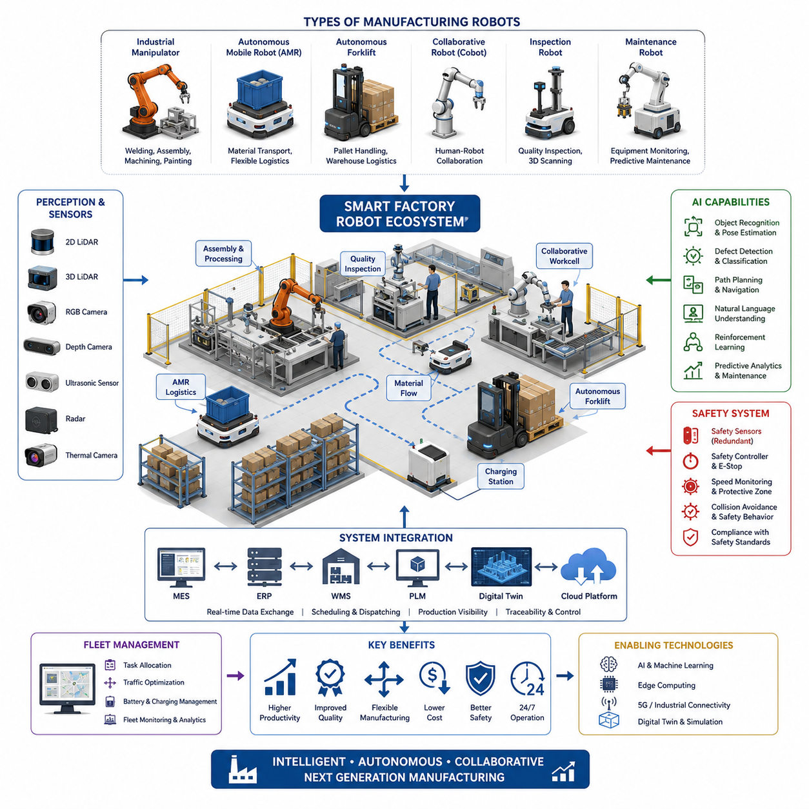
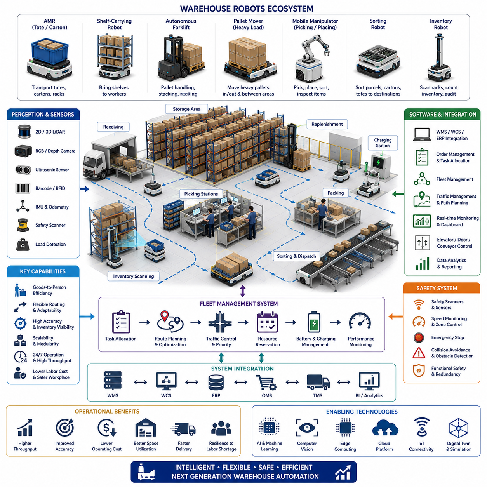
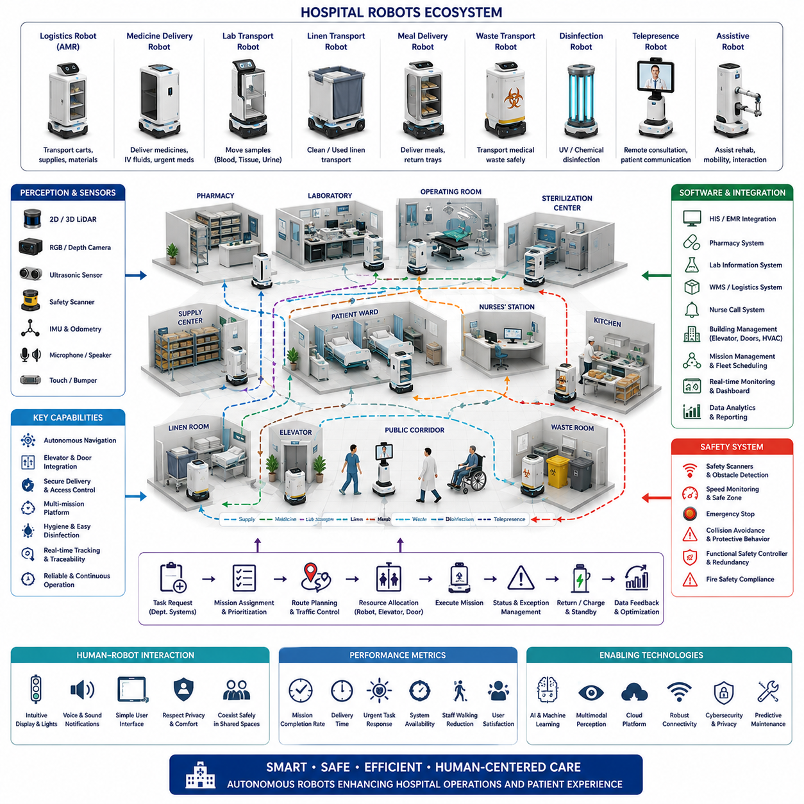
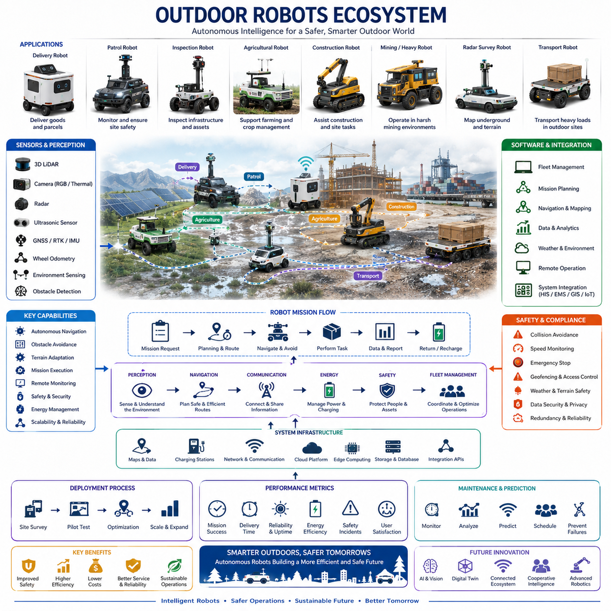
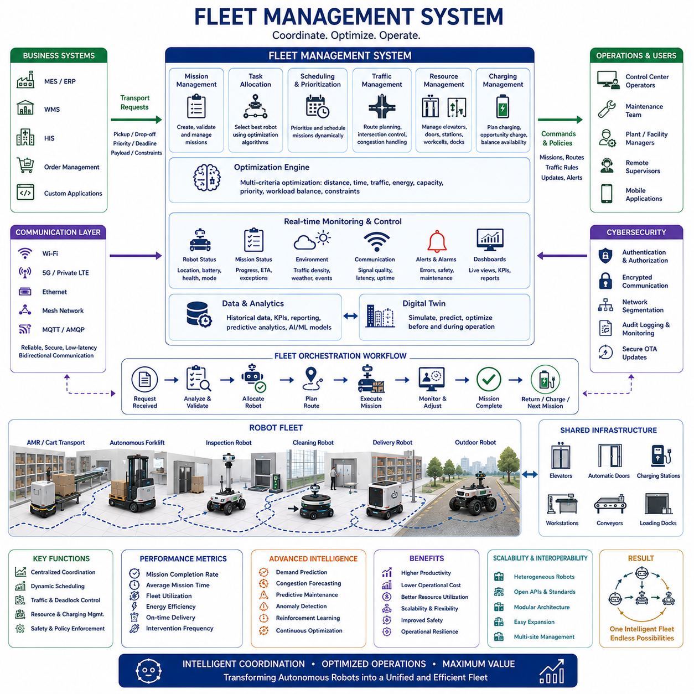

**Volume 01. AMR Foundations and System Architecture**

# 16. Industrial AMR Case Studies · 산업 AMR 사례 연구

## 16.01 Manufacturing Robots · 제조 로봇

{width="7.268055555555556in" height="7.268055555555556in"}

제조 로봇(Manufacturing Robots)은 생산 공정, 자재 운반(Material Handling), 품질 검사(Quality Control), 그리고 디지털 제조(Digital Manufacturing)를 하나의 통합된 운영 생태계로 연결하는 가장 영향력 있는 자율이동로봇(Autonomous Mobile Robot, AMR) 응용 분야 중 하나이다. 기존의 산업 자동화가 고정된 생산라인과 전용 컨베이어 시스템에 의존했다면, 현대의 제조 로봇은 생산 일정, 제품 종류, 작업 우선순위가 지속적으로 변화하는 동적인 공장 환경에서 운용되도록 설계된다. 주변 환경을 인식하고 자율적으로 판단하며 작업자와 협력할 수 있는 능력은 생산성을 유지하면서도 높은 유연성, 안전성, 그리고 일관된 품질을 동시에 달성할 수 있도록 지원한다.

제조 로봇의 발전은 대량 생산(Mass Manufacturing) 중심의 산업 구조가 다품종 소량 생산(High-Mix, Low-Volume)과 수요 중심 생산 방식으로 전환되는 과정과 함께 이루어졌다. 초기의 로봇 시스템은 안전 펜스 내부에서 반복 작업만 수행하는 고정형 장비였다. 반면 현대의 제조 로봇은 고성능 인지(Perception) 시스템, 인공지능(AI), 클라우드 연결성(Cloud Connectivity), 자율주행(Navigation)을 통합하여 다양한 생산 구역을 이동하면서 부품 운반, 품질 검사, 공구 공급, 작업자 지원 등의 복합적인 업무를 수행한다. 이제 로봇은 특정 위치에 고정된 장비가 아니라 생산 수요에 따라 자유롭게 이동하는 생산 자원으로 진화하였다.

제조 로봇은 하나의 장비가 아니라 다양한 형태의 로봇 플랫폼을 포함하는 광범위한 개념이다. 산업용 로봇 매니퓰레이터(Industrial Robot Manipulator)는 조립, 용접, 도장, 디스펜싱, 포장과 같은 정밀 작업을 수행한다. 자율이동로봇(AMR)은 원자재, 반제품, 완제품을 공장 내부에서 운반하며, 자율 지게차(Autonomous Forklift)는 팔레트 물류를 자동화한다. 협동로봇(Collaborative Robot, Cobot)은 작업자와 함께 조립 및 검사 작업을 수행하며, 검사 로봇(Inspection Robot)은 카메라(Camera), 레이저 스캐너(Laser Scanner), 3차원 센서(3D Sensor)를 활용하여 생산 중인 제품의 품질을 지속적으로 평가한다.

현대의 스마트 팩토리(Smart Factory)는 여러 종류의 로봇이 동시에 협력하는 이기종(Heterogeneous) 로봇 플릿(Fleet)을 운영하는 방향으로 발전하고 있다. 고정형 로봇 셀(Robot Cell)은 정밀 제조를 담당하고, 이동형 로봇은 자재를 공급하거나 완성품을 회수하며, 검사 로봇은 생산 직후 품질 검사를 수행한다. 유지보수 로봇(Maintenance Robot)은 설비 상태를 모니터링하고 이상 징후를 조기에 발견한다. 이러한 다양한 로봇 플랫폼의 협력은 공장 전체의 생산성과 운영 효율을 극대화하는 통합 제조 생태계를 형성한다.

자율이동로봇(AMR)은 공장 내부 물류를 근본적으로 변화시켰다. 과거에는 지게차나 작업자가 수행하던 운반 작업을 AMR이 대체하면서 공장 운영 방식 자체가 바뀌었다. AMR은 자기 테이프나 유도선을 따라 이동하는 대신, 라이다(LiDAR), 카메라(Camera), 관성측정장치(IMU), 휠 오도메트리(Wheel Odometry), 동시적 위치추정 및 지도작성(Simultaneous Localization and Mapping, SLAM)을 이용하여 스스로 위치를 파악한다. 또한 최적 경로를 실시간으로 계산하고 장애물을 회피하며 교통 혼잡을 우회하고 작업자와 안전하게 공간을 공유한다. 이러한 유연성은 생산라인 변경 시 대규모 인프라 공사를 최소화할 수 있도록 한다.

제조 로봇은 안전하고 효율적인 작업 수행을 위해 다양한 인지(Perception) 시스템을 사용한다. 2차원 라이다(2D LiDAR)는 안정적인 장애물 검출을 담당하고, 3차원 라이다(3D LiDAR)는 복잡한 작업 환경의 공간 구조를 생성한다. RGB 카메라(RGB Camera)는 작업자와 부품을 인식하며, 깊이 카메라(Depth Camera)는 거리 측정과 조작(Manipulation)을 지원한다. 초음파 센서(Ultrasonic Sensor)는 근거리 장애물 감지를 보완하고, 레이더(Radar)는 먼지나 연기 환경에서도 안정적으로 동작한다. 열화상 카메라(Thermal Camera)는 설비 온도를 감시하여 예지보전(Predictive Maintenance)에 활용된다.

인공지능(AI)은 제조 로봇을 단순 자동화 장비에서 지능형 생산 지원 시스템으로 발전시켰다. 딥러닝(Deep Learning)은 부품 인식, 결함 분류, 자세 추정(Pose Estimation), 이상 상태 탐지를 수행한다. 비전-언어 모델(Vision-Language Model, VLM)은 자연어 지시와 생산 정보를 이해하도록 지원하며, 강화학습(Reinforcement Learning)은 반복 작업을 최적화한다. 최근에는 파운데이션 모델(Foundation Model)이 다양한 제조 작업에 공통적으로 적용 가능한 일반화된 추론 능력을 제공하면서 제조 자동화의 수준을 더욱 높이고 있다.

산업용 로봇 매니퓰레이터는 높은 정밀도와 반복 정밀도를 바탕으로 제조 자동화의 핵심 장비로 활용된다. 6축 로봇(Six-Axis Robot)은 용접, 가공, 접착제 도포, 연마, 체결, 정밀 조립 등을 매우 높은 정확도로 수행한다. 최신 로봇은 힘·토크 센서(Force-Torque Sensor), 비전 서보잉(Vision Servoing), 적응형 궤적 계획(Adaptive Trajectory Planning)을 적용하여 부품 오차와 제조 편차를 자동으로 보정한다. 또한 이동형 플랫폼과 결합하여 생산 요구에 따라 자유롭게 이동하는 유연한 작업 셀(Flexible Workcell)을 구현한다.

협동로봇(Collaborative Robot)은 인간과 로봇의 안전한 협업이라는 새로운 생산 방식을 제시하였다. 기존 산업용 로봇이 안전 펜스를 필요로 했다면 협동로봇은 사람 접근을 감지하여 속도를 줄이거나 예상치 못한 접촉이 발생하면 즉시 정지한다. 이러한 특성은 작업자의 유연성과 로봇의 정밀성을 동시에 활용할 수 있도록 하며, 특히 다품종 소량 생산 환경에서 높은 효율을 제공한다. 반복적이고 육체적으로 힘든 작업은 로봇이 수행하고 작업자는 판단과 복잡한 조립에 집중할 수 있어 작업 환경과 생산성이 함께 향상된다.

품질 검사(Quality Inspection)는 제조 로봇의 가장 빠르게 성장하는 응용 분야 중 하나이다. 현대 제조에서는 샘플 검사보다 전수 검사(100% Inspection)가 요구되는 경우가 증가하고 있다. 이동형 검사 로봇은 생산 설비를 자율적으로 이동하며 고해상도 영상을 획득하고, 제품의 3차원 모델을 생성한 뒤 CAD 모델과 비교한다. 인공지능은 치수 오차, 누락된 부품, 조립 오류, 표면 결함, 긁힘, 부식 등을 자동으로 검출한다. 자동화된 품질 검사는 검사 결과의 일관성을 높이고 사람에 의한 편차를 줄여준다.

제조 로봇은 제조실행시스템(Manufacturing Execution System, MES), 전사적자원관리(Enterprise Resource Planning, ERP), 창고관리시스템(Warehouse Management System, WMS), 제품수명주기관리(Product Lifecycle Management, PLM)와 긴밀하게 연동된다. 생산 일정은 로봇의 운반 우선순위와 검사 순서를 결정하며, 로봇은 산업용 통신 프로토콜을 통해 생산 진행 상황, 설비 상태, 재고 수준, 품질 정보를 실시간으로 공유한다. 이러한 통합은 제조 로봇을 단순한 자동화 장비가 아니라 기업 전체의 생산 정보 시스템을 구성하는 핵심 요소로 만든다.

디지털 트윈(Digital Twin)은 제조 로봇의 설계와 운영을 최적화하는 핵심 기술로 자리 잡고 있다. 가상 공장 환경에서는 생산 설비, 로봇 동작, 자재 흐름, 작업 제약 조건을 실제와 동일하게 모델링한다. 이를 이용하여 이동 경로, 충돌 여부, 작업 가능 영역, 생산량, 설비 활용률 등을 실제 설치 전에 검증할 수 있다. 또한 실제 로봇과 디지털 트윈을 지속적으로 동기화함으로써 원격 진단, 운영 분석, 장기적인 생산 최적화를 수행할 수 있다.

안전(Safety)은 제조 로봇 시스템에서 가장 중요한 요소이다. 로봇은 사람과 동일한 작업 공간을 공유하고 고가의 생산 설비 주변에서 운용되므로, 안전 설계가 필수적이다. 이를 위해 이중화 센서(Redundant Sensor), 비상정지(Emergency Stop), 안전 제어기(Safety Controller), 속도 감시(Speed Monitoring), 보호 구역(Protective Zone), 기능 안전 소프트웨어(Functional Safety Software)가 통합된다. 로봇은 주변 환경을 지속적으로 평가하여 정상 운행, 감속, 제어 정지, 비상 정지 등의 안전 동작을 자동으로 수행하며 국제 안전 표준을 만족하도록 설계된다.

제조 로봇은 린 제조(Lean Manufacturing)의 핵심 목표인 낭비 제거에도 크게 기여한다. 자율 물류는 작업 대기 시간을 줄이고 필요한 시점에 필요한 자재를 정확하게 공급한다. 지능형 스케줄링은 생산 설비 간 작업량을 균형 있게 분배하며, 지속적인 품질 검사는 불량품이 후속 공정으로 전달되는 것을 방지한다. 예지보전은 예상치 못한 설비 고장을 최소화하여 전체 설비 효율(Overall Equipment Effectiveness, OEE)을 향상시키고 운영 비용을 절감한다.

유연 생산(Flexible Manufacturing)은 현대 제조 로봇의 가장 큰 장점 중 하나이다. 특정 제품을 위한 전용 생산라인 대신, 제조사는 모듈형 생산 셀(Modular Production Cell)을 구축하고 생산 요구에 따라 자유롭게 재구성한다. AMR은 공구와 부품을 운반하고, 협동로봇은 제품 교체 작업을 지원하며, 중앙 스케줄링 시스템은 여러 생산 셀을 동시에 관리한다. 이러한 구조는 생산성을 유지하면서도 고객 맞춤형 제품을 경제적으로 생산할 수 있도록 한다.

예지보전(Predictive Maintenance)은 제조 로봇의 가동률을 높이는 핵심 기술이다. 로봇은 모터 전류(Motor Current), 감속기 온도(Gearbox Temperature), 베어링 진동(Bearing Vibration), 배터리 상태(Battery Health), 바퀴 마모(Wheel Wear), 액추에이터 토크(Actuator Torque), 통신 품질(Communication Quality) 등을 지속적으로 모니터링한다. 머신러닝(Machine Learning)은 장기간의 데이터를 분석하여 부품의 잔여 수명을 예측하고, 계획된 생산 중단 시간에 유지보수를 수행하도록 권장하여 생산 중단을 최소화한다.

엣지 컴퓨팅(Edge Computing)은 제조 로봇에서 매우 중요한 역할을 수행한다. 많은 제조 작업은 매우 짧은 지연시간(Latency)과 실시간 응답이 요구되기 때문이다. GPU 가속기(GPU Accelerator)를 탑재한 산업용 컴퓨터는 인공지능 추론, 인지 알고리즘, 경로 계획, 안전 감시를 로컬에서 수행한다. 이를 통해 네트워크 상태와 관계없이 안정적인 운영이 가능하며, 클라우드는 플릿 관리(Fleet Management), 소프트웨어 업데이트, 장기 데이터 분석, 중앙 모니터링을 담당하여 엣지와 클라우드가 상호 보완적으로 동작한다.

다중 로봇 협업(Multi-Robot Coordination)은 공장에 수십에서 수백 대의 로봇이 동시에 운용되면서 더욱 중요한 기술이 되었다. 플릿 관리 시스템(Fleet Management System)은 운반 작업을 배정하고, 교통 흐름을 최적화하며, 충전 일정을 조정하고, 병목 현상을 방지한다. 협력형 경로 계획(Cooperative Path Planning)은 이동 시간을 단축하고 교착 상태(Deadlock)를 예방한다. 생산 관리자는 중앙 관리 시스템을 통해 로봇 가동률, 작업 완료율, 배터리 상태, 운영 성능을 실시간으로 확인할 수 있다.

제조 로봇의 경제적 가치는 단순한 인건비 절감에 그치지 않는다. 일정한 생산 품질, 불량 감소, 자재 낭비 감소, 작업자 안전 향상, 생산 시간 단축, 빠른 제품 전환, 그리고 24시간 연속 생산은 모두 투자 대비 높은 수익(Return on Investment, ROI)을 창출한다. 또한 제조 로봇은 인력 부족, 제품 다양성 증가, 시장 수요 변화와 같은 산업 환경 변화에도 안정적으로 대응할 수 있도록 하여 기업 경쟁력을 높이는 전략적 생산 자산으로 자리매김하고 있다.

미래의 제조 로봇은 파운데이션 모델(Foundation Model), 멀티모달 인공지능(Multimodal AI), 고도화된 조작 기술(Advanced Manipulation), 클라우드-엣지 통합(Cloud-Edge Integration), 디지털 트윈(Digital Twin)의 융합을 통해 더욱 자율적이고 협업적인 지능형 시스템으로 발전할 것이다. 로봇은 단순히 미리 정의된 동작을 수행하는 것이 아니라 생산 목표를 이해하고 변화하는 환경에 적응하며 최소한의 인간 개입으로 작업을 수행하게 된다. 지속적인 학습(Continuous Learning), 다양한 로봇 간의 협력, 그리고 기업 수준의 인공지능 플랫폼과의 통합은 제조 로봇을 유연하고 회복력이 뛰어난 차세대 스마트 팩토리(Smart Factory)의 핵심 사이버-물리 시스템(Cyber-Physical System)으로 발전시킬 것이다.

## 16.02 Warehouse Robots · 창고 로봇

{width="7.268055555555556in" height="7.268055555555556in"}

창고 로봇(Warehouse Robots)은 입고(Receiving), 보관(Storage), 재고 관리(Inventory Management), 주문 처리(Order Fulfillment), 포장(Packing), 출하(Shipping)를 하나의 통합된 물류 흐름(Material Flow)으로 연결하는 현대 물류 시스템의 핵심 요소가 되었다. 고정형 컨베이어 시스템은 사전에 정의된 경로와 높은 레이아웃 변경 비용을 요구하지만, 자율 창고 로봇은 주문량, 재고 위치, 통로 상태, 작업 우선순위 변화에 능동적으로 대응할 수 있다. 이러한 이동성은 창고 전체를 재구축하지 않고도 처리량(Throughput)을 향상시킬 수 있도록 하며, 특히 상품 종류가 다양하고 계절별 수요와 주문량이 크게 변하는 환경에서 높은 가치를 제공한다.

창고 로봇 기술은 전자상거래(E-Commerce)의 급격한 성장, 더욱 짧아진 배송 시간 요구, 인력 부족, 그리고 실시간 재고 관리의 필요성에 의해 빠르게 발전하였다. 기존 창고에서는 작업자가 긴 통로를 걸어 다니며 상품을 직접 찾아야 했다. 현대의 로봇 시스템은 선반, 토트(Tote), 팔레트(Pallet), 개별 상품을 작업자에게 직접 가져오는 Goods-to-Person 방식을 적용하여 불필요한 이동을 크게 줄인다. 이를 통해 작업 생산성이 향상되고 피로도가 감소하며, 탐색 시간과 피킹(Picking) 오류도 크게 줄어든다.

창고 로봇은 운반 대상과 작업 목적에 따라 다양한 플랫폼으로 구성된다. 자율이동로봇(Autonomous Mobile Robot, AMR)은 토트, 박스, 선반, 소형 팔레트를 이동시키며, 무인운반차(Automated Guided Vehicle, AGV)는 반복적인 운반 작업을 사전에 정의된 경로를 따라 수행한다. 자율 지게차(Autonomous Forklift)는 바닥과 랙(Rack) 사이에서 팔레트를 운반하며, 팔레트 운반 로봇(Pallet Mover)은 대형 화물을 입고장, 저장 공간, 출하장 사이에서 이동시킨다. 이동형 매니퓰레이터(Mobile Manipulator)는 자율주행과 로봇 팔을 결합하여 집기(Picking), 적재(Placing), 분류(Sorting), 검사(Inspection)를 동시에 수행할 수 있다.

선반 운반 로봇(Shelf-Carrying Robot)은 현대 주문 처리 센터(Fulfillment Center)에서 가장 널리 활용되는 시스템 중 하나이다. 작업자가 긴 통로를 이동하는 대신, 로봇이 선반 아래로 이동하여 선반을 들어 올리고 작업자에게 직접 전달한다. 창고 관리 시스템은 주문 우선순위와 재고 위치를 고려하여 필요한 선반을 선택한다. 작업이 완료되면 로봇은 선반을 가장 효율적인 위치에 다시 배치하며, 이에 따라 창고의 재고 배치는 상품 수요 변화에 맞추어 지속적으로 최적화된다.

자율이동로봇(AMR)은 자기 테이프(Magnetic Tape), 유도선(Wire), 반사판(Reflector)에 의존하는 기존 시스템보다 훨씬 높은 경로 유연성을 제공한다. 라이다(LiDAR), 카메라(Camera), 휠 오도메트리(Wheel Odometry), 관성측정장치(IMU)를 이용하여 자신의 위치를 추정하고 장애물을 탐지한다. 통로가 막히거나 작업 환경이 변경되면 새로운 경로를 실시간으로 계산하여 임무를 계속 수행한다. 이러한 특성은 창고 레이아웃 변경, 임시 적재 작업, 피크 시즌의 혼잡 상황에서도 안정적인 운영을 가능하게 한다.

자율 지게차는 팔레트 적재와 랙 작업을 자동화하는 핵심 장비이다. 레이저 스캐너(Laser Scanner), 카메라(Camera), 깊이 센서(Depth Sensor), 팔레트 인식 알고리즘(Pallet Detection Algorithm)을 활용하여 포크 삽입 위치와 팔레트의 자세를 정확하게 인식한다. 조향(Steering), 마스트 높이(Mast Height), 포크 기울기(Fork Tilt), 접근 속도를 정밀하게 제어하여 안전하게 화물을 적재하거나 하역한다. 안정적인 운용을 위해서는 정확한 위치 추정, 안정적인 하중 제어, 장애물 감지, 적재 중량과 무게 중심(Center of Gravity) 모니터링이 필수적이다.

로봇 피킹(Robotic Picking)은 창고 자동화에서 가장 어려운 분야 중 하나이다. 상품은 크기, 형태, 무게, 재질, 포장 방식이 모두 다르기 때문이다. 비전 시스템(Vision System)은 빈(Bin)이나 혼합 컨테이너 내부의 목표 물체를 인식하고, 딥러닝(Deep Learning)은 물체의 자세와 최적의 집기 위치(Grasp Point)를 계산한다. 로봇 팔은 흡착 패드(Suction Cup), 평행 그리퍼(Parallel Gripper), 적응형 그리퍼(Adaptive Finger), 특수 엔드 이펙터(End Effector)를 이용하여 상품을 집는다. 성공적인 피킹은 정확한 인식, 충돌 회피, 집기 성공 여부 확인, 실패 시 복구 동작에 의해 결정된다.

분류 로봇(Sorting Robot)은 박스, 토트, 소포(Parcel)를 목적지, 운송사(Carrier), 배송 경로, 작업 유형에 따라 자동으로 분류한다. 이동형 분류 로봇은 물품을 해당 출하 구역으로 이동시키며, 고정형 분류 시스템은 고속으로 상품을 여러 경로로 분배한다. 바코드 리더(Barcode Reader), RFID, 카메라, 광학 문자 인식(Optical Character Recognition, OCR)이 상품 정보를 식별하며, 창고 관리 시스템과 연동하여 모든 상품이 정확한 출하 위치로 이동하도록 제어한다.

재고 관리 로봇(Inventory Robot)은 창고 내부를 자율적으로 이동하면서 랙, 바코드, RFID 태그, 저장 위치를 지속적으로 스캔한다. 획득한 정보는 창고관리시스템(Warehouse Management System, WMS)의 데이터와 비교되어 실제 재고와 시스템 정보의 일치 여부를 확인한다. 카메라와 3차원 센서는 잘못 보관된 상품, 빈 저장 공간, 가려진 라벨, 손상된 포장, 예상하지 못한 장애물을 자동으로 검출한다. 지속적인 재고 모니터링은 수작업 재고 조사(Cycle Counting)의 필요성을 크게 줄이고 보다 정확한 재고 정보를 제공한다.

창고 로봇의 인지 시스템(Perception System)은 좁은 통로, 반사되는 포장재, 작업자, 지게차, 임시 장애물, 반복적인 랙 구조가 존재하는 복잡한 환경에서도 안정적으로 동작해야 한다. 2차원 라이다(2D LiDAR)는 안전 구역 감시와 기본 내비게이션을 담당하며, 3차원 라이다(3D LiDAR)는 팔레트와 랙을 더욱 정확하게 인식한다. RGB 카메라와 깊이 카메라는 바코드 인식, 물체 분류, 도킹(Docking)을 지원하고, 초음파 센서는 근거리 사각지대를 보완한다. 안전 인증 스캐너(Safety Scanner)는 사람이나 차량을 조기에 감지하여 충돌을 예방한다.

창고 내비게이션(Navigation)은 창고 구조와 교통량의 영향을 크게 받는다. 로봇은 교차로, 공유 통로, 적재 구역, 충전 구역, 작업 공간을 통과하면서도 병목 현상을 최소화해야 한다. 전역 경로 계획(Global Path Planning)은 최적 경로를 계산하고, 지역 경로 계획(Local Path Planning)은 작업자와 이동 장비를 실시간으로 회피한다. 통로 폭, 시야 확보, 적재 상태, 작업자 존재 여부에 따라 속도 제한도 달라진다. 따라서 효율적인 내비게이션은 지도 기반 경로 계획, 동적 장애물 회피, 교통 규칙, 안전 기반 이동 제어를 모두 통합해야 한다.

플릿 관리 시스템(Fleet Management System)은 다수의 창고 로봇을 동시에 제어하는 핵심 시스템이다. 각 로봇의 위치, 배터리 상태, 적재 능력, 현재 작업, 예상 완료 시간을 고려하여 최적의 작업을 배정한다. 또한 엘리베이터, 자동문, 컨베이어, 도킹 스테이션, 제한 구역을 통합 관리한다. 이러한 중앙 집중형 제어는 교착 상태(Deadlock)를 방지하고 혼잡을 줄이며 창고 전체의 물류 흐름을 지속적으로 유지한다.

교통 관리(Traffic Management)는 많은 로봇이 동시에 운행하는 대형 창고에서 필수적인 기술이다. 교차로, 좁은 통로, 적재 공간은 여러 대의 로봇이 동시에 접근하면 쉽게 병목 현상이 발생한다. 플릿 관리 시스템은 경로 예약(Path Reservation), 우선순위 제어, 통로 진입 제한, 경로 재배치를 수행하여 충돌과 대기를 최소화한다. 더욱 발전된 시스템은 현재 수행 중인 작업과 주문량을 기반으로 미래의 혼잡까지 예측하여 로봇 이동을 사전에 최적화한다.

창고 로봇은 창고관리시스템(WMS), 창고제어시스템(Warehouse Control System, WCS), 전사적자원관리(Enterprise Resource Planning, ERP), 주문관리시스템(Order Management System)과 긴밀하게 통합된다. 관리 시스템은 어떤 상품을 이동하고 보충하며 출하해야 하는지를 결정하고, 로봇은 이를 실제 작업 명령으로 변환하여 수행한다. 작업 상태, 재고 변화, 작업 완료, 예외 상황이 지속적으로 교환되어 운영자는 주문 진행 상황과 물류 흐름을 실시간으로 확인할 수 있다.

충전 전략(Charging Strategy)은 플릿의 가동률과 창고 생산성을 결정하는 중요한 요소이다. 로봇은 배터리 잔량이 일정 수준 이하로 떨어지면 충전 스테이션으로 이동하거나, 작업 사이의 유휴 시간(Idle Time)을 이용하여 기회 충전(Opportunity Charging)을 수행한다. 플릿 관리 시스템은 너무 많은 로봇이 동시에 충전하지 않도록 일정을 조정하며, 배터리 상태, 온도, 작업량, 예상 운행 시간을 고려하여 충전 여부를 결정한다.

안전 시스템(Safety System)은 작업자, 상품, 랙, 설비를 모두 보호하도록 설계된다. 비상정지(Emergency Stop), 안전 스캐너(Safety Scanner), 속도 감시(Speed Monitoring), 보호 구역(Protective Zone), 제동 시스템(Braking System), 이중화 제어(Redundant Control)가 통합된다. 사람이 경고 구역에 접근하면 로봇은 감속하고, 보호 구역에서는 완전히 정지한다. 적재 상태, 회전 반경, 제동 거리, 바닥 상태도 함께 고려하여 안전한 운행을 보장한다.

사람과 로봇의 상호작용(Human-Robot Interaction)은 창고 설계에서 매우 중요한 요소이다. 작업자는 로봇과 동일한 통로와 작업 공간을 공유하기 때문이다. 로봇은 조명, 디스플레이(Display), 음향, 바닥 투영(Projected Symbol) 등을 이용하여 이동 방향과 현재 상태를 명확하게 전달한다. 피킹 작업대도 사람이 가장 편안하게 작업할 수 있는 높이와 방향으로 설계되어야 한다. 우수한 상호작용 설계는 혼란을 줄이고 사람과 로봇의 효율적인 협업을 가능하게 한다.

디지털 트윈(Digital Twin)과 시뮬레이션(Simulation)은 실제 창고 구축 이전에 전체 시스템을 검증하는 데 활용된다. 엔지니어는 랙 배치, 로봇 이동 경로, 주문 패턴, 충전소 위치, 작업자 이동을 가상 환경에서 모델링한다. 이를 통해 병목 구간, 부족한 플릿 규모, 작업장 배치 문제, 충전 용량 부족 등을 사전에 발견할 수 있다. 구축 이후에도 실제 운영 데이터를 디지털 트윈에 반영하여 지속적인 운영 최적화를 수행할 수 있다.

창고 로봇의 성능 평가는 단순한 이동 속도가 아니라 창고 전체의 운영 효율을 기준으로 이루어져야 한다. 시간당 주문 처리량, 로봇당 작업 수, 평균 이동 거리, 피킹 정확도, 재고 정확도, 혼잡 시간, 충전 이용률, 시스템 가동률(System Availability) 등이 중요한 평가 지표이다. 단순히 로봇이 빠르다고 생산성이 향상되는 것은 아니며, 작업 대기와 교통 혼잡을 함께 고려한 전체 시스템 최적화가 필요하다.

예지보전(Predictive Maintenance)은 창고 로봇의 신뢰성을 높이는 핵심 기술이다. 모터 전류(Motor Current), 바퀴 마모(Wheel Wear), 진동(Vibration), 배터리 상태(Battery Health), 센서 상태(Sensor Health), 제동 성능(Braking Performance), 통신 품질(Communication Quality)을 지속적으로 분석하여 이상 징후를 조기에 발견한다. 유지보수는 계획된 정지 시간에 수행되므로 예기치 않은 고장을 줄일 수 있으며, 플릿 전체 데이터를 분석하여 특정 경로, 바닥 상태, 로봇 모델에서 반복적으로 발생하는 문제도 파악할 수 있다.

창고 로봇은 단계적으로 자동화를 확장할 수 있는 뛰어난 확장성(Scalability)을 제공한다. 초기에는 소수의 로봇으로 운영을 시작한 후 주문량 증가에 맞추어 플릿을 확대할 수 있다. 교통 관리, 충전 시스템, 무선 통신, 작업 공간만 적절히 조정하면 대규모 인프라 변경 없이 새로운 로봇을 추가할 수 있다. 또한 모듈형 소프트웨어와 표준화된 인터페이스(Standardized Interface)는 새로운 로봇, 컨베이어, 분류 시스템, 자동 창고 설비를 쉽게 통합할 수 있도록 지원한다.

창고 로봇의 경제적 가치는 단순한 인건비 절감 이상의 의미를 가진다. 작업자의 이동 거리를 줄이고, 피킹 품질을 향상시키며, 상품 손상을 감소시키고, 재고 가시성(Inventory Visibility)을 높이며, 24시간 연속 운영을 가능하게 한다. 또한 주문이 급증하거나 인력이 부족한 상황에서도 안정적인 운영이 가능하다. 그러나 성공적인 구축을 위해서는 로봇 도입 자체보다 업무 프로세스 개선, 시스템 통합, 작업자 교육, 유지보수 체계 구축, 정확한 성능 평가가 함께 이루어져야 한다.

미래의 창고 로봇은 고도화된 조작 기술(Advanced Manipulation), 멀티모달 인공지능(Multimodal AI), 파운데이션 모델(Foundation Model), 지속적인 플릿 학습(Continuous Fleet Learning)을 결합하여 더욱 지능적으로 발전할 것이다. 로봇은 새로운 상품도 스스로 이해하고 자연어를 통해 작업자와 협력하며 변화하는 창고 환경에 능동적으로 적응하게 된다. 자율 지게차, 이동형 매니퓰레이터, 재고 관리 로봇, 분류 로봇은 하나의 통합된 플릿으로 협력하여, 미래의 창고를 수작업 중심의 저장 공간이 아니라 지능형 데이터 기반 물류 네트워크(Intelligent Data-Driven Fulfillment Network)로 변화시키게 될 것이다.

## 16.03 Hospital Robots · 병원 로봇

{width="7.268055555555556in" height="7.268055555555556in"}

병원 로봇(Hospital Robots)은 임상 부서, 약국, 검사실, 병동, 수술실, 주방, 멸균 구역, 물류 센터를 연결하는 현대 의료 인프라의 중요한 구성 요소가 되었다. 고정형 자동화 장비와 달리 이동형 병원 로봇은 공용 복도를 주행하고, 엘리베이터와 자동문을 연동하며, 변화하는 임상 우선순위에 따라 물품을 배송할 수 있다. 병원 로봇의 목적은 의료 전문가를 대체하는 것이 아니라 반복적인 운반 업무를 줄이고 의료진이 환자 진료와 돌봄에 더 많은 시간을 집중할 수 있도록 지원하는 데 있다.

병원 로봇의 성장은 고령화, 의료 인력 부족, 운영 비용 증가, 감염 관리 요구, 의료 물류의 복잡성 증가에 의해 촉진되었다. 병원에서는 의약품, 혈액 검체, 식사, 린넨, 의료기기, 문서, 폐기물이 하루 종일 지속적으로 이동한다. 간호사나 지원 인력이 이러한 업무를 수작업으로 수행하면 소중한 임상 시간이 소모된다. 자율 로봇은 불필요한 보행을 줄이고 배송의 일관성을 높이며 병원 내부 물류를 더욱 예측 가능한 시스템으로 만든다.

병원 로봇은 운영 및 임상 기능에 따라 여러 유형으로 구분된다. 자율이동로봇(Autonomous Mobile Robot, AMR)은 카트, 의료용품, 식사, 의료 물자를 부서 간에 운반한다. 약국 로봇(Pharmacy Robot)은 의약품을 저장하고 조제하며, 검사실 로봇(Laboratory Robot)은 검체를 이동시키고 자동 분석을 지원한다. 원격진료 로봇(Telepresence Robot)은 환자와 원격 의료진을 연결하고, 소독 로봇(Disinfection Robot)은 미생물 오염을 줄이며, 보조 로봇(Assistive Robot)은 재활, 환자 이동, 의사소통을 지원한다. 이러한 시스템은 개별적으로 운용되거나 통합 병원 로봇 플릿(Fleet)의 일부로 운영될 수 있다.

물류 로봇(Logistics Robot)은 병원의 많은 업무가 예측 가능한 경로에서 반복적으로 수행되는 운반 작업이라는 점에서 가장 성숙한 응용 분야 중 하나이다. 로봇은 중앙 공급실에서 카트를 인수하여 병동에 전달하고, 빈 카트를 회수한 뒤 다른 부서로 이동할 수 있다. 적재 모듈(Payload Module)과 도킹 인터페이스(Docking Interface)가 표준화되면 동일한 플랫폼으로 다양한 임무를 수행할 수 있다. 안정적인 물류 자동화를 위해서는 정확한 내비게이션, 안전한 화물 관리, 자동 충전, 병원 업무 흐름과의 긴밀한 통합이 필요하다.

의약품 배송 로봇(Medicine Delivery Robot)은 처방약, 관리 대상 물품, 정맥주사액, 긴급 의약품을 임상 구역으로 운반하여 약국 운영을 개선한다. 잠금식 보관함은 무단 접근을 방지하며, 개방 전 직원 인증을 요구할 수 있다. 배송 기록에는 출발 시간, 도착 시간, 수령자, 예외 상태가 포함되어 각 임무의 추적성을 확보한다. 약국 시스템과 병원정보시스템(Hospital Information System)을 연동하면 긴급 요청을 우선 처리하면서 정기 배송 일정도 안정적으로 유지할 수 있다.

검사실 운송 로봇(Laboratory Transport Robot)은 혈액, 조직, 소변, 기타 진단 검체를 채취 지점과 검사실 사이에서 운반한다. 이러한 임무는 배송 시간, 진동, 온도, 오염 위험, 관리 연속성(Chain of Custody)을 세심하게 제어해야 한다. 바코드(Barcode)나 RFID 식별 정보는 각 용기를 정확한 환자와 검사 요청에 연결한다. 자동 운송은 지연과 검체 분실을 줄이고 진단 결과 처리 시간을 단축할 수 있지만, 로봇은 유출, 손상된 용기, 예상치 못한 경로 중단에도 안전하게 대응해야 한다.

린넨 운반 로봇(Linen Transport Robot)은 병원 전체에서 청결 린넨과 사용된 섬유류를 지속적으로 이동시키는 업무를 지원한다. 청결 린넨은 오염으로부터 보호되어야 하며, 오염 린넨은 운반 중 격리 상태를 유지해야 한다. 로봇은 전용 카트를 견인하거나 밀폐형 용기를 이용하여 병동, 세탁실, 보관 구역 사이를 이동할 수 있다. 자동 스케줄링(Automated Scheduling)은 과도한 재고 없이 충분한 린넨을 유지하도록 지원한다. 청결 물품과 오염 물품 간 교차오염을 방지하려면 서로 다른 임무 규칙, 도킹 구역, 세척 절차가 필요하다.

식사 배송 로봇(Meal Delivery Robot)은 병원 주방에서 병동으로 식사 카트를 운반하고 식사 후 사용된 식기를 회수한다. 식사 시간은 투약, 치료, 환자 만족도에 영향을 주기 때문에 로봇은 엄격한 일정을 준수해야 한다. 대형 병원 건물에서 식사를 운반할 때는 온도 유지, 카트 안정성, 경로 계획이 중요하다. 엘리베이터와 병동 출입 시스템을 연동하면 무인 배송이 가능하며, 직원용 인터페이스를 통해 카트가 정확한 위치에 도착했는지 확인할 수 있다.

의료 폐기물 운반(Medical Waste Transport)은 직원이 잠재적 위험 물질에 노출되는 것을 줄여주는 중요한 응용 분야이다. 로봇은 감염성 폐기물, 날카로운 폐기물, 검사실 폐기물, 일반 폐기물이 담긴 밀폐 용기를 지정된 처리 구역으로 이동시킬 수 있다. 로봇은 제한된 경로를 따라야 하며 청결 물류와 오염 물류가 혼합되지 않도록 해야 한다. 적재함과 카트 표면은 반복 소독이 가능한 재질로 설계되어야 하며, 임무 기록은 수거, 운반, 최종 인계 전 과정의 추적성을 제공한다.

소독 로봇(Disinfection Robot)은 자외선(Ultraviolet Light), 화학 미스트(Chemical Mist), 기타 처리 방식을 이용하여 병실, 수술 구역, 복도, 공공 공간의 병원체를 감소시킨다. 자율주행 기능을 통해 여러 위치에 정확히 배치되고 처리 범위를 계산할 수 있다. 안전 시스템은 사람을 감지하고 출입문 상태를 감시하며 필요 시 처리를 중단하여 인체 노출을 방지한다. 소독 로봇은 환경 미화팀을 지원하지만, 육안 오염 제거와 전체 감염 관리 절차를 대체하지는 않는다.

원격진료 로봇(Telepresence Robot)은 의료진, 전문의, 가족이 원격지에서 환자와 소통할 수 있도록 한다. 이동형 베이스에는 카메라, 마이크, 스피커, 디스플레이(Display)가 장착되며 병동이나 격리 구역을 이동한다. 원격 사용자는 환자에게 접근하여 시각적 상태를 확인하고, 진료 상담에 참여하거나, 사회적 상호작용을 제공할 수 있다. 원격진료는 전문의 접근이 제한되거나 감염 위험으로 직접 접촉이 어려운 상황에서 특히 유용하지만, 개인정보 보호와 네트워크 보안을 철저히 관리해야 한다.

병원 내비게이션(Hospital Navigation)은 복도가 혼잡하고 구조가 복잡하며 사람의 행동을 예측하기 어렵기 때문에 많은 공장이나 창고 환경보다 더 어렵다. 로봇은 환자, 방문객, 휠체어, 침대, 의료 카트, 청소 장비, 응급 의료팀과 마주친다. 로봇은 보수적으로 이동하고 편안한 통과 거리를 유지하며 임상 활동을 방해하지 않아야 한다. 내비게이션 소프트웨어는 효율적인 경로와 사회적 인식(Social Awareness), 저소음, 부드러운 움직임, 돌발 상황에 대한 즉각적인 대응을 균형 있게 고려해야 한다.

인지 시스템(Perception System)은 안전 인증 레이저 스캐너(Safety-Rated Laser Scanner), 라이다(LiDAR), 카메라, 깊이 센서(Depth Sensor), 초음파 센서(Ultrasonic Sensor), 휠 오도메트리(Wheel Odometry), 관성측정장치(Inertial Measurement Unit, IMU)를 결합한다. 이러한 센서는 장애물을 감지하고 자유 공간을 추정하며 도킹 목표를 인식하고 위치 추정을 지원한다. 병원에는 유리벽, 반사 바닥, 좁은 통로, 반복적인 복도 구조가 존재하여 인지 알고리즘에 어려움을 줄 수 있다. 따라서 센서 배치와 센서 융합(Sensor Fusion)은 바닥 근처, 사람의 신체 높이, 운반 카트 주변까지 안정적으로 감시할 수 있도록 설계되어야 한다.

엘리베이터 연동(Elevator Integration)은 다층 병원에서 필수적이다. 로봇은 엘리베이터를 호출하고, 사람의 통행을 방해하지 않는 위치에서 대기하며, 안전하게 탑승하고, 목적층을 선택한 뒤 정상적으로 하차했는지 확인해야 한다. 통신은 건물관리 인터페이스(Building Management Interface), 무선 제어기, 전용 엘리베이터 모듈을 통해 이루어질 수 있다. 시스템은 혼잡한 엘리베이터, 비상 우선권, 통신 단절, 예상치 못한 문 닫힘에 대응해야 한다. 엘리베이터 공간이 제한될 경우 로봇은 항상 환자, 이동식 침대, 의료진에게 우선권을 양보해야 한다.

자동문(Automatic Door), 출입 통제 구역(Access-Controlled Zone), 방화문(Fire Door)도 통합적으로 연동되어야 한다. 로봇은 약국, 검사실, 멸균 구역, 직원 전용 복도에 진입하기 위해 디지털 권한을 요구할 수 있다. 문을 통과하기 전에 개방 상태를 확인해야 하며, 방화 안전 기능을 방해해서는 안 된다. 출입 권한은 임무별로 설정하여 각 로봇이 지정된 작업에 필요한 공간에만 진입하도록 해야 한다. 보안 로그(Security Log)는 모든 요청, 승인, 진입, 실패 이벤트를 기록한다.

플릿 관리 시스템(Fleet Management System)은 여러 병원 로봇을 조정하고 긴급도, 위치, 적재 유형, 배터리 상태, 임상 우선순위에 따라 작업을 배정한다. 긴급 의약품이나 검사 검체 요청이 발생하면 정기적인 린넨 운반이나 식사 배송 임무가 연기될 수 있다. 플릿 관리 시스템은 좁은 복도, 엘리베이터, 도킹 스테이션, 충전 구역의 교통도 제어한다. 중앙 모니터링을 통해 운영자는 병원 전체 로봇의 상태, 임무 진행 상황, 차단된 경로, 서비스 예외를 확인할 수 있다.

병원 로봇은 병원정보시스템(Hospital Information System), 약국 플랫폼, 검사실 시스템, 건물관리시스템(Building Management System), 간호 호출 시스템(Nurse Call System), 물류 소프트웨어와 통합되어야 한다. 이러한 시스템에서 생성된 상위 수준 요청은 픽업, 배송, 인증, 완료 조건이 정의된 로봇 임무로 변환된다. 통합 과정에서는 불필요한 환자 정보가 노출되지 않도록 해야 한다. 임무 수행과 검증에 필요한 최소한의 데이터만 교환하고 저장하며 화면에 표시해야 한다.

사이버보안(Cybersecurity)과 개인정보 보호(Privacy)는 병원 로봇이 임상 네트워크에서 동작하고 민감한 운영 정보나 환자 관련 데이터를 처리할 수 있기 때문에 매우 중요하다. 보안 통신, 장치 인증(Device Authentication), 암호화 저장(Encrypted Storage), 접근 제어(Access Control), 소프트웨어 서명(Software Signing), 네트워크 분리(Network Segmentation)는 무단 접근 위험을 줄인다. 원격진료 로봇은 음성과 영상을 전송하므로 추가적인 보호가 필요하다. 보안 감시와 업데이트 절차는 로봇의 전체 운영 수명 동안 지속되어야 한다.

기능 안전(Functional Safety)은 환자, 직원, 방문객, 의료 장비, 운반 화물을 보호하도록 설계된다. 비상정지 버튼(Emergency Stop Button), 이중화 감지(Redundant Sensing), 안전 제어기(Safety Controller), 속도 감시(Speed Monitoring), 보호 구역(Protective Zone), 신뢰성 있는 제동 시스템(Reliable Braking System)은 기본 구성 요소이다. 로봇은 출입문, 교차로, 병동, 혼잡 구역에서 더 느리게 이동해야 한다. 안전 조건이 불확실한 경우에는 무리하게 자율 복구를 시도하지 않고 제어 정지(Controlled Stop) 상태로 전환한 뒤 지원을 요청해야 한다.

사람과 로봇의 상호작용(Human-Robot Interaction)은 의료 환경에서 로봇 수용성에 큰 영향을 미친다. 로봇은 간단한 조명, 음향, 디스플레이, 바닥 투영 표시(Projected Indicator)를 통해 이동 방향, 의도, 상태를 전달해야 한다. 알림은 명확하게 인지할 수 있어야 하지만 환자에게 불편을 주거나 경보 피로(Alert Fatigue)를 유발해서는 안 된다. 직원용 인터페이스는 빠른 작업 요청, 임무 취소, 보관함 개방, 예외 보고를 지원해야 한다. 명확한 동작은 불확실성을 줄이고 환자와 방문객이 자율 로봇과 안전하게 공간을 공유하도록 돕는다.

병원 로봇은 엄격한 위생성(Hygiene)과 세척 용이성(Cleanability)을 갖추어야 한다. 외부 표면은 틈새, 노출된 체결부, 날카로운 모서리, 액체를 흡수하는 재질을 최소화해야 한다. 부품은 승인된 세척제와 반복 소독에도 성능이 저하되지 않아야 한다. 바퀴와 하부 섀시는 오염된 바닥과 접촉하므로 특별한 관리가 필요하다. 의약품, 식사, 청결 린넨, 검체, 폐기물에 사용되는 적재 모듈은 각각의 오염 위험에 따라 서로 다른 세척 절차를 적용해야 한다.

병원 운영은 주야간 계속되므로 신뢰성(Reliability)이 매우 중요하다. 로봇은 장시간 동안 안정적인 내비게이션, 통신, 충전, 도킹, 화물 취급 성능을 유지해야 한다. 예지보전(Predictive Maintenance)은 배터리 상태, 모터 전류, 바퀴 마모, 센서 오염, 제동 성능, 통신 품질을 모니터링할 수 있다. 유지보수는 중요한 물류 서비스가 중단되지 않도록 임상 일정과 연계하여 계획해야 한다.

병원 로봇 배치는 일반적으로 즉각적인 설치보다 상세한 업무 흐름 분석(Workflow Analysis)에서 시작한다. 엔지니어는 운반 경로, 임무 빈도, 카트 크기, 엘리베이터 사용, 인력 배치, 혼잡 시간대를 관찰한다. 이후 제한된 부서에서 소수의 로봇으로 시범 운영(Pilot Deployment)을 수행한다. 성능 데이터와 직원 피드백을 기반으로 경로, 인터페이스, 도킹 스테이션, 운영 절차를 개선한 뒤 다른 층이나 추가 임무로 확대한다.

병원 로봇의 성능은 단순한 이동 속도가 아니라 서비스 수준(Service Level)과 임상 지원 지표를 기준으로 평가해야 한다. 중요한 지표에는 임무 완료율, 배송 시간, 긴급 작업 응답 시간, 시스템 가동률(System Availability), 직원 보행 거리 감소, 엘리베이터 대기 시간, 도킹 성공률, 개입 빈도, 사용자 만족도가 포함된다. 빠르게 이동하더라도 복도를 자주 막거나 반복적으로 지원이 필요한 로봇은 느리지만 예측 가능하고 안정적으로 동작하는 시스템보다 가치가 낮을 수 있다.

병원 로봇의 경제적 효과에는 운반 업무 감소, 물품 추적성 향상, 배송 지연 감소, 서비스 일관성 개선, 전문 인력 시간의 효율적 활용이 포함된다. 수작업 절차를 그대로 복제하는 것보다 자동화에 맞게 업무 흐름을 재설계할 때 가장 높은 가치를 얻을 수 있다. 성공적인 프로젝트를 위해서는 임상팀, 약국 직원, 시설 관리자, 감염 관리 전문가, 정보기술팀, 안전 엔지니어, 로봇 운영자의 협력이 필요하다.

미래의 병원 로봇은 멀티모달 인지(Multimodal Perception), 자연어 상호작용(Natural-Language Interaction), 고도화된 조작 기술(Advanced Manipulation), 지능형 임무 계획(Intelligent Mission Planning)을 결합하게 될 것이다. 로봇은 더욱 복잡한 요청을 이해하고 변화하는 임상 조건을 파악하며 간단한 대화형 인터페이스로 의료진과 협력할 수 있게 된다. 이기종 로봇 플릿(Heterogeneous Robot Fleet)은 공유 관리 아키텍처를 통해 물류 로봇, 소독 로봇, 원격진료 시스템, 보조 로봇을 통합적으로 조정할 수 있다. 이러한 발전은 더욱 안전하고 신속하며 환자 중심적인 병원 운영을 지원하게 될 것이다.

## 16.04 Outdoor Robots · 실외 로봇

{width="7.268055555555556in" height="7.268055555555556in"}

실외 로봇(Outdoor Robots)은 구조화된 실내 환경을 넘어 날씨, 불규칙한 지형, 공공 활동, 불안정한 통신 환경, 지속적으로 변화하는 장애물이 존재하는 공간에서 자율 이동을 수행하는 로봇이다. 이러한 로봇은 산업 단지, 캠퍼스, 농장, 건설 현장, 항만, 도로, 공원, 보안 구역 등 다양한 환경에서 운용된다. 실외 로봇의 가치는 고정형 자동화가 어려운 장소에서 검사, 운반, 모니터링, 유지보수, 서비스 작업을 수행하여 사람의 위험한 작업을 줄이고 운영 효율을 높이는 데 있다.

실외 로봇은 자율 순찰 로봇(Autonomous Patrol Robot), 배송 로봇(Delivery Robot), 농업 로봇(Agricultural Robot), 검사 로봇(Inspection Robot), 건설 로봇(Construction Robot), 광산 작업 로봇(Mining Robot), 지표투과레이더 로봇(Ground-Penetrating Radar Robot), 중량물 운반 로봇(Heavy-Duty Transport Robot) 등 다양한 형태로 구성된다. 일부 플랫폼은 보도나 보행 공간을 위한 소형 시스템이며, 다른 플랫폼은 산업 현장에서 대형 화물을 운반할 수 있도록 설계된다. 기계 구조, 센서, 컴퓨팅 시스템, 내비게이션 전략, 안전 아키텍처는 지형, 속도, 임무 시간, 환경 조건, 사람 및 일반 차량과의 상호작용을 고려하여 선택되어야 한다.

실외 환경은 실내보다 훨씬 높은 불확실성을 가진다. 도로에는 포트홀(Pothole), 자갈, 진흙, 경사면, 연석(Curb), 물웅덩이, 식생, 임시 공사 구역 등이 존재할 수 있다. 조명은 강한 직사광선에서 야간까지 지속적으로 변화하며, 비, 안개, 눈, 먼지, 그림자는 센서 성능을 저하시킨다. 따라서 로봇은 주행 가능한 영역과 위험한 영역을 구분하고, 변화하는 환경 조건에 맞추어 속도와 경로, 주행 전략을 지속적으로 조정해야 한다.

기계적 구조(Mechanical Architecture)는 실외 주행 성능을 결정하는 핵심 요소이다. 플랫폼은 요구되는 기동성과 지형 특성에 따라 차동 구동(Differential Drive), 4륜 조향(Four-Wheel Steering), 스키드 조향(Skid Steering), 굴절 조향(Articulated Steering), 6륜 구동(Six-Wheel Configuration)을 사용할 수 있다. 서스펜션(Suspension)은 바퀴의 접지력을 유지하고 진동을 감소시키며, 충분한 최저지상고(Ground Clearance)는 바위, 연석, 노면의 요철로부터 섀시를 보호한다. 타이어 종류, 휠 직경, 트레드(Tread), 제동 성능은 예상 하중, 경사도, 노면 상태, 최고 속도에 맞게 설계되어야 한다.

기상 환경 보호(Weather Protection)는 실외 로봇 설계에서 필수적인 요소이다. 외함(Enclosure)은 배터리, 컴퓨터, 모터, 커넥터, 센서를 물, 먼지, 이물질로부터 보호해야 한다. 장기적인 현장 운용을 위해서는 밀폐(Sealing), 배수(Drainage), 환기(Ventilation), 부식 방지 재료(Corrosion-Resistant Material)가 요구된다. 열 관리(Thermal Management)는 직사광선, 고온, 혹한, 그리고 컴퓨팅 시스템에서 발생하는 내부 열을 모두 고려해야 한다. 필요에 따라 히터, 냉각 시스템, 필터 공기 순환, 액체 냉각(Liquid Cooling)이 적용될 수 있다.

실외 로봇은 어떤 환경에서도 하나의 센서만으로 안정적인 인식이 어렵기 때문에 다양한 센서를 함께 사용한다. 3차원 라이다(3D LiDAR)는 지형과 장애물의 기하학적 정보를 제공하며, 카메라(Camera)는 물체 인식, 의미 기반 이해(Semantic Understanding), 시각 위치추정(Visual Localization)을 담당한다. 레이더(Radar)는 비, 안개, 먼지, 야간에서도 안정적인 탐지를 제공하며, 초음파 센서(Ultrasonic Sensor)는 근거리 사각지대를 보완한다. 열화상 카메라(Thermal Camera)는 일반 영상으로 식별하기 어려운 사람, 동물, 열원, 설비 이상을 탐지하는 데 활용된다.

센서 배치(Sensor Placement)는 넓은 시야를 확보하면서도 진동, 오염, 자체 가림(Self-Occlusion)을 최소화하도록 설계되어야 한다. 너무 낮은 위치에 설치된 카메라나 라이다는 식생, 흙탕물, 적재물에 의해 가려질 수 있으며, 너무 높은 위치는 진동이 증가할 수 있다. 보호용 윈도우(Window)는 빗물, 먼지, 곤충, 진흙으로 인해 오염될 수 있으므로 자동 세척 기능이 필요할 수 있다. 또한 센서 상태 모니터링(Sensor Health Monitoring)은 렌즈 가림, 보정 이상, 온도 상승, 측정 오류를 감지하여 안전성을 유지해야 한다.

위치추정(Localization)은 일반적으로 위성항법시스템(Global Navigation Satellite System, GNSS), 실시간 이동측위(Real-Time Kinematic, RTK), 관성측정장치(IMU), 휠 오도메트리(Wheel Odometry), 라이다 위치추정(LiDAR Localization), 비전 기반 위치추정(Visual Localization)을 결합하여 수행한다. GNSS는 실외에서 전역 위치 정보를 제공하지만, 건물, 나무, 교량, 터널에서는 정확도가 크게 저하될 수 있다. 따라서 로컬 센서를 이용한 위치추정이 함께 사용되어야 하며, 시스템은 신호 품질과 환경 특성을 고려하여 여러 위치추정 방법을 동적으로 결합해야 한다.

실외 로봇의 지도(Map)는 기하학적 정보뿐 아니라 의미 정보(Semantic Information), 고도(Elevation), 교통 정보(Traffic Information)를 함께 포함할 수 있다. 2차원 지도는 도로와 허용 구역을 표현하고, 3차원 지도는 경사면, 연석, 돌출 장애물, 지형 구조를 표현한다. 의미 기반 지도는 보도, 차도, 제한 구역, 적재 구역, 잔디, 물, 공사 구역을 구분한다. 실외 환경은 날씨, 주차 차량, 식생 성장, 임시 구조물 등에 의해 지속적으로 변화하므로 지도 역시 지속적으로 갱신되어야 한다.

지형 인식(Terrain Perception)은 특정 노면을 안전하게 통과할 수 있는지를 판단하는 핵심 기술이다. 로봇은 경사도, 거칠기(Roughness), 단차(Step Height), 노면 연속성, 바퀴 지지 상태, 예상 마찰력을 분석한다. 카메라에서는 평평해 보이는 공간이라도 실제로는 진흙, 깊은 물, 자갈, 절벽일 수 있다. 고도 지도(Elevation Map), 포인트 클라우드(Point Cloud), 딥러닝 기반 지형 분류를 이용하여 주행 가능성을 평가하며, 확신이 낮을 경우에는 보수적으로 판단해야 한다.

경로 계획(Path Planning)은 단순히 최단 거리를 계산하는 문제가 아니다. 가장 짧은 경로가 급경사, 좁은 통로, 시야 불량 구역, 보행자 밀집 지역, 미끄러운 노면을 포함할 수 있기 때문이다. 실외 경로 계획기는 지형, 안전 여유, 에너지 소비, 통신 품질, 임무 우선순위를 모두 고려하여 비용을 계산한다. 지역 경로 계획(Local Planning)은 사람, 자전거, 차량, 동물, 예기치 않은 장애물을 실시간으로 회피하며, 전체 이동은 예측 가능하고 부드러운 움직임을 유지해야 한다.

동적 장애물 예측(Dynamic Obstacle Prediction)은 공공 공간이나 차량과 혼재된 환경에서 매우 중요하다. 사람과 차량은 높은 상대 속도로 접근하거나 예측하기 어려운 행동을 보일 수 있다. 인공지능은 주변 물체를 탐지, 분류, 추적한 후 미래 이동을 예측한다. 로봇은 이를 기반으로 감속하거나 경로를 변경하고, 양보하거나 정지한다. 행동 계획(Behavior Planning)은 단순한 충돌 회피뿐 아니라 사회적 규칙과 현장 운영 규칙을 함께 고려해야 한다.

실외 배송 로봇(Outdoor Delivery Robot)은 캠퍼스, 주거 지역, 산업 단지, 제한된 공공 공간에서 택배, 음식, 공구, 물품을 운반한다. 이러한 로봇은 잠금식 적재함, 수령자 인증, 경로 추적, 정확한 도킹 기능을 갖추어야 한다. 보도에서는 보행자, 횡단보도, 경사로, 주차 물체, 장애인 편의시설과 상호작용해야 하며, 휠체어 사용자의 통행을 방해하거나 출입구를 막아서는 안 된다. 예외 상황은 원격 운영자가 지원하는 방식이 일반적이다.

순찰 및 보안 로봇(Patrol and Security Robot)은 산업 시설, 캠퍼스, 국경 지역, 에너지 시설, 중요 인프라를 정기적으로 순찰한다. 카메라, 열화상 센서, 마이크, 가스 센서, 환경 센서를 이용하여 다양한 정보를 수집한다. 인공지능은 침입, 연기, 이상 발열, 열린 문, 방치된 물체, 설비 변화를 감지할 수 있다. 다만 인식 신뢰도가 충분하지 않은 경우에는 독립적인 보안 판단을 수행하기보다는 운영자에게 상황을 보고하도록 설계되어야 한다.

검사 로봇(Inspection Robot)은 작업자가 위험하거나 접근하기 어려운 장소에 직접 들어갈 필요를 줄여준다. 이러한 로봇은 파이프라인, 철도, 도로, 태양광 발전소, 전력 시설, 대형 산업 설비를 검사한다. 고해상도 카메라, 열화상 카메라, 3차원 스캐너, 음향 센서, 진동 센서는 부식, 균열, 누설, 변형, 과열, 부품 누락 등을 탐지한다. 반복 가능한 주행 경로는 검사 결과를 장기간 비교하고 설비 상태를 지속적으로 모니터링하는 데 큰 장점을 제공한다.

농업 로봇(Agricultural Robot)은 농경지, 과수원, 온실, 축산 환경에서 작물 모니터링, 농약 살포, 제초, 수확, 토양 측정, 자율 운반을 수행한다. 농업 환경은 연약한 토양, 급경사, 좁은 작물 줄, 나뭇가지, 먼지, 진흙 등으로 매우 복잡하다. 인지 시스템은 작물, 잡초, 작업자, 동물, 장애물을 정확히 구분하면서 작물과 토양의 손상을 최소화해야 한다.

건설 로봇(Construction Robot)은 측량, 공정 모니터링, 자재 운반, 마킹, 천공, 현장 검사를 수행한다. 건설 현장은 지속적으로 변화하기 때문에 지도와 경로는 몇 시간 만에도 오래된 정보가 될 수 있다. 로봇은 임시 구조물, 굴착 구역, 중장비, 작업자, 불안정한 노면을 인식해야 한다. 또한 건설정보모델(Building Information Modeling, BIM)과 디지털 트윈(Digital Twin)을 이용하여 계획과 실제 시공 상태를 비교할 수 있지만, 자율 판단은 최신 현장 정보를 반영해야 한다.

광산 및 중공업 로봇(Mining and Heavy Industry Robot)은 높은 적재 능력과 내구성, 긴 운행 거리가 요구된다. 이들은 자재 운반, 터널 검사, 적치장 모니터링, 위험 작업 지원 등을 수행한다. 먼지, 진동, 어둠, 불안정한 통신, 대형 장비는 매우 어려운 환경을 만든다. 따라서 이중화 센서, 산업용 부품, 보호 커넥터, 높은 수준의 로컬 자율성이 필요하며, 원격 통신이 끊겨도 안전한 비상 동작이 가능해야 한다.

지표투과레이더 로봇(Ground-Penetrating Radar Robot)은 지하 시설 탐사, 도로 검사, 고고학 조사, 기반시설 평가를 위해 지하 데이터를 수집한다. 로봇은 일정한 속도와 센서 높이를 유지하며 정확한 측량 경로를 따라 이동해야 한다. 위치추정 정확도는 지하 지도를 생성하는 품질을 직접 결정한다. 진동, 휠 슬립(Wheel Slip), GNSS 신호 손실, 전자기 간섭은 데이터 품질을 저하시킬 수 있으므로, 내비게이션과 센서 제어가 긴밀히 연계되어야 한다.

에너지 관리(Energy Management)는 임무 거리, 지형, 온도, 적재량, 바람, 노면 저항에 의해 영향을 받기 때문에 실외 환경에서 더욱 어렵다. 경사면을 오르거나 연약한 지면을 주행하면 소비 전력이 크게 증가한다. 따라서 로봇은 단순한 배터리 잔량이 아니라 현재 환경을 고려하여 실제 주행 가능 거리를 예측해야 한다. 임무 계획은 복귀, 충전, 열 관리, 우회 경로에 필요한 에너지를 항상 확보해야 한다.

충전 인프라(Charging Infrastructure)는 고정형 도킹 스테이션, 실외 보호형 충전기, 배터리 교환(Battery Swapping), 이동식 충전 시스템으로 구성될 수 있다. 실외에서는 비, 먼지, 울퉁불퉁한 지면, GNSS 오차에도 정확하게 도킹해야 한다. 충전 인터페이스는 방수와 전기 안전을 보장해야 하며, 플릿 관리 시스템은 임무 수요, 배터리 상태, 기상 조건, 충전기 사용 가능 여부를 고려하여 충전 일정을 최적화한다.

통신 시스템(Communication System)은 Wi-Fi, 전용 이동통신망(Private Cellular Network), 공용 이동통신망(Public Mobile Network), 무선 링크(Radio Link), 메시 네트워크(Mesh Network)를 함께 사용할 수 있다. 실외에서는 지형, 건물, 식생, 통신 혼잡에 따라 통신 품질이 크게 변한다. 따라서 로봇은 통신이 불안정하거나 끊겨도 안전하게 임무를 계속 수행해야 한다. 핵심 제어와 안전 기능은 로컬에서 실행하고, 원격 시스템은 임무 관리, 모니터링, 데이터 업로드, 소프트웨어 업데이트를 담당한다.

엣지 컴퓨팅(Edge Computing)은 클라우드 연결 없이도 인지, 위치추정, 경로 계획, 안전 감시를 수행할 수 있도록 한다. GPU 기반 산업용 컴퓨터는 라이다와 카메라 데이터를 실시간 처리하며, 별도의 제어기는 주행과 기능 안전을 담당한다. 클라우드는 플릿 분석, 지도 배포, 장기 데이터 저장, 인공지능 모델 업데이트를 수행한다. 이러한 구조는 통신이 끊겨도 핵심 자율 기능이 유지되도록 설계되어야 한다.

기능 안전(Functional Safety)은 주행 속도, 차량 질량, 제동 거리, 지형, 적재량, 주변 사람과 차량의 특성을 고려하여 설계된다. 안전 스캐너(Safety Scanner), 비상정지(Emergency Stop), 이중화 제어(Redundant Control), 속도 감시(Speed Supervision), 제동 감시(Brake Monitoring), 보호 구역(Protective Zone)이 기본 요소이다. 실외에서는 내리막 제동 거리, 노면 마찰 감소, 센서 성능 저하, 높은 장애물까지 고려해야 하며, 불확실성이 증가할수록 더욱 보수적인 안전 동작을 수행해야 한다.

운영 안전(Operational Safety)은 지오펜싱(Geofencing)과 규칙 기반 접근 제어(Rule-Based Access Control)를 함께 사용한다. 가상 경계는 도로, 위험 지형, 공사 구역, 제한 구역으로의 진입을 방지한다. 보행 공간, 사설 도로, 적재 구역, 제한 시설마다 서로 다른 운행 규칙이 적용될 수 있다. 지오펜스 정보는 버전 관리되어야 하며, 기상 변화나 긴급 상황 발생 시 신속하게 업데이트되어야 한다.

사람과 로봇의 상호작용(Human-Robot Interaction)은 개방된 공공 환경에서 매우 중요하다. 조명, 디스플레이(Display), 음향, 방향 지시등(Turn Indicator), 바닥 경로 표시(Projected Path), 외부 메시지를 이용하여 로봇의 의도를 명확하게 전달해야 한다. 지나친 경고는 불편함을 줄 수 있으며, 부족한 안내는 불확실성을 높인다. 또한 어린이, 노인, 청각 장애인, 자율 로봇에 익숙하지 않은 사람까지 고려한 인터페이스 설계가 필요하다.

원격 운영(Remote Operation)은 로봇이 자율적으로 해결하기 어려운 상황에서 운영자를 지원하는 기능이다. 운영자는 카메라 화면을 확인하고 경유 지점을 지정하거나 특정 동작을 승인하며, 필요 시 일시적으로 직접 제어할 수 있다. 원격 지원은 지속적인 수동 운전이 아니라 예외 상황 처리(Exception Handling)를 목적으로 해야 한다. 통신 지연, 제한된 시야, 운영자의 작업 부담을 고려해야 하며, 모든 개입은 기록되어 소프트웨어 개선과 운영 최적화에 활용되어야 한다.

플릿 관리(Fleet Management)는 여러 대의 실외 로봇의 임무, 경로, 충전, 유지보수, 운행 구역을 통합 관리한다. 시스템은 플랫폼 성능, 적재 능력, 기상 조건, 위치, 배터리 상태, 센서 상태를 고려하여 작업을 배정한다. 산업 단지에서는 공용 경로와 도킹 구역에 대한 교통 관리도 필요하다. 플릿 데이터는 성능 분석, 사고 조사, 예지보전, 지속적인 임무 최적화에 활용된다.

실외 로봇의 구축은 현장 분석(Site Characterization)과 운영 설계(Operational Design)에서 시작된다. 엔지니어는 지형, 경사도, 배수 상태, 통신 품질, 기상 노출, 교통 흐름, 조명, 제한 구역, 비상 접근성을 조사한다. 또한 계절 변화도 반드시 고려해야 한다. 여름에 검증된 경로가 겨울철 눈이나 집중호우, 식생 성장으로 인해 위험해질 수 있기 때문이다. 시범 운영(Pilot Test)은 점진적으로 속도, 운행 범위, 임무 시간, 환경 난이도를 확대하면서 신뢰성과 안전성을 검증한다.

성능 평가는 임무 완료율, 원격 개입 빈도, 위치추정 가용성(Localization Availability), 장애물 탐지 신뢰도, 에너지 소비, 경로 효율, 도킹 성공률, 통신 가동률, 기상에 따른 성능 저하 등을 종합적으로 고려해야 한다. 단순한 이동 거리만으로는 실외 로봇의 가치를 평가할 수 없다. 중요한 것은 실제 임무를 안정적으로 수행하고 예상 가능한 문제에서 안전하게 복구할 수 있는 능력이다. 또한 지형, 기상, 시간대, 적재량, 운영 구역별로 성능을 분석해야 한다.

예지보전(Predictive Maintenance)은 배터리, 모터, 조향 장치, 제동 장치, 서스펜션, 타이어, 실링(Seal), 센서, 커넥터, 컴퓨팅 시스템의 상태를 지속적으로 감시한다. 실외 환경에서는 진동, 물, 먼지, 부식, 온도 변화, 충격에 의해 부품이 점진적으로 열화된다. 센서 오염과 바퀴 손상은 하드웨어 고장이 발생하기 전부터 자율주행 성능을 저하시킬 수 있다. 상태 기반 유지보수(Condition-Based Maintenance)는 이러한 변화를 조기에 감지하여 안전성과 임무 수행 능력이 저하되기 전에 정비를 수행하도록 한다.

실외 로봇의 경제적 가치는 위험한 작업 환경에서 사람의 노출을 줄이고, 운영 시간을 연장하며, 검사 품질의 일관성을 높이고, 인력이 부족한 지역에서도 지속적인 서비스를 제공할 수 있다는 점에 있다. 그러나 이러한 효과는 로봇 자체뿐 아니라 작업 배정, 데이터 관리, 유지보수, 원격 지원, 예외 상황 처리까지 포함한 전체 운영 프로세스에 통합될 때 가장 크게 나타난다. 아무리 우수한 기술을 가진 플랫폼이라도 현장 준비, 서비스 조직, 책임 범위가 명확하지 않으면 상업적으로 성공하기 어렵다.

미래의 실외 로봇은 멀티모달 파운데이션 모델(Multimodal Foundation Model), 더욱 정교한 지형 이해(Terrain Understanding), 협력형 플릿 지능(Cooperative Fleet Intelligence), 고성능 조작 기술(Advanced Manipulation)을 결합하게 될 것이다. 로봇은 복잡한 환경을 이해하고 자연어 기반 임무를 수행하며, 주변 환경 정보를 다른 로봇과 공유하고 장기적인 환경 변화에 적응할 수 있게 된다. 또한 디지털 트윈(Digital Twin), 스마트 인프라(Smart Infrastructure), 커넥티드 차량(Connected Vehicle)과 통합되어 산업, 공공 서비스, 사회 기반 시설을 지원하는 신뢰성 높은 자율 이동 플랫폼으로 발전하게 될 것이다.

## 16.05 Fleet Management Systems · 플릿 관리 시스템

{width="7.268055555555556in" height="7.268055555555556in"}

플릿 관리 시스템(Fleet Management System)은 여러 대의 자율이동로봇(Autonomous Mobile Robot, AMR)을 하나의 통합되고 효율적인 운송 생태계로 운영하는 핵심 지능 계층이다. 개별 AMR은 스스로 위치추정(Localization), 내비게이션(Navigation), 장애물 회피(Obstacle Avoidance), 임무 수행(Task Execution)을 수행할 수 있지만, 대규모 산업 환경에서는 생산성 향상, 안전 확보, 자원 활용 최적화, 로봇 간 충돌 방지를 위해 중앙 집중형 관리가 필요하다. 플릿 관리 시스템은 독립적으로 동작하는 여러 로봇을 협력적인 플릿(Fleet)으로 통합하여 공장, 창고, 병원, 캠퍼스, 항만, 실외 산업 현장에서 복잡한 물류 작업을 수행하도록 만든다.

플릿 관리 시스템의 발전은 자율이동로봇의 보급 확대와 함께 이루어졌다. 초기 시스템은 소수의 로봇을 단순한 스케줄링 방식으로 운영하였다. 그러나 로봇 수가 증가하면서 공용 복도, 충전 스테이션, 엘리베이터, 작업 공간, 운송 경로를 여러 로봇이 동시에 사용하게 되었고, 교통 혼잡, 자원 경쟁, 스케줄 충돌과 같은 문제가 발생하였다. 이러한 문제는 개별 로봇만으로 해결할 수 없었으며, 중앙에서 전체 플릿을 조정하면서도 각 로봇은 자체적인 자율성을 유지하는 플릿 관리 시스템이 필요하게 되었다.

플릿 관리 시스템은 단순히 작업을 배정하는 기능만 수행하는 것이 아니다. 시스템은 로봇의 상태, 배터리 잔량, 적재 능력, 임무 진행 상황, 환경 조건, 통신 품질, 교통 밀도, 운영 우선순위를 지속적으로 모니터링한다. 이러한 정보를 바탕으로 새로운 임무를 동적으로 배정하고, 환경 변화에 따라 작업을 재배치하며, 충전 일정을 계획하고, 공유 자원을 조정하며, 전체 플릿의 활용도를 최적화한다. 즉, 개별 로봇이 아니라 전체 로봇 생태계의 성능을 지속적으로 향상시키는 것이 핵심 역할이다.

임무 관리(Mission Management)는 플릿 관리 시스템의 가장 중요한 기능 중 하나이다. 제조실행시스템(Manufacturing Execution System, MES), 창고관리시스템(Warehouse Management System, WMS), 전사적자원관리(Enterprise Resource Planning, ERP), 병원정보시스템(Hospital Information System, HIS), 기타 운영 소프트웨어는 픽업 위치, 배송 목적지, 우선순위, 적재 요구사항, 마감 시간 등을 포함한 운송 요청을 생성한다. 플릿 관리 시스템은 이러한 상위 수준의 비즈니스 요청을 실제 로봇이 수행할 수 있는 임무로 변환하고, 위치, 가용성, 성능, 배터리 상태, 예상 완료 시간을 고려하여 가장 적합한 로봇을 선택한다.

작업 할당(Task Allocation) 알고리즘은 어떤 로봇이 어떤 임무를 수행할 것인지를 결정한다. 단순한 시스템은 가장 가까운 로봇을 선택하지만, 고급 플릿 관리 시스템은 이동 거리, 예상 교통량, 남은 배터리, 적재 능력, 유지보수 상태, 통신 품질, 충전 일정, 로봇의 전문 기능, 향후 작업량까지 동시에 고려한다. 이러한 최적화 알고리즘은 전체 운송 시간을 최소화하면서 특정 로봇에 작업이 집중되지 않도록 플릿 전체의 부하를 균형 있게 분배한다.

스케줄링(Scheduling)은 플릿 규모가 커질수록 더욱 중요해진다. 수백 개의 운송 요청이 제한된 수의 로봇, 엘리베이터, 적재 공간, 충전 시설을 동시에 사용하려고 하기 때문이다. 플릿 관리 시스템은 운영 제약 조건을 만족하면서도 비즈니스 목표에 따라 우선순위를 결정한다. 예를 들어 병원의 긴급 의약품 배송, 생산라인의 핵심 부품 운반, 고객의 긴급 주문은 일반 작업보다 즉시 처리된다. 지능형 스케줄링은 중요한 작업을 우선 수행하면서도 전체 운영 지연을 최소화한다.

플릿 수준의 경로 계획(Route Planning)은 개별 로봇의 내비게이션과는 다른 문제이다. 각 로봇은 장애물을 회피하는 경로를 스스로 계산하지만, 플릿 관리 시스템은 모든 로봇의 이동을 동시에 고려한다. 공용 복도, 좁은 통로, 교차로, 적재 공간, 도킹 스테이션은 중앙에서 조정되어야 한다. 이러한 플릿 수준의 경로 계획은 이동 거리를 줄이고 교통 흐름을 개선하며 시설 전체의 운송 효율을 극대화한다.

교통 관리(Traffic Management)는 플릿 관리 시스템의 가장 눈에 띄는 기능 중 하나이다. 동일한 공간에서 여러 대의 로봇이 동시에 운행하면 혼잡과 교착 상태(Deadlock)가 발생할 수 있다. 플릿 관리 시스템은 중요한 경로를 예약하고, 교차로의 우선순위를 지정하며, 낮은 우선순위의 로봇을 일시적으로 대기시키고, 혼잡한 구역을 우회하도록 경로를 변경한다. 이러한 기능은 운영 중단을 방지하면서도 많은 수의 로봇이 동일한 환경에서 안전하게 협력하도록 만든다.

교착 상태 방지(Deadlock Prevention)는 로봇의 현재 위치뿐 아니라 미래의 이동까지 예측하여 수행된다. 교착 상태는 여러 대의 로봇이 서로의 이동을 막아 앞으로도 뒤로도 움직일 수 없는 상황을 의미한다. 플릿 관리 시스템은 계획된 경로, 공유 자원, 우선순위를 분석하여 이러한 상황을 미리 예측한다. 충돌 가능성이 발견되면 경로를 변경하거나 일부 로봇을 일시적으로 대기시켜 사람의 개입 없이도 지속적인 운행을 유지한다.

자원 관리(Resource Management)는 로봇뿐 아니라 엘리베이터, 자동문, 충전 스테이션, 컨베이어, 팔레트 이송 장치, 적재 공간, 검사 장비와 같은 다양한 시설을 포함한다. 플릿 관리 시스템은 이러한 자원을 예약하고 사용 시점을 조정하며 대기 시간을 최소화한다. 효율적인 자원 관리는 병목 현상을 줄이고 고가의 설비 활용도를 높인다.

충전 관리(Charging Management)는 플릿의 가동률을 결정하는 핵심 요소이다. 많은 로봇이 동시에 충전해야 하면 운송 능력이 크게 감소할 수 있다. 플릿 관리 시스템은 배터리 상태, 작업량, 예상 전력 소비, 충전기 가용성, 운영 우선순위를 지속적으로 분석한다. 이를 기반으로 자연스러운 작업 공백 시간에 충전을 수행하도록 계획하여 충분한 수의 로봇이 항상 운행 가능한 상태를 유지하도록 한다. 또한 기회 충전(Opportunity Charging)을 적극 활용하여 전체 운영 효율을 향상시킨다.

배터리 기반 임무 계획(Battery-Aware Mission Planning)은 장기적인 플릿 생산성을 향상시킨다. 단순히 이동 거리만 고려하는 것이 아니라 적재 중량, 이동 거리, 지형, 가속 패턴, 주변 온도, 예상 교통량까지 분석하여 에너지 소비를 예측한다. 배터리 용량이 부족한 로봇은 안전한 운행 범위를 초과하는 작업을 배정받지 않으며, 이를 통해 배터리 방전으로 인한 임무 실패를 예방하고 안정적인 물류 서비스를 유지한다.

통신 인프라(Communication Infrastructure)는 중앙 집중형 플릿 운영을 위한 핵심 요소이다. 로봇은 자신의 위치, 배터리 상태, 작업 진행 상황, 센서 상태, 오류 코드, 장애물 정보, 통신 품질을 지속적으로 플릿 관리 시스템에 전송한다. 반대로 플릿 관리 시스템은 새로운 임무, 경로 정보, 교통 제어 명령, 소프트웨어 업데이트, 운영 정책, 안전 명령을 로봇으로 전달한다. 안정적인 통신은 전체 플릿의 협력 운영을 가능하게 하며, 일시적인 네트워크 장애가 발생하더라도 각 로봇은 로컬 자율성을 유지하도록 설계된다.

현대의 플릿 관리 시스템은 클라우드-엣지 하이브리드 아키텍처(Cloud-Edge Hybrid Architecture)를 점점 더 많이 활용하고 있다. 엣지 컴퓨터(Edge Computer)는 공장이나 창고 내부에서 실시간 스케줄링, 교통 제어, 운영 조정을 낮은 지연시간으로 수행한다. 클라우드는 플릿 분석(Fleet Analytics), 소프트웨어 배포, 장기 데이터 저장, 인공지능 모델 업데이트, 예지보전 분석, 기업 수준의 운영 보고를 담당한다. 이러한 구조는 높은 응답성과 확장성을 동시에 제공한다.

확장성(Scalability)은 플릿 관리 시스템의 필수 설계 요소이다. 초기에는 5대 또는 10대 정도의 로봇으로 시작하더라도 성공적인 운영 이후에는 수백 대에서 수천 대까지 확대될 수 있기 때문이다. 이를 위해 플릿 관리 시스템은 분산 소프트웨어 구조, 효율적인 통신 프로토콜, 확장 가능한 데이터베이스, 모듈형 마이크로서비스(Microservice)를 채택하여 대규모 플릿으로 성장하더라도 구조 변경 없이 운영할 수 있도록 설계된다.

상호운용성(Interoperability)은 서로 다른 제조사의 로봇이 하나의 플릿에서 함께 동작할 수 있도록 하는 중요한 기능이다. 표준화된 통신 인터페이스(Standardized Communication Interface), 개방형 API(Open API), 산업용 미들웨어(Industrial Middleware), 공통 임무 프로토콜(Common Mission Protocol)을 이용하면 자재 운반 로봇, 자율 지게차, 검사 로봇, 배송 로봇, 이동형 매니퓰레이터, 청소 로봇 등 다양한 플랫폼을 하나의 플릿 관리 시스템으로 통합할 수 있다.

디지털 트윈(Digital Twin)은 플릿 관리 시스템의 계획과 운영을 크게 향상시킨다. 엔지니어는 로봇, 시설, 교통 상황, 작업 흐름, 공유 자원을 가상 환경에서 모델링하여 실제 설치 전에 다양한 운영 전략을 검증할 수 있다. 실제 운영 중에는 플릿 데이터가 지속적으로 디지털 트윈을 갱신하여 성능 분석, 용량 계획, 운영 최적화, 의사결정을 지원한다.

인공지능(AI)은 기존의 규칙 기반 스케줄링을 넘어 플릿 운영을 더욱 지능적으로 만들고 있다. 머신러닝(Machine Learning)은 운송 수요를 예측하고, 혼잡을 예측하며, 배터리 열화를 분석하고, 이상 동작을 탐지하며, 과거 데이터를 기반으로 더욱 효율적인 운영 전략을 제안한다. 강화학습(Reinforcement Learning)은 새로운 작업 할당 전략을 학습하고, 파운데이션 모델(Foundation Model)은 자연어 기반 플릿 제어와 복잡한 운영 목표 해석까지 지원할 것으로 기대된다.

안전 관리(Safety Coordination)는 개별 로봇의 안전 기능을 넘어 전체 플릿 수준에서 수행된다. 각 로봇은 장애물 감지와 비상 정지를 수행하지만, 플릿 관리 시스템은 속도 제한, 접근 권한, 지오펜싱(Geofencing), 운영 구역, 교통 규칙, 비상 절차를 중앙에서 관리한다. 위험 구역, 생산 설비 주변, 보행자 공간, 임시 공사 구역은 상황에 따라 동적으로 운영 규칙을 변경하여 모든 로봇에 동시에 적용할 수 있다.

사이버보안(Cybersecurity)은 플릿 관리 시스템이 다수의 자율 로봇과 기업 정보 시스템을 연결하기 때문에 매우 중요하다. 보안 인증(Authentication), 암호화 통신(Encrypted Communication), 역할 기반 접근 제어(Role-Based Access Control), 소프트웨어 무결성 검증(Software Integrity Verification), 감사 로그(Audit Logging), 네트워크 분리(Network Segmentation), 침입 탐지(Intrusion Detection)는 운영 안정성을 보호하는 핵심 요소이다. 또한 안전한 무선 소프트웨어 업데이트(Over-the-Air Software Update)를 통해 시스템 전체를 중단 없이 최신 상태로 유지할 수 있다.

플릿 모니터링 대시보드(Fleet Monitoring Dashboard)는 운영자가 전체 로봇 상태를 한눈에 파악할 수 있도록 지원한다. 인터페이스는 로봇 위치, 임무 진행 상황, 배터리 상태, 통신 품질, 충전기 사용률, 경보 정보, 교통 혼잡, 자원 예약 상태, 유지보수 현황, 주요 성능 지표를 실시간으로 시각화한다. 과거 데이터와 예측 분석을 함께 제공하여 운영자가 수백 대의 로봇을 소수의 인원으로 효율적으로 관리할 수 있도록 한다.

성능 평가는 개별 로봇이 아니라 플릿 전체의 운영 효율을 기준으로 이루어진다. 주요 지표에는 임무 완료율, 평균 작업 시간, 플릿 활용률, 충전 효율, 교통 지연, 유휴 시간, 배터리 활용도, 자원 사용률, 통신 안정성, 운영자 개입 빈도, 시스템 가동률(System Availability)이 포함된다. 이러한 지표는 병목 현상을 발견하고 스케줄링 전략을 개선하며 전체 물류 생산성을 지속적으로 향상시키는 데 활용된다.

예지보전(Predictive Maintenance)은 플릿 규모가 커질수록 더욱 중요한 역할을 한다. 모터, 배터리, 조향 장치, 제동 장치, 센서, 통신 장치, 온보드 컴퓨터, 환경 조건을 지속적으로 모니터링하여 이상 징후를 조기에 발견한다. 플릿 수준의 유지보수 계획은 운영 능력을 유지하면서도 예기치 않은 고장을 최소화한다. 최근에는 통계 분석, 인공지능, 장기간의 운행 데이터를 결합하여 더욱 정확한 유지보수 시점을 예측하고 있다.

미래의 플릿 관리 시스템은 단순한 중앙 스케줄링 시스템을 넘어 지능형 자율 오케스트레이션(Intelligent Autonomous Orchestration) 플랫폼으로 발전할 것이다. 파운데이션 모델(Foundation Model), 멀티모달 추론(Multimodal Reasoning), 디지털 트윈(Digital Twin), 클라우드-엣지 협업(Cloud-Edge Collaboration), 협력형 인공지능(Cooperative AI), 예측 최적화(Predictive Optimization)를 통해 시스템은 단순한 운송 요청이 아니라 기업의 운영 목표 자체를 이해하고 실행할 수 있게 된다. 수천 대의 로봇, 지능형 인프라, 커넥티드 차량(Connected Vehicle), 기업 소프트웨어, 인간 운영자가 하나의 통합된 생태계로 협력함으로써 생산성, 안전성, 지속가능성, 운영 회복력을 지속적으로 최적화하는 차세대 물류 시스템이 구현될 것이다.
