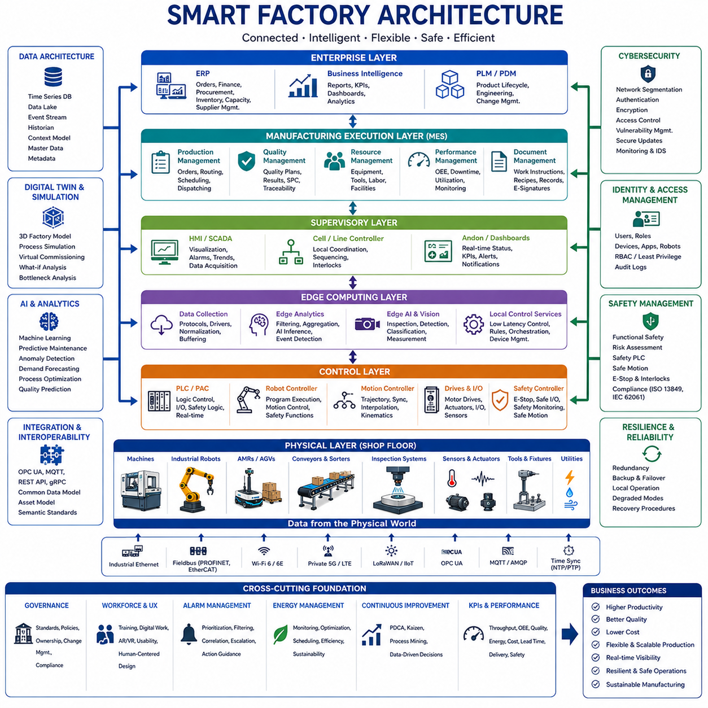
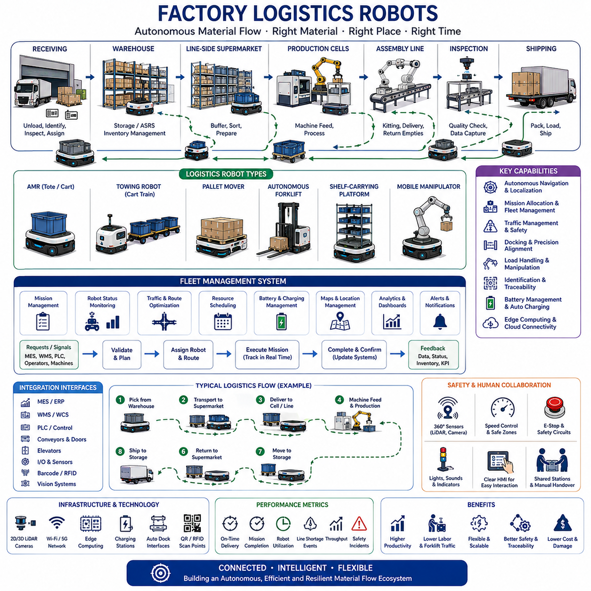
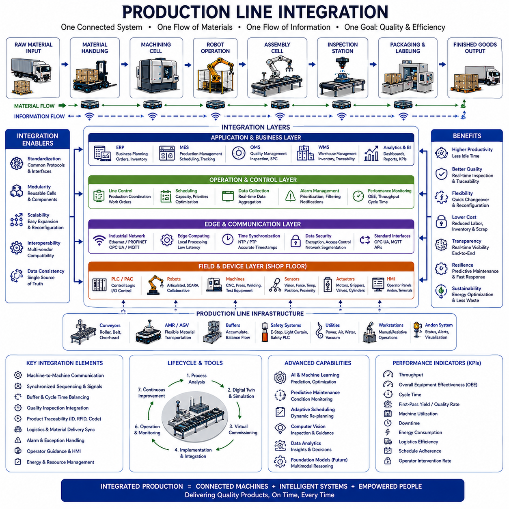
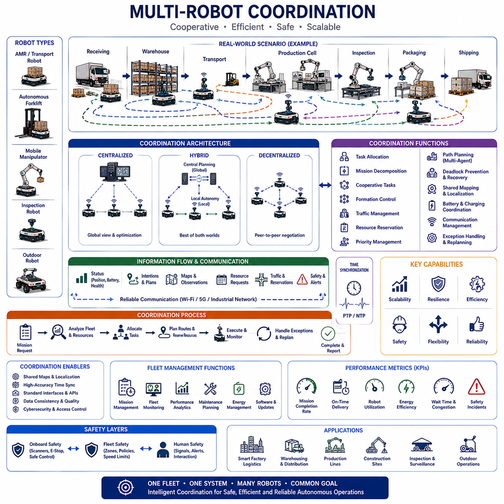
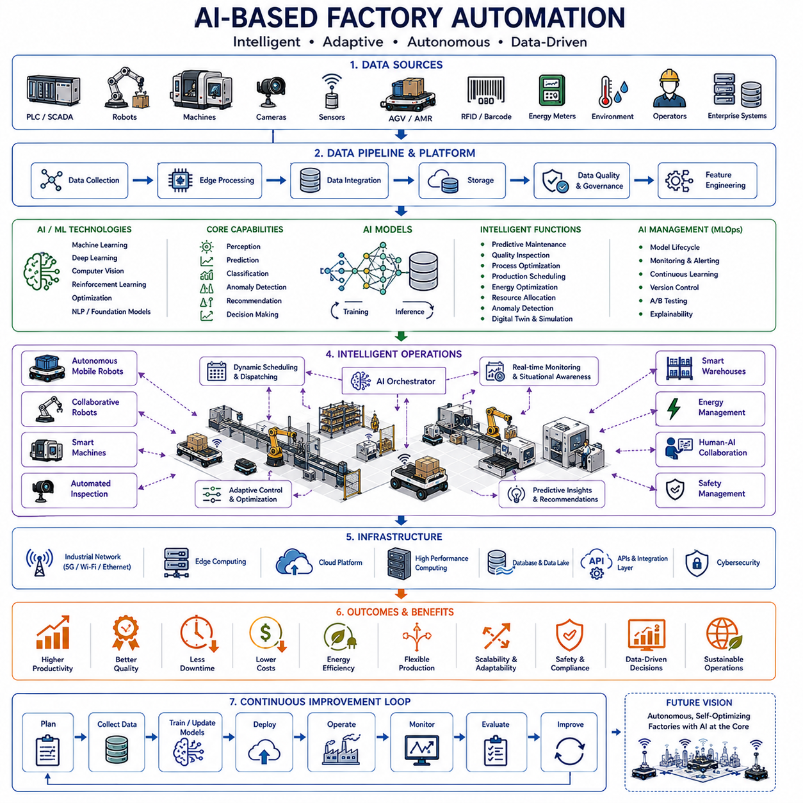
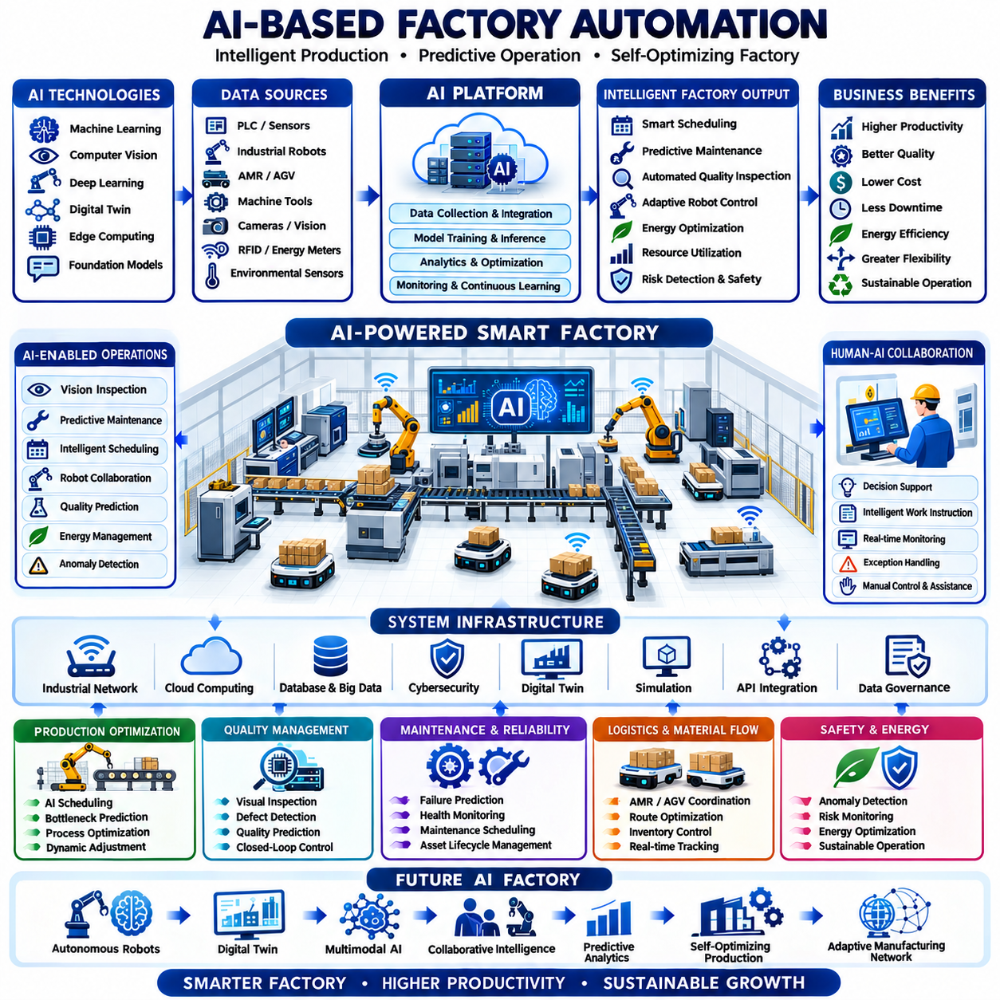

**Volume 01. AMR Foundations and System Architecture**

# 17. Smart Factory AMR · 스마트 팩토리 AMR

## 17.01 Smart Factory Architecture · 스마트 팩토리 아키텍처

{width="7.268055555555556in" height="7.268055555555556in"}

Smart factory architecture is the integrated technical structure that connects production equipment, robots, sensors, software platforms, workers, and business systems into one coordinated manufacturing environment. Its purpose is to make production processes visible, connected, adaptable, and data-driven. Rather than treating machines as isolated assets, the architecture enables continuous information exchange from the shop floor to enterprise systems, allowing decisions to be made with current operational data.

A smart factory is commonly organized as a layered system because manufacturing functions operate at different time scales and levels of responsibility. Physical devices execute motion and process commands, control systems maintain deterministic operation, edge platforms process local data, manufacturing systems coordinate production, and enterprise applications manage orders and resources. Clear separation between these layers improves scalability, maintainability, cybersecurity, and integration across equipment from different vendors.

The physical layer contains production machines, industrial robots, Autonomous Mobile Robots, conveyors, tooling, sensors, actuators, inspection systems, and utility equipment. This layer performs the actual transformation and movement of materials. Temperature, vibration, torque, position, power consumption, product status, and machine condition are continuously measured. Reliable physical-layer design is essential because inaccurate sensing or unstable control cannot be corrected by higher-level software.

The control layer includes programmable logic controllers, robot controllers, motion controllers, safety controllers, motor drives, and embedded systems. These components execute deterministic logic with predictable timing and directly manage machinery. Control software handles sequences, interlocks, synchronization, emergency responses, and machine states. Smart factory architecture must preserve real-time control independence even when higher-level networks or cloud services become temporarily unavailable.

The supervisory layer provides local coordination and visualization through Human-Machine Interfaces, Supervisory Control and Data Acquisition systems, cell controllers, and production dashboards. Operators use these tools to monitor machine status, acknowledge alarms, adjust approved parameters, and inspect process trends. The supervisory layer converts low-level signals into understandable operational information while ensuring that manual actions remain consistent with safety and production rules.

Edge computing connects real-time equipment with data-intensive applications. Industrial edge computers collect and normalize signals, execute local analytics, run artificial intelligence models, and filter information before transmission to central platforms. Edge processing reduces latency and network load while supporting continued operation during communication interruptions. It is especially important for visual inspection, anomaly detection, predictive maintenance, robot perception, and high-frequency process monitoring.

Manufacturing Execution Systems form the central operational layer of the smart factory. They coordinate production orders, routing, work instructions, labor, equipment status, quality records, and material traceability. The system translates enterprise-level production plans into executable shop-floor activities and receives real-time feedback from machines and operators. This closed information loop allows planners to understand actual progress instead of relying only on scheduled assumptions.

Enterprise Resource Planning systems manage business-level information such as customer orders, procurement, inventory, finance, capacity, and supplier coordination. Smart factory architecture integrates enterprise planning with manufacturing execution so that business decisions reflect real production conditions. Material shortages, delayed processes, quality problems, or equipment failures can therefore influence schedules and customer commitments before disruptions become more severe.

Warehouse Management Systems and Warehouse Control Systems coordinate storage, replenishment, picking, transport, and material presentation. They communicate with Autonomous Mobile Robots, automated storage systems, conveyors, and production lines to ensure that the correct material arrives at the required place and time. This integration supports just-in-time production, reduces excessive inventory, and prevents machines from waiting because components or tools are unavailable.

Industrial robots and Autonomous Mobile Robots serve different but complementary roles. Fixed robots perform precise operations such as welding, assembly, painting, machining, and inspection, while mobile robots connect cells by transporting materials, tools, and finished products. A smart factory architecture coordinates both categories through standardized missions, status interfaces, and safety rules. The result is a flexible production network rather than a collection of disconnected automated stations.

Production cells are often designed as modular functional units containing machines, robots, sensors, local control, and defined digital interfaces. Modular cells can be rearranged, duplicated, or upgraded without redesigning the complete factory. Standard mechanical, electrical, communication, and software interfaces allow new cells to join the production system more quickly. This modularity is essential for high-mix manufacturing and frequent product changeovers.

Communication architecture provides the data pathways connecting machines, controllers, edge platforms, manufacturing systems, and cloud services. Industrial Ethernet, fieldbus networks, wireless communication, private cellular networks, and message-oriented middleware may coexist within one facility. The architecture must distinguish between time-critical control traffic and non-real-time analytics traffic. Deterministic networks are required where timing directly affects motion, safety, or process quality.

Interoperability depends on common data models and standardized interfaces. Equipment from different suppliers often represents status, alarms, recipes, and production data in incompatible forms. A smart factory requires semantic definitions that describe what each value means, not only how it is transmitted. Unified naming, asset models, interface contracts, and metadata reduce custom integration work and make factory information reusable across monitoring, analytics, and optimization applications.

Data architecture determines how operational information is collected, stored, contextualized, and used. Raw machine signals are combined with product identifiers, process steps, timestamps, equipment configuration, operator actions, and quality results. Context transforms isolated measurements into meaningful production records. Historical databases, time-series platforms, data lakes, and event streams support different analytical needs while preserving traceability from raw material to finished product.

Time synchronization is critical because smart factory decisions depend on events collected from many distributed systems. Machines, robots, cameras, sensors, and servers must record data using a consistent time reference. Accurate timestamps allow engineers to reconstruct failures, align inspection images with process conditions, analyze cause-and-effect relationships, and compare events across production cells. Poor synchronization can make correct data appear contradictory or hide the true sequence of an incident.

Digital identity and traceability connect each material, component, tool, machine, process, and product to a persistent information record. Barcodes, RFID tags, serial numbers, and digital identifiers allow the factory to track where an item came from, which process it completed, and which parameters were applied. Complete traceability supports quality investigation, regulatory compliance, recall management, warranty analysis, and continuous process improvement.

Digital twins provide virtual representations of machines, robots, production cells, material flow, and entire factories. They combine engineering models with operational data to support simulation, monitoring, and prediction. Engineers can evaluate layout changes, robot reachability, production schedules, and bottlenecks before modifying the physical system. During operation, synchronized digital twins help compare expected and actual behavior and identify emerging performance deviations.

Simulation is used before deployment and throughout the factory lifecycle. Discrete-event simulation evaluates throughput, queues, resource utilization, and material flow, while physics-based simulation validates robot motion, machine interaction, and collision risk. Virtual commissioning tests control logic against simulated equipment before physical installation. These methods reduce commissioning time, reveal integration errors early, and allow production changes to be evaluated with less operational disruption.

Artificial intelligence enhances smart factory architecture by detecting patterns that traditional rule-based systems may miss. Machine learning models identify product defects, predict equipment failure, estimate remaining useful life, optimize process parameters, and forecast material demand. Artificial intelligence should operate within defined engineering constraints, with input quality monitoring, version control, validation, and fallback behavior to prevent unreliable predictions from directly creating unsafe production actions.

Computer vision systems perform surface inspection, dimensional measurement, component verification, object tracking, and worker-safety monitoring. Cameras are integrated with lighting, triggering, calibration, edge computing, and production data. Inspection results must be connected to product identity and process history so that defects can be traced to specific equipment or operating conditions. Successful vision architecture therefore requires more than installing a camera and training a model.

Predictive maintenance combines sensor data, operating history, maintenance records, and equipment knowledge to identify degradation before failure. Vibration, temperature, electrical current, pressure, lubrication condition, and cycle counts provide indicators of mechanical health. Smart factory systems convert these signals into maintenance recommendations and schedule work during planned production windows. This reduces unexpected downtime while avoiding unnecessary replacement of healthy components.

Quality management is embedded across the architecture rather than treated as a final inspection step. Process parameters, machine condition, material data, operator actions, and inspection results are continuously evaluated. Statistical process control detects drift, while artificial intelligence identifies complex defect patterns. When quality limits are exceeded, the system can stop production, isolate affected products, adjust parameters, or request engineering review according to approved procedures.

Functional safety remains independent from ordinary production optimization. Safety controllers, emergency-stop circuits, protective devices, safe motion functions, and access controls protect people and equipment even when standard automation software fails. Smart factory integration may exchange safety status for monitoring, but higher-level software must not bypass certified safety functions. Clear separation between operational control and safety control is a fundamental architectural principle.

Cybersecurity must protect every layer from sensors and controllers to cloud platforms. Device authentication, network segmentation, encrypted communication, secure configuration, access control, audit logging, vulnerability management, and signed software updates reduce exposure to cyber threats. Legacy machines require special protection because they may lack modern security features. Security architecture should assume that connectivity increases both operational value and potential attack paths.

Identity and access management ensures that workers, engineers, applications, robots, and devices receive only the permissions required for their responsibilities. Operators may adjust approved production settings, while maintenance engineers access diagnostic functions and administrators manage system configuration. Machine-to-machine communication also requires authenticated identities. Role-based control and complete audit records reduce accidental changes and improve accountability during investigations.

Cloud platforms provide centralized analytics, long-term storage, cross-site comparison, and large-scale artificial intelligence services. However, essential factory operation should not depend entirely on remote connectivity. Real-time control, local safety, immediate monitoring, and critical production functions remain at the plant or edge level. The cloud complements local systems by supporting fleet-wide optimization, model training, software distribution, and enterprise reporting across multiple factories.

Human-centered design is essential because smart factories still depend on operators, technicians, engineers, planners, and managers. Interfaces should present actionable information instead of overwhelming users with raw data. Work instructions, alarms, maintenance guidance, and production status must be clear and role-specific. Augmented reality, mobile devices, and digital workstations can support complex tasks, but they must improve decision quality rather than simply introduce more technology.

Alarm management prevents operators from being overloaded by large numbers of low-value notifications. Events should be prioritized according to safety, production impact, quality risk, and required response time. Related alarms can be grouped into one understandable incident, while repeated or transient alerts should be filtered appropriately. Effective alarm architecture helps operators identify the root problem quickly instead of reacting to many secondary symptoms.

Resilience is the ability of the factory to continue operating or recover safely when failures occur. Redundant networks, backup controllers, local data buffering, failover servers, alternative material routes, and manual fallback procedures reduce disruption. The architecture should define degraded operating modes for communication loss, sensor failure, software malfunction, or unavailable cloud services. Recovery plans must be tested rather than assumed to work during a real incident.

Scalability allows the factory to expand from one connected production cell to a complete multi-site manufacturing network. Standard interfaces, reusable services, modular software, common data models, and automated deployment pipelines reduce the effort required to add new equipment. A scalable architecture avoids solutions that work only for a demonstration but become difficult to maintain when thousands of devices and many production lines are connected.

System governance defines ownership, standards, configuration rules, change approval, and responsibility boundaries. Mechanical, electrical, control, information-technology, operational-technology, robotics, data, artificial intelligence, quality, and safety teams must coordinate decisions. Without governance, individual projects may introduce incompatible protocols, duplicate databases, and uncontrolled software. Architectural governance ensures that local innovation remains aligned with factory-wide strategy.

Deployment should proceed through controlled phases beginning with process analysis and architecture definition. A pilot cell validates data collection, connectivity, system integration, user interfaces, cybersecurity, and operational value. Lessons from the pilot are converted into reusable standards before wider rollout. Expansion should prioritize measurable business problems rather than connecting equipment without a clear purpose. Each phase must include validation, training, maintenance planning, and performance review.

Performance measurement should combine production, equipment, quality, logistics, energy, and human factors. Throughput, cycle time, Overall Equipment Effectiveness, first-pass yield, downtime, energy per product, material waiting time, schedule adherence, and intervention frequency provide complementary views. Metrics must be interpreted in context because improving one value can reduce another. Smart factory architecture should support balanced optimization rather than isolated local improvements.

Energy management integrates machine consumption, building utilities, production schedules, battery systems, and renewable energy sources. High-energy processes can be scheduled according to demand limits or energy availability, while idle equipment can enter low-power modes. Detailed energy data reveals inefficient machines and abnormal consumption. Connecting energy performance to production output enables meaningful measures such as energy consumed per acceptable product rather than total power alone.

The future smart factory will combine adaptive robotics, multimodal artificial intelligence, digital twins, autonomous material flow, and distributed decision-making. Systems will understand production objectives, detect changes, and recommend or execute responses within approved limits. Human experts will remain responsible for strategy, exception handling, and governance, while machines manage increasingly complex routine coordination. The result will be a resilient, flexible, and continuously improving cyber-physical manufacturing ecosystem.

## 17.02 Factory Logistics Robots · 공장 물류 로봇

{width="7.268055555555556in" height="7.268055555555556in"}

Factory logistics robots connect receiving areas, warehouses, supermarkets, production cells, assembly lines, inspection stations, and shipping zones through an autonomous material-flow network. Their primary purpose is to deliver the correct material to the correct location at the required time while removing empty containers and finished goods. By replacing repetitive manual transport, these robots improve production continuity, reduce unnecessary walking and forklift traffic, and create a more predictable internal logistics process.

Traditional factory logistics often depends on workers, forklifts, tugger trains, and fixed conveyors. These methods can be effective, but they become difficult to adapt when product variants, production volumes, routes, and workstation layouts change. Autonomous logistics robots provide greater flexibility because missions and paths can be modified through software. This allows manufacturers to reorganize production areas, introduce new products, and adjust material-supply policies without rebuilding extensive physical infrastructure.

Factory logistics robots include Autonomous Mobile Robots, automated guided vehicles, towing robots, pallet movers, autonomous forklifts, shelf-carrying platforms, and mobile manipulators. Small AMRs transport bins, cartons, and tools, while towing systems move several carts in one mission. Pallet robots handle heavier unit loads, and autonomous forklifts perform floor-to-rack operations. Mobile manipulators add robotic arms so that one platform can navigate, pick, place, inspect, and interact with machines.

The receiving area is often the starting point of the factory logistics flow. Incoming components are unloaded, identified, inspected, and assigned to storage or production destinations. Logistics robots transport pallets, containers, or totes from receiving docks to warehouses, quality-inspection zones, or line-side supermarkets. Integration with barcode, RFID, and enterprise systems ensures that each load is correctly identified before movement begins and that its location remains visible throughout the process.

Warehouses and automated storage areas supply material to production according to schedules and actual consumption. Factory logistics robots retrieve prepared loads from storage interfaces and deliver them to line-side locations. They may also transfer materials between conventional racks, automated storage and retrieval systems, conveyors, and production cells. Reliable coordination prevents materials from arriving too early, creating congestion, or too late, causing machines and workers to wait.

Line-side material supply requires accurate timing because production stations often have limited storage space. Robots deliver components in small quantities according to takt time, consumption signals, or replenishment requests. Empty containers are collected during return trips to reduce unnecessary travel. This closed-loop process supports lean manufacturing by minimizing line-side inventory while maintaining sufficient material availability for uninterrupted production.

A line-side supermarket acts as an intermediate buffer between the central warehouse and production stations. Materials are organized by product, process, or route before robots distribute them to individual work areas. The supermarket reduces long-distance transport and allows frequent, standardized replenishment cycles. Logistics robots can follow milk-run patterns or dynamically respond to consumption, depending on production stability and the required level of flexibility.

Towing robots are widely used when several carts must be transported together. A towing AMR connects to a train of carts and follows a defined logistics route through multiple pickup and delivery points. Automatic couplers can reduce manual handling, while sensors confirm that carts are correctly connected. Route design must consider total vehicle length, turning radius, reversing behavior, stopping distance, and the stability of every cart within the train.

Autonomous forklifts automate pallet transportation and rack interaction. They must identify pallets, align forks, control mast height, and verify that the load is securely engaged before moving. Cameras, laser scanners, depth sensors, and load sensors support precise handling. Because forklifts carry loads at different heights, safety planning must consider visibility, center of gravity, lateral stability, turning speed, and the possibility of falling or damaged goods.

Pallet-moving robots provide a simpler alternative when loads remain close to floor level. These robots may enter beneath pallets, lift them slightly, or connect to dedicated load carriers. Their low profile and compact structure support transport through production areas where conventional forklifts would require more space. Standardized pallets and docking interfaces improve reliability, while load detection prevents movement when the payload is misaligned or exceeds the permitted capacity.

Mobile manipulators combine mobility and manipulation to automate logistics tasks that require physical interaction. A robotic arm mounted on an AMR can load parts into machines, remove finished items, transfer trays, operate doors, or inspect components. Such systems require coordinated control of the mobile base, arm, gripper, perception sensors, and safety functions. Accurate docking is particularly important because manipulation often requires much higher positional precision than normal transportation.

Factory logistics robots depend on accurate localization and mapping. Two-dimensional LiDAR, three-dimensional LiDAR, cameras, wheel odometry, and inertial sensors estimate robot position within the factory. Maps represent roads, intersections, restricted areas, workstations, charging zones, and docking points. Localization must remain stable near repetitive machinery, reflective surfaces, temporary storage, and changing production layouts. Confidence monitoring allows the robot to stop safely when position reliability becomes insufficient.

Navigation software calculates routes and responds to people, forklifts, carts, and temporary obstacles. Global planning selects an efficient path through the factory, while local planning adjusts motion in real time. Route cost may include distance, traffic density, aisle width, safety restrictions, load condition, and production priority. Robots should avoid unnecessary detours but must never sacrifice predictable and safe behavior simply to reduce travel time.

Traffic management becomes essential when many robots share intersections and narrow aisles. A fleet system reserves critical segments, assigns priorities, and prevents multiple robots from entering constrained areas simultaneously. It may reroute low-priority missions around congestion or hold robots at safe waiting locations. Effective traffic control reduces deadlocks, queue formation, and interference with workers while maintaining stable material flow throughout the facility.

Mission allocation determines which robot should perform each transport request. The system considers robot location, payload capacity, attachment type, battery state, maintenance condition, current mission, and expected travel time. A nearby robot is not always the best choice if it lacks the required lift mechanism or will soon need charging. Multi-criteria allocation improves fleet utilization and reduces the probability of delayed or failed deliveries.

Factory logistics missions are usually generated by Manufacturing Execution Systems, Warehouse Management Systems, production controllers, operator requests, or equipment signals. A material shortage at a workstation may automatically create a replenishment request. The logistics system validates pickup and delivery conditions, selects a suitable robot, and tracks execution. Completion is confirmed only after the correct material is delivered and the receiving station acknowledges the transfer.

Integration with production equipment allows logistics robots to behave as part of the manufacturing process rather than as independent transport devices. Machines can report when raw material is needed or when finished goods are ready for collection. Robots exchange readiness, docking, transfer, and completion signals with conveyors, automatic doors, elevators, and workstations. Clear interface definitions prevent a robot from entering a station before equipment is safe and prepared.

Docking requires greater precision than normal navigation because loads must align with racks, conveyors, machines, chargers, or transfer mechanisms. Robots may use reflectors, fiducial markers, LiDAR features, cameras, mechanical guides, or local positioning sensors for final alignment. Docking logic should verify position, orientation, station readiness, and obstacle clearance before transfer. Failed docking attempts require controlled recovery rather than repeated uncontrolled motion.

Material identification and traceability are necessary to prevent delivery errors. Barcodes, QR codes, RFID tags, electronic labels, and digital load records link physical materials to production orders. The robot or station confirms the identity of each container before pickup and after delivery. Traceability records include location, mission time, robot identity, transfer status, and exceptions. These records support inventory accuracy, quality investigations, and production genealogy.

Payload design strongly influences logistics performance. Containers, racks, carts, and pallets should be compatible with robot dimensions, lift mechanisms, couplers, and docking stations. Poorly designed load carriers can shift during acceleration, block sensors, or create unstable weight distribution. Standardized payload interfaces allow one robot platform to support multiple applications while reducing mechanical variation, training requirements, spare parts, and maintenance complexity.

Safety architecture must account for robot mass, speed, payload, stopping distance, and the presence of workers. Safety scanners, emergency-stop circuits, protective zones, speed monitoring, brake control, warning devices, and redundant safety logic protect people and equipment. Loaded robots may require slower speeds and larger safety zones than empty robots. Turning and reversing maneuvers need additional protection because the payload may extend beyond the mobile base.

Human-robot interaction is important because workers frequently cross robot routes and exchange containers at shared stations. Lights, displays, sounds, and projected indicators communicate robot direction, mission state, warnings, and required human actions. Interfaces should be easy to understand without specialized training. Operators need simple methods to request transport, confirm delivery, pause a robot, report an exception, or obtain assistance when a load cannot be transferred.

Charging strategy determines how much of the fleet remains available. Robots may use scheduled charging, opportunity charging, automatic battery exchange, or high-power fast charging. The fleet manager evaluates battery level, expected workload, charger occupancy, and future missions before sending a robot to charge. Charging too early reduces availability, while charging too late risks mission interruption. Battery-health monitoring helps maintain long-term range and reliability.

Edge computing supports low-latency navigation, perception, docking, and safety functions directly on the robot. Local controllers continue essential operation even when factory networks or cloud services are unavailable. Central servers coordinate missions, traffic, maps, analytics, and software management. This distributed architecture separates time-critical autonomy from business-level orchestration while allowing fleet-wide information to support optimization and monitoring.

Wireless communication may use industrial Wi-Fi, private cellular networks, or other factory communication systems. Coverage must remain stable in areas containing metal structures, moving equipment, machines, and electromagnetic interference. Robots should detect declining communication quality and enter safe behavior when required. Network design must consider roaming, bandwidth, latency, device density, redundancy, and cybersecurity rather than assuming that ordinary office wireless coverage is sufficient.

Digital twins and simulation help engineers design logistics systems before deployment. Virtual models represent factory layouts, routes, robots, carts, workstations, charging stations, and production demand. Simulation estimates fleet size, traffic congestion, waiting time, throughput, and resource utilization. Alternative layouts and dispatch rules can be compared without interrupting real production. Operational data can later update the model for continuous improvement.

Performance evaluation should focus on complete material-flow outcomes. Important indicators include mission completion rate, on-time delivery, average transport time, line shortage events, robot utilization, traffic delay, empty travel, docking success, charging time, and operator intervention. High robot speed alone does not guarantee better logistics. A slower but balanced fleet may outperform a faster fleet that creates congestion or delivers materials too early.

Reliability engineering is essential because a failed logistics robot can interrupt production. Condition monitoring tracks battery health, motor current, wheel wear, brakes, steering, lift mechanisms, couplers, sensors, communication, and onboard computers. Predictive maintenance identifies gradual degradation before it causes mission failure. Fleet-level maintenance planning keeps sufficient transport capacity available while robots are inspected, repaired, or updated.

Deployment should begin with a detailed study of material flow, production demand, routes, payloads, station interfaces, and manual work. Pilot operation validates navigation, safety, docking, communication, and system integration in a limited area. Data and operator feedback are used to improve procedures before expansion. Successful scaling requires standardized stations, clear ownership, trained support personnel, spare parts, and defined exception-handling processes.

The economic value of factory logistics robots comes from more than reducing transport labor. They improve production continuity, inventory visibility, workplace safety, process traceability, and flexibility during product changes. They can also reduce forklift traffic and damage to materials. The strongest return appears when production planning, material presentation, payload design, and information systems are redesigned together rather than treating the robot as a direct replacement for a worker.

Future factory logistics robots will use multimodal artificial intelligence, improved manipulation, shared fleet learning, and adaptive mission planning. Robots will understand more complex material requests, recognize unexpected load conditions, and coordinate automatically with machines and workers. Heterogeneous fleets of AMRs, towing robots, forklifts, and mobile manipulators will operate through common orchestration platforms, creating flexible and continuously optimized material-flow networks for next-generation manufacturing.

## 17.03 Production Line Integration · 생산 라인 통합

{width="7.268055555555556in" height="7.268055555555556in"}

Production line integration is the systematic coordination of machines, robots, logistics systems, inspection equipment, software platforms, and human operators into one synchronized manufacturing process. Rather than optimizing individual workstations independently, integration focuses on ensuring that every process exchanges information, materials, and control signals efficiently. A well-integrated production line minimizes idle time, reduces manual intervention, improves product quality, and enables consistent manufacturing performance across the entire factory.

Modern manufacturing systems consist of many specialized production cells, each performing different operations such as machining, assembly, welding, painting, testing, packaging, or inspection. Without proper integration, these cells behave as isolated islands of automation, creating unnecessary waiting, duplicated work, inconsistent product tracking, and communication delays. Production line integration transforms separate automation systems into a unified production ecosystem where materials and information flow continuously from one process to the next.

Integration begins with understanding the complete manufacturing process rather than individual equipment. Engineers analyze product flow, process dependencies, material consumption, production rates, cycle times, quality checkpoints, and logistics requirements before designing interfaces between systems. Every production station becomes part of an overall manufacturing strategy where local optimization supports global production objectives instead of creating bottlenecks elsewhere in the line.

Material flow forms the physical backbone of production line integration. Raw materials enter the manufacturing process, move through multiple transformation stages, undergo quality verification, and eventually become finished products. Conveyors, Autonomous Mobile Robots, automated guided vehicles, pallet transfer systems, elevators, robotic loaders, and manual workstations cooperate to ensure that every process receives the correct material at the correct time without unnecessary transportation or excessive inventory.

Information flow is equally important because production decisions depend on accurate operational data. Every machine reports production status, operating conditions, alarms, quality measurements, production counts, and maintenance information. Higher-level manufacturing systems combine this information to monitor overall production progress, detect abnormalities, schedule material delivery, and coordinate downstream operations. Reliable information exchange allows the entire production line to respond intelligently to changing conditions.

Machine-to-machine communication enables equipment to cooperate without continuous human intervention. A machining center may notify a robot that a component is ready for unloading, while the robot confirms successful transfer before the next machining cycle begins. Downstream equipment receives completion signals and prepares automatically for incoming materials. These synchronized interactions reduce waiting time while preventing collisions, incomplete transfers, and unnecessary operator involvement.

Programmable Logic Controllers remain the primary control devices for deterministic production sequencing. They execute machine logic, coordinate sensors and actuators, manage interlocks, and exchange digital signals with neighboring equipment. Production line integration requires standardized communication between PLCs regardless of equipment manufacturers. Well-defined interfaces simplify commissioning, maintenance, future upgrades, and system expansion while reducing engineering complexity.

Robot integration extends beyond robot programming itself. Industrial robots interact with fixtures, machine tools, vision systems, conveyors, logistics robots, safety systems, and production databases. Each robotic operation must synchronize with surrounding equipment so that materials arrive correctly, processing finishes safely, and downstream operations receive consistent production information. Robot controllers therefore become important participants within the overall production architecture rather than isolated automation devices.

Autonomous Mobile Robots increasingly replace fixed conveyors for flexible material transportation. Instead of installing permanent transport infrastructure, manufacturers allow mobile robots to connect production cells dynamically. The fleet management system coordinates transport requests according to production priorities while avoiding traffic congestion. This flexibility allows production layouts to evolve without extensive mechanical reconstruction and supports high-mix manufacturing with changing product routes.

Conveyors continue to provide highly efficient transport for repetitive, high-volume production. Roller conveyors, belt conveyors, overhead conveyors, pallet transfer systems, and accumulation conveyors each support different manufacturing requirements. Production line integration ensures that conveyor movement is synchronized with machine readiness, robot operation, and product availability. Intelligent buffering prevents upstream processes from stopping unnecessarily when downstream stations experience temporary delays.

Buffer stations stabilize production by absorbing short-term variations between neighboring processes. Machines rarely operate with identical cycle times, making temporary product storage necessary to prevent continuous production interruptions. Properly designed buffers maintain smooth material flow while minimizing work-in-process inventory. Buffer management algorithms determine when products should wait, bypass congested stations, or receive priority transportation to maintain balanced production performance.

Cycle time balancing represents one of the most important integration objectives. If one workstation operates significantly slower than others, the entire production line eventually becomes limited by that bottleneck. Engineers analyze processing times, robot motion, logistics delays, operator activities, and equipment utilization to achieve balanced production capacity. Dynamic balancing methods may reassign tasks or adjust scheduling when production demand changes throughout the day.

Production scheduling coordinates manufacturing orders according to customer demand, available resources, material inventory, equipment capacity, and workforce availability. Integrated production lines continuously exchange operational status with Manufacturing Execution Systems so schedules reflect actual production conditions rather than theoretical assumptions. When equipment failures or urgent customer orders occur, scheduling systems adapt production priorities while minimizing disruption across the remaining manufacturing processes.

Manufacturing Execution Systems act as the operational coordinator connecting enterprise planning with physical production. They distribute work orders, monitor production progress, manage product genealogy, record quality information, coordinate operator instructions, and collect manufacturing data. Integration with machines, robots, logistics systems, and inspection stations allows the Manufacturing Execution System to maintain complete visibility throughout the production lifecycle while supporting real-time decision making.

Quality inspection should be integrated throughout production instead of being performed only after manufacturing finishes. Vision systems, dimensional measurement equipment, leak testing, electrical testing, and functional verification stations continuously evaluate product quality. Inspection results immediately influence production decisions by rejecting defective components, adjusting process parameters, or triggering engineering investigation. Early detection reduces scrap while preventing defective products from reaching downstream operations.

Machine vision has become an essential integration technology because visual inspection often replaces manual verification. Cameras identify components, measure dimensions, verify assembly completeness, detect surface defects, and guide robotic manipulation. Integration with production databases links inspection results to product identity, process history, operator information, and equipment settings. This traceability supports continuous improvement while simplifying root-cause analysis during quality investigations.

Product traceability follows every component throughout manufacturing. Serial numbers, RFID tags, Data Matrix codes, QR codes, or digital identifiers associate products with process history, equipment configuration, inspection results, operator actions, and material batches. Complete traceability enables manufacturers to investigate quality issues rapidly, support regulatory compliance, perform targeted recalls, and analyze long-term manufacturing performance using historical production information.

Production line integration increasingly depends on standardized industrial communication technologies. Protocols such as OPC UA, MQTT, Industrial Ethernet, PROFINET, EtherNet/IP, and EtherCAT enable reliable information exchange between machines, controllers, software platforms, and enterprise systems. Standardized interfaces reduce custom engineering while allowing equipment from multiple manufacturers to operate within a unified production environment.

Time synchronization ensures that production events recorded by different machines represent the same physical sequence. Controllers, industrial computers, robots, cameras, sensors, and inspection equipment synchronize their internal clocks using technologies such as Network Time Protocol or Precision Time Protocol. Consistent timestamps simplify event reconstruction, production analysis, fault diagnosis, and digital traceability because information collected from different sources can be accurately aligned.

Digital twins provide virtual representations of production lines throughout design, commissioning, operation, and continuous improvement. Engineers simulate equipment interactions, robot trajectories, material flow, throughput, and scheduling policies before installing physical equipment. During operation, production data updates the digital twin continuously, allowing engineers to compare expected and actual performance while evaluating optimization opportunities without interrupting manufacturing.

Virtual commissioning reduces project risk by validating control software before physical installation begins. PLC programs, robot controllers, Human-Machine Interfaces, and production logic interact with simulated equipment instead of real machines. Integration problems, communication errors, sequencing mistakes, and safety issues can therefore be corrected earlier when engineering modifications remain relatively inexpensive and production schedules are not yet affected.

Artificial intelligence expands production line integration beyond traditional rule-based automation. Machine learning predicts equipment failures, optimizes process parameters, forecasts production demand, identifies abnormal operating patterns, and supports intelligent scheduling. Foundation models may eventually coordinate multiple manufacturing systems through natural language reasoning and multimodal understanding, enabling increasingly autonomous production supervision while maintaining engineering constraints and operational safety.

Predictive maintenance integrates operational data from motors, gearboxes, bearings, conveyors, robots, sensors, hydraulic systems, pneumatic equipment, and electrical components. Continuous monitoring identifies gradual degradation before failures interrupt production. Maintenance activities can therefore be scheduled during planned production windows instead of emergency shutdowns. Integration between maintenance systems and production planning minimizes operational disruption while extending equipment life.

Functional safety remains independent from production optimization. Emergency-stop systems, safety PLCs, protective scanners, interlocked doors, light curtains, safe robot motion, and access control mechanisms continue protecting personnel regardless of production status. Production line integration may exchange safety information for monitoring purposes, but operational software must never override certified safety functions or compromise protective system integrity.

Cybersecurity has become an essential consideration because integrated production lines connect operational technology with enterprise information technology. Authentication, encrypted communication, network segmentation, access control, software integrity verification, audit logging, and secure update mechanisms protect manufacturing systems against cyber threats. Security architecture must support continuous production while preventing unauthorized modification of machines, robots, production data, and control systems.

Human operators remain essential participants within highly automated production lines. Workers supervise equipment, replenish materials, resolve exceptions, perform maintenance, inspect quality, and manage process changes. Human-Machine Interfaces should provide clear operational information, intuitive controls, prioritized alarms, and context-sensitive guidance. Effective integration improves human productivity rather than attempting to eliminate human participation entirely.

Alarm management prevents operators from becoming overwhelmed by excessive notifications. Integrated production systems prioritize alarms according to safety impact, production loss, equipment condition, and quality risk. Related alarms are grouped into meaningful operational events instead of appearing as isolated warnings. Intelligent alarm filtering enables maintenance personnel and production supervisors to identify root causes rapidly while minimizing unnecessary responses.

Energy management becomes increasingly valuable as integrated production systems monitor electricity consumption, compressed air usage, cooling systems, heating equipment, and renewable energy resources. Production schedules may adapt according to energy availability or demand charges while maintaining manufacturing objectives. Equipment entering idle conditions automatically reduces energy consumption, supporting sustainability without compromising operational readiness.

Performance measurement evaluates the production line as one coordinated manufacturing system instead of separate machines. Throughput, Overall Equipment Effectiveness, cycle time, first-pass yield, machine utilization, logistics efficiency, energy consumption, downtime, quality rate, operator intervention, and schedule adherence together provide a balanced understanding of manufacturing performance. Continuous improvement depends on interpreting these indicators collectively rather than optimizing individual metrics independently.

Scalability allows production lines to expand gradually as manufacturing demand increases. Modular production cells, standardized interfaces, reusable software components, configurable logistics systems, and flexible communication architecture enable new equipment to integrate without redesigning the complete factory. Scalable integration protects long-term investments while supporting product diversification, capacity expansion, and future technology adoption.

Successful deployment begins with comprehensive process analysis, interface definition, simulation, pilot validation, operator training, cybersecurity verification, and staged commissioning. Early production should focus on operational stability before maximizing throughput. Feedback collected from operators, maintenance personnel, quality engineers, and production managers supports continuous refinement after deployment. Well-managed implementation reduces project risk while accelerating the transition toward fully integrated manufacturing.

Future production line integration will combine autonomous robots, intelligent logistics, digital twins, multimodal artificial intelligence, adaptive scheduling, predictive analytics, and collaborative human-machine decision making into one unified manufacturing ecosystem. Instead of simply connecting equipment, future factories will continuously optimize material flow, information flow, resource utilization, quality performance, and operational resilience, creating manufacturing systems that become increasingly flexible, self-improving, and responsive to changing customer demands.

## 17.04 Multi-Robot Coordination · 다중 로봇 협조

{width="7.268055555555556in" height="7.268055555555556in"}

Multi-robot coordination is the organized cooperation of multiple autonomous robots that share missions, routes, workspaces, resources, and operational objectives. Instead of allowing each robot to act only according to its local plan, a coordination system considers the state of the entire fleet. This approach reduces conflicts, balances workload, improves resource utilization, and enables complex tasks that cannot be completed efficiently by a single robot.

A multi-robot system may include homogeneous robots with similar capabilities or heterogeneous robots designed for different functions. Homogeneous fleets simplify maintenance and task allocation, while heterogeneous fleets combine transport robots, autonomous forklifts, mobile manipulators, inspection robots, and outdoor platforms. Coordination must understand the capability, payload, speed, sensor configuration, attachment, and operating limits of every robot before assigning work.

Coordination architectures are commonly centralized, decentralized, or hybrid. A centralized fleet manager maintains global information and makes mission, traffic, and resource decisions for all robots. Decentralized robots communicate directly and negotiate local actions without relying on one controller. Hybrid architectures use central planning for factory-wide optimization while preserving local autonomy for navigation, obstacle avoidance, safety, and short-term recovery.

Centralized coordination provides a consistent operational view because one system receives robot status, mission progress, battery level, traffic conditions, and resource availability. It can optimize the complete fleet rather than individual robots. However, the central service must be scalable and fault tolerant. Communication loss or server failure should not cause unsafe motion, and robots must retain enough local intelligence to stop, wait, or complete limited actions safely.

Decentralized coordination is useful when communication is intermittent, the environment is highly dynamic, or the fleet must avoid dependence on one control point. Robots exchange intentions, positions, priorities, and local observations with nearby peers. They may negotiate passage through an intersection or divide tasks among themselves. Although this improves resilience, decentralized decisions can be more difficult to verify and may not achieve the same global efficiency as centralized optimization.

Hybrid coordination combines the strengths of both approaches. The fleet system assigns missions, reserves important resources, and plans high-level traffic, while individual robots determine detailed motion and react to immediate obstacles. If communication is temporarily unavailable, robots continue operating within defined limits. Once connectivity returns, local status and completed actions are synchronized with the central system to restore a consistent fleet-wide state.

Task allocation determines which robot should perform each mission. The decision may consider current location, travel distance, payload capacity, battery condition, equipment attachment, maintenance state, expected completion time, congestion, and future workload. Selecting only the nearest robot can create poor results when that robot lacks the correct capability or when using it would leave another high-priority area without available transport capacity.

Market-based task allocation allows robots or fleet agents to bid for missions according to estimated cost. Each bid may represent travel time, energy use, task duration, risk, or operational priority. The coordination system selects the most suitable proposal and updates assignments when conditions change. Auction methods can support flexible allocation, but bidding rules must prevent excessive communication, unstable reassignment, and unfair workload concentration.

Optimization-based allocation formulates fleet operation as a mathematical problem. The system minimizes objectives such as total travel, delay, energy use, missed deadlines, or unbalanced utilization while satisfying capacity, timing, safety, and resource constraints. Exact optimization can become computationally expensive for large fleets, so practical systems often combine heuristics, rolling-horizon planning, and local improvement methods to produce useful solutions within operational time limits.

Mission decomposition divides a complex objective into smaller actions that can be assigned to one or more robots. A production request may require material pickup, transport, machine loading, inspection, unloading, and return of an empty carrier. Different robots can perform separate steps according to their capabilities. Clear handover conditions are required so that each robot knows when the previous action is complete and when its own responsibility begins.

Cooperative missions require robots to work together on one task. Two or more robots may carry a long or heavy object, synchronize movement around a shared payload, or surround an inspection area from multiple viewpoints. These operations require accurate relative localization, synchronized control, reliable communication, and shared safety logic. Small timing or positioning errors can create large mechanical forces or unstable payload behavior.

Formation control maintains a defined geometric relationship among moving robots. Leader-follower methods allow one robot to establish a route while others maintain relative positions. Virtual-structure methods treat the group as one coordinated shape, and consensus methods allow robots to agree on motion through distributed communication. Formation control is useful for cooperative transport, monitoring, mapping, and coordinated inspection in structured or open environments.

Shared mapping improves fleet awareness by combining observations from multiple robots. Each robot contributes obstacle detections, changed layouts, blocked routes, and environmental features to a common representation. The coordination system must evaluate data quality, time, source, and confidence before updating shared maps. Incorrect or outdated observations should not immediately alter navigation for every robot without validation or consistency checks.

Shared localization allows robots to improve position estimates by using common landmarks, infrastructure sensors, or relative observations. One robot may detect another robot and estimate their geometric relationship, while fixed cameras or localization anchors provide additional references. These methods can improve performance in large factories, but they require consistent coordinate frames, accurate calibration, synchronized timestamps, and robust handling of uncertain measurements.

Traffic coordination prevents collisions, congestion, and deadlocks when many robots use the same aisles and intersections. The fleet manager may reserve route segments, assign intersection priorities, enforce one-way travel, and direct robots to waiting zones. Good traffic control considers future movement rather than only current position. A robot should not enter a narrow aisle unless the system confirms that it can exit without blocking another mission.

Path planning for multiple robots is more complex than planning each route separately. Individually optimal paths may conflict in time and space, creating delays or unsafe encounters. Multi-agent path finding calculates collision-free routes and schedules while considering robot size, speed, turning radius, and operational constraints. Large fleets often use prioritized planning, reservation tables, conflict-based search, or time-expanded networks to manage computational complexity.

Deadlock occurs when robots wait for resources held by one another and none can proceed. Examples include robots facing each other in a narrow corridor or several robots occupying an intersection while each waits for the next segment. Prevention methods establish resource ordering, limit entry to constrained zones, reserve complete passages, or maintain escape locations. Detection and recovery logic are also needed when unexpected obstacles create new deadlocks.

Livelock differs from deadlock because robots continue moving or replanning but make no meaningful progress. Two robots may repeatedly yield to each other, change routes, and return to the same conflict. Coordination rules require stable priority, waiting time limits, and progress monitoring to prevent this behavior. Recovery may temporarily freeze one robot, assign a new route, or escalate the issue to a higher-level traffic controller.

Priority management determines which missions or robots receive access to limited resources first. Emergency deliveries, safety-related inspections, production-critical materials, and low-battery robots may receive higher priority. Priority should not remain permanently fixed because low-priority missions could otherwise wait indefinitely. Aging mechanisms gradually increase waiting-task priority, creating a balance between urgent work and fair fleet operation.

Resource coordination extends beyond roads and intersections. Robots may share elevators, automatic doors, chargers, loading stations, conveyors, work cells, inspection equipment, and wireless channels. Each resource has capacity, timing, state, and safety constraints. The coordination system reserves resources, confirms readiness, monitors use, and releases them after completion. Incomplete resource state can cause delays or unsafe transfer attempts.

Battery coordination ensures that too many robots do not charge simultaneously while missions remain unserved. The fleet manager predicts energy consumption and assigns charging according to battery level, workload, charger availability, and future demand. Robots may exchange mission and charging responsibilities so that transport capacity remains stable. Battery-health information can also influence task selection because degraded batteries provide shorter range and different charging behavior.

Communication supports the exchange of position, velocity, mission status, planned routes, resource requests, map changes, and safety information. The system must define message frequency, latency limits, reliability requirements, and behavior during packet loss. Excessive communication can overload networks, while insufficient updates reduce coordination quality. Important commands require acknowledgement, sequence control, authentication, and duplicate-message handling.

Time synchronization is essential when robots coordinate motion or interpret shared events. Planned trajectories, resource reservations, sensor observations, and logs must use a consistent time reference. Precision Time Protocol or other synchronization methods may be required for tightly coupled operations. If clock accuracy is insufficient, the system should increase safety margins and avoid coordination strategies that depend on precise simultaneous action.

Local obstacle avoidance remains active even when a global route has been coordinated. People, carts, forklifts, and dropped materials can appear unexpectedly. Each robot responds to immediate hazards while respecting fleet reservations where possible. Local avoidance must not create uncontrolled route changes that conflict with other robots. Significant deviations should be reported so that the fleet manager can update traffic plans and resource allocations.

Safety coordination operates at both robot and fleet levels. Individual robots use scanners, emergency stops, speed monitoring, braking, and certified protective functions. The fleet system applies operating zones, traffic policies, speed restrictions, and access permissions across the environment. Higher-level coordination can improve safety by reducing conflicts, but it must never replace independent onboard protective functions or bypass certified safety systems.

Human interaction becomes more complex when workers share space with many coordinated robots. Visual signals, sounds, displays, floor projections, and clearly marked routes help people understand robot intentions. Fleet-wide behavior should remain consistent so that different robots do not communicate similar states in conflicting ways. Operators also require simple controls to pause zones, prioritize missions, release blocked resources, and request manual assistance.

Exception handling is necessary because real factories contain damaged loads, blocked aisles, missing pallets, failed doors, unavailable stations, and communication interruptions. Each exception should have a defined detection method, safe response, escalation rule, and recovery path. The system may reassign a mission, choose another station, request operator support, or isolate a robot. Recovery must preserve task history and prevent duplicate deliveries.

Fault tolerance allows the fleet to maintain useful operation when individual components fail. If one robot stops, its unfinished mission can be transferred to another compatible robot. If a charger or route becomes unavailable, the fleet adjusts plans. Redundant servers, local autonomy, persistent mission records, and health monitoring improve resilience. The system should distinguish temporary faults from conditions requiring maintenance or complete removal from service.

Cybersecurity protects coordination commands and shared fleet information from manipulation. Authentication confirms the identity of robots, operators, servers, and infrastructure devices. Encryption prevents interception, while authorization limits who can assign missions or change traffic policies. Network segmentation, audit logging, secure updates, anomaly detection, and software integrity checks reduce the risk that one compromised device can disrupt the entire fleet.

Simulation and digital twins help engineers evaluate multi-robot behavior before deployment. Virtual factories can reproduce robot routes, traffic density, task demand, charging, resource use, and communication delays. Engineers compare allocation rules, fleet sizes, intersection policies, and failure scenarios without affecting real production. Simulation results should be validated with field data because simplified models may not represent human movement or operational variability accurately.

Performance evaluation must consider fleet-level results rather than individual robot speed. Useful indicators include mission completion rate, average delay, on-time delivery, robot utilization, energy use, traffic waiting time, deadlock frequency, charger occupancy, resource utilization, communication reliability, and operator intervention. A coordinated fleet may intentionally slow individual robots if this improves total throughput, safety, and stability.

Scalability becomes challenging as the number of robots, missions, and shared resources increases. Communication traffic, route conflicts, optimization complexity, and database load can grow rapidly. Hierarchical control can divide the factory into regions while a global layer manages cross-region missions. Distributed services, modular interfaces, efficient state updates, and incremental planning allow the system to expand without redesigning the complete architecture.

Interoperability is required when robots from different vendors participate in one coordinated environment. Each platform may use different mission models, navigation systems, safety behavior, and status definitions. Common APIs, standardized message formats, capability descriptions, map conventions, and traffic interfaces reduce integration effort. An adapter layer can translate vendor-specific functions into a unified fleet representation.

Governance defines who owns fleet maps, mission rules, priority policies, safety zones, software versions, and interface changes. Production, logistics, robotics, information technology, safety, and maintenance teams must share clear responsibility. Uncontrolled local changes can create inconsistent behavior across the fleet. Formal change management, testing, documentation, and rollback procedures maintain operational stability as the system evolves.

Deployment should begin with realistic traffic and mission analysis rather than only counting robots. Engineers identify bottlenecks, shared resources, difficult intersections, communication shadows, emergency routes, and human activity patterns. A pilot validates mission allocation, navigation, safety, recovery, and system interfaces. Fleet size and coverage are expanded gradually while performance data is used to refine coordination policies.

Future multi-robot coordination will use artificial intelligence, shared learning, predictive traffic models, semantic mapping, and natural-language mission interpretation. Robots will reason about task context, human activity, resource condition, and likely future demand. Heterogeneous platforms will negotiate roles dynamically while operating under common safety and governance constraints, creating adaptive robotic ecosystems capable of coordinating increasingly complex manufacturing and logistics operations.

## 17.05 AI-Based Factory Automation · AI 기반 공장 자동화

{width="7.268055555555556in" height="7.268055555555556in"}{width="7.268055555555556in" height="7.268055555555556in"}

AI-based factory automation applies artificial intelligence throughout manufacturing operations to improve decision making, optimize production, enhance quality, reduce operational costs, and increase manufacturing flexibility. Unlike traditional automation that executes predefined logic under fixed conditions, AI-driven automation continuously learns from production data, adapts to changing environments, predicts future conditions, and supports autonomous decision making. As manufacturing systems become increasingly connected, artificial intelligence transforms factories from deterministic control systems into intelligent production ecosystems capable of continuous improvement.

Modern AI-based factories integrate production equipment, industrial robots, autonomous mobile robots, machine vision systems, programmable logic controllers, industrial sensors, manufacturing execution systems, enterprise resource planning systems, warehouse management systems, and cloud platforms into a unified digital infrastructure. Every machine continuously generates operational data describing process conditions, equipment status, production throughput, product quality, maintenance history, and environmental variables. Artificial intelligence converts these heterogeneous data sources into actionable knowledge that supports production optimization across the entire factory rather than within isolated production cells.

The foundation of AI-based automation is reliable industrial data collection. Thousands of sensors continuously monitor temperature, vibration, current, voltage, pressure, force, position, speed, torque, humidity, airflow, energy consumption, and machine status. Industrial communication networks aggregate these measurements while edge computing platforms preprocess sensor streams before forwarding relevant information to higher-level AI services. High-quality data with synchronized timestamps, accurate calibration, and consistent labeling forms the basis for trustworthy machine learning models.

Machine learning enables production systems to discover relationships that cannot easily be represented by manually designed rules. Supervised learning predicts quality outcomes, remaining useful life, production yield, or process parameters from historical examples. Unsupervised learning identifies hidden operational patterns, groups similar manufacturing behaviors, and detects previously unknown anomalies. Reinforcement learning continuously improves operational strategies by evaluating long-term production performance under changing manufacturing conditions while respecting operational constraints.

Computer vision has become one of the most influential AI technologies in factory automation. High-resolution cameras, three-dimensional sensors, hyperspectral imaging systems, thermal cameras, and structured-light sensors inspect products with speed and consistency beyond manual inspection. Vision models detect dimensional deviations, surface scratches, cracks, missing components, assembly defects, incorrect labeling, contamination, and packaging errors. AI continuously improves inspection robustness by learning from new defect examples collected during production.

AI-assisted quality inspection extends beyond simple defect classification. Modern systems estimate defect severity, identify probable root causes, recommend corrective actions, and correlate inspection results with machine settings, production batches, operators, raw materials, and environmental conditions. Statistical process control can be combined with machine learning to recognize gradual process drift before product quality exceeds specification limits. Early intervention significantly reduces scrap, rework, and warranty costs while improving customer satisfaction.

Predictive maintenance represents another major application of artificial intelligence in manufacturing. Traditional preventive maintenance replaces components according to fixed schedules regardless of actual condition, while predictive maintenance evaluates real equipment health using continuously collected operational data. AI models estimate bearing wear, gearbox degradation, motor health, lubrication condition, vibration signatures, thermal abnormalities, electrical faults, and remaining useful life. Maintenance activities are scheduled only when necessary, reducing unnecessary service while preventing unexpected equipment failures.

Process optimization applies AI to improve manufacturing efficiency without sacrificing product quality. Learning algorithms continuously evaluate production parameters such as machine speed, feed rate, cutting conditions, welding current, robot trajectory, curing temperature, injection pressure, conveyor speed, or assembly sequence. The optimization process balances productivity, energy consumption, equipment utilization, product quality, and production stability while considering operational constraints. Adaptive parameter adjustment enables production systems to respond automatically to variations in raw materials or environmental conditions.

Production scheduling becomes significantly more flexible through AI-assisted optimization. Manufacturing orders, machine availability, workforce schedules, material inventory, maintenance activities, customer priorities, and logistics constraints are analyzed simultaneously. Rather than following static schedules, intelligent planning systems continuously update production sequences as conditions change. Unexpected machine failures, urgent customer requests, delayed material deliveries, or quality problems trigger automatic schedule adjustments that minimize production disruption while maintaining delivery commitments.

Autonomous mobile robots play an increasingly important role in AI-based factories by transporting materials between production stations without fixed infrastructure. Fleet management systems coordinate dozens or hundreds of robots simultaneously while optimizing travel routes, avoiding congestion, scheduling charging activities, balancing workloads, and responding to unexpected obstacles. Artificial intelligence predicts traffic conditions, allocates transport tasks dynamically, and continuously improves overall logistics efficiency as production demand changes throughout the day.

Collaborative robots equipped with artificial intelligence can safely work alongside human operators while adapting to changing production tasks. Instead of following rigid preprogrammed trajectories, intelligent robots recognize human activities, identify workpieces, adjust grasp strategies, compensate for positioning errors, and coordinate assembly operations. Force sensing, visual perception, speech recognition, and multimodal understanding allow collaborative robots to support operators naturally while maintaining certified functional safety requirements.

Digital twins provide virtual representations of manufacturing systems that continuously synchronize with physical factory operations. AI analyzes production data collected from real equipment and updates simulation models to reflect current operating conditions. Engineers evaluate new production strategies, equipment layouts, scheduling policies, robot trajectories, and process improvements within virtual environments before deployment. Predictive simulation reduces engineering risk while accelerating commissioning and production optimization.

Edge artificial intelligence reduces communication latency by executing inference directly near production equipment. Industrial edge computers process sensor streams, execute machine learning models, perform vision inspection, detect anomalies, and generate immediate control decisions without relying on cloud connectivity. Local processing improves response time, preserves data privacy, reduces network bandwidth requirements, and allows factories to continue operating during temporary communication interruptions while synchronizing results with enterprise systems when connectivity is restored.

Cloud-based AI complements edge computing by providing large-scale model training, long-term production analytics, fleet-wide optimization, and enterprise-level decision support. Historical production records collected across multiple factories enable more comprehensive learning than isolated local datasets. Cloud platforms distribute updated AI models to edge devices while collecting operational feedback that continuously improves prediction accuracy. Hybrid edge-cloud architectures combine low-latency local intelligence with centralized computational resources.

Foundation models are emerging as the next generation of manufacturing intelligence. Unlike task-specific machine learning models, foundation models learn general industrial knowledge from multimodal datasets containing images, videos, sensor streams, maintenance documents, engineering drawings, production logs, operational procedures, and natural language instructions. These models can assist engineers by interpreting complex manufacturing situations, generating maintenance recommendations, explaining production anomalies, supporting troubleshooting, and coordinating multiple AI services through natural language interaction.

Natural language interfaces simplify factory operation by allowing engineers and operators to communicate with manufacturing systems conversationally. Instead of navigating numerous software interfaces, users ask questions regarding machine performance, production status, quality trends, maintenance schedules, or inventory conditions. AI interprets the request, retrieves relevant operational data, performs analytical reasoning, and presents understandable explanations together with supporting evidence. This reduces training requirements while improving accessibility across manufacturing organizations.

AI also enhances energy management by analyzing electricity consumption, compressed air usage, cooling demand, heating systems, lighting schedules, renewable energy availability, and production workloads simultaneously. Intelligent scheduling shifts energy-intensive operations toward periods of lower electricity cost while minimizing impact on production throughput. Continuous monitoring identifies inefficient equipment, detects abnormal energy consumption, and recommends operational improvements that reduce manufacturing costs while supporting sustainability objectives.

Human-centered automation remains essential despite increasing AI capability. Artificial intelligence should augment human expertise rather than replace engineering judgment. Operators supervise autonomous systems, validate important recommendations, investigate abnormal situations, approve production changes, and provide feedback that improves future learning. Explainable AI techniques present prediction confidence, contributing factors, uncertainty estimates, and supporting evidence so that engineers understand why recommendations are generated before making operational decisions.

Cybersecurity becomes increasingly important as AI systems access production networks, industrial controllers, cloud platforms, and enterprise databases. Authentication, encrypted communication, network segmentation, secure software deployment, digital identity management, anomaly detection, audit logging, and model integrity verification protect manufacturing infrastructure against unauthorized access and malicious manipulation. AI itself can contribute to cybersecurity by recognizing unusual network behavior and detecting cyber threats before operational disruption occurs.

Functional safety must remain independent from artificial intelligence even in highly autonomous factories. Emergency stop systems, certified safety controllers, safety scanners, protective sensors, interlocks, and speed monitoring continue to operate according to deterministic safety standards. Artificial intelligence may assist operational efficiency or recommend corrective actions, but certified safety mechanisms must always retain authority over hazardous motion regardless of AI predictions or optimization objectives.

Successful deployment of AI-based automation requires systematic data governance, standardized interfaces, continuous model validation, workforce training, operational monitoring, and gradual integration into existing production systems. Pilot deployments should demonstrate measurable improvements before expanding across the factory. Engineers continuously evaluate prediction accuracy, operational reliability, model drift, and business value while updating AI models using newly collected production data. Sustainable AI deployment depends on continuous lifecycle management rather than one-time implementation.

Future AI-based factory automation will integrate multimodal perception, autonomous reasoning, foundation models, collaborative robotics, digital twins, adaptive scheduling, predictive analytics, semantic knowledge graphs, and self-optimizing production systems into a unified manufacturing intelligence platform. Rather than automating isolated machines, future factories will coordinate entire manufacturing ecosystems that continuously learn from experience, adapt to changing customer demand, optimize resource utilization, improve product quality, enhance operational resilience, and support intelligent collaboration between humans and autonomous industrial systems.
