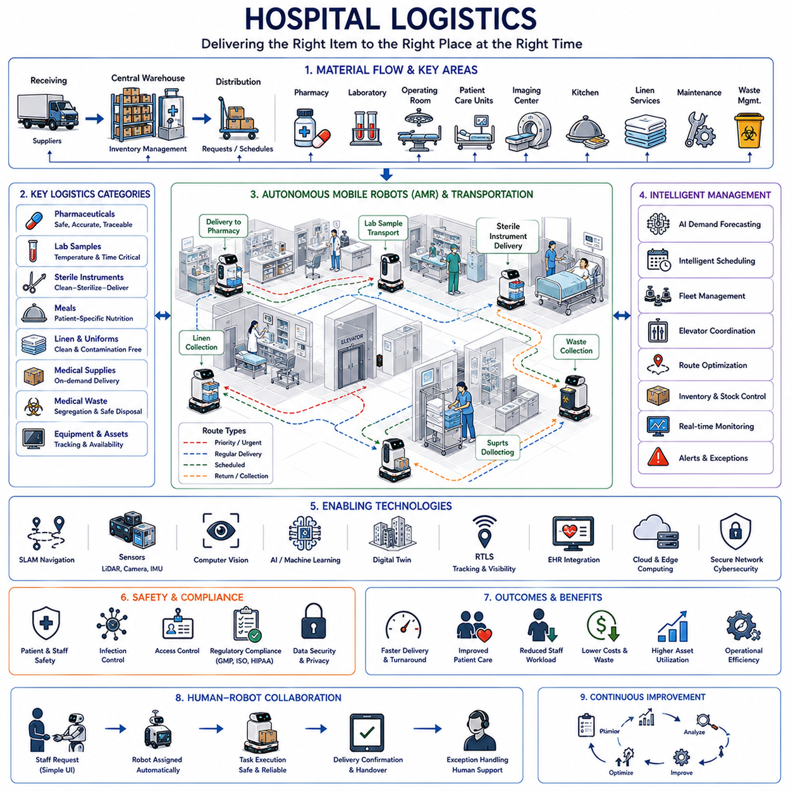
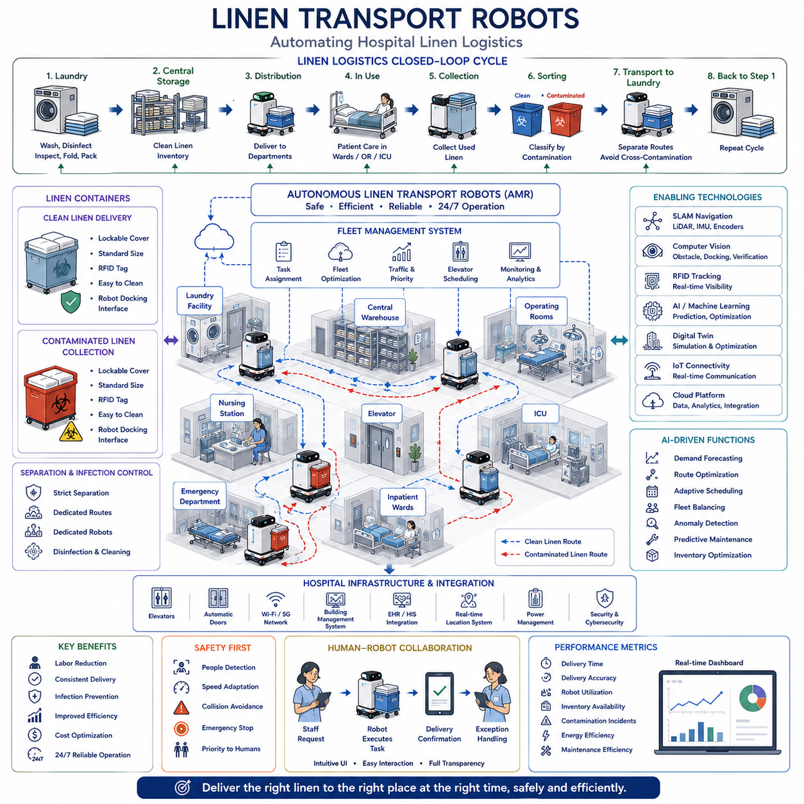
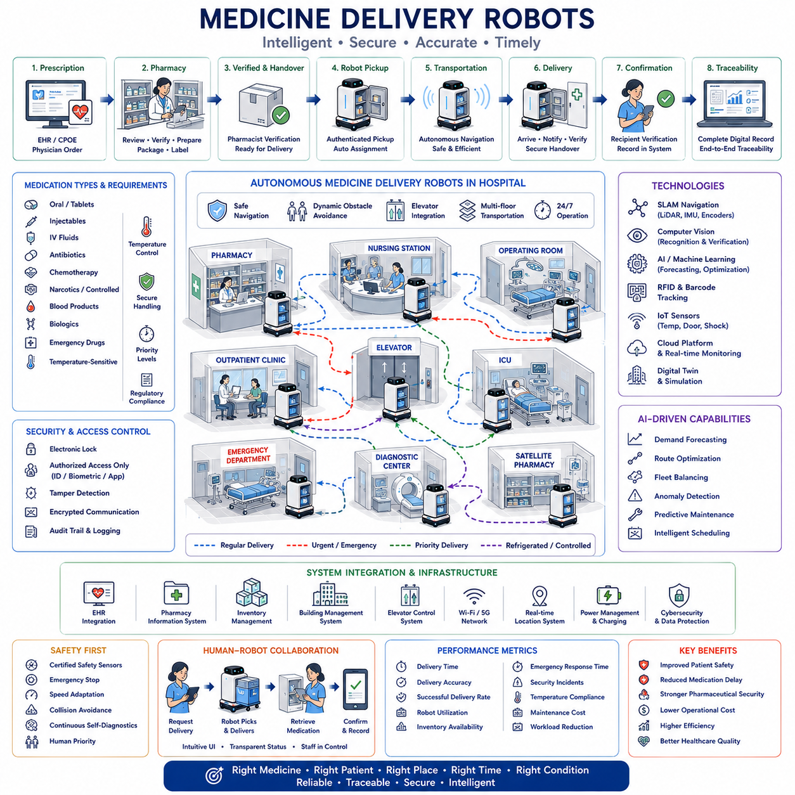
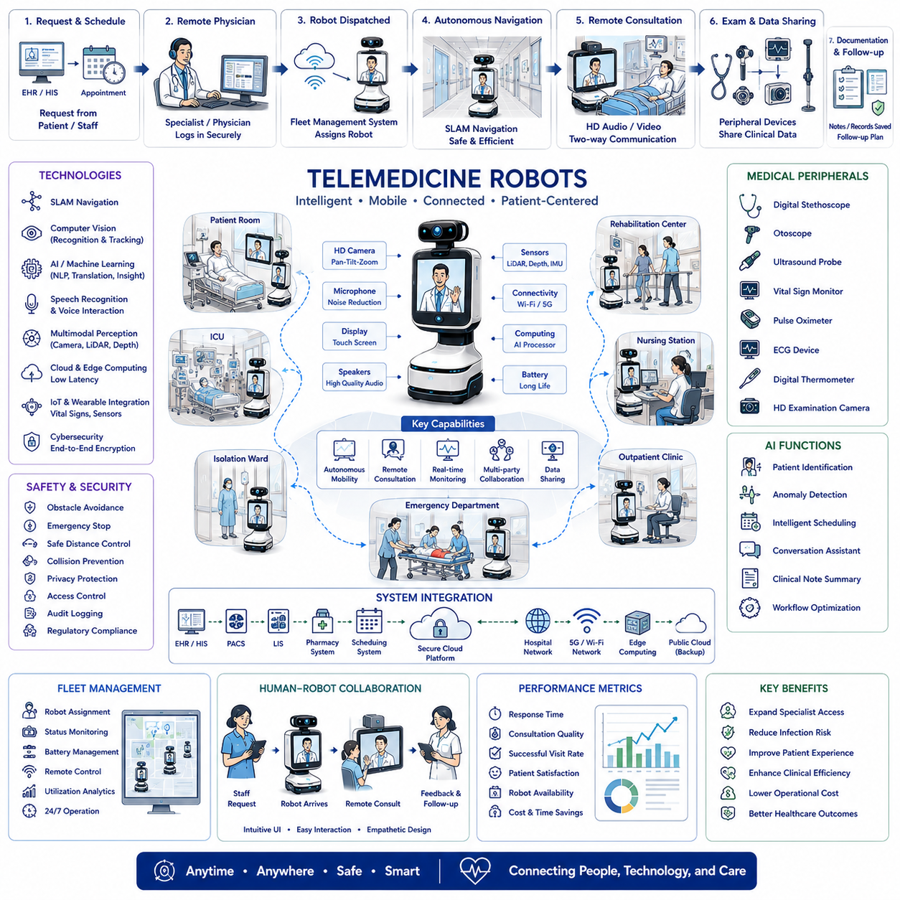
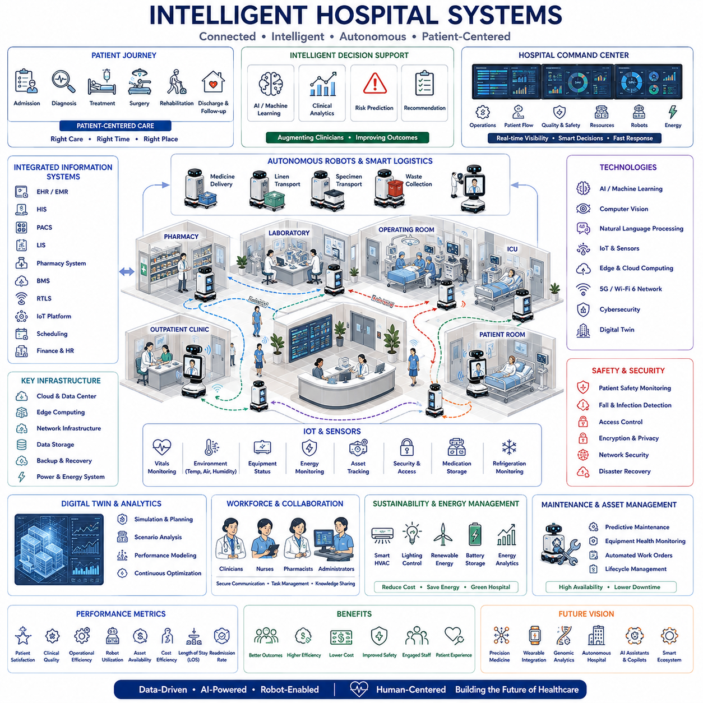

**Volume 01. AMR Foundations and System Architecture**

# 18. Hospital AMR · 병원 AMR

## 18.01 Hospital Logistics · 병원 물류

{width="7.268055555555556in" height="7.268055555555556in"}

병원 물류(Hospital Logistics)는 의료용품, 의약품, 검사 검체, 멸균 기구, 식사, 린넨, 폐기물, 의료 장비, 환자 관련 물품이 정확한 장소에 정확한 시간에 전달되도록 보장함으로써 현대 의료기관의 운영 기반을 형성한다. 일반 산업 물류와 달리 병원 물류는 효율성뿐 아니라 환자 안전, 감염 예방, 규제 준수, 중단 없는 임상 운영을 함께 고려해야 한다. 모든 운송 활동은 직간접적으로 의료 품질에 영향을 미치므로 물류는 단순한 지원 기능이 아니라 병원 성과의 핵심 요소이다.

현대 병원은 응급실, 수술실, 중환자실, 입원 병동, 외래 진료실, 약국, 검사실, 영상의학센터, 멸균 시설, 주방, 저장 공간, 폐기물 관리 시스템이 매일 수천 개의 물품을 교환하는 고도로 연결된 생태계로 운영된다. 이러한 활동은 주야간 내내 지속되므로 여러 부서가 안정적으로 협조해야 하며, 진단, 치료, 환자 회복에 영향을 줄 수 있는 지연을 최소화해야 한다.

병원 내부의 자재 흐름(Material Flow)은 외부 공급업체로부터 의료용품을 입고하는 과정에서 시작된다. 의약품, 수술 소모품, 의료기기, 진단 키트, 혈액 제품, 사무용품, 유지보수 자재는 검사와 등록을 거쳐 중앙 재고 시스템으로 이동한다. 재고 관리(Inventory Management)는 과도한 비축 없이 충분한 재고를 유지하도록 하며, 유효기간, 보관 조건, 규제 요구사항을 지속적으로 감시하여 운영 효율과 환자 안전을 함께 확보한다.

중앙 창고(Central Warehouse)는 예약 배송 또는 실시간 요청에 따라 임상 부서에 물품을 공급하는 물류 허브 역할을 한다. 저장 시스템은 멸균 자재, 유해 화학물질, 냉장 의약품, 통제 약물, 검사 시약, 일반 의료용품을 구분하는 경우가 많다. 각 범주마다 필요한 환경 조건과 보안 수준이 다르기 때문이다. 자동화된 재고 시스템은 물품 이동을 지속적으로 감시하고 부족이 발생하기 전에 보충 요청을 생성한다.

약국 물류(Pharmacy Logistics)는 병원 운영에서 가장 중요한 기능 중 하나이다. 처방 의약품은 전체 유통 과정에서 엄격한 추적성을 유지하면서 정확하게 조제, 검증, 운송, 전달되어야 한다. 온도 민감 의약품, 항암제, 마약류, 생물학적 제제는 특수한 취급 절차를 요구한다. 모든 배송 과정에서는 환자 신원, 투여량 정확성, 보관 조건, 규제 문서를 보존하여 투약 오류를 방지해야 한다.

검사실 물류(Laboratory Logistics)는 혈액 검체, 조직 표본, 소변 검체, 미생물 배양물, 병리 자재를 임상 부서와 검사 시설 사이에서 운송함으로써 진단 의료를 지원한다. 운송 지연, 진동, 오염, 온도 변화, 잘못된 라벨은 진단 정확도를 떨어뜨릴 수 있다. 따라서 효율적인 물류는 검사 업무 전반에서 완전한 검체 추적성을 유지하면서 더 빠른 진단과 효과적인 임상 의사결정에 직접 기여한다.

중앙공급실(Sterile Supply Department)은 재사용 수술 기구의 세척, 소독, 검사, 포장, 멸균, 보관, 재배포를 수행한다. 수천 개의 수술 도구가 수술실과 멸균 시설 사이를 지속적으로 순환한다. 물류 시스템은 기구 위치, 멸균 주기, 유지보수 이력, 사용 가능 상태를 관리하여 수술이 불필요하게 지연되지 않도록 하면서 감염 관리 규정을 완전하게 준수하도록 한다.

수술실(Operating Room)은 각 수술에 필요한 기구, 임플란트, 의약품, 일회용품, 영상 장비, 마취 장비, 검사 지원이 정확한 일정에 맞추어 도착해야 하므로 동기화된 물류에 크게 의존한다. 물류 지연은 수술 연기, 운영비 증가, 환자 치료 결과 악화로 이어질 수 있다. 지능형 일정관리 시스템은 재고 가용성, 멸균 완료, 장비 준비 상태, 운송 자원을 수술 준비 과정과 조정한다.

병원 식사 배송(Hospital Meal Delivery)은 단순히 음식을 운반하는 것 이상의 의미를 가진다. 영양 요구사항은 환자의 질환, 알레르기, 식이 제한, 약물 상호작용, 의사의 처방에 따라 달라진다. 식사 준비 시스템은 전자의무기록(Electronic Medical Record)과 직접 연계되어 환자가 적절한 영양을 제공받도록 한다. 배송 일정은 식품 품질과 위생 기준을 유지하면서 의료 시술, 투약 시간, 환자 상태와 조정되어야 한다.

린넨 물류(Linen Logistics)는 환자복, 담요, 수건, 수술포, 유니폼, 침구를 지속적으로 수거, 세탁, 멸균, 배포, 교체하는 순환 체계이다. 깨끗한 물품과 오염된 물품은 운송 과정에서 완전히 분리되어야 한다. 자동 추적 시스템은 재고 가시성을 높이고 분실을 줄이며, 대형 의료기관에서 매우 많은 일일 순환량이 발생하더라도 필요한 수량을 안정적으로 유지하도록 한다.

의료 폐기물 관리(Medical Waste Management)는 감염성 폐기물, 의약품 폐기물, 화학 폐기물, 방사성 물질, 일반 폐기물이 서로 다른 처리 절차를 따르므로 엄격하게 통제된 물류를 요구한다. 수거 경로, 보관 위치, 운송 장비, 처리 일정은 환경 규제와 산업안전 요구사항을 충족하면서 오염 위험을 최소화하도록 설계된다. 적절한 분리배출은 처리 비용을 크게 줄이고 병원 전체의 안전성을 향상시킨다.

자율이동로봇(Autonomous Mobile Robot, AMR)은 반복적인 수작업 운송을 대체하면서 병원 물류를 빠르게 변화시키고 있다. 이동로봇은 지속적인 사람의 감독 없이 병원 복도를 통해 의약품, 검사 검체, 멸균 기구, 식사, 린넨, 의료용품, 폐기물을 운송한다. 이러한 운영은 직원의 업무 부담을 줄이고 간호사와 임상 인력이 일상적인 운송 작업보다 직접적인 환자 치료에 더 많은 시간을 사용할 수 있도록 한다.

병원 물류 로봇은 동시적 위치추정 및 지도작성(Simultaneous Localization and Mapping, SLAM), 레이저 스캐너, 깊이 카메라, 관성 센서, 엘리베이터, 자동문, 디지털 건물 지도를 이용하여 복잡한 실내 환경을 주행한다. 산업 공장과 달리 병원에는 환자, 방문객, 휠체어, 들것, 의료 카트, 응급 대응팀 등 예측하기 어려운 보행 교통이 존재한다. 따라서 안전한 주행을 위해 지속적인 환경 인식, 동적 장애물 회피, 사회적으로 수용 가능한 로봇 행동이 필요하다.

플릿 관리 시스템(Fleet Management System)은 병원 캠퍼스 전역에서 동시에 운용되는 여러 자율 로봇을 조정한다. 운송 요청은 약국, 검사실, 수술실, 간호 스테이션, 주방, 창고에서 발생한다. 플릿 최적화(Fleet Optimization)는 임무를 할당하기 전에 로봇 가용성, 배터리 상태, 이동 거리, 엘리베이터 접근성, 교통 혼잡, 배송 우선순위, 긴급 요청을 함께 고려한다. 효율적인 조정은 불필요한 로봇 이동을 줄이면서 전체 운송 능력을 높인다.

엘리베이터는 로봇이 여러 병원 층을 이동할 때 자주 사용하는 공유 자원이므로 지능적인 조정이 필요하다. 플릿 관리 시스템은 엘리베이터 사용을 예약하고, 로봇 도착 시간을 동기화하며, 건물 자동화 시스템과 통신하고, 운송이 집중되는 시간대의 혼잡을 방지한다. 하루 동안 수백 건의 운송 요청이 동시에 발생할 수 있는 대형 의료센터에서는 엘리베이터 일정관리(Elevator Scheduling)가 특히 중요하다.

인공지능(Artificial Intelligence)은 예측 수요 분석, 지능형 일정관리, 경로 최적화, 이상 탐지, 재고 예측, 운영 의사결정 지원을 통해 병원 물류를 향상시킨다. 머신러닝(Machine Learning)은 과거 운송 기록, 환자 입원 패턴, 계절별 수요, 수술 일정, 응급실 활동을 분석하여 미래 물류 요구를 예측한다. 예측 계획(Predictive Planning)은 지연을 줄이고 자원 배분을 개선하며 수요 변동이 큰 기간에도 서비스 연속성을 유지한다.

컴퓨터 비전(Computer Vision)은 문, 복도, 카트, 장비, 병실 번호, 안전 표지, 예상치 못한 장애물을 인식하여 자율 물류를 지원한다. 비전 시스템은 배송 위치 확인, 적재 상태 감시, 포장물 식별, 사람의 개입이 필요한 비정상 상황 탐지에도 사용된다. 다중모달 인식(Multimodal Perception)과 결합된 컴퓨터 비전은 배치와 운영 조건이 지속적으로 변하는 동적 의료 환경에서 로봇의 신뢰성을 크게 높인다.

디지털 트윈(Digital Twin)은 건물 배치, 운송 경로, 재고 시스템, 엘리베이터 일정, 로봇 플릿, 임상 업무 흐름, 운영 성능을 통합하여 병원 물류 운영의 가상 표현을 제공한다. 엔지니어는 실제 병원에 변경을 적용하기 전에 대체 배치, 플릿 규모, 배송 정책, 인프라 개선안을 평가할 수 있다. 물리 운영과 디지털 모델의 지속적인 동기화는 배치 위험을 최소화하면서 근거 기반 계획을 지원한다.

실시간 위치추적 시스템(Real-Time Location System, RTLS)은 의료 장비, 휠체어, 주입 펌프, 인공호흡기, 이동형 영상 장비, 들것, 물류 로봇의 위치를 지속적으로 제공한다. 무선 위치추적 기술은 병원이 장비 위치를 즉시 확인하도록 하여 탐색 시간을 줄이고 자산 활용도를 높인다. 통합 추적 시스템은 예방정비 일정관리, 장비 가용성 예측, 임상 수요가 급증하는 시기의 긴급 자원 배분도 지원한다.

전자의무기록(Electronic Health Record, EHR) 연계는 물류 시스템이 환자 중심 의료 흐름을 지원하도록 한다. 환자 입원, 예정된 수술, 투약 처방, 검사 요청, 퇴원 계획에 따라 운송 우선순위가 자동으로 변경될 수 있다. 이에 따라 물류 활동은 고립된 운송 업무가 아니라 임상 의사결정과 긴밀하게 연계되며, 여러 병원 부서 사이의 협업을 향상시킨다.

사이버보안(Cybersecurity)은 물류 로봇이 병원 정보 시스템, 무선 네트워크, 약국 데이터베이스, 검사 시스템, 건물 관리 플랫폼과 통신하면서 점점 더 중요해지고 있다. 인증, 암호화 통신, 역할 기반 접근 제어(Role-Based Access Control), 소프트웨어 무결성 검증, 감사 로그, 지속적인 보안 모니터링은 민감한 환자 정보를 보호하고 임상 시설 전역에서 운용되는 자율 운송 시스템의 무단 제어를 방지한다.

안전(Safety)은 로봇이 좁은 복도에서 취약한 환자, 방문객, 의료진과 공간을 공유하기 때문에 병원 물류에서 가장 높은 우선순위를 가진다. 인증된 안전 센서, 비상정지 시스템, 속도 조절, 충돌 회피, 음향 경고, 시각 표시기, 운영 안전 구역은 로봇이 예측 가능한 방식으로 동작하도록 한다. 자율 시스템은 지속적으로 변화하는 병원 환경에서 효율적인 운송 성능을 유지하면서도 항상 사람의 안전을 우선해야 한다.

인간-로봇 협업(Human-Robot Collaboration)은 물류 자동화가 의료진을 대체하는 것이 아니라 보완하기 때문에 필수적이다. 간호사, 약사, 검사실 기술자, 외과의사, 물류 담당자, 유지보수 인력은 일상 업무 중 자율 시스템과 상호작용한다. 직관적인 사용자 인터페이스, 간단한 임무 요청, 투명한 상태 보고, 신뢰할 수 있는 예외 처리는 직원이 필요할 때 완전한 운영 감독을 유지하면서 로봇 시스템을 신뢰하도록 한다.

성능 평가는 물류 효율과 의료 품질에 직접 영향을 미치는 운영 지표를 함께 고려한다. 병원은 배송 시간, 운송 정확도, 재고 가용성, 투약 처리시간, 검사 대응시간, 로봇 활용률, 플릿 생산성, 장비 가용성, 에너지 소비, 유지보수 비용, 직원 업무 부담을 모니터링한다. 지속적인 성능 분석은 물류 투자가 측정 가능한 임상적·재무적 효과를 제공하도록 하면서 개선 기회를 식별한다.

미래의 병원 물류(Future Hospital Logistics)는 자율이동로봇, 인공지능, 다중모달 파운데이션 모델(Multimodal Foundation Model), 디지털 트윈, 예측 분석, 지능형 재고 시스템, 완전히 연결된 의료 정보 플랫폼을 하나의 통합 물류 생태계로 결합할 것이다. 운송 시스템은 임상 수요를 사전에 예측하고, 이기종 로봇 플릿을 조정하며, 병원 자원을 최적화하고, 지능형 의사결정 지원을 통해 의료진을 보조하게 될 것이다. 이러한 기술은 운영 복잡도와 자원 소비를 줄이면서 더 안전하고 효율적이며 환자 중심적인 병원을 구현할 것이다.

## 18.02 Linen Transport Robots · 린넨 운반 로봇

{width="7.268055555555556in" height="7.268055555555556in"}

린넨 운송(Linen Transportation)은 현대 병원에서 가장 반복적이고 노동 집약적인 물류 작업 가운데 하나이다. 매일 수천 장의 깨끗한 린넨이 병동, 수술실, 중환자실, 외래 진료실, 응급실, 전문 치료 구역으로 운송되어야 하며, 동시에 오염된 린넨은 수거되어 중앙 세탁 시설로 이동해야 한다. 린넨 운송 로봇(Linen Transport Robot)은 이러한 반복적인 운송 작업을 자동화하여 의료진이 환자 치료에 더욱 집중할 수 있도록 하며, 병원 전체의 운영 효율성, 감염 관리, 물류 신뢰성을 향상시킨다.

병원에서 사용하는 린넨(Hospital Linen)에는 침대 시트, 베갯잇, 담요, 환자복, 수술포, 수건, 의료진 유니폼, 커튼, 재사용 보호복, 임상 시술에 사용되는 특수 섬유 제품이 포함된다. 각 품목은 임상 용도와 감염 관리 규정에 따라 서로 다른 취급 방법, 보관 조건, 교체 주기, 세탁 절차를 따른다. 깨끗한 린넨의 지속적인 공급은 매우 중요하며, 린넨 부족은 환자 입원, 수술 일정, 응급 대응, 병원 운영 전반에 직접적인 영향을 줄 수 있다.

린넨 물류(Linen Logistics)는 폐쇄 순환 운송 체계(Closed-Loop Transportation Cycle)를 따른다. 깨끗한 린넨은 병원 세탁실 또는 외부 세탁 업체를 출발하여 포장된 상태로 중앙 창고에 운송되고, 각 부서에 배포된 후 환자 치료에 사용된다. 이후 사용된 린넨은 수거되어 오염 수준에 따라 분류되고, 다시 세탁 시설로 운송되어 소독, 세탁, 검사, 접기, 포장 과정을 거친 뒤 병원으로 재공급된다. 모든 단계는 정확한 추적이 이루어져야 재고 가시성을 유지하고 중단 없는 임상 운영을 지원할 수 있다.

깨끗한 린넨과 오염된 린넨은 운송 과정 전반에서 완전히 분리되어야 한다. 교차 오염(Cross-Contamination)은 감염 위험을 증가시키며 환자 안전을 저해하고 병원의 위생 규정을 위반할 수 있다. 별도의 운송 컨테이너, 전용 로봇 임무, 독립된 보관 구역, 사전에 정의된 운송 경로, 엄격한 적재 절차를 통해 오염 위험을 최소화한다. 로봇 소프트웨어는 하나의 임무나 적재 공간에서 깨끗한 린넨과 오염된 린넨이 혼합되지 않도록 운송 규칙을 강제한다.

자율이동로봇(Autonomous Mobile Robot, AMR)은 린넨 배송이 반복적이며 일정이 예측 가능한 특성을 가지기 때문에 병원 린넨 운송에 매우 적합한 솔루션으로 자리 잡고 있다. 로봇은 세탁 시설, 중앙 창고, 간호 스테이션, 수술 구역, 중환자실, 응급실, 입원 병동 사이에서 린넨 카트를 운반한다. 자동 운송은 긴 병원 복도에서 무거운 카트를 사람이 직접 밀어야 하는 작업을 줄여 신체적 부담을 감소시키면서도 24시간 운영되는 병원 환경에서 안정적인 배송 품질을 제공한다.

병원 린넨 운송 로봇은 동시적 위치추정 및 지도작성(Simultaneous Localization and Mapping, SLAM), 레이저 스캐너(Laser Scanner), 깊이 카메라(Depth Camera), 관성측정장치(Inertial Measurement Unit, IMU), 휠 엔코더(Wheel Encoder), 디지털 건물 지도를 이용하여 실내를 주행한다. 내비게이션 시스템은 환자, 방문객, 의료 장비, 휠체어, 들것, 서비스 카트, 기타 이동 장애물을 지속적으로 감지하면서 자신의 위치를 실시간으로 갱신한다. 병원의 의료 활동을 방해하지 않으면서 안정적인 운송 성능을 유지하려면 부드러운 경로 계획과 안전한 주행이 필수적이다.

플릿 관리(Fleet Management)는 대형 병원에서 동시에 운용되는 여러 대의 린넨 운송 로봇을 조정한다. 운송 요청은 환자 입원과 퇴원, 수술 일정, 응급 상황, 세탁 처리 용량에 따라 지속적으로 변화한다. 플릿 최적화(Fleet Optimization)는 로봇의 가용성, 배터리 상태, 엘리베이터 사용, 경로 혼잡도, 운송 우선순위, 배송 마감 시간을 함께 고려하여 작업을 배정한다. 지능형 일정관리는 플릿 활용률을 높이고 불필요한 이동 거리와 대기 시간을 최소화한다.

병원의 엘리베이터는 린넨 운송이 여러 층에서 이루어지므로 매우 중요한 공유 자원이다. 로봇은 건물 관리 시스템(Building Management System)과 통신하여 엘리베이터를 호출하고 사용 시간을 예약하며 도착 시점을 동기화한다. 또한 환자 이동이나 응급 의료 활동을 방해하지 않도록 운송을 조정한다. 지능형 엘리베이터 일정관리(Elevator Scheduling)는 대형 의료기관에서 층간 물류 흐름을 원활하게 유지하는 핵심 요소이다.

린넨 운송 컨테이너(Linen Transportation Container)는 청결을 유지하면서도 로봇이 효율적으로 취급할 수 있도록 설계된다. 일반적으로 표준화된 크기, 낮은 무게중심, 잠금식 덮개, 세척 가능한 표면, RFID 식별 장치, 로봇과 호환되는 도킹 인터페이스를 포함한다. 깨끗한 린넨 배송용과 오염 린넨 수거용 컨테이너는 서로 분리하여 운영된다. 이러한 표준화는 로봇 적재, 운송, 재고 관리, 세척 작업, 장기 유지보수를 단순화한다.

무선주파수 식별(Radio Frequency Identification, RFID)은 재사용 린넨과 운송 컨테이너에 디지털 식별자를 부여함으로써 추적성을 크게 향상시킨다. 로봇, 저장소, 세탁 시설, 물류 체크포인트에 설치된 RFID 판독기는 수작업 스캔 없이 물품 이동을 자동으로 기록한다. 병원은 재고 위치, 사용 빈도, 교체 이력, 분실률, 운송 성능을 지속적으로 확인할 수 있으며, 이를 통해 보다 정확한 재고 계획을 수립하고 불필요한 구매와 자재 부족을 줄일 수 있다.

컴퓨터 비전(Computer Vision)은 복도 상태, 저장 공간, 적재 구역, 도킹 위치, 운송 카트, 안전 표지, 예상치 못한 장애물을 인식하여 로봇 운송을 지원한다. 비전 알고리즘은 출발 전 적재 상태를 확인하고, 배송 완료를 검증하며, 차단된 경로를 탐지하고, 작업자의 개입이 필요한 비정상적인 운송 상황을 식별한다. 카메라, 레이저 스캐너, 깊이 센서를 결합한 다중모달 인식(Multimodal Perception)은 혼잡한 병원 환경에서 내비게이션의 신뢰성을 크게 향상시킨다.

인공지능(Artificial Intelligence)은 수요 예측, 경로 최적화, 적응형 일정관리, 플릿 균형화, 이상 탐지, 유지보수 예측을 통해 린넨 운송을 더욱 효율적으로 만든다. 머신러닝(Machine Learning)은 과거 린넨 사용량과 병상 점유율, 계절 변화, 수술 일정, 감염병 발생, 응급 상황을 함께 분석하여 미래의 운송 수요를 예측한다. 이러한 예측은 부족이나 혼잡이 발생하기 전에 필요한 운송 자원을 미리 준비할 수 있도록 한다.

재고 관리(Inventory Management)는 병원 모든 부서의 린넨 보유량을 지속적으로 감시한다. 스마트 저장 시스템(Smart Storage System)은 재고가 설정된 기준 이하로 감소하면 자동으로 로봇에게 보충 운송을 요청한다. 고정된 배송 일정 대신 인공지능 기반 재고 제어는 실제 임상 사용량에 따라 운송을 수행하는 수요 기반 물류(Demand-Driven Logistics)를 구현한다. 이 방식은 불필요한 재고를 줄이면서도 병원 전체에서 높은 서비스 수준을 유지한다.

디지털 트윈(Digital Twin)은 운송 경로, 저장 위치, 세탁 시설, 로봇 플릿, 재고 수준, 병원 구조를 포함하는 린넨 물류의 가상 모델을 제공한다. 엔지니어는 실제 환경을 변경하기 전에 다양한 운송 전략, 플릿 규모, 저장 용량, 배송 일정, 인프라 개선 방안을 시뮬레이션할 수 있다. 운영 데이터와 디지털 모델의 지속적인 동기화는 배치 위험을 줄이면서 시뮬레이션 기반 최적화를 지원한다.

인간-로봇 협업(Human-Robot Collaboration)은 병원 직원이 적재, 하역, 재고 확인, 예외 처리, 유지보수 과정에서 린넨 운송 로봇과 지속적으로 상호작용하기 때문에 매우 중요하다. 사용자 인터페이스(User Interface)는 간호사, 물류 담당자, 환경미화 직원이 배송 요청, 운송 완료 확인, 이상 상황 보고, 임무 변경을 쉽게 수행할 수 있도록 직관적으로 설계되어야 한다. 효과적인 협업은 운영 수용성을 높이는 동시에 교육 부담을 최소화한다.

안전(Safety)은 린넨 운송 로봇이 환자, 방문객, 간호사, 의사, 들것, 휠체어, 응급 대응팀과 같은 공간을 공유하기 때문에 가장 중요한 요소이다. 로봇은 인증된 안전 센서, 비상정지 시스템, 속도 조절, 충돌 회피 알고리즘, 동적 장애물 탐지를 이용하여 주변 환경을 지속적으로 감시한다. 사람의 이동은 항상 로봇 운송보다 우선되어야 하며, 이를 통해 혼잡한 병원 환경에서도 안전한 공존이 가능해진다.

감염 예방(Infection Prevention)은 단순히 깨끗한 린넨과 오염된 린넨을 분리하는 것 이상을 의미한다. 로봇 도킹 스테이션, 운송 적재함, 적재 장치, 외부 표면은 병원의 감염 관리 절차에 따라 정기적으로 세척 및 소독될 수 있어야 한다. 로봇에 사용되는 재료는 반복적인 소독제 사용에도 성능 저하가 없어야 하며, 유지보수 작업 역시 로봇이 환경 오염원이 되지 않도록 위생 절차를 준수해야 한다.

배터리 관리(Battery Management)는 병원 물류가 하루 종일 지속되므로 운영 효율성에 직접적인 영향을 미친다. 플릿 관리 시스템은 운송 작업량, 이동 거리, 엘리베이터 사용, 예상 임무 시간을 기반으로 배터리 소비를 예측한다. 충전 일정은 자동으로 조정되어 운송이 집중되는 시간에는 충분한 수의 로봇이 운영되고, 수요가 낮은 시간에는 유휴 로봇이 충전되도록 하여 병원 물류의 연속성을 유지한다.

사이버보안(Cybersecurity)은 병원 정보 시스템, 재고 데이터베이스, 무선 통신망, RFID 인프라, 플릿 관리 플랫폼과 연결된 운송 로봇을 보호한다. 인증(Authentication), 암호화 통신(Encrypted Communication), 소프트웨어 무결성 검증(Software Integrity Verification), 접근 제어(Access Control), 지속적인 모니터링, 안전한 소프트웨어 업데이트는 무단 제어를 방지하면서 운영 정보를 보호하고 의료 환경에서 안정적인 물류 서비스를 유지하도록 한다.

유지보수 전략(Maintenance Strategy)은 예방정비(Preventive Maintenance)와 예지진단(Predictive Diagnostics)을 결합하여 로봇 가동률을 극대화한다. 센서는 바퀴 상태, 구동 모터, 배터리, 제동 장치, 엘리베이터 인터페이스, 내비게이션 센서, 통신 시스템을 지속적으로 감시한다. 인공지능은 구성 요소의 상태를 평가하고 고장 전에 유지보수 시점을 예측한다. 계획된 유지보수는 운영 중단을 최소화하면서 장비 수명을 연장하고 총소유비용(Total Cost of Ownership, TCO)을 절감한다.

성능 평가(Performance Evaluation)는 운송 완료 시간, 배송 정확도, 로봇 활용률, 플릿 가동률, 배터리 효율, 재고 가용성, 오염 사고 발생 건수, 유지보수 빈도, 에너지 소비, 직원 업무 감소 효과와 같은 지표를 이용하여 물류 효율을 측정한다. 지속적인 운영 분석은 개선 기회를 식별하는 동시에 자율 린넨 운송 시스템이 제공하는 임상적·경제적 효과를 정량적으로 입증한다.

미래의 린넨 운송 시스템(Future Linen Transportation System)은 자율이동로봇, 지능형 재고 관리(Intelligent Inventory Management), 다중모달 파운데이션 모델(Multimodal Foundation Model), 디지털 트윈, 예측 분석(Predictive Analytics), 병원 전체 물류 오케스트레이션(Hospital-Wide Logistics Orchestration)을 하나의 완전한 의료 물류 생태계로 통합하게 될 것이다. 로봇은 약국 배송, 검사실 운송, 폐기물 수거, 식사 배송, 의료용품 운송과 통합된 플릿 관리 플랫폼을 통해 협력하게 된다. 이러한 지능형 물류 네트워크는 운영 회복탄력성을 향상시키고, 수작업을 줄이며, 감염 예방을 강화하고, 차세대 병원에서 더욱 효율적이고 환자 중심적인 의료 서비스를 지원하게 될 것이다.

## 18.03 Medicine Delivery Robots · 의약품 배송 로봇

{width="7.268055555555556in" height="7.268055555555556in"}

의약품 배송(Medicine Delivery)은 현대 병원에서 가장 중요한 물류 프로세스 가운데 하나이며, 의약품은 환자 치료, 임상 안전, 의료 서비스 품질에 직접적인 영향을 미친다. 모든 처방 의약품은 올바른 환자에게, 올바른 장소에서, 올바른 시간에, 그리고 적절한 상태로 전달되어야 한다. 의약품 배송 로봇(Medicine Delivery Robot)은 병원 약국, 간호 스테이션, 수술실, 중환자실, 응급실, 외래 진료실, 전문 치료 구역 사이의 반복적인 운송 작업을 자동화하면서 전체 배송 과정에서 엄격한 보안(Security), 추적성(Traceability), 규제 준수(Regulatory Compliance)를 유지한다.

병원 약국 운영(Hospital Pharmacy Operation)은 전자의무기록(Electronic Health Record, EHR)과 전산화 처방 입력 시스템(Computerized Physician Order Entry, CPOE)을 통해 처방이 생성되는 과정에서 시작된다. 약사는 처방을 검토하고, 용량을 확인하며, 잠재적인 약물 상호작용을 식별하고, 의약품을 조제한 후 병원의 절차에 따라 포장한다. 검증이 완료되면 의약품은 병원 물류 네트워크로 전달되고, 자율 운송 시스템이 이를 임상 부서까지 안전하게 배송한다. 약국 정보 시스템과 물류 플랫폼의 지속적인 연계는 배송 지연을 최소화하면서 사람의 취급 과정에서 발생할 수 있는 오류를 줄여준다.

병원에서 사용하는 의약품에는 일반 경구약, 주사제, 정맥주사 수액, 항생제, 항암제, 마약류, 혈액 제제, 생물학적 제제, 응급 의약품, 저온 보관 의약품 등이 포함된다. 각 의약품은 보관 온도, 운송 보안, 배송 우선순위, 유효기간 관리, 규제 문서 등에서 서로 다른 요구사항을 가진다. 의약품 배송 시스템은 이러한 차이를 자동으로 인식하고 각각의 배송 임무에 적절한 운송 절차를 적용해야 한다.

추적성(Traceability)은 의약품 물류에서 가장 중요한 요구사항 가운데 하나이다. 모든 의약품은 약국에서 조제된 순간부터 최종 전달까지 완전한 디지털 이력을 유지해야 한다. 운송 기록에는 조제 시간, 약사 검증, 로봇 배정, 배송 경로, 환경 조건, 도착 시간, 수령 확인, 보관 위치가 포함된다. 완전한 추적성은 환자 안전, 규제 준수, 재고 관리, 그리고 예기치 않은 사고 발생 시 사후 조사(Post-Event Investigation)를 지원한다.

자율이동로봇(Autonomous Mobile Robot, AMR)은 병원 내 반복적인 실내 운송 경로를 효율적으로 수행할 수 있기 때문에 의약품 운송에 매우 적합한 플랫폼이 되고 있다. 로봇은 약국과 입원 병동, 외래 진료실, 응급실, 중환자실, 수술실, 진단 센터, 위성 약국(Satellite Pharmacy) 사이에서 의약품을 운송한다. 자동화는 수작업 운송 부담을 줄여 약사와 간호사가 반복적인 물류 업무보다 직접적인 임상 활동에 더 많은 시간을 사용할 수 있도록 지원한다.

의약품 배송 로봇은 일반적으로 동시적 위치추정 및 지도작성(Simultaneous Localization and Mapping, SLAM), 레이저 스캐너(Laser Scanner), 깊이 카메라(Depth Camera), 관성측정장치(Inertial Measurement Unit, IMU), 휠 엔코더(Wheel Encoder), 디지털 건물 지도를 이용하여 병원을 주행한다. 병원 환경에는 환자, 방문객, 의사, 간호사, 들것, 휠체어, 의료 장비, 서비스 카트가 예측하기 어렵게 이동한다. 따라서 로봇은 지속적인 환경 인식(Environmental Perception), 동적 장애물 회피(Dynamic Obstacle Avoidance), 사회적으로 수용 가능한 경로 계획(Socially Acceptable Motion Planning), 사람과의 안전한 상호작용을 수행해야 한다.

플릿 관리 시스템(Fleet Management System)은 대형 병원에서 동시에 운용되는 여러 대의 의약품 배송 로봇을 조정한다. 배송 요청은 환자 입원, 의사 처방, 응급 상황, 수술 일정, 약국 업무량, 의약품 긴급도에 따라 지속적으로 변화한다. 플릿 최적화(Fleet Optimization)는 로봇 가용성, 배터리 상태, 경로 혼잡도, 엘리베이터 접근성, 배송 기한, 의약품 우선순위를 함께 고려하여 운송 임무를 배정한다. 이러한 지능형 조정은 안정적인 임상 서비스를 유지하면서 플릿 효율을 극대화한다.

보안(Security)은 많은 의약품이 제한된 접근 권한을 요구하기 때문에 의약품 배송에서 매우 중요한 요소이다. 로봇 적재함에는 전자 잠금장치(Electronic Lock), 인증 기반 접근 제어(Authentication Access Control), 변조 감지(Tamper Detection), 적재함 모니터링, 암호화 통신이 적용된다. 승인된 직원만이 사원증, 생체인식(Biometric Authentication), 보안 모바일 애플리케이션, 병원 출입 시스템을 통해 본인 확인 후 의약품을 수령할 수 있다. 이러한 보안 기능은 통제 약물을 보호하면서도 효율적인 임상 업무를 유지한다.

온도 관리(Temperature Control)는 냉장 또는 특정 환경 조건이 필요한 의약품에서 필수적인 요소이다. 일부 백신, 생물학적 제제, 인슐린, 혈액 유래 의약품, 특수 의약품은 운송 중에도 엄격한 온도 범위를 유지해야 한다. 의약품 배송 로봇은 단열 적재함, 온도 센서, 환경 기록 장치, 경보 시스템을 통합하여 운송 전 과정에서 의약품의 품질을 유지한다. 이러한 환경 기록은 배송 이력의 영구적인 일부로 저장된다.

병원의 엘리베이터는 의약품 배송이 여러 층에서 이루어지기 때문에 중요한 공유 인프라이다. 로봇은 건물 자동화 시스템(Building Automation System)과 통신하여 엘리베이터를 호출하고 이용 시간을 예약하며 도착 시점을 동기화하고 다른 물류 로봇과 이동을 조정한다. 긴급 의약품 배송은 우선적으로 엘리베이터를 사용할 수 있으며, 일반 배송은 전체 건물의 운송 효율을 고려한 표준 일정관리 절차를 따른다.

인공지능(Artificial Intelligence)은 수요 예측, 경로 최적화, 플릿 균형화, 이상 탐지, 예지보전(Predictive Maintenance), 지능형 일정관리를 통해 의약품 배송을 향상시킨다. 머신러닝(Machine Learning)은 과거 처방 패턴, 병상 점유율, 의료진 활동, 계절성 질병, 응급 환자 수, 약국 업무량을 분석하여 미래 운송 수요를 예측한다. 이러한 예측 계획은 병원 전체에서 중요한 의약품 배송의 대기 시간을 줄이고 로봇 가용성을 향상시킨다.

컴퓨터 비전(Computer Vision)은 약국 조제대, 배송 스테이션, 의약품 카트, 병실 번호, 도킹 위치, 복도 상태, 예상치 못한 장애물을 인식하여 의약품 운송을 지원한다. 비전 시스템은 적재 상태를 확인하고, 의약품 위치를 검증하며, 운송 상태를 감시하고, 작업자의 개입이 필요한 이상 상황을 탐지한다. 카메라, 레이저 스캐너, 깊이 센서를 결합한 다중모달 인식(Multimodal Perception)은 병원의 복잡한 환경에서 내비게이션의 신뢰성을 크게 향상시킨다.

무선주파수 식별(Radio Frequency Identification, RFID)과 바코드(Barcode)는 병원 의약품 물류 전반의 추적성을 강화한다. 개별 의약품, 운송 용기, 약국 선반, 배송 스테이션, 로봇 적재함에는 디지털 식별자가 부착되어 운송 과정에서 자동으로 인식된다. 지속적인 식별은 수작업 기록을 제거하고 문서 오류, 재고 불일치, 의약품 분실, 무단 접근을 줄인다. 실시간 가시성은 의약품 유통망 전체의 운영 투명성을 향상시킨다.

전자의무기록(Electronic Health Record, EHR)과의 연계는 의약품 배송 로봇이 환자 중심 의료 흐름의 일부가 되도록 한다. 새로운 처방, 응급 치료, 수술 일정, 환자 이동, 퇴원 계획, 의사의 처방 변경에 따라 배송 우선순위가 자동으로 조정된다. 임상 정보 시스템과 물류 플랫폼의 통합은 의약품 운송이 병원의 지속적으로 변화하는 의료 활동과 항상 동기화되도록 보장한다.

디지털 트윈(Digital Twin)은 약국 운영, 운송 경로, 로봇 플릿, 의약품 재고, 엘리베이터 일정, 배송 스테이션, 병원 구조를 통합한 병원 의약품 물류의 가상 모델을 제공한다. 엔지니어는 실제 운영을 변경하기 전에 플릿 규모, 운송 정책, 저장 전략, 인프라 개선, 응급 대응 절차를 평가할 수 있다. 실제 운영과 디지털 모델의 지속적인 동기화는 시뮬레이션 기반 최적화를 지원하면서 구축 위험을 최소화한다.

재고 관리(Inventory Management)는 약국, 자동 의약품 보관장치(Automated Dispensing Cabinet), 간호 스테이션, 응급 카트, 전문 치료 구역의 의약품 재고를 지속적으로 감시한다. 스마트 재고 시스템(Smart Inventory System)은 재고가 기준 이하로 감소하면 자동으로 보충 배송을 요청한다. 수요 기반 운송(Demand-Driven Transportation)은 고정된 배송 일정 대신 실제 임상 사용량에 따라 의약품을 공급한다. 이러한 방식은 재고 비용을 줄이면서도 필요한 순간에 의약품을 안정적으로 공급한다.

인간-로봇 협업(Human-Robot Collaboration)은 약사, 간호사, 의사, 물류 담당자, 유지보수 엔지니어가 의약품 배송 로봇과 지속적으로 상호작용하기 때문에 매우 중요하다. 사용자는 직관적인 인터페이스를 통해 운송을 요청하고, 배송을 확인하며, 의약품을 수령하고, 예외 상황을 처리하며, 로봇의 동작을 감독한다. 투명한 정보 제공과 예측 가능한 로봇 행동은 의료진이 임상 의사결정에 대한 완전한 통제권을 유지하면서도 로봇을 신뢰하도록 한다.

안전(Safety)은 단순한 주행 안전을 넘어 환자 치료 자체와 직접 연결된다. 로봇은 적재함 상태, 운송 무결성, 환경 조건, 접근 권한, 주행 안전, 배송 완료 여부를 지속적으로 감시한다. 비상정지 시스템(Emergency Stop System), 인증된 안전 센서, 속도 제어, 충돌 회피, 지속적인 자기진단(Self-Diagnostics)은 환자와 의료진이 많은 병원 복도에서도 안전한 운송을 보장한다.

사이버보안(Cybersecurity)은 무단 접근, 악성 소프트웨어, 통신 도청, 데이터 변조로부터 의약품 물류를 보호한다. 인증(Authentication), 암호화 통신(Encrypted Communication), 소프트웨어 무결성 검증(Software Integrity Verification), 안전한 접근 제어(Secure Access Control), 감사 로그(Audit Logging), 네트워크 분리(Network Segmentation), 지속적인 모니터링은 환자 정보와 통제 의약품을 동시에 보호한다. 자율 로봇이 병원 정보 시스템 및 클라우드 기반 물류 플랫폼과 직접 연결될수록 강력한 사이버보안은 더욱 중요해진다.

유지보수(Maintenance)는 예방정비(Preventive Maintenance)와 예지진단(Predictive Diagnostics)을 결합하여 로봇의 신뢰성을 극대화한다. 배터리, 구동 시스템, 내비게이션 센서, 전자 잠금장치, 통신 장치, 환경 제어 시스템, 안전 장치를 지속적으로 감시함으로써 인공지능은 구성 요소의 상태를 예측하고 고장 이전에 유지보수를 계획한다. 계획된 유지보수는 운영 중단을 최소화하면서 병원에서 하루 24시간 안정적인 의약품 운송을 보장한다.

성능 평가(Performance Evaluation)는 의약품 배송 시간, 운송 정확도, 성공적인 배송률, 로봇 활용률, 플릿 가동률, 응급 대응 시간, 재고 가용성, 보안 사고, 온도 규정 준수, 유지보수 비용, 에너지 효율, 의료진 업무 감소 효과 등을 이용하여 운영 성과를 측정한다. 지속적인 성능 분석은 최적화 기회를 발견하는 동시에 환자 서비스 품질과 병원 운영 효율 향상을 정량적으로 입증한다.

미래의 의약품 배송 시스템(Future Medicine Delivery System)은 자율이동로봇, 다중모달 파운데이션 모델(Multimodal Foundation Model), 디지털 트윈, 예측 분석(Predictive Analytics), 지능형 약국 자동화(Intelligent Pharmacy Automation), 실시간 임상 의사결정 지원(Real-Time Clinical Decision Support), 병원 전체 물류 오케스트레이션(Hospital-Wide Logistics Orchestration)을 하나의 통합 의료 생태계로 결합하게 될 것이다. 로봇은 약품 운송뿐 아니라 검사실 물류, 혈액 배송, 의료용품 운송, 린넨 운송, 폐기물 관리와도 통합된 플릿 관리 플랫폼을 통해 협력하게 된다. 이러한 통합 시스템은 환자 안전을 향상시키고, 의약품 배송 지연을 줄이며, 의약품 보안을 강화하고, 더욱 안전하고 신속한 의료 서비스를 제공하는 데이터 중심의 차세대 병원을 구현하게 될 것이다.

## 18.04 Telemedicine Robots · 원격진료 로봇

{width="7.268055555555556in" height="7.268055555555556in"}

원격의료(Telemedicine)는 의사, 전문의, 간호사, 환자가 원격으로 연결되어도 높은 수준의 의료 서비스를 제공할 수 있도록 지원하는 현대 의료의 핵심 요소가 되었다. 원격의료 로봇(Telemedicine Robot)은 여기에 자율 이동성(Autonomous Mobility), 음성·영상 통신(Audiovisual Communication), 원격 진료 지원(Remote Examination Support), 지능형 내비게이션(Intelligent Navigation)을 결합하여 병원, 요양시설, 재활센터, 격리시설, 재택 의료 환경(Home Healthcare Environment)에서 활용된다. 이러한 로봇은 불필요한 대면 접촉을 줄이고 의료 접근성을 향상시키며, 의료진이 물리적인 위치와 관계없이 적시에 의료 서비스를 제공할 수 있도록 지원한다.

원격의료 로봇은 이동형 로봇 플랫폼(Mobile Robotic Platform), 고해상도 카메라(High-Definition Camera), 마이크(Microphone), 스피커(Speaker), 디스플레이(Display), 무선 통신(Wireless Communication), 지능형 소프트웨어(Intelligent Software)를 결합하여 이동형 원격 진료 시스템을 구현한다. 고정형 화상회의 장비와 달리 원격의료 로봇은 환자 병실, 응급실, 중환자실, 외래 진료실, 격리 병동, 회복 병동으로 자율적으로 이동할 수 있다. 의사는 원격에서 진료를 수행하고, 로봇은 최적의 시야와 자연스러운 의사소통이 가능하도록 적절한 위치를 스스로 확보한다.

원격의료 로봇의 가장 중요한 목적 가운데 하나는 전문 의료 서비스에 대한 접근성을 확대하는 것이다. 병원은 야간, 주말, 응급 상황, 감염병 발생 시 전문 의료진이 부족한 경우가 많다. 원격 진료를 이용하면 숙련된 전문의가 병원 간 이동 없이 환자를 진료할 수 있다. 여러 병원이 전문의를 공동으로 활용함으로써 대응 시간을 단축하고 임상 의사결정을 향상시키며, 분산된 의료 네트워크에서도 일관된 의료 품질을 유지할 수 있다.

원격의료 로봇은 특히 세계적인 감염병 유행 시기에 매우 중요한 역할을 수행하였다. 의료진과 환자의 직접 접촉을 최소화함으로써 감염 위험을 줄일 수 있기 때문이다. 로봇은 격리 병실, 검역 구역, 감염병 병동으로 이동하고 의사는 안전한 음성·영상 연결을 통해 환자와 상담한다. 의료진은 감염 위험에 불필요하게 노출되지 않으면서도 환자의 상태를 확인하고, 치료 계획을 설명하며, 심리적 지원까지 제공할 수 있다.

현대의 원격의료 로봇은 고해상도 영상(High-Resolution Video), 지향성 마이크(Directional Microphone), 잡음 제거(Noise Reduction), 에코 제거(Echo Cancellation), 고품질 스피커를 제공하여 자연스러운 의사소통을 가능하게 한다. 팬-틸트-줌 카메라(Pan-Tilt-Zoom Camera)는 의사가 상처를 관찰하고, 얼굴 표정을 확인하며, 호흡 상태를 평가하고, 병실 내 여러 사람과 동시에 소통할 수 있도록 지원한다. 이러한 고품질 음성·영상 시스템은 일반적인 모바일 화상회의 장비보다 훨씬 우수한 임상 경험을 제공한다.

로봇의 이동성(Mobility)은 원격의료 시스템을 단순한 화상회의 장치가 아니라 능동적인 의료 지원 시스템으로 발전시킨다. 자율주행(Autonomous Navigation)을 통해 로봇은 병원 내 여러 부서를 안전하게 이동하면서 환자, 방문객, 의료 장비, 휠체어, 들것, 서비스 카트를 회피한다. 동시적 위치추정 및 지도작성(Simultaneous Localization and Mapping, SLAM), 레이저 스캐너(Laser Scanner), 깊이 카메라(Depth Camera), 관성 센서(Inertial Sensor), 의미 기반 건물 지도(Semantic Building Map)는 지속적으로 사람이 이동하는 복잡한 병원 환경에서도 안정적인 주행을 지원한다.

인공지능(Artificial Intelligence)은 자율주행, 환자 식별(Patient Identification), 음성 인식(Speech Recognition), 다국어 번역(Multilingual Translation), 진료 일정 관리(Appointment Scheduling), 이상 탐지(Anomaly Detection), 대화 지원(Conversation Assistance), 업무 최적화(Workflow Optimization)를 통해 원격의료 로봇의 기능을 향상시킨다. 머신러닝(Machine Learning)은 주행 성능을 지속적으로 개선하며, 자연어 처리(Natural Language Processing)는 환자와 의료진 간의 보다 자연스러운 대화를 가능하게 한다. 인공지능은 진료 내용을 요약하고 임상 기록을 정리하며 후속 조치를 추천하는 역할도 수행할 수 있다.

컴퓨터 비전(Computer Vision)은 병실, 병원 복도, 의료 장비, 의료진, 주변 장애물을 인식한다. 비전 알고리즘은 자율 도킹(Autonomous Docking), 환자 위치 파악(Patient Localization), 얼굴 인식(Face Detection), 제스처 인식(Gesture Recognition), 병실 점유 상태 확인(Occupancy Monitoring), 내비게이션 검증(Navigation Verification)을 수행한다. 지속적인 환경 인식은 로봇의 안전성을 높이는 동시에 의사가 카메라를 직접 조작하지 않고도 다양한 시점에서 환자를 관찰할 수 있도록 지원한다.

병원의 통신 인프라(Communication Infrastructure)는 원격의료 로봇의 성능을 결정하는 핵심 요소이다. 안정적인 와이파이(Wi-Fi), 전용 5G 네트워크(Private 5G Network), 클라우드 컴퓨팅(Cloud Computing), 엣지 컴퓨팅(Edge Computing), 사이버보안(Cybersecurity)은 로봇과 원격 의료진 사이의 저지연 통신을 보장한다. 적응형 통신 알고리즘(Adaptive Communication Algorithm)은 네트워크 상태가 변하더라도 음성·영상 품질을 유지하며, 중요한 의료 통신을 우선적으로 처리한다.

원격의료 로봇은 전자의무기록(Electronic Health Record, EHR), 병원정보시스템(Hospital Information System, HIS), 의료영상저장전송시스템(Picture Archiving and Communication System, PACS), 검사실 정보 시스템(Laboratory Information System), 약국 정보 시스템(Pharmacy Information System), 진료 일정 관리 시스템과 직접 연동된다. 의사는 원격 진료 화면에서 환자의 병력, 검사 결과, 의료 영상, 투약 기록, 치료 계획을 즉시 확인할 수 있으며, 이러한 통합은 진료 효율성과 환자 평가의 정확성을 향상시킨다.

디지털 청진기(Digital Stethoscope), 디지털 이경(Otoscope), 초음파 탐촉자(Ultrasound Probe), 생체신호 모니터(Vital Sign Monitor), 맥박산소측정기(Pulse Oximeter), 심전도 장치(ECG Device), 디지털 체온계(Digital Thermometer), 고해상도 검사 카메라(High-Resolution Examination Camera)와 같은 의료 주변장치는 원격의료 기능을 영상 통신 이상의 수준으로 확장한다. 이러한 장치는 측정 데이터를 원격 의사에게 직접 전달하여 시각적인 상담뿐 아니라 제한적인 원격 신체 검사도 가능하게 하며, 환자의 불필요한 이동을 줄여준다.

원격의료 로봇은 의사, 간호사, 전문의, 약사, 치료사, 영상의학 전문의, 환자 가족이 동시에 참여하는 다학제 협진(Multidisciplinary Collaboration)도 지원한다. 여러 참여자가 서로 다른 장소에서 안전한 화상 진료에 동시에 접속할 수 있으며, 이를 통해 치료 계획 수립이 더욱 신속하고 효율적으로 이루어진다. 이러한 협업은 대면 회의 일정 조정에 필요한 시간을 줄이고 의료 의사결정의 품질을 향상시킨다.

환자 경험(Patient Experience)은 원격의료 시스템의 성공에 매우 중요한 요소이다. 로봇은 친근한 외형(Friendly Appearance), 자연스러운 음성 대화(Natural Voice Communication), 높이 조절이 가능한 디스플레이(Adjustable Display), 직관적인 사용자 인터페이스(Intuitive User Interface), 예측 가능한 이동(Predictable Movement)을 제공한다. 이러한 설계는 고령자, 어린이, 디지털 기기에 익숙하지 않은 환자도 별도의 교육 없이 편안하게 원격 진료를 받을 수 있도록 한다.

개인정보 보호(Privacy)와 사이버보안(Cybersecurity)은 원격의료 로봇이 민감한 의료 정보와 환자의 대화를 처리하기 때문에 필수적인 요소이다. 종단간 암호화(End-to-End Encryption), 인증 기반 접근 제어(Authenticated Access Control), 안전한 신원 관리(Secure Identity Management), 감사 로그(Audit Logging), 암호화 저장소(Encrypted Storage), 소프트웨어 무결성 검증(Software Integrity Verification), 규제 준수(Regulatory Compliance)는 의료 정보를 보호한다. 강력한 보안은 환자의 신뢰를 확보하고 법적·윤리적 책임을 충족시키는 기반이 된다.

안전(Safety)은 사이버보안을 넘어 환자와의 물리적 상호작용까지 포함한다. 원격의료 로봇은 중복 센서(Redundant Perception Sensor), 비상정지 시스템(Emergency Stop System), 충돌 회피 알고리즘(Collision Avoidance Algorithm), 속도 제어(Speed Adaptation), 기능 안전(Functional Safety)을 통해 주변 환경을 지속적으로 감시한다. 로봇은 사람을 우선적으로 배려하며 적절한 거리 유지와 보행자 우선 원칙을 적용하여 응급 의료 활동을 방해하지 않도록 설계된다.

플릿 관리(Fleet Management)는 대형 병원에서 여러 대의 원격의료 로봇을 효율적으로 운영한다. 지능형 일정 관리(Intelligent Scheduling)는 의사의 일정, 진료 긴급도, 환자의 위치, 배터리 상태, 네트워크 품질, 로봇 활용률을 고려하여 로봇을 자동 배정한다. 이러한 자동 배치는 대기 시간을 최소화하고 장비 활용도를 높이며, 긴급 상황에서도 여러 원격 진료를 동시에 지원할 수 있도록 한다.

디지털 트윈(Digital Twin)은 병원 구조, 통신 인프라, 로봇 플릿, 진료 일정, 무선 네트워크 범위, 환자 이동 흐름을 포함하는 원격의료 운영의 가상 모델을 제공한다. 엔지니어는 실제 시스템을 변경하기 전에 내비게이션 성능, 통신 품질, 인프라 개선, 업무 절차를 시뮬레이션으로 검증할 수 있다. 이러한 시뮬레이션 기반 분석은 구축 위험을 줄이고 원격의료 서비스의 지속적인 개선을 지원한다.

유지보수(Maintenance)는 예방정비(Preventive Maintenance)와 예지진단(Predictive Diagnostics)을 결합하여 시스템의 지속적인 가용성을 확보한다. 배터리, 카메라, 마이크, 스피커, 디스플레이, 구동 시스템, 내비게이션 센서, 통신 장치, 도킹 스테이션은 인공지능 기반 상태 진단(AI-Based Health Assessment)을 통해 지속적으로 모니터링된다. 예지보전은 고장이 발생하기 전에 부품 교체를 계획하여 예상치 못한 시스템 중단을 최소화한다.

성능 평가(Performance Evaluation)는 진료 응답 시간, 통신 품질, 주행 신뢰성, 임무 성공률, 의사 활용도, 환자 만족도, 로봇 가동률, 네트워크 안정성, 운영 비용 절감, 이동 시간 절약, 원격 진료 횟수, 임상 업무 효율 등을 기반으로 수행된다. 지속적인 데이터 분석은 의료 접근성 향상, 전문 의료진 활용도 증가, 병원 운영 효율 개선을 정량적으로 평가하고 추가적인 최적화 기회를 제공한다.

미래의 원격의료 로봇(Future Telemedicine Robot)은 다중모달 파운데이션 모델(Multimodal Foundation Model), 대규모 언어모델(Large Language Model), 지능형 임상 의사결정 지원(Intelligent Clinical Decision Support), 고도화된 음성 이해(Advanced Speech Understanding), 감정 인식(Emotion Recognition), 디지털 트윈(Digital Twin), 자율 병원 물류(Autonomous Hospital Logistics), 웨어러블 의료기기(Wearable Healthcare Device), 예측형 환자 모니터링(Predictive Patient Monitoring)을 통합한 차세대 의료 생태계의 핵심 요소가 될 것이다. 미래의 원격의료 로봇은 단순한 화상 진료 장비를 넘어 진료 일정 조정, 임상 문서 작성 지원, 개인 맞춤형 환자 서비스, 병원 물류 연계까지 수행하는 지능형 의료 파트너로 발전하여 병원, 클리닉, 재활센터, 재택 의료 환경을 연결하는 데이터 중심의 환자 중심 의료 시스템을 구현하게 될 것이다.

## 18.05 Intelligent Hospital Systems · 인텔리전트 병원 시스템

{width="7.268055555555556in" height="7.268055555555556in"}

지능형 병원 시스템(Intelligent Hospital System)은 개별적으로 운영되던 디지털 의료 시스템이 완전히 통합된 데이터 중심(Data-Driven)의 의료 생태계로 발전한 형태를 의미한다. 이러한 시스템은 임상 운영(Clinical Operation), 병원 물류(Hospital Logistics), 의료 장비(Medical Equipment), 정보기술(Information Technology), 인공지능(Artificial Intelligence), 자율 로봇(Autonomous Robot), 디지털 인프라(Digital Infrastructure)를 하나의 통합 운영 플랫폼으로 연결한다. 궁극적인 목표는 환자 안전(Patient Safety), 의료 품질(Healthcare Quality), 운영 효율(Operational Efficiency), 자원 활용(Resource Utilization), 임상 의사결정(Clinical Decision-Making)을 향상시키고, 지속적으로 변화하는 의료 수요에 병원이 능동적으로 대응할 수 있도록 하는 것이다.

지능형 병원은 전자의무기록(Electronic Health Record, EHR), 병원정보시스템(Hospital Information System, HIS), 의료영상저장전송시스템(Picture Archiving and Communication System, PACS), 검사실정보시스템(Laboratory Information System, LIS), 약국정보시스템(Pharmacy Information System), 건물관리시스템(Building Management System, BMS), 실시간위치추적시스템(Real-Time Location System, RTLS), 사물인터넷(Internet of Things, IoT), 클라우드 컴퓨팅(Cloud Computing)을 공통 디지털 아키텍처(Common Digital Architecture)로 통합한다. 각각의 시스템은 독립적으로 운영되지 않고 지속적으로 데이터를 교환하며 병원 운영 전체를 디지털로 표현하는 통합 환경을 구축하여 의료 서비스의 협업과 효율성을 향상시킨다.

환자 중심 의료(Patient-Centered Healthcare)는 지능형 병원의 가장 중요한 설계 원칙이다. 모든 의료 과정은 개별 부서의 업무가 아니라 환자의 질병 상태, 치료 계획, 의료 여정을 중심으로 구성된다. 의료 정보는 입원, 진단, 치료, 수술, 재활, 퇴원, 장기 추적 관리에 이르기까지 환자와 함께 이동한다. 이러한 지속적인 정보 공유는 중복 검사를 줄이고 의사소통 지연을 최소화하며 여러 진료과 간의 협력을 강화한다.

인공지능(Artificial Intelligence)은 병원 운영 전반에서 지능형 의사결정 지원 계층(Intelligent Decision-Support Layer)으로 기능한다. 머신러닝(Machine Learning)은 환자의 병력, 검사 결과, 의료 영상, 생체신호, 투약 기록, 임상 관찰 정보를 분석하여 잠재적인 위험을 식별하고 진단 경로를 제안하며 질병 진행을 예측하고 치료 계획을 최적화한다. 인공지능은 의사를 대체하는 것이 아니라 방대한 의료 데이터를 신속하게 분석하여 의미 있는 정보를 제공함으로써 의료진의 전문성을 더욱 강화한다.

컴퓨터 비전(Computer Vision)은 환자, 의료 장비, 병원 자산, 의료 활동, 병실 점유 상태, 안전 사고를 자동으로 인식하는 역할을 수행한다. 비전 시스템은 수술실, 중환자실, 응급실, 약국, 검사실, 공용 공간을 지속적으로 모니터링하면서 업무 흐름 분석, 환자 식별, 장비 추적, 환경 인식을 지원한다. 개인정보 보호를 고려한 분석(Privacy-Preserving Analytics)은 환자의 민감한 정보를 보호하면서도 병원 운영 개선에 필요한 데이터를 제공한다.

자율이동로봇(Autonomous Mobile Robot, AMR)은 지능형 병원의 핵심 물류 시스템을 담당한다. 의약품 배송 로봇(Medicine Delivery Robot)은 약국과 병동 사이에서 의약품을 안전하게 운송하며, 린넨 운송 로봇(Linen Transport Robot)은 깨끗한 린넨과 오염된 린넨을 효율적으로 관리한다. 검체 운송 로봇(Specimen Transport Robot)은 검사실 검체를 안전하게 운반하고, 폐기물 운송 로봇(Waste Collection Robot)은 감염 위험이 있는 폐기물을 자동으로 처리한다. 원격의료 로봇(Telemedicine Robot)은 원격 진료와 전문의 협업을 지원하여 의료 접근성을 크게 향상시킨다.

사물인터넷(Internet of Things, IoT)은 병원 인프라, 의료 장비, 환자 환경, 에너지 시스템, 물류 자산을 지속적으로 모니터링한다. 스마트 센서(Smart Sensor)는 온도, 습도, 공기질, 장비 사용률, 병실 점유율, 진동, 전력 소비, 의약품 보관 상태, 냉장 설비 상태, 환경 안전 정보를 실시간으로 수집한다. 이러한 지속적인 센싱은 이상 상태를 조기에 발견하고 예지보전(Predictive Maintenance)과 운영 최적화를 가능하게 한다.

실시간위치추적시스템(Real-Time Location System, RTLS)은 환자, 의료진, 이동형 의료 장비, 자율 로봇, 병원 자산의 위치를 실시간으로 파악한다. 병원은 수천 개의 이동 장비를 관리하며 여기에는 수액 펌프, 휠체어, 인공호흡기, 이동형 영상장비, 응급 장비 등이 포함된다. 위치 정보는 장비 검색 시간을 줄이고 자산 활용도를 높이며 장비 분실을 방지하고 응급 상황에서 신속한 대응을 가능하게 한다.

병원 물류(Hospital Logistics)는 여러 종류의 로봇을 통합 관리하는 플릿 관리 플랫폼(Fleet Management Platform)을 통해 더욱 자동화된다. 의약품, 검체, 멸균 의료용품, 식사, 린넨, 혈액, 의료 장비 운송 요청은 임상 시스템에서 자동으로 생성된다. 지능형 일정관리(Intelligent Scheduling)는 의료 긴급도, 목적지, 자원 가용성, 엘리베이터 사용 일정, 배터리 상태, 병원 내 교통 상황을 고려하여 운송 우선순위를 결정하고 병원 물류 효율을 극대화한다.

디지털 트윈(Digital Twin)은 병원 건축 구조, 의료 장비, 통신 네트워크, 환자 흐름, 물류 시스템, 인력 배치, 로봇 플릿, 환경 정보를 통합한 가상 병원을 구축한다. 엔지니어는 응급 상황, 시설 확장, 운영 정책, 환자 증가, 재난 대응을 실제 적용 전에 시뮬레이션할 수 있다. 실제 병원과 디지털 모델의 지속적인 동기화는 운영 개선을 데이터 기반으로 수행하면서도 실제 병원 운영에 미치는 영향을 최소화한다.

클라우드 컴퓨팅(Cloud Computing)과 엣지 컴퓨팅(Edge Computing)은 지능형 병원의 핵심 컴퓨팅 인프라를 구성한다. 엣지 컴퓨팅은 의료 장비, 로봇 내비게이션, 환자 모니터링, 실시간 안전 기능과 같이 지연 시간이 매우 중요한 작업을 현장에서 처리한다. 클라우드 플랫폼은 대규모 데이터 분석, 장기 의료 기록 저장, 머신러닝 모델 학습, 디지털 트윈 동기화, 병원 간 협업을 담당한다. 이러한 하이브리드 컴퓨팅(Hybrid Computing)은 성능, 확장성, 신뢰성, 규제 준수를 동시에 만족시킨다.

의료기기 상호운용성(Medical Device Interoperability)은 다양한 제조사의 의료 장비가 표준화된 방식으로 데이터를 교환하도록 한다. 환자 모니터, 인공호흡기, 수액 펌프, 영상 장비, 검사 장비, 웨어러블 의료기기, 로봇 플랫폼은 지속적으로 임상 및 운영 데이터를 공유한다. 이러한 상호운용성은 수작업 문서화를 줄이고 데이터 일관성을 높이며 환자 모니터링과 의료 업무의 효율성을 향상시킨다.

사이버보안(Cybersecurity)은 민감한 의료 정보와 생명 유지 시스템을 동시에 보호해야 하는 지능형 병원의 필수 요소이다. 안전한 인증(Authentication), 암호화 통신(Encrypted Communication), 신원 관리(Identity Management), 접근 제어(Access Control), 네트워크 분리(Network Segmentation), 침입 탐지(Intrusion Detection), 소프트웨어 무결성 검증(Software Integrity Verification), 지속적인 취약점 분석(Continuous Vulnerability Assessment), 보안 감사(Security Auditing)는 의료 정보와 운영 시스템을 보호한다. 강력한 사이버보안은 환자의 신뢰를 유지하고 병원의 안정적인 운영을 보장한다.

자동화가 확대되더라도 인간 중심 설계(Human-Centered Design)는 여전히 매우 중요하다. 의사, 간호사, 약사, 치료사, 행정 직원, 환자, 방문객은 직관적인 사용자 인터페이스(Intuitive User Interface)를 통해 지능형 병원 시스템과 상호작용한다. 의사결정 지원 시스템은 추천 결과를 투명하게 제공하면서도 최종 판단은 의료진이 수행하도록 설계된다. 설명 가능한 인공지능(Explainable Artificial Intelligence, XAI)은 의료진이 인공지능의 판단 근거를 이해하도록 도와 시스템에 대한 신뢰를 높인다.

병원 관제센터(Hospital Command Center)는 모든 병원 시스템의 운영 정보를 하나의 통합 대시보드(Unified Dashboard)로 제공한다. 관리자는 병상 점유율, 응급실 혼잡도, 수술실 가동률, 의료 장비 사용률, 로봇 플릿 상태, 에너지 소비, 보안 사건, 감염 관리, 시설 운영 상태를 동시에 모니터링할 수 있다. 이러한 통합 가시성은 신속한 운영 의사결정과 병원 자원의 효율적인 배분을 가능하게 한다.

에너지 관리(Energy Management)는 병원이 연중무휴로 운영되기 때문에 지속가능성 측면에서 매우 중요한 역할을 수행한다. 지능형 제어 시스템은 냉난방(HVAC), 조명(Lighting), 재생에너지(Renewable Energy), 배터리 저장장치(Battery Storage), 충전 인프라(Charging Infrastructure), 장비 운영 일정을 병원 사용량과 환경 조건에 따라 최적화한다. 이러한 에너지 최적화는 운영 비용을 절감하고 친환경 병원 운영을 지원한다.

환자 안전(Patient Safety)은 지능형 병원 시스템의 가장 중요한 목표이다. 시스템은 환자의 상태 악화, 약물 충돌, 이상 생체신호, 낙상 위험, 감염 가능성, 장비 고장, 사이버 위협, 환경 위험을 지속적으로 감시한다. 자동 경보 시스템은 적절한 의료진에게 즉시 알림을 제공하며, 지능형 우선순위 관리(Intelligent Prioritization)는 불필요한 경보를 줄여 의료진의 대응 효율을 높인다.

유지보수(Maintenance)는 사후 수리 중심에서 예측 기반 자산 관리(Predictive Asset Management) 방식으로 발전하고 있다. 의료 장비, 건물 설비, 로봇 시스템, 통신망, 엘리베이터, 전력 설비, 환경 제어 시스템은 지속적으로 상태를 분석하여 성능 저하를 조기에 발견한다. 예지보전(Predictive Maintenance)은 고장이 발생하기 전에 유지보수를 수행하여 장비 가동률을 높이고 환자 안전을 강화한다.

성능 평가(Performance Evaluation)는 환자 대기 시간, 치료 소요 시간, 병상 가동률, 수술실 활용률, 응급 대응 시간, 의약품 정확도, 로봇 활용률, 장비 가용성, 물류 효율, 에너지 소비, 사이버보안 사고, 유지보수 비용, 환자 만족도, 의료진 생산성, 의료 품질 지표를 종합적으로 분석하여 수행된다. 지속적인 데이터 분석은 병원의 운영 개선 기회를 발견하고 근거 기반의 경영 의사결정을 지원한다.

미래의 지능형 병원 시스템(Future Intelligent Hospital System)은 다중모달 파운데이션 모델(Multimodal Foundation Model), 대규모 언어모델(Large Language Model, LLM), 자율 로봇(Autonomous Robotics), 디지털 트윈(Digital Twin), 정밀의료(Precision Medicine), 웨어러블 건강 모니터링(Wearable Health Monitoring), 유전체 분석(Genomic Analytics), 주변지능(Ambient Intelligence), 예측형 인구 건강 관리(Predictive Population Health Management), 협업형 인공지능 비서(Collaborative AI Assistant)를 통합한 의료 생태계로 발전할 것이다. 미래 병원은 독립적인 부서들의 집합이 아니라 운영 경험을 지속적으로 학습하고, 의료 자원을 자율적으로 조정하며, 개인 맞춤형 의료를 제공하고, 더욱 안전하고 효율적이며 회복력이 높은 의료 서비스를 구현하는 지능형 적응 환경(Intelligent Adaptive Environment)으로 진화하게 될 것이다.
