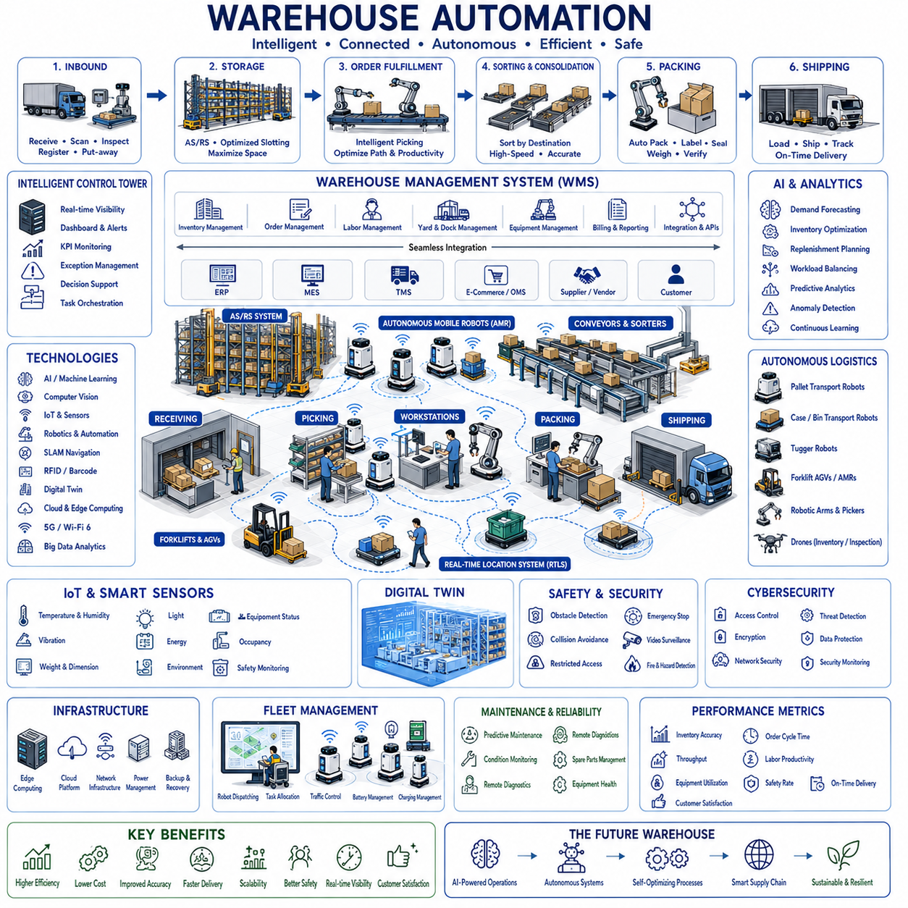
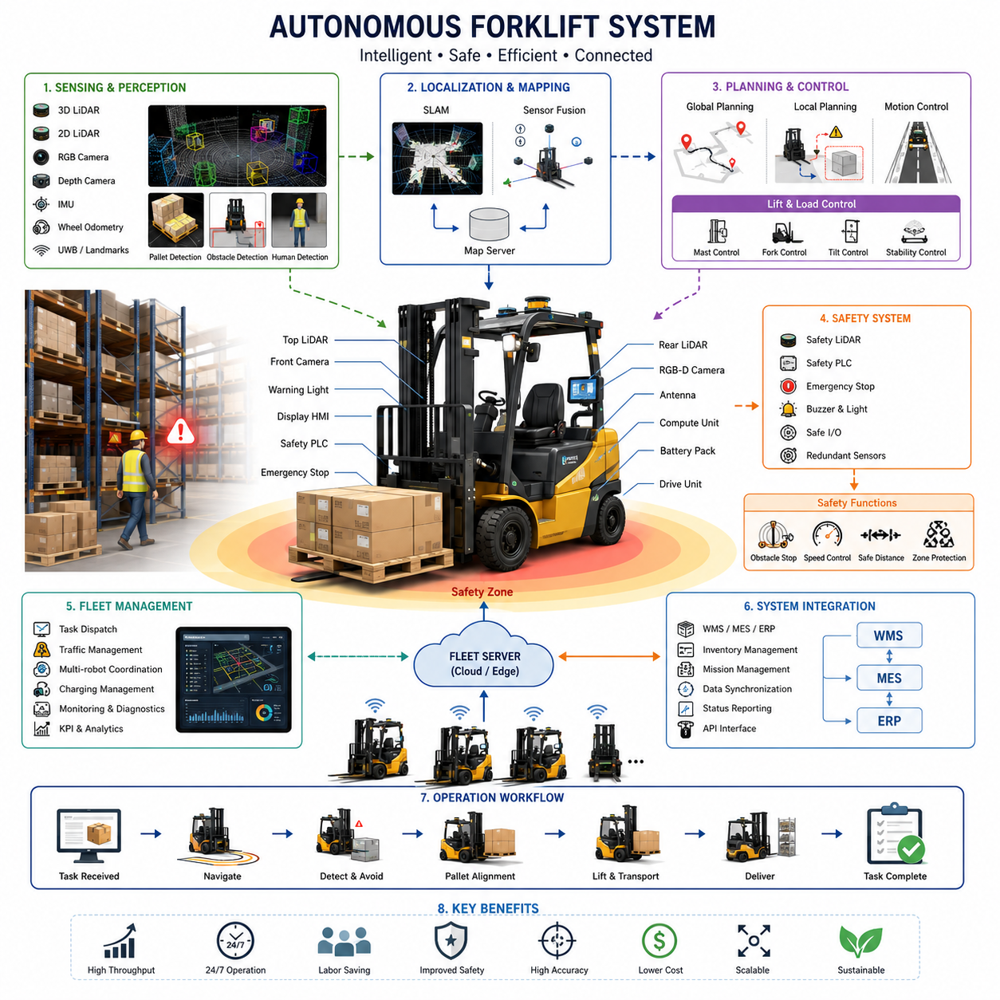
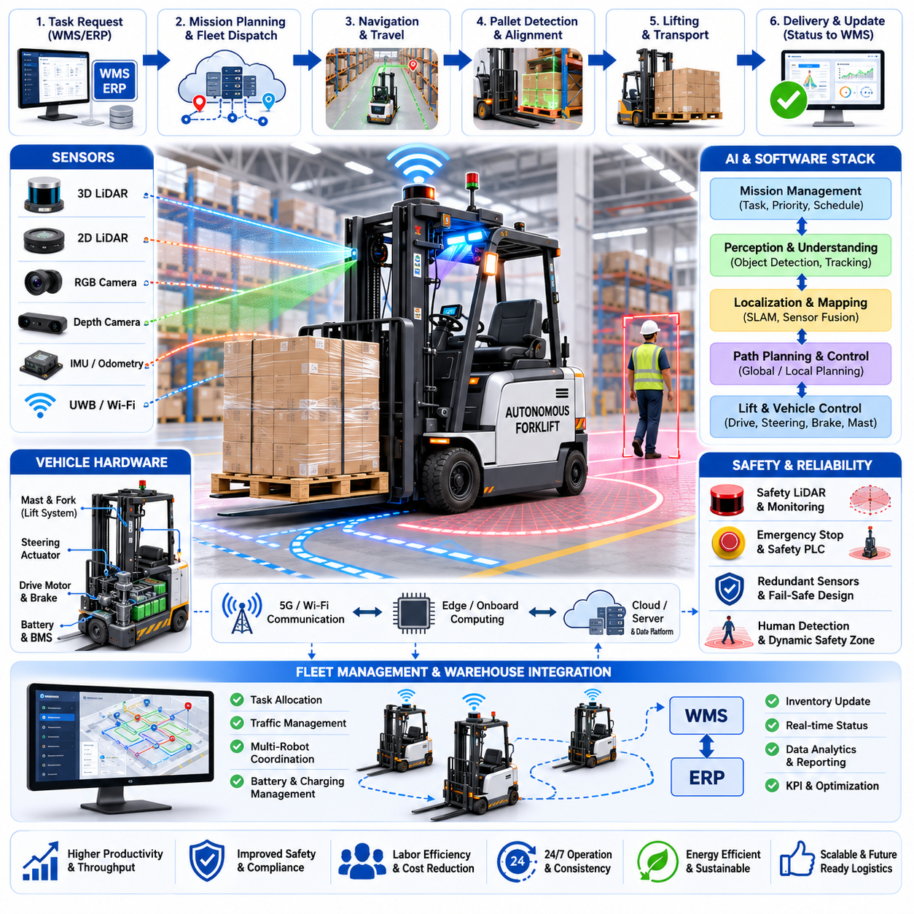
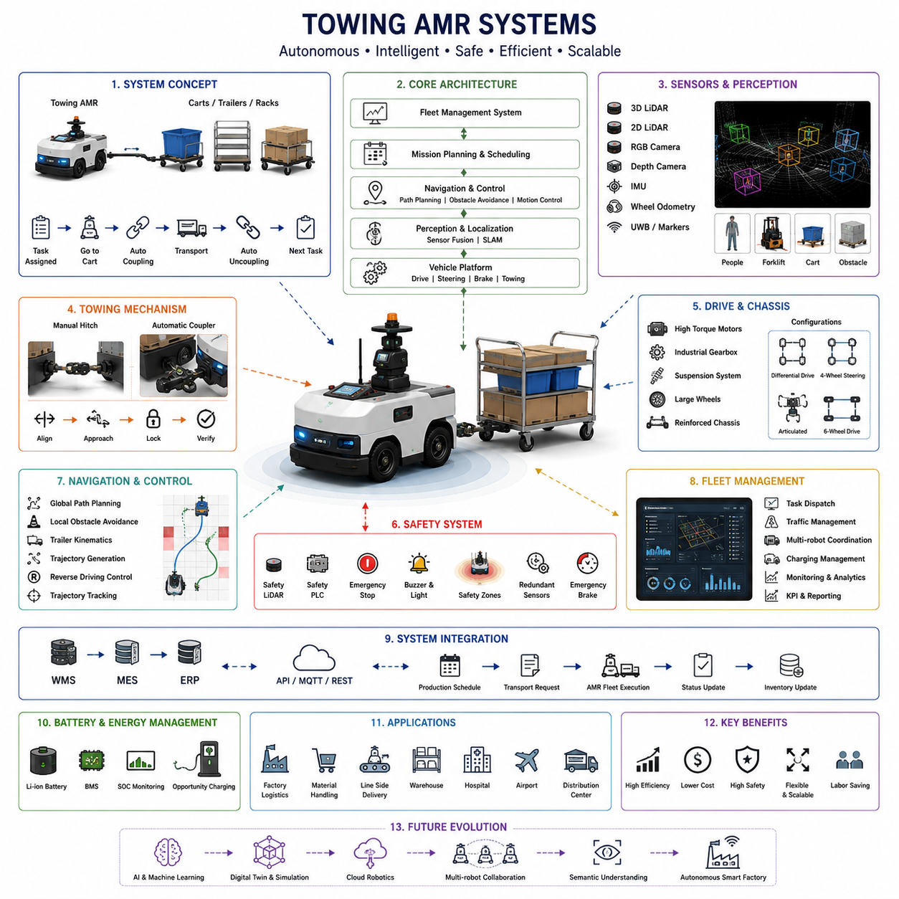
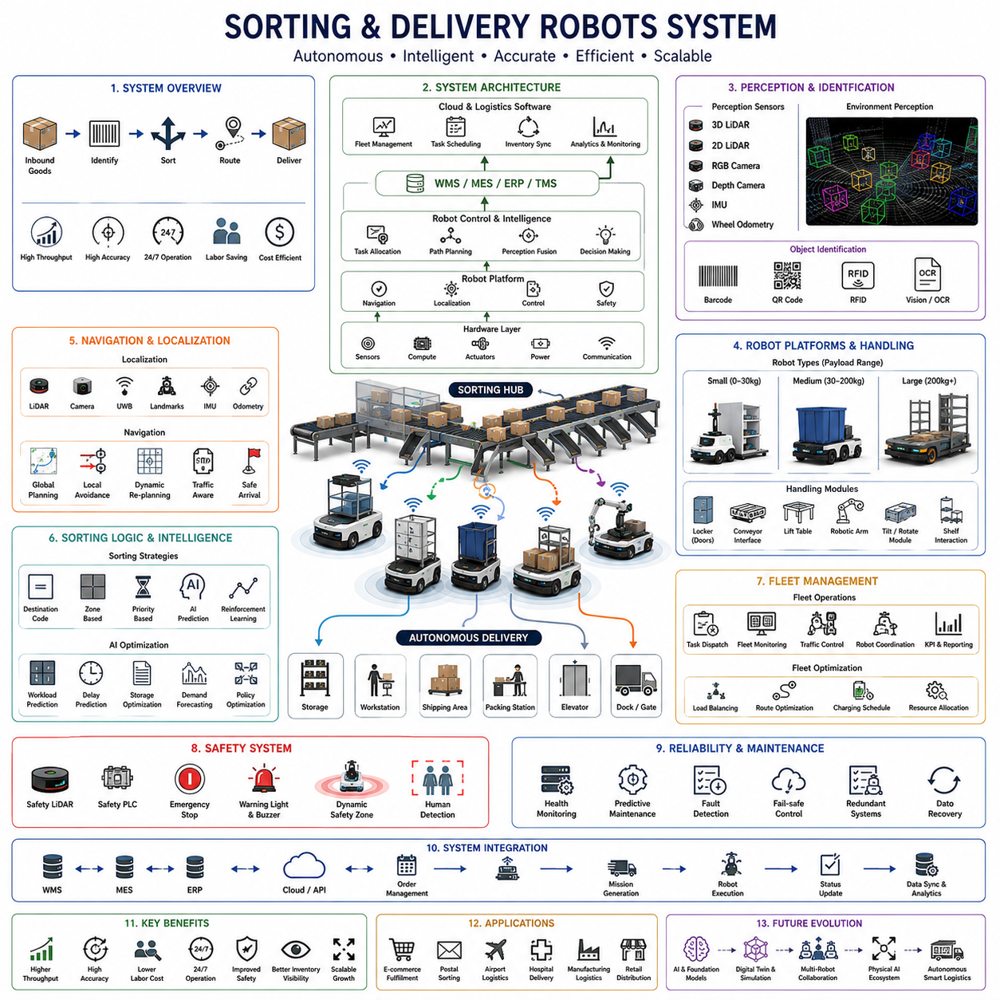
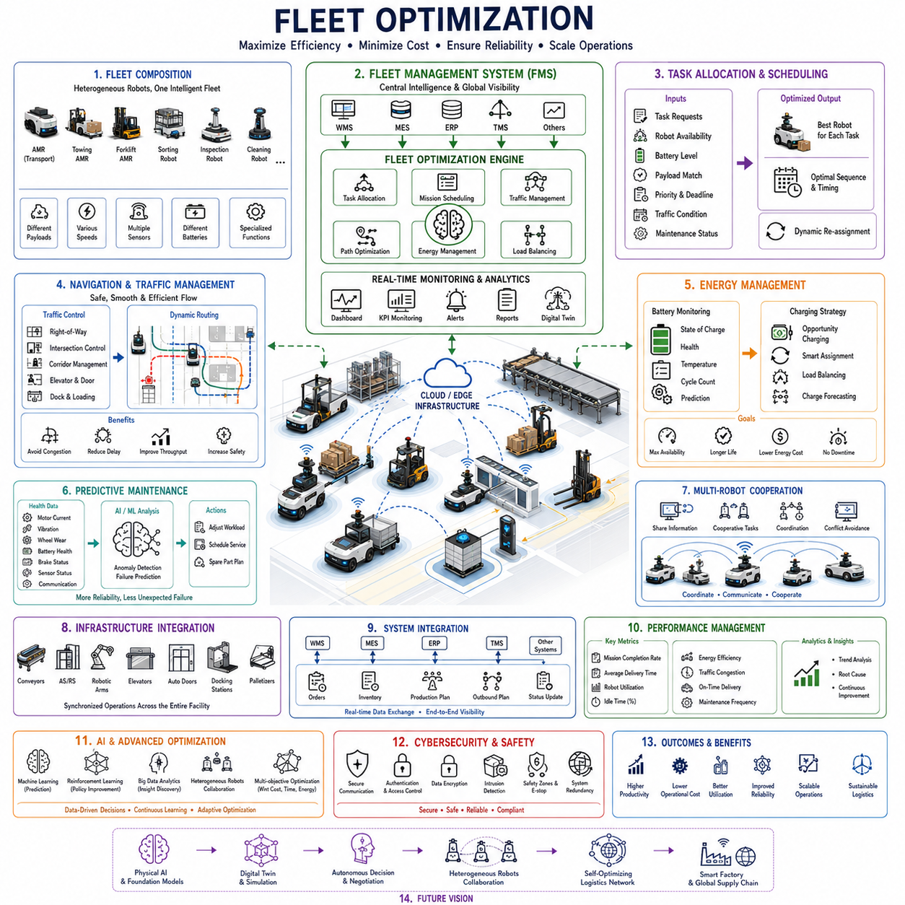

**Volume 01. AMR Foundations and System Architecture**

# 19. Logistics AMR · 물류 AMR

## 19.01 Warehouse Automation · 창고 자동화

{width="7.268055555555556in" height="7.268055555555556in"}

창고 자동화(Warehouse Automation)는 전통적인 창고를 상품, 정보, 장비, 작업자가 하나의 통합 시스템으로 운영되는 지능형 물류 환경으로 발전시키는 기술이다. 현대의 창고 자동화는 로봇(Robotics), 인공지능(Artificial Intelligence), 사물인터넷(Internet of Things, IoT), 고도화된 소프트웨어 플랫폼, 자율 운송 시스템을 결합하여 재고 정확도, 운영 효율성, 처리량(Throughput), 안전성, 고객 대응 능력을 향상시킨다. 창고 자동화는 사람을 완전히 대체하는 것이 아니라 입고, 보관, 피킹(Picking), 포장, 출하, 재고 관리 전 과정에서 작업자와 지능형 기계가 효율적으로 협업할 수 있도록 지원한다.

현대의 자동화 창고는 공급업체, 제조 공장, 물류센터로부터 제품이 입고되는 입고 물류(Inbound Logistics)에서 시작된다. 입고된 상품은 바코드 스캐너(Barcode Scanner), 무선주파수 식별(Radio Frequency Identification, RFID), 머신 비전(Machine Vision), 자동 검사 장비를 통해 식별된 후 창고관리시스템(Warehouse Management System, WMS)에 등록된다. 제품의 크기, 무게, 상태, 배치(Batch) 정보, 유효기간, 보관 조건이 자동으로 확인되며 재고 정보가 즉시 갱신되어 수작업 입력과 입고 오류를 최소화한다.

창고관리시스템(Warehouse Management System, WMS)은 재고, 보관 위치, 주문 처리, 운송 요청, 작업자 배치, 장비 활용을 통합 관리하는 디지털 제어센터(Digital Control Center) 역할을 수행한다. 모든 상품 이동은 지속적으로 기록되며 전사적자원관리(Enterprise Resource Planning, ERP), 제조실행시스템(Manufacturing Execution System, MES), 운송관리시스템(Transportation Management System, TMS), 고객 주문 시스템과 실시간으로 연동된다. 이러한 실시간 재고 가시성은 정확한 운영 계획과 고객 수요 변화에 대한 신속한 대응을 가능하게 한다.

인공지능(Artificial Intelligence)은 재고 추세, 계절별 수요, 과거 주문 이력, 공급업체 성과, 운송 일정, 창고 수용 능력을 분석하여 창고 운영의 의사결정을 향상시킨다. 머신러닝(Machine Learning)은 필요한 재고 수준을 예측하고, 재보충 시점을 추천하며, 보관 위치를 최적화하고, 작업 부하를 균형 있게 배분하며, 병목 현상이 발생하기 전에 출하 수요를 예측한다. 이러한 지능형 최적화는 복잡한 수작업 계획 없이도 변화하는 비즈니스 환경에 자동으로 적응한다.

컴퓨터 비전(Computer Vision)은 팔레트(Pallet), 박스(Carton), 컨테이너(Container), 지게차(Forklift), 선반(Shelf), 로봇, 작업자, 하역장(Loading Dock)을 자동으로 인식하여 창고 전반의 시각적 인식을 담당한다. 비전 시스템은 바코드 품질을 확인하고, 파손된 제품을 탐지하며, 잘못 보관된 재고를 식별하고, 팔레트 크기를 측정하며, 안전 상태를 감시하고, 자율주행을 지원한다. 이러한 지속적인 시각 검사는 재고 정확성을 향상시키고 제품 취급 오류와 운영 중단을 최소화한다.

자율이동로봇(Autonomous Mobile Robot, AMR)은 현대 창고에서 유연한 자재 운송을 수행한다. 로봇은 팔레트, 박스, 빈(Bin), 원자재, 완제품, 포장 자재를 입고 구역, 보관 선반, 생산 라인, 분류 스테이션, 포장 셀, 출하장 사이에서 운반한다. 동시적 위치추정 및 지도작성(Simultaneous Localization and Mapping, SLAM), 레이저 스캐너(Laser Scanner), 깊이 카메라(Depth Camera), 관성측정장치(Inertial Measurement Unit, IMU), 의미 기반 창고 지도(Semantic Warehouse Map)를 이용하여 작업자와 산업용 차량이 함께 이동하는 복잡한 환경에서도 안전하게 주행할 수 있다.

자동보관회수시스템(Automated Storage and Retrieval System, AS/RS)은 창고 공간 활용도를 극대화하면서도 재고 접근성과 입출고 속도를 향상시킨다. 고밀도 보관 랙(High-Density Storage Rack), 자동 크레인, 셔틀 시스템, 로봇 리프트, 수직 보관 모듈, 지능형 컨베이어는 이동 거리를 줄이고 피킹 정확도를 향상시킨다. 자동 보관 알고리즘은 제품 수요, 회전율, 무게, 크기, 취급 조건을 고려하여 최적의 보관 위치를 지속적으로 결정한다.

주문 처리(Order Fulfillment)는 고객 만족도를 결정하는 핵심 프로세스이다. 지능형 피킹 시스템(Intelligent Picking System)은 로봇, 컨베이어, 무인운반차(Automated Guided Vehicle, AGV), 작업자를 효율적으로 조정하여 이동 거리와 작업 시간을 최소화하면서 주문 상품을 수집한다. 인공지능은 주문 규모, 제품 특성, 작업량, 운영 우선순위를 고려하여 최적의 피킹 전략을 실시간으로 선택한다.

분류(Sorting) 및 통합(Consolidation) 작업은 목적지, 배송 방식, 고객 주문, 운송 경로, 생산 일정에 따라 상품을 자동으로 정리한다. 자동 분류 설비는 바코드 스캐너, RFID, 머신 비전, 로봇 매니퓰레이터(Robotic Manipulator), 컨베이어 분기 장치를 이용하여 최소한의 작업자 개입으로 제품을 빠르게 분류한다. 고속 자동 분류는 창고 처리량을 높이고 배송 오류를 줄이며 물류 신뢰성을 향상시킨다.

포장 자동화(Packing Automation)는 제품의 크기, 무게, 파손 가능성, 운송 조건을 분석하여 가장 적합한 포장 방식을 자동으로 선택한다. 지능형 포장 시스템은 박스 조립, 제품 적재, 완충재 삽입, 라벨 부착, 봉인, 중량 측정, 출하 검증을 자동으로 수행하면서 포장 자재 낭비를 최소화한다. 자동 품질 검사는 출하 전에 포장의 완전성을 확인하여 배송 품질을 향상시킨다.

출하 물류(Outbound Logistics)는 창고와 운송업체, 물류센터, 유통업체, 최종 고객을 연결하는 과정이다. 운송관리시스템(Transportation Management System, TMS)은 창고 운영과 직접 연계되어 차량 도착 일정, 하역장 배정, 배송 우선순위, 운송사 선택, 경로 최적화를 수행한다. 창고 작업과 운송 네트워크의 지속적인 동기화는 대기 시간을 줄이고 배송 성능과 자원 활용도를 향상시킨다.

사물인터넷(Internet of Things, IoT)은 창고 시설, 장비, 재고, 환경 조건, 운영 자산을 지속적으로 모니터링한다. 스마트 센서(Smart Sensor)는 온도, 습도, 진동, 조명, 장비 상태, 에너지 소비, 공간 점유율, 냉장 설비 상태, 제품 보관 환경을 실시간으로 측정한다. 이러한 지속적인 센싱은 예지보전(Predictive Maintenance), 환경 규정 준수, 재고 보존, 운영 최적화를 지원하며 창고 전체의 운영 상태를 실시간으로 제공한다.

실시간위치추적시스템(Real-Time Location System, RTLS)은 팔레트, 컨테이너, 지게차, 자율 로봇, 트레일러, 이동 장비, 작업자의 위치를 지속적으로 추적한다. 위치 정보는 재고 검색 시간을 줄이고 분실을 방지하며 작업 배정을 최적화하고 장비 활용도를 향상시킨다. 또한 교통 흐름, 제한 구역, 충돌 위험, 비상 대피 상황을 모니터링하여 창고 안전성을 강화한다.

플릿 관리 시스템(Fleet Management System)은 대규모 창고에서 여러 대의 자율 로봇을 동시에 관리한다. 작업 배정은 로봇의 가용성, 배터리 상태, 적재 용량, 교통 혼잡도, 장비 호환성, 충전 일정, 운송 우선순위를 종합적으로 고려하여 수행된다. 이러한 지능형 플릿 관리는 혼잡을 방지하고 운송 효율을 극대화하며 로봇 활용률을 균형 있게 유지하여 연중무휴 창고 운영을 지원한다.

디지털 트윈(Digital Twin)은 창고 구조, 보관 시스템, 재고, 로봇 플릿, 컨베이어, 작업자 배치, 운송 활동, 운영 절차를 통합한 가상 창고 모델을 제공한다. 엔지니어는 시설 확장, 장비 교체, 보관 전략, 로봇 배치, 교통 관리, 비상 대응 시나리오를 실제 적용 전에 시뮬레이션할 수 있다. 실제 창고와 디지털 모델의 지속적인 동기화는 운영 위험을 줄이면서 데이터 기반 최적화를 가능하게 한다.

클라우드 컴퓨팅(Cloud Computing)과 엣지 컴퓨팅(Edge Computing)은 창고 운영 정보를 효율적으로 처리하기 위해 함께 사용된다. 엣지 컴퓨팅은 로봇 제어, 안전 감시, 머신 비전, 센서 처리, 장비 제어와 같이 지연 시간이 중요한 작업을 현장에서 수행한다. 클라우드는 대규모 데이터 분석, 기업 시스템 연동, 머신러닝 모델 학습, 디지털 트윈 동기화, 다중 창고 통합 운영을 담당한다. 이러한 하이브리드 컴퓨팅(Hybrid Computing)은 높은 응답성과 확장성을 동시에 제공한다.

안전(Safety)은 자율 로봇, 지게차, 컨베이어, 크레인, 작업자가 동시에 활동하는 자동화 창고에서 가장 중요한 요소이다. 안전 시스템은 장애물 탐지, 충돌 회피, 비상정지 기능, 속도 제어, 출입 통제, 교통 관리, 위험 예측, 지속적인 환경 감시를 포함한다. 인간 중심의 안전 정책은 자동화를 통해 생산성을 향상시키면서도 작업자의 안전과 운영 신뢰성을 보장한다.

사이버보안(Cybersecurity)은 무단 접근, 통신 도청, 랜섬웨어(Ransomware), 소프트웨어 변조, 운영 중단으로부터 창고 시스템을 보호한다. 안전한 인증(Authentication), 암호화 통신(Encrypted Communication), 신원 관리(Identity Management), 네트워크 분리(Network Segmentation), 소프트웨어 무결성 검증(Software Integrity Verification), 지속적인 취약점 분석(Continuous Vulnerability Assessment), 보안 모니터링(Security Monitoring)은 정보 시스템과 운영 기술(Operational Technology)을 동시에 보호한다. 강력한 사이버보안은 물류 운영의 연속성과 재고의 신뢰성을 유지하는 핵심 요소이다.

유지보수(Maintenance)는 인공지능과 지속적인 센서 모니터링을 기반으로 하는 예지진단(Predictive Diagnostics)을 중심으로 발전하고 있다. 모터, 컨베이어, 로봇 매니퓰레이터, 자율주행 차량, 보관 시스템, 스캐너, 통신 장비, 전력 설비는 지속적으로 상태를 분석하여 이상 징후를 조기에 발견한다. 예지보전은 고장이 발생하기 전에 유지보수를 수행하여 장비 신뢰성과 창고 가동률을 향상시킨다.

창고 성능(Performance)은 재고 정확도, 주문 처리율, 피킹 정확도, 처리량, 보관 공간 활용률, 로봇 활용률, 장비 가동률, 배송 정확도, 주문 처리 시간, 운송 효율, 작업 생산성, 에너지 소비, 유지보수 비용, 안전 사고, 고객 만족도 등의 지표를 통해 평가된다. 지속적인 성능 분석은 운영 개선 기회를 발견하고 근거 기반의 경영 의사결정을 지원한다.

미래의 창고 자동화(Future Warehouse Automation)는 다중모달 파운데이션 모델(Multimodal Foundation Model), 대규모 언어모델(Large Language Model, LLM), 디지털 트윈(Digital Twin), 자율 로봇 플릿(Autonomous Robot Fleet), 협업 매니퓰레이션(Collaborative Manipulation), 지능형 일정관리(Intelligent Scheduling), 예측형 공급망 분석(Predictive Supply Chain Analytics), 고도화된 컴퓨터 비전(Advanced Computer Vision), 자기 최적화 물류 플랫폼(Self-Optimizing Logistics Platform)을 하나의 통합 물류 생태계로 결합하게 될 것이다. 미래의 창고는 단순한 보관 시설이 아니라 제조 시스템, 운송 네트워크, 공급업체, 유통업체, 고객과 실시간으로 연결되어 스스로 계획하고 학습하며 자원을 최적화하는 지능형 물류 허브(Intelligent Logistics Hub)로 발전하게 될 것이다. 이러한 지능형 물류 생태계는 더욱 높은 효율성, 뛰어난 유연성, 강한 공급망 회복력, 빠른 고객 대응 능력을 제공하면서도 안전하고 지속가능한 창고 운영을 실현하게 될 것이다.

## 19.02 Autonomous Forklifts · 자율 지게차

{width="7.268055555555556in" height="7.268055555555556in"}{width="7.268055555555556in" height="7.268055555555556in"}

자율지게차(Autonomous Forklifts)는 전통적인 산업용 지게차와 첨단 인지(Perception), 위치추정(Localization), 경로계획(Path Planning), 플릿관리(Fleet Management) 기술을 결합한 가장 성숙한 산업용 자율이동로봇(AMR, Autonomous Mobile Robot) 분야 중 하나이다. 기존 지게차가 운전자의 조작에 전적으로 의존하는 것과 달리, 자율지게차는 팔레트(Pallet)의 운반, 적재, 회수, 상·하차, 재고 이동 등의 작업을 최소한의 인간 개입 또는 완전 무인으로 수행한다. 이러한 시스템은 창고(Warehouse), 제조공장(Factory), 물류센터(Distribution Center), 냉장창고(Cold Storage), 물류 허브(Logistics Hub) 등 반복적인 팔레트 운송이 운영비용의 상당 부분을 차지하는 환경에서 활용된다. 자율주행과 산업용 리프팅(Lifting) 메커니즘을 통합함으로써 생산성을 크게 향상시키고, 사고 감소, 인력 부족 문제 해결, 운영 품질의 일관성을 동시에 확보할 수 있다.

현대의 자율지게차는 산업용 지게차의 기계적 견고성을 그대로 유지하면서 사람의 판단을 계층형 로봇 지능(Layered Robotic Intelligence)으로 대체한다. 전체 시스템은 드라이브 바이 와이어(Drive-by-Wire) 섀시, 조향 액추에이터(Steering Actuator), 마스트(Mast) 및 리프팅 제어장치, 제동 시스템, 인지 센서, 위치추정 소프트웨어, 안전 제어기(Safety Controller), 온보드 컴퓨팅(Onboard Computing), 무선 통신 인터페이스로 구성된다. 상위 계층에서는 임무계획(Mission Planning)이 운송 작업을 할당하고, 차량 내부의 자율주행 시스템은 경로 결정, 장애물 회피, 팔레트 정렬, 리프팅 작업, 안전한 운반을 독립적으로 수행한다. 이러한 계층형 구조는 플릿 수준의 물류 최적화와 실시간 차량 제어를 분리하여 다수의 자율지게차가 대규모 시설에서 효율적으로 협업할 수 있도록 한다.

창고 환경은 좁은 통로, 고밀도 랙(Rack), 작업자, 수동 지게차, 카트(Cart), 지속적으로 변화하는 재고가 혼재하는 복잡한 공간이므로 자율주행 난이도가 매우 높다. 따라서 자율지게차는 센티미터 수준의 위치 정확도와 높은 신뢰성의 장애물 검출 능력을 동시에 요구한다. 개방된 공장 바닥과 달리 창고의 랙 구조는 반복적인 형태를 가지므로 카메라 기반 위치추정만으로는 충분하지 않은 경우가 많다. 이러한 이유로 대부분의 자율지게차는 2D 라이다(2D LiDAR), 3D 라이다(3D LiDAR), RGB 카메라(RGB Camera), 깊이 카메라(Depth Camera), 관성측정장치(IMU), 휠 오도메트리(Wheel Odometry), 초광대역(UWB, Ultra-Wideband) 위치 시스템 또는 인공 랜드마크(Landmark)를 함께 사용하는 다중 센서 구조를 채택한다.

위치추정(Localization)은 자율지게차의 핵심 기술 중 하나이다. 팔레트를 정확하게 들어 올리기 위해서는 단순한 전역 위치뿐 아니라 팔레트와의 상대적인 정렬 정확도가 매우 중요하다. 동시 위치추정 및 지도작성(SLAM, Simultaneous Localization and Mapping)은 지속적으로 지도를 갱신하면서 차량의 위치를 안정적으로 유지한다. 센서 융합(Sensor Fusion)은 휠 엔코더(Wheel Encoder), 관성센서, 라이다 스캔 정합(Scan Matching), 시각적 랜드마크를 통합하여 바퀴 미끄러짐, 바닥의 불균형, 일시적인 가림(Occlusion), 오도메트리 누적 오차를 보정한다. 대규모 물류센터에서는 클라우드 기반 지도 서버(Map Server)가 시설 전체의 최신 지도를 모든 자율지게차에 배포하여 일관된 환경 정보를 유지한다.

인지 시스템(Perception System)은 고정된 시설물과 이동 장애물을 동시에 이해해야 한다. 고해상도 라이다는 선반, 팔레트, 벽, 이동 통로의 기하학적 정보를 안정적으로 측정한다. 스테레오 카메라(Stereo Camera)와 깊이 센서는 팔레트 개구부, 손상된 팔레트, 적재된 화물, 작업자를 인식한다. 딥러닝(Deep Learning) 기반 객체 인식 모델은 지게차, 보행자, 카트, 다른 자율로봇, 안전시설, 예상하지 못한 장애물을 분류하고 이동 경로를 예측한다. 다중 센서 융합은 먼지, 반사성이 높은 포장재, 조명 변화, 부분적인 가림과 같은 실제 물류 환경에서도 높은 인식 성능을 유지하도록 지원한다.

팔레트 검출(Pallet Detection)은 일반 AMR과 자율지게차를 구분하는 대표적인 기능이다. 시스템은 다양한 방향, 높이, 적재 상태, 포장 형태에서 팔레트의 구조를 정확하게 인식해야 한다. 컴퓨터 비전(Computer Vision)은 팔레트의 포크 삽입 공간을 찾고, 깊이 센서는 포크의 삽입 각도와 거리를 계산한다. 이후 로봇은 6자유도(Six Degrees of Freedom) 자세를 정밀하게 계산한 뒤 리프팅 작업을 시작한다. 아주 작은 정렬 오차도 포크 충돌, 팔레트 손상, 적재 불안정, 작업 실패로 이어질 수 있으므로 최종 정렬은 근거리 인지 시스템이 독립적으로 수행하는 경우가 많다.

리프트 제어(Lift Control)는 마스트 상승, 포크 기울기, 좌우 위치 조정, 차량 이동을 동시에 제어해야 한다. 일반적인 이동로봇과 달리 자율지게차는 무게중심이 지속적으로 변하는 화물을 직접 들어 올리므로 차량 동역학(Vehicle Dynamics)과 적재 안정성 분석을 함께 고려해야 한다. 가속, 감속, 회전 반경, 마스트 이동, 리프팅 속도는 모두 화물의 흔들림과 제품 손상을 방지하도록 통합적으로 제어된다. 대형 화물을 운반하는 경우에는 차축 하중, 모터 토크, 제동 성능, 배터리 소비량도 지속적으로 모니터링된다.

경로계획(Path Planning)은 단순히 최단 경로를 계산하는 수준을 넘어선다. 자율지게차는 통로 폭, 교통 혼잡도, 회전 가능 공간, 랙 접근성, 화물 크기, 안전구역, 작업 우선순위를 모두 고려하여 최적의 이동 경로를 선택한다. 전역 경로계획(Global Planner)은 임무 효율을 고려한 전체 이동 경로를 생성하며, 지역 경로계획(Local Planner)은 작업자나 이동 장애물에 실시간으로 대응한다. 동적 장애물 회피(Dynamic Obstacle Avoidance)는 임무 효율을 유지하면서도 안전한 우회 경로를 지속적으로 생성한다. 대규모 물류센터에서는 플릿관리 시스템(Fleet Management System)이 수백 개의 운송 작업을 동시에 조정하면서 전체 이동 거리와 혼잡도를 최소화한다.

다수의 자율지게차, 견인형 AMR(Towing AMR), 피킹 로봇(Picking Robot), 수동 운전 차량이 함께 운용되는 환경에서는 교통관리(Traffic Management)가 매우 중요하다. 플릿관리 시스템은 장비 가용성, 배터리 상태, 이동 거리, 운송 우선순위, 창고 처리량을 고려하여 작업을 배정한다. 교통 제어 알고리즘은 교차로 교착상태(Deadlock)를 방지하고, 우선 통행 규칙을 적용하며, 좁은 통로의 진입을 조정하고, 충전 스케줄까지 최적화한다. 또한 로봇 간 통신을 통해 서로의 이동을 조정함으로써 대기시간을 최소화하면서도 안전거리를 유지한다.

사람과 함께 작업하는 환경에서는 안전(Safety)이 가장 중요한 설계 요소이다. 자율지게차는 수백 킬로그램에서 수 톤에 이르는 화물을 운반하기 때문에 기능안전(Functional Safety) 구조는 중복 센서(Redundant Sensors), 비상제동(Emergency Braking), 안전등급 라이다(Safety-rated Laser Scanner), 안전 PLC(Safety PLC), 비상정지 회로(Emergency Stop Circuit), 시스템 상태 감시를 포함한다. 안전구역(Safety Zone)은 차량 속도, 적재 중량, 주변 환경에 따라 동적으로 변경되며, 사람 검출 알고리즘은 충돌 위험이 증가하면 감속, 경고, 완전 정지 순으로 대응한다.

산업용 안전 규정 준수를 위해 자율지게차는 기계안전(Machinery Safety)과 산업용 차량 규정을 동시에 만족해야 한다. 검증 항목에는 비상정지 성능, 제동거리 시험, 센서 이중화 분석, 고장 검출 능력, 소프트웨어 무결성, 사이버보안(Cybersecurity), 기능안전 인증이 포함된다. 또한 센서 고장, 통신 장애, 위치추정 실패, 액추에이터 이상, 작업자의 예측 불가능한 행동, 불안정한 적재 상태, 전원 장애와 같은 다양한 위험 시나리오를 분석하여 항상 안전한 상태로 전환할 수 있도록 설계된다.

배터리 관리(Battery Management)는 운영 효율을 결정하는 핵심 요소이다. 대부분의 자율지게차는 리튬이온 배터리(Lithium-ion Battery)와 배터리관리시스템(BMS, Battery Management System)을 사용하며 셀 전압, 온도, 충전 횟수, 잔여 용량, 열화 상태를 지속적으로 모니터링한다. 기회 충전(Opportunity Charging)은 대기 시간 동안 부분 충전을 수행하여 장시간 연속 운전을 가능하게 한다. 플릿관리 소프트웨어는 전체 물류 효율을 고려하여 충전 일정을 자동으로 최적화한다.

창고관리시스템(WMS, Warehouse Management System)과의 연동은 자율지게차를 전체 물류 시스템의 일부로 통합한다. WMS는 재고 관리, 생산 일정, 출하 계획, 입고 작업을 기반으로 운송 임무를 생성한다. 자율지게차는 이를 자동으로 수신하여 작업을 수행하고, 완료 결과를 보고하며, 재고 위치를 갱신한다. 또한 제조실행시스템(MES, Manufacturing Execution System), 전사적자원관리(ERP, Enterprise Resource Planning)와도 연동되어 물류 전 과정의 가시성(Visibility)을 제공한다.

인공지능(AI)은 단순한 자율주행을 넘어 운영 최적화까지 지원한다. 머신러닝(Machine Learning)은 교통 혼잡을 예측하고, 작업 시간을 추정하며, 플릿 스케줄을 최적화하고, 손상된 팔레트를 인식하며, 장비 이상을 조기에 탐지한다. 예지보전(Predictive Maintenance)은 모터 전류, 진동, 유압, 조향 성능, 제동 특성, 배터리 열화 데이터를 분석하여 고장을 사전에 예측한다. 운영 과정에서 축적되는 데이터를 기반으로 AI는 운송 효율을 지속적으로 향상시킨다.

시뮬레이션(Simulation)과 디지털 트윈(Digital Twin)은 실제 설치 이전의 위험을 크게 줄여준다. 가상 창고 모델은 랙 배치, 운송 경로, 팔레트 흐름, 작업자 이동, 운영 일정을 현실적으로 재현한다. 이를 통해 엔지니어는 자율주행 알고리즘, 교통관리 전략, 플릿 협업, 안전 동작을 실제 생산을 중단하지 않고 검증할 수 있다. 구축 이후에도 디지털 트윈은 실제 운영 데이터를 시뮬레이션과 비교하여 지속적인 성능 개선과 운영 최적화를 지원한다.

자율지게차는 처리량 증가, 운송 품질의 일관성 확보, 재고 정확도 향상, 인력 의존도 감소, 작업장 안전성 향상, 24시간 연속 운영과 같은 다양한 운영상의 이점을 제공한다. 일정한 위치정렬은 팔레트 손상을 줄이고, 최적화된 경로는 이동 거리와 에너지 소비를 감소시킨다. 자동화된 작업 수행은 작업자에 따른 편차를 제거하여 물류센터가 항상 예측 가능한 성능을 유지하도록 지원한다. 이러한 장점은 전 세계적인 인력 부족과 공급망 복잡성이 증가하는 상황에서 더욱 중요한 경쟁력이 된다.

미래의 자율지게차는 견인형 AMR(Towing AMR), 팔레트 셔틀(Pallet Shuttle), 휴머노이드(Humanoid), 로봇 매니퓰레이터(Robot Manipulator), 자동창고시스템(AS/RS, Automated Storage and Retrieval System), 지능형 창고관리 소프트웨어와 하나의 협업 생태계를 구성하는 방향으로 발전하고 있다. 파운데이션 모델(Foundation Model), 멀티모달 인지(Multimodal Perception), 강화학습(Reinforcement Learning), 엣지 AI(Edge AI), 디지털 트윈 기술은 자율지게차가 창고 환경을 의미적으로 이해하고, 복잡한 물류 목표를 스스로 판단하며, 변화하는 시설 구조에 적응하고, 다양한 로봇과 사람과 자연스럽게 협력하도록 발전시킬 것이다. 궁극적으로 이러한 기술은 산업 수준의 안전성, 확장성, 신뢰성을 유지하면서도 물류 운영을 지속적으로 최적화하는 고도 자율 물류 인프라를 실현하게 될 것이다.

## 19.03 Towing AMR Systems · 견인 AMR 시스템

{width="7.268055555555556in" height="7.268055555555556in"}

견인형 자율이동로봇 시스템(Towing Autonomous Mobile Robot Systems)은 화물을 자체 차체 위에 직접 적재하는 방식이 아니라 카트(Cart), 트레일러(Trailer), 랙(Rack), 팔레트(Pallet), 또는 여러 개의 바퀴 달린 운반 장치를 견인하도록 설계된 산업용 이동로봇이다. 리프팅 로봇이나 자율지게차와 달리 견인형 AMR은 이동 플랫폼과 화물 운반 장치를 분리하여 운송 효율을 극대화한다. 이러한 구조는 하나의 자율주행 차량이 다양한 수동 카트를 공장, 창고, 병원, 공항, 제조시설 등에서 반복적으로 운반할 수 있도록 한다. 반복적인 물류 운송을 자동화하면서도 기존 시설의 변경을 최소화할 수 있기 때문에 현대 인트라로지스틱스(Intralogistics) 환경에서 경제적이고 확장성이 높은 솔루션으로 활용된다.

견인형 AMR의 기본 개념은 자율주행 기능과 지능형 견인 기능을 결합하는 것이다. 로봇은 반복적으로 사용할 수 있는 동력 견인차 역할을 수행하며, 표준화된 카트에는 원자재, 부품, 완제품, 생산 장비 등이 적재된다. 운송 작업이 할당되면 AMR은 지정된 카트로 자율 이동하여 자동 결합(Coupling)을 수행하고, 목적지까지 운반한 후 안전하게 분리(Uncoupling)한 다음 다음 작업을 수행한다. 이처럼 동력 차량과 수동 화물 운반 장치를 분리하면 적은 수의 견인 로봇으로 다수의 카트를 운영할 수 있으므로 전체 플릿(Fleet) 구축 비용을 크게 절감할 수 있다.

기계 구조(Mechanical Architecture)는 견인 성능을 결정하는 중요한 요소이다. 대형 트레일러를 견인할 경우 일반 AMR과는 다른 동적 하중(Dynamic Load)이 발생하므로 차체는 지속적인 견인력을 견딜 수 있는 충분한 강성과 정밀한 조향 성능을 동시에 확보해야 한다. 대형 견인형 AMR은 일반적으로 보강된 강철 프레임(Steel Frame), 고토크 구동 모터(High-Torque Drive Motor), 산업용 감속기(Industrial Gearbox), 대구경 바퀴(Large-diameter Wheel), 불규칙한 바닥 충격을 흡수하는 서스펜션(Suspension)을 적용한다. 또한 무게 중심과 하중 분포를 최적화하여 견인력을 높이고 타이어 마모와 주행 불안정을 최소화하도록 설계된다.

차량 구성(Vehicle Configuration)은 적용 분야에 따라 다양하게 설계된다. 실내 공장에서는 좁은 통로에서 높은 기동성을 제공하기 위해 차동구동(Differential Drive)을 주로 사용한다. 반면 대형 산업용 플랫폼은 대형 화물을 장거리 운반하기 위해 사륜조향(Four-Wheel Steering), 아커만 조향(Ackermann Steering), 굴절 조향(Articulated Steering), 또는 6륜 구동(Six-Wheel Drive)을 채택하기도 한다. 실외용 견인형 AMR은 노면 상태가 지속적으로 변화하는 환경에서도 안정적인 주행을 위해 전륜구동(All-Wheel Drive)과 독립 현가장치(Independent Suspension)를 적용하는 경우가 많다.

구동 시스템(Drive System)은 수 톤에 이르는 정지 상태의 화물을 출발시켜야 하므로 매우 높은 초기 토크(Starting Torque)를 제공해야 한다. 영구자석 동기모터(Permanent Magnet Synchronous Motor), 브러시리스 DC 모터(Brushless DC Motor), 산업용 AC 서보모터(Industrial AC Servo Motor)가 유성감속기(Planetary Gear Reducer)와 함께 사용되어 저속에서도 높은 견인력을 제공한다. 모터 제어기는 적재 중량, 경사도, 바퀴 미끄러짐, 차량 가속도 등을 실시간으로 분석하여 토크를 조절한다. 또한 트랙션 제어(Traction Control)는 휠 슬립(Wheel Slip)을 감지하여 구동력을 적절히 배분함으로써 어려운 노면에서도 안정적인 견인을 유지한다.

견인 장치(Towing Mechanism)는 플랫폼을 구성하는 핵심 기술 중 하나이다. 가장 단순한 방식은 고정식 견인핀(Tow Pin)이나 수동 연결 히치(Hitch)를 사용하는 것으로, 표준 산업용 카트에 적합하다. 보다 발전된 시스템은 사람의 개입 없이 트레일러를 자동으로 연결하고 분리하는 자동 커플러(Automatic Coupler)를 적용한다. 자동 커플러는 기계식 잠금장치(Mechanical Locking Mechanism), 전동 액추에이터(Electrical Actuator), 공압(Pneumatic), 유압(Hydraulic) 시스템과 함께 근접센서(Proximity Sensor), 카메라(Camera), 정렬 가이드(Alignment Guide)를 사용하여 정확한 결합을 수행한다. 차량이 이동하기 전에는 전체 결합 과정이 지속적으로 모니터링되어 완전한 잠금 상태가 확인된다.

자율주행 구조(Navigation Architecture)는 전역 임무계획(Global Mission Planning)과 고정밀 지역 위치제어(Local Positioning)를 결합한다. 견인형 AMR은 작업자, 수동 지게차, 다른 자율주행 차량, 생산 설비가 함께 움직이는 복잡한 산업 환경에서 운용된다. 따라서 자율주행 소프트웨어는 전역 경로계획(Global Path Planning), 지역 장애물 회피(Local Obstacle Avoidance), 행동계획(Behavior Planning), 차량 제어(Motion Control)를 통합하여 운영한다. 특히 트레일러를 연결하면 차량 전체 길이가 증가하므로 경로 생성 시 트레일러 운동학(Trailer Kinematics), 회전 반경(Turning Radius), 오프트래킹(Off-tracking), 연결각(Articulation Constraint)을 모두 고려해야 한다.

위치추정(Localization)은 다수의 카트가 밀집 배치된 공간에서 특히 중요하다. 센서 융합(Sensor Fusion)은 2D 라이다(2D LiDAR), 3D 라이다(3D LiDAR), RGB 카메라(RGB Camera), 깊이 카메라(Depth Camera), 휠 오도메트리(Wheel Odometry), 관성측정장치(IMU), 초광대역(UWB, Ultra-Wideband) 위치 시스템 또는 기준 마커(Fiducial Marker)를 결합하여 차량 위치를 높은 정확도로 추정한다. 동시 위치추정 및 지도작성(SLAM, Simultaneous Localization and Mapping)은 바퀴 미끄러짐, 바닥의 불균형, 일시적인 환경 변화에 지속적으로 대응한다. 이러한 고정밀 위치추정은 자동 커플링 과정에서 정렬 오차를 최소화하는 데 핵심적인 역할을 한다.

인지 시스템(Perception System)은 고정 시설물과 이동 장애물을 지속적으로 감시한다. 산업 현장에는 선반(Shelving), 기계설비(Machinery), 팔레트, 작업자, 지게차, 임시 적재 공간 등이 존재하므로 매우 복잡한 환경이 형성된다. 멀티모달 인지(Multi-modal Perception)는 라이다가 제공하는 기하학적 정보와 딥러닝(Deep Learning) 기반 비전 모델이 제공하는 의미 정보(Semantic Information)를 결합한다. 객체 검출(Object Detection)은 보행자, 지게차, 카트, 로봇, 안전시설, 예상하지 못한 장애물을 분류하고 이동 경로를 예측한다. 동적 장애물 예측(Dynamic Obstacle Prediction)은 잠재적인 충돌이 발생하기 전에 감속, 우회, 정지를 수행하도록 지원한다.

견인형 로봇의 운동계획(Motion Planning)은 일반 이동로봇보다 훨씬 복잡하다. 트레일러는 차량의 모든 움직임에 영향을 미치므로 경로 생성 과정에서 연결각, 회전 반경 제한, 흔들림(Swing), 제동 안정성, 후진 제한 등을 함께 고려해야 한다. 다물체 운동학 모델(Multi-body Kinematic Model)은 견인 차량과 트레일러 사이의 상호작용을 예측하여 생성된 경로가 실제로 주행 가능한지를 검증한다. 이러한 예측 모델은 좁은 공간에서 트레일러가 선반이나 설비와 충돌하는 위험을 크게 감소시킨다.

후진 주행(Reverse Driving)은 견인 시스템에서 가장 어려운 기술 중 하나이다. 전진과 달리 후진 시에는 연결각을 안정적으로 유지하면서 잭나이프(Jackknife) 현상을 방지해야 한다. 고급 제어 알고리즘은 연결각을 지속적으로 계산하고 이를 보정하기 위한 조향 명령을 생성한다. 모델 예측 제어(MPC, Model Predictive Control)는 수 초 후의 트레일러 움직임까지 예측하여 부드러운 후진 주차, 도킹(Docking), 좁은 통로 이동을 가능하게 한다. 이러한 기능은 숙련된 작업자 수준의 후진 작업을 자율적으로 수행할 수 있도록 한다.

플릿관리 시스템(Fleet Management System)은 대규모 공장과 물류센터에서 다수의 견인형 AMR을 동시에 운영한다. 중앙 스케줄링 소프트웨어는 생산 우선순위, 카트 가용성, 로봇 위치, 배터리 상태, 교통 상황, 예상 이동 시간을 고려하여 운송 작업을 할당한다. 교통관리(Traffic Management)는 교차로 혼잡을 방지하고, 공유 통로를 조정하며, 충전 자원을 효율적으로 배분하여 전체 운송 효율을 높인다. 이러한 협업 최적화는 불필요한 이동과 대기 시간을 줄여 물류 처리량을 향상시킨다.

창고관리시스템(WMS, Warehouse Management System), 제조실행시스템(MES, Manufacturing Execution System), 전사적자원관리(ERP, Enterprise Resource Planning)는 견인형 AMR 플릿과 지속적으로 데이터를 교환한다. 생산 일정은 자동으로 운송 작업을 생성하고, 작업 완료 후에는 재고와 생산 상태가 실시간으로 갱신된다. 표준 통신 인터페이스(Standard Communication Interface)는 자율 운송 시스템과 기존 산업용 소프트웨어를 자연스럽게 연결한다. 이를 통해 견인형 AMR은 독립적인 로봇이 아니라 기업 전체 생산 물류 시스템의 핵심 구성 요소로 동작하게 된다.

안전 구조(Safety Architecture)는 작업자와 함께 중량 화물을 운반하기 때문에 무엇보다 중요하다. 안전등급 라이다(Safety-rated LiDAR)는 차량과 트레일러 주변에 동적으로 조절되는 보호구역(Protective Zone)을 형성한다. 비상제동(Emergency Braking), 이중 안전 제어기(Redundant Safety Controller), 독립 비상정지(Emergency Stop), 안전 PLC(Safety PLC), 경고등과 경고음, 시스템 자가진단은 여러 단계의 안전 계층을 구성한다. 차량 속도는 적재 중량, 회전 반경, 작업자와의 거리, 환경 복잡도를 고려하여 자동으로 조절되어 산업 안전 규정을 만족한다.

기능안전 엔지니어링(Functional Safety Engineering)은 센서 고장, 통신 장애, 트레일러 분리, 액추에이터 이상, 위치추정 실패, 제동장치 고장, 배터리 이상, 예상하지 못한 장애물 출현과 같은 다양한 고장 상황을 분석한다. 고장 검출 알고리즘(Fault Detection Algorithm)은 하드웨어와 소프트웨어 상태를 지속적으로 감시하며 이상이 발생하면 미리 정의된 안전 상태(Safe State)로 차량을 전환한다. 이중 센서, 페일세이프(Fail-safe) 제동, 비상 정지 절차는 임무 수행 중에도 높은 신뢰성을 보장한다.

배터리 시스템(Battery System)은 여러 교대 근무 동안 지속적으로 운송 작업을 수행하기 때문에 운영 효율에 직접적인 영향을 준다. 대용량 리튬인산철 배터리(LFP, Lithium Iron Phosphate) 또는 리튬이온 배터리(Lithium-ion Battery)는 배터리관리시스템(BMS, Battery Management System)과 함께 전압, 전류, 온도, 충전 상태(State of Charge), 장기적인 열화 상태를 지속적으로 관리한다. 기회 충전(Opportunity Charging)은 대기 시간 동안 자동 충전을 수행하여 생산을 중단하지 않고 연속 운전을 가능하게 한다. 플릿 수준의 에너지 관리(Energy Management)는 다수의 로봇 충전 일정을 최적화하여 전체 가동률을 높인다.

인공지능(AI)은 단순한 자율주행을 넘어 전체 운송 효율을 지속적으로 향상시킨다. 머신러닝(Machine Learning)은 과거 운송 데이터를 분석하여 생산 병목을 예측하고, 작업 완료 시간을 추정하며, 교통 흐름을 최적화하고, 플릿 자원을 동적으로 재배치한다. 예지보전(Predictive Maintenance)은 모터 전류, 감속기 진동, 바퀴 마모, 베어링 온도, 제동 성능, 배터리 열화를 분석하여 실제 고장이 발생하기 전에 유지보수를 계획한다. AI 기반 분석은 수천 건의 운송 데이터를 학습하여 물류 효율을 지속적으로 개선한다.

시뮬레이션(Simulation)과 디지털 트윈(Digital Twin)은 실제 배치 이전에 견인형 AMR의 성능을 충분히 검증할 수 있도록 지원한다. 가상 공장 모델은 생산 라인, 운송 경로, 작업 공간, 트레일러 구성, 작업자 이동, 운영 일정을 현실적으로 재현한다. 이를 통해 자율주행 알고리즘, 플릿 협업, 안전 기능, 교통관리 전략을 실제 생산을 중단하지 않고 검증할 수 있다. 운영 이후에도 디지털 트윈은 실제 데이터를 시뮬레이션 결과와 비교하여 지속적인 성능 개선과 운영 최적화를 지원한다.

견인형 AMR은 유연한 운송, 인력 의존도 감소, 안전성 향상, 인프라 투자 절감, 손쉬운 플릿 확장, 수동 운반 카트의 효율적 활용과 같은 다양한 장점을 제공한다. 하나의 견인 차량이 여러 개의 트레일러를 순차적으로 사용할 수 있기 때문에 모든 화물마다 동력 차량을 준비해야 하는 기존 방식보다 초기 투자 비용을 크게 줄일 수 있다. 또한 24시간 자율 운행을 통해 생산의 일관성을 향상시키고, 작업자의 반복 운반 작업, 산업재해, 물류 병목 현상을 크게 줄일 수 있다.

미래의 견인형 AMR은 창고 자동화(Warehouse Automation), 자율지게차(Autonomous Forklift), 로봇 매니퓰레이터(Robot Manipulator), 자동창고시스템(AS/RS, Automated Storage and Retrieval System), 기업 AI와 통합된 고도 지능형 물류 플랫폼으로 발전할 것이다. 파운데이션 모델(Foundation Model), 멀티모달 인지(Multimodal Perception), 강화학습(Reinforcement Learning), 클라우드 로보틱스(Cloud Robotics), 엣지 AI(Edge AI), 디지털 트윈 기술은 견인형 AMR이 생산 환경을 의미적으로 이해하고, 다수의 로봇과 협력하여 운송 작업을 수행하며, 변화하는 공장 구조에 적응하고, 플릿 전체의 물류를 스스로 최적화하도록 발전시킬 것이다. 궁극적으로 견인형 AMR은 단순한 운송 장비를 넘어 완전 자율형 스마트팩토리(Smart Factory)와 차세대 산업 공급망을 구성하는 핵심 물리 AI(Physical AI) 플랫폼으로 진화하게 될 것이다.

## 19.04 Sorting and Delivery Robots · 분류·배송 로봇

{width="7.268055555555556in" height="7.268055555555556in"}

분류 및 배송 로봇(Sorting and Delivery Robots)은 자율주행(Autonomous Mobility), 지능형 물체 취급(Intelligent Object Handling), 자동 식별(Automated Identification), 창고 정보 시스템(Warehouse Information System)을 결합하여 매우 효율적인 물류 분배 플랫폼(Logistics Distribution Platform)을 구현하는 가장 빠르게 성장하는 물류 자동화(Logistics Automation) 분야 중 하나이다. 단순히 화물을 지정된 위치로 이동시키는 기존 운송 로봇과 달리, 분류 및 배송 로봇은 택배(Parcel), 컨테이너(Container), 빈(Bin), 문서(Document), 의료 물품(Medical Supply), 제조 부품(Manufactured Component) 등을 스스로 식별하고 분류하며 우선순위를 결정한 후 적절한 위치로 운송한다. 이러한 시스템은 전자상거래 물류센터(E-commerce Fulfillment Center), 우편 분류센터(Postal Distribution Hub), 공항(Airport), 병원(Hospital), 제조공장(Manufacturing Facility), 유통센터(Retail Logistics) 등에서 수백만 개의 물품을 높은 정확도와 처리량으로 관리하기 위한 핵심 기술로 자리잡고 있다.

분류 및 배송 로봇의 주요 목적은 반복적인 물류 작업을 자동화하면서 사람의 개입과 운영 지연을 최소화하는 것이다. 입고된 물품은 자동으로 식별되고, 목적지에 따라 분류되며, 최적화된 운송 경로를 통해 지정된 위치까지 전달된다. 이러한 통합 물류 프로세스는 분류 오류를 줄이고, 재고 가시성(Inventory Visibility)을 향상시키며, 주문 처리 시간을 단축하고, 전체 창고 생산성을 크게 향상시킨다. 당일 배송(Same-day Delivery)과 익일 배송(Next-day Delivery)에 대한 고객 요구가 증가함에 따라 로봇 기반 분류 시스템은 현대 공급망(Supply Chain)을 구성하는 핵심 인프라가 되고 있다.

시스템 구조(System Architecture)는 일반적으로 자율주행 플랫폼(Autonomous Mobile Platform), 인지 센서(Perception Sensor), 물체 식별(Object Identification) 모듈, 온보드 컴퓨팅(Onboard Computing), 무선 통신(Wireless Communication), 화물 처리(Material Handling) 장치, 플릿관리 소프트웨어(Fleet Management Software), 창고관리시스템(WMS, Warehouse Management System) 연동 기능으로 구성된다. 이동 플랫폼은 자율주행을 담당하고, 상부 모듈은 화물 적재, 빈(Bin) 운반, 컨베이어(Conveyor) 연계, 선반 작업, 저장 공간 관리 등을 수행한다. 클라우드 기반 물류 소프트웨어는 운송 작업, 재고 동기화, 배송 일정, 운영 분석을 통합적으로 관리하여 대규모 로봇 플릿을 효율적으로 운영한다.

로봇의 형태는 적용 분야와 적재 화물의 특성에 따라 다양하게 설계된다. 소형 실내 배송 로봇은 의료 물품, 검사 샘플, 식사 트레이(Food Tray), 문서, 소매 상품 등을 밀폐형 보관함을 이용하여 운반한다. 중형 창고 로봇은 토트(Tote), 빈, 박스(Carton), 팔레트 컨테이너를 저장 구역과 작업장 사이에서 운반한다. 대형 산업용 배송 플랫폼은 생산 자재, 자동차 부품, 중장비 부품, 물류 컨테이너 등을 장거리로 이동시킨다. 상부 적재 모듈을 교체할 수 있는 모듈형 구조(Modular Payload System)는 동일한 이동 플랫폼을 다양한 물류 작업에 활용할 수 있도록 해준다.

화물 처리(Material Handling) 방식은 실제 운영 절차에 따라 매우 다양하다. 일부 배송 로봇은 전자식 잠금장치가 있는 밀폐형 보관함을 사용하여 안전하게 물품을 운반한다. 다른 시스템은 컨베이어 인터페이스(Conveyor Interface)를 이용하여 컨베이어와 로봇 사이에서 자동으로 적재 및 하역을 수행한다. 또한 로봇 매니퓰레이터(Robot Manipulator), 리프트 테이블(Lift Table), 텔레스코픽 컨베이어(Telescopic Conveyor), 틸팅 플랫폼(Tilting Platform), 회전 이송장치(Rotating Transfer Mechanism) 등을 적용하여 창고 설비와 자동으로 화물을 교환하기도 한다. 이러한 모듈형 구조는 유지보수를 단순화하면서도 다양한 물류 요구에 대응할 수 있도록 한다.

분류 정확도(Sorting Accuracy)는 신뢰성 높은 물체 식별(Object Identification) 기술에 크게 의존한다. 바코드 스캐너(Barcode Scanner)는 단순성과 높은 처리 속도로 인해 여전히 가장 널리 사용된다. QR 코드(QR Code)는 더 많은 정보를 저장하고 오류 복원 능력이 우수하다. RFID(Radio Frequency Identification)는 여러 개의 물품을 비접촉 방식으로 동시에 인식할 수 있어 대량 물류 환경에서 매우 효과적이다. 딥러닝(Deep Learning) 기반 컴퓨터 비전(Computer Vision)은 라벨(Label), 손글씨 주소, 손상된 포장, 비정형 화물을 인식하며, 광학 문자 인식(OCR, Optical Character Recognition)을 통해 문서를 자동으로 처리한다. 이러한 멀티모달 식별(Multi-modal Identification)은 다양한 포장 환경에서도 높은 인식 정확도를 제공한다.

인지 구조(Perception Architecture)는 운반 중인 화물과 주변 환경을 동시에 지속적으로 감시한다. 2D 라이다(2D LiDAR)와 3D 라이다(3D LiDAR)는 자율주행과 장애물 회피를 위한 기하학적 지도를 생성한다. RGB 카메라는 선반, 화물, 작업자, 지게차, 물류 장비를 인식하며 딥러닝 기반 의미 인식(Semantic Understanding)을 수행한다. 깊이 카메라(Depth Camera)는 화물의 크기, 방향, 적재 상태를 측정하여 자동 화물 취급을 지원한다. 센서 융합(Sensor Fusion)은 기하학 정보, 영상 정보, 관성 정보(Inertial Measurement)를 통합하여 자율주행과 정밀 배송에 필요한 통합 환경 모델을 생성한다.

자율주행 시스템(Navigation System)은 분류 및 배송 로봇이 매우 복잡한 물류 환경에서도 안전하게 운행할 수 있도록 한다. 동시 위치추정 및 지도작성(SLAM, Simultaneous Localization and Mapping)은 라이다, 카메라, 휠 오도메트리(Wheel Odometry), 관성측정장치(IMU), 초광대역(UWB, Ultra-Wideband) 위치 시스템 또는 인공 랜드마크(Landmark)를 결합하여 센티미터 수준의 위치 정확도를 제공한다. 전역 경로계획(Global Path Planning)은 효율적인 이동 경로를 계산하고, 지역 경로계획(Local Path Planning)은 작업자, 지게차, 수동 카트, 임시 장애물을 실시간으로 회피한다. 적응형 자율주행(Adaptive Navigation)은 교통 상황과 혼잡도를 고려하여 배송 작업을 중단하지 않고 최적의 우회 경로를 생성한다.

작업 할당(Task Allocation)은 대규모 물류 시스템에서 가장 중요한 최적화 문제 중 하나이다. 플릿관리 소프트웨어는 로봇의 가용성, 배터리 상태, 적재 용량, 배송 긴급도, 목적지, 예상 이동 시간을 실시간으로 분석하여 운송 작업을 배정한다. 동적 스케줄링(Dynamic Scheduling)은 여러 대의 로봇에 작업을 균형 있게 분배하여 대기 시간을 줄이고 전체 이동 거리를 최소화한다. 이러한 지능형 작업 배정은 병목현상을 줄이고 창고 전체의 처리량을 크게 향상시킨다.

분류 알고리즘(Sorting Algorithm)은 운영 규칙과 인공지능을 결합하여 최적의 물류 흐름을 결정한다. 전통적인 규칙 기반 시스템(Rule-based System)은 목적지 코드, 배송 구역, 제품 종류, 운송 우선순위에 따라 화물을 분류한다. 머신러닝(Machine Learning)은 작업량 분포, 운송 지연, 저장 공간, 병목현상을 예측하여 더욱 효율적인 분류 전략을 제공한다. 강화학습(Reinforcement Learning)은 실제 운영 경험을 지속적으로 학습하여 변화하는 물류 수요와 창고 구조에 자동으로 적응하는 분류 정책을 생성한다.

대규모 물류센터에서는 수백 대에서 수천 대의 로봇이 동시에 운용되므로 플릿 협업(Fleet Coordination)이 매우 중요하다. 교통관리(Traffic Management)는 교차로 우선순위, 공용 통로, 충전 일정, 엘리베이터, 도킹 스테이션(Docking Station), 적재 구역을 효율적으로 관리한다. 협업 경로계획(Cooperative Path Planning)은 교착상태(Deadlock)를 방지하면서 전체 운송 효율을 극대화한다. 클라우드 기반 협업 시스템은 로봇들이 실시간으로 상태, 환경 정보, 장애물 위치, 작업 변경 사항을 공유하여 시스템 전체의 안정성과 확장성을 높인다.

창고관리시스템(WMS, Warehouse Management System), 제조실행시스템(MES, Manufacturing Execution System), 전사적자원관리(ERP, Enterprise Resource Planning), 운송관리시스템(TMS, Transportation Management System)은 로봇 물류 시스템과 지속적으로 데이터를 교환한다. 고객 주문은 자동으로 배송 작업으로 변환되고, 재고 위치는 실시간으로 갱신되며, 배송 완료 결과는 기업 데이터베이스에 즉시 반영된다. 표준 산업용 통신 인터페이스(Standard Industrial Communication Interface)는 기존 물류 시스템을 크게 변경하지 않고도 로봇 시스템을 통합할 수 있도록 지원한다.

안전 엔지니어링(Safety Engineering)은 작업자와 자율로봇이 함께 작업하는 환경에서 매우 중요한 요소이다. 안전등급 라이다(Safety-rated LiDAR)는 로봇 속도와 적재 상태에 따라 보호구역(Protective Zone)을 동적으로 조정한다. 비상정지(Emergency Stop), 이중 안전 제어기(Redundant Safety Controller), 안전 PLC(Safety PLC), 경고등, 경고음, 지속적인 하드웨어 진단은 다단계 안전 구조를 구성한다. 사람 검출(Human Detection) 알고리즘은 작업자의 이동을 분석하고 향후 이동 경로를 예측하여 충돌 위험이 발생하기 전에 감속 또는 정지를 수행한다.

신뢰성 엔지니어링(Reliability Engineering)은 하드웨어 고장이나 환경 변화에도 물류 시스템이 지속적으로 운영될 수 있도록 설계된다. 중복 센서(Redundant Sensor), 고장 검출(Fault Detection), 예측 진단(Predictive Diagnostics), 페일세이프(Fail-safe) 제동, 이중 통신(Redundant Communication), 자율 복구(Autonomous Recovery)는 운영 중단을 최소화한다. 로봇은 배터리 상태, 모터 온도, 바퀴 마모, 센서 이상, 통신 품질, 연산 성능을 지속적으로 감시한다. 운영 데이터를 기반으로 하는 예방정비(Preventive Maintenance)는 예기치 않은 장비 고장을 줄이고 플릿 가동률을 극대화한다.

배터리 기술(Battery Technology)은 분류 및 배송 로봇이 24시간 연속 운행되기 때문에 운영 효율에 직접적인 영향을 미친다. 리튬이온 배터리(Lithium-ion Battery)와 리튬인산철 배터리(LFP, Lithium Iron Phosphate)는 높은 에너지 밀도와 빠른 충전 속도, 긴 수명을 제공한다. 배터리관리시스템(BMS, Battery Management System)은 충전 주기, 열 상태, 충전율(State of Charge), 잔여 수명(Remaining Useful Life), 이상 상태를 지속적으로 관리한다. 기회 충전(Opportunity Charging)은 작업 대기 시간 동안 자동 충전을 수행하며, 플릿 수준의 에너지 최적화는 여러 충전기를 효율적으로 활용하여 전체 생산성을 향상시킨다.

인공지능(AI)은 자율주행을 넘어 전체 물류 시스템 최적화까지 담당하게 되고 있다. 딥러닝은 손상된 화물을 검출하고, 화물 크기를 추정하며, 배송 지연을 예측하고, 저장 공간을 최적화하며, 물류 수요를 예측한다. 대규모 운영 데이터는 예지보전(Predictive Maintenance), 작업량 예측, 재고 최적화, 지능형 플릿 스케줄링에 활용된다. 파운데이션 모델(Foundation Model)과 멀티모달 AI(Multimodal AI)는 물류 작업을 의미적으로 이해하고, 복잡한 배송 지시를 해석하며, 창고 구조를 이해하고, 사람과 자연스럽게 협업할 수 있도록 지원한다.

시뮬레이션(Simulation)과 디지털 트윈(Digital Twin)은 로봇의 구축과 운영 전 과정에서 핵심적인 역할을 수행한다. 가상 창고(Virtual Warehouse)는 저장 공간, 컨베이어 시스템, 분류 설비, 배송 경로, 교통 흐름, 작업자 이동을 현실적으로 재현한다. 엔지니어는 실제 설치 이전에 자율주행 알고리즘, 분류 로직, 플릿 협업, 안전 기능을 충분히 검증할 수 있다. 구축 이후에도 디지털 트윈은 실제 운영 데이터와 시뮬레이션 결과를 비교하여 성능 저하를 분석하고 소프트웨어 업데이트와 물류 프로세스를 지속적으로 최적화한다.

분류 및 배송 로봇은 처리량 증가, 인건비 절감, 분류 오류 감소, 배송 품질 향상, 재고 정확도 향상, 24시간 연속 운영과 같은 다양한 운영상의 장점을 제공한다. 자동화된 물류는 반복적인 수작업을 줄여 작업자의 안전을 향상시키고 근골격계 부담을 감소시킨다. 또한 모듈형 플랫폼(Modular Platform)은 물류센터의 성장에 따라 로봇만 추가하면 되므로 기존 물류 인프라를 전면 재설계하지 않고도 손쉽게 확장할 수 있다.

미래의 분류 및 배송 로봇은 완전히 연결된 물리 AI(Physical AI) 생태계의 지능형 물류 에이전트(Intelligent Logistics Agent)로 발전할 것이다. 파운데이션 모델(Foundation Model), 멀티모달 인지(Multimodal Perception), 클라우드 로보틱스(Cloud Robotics), 디지털 트윈(Digital Twin), 강화학습(Reinforcement Learning), 엣지 AI(Edge AI), 다중 에이전트 협업(Multi-agent Coordination)은 로봇이 물류 목표를 의미적으로 이해하고, 운송 우선순위를 스스로 협의하며, 창고 전체의 물류 흐름을 최적화하고, 자율지게차(Autonomous Forklift), 견인형 AMR(Towing AMR), 로봇 매니퓰레이터(Robot Manipulator), 자동창고시스템(AS/RS, Automated Storage and Retrieval System), 드론(Drone), 휴머노이드(Humanoid)와 자연스럽게 협업하도록 발전시킬 것이다. 이러한 발전은 기존의 물류 자동화를 스스로 최적화하는 차세대 스마트 물류 네트워크(Smart Logistics Network)로 진화시키며, 미래의 스마트팩토리(Smart Factory), 자율 창고(Autonomous Warehouse), 글로벌 공급망(Global Supply Chain)의 핵심 기반 기술이 될 것이다.

## 19.05 Fleet Optimization · 플릿 최적화

{width="7.268055555555556in" height="7.268055555555556in"}

플릿 최적화(Fleet Optimization)는 자율이동로봇(AMR, Autonomous Mobile Robot) 생태계에서 가장 높은 수준의 운영 지능 계층으로, 다수의 로봇, 운송 작업, 창고 인프라, 기업 정보 시스템을 하나의 통합 물류 시스템으로 연결하는 핵심 기술이다. 개별 로봇이 자신의 경로와 작업 수행을 최적화하는 것과 달리 플릿 최적화는 시설 전체의 운영 효율을 극대화하는 데 목적이 있다. 목표는 단순히 운송 임무를 완료하는 것이 아니라 이동 거리 최소화, 대기 시간 감소, 작업 부하 균형화, 교통 혼잡 방지, 에너지 소비 최적화, 그리고 지속적인 처리량(Throughput) 유지를 동시에 달성하는 것이다. 현대의 공장과 물류센터에서는 수백에서 수천 대의 자율로봇이 운영되므로 플릿 최적화는 산업 물류의 생산성과 확장성을 결정하는 가장 중요한 기술 가운데 하나가 되었다.

플릿(Fleet)은 운송, 견인(Towing), 팔레트 취급(Pallet Handling), 검사(Inspection), 청소(Cleaning), 재고 관리(Inventory Management), 배송(Delivery) 등 다양한 작업을 동시에 수행하는 여러 종류의 자율주행 차량으로 구성된다. 이들 로봇은 적재 능력(Payload Capacity), 이동 방식(Mobility Configuration), 배터리 용량, 센서 구조(Sensor Architecture), 조작 기능(Manipulation Capability), 주행 속도 등이 서로 다를 수 있다. 플릿 최적화 소프트웨어는 모든 차량, 운송 요청, 충전소, 저장 공간, 교통 상황을 지속적으로 모니터링하며 전체 자원을 동적으로 조정한다. 즉, 개별 로봇을 독립적인 장비가 아니라 하나의 분산형 물류 플랫폼(Distributed Logistics Platform)을 구성하는 구성 요소로 인식한다.

플릿관리시스템(FMS, Fleet Management System)은 산업 환경에서 자율로봇을 통합적으로 제어하는 중앙 지능(Central Intelligence)의 역할을 수행한다. 시스템은 창고관리시스템(WMS, Warehouse Management System), 제조실행시스템(MES, Manufacturing Execution System), 전사적자원관리(ERP, Enterprise Resource Planning), 병원 정보 시스템(Hospital Information System), 생산 일정 관리 시스템으로부터 운송 요청을 수신한다. 이후 로봇의 가용성, 작업 우선순위, 배터리 상태, 교통 상황, 장비 상태, 납기 일정, 운영 제약 조건을 지속적으로 분석하여 가장 적절한 작업을 배정한다. 이러한 전역 가시성(Global Visibility)은 자원 활용률을 높이고 불필요한 운송 작업을 줄여 전체 운영 효율을 크게 향상시킨다.

작업 할당(Task Allocation)은 플릿 최적화의 핵심 기능이다. 어떤 로봇을 어떤 작업에 배정하는가에 따라 전체 운송 효율이 크게 달라지기 때문이다. 작업 배정 알고리즘은 이동 거리, 예상 완료 시간, 적재 능력 적합성, 로봇 가용성, 현재 작업량, 배터리 용량, 유지보수 상태, 향후 작업 계획 등을 종합적으로 분석하여 가장 적합한 차량을 선택한다. 또한 운영 환경이 변경될 경우 동적 작업 할당(Dynamic Task Allocation)을 통해 작업을 즉시 재배정함으로써 예상치 못한 지연, 로봇 고장, 긴급 운송 요청에도 유연하게 대응할 수 있다. 이러한 지능형 스케줄링은 이동 거리를 최소화하면서도 모든 로봇의 작업량을 균형 있게 유지한다.

임무 스케줄링(Mission Scheduling)은 개별 작업을 배정하는 것을 넘어 전체 작업 수행 순서를 최적화하는 과정이다. 스케줄링 알고리즘은 생산 우선순위, 납기 일정, 작업장 수요, 자재 공급 상태, 운송 의존성, 로봇 활용률 등을 동시에 고려한다. 다목적 최적화(Multi-objective Optimization)는 납기 지연, 이동 거리, 교통 혼잡, 배터리 소비, 대기 시간을 최소화하면서 생산 처리량을 최대화하는 방향으로 운송 계획을 생성한다. 최신 스케줄링 시스템은 실시간 운영 데이터를 이용하여 계획을 지속적으로 재계산함으로써 제조 환경 변화와 물류 요구사항 변화에 즉시 대응할 수 있다.

교통관리(Traffic Management)는 로봇 수가 증가할수록 더욱 복잡해진다. 중앙 제어가 없다면 여러 로봇이 동일한 통로, 교차로, 엘리베이터, 충전소, 하역장, 좁은 통로를 동시에 사용하려 하여 심각한 병목현상이 발생할 수 있다. 플릿 최적화 소프트웨어는 교통 상황을 지속적으로 감시하고 경로를 사전에 조정하여 혼잡을 방지한다. 동적 교통 제어(Dynamic Traffic Control)는 우선 통행 규칙(Right-of-way Policy), 교차로 진입 제어, 양방향 통행 조정, 제한된 시설 이용 일정을 관리한다. 또한 예측형 교통 분석(Predictive Traffic Analysis)은 미래의 혼잡을 미리 예측하여 사전에 경로를 변경함으로써 시설 전체의 물류 흐름을 개선한다.

경로 최적화(Path Optimization)는 단순히 개별 로봇의 최단 경로를 찾는 것이 아니라 플릿 전체의 운영 효율을 고려한다. 각각의 로봇은 가장 짧은 경로 대신 전체 플릿의 이동 효율을 높이는 경로를 선택한다. 협업 경로계획(Cooperative Routing)은 여러 통로로 교통을 분산시켜 혼잡을 줄이고 시설 전체의 처리량을 향상시킨다. 또한 공사 구역, 통로 폐쇄, 유지보수 작업, 우선 운송 구간, 환경 변화 등을 모두 고려하여 운영 효율이 가장 높은 이동 경로를 생성한다.

에너지 관리(Energy Management)는 배터리 상태가 플릿의 생산성에 직접적인 영향을 미치기 때문에 매우 중요한 최적화 대상이다. 플릿 최적화 시스템은 배터리 충전율(State of Charge), 충전소 사용 현황, 예상 작업 시간, 이동 거리, 향후 운송 수요를 지속적으로 분석한다. 기회 충전(Opportunity Charging)은 작업이 없는 시간 동안 부분 충전을 수행하여 생산을 중단하지 않도록 한다. 여러 충전소를 효율적으로 활용하여 충전 병목현상을 방지하고 동시에 충분한 수의 로봇이 항상 운송 작업을 수행할 수 있도록 한다. 예측형 에너지 관리(Predictive Energy Management)는 계획된 작업과 운영 조건을 기반으로 향후 배터리 소비량까지 예측한다.

부하 분산(Load Balancing)은 플릿 전체에 작업을 균등하게 배분하는 기능이다. 적절한 분산이 이루어지지 않으면 일부 로봇은 과도하게 사용되어 부품이 빨리 마모되고 다른 로봇은 거의 사용되지 않는 문제가 발생한다. 플릿 최적화 알고리즘은 운행 시간, 이동 거리, 적재 이력, 배터리 충전 횟수, 모터 사용량, 유지보수 기록을 지속적으로 분석하여 장기적으로 모든 장비의 사용량을 균등하게 유지한다. 이러한 균형은 장비 신뢰성을 향상시키고 수명을 연장하며 유지보수 비용을 절감하고 전체 플릿의 가용성을 높인다.

예지보전(Predictive Maintenance)은 플릿 최적화와 직접 연계될 때 더욱 큰 효과를 발휘한다. 각 로봇은 모터 전류, 감속기 진동, 바퀴 마모, 배터리 상태, 제동 성능, 통신 품질, 센서 진단 결과, 컴퓨팅 시스템 상태를 지속적으로 보고한다. 머신러닝(Machine Learning)은 이러한 데이터를 분석하여 실제 고장이 발생하기 전에 이상 징후를 발견한다. 플릿관리시스템은 유지보수가 필요한 로봇의 작업량을 자동으로 줄이고, 생산 영향이 적은 시간에 정비 일정을 배정한다. 이러한 예측 기반 전략은 계획되지 않은 가동 중단을 최소화하고 전체 플릿의 신뢰성을 향상시킨다.

다중 로봇 협업(Multi-robot Coordination)은 로봇들이 독립적으로 움직이는 것이 아니라 서로 협력하여 작업을 수행하도록 한다. 여러 대의 로봇이 동시에 수행해야 하는 운송 작업, 순차적인 생산 지원, 동기화된 배송은 협업 계획 알고리즘(Cooperative Planning Algorithm)을 통해 수행된다. 로봇들은 위치 정보, 장애물 정보, 교통 상황, 작업 진행 상태, 환경 변화를 중앙 클라우드 또는 로봇 간 직접 통신(Peer-to-peer Communication)을 통해 공유한다. 이러한 협업은 자율주행 효율을 높이고 중복 작업을 줄이며 대규모 플릿에서도 분산 의사결정을 가능하게 한다.

창고 인프라(Warehouse Infrastructure)와의 연동은 플릿 최적화 성능을 더욱 향상시킨다. 플릿관리시스템은 컨베이어 시스템(Conveyor System), 자동창고시스템(AS/RS, Automated Storage and Retrieval System), 로봇 매니퓰레이터(Robot Manipulator), 엘리베이터(Elevator), 자동문(Automatic Door), 도킹 스테이션(Docking Station), 팔레타이저(Palletizer), 창고 제어 시스템과 지속적으로 통신한다. 운송 일정은 생산 설비의 가용성과 동기화되어 작업 준비가 끝나기 전에 로봇이 도착하거나 불필요하게 대기하는 상황을 방지한다. 이를 통해 개별 운송 작업은 공장 전체를 연결하는 통합 물류 시스템으로 발전한다.

기업 정보 시스템(Enterprise Software)과의 연동은 플릿 최적화를 기업 운영 전반과 연결한다. 창고관리시스템(WMS)은 재고 운송 요청을 생성하고, 제조실행시스템(MES)은 생산 자재의 이동을 계획하며, 전사적자원관리(ERP)는 고객 주문을 관리하고, 운송관리시스템(TMS)은 출하 물류를 조정한다. 이러한 실시간 정보 교환을 통해 로봇은 생산 일정 변경, 재고 변동, 주문 변경, 설비 고장에 즉시 대응할 수 있다. 따라서 플릿 최적화는 독립적인 로봇 기술이 아니라 디지털 제조(Digital Manufacturing)와 스마트 물류(Smart Logistics)의 핵심 기능이 된다.

인공지능(AI)은 기존의 규칙 기반 스케줄링(Rule-based Scheduling)을 넘어 플릿 최적화 수준을 크게 향상시키고 있다. 머신러닝은 과거의 운송 패턴, 생산 주기, 교통 혼잡, 에너지 소비, 유지보수 기록, 작업자 활동을 분석하여 미래 운영 상황을 예측한다. 강화학습(Reinforcement Learning)은 실제 운영 경험을 통해 스케줄링 전략을 지속적으로 개선하여 장기적인 생산성을 최대화하는 운송 정책을 스스로 학습한다. 대규모 최적화 모델은 수천 개의 운영 변수를 동시에 고려하여 사람이 직접 설계하기 어려운 수준의 적응형 플릿 운영을 가능하게 한다.

클라우드 로보틱스(Cloud Robotics)는 대규모 플릿 운영에 필요한 계산 성능을 제공한다. 모든 최적화를 개별 로봇에서 수행하는 대신 클라우드는 전체 플릿의 운영 데이터를 수집하고 스케줄링, 최적화, 시뮬레이션, 예측 분석을 수행한다. 로봇은 최적화된 작업 계획을 수신한 후 실제 자율주행은 자체적으로 수행한다. 클라우드와 엣지 컴퓨팅(Edge Computing)을 결합한 하이브리드 구조(Hybrid Cloud-Edge Architecture)는 높은 계산 성능과 실시간 응답성을 동시에 제공한다. 이러한 구조는 여러 건물이나 지역에 분산된 수천 대의 로봇을 효율적으로 운영할 수 있도록 지원한다.

디지털 트윈(Digital Twin)은 전체 플릿과 물류 환경을 가상 공간에 그대로 재현한다. 모든 로봇, 충전소, 컨베이어, 작업장, 선반, 운송 통로는 실제 운영 데이터와 지속적으로 동기화된다. 엔지니어는 새로운 스케줄링 정책, 교통관리 전략, 충전 알고리즘, 시설 변경, 소프트웨어 업데이트를 실제 적용하기 전에 시뮬레이션으로 검증할 수 있다. 또한 운영 장애가 발생한 이후에는 원인 분석(Root Cause Analysis)을 수행하고 시설 운영 전 과정에서 지속적인 최적화를 지원한다.

사이버보안(Cybersecurity)은 플릿 최적화가 로봇, 클라우드, 기업 시스템, 산업 인프라 간의 지속적인 통신에 의존하기 때문에 더욱 중요해지고 있다. 보안 통신 프로토콜(Secure Communication Protocol), 사용자 인증(Authentication), 데이터 암호화(Encryption), 역할 기반 접근 제어(Role-based Access Control), 침입 탐지(Intrusion Detection), 안전한 소프트웨어 업데이트는 사이버 공격으로부터 플릿을 보호한다. 또한 네트워크 분리(Network Segmentation)는 안전 관련 제어와 일반 정보 시스템을 분리하면서도 필요한 운영 연결성을 유지하여 시스템의 연속성과 데이터 무결성을 보장한다.

성능 측정(Performance Measurement)은 개별 로봇의 성능이 아니라 전체 플릿의 운영 지표를 기반으로 수행된다. 플릿 최적화는 작업 완료율(Mission Completion Rate), 평균 운송 시간, 로봇 활용률, 대기 시간 비율, 충전 효율, 교통 혼잡도, 납기 준수율, 배터리 가용성, 유지보수 빈도, 처리량, 에너지 소비 등을 지속적으로 평가한다. 고급 분석 시스템은 이러한 운영 지표를 생산성, 창고 효율, 고객 서비스 품질과 연계하여 분석한다. 지속적인 모니터링을 통해 최적화 알고리즘은 스케줄링 정책을 개선하고 운영자는 전략적인 의사결정을 위한 핵심 정보를 확보할 수 있다.

미래의 플릿 최적화 시스템은 물리 AI(Physical AI), 파운데이션 모델(Foundation Model), 멀티모달 인지(Multimodal Perception), 디지털 트윈(Digital Twin), 다중 에이전트 추론(Multi-agent Reasoning)을 기반으로 하는 완전 자율형 물류 지능 플랫폼으로 발전할 것이다. 미래의 시스템은 단순히 운송 작업을 배정하는 수준을 넘어 생산 목표를 이해하고, 운영 장애를 사전에 예측하며, 서로 다른 로봇들 사이에서 우선순위를 협의하고, 자율지게차(Autonomous Forklift), 견인형 AMR(Towing AMR), 분류 로봇(Sorting Robot), 드론(Drone), 휴머노이드(Humanoid), 생산 설비를 하나의 지능형 생태계로 통합하게 될 것이다. 이러한 발전은 기존의 플릿관리(Fleet Management)를 스스로 조직(Self-organizing)하고 지속적으로 최적화하는 차세대 물류 네트워크로 진화시키며, 최소한의 사람 개입만으로도 유연한 스마트팩토리(Smart Factory)와 글로벌 자율 공급망(Global Autonomous Supply Chain)을 구현하는 핵심 기술이 될 것이다.
