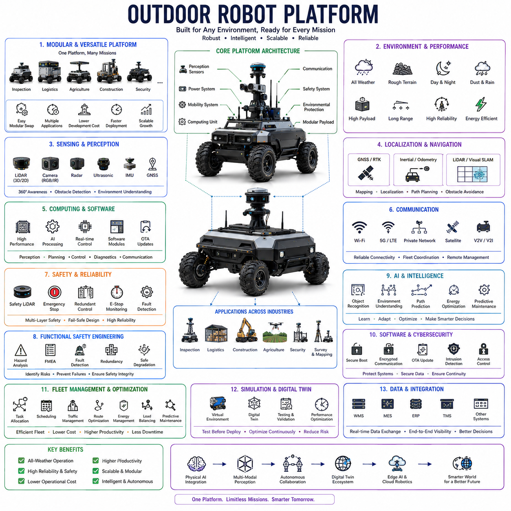
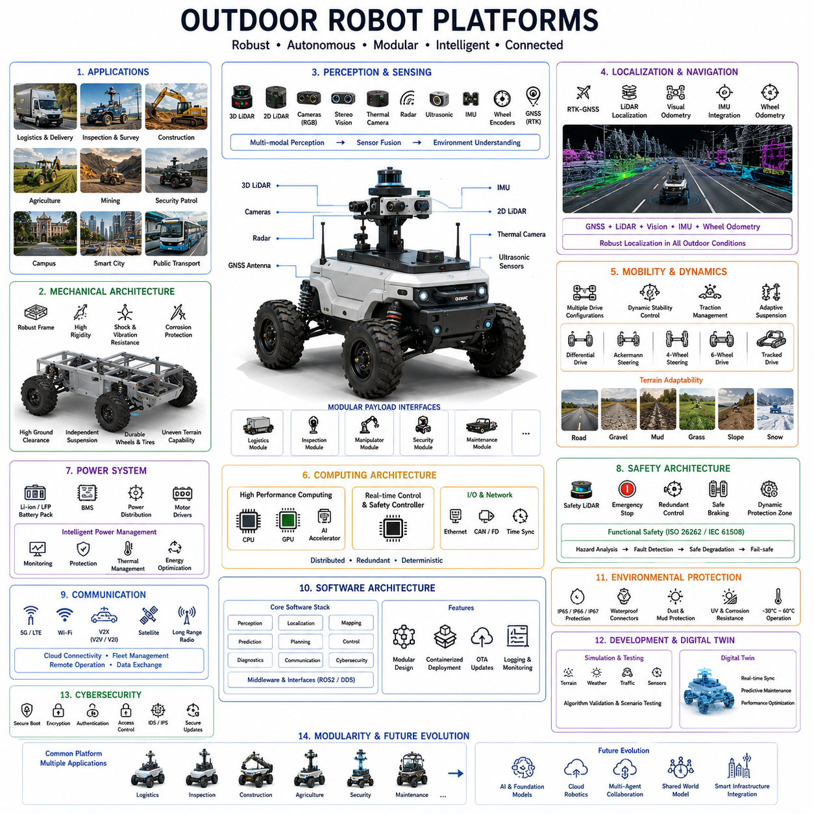
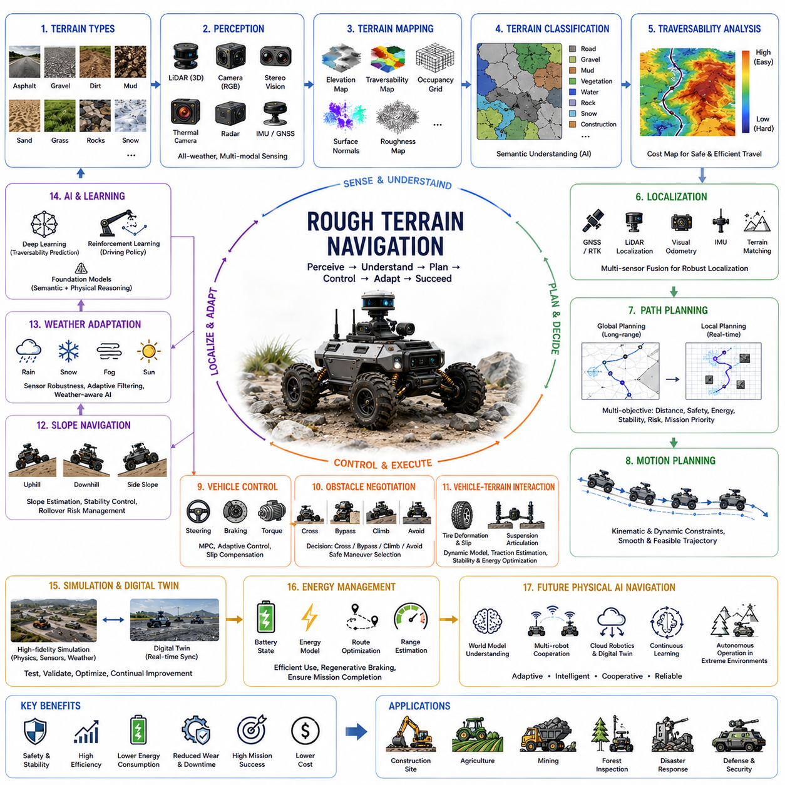
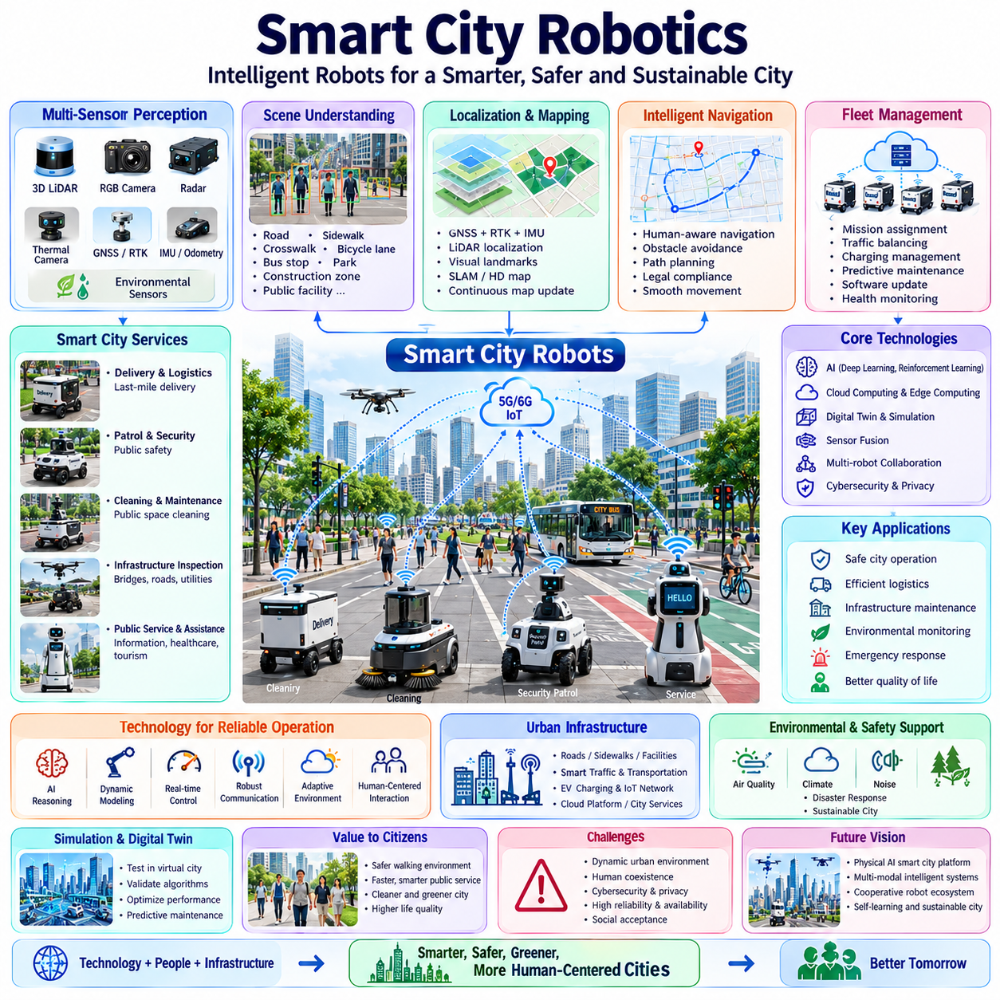
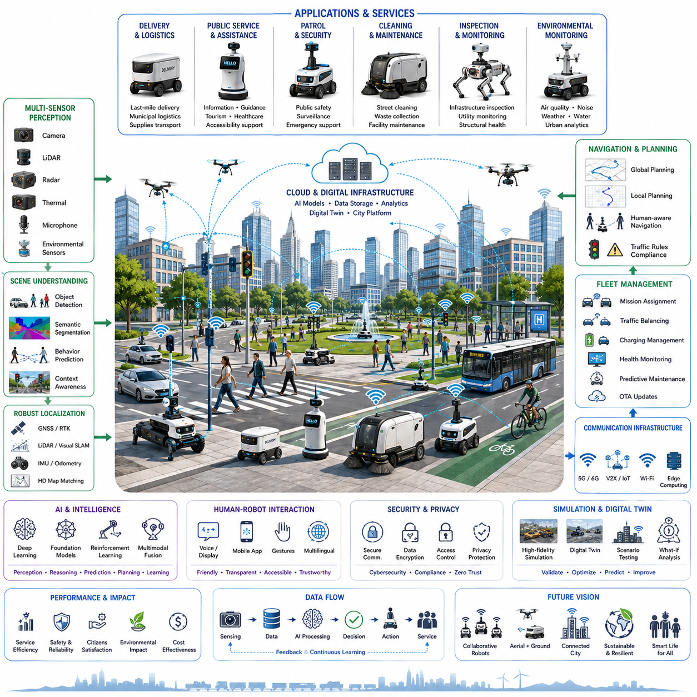
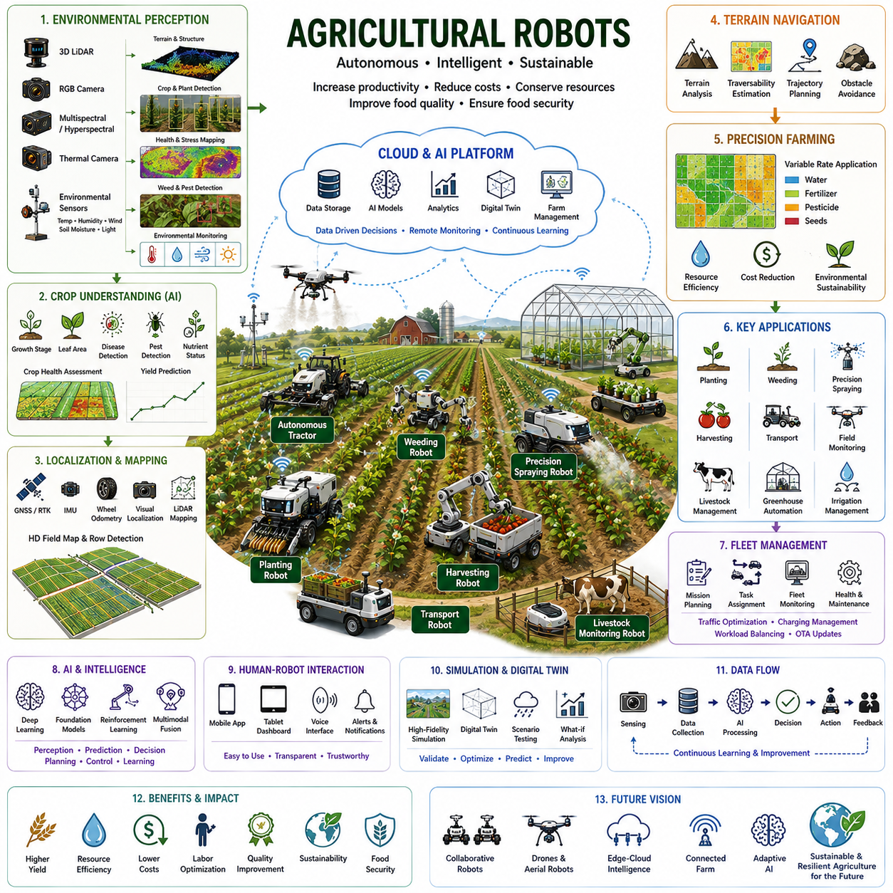
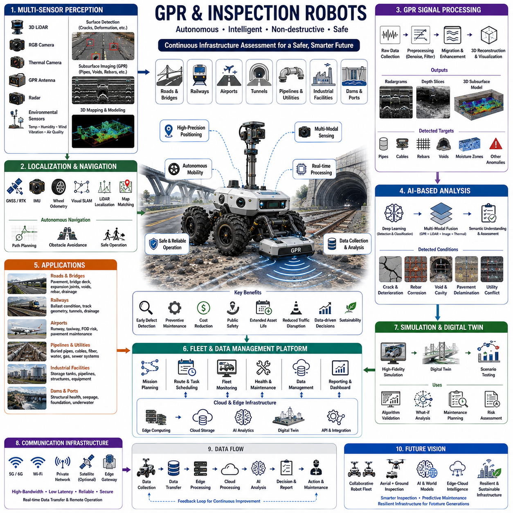

**Volume 01. AMR Foundations and System Architecture**


# 20. Outdoor Autonomous Robots · 실외 자율 로봇

##  

## 20.01 Outdoor Robot Platforms · 실외 로봇 플랫폼

{width="7.268055555555556in" height="7.268055555555556in"}{width="7.268055555555556in" height="7.268055555555556in"}

Outdoor robot platforms represent the foundational hardware architecture that enables autonomous robots to operate safely and reliably in complex outdoor environments. Unlike indoor autonomous mobile robots that navigate relatively structured facilities with controlled lighting and smooth floors, outdoor platforms must withstand harsh weather, uneven terrain, dynamic traffic, varying illumination, and continuously changing environmental conditions. These platforms provide the mechanical, electrical, computational, and sensing infrastructure necessary to support autonomous navigation across construction sites, industrial facilities, logistics yards, campuses, smart cities, agricultural fields, mining operations, military installations, and public transportation environments. As autonomous technologies continue expanding beyond warehouses, outdoor robot platforms have become one of the most important enabling technologies for large-scale Physical AI systems.

The primary objective of an outdoor robot platform is to provide a stable, modular, and scalable foundation capable of supporting diverse autonomous applications. Rather than designing separate robots for every task, manufacturers increasingly develop standardized vehicle platforms that can accommodate different payloads, sensors, manipulators, inspection equipment, delivery modules, or specialized industrial tools. This modular philosophy significantly reduces development cost while enabling rapid deployment across multiple industries. A common outdoor platform can therefore evolve from a logistics vehicle into an inspection robot, mobile manipulation system, autonomous security patrol robot, or intelligent maintenance platform through replacement of upper functional modules.

Mechanical architecture forms the structural backbone of every outdoor robot platform. Heavy-duty welded steel frames, aluminum alloy chassis, or hybrid lightweight structures are designed to withstand continuous vibration, impact loading, torsional stress, and long-term outdoor exposure. Structural rigidity directly influences localization accuracy because excessive chassis deformation introduces sensor calibration errors and reduces navigation precision. Engineers therefore optimize structural stiffness while minimizing overall vehicle weight to maximize payload capacity, energy efficiency, and long-term mechanical durability.

Mobility systems determine how effectively outdoor robots traverse challenging terrain. Depending on operational requirements, platforms may employ differential drive, Ackermann steering, four-wheel steering, articulated steering, tracked locomotion, skid steering, or six-wheel drive architectures. Independent suspension systems improve wheel contact on uneven terrain while reducing shock transmission to onboard sensors and computing equipment. High ground clearance, optimized wheelbase geometry, large-diameter tires, and terrain-adaptive suspension allow outdoor platforms to negotiate curbs, potholes, gravel, grass, mud, slopes, and construction debris while maintaining stable autonomous operation.

Vehicle dynamics become substantially more complex outdoors due to varying surface conditions and environmental disturbances. Traction continuously changes across asphalt, concrete, dirt roads, wet surfaces, loose gravel, sand, snow, and ice. Dynamic stability control therefore regulates steering, braking, acceleration, and motor torque according to terrain conditions and vehicle speed. Wheel slip detection algorithms estimate available traction while adaptive controllers modify driving behavior to maintain stability during acceleration, cornering, climbing, and emergency stopping. These dynamic control systems significantly improve operational safety under unpredictable environmental conditions.

Power systems provide the energy required for propulsion, onboard computation, perception sensors, communication equipment, and payload operation. Most modern outdoor robot platforms utilize lithium iron phosphate or lithium-ion battery systems due to their high energy density, long operational lifetime, and excellent charging characteristics. Battery capacities vary from several kilowatt-hours for compact delivery robots to tens of kilowatt-hours for heavy industrial vehicles. Intelligent Battery Management Systems continuously monitor voltage, current, temperature, charging status, cell balancing, and long-term battery health to maximize operational reliability and service life.

Environmental protection represents one of the defining characteristics of outdoor robotic platforms. Mechanical assemblies, electronic control units, batteries, sensors, connectors, and communication equipment require protection against rain, dust, mud, snow, vibration, ultraviolet radiation, corrosion, and extreme temperatures. Industrial platforms commonly achieve IP65, IP66, or IP67 protection ratings while employing sealed electrical enclosures, waterproof connectors, corrosion-resistant coatings, pressure equalization valves, and thermal management systems. Reliable environmental sealing enables continuous autonomous operation under diverse weather conditions throughout extended deployment periods.

Perception systems provide the environmental awareness necessary for autonomous navigation. Outdoor robot platforms typically integrate multiple sensing technologies including three-dimensional LiDAR, two-dimensional LiDAR, RGB cameras, stereo vision, thermal cameras, radar, ultrasonic sensors, inertial measurement units, wheel encoders, and Global Navigation Satellite System receivers. Sensor placement is carefully optimized to maximize field of view while minimizing mutual interference, vibration, contamination, and mechanical obstruction. Multi-modal sensing significantly improves perception robustness across changing illumination, weather, and terrain conditions.

Localization architecture combines global positioning with local environmental understanding. Unlike indoor robots that rely primarily on simultaneous localization and mapping, outdoor platforms frequently integrate GNSS positioning, real-time kinematic corrections, inertial navigation, LiDAR localization, visual odometry, and wheel odometry through advanced sensor fusion algorithms. RTK-GNSS provides centimeter-level global positioning under open-sky conditions, while LiDAR and visual localization maintain accurate positioning whenever satellite visibility deteriorates near buildings, trees, tunnels, or industrial structures. This hybrid localization framework enables reliable autonomous operation across highly diverse outdoor environments.

Computing architecture serves as the central processing infrastructure supporting perception, localization, planning, control, artificial intelligence, and communication. High-performance industrial computers equipped with multicore CPUs, GPU accelerators, AI inference processors, and real-time controllers execute numerous software modules simultaneously. Distributed computing architectures often separate safety-critical motion control from computationally intensive perception algorithms. High-speed Ethernet networks, precision time synchronization, and redundant communication buses ensure deterministic operation across multiple sensing and computing subsystems.

Communication systems connect outdoor robots with cloud infrastructure, fleet management software, remote operators, and nearby robotic platforms. Wi-Fi supports high-bandwidth communication within localized industrial facilities, while private 5G, LTE, satellite communication, or long-range wireless technologies enable operation across geographically distributed environments. Vehicle-to-Vehicle and Vehicle-to-Infrastructure communication further enhance cooperative autonomy by exchanging localization data, traffic information, obstacle observations, and mission updates. Reliable communication significantly improves fleet coordination while enabling remote supervision whenever autonomous systems encounter unexpected situations.

Safety architecture extends beyond conventional industrial robot protection because outdoor robots operate alongside pedestrians, manually driven vehicles, construction equipment, cyclists, and public infrastructure. Safety-rated LiDAR scanners establish dynamic protective zones according to vehicle speed and operational mode. Emergency braking systems, redundant steering controllers, independent safety processors, functional safety software, and continuously monitored emergency stop circuits provide multiple layers of protection. Dynamic risk assessment continuously evaluates surrounding traffic while adapting robot behavior to maintain safe interaction with both humans and vehicles.

Functional safety engineering systematically analyzes potential failures affecting autonomous operation. Hazard analysis evaluates sensor malfunction, steering failure, braking degradation, communication loss, localization uncertainty, power interruption, actuator faults, and software anomalies. Redundant hardware architecture together with fault detection algorithms enable safe degradation whenever abnormal conditions are detected. Safety integrity requirements guide hardware redundancy, software validation, diagnostic coverage, and fail-safe system design to minimize operational risks throughout the vehicle lifecycle.

Artificial intelligence increasingly enhances platform capabilities beyond basic autonomous navigation. Deep learning models recognize roads, vegetation, pedestrians, vehicles, construction equipment, traffic signs, temporary obstacles, and environmental hazards while estimating their future behavior. Machine learning algorithms optimize energy consumption, predict component degradation, estimate terrain traversability, and improve localization under difficult environmental conditions. Foundation models further enable semantic understanding of complex outdoor scenes, allowing autonomous platforms to interpret high-level operational objectives and adapt intelligently to changing mission requirements.

Platform software architecture is typically organized into layered modules supporting perception, localization, mapping, prediction, planning, vehicle control, diagnostics, communication, cybersecurity, and mission management. Middleware frameworks enable standardized communication among software components while allowing individual modules to evolve independently. Containerized software deployment, continuous integration, remote software updates, and modular application interfaces significantly simplify long-term maintenance throughout the platform lifecycle. Standardized software architecture also supports rapid integration of new sensors, AI models, or industrial payloads.

Cybersecurity has become increasingly important as outdoor robot platforms connect continuously to enterprise networks, cloud services, remote maintenance systems, and fleet management infrastructure. Secure boot mechanisms, encrypted communication, authenticated software updates, intrusion detection, role-based access control, secure key management, and hardware security modules protect robotic systems against unauthorized access. Cybersecurity architecture must simultaneously maintain operational availability while protecting both safety-critical control systems and sensitive operational data from evolving cyber threats.

Simulation environments and digital twins substantially accelerate platform development before physical deployment. High-fidelity virtual environments reproduce terrain characteristics, weather conditions, sensor behavior, traffic scenarios, and mechanical dynamics with remarkable accuracy. Engineers validate perception algorithms, localization systems, motion planning, safety functions, and AI decision-making under thousands of simulated scenarios that would be difficult or unsafe to reproduce experimentally. Following deployment, digital twins remain synchronized with operational data, supporting predictive maintenance, software verification, performance optimization, and continuous system improvement throughout operational life.

Outdoor robot platforms provide exceptional flexibility because identical hardware foundations support numerous industrial applications through modular payload integration. Inspection robots carry thermal cameras, gas sensors, or non-destructive testing equipment. Logistics vehicles transport materials throughout industrial campuses. Agricultural platforms integrate precision spraying or harvesting systems. Construction robots perform surveying, mapping, or autonomous transportation. Security platforms carry surveillance sensors while utility robots support infrastructure maintenance. This modularity dramatically reduces development cost while accelerating commercialization across multiple industries.

Future outdoor robot platforms will evolve into intelligent Physical AI infrastructures integrating multimodal perception, foundation models, cloud robotics, digital twins, edge AI computing, and collaborative multi-agent reasoning. Instead of functioning as isolated autonomous vehicles, outdoor platforms will cooperate seamlessly with drones, humanoid robots, autonomous forklifts, construction machinery, industrial manipulators, and smart infrastructure through shared world models and distributed intelligence. These next-generation platforms will continuously learn from operational experience, adapt to changing environments, coordinate complex missions autonomously, and provide the foundational mobility infrastructure supporting highly intelligent outdoor robotic ecosystems across logistics, construction, agriculture, mining, defense, and future smart cities.

실외 로봇 플랫폼(Outdoor Robot Platforms)은 복잡한 실외 환경에서 자율로봇이 안전하고 안정적으로 운용될 수 있도록 하는 기본 하드웨어 아키텍처(Foundation Hardware Architecture)이다. 비교적 구조화된 공간과 일정한 조명, 평탄한 바닥에서 운용되는 실내 자율이동로봇(AMR, Autonomous Mobile Robot)과 달리, 실외 플랫폼은 악천후, 불규칙한 지형, 다양한 교통 환경, 급격하게 변화하는 조명, 그리고 지속적으로 변화하는 주변 환경을 견딜 수 있어야 한다. 이러한 플랫폼은 건설 현장, 산업단지, 물류 야드(Logistics Yard), 캠퍼스, 스마트시티(Smart City), 농업 현장, 광산, 군사 시설, 대중교통 환경 등에서 자율주행을 수행하기 위한 기계(Mechanical), 전기(Electrical), 컴퓨팅(Computing), 센싱(Sensing) 기반을 제공한다. 자율주행 기술이 창고를 넘어 다양한 실외 환경으로 확대됨에 따라 실외 로봇 플랫폼은 대규모 물리 AI(Physical AI) 시스템을 구현하는 핵심 기반 기술이 되고 있다.

실외 로봇 플랫폼의 가장 중요한 목적은 다양한 자율주행 응용을 지원할 수 있는 안정적이고 모듈형(Modular)이며 확장 가능한(Scalable) 기반 플랫폼을 제공하는 것이다. 각각의 용도마다 새로운 로봇을 설계하는 대신, 제조사는 다양한 페이로드(Payload), 센서, 로봇 매니퓰레이터(Robot Manipulator), 검사 장비, 배송 모듈, 산업용 공구 등을 장착할 수 있는 표준 차량 플랫폼(Standardized Vehicle Platform)을 개발하는 방향으로 발전하고 있다. 이러한 모듈형 설계 철학(Modular Design Philosophy)은 개발 비용을 크게 줄이면서도 다양한 산업 분야에 빠르게 적용할 수 있도록 한다. 하나의 공통 플랫폼은 상부 기능 모듈만 교체함으로써 물류 차량(Logistics Vehicle), 검사 로봇(Inspection Robot), 이동형 조작 시스템(Mobile Manipulation System), 보안 순찰 로봇(Security Patrol Robot), 유지보수 플랫폼(Maintenance Platform) 등으로 손쉽게 확장될 수 있다.

기계 구조(Mechanical Architecture)는 모든 실외 로봇 플랫폼의 구조적 기반을 형성한다. 고강도 용접 강철 프레임(Welded Steel Frame), 알루미늄 합금 섀시(Aluminum Alloy Chassis), 또는 하이브리드 경량 구조(Hybrid Lightweight Structure)는 지속적인 진동(Vibration), 충격 하중(Impact Loading), 비틀림 응력(Torsional Stress), 장기간의 실외 환경 노출을 견딜 수 있도록 설계된다. 차체의 구조 강성(Structural Rigidity)은 위치추정(Localization) 정확도에 직접적인 영향을 미치는데, 차체 변형이 발생하면 센서 보정 오차(Sensor Calibration Error)가 증가하고 자율주행 정밀도가 저하되기 때문이다. 따라서 엔지니어는 충분한 강성을 확보하면서도 차량 무게를 최소화하여 적재 능력, 에너지 효율, 기계적 내구성을 동시에 향상시키도록 설계한다.

이동 시스템(Mobility System)은 실외 로봇이 다양한 지형을 얼마나 효과적으로 주행할 수 있는지를 결정한다. 운용 목적에 따라 차동구동(Differential Drive), 아커만 조향(Ackermann Steering), 사륜조향(Four-Wheel Steering), 굴절 조향(Articulated Steering), 무한궤도(Tracked Locomotion), 스키드 조향(Skid Steering), 또는 6륜 구동(Six-Wheel Drive) 구조가 적용된다. 독립 현가장치(Independent Suspension)는 울퉁불퉁한 노면에서도 바퀴의 접지력을 유지하고 센서와 컴퓨팅 장비로 전달되는 충격을 감소시킨다. 높은 최저지상고(Ground Clearance), 최적화된 휠베이스(Wheelbase), 대구경 타이어(Large-diameter Tire), 지형 적응형 서스펜션(Terrain-adaptive Suspension)은 연석(Curb), 포트홀(Pothole), 자갈, 잔디, 진흙, 경사면, 건설 잔해를 안정적으로 통과할 수 있도록 지원한다.

차량 동역학(Vehicle Dynamics)은 실외 환경에서 훨씬 복잡해진다. 아스팔트, 콘크리트, 비포장도로, 젖은 노면, 자갈, 모래, 눈, 얼음 등 다양한 노면에서 접지력(Traction)이 지속적으로 변화하기 때문이다. 동적 안정성 제어(Dynamic Stability Control)는 노면 상태와 차량 속도에 따라 조향(Steering), 제동(Braking), 가속(Acceleration), 모터 토크(Motor Torque)를 실시간으로 제어한다. 휠 슬립(Wheel Slip) 검출 알고리즘은 현재 사용 가능한 접지력을 추정하고 적응형 제어기(Adaptive Controller)는 가속, 회전, 언덕 주행, 비상 정지 시 차량이 안정적으로 움직이도록 제어한다. 이러한 동적 제어 시스템은 예측하기 어려운 환경에서도 안전한 자율주행을 가능하게 한다.

전원 시스템(Power System)은 추진(Propulsion), 온보드 컴퓨팅(Onboard Computing), 인지 센서(Perception Sensor), 통신 장비(Communication Equipment), 그리고 다양한 작업 장치에 필요한 에너지를 공급한다. 대부분의 최신 실외 플랫폼은 높은 에너지 밀도와 긴 수명, 우수한 충전 특성을 가진 리튬인산철 배터리(LFP, Lithium Iron Phosphate) 또는 리튬이온 배터리(Lithium-ion Battery)를 사용한다. 배터리 용량은 소형 배송 로봇에서는 수 kWh 수준이며, 대형 산업용 차량에서는 수십 kWh까지 확대된다. 배터리관리시스템(BMS, Battery Management System)은 전압, 전류, 온도, 충전 상태, 셀 밸런싱(Cell Balancing), 장기적인 배터리 열화 상태를 지속적으로 관리하여 안정적인 운용을 지원한다.

환경 보호(Environmental Protection)는 실외 로봇 플랫폼을 정의하는 가장 중요한 특성 가운데 하나이다. 기계 구조물, 전자제어장치(Electronic Control Unit), 배터리, 센서, 커넥터, 통신 장치는 비, 먼지, 진흙, 눈, 진동, 자외선(UV, Ultraviolet Radiation), 부식(Corrosion), 극한 온도로부터 보호되어야 한다. 산업용 플랫폼은 일반적으로 IP65, IP66, IP67 등급의 방수·방진 성능을 확보하며, 밀폐형 전기함(Sealed Electrical Enclosure), 방수 커넥터(Waterproof Connector), 내식성 코팅(Corrosion-resistant Coating), 압력 평형 밸브(Pressure Equalization Valve), 열관리 시스템(Thermal Management System)을 적용한다. 이러한 보호 구조는 다양한 기상 조건에서도 장기간 안정적인 자율운행을 가능하게 한다.

인지 시스템(Perception System)은 자율주행을 위한 환경 인식 능력을 제공한다. 실외 로봇 플랫폼은 일반적으로 3D 라이다(3D LiDAR), 2D 라이다(2D LiDAR), RGB 카메라(RGB Camera), 스테레오 비전(Stereo Vision), 열화상 카메라(Thermal Camera), 레이더(Radar), 초음파 센서(Ultrasonic Sensor), 관성측정장치(IMU, Inertial Measurement Unit), 휠 엔코더(Wheel Encoder), 위성항법시스템(GNSS, Global Navigation Satellite System) 수신기를 통합한다. 센서 배치는 시야(Field of View)를 최대화하면서도 상호 간섭, 진동, 오염, 기계적 차폐를 최소화하도록 최적화된다. 이러한 멀티모달 센싱(Multi-modal Sensing)은 조명 변화, 날씨 변화, 다양한 지형에서도 높은 인식 성능을 유지하도록 한다.

위치추정 구조(Localization Architecture)는 전역 위치 정보와 지역 환경 인식을 결합한다. 실내 로봇이 주로 SLAM(Simultaneous Localization and Mapping)에 의존하는 것과 달리, 실외 플랫폼은 GNSS, 실시간 이동측위(RTK-GNSS, Real-Time Kinematic GNSS), 관성항법(Inertial Navigation), 라이다 위치추정(LiDAR Localization), 비주얼 오도메트리(Visual Odometry), 휠 오도메트리(Wheel Odometry)를 센서 융합(Sensor Fusion)으로 통합한다. RTK-GNSS는 개방된 공간에서 센티미터 수준의 전역 위치를 제공하며, 건물, 나무, 터널 등으로 위성 수신이 제한되는 경우에는 라이다와 비전 기반 위치추정이 이를 보완한다. 이러한 하이브리드 위치추정(Hybrid Localization)은 매우 다양한 실외 환경에서도 안정적인 자율주행을 가능하게 한다.

컴퓨팅 아키텍처(Computing Architecture)는 인지, 위치추정, 경로계획(Planning), 제어(Control), 인공지능(AI), 통신을 수행하는 중앙 처리 기반이다. 다중 코어 CPU(Multi-core CPU), GPU 가속기(GPU Accelerator), AI 추론 프로세서(AI Inference Processor), 실시간 제어기(Real-time Controller)를 탑재한 산업용 컴퓨터가 동시에 여러 소프트웨어 모듈을 실행한다. 분산 컴퓨팅 구조(Distributed Computing Architecture)는 안전 관련 제어와 대규모 인지 연산을 분리하여 안정성을 확보한다. 또한 고속 이더넷(Ethernet), 정밀 시간 동기화(Precision Time Synchronization), 이중화 통신 버스(Redundant Communication Bus)는 센서와 컴퓨팅 장치 간의 결정론적(Deterministic) 동작을 보장한다.

통신 시스템(Communication System)은 실외 로봇을 클라우드 인프라(Cloud Infrastructure), 플릿관리시스템(Fleet Management System), 원격 운영자(Remote Operator), 그리고 주변 로봇과 연결한다. 산업 시설 내부에서는 Wi-Fi가 고속 통신을 제공하며, 넓은 지역에서는 사설 5G(Private 5G), LTE, 위성통신(Satellite Communication), 장거리 무선통신(Long-range Wireless Communication)이 사용된다. 차량 간 통신(V2V, Vehicle-to-Vehicle)과 차량-인프라 통신(V2I, Vehicle-to-Infrastructure)은 위치 정보, 교통 정보, 장애물 정보, 임무 정보를 공유하여 협업 자율주행(Cooperative Autonomy)을 지원한다. 안정적인 통신은 플릿 협업과 원격 관제를 가능하게 하는 핵심 요소이다.

안전 구조(Safety Architecture)는 실외 로봇이 보행자, 일반 차량, 건설 장비, 자전거, 공공 인프라와 함께 운용되기 때문에 기존 산업용 로봇보다 더욱 중요하다. 안전등급 라이다(Safety-rated LiDAR)는 차량 속도와 운행 모드에 따라 동적으로 보호구역(Protective Zone)을 설정한다. 비상제동(Emergency Braking), 이중 조향 제어기(Redundant Steering Controller), 독립 안전 프로세서(Independent Safety Processor), 기능안전 소프트웨어(Functional Safety Software), 지속적으로 감시되는 비상정지(Emergency Stop)는 여러 단계의 안전 계층을 구성한다. 동적 위험 평가(Dynamic Risk Assessment)는 주변 교통 환경을 지속적으로 분석하여 사람과 차량 모두와 안전하게 상호작용할 수 있도록 로봇의 행동을 조정한다.

기능안전 엔지니어링(Functional Safety Engineering)은 자율주행에 영향을 미칠 수 있는 모든 잠재적 고장을 체계적으로 분석한다. 위험 분석(Hazard Analysis)은 센서 고장, 조향 고장, 제동 성능 저하, 통신 장애, 위치추정 불확실성, 전원 장애, 액추에이터 이상, 소프트웨어 오류 등을 평가한다. 이중화 하드웨어(Redundant Hardware)와 고장 검출 알고리즘(Fault Detection Algorithm)은 이상 상황 발생 시 안전한 성능 저하(Safe Degradation)를 수행할 수 있도록 설계된다. 또한 안전 무결성 수준(Safety Integrity Requirement)은 하드웨어 이중화, 소프트웨어 검증, 진단 범위, 페일세이프(Fail-safe) 설계를 결정하는 중요한 기준이 된다.

인공지능(AI)은 단순한 자율주행을 넘어 플랫폼 전체의 지능을 향상시키고 있다. 딥러닝(Deep Learning)은 도로, 식생(Vegetation), 보행자, 차량, 건설 장비, 교통표지판, 임시 장애물, 환경 위험 요소를 인식하고 향후 움직임까지 예측한다. 머신러닝(Machine Learning)은 에너지 소비를 최적화하고 부품 열화를 예측하며 주행 가능 지형(Terrain Traversability)을 평가하고 어려운 환경에서 위치추정을 개선한다. 파운데이션 모델(Foundation Model)은 복잡한 실외 환경을 의미적으로 이해하여 상위 수준의 임무를 해석하고 변화하는 환경에 스스로 적응할 수 있도록 지원한다.

플랫폼 소프트웨어 아키텍처(Platform Software Architecture)는 일반적으로 인지, 위치추정, 지도작성(Mapping), 예측(Prediction), 경로계획, 차량 제어, 진단(Diagnostics), 통신, 사이버보안(Cybersecurity), 임무 관리(Mission Management) 계층으로 구성된다. 미들웨어(Middleware)는 각 소프트웨어 모듈 간의 표준화된 통신을 제공하면서도 각각의 모듈을 독립적으로 발전시킬 수 있도록 한다. 컨테이너(Container) 기반 배포, 지속적 통합(CI, Continuous Integration), 원격 소프트웨어 업데이트(OTA, Over-the-Air Update), 모듈형 인터페이스는 장기간 유지보수를 크게 단순화한다. 이러한 표준화된 소프트웨어 구조는 새로운 센서, AI 모델, 산업용 페이로드를 신속하게 통합할 수 있도록 지원한다.

사이버보안(Cybersecurity)은 실외 로봇 플랫폼이 기업 네트워크, 클라우드 서비스, 원격 유지보수 시스템, 플릿관리 인프라와 지속적으로 연결되면서 더욱 중요해지고 있다. 보안 부팅(Secure Boot), 암호화 통신(Encrypted Communication), 인증된 소프트웨어 업데이트(Authenticated Software Update), 침입 탐지(Intrusion Detection), 역할 기반 접근 제어(Role-based Access Control), 보안 키 관리(Secure Key Management), 하드웨어 보안 모듈(HSM, Hardware Security Module)은 무단 접근으로부터 시스템을 보호한다. 사이버보안은 안전 관련 제어와 운영 데이터를 모두 보호하면서도 시스템의 가용성을 유지해야 한다.

시뮬레이션(Simulation)과 디지털 트윈(Digital Twin)은 실제 플랫폼 개발을 크게 가속화한다. 고정밀 가상 환경은 다양한 지형, 날씨, 센서 특성, 교통 상황, 차량 동역학을 매우 현실적으로 재현한다. 엔지니어는 수천 개의 시뮬레이션 시나리오를 통해 인지 알고리즘, 위치추정, 경로계획, 안전 기능, AI 의사결정을 실제 시험 없이 검증할 수 있다. 플랫폼 구축 이후에도 디지털 트윈은 실제 운영 데이터와 지속적으로 동기화되어 예지보전(Predictive Maintenance), 소프트웨어 검증, 성능 최적화, 지속적인 시스템 개선을 지원한다.

실외 로봇 플랫폼은 동일한 하드웨어 기반을 다양한 산업 분야에서 활용할 수 있다는 뛰어난 유연성을 제공한다. 검사 로봇은 열화상 카메라(Thermal Camera), 가스 센서(Gas Sensor), 비파괴 검사(NDT, Non-Destructive Testing) 장비를 탑재할 수 있으며, 물류 차량은 산업단지 전체의 자재 운송을 수행한다. 농업용 플랫폼은 정밀 방제(Precision Spraying)나 수확 장비를 장착할 수 있고, 건설 로봇은 측량(Surveying), 지도작성(Mapping), 자율 운송을 수행한다. 보안 플랫폼은 감시 센서를 탑재하고, 공공 인프라 유지보수 로봇은 시설 점검 작업을 수행한다. 이러한 모듈성(Modularity)은 개발 비용을 크게 절감하면서 다양한 산업으로의 상용화를 빠르게 지원한다.

미래의 실외 로봇 플랫폼은 멀티모달 인지(Multimodal Perception), 파운데이션 모델(Foundation Model), 클라우드 로보틱스(Cloud Robotics), 디지털 트윈(Digital Twin), 엣지 AI(Edge AI), 다중 에이전트 추론(Multi-agent Reasoning)을 통합한 지능형 물리 AI(Physical AI) 기반 플랫폼으로 발전할 것이다. 미래의 플랫폼은 단순한 자율주행 차량이 아니라 드론(Drone), 휴머노이드(Humanoid), 자율지게차(Autonomous Forklift), 건설 장비, 산업용 매니퓰레이터(Industrial Manipulator), 스마트 인프라(Smart Infrastructure)와 공유 세계 모델(Shared World Model)을 기반으로 자연스럽게 협업하게 될 것이다. 이러한 차세대 플랫폼은 운영 경험을 지속적으로 학습하고 변화하는 환경에 스스로 적응하며 복잡한 임무를 자율적으로 수행함으로써 물류(Logistics), 건설(Construction), 농업(Agriculture), 광산(Mining), 국방(Defense), 미래 스마트시티(Smart City)를 구성하는 핵심 이동 플랫폼으로 발전하게 될 것이다.

##  

## 20.02 Rough Terrain Navigation · 험지 내비게이션

{width="7.268055555555556in" height="7.268055555555556in"}

Rough terrain navigation is one of the most demanding capabilities in outdoor autonomous robotics because natural and semi-structured environments rarely provide smooth, predictable driving conditions. Unlike indoor navigation where flat floors, consistent lighting, and well-defined obstacles simplify motion planning, outdoor robots must continuously adapt to uneven ground, loose soil, rocks, mud, sand, grass, snow, slopes, water puddles, and rapidly changing environmental conditions. Successful navigation therefore requires close integration of perception, localization, terrain analysis, vehicle dynamics, path planning, motion control, and artificial intelligence. These capabilities allow autonomous robots to maintain mobility while minimizing safety risks, mechanical stress, energy consumption, and mission interruptions across highly variable operating environments.

The primary objective of rough terrain navigation is to enable autonomous robots to traverse difficult environments while maintaining stability, safety, efficiency, and mission accuracy. Rather than simply avoiding obstacles, the navigation system evaluates the traversability of the entire surrounding environment by estimating terrain quality, slope angles, traction conditions, wheel sinkage, surface roughness, vegetation density, and potential hazards. The robot continuously balances travel efficiency against operational risk, selecting routes that maximize mission success while minimizing the probability of immobilization, rollover, excessive energy usage, or mechanical damage.

Terrain characteristics directly influence navigation performance. Outdoor environments consist of numerous surface types including asphalt, concrete, gravel, dirt roads, sand, mud, snow, ice, grass, loose rocks, forest trails, agricultural fields, and construction sites. Each terrain exhibits unique physical properties such as friction coefficient, load-bearing capacity, surface compliance, roughness, moisture content, and wheel traction. Autonomous systems continuously classify terrain types using sensor data and adapt driving behavior accordingly. This environmental understanding enables robots to maintain safe mobility despite continuously changing ground conditions.

Terrain perception begins with comprehensive environmental sensing. Three-dimensional LiDAR provides highly accurate geometric information for measuring terrain elevation, obstacle dimensions, surface discontinuities, and traversable regions. RGB cameras capture texture, color, shadows, and visual landmarks that assist semantic terrain classification. Stereo vision estimates dense depth maps, while thermal cameras identify water, vegetation, or temperature-related surface variations. Radar complements optical sensors by operating reliably during fog, rain, dust, or darkness. These complementary sensing modalities provide robust environmental awareness across diverse weather and lighting conditions.

Terrain mapping transforms raw sensor measurements into structured environmental representations suitable for navigation. Digital elevation maps describe local terrain height variations while traversability maps estimate the difficulty of crossing different regions. Occupancy grids identify static obstacles, dynamic obstacles, and free space. Surface normal estimation characterizes local slope orientation, whereas roughness metrics quantify terrain irregularity. These layered environmental models continuously update as the robot moves, allowing navigation algorithms to react rapidly to newly observed terrain changes.

Terrain classification extends beyond simple obstacle detection by assigning semantic meaning to observed surfaces. Deep neural networks distinguish road surfaces, gravel, mud, vegetation, water, rocks, snow, construction debris, sidewalks, curbs, and other terrain categories. Machine learning models combine geometric features, visual appearance, reflectivity, thermal characteristics, and radar responses to improve classification accuracy. Semantic understanding enables navigation systems to estimate not only whether a region is physically accessible but also whether it is operationally desirable under current mission objectives.

Traversability analysis estimates how safely a robot can move through each portion of the environment. Instead of representing terrain as simply passable or impassable, traversability models assign continuous cost values reflecting expected vehicle performance. Factors including slope angle, surface roughness, obstacle density, wheel traction, vehicle dimensions, ground clearance, suspension articulation, and payload distribution contribute to traversability estimation. These cost maps provide the foundation for intelligent route optimization that minimizes operational risk while maintaining efficient mission completion.

Vehicle-terrain interaction plays a fundamental role in successful rough terrain navigation. Tire deformation, soil compression, wheel slip, suspension articulation, weight transfer, and vehicle inertia significantly influence mobility. Soft soils may reduce traction while steep slopes alter normal force distribution among wheels. Dynamic vehicle models estimate these interactions continuously, allowing adaptive controllers to regulate steering angles, motor torque, braking force, and suspension response. Accurate vehicle-terrain modeling substantially improves stability, energy efficiency, and obstacle negotiation capability under challenging operating conditions.

Localization becomes increasingly challenging in rough terrain because wheel slip and uneven surfaces reduce the accuracy of wheel odometry. Satellite positioning may also degrade under dense vegetation, steep valleys, or urban canyons. Robust localization therefore integrates GNSS, RTK corrections, inertial measurement units, LiDAR localization, visual odometry, and terrain matching through multi-sensor fusion algorithms. Simultaneous Localization and Mapping remains particularly valuable in off-road environments where previously generated maps can support reliable navigation despite temporary degradation of individual sensing modalities.

Path planning in rough terrain extends far beyond shortest-path optimization. Navigation algorithms evaluate multiple competing objectives including travel distance, estimated traversal time, terrain difficulty, vehicle stability, energy consumption, rollover probability, localization confidence, communication availability, and mission priorities. Global planners identify long-distance routes while local planners continuously adjust trajectories according to newly observed obstacles and terrain changes. This hierarchical planning architecture enables autonomous robots to respond intelligently to unpredictable environmental conditions without sacrificing overall mission efficiency.

Motion planning converts planned routes into dynamically feasible vehicle trajectories. Steering constraints, acceleration limits, suspension motion, wheel articulation, obstacle clearance, and vehicle dimensions are incorporated into trajectory generation. Smooth path generation minimizes unnecessary steering oscillations while preserving passenger comfort for human-carrying platforms and protecting sensitive payloads. Real-time trajectory optimization continuously updates planned motion according to current vehicle state, terrain conditions, and newly detected environmental hazards.

Vehicle control systems execute planned trajectories despite uncertain environmental conditions. Adaptive controllers compensate for wheel slip, changing friction, terrain inclination, payload variation, and dynamic disturbances such as wind or loose surfaces. Model Predictive Control, adaptive PID controllers, sliding mode control, and learning-based control algorithms continuously regulate steering, braking, throttle, and motor torque. Robust control strategies maintain stable vehicle behavior even when terrain conditions differ substantially from initial predictions.

Obstacle negotiation requires sophisticated decision-making beyond conventional obstacle avoidance. Autonomous robots must determine whether obstacles should be crossed, bypassed, climbed, or treated as impassable barriers. Rocks, fallen branches, curbs, shallow ditches, construction debris, and uneven ground require different traversal strategies depending upon vehicle capabilities. Navigation systems evaluate obstacle geometry, approach angle, wheel placement, suspension articulation, and vehicle clearance before selecting the safest crossing maneuver. These decisions directly influence mission reliability and mechanical durability.

Slope navigation presents additional challenges because gravity significantly alters vehicle dynamics. Climbing steep inclines increases motor load, energy consumption, and wheel slip, while descending slopes demands precise braking control to prevent uncontrolled acceleration. Lateral slopes increase rollover risk by shifting the vehicle\'s center of gravity. Navigation algorithms therefore evaluate longitudinal and lateral slope angles continuously while adjusting speed, steering, wheel torque distribution, and route selection to maintain safe operating margins throughout the mission.

Weather conditions further complicate rough terrain navigation by changing surface characteristics throughout operation. Rain reduces tire friction and creates mud, while snow and ice significantly decrease traction. Fog limits camera visibility, dust contaminates optical sensors, and strong sunlight produces severe illumination variations. Multi-modal perception, sensor redundancy, adaptive filtering, and weather-aware AI models allow autonomous systems to maintain reliable environmental understanding despite continuously changing atmospheric conditions. Robust environmental adaptation substantially improves operational availability throughout all seasons.

Artificial intelligence increasingly enhances rough terrain navigation by learning complex relationships between terrain appearance and vehicle performance. Deep learning predicts traversability directly from sensor observations, while reinforcement learning develops efficient driving strategies through extensive simulation. Foundation models combine semantic reasoning with physical understanding, enabling robots to infer previously unseen terrain characteristics from contextual environmental information. These AI-driven approaches improve navigation robustness while reducing dependence on manually engineered terrain models.

Simulation and digital twins play essential roles in validating rough terrain navigation before field deployment. High-fidelity terrain models reproduce rocks, vegetation, soil deformation, weather effects, sensor noise, and vehicle dynamics with remarkable realism. Engineers evaluate localization accuracy, path planning algorithms, terrain classification, suspension performance, and AI decision-making across thousands of challenging scenarios that would be impractical or unsafe to reproduce experimentally. Digital twins continue supporting system optimization after deployment through continuous synchronization with operational data collected during real-world missions.

Energy management becomes increasingly important in difficult terrain because climbing slopes, traversing soft soil, and overcoming obstacles require substantially greater power than driving on paved roads. Navigation systems therefore consider battery state, terrain difficulty, vehicle efficiency, regenerative braking opportunities, and remaining mission distance during route planning. Intelligent energy-aware navigation extends operational endurance while reducing battery degradation and ensuring sufficient power reserves for mission completion and safe return to charging infrastructure.

Future rough terrain navigation will evolve toward highly adaptive Physical AI systems capable of understanding terrain at semantic, geometric, and physical levels simultaneously. Multi-modal foundation models, world models, cloud robotics, digital twins, cooperative multi-robot exploration, and self-supervised learning will enable autonomous platforms to continuously improve navigation performance through accumulated operational experience. Rather than relying solely on predefined rules, future robots will reason about complex terrain, predict environmental evolution, cooperate with other autonomous systems, and dynamically optimize mobility strategies, enabling reliable autonomous operation across forests, construction sites, disaster zones, agriculture, mining, defense, planetary exploration, and other challenging outdoor environments.

험지 주행(Rough Terrain Navigation)은 자연 환경이나 반구조화된(Semi-structured) 환경이 평탄하고 예측 가능한 주행 조건을 거의 제공하지 않기 때문에 실외 자율로봇 분야에서 가장 어려운 핵심 기술 가운데 하나이다. 평탄한 바닥, 일정한 조명, 명확한 장애물 환경을 갖춘 실내 자율주행과 달리, 실외 로봇은 울퉁불퉁한 노면, 느슨한 토양, 암석, 진흙, 모래, 잔디, 눈, 경사면, 물웅덩이, 그리고 지속적으로 변화하는 환경 조건에 실시간으로 적응해야 한다. 성공적인 험지 주행은 인지(Perception), 위치추정(Localization), 지형 분석(Terrain Analysis), 차량 동역학(Vehicle Dynamics), 경로계획(Path Planning), 운동 제어(Motion Control), 인공지능(AI)이 긴밀하게 통합될 때 가능하다. 이러한 기술들은 로봇이 매우 다양한 환경에서도 안전성을 유지하면서 기계적 부담과 에너지 소비를 줄이고 임무를 안정적으로 수행할 수 있도록 지원한다.

험지 주행의 가장 중요한 목적은 어려운 환경에서도 안정성(Stability), 안전성(Safety), 효율성(Efficiency), 그리고 임무 정확도(Mission Accuracy)를 유지하면서 자율적으로 이동하는 것이다. 단순히 장애물을 회피하는 것이 아니라, 시스템은 주변 전체 환경의 주행 가능성(Traversability)을 평가하여 지형 품질(Terrain Quality), 경사각(Slope Angle), 접지력(Traction), 바퀴 침하(Wheel Sinkage), 노면 거칠기(Surface Roughness), 식생 밀도(Vegetation Density), 잠재적 위험 요소(Hazard)를 종합적으로 분석한다. 로봇은 이동 효율과 운용 위험 사이의 균형을 지속적으로 계산하여 차량이 고립되거나 전복되거나 과도한 에너지를 소비하거나 기계적 손상을 입을 가능성을 최소화하는 최적의 경로를 선택한다.

지형 특성(Terrain Characteristics)은 험지 주행 성능을 직접적으로 결정한다. 실외 환경은 아스팔트, 콘크리트, 자갈, 비포장도로, 모래, 진흙, 눈, 얼음, 잔디, 암석 지대, 산림 도로, 농경지, 건설 현장 등 매우 다양한 노면으로 구성된다. 각각의 지형은 마찰계수(Friction Coefficient), 지지력(Load-bearing Capacity), 표면 탄성(Surface Compliance), 거칠기(Roughness), 수분 함량(Moisture Content), 바퀴 접지력(Wheel Traction)과 같은 서로 다른 물리적 특성을 가진다. 자율주행 시스템은 센서 데이터를 이용하여 이러한 지형을 지속적으로 분류하고 이에 맞게 주행 전략을 변경한다. 이러한 환경 이해는 지속적으로 변화하는 노면에서도 안정적인 이동성을 유지하도록 한다.

지형 인식(Terrain Perception)은 다양한 환경 센서를 이용하여 시작된다. 3차원 라이다(3D LiDAR)는 지형의 높이 변화, 장애물 크기, 표면 단차, 주행 가능 영역을 매우 정확하게 측정한다. RGB 카메라(RGB Camera)는 질감(Texture), 색상(Color), 그림자(Shadow), 시각적 랜드마크(Visual Landmark)를 제공하여 의미 기반 지형 분류(Semantic Terrain Classification)를 지원한다. 스테레오 비전(Stereo Vision)은 조밀한 깊이 지도(Dense Depth Map)를 생성하며, 열화상 카메라(Thermal Camera)는 물, 식생, 온도 차이에 따른 표면 특성을 구분한다. 레이더(Radar)는 안개, 비, 먼지, 야간과 같은 환경에서도 안정적으로 동작하여 광학 센서를 보완한다. 이러한 멀티모달 센싱(Multi-modal Sensing)은 다양한 날씨와 조명 조건에서도 높은 환경 인식 성능을 제공한다.

지형 지도작성(Terrain Mapping)은 원시 센서 데이터를 자율주행에 적합한 구조화된 환경 정보로 변환한다. 디지털 고도 지도(Digital Elevation Map)는 주변 지형의 높이 변화를 표현하고, 주행 가능성 지도(Traversability Map)는 각 영역을 통과하기 위한 난이도를 계산한다. 점유 격자 지도(Occupancy Grid)는 정적 장애물과 동적 장애물, 그리고 자유 공간을 구분한다. 표면 법선 추정(Surface Normal Estimation)은 경사의 방향을 계산하고, 거칠기 지표(Roughness Metric)는 지형의 불규칙성을 정량화한다. 이러한 다양한 환경 모델은 로봇 이동과 함께 지속적으로 갱신되어 새로운 지형 변화에 신속하게 대응할 수 있도록 한다.

지형 분류(Terrain Classification)는 단순히 장애물을 검출하는 수준을 넘어 관측된 표면에 의미(Semantic Meaning)를 부여하는 과정이다. 딥러닝(Deep Learning)은 도로, 자갈, 진흙, 식생, 물, 암석, 눈, 건설 잔해, 보도, 연석 등을 자동으로 구분한다. 머신러닝(Machine Learning)은 기하학적 특징, 영상 정보, 반사율(Reflectivity), 열 특성(Thermal Characteristic), 레이더 응답(Radar Response)을 통합하여 분류 정확도를 향상시킨다. 이러한 의미 기반 환경 이해는 단순히 이동 가능한지 여부뿐 아니라 현재 임무 목적에 가장 적합한 지형인지까지 판단할 수 있도록 한다.

주행 가능성 분석(Traversability Analysis)은 로봇이 환경의 각 영역을 얼마나 안전하게 통과할 수 있는지를 정량적으로 평가한다. 지형을 단순히 통과 가능 또는 불가능으로 구분하는 대신, 시스템은 연속적인 비용 값(Cost Value)을 부여하여 예상되는 차량 성능을 평가한다. 경사각, 표면 거칠기, 장애물 밀도, 접지력, 차량 크기, 최저지상고(Ground Clearance), 서스펜션 가동 범위(Suspension Articulation), 적재 하중 분포(Payload Distribution)가 모두 분석에 포함된다. 이러한 비용 지도(Cost Map)는 위험을 최소화하면서도 효율적인 이동 경로를 계산하는 기반이 된다.

차량-지형 상호작용(Vehicle-Terrain Interaction)은 성공적인 험지 주행의 핵심 요소이다. 타이어 변형(Tire Deformation), 토양 압축(Soil Compression), 바퀴 미끄러짐(Wheel Slip), 서스펜션 움직임(Suspension Articulation), 하중 이동(Weight Transfer), 차량 관성(Vehicle Inertia)은 모두 이동성에 큰 영향을 준다. 부드러운 토양에서는 접지력이 감소하며, 급경사에서는 바퀴에 작용하는 하중이 크게 변한다. 동적 차량 모델(Dynamic Vehicle Model)은 이러한 상호작용을 지속적으로 계산하며, 적응형 제어기(Adaptive Controller)는 조향각, 모터 토크, 제동력, 서스펜션 반응을 조절한다. 이러한 모델은 안정성과 에너지 효율, 장애물 극복 능력을 크게 향상시킨다.

험지에서는 바퀴 미끄러짐과 불규칙한 노면으로 인해 휠 오도메트리(Wheel Odometry)의 정확도가 크게 감소하기 때문에 위치추정(Localization)이 더욱 어려워진다. 또한 울창한 숲, 깊은 계곡, 도심 협곡(Urban Canyon)에서는 위성항법(GNSS)의 성능도 저하될 수 있다. 따라서 강인한 위치추정은 GNSS, RTK 보정(RTK Correction), 관성측정장치(IMU, Inertial Measurement Unit), 라이다 위치추정(LiDAR Localization), 비주얼 오도메트리(Visual Odometry), 지형 정합(Terrain Matching)을 센서 융합(Sensor Fusion)으로 통합한다. 특히 SLAM(Simultaneous Localization and Mapping)은 오프로드 환경에서 기존 지도를 활용하여 일부 센서 성능이 저하되어도 안정적인 위치추정을 가능하게 한다.

험지에서의 경로계획(Path Planning)은 단순히 최단거리를 찾는 문제보다 훨씬 복잡하다. 시스템은 이동 거리, 예상 이동 시간, 지형 난이도, 차량 안정성, 에너지 소비, 전복 가능성(Rollover Probability), 위치추정 신뢰도, 통신 가능 여부, 임무 우선순위를 동시에 고려한다. 전역 경로계획기(Global Planner)는 장거리 경로를 생성하고, 지역 경로계획기(Local Planner)는 새롭게 발견되는 장애물과 지형 변화에 따라 경로를 실시간으로 수정한다. 이러한 계층적 계획 구조(Hierarchical Planning)는 예측 불가능한 환경에서도 높은 임무 효율을 유지하도록 한다.

운동 계획(Motion Planning)은 계획된 경로를 실제 차량이 수행할 수 있는 주행 궤적으로 변환한다. 조향 한계(Steering Constraint), 가속 한계(Acceleration Limit), 서스펜션 움직임, 장애물 여유 공간, 차량 크기를 모두 고려하여 실행 가능한 궤적을 생성한다. 부드러운 궤적(Smooth Trajectory)은 불필요한 조향 진동을 줄이고 사람이 탑승하는 플랫폼의 승차감을 향상시키며 민감한 페이로드를 보호한다. 실시간 궤적 최적화(Real-time Trajectory Optimization)는 현재 차량 상태와 지형 조건, 새롭게 탐지된 위험 요소를 반영하여 지속적으로 갱신된다.

차량 제어 시스템(Vehicle Control System)은 불확실한 환경에서도 계획된 경로를 정확하게 수행한다. 적응형 제어기(Adaptive Controller)는 바퀴 미끄러짐, 변화하는 마찰계수, 경사면, 적재 중량 변화, 바람과 같은 외란(Disturbance)을 지속적으로 보상한다. 모델 예측 제어(MPC, Model Predictive Control), 적응형 PID 제어(Adaptive PID Control), 슬라이딩 모드 제어(Sliding Mode Control), 학습 기반 제어(Learning-based Control)는 조향, 제동, 스로틀(Throttle), 모터 토크를 지속적으로 조절한다. 이러한 강인한 제어(Robust Control)는 실제 지형이 예상과 크게 달라도 안정적인 차량 거동을 유지하도록 한다.

장애물 극복(Obstacle Negotiation)은 단순한 장애물 회피보다 훨씬 높은 수준의 의사결정을 요구한다. 자율로봇은 장애물을 넘을 것인지, 우회할 것인지, 올라탈 것인지, 통과 불가능한 장애물로 판단할 것인지를 결정해야 한다. 암석, 쓰러진 나무, 연석, 얕은 도랑, 건설 잔해, 불규칙한 노면은 차량 성능에 따라 서로 다른 전략이 필요하다. 시스템은 장애물의 형상, 접근 각도, 바퀴 위치, 서스펜션 움직임, 최저지상고를 평가하여 가장 안전한 통과 방법을 선택한다. 이러한 판단은 임무 성공률과 기계적 내구성에 직접적인 영향을 미친다.

경사면 주행(Slope Navigation)은 중력이 차량 동역학에 큰 영향을 주기 때문에 추가적인 어려움을 가진다. 오르막에서는 모터 부하와 에너지 소비, 바퀴 미끄러짐이 증가하고, 내리막에서는 정밀한 제동 제어가 필요하다. 횡경사(Lateral Slope)는 차량의 무게중심(Center of Gravity)을 이동시켜 전복 위험을 증가시킨다. 따라서 시스템은 종방향과 횡방향 경사를 지속적으로 평가하고 차량 속도, 조향, 바퀴 토크 분배, 경로를 조정하여 충분한 안전 여유(Safety Margin)를 유지한다.

기상 조건(Weather Condition)은 운용 중 노면 특성을 지속적으로 변화시키므로 험지 주행을 더욱 어렵게 만든다. 비는 타이어 마찰력을 감소시키고 진흙을 생성하며, 눈과 얼음은 접지력을 크게 저하시킨다. 안개는 카메라 시야를 제한하고 먼지는 광학 센서를 오염시키며 강한 햇빛은 심한 조도 변화를 발생시킨다. 멀티모달 인지(Multimodal Perception), 센서 이중화(Sensor Redundancy), 적응형 필터링(Adaptive Filtering), 기상 인식 AI 모델(Weather-aware AI Model)은 이러한 변화 속에서도 안정적인 환경 인식을 유지하도록 지원한다.

인공지능(AI)은 지형의 외형과 실제 차량 성능 사이의 복잡한 관계를 학습함으로써 험지 주행 성능을 크게 향상시키고 있다. 딥러닝은 센서 데이터만으로 주행 가능성을 직접 예측하며, 강화학습(Reinforcement Learning)은 대규모 시뮬레이션을 통해 효율적인 주행 전략을 학습한다. 파운데이션 모델(Foundation Model)은 의미 기반 추론(Semantic Reasoning)과 물리적 이해(Physical Understanding)를 결합하여 이전에 경험하지 못한 지형에서도 환경 특성을 추론할 수 있다. 이러한 AI 기반 접근법은 사람이 설계한 규칙에 대한 의존도를 줄이면서 더욱 강인한 자율주행을 가능하게 한다.

시뮬레이션(Simulation)과 디지털 트윈(Digital Twin)은 실제 현장 적용 이전에 험지 주행 알고리즘을 검증하는 핵심 도구이다. 고정밀 지형 모델은 암석, 식생, 토양 변형, 기상 효과, 센서 노이즈, 차량 동역학을 매우 현실적으로 재현한다. 엔지니어는 위치추정, 경로계획, 지형 분류, 서스펜션 성능, AI 의사결정을 수천 개의 다양한 시나리오에서 검증할 수 있으며, 실제 환경에서는 위험하거나 비용이 큰 시험을 효과적으로 대체할 수 있다. 디지털 트윈은 실제 운용 이후에도 실시간 데이터를 지속적으로 반영하여 성능 최적화와 시스템 개선을 지원한다.

험지에서는 언덕 등반, 연약한 토양 통과, 장애물 극복에 훨씬 많은 동력이 필요하기 때문에 에너지 관리(Energy Management)가 더욱 중요해진다. 경로계획은 배터리 상태(State of Charge), 지형 난이도, 차량 효율, 회생제동(Regenerative Braking), 남은 이동 거리까지 함께 고려한다. 지능형 에너지 인식 주행(Intelligent Energy-aware Navigation)은 운용 시간을 연장하고 배터리 열화를 줄이며, 임무를 완료한 후 안전하게 충전소까지 복귀할 수 있도록 충분한 에너지를 확보한다.

미래의 험지 주행은 의미 정보(Semantic Information), 기하 정보(Geometric Information), 물리 정보(Physical Information)를 동시에 이해하는 적응형 물리 AI(Physical AI) 시스템으로 발전할 것이다. 멀티모달 파운데이션 모델(Multimodal Foundation Model), 월드 모델(World Model), 클라우드 로보틱스(Cloud Robotics), 디지털 트윈(Digital Twin), 다중 로봇 협업 탐사(Cooperative Multi-robot Exploration), 자기지도학습(Self-supervised Learning)은 실제 운용 경험을 지속적으로 학습하여 주행 성능을 계속 향상시킬 것이다. 미래의 자율로봇은 사전에 정의된 규칙에만 의존하지 않고 복잡한 지형을 스스로 이해하며 환경 변화를 예측하고 다른 자율 시스템과 협력하면서 이동 전략을 실시간으로 최적화하여 산림(Forest), 건설 현장(Construction Site), 재난 지역(Disaster Zone), 농업(Agriculture), 광산(Mining), 국방(Defense), 행성 탐사(Planetary Exploration)와 같은 극한 환경에서도 안정적인 자율주행을 수행하게 될 것이다.

##  

## 20.03 Smart City Robots · 스마트시티 로봇

{width="7.268055555555556in" height="7.268055555555556in"}{width="7.268055555555556in" height="7.268055555555556in"}

Smart city robots represent the convergence of autonomous robotics, artificial intelligence, connected infrastructure, and digital urban services to improve the quality, efficiency, safety, and sustainability of modern cities. Unlike robots operating in isolated industrial environments, smart city robots function within highly dynamic public spaces where they continuously interact with pedestrians, vehicles, buildings, traffic systems, public utilities, and municipal information platforms. Their successful deployment requires seamless integration of perception, autonomous navigation, cloud intelligence, communication networks, fleet management, and city-scale digital infrastructure. As cities continue their digital transformation, autonomous robots are becoming intelligent mobile agents that extend urban services beyond traditional fixed infrastructure.

The primary objective of smart city robots is to provide intelligent public services while improving operational efficiency and reducing human workload across large urban environments. These robots perform repetitive, hazardous, or labor-intensive tasks that traditionally require significant human resources. Instead of replacing people, they augment municipal operations by continuously collecting information, transporting goods, inspecting infrastructure, supporting emergency response, assisting citizens, and maintaining public facilities. Their ability to operate continuously enables cities to deliver more responsive, data-driven, and citizen-centered services.

Smart city environments are significantly more complex than controlled industrial facilities because they contain continuously changing traffic, pedestrians, cyclists, construction activities, public transportation, weather conditions, and temporary obstacles. Autonomous robots must safely coexist with thousands of unpredictable human activities while respecting traffic regulations, social behaviors, accessibility requirements, and local operational policies. This dynamic operating environment requires highly reliable perception, prediction, decision-making, and motion planning systems capable of adapting to rapidly changing urban conditions without compromising safety or service quality.

Urban perception begins with comprehensive multi-modal sensing. Three-dimensional LiDAR continuously measures surrounding geometry, while RGB cameras recognize traffic signs, pedestrians, bicycles, road markings, and vehicles. Radar provides robust obstacle detection during rain, fog, or darkness, while thermal cameras support nighttime operation and emergency monitoring. GNSS, RTK positioning, IMU, wheel odometry, and visual localization work together to estimate accurate robot positions within large-scale outdoor environments. Environmental sensors additionally monitor air quality, temperature, humidity, noise, radiation, and other municipal indicators that contribute to smart city analytics.

Scene understanding extends beyond simple object detection by interpreting semantic meaning throughout the urban environment. Artificial intelligence identifies sidewalks, roads, bicycle lanes, crosswalks, traffic lights, bus stops, parks, construction zones, public facilities, and restricted areas while simultaneously recognizing pedestrians, animals, emergency vehicles, delivery personnel, and maintenance workers. Context-aware reasoning allows robots to understand both physical surroundings and social situations, enabling safe navigation through crowded public spaces while respecting human priorities and municipal regulations.

Localization within smart cities requires robust multi-sensor fusion because satellite positioning alone often becomes unreliable near tall buildings, underground passages, tunnels, or dense urban infrastructure. High-definition maps, LiDAR localization, visual landmarks, GNSS corrections, inertial navigation, and SLAM cooperate to maintain precise positioning even when individual localization sources temporarily degrade. Continuous map updating further enables robots to adapt to construction activities, temporary road closures, seasonal changes, and evolving city infrastructure without requiring complete remapping.

Navigation in smart cities differs substantially from traditional autonomous driving because service robots frequently operate on sidewalks, pedestrian zones, parks, campuses, industrial districts, hospitals, airports, railway stations, and mixed traffic environments. Navigation systems must simultaneously optimize travel efficiency, pedestrian safety, legal compliance, accessibility, battery usage, service priorities, and operational schedules. Human-aware navigation continuously predicts pedestrian movement while generating smooth trajectories that minimize disruption to surrounding citizens and maintain comfortable social interactions.

Fleet management serves as the operational backbone of large-scale smart city robotics deployments. Instead of controlling individual robots independently, centralized fleet intelligence coordinates hundreds or even thousands of autonomous platforms operating simultaneously across the city. Mission assignment, traffic balancing, charging management, predictive maintenance, software updates, workload distribution, and health monitoring are continuously optimized using cloud-based management systems. This coordinated fleet operation significantly improves service availability while reducing operational costs and maximizing overall infrastructure utilization.

Communication infrastructure provides continuous connectivity between robots, edge computing resources, cloud platforms, municipal databases, and intelligent transportation systems. Modern deployments utilize 5G, emerging 6G technologies, Wi-Fi, V2X communication, IoT networks, and edge computing architectures to exchange perception data, navigation updates, traffic information, mission assignments, software models, and diagnostic information with minimal latency. Distributed computing enables computationally intensive AI workloads to be shared between onboard processors and cloud infrastructure while preserving real-time operational safety.

Smart city robots support a wide variety of public services across urban environments. Autonomous delivery robots transport parcels, food, medicine, and municipal supplies during last-mile logistics operations. Patrol robots monitor public safety, detect suspicious activities, and assist security personnel. Cleaning robots maintain streets, sidewalks, airports, railway stations, and public plazas. Inspection robots examine bridges, tunnels, utility corridors, streetlights, drainage systems, pipelines, and power infrastructure. Service robots provide information, tourism guidance, accessibility assistance, and multilingual interaction for residents and visitors. Each application contributes to a more responsive and efficient urban ecosystem.

Infrastructure inspection represents one of the highest-value applications because many municipal assets require continuous monitoring while remaining geographically distributed. Autonomous inspection robots collect high-resolution imagery, LiDAR scans, thermal measurements, vibration data, acoustic signatures, and environmental observations from roads, bridges, railways, utility networks, and public facilities. Artificial intelligence analyzes these measurements to detect structural deterioration, corrosion, water leakage, surface damage, vegetation intrusion, abnormal temperatures, and other early indicators of infrastructure failure, allowing preventive maintenance before costly breakdowns occur.

Environmental monitoring has become increasingly important as cities pursue sustainability and climate resilience. Mobile robots continuously measure air pollution, particulate matter, greenhouse gases, noise levels, weather conditions, urban heat islands, water quality, and waste accumulation throughout metropolitan regions. Since robots operate continuously across large geographic areas, they generate high-resolution environmental datasets that complement traditional fixed monitoring stations. These continuously updated measurements enable municipalities to make evidence-based policy decisions while improving environmental awareness and public health management.

Artificial intelligence serves as the cognitive foundation of smart city robotics by integrating perception, reasoning, prediction, planning, learning, and human interaction into unified decision-making systems. Deep learning recognizes complex urban objects and activities, while foundation models combine multimodal information with semantic reasoning to interpret previously unseen situations. Reinforcement learning continuously improves navigation efficiency, fleet coordination, and energy management through accumulated operational experience. These AI capabilities enable robots to adapt intelligently as cities evolve rather than relying solely on manually programmed rules.

Human-robot interaction plays a central role because smart city robots operate in shared public environments rather than isolated industrial facilities. Robots communicate through displays, voice interfaces, lighting, gestures, mobile applications, and multilingual conversational systems. Human-centered design ensures that robot behaviors remain predictable, understandable, and socially acceptable while supporting people with disabilities, elderly citizens, tourists, and emergency responders. Transparent communication significantly increases public trust, acceptance, and willingness to interact with autonomous municipal services.

Cybersecurity and privacy protection become essential because smart city robots continuously collect, process, transmit, and store large volumes of operational and environmental information. Secure communication channels, authenticated software updates, encrypted storage, access control, intrusion detection, privacy-preserving data processing, and regulatory compliance collectively protect both municipal infrastructure and citizen information. Zero-trust architectures, continuous vulnerability assessment, and secure fleet management reduce operational risks while maintaining reliable public services across large-scale deployments.

Simulation and digital twins enable municipalities to validate smart city robotic systems before physical deployment. High-fidelity digital replicas reproduce traffic, pedestrians, infrastructure, weather, communication networks, robot fleets, and emergency scenarios, allowing engineers to evaluate navigation algorithms, fleet coordination strategies, service efficiency, safety policies, and AI behavior under thousands of operational conditions. Digital twins continue supporting deployed systems by synchronizing real-world operational data, enabling continuous optimization, predictive maintenance, infrastructure planning, and policy evaluation without disrupting public services.

Performance evaluation focuses on both robotic capability and societal impact. Technical metrics include localization accuracy, navigation success rate, obstacle avoidance reliability, communication latency, battery utilization, mission completion rate, fleet efficiency, and system availability. Municipal performance indicators additionally measure service response time, citizen satisfaction, environmental improvements, infrastructure maintenance quality, operational cost reduction, energy efficiency, public safety enhancement, and overall quality of urban services. Comprehensive evaluation ensures that autonomous systems generate measurable value for both operators and the communities they serve.

Future smart city robots will evolve into collaborative Physical AI ecosystems where heterogeneous ground robots, aerial drones, infrastructure sensors, connected vehicles, cloud intelligence, and digital twins operate as a unified intelligent urban platform. World models, multimodal foundation models, edge-cloud intelligence, lifelong learning, cooperative perception, autonomous fleet collaboration, and city-scale digital infrastructure will enable robots to understand complex urban environments, predict future events, coordinate with other autonomous systems, and continuously improve public services. Rather than functioning as isolated autonomous machines, future smart city robots will become intelligent components of a connected urban ecosystem that supports safer transportation, more efficient infrastructure management, sustainable environmental monitoring, resilient emergency response, and higher quality of life for citizens.

스마트 시티 로봇(Smart City Robots)은 자율로봇(Autonomous Robotics), 인공지능(AI), 연결형 인프라(Connected Infrastructure), 디지털 도시 서비스(Digital Urban Services)를 융합하여 현대 도시의 삶의 질, 운영 효율성, 안전성, 지속가능성을 향상시키는 핵심 기술이다. 고립된 산업 환경에서 동작하는 로봇과 달리 스마트 시티 로봇은 보행자, 차량, 건물, 교통 시스템, 공공시설, 도시 정보 플랫폼과 지속적으로 상호작용하는 매우 복잡한 공공 공간에서 운영된다. 따라서 성공적인 운용을 위해서는 인지(Perception), 자율주행(Autonomous Navigation), 클라우드 지능(Cloud Intelligence), 통신 네트워크(Communication Network), 플릿 관리(Fleet Management), 도시 규모의 디지털 인프라(Digital Infrastructure)가 긴밀하게 통합되어야 한다. 도시가 디지털 전환(Digital Transformation)을 지속할수록 자율로봇은 기존의 고정형 도시 인프라를 보완하는 지능형 이동 서비스 에이전트(Intelligent Mobile Agent)로 발전하고 있다.

스마트 시티 로봇의 가장 중요한 목적은 도시 전역에서 지능형 공공 서비스를 제공하면서 운영 효율성을 향상시키고 인간의 업무 부담을 줄이는 것이다. 이러한 로봇은 반복적이고 위험하거나 많은 인력이 필요한 작업을 수행한다. 사람을 대체하는 것이 아니라 도시 운영을 지원하는 보조 시스템으로서 지속적인 정보 수집, 물류 운송, 시설 점검, 긴급 대응 지원, 시민 서비스, 공공시설 유지관리 등을 수행한다. 연속적인 운용 능력은 도시가 더욱 신속하고 데이터 기반(Data-driven)의 시민 중심 서비스를 제공하도록 지원한다.

스마트 시티 환경은 산업 현장보다 훨씬 복잡하다. 도심에는 차량, 보행자, 자전거, 공사 구역, 대중교통, 기상 변화, 임시 장애물이 지속적으로 변화하며 존재한다. 자율로봇은 수많은 예측 불가능한 인간 활동과 공존하면서 교통 규칙, 사회적 행동(Social Behavior), 접근성 요구사항(Accessibility Requirement), 지역 운영 정책을 모두 준수해야 한다. 이러한 환경에서는 안전성과 서비스 품질을 유지하기 위해 매우 신뢰성 높은 인지, 예측(Prediction), 의사결정(Decision-making), 운동 계획(Motion Planning)이 요구된다.

도시 환경 인지(Urban Perception)는 다양한 멀티모달 센싱(Multi-modal Sensing)을 기반으로 수행된다. 3차원 라이다(3D LiDAR)는 주변의 기하 구조를 지속적으로 측정하며 RGB 카메라(RGB Camera)는 교통 표지판, 보행자, 자전거, 차선, 차량 등을 인식한다. 레이더(Radar)는 비, 안개, 야간 환경에서도 안정적인 장애물 탐지를 수행하고 열화상 카메라(Thermal Camera)는 야간 운용과 긴급 상황 감시에 활용된다. GNSS, RTK 위치보정(RTK Positioning), 관성측정장치(IMU), 휠 오도메트리(Wheel Odometry), 비주얼 위치추정(Visual Localization)은 정확한 위치를 계산한다. 또한 환경 센서(Environmental Sensor)는 대기질, 온도, 습도, 소음, 방사선 등 도시 환경 정보를 지속적으로 수집하여 스마트 시티 분석에 활용한다.

장면 이해(Scene Understanding)는 단순한 객체 검출을 넘어 도시 환경 전체의 의미를 이해하는 과정이다. 인공지능은 보도(Sidewalk), 도로(Road), 자전거 도로(Bicycle Lane), 횡단보도(Crosswalk), 신호등(Traffic Light), 버스 정류장(Bus Stop), 공원(Park), 공사 구역(Construction Zone), 공공시설(Public Facility), 제한구역(Restricted Area)을 구분하며 동시에 보행자, 동물, 긴급 차량, 배달원, 유지보수 작업자를 인식한다. 문맥 기반 추론(Context-aware Reasoning)은 물리적 환경뿐 아니라 사회적 상황까지 이해하여 혼잡한 공공 공간에서도 안전하고 자연스러운 이동을 가능하게 한다.

스마트 시티에서의 위치추정(Localization)은 위성항법(GNSS)만으로는 충분하지 않다. 고층 건물, 지하 통로, 터널, 복잡한 도시 구조에서는 GNSS 성능이 크게 저하될 수 있기 때문이다. 따라서 고정밀 지도(HD Map), 라이다 위치추정(LiDAR Localization), 비주얼 랜드마크(Visual Landmark), GNSS 보정, 관성항법(Inertial Navigation), SLAM(Simultaneous Localization and Mapping)이 센서 융합(Sensor Fusion)을 통해 정확한 위치를 유지한다. 또한 지도는 공사, 도로 변경, 계절 변화, 도시 인프라의 변화에 맞추어 지속적으로 갱신된다.

스마트 시티에서의 자율주행(Navigation)은 일반 자율주행 자동차와는 다른 특성을 가진다. 서비스 로봇은 보도, 보행자 구역, 공원, 캠퍼스, 산업단지, 병원, 공항, 철도역, 혼합 교통 환경 등 매우 다양한 공간을 이동한다. 자율주행 시스템은 이동 효율, 보행자 안전, 법규 준수, 접근성, 배터리 사용량, 서비스 우선순위, 운영 일정을 동시에 최적화해야 한다. 사람 중심 자율주행(Human-aware Navigation)은 보행자의 이동을 예측하고 주변 사람들에게 불편을 주지 않는 자연스럽고 부드러운 이동 경로를 생성한다.

플릿 관리(Fleet Management)는 대규모 스마트 시티 로봇 운영의 핵심 기반 기술이다. 개별 로봇을 독립적으로 제어하는 것이 아니라 도시 전역에 분산된 수백에서 수천 대의 자율로봇을 중앙에서 통합 관리한다. 임무 할당(Mission Assignment), 교통 분산(Traffic Balancing), 충전 관리(Charging Management), 예지보전(Predictive Maintenance), 소프트웨어 업데이트, 작업 분배(Workload Distribution), 상태 모니터링(Health Monitoring)을 클라우드 기반 관리 시스템이 지속적으로 최적화한다. 이러한 협업 운영은 서비스 가용성을 높이고 운영 비용을 크게 절감한다.

통신 인프라(Communication Infrastructure)는 로봇, 엣지 컴퓨팅(Edge Computing), 클라우드 플랫폼, 도시 데이터베이스, 지능형 교통 시스템(Intelligent Transportation System)을 지속적으로 연결한다. 최신 시스템은 5G, 차세대 6G, Wi-Fi, 차량 사물통신(V2X), 사물인터넷(IoT), 엣지 컴퓨팅을 이용하여 인지 데이터, 자율주행 정보, 교통 상황, 임무 정보, AI 모델, 진단 데이터를 매우 낮은 지연 시간으로 교환한다. 분산 컴퓨팅(Distributed Computing)은 복잡한 AI 연산을 차량과 클라우드가 효율적으로 분담하면서도 실시간 안전성을 유지한다.

스마트 시티 로봇은 도시 전역에서 다양한 공공 서비스를 수행한다. 자율 배송 로봇(Autonomous Delivery Robot)은 택배, 음식, 의약품, 공공 물자를 운반하며 순찰 로봇(Patrol Robot)은 공공 안전을 감시하고 보안 인력을 지원한다. 청소 로봇(Cleaning Robot)은 도로, 보도, 공항, 철도역, 광장을 청소하며 점검 로봇(Inspection Robot)은 교량, 터널, 지하 시설, 가로등, 배수 시설, 파이프라인, 전력 설비를 검사한다. 서비스 로봇(Service Robot)은 관광 안내, 시민 정보 제공, 접근성 지원, 다국어 서비스를 제공하여 보다 효율적인 도시 서비스를 구현한다.

인프라 점검(Infrastructure Inspection)은 가장 높은 경제적 가치를 가지는 스마트 시티 응용 분야 가운데 하나이다. 도시의 다양한 시설은 넓은 지역에 분산되어 있으며 지속적인 상태 점검이 필요하다. 자율 점검 로봇은 고해상도 영상, 라이다 스캔, 열화상 데이터, 진동 정보, 음향 신호, 환경 데이터를 수집한다. 인공지능은 이러한 데이터를 분석하여 구조물 열화, 부식, 누수, 표면 손상, 식생 침입, 이상 온도 등을 조기에 발견하며, 이를 통해 고장이 발생하기 전에 예방 정비(Preventive Maintenance)를 수행할 수 있도록 지원한다.

환경 모니터링(Environmental Monitoring)은 지속가능한 도시와 기후 대응을 위해 점점 더 중요한 역할을 수행한다. 이동형 로봇은 대기오염, 미세먼지, 온실가스, 소음, 기상 정보, 도시 열섬(Urban Heat Island), 수질, 폐기물 축적 상태를 도시 전역에서 지속적으로 측정한다. 넓은 지역을 이동하면서 측정하기 때문에 기존의 고정형 환경 측정소보다 훨씬 높은 공간 해상도의 환경 데이터를 제공한다. 이러한 지속적인 환경 정보는 과학적인 도시 정책 수립과 시민 건강 관리에 활용된다.

인공지능(AI)은 스마트 시티 로봇의 지능적 의사결정을 담당하는 핵심 기술이다. 딥러닝(Deep Learning)은 복잡한 도시 객체와 다양한 활동을 인식하며, 파운데이션 모델(Foundation Model)은 멀티모달 정보와 의미 기반 추론(Semantic Reasoning)을 결합하여 이전에 경험하지 못한 상황까지 이해한다. 강화학습(Reinforcement Learning)은 장기간의 운용 경험을 통해 자율주행, 플릿 운영, 에너지 관리를 지속적으로 개선한다. 이러한 AI 기술은 사람이 일일이 규칙을 정의하지 않아도 도시 변화에 적응할 수 있도록 한다.

사람-로봇 상호작용(Human-Robot Interaction)은 스마트 시티 환경에서 매우 중요한 요소이다. 로봇은 디스플레이(Display), 음성 인터페이스(Voice Interface), 조명(Lighting), 제스처(Gesture), 모바일 애플리케이션(Mobile Application), 다국어 대화 시스템(Multilingual Conversation System)을 이용하여 사람과 자연스럽게 소통한다. 인간 중심 설계(Human-centered Design)는 로봇의 행동을 쉽게 이해하고 예측할 수 있도록 하며, 장애인, 고령자, 관광객, 긴급 구조 인력을 효과적으로 지원한다. 이러한 투명한 의사소통은 시민의 신뢰와 사회적 수용성을 크게 향상시킨다.

사이버보안(Cybersecurity)과 개인정보 보호(Privacy Protection)는 스마트 시티 로봇이 대규모 데이터를 지속적으로 수집하고 저장하기 때문에 매우 중요하다. 보안 통신(Secure Communication), 인증된 소프트웨어 업데이트(Authenticated Software Update), 암호화 저장(Encrypted Storage), 접근 제어(Access Control), 침입 탐지(Intrusion Detection), 개인정보 보호 데이터 처리(Privacy-preserving Data Processing), 관련 법규 준수(Regulatory Compliance)는 도시 인프라와 시민 정보를 안전하게 보호한다. 제로 트러스트 아키텍처(Zero-trust Architecture)와 지속적인 보안 취약점 분석은 대규모 로봇 운영의 안정성을 더욱 향상시킨다.

시뮬레이션(Simulation)과 디지털 트윈(Digital Twin)은 실제 도시에 로봇을 배치하기 전에 전체 시스템을 검증하는 핵심 도구이다. 고정밀 디지털 환경은 차량, 보행자, 도시 인프라, 기상 환경, 통신망, 로봇 플릿, 긴급 상황을 현실적으로 재현한다. 엔지니어는 자율주행 알고리즘, 플릿 협업 전략, 서비스 효율성, 안전 정책, AI 의사결정을 수천 가지 시나리오에서 검증할 수 있다. 디지털 트윈은 실제 운용 이후에도 실시간 데이터를 동기화하여 지속적인 성능 최적화, 예지보전, 도시 인프라 계획, 정책 검증을 지원한다.

성능 평가(Performance Evaluation)는 로봇의 기술적 성능뿐 아니라 사회적 효과까지 함께 평가한다. 기술적 지표에는 위치추정 정확도, 자율주행 성공률, 장애물 회피 신뢰도, 통신 지연시간, 배터리 활용률, 임무 성공률, 플릿 효율성, 시스템 가용성이 포함된다. 도시 운영 관점에서는 서비스 응답 시간, 시민 만족도, 환경 개선 효과, 시설 유지관리 품질, 운영 비용 절감, 에너지 효율 향상, 공공 안전 강화, 도시 서비스 품질 향상 등을 종합적으로 평가한다. 이러한 다차원 평가는 자율로봇 시스템이 도시와 시민에게 실질적인 가치를 제공하는지를 객관적으로 확인하는 기준이 된다.

미래의 스마트 시티 로봇(Smart City Robot)은 다양한 지상 로봇(Ground Robot), 드론(Drone), 도시 인프라 센서(Infrastructure Sensor), 커넥티드 차량(Connected Vehicle), 클라우드 지능(Cloud Intelligence), 디지털 트윈(Digital Twin)이 하나의 지능형 도시 플랫폼(Intelligent Urban Platform)으로 통합되는 물리 AI(Physical AI) 생태계로 발전할 것이다. 월드 모델(World Model), 멀티모달 파운데이션 모델(Multimodal Foundation Model), 엣지-클라우드 지능(Edge-cloud Intelligence), 평생학습(Lifelong Learning), 협력 인지(Cooperative Perception), 자율 플릿 협업(Autonomous Fleet Collaboration), 도시 규모의 디지털 인프라는 로봇이 복잡한 도시 환경을 이해하고 미래 상황을 예측하며 다른 자율 시스템과 협력하고 공공 서비스를 지속적으로 개선하도록 지원할 것이다. 미래의 스마트 시티 로봇은 독립적으로 동작하는 기계가 아니라 안전한 교통, 효율적인 도시 인프라 관리, 지속가능한 환경 모니터링, 신속한 재난 대응, 그리고 시민 삶의 질 향상을 실현하는 연결형 도시 생태계의 핵심 구성 요소로 자리 잡게 될 것이다.

##  

## 20.04 Agricultural Robots · 농업 로봇

{width="7.268055555555556in" height="7.268055555555556in"}

Agricultural robots represent one of the fastest-growing applications of autonomous robotics by combining artificial intelligence, precision agriculture, autonomous navigation, environmental sensing, and data-driven farm management to improve productivity, sustainability, and food security. Unlike traditional agricultural machinery that follows predefined operations under human supervision, agricultural robots continuously perceive changing environmental conditions, analyze crop health, make autonomous decisions, and execute farming tasks with high precision. These intelligent systems operate across diverse environments including crop fields, orchards, vineyards, greenhouses, livestock farms, and indoor vertical farming facilities. Their integration with digital agriculture enables more efficient use of water, fertilizer, pesticides, labor, and energy while increasing crop quality and operational profitability.

The primary objective of agricultural robots is to automate repetitive, labor-intensive, and precision-critical farming operations while maximizing agricultural productivity and minimizing environmental impact. Modern agriculture faces increasing challenges including labor shortages, climate variability, resource limitations, rising production costs, and growing global food demand. Autonomous robots address these challenges by performing continuous monitoring, precise crop management, selective harvesting, targeted spraying, autonomous transportation, and field inspection with significantly greater consistency than conventional manual operations. Their continuous operation enables farms to optimize production throughout the growing season while reducing operational variability.

Agricultural environments are highly dynamic because crops continuously grow, weather changes daily, soil conditions evolve, and biological systems remain inherently unpredictable. Unlike structured industrial facilities, farms contain irregular terrain, uneven soil, vegetation occlusion, varying illumination, seasonal appearance changes, moving livestock, and diverse crop geometries. Robots must therefore continuously adapt their perception, localization, planning, and control strategies according to changing environmental conditions. Robust agricultural autonomy requires intelligent integration of perception, mobility, environmental understanding, crop science, and machine learning to maintain reliable performance throughout complete agricultural production cycles.

Environmental perception begins with comprehensive multi-modal sensing capable of observing both crops and surrounding farmland. Three-dimensional LiDAR measures terrain geometry, crop height, canopy structure, and obstacle locations. RGB cameras identify crop species, fruit maturity, weeds, insects, diseases, and nutrient deficiencies using high-resolution visual information. Multispectral and hyperspectral cameras detect subtle physiological changes invisible to human vision, allowing early identification of crop stress before visible symptoms appear. Thermal cameras estimate plant water stress and irrigation efficiency, while environmental sensors continuously monitor temperature, humidity, wind, solar radiation, soil moisture, and atmospheric conditions that influence plant growth.

Crop understanding extends beyond simple object detection by recognizing biological conditions throughout the farming process. Artificial intelligence estimates crop growth stages, leaf area, flowering conditions, fruit maturity, biomass accumulation, disease progression, pest infestation, nutrient availability, and expected yield. Deep neural networks combine visual appearance, spectral responses, geometric information, and historical observations to generate comprehensive crop health assessments. This semantic understanding enables robots to perform precision agriculture by treating each individual plant according to its specific biological condition rather than applying uniform management across entire fields.

Localization in agricultural environments presents unique challenges because large farms often lack distinctive landmarks while vegetation changes continuously during the growing season. High-precision GNSS with RTK correction provides centimeter-level positioning across open fields, while inertial measurement units, wheel odometry, visual localization, LiDAR mapping, and SLAM compensate whenever satellite reception temporarily degrades. Row detection algorithms further assist navigation by recognizing crop rows and maintaining accurate alignment during planting, cultivation, spraying, and harvesting operations. Continuous localization enables highly repeatable field operations throughout multiple growing seasons.

Terrain navigation must accommodate highly variable agricultural surfaces including soft soil, muddy fields, gravel roads, grass, crop residues, irrigation channels, slopes, and uneven farmland. Navigation systems continuously estimate terrain traversability, wheel traction, soil deformation, and vehicle stability before selecting safe trajectories. Adaptive motion planning minimizes crop damage by avoiding unnecessary plant contact while simultaneously optimizing travel efficiency, energy consumption, and operational productivity. Intelligent terrain adaptation allows robots to operate safely despite changing weather and soil conditions throughout the agricultural season.

Precision farming relies heavily upon data-driven decision-making supported by autonomous robotic platforms. Rather than managing entire fields uniformly, agricultural robots collect plant-level information that enables site-specific crop management. High-resolution field maps describe crop health, weed distribution, soil variability, irrigation status, fertilizer requirements, and expected productivity. These spatial datasets support variable-rate application of water, nutrients, herbicides, and pesticides, significantly reducing resource consumption while maximizing agricultural output. Precision agriculture therefore improves both economic efficiency and environmental sustainability.

Autonomous planting robots increase production consistency by accurately placing seeds according to optimized spacing, depth, orientation, and soil conditions. Vision-guided planting systems monitor seed placement quality while adaptive controllers compensate for terrain irregularities and vehicle motion. Planting parameters continuously adjust according to soil moisture, temperature, crop variety, and expected weather conditions. Precise seed placement improves germination rates, crop uniformity, and final yield while reducing seed waste and unnecessary field operations.

Weeding represents one of the most economically valuable applications of agricultural robotics because conventional herbicide application often affects both weeds and crops. Artificial intelligence distinguishes crops from weeds at the individual plant level using visual appearance, geometry, spectral characteristics, and growth patterns. Robots selectively remove weeds using mechanical tools, laser systems, precision spraying, or electrical treatment while leaving crops unaffected. Targeted weed management substantially reduces herbicide consumption, environmental contamination, production costs, and herbicide resistance development.

Precision spraying enables agricultural robots to apply pesticides, herbicides, fertilizers, and biological treatments only where needed. Multi-sensor perception identifies disease symptoms, insect infestations, nutrient deficiencies, and weed locations before generating precise treatment maps. Individual nozzles activate selectively according to real-time perception results, minimizing chemical usage while maintaining effective crop protection. Intelligent spraying systems reduce environmental impact, improve operator safety, decrease production costs, and enhance long-term agricultural sustainability by eliminating unnecessary chemical application.

Harvesting automation remains among the most technically challenging agricultural robotics applications because fruits and vegetables exhibit highly variable shapes, colors, sizes, maturity levels, and occlusions. Vision systems estimate fruit ripeness, detect harvesting points, evaluate grasping opportunities, and plan collision-free manipulator trajectories. Soft robotic grippers, force sensing, and adaptive manipulation protect delicate produce while maximizing harvesting efficiency. Artificial intelligence continuously optimizes picking sequences according to accessibility, maturity, and expected product quality, significantly improving both harvesting speed and crop value.

Autonomous transportation robots support agricultural logistics by moving harvested products, seeds, fertilizers, equipment, and supplies throughout farms with minimal human intervention. Fleet management coordinates multiple robots operating simultaneously across large agricultural areas while optimizing travel routes, charging schedules, workload distribution, and equipment utilization. Cooperative logistics significantly reduce labor requirements during intensive farming activities including planting, harvesting, and post-harvest processing while improving overall operational efficiency.

Livestock robotics has become increasingly important for modern animal farming. Autonomous robots monitor animal health, feeding behavior, movement patterns, body condition, and environmental conditions using computer vision, thermal sensing, and behavioral analysis. Feeding robots automatically distribute nutrition according to animal requirements while cleaning robots maintain hygienic livestock facilities. Continuous monitoring enables early detection of illness, stress, injury, and abnormal behavior, improving both animal welfare and farm productivity through proactive management.

Greenhouse automation provides highly controlled agricultural environments where robots perform planting, monitoring, pollination, pruning, harvesting, and environmental regulation with exceptional precision. Artificial intelligence continuously optimizes lighting, irrigation, ventilation, humidity, carbon dioxide concentration, and nutrient delivery according to plant growth requirements. Since environmental variables remain measurable and controllable, greenhouse robots achieve high productivity while minimizing water usage, chemical application, and climate-related production risks compared with conventional outdoor agriculture.

Artificial intelligence serves as the decision-making foundation of agricultural robotics by integrating perception, prediction, planning, environmental modeling, and long-term learning. Deep learning recognizes crops, weeds, fruits, diseases, insects, and soil conditions, while foundation models combine multimodal agricultural knowledge with contextual reasoning to interpret previously unseen farming situations. Reinforcement learning continuously improves navigation efficiency, harvesting strategies, spraying accuracy, and energy management through accumulated operational experience. These adaptive AI capabilities enable robots to respond intelligently to changing biological systems throughout multiple growing seasons.

Simulation and digital twins enable agricultural robots to be validated before deployment in real farming environments. High-fidelity agricultural simulations reproduce crop growth, weather conditions, soil deformation, vehicle dynamics, sensor characteristics, irrigation systems, and seasonal changes. Engineers evaluate navigation algorithms, perception accuracy, harvesting strategies, fleet coordination, and AI decision-making across thousands of virtual farming scenarios that would otherwise require years of field testing. Digital twins continue supporting operational farms by synchronizing real-world data for predictive maintenance, yield forecasting, resource optimization, and continuous improvement of agricultural management strategies.

Future agricultural robots will evolve into collaborative Physical AI ecosystems where autonomous ground vehicles, aerial drones, intelligent irrigation systems, environmental sensors, cloud computing, digital twins, and multimodal foundation models cooperate as an integrated agricultural intelligence platform. World models, lifelong learning, edge-cloud intelligence, cooperative perception, autonomous fleet collaboration, and precision environmental modeling will enable farming systems to understand complex biological processes, predict crop development, optimize resource allocation, and continuously improve agricultural productivity. Rather than functioning as isolated autonomous machines, future agricultural robots will become intelligent partners that support sustainable food production, climate-resilient farming, environmental conservation, and global food security through highly adaptive, data-driven agricultural ecosystems.

농업 로봇(Agricultural Robots)은 인공지능(AI), 정밀농업(Precision Agriculture), 자율주행(Autonomous Navigation), 환경 센싱(Environmental Sensing), 데이터 기반 농장 관리(Data-driven Farm Management)를 결합하여 생산성, 지속가능성, 식량 안보(Food Security)를 향상시키는 가장 빠르게 성장하는 자율로봇 응용 분야 가운데 하나이다. 기존의 농기계가 사람이 감독하는 가운데 사전에 정의된 작업만 수행했던 것과 달리, 농업 로봇은 변화하는 환경을 지속적으로 인지하고 작물의 상태를 분석하며 자율적으로 의사결정을 수행한 후 높은 정밀도로 농작업을 실행한다. 이러한 지능형 시스템은 노지(Crop Field), 과수원(Orchard), 포도원(Vineyard), 온실(Greenhouse), 축산 농장(Livestock Farm), 실내 수직농장(Vertical Farming Facility) 등 다양한 농업 환경에서 운용된다. 디지털 농업(Digital Agriculture)과의 통합을 통해 물, 비료, 농약, 노동력, 에너지를 보다 효율적으로 활용하면서 작물 품질과 농업 수익성을 동시에 향상시킨다.

농업 로봇의 가장 중요한 목적은 반복적이고 노동집약적이며 높은 정밀도가 요구되는 농작업을 자동화하여 농업 생산성을 극대화하고 환경 영향을 최소화하는 것이다. 현대 농업은 노동력 부족, 기후 변화, 자원 부족, 생산 비용 증가, 전 세계적인 식량 수요 증가와 같은 다양한 문제에 직면하고 있다. 자율로봇은 지속적인 모니터링, 정밀 작물 관리, 선택적 수확, 표적 살포(Targeted Spraying), 자율 운송, 농장 점검을 기존의 수작업보다 훨씬 높은 일관성으로 수행함으로써 이러한 문제를 해결한다. 또한 연속적인 운용을 통해 생육 기간 전체에서 생산성을 최적화하고 작업 편차를 크게 줄일 수 있다.

농업 환경(Agricultural Environment)은 작물의 성장, 날씨 변화, 토양 상태 변화, 생물학적 시스템의 특성 때문에 매우 동적인 환경이다. 구조화된 산업 환경과 달리 농장에는 불규칙한 지형, 연약한 토양, 식생에 의한 가림(Vegetation Occlusion), 변화하는 조명, 계절에 따른 외형 변화, 가축의 이동, 다양한 작물 구조가 존재한다. 따라서 로봇은 변화하는 환경 조건에 따라 인지(Perception), 위치추정(Localization), 경로계획(Planning), 제어(Control)를 지속적으로 적응시켜야 한다. 강인한 농업 자율화는 인지, 이동성(Mobility), 환경 이해(Environmental Understanding), 농업 과학(Crop Science), 머신러닝(Machine Learning)을 긴밀하게 통합함으로써 전체 재배 기간 동안 안정적인 성능을 유지한다.

환경 인지(Environmental Perception)는 작물과 주변 농지를 동시에 관찰하는 멀티모달 센싱(Multi-modal Sensing)으로 시작된다. 3차원 라이다(3D LiDAR)는 지형 형상, 작물 높이, 수관 구조(Canopy Structure), 장애물 위치를 측정한다. RGB 카메라(RGB Camera)는 작물 종류, 과실 성숙도, 잡초, 병충해, 영양 결핍을 고해상도 영상으로 인식한다. 멀티스펙트럼 카메라(Multispectral Camera)와 하이퍼스펙트럼 카메라(Hyperspectral Camera)는 사람의 눈으로는 확인하기 어려운 생리학적 변화를 조기에 탐지하여 작물 스트레스(Crop Stress)를 빠르게 발견한다. 열화상 카메라(Thermal Camera)는 식물의 수분 스트레스와 관개 효율을 평가하며, 환경 센서(Environmental Sensor)는 온도, 습도, 풍속, 일사량, 토양 수분 등을 지속적으로 측정하여 작물 생육을 지원한다.

작물 이해(Crop Understanding)는 단순한 객체 인식을 넘어 농업 전 과정에서 발생하는 생물학적 상태를 이해하는 과정이다. 인공지능은 작물의 생육 단계(Growth Stage), 잎 면적(Leaf Area), 개화 상태(Flowering Condition), 과실 성숙도(Fruit Maturity), 생체량(Biomass), 병의 진행 상태(Disease Progression), 해충 발생(Pest Infestation), 영양 상태(Nutrient Availability), 예상 수확량(Yield)을 추정한다. 딥러닝(Deep Learning)은 영상 정보, 분광 정보(Spectral Response), 기하학적 정보, 과거 데이터를 결합하여 종합적인 작물 건강 상태를 평가한다. 이러한 의미 기반 이해(Semantic Understanding)는 동일한 밭 전체를 동일하게 관리하는 것이 아니라 개별 식물의 상태에 맞춘 정밀농업을 가능하게 한다.

농업 환경에서의 위치추정(Localization)은 넓은 농지에 뚜렷한 랜드마크가 부족하고 식생이 계절에 따라 지속적으로 변화하기 때문에 매우 어려운 문제이다. RTK 보정(RTK Correction)을 적용한 고정밀 GNSS는 개방된 농지에서 센티미터 수준의 위치 정확도를 제공하며, 관성측정장치(IMU), 휠 오도메트리(Wheel Odometry), 비주얼 위치추정(Visual Localization), 라이다 지도작성(LiDAR Mapping), SLAM(Simultaneous Localization and Mapping)은 위성 신호가 일시적으로 저하될 때 이를 보완한다. 또한 작물 줄(Row)을 인식하는 알고리즘은 파종, 제초, 살포, 수확 작업 시 정확한 이동을 지원하며, 반복적인 농작업을 여러 재배 시즌 동안 안정적으로 수행할 수 있도록 한다.

지형 주행(Terrain Navigation)은 연약한 토양, 진흙, 자갈길, 잔디, 작물 잔재(Crop Residue), 관개 수로(Irrigation Channel), 경사지, 불규칙한 농경지를 모두 고려해야 한다. 자율주행 시스템은 지형의 주행 가능성(Traversability), 바퀴 접지력(Traction), 토양 변형(Soil Deformation), 차량 안정성을 지속적으로 평가하여 안전한 이동 경로를 생성한다. 적응형 운동 계획(Adaptive Motion Planning)은 작물 손상을 최소화하면서 이동 효율, 에너지 소비, 작업 생산성을 동시에 최적화한다. 이러한 지형 적응 능력은 변화하는 기상과 토양 환경에서도 안정적인 작업 수행을 가능하게 한다.

정밀농업(Precision Farming)은 자율로봇이 수집하는 데이터를 기반으로 수행되는 대표적인 데이터 기반 농업 기술이다. 전체 농지를 동일하게 관리하는 대신 개별 식물 수준의 정보를 수집하여 위치별 맞춤형 관리(Site-specific Crop Management)를 수행한다. 고해상도 농장 지도(Field Map)는 작물 건강 상태, 잡초 분포, 토양 특성, 관개 상태, 비료 요구량, 예상 생산성을 나타낸다. 이러한 공간 정보는 물, 비료, 제초제, 농약을 필요한 위치에만 선택적으로 살포하는 가변율 살포(Variable-rate Application)를 가능하게 하며 자원 소비를 줄이면서 생산성을 향상시킨다. 결과적으로 정밀농업은 경제성과 환경 지속가능성을 동시에 높인다.

자율 파종 로봇(Autonomous Planting Robot)은 씨앗을 최적의 간격, 깊이, 방향, 토양 상태에 맞추어 매우 정확하게 심음으로써 생산의 일관성을 향상시킨다. 비전 기반 파종 시스템(Vision-guided Planting System)은 씨앗 배치 상태를 실시간으로 확인하며 적응형 제어기(Adaptive Controller)는 지형 변화와 차량 움직임을 자동으로 보정한다. 파종 조건은 토양 수분, 온도, 작물 품종, 기상 예보에 따라 지속적으로 조정된다. 이러한 정밀 파종은 발아율을 높이고 작물 생육의 균일성을 향상시키며 씨앗 낭비와 불필요한 작업을 줄인다.

제초(Weeding)는 농업 로봇이 가장 높은 경제적 가치를 제공하는 응용 분야 가운데 하나이다. 기존의 제초제 살포는 잡초뿐 아니라 작물에도 영향을 줄 수 있지만, 인공지능은 영상, 기하학적 구조, 분광 특성, 생육 형태를 이용하여 개별 식물 수준에서 작물과 잡초를 정확하게 구분한다. 로봇은 기계식 제거(Mechanical Removal), 레이저(Laser), 정밀 살포(Precision Spraying), 전기 처리(Electrical Treatment)를 이용하여 잡초만 제거하고 작물은 그대로 유지한다. 이러한 선택적 제초는 제초제 사용량과 환경 오염, 생산 비용, 제초제 내성 발생을 크게 줄여 지속가능한 농업을 실현한다.

정밀 살포(Precision Spraying)는 농업 로봇이 농약, 제초제, 비료, 생물학적 처리제를 필요한 곳에만 정확하게 적용하는 기술이다. 멀티센서 인지는 병해, 해충 발생, 영양 결핍, 잡초 위치를 실시간으로 탐지하고 이에 따라 정밀한 처리 지도를 생성한다. 개별 노즐(Nozzle)은 실시간 인식 결과에 따라 선택적으로 동작하여 불필요한 약제 사용을 최소화하면서도 높은 방제 효과를 유지한다. 이러한 지능형 살포 시스템은 환경 영향을 줄이고 작업자의 안전을 높이며 생산 비용을 절감하고 장기적인 농업 지속가능성을 향상시킨다.

수확 자동화(Harvesting Automation)는 과실과 채소가 크기, 형태, 색상, 성숙도, 가려짐 정도가 모두 다르기 때문에 농업 로봇 가운데 가장 어려운 기술 중 하나이다. 비전 시스템은 과실의 성숙도를 평가하고 수확 위치를 찾으며 최적의 파지(Grasping) 위치와 충돌 없는 로봇팔 경로를 생성한다. 소프트 그리퍼(Soft Robotic Gripper), 힘 센서(Force Sensor), 적응형 조작(Adaptive Manipulation)은 과일 손상을 최소화하면서 수확 효율을 높인다. 인공지능은 접근성, 성숙도, 품질을 종합적으로 고려하여 최적의 수확 순서를 지속적으로 계산한다.

자율 운송 로봇(Autonomous Transportation Robot)은 수확물, 씨앗, 비료, 농기계, 자재를 농장 전역으로 운반하는 농업 물류를 자동화한다. 플릿 관리(Fleet Management)는 넓은 농장에서 여러 대의 로봇을 동시에 운영하면서 이동 경로, 충전 일정, 작업 분배, 장비 활용률을 최적화한다. 이러한 협업 물류(Cooperative Logistics)는 파종과 수확 등 집중적인 농작업 기간의 노동력을 크게 줄이고 전체 농장 운영 효율을 향상시킨다.

축산 로봇(Livestock Robotics)은 현대 축산업에서 점점 더 중요한 역할을 수행하고 있다. 자율로봇은 컴퓨터 비전(Computer Vision), 열화상 센싱(Thermal Sensing), 행동 분석(Behavior Analysis)을 이용하여 가축의 건강 상태, 먹이 섭취 행동, 이동 패턴, 체형, 환경 조건을 지속적으로 모니터링한다. 급이 로봇(Feeding Robot)은 개체별 영양 요구에 맞추어 사료를 공급하며 청소 로봇(Cleaning Robot)은 축사의 위생 상태를 유지한다. 이러한 지속적인 모니터링은 질병, 스트레스, 부상, 이상 행동을 조기에 발견하여 동물 복지와 생산성을 동시에 향상시킨다.

온실 자동화(Greenhouse Automation)는 매우 제어 가능한 농업 환경에서 로봇이 파종, 생육 모니터링, 수분(Pollination), 전정(Pruning), 수확, 환경 제어를 높은 정밀도로 수행하는 기술이다. 인공지능은 조명, 관개, 환기, 습도, 이산화탄소 농도, 양분 공급을 작물의 생육 상태에 맞추어 지속적으로 최적화한다. 환경 변수를 정밀하게 제어할 수 있기 때문에 온실 로봇은 노지 농업보다 적은 물과 농약을 사용하면서도 더욱 높은 생산성과 기후 안정성을 확보할 수 있다.

인공지능(AI)은 농업 로봇의 핵심 의사결정 기술이다. 딥러닝은 작물, 잡초, 과실, 병해충, 토양 상태를 인식하며, 파운데이션 모델(Foundation Model)은 멀티모달 농업 지식과 문맥 기반 추론(Contextual Reasoning)을 결합하여 이전에 경험하지 못한 농업 상황도 이해한다. 강화학습(Reinforcement Learning)은 장기간의 운용 경험을 통해 자율주행, 수확 전략, 정밀 살포, 에너지 관리를 지속적으로 개선한다. 이러한 적응형 AI는 여러 재배 시즌 동안 변화하는 생물학적 환경에 지능적으로 대응하도록 지원한다.

시뮬레이션(Simulation)과 디지털 트윈(Digital Twin)은 실제 농장에 적용하기 전에 농업 로봇을 검증하는 핵심 기술이다. 고정밀 농업 시뮬레이션은 작물 성장, 기상 변화, 토양 변형, 차량 동역학, 센서 특성, 관개 시스템, 계절 변화를 현실적으로 재현한다. 엔지니어는 자율주행 알고리즘, 인지 성능, 수확 전략, 플릿 협업, AI 의사결정을 수천 개의 가상 농장 환경에서 평가할 수 있으며, 이는 실제 현장에서 수년이 걸리는 시험을 크게 단축시킨다. 디지털 트윈은 실제 농장 데이터를 지속적으로 동기화하여 예지보전(Predictive Maintenance), 수확량 예측(Yield Forecasting), 자원 최적화(Resource Optimization), 농장 운영 전략의 지속적인 개선을 지원한다.

미래의 농업 로봇(Agricultural Robot)은 자율 지상 차량(Autonomous Ground Vehicle), 드론(Drone), 지능형 관개 시스템(Intelligent Irrigation System), 환경 센서(Environmental Sensor), 클라우드 컴퓨팅(Cloud Computing), 디지털 트윈(Digital Twin), 멀티모달 파운데이션 모델(Multimodal Foundation Model)이 하나의 통합된 농업 지능 플랫폼(Agricultural Intelligence Platform)으로 협력하는 물리 AI(Physical AI) 생태계로 발전할 것이다. 월드 모델(World Model), 평생학습(Lifelong Learning), 엣지-클라우드 지능(Edge-cloud Intelligence), 협력 인지(Cooperative Perception), 자율 플릿 협업(Autonomous Fleet Collaboration), 정밀 환경 모델링(Precision Environmental Modeling)은 복잡한 생물학적 과정을 이해하고 작물 생장을 예측하며 자원 배분을 최적화하고 농업 생산성을 지속적으로 향상시키도록 지원할 것이다. 미래의 농업 로봇은 단순한 자율기계가 아니라 지속가능한 식량 생산, 기후 변화 대응 농업, 환경 보전, 그리고 전 세계 식량 안보를 실현하는 고도로 적응적이고 데이터 중심의 농업 생태계의 핵심 파트너로 발전하게 될 것이다.

##  

## 20.05 GPR and Inspection Robots · GPR·점검 로봇

{width="7.268055555555556in" height="7.268055555555556in"}

Ground Penetrating Radar (GPR) and inspection robots represent an advanced class of autonomous robotic systems designed to inspect, analyze, and monitor both visible and hidden infrastructure without causing physical damage. By integrating autonomous mobility, artificial intelligence, non-destructive testing technologies, ground penetrating radar, multi-modal sensing, and digital infrastructure management, these robots enable continuous assessment of roads, bridges, tunnels, railways, airports, pipelines, underground utilities, and industrial facilities. Unlike conventional manual inspections that require extensive labor, traffic interruption, or destructive sampling, autonomous inspection robots perform highly repeatable surveys while minimizing operational disruption and improving inspection accuracy. Their ability to collect large amounts of high-quality data supports predictive maintenance, infrastructure resilience, and long-term asset management.

The primary objective of GPR and inspection robots is to identify structural conditions, hidden defects, underground objects, and infrastructure deterioration before failures occur. Instead of reacting to visible damage after it becomes severe, these robotic systems continuously monitor structural health by combining surface inspection with subsurface imaging and environmental sensing. Early detection allows infrastructure owners to schedule preventive maintenance, optimize repair budgets, reduce operational risks, and extend asset lifecycles. Continuous autonomous inspection also improves public safety by reducing the probability of unexpected infrastructure failures while minimizing the need for dangerous manual inspections in hazardous environments.

Ground Penetrating Radar serves as the core sensing technology for subsurface inspection. GPR transmits high-frequency electromagnetic waves into the ground and measures reflected signals generated by changes in dielectric properties between different materials. Variations in soil composition, moisture content, concrete reinforcement, buried utilities, voids, cracks, and underground structures produce distinct reflection patterns that can be analyzed to estimate object depth, geometry, and material characteristics. Since GPR operates without excavation, it provides highly valuable non-destructive information while preserving the integrity of inspected infrastructure. The effectiveness of GPR depends on operating frequency, antenna configuration, soil properties, signal attenuation, and environmental conditions.

Inspection environments vary considerably depending on application domains. Urban roads contain asphalt, reinforced concrete, buried utility networks, drainage systems, communication cables, and transportation infrastructure. Railway inspections involve ballast conditions, sleepers, rails, and subsurface stability. Airport runways require detection of pavement deterioration, moisture intrusion, and foreign object risks. Industrial facilities include pipelines, storage tanks, production equipment, structural steel, and underground utilities. Bridges and tunnels introduce additional complexity through multiple structural materials, reinforcement layouts, confined spaces, vibration, and changing environmental conditions. Autonomous inspection robots must therefore adapt their sensing strategies according to infrastructure characteristics and operational requirements.

Environmental perception combines multiple sensing modalities to achieve comprehensive infrastructure understanding. Three-dimensional LiDAR generates precise geometric models of roads, buildings, tunnels, and surrounding obstacles. RGB cameras detect visible surface defects including cracks, corrosion, deformation, potholes, joint failures, surface wear, and material degradation. Thermal cameras identify abnormal temperature distributions associated with water leakage, electrical faults, insulation failures, or structural deterioration. Radar complements optical sensing by operating reliably during rain, dust, fog, or darkness. GPR simultaneously captures subsurface information, allowing robots to correlate underground structures with visible surface conditions for more complete infrastructure assessment.

Localization represents a critical requirement because inspection results must be accurately referenced to physical infrastructure locations. High-precision GNSS with RTK correction provides centimeter-level positioning in open environments, while LiDAR localization, visual SLAM, inertial measurement units, wheel odometry, and map matching maintain accurate positioning when satellite signals degrade beneath bridges, inside tunnels, or within dense urban environments. Consistent localization allows inspection data collected across multiple surveys to be directly compared over time, enabling long-term structural monitoring and quantitative assessment of infrastructure degradation.

Autonomous navigation enables inspection robots to operate safely within complex transportation environments. Robots may travel on highways, urban streets, industrial facilities, airport pavements, railway corridors, underground tunnels, or construction sites while interacting with pedestrians, maintenance personnel, moving vehicles, and temporary obstacles. Navigation systems continuously evaluate safety, inspection coverage, operational efficiency, traffic regulations, localization confidence, and battery status while generating smooth trajectories that maintain stable sensor operation. Precise navigation is particularly important because GPR measurements require consistent antenna positioning and vehicle speed to ensure high-quality subsurface imaging.

GPR signal processing transforms raw electromagnetic reflections into interpretable subsurface information. Signal preprocessing removes environmental noise, antenna coupling effects, and background reflections while enhancing weak underground responses. Time-zero correction, gain compensation, filtering, migration algorithms, and three-dimensional reconstruction improve image quality and spatial accuracy. Advanced processing techniques generate radargrams, depth slices, volumetric subsurface models, and material classification maps that support infrastructure engineers in identifying buried utilities, reinforcement bars, cavities, moisture zones, and structural discontinuities with improved confidence.

Artificial intelligence significantly enhances GPR interpretation by automatically identifying complex subsurface patterns that traditionally required experienced human analysts. Deep neural networks recognize signatures associated with buried pipes, cables, reinforcement meshes, voids, sinkholes, pavement delamination, concrete deterioration, and underground anomalies. Machine learning combines GPR measurements with LiDAR, RGB imagery, thermal data, and historical inspection records to improve classification accuracy while reducing false detections. Foundation models further enable semantic reasoning across multiple sensing modalities, supporting more comprehensive infrastructure understanding under highly variable operating conditions.

Surface inspection complements subsurface analysis by evaluating visible structural conditions simultaneously with underground sensing. Computer vision algorithms detect pavement cracks, rutting, potholes, joint separation, corrosion, concrete spalling, exposed reinforcement, water accumulation, vegetation intrusion, and structural deformation. High-resolution imaging allows automatic measurement of defect dimensions, progression rates, and maintenance priorities. Integrating surface and subsurface observations enables engineers to understand relationships between visible damage and underlying structural mechanisms rather than evaluating each condition independently.

Structural health monitoring extends inspection beyond periodic surveys by continuously tracking infrastructure conditions throughout operational lifecycles. Autonomous robots repeatedly inspect identical routes while collecting consistent multi-modal datasets that reveal gradual structural changes over months or years. Temporal analysis identifies crack propagation, settlement, moisture migration, corrosion development, pavement deterioration, and foundation movement before critical failures occur. Continuous monitoring transforms infrastructure maintenance from reactive repair toward predictive asset management based on quantitative engineering evidence.

Inspection robots support numerous infrastructure sectors. Highway authorities employ them for pavement condition assessment, bridge deck inspection, and underground utility mapping. Railway operators monitor ballast conditions, track geometry, drainage systems, and tunnel structures. Airports inspect runways, taxiways, and lighting infrastructure while minimizing operational disruptions. Utility companies locate buried pipelines, electrical cables, fiber-optic networks, and water distribution systems. Industrial facilities monitor storage tanks, production equipment, underground process pipelines, and structural integrity. These diverse applications demonstrate the flexibility of autonomous inspection platforms across multiple infrastructure domains.

Fleet management enables large-scale inspection programs covering thousands of kilometers of transportation networks and utility corridors. Multiple robots operate cooperatively while centralized scheduling systems optimize inspection frequency, route planning, charging operations, maintenance scheduling, workload balancing, and data synchronization. Cloud-based management platforms continuously monitor robot health, sensor calibration, mission progress, and communication quality while distributing updated inspection plans according to infrastructure priorities. Coordinated fleet operation substantially improves inspection coverage while reducing operational costs and personnel requirements.

Communication infrastructure connects inspection robots with edge computing platforms, cloud analytics, digital twins, infrastructure databases, and maintenance management systems. High-bandwidth wireless communication using 5G, Wi-Fi, private industrial networks, or future 6G technologies enables rapid transfer of high-resolution GPR data, LiDAR point clouds, imagery, thermal measurements, localization information, and diagnostic reports. Edge computing performs time-critical processing close to inspection sites while cloud platforms support computationally intensive AI analysis, long-term storage, historical comparison, and collaborative engineering review.

Simulation and digital twins provide powerful tools for validating inspection systems before field deployment and for managing infrastructure throughout its lifecycle. High-fidelity digital environments reproduce pavement structures, underground utilities, reinforcement layouts, soil properties, GPR signal propagation, sensor characteristics, and robot dynamics. Engineers evaluate localization performance, navigation algorithms, inspection coverage, AI detection accuracy, and maintenance planning strategies across numerous simulated scenarios. Digital twins continuously synchronize inspection data collected during real operations, enabling predictive maintenance, infrastructure forecasting, lifecycle optimization, and engineering decision support.

Performance evaluation combines robotic metrics with infrastructure management objectives. Technical indicators include localization accuracy, navigation reliability, GPR image quality, detection precision, false alarm rate, inspection coverage, communication latency, battery utilization, mission completion rate, and sensor calibration stability. Infrastructure metrics evaluate defect detection accuracy, maintenance cost reduction, inspection repeatability, infrastructure availability, operational safety improvements, lifecycle extension, and return on investment. Comprehensive evaluation ensures that autonomous inspection systems deliver measurable engineering and economic benefits across large infrastructure networks.

Future GPR and inspection robots will evolve into intelligent Physical AI platforms capable of understanding infrastructure at geometric, material, structural, and semantic levels simultaneously. Multi-modal foundation models, world models, cooperative robot fleets, aerial-ground inspection collaboration, edge-cloud intelligence, self-supervised learning, digital twins, and predictive infrastructure analytics will enable autonomous systems to continuously improve inspection quality through accumulated operational experience. Rather than serving only as automated sensing platforms, future inspection robots will become intelligent engineering partners that proactively assess infrastructure health, predict future deterioration, optimize maintenance planning, coordinate repair activities, and support resilient, sustainable infrastructure management for increasingly complex urban and industrial environments.

지중투과레이더(GPR, Ground Penetrating Radar)와 점검 로봇(Inspection Robots)은 자율주행(Autonomous Mobility), 인공지능(AI), 비파괴 검사(NDT, Non-Destructive Testing), 지중투과레이더(GPR), 멀티모달 센싱(Multi-modal Sensing), 디지털 인프라 관리(Digital Infrastructure Management)를 통합하여 가시적인 구조물뿐만 아니라 지하에 숨겨진 시설물까지 손상 없이 검사하고 분석하는 첨단 자율로봇 시스템이다. 이러한 로봇은 도로(Road), 교량(Bridge), 터널(Tunnel), 철도(Railway), 공항(Airport), 파이프라인(Pipeline), 지하 매설물(Underground Utility), 산업 시설(Industrial Facility)의 상태를 지속적으로 평가할 수 있다. 기존의 수작업 점검은 많은 인력과 교통 통제가 필요하거나 일부 구조물을 파괴하여 검사해야 했지만, 자율 점검 로봇은 운영에 미치는 영향을 최소화하면서 반복 가능하고 높은 정확도의 검사를 수행한다. 또한 대량의 고품질 데이터를 수집하여 예지보전(Predictive Maintenance), 인프라의 회복력(Resilience), 장기적인 자산 관리(Asset Management)를 지원한다.

지중투과레이더와 점검 로봇의 가장 중요한 목적은 구조물의 상태, 숨겨진 결함, 지하 시설물, 그리고 인프라 열화를 고장이 발생하기 전에 조기에 발견하는 것이다. 심각한 손상이 발생한 이후 대응하는 것이 아니라 표면 검사와 지하 영상(Subsurface Imaging), 환경 센싱(Environmental Sensing)을 결합하여 구조물의 건전성(Structural Health)을 지속적으로 모니터링한다. 조기 검출은 유지관리 계획을 사전에 수립하고 보수 예산을 최적화하며 운영 위험을 줄이고 시설물의 수명을 연장하는 데 기여한다. 또한 위험한 환경에서 수행되는 인력 중심의 점검을 줄여 공공 안전성을 크게 향상시킨다.

지중투과레이더(GPR)는 지하 구조를 검사하는 핵심 센서 기술이다. GPR은 고주파 전자기파(High-frequency Electromagnetic Wave)를 지반으로 송신하고 서로 다른 물질의 유전율(Dielectric Property) 차이에 의해 반사되는 신호를 측정한다. 토양 구성, 수분 함량, 철근 콘크리트, 지하 매설물, 공동(Void), 균열(Crack), 지하 구조물은 서로 다른 반사 특성을 나타내며, 이를 분석하여 대상의 깊이, 형상, 재질 특성을 추정할 수 있다. GPR은 굴착 없이 내부 정보를 획득할 수 있기 때문에 구조물을 손상시키지 않는 매우 중요한 비파괴 검사 기술이다. 탐지 성능은 사용 주파수, 안테나 구성, 토양 특성, 신호 감쇠, 환경 조건 등에 따라 달라진다.

점검 대상 환경은 적용 분야에 따라 매우 다양하다. 도시 도로(Urban Road)는 아스팔트, 철근 콘크리트, 지하 상하수도, 배수 시설, 통신 케이블, 교통 인프라로 구성된다. 철도(Railway)는 자갈 도상(Ballast), 침목(Sleeper), 레일(Rail), 지반 안정성을 검사해야 한다. 공항 활주로(Airport Runway)는 포장 열화, 수분 침투, 이물질 위험(Foreign Object Risk)을 탐지해야 하며, 산업 시설은 배관, 저장 탱크, 생산 설비, 구조물, 지하 유틸리티를 검사한다. 교량과 터널은 다양한 구조 재료, 철근 배치, 협소 공간, 진동, 환경 변화가 존재하기 때문에 자율 점검 로봇은 대상 시설의 특성에 맞추어 센싱 전략을 적응적으로 변경해야 한다.

환경 인지(Environmental Perception)는 다양한 센서를 통합하여 인프라를 종합적으로 이해한다. 3차원 라이다(3D LiDAR)는 도로, 건물, 터널, 주변 장애물의 정밀한 기하 구조를 생성한다. RGB 카메라(RGB Camera)는 균열, 부식(Corrosion), 변형(Deformation), 포트홀(Pothole), 이음부 손상(Joint Failure), 표면 마모, 재료 열화(Material Degradation)와 같은 가시적 결함을 탐지한다. 열화상 카메라(Thermal Camera)는 누수, 전기 이상, 단열 손상, 구조 열화를 온도 분포를 통해 식별한다. 레이더(Radar)는 비, 먼지, 안개, 야간에서도 안정적인 인지를 제공하며, GPR은 동시에 지하 구조를 측정하여 지상과 지하 정보를 통합적으로 분석할 수 있도록 한다.

위치추정(Localization)은 점검 데이터가 실제 시설물의 정확한 위치와 연결되어야 하기 때문에 매우 중요하다. RTK 보정(RTK Correction)을 적용한 고정밀 GNSS는 개방된 공간에서 센티미터 수준의 위치 정확도를 제공하며, 라이다 위치추정(LiDAR Localization), 비주얼 SLAM(Visual SLAM), 관성측정장치(IMU), 휠 오도메트리(Wheel Odometry), 지도 정합(Map Matching)은 교량 아래, 터널 내부, 고층 건물 밀집 지역과 같이 위성 신호가 약한 환경에서도 정확한 위치를 유지한다. 일관된 위치추정은 여러 차례 수행한 점검 데이터를 동일한 위치에서 비교할 수 있도록 하여 장기적인 구조물 상태 변화를 정량적으로 분석할 수 있게 한다.

자율주행(Autonomous Navigation)은 점검 로봇이 복잡한 교통 환경에서도 안전하게 운용되도록 한다. 로봇은 고속도로, 도심 도로, 산업 시설, 공항 활주로, 철도 구간, 지하 터널, 건설 현장 등을 이동하면서 보행자, 작업자, 차량, 임시 장애물과 함께 작업한다. 자율주행 시스템은 안전성, 점검 범위, 운영 효율, 교통 규정, 위치추정 신뢰도, 배터리 상태를 지속적으로 고려하면서 안정적인 이동 경로를 생성한다. 특히 GPR은 일정한 안테나 높이와 차량 속도를 유지해야 고품질의 지하 영상을 생성할 수 있으므로 매우 정밀한 주행 제어가 요구된다.

GPR 신호 처리(GPR Signal Processing)는 원시 전자기 반사 신호를 해석 가능한 지하 정보로 변환하는 과정이다. 신호 전처리(Signal Preprocessing)는 환경 잡음, 안테나 결합 효과, 배경 반사를 제거하고 약한 지하 반사 신호를 강화한다. 시간 영점 보정(Time-zero Correction), 이득 보상(Gain Compensation), 필터링(Filtering), 마이그레이션(Migration), 3차원 재구성(Three-dimensional Reconstruction)을 수행하여 영상 품질과 공간 정확도를 향상시킨다. 이러한 처리 결과는 레이더그램(Radargram), 깊이 단면도(Depth Slice), 3차원 지하 모델, 재질 분류 지도(Material Classification Map)로 생성되며, 이를 통해 매설 배관, 철근, 공동, 수분층, 구조 불연속을 높은 신뢰도로 식별할 수 있다.

인공지능(AI)은 GPR 데이터 해석 능력을 크게 향상시킨다. 딥러닝(Deep Learning)은 지하 배관, 전력 케이블, 철근망, 공동, 싱크홀(Sinkhole), 포장층 박리(Delamination), 콘크리트 열화, 다양한 지하 이상 신호를 자동으로 인식한다. 머신러닝(Machine Learning)은 GPR 데이터와 라이다, RGB 영상, 열화상, 과거 점검 기록을 통합 분석하여 탐지 정확도를 향상시키고 오탐(False Detection)을 감소시킨다. 또한 파운데이션 모델(Foundation Model)은 다양한 센서 정보를 의미 기반으로 통합 추론하여 복잡한 인프라 상태를 보다 종합적으로 이해할 수 있도록 지원한다.

표면 점검(Surface Inspection)은 지하 분석과 동시에 가시적인 구조물 상태를 평가한다. 컴퓨터 비전(Computer Vision)은 도로 균열, 소성 변형(Rutting), 포트홀, 이음부 벌어짐, 부식, 콘크리트 박락(Spalling), 철근 노출, 물 고임, 식생 침입, 구조 변형을 자동으로 검출한다. 고해상도 영상은 결함의 크기와 진행 정도를 정량적으로 측정하며 유지보수 우선순위를 결정하는 데 활용된다. 표면과 지하 정보를 함께 분석함으로써 단순히 결함을 발견하는 수준을 넘어 손상의 원인과 구조적 연관성까지 이해할 수 있다.

구조 건전성 모니터링(Structural Health Monitoring)은 일회성 점검을 넘어 구조물의 전체 수명 주기를 지속적으로 관리하는 기술이다. 자율 점검 로봇은 동일한 경로를 반복적으로 운행하며 일관된 멀티모달 데이터를 수집하여 수개월 또는 수년에 걸친 구조 변화 과정을 분석한다. 시간 기반 분석(Temporal Analysis)은 균열 확산, 지반 침하(Settlement), 수분 이동(Moisture Migration), 부식 진행, 포장 열화, 기초 구조물 이동을 조기에 발견하여 심각한 손상이 발생하기 전에 대응할 수 있도록 한다. 이러한 지속적인 모니터링은 사후 유지보수에서 예지보전 기반의 자산 관리로 전환하는 핵심 기술이다.

점검 로봇은 다양한 인프라 분야에서 활용된다. 도로 관리 기관은 포장 상태 평가, 교량 상판 점검, 지하 시설물 탐지에 활용하며, 철도 운영 기관은 자갈 도상, 선로 형상, 배수 시설, 터널 구조를 지속적으로 검사한다. 공항은 활주로와 유도로(Taxiway), 조명 시설을 운영에 미치는 영향을 최소화하면서 점검하고, 유틸리티 기업은 매설 배관, 전력 케이블, 광케이블(Fiber-optic Network), 상수도 시설을 탐지한다. 산업 시설은 저장 탱크, 생산 설비, 공정 배관, 구조물의 건전성을 지속적으로 모니터링한다. 이러한 다양한 활용 사례는 자율 점검 플랫폼의 높은 범용성을 보여준다.

플릿 관리(Fleet Management)는 수천 킬로미터에 이르는 도로망과 유틸리티 시설을 효율적으로 점검하기 위한 핵심 기술이다. 여러 대의 로봇이 협력하여 운용되며 중앙 관리 시스템은 점검 주기, 이동 경로, 충전 일정, 유지보수 계획, 작업 분배, 데이터 동기화를 지속적으로 최적화한다. 클라우드 기반 관리 플랫폼은 로봇 상태, 센서 보정, 임무 진행 상황, 통신 품질을 실시간으로 모니터링하며 인프라 우선순위에 따라 새로운 점검 계획을 배포한다. 이러한 협업 운영은 점검 범위를 확대하면서 운영 비용과 인력 부담을 크게 줄여준다.

통신 인프라(Communication Infrastructure)는 점검 로봇을 엣지 컴퓨팅(Edge Computing), 클라우드 분석(Cloud Analytics), 디지털 트윈(Digital Twin), 인프라 데이터베이스, 유지관리 관리 시스템(Maintenance Management System)과 연결한다. 5G, Wi-Fi, 산업용 전용망, 미래의 6G 통신은 GPR 데이터, 라이다 포인트 클라우드(Point Cloud), 영상, 열화상, 위치 정보, 진단 보고서를 빠르게 전송한다. 엣지 컴퓨팅은 현장에서 시간 민감형 데이터를 처리하며, 클라우드는 대규모 AI 분석, 장기 저장, 과거 데이터 비교, 협업 기반 엔지니어링 분석을 수행한다.

시뮬레이션(Simulation)과 디지털 트윈(Digital Twin)은 실제 현장 적용 이전의 검증과 장기적인 인프라 관리를 지원하는 핵심 기술이다. 고정밀 디지털 환경은 포장 구조, 지하 매설물, 철근 배치, 토양 특성, GPR 신호 전파, 센서 특성, 로봇 동역학을 현실적으로 재현한다. 엔지니어는 위치추정, 자율주행, 점검 범위, AI 탐지 정확도, 유지보수 전략을 다양한 가상 시나리오에서 검증할 수 있다. 디지털 트윈은 실제 운용 중 수집된 데이터를 지속적으로 동기화하여 예지보전, 인프라 상태 예측, 수명 최적화, 엔지니어링 의사결정을 지원한다.

성능 평가(Performance Evaluation)는 로봇 성능과 인프라 관리 성과를 함께 평가한다. 기술적 지표에는 위치추정 정확도, 자율주행 신뢰성, GPR 영상 품질, 탐지 정확도, 오경보율(False Alarm Rate), 점검 범위, 통신 지연시간, 배터리 활용률, 임무 완료율, 센서 보정 안정성이 포함된다. 인프라 관리 측면에서는 결함 탐지 정확도, 유지보수 비용 절감, 반복 점검 신뢰성, 시설 가용성, 안전성 향상, 수명 연장, 투자 대비 효과(Return on Investment)를 종합적으로 평가한다. 이러한 종합적인 평가는 자율 점검 시스템이 실제 엔지니어링과 경제적 측면에서 얼마나 큰 가치를 제공하는지를 객관적으로 확인하는 기준이 된다.

미래의 지중투과레이더(GPR)와 점검 로봇(Inspection Robot)은 기하학적 정보(Geometric Information), 재료 정보(Material Information), 구조 정보(Structural Information), 의미 정보(Semantic Information)를 동시에 이해하는 지능형 물리 AI(Physical AI) 플랫폼으로 발전할 것이다. 멀티모달 파운데이션 모델(Multimodal Foundation Model), 월드 모델(World Model), 협업 로봇 플릿(Cooperative Robot Fleet), 지상·공중 협력 점검(Aerial-Ground Inspection Collaboration), 엣지-클라우드 지능(Edge-cloud Intelligence), 자기지도학습(Self-supervised Learning), 디지털 트윈(Digital Twin), 예측 기반 인프라 분석(Predictive Infrastructure Analytics)은 실제 운용 경험을 지속적으로 학습하여 점검 품질을 계속 향상시킬 것이다. 미래의 점검 로봇은 단순한 자동 센서 플랫폼을 넘어 인프라의 건전성을 스스로 평가하고 미래의 열화를 예측하며 유지보수 계획을 최적화하고 보수 작업을 협력적으로 지원하는 지능형 엔지니어링 파트너로 발전하여 복잡한 도시와 산업 인프라의 지속가능하고 회복력 있는 관리 체계를 실현하게 될 것이다.
