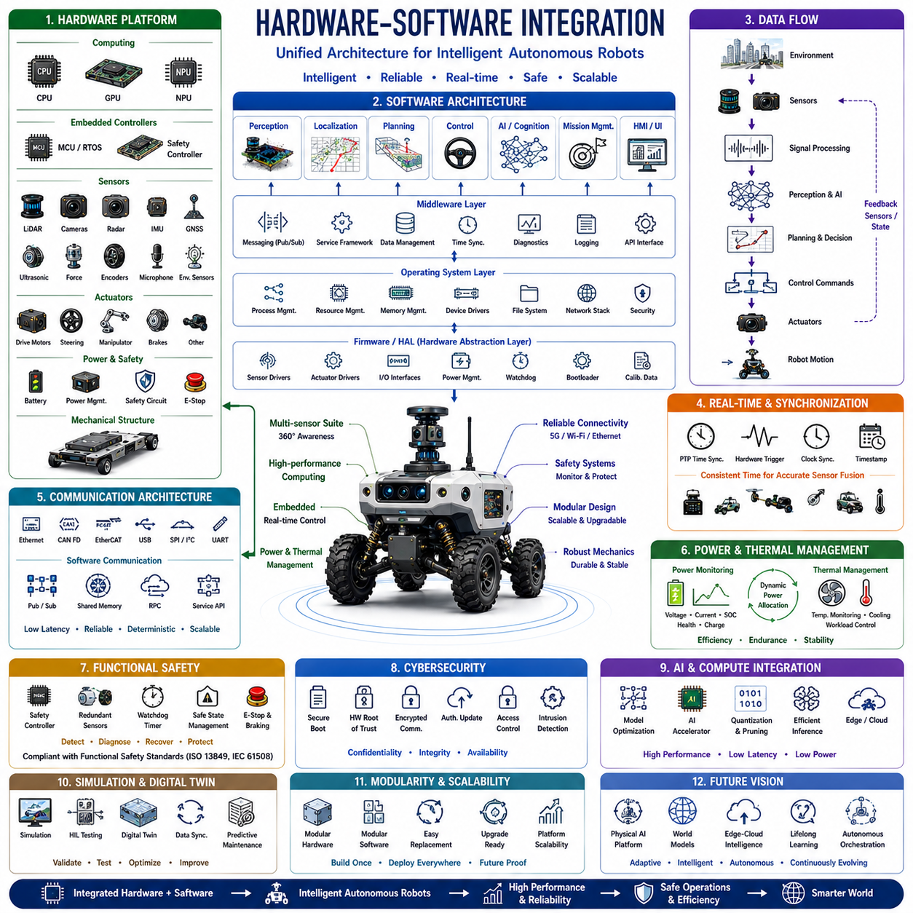
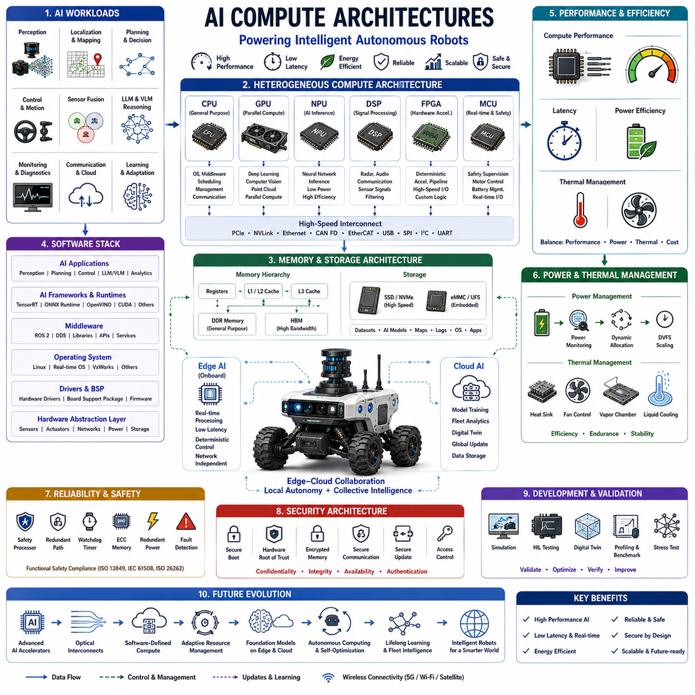
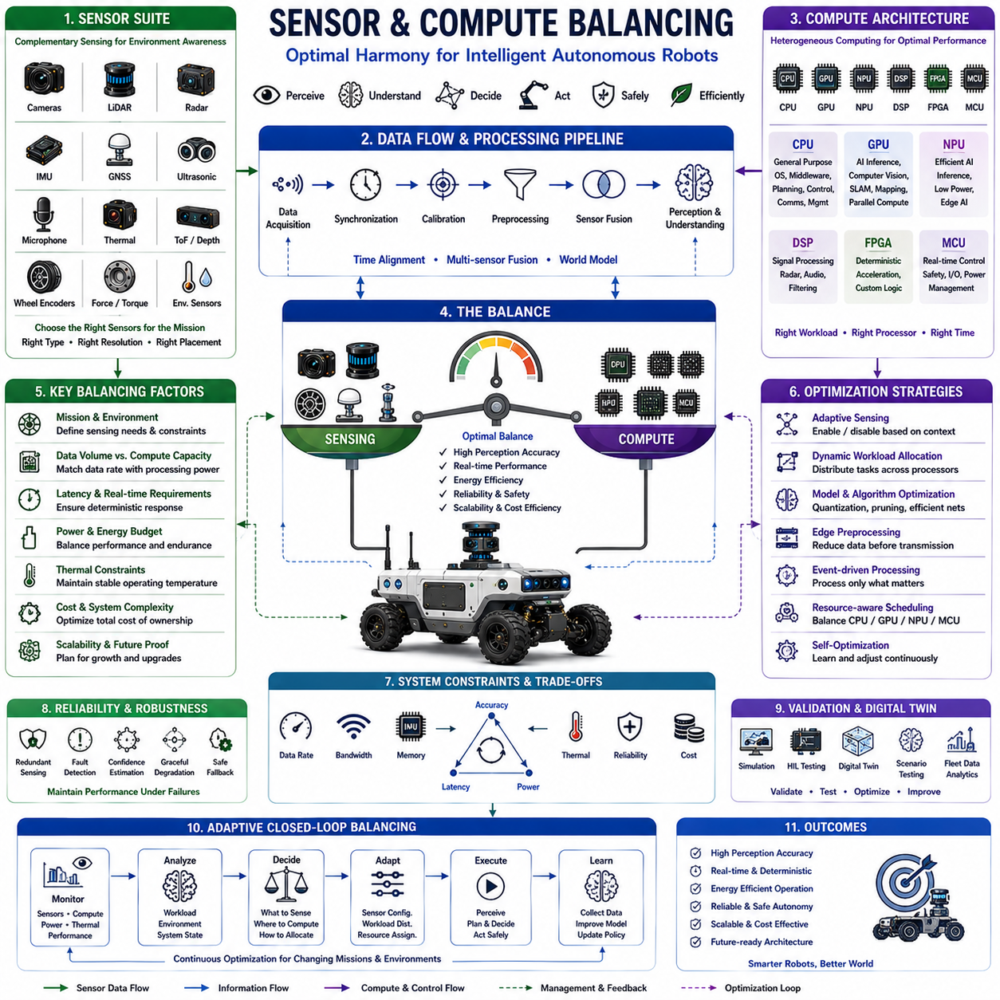
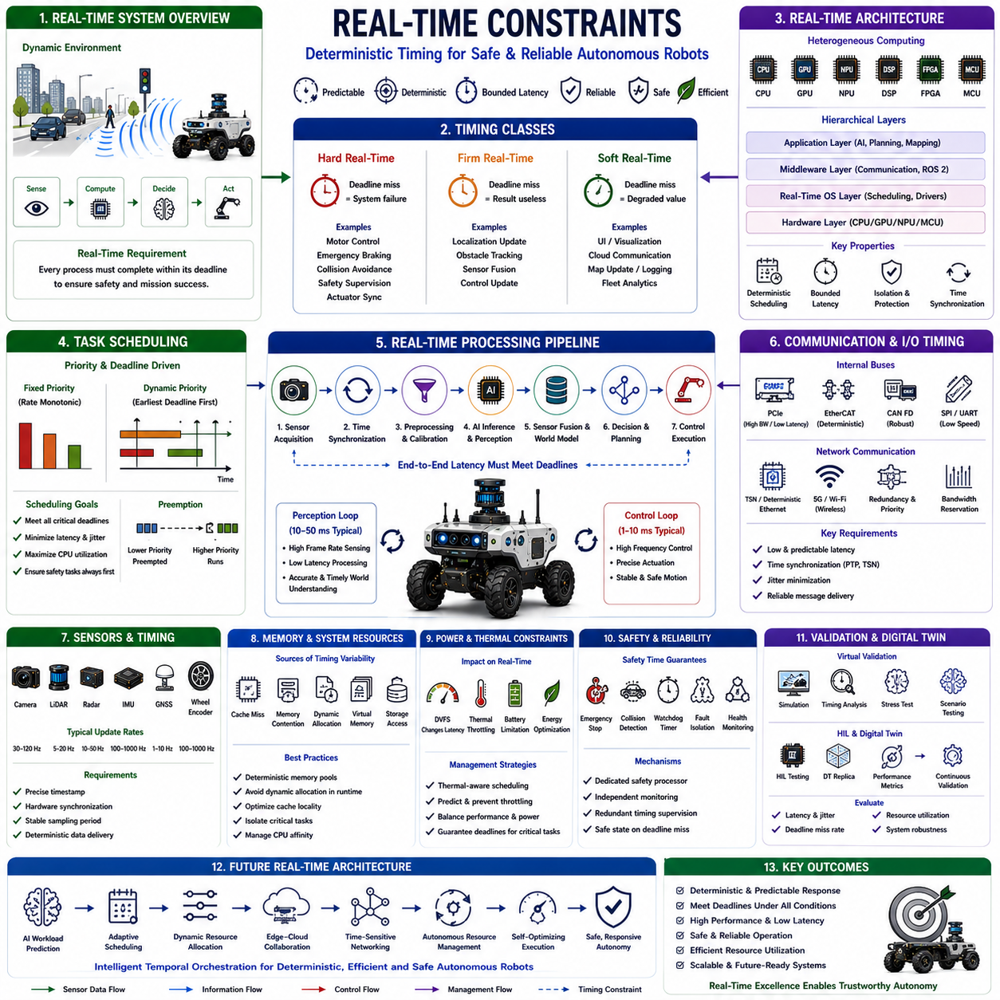
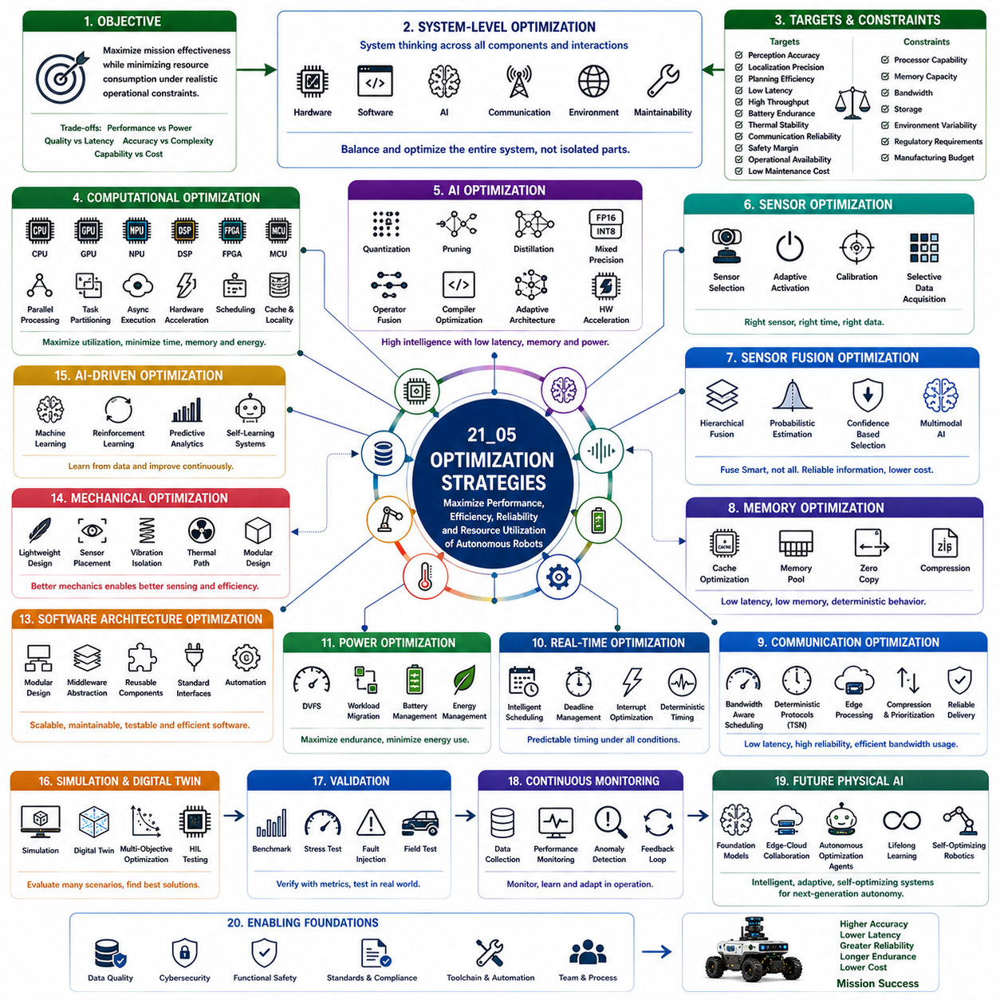

**Volume 01. AMR Foundations and System Architecture**

# 21. AMR SW/HW Co-Design · SW/HW 공동 설계

## 21.01 Hardware-Software Integration · HW-SW 통합

{width="7.268055555555556in" height="7.268055555555556in"}

하드웨어-소프트웨어 통합(Hardware-Software Integration)은 물리적 구성 요소와 계산 지능(Computational Intelligence)을 하나의 통합된 운영 시스템으로 연결하는 모든 자율로봇의 기술적 기반이다. 현대의 로봇 플랫폼은 하드웨어와 소프트웨어를 독립적인 공학 분야로 다루지 않고, 센서(Sensor), 액추에이터(Actuator), 임베디드 제어기(Embedded Controller), 통신 네트워크(Communication Network), 운영체제(Operating System), 미들웨어(Middleware), 인공지능(AI), 응용 소프트웨어(Application Software)가 하나의 통합 아키텍처로 동작하도록 긴밀하게 설계되어야 한다. 이러한 통합 수준은 단순한 성능뿐 아니라 신뢰성(Reliability), 유지보수성(Maintainability), 확장성(Scalability), 기능 안전(Functional Safety), 장기적인 제품 발전(Product Evolution)을 결정한다. 물리 AI(Physical AI)와 파운데이션 모델(Foundation Model)이 확산될수록 완전한 하드웨어-소프트웨어 통합의 중요성은 산업, 물류, 농업, 의료, 자율주행 등 다양한 분야에서 더욱 커지고 있다.

하드웨어-소프트웨어 통합의 가장 중요한 목적은 모든 물리적 장치와 모든 소프트웨어 구성 요소가 실제 운용 환경에서 효율적으로 협력하도록 만드는 것이다. 센서는 환경을 지속적으로 관측하고, 임베디드 제어기는 저수준 신호를 처리하며, 미들웨어는 정보 교환을 조정하고, 인공지능은 복잡한 상황을 이해하며, 응용 소프트웨어는 임무를 수행한다. 이러한 모든 처리 단계는 엄격한 시간(Timing), 계산 자원(Computational Resource), 통신(Communication), 발열(Thermal), 전력(Power) 제약 조건 안에서 동작해야 한다. 따라서 통합은 단순히 기능의 정상 동작뿐 아니라 결정론적 실행(Deterministic Execution), 자원 최적화(Resource Optimization), 장애 허용(Fault Tolerance), 시스템 강인성(System Robustness)을 전체 수명 주기 동안 보장하는 것을 목표로 한다.

일반적인 로봇 하드웨어 플랫폼(Hardware Platform)은 컴퓨팅 장치(Computing Unit), 임베디드 제어기, 센서, 액추에이터, 통신 인터페이스, 전원 시스템(Power System), 안전 회로(Safety Circuit), 기계 구조(Mechanical Structure)로 구성된다. 고성능 CPU는 범용 소프트웨어를 실행하며 GPU는 인공지능, 컴퓨터 비전(Computer Vision), 신경망 추론(Neural Network Inference)을 가속한다. 임베디드 마이크로컨트롤러(Embedded Microcontroller)는 실시간 모터 제어, 안전 감시, 센서 데이터 수집, 주변 장치를 관리한다. 센서 구성은 일반적으로 라이다(LiDAR), RGB 카메라(RGB Camera), 스테레오 비전(Stereo Vision), 레이더(Radar), 초음파 센서(Ultrasonic Sensor), 관성측정장치(IMU), GNSS 수신기(GNSS Receiver), 힘 센서(Force Sensor), 엔코더(Encoder), 마이크(Microphone), 환경 센서(Environmental Sensor), 산업용 계측 장비 등으로 이루어진다. 각각의 하드웨어는 고유한 기능을 제공하는 동시에 서로 다른 계산량, 통신 방식, 시간 동기화 요구사항을 가진다.

소프트웨어 아키텍처(Software Architecture)는 하드웨어의 기능을 지능형 자율 시스템으로 변환한다. 저수준 펌웨어(Firmware)는 하드웨어를 초기화하고 주변 장치를 제어하며 결정론적인 실시간 제어를 수행한다. 운영체제는 컴퓨팅 자원을 관리하고 프로세스를 스케줄링하며 메모리를 할당하고 소프트웨어 모듈 간 통신을 조정한다. 미들웨어는 인지, 위치추정, 경로계획, 제어, 진단(Diagnostics), 인공지능 모듈이 하드웨어 구현에 직접 의존하지 않고 정보를 교환할 수 있는 표준 인터페이스를 제공한다. 최종적으로 응용 소프트웨어는 이러한 기능들을 통합하여 임무 수행(Mission Execution), 사용자 인터페이스(User Interaction), 플릿 관리(Fleet Management), 클라우드 연결(Cloud Connectivity), 운영 의사결정(Operational Decision-making)을 구현한다.

임베디드 시스템(Embedded System)은 물리적 하드웨어와 상위 소프트웨어를 연결하는 핵심 계층이다. 마이크로컨트롤러는 모터 제어 알고리즘, 안전 감시, 배터리 관리, 센서 동기화, 통신 프로토콜, 장애 감시를 결정론적인 시간 안에 지속적으로 수행한다. 범용 컴퓨팅 시스템과 달리 임베디드 제어기는 계산 유연성보다 예측 가능한 실행(Predictable Execution)을 우선시한다. 실시간 운영체제(RTOS, Real-time Operating System)는 제어 루프(Control Loop)가 엄격한 지연시간 요구사항을 만족하도록 보장하면서 다양한 하드웨어 인터페이스를 동시에 관리한다. 적절한 임베디드 시스템 설계는 신뢰성, 응답성, 자율주행 안정성을 크게 향상시킨다.

하드웨어 추상화 계층(Hardware Abstraction Layer)은 소프트웨어 개발을 단순화한다. 응용 프로그램은 센서 레지스터나 통신 프로토콜을 직접 제어하는 대신 카메라, 라이다, 모터, 엔코더, 통신 포트, 전원 관리 장치 등을 표준화된 인터페이스를 통해 사용한다. 이러한 추상화는 하드웨어 교체(Component Replacement), 성능 업그레이드(Component Upgrade), 제품 맞춤화(Product Customization)를 최소한의 소프트웨어 수정만으로 가능하게 한다. 또한 다양한 로봇 플랫폼 간 코드 이식성(Code Portability)을 높이고 장기적인 유지보수 복잡도를 줄인다.

통신 아키텍처(Communication Architecture)는 분산된 하드웨어와 소프트웨어 간의 안정적인 정보 교환을 담당한다. 내부 통신은 대역폭(Bandwidth), 지연시간(Latency), 결정성(Determinism), 환경 조건에 따라 이더넷(Ethernet), CAN FD, EtherCAT, RS-485, SPI, I²C, USB, PCIe, UART 등을 사용한다. 소프트웨어는 미들웨어 프레임워크(Middleware Framework), 발행-구독(Publish-Subscribe) 메시징, 공유 메모리(Shared Memory), 원격 프로시저 호출(RPC, Remote Procedure Call), 서비스 지향 아키텍처(Service-Oriented Architecture)를 이용하여 인지, 위치추정, 계획, 제어, 진단, 클라우드 서비스 간 정보를 효율적으로 전달한다. 우수한 통신 구조는 지연시간을 최소화하면서도 동기화, 확장성, 장애 격리(Fault Isolation)를 보장한다.

시간 동기화(Time Synchronization)는 다양한 샘플링 주기로 동작하는 여러 센서를 통합할수록 더욱 중요해진다. 카메라, 라이다, 레이더, IMU, GNSS, 휠 엔코더, 힘 센서, 액추에이터 제어기는 모두 동일한 시간 기준을 유지해야 정확한 센서 융합(Sensor Fusion)이 가능하다. 정밀 시간 프로토콜(PTP, Precision Time Protocol), 하드웨어 트리거(Hardware Trigger), 동기화된 시계(Synchronized Clock), 타임스탬프 보정(Timestamp Correction), 결정론적 통신은 시스템 전체의 시간 일관성을 유지한다. 정확한 시간 동기화는 위치추정, 환경 인지, 경로계획, 자율 의사결정의 정확도를 직접 향상시킨다.

실시간 처리(Real-time Processing)는 자율로봇의 가장 중요한 특성 가운데 하나이다. 인지, 위치추정, 장애물 검출, 경로계획, 모터 제어, 안전 감시, 통신이 모두 엄격한 지연시간 요구사항 아래에서 동시에 수행되어야 한다. 계산 스케줄링(Computational Scheduling)은 고주파 제어 루프와 연산량이 큰 인공지능 추론을 균형 있게 배분하면서 안전 관련 기능이 항상 가장 높은 우선순위를 갖도록 보장한다. 효과적인 실시간 아키텍처는 응답 지연을 최소화하고 계산 과부하를 방지하며 최대 부하 상황에서도 안정적인 자율 동작을 유지한다.

센서 통합(Sensor Integration)은 서로 다른 센서를 하나의 일관된 환경 표현으로 결합하는 과정이다. 각각의 센서는 장점과 한계를 가지고 있기 때문에 강인한 인지를 위해서는 센서 융합이 필수적이다. 카메라는 풍부한 의미 정보를 제공하고 라이다는 정확한 기하 정보를 제공한다. 레이더는 악천후에서도 안정적으로 동작하며 IMU는 고주파 운동 정보를 제공한다. 센서 보정(Sensor Calibration)은 센서 간 기하학적 관계를 계산하고 시간 동기화는 서로 다른 관측 데이터를 동일한 시점으로 정렬한다. 이러한 멀티모달 센서 융합은 개별 센서만 사용하는 것보다 훨씬 높은 환경 인지와 위치추정 성능을 제공한다.

액추에이터 통합(Actuator Integration)은 소프트웨어의 의사결정을 실제 기계 운동으로 변환하는 과정이다. 전기 모터(Electric Motor), 조향 장치(Steering Mechanism), 로봇 매니퓰레이터(Robotic Manipulator), 유압 액추에이터(Hydraulic Actuator), 제동 시스템(Braking System), 서스펜션(Suspension), 보조 장치는 여러 임베디드 제어기를 통해 동시에 제어된다. 경로계획에서 생성된 운동 명령은 궤적 제어기(Trajectory Controller), 서보 루프(Servo Loop), 모터 드라이버(Motor Driver), 전력 전자(Power Electronics)를 거쳐 실제 기계 동작으로 변환된다. 엔코더, 힘 센서, 전류 센서(Current Measurement), 모터 진단 정보는 폐루프 제어(Closed-loop Control)를 통해 외란과 모델 오차를 지속적으로 보상한다.

전력 관리(Power Management)는 계산 시스템의 안정성과 운용 가능 시간을 직접 결정한다. 고성능 CPU, GPU, 센서, 통신 장치, 액추에이터, 임베디드 제어기는 모두 제한된 배터리 용량을 공유하면서 상당한 발열을 발생시킨다. 지능형 전력 분배(Intelligent Power Distribution)는 전압 안정성, 전류 소비, 배터리 상태, 충전 상태, 온도를 지속적으로 모니터링한다. 동적 전력 관리(Dynamic Power Allocation)는 안전 관련 기능을 우선적으로 유지하면서 불필요한 전력 소비를 줄인다. 전기 시스템과 소프트웨어를 통합적으로 설계하면 운용 시간을 연장하고 예기치 않은 시스템 종료를 방지할 수 있다.

열 관리(Thermal Management)는 고성능 프로세서가 복잡한 인공지능 연산을 수행할수록 더욱 중요해진다. CPU, GPU, 전력 변환기(Power Converter), 모터 드라이버, 배터리는 상당한 열을 발생시키며 이는 계산 성능과 하드웨어 신뢰성에 직접적인 영향을 미친다. 온도 센서는 주요 부품의 온도를 지속적으로 감시하며 소프트웨어는 프로세서 클럭(Frequency), 냉각 시스템(Cooling System), 작업 분배, 전력 소비를 열 상태에 따라 동적으로 조정한다. 이러한 지능형 열 관리는 지속적인 자율주행에서도 안정적인 계산 성능과 긴 하드웨어 수명을 유지하도록 지원한다.

기능 안전(Functional Safety)은 하드웨어 보호 장치와 소프트웨어 감시 기능이 긴밀하게 협력해야 실현된다. 비상정지 회로(Emergency Stop Circuit), 이중 전원(Redundant Power Supply), 안전 제어기(Safety Controller), 워치독 타이머(Watchdog Timer), 이중화 센서(Redundant Sensor), 브레이크 시스템, 하드웨어 장애 감지는 소프트웨어 진단, 상태 감시(Health Monitoring), 장애 복구(Fault Recovery), 안전 상태 관리(Safe-state Management)와 함께 동작한다. 이러한 안전 아키텍처는 위험한 고장을 신속하게 감지하고 시스템을 예측 가능한 안전 상태로 전환한다. 기능 안전 규격을 만족하기 위해서는 하드웨어와 소프트웨어가 하나의 통합 시스템으로 설계되어야 한다.

사이버보안(Cybersecurity)은 자율로봇이 내부 네트워크, 클라우드 서비스, 외부 인프라와 지속적으로 데이터를 교환하기 때문에 하드웨어-소프트웨어 통합의 핵심 요소가 되었다. 보안 부팅(Secure Boot), 하드웨어 신뢰 기반(Hardware Root of Trust), 암호화 통신(Encrypted Communication), 인증된 펌웨어 업데이트(Authenticated Firmware Update), 접근 제어(Access Control), 침입 탐지(Intrusion Detection), 안전한 소프트웨어 배포는 시스템을 악의적인 공격과 무단 변경으로부터 보호한다. 이러한 보안 기능은 실시간 성능을 저하시키지 않으면서 시스템 전체에 통합되어야 한다.

인공지능 통합(AI Integration)은 단순히 학습된 신경망을 하드웨어에서 실행하는 것을 의미하지 않는다. AI 소프트웨어는 CPU, GPU, NPU(Neural Processing Unit), DSP(Digital Signal Processor), 전용 AI 가속기(AI Accelerator)와 같은 다양한 프로세서를 효율적으로 활용하면서 엄격한 지연시간과 전력 제약을 만족해야 한다. 양자화(Quantization), 가지치기(Pruning), 연산자 융합(Operator Fusion), 컴파일러 최적화(Compiler Optimization), 하드웨어 가속(Hardware Acceleration)은 임베디드 플랫폼에서 추론 성능을 극대화한다. 이러한 AI 배포는 머신러닝 엔지니어, 임베디드 소프트웨어 개발자, 하드웨어 설계자, 시스템 통합 엔지니어의 긴밀한 협업을 필요로 한다.

시뮬레이션(Simulation)과 디지털 트윈(Digital Twin)은 실제 장비를 제작하기 전에 하드웨어-소프트웨어 통합을 검증하는 종합적인 환경을 제공한다. 가상 플랫폼은 프로세서 타이밍, 센서 특성, 통신 지연, 액추에이터 동역학, 환경 상호작용, 소프트웨어 실행 과정을 현실적으로 재현한다. HIL(Hardware-in-the-Loop) 시험은 실제 임베디드 제어기를 가상 환경과 연결하여 시간 동기화, 장애 처리, 실시간 성능을 검증한다. 디지털 트윈은 실제 운용 데이터를 지속적으로 동기화하여 예지보전, 구성 관리(Configuration Management), 소프트웨어 검증, 운용 최적화를 지원한다.

미래의 하드웨어-소프트웨어 통합(Hardware-Software Integration)은 다양한 프로세서, 지능형 센서, 엣지-클라우드 컴퓨팅(Edge-cloud Computing), 멀티모달 파운데이션 모델(Multimodal Foundation Model), 디지털 트윈(Digital Twin), 소프트웨어 정의 로보틱스(Software-defined Robotics), 자율 시스템 오케스트레이션(Autonomous System Orchestration)이 하나의 적응형 계산 생태계(Adaptive Computational Ecosystem)로 통합되는 방향으로 발전할 것이다. 표준화된 하드웨어 추상화(Standardized Hardware Abstraction), 모듈형 소프트웨어 아키텍처(Modular Software Architecture), 지능형 자원 스케줄링(Intelligent Resource Scheduling), 자기 최적화 시스템 구성(Self-optimizing System Configuration), 평생학습(Lifelong Learning), 협력형 엣지 지능(Cooperative Edge Intelligence), 자율 시스템 관리(Autonomous System Management)는 실제 운용 경험을 지속적으로 학습하여 로봇 성능을 계속 향상시킬 것이다. 미래의 로봇은 하드웨어와 소프트웨어를 별개의 기술이 아닌 하나의 사이버-물리 시스템(Cyber-Physical System)으로 통합하여 임무, 환경, 운용 조건 변화에 따라 계산 구조, 센싱 전략, 자원 배분, 지능형 행동을 스스로 적응시키는 진정한 물리 AI 플랫폼으로 발전하게 될 것이다.

## 21.02 AI Compute Architectures · AI 컴퓨트 아키텍처

{width="7.268055555555556in" height="7.268055555555556in"}

인공지능 컴퓨팅 아키텍처(AI Compute Architecture)는 자율로봇이 환경을 인지하고, 복잡한 상황을 이해하며, 지능적인 의사결정을 수행하고, 실시간으로 동작을 실행할 수 있도록 하는 계산 시스템의 핵심 기반이다. 현대의 AI 워크로드(AI Workload)는 딥러닝(Deep Learning), 컴퓨터 비전(Computer Vision), 대규모 언어 모델(LLM, Large Language Model), 멀티모달 파운데이션 모델(Multimodal Foundation Model), 센서 융합(Sensor Fusion), 위치추정(Localization), 경로계획(Planning), 제어(Control)가 엄격한 지연시간과 전력 제약 아래에서 동시에 수행되기 때문에 매우 높은 계산 성능을 요구한다. 따라서 AI 컴퓨팅 아키텍처는 단순히 고성능 프로세서를 선택하는 것이 아니라 이기종 프로세서(Heterogeneous Processor), 메모리 계층(Memory Hierarchy), 통신 네트워크(Communication Network), 저장장치(Storage System), 하드웨어 가속기(Hardware Accelerator), 운영체제(Operating System), 미들웨어(Middleware), 클라우드 연결(Cloud Connectivity), 소프트웨어 최적화(Software Optimization)를 포함하는 전체 계산 생태계를 최적화하는 기술이다. 우수한 컴퓨팅 아키텍처는 신뢰성(Reliability), 확장성(Scalability), 기능 안전(Functional Safety), 에너지 효율(Energy Efficiency), 장기적인 제품 발전(Product Evolution)을 만족하면서 계산 효율을 극대화한다.

AI 컴퓨팅 아키텍처의 가장 중요한 목적은 지능형 자율성을 구현하는 데 필요한 충분한 계산 성능을 제공하면서도 결정론적 실행(Deterministic Execution), 낮은 지연시간(Low Latency), 적절한 전력 소비(Power Consumption), 높은 운용 신뢰성을 유지하는 것이다. 기존의 임베디드 시스템이 주로 결정론적인 제어 소프트웨어를 실행했다면, 자율로봇은 대용량 센서 데이터를 처리하고, 인공지능 추론을 수행하며, 정확한 위치추정을 유지하고, 안전한 경로를 생성하며, 시스템 상태를 감시하고, 클라우드와 통신하며, 지속적인 학습까지 동시에 수행해야 한다. 따라서 컴퓨팅 아키텍처는 계산 처리량(Computational Throughput), 메모리 대역폭(Memory Bandwidth), 통신 지연시간, 발열(Thermal Limitation), 에너지 가용성을 균형 있게 관리하여 다양한 운용 환경에서도 안정적인 성능을 보장해야 한다.

현대의 로봇 컴퓨팅 플랫폼(Robotic Computing Platform)은 여러 종류의 프로세서가 각각의 장점을 활용하여 협력하는 이기종 컴퓨팅 아키텍처(Heterogeneous Computing Architecture)를 사용한다. 중앙처리장치(CPU, Central Processing Unit)는 운영체제, 미들웨어, 작업 스케줄링(Task Scheduling), 통신, 진단(Diagnostics), 임무 관리(Mission Management)를 수행한다. 그래픽처리장치(GPU, Graphics Processing Unit)는 딥러닝, 컴퓨터 비전, 포인트 클라우드(Point Cloud) 처리, 대규모 병렬 계산을 담당한다. 신경망처리장치(NPU, Neural Processing Unit)는 저전력으로 신경망 추론을 수행하며, 디지털 신호처리기(DSP, Digital Signal Processor)는 오디오, 레이더, 통신 신호를 처리한다. FPGA(Field Programmable Gate Array)는 고속 신호 처리를 위한 하드웨어 가속을 제공하며, 임베디드 마이크로컨트롤러(Embedded Microcontroller)는 안전 감시, 모터 제어, 배터리 관리, 실시간 주변장치 제어를 담당한다. 이러한 협력 구조는 단일 프로세서만 사용하는 것보다 훨씬 높은 계산 효율을 제공한다.

CPU 아키텍처(CPU Architecture)는 자율로봇 시스템 전체를 제어하는 가장 기본적인 계산 장치이다. 멀티코어 프로세서(Multi-core Processor)는 인지 관리, 위치추정, 경로계획, 진단, 통신, 플릿 관리(Fleet Management), 사용자 인터페이스(User Interface), 운영체제 서비스를 동시에 실행한다. 최신 CPU는 캐시 계층(Cache Hierarchy), 분기 예측(Branch Prediction), 비순차 실행(Out-of-order Execution), 벡터 명령어(Vector Instruction Set), 하드웨어 가상화(Hardware Virtualization), 보안 기능(Security Mechanism)을 제공하여 계산 성능을 크게 향상시킨다. 인공지능 연산이 점차 전용 가속기로 이동하더라도 CPU는 전체 시스템의 자원 관리와 소프트웨어 실행을 조정하는 중심 역할을 계속 수행한다.

그래픽처리장치(GPU)는 대규모 병렬 계산 구조를 기반으로 인공지능과 환경 인지의 핵심 연산 장치가 되었다. 수천 개의 연산 코어는 행렬 곱셈(Matrix Multiplication), 합성곱 연산(Convolution), 텐서 연산(Tensor Operation), 포인트 클라우드 처리, 영상 분석을 동시에 수행하여 딥러닝 추론을 가속한다. 최신 GPU는 혼합 정밀도 연산(Mixed-precision Arithmetic)을 수행하는 텐서 코어(Tensor Core)를 내장하여 트랜스포머 모델(Transformer Model), 비전-언어 모델(Vision-Language Model), 분할(Segmentation), 객체 검출(Object Detection), SLAM(Simultaneous Localization and Mapping), 대규모 과학 계산을 매우 빠르게 처리한다. GPU의 성능은 로봇의 환경 인지와 지능형 의사결정 능력을 직접적으로 결정한다.

신경망처리장치(NPU)는 인공지능 추론을 위해 특별히 설계된 전용 프로세서이다. 일반적인 계산보다 행렬 연산(Matrix Operation), 텐서 계산(Tensor Computation), 양자화된 신경망(Quantized Neural Network), 활성화 함수(Activation Function), 어텐션 메커니즘(Attention Mechanism)을 매우 높은 전력 효율로 처리한다. 임베디드 로봇 플랫폼은 GPU보다 훨씬 적은 전력을 소비하면서도 경쟁력 있는 추론 성능을 제공하기 때문에 NPU를 점점 더 많이 활용하고 있다. 이를 통해 배터리 기반 로봇도 복잡한 신경망을 실시간으로 지속적으로 실행할 수 있다.

메모리 아키텍처(Memory Architecture)는 인공지능 모델이 수 기가바이트(Gigabyte)의 파라미터와 대용량 센서 데이터를 동시에 처리하기 때문에 계산 성능을 결정하는 중요한 요소이다. 메모리 대역폭은 순수한 계산 성능만큼 중요하다. 캐시(Cache)는 프로세서 접근 지연시간을 줄이고 DDR 메모리(DDR Memory)는 범용 저장 공간을 제공한다. HBM(High Bandwidth Memory)은 GPU에서 대규모 신경망을 빠르게 처리할 수 있도록 매우 높은 메모리 처리량을 제공한다. SSD(Solid-State Drive)는 운영체제, 데이터셋, AI 모델, 디지털 지도, 운용 데이터를 저장한다. 균형 잡힌 메모리 구조는 프로세서 활용도를 높이고 전체 시스템 성능을 향상시킨다.

고속 인터커넥트 아키텍처(High-speed Interconnect Architecture)는 여러 계산 장치 간의 효율적인 데이터 교환을 지원한다. PCI Express는 CPU와 GPU, NPU, 저장장치, 고성능 주변장치를 초고속으로 연결한다. 이더넷(Ethernet)은 분산 로봇 시스템과 클라우드 연결을 지원하며 NVLink는 GPU 간 직접 통신을 통해 대규모 병렬 처리를 가능하게 한다. CAN FD, EtherCAT, SPI, I²C, USB, UART와 같은 임베디드 통신 버스는 저속 장치와 산업용 제어기를 연결한다. 효율적인 인터커넥트 구조는 데이터 전송 지연을 최소화하고 시스템 확장성을 향상시킨다.

인공지능 소프트웨어 프레임워크(AI Software Framework)는 신경망 모델을 실제 하드웨어에서 효율적으로 실행할 수 있도록 변환한다. TensorRT, ONNX Runtime, OpenVINO, CUDA 라이브러리(CUDA Library), Vulkan Compute, OpenCL, 제조사 전용 추론 엔진(Inference Engine)은 프로세서 특성에 맞게 AI 모델을 최적화한다. 양자화(Quantization), 가지치기(Pruning), 연산자 융합(Operator Fusion), 그래프 최적화(Graph Optimization), 커널 자동 최적화(Kernel Auto-tuning), 혼합 정밀도 연산(Mixed-precision Computation)은 추론 속도를 향상시키고 메모리 사용량과 전력 소비를 줄인다. 소프트웨어 프레임워크와 하드웨어 아키텍처의 긴밀한 통합은 실제 AI 성능을 결정하는 핵심 요소이다.

엣지 컴퓨팅(Edge Computing)은 클라우드에 의존하지 않고 로봇 내부에서 직접 인공지능을 수행하는 구조이다. 로컬 연산(Local Processing)은 통신 지연시간을 최소화하며 네트워크 장애 상황에서도 자율성을 유지할 수 있다. 장애물 검출, 위치추정, 경로계획, 모터 제어, 기능 안전과 같은 시간 민감형 작업은 반드시 엣지에서 수행되어야 한다. 따라서 엣지 AI(Edge AI)는 동적인 실제 환경에서 자율성을 구현하는 핵심 계산 플랫폼이 된다.

클라우드 컴퓨팅(Cloud Computing)은 엣지 컴퓨팅을 보완하여 거의 무제한의 계산 자원을 제공한다. 대규모 AI 학습(Large-scale AI Training), 플릿 관리(Fleet Management), 디지털 트윈 시뮬레이션(Digital Twin Simulation), 장기 데이터 저장(Long-term Data Storage), 소프트웨어 배포(Software Deployment), 예측 분석(Predictive Analytics), 협업 학습(Collaborative Learning)은 클라우드에서 수행된다. 클라우드는 로봇 내부 연산을 대체하는 것이 아니라 실시간성이 필요하지 않은 복잡한 작업을 처리하여 전체 시스템의 지능을 확장한다.

엣지-클라우드 협업(Edge-cloud Collaboration)은 미래 자율로봇에서 매우 중요한 기술이다. 엣지 프로세서는 안전과 직접 관련된 인지 및 제어를 수행하고, 클라우드는 플릿 데이터를 통합하여 파운데이션 모델을 업데이트하고 전역 최적화(Global Optimization)를 수행하며 개선된 소프트웨어를 모든 로봇에 배포한다. 이러한 지속적인 동기화는 로봇이 즉각적인 자율성을 유지하면서도 전체 플릿의 경험을 함께 학습할 수 있도록 한다.

전력 효율(Power Efficiency)은 자율로봇의 컴퓨팅 아키텍처를 설계할 때 가장 중요한 제약 조건 가운데 하나이다. 계산 성능이 높아질수록 배터리 사용량과 발열이 증가하기 때문이다. 동적 전압 조절(Dynamic Voltage Scaling), 동적 주파수 조절(Dynamic Frequency Scaling), 프로세서 절전 모드(Processor Sleep State), 작업 이동(Workload Migration), 하드웨어 가속(Hardware Acceleration), 지능형 스케줄링(Intelligent Scheduling), 적응형 전력 분배(Adaptive Power Allocation)는 운용 상황에 맞추어 에너지 소비를 지속적으로 최적화한다. 효율적인 컴퓨팅 구조는 긴 운용 시간과 높은 AI 성능을 동시에 실현한다.

열 아키텍처(Thermal Architecture)는 고성능 프로세서가 장시간 AI 연산을 수행할수록 더욱 중요해진다. 과도한 온도는 프로세서의 동작 주파수를 낮추고 하드웨어 열화를 가속하며 시스템 불안정을 유발한다. 능동 냉각(Active Cooling), 수동 방열(Passive Heat Dissipation), 베이퍼 챔버(Vapor Chamber), 액체 냉각(Liquid Cooling), 지능형 팬 제어(Intelligent Fan Control), 열 인식 작업 스케줄링(Thermal-aware Workload Scheduling)은 안정적인 동작 온도를 유지한다. 소프트웨어는 프로세서 온도를 지속적으로 감시하면서 계산 부하를 여러 프로세서에 분산하여 높은 성능을 유지한다.

기능 안전(Functional Safety)은 하드웨어 고장, 소프트웨어 오류, 통신 장애, 예기치 않은 환경 변화에서도 안정적인 동작을 유지할 수 있는 컴퓨팅 구조를 요구한다. 안전 프로세서(Safety Processor)는 고성능 컴퓨팅 시스템을 독립적으로 감시하며, 이중화 통신(Redundant Communication), 워치독 타이머(Watchdog Timer), 오류 정정 메모리(ECC Memory, Error-Correcting Memory), 이중 전원(Redundant Power Supply), 록스텝 프로세서(Lockstep Processor), 진단 소프트웨어(Diagnostic Software)는 위험한 장애를 조기에 발견한다. 이러한 안전 인증 컴퓨팅 아키텍처는 국제 기능 안전 규격을 만족하면서도 예측 가능한 자율 동작을 유지하도록 한다.

사이버보안(Cybersecurity)은 자율로봇이 대규모 데이터를 지속적으로 교환하기 때문에 AI 컴퓨팅 아키텍처에 반드시 포함되어야 한다. 보안 부팅(Secure Boot), 하드웨어 신뢰 기반(Hardware Root of Trust), 암호화 메모리(Encrypted Memory), 신뢰 실행 환경(Trusted Execution Environment), 인증된 소프트웨어 배포(Authenticated Software Deployment), 암호화 통신(Encrypted Communication), 안전한 펌웨어 업데이트(Secure Firmware Update), 하드웨어 보안 모듈(Hardware Security Module)은 계산 시스템을 외부 공격과 무단 변경으로부터 보호한다. 이러한 보안 기능은 실시간 제어 성능을 저하시키지 않도록 하드웨어와 소프트웨어 전체에 통합되어야 한다.

시뮬레이션(Simulation)과 디지털 트윈(Digital Twin)은 실제 장비를 제작하기 전에 AI 컴퓨팅 아키텍처를 검증하는 종합적인 환경을 제공한다. 가상 플랫폼은 프로세서 타이밍, 메모리 사용량, 통신 지연시간, 발열 특성, 전력 소비, 센서 워크로드, AI 실행, 전체 로봇 소프트웨어를 실제와 유사하게 재현한다. HIL(Hardware-in-the-Loop) 시험은 실제 컴퓨팅 하드웨어를 가상 환경과 연결하여 계산 병목 현상, 시간 동기화, 장애 복구, 열 안정성, 실시간 성능을 평가한다. 디지털 트윈은 실제 운용 이후에도 작업 부하 최적화, 예지보전(Predictive Maintenance), 소프트웨어 검증, 컴퓨팅 아키텍처의 지속적인 개선을 지원한다.

미래의 AI 컴퓨팅 아키텍처(AI Compute Architecture)는 이기종 프로세서(Heterogeneous Processor), 멀티모달 파운데이션 모델(Multimodal Foundation Model), 엣지-클라우드 지능(Edge-cloud Intelligence), 광 인터커넥트(Optical Interconnect), 차세대 AI 가속기(Advanced AI Accelerator), 소프트웨어 정의 컴퓨팅(Software-defined Computing), 디지털 트윈(Digital Twin), 자율 자원 관리(Autonomous Resource Management), 평생학습(Lifelong Learning)을 하나의 통합된 물리 AI(Physical AI) 컴퓨팅 생태계로 발전시킬 것이다. 계산 자원은 임무 목표, 환경의 복잡도, 센서 부하, 에너지 상태에 따라 스스로 재구성되며 여러 대의 로봇이 분산 지능(Distributed Intelligence)을 통해 협력하게 된다. 미래의 AI 컴퓨팅 아키텍처는 더 이상 고정된 하드웨어 구성이 아니라 계산 자원을 동적으로 배분하고, 인공지능 모델을 지속적으로 업데이트하며, 분산된 지능을 협력적으로 운영하고, 자율 시스템의 전체 수명 주기에 걸쳐 성능을 계속 향상시키는 자기 최적화(Self-optimizing) 계산 생태계로 발전하게 될 것이다.

## 21.03 Sensor and Compute Balancing · 센서·컴퓨트 밸런싱

{width="7.268055555555556in" height="7.268055555555556in"}

센서와 컴퓨팅의 균형(Sensor and Compute Balancing)은 자율로봇 시스템 설계에서 가장 중요한 시스템 엔지니어링(System Engineering) 원칙 가운데 하나이다. 환경을 인지하는 센서(Sensor)의 성능과 이를 처리하는 계산 자원(Computational Resource)은 항상 함께 발전해야만 신뢰성 높은 환경 인지, 실시간 의사결정, 효율적인 자율주행을 구현할 수 있다. 센서의 개수나 해상도(Resolution)를 증가시키면 환경에 대한 정보는 풍부해지지만, 동시에 처리해야 할 데이터의 양도 크게 증가하여 계산 성능, 메모리(Memory), 저장장치(Storage), 통신 대역폭(Communication Bandwidth), 전력 소비(Power Consumption)까지 모두 증가한다. 반대로 과도한 계산 자원을 배치하고 충분한 센서가 없다면 하드웨어 활용률이 낮아지고 비용만 증가한다. 따라서 최적의 센서와 컴퓨팅 균형은 센서 구성, 컴퓨팅 아키텍처(Compute Architecture), 통신 시스템, 전력, 발열(Thermal), 임무 요구사항(Mission Requirement)을 종합적으로 고려하여 높은 인지 성능과 실시간성을 확보하면서도 불필요한 하드웨어 복잡성을 최소화하는 것을 목표로 한다.

센서와 컴퓨팅 균형의 가장 중요한 목적은 제한된 하드웨어 자원 안에서 최대한 유용한 환경 정보를 확보하면서도 안정적인 실시간 성능을 유지하는 것이다. 자율로봇은 영상(Image), 포인트 클라우드(Point Cloud), 관성 데이터(Inertial Measurement), 레이더 반사 신호(Radar Reflection), 위치 정보(Positioning Data), 오디오(Audio), 시스템 진단 정보(Diagnostic Information)를 동시에 처리한다. 각각의 센서는 중요한 정보를 제공하지만 계산 부하, 메모리 사용량, 통신량, 시간 동기화(Synchronization), 소프트웨어 유지보수 부담도 함께 증가시킨다. 따라서 시스템 설계자는 단순한 센서 정확도뿐 아니라 계산 비용, 지연시간(Latency), 강인성(Robustness), 신뢰성(Reliability), 에너지 효율(Energy Efficiency), 유지보수성(Maintainability)을 함께 평가해야 한다. 균형 잡힌 시스템은 실질적인 가치가 적은 센서 중복이나 불필요한 고성능 컴퓨팅 구성을 모두 피한다.

센서 선정(Sensor Selection)은 단순히 많은 센서를 사용하는 것이 아니라 수행할 임무(Mission)를 정확히 이해하는 것에서 시작된다. 산업용 검사 로봇은 고정밀 영상과 정확한 위치추정을 우선시하는 반면, 실외 자율주행 차량은 장거리 환경 인지, 악천후 대응, 안정적인 위치추정을 더욱 중요하게 고려한다. 물류창고 로봇은 장애물 회피와 플릿 관리(Fleet Management)가 핵심이며, 농업 로봇은 지형 이해(Terrain Understanding), 작물 인식(Crop Perception), 환경 적응(Environmental Adaptation)이 중요하다. 따라서 센서 구성은 실제 운용 환경, 안전 요구사항, 예상되는 고장 조건, 환경 변화에 맞추어 설계되어야 한다. 이러한 임무 중심의 센서 선정은 불필요한 계산량을 줄이면서도 필요한 환경 정보를 충분히 확보할 수 있도록 한다.

각 센서 유형(Sensing Modality)은 서로 다른 장점과 한계를 가지며 계산 요구사항도 크게 다르다. 카메라(Camera)는 풍부한 의미 정보(Semantic Information)를 제공하지만 대용량 영상 데이터를 생성하여 높은 AI 계산 성능을 요구한다. 라이다(LiDAR)는 정확한 3차원 기하 정보를 제공하지만 포인트 클라우드 처리를 위한 대규모 병렬 연산이 필요하다. 레이더(Radar)는 악천후에서도 안정적으로 동작하면서 비교적 적은 데이터량을 생성하지만 복잡한 신호 해석 알고리즘이 필요하다. 관성측정장치(IMU, Inertial Measurement Unit)는 적은 계산량으로 고주파 운동 정보를 제공하며, GNSS(Global Navigation Satellite System)는 상대적으로 적은 계산으로 절대 위치를 제공한다. 초음파 센서(Ultrasonic Sensor)는 근거리 장애물 검출에 매우 효율적이다. 이러한 특성을 이해하면 하나의 센서에 의존하기보다 서로 보완적인 센서를 효과적으로 조합할 수 있다.

센서 해상도(Sensor Resolution)는 계산 부하를 직접적으로 결정하는 요소이다. 공간 해상도(Spatial Resolution), 시간 해상도(Temporal Resolution), 스펙트럼 해상도(Spectral Resolution)가 높아질수록 생성되는 데이터의 양은 급격히 증가한다. 예를 들어 카메라 해상도를 2메가픽셀(Megapixel)에서 8메가픽셀로 높이면 영상의 세부 정보는 크게 향상되지만 처리해야 하는 픽셀 수도 약 네 배 증가한다. 프레임 속도(Frame Rate)를 높이면 움직임 추적 성능은 좋아지지만 계산량도 비례하여 증가한다. 수백 개의 레이저 채널을 사용하는 고밀도 라이다는 매우 정밀한 환경 모델을 생성하지만 동시에 막대한 계산 자원을 요구한다. 따라서 실제 응용 분야에 적합한 해상도를 선택하는 것이 시스템 효율을 높이는 핵심 요소이다.

센서 배치(Sensor Placement)와 물리적 통합(Physical Integration) 역시 환경 인지 성능과 계산 효율에 직접적인 영향을 미친다. 적절한 센서 위치는 가림 현상(Occlusion)을 줄이고 시야(Field of View)의 중첩을 최적화하며 보정(Calibration)을 단순화하고 센서 융합의 정확도를 높인다. 지나치게 중복되는 시야는 거의 동일한 데이터를 반복 처리하게 되어 계산 자원을 낭비하며, 반대로 시야 중첩이 부족하면 환경 이해 능력이 떨어지고 위치추정의 불확실성이 증가한다. 또한 진동 절연(Vibration Isolation), 열 안정성(Thermal Stability), 전자기 적합성(Electromagnetic Compatibility), 광학 청결성(Optical Cleanliness), 유지보수 접근성(Maintenance Accessibility)도 장기적인 센서 신뢰성에 중요한 영향을 미친다.

시간 동기화(Sensor Synchronization)는 센서 구성이 복잡해질수록 더욱 중요해진다. 카메라, 라이다, 레이더, IMU, 휠 엔코더(Wheel Encoder), GNSS, 마이크(Microphone), 힘 센서(Force Sensor)는 서로 다른 샘플링 주기와 통신 지연을 가진다. 하드웨어 트리거(Hardware Trigger), 정밀 시간 프로토콜(PTP, Precision Time Protocol), 동기화된 시계(Synchronized Clock), 결정론적 통신(Deterministic Communication), 보정 알고리즘(Calibration Algorithm)은 모든 센서 데이터를 동일한 시간 기준으로 정렬한다. 시간 동기화가 제대로 이루어지지 않으면 소프트웨어는 시간 오차를 보정하기 위해 더 많은 계산을 수행해야 하며, 동시에 환경 인지와 의사결정의 정확도도 저하된다.

센서 융합(Sensor Fusion)은 다양한 센서 정보를 하나의 일관된 환경 모델(Environment Model)로 통합하기 때문에 자율로봇에서 가장 많은 계산량을 요구하는 작업 가운데 하나이다. 저수준 융합(Low-level Fusion)은 원시 데이터를 결합하고, 중간 수준 융합(Mid-level Fusion)은 특징(Feature)을 통합하며, 고수준 융합(High-level Fusion)은 독립적인 인지 결과를 의미 기반 환경 모델(Semantic World Model)로 통합한다. 최근에는 인공지능이 카메라, 라이다, 레이더, IMU, 언어 기반 추론(Language-based Reasoning)을 동시에 활용하는 멀티모달 센서 융합(Multimodal Sensor Fusion)을 수행하고 있다. 효율적인 센서 융합은 단순히 계산량을 늘리는 것이 아니라 필요한 정보를 지능적으로 결합하여 높은 인지 성능을 달성한다.

계산 자원 할당(Compute Resource Allocation)은 작업의 중요도에 따라 우선순위를 정확하게 배분해야 한다. 기능 안전 감시(Functional Safety Monitoring), 모터 제어(Motor Control), 위치추정(Localization), 장애물 검출(Obstacle Detection), 충돌 회피(Collision Avoidance)는 매우 엄격한 실시간성을 요구한다. 반면 인공지능 추론(AI Inference), 의미 이해(Semantic Understanding), 지도 생성(Mapping), 행동 예측(Behavior Prediction), 클라우드 통신은 임무에 따라 다소 높은 지연시간을 허용할 수 있다. 현대의 이기종 컴퓨팅 아키텍처(Heterogeneous Computing Architecture)는 CPU, GPU, NPU, DSP, FPGA, 임베디드 제어기를 작업 특성에 맞게 활용하여 계산 자원을 효율적으로 분산한다. 이러한 작업 분배는 프로세서 활용도를 높이면서도 최대 부하 상황에서도 예측 가능한 시스템 동작을 유지하도록 한다.

인공지능 워크로드 최적화(AI Workload Optimization)는 센서 성능과 계산 자원의 균형을 유지하는 핵심 기술이다. 대규모 신경망(Large Neural Network)은 인지 정확도를 크게 향상시키지만 임베디드 시스템에서는 과도한 계산량을 요구하는 경우가 많다. 양자화(Quantization), 가지치기(Pruning), 연산자 융합(Operator Fusion), 혼합 정밀도 연산(Mixed-precision Computation), 경량 신경망(Efficient Neural Architecture), 지식 증류(Knowledge Distillation), 적응형 추론(Adaptive Inference), 하드웨어 최적화(Hardware-specific Optimization)는 계산량을 크게 줄이면서도 충분한 정확도를 유지한다. 또한 환경 변화와 계산 자원 상태에 따라 서로 다른 AI 모델을 선택하는 동적 모델 선택(Dynamic Model Selection)은 전체 시스템의 효율을 더욱 높인다.

통신 아키텍처(Communication Architecture)는 센서와 계산 자원의 균형에 직접적인 영향을 준다. 센서 데이터는 인공지능 모듈로 전달되기 전에 여러 계산 장치를 거쳐 이동하는 경우가 많다. PCI Express, 이더넷(Ethernet), NVLink와 같은 고속 인터페이스는 대용량 센서 데이터를 처리하며, CAN FD, EtherCAT, SPI, UART는 임베디드 제어기와 저속 센서를 효율적으로 연결한다. 센서 가까이에서 전처리(Edge Preprocessing)를 수행하면 원시 데이터를 모두 전송하지 않고 필요한 특징 정보만 전달할 수 있으므로 통신량과 계산량을 동시에 줄일 수 있다. 이러한 지능형 통신 구조는 시스템 확장성과 실시간성을 모두 향상시킨다.

전력 소비(Power Consumption)는 센서 구성과 컴퓨팅 구조를 긴밀하게 연결하는 요소이다. 고해상도 카메라, 회전형 라이다(Rotating LiDAR), 고성능 GPU, 냉각 시스템(Cooling System), 통신 장치, 저장장치는 모두 배터리 사용 시간을 단축시킨다. 동적 전력 관리(Dynamic Power Management)는 프로세서 주파수, 센서 활성화 시점, AI 모델의 복잡도, 통신 대역폭, 작업 배분을 지속적으로 조절하여 에너지 효율을 높인다. 적응형 에너지 관리(Adaptive Energy Management)는 장시간 자율 운용에서도 안전과 관련된 기능이 항상 충분한 계산 자원을 사용할 수 있도록 보장한다.

열 균형(Thermal Balancing) 역시 매우 중요한 요소이다. 센서와 고성능 프로세서는 장시간 동작하면서 많은 열을 발생시킨다. 높은 온도는 센서의 안정성을 저하시킬 뿐 아니라 프로세서의 동작 주파수를 낮추고 배터리 효율을 감소시키며 시스템 전체의 신뢰성을 떨어뜨린다. 지능형 열 관리(Intelligent Thermal Management)는 프로세서 스케줄링, 냉각 시스템, 작업 이동(Workload Migration), 센서 활성화 전략, 환경 적응을 함께 제어하여 안정적인 온도를 유지한다. 열을 고려한 작업 스케줄링(Thermal-aware Scheduling)은 국부적인 과열을 방지하면서도 지속적인 계산 성능을 유지할 수 있도록 한다.

신뢰성(Reliability)을 확보하기 위해서는 일부 센서나 계산 장치가 고장나더라도 시스템이 안전하게 동작할 수 있는 균형 잡힌 구조가 필요하다. 이중 센서(Redundant Sensing), 점진적인 성능 저하(Graceful Degradation), 신뢰도 추정(Confidence Estimation), 고장 검출(Fault Detection), 적응형 작업 재분배(Adaptive Workload Redistribution)는 일부 구성 요소에 문제가 발생해도 전체 시스템이 안정적으로 운용되도록 지원한다. 최근의 인공지능은 센서의 신뢰도를 실시간으로 평가하고 가장 신뢰할 수 있는 센서에 계산 자원을 우선 배분하는 기능까지 수행한다. 이러한 균형 잡힌 중복 구조는 과도한 계산량 증가 없이 높은 시스템 강인성을 제공한다.

시뮬레이션(Simulation)과 디지털 트윈(Digital Twin)은 실제 하드웨어를 제작하기 전에 센서와 컴퓨팅의 균형을 종합적으로 검증할 수 있는 환경을 제공한다. 가상 플랫폼은 센서 특성, 통신 지연시간, 프로세서 사용률, 시간 동기화, 발열, 전력 소비, 인공지능 계산량을 실제 환경과 유사하게 재현한다. HIL(Hardware-in-the-Loop) 시험은 실제 센서와 컴퓨팅 장치를 가상 환경과 연결하여 계산 병목 현상, 시간 동기화 오류, 과도한 전력 소비, 계산 여유 부족 등을 사전에 검증한다. 디지털 트윈은 실제 운용 이후에도 작업 분배를 최적화하고 소프트웨어 업데이트를 검증하며 운용 데이터를 기반으로 시스템 균형을 지속적으로 개선한다.

미래의 센서와 컴퓨팅 균형(Sensor and Compute Balancing)은 임무 목표, 환경의 복잡도, 하드웨어 상태, 에너지 가용성, 인공지능 신뢰도에 따라 스스로 센서 구성과 계산 자원을 재구성하는 적응형 자율 아키텍처(Adaptive Autonomous Architecture)로 발전할 것이다. 이벤트 기반 센서(Event-driven Sensor), 뉴로모픽 센서(Neuromorphic Sensor), 소프트웨어 정의 인지(Software-defined Perception), 멀티모달 파운데이션 모델(Multimodal Foundation Model), 엣지-클라우드 협업(Edge-cloud Collaboration), 지능형 작업 오케스트레이션(Intelligent Workload Orchestration), 자기 최적화 자원 스케줄링(Self-optimizing Resource Scheduling), 평생학습(Lifelong Learning)은 사람의 개입 없이도 센서와 계산 자원을 지속적으로 최적의 상태로 유지하게 된다. 미래의 물리 AI(Physical AI) 플랫폼은 더 이상 고정된 하드웨어 구성을 사용하는 시스템이 아니라, 어떤 센서를 활성화할 것인지, 계산 자원을 어디에 배분할 것인지, AI 추론을 어디에서 수행할 것인지, 그리고 환경 인지 정확도와 에너지 효율, 안전성, 운용 성능을 어떻게 동시에 최적화할 것인지를 스스로 판단하는 지능형 자율 컴퓨팅 플랫폼으로 발전하게 될 것이다.

## 21.04 Real-Time Constraints · 실시간 제약 조건

{width="7.268055555555556in" height="7.268055555555556in"}

실시간 제약(Real-time Constraints)은 자율로봇 시스템이 안전하고 신뢰성 있게 동작하기 위해 환경 인지, 계산, 통신, 의사결정, 물리적 제어를 반드시 정해진 시간 안에 완료해야 하는 시간적 요구사항을 의미한다. 일반적인 컴퓨팅 시스템에서는 처리 지연이 단순히 성능 저하로 이어질 수 있지만, 자율로봇은 변화하는 실제 물리 환경과 직접 상호작용하기 때문에 과도한 지연시간은 즉시 안전성, 임무 수행, 시스템 안정성에 영향을 미칠 수 있다. 따라서 모든 계산 과정에는 결과가 유효하기 위해 반드시 만족해야 하는 마감시간(Deadline)이 존재한다. 실시간 시스템 설계는 단순히 계산 속도를 높이는 것이 아니라 결정론적 실행(Deterministic Execution), 예측 가능한 지연시간(Predictable Latency), 제한된 응답시간(Bounded Response Time), 최악의 운용 조건에서도 보장되는 작업 완료를 달성하는 것을 목표로 한다. 우수한 실시간 아키텍처는 환경 변화, 계산 부하, 제한된 하드웨어 자원 속에서도 자율로봇이 안전하게 운용될 수 있도록 지원한다.

실시간 제약 관리의 가장 중요한 목적은 계산 부하나 환경의 복잡도와 관계없이 모든 중요한 작업이 반드시 요구된 시간 안에 완료되도록 보장하는 것이다. 자율로봇은 환경 인지(Perception), 위치추정(Localization), 지도 생성(Mapping), 경로계획(Planning), 모션 제어(Motion Control), 장애물 회피(Obstacle Avoidance), 통신(Communication), 진단(Diagnostics), 배터리 관리(Battery Management), 인공지능 추론(AI Inference)을 동시에 수행한다. 각각의 작업은 서로 다른 실행 주기(Execution Frequency), 계산 복잡도(Computational Complexity), 안전 우선순위(Safety Priority), 시간 요구사항(Timing Requirement)을 가진다. 따라서 실시간 아키텍처는 프로세서 활용률을 최대화하는 것보다 예측 가능한 시간 특성을 유지하는 데 초점을 맞춘다. 이러한 결정론적 실행은 높은 계산 부하나 예기치 않은 상황에서도 일관된 시스템 응답을 보장한다.

실시간 시스템(Real-time System)은 일반적으로 마감시간을 놓쳤을 때의 영향을 기준으로 하드 실시간(Hard Real-time), 펌 실시간(Firm Real-time), 소프트 실시간(Soft Real-time)으로 구분된다. 하드 실시간 작업은 마감시간을 넘기면 즉시 위험한 상황이 발생할 수 있기 때문에 절대로 지연이 허용되지 않는다. 모터 제어(Motor Control), 비상 제동(Emergency Braking), 충돌 회피(Collision Avoidance), 기능 안전 감시(Functional Safety Supervision), 액추에이터 동기화(Actuator Synchronization)가 여기에 속한다. 펌 실시간 작업은 마감시간을 넘기면 결과의 가치가 크게 감소하지만 반드시 위험을 초래하지는 않는다. 위치추정 업데이트(Localization Update), 장애물 추적(Obstacle Tracking), 센서 융합(Sensor Fusion)이 대표적인 예이다. 소프트 실시간 작업은 일정 수준의 시간 변동을 허용하며 사용자 인터페이스(User Interface), 클라우드 통신(Cloud Communication), 지도 업데이트(Map Update), 로그 기록(Logging), 플릿 분석(Fleet Analytics) 등이 여기에 포함된다. 이러한 분류는 시스템이 계산 자원을 우선순위에 따라 효율적으로 배분할 수 있도록 한다.

작업 스케줄링(Task Scheduling)은 실시간 제약을 만족시키는 가장 중요한 기술 가운데 하나이다. 운영체제(Operating System)는 우선순위(Priority), 마감시간, 프로세서 상태, 자원 의존성을 고려하여 어떤 작업을 실행하고 중단하며 다시 실행할 것인지를 지속적으로 결정한다. 고정 우선순위 스케줄링(Fixed-priority Scheduling)은 작업마다 일정한 우선순위를 유지하며, 동적 스케줄링(Dynamic Scheduling)은 마감시간과 시스템 상태에 따라 우선순위를 변경한다. EDF(Earliest Deadline First), RMS(Rate Monotonic Scheduling), 혼합 중요도 스케줄링(Mixed-criticality Scheduling)은 자율로봇에서 널리 사용되는 대표적인 기법이다. 효과적인 스케줄링은 지연시간을 최소화하면서도 안전과 관련된 작업이 항상 충분한 계산 자원을 확보하도록 보장한다.

운영체제는 결정론적 실행을 구현하는 핵심 요소이다. 일반적인 데스크톱 운영체제는 평균 처리량(Average Throughput)을 최적화하지만, 실시간 운영체제(RTOS, Real-Time Operating System)는 결정론적 스케줄링, 제한된 인터럽트 지연(Bounded Interrupt Latency), 예측 가능한 문맥 전환(Predictable Context Switching), 우선순위 상속(Priority Inheritance), 정밀 타이머 관리(Precise Timer Management)를 제공하여 안전이 중요한 로봇 시스템을 지원한다. 최근에는 PREEMPT_RT를 적용한 리눅스(Linux)가 현대적인 소프트웨어 생태계를 유지하면서도 스케줄링 지연을 크게 줄일 수 있어 널리 활용되고 있다. 적절한 운영체제의 선택은 시간 요구사항, 응용 프로그램의 복잡도, 인증(Certification), 하드웨어 구조, 장기 유지보수성을 종합적으로 고려하여 이루어진다.

인터럽트 관리(Interrupt Management)는 실시간 성능에 매우 큰 영향을 미친다. 센서, 통신 인터페이스, 타이머(Timer), 하드웨어 이벤트는 지속적으로 프로세서의 즉각적인 처리를 요구한다. 인터럽트 처리가 비효율적이면 예측하기 어려운 실행 지연이 발생하여 다른 소프트웨어 작업에도 영향을 미친다. 우선순위 기반 인터럽트 제어기(Prioritized Interrupt Controller), 인터럽트 친화성(Interrupt Affinity), 지연 인터럽트 처리(Deferred Interrupt Processing), 효율적인 장치 드라이버(Device Driver)는 응답성을 높이면서도 불필요한 프로세서 중단을 줄인다. 우수한 인터럽트 구조는 인공지능과 환경 인지 작업을 방해하지 않으면서도 빠른 시스템 반응을 유지한다.

센서 데이터 획득 시점(Sensor Acquisition Timing)은 결정론적인 환경 인지의 출발점이다. 카메라는 일정한 프레임 속도(Frame Rate)로 영상을 획득하고, 라이다(LiDAR)는 회전 주기에 따라 포인트 클라우드를 생성하며, IMU(Inertial Measurement Unit)는 높은 주기로 운동 데이터를 제공하고, 레이더(Radar)는 주기적으로 목표물을 갱신하며, 휠 엔코더(Wheel Encoder)는 차량의 움직임을 지속적으로 측정한다. 이러한 센서가 일정한 시간 간격으로 동작하기 위해서는 하드웨어 동기화(Hardware Synchronization), 정확한 타임스탬프(Timestamp), 결정론적 통신(Deterministic Communication), 정밀한 작업 스케줄링이 필요하다. 안정적인 센서 타이밍은 센서 융합의 정확도와 위치추정 성능을 크게 향상시킨다.

통신 지연시간(Communication Latency)은 분산된 자율로봇 시스템에서 매우 중요한 요소이다. 센서, 계산 장치, 제어기가 여러 프로세서와 네트워크로 분산되어 있기 때문에 데이터 전송 시간 자체가 시스템 성능을 결정한다. PCI Express, EtherCAT, CAN FD, Ethernet, SPI, UART는 각각 서로 다른 대역폭(Bandwidth), 지연시간, 결정성을 제공한다. 무선 통신은 전파 간섭, 네트워크 혼잡, 신호 품질 변화에 의해 추가적인 지연이 발생한다. 시간 민감형 네트워킹(TSN, Time-Sensitive Networking), 결정론적 이더넷(Deterministic Ethernet), 메시지 우선순위(Message Prioritization), 통신 이중화(Communication Redundancy), 대역폭 예약(Bandwidth Reservation)은 이러한 지연을 최소화하고 예측 가능한 통신을 지원한다.

인공지능 추론(AI Inference)은 현대 자율로봇에서 가장 큰 실시간 과제 가운데 하나이다. 대규모 트랜스포머 모델(Transformer Model), 멀티모달 파운데이션 모델(Multimodal Foundation Model), 의미 분할(Semantic Segmentation), 객체 검출(Object Detection), 장면 이해(Scene Understanding)는 높은 계산량을 요구하며 입력 데이터의 복잡도에 따라 실행 시간이 달라질 수 있다. 양자화(Quantization), 가지치기(Pruning), 혼합 정밀도 추론(Mixed-precision Inference), 연산자 융합(Operator Fusion), 적응형 신경망(Adaptive Neural Architecture), 하드웨어 가속(Hardware Acceleration)은 실행 시간을 크게 줄이면서도 충분한 정확도를 유지한다. 사용 가능한 계산 자원에 적합한 AI 모델을 선택하는 것은 결정론적인 자율주행을 유지하는 핵심 요소이다.

환경 인지 파이프라인(Perception Pipeline)은 환경 정보를 빠르게 처리해야 하기 때문에 엄격한 시간 제약을 가진다. 원시 센서 데이터 획득(Raw Sensor Acquisition), 보정(Calibration), 전처리(Preprocessing), 특징 추출(Feature Extraction), 신경망 추론(Neural Network Inference), 센서 융합(Sensor Fusion), 객체 추적(Object Tracking), 의미 해석(Semantic Interpretation), 환경 모델 생성(World Model Generation)은 하나의 연속적인 처리 흐름을 구성한다. 어느 한 단계라도 지연되면 이후의 의사결정과 제어까지 모두 늦어지게 된다. 따라서 병렬 처리(Parallel Processing), 작업 분할(Workload Partitioning), 비동기 처리(Asynchronous Processing), 하드웨어 가속, 효율적인 메모리 활용을 통해 전체 처리 시간을 최소화해야 한다.

위치추정(Localization)과 지도 생성(Mapping)은 일정한 주기로 지속적으로 수행되어야 한다. SLAM(Simultaneous Localization and Mapping)은 영상, IMU, 라이다, 휠 오도메트리(Wheel Odometry), GNSS, 환경 특징을 통합하여 현재 위치를 계산한다. 위치추정이 늦어지면 제어 정확도가 떨어지고 장애물 회피가 어려워지며 주행 안정성이 저하된다. 따라서 증분 최적화(Incremental Optimization), 계층적 지도(Hierarchical Representation), 하드웨어 가속을 적용하여 장시간 운용에서도 실시간 위치추정을 유지해야 한다.

모션 계획(Motion Planning)과 궤적 생성(Trajectory Generation)은 움직이는 장애물과 변화하는 환경에 지속적으로 대응해야 하므로 제한된 시간 안에 반드시 완료되어야 한다. 전역 경로계획(Global Planning)은 장거리 이동 전략을 계산하고, 지역 경로계획(Local Planning)은 현재 센서 정보를 이용하여 즉시 실행 가능한 충돌 없는 궤적을 생성한다. 예측 제어(Predictive Control), 최적화 알고리즘(Optimization Algorithm), 행동 추론(Behavior Reasoning), 궤적 검증(Trajectory Validation)은 계산량이 매우 크다. 따라서 계층형 구조(Hierarchical Architecture), 증분 최적화, 병렬 처리, 적응형 탐색 전략을 사용하여 항상 마감시간 이전에 안전한 경로를 생성하도록 설계한다.

저수준 모션 제어(Low-level Motion Control)는 자율로봇에서 가장 엄격한 하드 실시간 작업이다. 모터 제어기(Motor Controller), 조향 장치(Steering Actuator), 브레이크 시스템(Braking System), 로봇 매니퓰레이터(Robotic Manipulator), 서스펜션(Suspension)은 초당 수백 회에서 수천 회 이상의 폐루프 제어(Closed-loop Control)를 수행한다. 제어 지연은 주행 안정성, 추종 정확도(Tracking Accuracy), 외란 보상(Disturbance Rejection), 기계적 안전성에 직접적인 영향을 준다. 따라서 전용 임베디드 제어기(Embedded Controller), 결정론적 통신 버스, 하드웨어 타이머(Hardware Timer), 실시간 펌웨어(Real-time Firmware)를 이용하여 상위 AI 계산과 독립적으로 정확한 제어 주기를 유지한다.

메모리 동작(Memory Behavior)은 실시간성을 결정하는 중요한 요소이다. 캐시 미스(Cache Miss), 메모리 경쟁(Memory Contention), 동적 메모리 할당(Dynamic Memory Allocation), 가상 메모리(Virtual Memory), 저장장치 접근은 실행 시간의 변동성을 증가시킨다. 실시간 소프트웨어는 실행 중의 동적 메모리 할당을 최소화하고, 결정론적인 메모리 풀(Memory Pool)을 사용하며, 불필요한 데이터 복사를 줄이고, 캐시 활용(Cache Locality)을 최적화하며, 프로세서 친화성(Processor Affinity)을 적절히 설정한다. 또한 안전과 관련된 작업을 인공지능 계산과 분리하여 복잡한 AI 연산 중에도 예측 가능한 실행 시간을 유지하도록 한다.

전력 관리(Power Management)와 열 관리(Thermal Management) 역시 실시간성과 밀접하게 연결되어 있다. 프로세서 주파수 조절(Frequency Scaling), 열 제한(Thermal Throttling), 배터리 상태(Battery Limitation), 에너지 최적화(Energy Optimization)는 계산 성능에 직접적인 영향을 미친다. 동적 전압 조절(Dynamic Voltage Scaling)은 에너지 효율을 높이지만 실행 시간을 증가시킬 수 있다. 프로세서 온도가 높아지면 자동으로 동작 주파수가 낮아져 마감시간을 만족하지 못할 가능성이 증가한다. 따라서 지능형 자원 스케줄링(Intelligent Resource Scheduling)은 계산 성능, 발열, 전력 소비를 동시에 고려하여 안전 관련 작업이 항상 실시간 요구사항을 만족하도록 한다.

기능 안전(Functional Safety)은 결정론적인 시간 보장이 이루어질 때만 실현될 수 있다. 비상정지(Emergency Stop), 충돌 감지(Collision Detection), 액추에이터 정지(Actuator Shutdown), 고장 격리(Fault Isolation), 워치독 감시(Watchdog Supervision), 이중화 관리(Redundancy Management), 상태 감시(Health Monitoring)는 계산 부하와 관계없이 최대 응답시간이 반드시 보장되어야 한다. 따라서 안전 아키텍처는 전용 프로세서(Dedicated Processor), 독립적인 통신 채널(Isolated Communication Channel), 이중화된 시간 감시(Redundant Timing Supervision), 독립적인 감시 시스템(Independent Monitoring Mechanism)을 사용하여 시간 제약을 지속적으로 검증하며 이상 상황에서는 즉시 안전 상태(Safe State)로 전환한다.

시뮬레이션(Simulation)과 디지털 트윈(Digital Twin)은 실제 장비를 제작하기 전에 실시간 성능을 검증하는 종합적인 환경을 제공한다. 가상 플랫폼은 프로세서 타이밍, 통신 지연, 인터럽트 동작, 작업 스케줄링, 센서 동기화, 메모리 사용량, 발열 특성, 인공지능 실행을 실제와 유사하게 재현한다. HIL(Hardware-in-the-Loop) 시험은 실제 임베디드 제어기를 이용하여 시간 병목 현상, 마감시간 위반, 동기화 오류, 자원 경쟁을 사전에 검증한다. 이러한 지속적인 검증은 소프트웨어 기능이 증가하고 계산량이 커지더라도 실제 자율로봇이 안정적인 실시간 성능을 유지할 수 있도록 한다.

미래의 실시간 아키텍처(Real-time Architecture)는 이기종 프로세서(Heterogeneous Processor), 지능형 스케줄링(Intelligent Scheduling), 소프트웨어 정의 자원 오케스트레이션(Software-defined Resource Orchestration), 시간 민감형 네트워킹(TSN, Time-Sensitive Networking), 적응형 인공지능 추론(Adaptive AI Inference), 엣지-클라우드 협업(Edge-cloud Collaboration), 디지털 트윈(Digital Twin), 자율 자원 관리(Autonomous Resource Management)를 하나의 결정론적 컴퓨팅 생태계로 통합하는 방향으로 발전할 것이다. 미래의 물리 AI(Physical AI) 플랫폼은 더 이상 고정된 스케줄링 정책에 의존하지 않고 계산 부하를 예측하며, 계산 자원을 동적으로 재배분하고, 실행 시간을 지속적으로 최적화하며, 임무 목표, 환경 변화, 하드웨어 상태, 안전 우선순위에 따라 분산된 프로세서를 지능적으로 협력시킬 것이다. 실시간 제약 관리는 단순한 시간 보장을 넘어 전체 시스템의 안전성, 응답성, 계산 효율, 적응형 자율성을 지속적으로 최적화하는 지능형 시간 오케스트레이션(Intelligent Temporal Orchestration)으로 발전하게 될 것이다.

## 21.05 Optimization Strategies · 최적화 전략

{width="7.268055555555556in" height="7.268055555555556in"}

최적화 전략(Optimization Strategies)은 계산 성능, 전력 소비(Power Consumption), 발열(Thermal Behavior), 기능 안전(Functional Safety), 통신(Communication), 운용 요구사항(Operational Requirement)과 같은 다양한 제약 조건을 만족하면서 자율로봇 시스템의 성능(Performance), 효율(Efficiency), 신뢰성(Reliability), 확장성(Scalability), 자원 활용(Resource Utilization)을 극대화하기 위한 체계적인 방법론이다. 현대의 자율로봇은 다양한 센서(Sensor), 인공지능(AI), 실시간 제어(Real-time Control), 분산 컴퓨팅(Distributed Computing), 복잡한 소프트웨어 아키텍처(Software Architecture)를 하나의 시스템으로 통합하고 있기 때문에 전체 성능은 개별 기술보다 시스템 전체의 최적화 수준에 의해 결정된다. 효과적인 최적화는 단순히 하나의 알고리즘을 개선하는 것이 아니라 센싱(Sensing), 계산(Computation), 메모리(Memory), 통신, 에너지(Energy), 소프트웨어 구조, 기계 설계(Mechanical Design), 운용 지능(Operational Intelligence)을 동시에 균형 있게 향상시키는 것을 의미한다. 우수한 최적화 전략은 불필요한 하드웨어 복잡도를 증가시키지 않으면서 높은 정확도(Accuracy), 낮은 지연시간(Low Latency), 긴 운용 시간(Long Operational Endurance), 높은 신뢰성, 낮은 전체 생애주기 비용(Lifecycle Cost)을 실현한다.

최적화의 가장 중요한 목적은 실제 운용 환경의 제약 조건 안에서 임무 수행 능력을 최대화하면서 자원 소비를 최소화하는 것이다. 자율로봇은 계산 성능과 전력 소비, 환경 인지 품질과 처리 지연, 위치추정 정확도와 계산 복잡도, 시스템 성능과 개발 비용 사이에서 지속적으로 균형을 맞추어야 한다. 하나의 설계 결정은 여러 성능 지표에 동시에 영향을 미치기 때문에 최적화는 단일 변수 개선이 아니라 다차원적인 시스템 최적화 과정이다. 따라서 성공적인 최적화는 하드웨어(Hardware), 소프트웨어(Software), 인공지능, 통신 인프라(Communication Infrastructure), 환경 불확실성(Environmental Uncertainty), 장기 유지보수성(Long-term Maintainability)을 함께 고려하는 시스템 수준(System-level)의 접근이 필요하다.

시스템 수준 최적화(System-level Optimization)는 먼저 측정 가능한 성능 목표와 공학적 제약 조건을 정의하는 것에서 시작된다. 일반적인 최적화 목표에는 환경 인지 정확도, 위치추정 정밀도(Localization Precision), 경로계획 효율(Planning Efficiency), 응답 지연(Response Latency), 계산 처리량(Computational Throughput), 배터리 지속 시간(Battery Endurance), 열 안정성(Thermal Stability), 통신 신뢰성(Communication Reliability), 안전 여유(Safety Margin), 운용 가용성(Operational Availability), 유지보수 비용(Maintenance Cost)이 포함된다. 제약 조건으로는 프로세서 성능, 메모리 용량, 통신 대역폭(Communication Bandwidth), 저장장치(Storage), 환경 변화, 규제 요구사항(Regulatory Requirement), 제조 비용 등이 있다. 이러한 목표를 명확히 정의하면 주관적인 판단이 아닌 정량적인 성능 지표를 기반으로 설계안을 비교하고 평가할 수 있다.

계산 최적화(Computational Optimization)는 실행 시간(Execution Time), 메모리 사용량, 에너지 소비를 줄이면서 프로세서 활용률을 최대화하는 데 중점을 둔다. 현대의 자율로봇은 CPU, GPU, NPU, DSP, FPGA, 임베디드 제어기(Embedded Controller)에 작업 특성에 맞추어 연산을 분산한다. 병렬 처리(Parallel Processing), 작업 분할(Task Partitioning), 비동기 실행(Asynchronous Execution), 하드웨어 가속(Hardware Acceleration), 효율적인 스케줄링(Scheduling), 캐시 최적화(Cache Optimization), 메모리 지역성(Memory Locality)은 전체 계산 효율을 크게 향상시킨다. 또한 성능 분석 도구(Profiling Tool)는 실제 실행 중 병목 현상(Bottleneck)을 찾아내어 이론이 아닌 실제 동작에 기반한 최적화를 가능하게 한다. 이러한 계산 최적화는 실시간성을 유지하면서도 전체 시스템의 처리량을 향상시킨다.

인공지능 최적화(AI Optimization)는 현대 자율로봇에서 가장 중요한 최적화 분야 가운데 하나이다. 대규모 신경망(Large Neural Network)은 높은 인지 성능을 제공하지만 임베디드 시스템에서는 계산량이 매우 크다. 양자화(Quantization)는 계산 정밀도를 줄여 연산량을 감소시키며, 가지치기(Pruning)는 영향이 작은 연결(Connection)을 제거하여 모델을 경량화한다. 지식 증류(Knowledge Distillation)는 대형 모델의 지식을 소형 모델(Student Model)로 전달하여 임베디드 환경에서도 높은 성능을 유지하도록 한다. 연산자 융합(Operator Fusion), 혼합 정밀도 추론(Mixed-precision Inference), 컴파일러 최적화(Compiler Optimization), 적응형 신경망(Adaptive Neural Architecture), 하드웨어 전용 가속(Hardware-specific Acceleration)은 추론 속도를 더욱 향상시킨다. 이러한 기술을 통해 복잡한 AI도 제한된 계산 자원과 전력 환경에서 효율적으로 실행할 수 있다.

센서 최적화(Sensor Optimization)는 환경을 가장 효율적으로 인지하면서도 불필요한 계산량을 최소화하는 것을 목표로 한다. 단순히 많은 센서를 사용하는 것이 아니라 임무 목적, 환경 조건, 신뢰성 요구사항, 계산 예산(Computational Budget)에 맞추어 적절한 센서를 선택한다. 적응형 센서 활성화(Adaptive Sensor Activation)는 현재 상황에 따라 필요한 센서만 동작시켜 전력 소비와 통신량을 줄인다. 지능형 센서 스케줄링(Intelligent Sensor Scheduling), 최적화된 시야(Field of View) 구성, 효율적인 보정(Calibration), 선택적 데이터 획득(Selective Data Acquisition)은 환경 인지 정확도를 유지하면서 센싱 효율을 향상시킨다. 이러한 균형 잡힌 센서 구성은 불필요한 중복 데이터를 줄여 계산 자원을 더욱 효율적으로 사용할 수 있게 한다.

센서 융합 최적화(Sensor Fusion Optimization)는 다양한 센서 정보를 하나의 일관된 환경 모델(Environment Model)로 통합하면서도 계산 복잡도를 최소화하는 기술이다. 효율적인 센서 융합은 서로 보완적인 정보만 결합하여 의사결정의 품질을 높인다. 계층형 융합(Hierarchical Fusion), 확률 기반 추정(Probabilistic Estimation), 적응형 가중치(Adaptive Weighting), 신뢰도 기반 선택(Confidence-based Selection), 멀티모달 인공지능(Multimodal AI)은 환경 변화에 따라 가장 신뢰할 수 있는 센서를 우선적으로 활용한다. 이러한 최적화는 환경 인지의 강인성(Robustness)을 향상시키면서도 불필요한 계산량을 줄여 시스템의 확장성을 높인다.

메모리 최적화(Memory Optimization)는 대용량 센서 데이터, 인공지능 모델, 위치추정 지도(Localization Map), 경로계획 정보를 지속적으로 처리하는 자율로봇에서 매우 중요한 요소이다. 캐시(Cache) 활용 최적화, 메모리 풀(Memory Pool), 제로 복사 통신(Zero-copy Communication), 데이터 압축(Data Compression), 메모리 지역성(Locality-aware Allocation), 버퍼 관리(Buffer Management), 결정론적 메모리 스케줄링은 지연시간을 줄이고 프로세서 효율을 향상시킨다. 실시간 시스템은 실행 중 동적 메모리 할당(Dynamic Memory Allocation)을 최소화하여 시간 예측성을 확보한다. 우수한 메모리 구조는 처리량을 높이고 에너지 소비를 줄이며 결정론적 실행을 보장한다.

통신 최적화(Communication Optimization)는 지연시간을 줄이고 대역폭 활용을 극대화하며 분산 시스템 간의 안정적인 정보 교환을 보장한다. 효율적인 메시지 직렬화(Message Serialization), 대역폭 기반 스케줄링(Bandwidth-aware Scheduling), 적응형 압축(Adaptive Compression), 통신 우선순위(Communication Prioritization), 결정론적 네트워크(Deterministic Networking), 엣지 전처리(Edge Preprocessing), 분산 작업 할당(Distributed Workload Allocation)은 네트워크 혼잡을 줄이면서도 실시간 응답성을 유지한다. 시간 민감형 통신 프로토콜(Time-sensitive Communication Protocol)은 안전과 관련된 제어 루프(Control Loop)를 지원하며, 비동기 통신(Asynchronous Communication)은 클라우드 서비스, 진단, 로그, 플릿 관리에 효율적으로 활용된다. 이러한 통신 최적화는 시스템 확장성을 높이면서도 안정적인 실시간 동작을 유지한다.

실시간 최적화(Real-time Optimization)는 작업 부하가 지속적으로 변하더라도 예측 가능한 시간 특성을 유지하도록 한다. 스케줄링 알고리즘(Scheduling Algorithm)은 안전이 중요한 작업을 최우선으로 실행하면서도 프로세서 활용도를 극대화한다. 최악 실행 시간 분석(Worst-case Execution Analysis)은 실제 운용 전에 시간 병목을 발견하며, 적응형 작업 분배(Adaptive Workload Balancing)는 프로세서 부하와 마감시간(Deadline)을 고려하여 작업을 동적으로 재배치한다. 인터럽트 최적화(Interrupt Optimization), 결정론적 동기화(Deterministic Synchronization), 효율적인 문맥 전환(Context Switching), 하드웨어 기반 스케줄링은 지연시간의 변동(Jitter)을 줄인다. 이러한 실시간 최적화는 변화하는 환경에서도 안정적인 자율주행을 가능하게 한다.

전력 최적화(Power Optimization)는 센서, 계산, 통신, 구동계(Actuation)가 모두 전력을 소비하기 때문에 운용 시간을 결정하는 핵심 요소이다. 동적 전압 및 주파수 조절(DVFS, Dynamic Voltage and Frequency Scaling)은 작업 부하에 따라 프로세서 성능을 자동으로 조절한다. 지능형 작업 이동(Intelligent Workload Migration)은 가능한 경우 전력 효율이 높은 프로세서로 계산을 이동시킨다. 적응형 센서 스케줄링, 선택적 하드웨어 활성화(Selective Hardware Activation), 효율적인 배터리 관리(Battery Management), 회생 에너지 활용(Regenerative Energy Utilization), 예측 기반 전력 분배(Predictive Power Allocation)는 안전성을 유지하면서도 운용 시간을 최대화한다.

열 최적화(Thermal Optimization)는 장시간의 AI 연산에서도 프로세서가 안정적인 성능을 유지하도록 한다. 지능형 냉각(Intelligent Cooling)은 팬 제어(Fan Control), 방열(Heat Dissipation), 작업 이동, 프로세서 스케줄링, 열 예측(Thermal Prediction), 적응형 주파수 제어를 통합적으로 수행한다. 열 인식 소프트웨어(Thermal-aware Software)는 계산량이 많은 작업을 여러 프로세서에 분산하여 특정 프로세서의 과열을 방지한다. 또한 열 모델(Thermal Model)을 이용한 예측 제어는 성능 저하가 발생하기 전에 미리 온도를 관리하여 장시간 안정적인 계산 성능을 유지한다.

소프트웨어 아키텍처 최적화(Software Architecture Optimization)는 모듈성(Modularity), 확장성, 유지보수성, 효율적인 소프트웨어 상호작용을 목표로 한다. 계층형 구조(Layered Architecture), 서비스 지향 통신(Service-oriented Communication), 미들웨어 추상화(Middleware Abstraction), 재사용 가능한 모듈(Reusability), 표준 인터페이스(Standardized Interface), 효율적인 의존성 관리(Dependency Management)는 시스템 통합을 단순화하고 장기적인 유지보수 비용을 줄인다. 지속적인 성능 분석, 자동 시험(Automated Testing), 컴파일러 최적화, 코드 리팩토링(Code Refactoring), 자동 배포(Deployment Automation)는 소프트웨어 품질을 높이면서도 구조의 복잡성을 증가시키지 않는다.

기계 설계 최적화(Mechanical Optimization)는 계산 성능뿐 아니라 센서 품질, 에너지 효율, 신뢰성, 주행 성능에도 직접적인 영향을 준다. 경량 구조(Lightweight Structure)는 에너지 소비를 줄이면서 충분한 강성(Stiffness)을 유지하고, 최적의 센서 배치는 환경 인지 정확도와 보정 안정성을 향상시킨다. 진동 절연(Vibration Isolation)은 센서의 측정 정확도를 높이며, 효율적인 냉각 경로(Cooling Path)는 프로세서의 신뢰성을 향상시킨다. 유지보수가 쉬운 구조와 모듈형 기계 설계(Modular Mechanical Architecture)는 하드웨어 업그레이드를 단순화한다. 이러한 기계 설계 최적화는 노이즈가 적은 고품질 센서 데이터를 제공하여 불필요한 계산을 줄이는 효과도 가진다.

최근에는 인공지능이 실제 운용 데이터를 분석하여 시스템 스스로 최적화를 수행하는 기술이 빠르게 발전하고 있다. 머신러닝(Machine Learning)은 비효율적인 자원 배분(Resource Allocation)을 찾아내고, 하드웨어 열화를 예측하며, 에너지 소비를 줄이고, 작업 분배를 최적화하며, 환경 변화에 따라 센서 구성을 자동으로 조정한다. 강화학습(Reinforcement Learning)은 반복적인 경험을 통해 의사결정 정책을 지속적으로 개선하며, 예측 분석(Predictive Analytics)은 계산 병목 현상을 사전에 발견한다. 이러한 자기학습(Self-learning) 기반 최적화는 소프트웨어를 다시 설계하지 않고도 시간이 지날수록 시스템 성능을 지속적으로 향상시킨다.

시뮬레이션(Simulation)과 디지털 트윈(Digital Twin)은 실제 시스템을 제작하기 전에 다양한 최적화 전략을 검증하는 종합적인 환경을 제공한다. 가상 플랫폼은 계산 성능, 센서 구성, 통신 지연시간, 전력 소비, 열 특성, 주행 성능, 인공지능 실행, 소프트웨어 구조를 수천 개의 다양한 시나리오에서 평가할 수 있다. 다목적 최적화 알고리즘(Multi-objective Optimization Algorithm)은 서로 상충하는 설계 목표를 동시에 고려하여 최적의 설계안을 탐색한다. HIL(Hardware-in-the-Loop) 시험은 실제 하드웨어를 이용하여 최적화 결과를 검증하며, 디지털 트윈은 실제 운용 데이터와 지속적으로 동기화되어 제품 수명 주기 전체에 걸쳐 지속적인 최적화를 지원한다.

검증(Validation)은 모든 최적화 전략의 마지막 단계이다. 최적화 결과는 이론적인 기대가 아니라 실제 성능 지표를 통해 반드시 확인되어야 한다. 표준 데이터셋(Benchmark Dataset), 표준 평가 절차(Standardized Evaluation Procedure), 스트레스 시험(Stress Testing), 장시간 내구 시험(Long-duration Endurance Test), 결함 주입(Fault Injection), 다양한 환경 시험(Environmental Variability Testing), 회귀 분석(Regression Analysis), 실제 현장 운용(Field Deployment)은 최적화가 실제 시스템 성능을 향상시키는지 확인한다. 또한 실제 운용 이후에도 지속적인 모니터링을 통해 소프트웨어가 발전하고 하드웨어가 노후화되며 운용 환경이 변화하는 상황에서도 최적화 효과가 유지되는지를 계속 검증해야 한다.

미래의 최적화 전략(Optimization Strategies)은 센서(Sensor), 계산(Computation), 통신(Communication), 에너지 관리(Energy Management), 소프트웨어 아키텍처(Software Architecture), 인공지능(AI), 플릿(Fleet) 수준의 협업까지 모두 스스로 최적화하는 완전한 적응형 물리 AI(Physical AI) 생태계로 발전할 것이다. 파운데이션 모델(Foundation Model)은 멀티모달 추론(Multimodal Reasoning)을 수행하고, 엣지-클라우드 협업(Edge-cloud Collaboration)은 임무와 자원 상태에 따라 계산 부하를 동적으로 분배하게 된다. 자율 최적화 에이전트(Autonomous Optimization Agent)는 미래의 작업 부하를 예측하고, 소프트웨어 실행 구조를 재구성하며, 센서 전략을 조정하고, 통신 경로를 최적화하며, 사람의 개입 없이도 시스템 전체의 효율을 지속적으로 향상시킬 것이다. 미래의 최적화는 더 이상 개발 단계에서 한 번 수행되는 공학 작업이 아니라 자율로봇 내부에 내장되어 전체 운용 수명 주기 동안 성능, 안전성, 효율성, 신뢰성, 확장성을 지속적으로 개선하는 지능형 평생 최적화(Intelligent Lifelong Optimization) 기능으로 발전하게 될 것이다.
