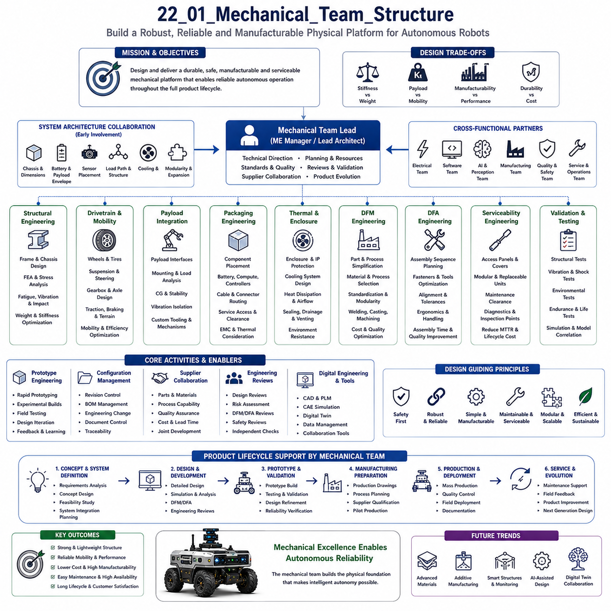
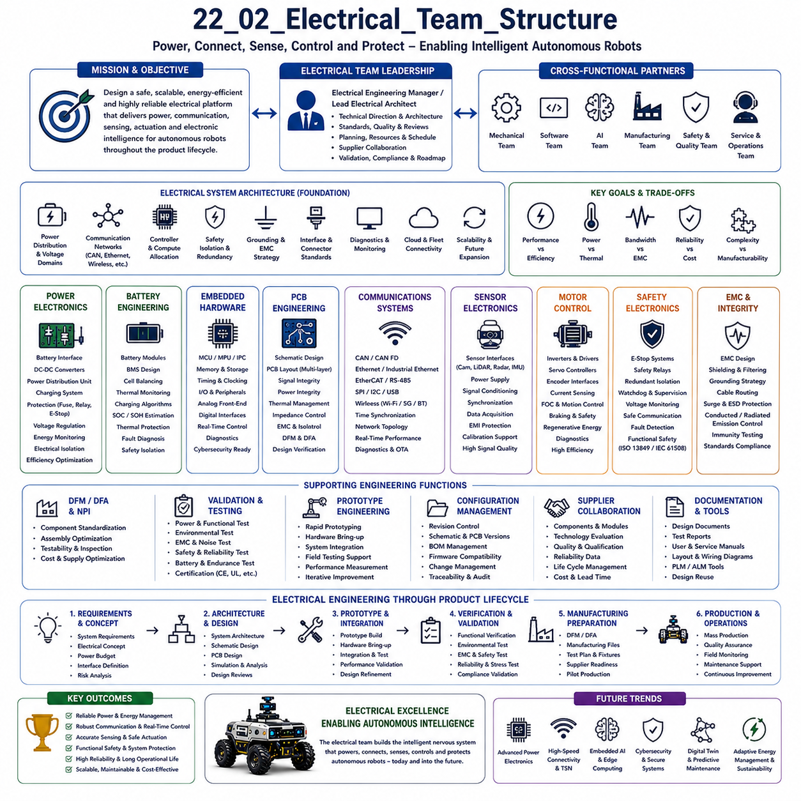
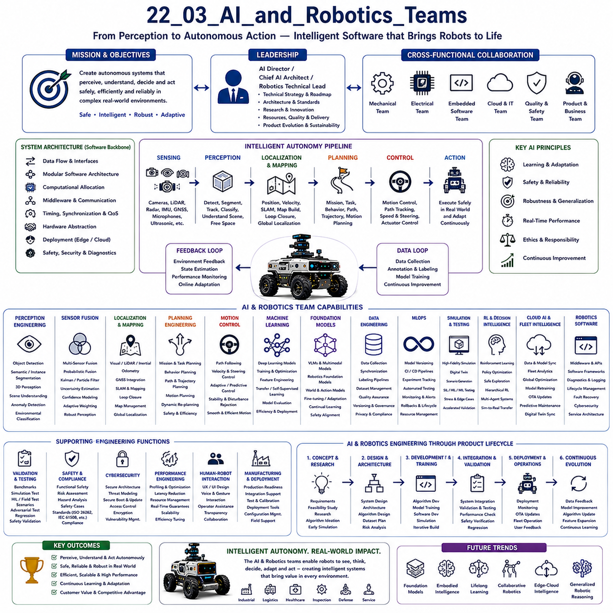
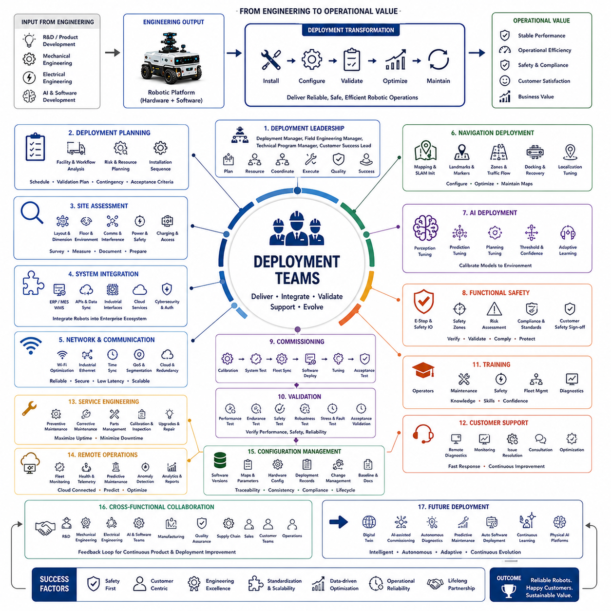
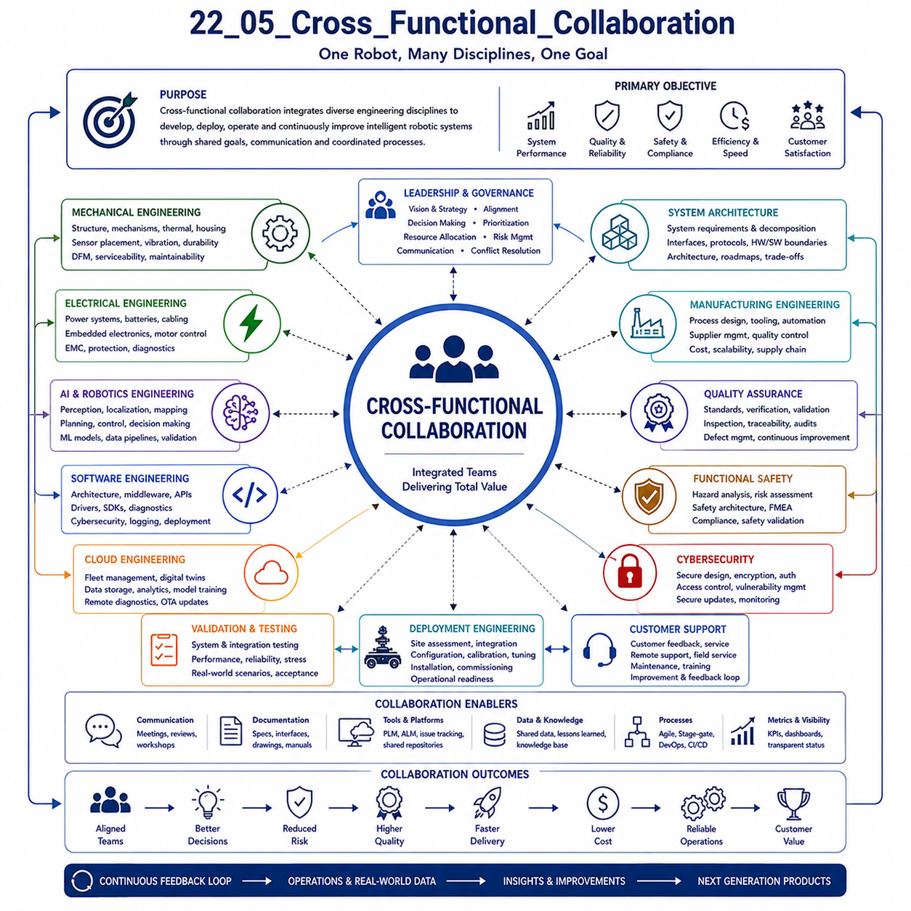

**Volume 01. AMR Foundations and System Architecture**

# 22. AMR Engineering Teams · AMR 엔지니어링 팀

## 22.01 Mechanical Team Structure · 기구 팀 구조

{width="7.268055555555556in" height="7.268055555555556in"}

Mechanical engineering forms the physical foundation of every autonomous mobile robot by transforming system requirements into practical structures capable of surviving demanding industrial environments while supporting reliable autonomous operation. The mechanical team is responsible for designing the chassis, structural frame, suspension, drivetrain interfaces, protective enclosures, payload mechanisms, cooling provisions, mounting structures, and service access throughout the complete product lifecycle. Although modern robotics increasingly depends on artificial intelligence and software, mechanical engineering remains the discipline that ultimately determines durability, manufacturability, maintainability, safety, and long-term operational reliability. Within an AMR engineering organization, the mechanical team therefore serves as one of the core engineering groups supporting the realization of the complete robotic platform.

The primary objective of the mechanical team is to develop a robust physical platform that satisfies functional, structural, manufacturing, safety, maintenance, and commercial requirements simultaneously. Mechanical engineers must balance structural stiffness against overall weight, payload capacity against mobility, manufacturing simplicity against product performance, and durability against cost efficiency. Every design decision influences numerous downstream engineering activities, including electrical packaging, thermal management, software deployment, sensor calibration, manufacturing processes, logistics, and field maintenance. Successful mechanical organizations therefore optimize the complete product rather than individual components.

A typical mechanical engineering organization begins with a Mechanical Engineering Manager or Lead Mechanical Architect responsible for technical direction, project planning, engineering quality, resource allocation, and cross-functional coordination. This leadership role defines mechanical design standards, engineering review procedures, simulation strategies, prototype validation plans, supplier collaboration, documentation quality, and product evolution throughout successive development phases. The mechanical leader also participates in system architecture decisions to ensure that structural designs remain compatible with electrical systems, embedded computing, perception sensors, autonomous navigation, and manufacturing capabilities.

System architecture collaboration represents one of the most important responsibilities of the mechanical leadership team. Mechanical engineers participate in early system definition to determine chassis dimensions, payload envelopes, battery locations, sensor positions, structural load paths, service accessibility, cooling strategies, environmental protection, and modular expansion capability. These decisions establish the physical framework upon which electrical engineers, software developers, artificial intelligence specialists, manufacturing engineers, and service organizations subsequently build their respective subsystems. Early collaboration significantly reduces integration risks later in the development process.

Structural engineering forms the backbone of the mechanical organization by designing the primary load-bearing components of the robot. Structural engineers analyze chassis frames, reinforcement members, brackets, mounting interfaces, protective structures, and mechanical connections subjected to static, dynamic, fatigue, vibration, and impact loads. Finite Element Analysis is extensively used to predict stress distributions, deformation behavior, modal characteristics, fatigue life, buckling resistance, and structural safety factors before prototype fabrication. Structural optimization continuously reduces weight while maintaining stiffness, durability, and long-term reliability under representative operating conditions.

Drivetrain and mobility engineers develop the mechanical systems responsible for robot movement across diverse operating environments. Their responsibilities include wheel selection, suspension geometry, steering mechanisms, axle configurations, gearbox integration, bearing selection, drivetrain packaging, traction optimization, braking interfaces, and ground clearance evaluation. These engineers analyze terrain characteristics, payload variation, slope capability, turning performance, vibration transmission, and tire wear while ensuring compatibility with motor controllers, localization systems, and autonomous navigation algorithms. Mobility engineering directly influences operational efficiency, safety, energy consumption, and customer satisfaction.

Payload integration engineers design the mechanical interfaces connecting the mobile platform with customer-specific equipment, robotic manipulators, inspection systems, conveyors, lifting devices, storage modules, or specialized industrial tooling. Interface standardization enables flexible platform reuse across multiple product families while reducing engineering effort for future customization. Payload engineers consider structural loading, center-of-gravity movement, vibration isolation, maintenance accessibility, electrical routing, cooling requirements, and safety clearances to ensure reliable operation under varying payload conditions.

Packaging engineers focus upon the efficient arrangement of mechanical, electrical, and computing subsystems within the limited physical volume available inside the robot. Battery modules, embedded computers, motor controllers, power distribution units, sensors, cooling components, communication devices, harnesses, and service connectors must be positioned according to thermal, structural, electromagnetic, accessibility, and manufacturing requirements. Effective packaging improves serviceability, cooling performance, wiring simplicity, structural integrity, and future scalability while minimizing overall system complexity.

Thermal and enclosure engineers develop protective mechanical structures that ensure reliable operation across diverse environmental conditions. These engineers design sealed housings, protective covers, cooling airflow channels, heat sink mounting structures, environmental barriers, ingress protection features, drainage paths, and ventilation systems compatible with dust, moisture, vibration, chemicals, sunlight, temperature variation, and outdoor exposure. Mechanical enclosure design strongly influences electronic reliability, sensor performance, maintenance requirements, and overall system lifetime.

Mechanical engineers responsible for Design for Manufacturing collaborate closely with production organizations throughout product development. Manufacturing-oriented design minimizes component count, simplifies fabrication, standardizes materials, reduces machining complexity, optimizes welding sequences, improves assembly accessibility, and supports automated production processes wherever practical. Standardized interfaces, modular assemblies, common fasteners, simplified tolerances, and repeatable manufacturing procedures significantly reduce production cost while improving product consistency and scalability as manufacturing volume increases.

Design for Assembly complements manufacturing optimization by minimizing assembly time, reducing human error, simplifying tool requirements, and improving production quality. Engineers carefully consider assembly sequence, component accessibility, fastening methods, alignment features, modular construction, lifting provisions, cable routing, inspection visibility, and ergonomic handling during product design. Well-designed assembly processes reduce manufacturing cost, shorten production schedules, improve reliability, and simplify future product upgrades.

Serviceability engineering ensures that routine maintenance, inspection, repair, calibration, and component replacement can be performed efficiently throughout the operational lifetime of the robot. Mechanical engineers provide removable access panels, standardized mounting interfaces, modular replacement units, maintenance clearances, diagnostic access points, lifting features, inspection windows, and clearly organized internal layouts. Good serviceability significantly reduces maintenance time, minimizes operational downtime, lowers lifecycle costs, and improves customer satisfaction across long-term deployments.

Mechanical validation engineers verify that physical designs satisfy all structural, environmental, operational, and reliability requirements before product release. Validation activities include static load testing, fatigue evaluation, vibration testing, modal analysis, impact testing, environmental exposure, corrosion resistance assessment, ingress protection verification, dimensional inspection, mobility testing, endurance operation, and accelerated life testing. Experimental measurements continuously validate simulation models while identifying opportunities for further structural optimization and reliability improvement.

Prototype engineering bridges conceptual design and production-ready hardware through successive prototype generations. Mechanical prototype engineers rapidly manufacture evaluation units, integrate experimental subsystems, support field testing, document design modifications, evaluate manufacturing feasibility, and collect engineering feedback for iterative improvement. Close interaction between prototype engineers, validation teams, manufacturing organizations, and system architects accelerates product maturation while reducing development risk and improving final product quality.

Configuration management plays a critical role within mature mechanical organizations because multiple hardware revisions often exist simultaneously throughout development, testing, production, and field deployment. Mechanical engineers maintain detailed revision histories, engineering change records, bill-of-material structures, manufacturing drawings, tolerance specifications, supplier documentation, material certifications, and validation reports. Accurate configuration management ensures traceability throughout the complete product lifecycle while supporting quality assurance, regulatory compliance, maintenance, and future product evolution.

Supplier collaboration extends mechanical engineering beyond internal design activities. Mechanical teams cooperate with suppliers responsible for castings, machined components, sheet metal fabrication, welded structures, bearings, fasteners, suspension components, wheels, sealing systems, plastics, composite materials, and specialized manufacturing processes. Supplier engineers contribute manufacturing expertise, process capability, quality assurance, material recommendations, and cost optimization throughout product development. Strong supplier relationships improve product quality while reducing engineering risk and production variability.

Cross-functional collaboration defines the daily working environment of modern mechanical engineers because every mechanical decision influences numerous engineering disciplines. Mechanical engineers continuously coordinate with electrical teams regarding cable routing, connector locations, grounding structures, cooling systems, and battery packaging. Close interaction with software engineers supports diagnostic accessibility, firmware updates, calibration procedures, and system monitoring. Artificial intelligence engineers cooperate on sensor placement, vibration isolation, calibration stability, and computational cooling. Manufacturing teams optimize production readiness, while quality organizations validate engineering compliance through structured review processes.

Engineering review processes provide structured mechanisms for evaluating mechanical designs before significant resources are committed to manufacturing or validation. Design reviews examine requirement compliance, structural integrity, manufacturability, maintainability, safety, reliability, simulation evidence, tolerance analysis, supplier readiness, assembly feasibility, cost impact, and risk mitigation strategies. Independent technical reviews encourage objective evaluation while promoting knowledge sharing across engineering disciplines. Continuous review processes substantially reduce late-stage design changes and improve overall product maturity.

Digital engineering environments increasingly transform mechanical development through model-based engineering, collaborative Computer-Aided Design, Product Lifecycle Management systems, digital twins, automated simulation workflows, and integrated engineering databases. Engineers simultaneously collaborate across multiple disciplines using shared digital models that maintain consistency between mechanical structures, electrical layouts, software architectures, manufacturing documentation, and validation evidence. Digital engineering significantly improves development efficiency while reducing integration errors and documentation inconsistencies.

Future mechanical engineering organizations will become increasingly multidisciplinary as intelligent robotics integrates advanced materials, lightweight structures, additive manufacturing, embedded sensing, structural health monitoring, collaborative digital twins, and artificial intelligence-assisted engineering workflows. Mechanical engineers will work alongside software developers, AI specialists, manufacturing engineers, and systems architects within highly integrated engineering organizations where physical and digital technologies evolve together. Rather than functioning solely as designers of mechanical hardware, future mechanical teams will become system integration specialists responsible for creating intelligent physical platforms that enable reliable, scalable, maintainable, and continuously evolving autonomous robotic systems throughout their complete operational lifecycle.

## 22.02 Electrical Team Structure · 전장 팀 구조

{width="7.268055555555556in" height="7.268055555555556in"}

Electrical engineering provides the functional nervous system of an autonomous robotic platform by delivering electrical power, communication, sensing, actuation, safety supervision, and electronic intelligence to every subsystem. While the mechanical structure provides physical strength and artificial intelligence delivers autonomous decision-making, the electrical team integrates power electronics, embedded controllers, communication networks, sensing devices, safety circuits, and system interfaces into a unified electrical architecture capable of supporting reliable autonomous operation. Every autonomous mobile robot depends upon the electrical engineering organization to ensure that energy flows efficiently, information is transmitted reliably, sensors operate accurately, actuators respond predictably, and all electronic subsystems function together throughout the complete product lifecycle.

The primary objective of the electrical engineering team is to design a safe, scalable, maintainable, energy-efficient, and highly reliable electrical platform capable of supporting continuously evolving robotic functions. Electrical engineers balance electrical performance against power efficiency, computational capability against thermal limitations, communication bandwidth against electromagnetic compatibility, hardware complexity against manufacturability, and operational reliability against development cost. Every electrical design decision influences software architecture, artificial intelligence performance, mechanical packaging, manufacturing processes, maintenance procedures, and long-term product evolution. Successful electrical organizations therefore optimize the complete electrical ecosystem rather than individual electronic components.

A typical electrical engineering organization is led by an Electrical Engineering Manager or Lead Electrical Architect responsible for technical direction, electrical architecture, engineering quality, project scheduling, design standards, supplier coordination, validation planning, and cross-functional integration. The electrical leader establishes design methodologies, schematic standards, printed circuit board guidelines, electrical review procedures, verification strategies, documentation policies, and product evolution roadmaps. This leadership role also ensures compatibility among electrical hardware, embedded software, mechanical structures, autonomous navigation, manufacturing capability, and future product scalability.

Electrical system architecture represents the highest level of responsibility within the organization because every electronic subsystem depends upon a coherent architectural framework. Electrical architects define power distribution topology, voltage domains, communication networks, controller allocation, safety isolation, grounding strategy, electromagnetic compatibility, redundancy architecture, connector standards, and interface definitions. These architectural decisions establish the electrical backbone supporting perception systems, localization, autonomous navigation, artificial intelligence computation, motion control, battery management, cloud connectivity, and fleet management throughout the operational lifetime of the robot.

Power electronics engineers develop the electrical infrastructure responsible for energy conversion, regulation, protection, monitoring, and distribution. Their responsibilities include battery interfaces, DC-DC converters, power distribution units, charging systems, emergency shutdown circuits, high-current protection, voltage regulation, fuse coordination, energy measurement, and electrical isolation. Engineers continuously optimize conversion efficiency while maintaining thermal stability, electrical safety, electromagnetic compatibility, and long-term component reliability. Efficient power electronics directly influence operational endurance, charging performance, system safety, and battery lifetime.

Battery engineering forms one of the most critical specialties within modern autonomous robots because battery systems determine operational duration, vehicle capability, payload capacity, charging strategy, and overall product performance. Battery engineers design battery modules, battery management systems, cell balancing circuits, temperature monitoring, charging algorithms, state-of-charge estimation, state-of-health monitoring, thermal protection, fault diagnosis, and safety isolation mechanisms. Mechanical packaging, thermal management, electrical protection, and software integration are developed simultaneously to ensure safe and reliable energy storage under demanding industrial operating conditions.

Embedded hardware engineers develop the electronic control units responsible for real-time sensing, computation, communication, diagnostics, and actuator control. Their work includes microcontrollers, embedded processors, industrial computers, memory devices, timing circuits, clock synchronization, communication controllers, analog front-end electronics, digital interfaces, and peripheral integration. Hardware platforms must provide deterministic execution while supporting future software expansion, artificial intelligence acceleration, cybersecurity requirements, and long-term component availability throughout the product lifecycle.

Printed circuit board engineers convert electrical architecture into manufacturable hardware by designing multilayer circuit boards that satisfy electrical, thermal, mechanical, manufacturing, and electromagnetic requirements simultaneously. PCB engineers carefully optimize component placement, signal routing, power distribution, impedance control, thermal dissipation, grounding structures, differential communication lines, high-current traces, and isolation distances. Design verification includes signal integrity analysis, power integrity evaluation, thermal simulation, manufacturability assessment, and reliability validation before prototype fabrication.

Communication system engineers design the electronic infrastructure responsible for reliable information exchange throughout distributed robotic systems. Industrial communication technologies such as CAN, CAN FD, Industrial Ethernet, EtherCAT, RS-485, SPI, I2C, USB, Ethernet, wireless communication, and time synchronization networks are selected according to bandwidth, latency, determinism, scalability, and environmental requirements. Communication engineers optimize network architecture to support sensor fusion, motion control, diagnostics, firmware updates, cloud connectivity, and fleet coordination while maintaining predictable real-time performance under varying operational conditions.

Sensor electronics engineers develop the interfaces connecting perception devices with embedded computing platforms. Cameras, LiDARs, radars, ultrasonic sensors, inertial measurement units, encoders, GNSS receivers, microphones, environmental sensors, force sensors, and numerous industrial transducers require carefully designed power supplies, signal conditioning circuits, synchronization interfaces, communication links, and electromagnetic protection. Accurate sensor integration directly influences perception quality, localization precision, autonomous decision-making, and overall system reliability.

Motor control engineers develop the electrical systems responsible for converting digital control commands into precise mechanical motion. Their responsibilities include inverter design, servo controllers, encoder interfaces, motor feedback processing, current measurement, field-oriented control implementation, braking circuits, regenerative energy management, actuator diagnostics, and protection mechanisms. Electrical motor control must maintain precise torque generation, smooth motion, rapid response, and stable operation while minimizing energy consumption and thermal stress throughout prolonged autonomous operation.

Safety electronics engineers ensure that electrical systems comply with functional safety requirements throughout the robot lifecycle. Safety circuits include emergency stop systems, redundant power isolation, safety relays, watchdog supervision, voltage monitoring, redundant communication paths, fault detection, hardware diagnostics, and independent protection mechanisms. Electrical safety architecture prevents hazardous behavior resulting from hardware failures, communication faults, software malfunction, or unexpected environmental conditions. Safety engineers collaborate closely with software developers, mechanical designers, and system architects to implement comprehensive risk mitigation strategies.

Electromagnetic compatibility engineers minimize electromagnetic interference while ensuring reliable operation of sensitive electronic equipment operating within electrically noisy industrial environments. EMC engineering includes grounding architecture, shielding strategies, cable routing, filter design, transient suppression, surge protection, conducted emission reduction, radiated emission control, immunity verification, and compliance testing according to international standards. Effective EMC design improves sensor accuracy, communication reliability, control stability, and long-term electronic durability.

Electrical engineers specializing in Design for Manufacturing optimize electronic products for efficient production, assembly, inspection, testing, and long-term supply chain stability. Component standardization, manufacturing panelization, automated optical inspection compatibility, in-circuit testing support, connector accessibility, assembly sequence optimization, supplier qualification, and alternative component strategies significantly improve manufacturing efficiency while reducing production cost and supply risk. Manufacturing-oriented design also improves product consistency across high-volume production.

Electrical validation engineers verify that hardware satisfies functional, environmental, electrical, thermal, reliability, and regulatory requirements before commercial deployment. Validation includes power verification, communication testing, thermal evaluation, environmental stress testing, vibration resistance, electrical noise analysis, safety verification, battery endurance, fault injection, long-duration operation, accelerated life testing, and compliance certification. Experimental validation continuously confirms analytical predictions while identifying improvement opportunities before mass production begins.

Prototype engineering enables rapid evaluation of new electrical technologies before full-scale product implementation. Prototype engineers assemble experimental hardware, integrate developmental controllers, evaluate emerging communication technologies, validate power architectures, measure electrical performance, support field testing, and document design improvements. Iterative prototype development significantly reduces engineering uncertainty while accelerating technology maturation and system integration across multiple engineering disciplines.

Configuration management provides comprehensive control over electrical documentation throughout development, manufacturing, deployment, and product evolution. Engineers maintain revision histories, schematic documentation, PCB layouts, firmware compatibility records, connector definitions, wiring diagrams, electrical bills of materials, component qualification records, validation reports, and engineering change documentation. Comprehensive configuration management ensures traceability, quality assurance, regulatory compliance, maintenance support, and efficient product upgrades throughout long operational lifecycles.

Supplier collaboration plays an essential role because modern robotic electrical systems depend upon numerous specialized component manufacturers. Electrical engineers cooperate closely with suppliers providing batteries, semiconductors, connectors, sensors, communication modules, controllers, printed circuit boards, power supplies, relays, protection devices, wiring systems, and industrial electronic components. Supplier expertise contributes manufacturing capability, reliability data, qualification evidence, lifecycle planning, cost optimization, and technology recommendations throughout product development.

Cross-functional collaboration defines everyday electrical engineering activities because electrical hardware interacts continuously with every engineering discipline. Electrical engineers coordinate with mechanical teams regarding packaging, cooling, structural mounting, vibration isolation, and service accessibility. Embedded software developers require stable hardware interfaces, diagnostic capability, firmware update mechanisms, and debugging support. Artificial intelligence engineers depend upon reliable sensor interfaces, synchronized data acquisition, high-performance computing power, and efficient communication infrastructure. Manufacturing teams optimize production readiness while quality organizations validate compliance through structured engineering reviews.

Engineering review processes maintain technical excellence by systematically evaluating electrical architecture, schematic design, printed circuit boards, power distribution, communication integrity, safety implementation, manufacturability, serviceability, reliability, cost, supplier readiness, and regulatory compliance before hardware release. Structured design reviews identify technical risks, encourage multidisciplinary collaboration, validate engineering assumptions, and improve product maturity while reducing expensive design modifications during later development phases.

Digital electrical engineering environments increasingly integrate electronic design automation tools, simulation platforms, hardware-in-the-loop systems, digital twins, lifecycle management systems, automated verification workflows, and collaborative engineering databases. Engineers simultaneously develop schematics, firmware, simulations, manufacturing documentation, validation procedures, and service information using unified digital engineering platforms. Digital integration significantly improves engineering productivity while reducing documentation inconsistency, integration errors, and development time.

Future electrical engineering organizations will evolve toward increasingly intelligent and software-defined architectures incorporating advanced power electronics, wide-bandgap semiconductors, distributed computing, high-speed communication, embedded artificial intelligence, autonomous diagnostics, predictive maintenance, digital twins, cybersecurity, and adaptive energy management. Electrical engineers will collaborate even more closely with software developers, artificial intelligence specialists, systems architects, and manufacturing organizations to create integrated electronic ecosystems capable of supporting continuously evolving Physical AI platforms. Rather than functioning solely as designers of electrical hardware, future electrical teams will become intelligent system integration organizations responsible for enabling safe, efficient, scalable, connected, and continuously improving autonomous robotic platforms throughout their complete operational lifecycle.

## 22.03 AI and Robotics Teams · AI·로봇 팀

{width="7.268055555555556in" height="7.268055555555556in"}

Artificial Intelligence and Robotics teams form the intellectual core of modern autonomous robotic systems by transforming raw sensor information into intelligent perception, decision-making, planning, and autonomous action. While mechanical engineering provides the physical platform and electrical engineering delivers sensing, communication, and computation infrastructure, AI and robotics engineers develop the algorithms, software architectures, learning models, and autonomous behaviors that enable robots to perceive their surroundings, understand complex situations, make intelligent decisions, and safely execute missions. As Physical AI continues to evolve, these multidisciplinary teams have become central to the successful development of intelligent robotic products across industrial, commercial, logistics, healthcare, defense, and service applications.

The primary objective of AI and robotics organizations is to create autonomous systems capable of operating safely, efficiently, and reliably under uncertain and continuously changing real-world environments. Engineers continuously balance perception accuracy against computational complexity, planning quality against response latency, model capability against embedded resource limitations, learning performance against data availability, and autonomous behavior against safety constraints. Every algorithmic improvement influences computational requirements, electrical power consumption, thermal management, communication bandwidth, validation procedures, and overall system reliability. Successful AI organizations therefore optimize the complete intelligent robotic ecosystem rather than focusing on isolated machine learning models or individual software modules.

A typical AI and robotics organization is led by an AI Director, Chief AI Architect, or Robotics Technical Lead responsible for defining technical strategy, algorithm roadmaps, software architecture, research priorities, validation methodology, engineering standards, resource allocation, and long-term product evolution. Leadership coordinates collaboration among perception engineers, localization specialists, planning developers, machine learning researchers, embedded software engineers, systems architects, simulation teams, cloud engineers, manufacturing organizations, and product management. The leadership team ensures that scientific innovation remains aligned with commercial objectives, engineering feasibility, customer requirements, and product lifecycle sustainability.

System architecture represents the highest organizational responsibility because every intelligent subsystem must cooperate through well-defined software interfaces and synchronized information exchange. AI system architects define data flow, software modularization, computational allocation, middleware interfaces, timing constraints, synchronization strategies, hardware abstraction, communication frameworks, deployment architecture, and interaction among perception, localization, mapping, planning, control, cloud services, and fleet management. A robust software architecture enables scalability, maintainability, continuous integration, and future algorithm upgrades without disrupting existing robotic functionality.

Perception engineers develop the algorithms that enable robots to interpret their surrounding environment using cameras, LiDARs, radars, ultrasonic sensors, thermal cameras, microphones, inertial measurement units, GNSS receivers, and additional sensing modalities. Their responsibilities include object detection, semantic segmentation, instance segmentation, panoptic understanding, free-space estimation, obstacle recognition, dynamic object tracking, traffic understanding, anomaly detection, scene interpretation, and environmental classification. Perception engineers continuously optimize accuracy, robustness, computational efficiency, and environmental adaptability while maintaining real-time performance across highly diverse operational conditions.

Sensor fusion specialists combine heterogeneous sensing information into a unified environmental representation suitable for autonomous reasoning. Individual sensors possess complementary strengths and weaknesses, making probabilistic fusion essential for reliable perception under varying weather, lighting, terrain, and operational conditions. Fusion engineers develop Bayesian estimation, Kalman filtering, particle filtering, graph optimization, probabilistic occupancy mapping, confidence estimation, uncertainty propagation, multimodal deep learning, and adaptive sensor weighting algorithms. Effective sensor fusion significantly improves robustness while reducing false detections and improving decision confidence.

Localization and mapping engineers provide precise estimation of robot position, orientation, velocity, and environmental structure throughout autonomous operation. These teams develop simultaneous localization and mapping algorithms, visual odometry, LiDAR odometry, inertial navigation, GNSS integration, map matching, loop closure detection, graph optimization, global localization, and long-term map maintenance. Accurate localization directly influences navigation reliability, mission execution, fleet coordination, autonomous safety, and operational efficiency. Continuous optimization ensures robust localization despite environmental change, sensor degradation, and computational limitations.

Planning engineers transform high-level mission objectives into executable robot behavior through hierarchical planning architectures. Mission planners allocate operational goals across multiple robots, task planners sequence activities according to operational priorities, behavior planners determine situational responses, trajectory planners generate collision-free paths, and motion planners optimize feasible vehicle movement according to kinematic and dynamic constraints. Planning algorithms continuously evaluate safety, efficiency, energy consumption, traffic interaction, obstacle avoidance, and mission completion while adapting to dynamic environmental changes in real time.

Motion control engineers convert planned trajectories into precise physical movement through advanced control algorithms. Their responsibilities include path following, velocity control, steering control, adaptive feedback, predictive control, disturbance rejection, actuator coordination, dynamic stability, slip compensation, vibration reduction, and energy-efficient motion execution. Close interaction with mechanical systems, electrical motor controllers, localization modules, and perception pipelines ensures smooth, accurate, and reliable autonomous operation under diverse operating conditions.

Machine learning engineers develop the data-driven models responsible for perception, prediction, decision support, anomaly detection, optimization, and adaptive learning throughout robotic systems. These engineers design neural network architectures, optimize training procedures, perform feature engineering, develop foundation models, implement transfer learning, apply self-supervised learning, and evaluate model generalization across diverse deployment environments. Continuous experimentation improves model accuracy while minimizing computational cost, training complexity, and deployment risk for embedded robotic platforms.

Foundation model specialists increasingly represent a new discipline within AI organizations as large-scale multimodal models become integrated into Physical AI systems. These engineers develop and adapt vision-language models, robotics foundation models, multimodal reasoning architectures, large action models, embodied intelligence frameworks, and world models capable of understanding complex environments and generalized robotic behavior. Model adaptation includes parameter-efficient fine-tuning, retrieval-augmented reasoning, continual learning, domain adaptation, and safety alignment for practical industrial deployment.

Data engineering teams establish the infrastructure required for collecting, storing, managing, labeling, validating, and distributing large-scale datasets supporting artificial intelligence development. Their responsibilities include sensor synchronization, dataset version control, automated annotation pipelines, quality assurance, metadata management, storage optimization, privacy protection, regulatory compliance, and long-term dataset maintenance. High-quality datasets directly determine model accuracy, robustness, and long-term learning capability, making data engineering one of the foundational activities within modern AI organizations.

MLOps engineers bridge research and production by creating automated infrastructures supporting continuous model development, validation, deployment, monitoring, rollback, and lifecycle management. Model version control, experiment tracking, continuous integration, continuous deployment, automated benchmarking, resource scheduling, hardware compatibility, performance monitoring, and deployment automation collectively enable efficient delivery of machine learning models into operational robotic platforms. MLOps significantly reduces engineering overhead while improving reproducibility, maintainability, and operational reliability.

Simulation engineers develop virtual environments supporting algorithm development before physical deployment. High-fidelity digital environments reproduce sensor behavior, vehicle dynamics, environmental complexity, traffic interaction, weather conditions, lighting variation, and mission scenarios across thousands of representative operating conditions. Simulation enables large-scale testing of perception algorithms, localization methods, planning strategies, reinforcement learning policies, and autonomous behaviors while significantly reducing development cost, safety risk, and hardware dependency during early engineering phases.

Reinforcement learning researchers investigate autonomous decision-making through continuous interaction between intelligent agents and simulated or physical environments. These engineers design reward functions, policy optimization strategies, curriculum learning methodologies, hierarchical reinforcement learning frameworks, multi-agent coordination, safe exploration algorithms, and sim-to-real transfer techniques. Reinforcement learning increasingly supports adaptive navigation, robotic manipulation, fleet optimization, autonomous scheduling, and complex sequential decision-making across next-generation Physical AI systems.

Cloud AI engineers extend robotic intelligence beyond onboard computing resources through distributed computing infrastructures. Cloud services provide centralized data management, fleet analytics, global optimization, collaborative learning, software updates, digital twin synchronization, predictive maintenance, model retraining, and large-scale operational monitoring. Efficient edge-cloud collaboration enables computationally intensive tasks to execute remotely while maintaining deterministic real-time decision-making on embedded robotic platforms responsible for safety-critical operations.

Robotics software engineers integrate artificial intelligence algorithms into complete autonomous software systems capable of long-term industrial deployment. These engineers develop middleware interfaces, software frameworks, communication services, diagnostics, lifecycle management, hardware abstraction layers, synchronization mechanisms, fault recovery, logging systems, configuration management, cybersecurity integration, and service-oriented architectures. High software quality ensures maintainability, scalability, reliability, portability, and continuous product evolution across multiple robotic platforms and customer applications.

Validation engineers verify that intelligent robotic systems satisfy functional, performance, safety, robustness, and regulatory requirements before commercial deployment. Validation activities include benchmark evaluation, simulation testing, hardware-in-the-loop verification, long-duration endurance testing, scenario-based validation, adversarial testing, environmental robustness evaluation, fault injection, regression analysis, field trials, customer acceptance testing, and operational monitoring. Continuous validation ensures that improvements in artificial intelligence translate into measurable improvements in practical robotic performance without introducing unintended safety or reliability risks.

Cross-functional collaboration defines the daily workflow of AI and robotics organizations because intelligent behavior emerges only through close cooperation among multiple engineering disciplines. AI engineers collaborate continuously with mechanical teams regarding sensor placement, vibration isolation, thermal management, payload integration, and structural constraints. Electrical engineers provide sensing hardware, embedded computing platforms, communication infrastructure, synchronization mechanisms, and power management. Manufacturing organizations optimize production readiness, while quality teams verify compliance through structured engineering review processes. Product managers align technological innovation with customer needs, commercial priorities, and long-term business strategy.

Future AI and robotics organizations will become increasingly multidisciplinary as Physical AI evolves toward foundation models, embodied intelligence, lifelong learning, collaborative robotics, autonomous adaptation, cloud-edge intelligence, and generalized robotic reasoning. Engineers specializing in artificial intelligence, robotics, systems engineering, software architecture, digital twins, simulation, cloud infrastructure, cybersecurity, and human-robot interaction will collaborate within tightly integrated engineering ecosystems. Rather than functioning solely as algorithm developers, future AI and robotics teams will become intelligent system architects responsible for continuously evolving autonomous platforms capable of learning, reasoning, adapting, collaborating, and operating safely across diverse real-world environments throughout their complete operational lifecycle.

## 22.04 Deployment Teams · 배포 팀

{width="7.268055555555556in" height="7.268055555555556in"}

Deployment teams transform engineering prototypes into reliable operational robotic systems by installing, configuring, validating, optimizing, and maintaining autonomous platforms within real customer environments. While research, development, mechanical engineering, electrical engineering, and artificial intelligence teams create the product, deployment organizations ensure that robotic systems deliver practical business value under real operational conditions. Successful deployment extends far beyond hardware installation by integrating autonomous robots into customer workflows, enterprise information systems, production facilities, safety procedures, and daily operational practices. As autonomous robotics becomes increasingly widespread, deployment teams have evolved into one of the most critical organizations responsible for ensuring successful commercialization and long-term customer satisfaction.

The primary objective of deployment organizations is to achieve stable, efficient, and safe operational performance while minimizing installation time, operational disruption, technical risk, and lifecycle cost. Deployment engineers continuously balance rapid implementation against comprehensive validation, standardized procedures against customer-specific customization, operational flexibility against engineering consistency, and immediate problem resolution against long-term maintainability. Every deployment project introduces unique environmental conditions, infrastructure constraints, communication requirements, operational procedures, and customer expectations. Successful deployment therefore requires both strong engineering expertise and practical field experience capable of adapting standardized robotic platforms to diverse industrial environments.

Deployment leadership is typically provided by a Deployment Manager, Field Engineering Manager, Technical Program Manager, or Customer Success Engineering Lead responsible for planning deployment schedules, allocating engineering resources, coordinating customer communication, supervising technical execution, managing project risks, ensuring quality, and supporting long-term operational success. Leadership coordinates installation engineers, system integration specialists, networking engineers, software deployment teams, validation engineers, service personnel, training specialists, and customer representatives throughout the complete deployment lifecycle. Strong deployment leadership ensures consistent engineering quality while maintaining customer confidence during complex implementation projects.

Deployment planning represents the foundation of every successful installation because comprehensive preparation significantly reduces technical risk during onsite implementation. Planning engineers analyze customer facilities, operational workflows, environmental conditions, communication infrastructure, safety requirements, power availability, floor conditions, navigation constraints, wireless coverage, charging locations, maintenance accessibility, and production schedules before equipment arrives onsite. Detailed deployment plans define installation sequences, validation procedures, contingency strategies, resource requirements, risk mitigation actions, and acceptance criteria. Thorough planning minimizes unexpected delays while improving installation efficiency and project predictability.

Site assessment engineers perform detailed technical evaluations of customer environments before deployment begins. Their responsibilities include measuring facility dimensions, analyzing floor characteristics, evaluating environmental lighting, identifying navigation landmarks, inspecting communication coverage, assessing electromagnetic interference, verifying electrical infrastructure, reviewing safety equipment, evaluating charging locations, and documenting operational constraints. Comprehensive site surveys enable engineering teams to identify potential integration challenges before installation while allowing software parameters, navigation maps, safety zones, and operational procedures to be prepared in advance.

System integration engineers connect autonomous robotic platforms with existing enterprise infrastructure, manufacturing systems, warehouse management systems, production equipment, industrial automation networks, cloud services, fleet management software, and customer information technology environments. Integration activities include communication protocol implementation, application programming interface configuration, database synchronization, authentication services, cybersecurity configuration, enterprise resource planning connectivity, manufacturing execution system integration, industrial controller interfaces, and cloud synchronization. Effective integration allows robots to operate as intelligent components within larger digital manufacturing ecosystems rather than isolated autonomous machines.

Network and communication engineers establish reliable communication infrastructure supporting autonomous operation throughout customer facilities. Their responsibilities include wireless network optimization, industrial Ethernet deployment, time synchronization, network segmentation, quality-of-service configuration, roaming optimization, latency analysis, bandwidth allocation, cybersecurity implementation, firewall configuration, cloud connectivity, redundancy planning, and communication diagnostics. Reliable networking directly influences fleet coordination, cloud services, remote diagnostics, software updates, operational monitoring, and autonomous decision-making. Well-designed communication infrastructure ensures stable performance despite changing operational conditions and increasing fleet size.

Navigation deployment specialists configure localization systems according to the physical characteristics of each deployment environment. Their work includes environmental mapping, simultaneous localization and mapping initialization, landmark placement, fiducial marker configuration, map optimization, localization parameter tuning, navigation zone definition, traffic flow configuration, restricted area management, docking alignment, recovery strategy implementation, and long-term map maintenance planning. Every deployment environment possesses unique architectural characteristics requiring careful optimization of navigation algorithms to achieve robust autonomous mobility under practical operating conditions.

Artificial intelligence deployment engineers optimize perception, prediction, planning, and decision-making algorithms according to customer-specific operational environments. Different facilities exhibit varying lighting conditions, obstacle characteristics, traffic patterns, environmental complexity, sensor interference, and operational workflows. AI deployment specialists perform model calibration, perception parameter tuning, confidence threshold adjustment, anomaly detection optimization, adaptive learning configuration, and operational validation while ensuring that computational performance remains compatible with available embedded hardware resources. Proper AI configuration significantly improves operational reliability and customer productivity.

Functional safety engineers verify that deployed robotic systems satisfy all applicable safety requirements before operational release. Validation includes emergency stop verification, protective field configuration, obstacle detection evaluation, safety controller testing, emergency communication, warning device inspection, risk assessment, operational procedure review, functional safety validation, regulatory compliance verification, and customer safety acceptance. Safety engineers cooperate closely with customer safety organizations to ensure that autonomous robots integrate safely with human workers, industrial equipment, and established operational procedures throughout long-term deployment.

Commissioning engineers transform installed robotic systems into fully operational production assets through systematic configuration, calibration, testing, optimization, and acceptance activities. Commissioning procedures include sensor calibration, actuator verification, communication validation, navigation testing, fleet synchronization, charging verification, software deployment, configuration management, operational tuning, performance benchmarking, and customer acceptance testing. Structured commissioning ensures that every robotic subsystem functions according to engineering specifications before commercial operation begins.

Validation engineers conduct comprehensive performance verification under representative operational conditions before deployment completion. Testing includes navigation accuracy evaluation, obstacle avoidance verification, mission execution assessment, endurance testing, communication reliability analysis, environmental robustness evaluation, fleet coordination testing, battery performance measurement, fault recovery validation, operational stress testing, and long-duration autonomous operation. Comprehensive validation confirms that deployed systems satisfy technical specifications while identifying opportunities for further optimization before full production release.

Training specialists ensure that customer personnel possess the technical knowledge required to operate, supervise, maintain, troubleshoot, and optimize deployed robotic systems independently. Training programs include operator education, maintenance instruction, safety procedures, fleet management operation, diagnostic tools, software interfaces, emergency response, routine inspection, battery maintenance, system monitoring, and performance optimization. Effective customer education significantly improves operational reliability while reducing service dependency and increasing long-term customer satisfaction.

Customer support engineers provide continuous technical assistance following deployment completion. Their responsibilities include remote diagnostics, software updates, operational monitoring, issue investigation, troubleshooting, preventive maintenance coordination, technical consultation, system optimization, configuration management, and performance improvement recommendations. Continuous support enables deployment organizations to maintain customer productivity while collecting valuable operational feedback supporting future engineering improvements and product evolution.

Service engineers perform preventive maintenance, corrective maintenance, hardware replacement, calibration, inspection, repair, firmware updates, software upgrades, safety verification, battery replacement, communication diagnostics, and mechanical adjustment throughout the operational lifetime of deployed robotic systems. Well-organized service organizations maximize equipment availability while minimizing downtime through structured maintenance planning, spare part management, predictive diagnostics, and efficient field engineering operations. Long-term service capability represents a significant competitive advantage for industrial robotics suppliers.

Remote operations teams increasingly supervise deployed fleets using cloud-connected monitoring platforms capable of continuously collecting operational telemetry, diagnostic information, system health indicators, battery status, communication quality, navigation performance, environmental conditions, and mission statistics. Remote monitoring enables predictive maintenance, anomaly detection, software optimization, fleet analytics, cybersecurity monitoring, and rapid technical support without requiring continuous onsite engineering presence. Cloud-based operational intelligence significantly improves fleet reliability while reducing operational costs across geographically distributed deployments.

Configuration management remains essential throughout deployment because each customer installation may contain unique software versions, navigation maps, communication parameters, safety settings, hardware options, enterprise interfaces, and operational workflows. Deployment engineers maintain comprehensive documentation including software revisions, hardware configurations, deployment records, validation evidence, maintenance history, engineering changes, customer-specific customization, and operational baselines. Accurate configuration management supports troubleshooting, upgrades, regulatory compliance, lifecycle maintenance, and future system expansion.

Cross-functional collaboration defines deployment engineering because successful field implementation requires continuous cooperation among research organizations, mechanical engineering, electrical engineering, artificial intelligence teams, software developers, manufacturing organizations, quality assurance, supply chain management, sales organizations, customer engineering teams, and operational management. Deployment engineers communicate practical field experience back to development organizations, enabling continuous improvement of product architecture, software capability, installation procedures, validation methodology, and customer support processes. This closed engineering feedback loop accelerates product maturity while improving future deployment efficiency.

Future deployment organizations will become increasingly intelligent through cloud-connected digital twins, autonomous diagnostics, predictive maintenance, artificial intelligence-assisted commissioning, automated software deployment, remote validation, collaborative robotics, self-configuring navigation, adaptive perception optimization, and fleet-wide continuous learning. Deployment engineers will transition from primarily installing robotic systems toward supervising intelligent deployment ecosystems capable of automatically optimizing operational performance throughout the complete product lifecycle. Rather than representing the final stage of product delivery, future deployment teams will become continuous operational partners responsible for maximizing customer productivity, enabling lifelong system evolution, and supporting the successful realization of next-generation Physical AI platforms across diverse industries worldwide.

## 22.05 Cross-Functional Collaboration · 크로스 펑셔널 협업

{width="7.268055555555556in" height="7.268055555555556in"}

Cross-functional collaboration represents the organizational framework that enables diverse engineering disciplines to work together toward the successful development, deployment, operation, and continuous improvement of complex robotic systems. Modern autonomous robots integrate mechanical structures, electrical systems, embedded electronics, artificial intelligence, software platforms, cloud services, manufacturing processes, safety engineering, quality management, and customer operations into a single intelligent product. No individual engineering discipline possesses sufficient knowledge to independently develop such systems. Successful robotics organizations therefore rely on structured collaboration, transparent communication, shared technical objectives, and coordinated engineering processes throughout the complete product lifecycle.

The primary objective of cross-functional collaboration is to maximize system-level performance rather than optimizing individual engineering domains independently. Engineering organizations continuously balance mechanical robustness against weight, electrical capability against power consumption, software flexibility against system complexity, artificial intelligence performance against computational resources, manufacturing efficiency against design innovation, and operational reliability against development speed. Every engineering decision influences multiple technical domains, requiring collaborative problem solving that considers system-wide impacts rather than isolated component optimization. Successful collaboration ultimately improves product quality, engineering efficiency, customer satisfaction, and long-term organizational competitiveness.

Leadership plays a central role in enabling effective cross-functional collaboration by establishing shared objectives, organizational alignment, communication structures, engineering governance, decision-making processes, conflict resolution mechanisms, and technical accountability. Engineering directors, chief architects, technical program managers, product managers, and project leaders coordinate multidisciplinary activities while ensuring that organizational priorities remain consistent across research, development, manufacturing, deployment, service, and customer support organizations. Effective leadership encourages open communication, rapid issue resolution, technical transparency, mutual trust, and collaborative innovation throughout the engineering organization.

System architects serve as technical integrators who connect the contributions of multiple engineering disciplines into a coherent product architecture. They define system requirements, functional decomposition, subsystem interfaces, hardware-software boundaries, communication protocols, computational allocation, safety architecture, performance budgets, integration strategies, and long-term technology roadmaps. System architects continuously evaluate trade-offs between competing engineering requirements while ensuring that mechanical, electrical, software, and artificial intelligence components operate together as a unified autonomous system rather than independent subsystems.

Mechanical engineering collaborates closely with nearly every organizational function because physical product design directly influences system integration, manufacturing feasibility, maintenance accessibility, sensing capability, thermal performance, safety, and operational reliability. Mechanical engineers cooperate with electrical teams regarding component packaging, cable routing, connector placement, battery installation, cooling systems, and structural reinforcement. Collaboration with AI and perception engineers ensures appropriate sensor placement, vibration isolation, field-of-view optimization, and environmental protection. Continuous communication with manufacturing organizations supports design-for-manufacturing, assembly efficiency, serviceability, and lifecycle maintenance.

Electrical engineering provides the infrastructure connecting power systems, embedded electronics, communication networks, sensing hardware, motor controllers, and computational platforms throughout robotic products. Electrical engineers collaborate with mechanical designers regarding packaging constraints, thermal management, electromagnetic compatibility, vibration protection, and maintenance accessibility. They cooperate with software engineers to define hardware abstraction interfaces, communication protocols, embedded firmware architecture, synchronization mechanisms, and diagnostic capabilities. Close interaction with artificial intelligence teams ensures that sensing hardware, computational resources, and power distribution satisfy algorithmic performance requirements.

Artificial intelligence and robotics engineers collaborate extensively with every engineering discipline because autonomous intelligence depends upon accurate sensing, reliable computation, robust software, stable hardware, and practical operational feedback. AI engineers cooperate with perception hardware specialists to optimize sensor configurations, with localization engineers to improve navigation accuracy, with software developers to integrate machine learning models, with cloud engineers to support data pipelines, and with validation organizations to verify algorithm robustness. Continuous collaboration enables intelligent systems to evolve according to both engineering constraints and real-world operational experience.

Software engineering functions as the integration platform connecting nearly all engineering disciplines through standardized interfaces, middleware services, communication frameworks, application programming interfaces, diagnostics, configuration management, cybersecurity, logging systems, and deployment infrastructure. Software engineers coordinate closely with mechanical, electrical, AI, manufacturing, testing, cloud, and deployment organizations to ensure consistent data exchange, modular system architecture, scalable software design, reliable system integration, and maintainable product evolution. High-quality software architecture significantly improves collaboration by reducing technical dependencies and simplifying subsystem integration.

Cloud engineering extends collaboration beyond embedded robotic platforms by providing centralized infrastructure supporting fleet management, digital twins, data collection, model training, remote diagnostics, software deployment, predictive maintenance, operational analytics, and enterprise integration. Cloud engineers collaborate with AI researchers regarding machine learning pipelines, with software developers regarding application interfaces, with deployment organizations regarding operational monitoring, and with customer support teams regarding service management. Cloud infrastructure enables geographically distributed engineering teams to access consistent operational information while accelerating continuous product improvement.

Manufacturing engineering collaborates with development organizations to ensure that innovative designs can be efficiently produced, assembled, inspected, tested, transported, and maintained at commercial scale. Manufacturing engineers provide early feedback regarding production feasibility, assembly complexity, tooling requirements, supplier capability, production cost, quality control, automation opportunities, and supply chain optimization. Their collaboration with mechanical, electrical, and software engineers significantly reduces production risk while improving manufacturing efficiency, product consistency, and overall commercial competitiveness.

Quality assurance organizations establish engineering standards ensuring that every subsystem satisfies predefined performance, reliability, safety, and regulatory requirements before product release. Quality engineers collaborate with development teams to define verification procedures, acceptance criteria, inspection methods, traceability systems, documentation standards, defect management processes, root cause analysis methodologies, and continuous improvement activities. Cross-functional quality management enables engineering organizations to identify technical issues early while reducing costly redesigns and improving overall product reliability.

Functional safety engineering collaborates closely with mechanical, electrical, software, artificial intelligence, quality assurance, manufacturing, and deployment organizations to ensure that robotic systems operate safely throughout their complete operational lifecycle. Safety engineers perform hazard analysis, risk assessment, safety architecture definition, protective function validation, regulatory compliance verification, fault analysis, emergency procedure development, and safety documentation. Collaboration across multiple engineering disciplines ensures that safety is designed into products from the earliest architectural decisions rather than being added during final validation stages.

Cybersecurity specialists increasingly participate in cross-functional engineering activities because autonomous robotic systems depend heavily on interconnected software, cloud infrastructure, wireless communication, and enterprise integration. Cybersecurity engineers cooperate with software developers, cloud architects, embedded engineers, network specialists, deployment organizations, and customer information technology departments to implement secure communication, authentication, encryption, access control, vulnerability management, secure software updates, and operational monitoring. Comprehensive cybersecurity protects both robotic platforms and customer operational environments against evolving digital threats.

Validation and testing organizations integrate contributions from all engineering disciplines to verify complete system performance under representative operational conditions. Validation engineers cooperate with mechanical engineers regarding structural durability, electrical teams regarding hardware reliability, AI organizations regarding algorithm accuracy, software developers regarding functional correctness, deployment teams regarding operational readiness, and customer representatives regarding practical usability. Comprehensive multidisciplinary testing identifies system-level issues that cannot be detected through isolated subsystem verification.

Deployment organizations provide practical engineering feedback after products leave development laboratories and enter real customer environments. Deployment engineers collaborate with research organizations, system architects, software developers, manufacturing engineers, quality organizations, and customer support teams to identify operational improvements, environmental challenges, usability issues, installation complexity, maintenance requirements, and customer-specific optimization opportunities. Real-world deployment experience continuously influences future engineering decisions while improving subsequent product generations.

Customer support organizations maintain long-term communication between engineering teams and operational users throughout the product lifecycle. Support engineers collect customer feedback, operational statistics, service records, software issues, maintenance requirements, performance limitations, enhancement requests, and reliability information. This operational knowledge is communicated back to engineering organizations, enabling continuous product improvement, software optimization, hardware redesign, documentation enhancement, training refinement, and future technology planning based upon actual customer experience rather than laboratory assumptions.

Communication forms the foundation of successful cross-functional collaboration because technical expertise alone cannot compensate for organizational misunderstandings or incomplete information exchange. Effective engineering organizations establish structured communication through technical reviews, architecture meetings, design workshops, project planning sessions, integration testing, issue tracking systems, documentation platforms, collaborative development environments, configuration management systems, and knowledge-sharing activities. Transparent communication accelerates engineering progress while reducing technical risk, duplicated effort, and organizational inefficiency.

Documentation serves as the common language connecting multidisciplinary engineering teams across the complete product lifecycle. High-quality documentation includes system requirements, architecture descriptions, interface control documents, design specifications, software documentation, electrical schematics, mechanical drawings, verification reports, deployment procedures, maintenance manuals, configuration records, and operational guidelines. Consistent documentation enables engineers from different technical backgrounds to understand system behavior, collaborate effectively, preserve engineering knowledge, and support long-term product evolution across multiple development generations.

Future cross-functional collaboration will increasingly be supported by digital engineering platforms, model-based systems engineering, digital twins, artificial intelligence assistants, collaborative simulation environments, cloud-based engineering ecosystems, automated requirement traceability, integrated lifecycle management, continuous integration pipelines, and intelligent knowledge management systems. Engineering organizations will become more interconnected, data-driven, globally distributed, and continuously collaborative throughout research, development, manufacturing, deployment, operation, and service. Rather than functioning as separate technical departments, future engineering teams will operate as highly integrated multidisciplinary ecosystems capable of rapidly designing, validating, deploying, and continuously improving next-generation Physical AI systems throughout their entire operational lifecycle.
