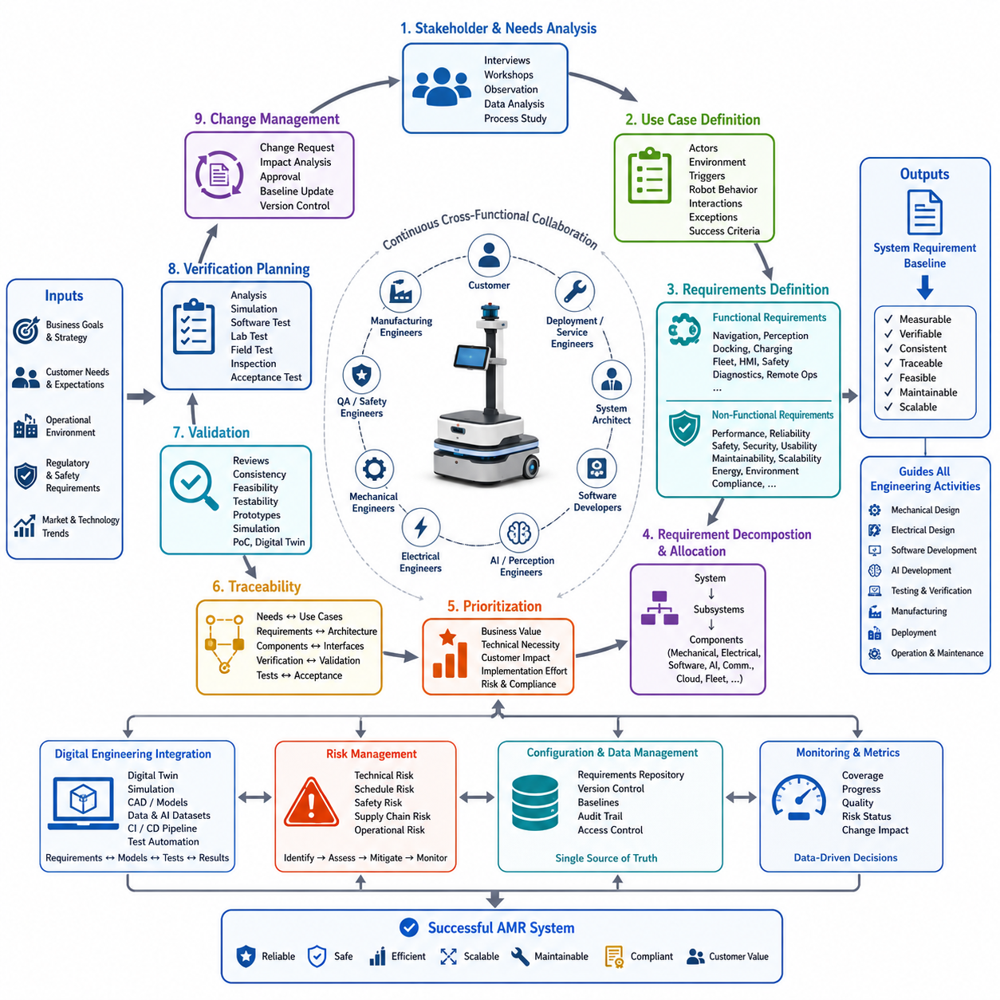
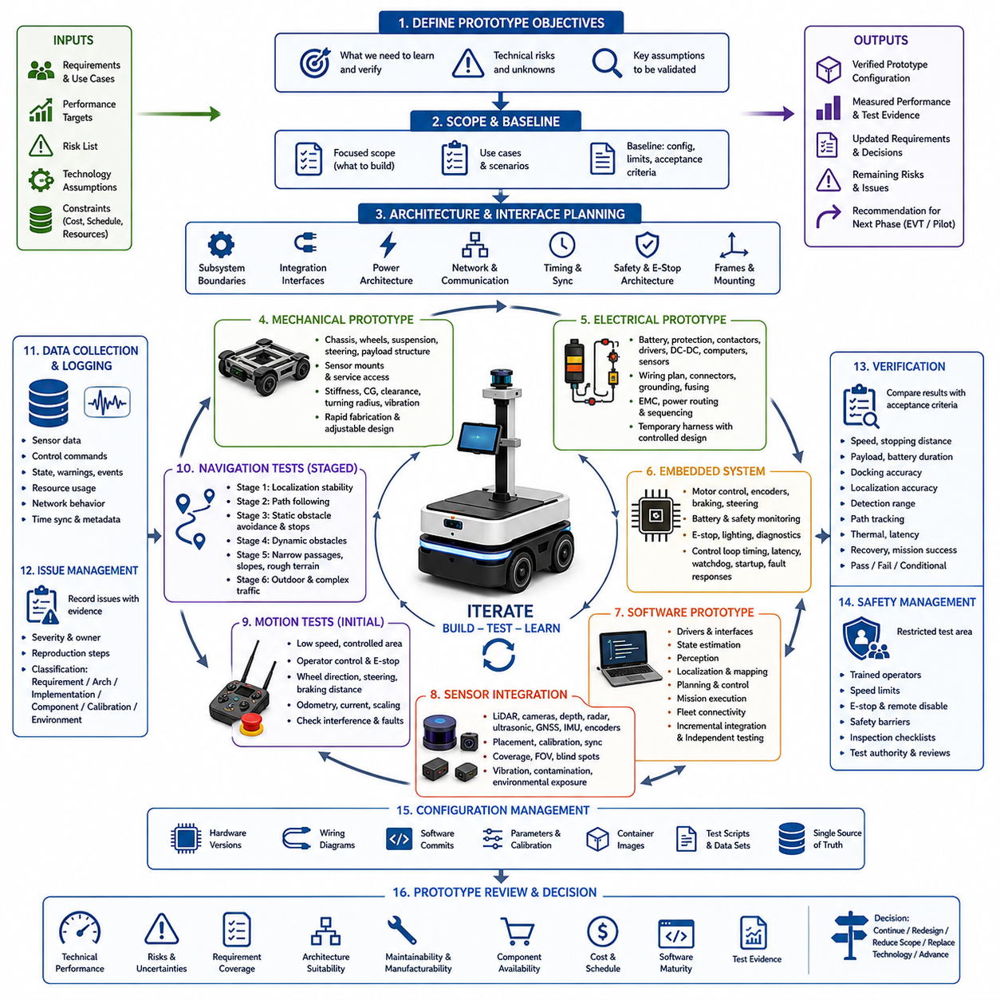
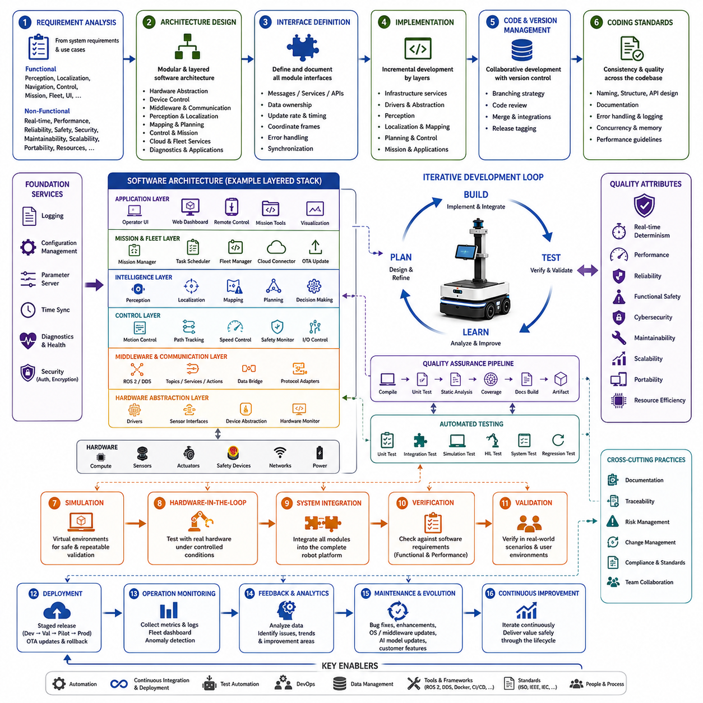
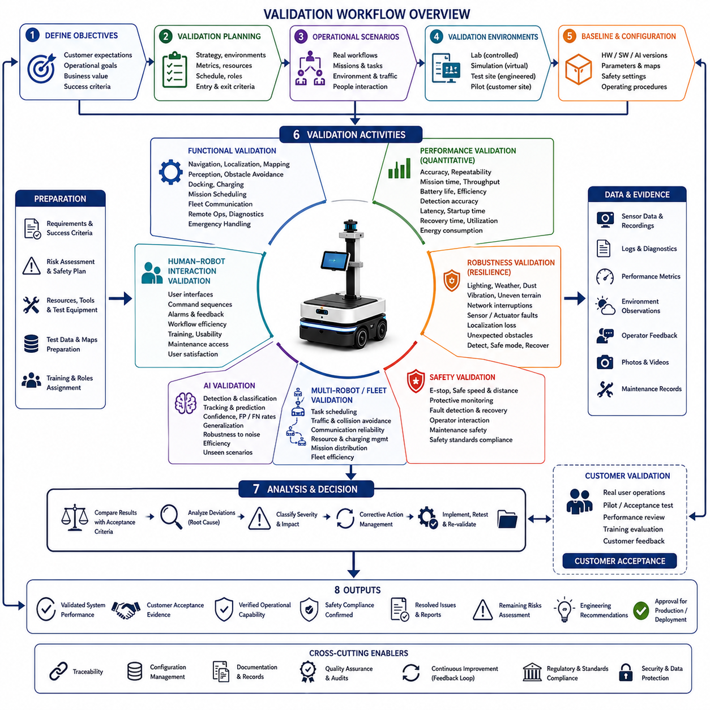
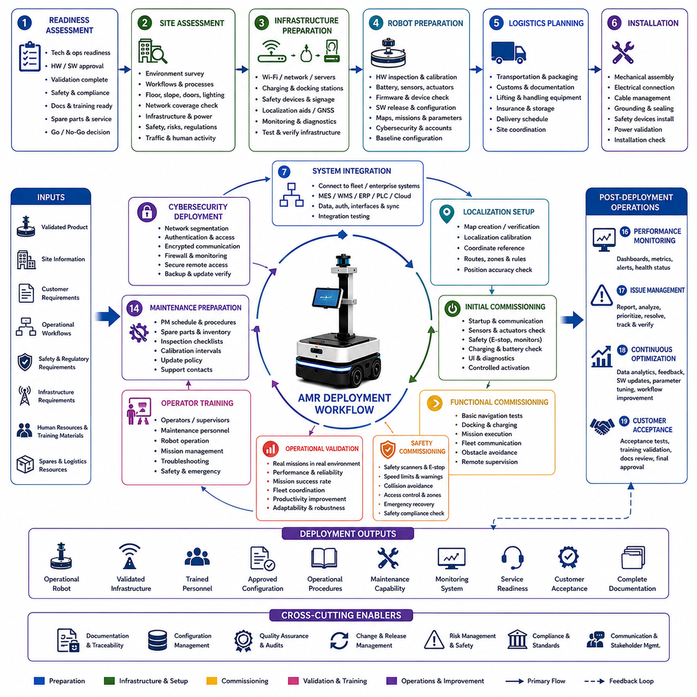

**Volume 01. AMR Foundations and System Architecture**

# 23. AMR Development Workflow · AMR 개발 워크플로우

## 23.01 Requirements Workflow · 요구사항 워크플로우

{width="7.268055555555556in" height="7.268055555555556in"}

The requirements workflow is the foundation of every successful Autonomous Mobile Robot (AMR) development project because it establishes a structured path from business objectives to deployable engineering solutions. Rather than treating requirements as isolated specifications, modern robotics organizations manage them as living assets that evolve throughout the product lifecycle. The workflow begins by understanding customer expectations, operational environments, business constraints, regulatory obligations, and long-term product strategy before any hardware or software architecture is defined. Early investment in requirement engineering significantly reduces redesign costs, shortens development cycles, and minimizes project risks by ensuring that every engineering activity is aligned with measurable objectives. The requirements workflow serves as the communication bridge connecting customers, product managers, system architects, mechanical engineers, electrical engineers, software developers, AI researchers, quality assurance teams, manufacturing organizations, and deployment engineers.

The workflow normally starts with stakeholder identification and needs analysis. Every AMR project involves multiple stakeholders whose expectations may differ considerably. Factory operators prioritize productivity and uptime, safety managers emphasize compliance with industrial regulations, maintenance engineers focus on serviceability, logistics managers require fleet scalability, while executives evaluate return on investment and operational efficiency. Requirements engineering therefore begins with interviews, workshops, field observations, operational data analysis, and business process studies to capture the real problems that the robot must solve. Instead of immediately discussing sensors or AI algorithms, engineers first investigate operational pain points, environmental limitations, workflow inefficiencies, and expected business outcomes. These findings are translated into high-level stakeholder requirements that define what success means from the user\'s perspective.

After stakeholder requirements are collected, the workflow proceeds to use case definition. Every requirement should be associated with one or more operational scenarios describing how the robot will perform useful work under realistic conditions. A manufacturing AMR may transport components between assembly stations, an inspection robot may autonomously inspect industrial equipment, while a hospital robot may deliver medication or medical supplies. Each use case defines actors, operating environments, triggering events, expected robot behavior, interaction with external systems, exceptional situations, and measurable success criteria. Well-defined use cases prevent unnecessary feature development because every engineering decision can be traced back to an operational objective rather than individual preferences or assumptions. This user-centered approach greatly improves project focus throughout development.

Functional requirements are then derived from the defined use cases. Functional requirements describe the capabilities that the AMR must provide to accomplish its intended missions. These include autonomous navigation, localization, obstacle detection, route planning, docking, charging, fleet communication, mission scheduling, human-machine interaction, safety monitoring, diagnostics, and remote operation. Each function is specified with clear inputs, expected outputs, operational conditions, timing constraints, and interface definitions. Instead of using vague statements such as "the robot shall navigate autonomously," mature requirements specify measurable behavior such as localization accuracy, docking repeatability, navigation speed, obstacle classification performance, mission completion rate, and allowable recovery procedures during abnormal events. Such precision enables objective verification later in the project.

Equally important are non-functional requirements, which define the quality attributes of the system rather than individual functions. These requirements address performance, reliability, availability, maintainability, scalability, cybersecurity, functional safety, usability, energy efficiency, environmental robustness, and regulatory compliance. Examples include maximum operating temperature, vibration tolerance, battery operating duration, network latency, software startup time, recovery time after power interruption, mean time between failures, maintainability targets, and software update mechanisms. Although non-functional requirements are often less visible than functional features, they largely determine whether a robot can operate reliably in demanding industrial environments for many years. Comprehensive AMR development therefore gives equal priority to both categories of requirements.

Once the complete requirement set has been established, system engineers perform requirement decomposition. High-level customer expectations are systematically translated into subsystem requirements allocated across mechanical, electrical, embedded, perception, localization, navigation, AI, communication, cloud infrastructure, and fleet management domains. For example, a requirement for reliable autonomous navigation is decomposed into localization accuracy, sensor coverage, perception latency, computational throughput, braking performance, wheel encoder precision, communication reliability, software response time, and environmental mapping requirements. This hierarchical decomposition ensures that each engineering discipline understands its responsibilities while maintaining traceability to the original customer objectives. System decomposition also reveals technical dependencies that require cross-functional coordination throughout development.

Requirement prioritization follows decomposition because resources, schedules, and budgets are always limited. Product managers and system architects classify requirements according to business value, technical necessity, customer impact, implementation complexity, regulatory importance, and project risk. Core operational capabilities that directly determine system functionality receive the highest priority, while optional enhancements may be scheduled for future software releases. Prioritization supports incremental development strategies where minimum viable products evolve into increasingly capable commercial platforms through controlled feature expansion. This structured prioritization prevents engineering teams from investing excessive effort in low-value features while essential system capabilities remain incomplete.

Traceability becomes a central activity throughout the requirements workflow. Every requirement should maintain bidirectional links to stakeholder needs, use cases, architectural components, software modules, hardware assemblies, interface specifications, verification procedures, validation activities, and final acceptance tests. When requirements change, engineers can immediately identify which documents, components, software packages, or test cases require updates. Likewise, if a subsystem experiences unexpected failures during testing, engineers can trace the affected components back to the original requirements to determine whether implementation defects or incomplete specifications caused the issue. Robust traceability significantly reduces engineering uncertainty in large multidisciplinary robotics programs.

Requirement validation occurs continuously rather than only at project completion. Reviews involving customers, system architects, domain experts, manufacturing specialists, deployment engineers, and quality assurance teams examine each requirement for correctness, completeness, consistency, feasibility, testability, and necessity. Conflicting or ambiguous requirements are resolved before detailed design begins. Validation may include simulation studies, proof-of-concept prototypes, digital twins, operational workflow demonstrations, and early laboratory experiments to verify technical feasibility. Detecting unrealistic assumptions during this stage prevents expensive redesign efforts after hardware fabrication or software integration has already begun.

Verification planning is closely integrated with requirement definition. Every requirement should include a corresponding verification method describing how compliance will be demonstrated. Verification approaches include analysis, simulation, software testing, laboratory measurement, hardware testing, environmental qualification, field trials, inspection, and customer acceptance testing. Performance requirements are validated using quantitative metrics, while safety requirements require documented compliance with applicable standards and controlled testing procedures. By defining verification methods together with the requirements themselves, engineering teams ensure that every specification is objectively measurable and practically achievable during project execution.

Requirements continue to evolve throughout the project due to customer feedback, technological advances, operational discoveries, manufacturing constraints, regulatory updates, or changing market conditions. Effective requirement change management therefore becomes essential. Every proposed modification is evaluated according to technical impact, implementation cost, schedule implications, risk exposure, verification effort, and downstream engineering consequences. Formal approval workflows ensure that only justified changes are incorporated into the baseline. Version control systems maintain complete histories of requirement revisions, allowing teams to understand why decisions were made and how project scope evolved over time. Controlled change management protects engineering stability while preserving the flexibility needed for innovation.

Modern AMR development increasingly integrates digital engineering into the requirements workflow. Requirements are connected directly to digital twins, simulation environments, CAD models, software repositories, AI datasets, continuous integration pipelines, and automated testing frameworks. As requirements are modified, associated simulations, verification scenarios, and validation reports can be regenerated automatically, providing immediate feedback regarding system impacts. This model-based engineering approach greatly improves consistency across multidisciplinary teams while reducing manual documentation effort and accelerating iterative development cycles. Digital continuity also supports long-term product maintenance after commercial deployment.

Cross-functional collaboration is another defining characteristic of an effective requirements workflow. Mechanical engineers evaluate packaging feasibility, electrical engineers assess power distribution, AI developers estimate computational requirements, perception specialists determine sensing capabilities, software architects design modular interfaces, safety engineers evaluate hazard mitigation, manufacturing engineers assess production readiness, and service teams review maintainability considerations. Rather than working sequentially, these disciplines collaborate continuously from the earliest requirement discussions, reducing integration risks and ensuring that the resulting architecture remains technically balanced across the entire AMR platform.

Risk assessment is embedded within requirement engineering instead of being treated as an independent management activity. Every major requirement introduces technical uncertainties, implementation complexity, schedule dependencies, supply chain concerns, safety implications, or operational challenges. High-risk requirements may require technology demonstrations, additional simulations, alternative architectural options, or prototype validation before full-scale implementation proceeds. Early identification of these risks enables project managers to allocate contingency resources, prioritize mitigation activities, and establish realistic development milestones. Integrating risk analysis into the requirements workflow significantly improves project predictability and product reliability.

The final output of the requirements workflow is a controlled and traceable system requirement baseline that guides every subsequent engineering activity. Mechanical design, electrical architecture, embedded software, AI algorithms, perception pipelines, localization systems, navigation software, cloud infrastructure, manufacturing planning, verification testing, certification, deployment, and long-term maintenance all derive their objectives from this baseline. As development progresses, the requirements repository evolves into the central knowledge source for the entire project, enabling consistent decision-making across multidisciplinary teams. A disciplined requirements workflow ultimately transforms customer expectations into engineering specifications that are measurable, verifiable, maintainable, and scalable, forming the foundation for reliable, safe, and commercially successful Autonomous Mobile Robot systems.

## 23.02 Prototype Workflow · 프로토타입 워크플로우

{width="7.268055555555556in" height="7.268055555555556in"}

The prototype workflow transforms approved Autonomous Mobile Robot requirements into a physical and software-integrated system that can be tested under controlled conditions. Its purpose is not to create a finished commercial product immediately, but to reduce uncertainty by proving key technologies, interfaces, and operating concepts before large investments are made in detailed design, tooling, certification, and production.

Prototype development begins by defining the learning objectives of the build. The team identifies which technical assumptions must be confirmed, which risks require early investigation, and which system behaviors cannot be evaluated through analysis alone. Typical objectives include validating payload capacity, drive performance, localization stability, obstacle detection, docking accuracy, power consumption, thermal behavior, and communication reliability.

The prototype scope should be intentionally limited to the functions needed to answer the most important engineering questions. Attempting to include every future feature often increases cost and integration complexity without improving technical knowledge. A focused prototype may therefore use temporary structures, simplified covers, development computers, provisional wiring, or manually configured software while preserving the interfaces and operating principles that require verification.

Before fabrication begins, system engineers establish a prototype baseline that defines the selected configuration, intended use cases, expected performance, known limitations, and acceptance criteria. This baseline prevents different teams from building incompatible interpretations of the same robot. It also provides a clear reference for evaluating whether the prototype successfully demonstrates the targeted functions and whether additional iterations are required.

Architecture development continues in parallel with prototype planning. Mechanical, electrical, embedded, software, perception, localization, navigation, safety, and communication teams define subsystem boundaries and integration interfaces. Temporary components may be accepted, but critical interfaces such as power levels, network protocols, coordinate frames, timing requirements, mounting points, and emergency-stop behavior should reflect the intended product architecture as closely as possible.

Mechanical prototyping usually begins with the chassis, wheel arrangement, suspension, steering mechanism, payload structure, sensor mounts, and service access. Engineers evaluate structural stiffness, center of gravity, ground clearance, turning radius, vibration, and manufacturability. Rapid fabrication methods such as modular frames, machined plates, additive manufacturing, and adjustable brackets allow design changes without rebuilding the entire platform.

Electrical prototyping establishes the initial power and control architecture. Batteries, protection devices, contactors, motor drivers, DC-DC converters, safety circuits, computers, sensors, and communication equipment are integrated according to a controlled wiring plan. Even when temporary harnesses are used, connectors, grounding, fusing, cable routing, electromagnetic compatibility, and power sequencing should be documented because electrical instability can invalidate later software and sensor tests.

The embedded system prototype provides deterministic control of actuators and safety-related devices. It typically manages motor commands, encoder acquisition, battery status, emergency inputs, braking, steering, lighting, and low-level diagnostics. Engineers confirm control-loop timing, communication latency, watchdog behavior, startup sequences, and fault responses before allowing higher-level autonomous software to command physical movement.

Software prototyping is performed incrementally rather than as a single final integration event. Basic device drivers and communication interfaces are verified first, followed by state estimation, perception, localization, mapping, planning, control, mission execution, and fleet connectivity. Each layer should be testable independently using recorded data, simulation, hardware-in-the-loop environments, or controlled bench setups before it is deployed on the moving robot.

Sensor integration requires careful attention to placement, calibration, synchronization, visibility, vibration, contamination, and environmental exposure. LiDAR, cameras, depth sensors, radar, ultrasonic sensors, GNSS, IMU, and wheel encoders must produce spatially and temporally consistent data. Prototype testing should confirm that the selected sensor layout provides sufficient coverage while avoiding blind zones, interference, reflections, and mechanical obstruction.

Initial motion tests are performed at low speed in a restricted area with direct operator control and immediate emergency-stop access. Engineers verify wheel direction, steering response, braking distance, odometry, command scaling, current consumption, and mechanical interference. Autonomous functions should not be enabled until the basic platform responds predictably and the team has confirmed that faults can be detected and controlled safely.

Once basic mobility is stable, localization and navigation functions are introduced in stages. The robot first demonstrates repeatable pose estimation in a simple environment, then follows predefined paths, avoids static obstacles, and performs controlled stops. Dynamic obstacles, narrow passages, slopes, uneven surfaces, changing illumination, outdoor conditions, and complex traffic interactions are added only after the preceding capability has achieved stable and measurable performance.

A prototype workflow must include continuous fault observation and structured data collection. Logs should capture sensor streams, control commands, state estimates, warnings, resource usage, network behavior, and safety events. Time synchronization and configuration metadata are essential because a failure cannot be reproduced reliably when engineers do not know which software version, parameter set, hardware configuration, or environmental condition produced it.

Problems discovered during testing are recorded in an issue management system with evidence, severity, ownership, reproduction steps, and expected resolution. Teams should distinguish between requirement defects, architecture defects, implementation errors, component limitations, calibration problems, and test-environment effects. This classification prevents superficial fixes and helps decision-makers determine whether the solution requires software adjustment, hardware redesign, or requirement revision.

Prototype verification compares measured results with the acceptance criteria defined in the baseline. Tests may evaluate speed, stopping distance, payload handling, battery duration, docking repeatability, localization accuracy, obstacle detection range, path tracking, network latency, thermal limits, recovery behavior, and mission completion. Results should include raw evidence, test conditions, uncertainties, deviations, and clear pass, fail, or conditional judgments.

Iteration is an expected part of prototype engineering rather than evidence of poor planning. Each build-test-learn cycle should produce specific knowledge that improves the next configuration. Mechanical changes may alter sensor calibration, electrical changes may affect thermal performance, and software changes may expose computation or timing constraints. Controlled iteration ensures that these cross-domain effects are understood before the design becomes difficult or expensive to modify.

Configuration management becomes increasingly important as prototypes evolve. Hardware revisions, wiring diagrams, software commits, parameter files, calibration values, container images, test scripts, and datasets should be associated with unique versions. Without disciplined configuration control, teams may compare results from different system states and draw incorrect conclusions about performance improvements or unresolved defects.

Safety remains active throughout the prototype workflow even when the system is not intended for customer operation. Restricted test zones, trained operators, speed limits, physical barriers, emergency stops, remote disable functions, inspection checklists, and defined test authority reduce development hazards. Safety engineers should review new test scenarios whenever payload, speed, autonomy, environment, or human interaction conditions change significantly.

A successful prototype review examines more than whether the robot moved or completed a demonstration. The review considers technical performance, unresolved risks, requirement coverage, architectural suitability, maintainability, manufacturing implications, component availability, software maturity, test evidence, and expected cost. Stakeholders then decide whether to continue, redesign, reduce scope, replace a technology, or advance toward an engineering validation build.

The final outputs of the prototype workflow include a verified prototype configuration, updated requirements, validated architecture decisions, measured performance data, unresolved issue lists, risk assessments, revised cost estimates, and recommendations for the next development phase. These outputs convert experimental work into controlled engineering knowledge and provide the foundation for detailed design, validation, pilot deployment, and eventual production.

An effective prototype workflow therefore connects requirements, architecture, fabrication, integration, testing, data analysis, and decision-making within a continuous learning process. By testing the highest-risk assumptions early and maintaining traceable evidence throughout each iteration, the development team can reduce technical uncertainty, prevent expensive late-stage failures, and create a reliable path from concept to a safe, scalable, and commercially viable AMR system.

## 23.03 Software Workflow · 소프트웨어 워크플로우

{width="7.268055555555556in" height="7.268055555555556in"}

The software workflow is the structured engineering process that transforms system requirements into reliable, maintainable, and scalable software for an Autonomous Mobile Robot. Unlike traditional software projects, AMR software must continuously interact with physical hardware, dynamic environments, safety mechanisms, real-time operating constraints, cloud services, and human operators. Consequently, software development is not treated as an isolated programming activity but as a multidisciplinary engineering workflow integrating systems engineering, robotics, artificial intelligence, embedded control, networking, and operational deployment. A well-defined software workflow ensures that every software component evolves in a controlled manner while maintaining consistency with the overall system architecture throughout the product lifecycle.

The workflow begins with software requirement analysis derived from system-level requirements and operational use cases. Functional requirements describe the robot\'s expected capabilities, including perception, localization, navigation, motion control, mission execution, fleet communication, diagnostics, user interfaces, and remote management. Non-functional requirements specify timing constraints, computational performance, reliability, safety integrity, cybersecurity, maintainability, portability, scalability, and resource utilization. Software architects translate these requirements into measurable engineering objectives while identifying technical risks, external dependencies, hardware interfaces, and regulatory constraints that influence implementation decisions.

Following requirement analysis, software architecture is established to define the overall organization of the robot software platform. Modern AMR systems typically adopt modular and layered architectures where independent software components communicate through standardized interfaces. Core architectural layers often include hardware abstraction, embedded device control, middleware communication, perception processing, localization, mapping, planning, control, mission management, cloud connectivity, fleet services, diagnostics, and user applications. This separation of responsibilities improves maintainability while allowing individual modules to evolve independently without introducing unnecessary coupling throughout the system.

Interface definition represents one of the most critical activities within the software workflow. Every module must expose clearly documented interfaces describing message formats, service calls, data ownership, update frequencies, timing constraints, coordinate systems, error handling procedures, and synchronization mechanisms. Whether communication occurs through ROS 2 topics, services, actions, DDS middleware, REST APIs, or proprietary industrial protocols, interface specifications become contractual agreements between development teams. Stable interfaces significantly reduce integration problems because independently developed components can communicate predictably despite evolving internal implementations.

Software implementation proceeds incrementally rather than attempting to build the complete system simultaneously. Development usually begins with infrastructure services such as logging, configuration management, hardware abstraction, communication frameworks, and diagnostic capabilities before progressing toward perception, localization, planning, navigation, mission execution, and operator interfaces. This layered implementation strategy ensures that foundational services supporting later software modules are mature before more complex autonomous functions depend upon them. Early incremental development also enables continuous testing and rapid feedback throughout the engineering process.

Source code management provides the foundation for collaborative software development. Every source file, configuration, launch script, parameter set, documentation update, container definition, and build script is maintained within version control systems that preserve complete modification histories. Branching strategies separate stable production code from experimental features, bug fixes, integration activities, and release candidates. Code reviews ensure that modifications satisfy architectural guidelines, coding standards, documentation requirements, and quality expectations before being merged into shared repositories. Effective version management significantly reduces integration conflicts within multidisciplinary robotics teams.

Coding standards establish consistency across the entire software platform. Naming conventions, directory organization, API design principles, documentation practices, error handling strategies, logging policies, exception management, memory allocation rules, concurrency models, and performance guidelines allow multiple developers to contribute code that remains understandable long after its original authors have left the project. Consistent coding practices improve maintainability, facilitate debugging, reduce onboarding time for new engineers, and minimize long-term technical debt throughout the software lifecycle.

Software modules are developed with independent unit testing whenever possible. Individual classes, algorithms, utilities, communication interfaces, mathematical functions, configuration parsers, and hardware abstraction layers are verified before integration with larger subsystems. Automated unit tests validate expected outputs, boundary conditions, invalid inputs, exception handling, numerical stability, timing behavior, and resource management. Early defect detection significantly reduces debugging effort because failures can be isolated before interactions between multiple software components complicate diagnosis.

Continuous integration plays a central role in modern robotics software development. Whenever developers submit new code, automated pipelines compile the project, execute unit tests, analyze code quality, verify dependencies, measure test coverage, generate documentation, and build deployable software artifacts. Static analysis tools identify potential programming errors, memory leaks, concurrency issues, security vulnerabilities, and coding standard violations before software reaches physical robots. Automated quality assurance reduces human error while providing immediate feedback regarding software stability after every change.

Simulation-based validation enables software verification without exposing physical robots to unnecessary risk. Digital environments reproduce sensor behavior, robot dynamics, factory layouts, warehouses, hospitals, outdoor terrain, weather conditions, moving obstacles, and operational workflows. Software modules can therefore be evaluated using repeatable scenarios that would be difficult, expensive, or dangerous to reproduce consistently in real environments. Simulation accelerates algorithm development while supporting regression testing whenever software modifications introduce potential behavioral changes.

Hardware-in-the-loop testing gradually replaces simulated components with real hardware while preserving controlled test conditions. Embedded controllers, sensors, motor drivers, communication devices, cameras, LiDAR units, GNSS receivers, IMUs, safety controllers, and industrial interfaces are connected incrementally as software maturity increases. This staged integration process allows engineers to identify hardware compatibility problems, timing issues, synchronization errors, communication bottlenecks, and device-specific behavior before complete system deployment.

System integration combines independently verified software modules into a fully functional robotic platform. Perception feeds localization, localization supports planning, planning generates trajectories, control executes motion, mission managers coordinate behaviors, safety systems supervise execution, and cloud infrastructure provides fleet connectivity. Integration should proceed according to predefined dependency hierarchies so that stable lower-level services support increasingly sophisticated autonomous capabilities. Comprehensive logging during integration provides valuable evidence for diagnosing unexpected interactions between previously independent modules.

Software verification confirms that implementation satisfies documented software requirements. Functional testing evaluates feature completeness, while performance testing measures computation latency, memory usage, processor utilization, communication bandwidth, startup times, shutdown behavior, fault recovery, and deterministic execution. Stress testing examines system stability under heavy computational loads, degraded sensors, communication interruptions, and extended operational periods. Verification evidence demonstrates objective compliance with measurable engineering requirements rather than subjective observations.

Validation differs from verification by evaluating whether the completed software solves real operational problems within intended environments. Engineers execute representative customer missions under realistic conditions while measuring productivity, navigation reliability, mission completion rates, obstacle handling, operator usability, and system robustness. Validation frequently reveals workflow improvements, interface refinements, usability enhancements, or operational assumptions that were not apparent during laboratory testing despite technically correct software implementation.

Debugging and performance optimization continue throughout the software workflow. Engineers analyze execution traces, profiling reports, resource utilization, scheduling delays, communication latency, memory consumption, GPU workloads, sensor processing pipelines, and thread synchronization behavior. Performance bottlenecks may originate from inefficient algorithms, excessive data copying, blocking operations, poor scheduling, or hardware limitations. Optimization efforts focus not only on computational speed but also on deterministic execution, predictable latency, maintainability, and long-term operational stability.

Configuration management ensures reproducibility across development, testing, deployment, and maintenance activities. Software releases include synchronized versions of executable programs, parameter files, calibration data, AI models, middleware configurations, container images, operating system packages, firmware, documentation, and deployment scripts. Every validated software configuration receives a unique identifier so that field failures can be traced back to the exact software environment in which they occurred. Configuration consistency greatly simplifies maintenance and supports reliable long-term fleet operations.

Cybersecurity is integrated into the software workflow from the earliest architectural stages rather than being added after development. Authentication, authorization, encrypted communication, secure boot, software signing, access control, credential management, audit logging, network isolation, and vulnerability monitoring are incorporated throughout implementation. Regular security reviews, penetration testing, dependency analysis, and software update verification protect both individual robots and entire fleet infrastructures against evolving cyber threats while maintaining operational continuity.

Software deployment is carefully controlled through staged release management. Internal development builds progress toward engineering releases, validation releases, pilot deployments, and production versions. Over-the-air update mechanisms, rollback strategies, health monitoring, deployment verification, compatibility testing, and staged rollout policies minimize operational disruption while enabling continuous software improvement after robots enter commercial service. Deployment decisions balance innovation with reliability by ensuring that new capabilities do not compromise proven operational performance.

Operational monitoring extends the software workflow beyond initial deployment. Robots continuously generate diagnostic logs, performance metrics, sensor statistics, AI confidence measurements, hardware health indicators, communication quality reports, and mission histories. Fleet management systems aggregate this information to identify software regressions, recurring failures, performance degradation, configuration inconsistencies, and emerging reliability trends. Continuous operational feedback transforms deployed robots into valuable sources of engineering knowledge for future software improvements.

Software maintenance represents a continuous engineering activity rather than the final stage of development. Defect correction, feature enhancement, hardware adaptation, operating system upgrades, middleware evolution, AI model updates, regulatory compliance, cybersecurity patches, and customer-specific improvements are managed through the same disciplined workflow established during initial development. Long-term maintainability depends on preserving architectural consistency, comprehensive documentation, automated testing, and controlled configuration management throughout the product lifecycle.

An effective software workflow ultimately connects requirements engineering, architecture, implementation, testing, simulation, integration, deployment, monitoring, and maintenance into a unified continuous engineering process. Every iteration produces measurable improvements supported by objective verification evidence and operational feedback. By emphasizing modular architecture, automated quality assurance, disciplined configuration control, and continuous validation, the workflow enables the development of software platforms that remain reliable, scalable, safe, and adaptable throughout the operational lifetime of Autonomous Mobile Robot systems.

## 23.04 Validation Workflow · 검증 워크플로우

{width="7.268055555555556in" height="7.268055555555556in"}

Validation is the engineering process that confirms whether an Autonomous Mobile Robot satisfies its intended operational objectives and delivers the expected value to end users under realistic conditions. While verification determines whether the system has been built according to specifications, validation determines whether the correct system has been built to solve the intended problem. The validation workflow therefore evaluates the complete robot as an integrated operational solution rather than as an isolated collection of hardware and software components. It combines technical evaluation, operational assessment, customer acceptance, safety confirmation, and long-term performance analysis to ensure that the robot can successfully operate in its target environment.

The validation workflow begins by defining validation objectives based on customer expectations, operational scenarios, business goals, regulatory requirements, and measurable success criteria. Rather than focusing solely on engineering specifications, validation objectives describe the desired operational outcomes that customers expect to achieve after deployment. Examples include reducing transportation time, increasing warehouse throughput, improving inspection quality, minimizing operator workload, enhancing safety, lowering operational costs, or increasing fleet utilization. Clearly defined objectives ensure that every validation activity directly supports practical business value instead of merely demonstrating technical functionality.

Validation planning establishes the overall strategy for evaluating system performance throughout the development lifecycle. Engineers identify validation environments, representative operating conditions, acceptance metrics, required resources, responsible personnel, schedules, test equipment, data collection methods, safety precautions, and reporting procedures. The validation plan also defines entry criteria that must be satisfied before testing begins, as well as exit criteria indicating successful completion. Careful planning prevents incomplete evaluations and ensures that validation results remain repeatable, objective, and traceable across multiple development iterations.

Operational scenarios form the foundation of every validation activity. Instead of testing individual software functions independently, validation reproduces complete customer workflows using realistic environmental conditions. Manufacturing robots transport materials between production stations, warehouse robots fulfill logistics missions, hospital robots deliver medicine and supplies, inspection robots evaluate industrial equipment, and outdoor robots navigate complex terrain under varying weather conditions. Each operational scenario includes mission objectives, environmental characteristics, expected robot behaviors, interaction with people, exceptional situations, and measurable operational outcomes representing real customer usage.

Validation environments should represent the full range of conditions expected during commercial operation. Laboratory environments support controlled evaluation of individual capabilities, while simulation environments reproduce difficult or hazardous situations that cannot easily be recreated physically. Engineering test sites provide repeatable field conditions for subsystem integration, whereas pilot installations expose the robot to actual customer operations with realistic traffic, lighting, environmental variability, communication infrastructure, and human interaction. Successful validation requires evidence collected from multiple complementary environments rather than relying exclusively on laboratory demonstrations.

Before executing validation activities, the complete system configuration must be documented and controlled. Hardware versions, software releases, AI models, calibration data, parameter settings, maps, safety configurations, communication infrastructure, and operating procedures are recorded as part of the validation baseline. This controlled configuration ensures that future validation results remain reproducible and that observed system behavior can be traced to the exact hardware and software environment under which testing occurred.

Functional validation confirms that every major capability operates correctly under realistic conditions. Engineers evaluate autonomous navigation, localization, mapping, perception, obstacle avoidance, docking, charging, mission scheduling, fleet communication, remote operation, diagnostics, user interfaces, and emergency handling during representative operational workflows. Validation focuses not only on whether functions execute successfully but also on whether they consistently satisfy customer expectations throughout prolonged operation under varying environmental conditions.

Performance validation measures quantitative operational characteristics that determine system effectiveness. Typical performance metrics include navigation accuracy, docking repeatability, mission completion time, throughput, battery endurance, charging efficiency, obstacle detection accuracy, localization stability, communication latency, startup time, recovery time, fleet coordination efficiency, computational utilization, and energy consumption. Measurements should be collected across multiple operating conditions to evaluate both average performance and worst-case behavior rather than relying upon isolated demonstrations.

Robustness validation evaluates system behavior under abnormal or degraded operating conditions. Robots are exposed to changing illumination, rain, dust, vibration, uneven terrain, network interruptions, sensor failures, battery degradation, actuator faults, temporary localization loss, communication delays, unexpected obstacles, operator mistakes, and environmental uncertainty. The objective is not merely to observe failures but to determine whether the system maintains acceptable operational capability, detects abnormal conditions, enters safe operating modes, recovers automatically when possible, and provides meaningful diagnostic information to operators.

Safety validation demonstrates that the robot behaves safely throughout normal operation, foreseeable misuse, equipment failures, and emergency situations. Engineers evaluate emergency-stop functionality, obstacle avoidance, speed limitation, protective monitoring, safe braking distances, fault detection, recovery procedures, operator interaction, maintenance activities, warning systems, and compliance with applicable industrial safety standards. Validation extends beyond functional testing by confirming that safety mechanisms remain effective during realistic operational scenarios involving people, equipment, and dynamic environmental conditions.

Human-robot interaction validation examines how effectively operators, maintenance personnel, supervisors, and other users interact with the robot throughout daily operation. Validation activities assess user interfaces, command sequences, alarm presentation, workflow efficiency, training requirements, maintenance accessibility, troubleshooting procedures, operational clarity, workload reduction, and overall user satisfaction. Systems that satisfy technical requirements but remain difficult to operate or maintain often require significant usability improvements before commercial deployment.

Artificial intelligence validation evaluates perception, classification, prediction, decision-making, and learning algorithms using representative operational datasets. Validation datasets should remain independent from training datasets to prevent overly optimistic performance estimates. Engineers measure detection accuracy, false positive rates, false negative rates, classification confidence, tracking stability, environmental generalization, robustness against sensor noise, and computational efficiency. AI validation also examines behavior during unusual situations that may not have been represented sufficiently during model training.

Multi-robot validation becomes increasingly important for fleet-based AMR deployments. Validation evaluates task scheduling, traffic management, collision avoidance, communication reliability, shared resource utilization, charging coordination, mission distribution, congestion management, and overall fleet efficiency under varying operational loads. Individual robots may operate correctly in isolation while exhibiting unexpected behaviors when interacting with numerous autonomous systems simultaneously. Fleet validation therefore examines the collective behavior of the complete robotic ecosystem rather than focusing exclusively on individual platforms.

Long-duration validation assesses reliability over extended operational periods. Continuous testing may involve hundreds or thousands of operating hours during which engineers monitor hardware degradation, software stability, memory usage, battery aging, communication quality, thermal behavior, sensor contamination, calibration drift, maintenance frequency, and mission success rates. Long-term validation reveals gradual performance degradation that short laboratory demonstrations cannot detect, providing valuable information regarding operational reliability and lifecycle maintenance planning.

Data collection and evidence management represent essential components of the validation workflow. Every validation activity generates synchronized sensor recordings, software logs, diagnostic reports, performance measurements, environmental observations, operator feedback, maintenance records, photographs, videos, and configuration information. Evidence should be organized according to traceable validation procedures so that every engineering conclusion can be supported by objective data rather than subjective observations. Well-structured evidence greatly simplifies certification, customer acceptance, and future product improvements.

Validation results are systematically analyzed against predefined acceptance criteria established during planning. Engineers compare measured performance with customer requirements, operational objectives, regulatory obligations, safety targets, and engineering expectations. Deviations are categorized according to severity, operational impact, reproducibility, technical root cause, and required corrective actions. Analysis emphasizes understanding why deviations occurred rather than simply documenting pass or fail outcomes.

Corrective action management ensures that validation findings directly improve the system. Engineering teams prioritize identified issues, assign ownership, define corrective measures, implement modifications, perform regression testing, and repeat affected validation activities until acceptable performance is achieved. Controlled issue resolution prevents unresolved defects from propagating into later development stages or commercial deployments while preserving complete traceability between discovered problems and implemented solutions.

Customer validation represents one of the final stages before commercial deployment. Representative users operate the robot within realistic workflows while evaluating operational usefulness, ease of operation, productivity improvements, reliability, maintainability, and overall business value. Customer acceptance often includes formal demonstrations, pilot operations, performance reviews, training assessments, and operational feedback sessions. Successful customer validation confirms that engineering achievements have translated into meaningful operational improvements rather than remaining purely technical accomplishments.

Documentation throughout the validation workflow must remain comprehensive, accurate, and traceable. Validation plans, procedures, checklists, execution records, configuration baselines, measurement results, issue reports, corrective actions, customer feedback, acceptance decisions, and final validation reports collectively establish objective evidence supporting product readiness. Complete documentation also facilitates certification, regulatory compliance, maintenance planning, knowledge transfer, and future product development.

The final outputs of the validation workflow include validated system performance, customer acceptance evidence, verified operational capability, documented safety compliance, resolved issue records, remaining risk assessments, updated engineering recommendations, and formal approval for production or deployment. These outputs transform engineering prototypes into operationally trusted robotic systems that satisfy both technical requirements and real-world customer expectations.

An effective validation workflow therefore connects engineering verification, operational testing, customer evaluation, safety assessment, long-term reliability analysis, and continuous improvement into a unified engineering process. By validating complete robotic systems under realistic operational conditions while maintaining objective evidence and traceable decision-making, organizations can significantly reduce deployment risk, improve customer confidence, accelerate commercial adoption, and establish a reliable foundation for scalable Autonomous Mobile Robot solutions.

## 23.05 Deployment Workflow · 배포 워크플로우

{width="7.268055555555556in" height="7.268055555555556in"}

The deployment workflow is the structured engineering process that transfers an Autonomous Mobile Robot from the controlled development environment into reliable real-world operation. Unlike laboratory demonstrations or prototype evaluations, deployment represents the transition from engineering validation to sustained operational use within customer facilities. This workflow ensures that hardware, software, infrastructure, personnel, operational procedures, and maintenance resources are fully prepared before the robot begins performing production missions. A disciplined deployment workflow minimizes operational disruption, reduces implementation risks, accelerates customer acceptance, and establishes a stable foundation for long-term autonomous operation.

Deployment begins with deployment readiness assessment. Before any robot is delivered to the customer site, engineering teams evaluate whether all technical, operational, regulatory, and commercial requirements have been satisfied. This assessment includes hardware qualification, software release approval, validation completion, documentation availability, safety certification, manufacturing quality, logistics preparation, spare parts readiness, operator training materials, and service capabilities. Deployment should never proceed solely because development has finished; instead, it should begin only after objective readiness criteria have been successfully verified.

Site assessment represents one of the most important preparation activities within the deployment workflow. Engineers visit the customer facility to understand the physical environment, operational workflows, infrastructure limitations, safety regulations, communication coverage, charging locations, docking areas, traffic conditions, human activity, environmental hazards, and maintenance accessibility. Floor quality, slopes, door widths, lighting conditions, wireless signal strength, elevator integration, emergency procedures, and existing automation systems are carefully documented because deployment success depends heavily on compatibility between the robot and its operating environment.

Following the site survey, deployment engineers prepare the operational infrastructure required for autonomous operation. Wireless communication networks, fleet servers, cloud connectivity, charging stations, docking systems, safety equipment, localization markers, GNSS reference stations when applicable, maintenance workstations, monitoring dashboards, and diagnostic interfaces are installed and verified. Infrastructure should be tested independently before the robot arrives so that environmental problems do not become confused with robot-related issues during system integration.

Robot preparation is performed according to a controlled deployment configuration. Hardware inspection verifies mechanical integrity, battery condition, sensor calibration, electrical connections, firmware versions, computing hardware, safety devices, communication modules, and environmental protection features. Software preparation includes approved release versions, operating system packages, middleware, AI models, configuration files, localization maps, mission definitions, fleet parameters, cybersecurity settings, user accounts, and remote management capabilities. Every deployed robot should begin operation from a documented baseline configuration.

Logistics planning ensures that transportation, installation, unloading, storage, customs documentation when required, lifting equipment, packaging protection, insurance, environmental conditions, installation schedules, and customer coordination are completed before physical delivery occurs. Large industrial robots often require specialized transportation procedures, protective packaging, vibration monitoring, and environmental controls to prevent damage during shipment. Careful logistics management reduces deployment delays and protects valuable robotic equipment during transportation.

Installation begins with controlled hardware assembly and positioning at the customer site. Sensors, batteries, charging equipment, communication devices, accessories, safety components, payload equipment, and optional modules are installed according to documented procedures. Mechanical alignment, cable routing, grounding, environmental sealing, fastener torque verification, electrical safety inspection, and power validation are completed before software activation begins. Installation quality directly influences long-term operational reliability and maintenance efficiency.

System integration connects the deployed robot with customer infrastructure and operational systems. Fleet management platforms, manufacturing execution systems, warehouse management systems, enterprise software, programmable logic controllers, industrial networks, cloud services, authentication servers, monitoring systems, and external databases are configured through standardized interfaces. Integration testing verifies reliable communication, data consistency, synchronization, authorization, fault handling, and recovery behavior before production missions are permitted.

Localization initialization establishes the robot\'s spatial understanding of its operational environment. Engineers generate or verify facility maps, calibrate localization systems, establish coordinate references, validate navigation landmarks, confirm sensor alignment, and evaluate positioning accuracy throughout the complete operational area. Navigation routes, restricted zones, charging locations, emergency paths, traffic rules, and operational boundaries are configured according to customer requirements. Reliable localization forms the foundation for every subsequent autonomous operation.

Initial commissioning activates the robot under controlled operating conditions. Engineers verify startup procedures, communication links, sensor operation, actuator functionality, safety monitoring, emergency-stop behavior, battery charging, mission scheduling, operator interfaces, and diagnostic capabilities before autonomous movement is enabled. Controlled commissioning ensures that every subsystem operates correctly after transportation and installation while providing opportunities to identify configuration errors before production activities begin.

Functional commissioning gradually expands operational capability through carefully controlled testing. Engineers first evaluate simple navigation tasks, then docking procedures, charging operations, mission execution, fleet communication, obstacle avoidance, remote supervision, operator interaction, and recovery behavior. More complex customer workflows are introduced only after simpler functions demonstrate stable performance. This incremental commissioning strategy minimizes operational risks while allowing rapid correction of configuration issues.

Safety commissioning confirms that every protective function operates correctly within the customer environment. Protective scanners, emergency-stop systems, warning indicators, speed limitations, access controls, obstacle detection, collision avoidance, emergency recovery procedures, maintenance modes, and operational restrictions are validated according to site-specific safety requirements. Human interaction scenarios receive particular attention because actual customer environments frequently introduce conditions that were not fully represented during engineering validation.

Operational validation continues after installation by executing representative customer missions under real operating conditions. Material transport, inspection routines, warehouse logistics, manufacturing support, hospital delivery, outdoor navigation, or other operational tasks are performed repeatedly while engineers monitor performance, mission success rates, operator interaction, fleet coordination, environmental adaptability, and productivity improvements. Successful deployment depends on demonstrating practical operational value rather than simply proving technical functionality.

Operator training is integrated into the deployment workflow rather than treated as an independent activity. Operators, supervisors, maintenance personnel, administrators, and safety managers receive role-specific training covering robot operation, mission management, emergency response, troubleshooting, preventive maintenance, software updates, battery management, charging procedures, safety practices, and reporting methods. Well-trained personnel significantly improve operational reliability while reducing unnecessary service requests and operational interruptions.

Maintenance preparation establishes the organizational capability required to support long-term robot operation. Preventive maintenance schedules, spare parts inventories, diagnostic procedures, inspection checklists, calibration intervals, software update policies, warranty processes, technical support contacts, remote monitoring systems, and service documentation are delivered before commercial operation begins. Effective maintenance planning minimizes downtime while extending equipment lifetime and protecting customer investment.

Cybersecurity deployment ensures that deployed robots operate securely within customer information technology environments. Network segmentation, authentication mechanisms, encrypted communication, firewall configuration, access control, software signing, credential management, vulnerability monitoring, secure remote access, backup procedures, and update verification are configured before production operation begins. Cybersecurity measures protect operational continuity while reducing exposure to unauthorized access or malicious software modification.

Performance monitoring begins immediately after deployment. Operational dashboards collect navigation statistics, mission completion rates, battery health, communication quality, processor utilization, sensor status, fault reports, maintenance activities, environmental conditions, and user interactions. Engineers continuously analyze this operational data to identify performance trends, reliability concerns, software regressions, configuration inconsistencies, and opportunities for optimization. Continuous monitoring transforms deployment into an ongoing engineering feedback process rather than a one-time installation event.

Issue management provides a structured process for resolving operational problems discovered after deployment. Every reported issue is documented with evidence, reproduction conditions, severity classification, operational impact, root cause analysis, corrective actions, validation results, and deployment history. Problems are prioritized according to customer impact and safety implications while maintaining complete traceability between field observations, engineering investigations, software modifications, and deployed system configurations.

Continuous optimization allows deployed robots to improve throughout their operational lifetime. Engineers analyze operational data, customer feedback, mission statistics, AI performance, energy consumption, traffic efficiency, software behavior, maintenance records, and reliability trends to identify opportunities for improvement. Configuration adjustments, software updates, navigation optimization, AI model refinement, parameter tuning, workflow modifications, and infrastructure improvements are introduced through controlled release management without disrupting ongoing customer operations.

Customer acceptance represents the formal transition from deployment activities to routine commercial operation. Acceptance procedures verify contractual performance requirements, operational readiness, documentation completeness, training effectiveness, safety compliance, maintenance capability, service readiness, and successful completion of agreed acceptance tests. Customer approval confirms that the deployed robotic system satisfies both engineering specifications and operational business objectives while establishing the beginning of the long-term operational support phase.

Documentation remains an essential component throughout the deployment workflow. Site assessment reports, installation records, infrastructure diagrams, configuration baselines, commissioning results, validation evidence, training records, maintenance procedures, issue reports, software versions, operational manuals, customer approvals, and deployment summaries collectively establish a comprehensive engineering record supporting future maintenance, upgrades, audits, certification activities, and product evolution.

The final outputs of the deployment workflow include an operational robotic system, validated infrastructure, trained personnel, approved software configuration, documented operational procedures, established maintenance capability, customer acceptance records, monitoring systems, service readiness, and complete deployment documentation. These outputs transform a validated engineering product into a productive operational asset capable of delivering measurable business value throughout its commercial lifetime.

An effective deployment workflow therefore integrates engineering readiness, site preparation, infrastructure installation, system integration, commissioning, operational validation, customer training, maintenance planning, cybersecurity, continuous monitoring, and long-term optimization into one continuous engineering process. By emphasizing controlled execution, objective evidence, customer collaboration, and operational sustainability, the deployment workflow enables Autonomous Mobile Robot systems to achieve reliable, scalable, and commercially successful operation in complex real-world environments.
