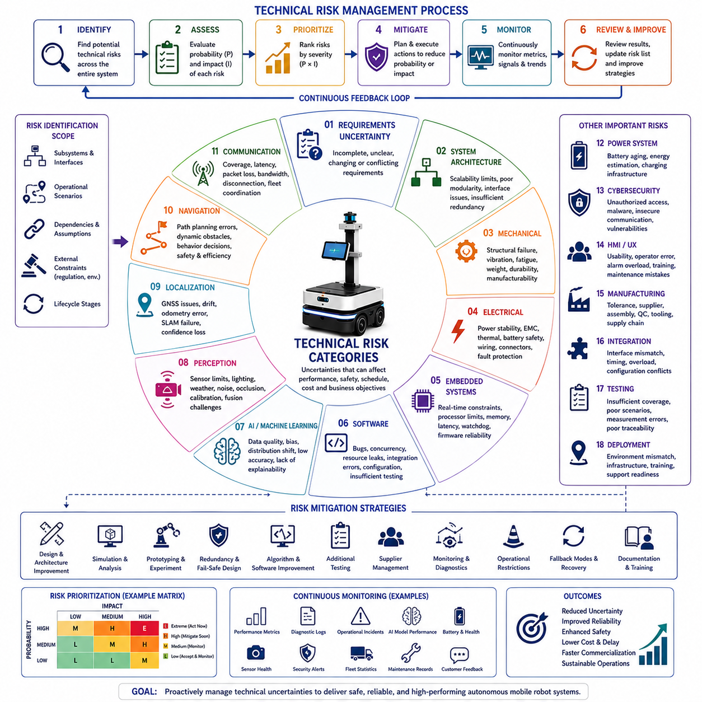
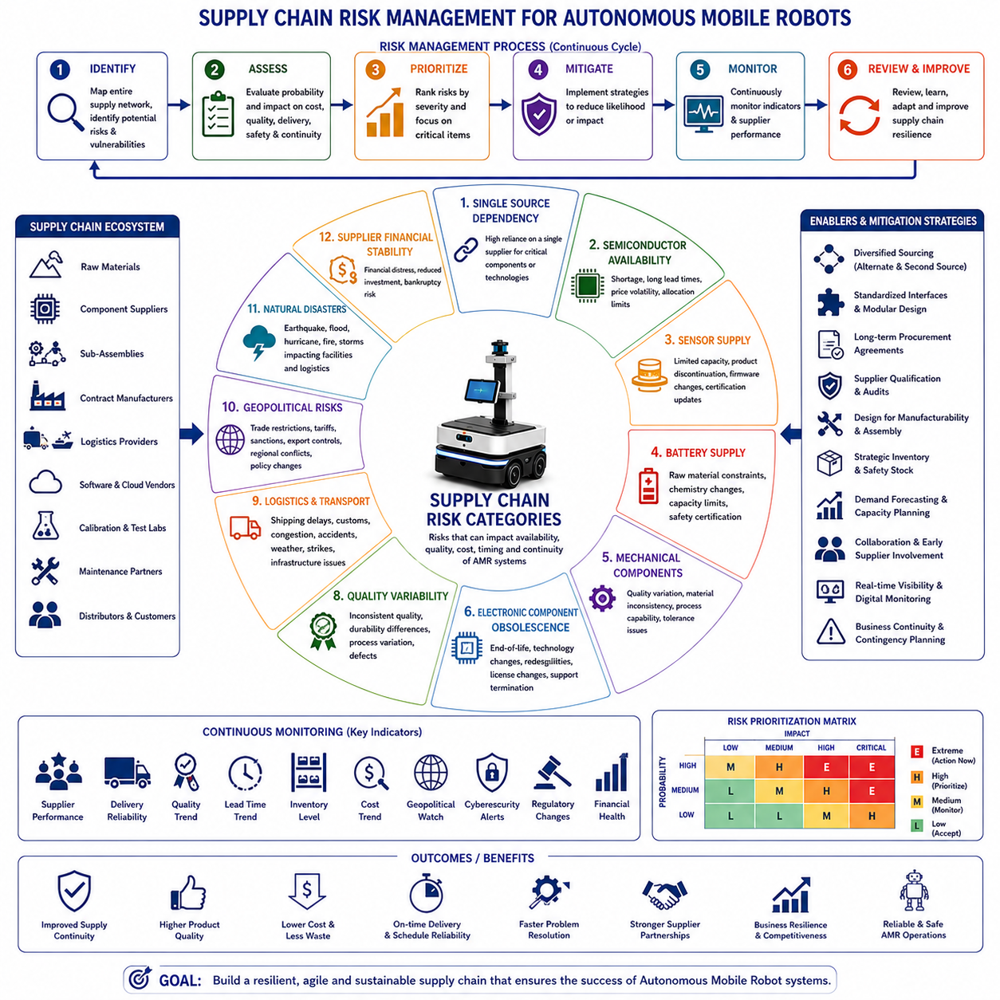
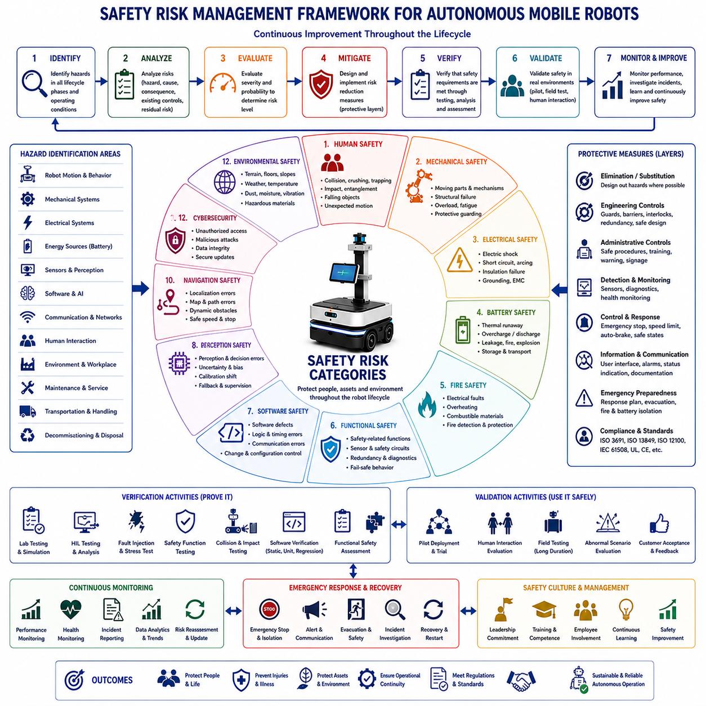
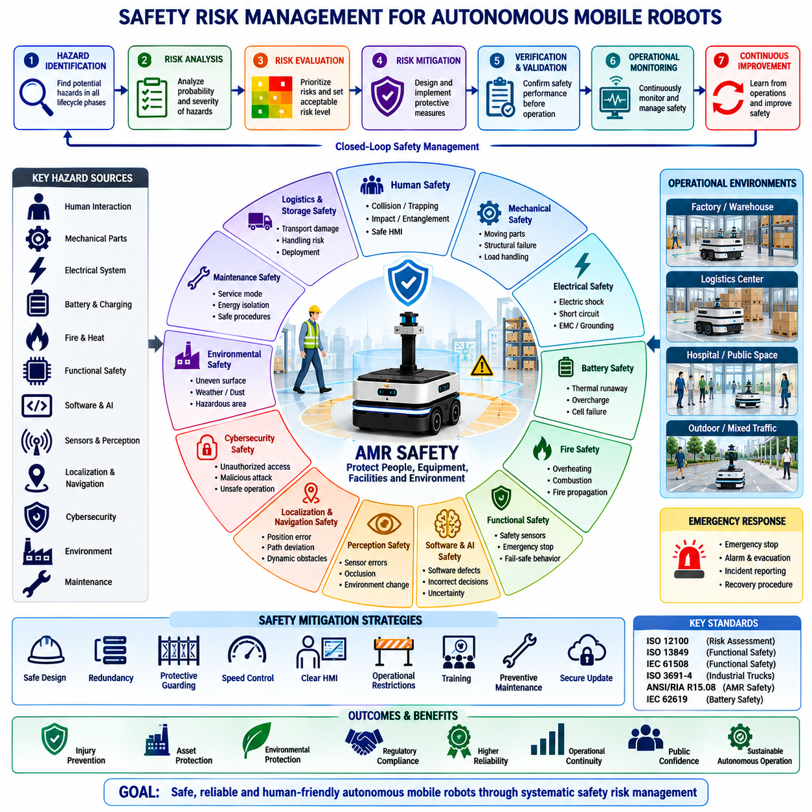
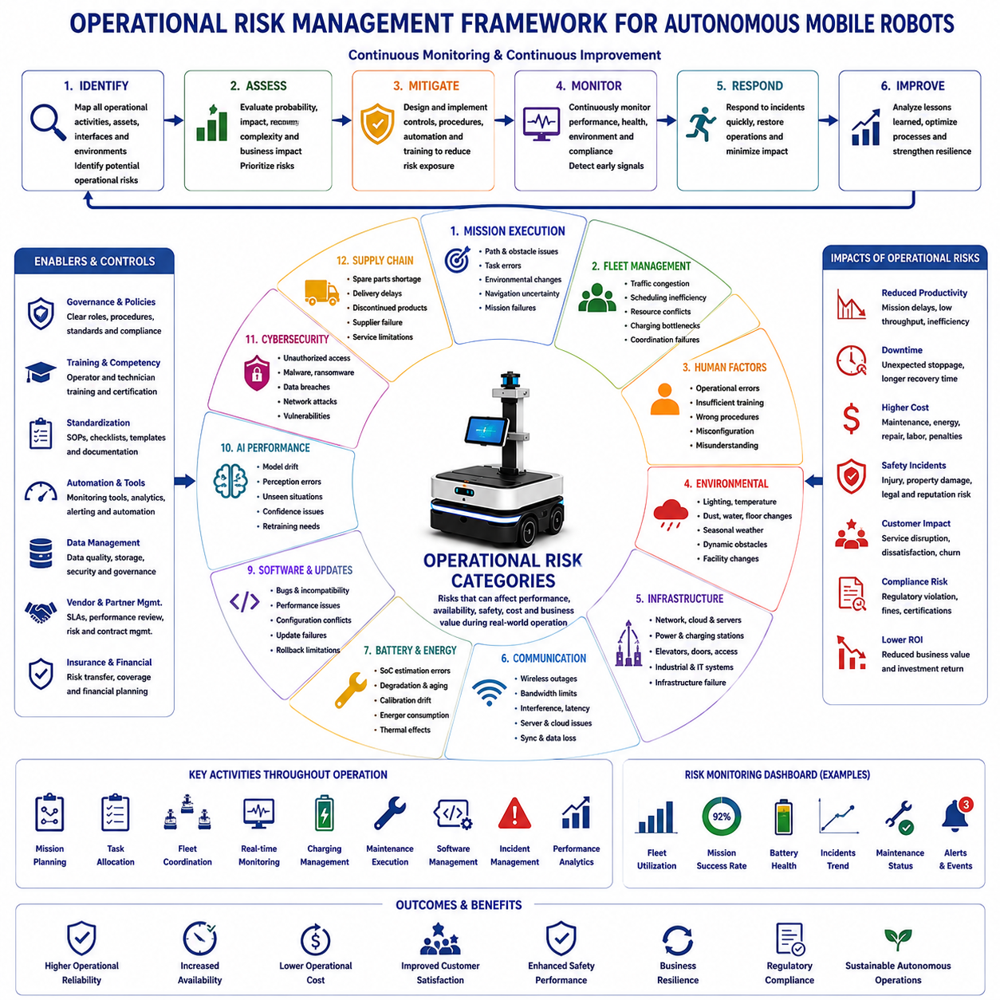
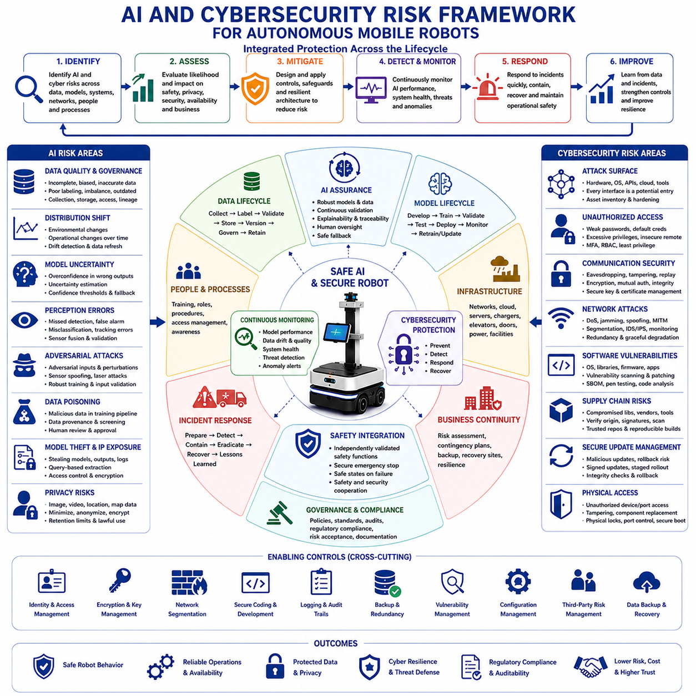

**Volume 01. AMR Foundations and System Architecture**

# 24. AMR Risk Management · AMR 리스크 관리

## 24.01 Technical Risks · 기술 리스크

{width="7.268055555555556in" height="7.268055555555556in"}

Technical risks represent uncertainties that may prevent an Autonomous Mobile Robot from achieving its intended performance, reliability, safety, schedule, or commercial objectives. Every robotics project involves numerous technical assumptions regarding hardware capabilities, software maturity, artificial intelligence performance, sensing technologies, communication reliability, manufacturing feasibility, and environmental adaptability. If these assumptions prove incorrect, the resulting consequences may include system redesign, project delays, increased development costs, degraded performance, certification difficulties, or operational failures. Technical risk management therefore becomes a continuous engineering activity that begins during concept development and continues throughout design, implementation, testing, deployment, and long-term maintenance.

Technical risk identification begins with a systematic examination of the complete system architecture. Engineers evaluate every subsystem, interface, dependency, operational scenario, and external constraint to identify potential sources of uncertainty before implementation begins. Mechanical structures, electrical systems, embedded controllers, perception sensors, localization algorithms, navigation software, communication infrastructure, power systems, cloud services, manufacturing processes, and maintenance strategies are reviewed individually as well as collectively. Cross-disciplinary interactions frequently introduce risks that are not visible when individual subsystems are evaluated independently, making system-level analysis essential for comprehensive risk identification.

Requirements uncertainty represents one of the earliest sources of technical risk. Incomplete, ambiguous, conflicting, or continuously changing requirements can propagate throughout the entire engineering process, forcing repeated redesign and delaying project completion. Requirements that cannot be objectively measured or verified often produce inconsistent interpretations among development teams. Effective requirement management therefore emphasizes completeness, consistency, traceability, measurable acceptance criteria, stakeholder agreement, and formal change control to minimize downstream engineering uncertainty.

System architecture risk arises when the selected architecture cannot adequately satisfy future operational demands or technology evolution. An architecture that tightly couples hardware and software may limit scalability, while insufficient modularity can complicate maintenance and future upgrades. Inadequate interface definitions, poor subsystem partitioning, limited computational capacity, or insufficient redundancy may reduce long-term system flexibility. Architecture evaluations therefore consider future product expansion, component replacement, performance growth, software portability, maintainability, and integration complexity before implementation begins.

Mechanical engineering risks include structural failure, excessive vibration, insufficient stiffness, fatigue, thermal deformation, excessive weight, inadequate payload capacity, poor manufacturability, maintenance inaccessibility, and environmental durability limitations. Mobile robots operating in industrial environments encounter repeated mechanical loading, collisions, uneven terrain, dust, moisture, temperature variation, and continuous vibration. Mechanical design therefore requires extensive structural analysis, finite element simulation, prototype testing, accelerated life testing, and field validation to reduce uncertainty before production.

Electrical engineering risks primarily concern power distribution, electromagnetic compatibility, thermal management, battery safety, wiring reliability, connector integrity, motor control stability, sensor integration, and protection against electrical faults. Inadequate grounding, unstable power supplies, voltage transients, thermal overload, insufficient circuit protection, or electromagnetic interference may produce unpredictable system behavior that affects software performance, sensor accuracy, and safety functions. Electrical validation therefore includes laboratory testing, environmental qualification, fault injection, and long-duration reliability evaluation.

Embedded system risks originate from deterministic control requirements, processor limitations, memory constraints, communication latency, scheduling behavior, interrupt management, watchdog implementation, firmware reliability, and hardware abstraction. Real-time embedded software must consistently satisfy strict timing constraints while controlling actuators and monitoring safety mechanisms. Timing instability or resource contention may produce intermittent failures that remain difficult to reproduce. Extensive timing analysis, hardware-in-the-loop testing, and deterministic scheduling verification significantly reduce embedded software risks.

Software engineering introduces numerous technical risks associated with increasing system complexity. Software defects, architectural inconsistencies, concurrency issues, memory leaks, resource exhaustion, dependency conflicts, configuration errors, insufficient testing, undocumented interfaces, and inadequate version management may degrade operational reliability. Since robotics software continuously interacts with physical systems, relatively minor programming errors may produce significant operational consequences. Modular architecture, automated testing, continuous integration, code reviews, static analysis, and disciplined configuration management therefore become essential mitigation strategies.

Artificial intelligence introduces additional uncertainty because learned models behave differently from deterministic algorithms. AI performance depends heavily upon dataset quality, environmental diversity, labeling accuracy, computational resources, sensor characteristics, and operational conditions. Distribution shifts between training data and deployment environments may significantly reduce detection accuracy, classification reliability, object tracking stability, or decision quality. AI risk management therefore emphasizes representative datasets, independent validation datasets, uncertainty estimation, explainability where appropriate, continuous monitoring, periodic retraining, and fallback operational strategies whenever confidence becomes insufficient.

Perception risks originate from sensor limitations and environmental variability. Cameras may experience changing illumination, shadows, glare, motion blur, rain, snow, fog, dust, or lens contamination. LiDAR sensors encounter reflective surfaces, environmental interference, weather effects, and range limitations. Radar performance varies according to object characteristics and environmental conditions, while ultrasonic sensors have limited spatial resolution. Multi-sensor fusion reduces individual sensor weaknesses but introduces additional synchronization, calibration, computational, and integration challenges that require careful engineering management.

Localization risks directly influence autonomous navigation capability. Global Navigation Satellite Systems may experience multipath interference, urban canyon effects, signal blockage, or atmospheric disturbances. Simultaneous Localization and Mapping algorithms may drift during long-distance operation or within repetitive environments lacking distinctive features. Wheel odometry accumulates measurement error over time, while inertial sensors gradually drift due to integration error. Robust localization therefore combines multiple complementary sensing technologies while continuously evaluating localization confidence and recovery capability under degraded operating conditions.

Navigation risks involve route planning, obstacle avoidance, path execution, traffic coordination, and behavioral decision-making. Dynamic environments containing pedestrians, vehicles, forklifts, changing obstacles, narrow passages, temporary construction, or unexpected operational changes may invalidate previously planned routes. Navigation algorithms must balance efficiency, safety, comfort, computational performance, and regulatory compliance while continuously adapting to environmental changes. Simulation, scenario-based testing, and extensive field trials reduce navigation uncertainty before commercial deployment.

Communication risks affect both individual robots and fleet operations. Wireless networks experience coverage limitations, bandwidth constraints, interference, latency variation, packet loss, and temporary disconnections. Distributed fleet management systems require synchronized communication among robots, cloud services, operator interfaces, and enterprise infrastructure. Communication failures may delay mission execution, interrupt coordination, reduce situational awareness, or prevent remote supervision. Redundant communication paths, local autonomy, buffered mission execution, and graceful degradation strategies improve communication resilience.

Power system risks influence operational endurance, reliability, and safety. Battery aging gradually reduces available capacity, while extreme temperatures affect charging efficiency and discharge performance. High computational workloads, frequent acceleration, payload variation, and auxiliary equipment increase energy consumption beyond predicted values. Charging infrastructure failures or inaccurate battery state estimation may interrupt operational availability. Comprehensive battery characterization, thermal analysis, energy modeling, charging validation, and predictive maintenance significantly reduce power-related uncertainty.

Cybersecurity risks continue increasing as autonomous robots become more connected. Unauthorized access, malware, software supply chain vulnerabilities, insecure communication, credential compromise, denial-of-service attacks, and unauthorized software modification may disrupt operations or compromise safety. Cybersecurity engineering therefore integrates secure software development, authentication, encrypted communication, access control, software signing, vulnerability management, penetration testing, secure update mechanisms, and continuous monitoring throughout the system lifecycle rather than treating security as an afterthought.

Human-machine interaction introduces technical risks associated with usability, operator misunderstanding, inappropriate automation, training deficiencies, interface complexity, alarm overload, maintenance errors, and operational confusion. Even technically correct systems may fail if operators cannot interpret robot behavior or respond appropriately during abnormal situations. User-centered interface design, operational procedures, simulator-based training, usability evaluation, and clear diagnostic information reduce these risks while improving operational effectiveness.

Manufacturing risks emerge when engineering designs cannot be produced consistently at acceptable cost or quality. Component tolerances, supplier variability, assembly complexity, calibration procedures, inspection capability, production tooling, quality control, and supply chain stability all influence manufacturing success. Designs optimized solely for prototype performance may require substantial modification before mass production becomes economically feasible. Design for Manufacturing and Design for Assembly methodologies reduce production uncertainty during early engineering phases.

Integration risks frequently represent the largest technical challenge in multidisciplinary robotics projects. Individually successful hardware and software components may exhibit unexpected interactions when integrated into complete robotic systems. Timing inconsistencies, interface mismatches, computational overload, synchronization failures, configuration conflicts, and environmental dependencies often emerge only during full-system integration. Incremental integration strategies, interface standardization, continuous integration pipelines, system simulation, and comprehensive integration testing significantly reduce these complex cross-domain risks.

Testing risks arise when verification activities fail to represent actual operational conditions. Laboratory environments may oversimplify environmental complexity, while insufficient test coverage leaves critical failure modes undiscovered. Poor measurement accuracy, incomplete documentation, inconsistent test procedures, or inadequate regression testing reduce confidence in engineering conclusions. Risk-based testing strategies prioritize high-consequence scenarios while maintaining objective evidence, repeatability, traceability, and comprehensive operational coverage throughout validation activities.

Deployment risks become significant when validated systems encounter unforeseen customer environments. Infrastructure differences, wireless coverage, lighting variation, floor conditions, operational workflows, maintenance capability, human behavior, environmental hazards, and organizational readiness all influence deployment success. Pilot installations, staged deployment, continuous monitoring, customer training, operational support, and structured feedback mechanisms reduce deployment uncertainty while enabling continuous improvement after commercial introduction.

Risk prioritization enables engineering organizations to allocate resources efficiently by considering both probability and consequence. High-probability events with severe operational consequences require immediate mitigation, while lower-priority risks may be monitored until additional evidence becomes available. Quantitative and qualitative risk assessment techniques support objective decision-making by comparing technical uncertainty across multiple engineering disciplines. Periodic risk reviews ensure that mitigation activities remain aligned with evolving project status and emerging technological challenges.

Risk mitigation transforms identified uncertainties into controlled engineering activities. Mitigation strategies include architectural redesign, technology substitution, prototype evaluation, simulation, laboratory experimentation, redundancy implementation, algorithm improvement, supplier diversification, additional testing, operational restrictions, preventive maintenance, monitoring systems, fallback operating modes, and enhanced documentation. Every mitigation activity should include measurable success criteria so that residual risk can be evaluated objectively before proceeding to subsequent development phases.

Continuous risk monitoring extends throughout the operational lifetime of the robotic system. Performance metrics, diagnostic logs, maintenance records, software updates, customer feedback, operational incidents, AI model behavior, battery health, sensor degradation, cybersecurity alerts, and fleet statistics continuously provide new information regarding emerging technical risks. Organizations that maintain structured monitoring processes can identify gradual degradation before failures occur, enabling predictive maintenance, targeted software improvements, proactive component replacement, and sustained operational reliability.

An effective technical risk management process therefore integrates identification, assessment, prioritization, mitigation, monitoring, and continuous improvement into every stage of the engineering lifecycle. Rather than attempting to eliminate all uncertainty, successful robotics organizations systematically reduce the likelihood and consequences of technical failures through disciplined engineering practices, objective evidence, cross-functional collaboration, and continuous operational learning. This proactive approach enables Autonomous Mobile Robot systems to achieve higher reliability, improved safety, reduced development costs, accelerated commercialization, and sustainable long-term operational success.

## 24.02 Supply Chain Risks · 공급망 리스크

{width="7.268055555555556in" height="7.268055555555556in"}

Supply chain risks represent uncertainties that may interrupt the availability, quality, cost, timing, or continuity of materials, components, services, manufacturing resources, and logistics required to develop and operate Autonomous Mobile Robot systems. Modern robotics products depend upon globally distributed suppliers providing mechanical parts, electronic components, batteries, sensors, semiconductors, embedded computers, communication devices, software licenses, manufacturing equipment, and specialized engineering services. Disruptions affecting any critical element may delay development schedules, increase production costs, reduce product quality, limit manufacturing capacity, or interrupt customer deliveries. Effective supply chain risk management therefore becomes a strategic engineering discipline integrated throughout the entire product lifecycle.

Supply chain risk identification begins with comprehensive visibility across the complete procurement network. Organizations analyze raw materials, component suppliers, contract manufacturers, logistics providers, software vendors, calibration laboratories, testing facilities, cloud service providers, maintenance partners, and distribution channels. Every dependency is evaluated according to its operational importance, replacement difficulty, geographic concentration, lead time, financial stability, technical capability, and historical performance. Comprehensive mapping of the supply network enables engineering organizations to identify vulnerabilities before they develop into operational disruptions.

Single-source dependency represents one of the highest supply chain risks for robotics systems. Many specialized components such as LiDAR sensors, industrial cameras, precision actuators, embedded GPUs, safety controllers, or custom integrated circuits may be available from only one qualified supplier. If that supplier experiences production interruption, financial instability, geopolitical restrictions, quality failures, or capacity shortages, the entire robotics program may be delayed. Engineering organizations therefore evaluate alternative suppliers, compatible substitute components, second-source qualification, and modular hardware architectures to reduce dependence on individual vendors.

Semiconductor availability has become a major concern for modern robotics platforms. Autonomous Mobile Robots rely upon high-performance processors, graphics processing units, memory devices, power management integrated circuits, communication chips, motor controllers, and programmable logic devices. Global semiconductor shortages may increase lead times from several weeks to many months while significantly increasing procurement costs. Product architecture therefore benefits from flexible processor selection, software portability, inventory planning, and long-term procurement agreements that reduce exposure to semiconductor market fluctuations.

Sensor supply risks directly influence robotic perception capability. Cameras, LiDAR systems, radar modules, inertial measurement units, GNSS receivers, ultrasonic sensors, force sensors, encoders, and safety scanners frequently require specialized manufacturing processes with limited global production capacity. Component discontinuation, firmware changes, calibration differences, regulatory certification updates, or manufacturing defects may require redesign of hardware interfaces and software algorithms. Long-term sensor management therefore includes lifecycle monitoring, compatibility validation, supplier communication, and early qualification of replacement technologies.

Battery supply chain risks significantly affect production planning and long-term operational support. Lithium-based battery cells depend upon raw materials including lithium, nickel, cobalt, graphite, and rare earth elements, all of which experience fluctuating global demand, geopolitical influence, environmental regulations, and mining limitations. Battery manufacturers may also modify cell chemistry, dimensions, charging characteristics, or safety certifications during product evolution. Battery risk mitigation therefore includes qualified alternative suppliers, standardized battery interfaces, comprehensive battery validation, inventory planning, and long-term supplier partnerships.

Mechanical component supply risks involve structural materials, precision machining, castings, bearings, gears, fasteners, suspension systems, wheels, tires, sealing materials, and custom fabricated assemblies. Manufacturing quality may vary among suppliers due to process capability, material consistency, dimensional tolerances, inspection methodology, or workforce experience. Changes in manufacturing equipment, subcontractors, or raw material sources may unintentionally affect product performance. Supplier qualification therefore extends beyond component inspection to include manufacturing process audits, quality management evaluation, and long-term production monitoring.

Electronic component obsolescence introduces continuous challenges throughout the robotics product lifecycle. Manufacturers periodically discontinue integrated circuits, communication modules, sensors, memory devices, displays, connectors, and power electronics as new product generations become available. Unexpected end-of-life announcements may require redesign of printed circuit boards, firmware updates, software modifications, regulatory recertification, and additional validation activities. Proactive lifecycle management continuously monitors supplier product roadmaps while identifying replacement components before discontinuation affects production.

Software supply chain risks have become increasingly important as robotics systems integrate numerous third-party software libraries, middleware frameworks, operating systems, artificial intelligence models, cloud platforms, cybersecurity tools, and commercial development environments. Security vulnerabilities, licensing changes, discontinued support, incompatible software updates, dependency conflicts, or supplier business failures may introduce operational instability. Comprehensive software governance therefore includes version control, dependency management, software bill of materials documentation, cybersecurity monitoring, licensing compliance, and controlled update procedures.

Quality variability among suppliers presents substantial engineering uncertainty. Components satisfying dimensional specifications may still differ in long-term durability, environmental resistance, electrical characteristics, calibration stability, or manufacturing consistency. Small quality variations accumulated across multiple suppliers may significantly affect overall system reliability. Incoming inspection, statistical process control, supplier quality audits, corrective action management, and continuous performance monitoring enable organizations to detect quality trends before they influence customer operations.

Logistics risks affect the movement of components throughout the global supply network. International shipping delays, customs clearance procedures, port congestion, transportation accidents, fuel price fluctuations, weather conditions, labor strikes, infrastructure failures, or regulatory restrictions may interrupt material flow despite successful manufacturing. Logistics planning therefore considers transportation alternatives, regional distribution centers, safety stock, delivery prioritization, route diversification, and real-time shipment monitoring to improve supply continuity.

Geopolitical uncertainty increasingly influences robotics supply chains operating across multiple countries. International trade restrictions, export control regulations, economic sanctions, regional conflicts, diplomatic tensions, import tariffs, and changing government policies may restrict access to critical technologies or manufacturing resources. Engineering organizations therefore evaluate geographic diversification, regional manufacturing capability, regulatory compliance, export licensing, and strategic sourcing policies to reduce geopolitical exposure while maintaining operational flexibility.

Natural disasters create unpredictable disruptions affecting manufacturing facilities, transportation infrastructure, communication networks, and utility services. Earthquakes, floods, hurricanes, wildfires, volcanic activity, severe storms, and other environmental events may simultaneously interrupt multiple suppliers located within the same geographic region. Business continuity planning therefore evaluates geographic concentration risks while encouraging diversified supplier locations, emergency response procedures, disaster recovery planning, and alternative manufacturing capabilities.

Supplier financial stability directly influences long-term production reliability. Financial difficulties may reduce manufacturing quality, delay technology investment, increase employee turnover, interrupt production capacity, or ultimately result in supplier bankruptcy. Engineering organizations continuously monitor supplier financial health, investment activity, market position, customer diversification, and long-term business strategy. Strategic supplier relationships emphasize collaboration, transparency, and mutual planning to reduce uncertainty associated with financial instability.

Capacity constraints frequently emerge when product demand exceeds manufacturing capability. Suppliers serving multiple industries may prioritize larger customers during periods of high demand, reducing available production capacity for robotics manufacturers. Sudden increases in market demand for semiconductors, batteries, sensors, or industrial electronics may extend procurement lead times significantly. Demand forecasting, collaborative production planning, long-term capacity reservations, and supplier communication enable organizations to secure manufacturing resources before shortages occur.

Manufacturing process changes performed by suppliers may unintentionally influence product performance. Equipment upgrades, process optimization, material substitution, inspection modifications, workforce changes, automation improvements, or factory relocation may introduce subtle differences that affect robotics system behavior. Engineering change notification procedures, first article inspection, process validation, and production qualification ensure that manufacturing modifications remain technically acceptable before volume production resumes.

Counterfeit components represent an increasing concern within global electronics supply chains. Unauthorized integrated circuits, memory devices, connectors, batteries, sensors, or communication modules may exhibit reduced reliability, inconsistent performance, cybersecurity vulnerabilities, or complete operational failure. Authorized distributors, component traceability, authenticity verification, incoming inspection, supplier certification, and secure procurement procedures significantly reduce exposure to counterfeit products while maintaining engineering confidence.

Inventory management balances component availability against financial efficiency. Excessive inventory increases storage costs, capital investment, and obsolescence risk, while insufficient inventory increases production interruptions and customer delivery delays. Robotics manufacturers typically combine demand forecasting, safety stock calculation, procurement scheduling, lifecycle monitoring, and inventory optimization models to maintain appropriate material availability while minimizing unnecessary inventory investment.

Supplier collaboration extends beyond purchasing relationships into long-term technical partnerships. Early supplier involvement during product development enables component optimization, manufacturability improvement, technology sharing, cost reduction, quality enhancement, and coordinated lifecycle planning. Regular engineering communication, joint design reviews, collaborative problem solving, supplier development programs, and shared improvement initiatives strengthen supply chain resilience while supporting continuous product innovation.

Risk assessment within supply chain management evaluates both probability and operational consequence for every identified vulnerability. Critical components with limited availability, long qualification cycles, or significant influence on safety receive higher priority than easily replaceable standard components. Risk matrices, supplier scorecards, procurement dashboards, and performance indicators provide objective decision support while enabling continuous monitoring of evolving supply conditions.

Supply chain resilience emphasizes the ability to maintain operational continuity despite disruptions. Resilient supply networks combine diversified sourcing, standardized interfaces, interchangeable components, modular system architectures, strategic inventory, digital visibility, predictive analytics, supplier partnerships, contingency planning, and rapid recovery capability. Rather than attempting to eliminate every disruption, resilient organizations develop adaptive engineering and operational strategies that minimize business impact while maintaining product quality and customer satisfaction.

Continuous monitoring remains essential because supply chain conditions evolve throughout the product lifecycle. Supplier performance metrics, delivery reliability, quality trends, market forecasts, geopolitical developments, technology roadmaps, inventory levels, logistics performance, cybersecurity incidents, regulatory changes, and financial indicators provide early warning signals for emerging risks. Engineering organizations use this information to initiate preventive actions before disruptions significantly affect production or customer operations.

An effective supply chain risk management process therefore integrates supplier selection, technical qualification, procurement strategy, quality assurance, logistics planning, inventory optimization, lifecycle management, business continuity planning, and continuous monitoring into a unified engineering framework. By proactively identifying vulnerabilities, evaluating operational impact, implementing mitigation strategies, and maintaining strong collaboration throughout the supply network, Autonomous Mobile Robot manufacturers achieve greater production stability, improved product quality, lower operational uncertainty, enhanced customer confidence, and sustainable long-term competitiveness in an increasingly complex global manufacturing environment.

## 24.03 Safety Risks · 안전 리스크

{width="7.268055555555556in" height="7.268055555555556in"}{width="7.268055555555556in" height="7.268055555555556in"}

Safety risks represent uncertainties and hazardous conditions that may cause injury, illness, property damage, environmental harm, operational disruption, or loss of life during the development, deployment, operation, maintenance, and decommissioning of Autonomous Mobile Robot systems. Unlike technical risks, which primarily affect system performance or project objectives, safety risks directly influence the protection of people, equipment, facilities, and surrounding environments. Effective safety risk management therefore extends beyond regulatory compliance and becomes a fundamental engineering responsibility integrated into every phase of the system lifecycle. Safe robotic systems are designed not only to perform intended tasks efficiently but also to minimize the probability and consequences of hazardous events under both normal and abnormal operating conditions.

Safety risk identification begins during the concept development phase by systematically examining potential hazards throughout the complete operational environment. Engineers analyze robot motion, mechanical structures, electrical systems, power sources, sensors, actuators, software behavior, artificial intelligence decisions, communication systems, maintenance activities, transportation procedures, and human interactions. Hazards are identified for normal operation, startup, shutdown, emergency conditions, maintenance, software updates, component failures, and environmental disturbances. Early identification enables hazards to be eliminated or significantly reduced before detailed engineering begins, preventing costly redesign during later development stages.

Hazard analysis provides the foundation of safety engineering by identifying hazardous situations, initiating events, affected personnel, possible consequences, existing protective measures, and remaining residual risks. Structured methodologies such as Hazard and Operability Study, Failure Mode and Effects Analysis, Fault Tree Analysis, Event Tree Analysis, and System-Theoretic Process Analysis support systematic hazard identification across multidisciplinary systems. Multiple analysis techniques are often combined because no single methodology adequately addresses every type of hazard encountered within complex autonomous robotic systems.

Human safety remains the highest priority throughout robotic system development. Autonomous Mobile Robots frequently operate alongside workers, visitors, contractors, maintenance personnel, and occasionally members of the public. Human safety risks include collision, crushing, trapping, impact, entanglement, falling objects, unexpected motion, reduced situational awareness, and improper operator intervention. Safety engineering therefore emphasizes predictable robot behavior, adequate warning systems, safe operating procedures, physical separation where appropriate, and intuitive human-machine interaction to minimize injury potential.

Mechanical safety risks arise from moving components, rotating mechanisms, lifting devices, articulated structures, payload handling equipment, exposed transmission systems, and structural failures. Excessive speed, unstable loads, mechanical fatigue, broken fasteners, bearing failures, wheel damage, suspension collapse, or unexpected structural deformation may create hazardous conditions. Mechanical safety engineering therefore incorporates protective guarding, mechanical stops, load limitations, structural redundancy where necessary, preventive maintenance, continuous inspection, and conservative design margins to reduce the probability of mechanical accidents.

Electrical safety risks involve high-current circuits, battery systems, charging equipment, motor drives, exposed conductors, insulation failure, short circuits, electrical arcing, electromagnetic interference, and grounding deficiencies. Improper electrical isolation may expose operators to electric shock, while thermal runaway within lithium batteries may generate fire or explosion hazards. Electrical safety measures include protective grounding, insulation monitoring, overcurrent protection, emergency disconnect devices, battery management systems, thermal monitoring, fault detection, and compliance with recognized electrical safety standards.

Battery safety has become increasingly important because modern Autonomous Mobile Robots rely primarily on high-energy lithium battery technologies. Battery hazards include thermal runaway, internal short circuits, mechanical damage, overcharging, excessive discharge, manufacturing defects, electrolyte leakage, fire propagation, and improper storage. Battery safety engineering integrates thermal analysis, battery management systems, charge balancing, protective enclosures, ventilation, temperature monitoring, emergency isolation, transportation procedures, and validated charging strategies to minimize energy storage hazards throughout the battery lifecycle.

Fire safety requires careful consideration because robotic systems combine electrical equipment, energy storage systems, combustible materials, lubricants, plastics, wiring insulation, and high-power electronics within relatively compact enclosures. Fire hazards may originate from electrical faults, overheating components, battery failures, external ignition sources, or environmental conditions. Fire prevention includes temperature monitoring, flame-resistant materials, compartment separation, automatic shutdown procedures, fire detection systems, emergency ventilation, and compatibility with facility fire protection infrastructure.

Functional safety addresses hazards resulting from malfunctioning electrical, electronic, or programmable systems responsible for safety-related functions. Safety sensors, emergency stop circuits, protective scanners, speed monitoring systems, safety controllers, braking systems, and redundant communication channels must operate reliably even when faults occur. Functional safety engineering emphasizes fault tolerance, redundancy, diagnostic coverage, fail-safe behavior, systematic validation, and compliance with internationally recognized functional safety standards throughout the entire development process.

Software safety risks arise because software increasingly controls nearly every aspect of robotic behavior. Programming defects, incorrect algorithms, concurrency failures, timing instability, memory corruption, communication errors, configuration mistakes, and unintended interactions may generate hazardous system behavior. Unlike hardware failures, software defects may remain dormant until specific operational conditions occur. Safety-oriented software development therefore incorporates formal requirements management, coding standards, independent verification, extensive testing, static analysis, regression testing, configuration control, and rigorous change management.

Artificial intelligence introduces unique safety challenges because learning-based systems make probabilistic rather than deterministic decisions. Perception errors, object misclassification, uncertain predictions, distribution shifts, incomplete training data, unexpected environmental conditions, and confidence estimation failures may influence navigation or operational decisions. AI safety engineering emphasizes representative datasets, uncertainty estimation, explainability where practical, continuous performance monitoring, confidence-based fallback strategies, human supervision during uncertain situations, and operational restrictions whenever prediction confidence becomes inadequate.

Perception safety depends upon reliable environmental understanding under diverse operating conditions. Cameras, LiDAR, radar, ultrasonic sensors, inertial measurement units, GNSS receivers, and sensor fusion algorithms collectively determine robot awareness of surrounding objects, people, infrastructure, and hazards. Sensor contamination, lighting variation, weather, reflections, vibration, electromagnetic interference, calibration drift, and synchronization errors may reduce perception accuracy. Robust sensor fusion, self-diagnostics, environmental monitoring, redundancy, and continuous calibration verification significantly improve perception safety.

Localization and navigation safety directly affect collision avoidance and operational reliability. Position estimation errors, map inaccuracies, localization drift, unavailable satellite signals, wheel slippage, temporary obstacles, dynamic environments, and changing infrastructure may cause robots to deviate from intended paths. Navigation safety therefore combines redundant localization methods, continuously evaluated confidence levels, obstacle prediction, conservative path planning, speed adaptation, emergency stopping capability, and recovery procedures whenever navigation confidence becomes insufficient.

Cybersecurity increasingly influences operational safety because unauthorized access may alter robot behavior or disable protective mechanisms. Malicious software, communication interception, unauthorized configuration changes, credential theft, denial-of-service attacks, or compromised software updates may introduce hazardous operating conditions. Secure authentication, encrypted communication, software signing, access control, network segmentation, intrusion detection, vulnerability management, secure update procedures, and continuous cybersecurity monitoring therefore become essential safety mechanisms rather than purely information technology functions.

Environmental safety risks depend heavily upon the operational context. Industrial facilities contain forklifts, heavy machinery, chemical storage, overhead cranes, hazardous materials, confined spaces, uneven surfaces, changing weather conditions, dust, moisture, vibration, temperature extremes, and variable lighting. Robots operating outdoors additionally encounter pedestrians, road traffic, animals, construction zones, vegetation, and seasonal environmental changes. Comprehensive environmental assessment enables engineering organizations to define appropriate operating limits and protective measures before deployment.

Human-machine interaction safety emphasizes predictable communication between robots and nearby personnel. Visual indicators, audible warnings, projected paths, user interfaces, operating instructions, emergency controls, maintenance procedures, and operator training collectively influence safe collaboration. Confusing interfaces, excessive alarm frequency, inconsistent robot behavior, unclear status information, or inadequate documentation may encourage unsafe human decisions. Human-centered design therefore improves both usability and operational safety simultaneously.

Maintenance activities frequently expose technicians to elevated safety risks because protective covers may be removed, energy sources disconnected, software modified, and diagnostic procedures performed while systems remain partially operational. Maintenance safety includes lockout-tagout procedures, stored energy isolation, service modes, maintenance documentation, specialized training, inspection checklists, tool requirements, and post-maintenance validation before returning equipment to service. Safe maintenance procedures significantly reduce occupational injury while improving long-term system reliability.

Emergency response planning prepares organizations to manage hazardous situations effectively when preventive measures prove insufficient. Emergency stop systems, evacuation procedures, communication protocols, incident reporting, medical response coordination, fire suppression, battery isolation, recovery procedures, and post-incident investigation should be clearly documented and regularly practiced. Well-designed emergency procedures minimize injury severity while supporting rapid restoration of safe operating conditions after incidents occur.

Safety verification confirms that protective measures satisfy established safety requirements before operational deployment. Verification activities include laboratory testing, simulation, hardware-in-the-loop evaluation, environmental qualification, fault injection, emergency stop validation, collision testing where appropriate, software verification, functional safety assessment, and integrated system testing. Objective evidence collected during verification demonstrates that identified hazards have been reduced to acceptable levels according to organizational and regulatory safety criteria.

Safety validation extends beyond technical verification by demonstrating that complete robotic systems operate safely within representative real-world environments. Pilot deployments, supervised operational trials, human interaction studies, long-duration field testing, abnormal scenario evaluation, and customer acceptance activities collectively confirm practical safety performance. Validation recognizes that real operational environments frequently contain uncertainties and human behaviors impossible to reproduce completely within laboratory settings.

Safety culture plays a decisive role in long-term operational success because engineering processes alone cannot eliminate every hazard. Organizations promoting transparent communication, incident reporting, continuous learning, management commitment, employee involvement, and proactive hazard identification consistently achieve stronger safety performance than organizations relying exclusively on regulatory compliance. Safety becomes a shared organizational value rather than merely a technical requirement.

Residual risk remains after all practical mitigation measures have been implemented. Engineering decisions therefore balance technical feasibility, operational performance, economic considerations, usability, and acceptable safety levels. Residual risks should be clearly documented, communicated to stakeholders, monitored throughout operation, and periodically re-evaluated as technologies, environments, operational procedures, and regulatory expectations evolve. Continuous improvement ensures that acceptable safety performance is maintained throughout the operational lifetime of the robotic system.

An effective safety risk management process therefore integrates hazard identification, risk assessment, protective design, verification, validation, operational monitoring, incident investigation, maintenance planning, cybersecurity protection, emergency preparedness, regulatory compliance, and continuous improvement into a unified engineering framework. Through systematic safety engineering supported by objective evidence, multidisciplinary collaboration, and lifecycle management, Autonomous Mobile Robot systems achieve reliable protection of people, equipment, facilities, and the surrounding environment while maintaining efficient, productive, and sustainable autonomous operation.

## 24.04 Operational Risks · 운영 리스크

{width="7.268055555555556in" height="7.268055555555556in"}

Operational risks represent uncertainties and adverse events that may reduce the effectiveness, reliability, safety, efficiency, availability, or business value of Autonomous Mobile Robot systems during real-world operation. Unlike technical risks that primarily originate during system development, operational risks emerge after deployment when robots interact continuously with people, infrastructure, changing environments, business processes, and organizational workflows. These risks influence not only robot performance but also production continuity, customer satisfaction, maintenance costs, regulatory compliance, and long-term return on investment. Effective operational risk management therefore combines engineering, operations management, maintenance planning, human factors, and continuous performance monitoring throughout the operational lifecycle.

Operational risk identification begins by analyzing every activity performed during normal system operation. Engineers examine mission execution, fleet coordination, charging operations, maintenance procedures, operator interaction, logistics workflows, emergency response, software updates, infrastructure availability, environmental conditions, and organizational processes. Each operational activity is evaluated according to its probability of failure, operational impact, recovery complexity, and influence on overall business objectives. Comprehensive operational mapping enables organizations to identify vulnerabilities before they interrupt daily production or customer services.

Mission execution risk arises whenever robots perform assigned tasks within dynamic environments. Unexpected obstacles, changing operational priorities, inaccurate task assignments, communication delays, navigation uncertainty, localization drift, payload instability, or environmental disturbances may prevent successful mission completion. Mission failures reduce productivity while increasing manual intervention requirements and operational costs. Robust mission planning, dynamic task allocation, continuous monitoring, automatic recovery procedures, and intelligent mission rescheduling significantly improve operational reliability under changing conditions.

Fleet management risks become increasingly significant as organizations deploy multiple robots operating simultaneously within shared environments. Traffic congestion, resource competition, communication conflicts, charging station bottlenecks, scheduling inefficiencies, synchronization failures, and centralized control limitations may reduce fleet productivity despite satisfactory performance of individual robots. Fleet optimization therefore requires intelligent coordination algorithms, scalable fleet management software, distributed decision-making capability, real-time monitoring, and adaptive scheduling strategies that continuously balance operational efficiency with system robustness.

Human operational errors remain among the most common sources of operational disruption. Incorrect mission assignments, improper robot startup procedures, inadequate maintenance practices, unauthorized software modifications, incorrect configuration changes, charging mistakes, insufficient operator training, and misunderstanding of robot capabilities may produce avoidable failures. Human-centered operational procedures, standardized work instructions, intuitive user interfaces, competency-based training, operational checklists, and decision support systems significantly reduce the probability of operator-induced incidents while improving overall operational consistency.

Environmental variability continuously influences operational performance because Autonomous Mobile Robots rarely operate under identical conditions every day. Lighting changes, temperature variation, humidity, dust accumulation, water exposure, seasonal weather, floor contamination, construction activities, furniture relocation, temporary storage areas, and unexpected obstacles may alter navigation behavior and perception accuracy. Continuous environmental monitoring, adaptive algorithms, preventive maintenance, and clearly defined operational limits enable robotic systems to maintain stable performance despite changing environmental conditions.

Infrastructure dependency introduces operational uncertainty because robotic systems rely upon numerous supporting resources throughout daily operation. Wireless communication networks, charging stations, cloud services, fleet servers, positioning infrastructure, electrical power, facility access systems, elevators, automatic doors, industrial control systems, and enterprise software collectively support robot functionality. Failure of any supporting infrastructure may interrupt otherwise healthy robotic systems. Operational resilience therefore depends upon infrastructure redundancy, preventive maintenance, backup systems, local autonomous capability, and clearly documented recovery procedures.

Communication failures significantly affect operational continuity in connected robotic systems. Temporary wireless outages, bandwidth limitations, network congestion, interference, cloud connectivity problems, server maintenance, cybersecurity incidents, or communication hardware failures may interrupt mission execution or fleet coordination. Operational architectures therefore increasingly incorporate local decision-making capability, buffered task execution, communication redundancy, graceful degradation strategies, and automatic synchronization following network restoration to minimize business disruption during communication failures.

Battery operational risks influence daily productivity because energy availability determines mission continuity and scheduling flexibility. Unexpected battery degradation, inaccurate state-of-charge estimation, charging station failures, charging queue congestion, improper charging behavior, temperature effects, excessive energy consumption, or battery balancing issues may reduce operational availability. Intelligent energy management integrates predictive battery health assessment, optimized charging schedules, workload balancing, thermal monitoring, and preventive battery replacement strategies to maximize fleet utilization while protecting battery longevity.

Maintenance-related operational risks emerge whenever preventive maintenance activities are delayed, incomplete, improperly executed, or entirely neglected. Mechanical wear, sensor contamination, calibration drift, battery aging, software inconsistencies, lubrication degradation, electrical connection failures, and cooling system contamination gradually reduce operational reliability. Structured preventive maintenance schedules, predictive diagnostics, automated health monitoring, maintenance documentation, spare parts planning, and technician certification significantly reduce unexpected downtime while extending equipment service life.

Software operational risks continue throughout the deployment lifecycle because software evolves through updates, feature additions, cybersecurity patches, and configuration modifications. New software releases may unintentionally introduce compatibility issues, performance degradation, configuration conflicts, unexpected interactions, or operational instability despite successful laboratory validation. Controlled software release management, staged deployment, rollback capability, configuration baselines, regression testing, and continuous monitoring ensure that software improvements do not compromise operational continuity.

Artificial intelligence operational risks arise because machine learning models continuously encounter operational scenarios different from those represented within training datasets. Changes in environmental appearance, operational behavior, object characteristics, seasonal conditions, or customer workflows may gradually reduce perception accuracy or decision quality. Continuous AI performance monitoring, periodic retraining, confidence estimation, operational feedback collection, and carefully managed model deployment maintain reliable AI performance while reducing the likelihood of unexpected operational degradation.

Localization and mapping risks influence long-term navigation stability. Facility modifications, temporary construction, relocated equipment, environmental wear, damaged landmarks, altered floor markings, or changing infrastructure gradually reduce localization accuracy if maps remain outdated. Scheduled map verification, automated change detection, incremental map updating, multi-sensor localization, and periodic navigation validation ensure consistent positioning accuracy throughout long-term operational deployment.

Cybersecurity operational risks increasingly affect business continuity because robotic systems frequently exchange operational information with enterprise infrastructure, cloud services, remote support platforms, and mobile devices. Unauthorized access, ransomware, malicious software, compromised credentials, network attacks, insecure remote access, software supply chain vulnerabilities, or data manipulation may interrupt operations or expose sensitive business information. Continuous vulnerability monitoring, access control, authentication, encrypted communication, incident response planning, and regular security updates integrate cybersecurity directly into operational risk management.

Supply chain disruptions continue affecting operations even after initial deployment. Spare part shortages, delayed component replacement, discontinued products, unavailable consumables, supplier bankruptcy, transportation interruptions, or maintenance contract limitations may significantly extend repair times. Long-term operational planning therefore includes spare inventory management, supplier diversification, lifecycle monitoring, service agreements, alternative sourcing strategies, and predictive procurement planning to minimize maintenance delays.

Regulatory compliance risks emerge as safety regulations, cybersecurity requirements, environmental standards, industrial practices, and certification expectations evolve over time. Operational procedures that initially satisfy regulatory requirements may require modification following legislative changes or revised industry standards. Continuous compliance monitoring, periodic audits, documentation updates, employee training, and proactive regulatory assessment enable organizations to maintain legal compliance without disrupting operational efficiency.

Business continuity risks extend beyond technical system failures by considering organizational resilience during unexpected events. Natural disasters, utility failures, pandemics, labor shortages, transportation disruptions, facility closures, supplier failures, and major infrastructure outages may interrupt robotic operations regardless of technical system health. Business continuity planning establishes contingency procedures, alternative operating modes, backup facilities, emergency communication plans, recovery priorities, and resource allocation strategies that enable organizations to restore critical operations rapidly after significant disruptions.

Operational data quality directly influences management decision-making throughout the robot lifecycle. Missing data, inaccurate sensor measurements, inconsistent logging, time synchronization errors, incomplete maintenance records, communication loss, database corruption, or poor data governance reduce confidence in operational analysis. Reliable operational analytics therefore require standardized data collection, synchronized timestamps, validation procedures, secure storage, backup strategies, and comprehensive data governance supporting trustworthy engineering and business decisions.

Performance degradation often develops gradually rather than appearing as sudden system failures. Reduced navigation efficiency, increasing mission completion time, declining battery capacity, growing localization uncertainty, sensor aging, communication instability, software resource consumption, or increasing maintenance frequency may indicate emerging operational problems long before critical failures occur. Continuous performance trending, predictive analytics, anomaly detection, health indicators, and long-term operational dashboards enable organizations to identify gradual deterioration before customer operations are significantly affected.

Incident management provides structured processes for responding to operational abnormalities. Every operational incident should be documented with observed symptoms, environmental conditions, affected systems, operational impact, corrective actions, recovery time, root cause analysis, preventive recommendations, and lessons learned. Systematic incident investigation improves organizational knowledge while reducing recurrence of similar operational failures. Effective incident management transforms operational experience into continuous engineering and organizational improvement.

Change management reduces operational risks associated with introducing modifications into active robotic systems. Hardware upgrades, software releases, infrastructure improvements, operational procedure revisions, AI model updates, configuration changes, and maintenance process modifications should follow controlled approval, testing, documentation, deployment, verification, and rollback procedures. Formal change management minimizes unintended operational consequences while enabling continuous technological improvement without disrupting customer operations.

Organizational readiness significantly influences operational success because technology alone cannot guarantee reliable daily performance. Management commitment, clearly defined responsibilities, operator competency, maintenance capability, technical support availability, spare parts management, documentation quality, communication effectiveness, and continuous training collectively determine operational maturity. Organizations with strong operational governance consistently achieve higher robot utilization, reduced downtime, improved safety performance, and greater customer satisfaction compared with organizations relying solely on technological capability.

Continuous operational monitoring remains fundamental throughout the service life of Autonomous Mobile Robots. Operational dashboards collect mission statistics, fleet utilization, battery health, navigation accuracy, communication quality, maintenance history, incident frequency, energy consumption, software status, environmental conditions, and business performance indicators. Engineering teams analyze these data continuously to detect emerging operational risks, optimize resource allocation, improve maintenance planning, refine operating procedures, and support evidence-based decision-making across the organization.

An effective operational risk management process therefore integrates operational planning, mission management, fleet coordination, maintenance strategy, infrastructure management, cybersecurity, business continuity, change management, incident response, organizational readiness, regulatory compliance, and continuous performance improvement into a unified operational framework. Through proactive identification of operational uncertainties, systematic monitoring of field performance, disciplined engineering practices, and continuous organizational learning, Autonomous Mobile Robot systems achieve higher operational reliability, greater business resilience, improved customer confidence, optimized lifecycle costs, and sustainable long-term autonomous operation across diverse industrial and commercial environments.

## 24.05 AI and Cybersecurity Risks · AI·사이버보안 리스크

{width="7.268055555555556in" height="7.268055555555556in"}

Artificial intelligence and cybersecurity risks represent interconnected uncertainties that may compromise the safety, reliability, privacy, integrity, availability, and operational performance of Autonomous Mobile Robot systems. Modern robots depend on machine learning models, perception algorithms, cloud platforms, wireless networks, remote support tools, software libraries, and continuous data exchange. Weaknesses in any of these elements may produce incorrect robotic decisions, unauthorized control, sensitive data exposure, operational disruption, or unsafe physical behavior. Effective risk management therefore treats AI assurance and cybersecurity protection as a unified lifecycle responsibility rather than as separate technical activities.

AI risk begins with the quality and suitability of training data. Incomplete datasets, inaccurate labels, limited environmental diversity, class imbalance, outdated examples, duplicated samples, or hidden collection bias may cause models to perform well during development but fail in actual operation. For Autonomous Mobile Robots, representative data should include different facilities, lighting conditions, object types, traffic patterns, weather conditions, sensor noise, human behaviors, and abnormal situations. Data governance must therefore control collection, labeling, validation, storage, access, versioning, and traceability throughout the AI lifecycle.

Distribution shift occurs when the operational environment differs from the conditions represented in the training dataset. A perception model trained in a clean warehouse may perform poorly in dust, darkness, rain, changing layouts, reflective surfaces, or crowded environments. Gradual changes such as equipment aging, seasonal appearance, new packaging, altered uniforms, or modified traffic patterns may also reduce model accuracy over time. Continuous field monitoring, drift detection, confidence assessment, periodic dataset refresh, and controlled retraining are required to maintain reliable AI behavior after deployment.

Model uncertainty creates additional risk because learned systems produce probabilistic outputs rather than guaranteed conclusions. A neural network may assign high confidence to an incorrect prediction, especially when it encounters unfamiliar objects or corrupted sensor data. If navigation or safety logic accepts such outputs without independent validation, the robot may take inappropriate action. AI architectures therefore require confidence thresholds, uncertainty estimation, rule-based safety constraints, redundant sensing, human escalation, and fallback modes that prevent uncertain predictions from directly creating hazardous behavior.

Perception errors may include missed detections, false alarms, incorrect classifications, inaccurate depth estimation, unstable tracking, segmentation failures, and delayed recognition. These errors can affect obstacle avoidance, localization, route planning, payload handling, inspection, and human interaction. Robust perception requires diverse validation scenarios, sensor fusion, environmental diagnostics, calibration monitoring, temporal consistency checks, and operational restrictions when visibility or sensor health falls below acceptable limits. AI outputs should be treated as evidence within a safety architecture rather than as unquestioned truth.

AI model explainability and traceability become important when engineers must understand why a robot made a specific decision. Complex deep learning models may be difficult to interpret, making fault investigation and regulatory assessment challenging. Complete records of model versions, training datasets, parameters, evaluation results, deployment dates, confidence outputs, and operational incidents provide essential evidence. Explainability methods may support analysis, but they should not replace objective performance testing, scenario validation, and documented engineering judgment.

Adversarial machine learning introduces risks when attackers intentionally manipulate model inputs or training data. Carefully designed visual patterns, altered signs, modified objects, laser interference, sensor spoofing, or digital perturbations may cause perception models to misclassify important features. Attackers may also poison training datasets or compromise model update pipelines. Defensive measures include trusted data sources, input validation, anomaly detection, secure sensor interfaces, adversarial testing, robust training, model integrity checks, and independent safety mechanisms that limit the consequences of manipulated AI outputs.

Data poisoning occurs when malicious or incorrect samples enter the training or retraining process. Even a small number of strategically modified examples may influence model behavior in specific conditions while leaving ordinary validation results apparently acceptable. Risks increase when organizations automatically collect field data and retrain models without rigorous review. Secure data provenance, approval workflows, dataset checksums, anomaly screening, access control, human review, and separation between operational data collection and production model release help protect the learning pipeline.

Model theft and intellectual property exposure may occur when attackers gain access to trained weights, inference interfaces, logs, model outputs, or development systems. Stolen models may reveal proprietary technology, customer-specific information, operational capabilities, or sensitive training patterns. Attackers may also reproduce model behavior through repeated queries. Encryption, restricted access, secure model storage, rate limiting, execution isolation, watermarking where appropriate, and monitoring of unusual inference activity reduce the likelihood of unauthorized model extraction.

Privacy risks arise because Autonomous Mobile Robots may collect images, video, audio, location data, facility maps, employee movement patterns, production information, customer assets, and operational records. Even when data collection supports navigation or inspection, unnecessary retention or weak access control may expose sensitive information. Privacy-oriented engineering should minimize data collection, limit retention periods, apply anonymization where feasible, define lawful usage, control access, encrypt stored information, and provide clear governance for sharing, deletion, and secondary use.

Cybersecurity risk begins with the attack surface created by connected hardware and software. Robots may contain embedded computers, operating systems, wireless interfaces, remote maintenance tools, web dashboards, application programming interfaces, cloud services, removable media, sensors, chargers, and enterprise connections. Every interface creates a potential entry point. Attack surface management therefore requires complete asset inventories, secure architecture, port and service reduction, network segmentation, hardening standards, vulnerability scanning, and continuous review whenever hardware or software configurations change.

Unauthorized access may allow attackers to observe, control, reconfigure, disable, or misuse robotic systems. Weak passwords, shared accounts, default credentials, exposed services, excessive privileges, insecure remote access, or missing authentication controls significantly increase this risk. Strong identity management includes unique user accounts, multifactor authentication, role-based access control, least-privilege authorization, credential rotation, session management, access logging, and rapid revocation when personnel roles change or devices are retired.

Communication security is essential because robotic systems exchange commands, maps, telemetry, software packages, diagnostic data, and operational information across wired and wireless networks. Unencrypted or poorly authenticated communication may be intercepted, modified, replayed, or redirected. Secure communication architectures use modern encryption, mutual authentication, certificate management, message integrity validation, replay protection, time synchronization, secure key storage, and carefully controlled trust relationships among robots, servers, cloud services, and operator devices.

Network attacks may include denial-of-service, traffic flooding, wireless jamming, address spoofing, man-in-the-middle interception, routing manipulation, and unauthorized network discovery. Such attacks may interrupt fleet coordination, delay safety messages, disable remote supervision, or isolate robots from supporting infrastructure. Resilient systems combine network segmentation, traffic monitoring, redundant communication, local autonomy, bandwidth prioritization, rate limiting, intrusion detection, and graceful degradation so that communication failures do not immediately create unsafe physical behavior.

Software vulnerabilities may exist in operating systems, drivers, middleware, libraries, firmware, web interfaces, containers, AI frameworks, and third-party applications. Known vulnerabilities can remain exploitable when updates are delayed or unsupported components continue in service. Effective vulnerability management requires software inventories, software bills of materials, security advisories, risk-based patching, penetration testing, code analysis, dependency monitoring, and documented exceptions when immediate updates are operationally impossible.

Software supply chain risk becomes critical when robotic systems depend upon external libraries, open-source packages, commercial modules, development tools, cloud services, and vendor firmware. A compromised supplier or malicious dependency may introduce hidden access, vulnerable code, corrupted updates, or stolen credentials. Secure development processes verify package origin, validate cryptographic signatures, restrict build environments, scan dependencies, review supplier practices, maintain trusted repositories, and preserve reproducible build records for released software.

Secure update management is necessary because robots require continuing corrections, security patches, AI model improvements, and feature releases. An attacker who compromises the update mechanism may distribute malicious code to an entire fleet. Updates should therefore be digitally signed, integrity checked, delivered through authenticated channels, tested before release, deployed in stages, monitored after installation, and reversible through verified rollback procedures. Update authority should remain tightly controlled and fully auditable.

Physical access risk should not be underestimated because robots operate in accessible industrial and public environments. Attackers or untrained personnel may connect unauthorized devices, remove storage media, access maintenance ports, reset systems, damage sensors, alter calibration, or replace components. Protective enclosures, tamper evidence, locked service interfaces, port control, secure boot, device authentication, maintenance authorization, physical inspection, and restricted service modes reduce the likelihood that local access becomes a cybersecurity compromise.

Secure boot and trusted execution help ensure that robotic computers run authorized software from startup. Without integrity protection, modified firmware, bootloaders, kernels, drivers, or AI models may operate without detection. Hardware roots of trust, signed firmware, measured boot, trusted platform modules, encrypted storage, protected keys, runtime integrity monitoring, and controlled recovery images establish confidence that system software has not been altered before or during operation.

Logging and monitoring support early detection of AI degradation and cybersecurity incidents. Relevant information includes authentication attempts, configuration changes, software versions, model confidence, sensor health, network anomalies, unusual commands, privilege changes, update activity, mission failures, and safety interventions. Logs must be synchronized, protected against alteration, retained according to policy, and analyzed for meaningful patterns. Excessive data without prioritization may hide important warnings, so monitoring systems should combine automated detection with clear escalation procedures.

Incident response prepares the organization to contain and recover from AI or cybersecurity failures. Response plans should define roles, communication channels, evidence preservation, isolation procedures, fleet shutdown criteria, credential revocation, software rollback, model replacement, customer notification, regulatory reporting, and restoration priorities. Exercises involving simulated attacks, corrupted models, unavailable cloud services, or compromised robots help verify that technical teams and operational personnel can respond effectively under pressure.

Safety and cybersecurity must be coordinated because a security incident can directly create physical hazards. An attacker who modifies speed limits, disables obstacle detection, changes maps, manipulates sensor data, or interrupts emergency communication may threaten people and property. Conversely, an overly aggressive security response may also create danger if it suddenly stops robots in traffic lanes or disables essential functions. Integrated engineering should define safe cyber-failure states, secure emergency controls, independent protective functions, and recovery procedures that preserve physical safety.

AI and cybersecurity verification require more than conventional functional testing. Evaluation should include adversarial scenarios, corrupted sensor inputs, data poisoning attempts, unauthorized access tests, privilege escalation, communication interception, update compromise, network disruption, model drift, low-confidence predictions, and recovery behavior. Penetration testing, red-team exercises, fault injection, simulation, hardware-in-the-loop testing, and controlled field trials provide objective evidence that protective mechanisms operate as intended.

Governance establishes accountability for AI and cybersecurity throughout the organization. Clear ownership is required for datasets, models, software components, credentials, infrastructure, vulnerabilities, incidents, and operational approvals. Policies should define acceptable data use, model release criteria, patch timelines, access rights, third-party requirements, risk acceptance authority, and audit responsibilities. Cross-functional reviews involving AI engineers, cybersecurity specialists, safety engineers, operators, legal personnel, and management improve decision quality and reduce gaps between technical domains.

Continuous monitoring is essential because threats, environments, datasets, and software dependencies change throughout the operational lifecycle. Model accuracy may decline, new attack methods may appear, vulnerabilities may be disclosed, credentials may be compromised, and suppliers may change their products. Organizations should continuously review operational metrics, security alerts, model behavior, threat intelligence, vulnerability information, incident records, access patterns, software inventories, and customer feedback to identify emerging risks before they cause major disruption.

An effective AI and cybersecurity risk management process integrates data governance, model assurance, privacy protection, secure architecture, identity management, network security, software supply chain control, update protection, monitoring, incident response, safety coordination, verification, and organizational governance into one lifecycle framework. Through disciplined engineering, continuous operational learning, independent protection layers, and evidence-based decision-making, Autonomous Mobile Robot systems can use advanced AI capabilities while maintaining secure, safe, reliable, and trustworthy operation across complex industrial and commercial environments.
