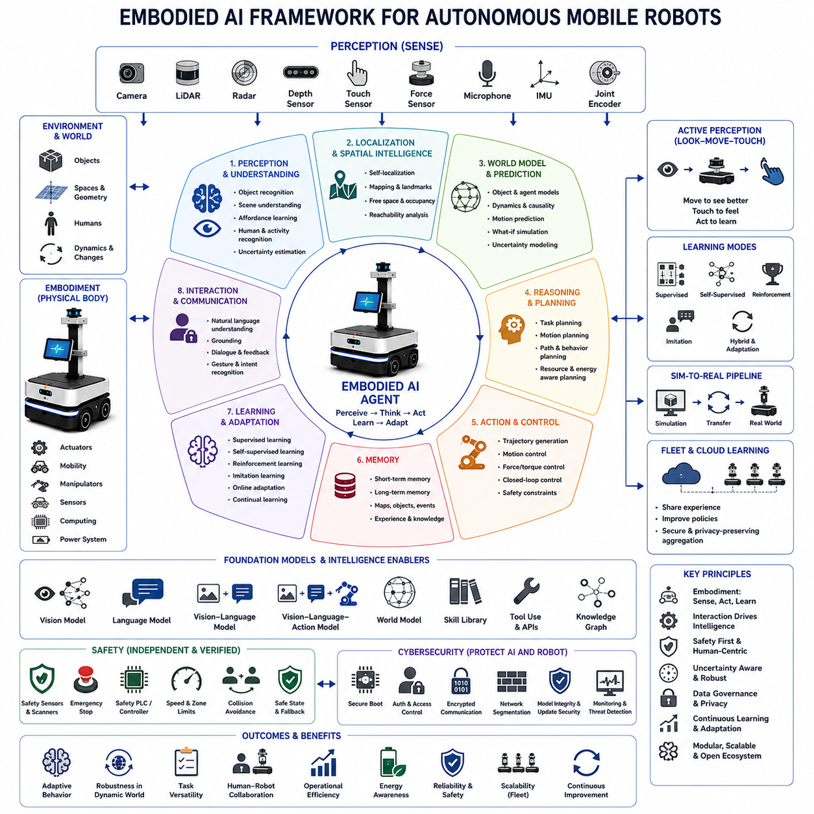
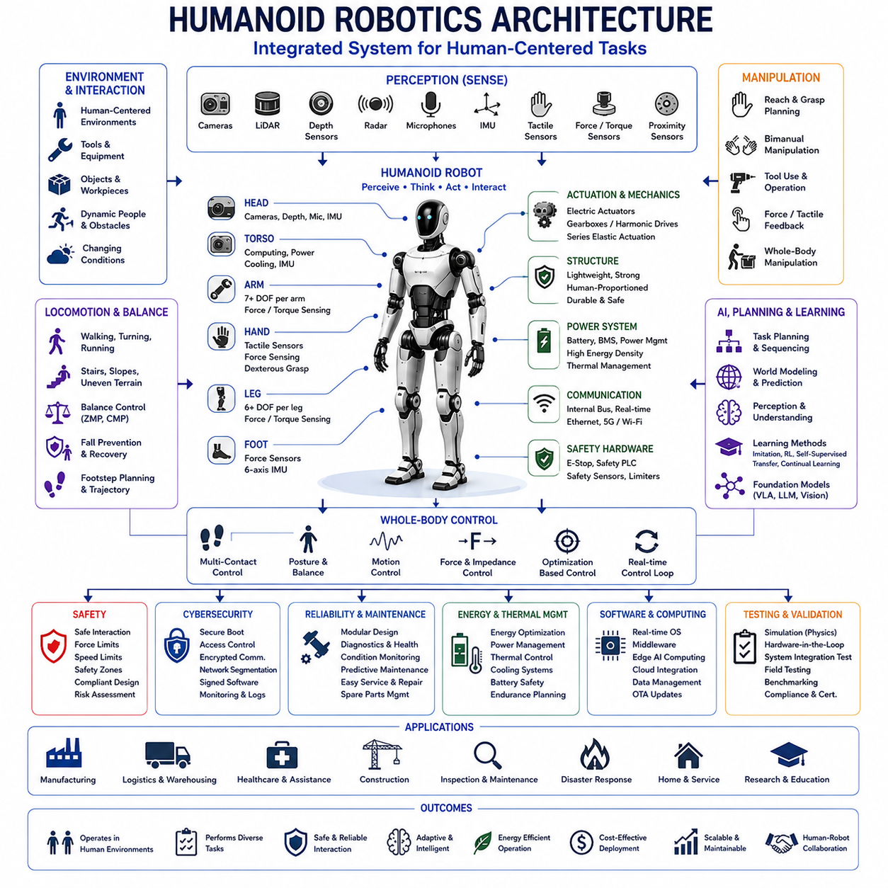
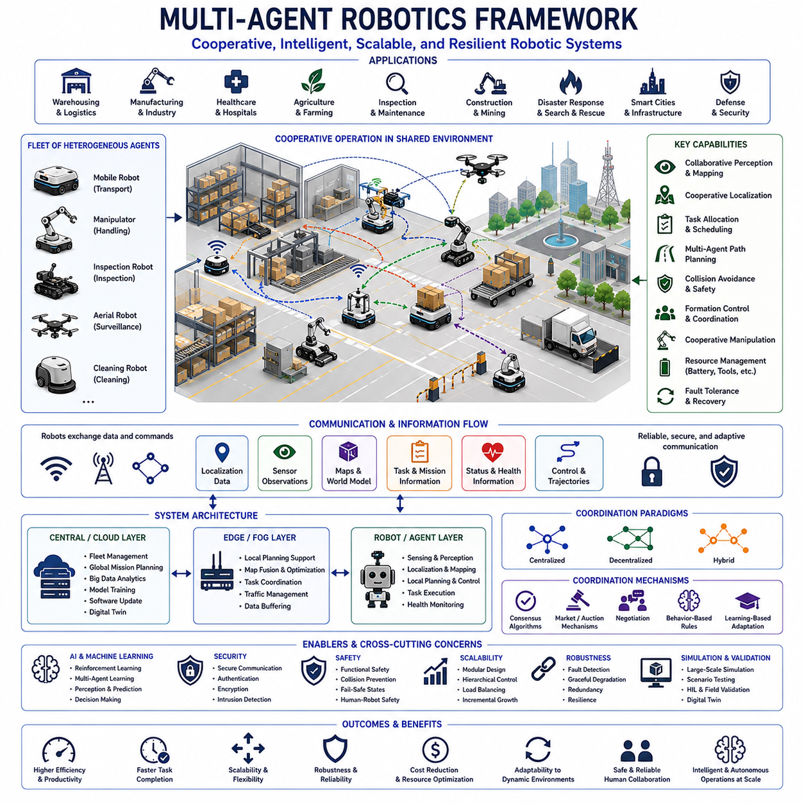
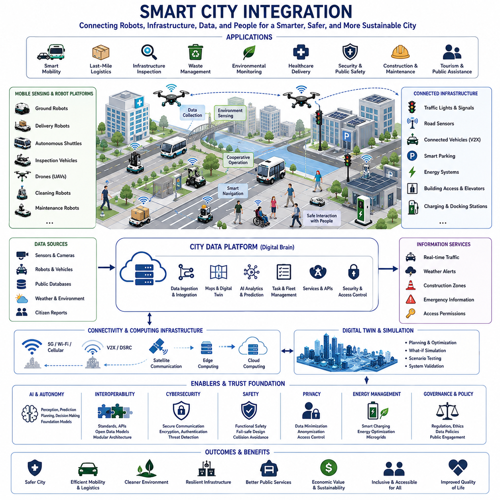
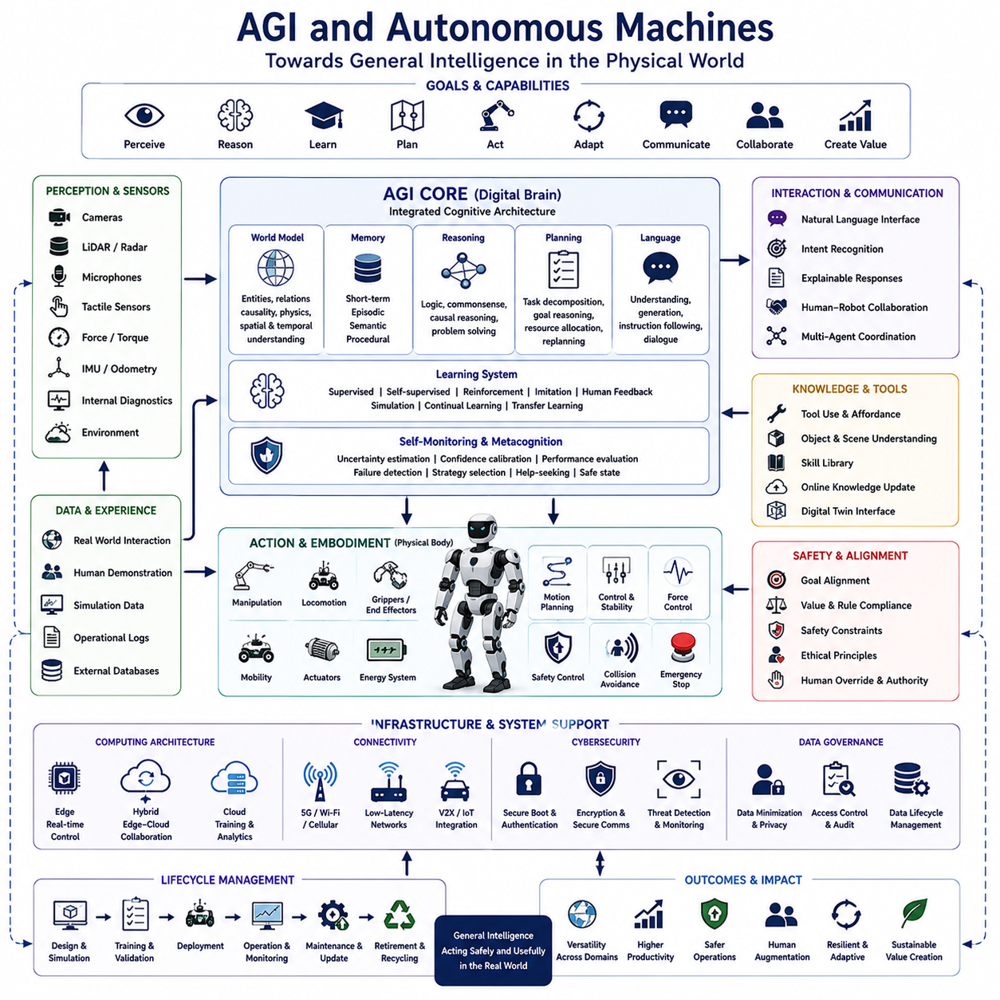

**Volume 01. AMR Foundations and System Architecture**


# 25. Future of AMR · AMR의 미래

##  

## 25.01 Embodied AI · 구현된 AI

{width="7.268055555555556in" height="7.268055555555556in"}

Embodied AI refers to artificial intelligence that learns, reasons, and acts through a physical body interacting continuously with the real world. Unlike conventional AI systems that operate mainly on static digital inputs, embodied systems perceive space, manipulate objects, navigate environments, and adapt their behavior according to physical feedback. Autonomous Mobile Robots, humanoid robots, robotic arms, service robots, and intelligent vehicles are representative platforms in which perception, cognition, and action are tightly connected.

The core principle of Embodied AI is that intelligence develops through interaction rather than through isolated data processing alone. A robot must observe its surroundings, interpret uncertain sensory information, choose an action, execute that action, and evaluate the resulting environmental change. This repeated perception-action loop enables the system to improve its understanding of objects, spaces, people, and operational constraints while building practical knowledge grounded in physical experience.

Embodiment gives artificial intelligence access to information that cannot be obtained completely from images, text, or offline datasets. Contact forces, friction, weight, balance, reachability, collision constraints, energy consumption, actuator delay, sensor occlusion, and environmental dynamics influence every physical task. By experiencing these conditions directly, a robot can learn relationships between actions and consequences that are essential for reliable operation in complex real-world environments.

An Embodied AI system typically combines perception, localization, world modeling, reasoning, planning, control, memory, and learning within one integrated architecture. Cameras, LiDAR, radar, depth sensors, tactile sensors, force sensors, microphones, inertial sensors, and joint encoders provide observations. These observations are transformed into representations that support object recognition, spatial understanding, motion prediction, task planning, and closed-loop control.

Perception in Embodied AI must extend beyond identifying isolated objects. The robot needs to understand free space, obstacles, surfaces, object affordances, human activity, motion, uncertainty, and relationships among entities. A box may be recognized not only as an object but also as something that can be carried, stacked, opened, or avoided. Such functional understanding enables the robot to connect visual observations with physically meaningful actions.

Spatial intelligence is another central capability because embodied agents operate within three-dimensional environments. Robots must estimate their own position, understand geometry, maintain maps, recognize landmarks, predict reachable regions, and reason about paths through changing spaces. Spatial representations may combine metric maps, semantic maps, topological relationships, object-level models, and dynamic occupancy information to support navigation and manipulation.

World models allow robots to predict how environments may change in response to actions. A useful world model represents objects, agents, geometry, motion, causality, and uncertainty while supporting both short-term control and long-term planning. When a robot predicts that pushing an object will clear a path or that a moving person may enter its route, it uses an internal model to evaluate potential futures before selecting an action.

Action is not merely the final output of an Embodied AI system but an important source of information. A robot may move closer to inspect an uncertain object, rotate a camera to reduce occlusion, touch a surface to estimate stiffness, or reposition itself to improve manipulation accuracy. This active perception strategy allows the robot to gather task-relevant information deliberately instead of relying only on passive observation.

Closed-loop control connects high-level intelligence with physical execution. Plans generated by reasoning systems must be translated into velocity commands, joint trajectories, grasp forces, steering angles, or actuator torques. Sensors continuously measure the difference between expected and actual behavior, allowing the controller to correct errors. Reliable embodied intelligence therefore depends on rapid feedback, stable control, accurate calibration, and predictable hardware response.

Learning for Embodied AI can occur through supervised learning, self-supervised learning, reinforcement learning, imitation learning, online adaptation, and combinations of these methods. Supervised methods provide labeled examples, while self-supervised approaches learn structure from raw sensor data. Reinforcement learning improves behavior through rewards, and imitation learning transfers demonstrations from human operators or expert controllers into reusable robot policies.

Reinforcement learning is particularly relevant because embodied agents must choose actions that influence future states. A robot may learn navigation, grasping, balancing, docking, or task sequencing by maximizing long-term reward. However, physical training is expensive and potentially unsafe, so practical systems often combine simulation, offline datasets, demonstrations, model-based planning, safety constraints, and limited real-world adaptation rather than relying on unrestricted trial and error.

Imitation learning reduces development effort by allowing robots to learn from expert demonstrations. Human operators may provide examples through teleoperation, kinesthetic teaching, motion capture, recorded trajectories, or natural-language instruction. The robot then learns patterns that map observations to actions. Effective imitation systems must generalize beyond the exact demonstrations and recover from states that were not represented during training.

Sim-to-real transfer is essential because large-scale learning is usually more practical in simulation than in physical environments. Simulators can generate diverse scenes, failures, lighting conditions, object arrangements, and motion scenarios without damaging equipment. However, differences between simulated and real sensors, dynamics, materials, timing, and environmental complexity create a reality gap that must be reduced through domain randomization, system identification, adaptation, and real-world validation.

Foundation models increasingly influence Embodied AI by providing broad representations learned from large-scale vision, language, video, audio, and robotics datasets. Vision-language models can connect visual observations with semantic concepts, while large language models can interpret goals, generate plans, explain decisions, and coordinate tools. Robotics foundation models extend these capabilities toward action prediction, manipulation, navigation, and cross-platform skill transfer.

Vision-language-action models integrate visual perception, language understanding, and control within a unified learning framework. Such models receive camera observations and task instructions, then generate actions or action sequences appropriate for the physical situation. Their potential lies in generalizing across objects, environments, and tasks, but dependable deployment still requires safety constraints, uncertainty management, hardware-aware control, and extensive validation under real operating conditions.

Natural-language interaction can make embodied systems more accessible to non-specialist users. An operator may request that a robot inspect a machine, move materials, check a storage area, or assist a worker using ordinary language. The robot must convert this instruction into grounded goals, identify relevant objects and locations, resolve ambiguity, generate a feasible plan, monitor execution, and communicate when clarification or assistance is required.

Grounding is the process of connecting abstract symbols or language to physical entities and actions. A command such as "bring the red container near the loading station" requires the robot to identify the correct container, understand the loading station, determine graspability, calculate a safe route, and confirm the destination. Grounding failures may produce incorrect actions even when language understanding appears semantically correct.

Memory supports long-duration embodied operation by preserving information about environments, objects, events, tasks, failures, and human preferences. Short-term memory helps maintain current task context, while long-term memory can store maps, object locations, learned procedures, maintenance history, and previous interactions. Effective memory architectures must update outdated information and distinguish reliable observations from uncertain or temporary conditions.

Multi-modal reasoning allows the robot to combine visual, spatial, linguistic, tactile, acoustic, and proprioceptive information. A robot inspecting industrial equipment may use images to identify a component, sound to detect abnormal vibration, thermal data to locate overheating, and force feedback to verify contact. Combining multiple modalities improves robustness because weaknesses in one sensor can be compensated for by complementary information.

Affordance learning helps robots understand what actions objects and environments permit. A handle affords pulling, a flat surface may support placement, a doorway permits passage only if the robot fits, and a charging connector requires precise alignment. Affordance representations connect perception with action feasibility and are particularly useful when robots encounter unfamiliar objects that share functional properties with previously observed examples.

Task and motion planning must operate together in Embodied AI. Task planning determines high-level steps such as navigate, pick, transport, inspect, and place, while motion planning calculates collision-free physical trajectories. A logically valid plan may still fail if the robot cannot reach an object, fit through a passage, maintain balance, or satisfy payload limits. Integrated planning therefore considers semantics, geometry, dynamics, and safety simultaneously.

Uncertainty is unavoidable because sensors are noisy, environments change, models are imperfect, and human behavior is difficult to predict. Embodied AI systems must estimate confidence in perception, localization, predictions, plans, and actions. When uncertainty exceeds acceptable limits, the robot should slow down, gather more information, request assistance, switch to a conservative fallback mode, or stop safely instead of continuing with unsupported assumptions.

Human-robot interaction is an essential part of embodied intelligence because robots frequently share environments and tasks with people. The robot must recognize human presence, predict motion, respect personal space, communicate intent, respond to gestures, and behave predictably. Trust depends not only on task performance but also on understandable motion, appropriate speed, clear warnings, and the ability to explain failures or request help.

Safety must remain independent from the probabilistic behavior of advanced AI models. Protective scanners, emergency stops, safety controllers, speed limits, collision avoidance, workspace restrictions, and validated braking functions should constrain learned policies. The AI system may optimize performance within a safe envelope, but it should not have unrestricted authority to override independently verified protective mechanisms.

Cybersecurity also becomes critical because embodied systems connect AI decisions to physical actions. Compromised models, malicious instructions, sensor spoofing, unauthorized access, corrupted updates, or manipulated maps may create direct physical hazards. Secure boot, authenticated communication, access control, software signing, network segmentation, model integrity verification, and continuous monitoring are necessary to protect both digital assets and physical operations.

Data collection for Embodied AI requires careful lifecycle management. Real-world robot data may include video, facility maps, employee movement, operational procedures, audio, and customer assets. Data governance must address consent, privacy, retention, anonymization, labeling quality, ownership, security, and secondary use. Representative data are necessary for learning, but uncontrolled collection can create legal, ethical, and cybersecurity risks.

Evaluation must measure more than isolated model accuracy. Embodied systems should be assessed according to task success, recovery capability, safety violations, efficiency, energy consumption, generalization, human intervention rate, reliability, and performance under environmental change. Scenario-based testing, simulation, controlled experiments, hardware-in-the-loop evaluation, and long-duration field trials collectively provide evidence of real operational capability.

Generalization remains one of the greatest challenges. A robot trained on limited facilities, objects, or workflows may fail when deployed in a new environment. Robust Embodied AI should transfer skills across layouts, lighting, payloads, platforms, and operating conditions while recognizing when previous knowledge is insufficient. Modular representations, foundation models, domain adaptation, continual learning, and explicit uncertainty handling support broader generalization.

Continual learning allows robots to improve after deployment as they encounter new objects, environments, and tasks. However, uncontrolled updates may cause catastrophic forgetting, unsafe behavior, or performance regression. Practical continual-learning systems require validated data pipelines, protected baseline models, staged updates, rollback capability, change approval, regression testing, and monitoring to ensure that new knowledge does not compromise established capabilities.

Fleet learning extends embodied intelligence from individual robots to groups of deployed systems. Experience collected by one robot can reveal rare obstacles, failure patterns, environmental changes, or improved strategies that benefit the entire fleet. Shared learning requires standardized data formats, secure aggregation, privacy protection, model compatibility, version control, and controlled distribution so that knowledge can improve fleet performance without spreading defects.

Digital twins can support Embodied AI by maintaining virtual representations of robots, facilities, missions, and operational conditions. A digital twin may be used to test software updates, simulate failure scenarios, analyze energy use, evaluate layout changes, or predict maintenance requirements. Synchronization between the physical system and its virtual representation improves planning and reduces the risk of modifying active robotic operations.

Edge computing is important because embodied systems require low-latency perception and control. Cameras, LiDAR, AI inference, localization, and motion control frequently operate directly on the robot, while cloud systems support fleet analytics, training, storage, and long-term optimization. Hybrid architectures must determine which decisions remain local for safety and responsiveness and which functions can depend on remote infrastructure.

Energy awareness influences embodied behavior because every physical action consumes battery capacity and affects mission availability. Intelligent robots can consider route length, payload, acceleration, terrain, processor load, charging availability, and battery health while planning tasks. Energy-aware reasoning improves fleet utilization and prevents situations in which task performance is optimized without considering operational endurance.

Embodied AI enables Autonomous Mobile Robots to move beyond fixed automation toward adaptive, context-aware operation. Robots can respond to changing obstacles, interpret human instructions, learn new workflows, inspect unfamiliar environments, and coordinate complex tasks. This flexibility is especially valuable in warehouses, factories, hospitals, construction sites, agriculture, logistics centers, public facilities, and outdoor industrial environments where rigid automation is difficult to maintain.

Successful Embodied AI development requires collaboration among mechanical engineers, electrical engineers, control specialists, AI researchers, software developers, safety engineers, cybersecurity experts, operators, and domain professionals. Intelligence cannot be separated from the physical platform because sensor placement, actuator capability, computing resources, battery capacity, structural design, and maintenance constraints directly determine what behaviors are feasible and reliable.

An effective Embodied AI architecture therefore integrates physical embodiment, multi-modal perception, spatial intelligence, world modeling, reasoning, planning, control, memory, learning, safety, cybersecurity, and lifecycle management into one closed-loop system. Through continuous interaction with the environment and disciplined engineering validation, autonomous robots can develop increasingly general, adaptable, and useful capabilities while maintaining predictable, safe, and trustworthy physical operation.

체화형 인공지능(Embodied AI)은 물리적인 몸체(Physical Body)를 통해 실제 환경과 지속적으로 상호작용하면서 학습(Learning), 추론(Reasoning), 행동(Action)을 수행하는 인공지능을 의미한다. 정적인 디지털 입력을 중심으로 동작하는 기존 AI와 달리, 체화형 AI는 공간을 인식하고, 물체를 조작하며, 환경을 이동하고, 물리적 피드백(Physical Feedback)에 따라 행동을 적응시킨다. 자율이동로봇(AMR, Autonomous Mobile Robot), 휴머노이드 로봇(Humanoid Robot), 로봇팔(Robotic Arm), 서비스 로봇(Service Robot), 지능형 차량(Intelligent Vehicle)은 인식(Perception), 인지(Cognition), 행동(Action)이 긴밀하게 연결된 대표적인 체화형 AI 플랫폼이다.

체화형 인공지능의 핵심 원리는 지능(Intelligence)이 단순한 데이터 처리만으로 형성되는 것이 아니라 환경과의 상호작용(Interaction)을 통해 발전한다는 것이다. 로봇은 주변 환경을 관찰하고, 불확실한 센서 정보를 해석하며, 행동을 선택하고, 그 행동을 실행한 후 환경의 변화를 평가해야 한다. 이러한 반복적인 인식-행동 루프(Perception-Action Loop)를 통해 시스템은 객체(Object), 공간(Space), 사람(People), 운영 제약(Operational Constraint)에 대한 이해를 향상시키며 실제 경험에 기반한 실용적인 지식을 축적한다.

체화(Embodiment)는 이미지(Image), 텍스트(Text), 오프라인 데이터셋(Offline Dataset)만으로는 완전히 얻을 수 없는 정보를 AI에게 제공한다. 접촉력(Contact Force), 마찰(Friction), 무게(Weight), 균형(Balance), 도달 가능성(Reachability), 충돌 제약(Collision Constraint), 에너지 소비(Energy Consumption), 액추에이터 지연(Actuator Delay), 센서 가림(Sensor Occlusion), 환경 동역학(Environmental Dynamics)은 모든 물리적 작업에 영향을 미친다. 로봇은 이러한 조건을 직접 경험함으로써 행동과 결과 사이의 관계를 학습하며, 이는 복잡한 실제 환경에서 신뢰성 있는 운영을 위한 핵심 요소가 된다.

체화형 AI 시스템은 일반적으로 인식(Perception), 위치 추정(Localization), 월드 모델(World Model), 추론(Reasoning), 계획(Planning), 제어(Control), 메모리(Memory), 학습(Learning)을 하나의 통합 아키텍처(Integrated Architecture) 안에서 결합한다. 카메라(Camera), 라이다(LiDAR), 레이더(Radar), 깊이 센서(Depth Sensor), 촉각 센서(Tactile Sensor), 힘 센서(Force Sensor), 마이크(Microphone), 관성 센서(Inertial Sensor), 관절 엔코더(Joint Encoder)는 다양한 관측 데이터를 제공한다. 이러한 데이터는 객체 인식(Object Recognition), 공간 이해(Spatial Understanding), 움직임 예측(Motion Prediction), 작업 계획(Task Planning), 폐루프 제어(Closed-Loop Control)를 지원하는 표현(Representation)으로 변환된다.

체화형 AI에서 인식은 단순히 개별 객체를 식별하는 수준을 넘어야 한다. 로봇은 자유 공간(Free Space), 장애물(Obstacle), 표면(Surface), 어포던스(Affordance), 사람의 활동(Human Activity), 움직임(Motion), 불확실성(Uncertainty), 객체 간의 관계(Relationship)를 이해해야 한다. 예를 들어 상자는 단순한 물체가 아니라 운반할 수 있고, 쌓을 수 있으며, 열 수 있고, 피해야 하는 대상으로도 인식되어야 한다. 이러한 기능적 이해(Function Understanding)는 시각적 관찰과 물리적으로 의미 있는 행동을 연결해 준다.

공간 지능(Spatial Intelligence)은 체화형 에이전트(Embodied Agent)가 3차원 환경에서 활동하기 때문에 매우 중요한 능력이다. 로봇은 자신의 위치를 추정하고, 공간의 기하구조(Geometry)를 이해하며, 지도를 유지하고, 랜드마크(Landmark)를 인식하며, 도달 가능한 영역을 예측하고, 변화하는 공간에서 이동 경로를 추론해야 한다. 공간 표현은 거리 기반 지도(Metric Map), 의미 지도(Semantic Map), 위상 관계(Topological Relationship), 객체 수준 모델(Object-Level Model), 동적 점유 정보(Dynamic Occupancy Information)를 결합하여 내비게이션과 조작(Manipulation)을 지원할 수 있다.

월드 모델(World Model)은 로봇이 자신의 행동에 따라 환경이 어떻게 변화할지를 예측하도록 지원한다. 효과적인 월드 모델은 객체, 에이전트, 기하구조, 움직임, 인과관계(Causality), 불확실성을 표현하며 단기 제어와 장기 계획을 동시에 지원한다. 예를 들어 물체를 밀면 이동 경로가 확보되거나, 움직이는 사람이 로봇의 이동 경로에 진입할 것이라고 예측하는 경우 로봇은 행동을 선택하기 전에 내부 모델을 이용하여 여러 가능한 미래를 평가한다.

행동(Action)은 체화형 AI의 최종 출력(Output)일 뿐만 아니라 새로운 정보를 획득하는 중요한 수단이기도 하다. 로봇은 불확실한 물체를 자세히 보기 위해 가까이 이동하거나, 카메라를 회전시켜 가림 현상을 줄이거나, 표면을 접촉하여 강성(Stiffness)을 추정하거나, 조작 정확도를 높이기 위해 자신의 위치를 변경할 수 있다. 이러한 능동 인식(Active Perception)은 단순히 수동적으로 관찰하는 것이 아니라 작업에 필요한 정보를 능동적으로 수집할 수 있도록 한다.

폐루프 제어(Closed-Loop Control)는 고수준 지능(High-Level Intelligence)과 실제 물리적 실행을 연결한다. 추론 시스템이 생성한 계획은 속도 명령(Velocity Command), 관절 궤적(Joint Trajectory), 그립 힘(Grasp Force), 조향각(Steering Angle), 액추에이터 토크(Actuator Torque)로 변환되어야 한다. 센서는 예상된 동작과 실제 동작의 차이를 지속적으로 측정하여 제어기가 오차를 수정하도록 한다. 따라서 신뢰성 있는 체화형 지능은 빠른 피드백, 안정적인 제어, 정확한 보정(Calibration), 예측 가능한 하드웨어 응답에 크게 의존한다.

체화형 AI의 학습은 지도학습(Supervised Learning), 자기지도학습(Self-Supervised Learning), 강화학습(Reinforcement Learning), 모방학습(Imitation Learning), 온라인 적응(Online Adaptation), 그리고 이들의 조합을 통해 이루어진다. 지도학습은 라벨이 있는 예제를 이용하고, 자기지도학습은 원시 센서 데이터(Raw Sensor Data)에서 구조를 학습한다. 강화학습은 보상(Reward)을 통해 행동을 개선하며, 모방학습은 인간 작업자(Human Operator)나 전문가 제어기(Expert Controller)의 시연(Demonstration)을 재사용 가능한 정책(Policy)으로 전환한다.

강화학습은 체화형 에이전트가 미래 상태에 영향을 주는 행동을 선택해야 하기 때문에 특히 중요하다. 로봇은 장기적인 보상을 최대화하면서 내비게이션, 물체 파지(Grasping), 균형 유지(Balancing), 도킹(Docking), 작업 순서(Task Sequencing)를 학습할 수 있다. 그러나 실제 환경에서의 학습은 비용이 높고 안전하지 않을 수 있으므로, 실용적인 시스템은 무제한 시행착오 대신 시뮬레이션(Simulation), 오프라인 데이터셋, 시연 데이터, 모델 기반 계획(Model-Based Planning), 안전 제약(Safety Constraint), 제한적인 실제 환경 적응을 함께 활용한다.

모방학습은 전문가의 시연을 통해 로봇이 작업을 배우도록 하여 개발 비용을 줄인다. 인간 작업자는 원격 조작(Teleoperation), 직접 교시(Kinesthetic Teaching), 동작 캡처(Motion Capture), 기록된 궤적(Recorded Trajectory), 자연어 명령(Natural Language Instruction)을 통해 예제를 제공할 수 있다. 이후 로봇은 관측을 행동으로 연결하는 패턴을 학습한다. 효과적인 모방학습 시스템은 단순히 시연을 복사하는 것이 아니라 학습되지 않은 새로운 상황에서도 일반화(Generalization)할 수 있어야 한다.

시뮬레이션에서 실제 환경으로의 전이(Sim-to-Real Transfer)는 대규모 학습이 실제 환경보다 시뮬레이션에서 훨씬 효율적이기 때문에 필수적인 기술이다. 시뮬레이터는 다양한 장면(Scene), 실패 사례(Failure Scenario), 조명 조건, 객체 배치, 움직임을 장비 손상 없이 생성할 수 있다. 그러나 센서, 동역학(Dynamics), 재질(Material), 시간 지연(Timing), 환경 복잡성의 차이로 인해 현실 간극(Reality Gap)이 발생한다. 이를 줄이기 위해 도메인 랜덤화(Domain Randomization), 시스템 식별(System Identification), 적응(Adaptation), 실제 환경 검증(Real-World Validation)이 활용된다.

파운데이션 모델(Foundation Model)은 대규모 비전(Vision), 언어(Language), 비디오(Video), 오디오(Audio), 로보틱스(Robotics) 데이터셋에서 학습된 일반적인 표현(Representation)을 제공함으로써 체화형 AI에 큰 영향을 주고 있다. 비전-언어 모델(Vision-Language Model)은 시각 정보와 의미 개념을 연결하며, 대규모 언어 모델(LLM, Large Language Model)은 목표를 해석하고, 계획을 생성하며, 의사결정을 설명하고, 다양한 도구를 조정할 수 있다. 로보틱스 파운데이션 모델(Robotics Foundation Model)은 이러한 기능을 행동 예측(Action Prediction), 조작, 내비게이션, 플랫폼 간 기술 이전(Cross-Platform Skill Transfer)까지 확장한다.

비전-언어-행동 모델(Vision-Language-Action Model)은 시각 인식, 언어 이해, 제어를 하나의 통합 학습 프레임워크로 결합한다. 이러한 모델은 카메라 관측과 작업 명령을 입력받아 현재의 물리적 상황에 적합한 행동 또는 행동 시퀀스(Action Sequence)를 생성한다. 이들의 강점은 다양한 객체와 환경, 작업으로 일반화할 수 있다는 점이지만, 실제 운영에서는 안전 제약, 불확실성 관리, 하드웨어 특성을 고려한 제어, 충분한 검증이 반드시 함께 이루어져야 한다.

자연어 상호작용(Natural-Language Interaction)은 비전문가도 체화형 시스템을 쉽게 활용할 수 있도록 한다. 작업자는 일반적인 언어를 사용하여 기계를 검사하거나, 자재를 이동하거나, 창고를 확인하거나, 작업자를 지원하도록 로봇에 요청할 수 있다. 로봇은 이러한 명령을 실제 목표로 변환하고, 관련 객체와 위치를 식별하며, 모호성을 해결하고, 실행 가능한 계획을 생성하며, 수행 과정을 모니터링하고, 필요할 경우 추가 설명이나 지원을 요청해야 한다.

그라운딩(Grounding)은 추상적인 기호(Symbol)나 언어(Language)를 실제 물리적 객체와 행동에 연결하는 과정이다. 예를 들어 "적색 컨테이너를 적재장 근처로 가져와라"라는 명령은 올바른 컨테이너를 식별하고, 적재장을 이해하며, 집을 수 있는지 판단하고, 안전한 이동 경로를 계산하며, 목적지를 확인해야 한다. 언어 이해가 정확하더라도 그라운딩에 실패하면 실제 행동은 잘못 수행될 수 있다.

메모리(Memory)는 환경, 객체, 사건, 작업, 실패 사례, 사람의 선호도를 장기간 저장하여 체화형 AI의 지속적인 운영을 지원한다. 단기 메모리(Short-Term Memory)는 현재 작업의 맥락을 유지하고, 장기 메모리(Long-Term Memory)는 지도, 객체 위치, 학습된 절차, 유지보수 이력, 이전 상호작용을 저장할 수 있다. 효과적인 메모리 구조는 오래된 정보를 갱신하고, 신뢰할 수 있는 정보와 일시적이거나 불확실한 정보를 구분할 수 있어야 한다.

멀티모달 추론(Multi-Modal Reasoning)은 시각 정보, 공간 정보, 언어 정보, 촉각 정보, 음향 정보, 고유 감각(Proprioception)을 동시에 활용한다. 산업 설비를 검사하는 로봇은 이미지를 통해 부품을 식별하고, 소리를 통해 이상 진동을 감지하며, 열 정보를 통해 과열 위치를 찾고, 힘 피드백을 통해 접촉 상태를 확인할 수 있다. 여러 센서를 함께 활용하면 하나의 센서가 가진 약점을 다른 센서가 보완하여 시스템의 강인성(Robustness)을 높일 수 있다.

어포던스 학습(Affordance Learning)은 객체와 환경이 어떤 행동을 허용하는지를 이해하도록 한다. 손잡이는 당길 수 있고, 평평한 표면은 물체를 올려놓을 수 있으며, 출입구는 로봇의 크기에 따라 통과 가능 여부가 결정되고, 충전 커넥터는 정밀한 정렬이 필요하다. 어포던스 표현은 인식과 행동 가능성을 연결하며, 이전에 보지 못한 새로운 객체도 기능적 유사성을 기반으로 활용할 수 있도록 한다.

작업 계획(Task Planning)과 움직임 계획(Motion Planning)은 체화형 AI에서 함께 수행되어야 한다. 작업 계획은 이동, 집기, 운반, 검사, 배치와 같은 상위 작업을 결정하고, 움직임 계획은 충돌이 없는 실제 이동 경로를 계산한다. 논리적으로 올바른 계획이라도 로봇이 물체에 도달하지 못하거나, 통로를 통과하지 못하거나, 균형을 유지하지 못하거나, 적재 한계를 초과하면 실행할 수 없다. 따라서 통합 계획은 의미(Semantics), 기하구조, 동역학, 안전성을 동시에 고려해야 한다.

불확실성(Uncertainty)은 센서 노이즈(Sensor Noise), 환경 변화, 불완전한 모델, 예측하기 어려운 사람의 행동 때문에 항상 존재한다. 체화형 AI는 인식, 위치 추정, 예측, 계획, 행동의 신뢰도를 지속적으로 평가해야 한다. 불확실성이 허용 가능한 수준을 초과하면 로봇은 속도를 줄이거나, 추가 정보를 수집하거나, 사람의 지원을 요청하거나, 보수적인 대체 모드(Fallback Mode)로 전환하거나, 안전하게 정지해야 한다.

사람-로봇 상호작용(Human-Robot Interaction)은 로봇이 사람과 동일한 공간과 작업을 공유하기 때문에 체화형 지능의 중요한 요소이다. 로봇은 사람의 존재를 인식하고, 움직임을 예측하며, 개인 공간(Personal Space)을 존중하고, 자신의 의도를 전달하며, 제스처(Gesture)에 반응하고, 예측 가능한 행동을 수행해야 한다. 사람의 신뢰는 작업 성능뿐 아니라 이해하기 쉬운 움직임, 적절한 속도, 명확한 경고, 실패를 설명하거나 도움을 요청하는 능력에도 크게 영향을 받는다.

안전(Safety)은 확률적으로 동작하는 고도화된 AI 모델과 독립적으로 유지되어야 한다. 안전 스캐너(Safety Scanner), 비상 정지(Emergency Stop), 안전 제어기(Safety Controller), 속도 제한, 충돌 회피, 작업 공간 제한, 검증된 제동 기능은 학습 기반 정책을 제약해야 한다. AI는 안전 영역(Safe Envelope) 안에서 성능을 최적화할 수 있지만, 독립적으로 검증된 보호 기능을 임의로 무시해서는 안 된다.

사이버보안(Cybersecurity)은 체화형 시스템에서 AI의 의사결정이 실제 물리적 행동으로 연결되기 때문에 더욱 중요하다. 손상된 모델, 악성 명령(Malicious Instruction), 센서 스푸핑, 무단 접근, 변조된 업데이트, 조작된 지도는 직접적인 물리적 위험을 발생시킬 수 있다. 보안 부팅(Secure Boot), 인증된 통신(Authenticated Communication), 접근 제어, 소프트웨어 서명(Software Signing), 네트워크 분리, 모델 무결성 검증(Model Integrity Verification), 지속적인 모니터링은 디지털 자산과 물리적 운영을 동시에 보호하는 데 필요하다.

체화형 AI를 위한 데이터 수집(Data Collection)은 전체 생명주기(Lifecycle)를 고려하여 관리되어야 한다. 실제 환경의 로봇 데이터에는 영상, 시설 지도, 작업자의 이동, 운영 절차, 음성, 고객 자산이 포함될 수 있다. 데이터 거버넌스는 동의(Consent), 개인정보 보호, 보관 기간, 익명화, 라벨 품질, 소유권, 보안, 2차 활용을 관리해야 한다. 대표성 있는 데이터는 학습에 필수적이지만, 무분별한 데이터 수집은 법적, 윤리적, 사이버보안 위험을 초래할 수 있다.

평가(Evaluation)는 단순한 모델 정확도만으로는 충분하지 않다. 체화형 시스템은 작업 성공률(Task Success), 복구 능력(Recovery Capability), 안전 위반(Safety Violation), 효율성(Efficiency), 에너지 소비(Energy Consumption), 일반화 능력, 사람의 개입 빈도(Human Intervention Rate), 신뢰성, 환경 변화에 대한 성능을 종합적으로 평가해야 한다. 시나리오 기반 시험(Scenario-Based Testing), 시뮬레이션, 통제된 실험, 하드웨어 인 더 루프(HIL, Hardware-in-the-Loop), 장기간 현장 시험(Long-Duration Field Trial)은 실제 운영 능력을 입증하는 근거가 된다.

일반화(Generalization)는 체화형 AI가 해결해야 할 가장 중요한 과제 가운데 하나이다. 제한된 시설, 객체, 작업 절차만으로 학습한 로봇은 새로운 환경에서 실패할 수 있다. 강인한 체화형 AI는 다양한 레이아웃(Layout), 조명, 적재물, 플랫폼, 운영 조건으로 기술을 이전하면서도 기존 지식이 부족한 상황을 인식할 수 있어야 한다. 모듈형 표현(Modular Representation), 파운데이션 모델, 도메인 적응(Domain Adaptation), 지속학습(Continual Learning), 명시적인 불확실성 처리는 이러한 일반화를 지원한다.

지속학습(Continual Learning)은 로봇이 새로운 객체, 환경, 작업을 경험하면서 배포 이후에도 지속적으로 성능을 향상시키도록 한다. 그러나 통제되지 않은 업데이트는 치명적 망각(Catastrophic Forgetting), 안전하지 않은 행동, 성능 저하를 초래할 수 있다. 실용적인 지속학습 시스템은 검증된 데이터 파이프라인, 보호된 기준 모델(Baseline Model), 단계적 업데이트, 롤백 기능, 변경 승인(Change Approval), 회귀 시험(Regression Testing), 지속적인 모니터링을 통해 새로운 지식이 기존 기능을 손상시키지 않도록 해야 한다.

플릿 학습(Fleet Learning)은 개별 로봇의 경험을 전체 플릿으로 확장한다. 한 대의 로봇이 수집한 희귀 장애물, 실패 패턴, 환경 변화, 개선된 전략은 다른 모든 로봇의 성능 향상에 활용될 수 있다. 이러한 공유 학습은 표준화된 데이터 형식(Standardized Data Format), 안전한 데이터 통합(Secure Aggregation), 개인정보 보호, 모델 호환성(Model Compatibility), 버전 관리, 통제된 배포를 필요로 하며, 결함을 확산시키지 않으면서 전체 플릿의 지능을 향상시켜야 한다.

디지털 트윈(Digital Twin)은 로봇, 시설, 미션, 운영 환경을 가상으로 표현하여 체화형 AI를 지원한다. 디지털 트윈은 소프트웨어 업데이트 시험, 고장 시나리오 시뮬레이션, 에너지 분석, 레이아웃 변경 평가, 유지보수 예측에 활용될 수 있다. 실제 시스템과 가상 모델 간의 지속적인 동기화(Synchronization)는 계획의 정확성을 높이고 운영 중인 로봇 시스템 변경에 따른 위험을 줄인다.

엣지 컴퓨팅(Edge Computing)은 체화형 시스템이 낮은 지연 시간(Low Latency)의 인식과 제어를 요구하기 때문에 중요하다. 카메라, 라이다, AI 추론(Inference), 위치 추정, 움직임 제어는 주로 로봇 내부에서 수행되며, 클라우드는 플릿 분석(Fleet Analytics), 학습, 데이터 저장, 장기 최적화를 지원한다. 하이브리드 아키텍처(Hybrid Architecture)는 어떤 기능을 안전성과 응답성을 위해 로컬(Local)에서 수행하고, 어떤 기능을 원격 인프라(Remote Infrastructure)에 의존할지를 명확히 구분해야 한다.

에너지 인지(Energy Awareness)는 모든 물리적 행동이 배터리 용량을 소비하고 미션 수행 가능 시간에 영향을 주기 때문에 체화형 AI의 중요한 요소이다. 지능형 로봇은 작업 계획 과정에서 이동 거리, 적재 중량, 가속도, 지형, 프로세서 부하, 충전 가능 여부, 배터리 상태를 함께 고려할 수 있다. 이러한 에너지 기반 추론(Energy-Aware Reasoning)은 플릿 활용률(Utilization)을 높이고 운영 가능 시간을 충분히 고려한 효율적인 미션 수행을 가능하게 한다.

체화형 AI는 자율이동로봇이 고정된 자동화(Fixed Automation)를 넘어 환경 변화에 적응하는 상황 인지(Context-Aware) 시스템으로 발전하도록 한다. 로봇은 변화하는 장애물에 대응하고, 사람의 명령을 이해하며, 새로운 작업 절차를 학습하고, 익숙하지 않은 환경을 검사하며, 복잡한 작업을 협력적으로 수행할 수 있다. 이러한 유연성은 창고(Warehouse), 공장(Factory), 병원(Hospital), 건설 현장(Construction Site), 농업(Agriculture), 물류센터(Logistics Center), 공공시설(Public Facility), 실외 산업 환경에서 특히 큰 가치를 가진다.

성공적인 체화형 AI 개발은 기계 엔지니어(Mechanical Engineer), 전기 엔지니어(Electrical Engineer), 제어 전문가(Control Specialist), AI 연구자(AI Researcher), 소프트웨어 개발자(Software Developer), 안전 엔지니어(Safety Engineer), 사이버보안 전문가(Cybersecurity Expert), 작업자(Operator), 산업 도메인 전문가(Domain Professional)의 긴밀한 협력을 요구한다. 지능은 물리적 플랫폼과 분리될 수 없으며, 센서 배치, 액추에이터 성능, 컴퓨팅 자원, 배터리 용량, 구조 설계, 유지보수 제약은 로봇이 실제로 수행할 수 있는 행동을 결정한다.

효과적인 체화형 인공지능 아키텍처(Embodied AI Architecture)는 물리적 체화(Physical Embodiment), 멀티모달 인식(Multi-Modal Perception), 공간 지능(Spatial Intelligence), 월드 모델, 추론, 계획, 제어, 메모리, 학습, 안전, 사이버보안, 생명주기 관리(Lifecycle Management)를 하나의 폐루프 시스템(Closed-Loop System)으로 통합한다. 환경과의 지속적인 상호작용과 체계적인 엔지니어링 검증을 통해 자율로봇은 더욱 일반적이고 적응력이 높으며 실용적인 능력을 발전시키는 동시에 예측 가능하고 안전하며 신뢰할 수 있는 물리적 운영을 지속적으로 유지할 수 있다.

##  

## 25.02 Humanoid Robotics · 휴머노이드 로봇공학

{width="7.268055555555556in" height="7.268055555555556in"}

Humanoid robotics focuses on designing intelligent machines whose body structure, movement, sensing, and interaction capabilities resemble those of humans. A humanoid robot typically includes a torso, head, arms, hands, legs, joints, sensors, actuators, computing systems, and power components arranged to operate in environments originally built for people. This human-compatible form enables access to stairs, doors, tools, workstations, vehicles, and equipment without requiring complete redesign of the surrounding infrastructure.

The main value of humanoid robots lies not in copying human appearance but in achieving functional compatibility with human tasks and spaces. Factories, warehouses, hospitals, offices, homes, construction sites, and public facilities use dimensions, controls, and workflows optimized for human bodies. A robot capable of walking, reaching, grasping, carrying, and operating standard tools may therefore perform diverse tasks across existing environments with fewer infrastructure modifications than specialized automation.

Humanoid robotics combines mechanical engineering, electrical engineering, control theory, artificial intelligence, perception, biomechanics, materials science, safety engineering, and human-robot interaction. Successful performance depends on the integration of all these disciplines because improvements in one subsystem may create constraints elsewhere. A stronger actuator may increase weight and power consumption, while a larger battery may improve endurance but reduce balance, agility, and available payload capacity.

Mechanical architecture determines the robot's range of motion, strength, balance, durability, and maintainability. Designers must select joint arrangements, link lengths, structural materials, transmission mechanisms, bearing systems, and protective covers that support required tasks. The structure must remain sufficiently rigid for accurate manipulation while also being lightweight enough to reduce energy consumption, impact forces, and actuator requirements during walking and physical interaction.

Degrees of freedom describe the independent joint motions available to the robot. Humanoid platforms may require multiple degrees of freedom in the neck, shoulders, elbows, wrists, hands, waist, hips, knees, and ankles. More joints improve dexterity and human-like movement but also increase mechanical complexity, control difficulty, cost, wiring, sensing requirements, and maintenance effort. Practical designs therefore balance flexibility against reliability and task needs.

Actuators generate the forces and torques required for movement. Electric motors with gear reductions are common because they offer controllability, compactness, and compatibility with battery-powered systems. Hydraulic actuators may provide high power density, while series-elastic actuators can improve force control and impact tolerance. Actuator selection must consider torque, speed, efficiency, backlash, thermal behavior, noise, shock resistance, and safe interaction with people.

Transmission systems connect actuators to joints and significantly influence performance. Harmonic drives, planetary gearboxes, belts, cables, ball screws, cycloidal reducers, and direct-drive mechanisms each provide different combinations of precision, efficiency, weight, stiffness, and durability. Excessive backlash can reduce control accuracy, while high reduction ratios may limit responsiveness. Reliable humanoid design requires careful transmission selection and continuous monitoring of wear.

Hands and end effectors are among the most difficult humanoid components because many useful tasks depend on reliable manipulation. Human hands combine strength, compliance, tactile sensing, and fine coordination within a compact structure. Robotic hands may use multiple fingers, underactuated mechanisms, adaptive grippers, interchangeable tools, or simplified end effectors. The optimal design depends on whether the robot must handle boxes, tools, cables, controls, delicate objects, or irregular parts.

Legged locomotion enables humanoid robots to move through human-centered environments, but it introduces substantial dynamic complexity. Walking requires continuous management of balance, contact forces, joint motion, body momentum, terrain variation, and external disturbances. Unlike wheeled robots, humanoids repeatedly create and break contact with the ground. Each step must place the foot safely while maintaining sufficient stability to continue movement or recover from unexpected events.

Static balance is achieved when the robot's center of mass remains within the support region formed by its feet. Dynamic balance is more complex because walking, turning, carrying, and recovering involve controlled motion outside simple static conditions. Concepts such as the zero moment point, capture point, centroidal momentum, and whole-body dynamics help engineers analyze whether the robot can maintain or restore stability during motion.

Whole-body control coordinates multiple joints and contact points to achieve several objectives at once. A humanoid may need to keep its feet stable, maintain posture, move its hands, avoid joint limits, regulate contact force, and preserve balance simultaneously. Optimization-based controllers prioritize these objectives while respecting physical constraints. Effective whole-body control allows the robot to use its entire structure rather than treating each limb as an isolated mechanism.

Locomotion planning generates foot placements, body trajectories, and timing appropriate for the terrain and task. Flat indoor floors allow relatively predictable gait patterns, while stairs, slopes, debris, gaps, and uneven surfaces require terrain-aware planning. The robot must identify safe footholds, estimate friction, maintain clearance, and adjust step length and height. Errors in terrain estimation can quickly create instability or cause falls.

Fall prevention and fall recovery are critical because humanoid robots are tall, heavy, and mechanically complex. A fall may damage joints, sensors, batteries, surrounding equipment, or nearby people. Protective strategies include disturbance detection, rapid balance recovery, controlled lowering, impact-resistant structures, compliant joints, and safe operating zones. Some platforms may also require procedures for standing up after falling without external assistance.

Perception provides the information required for locomotion, manipulation, interaction, and safety. Humanoid robots may combine cameras, depth sensors, LiDAR, radar, microphones, inertial measurement units, joint encoders, tactile sensors, force-torque sensors, and proximity devices. Sensor fusion improves environmental understanding by combining complementary measurements, although calibration, synchronization, occlusion, noise, and computational demand remain significant challenges.

Visual perception supports object recognition, human detection, pose estimation, scene understanding, hand-eye coordination, and task monitoring. A humanoid working in a factory may need to identify tools, parts, containers, machines, warning signs, and people under varying illumination. Vision systems must remain robust to reflections, motion blur, partial occlusion, clutter, and changing viewpoints created by head and body movement.

Proprioception refers to the robot's awareness of its own internal state. Joint encoders measure positions and velocities, inertial sensors estimate body motion, motor sensors provide current and torque information, and force sensors measure interaction with the environment. Accurate proprioception is essential for balance and control because external cameras alone cannot provide sufficiently rapid or reliable information about the robot's body configuration.

Tactile and force sensing improve manipulation and physical interaction. A robot can use contact feedback to determine whether an object has been grasped securely, whether a tool is correctly positioned, or whether an unexpected collision has occurred. Distributed tactile sensors may detect pressure patterns across fingers or body surfaces. Force-controlled behavior is particularly important when handling fragile objects or working near people.

Localization and mapping allow humanoid robots to understand where they are and how to move through a facility. Visual-inertial odometry, LiDAR-based localization, semantic mapping, and multi-sensor SLAM may be combined to estimate position. However, body motion creates vibration and rapidly changing sensor viewpoints. The robot must also account for dynamic objects, temporary obstacles, moving people, and environmental changes over long operating periods.

Manipulation planning determines how the robot should reach, grasp, move, and place objects while avoiding collisions and maintaining balance. A valid arm trajectory may still be unsafe if it shifts the center of mass too far or requires an unstable posture. Integrated whole-body manipulation therefore considers grasp feasibility, joint limits, self-collision, environmental collision, support contacts, load distribution, and the robot's ability to recover after completing the motion.

Bimanual manipulation uses both arms to perform tasks that require coordination, such as lifting large objects, opening containers, connecting parts, or stabilizing a tool. The robot must control relative hand positions, object forces, body posture, and balance at the same time. Bimanual tasks often require compliant coordination because small geometric errors can create excessive internal forces or cause the object to slip.

Task planning converts high-level goals into executable sequences. An instruction such as "move the package to the inspection station" may require locating the package, navigating to it, selecting a grasp, lifting it, maintaining balance, planning a route, avoiding people, and placing it accurately. Task planners must connect semantic goals with physical feasibility and update the plan when objects, people, or environmental conditions change.

Artificial intelligence expands humanoid capability beyond fixed motion scripts. Machine learning can support perception, language understanding, grasp selection, locomotion adaptation, skill learning, and failure recovery. Foundation models may help robots interpret broad instructions and connect visual observations with semantic knowledge. However, learned components must operate within validated physical and safety constraints because model outputs may remain uncertain or incorrect.

Vision-language-action models are increasingly relevant to humanoid robotics because they connect perception, language, and physical control. A model may receive camera images and a natural-language instruction, then produce actions or intermediate plans. These systems offer the potential to generalize across tasks, but reliable deployment requires grounding, confidence estimation, memory, tool awareness, motion verification, and protective control layers independent of the learned policy.

Imitation learning allows humanoid robots to acquire skills from human demonstrations. Demonstrations may be collected through teleoperation, motion capture, virtual reality interfaces, kinesthetic teaching, or recorded human activity. The robot must translate human motion into its own kinematic structure, which may differ in joint range, strength, speed, and proportions. Retargeting and optimization are therefore necessary before demonstrated behavior becomes executable.

Reinforcement learning can improve locomotion, balance, manipulation, and recovery through repeated interaction. Simulated environments allow millions of trials without damaging physical hardware. Rewards may encourage stability, speed, energy efficiency, task success, or smooth movement. Nevertheless, reward design must be handled carefully because the robot may discover unintended strategies that satisfy the mathematical objective while violating practical or safety expectations.

Sim-to-real transfer is essential because physical humanoid training is expensive, slow, and risky. Simulation can model contact, friction, actuator dynamics, sensor noise, terrain, and object interaction, but no simulator perfectly represents reality. Domain randomization, system identification, residual learning, conservative control, and progressive field validation help reduce the reality gap. Hardware-specific tuning remains necessary for dependable performance.

Motion retargeting converts human or simulated motion into trajectories suitable for a specific robot. Differences in limb length, joint configuration, strength, balance, and range of motion prevent direct copying. Retargeting algorithms preserve important task features while adapting motion to robot constraints. This process is useful for animation, skill learning, teleoperation, and preparing large motion datasets for humanoid foundation models.

Teleoperation provides a practical way to control humanoid robots during difficult tasks, collect training data, and support early deployments. Operators may use joysticks, motion capture suits, hand controllers, virtual reality, or remote interfaces. Communication delay and limited situational awareness can reduce effectiveness, so shared autonomy often combines human intent with local robot control, collision avoidance, balance stabilization, and automatic motion generation.

Human-robot interaction is central because humanoid robots are designed to operate in spaces shared with people. Their body shape may make their capabilities easier to understand, but it can also create unrealistic expectations. Robots should communicate intent through motion, lights, displays, speech, sound, or gestures. Predictable behavior, appropriate personal distance, limited speed, and clear failure communication are necessary for trust and safe cooperation.

Social behavior may be valuable in service, healthcare, education, and public environments. The robot may recognize speech, gaze direction, gestures, emotions, or conversational context. However, social interaction should be designed carefully to avoid deception, privacy invasion, bias, or inappropriate dependency. The system must clearly communicate its limitations and should not imply human understanding or emotional capability beyond what it can reliably provide.

Safety engineering must address both conventional machinery hazards and the unique risks of a mobile, articulated, human-sized robot. Potential hazards include falls, crushing, trapping, impact, unexpected motion, dropped objects, battery incidents, sharp edges, overheating, and software failure. Risk reduction may involve compliant actuation, force limits, safety-rated sensors, emergency stops, protective zones, speed monitoring, mechanical stops, and independent safety controllers.

Safe physical interaction requires limiting the energy transferred during contact. Robot mass, velocity, reflected inertia, actuator stiffness, surface geometry, and contact location influence injury risk. Lightweight structures, compliant mechanisms, padded covers, torque sensing, collision detection, and speed reduction can lower impact severity. Safety validation should consider foreseeable human positions, including vulnerable body regions and unexpected movement near the robot.

Cybersecurity is also a safety concern because humanoid robots connect software intelligence to powerful physical movement. Unauthorized access, malicious commands, sensor spoofing, compromised updates, altered motion models, or disabled limits may create direct hazards. Secure boot, authenticated communication, role-based access control, network segmentation, signed software, logging, and incident response procedures are necessary throughout the operational lifecycle.

Power and energy management strongly constrain humanoid performance. Walking and manipulation require substantial energy, while batteries add weight that the actuators must continuously support. Designers must balance operating time, peak power, thermal limits, battery mass, charging time, and safety. Energy-aware planning may select slower motions, efficient postures, optimized routes, or scheduled charging to extend useful operation.

Thermal management is difficult because motors, power electronics, computers, batteries, and transmissions generate heat within a compact body. Excessive temperature can reduce torque, shorten component life, degrade battery performance, or trigger shutdown. Cooling may use conduction, forced air, liquid systems, structural heat paths, and workload management. Thermal sensing and predictive derating help maintain operation without damaging components.

Computing architecture usually combines real-time controllers, safety processors, edge AI computers, communication modules, and sometimes cloud services. Fast joint control must remain local and deterministic, while perception and planning may run on high-performance processors. Cloud resources can support training, fleet analytics, and model management but should not be required for immediate balance or emergency response due to latency and connectivity risk.

Software architecture must coordinate perception, planning, control, communication, safety, diagnostics, and updates across many computing devices. Middleware can standardize messaging and component integration, but distributed systems introduce timing, synchronization, and fault-handling challenges. Clear interface definitions, time-sensitive communication, health monitoring, configuration control, and version compatibility are essential for stable operation.

Reliability engineering is especially important because humanoids contain many joints, cables, bearings, sensors, actuators, and processors. A failure in one component may disable the entire robot or create unsafe behavior. Modular construction, fault diagnostics, condition monitoring, graceful degradation, accessible service points, replaceable units, and preventive maintenance can improve availability. Reliability targets should be based on actual duty cycles and operating environments.

Maintainability affects whether humanoid robots can be economically deployed at scale. Service personnel need safe procedures for battery replacement, joint repair, sensor calibration, software recovery, and structural inspection. Modular limbs, standardized fasteners, diagnostic tools, maintenance logs, spare-part planning, and remote support reduce downtime. Designs optimized only for laboratory performance may become impractical when frequent field service is required.

Manufacturing humanoid robots at scale presents challenges in precision, calibration, supply chain stability, and cost. Many joints require consistent assembly, wiring, torque calibration, and testing. High-performance actuators, reducers, sensors, and batteries may be expensive or supply constrained. Design for manufacturability, automated testing, supplier qualification, component standardization, and quality traceability are necessary to move from prototypes to reliable commercial products.

Cost remains a major barrier because general-purpose humanoid systems require complex hardware, large computing capacity, advanced sensors, and substantial software development. Commercial value depends on whether the robot can perform enough useful work to justify purchase, integration, maintenance, training, and supervision costs. Initial deployments are therefore likely to focus on repetitive, hazardous, labor-constrained, or ergonomically difficult tasks with measurable economic benefit.

Industrial applications may include machine tending, material handling, inspection, packaging, sorting, kitting, tool operation, and maintenance assistance. Humanoid form is most valuable where tasks require mobility and manipulation across human-designed work areas. However, specialized robots may remain more efficient for fixed, high-volume processes. Deployment decisions should compare humanoid flexibility with the lower cost and higher reliability of conventional automation.

Logistics applications include moving containers, unloading goods, picking items, operating carts, and working in mixed human-robot facilities. Humanoids may handle objects and interfaces that were not designed for automation, but walking while carrying loads places demanding requirements on balance and energy. Hybrid systems may combine humanoid upper bodies with wheeled bases when stairs and rough terrain are not essential.

Healthcare and assistance applications may include delivering supplies, transporting objects, supporting rehabilitation, guiding visitors, or assisting workers. Direct physical support of patients requires exceptionally high safety, reliability, hygiene, and regulatory assurance. Robots should complement trained professionals rather than replace judgment in critical care. Human oversight and clearly defined operating boundaries remain essential.

Disaster response and hazardous-environment applications are attractive because humanoid robots may enter spaces designed for people while keeping operators away from danger. Potential tasks include opening doors, climbing stairs, using tools, inspecting equipment, or moving through damaged buildings. Such environments demand rugged structures, strong communication, remote operation, environmental sealing, and recovery strategies when terrain or visibility becomes unpredictable.

Evaluation of humanoid robots must measure complete task performance rather than isolated demonstrations. Important metrics include walking stability, manipulation success, recovery rate, energy use, task completion time, intervention frequency, uptime, safety events, payload, terrain capability, and performance variation across environments. Long-duration testing is necessary because brief demonstrations may hide overheating, wear, software instability, and maintenance demands.

Benchmarking can accelerate development by providing standardized tasks and comparison methods. Locomotion benchmarks may evaluate stairs, slopes, disturbances, and uneven terrain, while manipulation benchmarks assess grasping, tool use, and bimanual coordination. However, benchmark success does not guarantee commercial readiness. Real workplaces include unpredictable people, clutter, changing procedures, network limitations, and maintenance constraints that controlled tests may not represent.

Ethical and workforce considerations should be addressed during deployment. Humanoid robots may change job roles, monitoring practices, skill requirements, and workplace expectations. Responsible implementation includes employee consultation, transparent capability descriptions, retraining opportunities, privacy safeguards, and clear accountability. The objective should be to reduce hazardous or physically demanding work while supporting people in higher-value responsibilities.

Humanoid robotics is progressing toward more capable general-purpose physical agents, but reliable autonomy remains difficult. Walking, manipulation, perception, reasoning, and interaction must all operate under real-time physical constraints. A weakness in any one capability can prevent successful task completion. Commercial progress therefore depends less on isolated demonstrations and more on system integration, repeatability, maintainability, safety, and measurable operational value.

An effective humanoid robotics architecture integrates mechanical embodiment, actuation, perception, proprioception, localization, world modeling, planning, whole-body control, learning, interaction, safety, cybersecurity, energy management, and lifecycle support into one coordinated system. Through disciplined engineering, extensive simulation, progressive field validation, and human-centered deployment, humanoid robots can gradually perform useful tasks in human environments while maintaining predictable, safe, and economically sustainable operation.

휴머노이드 로보틱스(Humanoid Robotics)는 인간과 유사한 신체 구조, 움직임, 감지 능력, 상호작용 기능을 갖춘 지능형 기계를 설계하는 분야이다. 휴머노이드 로봇(Humanoid Robot)은 일반적으로 몸통(Torso), 머리(Head), 팔(Arm), 손(Hand), 다리(Leg), 관절(Joint), 센서(Sensor), 액추에이터(Actuator), 컴퓨팅 시스템(Computing System), 전원 장치(Power Component)로 구성되며, 사람이 사용하도록 설계된 환경에서 동작할 수 있도록 배치된다. 이러한 인간 친화적 형태는 주변 인프라를 완전히 재설계하지 않고도 계단, 문, 도구, 작업대, 차량, 장비에 접근할 수 있도록 한다.

휴머노이드 로봇의 핵심 가치는 인간의 외형을 모방하는 데 있는 것이 아니라 인간의 작업과 공간에 기능적으로 호환되는 데 있다. 공장, 창고, 병원, 사무실, 가정, 건설 현장, 공공시설은 인간의 신체 치수, 조작 방식, 업무 절차에 맞추어 설계되어 있다. 따라서 걷기, 손 뻗기, 파지(Grasping), 운반, 표준 도구 조작이 가능한 로봇은 특수 자동화 시스템보다 적은 인프라 변경으로 다양한 작업을 수행할 수 있다.

휴머노이드 로보틱스는 기계공학(Mechanical Engineering), 전기공학(Electrical Engineering), 제어이론(Control Theory), 인공지능(Artificial Intelligence), 인식(Perception), 생체역학(Biomechanics), 재료과학(Materials Science), 안전공학(Safety Engineering), 사람-로봇 상호작용(Human-Robot Interaction)을 결합한다. 하나의 하위 시스템 개선이 다른 영역에 새로운 제약을 만들 수 있으므로 모든 분야의 통합이 중요하다. 더 강한 액추에이터는 무게와 전력 소비를 증가시키고, 더 큰 배터리는 운용 시간을 늘리지만 균형, 민첩성, 유효 적재량을 감소시킬 수 있다.

기계 아키텍처(Mechanical Architecture)는 로봇의 운동 범위, 힘, 균형, 내구성, 정비성을 결정한다. 설계자는 요구 작업을 수행할 수 있도록 관절 배치, 링크 길이(Link Length), 구조 재료, 전달 메커니즘(Transmission Mechanism), 베어링 시스템(Bearing System), 보호 커버를 선정해야 한다. 구조는 정밀 조작을 위해 충분한 강성을 유지하면서도 보행과 물리적 상호작용에서 에너지 소비, 충격력, 액추에이터 요구량을 줄일 수 있도록 가벼워야 한다.

자유도(Degree of Freedom)는 로봇에서 독립적으로 움직일 수 있는 관절 운동의 수를 의미한다. 휴머노이드 플랫폼은 목, 어깨, 팔꿈치, 손목, 손, 허리, 고관절, 무릎, 발목에 다수의 자유도가 필요할 수 있다. 관절 수가 많으면 정교한 움직임과 인간과 유사한 동작이 가능하지만 기계적 복잡성, 제어 난이도, 비용, 배선, 센싱 요구사항, 유지보수 부담도 증가한다. 따라서 실제 설계에서는 유연성과 신뢰성, 작업 요구사항 사이의 균형이 필요하다.

액추에이터(Actuator)는 움직임에 필요한 힘과 토크(Torque)를 생성한다. 감속기를 결합한 전기 모터(Electric Motor)는 제어성, 소형화, 배터리 기반 시스템과의 호환성 때문에 널리 사용된다. 유압 액추에이터(Hydraulic Actuator)는 높은 출력 밀도(Power Density)를 제공할 수 있으며, 직렬 탄성 액추에이터(Series-Elastic Actuator)는 힘 제어와 충격 허용성을 향상시킬 수 있다. 액추에이터 선정 시 토크, 속도, 효율, 백래시(Backlash), 열 특성, 소음, 충격 저항성, 사람과의 안전한 상호작용을 고려해야 한다.

전달 시스템(Transmission System)은 액추에이터와 관절을 연결하며 로봇 성능에 큰 영향을 준다. 하모닉 드라이브(Harmonic Drive), 유성기어 감속기(Planetary Gearbox), 벨트(Belt), 케이블(Cable), 볼스크루(Ball Screw), 사이클로이드 감속기(Cycloidal Reducer), 직접 구동(Direct Drive)은 각각 정밀도, 효율, 무게, 강성, 내구성 측면에서 다른 특성을 가진다. 과도한 백래시는 제어 정확도를 낮추고 높은 감속비는 응답성을 제한할 수 있다. 신뢰성 있는 휴머노이드 설계를 위해서는 전달 시스템의 신중한 선정과 마모 상태의 지속적인 모니터링이 필요하다.

손과 엔드 이펙터(End Effector)는 많은 유용한 작업이 신뢰성 있는 조작에 의존하기 때문에 가장 어려운 휴머노이드 구성요소 중 하나이다. 인간의 손은 작은 구조 안에서 힘, 순응성(Compliance), 촉각 감지, 정교한 협응을 동시에 제공한다. 로봇 손은 다지 구조(Multi-Finger Structure), 저구동 메커니즘(Underactuated Mechanism), 적응형 그리퍼(Adaptive Gripper), 교체형 도구, 단순화된 엔드 이펙터를 사용할 수 있다. 최적 설계는 상자, 도구, 케이블, 조작부, 섬세한 물체, 비정형 부품 중 무엇을 다루는지에 따라 달라진다.

다리 기반 이동(Legged Locomotion)은 휴머노이드 로봇이 인간 중심 환경을 이동할 수 있도록 하지만 매우 높은 동역학적 복잡성을 만든다. 보행은 균형, 접촉력(Contact Force), 관절 운동, 신체 운동량(Body Momentum), 지형 변화, 외란(Disturbance)을 지속적으로 관리해야 한다. 바퀴형 로봇과 달리 휴머노이드는 지면과의 접촉을 반복적으로 생성하고 해제한다. 각 걸음은 다음 움직임을 유지하거나 예상치 못한 상황에서 회복할 수 있도록 발을 안전하게 배치해야 한다.

정적 균형(Static Balance)은 로봇의 무게중심(Center of Mass)이 발로 형성된 지지 영역(Support Region) 안에 유지될 때 확보된다. 동적 균형(Dynamic Balance)은 보행, 회전, 운반, 자세 회복 과정에서 단순한 정적 조건을 벗어난 운동을 제어해야 하므로 더욱 복잡하다. 영모멘트점(ZMP, Zero Moment Point), 캡처 포인트(Capture Point), 중심 운동량(Centroidal Momentum), 전신 동역학(Whole-Body Dynamics)은 로봇이 움직이는 동안 안정성을 유지하거나 복원할 수 있는지를 분석하는 데 사용된다.

전신 제어(Whole-Body Control)는 여러 관절과 접촉점을 조정하여 동시에 여러 목표를 달성한다. 휴머노이드는 발을 안정적으로 유지하고, 자세를 보존하고, 손을 움직이고, 관절 한계를 피하고, 접촉력을 조절하며, 균형을 유지해야 할 수 있다. 최적화 기반 제어기(Optimization-Based Controller)는 물리적 제약을 만족하면서 이러한 목표의 우선순위를 조정한다. 효과적인 전신 제어는 각 팔다리를 개별 기구로 다루는 대신 전체 신체 구조를 통합적으로 활용하도록 한다.

이동 계획(Locomotion Planning)은 지형과 작업에 적합한 발 배치, 몸체 궤적, 동작 타이밍을 생성한다. 평탄한 실내 바닥에서는 비교적 예측 가능한 보행 패턴을 사용할 수 있지만, 계단, 경사, 잔해, 틈, 불규칙한 지면에서는 지형 인지형 계획(Terrain-Aware Planning)이 필요하다. 로봇은 안전한 발 디딤 위치를 식별하고, 마찰을 추정하고, 충분한 지면 간격을 유지하며, 보폭과 발 높이를 조절해야 한다. 지형 추정 오류는 빠르게 불안정이나 전도로 이어질 수 있다.

전도 방지(Fall Prevention)와 전도 후 복구(Fall Recovery)는 휴머노이드 로봇이 높고 무겁고 기계적으로 복잡하기 때문에 매우 중요하다. 전도는 관절, 센서, 배터리, 주변 장비, 인근 사람을 손상시킬 수 있다. 보호 전략에는 외란 감지, 신속한 균형 복구, 제어된 자세 낮추기, 충격 저항 구조, 순응형 관절, 안전 운영 구역이 포함된다. 일부 플랫폼은 외부 지원 없이 넘어진 상태에서 다시 일어날 수 있는 절차도 필요하다.

인식(Perception)은 이동, 조작, 상호작용, 안전에 필요한 정보를 제공한다. 휴머노이드 로봇은 카메라, 깊이 센서(Depth Sensor), 라이다(LiDAR), 레이더(Radar), 마이크, 관성측정장치(IMU, Inertial Measurement Unit), 관절 엔코더(Joint Encoder), 촉각 센서(Tactile Sensor), 힘-토크 센서(Force-Torque Sensor), 근접 센서(Proximity Sensor)를 결합할 수 있다. 센서 융합(Sensor Fusion)은 상호 보완적인 측정값을 결합해 환경 이해를 향상시키지만 보정, 시간 동기화, 가림, 노이즈, 계산 부하는 여전히 중요한 과제이다.

시각 인식(Visual Perception)은 객체 인식, 사람 감지, 자세 추정(Pose Estimation), 장면 이해(Scene Understanding), 손-눈 협응(Hand-Eye Coordination), 작업 모니터링을 지원한다. 공장에서 작업하는 휴머노이드 로봇은 다양한 조명 환경에서 도구, 부품, 컨테이너, 기계, 경고 표지, 사람을 식별해야 할 수 있다. 비전 시스템은 반사, 모션 블러(Motion Blur), 부분 가림, 복잡한 배경, 머리와 몸체 움직임으로 발생하는 시점 변화에 강인해야 한다.

고유감각(Proprioception)은 로봇이 자신의 내부 상태를 인식하는 능력이다. 관절 엔코더는 위치와 속도를 측정하고, 관성 센서는 몸체 움직임을 추정하며, 모터 센서는 전류와 토크 정보를 제공하고, 힘 센서는 환경과의 상호작용을 측정한다. 외부 카메라만으로는 로봇의 신체 구성을 충분히 빠르고 신뢰성 있게 파악할 수 없으므로 정확한 고유감각은 균형과 제어에 필수적이다.

촉각 및 힘 감지(Tactile and Force Sensing)는 조작과 물리적 상호작용 능력을 향상시킨다. 로봇은 접촉 피드백을 사용하여 물체가 안정적으로 파지되었는지, 도구가 올바르게 배치되었는지, 예상하지 못한 충돌이 발생했는지를 판단할 수 있다. 분산형 촉각 센서(Distributed Tactile Sensor)는 손가락이나 신체 표면의 압력 패턴을 감지할 수 있다. 힘 제어 행동(Force-Controlled Behavior)은 섬세한 물체를 다루거나 사람 근처에서 작업할 때 특히 중요하다.

위치 추정 및 지도 작성(Localization and Mapping)은 휴머노이드 로봇이 자신의 위치와 시설 내 이동 방법을 이해하도록 한다. 시각-관성 오도메트리(Visual-Inertial Odometry), 라이다 기반 위치 추정, 의미 지도(Semantic Mapping), 다중 센서 동시적 위치추정 및 지도작성(Multi-Sensor SLAM)을 결합할 수 있다. 그러나 신체 움직임은 진동과 빠른 센서 시점 변화를 발생시킨다. 또한 로봇은 동적 객체, 임시 장애물, 이동하는 사람, 장기간의 환경 변화까지 고려해야 한다.

조작 계획(Manipulation Planning)은 로봇이 충돌을 피하고 균형을 유지하면서 물체에 접근하고, 파지하고, 이동시키고, 배치하는 방법을 결정한다. 팔의 궤적이 유효하더라도 무게중심을 지나치게 이동시키거나 불안정한 자세를 요구한다면 안전하지 않을 수 있다. 따라서 통합 전신 조작(Whole-Body Manipulation)은 파지 가능성, 관절 한계, 자체 충돌(Self-Collision), 환경 충돌, 지지 접촉(Support Contact), 하중 분포, 동작 완료 후 자세 복구 능력을 함께 고려한다.

양팔 조작(Bimanual Manipulation)은 큰 물체를 들어 올리거나, 컨테이너를 열거나, 부품을 연결하거나, 도구를 안정화하는 등 두 팔의 협응이 필요한 작업에 사용된다. 로봇은 두 손의 상대 위치, 물체에 가해지는 힘, 몸체 자세, 균형을 동시에 제어해야 한다. 작은 기하학적 오차도 과도한 내부 힘을 생성하거나 물체 미끄러짐을 유발할 수 있으므로 양팔 작업에는 순응형 협응(Compliant Coordination)이 필요하다.

작업 계획(Task Planning)은 상위 수준 목표를 실행 가능한 작업 순서로 변환한다. "포장물을 검사 구역으로 이동하라"라는 명령은 포장물 위치 확인, 접근, 파지 선택, 들어 올리기, 균형 유지, 경로 계획, 사람 회피, 정확한 배치를 포함할 수 있다. 작업 계획기는 의미적 목표와 물리적 실행 가능성을 연결하고, 객체, 사람, 환경 조건이 변화할 때 계획을 갱신해야 한다.

인공지능(Artificial Intelligence)은 휴머노이드 로봇이 고정된 동작 스크립트를 넘어 더 넓은 능력을 갖도록 한다. 머신러닝(Machine Learning)은 인식, 언어 이해, 파지 선택, 보행 적응, 기술 학습, 실패 복구를 지원할 수 있다. 파운데이션 모델(Foundation Model)은 로봇이 광범위한 지시를 해석하고 시각 관측을 의미 지식과 연결하도록 도울 수 있다. 그러나 학습된 구성요소의 출력은 불확실하거나 잘못될 수 있으므로 검증된 물리적 제약과 안전 제약 안에서 동작해야 한다.

비전-언어-행동 모델(Vision-Language-Action Model)은 인식, 언어, 물리적 제어를 연결하므로 휴머노이드 로보틱스에서 중요성이 커지고 있다. 모델은 카메라 영상과 자연어 명령을 입력받아 행동 또는 중간 계획을 생성할 수 있다. 이러한 시스템은 다양한 작업으로 일반화할 가능성이 있지만 신뢰성 있는 배포를 위해서는 그라운딩(Grounding), 신뢰도 추정(Confidence Estimation), 메모리, 도구 인식, 동작 검증, 학습 정책과 독립된 보호 제어 계층이 필요하다.

모방학습(Imitation Learning)은 인간의 시연을 통해 휴머노이드 로봇이 기술을 습득하도록 한다. 시연 데이터는 원격 조작(Teleoperation), 모션 캡처(Motion Capture), 가상현실 인터페이스(Virtual Reality Interface), 직접 교시(Kinesthetic Teaching), 기록된 인간 행동을 통해 수집할 수 있다. 로봇은 관절 범위, 힘, 속도, 신체 비율이 인간과 다를 수 있으므로 인간 동작을 자체 운동학 구조로 변환해야 한다. 따라서 시연 행동을 실제 실행 가능한 동작으로 만들기 위해 동작 재지정(Motion Retargeting)과 최적화가 필요하다.

강화학습(Reinforcement Learning)은 반복적인 상호작용을 통해 보행, 균형, 조작, 복구 능력을 개선할 수 있다. 시뮬레이션 환경에서는 실제 하드웨어를 손상시키지 않고 수백만 번의 시행을 수행할 수 있다. 보상은 안정성, 속도, 에너지 효율, 작업 성공, 부드러운 움직임을 유도할 수 있다. 그러나 로봇이 수학적 보상은 만족하지만 실제적이거나 안전한 기대를 위반하는 전략을 발견할 수 있으므로 보상 설계는 매우 신중해야 한다.

시뮬레이션-현실 전이(Sim-to-Real Transfer)는 실제 휴머노이드 학습이 비싸고 느리며 위험하기 때문에 필수적이다. 시뮬레이션은 접촉, 마찰, 액추에이터 동역학, 센서 노이즈, 지형, 객체 상호작용을 모델링할 수 있지만 현실을 완벽하게 재현할 수는 없다. 도메인 랜덤화(Domain Randomization), 시스템 식별(System Identification), 잔차 학습(Residual Learning), 보수적 제어(Conservative Control), 단계적 현장 검증을 통해 현실 간극(Reality Gap)을 줄일 수 있다. 신뢰성 있는 성능을 위해서는 여전히 하드웨어별 조정이 필요하다.

동작 재지정(Motion Retargeting)은 인간 또는 시뮬레이션 동작을 특정 로봇에 적합한 궤적으로 변환한다. 팔다리 길이, 관절 구성, 힘, 균형, 운동 범위의 차이 때문에 인간 동작을 그대로 복사할 수는 없다. 재지정 알고리즘은 중요한 작업 특성을 유지하면서 로봇의 제약에 맞게 동작을 수정한다. 이 과정은 애니메이션(Animation), 기술 학습, 원격 조작, 휴머노이드 파운데이션 모델용 대규모 동작 데이터셋 생성에 활용된다.

원격 조작(Teleoperation)은 어려운 작업에서 휴머노이드 로봇을 제어하고, 학습 데이터를 수집하며, 초기 배포를 지원하는 실용적인 방법이다. 작업자는 조이스틱(Joystick), 모션 캡처 슈트(Motion Capture Suit), 손 조작기(Hand Controller), 가상현실 장비, 원격 인터페이스를 사용할 수 있다. 통신 지연과 제한된 상황 인지는 성능을 낮출 수 있으므로 공유 자율성(Shared Autonomy)은 인간의 의도와 로봇의 로컬 제어, 충돌 회피, 균형 안정화, 자동 동작 생성을 결합한다.

사람-로봇 상호작용(Human-Robot Interaction)은 휴머노이드 로봇이 사람과 공간과 작업을 공유하도록 설계되기 때문에 핵심 요소이다. 인간과 유사한 신체 형태는 기능을 이해하기 쉽게 만들 수 있지만 비현실적인 기대를 유발할 수도 있다. 로봇은 동작, 조명, 디스플레이(Display), 음성, 소리, 제스처를 통해 자신의 의도를 전달해야 한다. 예측 가능한 행동, 적절한 개인 거리, 제한된 속도, 명확한 실패 통지는 신뢰와 안전한 협업을 위해 필요하다.

사회적 행동(Social Behavior)은 서비스, 의료, 교육, 공공 환경에서 유용할 수 있다. 로봇은 음성, 시선 방향, 제스처, 감정, 대화 맥락을 인식할 수 있다. 그러나 사회적 상호작용은 기만, 개인정보 침해, 편향, 부적절한 의존을 방지하도록 신중하게 설계되어야 한다. 시스템은 자신의 한계를 명확하게 전달해야 하며 실제로 제공할 수 있는 수준을 넘어 인간과 같은 이해나 감정 능력이 있는 것처럼 표현해서는 안 된다.

안전공학(Safety Engineering)은 일반 기계 장비의 위험뿐만 아니라 이동 가능하고 관절이 많으며 인간 크기인 로봇의 고유한 위험도 다루어야 한다. 잠재적 위험에는 전도, 압착(Crushing), 끼임(Trapping), 충격, 예기치 않은 동작, 낙하물, 배터리 사고, 날카로운 모서리, 과열, 소프트웨어 고장이 포함된다. 위험 저감 대책에는 순응형 구동, 힘 제한, 안전 등급 센서(Safety-Rated Sensor), 비상 정지, 보호 구역, 속도 모니터링, 기계적 스토퍼(Mechanical Stop), 독립 안전 제어기가 포함될 수 있다.

안전한 물리적 상호작용은 접촉 시 전달되는 에너지를 제한해야 한다. 로봇의 질량, 속도, 반사 관성(Reflected Inertia), 액추에이터 강성, 표면 형상, 접촉 위치는 부상 위험에 영향을 준다. 경량 구조, 순응형 메커니즘, 완충 커버, 토크 센싱(Torque Sensing), 충돌 감지, 속도 감소는 충격의 심각도를 낮출 수 있다. 안전 검증은 취약한 신체 부위와 로봇 근처의 예상치 못한 움직임을 포함하여 발생 가능한 사람의 위치를 고려해야 한다.

사이버보안(Cybersecurity)은 휴머노이드 로봇이 소프트웨어 지능을 강력한 물리적 동작으로 연결하기 때문에 안전 문제이기도 하다. 무단 접근, 악성 명령, 센서 스푸핑(Sensor Spoofing), 손상된 업데이트, 변경된 동작 모델, 비활성화된 제한 기능은 직접적인 위험을 만들 수 있다. 보안 부팅(Secure Boot), 인증된 통신, 역할 기반 접근 제어(Role-Based Access Control), 네트워크 분리(Network Segmentation), 서명된 소프트웨어, 로그 기록, 사고 대응 절차는 전체 운영 생명주기에서 필요하다.

전력 및 에너지 관리(Power and Energy Management)는 휴머노이드 성능을 크게 제한한다. 보행과 조작에는 많은 에너지가 필요하며 배터리 무게는 액추에이터가 지속적으로 지지해야 하는 하중을 증가시킨다. 설계자는 운용 시간, 최대 출력, 열 한계, 배터리 질량, 충전 시간, 안전성 사이에서 균형을 잡아야 한다. 에너지 인지형 계획(Energy-Aware Planning)은 운용 시간을 늘리기 위해 더 느린 동작, 효율적인 자세, 최적화된 이동 경로, 계획된 충전을 선택할 수 있다.

열 관리(Thermal Management)는 모터, 전력전자(Power Electronics), 컴퓨터, 배터리, 전달 장치가 작은 신체 내부에서 열을 발생시키기 때문에 어렵다. 과도한 온도는 토크를 줄이고, 부품 수명을 단축하며, 배터리 성능을 저하시키거나 시스템 정지를 유발할 수 있다. 냉각 방식으로는 전도(Conduction), 강제 공랭(Forced Air), 액체 냉각(Liquid Cooling), 구조적 열 전달 경로, 작업 부하 관리가 사용될 수 있다. 열 센싱과 예측형 출력 저감(Predictive Derating)은 부품 손상 없이 운용을 유지하도록 한다.

컴퓨팅 아키텍처(Computing Architecture)는 일반적으로 실시간 제어기, 안전 프로세서(Safety Processor), 엣지 AI 컴퓨터(Edge AI Computer), 통신 모듈, 경우에 따라 클라우드 서비스를 결합한다. 빠른 관절 제어는 로봇 내부에서 결정론적으로 수행되어야 하며, 인식과 계획은 고성능 프로세서에서 실행될 수 있다. 클라우드는 학습, 플릿 분석, 모델 관리를 지원할 수 있지만 지연과 연결 위험 때문에 즉각적인 균형 제어나 비상 대응에 필수적이어서는 안 된다.

소프트웨어 아키텍처(Software Architecture)는 여러 컴퓨팅 장치에서 인식, 계획, 제어, 통신, 안전, 진단, 업데이트를 조정해야 한다. 미들웨어(Middleware)는 메시지와 구성요소 통합을 표준화할 수 있지만 분산 시스템은 타이밍, 동기화, 고장 처리 문제를 만든다. 명확한 인터페이스 정의, 시간 민감형 통신(Time-Sensitive Communication), 상태 모니터링, 구성 관리(Configuration Control), 버전 호환성은 안정적인 운영에 필수적이다.

신뢰성 공학(Reliability Engineering)은 휴머노이드가 많은 관절, 케이블, 베어링, 센서, 액추에이터, 프로세서를 포함하므로 특히 중요하다. 하나의 부품 고장이 전체 로봇을 중단시키거나 위험한 동작을 유발할 수 있다. 모듈형 구조, 고장 진단(Fault Diagnostics), 상태 모니터링(Condition Monitoring), 성능 저하 대응(Graceful Degradation), 접근 가능한 정비 지점, 교체 가능한 유닛, 예방 정비는 가용성을 높일 수 있다. 신뢰성 목표는 실제 작업 주기와 운영 환경을 기반으로 설정해야 한다.

정비성(Maintainability)은 휴머노이드 로봇을 경제적으로 대규모 배포할 수 있는지를 결정한다. 서비스 인력은 배터리 교체, 관절 수리, 센서 보정, 소프트웨어 복구, 구조 점검을 위한 안전한 절차가 필요하다. 모듈형 팔다리, 표준 체결부품, 진단 도구, 유지보수 기록, 예비 부품 계획, 원격 지원은 가동 중단 시간을 줄인다. 실험실 성능만을 중심으로 최적화된 설계는 빈번한 현장 정비가 필요할 경우 실제 운영에서 비현실적일 수 있다.

휴머노이드 로봇의 대량 생산은 정밀도, 보정, 공급망 안정성, 비용 측면에서 어려움을 가진다. 다수의 관절은 일관된 조립, 배선, 토크 보정, 시험을 필요로 한다. 고성능 액추에이터, 감속기, 센서, 배터리는 가격이 높거나 공급이 제한될 수 있다. 시제품에서 신뢰성 있는 상용 제품으로 전환하려면 제조 용이성 설계(Design for Manufacturability), 자동 시험, 공급업체 자격 검증(Supplier Qualification), 부품 표준화, 품질 추적성(Quality Traceability)이 필요하다.

비용은 범용 휴머노이드 시스템이 복잡한 하드웨어, 대규모 컴퓨팅 자원, 고급 센서, 상당한 소프트웨어 개발을 요구하기 때문에 주요 장벽이다. 상업적 가치는 로봇이 구매, 통합, 유지보수, 교육, 감독 비용을 정당화할 만큼 충분한 작업을 수행할 수 있는지에 달려 있다. 초기 배포는 반복적이고, 위험하고, 인력 부족이 심하며, 인체공학적으로 어려우면서 경제적 효과를 측정할 수 있는 작업에 집중될 가능성이 높다.

산업 적용 분야에는 머신 텐딩(Machine Tending), 자재 취급(Material Handling), 검사(Inspection), 포장(Packaging), 분류(Sorting), 키팅(Kitting), 도구 사용(Tool Operation), 유지보수 지원이 포함될 수 있다. 휴머노이드 형태는 인간을 위해 설계된 작업 구역에서 이동과 조작이 함께 필요한 경우 가장 큰 가치를 제공한다. 그러나 고정된 대량 생산 공정에서는 특수 목적 로봇이 더 효율적일 수 있다. 배포 결정은 휴머노이드의 유연성과 기존 자동화의 낮은 비용 및 높은 신뢰성을 비교해야 한다.

물류 적용 분야에는 컨테이너 이동, 화물 하역, 물품 피킹(Picking), 카트 조작, 사람과 로봇이 혼재하는 시설 내 작업이 포함된다. 휴머노이드는 자동화를 고려하지 않고 설계된 물체와 인터페이스를 다룰 수 있지만, 하중을 들고 걷는 작업은 균형과 에너지에 높은 요구를 부과한다. 계단과 험지 이동이 필요하지 않은 경우 바퀴형 기반에 휴머노이드 상체를 결합한 하이브리드 시스템(Hybrid System)이 더 실용적일 수 있다.

의료 및 지원 분야에는 물품 전달, 물체 운반, 재활 지원, 방문객 안내, 작업자 보조가 포함될 수 있다. 환자를 직접 물리적으로 지원하는 작업은 매우 높은 수준의 안전성, 신뢰성, 위생, 규제 검증을 요구한다. 로봇은 중요 의료 상황에서 전문가의 판단을 대체하기보다 숙련된 인력을 보조해야 한다. 사람의 감독과 명확한 운영 경계는 필수적이다.

재난 대응 및 위험 환경 적용은 휴머노이드 로봇이 사람을 위험에서 분리하면서 인간용 공간에 진입할 수 있기 때문에 매력적이다. 가능한 작업에는 문 열기, 계단 오르기, 도구 사용, 장비 검사, 손상된 건물 이동이 포함된다. 이러한 환경은 견고한 구조, 안정적인 통신, 원격 조작, 환경 밀폐(Environmental Sealing), 지형이나 시야가 예측 불가능할 때의 복구 전략을 요구한다.

휴머노이드 로봇 평가는 단순한 개별 시연이 아니라 전체 작업 성능을 측정해야 한다. 주요 지표에는 보행 안정성, 조작 성공률, 복구율, 에너지 사용량, 작업 완료 시간, 인간 개입 빈도, 가동률(Uptime), 안전 사고, 적재량, 지형 대응 능력, 환경별 성능 편차가 포함된다. 짧은 시연은 과열, 마모, 소프트웨어 불안정, 정비 요구사항을 숨길 수 있으므로 장기간 시험이 필요하다.

벤치마킹(Benchmarking)은 표준화된 작업과 비교 방법을 제공하여 개발을 가속할 수 있다. 이동 벤치마크는 계단, 경사, 외란, 불규칙 지형을 평가하고, 조작 벤치마크는 파지, 도구 사용, 양팔 협응을 평가할 수 있다. 그러나 벤치마크 성공이 상업적 준비도를 보장하지는 않는다. 실제 작업장은 예측하기 어려운 사람, 복잡한 환경, 변경되는 절차, 네트워크 제한, 유지보수 제약을 포함하며 통제된 시험은 이를 충분히 반영하지 못할 수 있다.

윤리 및 인력 문제(Ethical and Workforce Consideration)는 배포 과정에서 반드시 다루어야 한다. 휴머노이드 로봇은 직무 역할, 감시 방식, 요구 기술, 작업장 기대를 변화시킬 수 있다. 책임 있는 도입은 직원 협의, 투명한 기능 설명, 재교육 기회, 개인정보 보호, 명확한 책임 체계를 포함한다. 목표는 위험하거나 신체적으로 부담이 큰 작업을 줄이고 사람이 더 높은 가치의 업무를 수행하도록 지원하는 것이어야 한다.

휴머노이드 로보틱스는 더욱 유능한 범용 물리 에이전트(General-Purpose Physical Agent)로 발전하고 있지만 신뢰성 있는 자율성은 여전히 어렵다. 보행, 조작, 인식, 추론, 상호작용은 모두 실시간 물리 제약 아래에서 함께 동작해야 한다. 어느 하나의 능력이 부족해도 전체 작업 완료가 어려워질 수 있다. 따라서 상업적 발전은 단일 시연보다 시스템 통합, 반복성, 정비성, 안전성, 측정 가능한 운영 가치에 더 크게 의존한다.

효과적인 휴머노이드 로보틱스 아키텍처(Humanoid Robotics Architecture)는 기계적 체화(Mechanical Embodiment), 구동(Actuation), 인식, 고유감각, 위치 추정, 월드 모델(World Model), 계획, 전신 제어, 학습, 상호작용, 안전, 사이버보안, 에너지 관리, 생명주기 지원(Lifecycle Support)을 하나의 협조된 시스템으로 통합한다. 체계적인 엔지니어링, 광범위한 시뮬레이션, 단계적 현장 검증, 인간 중심 배포를 통해 휴머노이드 로봇은 인간 환경에서 유용한 작업을 점진적으로 수행하면서 예측 가능하고 안전하며 경제적으로 지속 가능한 운영을 유지할 수 있다.

##  

## 25.03 Multi-Agent Robotics · 멀티 에이전트 로봇공학

{width="7.268055555555556in" height="7.268055555555556in"}

Multi-agent robotics is the study and application of multiple intelligent robotic systems that cooperate, coordinate, communicate, and make distributed decisions to accomplish objectives that are difficult or impossible for a single robot to achieve alone. Instead of relying on one highly capable platform, a multi-agent system distributes sensing, computation, mobility, manipulation, and decision-making across multiple robots. This distributed architecture improves scalability, flexibility, robustness, fault tolerance, and operational efficiency in dynamic environments.

A multi-agent robotic system consists of autonomous or semi-autonomous agents that interact through communication, shared observations, environmental feedback, and coordinated task execution. Each robot may possess different sensing capabilities, payload capacities, mobility characteristics, computational resources, and operational responsibilities. Together, these heterogeneous or homogeneous agents form a cooperative network capable of solving complex problems through collective intelligence rather than isolated operation.

The primary motivation for multi-agent robotics is that many real-world applications naturally require distributed operation. Warehouses, factories, airports, ports, hospitals, agricultural fields, construction sites, disaster areas, and military operations often cover large physical spaces where simultaneous activities must occur in multiple locations. Deploying numerous coordinated robots allows tasks to be completed faster while increasing coverage, redundancy, and operational resilience.

System architecture defines how individual robots, communication networks, computing infrastructure, cloud services, edge devices, and supervisory systems interact. Architectures may be fully centralized, fully decentralized, or hybrid. Centralized architectures simplify global optimization and fleet supervision but create single points of failure and communication dependency. Decentralized architectures improve robustness and scalability while requiring sophisticated distributed coordination algorithms. Hybrid architectures balance centralized planning with local autonomous decision-making.

Agents within a robotic fleet may be homogeneous or heterogeneous. Homogeneous systems consist of identical robots with similar hardware, software, sensing, and capabilities, making resource allocation and maintenance relatively straightforward. Heterogeneous systems combine robots specialized for transportation, inspection, manipulation, mapping, surveillance, cleaning, or material handling. Such diversity enables complex missions by assigning tasks according to each robot\'s strengths while increasing coordination complexity.

Communication forms the foundation of collaborative robotic behavior. Robots exchange localization information, sensor observations, task assignments, health status, environmental changes, trajectories, maps, warnings, and mission updates. Communication may occur through wireless local networks, private cellular infrastructure, mesh networking, Ethernet, satellite communication, or dedicated industrial communication systems. Communication quality directly influences coordination accuracy, safety, synchronization, and overall system performance.

Communication latency, bandwidth limitations, packet loss, interference, and network failures significantly influence multi-agent behavior. Real-world systems cannot assume continuous high-quality connectivity. Robots should therefore maintain sufficient local autonomy to continue safe operation during temporary communication interruptions. Communication protocols should prioritize critical safety messages, minimize unnecessary traffic, compress transmitted data, detect failures rapidly, and recover gracefully when connectivity is restored.

Distributed perception enables multiple robots to observe different portions of an environment simultaneously. Individual observations may be combined into richer environmental representations than those available to any single robot. Shared perception supports collaborative mapping, obstacle detection, object tracking, inventory management, inspection, surveillance, and environmental monitoring. Sensor fusion across multiple robots improves coverage, reduces uncertainty, and increases robustness against sensor failures or occlusions.

Collaborative localization improves positioning accuracy by allowing robots to exchange relative observations and environmental information. Robots may share landmarks, visual features, LiDAR scans, GNSS measurements, inertial information, or relative ranging observations. Cooperative localization becomes particularly valuable in GNSS-denied environments, indoor facilities, underground mines, dense urban areas, or large industrial plants where individual localization systems may experience drift or temporary failure.

Collaborative mapping allows robots to construct large-scale environmental models more efficiently than a single platform. Individual robots explore different regions while continuously integrating local maps into a shared global representation. Efficient map merging requires consistent coordinate systems, loop closure detection, uncertainty estimation, timestamp synchronization, and conflict resolution. Shared maps allow newly deployed robots to begin operation without repeating expensive exploration processes.

Task allocation determines which robot performs each activity within the fleet. Effective allocation considers robot capability, current location, battery level, payload, tool availability, estimated completion time, workload balance, priority, and operational constraints. Assignment methods may include optimization algorithms, auctions, market-based mechanisms, heuristic scheduling, distributed negotiation, or reinforcement learning. Dynamic reallocation becomes necessary whenever robots fail, priorities change, or environmental conditions evolve.

Mission planning coordinates high-level objectives across multiple robots while satisfying operational constraints. A logistics mission may require several transport robots, inspection platforms, charging resources, elevators, automated doors, and human operators to work together. Mission planners decompose global objectives into coordinated subtasks while monitoring execution progress, resolving conflicts, adjusting schedules, and responding to unexpected events throughout the mission lifecycle.

Path planning becomes considerably more challenging when many robots share the same workspace. Individual collision-free paths do not guarantee overall system safety because robots may create congestion, deadlocks, bottlenecks, or conflicting priorities. Multi-agent path planning therefore considers temporal coordination, shared resources, traffic flow, intersection management, lane assignment, reservation systems, and conflict resolution to maintain efficient fleet movement.

Traffic management coordinates robot movement within structured operational environments. Warehouses, hospitals, manufacturing facilities, and distribution centers often contain narrow aisles, intersections, elevators, loading stations, and shared workspaces. Traffic management systems regulate priorities, speed limits, directional flow, waiting behavior, and access permissions while preventing congestion and ensuring safe coexistence among robots, humans, and manually operated vehicles.

Collision avoidance requires both local sensing and cooperative behavior. Each robot continuously detects nearby obstacles using onboard sensors while also receiving trajectory information from neighboring robots whenever communication permits. Local obstacle avoidance should remain operational even when communication becomes unavailable. Predictive motion planning, dynamic safety margins, velocity regulation, emergency braking, and priority rules collectively reduce collision risk during coordinated operation.

Coordination strategies range from explicit communication to implicit environmental interaction. Explicit coordination exchanges planned actions, intentions, maps, and task information directly between robots. Implicit coordination occurs when robots observe environmental changes created by others or infer intentions from movement patterns. Biological systems such as ant colonies and bee swarms demonstrate effective decentralized coordination mechanisms that inspire many robotic swarm algorithms.

Swarm robotics represents a specialized branch of multi-agent robotics emphasizing large populations of relatively simple robots that cooperate through decentralized local interactions. Individual swarm members possess limited sensing, computation, and communication capabilities, yet collective behavior emerges from simple coordination rules. Swarm systems exhibit scalability, adaptability, fault tolerance, and robustness without requiring centralized control or complete global knowledge.

Consensus algorithms allow distributed robots to reach common decisions regarding maps, task priorities, formation geometry, environmental models, synchronization, or shared operational parameters. Each robot exchanges information with neighboring agents until the group converges toward a consistent solution. Consensus methods improve robustness by avoiding dependence on a single supervisory controller while supporting coordinated behavior across large distributed systems.

Formation control enables groups of robots to maintain predefined geometric relationships during movement. Robots may travel in lines, columns, grids, circles, wedges, or adaptive formations depending on mission objectives. Formation maintenance requires continuous estimation of relative position, communication, motion prediction, and disturbance compensation. Applications include transportation, surveillance, agricultural operations, military missions, search and rescue, and environmental monitoring.

Cooperative manipulation allows multiple robots to transport, lift, rotate, assemble, or stabilize objects exceeding the capability of an individual platform. Robots must coordinate grasp forces, motion trajectories, timing, load distribution, compliance, and contact dynamics while maintaining overall system stability. Accurate synchronization becomes essential because small positioning errors may generate excessive internal forces or destabilize the manipulated object.

Human-multi-robot interaction introduces additional complexity because operators supervise entire fleets rather than individual robots. Effective interfaces summarize fleet status, mission progress, robot health, environmental conditions, alerts, and resource utilization without overwhelming the operator. Adjustable autonomy enables humans to intervene selectively while allowing routine coordination to remain autonomous. Trust depends on transparency, explainability, predictable behavior, and effective workload management.

Artificial intelligence significantly enhances multi-agent coordination. Machine learning supports task allocation, traffic optimization, anomaly detection, communication management, cooperative perception, predictive maintenance, resource scheduling, and adaptive decision-making. Reinforcement learning enables robots to discover cooperative strategies through interaction, while graph neural networks and transformer architectures increasingly support distributed reasoning across multiple interconnected agents.

Multi-agent reinforcement learning extends conventional reinforcement learning to environments where several agents simultaneously learn and influence one another. Each robot adapts its policy while considering the evolving behavior of teammates and competitors. Learning becomes substantially more complex because the environment continuously changes as other agents improve. Practical implementations often combine centralized training with decentralized execution to improve learning stability while preserving autonomous operation.

Foundation models increasingly influence multi-agent robotics by providing generalized perception, language understanding, planning, reasoning, and skill representations. Vision-language models enable robots to interpret semantic instructions, while large language models support collaborative planning, knowledge sharing, and natural-language interaction. Robotics foundation models may eventually transfer cooperative skills across different robot platforms, environments, and application domains with minimal additional training.

Shared world models provide consistent environmental understanding across distributed robotic teams. Rather than maintaining isolated internal representations, robots synchronize maps, semantic objects, task status, environmental changes, and uncertainty estimates. Consistent world models improve collaborative planning, reduce redundant work, support coordinated manipulation, and enable newly arriving robots to immediately understand ongoing operations.

Resource management coordinates batteries, charging stations, computational resources, network bandwidth, tools, storage locations, spare robots, maintenance schedules, and shared equipment across the fleet. Efficient resource allocation minimizes idle time while preventing overload of critical infrastructure. Predictive scheduling ensures charging, maintenance, and mission assignments remain balanced over long-duration operations.

Fault tolerance represents one of the strongest advantages of distributed robotic systems. When one robot experiences hardware failure, communication loss, depleted battery, localization failure, or mechanical damage, remaining agents may redistribute tasks automatically. Graceful degradation maintains partial operational capability instead of complete mission failure. Reliable fault detection, diagnosis, isolation, and recovery procedures are therefore essential design requirements.

Cybersecurity becomes increasingly important because multiple robots continuously exchange sensitive operational information across communication networks. Unauthorized access, spoofed communication, malicious software, compromised updates, false localization data, or manipulated task assignments may rapidly propagate throughout an entire fleet. Secure communication, authenticated devices, encrypted data exchange, access control, secure software updates, intrusion detection, and continuous monitoring protect distributed robotic operations.

Functional safety must consider interactions among many autonomous robots rather than evaluating each platform independently. Individual robots may satisfy safety requirements while the fleet collectively creates hazardous congestion, conflicting actions, or unsafe traffic conditions. Safety engineering therefore evaluates cooperative behavior, communication failures, emergency coordination, shared workspace management, human interaction, and fail-safe operational states at the system level.

Scalability distinguishes multi-agent systems from traditional robotic installations. As additional robots join the fleet, communication load, computational complexity, scheduling difficulty, and coordination requirements increase rapidly. System architecture should therefore support incremental expansion without fundamental redesign. Modular software, distributed computing, hierarchical coordination, and standardized communication interfaces facilitate long-term scalability.

Cloud computing and edge computing complement one another in distributed robotic systems. Edge computers perform latency-sensitive perception, localization, obstacle avoidance, and motion control directly on individual robots. Cloud infrastructure supports fleet analytics, historical data storage, large-scale optimization, model training, software deployment, and long-term operational management. Hybrid architectures balance responsiveness with computational efficiency and centralized knowledge sharing.

Simulation plays a vital role because validating hundreds of interacting robots in physical facilities is expensive and time consuming. Large-scale digital environments allow engineers to evaluate traffic flow, communication performance, scheduling algorithms, fault recovery, coordination policies, and emergency scenarios before deployment. Hardware-in-the-loop testing and progressive field validation then verify simulation results under realistic operating conditions.

Digital twins provide continuously synchronized virtual representations of distributed robotic fleets and operational facilities. Fleet managers may evaluate layout modifications, software updates, maintenance strategies, charging policies, throughput improvements, and emergency procedures using digital twins before affecting production systems. Continuous synchronization between physical and virtual environments supports predictive maintenance, operational optimization, and long-term strategic planning.

Industrial applications include warehouse automation, manufacturing logistics, airport baggage handling, hospital material transport, agricultural field operations, mining, construction automation, infrastructure inspection, environmental monitoring, smart cities, and autonomous transportation. Each application requires different combinations of sensing, mobility, manipulation, communication, coordination, and human supervision while benefiting from distributed intelligence and cooperative task execution.

Evaluation of multi-agent robotic systems extends beyond individual robot performance. Important metrics include fleet throughput, mission completion time, resource utilization, communication efficiency, scalability, energy consumption, task distribution fairness, collision frequency, recovery capability, operational availability, human workload, and overall economic productivity. Comprehensive evaluation combines simulation, laboratory testing, controlled pilot deployments, and long-term operational data analysis.

The future of multi-agent robotics will be shaped by advances in embodied artificial intelligence, robotics foundation models, distributed learning, edge AI, high-speed wireless communication, cloud robotics, collaborative autonomy, and human-centered system design. Future fleets are expected to become increasingly adaptive, self-organizing, context-aware, and capable of coordinating thousands of heterogeneous robots operating safely alongside humans across large industrial and commercial environments.

An effective multi-agent robotics architecture integrates distributed perception, collaborative localization, shared world models, intelligent task allocation, coordinated planning, cooperative manipulation, adaptive learning, secure communication, scalable computing, functional safety, cybersecurity, lifecycle management, and human supervision into one unified framework. Through disciplined systems engineering and continuous operational optimization, coordinated robotic fleets can achieve levels of efficiency, resilience, flexibility, and intelligence that exceed the capabilities of isolated autonomous robots.

멀티 에이전트 로보틱스(Multi-Agent Robotics)는 여러 개의 지능형 로봇 시스템이 협력(Cooperation), 조정(Coordination), 통신(Communication), 분산 의사결정(Distributed Decision-Making)을 수행하여 단일 로봇만으로는 수행하기 어렵거나 불가능한 목표를 달성하는 기술과 응용 분야이다. 하나의 고성능 로봇에 의존하는 대신, 멀티 에이전트 시스템은 센싱(Sensing), 연산(Computation), 이동(Mobility), 조작(Manipulation), 의사결정을 여러 로봇에 분산시킨다. 이러한 분산형 아키텍처(Distributed Architecture)는 동적인 환경에서 확장성(Scalability), 유연성(Flexibility), 강인성(Robustness), 장애 허용성(Fault Tolerance), 운영 효율성(Operational Efficiency)을 향상시킨다.

멀티 에이전트 로봇 시스템(Multi-Agent Robotic System)은 통신, 공유된 관측 정보, 환경 피드백, 협력적인 작업 수행을 통해 상호작용하는 자율형(Autonomous) 또는 반자율형(Semi-Autonomous) 에이전트(Agent)로 구성된다. 각 로봇은 서로 다른 센서 성능, 적재 능력(Payload Capacity), 이동 특성, 연산 자원, 운영 역할을 가질 수 있다. 이러한 동종(Homogeneous) 또는 이종(Heterogeneous) 에이전트들은 개별적으로 동작하는 대신 집단 지능(Collective Intelligence)을 활용하여 복잡한 문제를 해결하는 협력 네트워크를 형성한다.

멀티 에이전트 로보틱스의 가장 중요한 목적은 실제 산업 환경에서 많은 작업이 본질적으로 분산 운영(Distributed Operation)을 요구하기 때문이다. 창고(Warehouse), 공장(Factory), 공항(Airport), 항만(Port), 병원(Hospital), 농업 현장(Agricultural Field), 건설 현장(Construction Site), 재난 지역(Disaster Area), 군사 작전(Military Operation)은 넓은 공간에서 여러 작업이 동시에 수행되어야 한다. 다수의 로봇을 협력적으로 운영하면 작업 완료 시간을 단축하고, 작업 범위(Coverage), 중복성(Redundancy), 운영 복원력(Operational Resilience)을 향상시킬 수 있다.

시스템 아키텍처(System Architecture)는 개별 로봇, 통신 네트워크, 컴퓨팅 인프라, 클라우드 서비스(Cloud Service), 엣지 장치(Edge Device), 감독 시스템(Supervisory System)이 서로 어떻게 연결되고 상호작용하는지를 정의한다. 아키텍처는 중앙집중형(Centralized), 분산형(Decentralized), 하이브리드(Hybrid) 방식으로 구성될 수 있다. 중앙집중형은 전체 시스템 최적화와 플릿(Fleet) 관리가 쉽지만 단일 장애점(Single Point of Failure)과 통신 의존성이 존재한다. 분산형은 강인성과 확장성을 높이지만 더욱 정교한 분산 협력 알고리즘이 필요하다. 하이브리드 구조는 중앙 계획과 로컬 자율 의사결정을 적절히 결합한다.

로봇 플릿 내 에이전트는 동종 시스템(Homogeneous System) 또는 이종 시스템(Heterogeneous System)으로 구성될 수 있다. 동종 시스템은 동일한 하드웨어, 소프트웨어, 센서, 기능을 가진 로봇으로 구성되어 자원 할당(Resource Allocation)과 유지보수가 비교적 단순하다. 반면 이종 시스템은 운송(Transportation), 검사(Inspection), 조작(Manipulation), 지도 작성(Mapping), 감시(Surveillance), 청소(Cleaning), 자재 운반(Material Handling) 등 서로 다른 역할을 수행하는 로봇을 포함한다. 이러한 다양성은 각 로봇의 강점을 활용하여 복잡한 임무를 수행할 수 있게 하지만 협력과 조정의 복잡성도 증가시킨다.

통신(Communication)은 협력 로봇 행동의 기반을 형성한다. 로봇은 위치 정보(Localization Information), 센서 관측, 작업 할당(Task Assignment), 상태 정보(Health Status), 환경 변화, 이동 궤적(Trajectory), 지도(Map), 경고 정보, 미션 진행 상황을 서로 교환한다. 통신은 무선 네트워크(Wireless Local Network), 전용 이동통신망(Private Cellular Infrastructure), 메시 네트워크(Mesh Network), 이더넷(Ethernet), 위성 통신(Satellite Communication), 산업용 통신 시스템을 이용하여 수행될 수 있다. 통신 품질은 협력 정확도, 안전성, 동기화(Synchronization), 전체 시스템 성능에 직접적인 영향을 미친다.

통신 지연(Communication Latency), 대역폭 제한(Bandwidth Limitation), 패킷 손실(Packet Loss), 전파 간섭(Interference), 네트워크 장애(Network Failure)는 멀티 에이전트 시스템의 성능에 큰 영향을 미친다. 실제 환경에서는 항상 안정적인 고속 통신을 가정할 수 없다. 따라서 로봇은 일시적인 통신 장애가 발생해도 안전하게 작업을 지속할 수 있는 충분한 로컬 자율성(Local Autonomy)을 갖추어야 한다. 또한 통신 프로토콜은 안전 관련 메시지를 우선적으로 처리하고, 불필요한 데이터 전송을 줄이며, 데이터 압축, 장애 감지, 연결 복구 기능을 제공해야 한다.

분산 인식(Distributed Perception)은 여러 로봇이 환경의 서로 다른 영역을 동시에 관찰하도록 한다. 개별 로봇의 관측 결과를 결합하면 단일 로봇보다 훨씬 풍부한 환경 정보를 생성할 수 있다. 공유된 인식 정보는 협력 지도 작성(Collaborative Mapping), 장애물 감지(Obstacle Detection), 객체 추적(Object Tracking), 재고 관리(Inventory Management), 검사, 감시, 환경 모니터링을 지원한다. 여러 로봇 간 센서 융합(Sensor Fusion)은 작업 범위를 넓히고 불확실성을 줄이며 센서 고장이나 가림(Occlusion)에 대한 강인성을 높인다.

협력 위치 추정(Collaborative Localization)은 로봇들이 상대 위치 정보와 환경 정보를 공유하여 위치 정확도를 향상시키는 기술이다. 로봇은 랜드마크(Landmark), 영상 특징점(Visual Feature), 라이다 스캔(LiDAR Scan), GNSS 측정값, 관성 정보(Inertial Information), 상대 거리 측정(Relative Ranging)을 서로 공유할 수 있다. 협력 위치 추정은 GNSS를 사용할 수 없는 실내, 지하 광산, 도심 지역, 대규모 산업 시설에서 특히 중요하며, 개별 위치 추정 시스템의 드리프트(Drift)나 일시적인 실패를 보완할 수 있다.

협력 지도 작성(Collaborative Mapping)은 하나의 로봇보다 훨씬 효율적으로 대규모 환경 지도를 구축하도록 한다. 여러 로봇은 서로 다른 영역을 탐색하면서 개별 지역 지도를 지속적으로 통합하여 하나의 전역 지도(Global Representation)를 생성한다. 효율적인 지도 병합(Map Merging)을 위해서는 일관된 좌표계(Coordinate System), 루프 클로저 검출(Loop Closure Detection), 불확실성 추정, 시간 동기화, 충돌 해결이 필요하다. 공유 지도는 새롭게 투입되는 로봇이 다시 탐색을 수행하지 않고도 즉시 작업을 시작할 수 있도록 지원한다.

작업 할당(Task Allocation)은 플릿 내에서 어떤 로봇이 어떤 작업을 수행할 것인지를 결정한다. 효율적인 작업 할당은 로봇의 기능(Capability), 현재 위치, 배터리 잔량, 적재 능력, 도구 보유 여부, 예상 완료 시간, 작업 부하 균형, 우선순위, 운영 제약을 함께 고려한다. 작업 할당은 최적화 알고리즘(Optimization Algorithm), 경매 기반 방식(Auction Mechanism), 시장 기반 방식(Market-Based Mechanism), 휴리스틱 스케줄링(Heuristic Scheduling), 분산 협상(Distributed Negotiation), 강화학습(Reinforcement Learning) 등을 이용할 수 있다. 또한 로봇 고장, 우선순위 변경, 환경 변화가 발생하면 작업을 동적으로 재할당(Dynamic Reallocation)해야 한다.

미션 계획(Mission Planning)은 여러 로봇이 하나의 공통 목표를 달성하도록 상위 수준의 작업을 조정한다. 예를 들어 물류 작업에서는 여러 대의 운송 로봇, 검사 로봇, 충전 시스템, 엘리베이터, 자동문, 작업자가 함께 협력해야 할 수 있다. 미션 계획기는 전체 목표를 여러 개의 하위 작업(Subtask)으로 분해하고, 진행 상황을 모니터링하며, 충돌을 해결하고, 일정(Schedule)을 조정하며, 예상하지 못한 상황에 대응한다.

경로 계획(Path Planning)은 여러 로봇이 동일한 공간을 공유하기 때문에 단일 로봇보다 훨씬 복잡하다. 각각의 충돌 없는 경로만으로는 전체 시스템의 안전을 보장할 수 없으며, 혼잡(Congestion), 교착 상태(Deadlock), 병목 현상(Bottleneck), 우선순위 충돌이 발생할 수 있다. 따라서 멀티 에이전트 경로 계획은 시간적 조정(Temporal Coordination), 공유 자원 관리, 교통 흐름(Traffic Flow), 교차로 관리, 차선 할당(Lane Assignment), 예약 시스템(Reservation System), 충돌 해결을 함께 고려해야 한다.

교통 관리(Traffic Management)는 구조화된 운영 환경에서 로봇 이동을 조정한다. 창고, 병원, 제조 시설, 물류센터에는 좁은 통로, 교차로, 엘리베이터, 적재 구역, 공유 작업 공간이 존재한다. 교통 관리 시스템은 우선순위, 속도 제한, 이동 방향, 대기 동작, 접근 권한을 제어하여 혼잡을 방지하고 로봇, 사람, 수동 운반 차량이 안전하게 공존하도록 지원한다.

충돌 회피(Collision Avoidance)는 로컬 센싱(Local Sensing)과 협력 행동(Cooperative Behavior)을 동시에 필요로 한다. 각 로봇은 자체 센서를 이용하여 주변 장애물을 지속적으로 감지하고, 통신이 가능한 경우 이웃 로봇의 이동 궤적도 함께 수신한다. 통신이 중단되어도 로컬 장애물 회피 기능은 독립적으로 동작해야 한다. 예측 기반 이동 계획(Predictive Motion Planning), 동적 안전 거리(Dynamic Safety Margin), 속도 제어, 비상 제동(Emergency Braking), 우선순위 규칙이 함께 적용되어야 한다.

협력 전략(Coordination Strategy)은 명시적 통신(Explicit Communication)과 암묵적 상호작용(Implicit Interaction)으로 구분할 수 있다. 명시적 협력은 계획, 의도, 지도, 작업 정보를 직접 교환한다. 암묵적 협력은 다른 로봇이 환경에 남긴 변화를 관찰하거나 움직임 패턴을 통해 의도를 추론한다. 개미 군집(Ant Colony)과 벌(Bee Swarm)과 같은 생물학적 집단은 중앙 제어 없이도 효과적으로 협력하는 사례이며, 이러한 원리는 스웜 로보틱스(Swarm Robotics)의 중요한 기반이 된다.

스웜 로보틱스(Swarm Robotics)는 상대적으로 단순한 다수의 로봇이 분산형 로컬 상호작용(Local Interaction)을 통해 협력하는 멀티 에이전트 로보틱스의 한 분야이다. 개별 로봇은 제한된 센싱, 연산, 통신 능력을 가지지만 단순한 협력 규칙을 통해 집단 행동(Emergent Behavior)이 나타난다. 스웜 시스템은 중앙 제어 없이도 뛰어난 확장성, 적응성, 장애 허용성, 강인성을 제공할 수 있다.

합의 알고리즘(Consensus Algorithm)은 여러 로봇이 지도, 작업 우선순위, 대형(Formation), 환경 모델, 동기화 정보, 운영 파라미터 등에 대해 공통된 결정을 내리도록 한다. 각 로봇은 이웃 로봇과 정보를 반복적으로 교환하여 점진적으로 동일한 결과에 수렴한다. 이러한 방식은 하나의 중앙 제어기에 의존하지 않으면서도 대규모 분산 시스템에서 일관된 협력 행동을 유지할 수 있도록 한다.

대형 제어(Formation Control)는 여러 로봇이 이동하면서 일정한 기하학적 형태를 유지하도록 한다. 미션 목적에 따라 직선(Line), 종대(Column), 격자(Grid), 원형(Circle), 쐐기형(Wedge), 적응형 대형(Adaptive Formation)을 사용할 수 있다. 대형 유지에는 상대 위치 추정, 통신, 움직임 예측, 외란 보상이 필요하다. 주요 응용 분야는 운송, 감시, 농업, 군사 작전, 수색 및 구조(Search and Rescue), 환경 모니터링이다.

협력 조작(Cooperative Manipulation)은 하나의 로봇이 다룰 수 없는 큰 물체를 여러 로봇이 함께 들어 올리고, 운반하고, 회전시키고, 조립하거나 안정화하는 기술이다. 로봇은 파지력(Grasp Force), 이동 궤적, 시간 동기화, 하중 분배(Load Distribution), 순응성, 접촉 동역학(Contact Dynamics)을 동시에 조정해야 한다. 작은 위치 오차만으로도 과도한 내부 힘이 발생하거나 물체가 불안정해질 수 있으므로 높은 수준의 동기화가 요구된다.

사람-멀티로봇 상호작용(Human-Multi-Robot Interaction)은 작업자가 개별 로봇이 아니라 전체 플릿을 관리하기 때문에 더욱 복잡하다. 효과적인 사용자 인터페이스(User Interface)는 플릿 상태, 미션 진행, 로봇 상태, 환경 변화, 경고, 자원 활용 현황을 과도한 정보 없이 이해하기 쉽게 제공해야 한다. 조절 가능한 자율성(Adjustable Autonomy)은 사람이 필요한 경우에만 개입하도록 하면서 일상적인 협력은 로봇이 자율적으로 수행하도록 한다. 신뢰는 투명성(Transparency), 설명 가능성(Explainability), 예측 가능한 행동, 적절한 작업 부하 관리에서 형성된다.

인공지능(Artificial Intelligence)은 멀티 에이전트 협력을 크게 향상시킨다. 머신러닝(Machine Learning)은 작업 할당, 교통 최적화, 이상 탐지(Anomaly Detection), 통신 관리, 협력 인식, 예지 보전(Predictive Maintenance), 자원 스케줄링(Resource Scheduling), 적응형 의사결정을 지원한다. 강화학습은 협력 전략을 스스로 학습하도록 하며, 그래프 신경망(Graph Neural Network)과 트랜스포머(Transformer)는 여러 에이전트 간의 분산 추론을 지원하는 핵심 기술로 발전하고 있다.

멀티 에이전트 강화학습(Multi-Agent Reinforcement Learning)은 여러 에이전트가 동시에 학습하고 서로의 행동에 영향을 미치는 환경에서 강화학습을 수행하는 기술이다. 각 로봇은 다른 로봇의 행동 변화까지 고려하여 자신의 정책(Policy)을 지속적으로 수정한다. 여러 에이전트가 동시에 학습하기 때문에 환경이 계속 변하여 학습 난이도가 크게 증가한다. 실제 시스템에서는 중앙 집중 학습(Centralized Training)과 분산 실행(Decentralized Execution)을 결합하여 안정성을 확보하면서 자율성을 유지하는 방식이 널리 사용된다.

파운데이션 모델(Foundation Model)은 일반화된 인식, 언어 이해, 계획, 추론, 기술 표현을 제공함으로써 멀티 에이전트 로보틱스에도 큰 영향을 미치고 있다. 비전-언어 모델(Vision-Language Model)은 의미 기반 명령을 이해하도록 하고, 대규모 언어 모델(LLM, Large Language Model)은 협력 계획, 지식 공유, 자연어 기반 상호작용을 지원한다. 향후 로보틱스 파운데이션 모델(Robotics Foundation Model)은 서로 다른 플랫폼과 환경에서도 협력 기술을 최소한의 추가 학습만으로 이전할 수 있을 것으로 기대된다.

공유 월드 모델(Shared World Model)은 분산된 로봇 팀이 동일한 환경 이해를 유지하도록 한다. 각 로봇이 독립적인 내부 모델만 유지하는 것이 아니라 지도, 의미 객체, 작업 상태, 환경 변화, 불확실성 정보를 지속적으로 동기화한다. 일관된 월드 모델은 협력 계획을 향상시키고 중복 작업을 줄이며 협력 조작을 지원하고 새롭게 참여한 로봇도 즉시 현재 작업을 이해할 수 있도록 한다.

자원 관리(Resource Management)는 플릿 전체의 배터리(Battery), 충전기(Charging Station), 연산 자원, 네트워크 대역폭, 도구(Tool), 저장 공간, 예비 로봇, 유지보수 일정, 공유 장비를 효율적으로 관리한다. 효율적인 자원 할당은 유휴 시간을 최소화하면서 중요한 설비의 과부하를 방지한다. 예측 기반 스케줄링(Predictive Scheduling)은 장기간 운영에서도 충전, 유지보수, 미션 수행이 균형을 이루도록 한다.

장애 허용성(Fault Tolerance)은 분산 로봇 시스템이 가지는 가장 큰 장점 가운데 하나이다. 특정 로봇이 하드웨어 고장, 통신 장애, 배터리 부족, 위치 추정 실패, 기계적 손상을 겪더라도 나머지 로봇이 작업을 자동으로 재분배할 수 있다. 이를 통해 전체 미션 실패 대신 부분적인 성능 저하만 발생하는 점진적 성능 저하(Graceful Degradation)가 가능하다. 이를 위해서는 신뢰성 있는 장애 탐지(Fault Detection), 진단(Diagnosis), 격리(Isolation), 복구 절차가 필수적이다.

사이버보안(Cybersecurity)은 여러 로봇이 지속적으로 민감한 운영 정보를 네트워크를 통해 교환하기 때문에 매우 중요하다. 무단 접근, 위조된 통신(Spoofed Communication), 악성 소프트웨어(Malicious Software), 손상된 업데이트, 허위 위치 정보(False Localization Data), 조작된 작업 할당은 전체 플릿으로 빠르게 확산될 수 있다. 안전한 통신(Secure Communication), 장치 인증(Authenticated Device), 데이터 암호화, 접근 제어, 안전한 소프트웨어 업데이트, 침입 탐지(Intrusion Detection), 지속적인 모니터링은 분산 로봇 시스템을 보호하는 핵심 요소이다.

기능 안전(Functional Safety)은 개별 로봇이 아니라 여러 자율 로봇의 상호작용까지 고려해야 한다. 각 로봇은 안전 기준을 만족하더라도 플릿 전체에서는 혼잡, 충돌, 상충되는 행동, 위험한 교통 상황이 발생할 수 있다. 따라서 기능 안전은 협력 행동, 통신 장애, 비상 상황 협력, 공유 작업 공간 관리, 사람과의 상호작용, 시스템 수준의 안전 정지 상태(Fail-Safe State)를 함께 평가해야 한다.

확장성(Scalability)은 멀티 에이전트 시스템이 기존 로봇 시스템과 구별되는 중요한 특징이다. 로봇 수가 증가할수록 통신 부하, 계산 복잡도, 스케줄링 난이도, 협력 요구사항도 급격히 증가한다. 따라서 시스템은 근본적인 재설계 없이도 새로운 로봇을 지속적으로 추가할 수 있어야 한다. 모듈형 소프트웨어(Modular Software), 분산 컴퓨팅(Distributed Computing), 계층적 협력(Hierarchical Coordination), 표준화된 통신 인터페이스는 장기적인 확장성을 지원한다.

클라우드 컴퓨팅(Cloud Computing)과 엣지 컴퓨팅(Edge Computing)은 분산 로봇 시스템에서 상호 보완적으로 사용된다. 엣지 컴퓨터는 각 로봇에서 실시간 인식, 위치 추정, 장애물 회피, 이동 제어를 수행한다. 클라우드는 플릿 분석, 장기 데이터 저장, 대규모 최적화, 모델 학습, 소프트웨어 배포, 장기 운영 관리를 담당한다. 하이브리드 구조는 빠른 응답성과 높은 계산 효율, 중앙 집중형 지식 공유를 동시에 달성하도록 설계된다.

시뮬레이션(Simulation)은 수백 대의 로봇을 실제 시설에서 시험하는 것이 매우 비용이 많이 들고 시간이 오래 걸리기 때문에 매우 중요하다. 대규모 디지털 환경(Digital Environment)은 교통 흐름, 통신 성능, 스케줄링 알고리즘, 장애 복구, 협력 정책, 비상 상황을 실제 배포 전에 검증할 수 있도록 한다. 이후 하드웨어 인 더 루프(HIL, Hardware-in-the-Loop)와 단계적 현장 검증을 통해 시뮬레이션 결과를 실제 환경에서 확인한다.

디지털 트윈(Digital Twin)은 분산 로봇 플릿과 운영 시설을 지속적으로 동기화하는 가상 모델이다. 플릿 관리자는 디지털 트윈을 활용하여 레이아웃 변경, 소프트웨어 업데이트, 유지보수 전략, 충전 정책, 처리량 개선, 비상 절차를 실제 생산 시스템에 영향을 주기 전에 평가할 수 있다. 실제 시스템과 가상 시스템의 지속적인 동기화는 예지 보전, 운영 최적화, 장기 전략 수립을 지원한다.

산업 적용 분야에는 창고 자동화(Warehouse Automation), 제조 물류(Manufacturing Logistics), 공항 수하물 처리(Airport Baggage Handling), 병원 물류(Hospital Material Transport), 농업 자동화(Agricultural Operation), 광산(Mining), 건설 자동화(Construction Automation), 인프라 검사(Infrastructure Inspection), 환경 모니터링(Environmental Monitoring), 스마트 시티(Smart City), 자율 운송(Autonomous Transportation)이 포함된다. 각 분야는 서로 다른 센싱, 이동, 조작, 통신, 협력, 사람의 감독을 요구하지만 모두 분산 지능과 협력 작업의 이점을 활용할 수 있다.

멀티 에이전트 로봇 시스템의 평가는 개별 로봇의 성능만으로는 충분하지 않다. 주요 평가 지표에는 플릿 처리량(Fleet Throughput), 미션 완료 시간, 자원 활용도(Resource Utilization), 통신 효율, 확장성, 에너지 소비, 작업 분배의 공정성(Task Distribution Fairness), 충돌 빈도, 복구 능력, 운영 가용성(Operational Availability), 작업자의 업무 부담(Human Workload), 전체 생산성이 포함된다. 종합적인 평가는 시뮬레이션, 실험실 시험, 파일럿 운영, 장기간 운영 데이터 분석을 함께 수행해야 한다.

멀티 에이전트 로보틱스의 미래는 체화형 인공지능(Embodied AI), 로보틱스 파운데이션 모델(Robotics Foundation Model), 분산 학습(Distributed Learning), 엣지 AI(Edge AI), 초고속 무선 통신(High-Speed Wireless Communication), 클라우드 로보틱스(Cloud Robotics), 협력 자율성(Collaborative Autonomy), 사람 중심 시스템 설계(Human-Centered System Design)의 발전에 의해 결정될 것이다. 미래의 로봇 플릿은 더욱 적응적이고(Self-Adaptive), 자기 조직화(Self-Organizing)가 가능하며, 상황을 이해(Context-Aware)하고, 대규모 산업 및 상업 환경에서 사람과 안전하게 협력할 수 있는 방향으로 발전할 것이다.

효과적인 멀티 에이전트 로보틱스 아키텍처(Multi-Agent Robotics Architecture)는 분산 인식, 협력 위치 추정, 공유 월드 모델, 지능형 작업 할당, 협력 계획, 협력 조작, 적응형 학습, 안전한 통신, 확장 가능한 컴퓨팅, 기능 안전, 사이버보안, 생명주기 관리(Lifecycle Management), 사람의 감독(Human Supervision)을 하나의 통합 프레임워크로 결합한다. 체계적인 시스템 엔지니어링(Systems Engineering)과 지속적인 운영 최적화(Continuous Operational Optimization)를 통해 협력 로봇 플릿은 개별 자율 로봇이 달성할 수 없는 수준의 효율성, 복원력, 유연성, 지능을 실현할 수 있다.

##  

## 25.04 Smart City Integration · 스마트시티 통합

{width="7.268055555555556in" height="7.268055555555556in"}

Smart city integration connects autonomous robots, intelligent transportation, digital infrastructure, public services, buildings, utilities, communication networks, and urban data platforms into a coordinated operational environment. Instead of operating each robot as an independent machine, a smart city allows robots to exchange information with roads, facilities, sensors, control centers, and citizens. This integration enables physical artificial intelligence to support urban services more safely, efficiently, and responsively.

A smart city consists of interconnected cyber-physical systems that observe urban environments, analyze information, and coordinate actions across physical infrastructure. Cameras, environmental sensors, traffic detectors, connected vehicles, public networks, energy systems, and robotic platforms continuously generate data. When these systems are integrated through common interfaces and governance rules, robots can use richer contextual information and contribute directly to city-level decision-making.

Robots can serve as mobile sensing platforms in smart cities. Ground robots, delivery robots, autonomous shuttles, inspection vehicles, drones, and maintenance machines can collect visual, thermal, acoustic, environmental, and geometric information while performing their primary missions. Their mobility allows them to observe areas that fixed sensors cannot cover and respond quickly when additional sensing capacity is required.

Urban robotic systems can support transportation, logistics, inspection, cleaning, security, emergency response, infrastructure maintenance, healthcare delivery, construction, tourism, and public assistance. Each application requires a different combination of mobility, perception, communication, autonomy, manipulation, and human interaction. Smart city integration enables these capabilities to share common infrastructure and information instead of operating as completely separate systems.

The city data platform acts as a digital coordination layer connecting physical systems and urban services. It collects information from sensors, robots, public databases, control centers, and connected infrastructure. It can also provide robots with maps, traffic conditions, weather alerts, construction zones, emergency information, and access permissions. In return, robots provide updated environmental observations, detected hazards, task progress, and operational status.

Interoperability is essential because real cities contain equipment and software supplied by many vendors, public agencies, and private operators. Robotic platforms should communicate through standardized data models, application programming interfaces, messaging protocols, and identity systems. Without interoperability, integration costs increase and city-wide coordination becomes difficult. Open interfaces and modular architectures reduce vendor dependence and support long-term expansion.

Urban connectivity provides the communication foundation for smart city robotics. Wi-Fi, private 5G, public cellular networks, dedicated short-range communication, mesh networks, satellite communication, and wired infrastructure may be used depending on the application. Robots require reliable data exchange for fleet management, map updates, remote supervision, cooperative perception, and emergency coordination. However, local safety functions must continue operating independently when network quality deteriorates.

Edge computing reduces latency by processing data near the robot or within local urban infrastructure. Roadside units, building servers, base stations, and local data centers can perform perception, traffic analysis, map updates, and coordination without transmitting every data stream to the cloud. Edge computing is particularly important for real-time applications such as collision avoidance, emergency response, pedestrian protection, and cooperative traffic control.

Cloud computing supports large-scale data storage, model training, fleet analytics, long-term optimization, software distribution, and city-wide service management. Smart city robots may transmit selected operational data to cloud platforms for analysis while continuing real-time control locally. Hybrid edge-cloud architectures balance responsiveness, scalability, privacy, cost, and system resilience across diverse urban environments.

Digital twins provide real-time virtual representations of roads, buildings, utilities, transportation networks, robots, and operational processes. A city digital twin can combine static geographic information with live data such as traffic flow, weather conditions, construction activity, equipment health, and robot locations. Robots use the digital twin for planning and simulation, while real-world observations continuously improve its accuracy.

Urban mapping requires more than simple geometric reconstruction. Robots need semantic maps that identify sidewalks, bicycle lanes, crossings, doors, elevators, loading areas, restricted zones, charging stations, emergency routes, and public facilities. Temporary conditions such as road construction, crowds, parked vehicles, outdoor events, and weather-related hazards must also be represented. Continuous map updating is therefore an essential smart city capability.

Localization in dense urban environments is challenging because tall buildings, tunnels, indoor spaces, trees, and electromagnetic interference can reduce GNSS accuracy. Smart city robots may combine GNSS, inertial sensors, cameras, LiDAR, wheel odometry, wireless positioning, landmarks, and infrastructure-based references. Cooperative localization further improves accuracy when robots and connected infrastructure share observations and relative position information.

Connected transportation infrastructure enables robots to understand and safely participate in urban traffic systems. Traffic lights, pedestrian signals, road sensors, parking systems, and connected vehicles can exchange information with autonomous platforms. Before entering an intersection, a robot may receive signal timing, right-of-way information, congestion warnings, or temporary route restrictions, improving both safety and traffic efficiency.

Vehicle-to-everything communication expands coordination among robots, vehicles, pedestrians, and infrastructure. Autonomous delivery vehicles and service robots can transmit their position, speed, planned movement, and operational intent. Infrastructure can provide information about crossing conditions, emergency vehicles, blocked lanes, and hazardous areas. Cooperative awareness enables robots to predict and respond to risks earlier than onboard sensors alone would allow.

Pedestrian interaction is especially important because smart city robots operate in shared public spaces. Robots must recognize people, predict their movement, maintain appropriate social distance, and clearly communicate their intentions. Speed, sound, lighting, displays, and movement patterns should be designed to reduce uncertainty and discomfort. Accessible interaction is necessary for children, older adults, people with disabilities, and people unfamiliar with robotic technology.

Last-mile logistics is a representative smart city application. Delivery robots can transport parcels, food, medical supplies, and local goods from logistics hubs to final destinations. Integration with building access systems, elevators, parcel lockers, traffic platforms, and digital payment systems enables complete automated delivery. Safe sidewalk operation, cargo protection, route permissions, and coordination with existing transportation modes are essential.

Public transportation can integrate autonomous shuttles, station guidance robots, cleaning robots, inspection robots, and passenger assistance systems. Robots may support first-mile and last-mile mobility, passenger guidance, baggage transport, station inspection, and supply delivery. Scheduling integrated with real-time transit information allows services to adapt to passenger demand, delays, special events, and changing operating conditions.

Infrastructure inspection becomes more efficient through mobile robots equipped with cameras, LiDAR, thermal sensors, acoustic sensors, and specialized measurement devices. Robots can inspect bridges, tunnels, roads, drainage systems, power facilities, railways, and public buildings. Inspection results can be connected directly to asset management systems, enabling cities to detect deterioration early and prioritize maintenance activities.

Utility networks such as electricity, water, gas, telecommunications, waste, and district heating require continuous monitoring. Robots can inspect substations, pipelines, underground spaces, and utility corridors. When connected to supervisory control systems and maintenance databases, detected anomalies can automatically trigger work orders, risk assessments, or emergency responses. Predictive maintenance reduces failures and improves service continuity.

Waste management can use autonomous collection vehicles, sorting robots, cleaning robots, and sensor-equipped containers. Smart routing allows collection systems to respond to actual fill levels rather than fixed schedules. Robots operating in public spaces can detect litter, blocked drains, damaged bins, and illegal dumping. City platforms can connect this information to workforce planning, environmental policies, and neighborhood service priorities.

Environmental monitoring is strengthened by robotic mobility. Robots and drones can measure air quality, temperature, humidity, noise, radiation, water conditions, and vegetation health across different locations. They can be deployed rapidly during pollution events, wildfires, floods, industrial accidents, and extreme weather. Distributed observations improve urban climate models and help identify localized risks that fixed monitoring stations may miss.

Energy integration is essential because large robotic fleets can generate significant electrical demand. Charging schedules should consider battery status, mission priority, electricity prices, grid capacity, renewable generation, and charging station availability. Smart charging can avoid peak demand periods and use solar power or energy storage more efficiently. Robots may also coordinate with building energy management systems and microgrids.

Autonomous charging and docking allow robots to operate for extended periods without direct human assistance. Charging stations may be installed in logistics centers, public facilities, parking areas, maintenance depots, and commercial buildings. City platforms can manage reservations, guide robots to available stations, and balance demand across districts. Standardized charging interfaces improve compatibility among different robot types.

Emergency response is a high-value application for smart city robotics. Robots can investigate hazardous areas, deliver equipment, map damaged infrastructure, search for missing people, monitor dangerous materials, and support evacuation. When integrated with emergency command centers, robots can use building plans, utility data, traffic control information, weather data, and live incident maps. Human responders remain responsible for critical decisions, while robots extend situational awareness.

Disaster resilience requires robotic systems to continue operating even when urban infrastructure is damaged. During earthquakes, floods, fires, or major accidents, communication networks, power supplies, positioning systems, and roads may fail simultaneously. Resilient designs use local autonomy, redundant communication, portable charging, offline maps, distributed coordination, and manual control options. Robots should support safe degraded operation rather than failing completely.

Urban security applications may include patrol support, perimeter inspection, abandoned object detection, crowd monitoring, and critical infrastructure protection. These applications require strong legal, ethical, and privacy safeguards. Robots should not become uncontrolled surveillance platforms. Data collection must be purpose-limited, access-controlled, logged, and aligned with public policy. Independent oversight is also necessary to maintain public trust.

Privacy protection must be incorporated from the beginning of smart city robot system design. Robots may collect images, voices, locations, behaviors, and environmental information in public spaces. Data minimization, on-device processing, anonymization, retention limits, encryption, and access control reduce privacy risks. Citizens should clearly understand what data is collected, why it is necessary, and how it is protected.

Cybersecurity is also a safety requirement because compromised robots can create physical danger. Attackers may attempt to control movement, alter maps, steal information, disable safety functions, or disrupt public services. Secure boot, device identity, encrypted communication, signed updates, network segmentation, intrusion detection, and continuous monitoring are essential. Security incidents should be isolated before they spread across connected city systems.

Identity and access management determines which robots, operators, services, and infrastructure components are permitted to exchange information or issue commands. Every device should have a verifiable identity and only the minimum privileges required for its role. A delivery robot, for example, should not automatically gain access to traffic control or utility systems. Fine-grained authorization reduces the consequences of software errors or compromised credentials.

Functional safety must address interactions among robots, infrastructure, vehicles, and people. Safety depends not only on individual robot behavior but also on the reliability of shared maps, traffic messages, access controls, and coordination services. Safety analysis should consider communication loss, incorrect infrastructure data, simultaneous failures, unexpected human behavior, and emergency overrides. Independent safety functions should limit hazardous actions.

Regulation and governance determine how robots may operate in public environments. Cities may define permitted routes, speed limits, operating hours, insurance requirements, accessibility rules, data policies, testing procedures, and incident reporting obligations. Governance should support innovation while protecting citizens and ensuring fair use of public space. Regulations may evolve through pilot projects, operational evidence, and public consultation.

Operational control centers provide fleet-level supervision across multiple districts and services. Operators can monitor robot locations, mission status, alarms, communication quality, battery levels, and environmental conditions. Effective interfaces should prioritize exceptions rather than requiring constant observation of every robot. Remote assistance can be used when robots encounter unusual obstacles, access problems, damaged infrastructure, or uncertain social situations.

Human-in-the-loop operation remains important even as autonomy improves. Public environments include rare events, ambiguous rules, and complex social behaviors that are difficult to predict fully. Remote operators, city employees, maintenance teams, and emergency personnel should be able to pause, redirect, or recover robotic systems. Clear responsibility boundaries are necessary so human intervention remains effective and accountable.

Fleet management coordinates tasks, routes, charging, maintenance, software versions, and operational permissions across large numbers of robots. In a smart city, municipal agencies, private companies, hospitals, logistics providers, and utility companies may each operate separate fleets. Federated fleet management allows organizations to retain independent control while sharing selected information needed for traffic safety, infrastructure access, and emergency coordination.

Multi-agent coordination enables several robots to collaborate on urban tasks. One robot may detect a problem, another may perform a detailed inspection, and a third may deliver required equipment or materials. Shared world models and task allocation reduce duplicate work and shorten response time. Coordination may be centralized through a city platform, decentralized among robots, or implemented through a hybrid architecture.

Artificial intelligence supports prediction, planning, perception, anomaly detection, demand forecasting, and service optimization. Urban AI can estimate where delivery demand will rise, where infrastructure failures are likely, or where additional cleaning and inspection resources are needed. However, AI outputs should be explainable, monitored, and constrained by operational rules. Critical decisions should not rely solely on unverified model outputs.

Robotics foundation models may allow urban robots to understand natural-language instructions, recognize unfamiliar objects, reason about changing environments, and reuse skills across different platforms. A shared model may support inspection robots, service robots, and logistics robots while adapting to local tasks. Reliable operation requires grounding, confidence estimation, safety validation, and protection against incorrect or malicious instructions.

Simulation is essential before deploying robotic systems in complex public environments. Virtual city models can evaluate traffic interactions, pedestrian behavior, communication coverage, charging demand, emergency scenarios, and large-scale fleet operations. Dangerous or rare situations can be tested safely. Results should then be verified through controlled field trials, pilot districts, and gradual operational expansion.

Testing should include not only normal operation but also adverse weather, communication failures, sensor degradation, crowded areas, construction zones, emergency vehicles, and unexpected human actions. Robots that succeed under ideal conditions may fail when lighting, surfaces, traffic, or connectivity change. Long-duration testing reveals wear, performance drift, maintenance needs, and cumulative software problems.

Performance evaluation should measure city-level outcomes rather than only individual robot accuracy. Relevant indicators include service coverage, response time, infrastructure downtime, energy consumption, fleet utilization, safety incidents, human interventions, public acceptance, environmental impact, and lifecycle cost. Smart city robotics should create measurable public and economic value rather than merely adding advanced technology to existing processes.

Public acceptance depends on safety, usefulness, fairness, accessibility, and transparency. Citizens are more likely to support robots when they clearly improve services without creating unreasonable noise, congestion, surveillance, or exclusion. City authorities and operators should communicate deployment goals, operational boundaries, complaint procedures, and evaluation results. Community feedback should influence operating times, route design, and service priorities.

Accessibility must be considered in both physical design and digital interaction. Robots should not block sidewalks, ramps, tactile paving, crossings, or building entrances. Interfaces should support visual, auditory, and accessible communication methods. Smart city integration should improve mobility and service access for people with disabilities rather than creating new barriers.

Economic sustainability requires realistic consideration of equipment purchase, infrastructure construction, system integration, communication, maintenance, staffing, insurance, and software costs. A technically successful pilot may still fail to scale if the operating model is too expensive. Shared infrastructure, standardized interfaces, modular robots, centralized support, and data-driven maintenance can reduce lifecycle costs. Benefits should be compared with conventional vehicles, human services, and fixed automation.

Lifecycle management includes procurement, deployment, software updates, maintenance, battery replacement, cybersecurity support, data governance, and decommissioning. Urban robots may operate for many years while city infrastructure and regulations continue to change. Modular hardware and updateable software help preserve compatibility. End-of-life planning should address recycling, battery disposal, data deletion, and replacement strategies.

Ultimately, smart city integration requires systems engineering across technology, policy, operations, and human-centered design. Network connectivity alone does not create an intelligent city, and autonomous robots alone cannot solve urban problems. Real value emerges when robots, infrastructure, digital platforms, public agencies, private operators, and citizens operate within a coordinated framework with clear responsibilities, interfaces, safety rules, and measurable objectives.

An effective smart city robotics architecture integrates mobile sensing, semantic mapping, cooperative localization, urban data platforms, edge and cloud computing, digital twins, fleet management, infrastructure communication, artificial intelligence, cybersecurity, functional safety, privacy protection, energy management, governance, and human supervision. Through gradual deployment and continuous evaluation, robotic systems can become trusted components of cleaner, safer, more resilient, and more responsive cities.

스마트 시티 통합(Smart City Integration)은 자율 로봇(Autonomous Robot), 지능형 교통(Intelligent Transportation), 디지털 인프라(Digital Infrastructure), 공공 서비스(Public Service), 건물(Building), 유틸리티(Utility), 통신 네트워크(Communication Network), 도시 데이터 플랫폼(Urban Data Platform)을 하나의 협력적인 운영 환경으로 연결하는 개념이다. 각각의 로봇 시스템을 독립적인 장비로 운영하는 대신, 스마트 시티는 로봇이 도로, 시설, 센서, 관제센터(Control Center), 시민과 정보를 교환하도록 한다. 이러한 통합은 물리적 인공지능(Physical Artificial Intelligence)이 더욱 안전하고 효율적이며 신속하게 도시 서비스를 지원하도록 만든다.

스마트 시티(Smart City)는 도시 환경을 관찰하고 정보를 분석하며 물리적 인프라 전반의 동작을 조정하는 상호 연결된 사이버-물리 시스템(Cyber-Physical System)으로 구성된다. 카메라(Camera), 환경 센서(Environmental Sensor), 교통 감지기(Traffic Detector), 커넥티드 차량(Connected Vehicle), 공공 네트워크(Public Network), 에너지 시스템(Energy System), 로봇 플랫폼(Robotic Platform)은 지속적으로 데이터를 생성한다. 이러한 시스템이 공통 인터페이스(Common Interface)와 운영 규칙(Governance Rule)을 통해 통합되면 로봇은 더욱 풍부한 환경 정보를 활용하여 도시 수준의 의사결정에 직접 기여할 수 있다.

로봇은 스마트 시티에서 이동형 센싱 플랫폼(Mobile Sensing Platform)으로 활용될 수 있다. 지상 로봇(Ground Robot), 배송 로봇(Delivery Robot), 자율 셔틀(Autonomous Shuttle), 검사 차량(Inspection Vehicle), 드론(Drone), 유지보수 장비(Maintenance Machine)는 자신의 본래 임무를 수행하면서 영상(Visual), 열(Thermal), 음향(Acoustic), 환경(Environmental), 기하학적(Geometric) 정보를 동시에 수집할 수 있다. 이동성을 갖춘 로봇은 고정형 센서(Fixed Sensor)가 관측하지 못하는 지역까지 감시할 수 있으며, 도시가 추가적인 센싱 능력을 필요로 할 때 신속하게 대응할 수 있다.

도시 로봇 시스템(Urban Robotic System)은 교통(Transportation), 물류(Logistics), 검사(Inspection), 청소(Cleaning), 보안(Security), 긴급 대응(Emergency Response), 인프라 유지보수(Infrastructure Maintenance), 의료 서비스(Healthcare Delivery), 건설(Construction), 관광(Tourism), 공공 지원(Public Assistance) 등 다양한 서비스를 제공할 수 있다. 각 응용 분야는 이동성(Mobility), 인식(Perception), 통신(Communication), 자율성(Autonomy), 조작(Manipulation), 사람과의 상호작용(Human Interaction)을 서로 다른 방식으로 요구한다. 스마트 시티 통합은 이러한 기능이 독립적으로 운영되는 대신 동일한 인프라와 정보를 공유하도록 지원한다.

도시 데이터 플랫폼(City Data Platform)은 물리적 시스템과 도시 서비스를 연결하는 디지털 협력 계층(Digital Coordination Layer) 역할을 수행한다. 플랫폼은 센서, 로봇, 공공 데이터베이스(Public Database), 관제센터, 연결된 인프라로부터 정보를 수집한다. 또한 지도(Map), 교통 상황(Traffic Condition), 기상 경보(Weather Alert), 공사 구역(Construction Zone), 긴급 정보(Emergency Information), 접근 권한(Access Permission)을 로봇에게 제공할 수 있다. 반대로 로봇은 최신 환경 정보, 위험 요소(Hazard), 작업 진행 상황(Task Progress), 운영 상태를 플랫폼으로 전달한다.

상호운용성(Interoperability)은 매우 중요한 요소이다. 실제 도시는 다양한 제조사(Vendor), 공공기관(Public Agency), 민간 운영자(Private Operator)가 공급한 장비와 소프트웨어로 구성되어 있다. 로봇 플랫폼은 표준화된 데이터 모델(Data Model), 응용 프로그램 인터페이스(API, Application Programming Interface), 메시지 프로토콜(Message Protocol), 인증 체계(Identity System)를 통해 통신해야 한다. 상호운용성이 부족하면 시스템 통합 비용이 증가하고 도시 전체 차원의 협력이 어려워진다. 개방형 인터페이스(Open Interface)와 모듈형 아키텍처(Modular Architecture)는 특정 제조사에 대한 의존성을 줄이고 장기적인 확장을 지원한다.

도시 연결성(Urban Connectivity)은 스마트 시티 로보틱스의 통신 기반을 제공한다. 와이파이(Wi-Fi), 전용 5G(Private 5G), 공공 이동통신망(Public Cellular Network), DSRC(Dedicated Short-Range Communication), 메시 네트워크(Mesh Network), 위성 통신(Satellite Communication), 유선 인프라(Wired Infrastructure)가 응용 분야에 따라 활용될 수 있다. 로봇은 플릿 관리(Fleet Management), 지도 업데이트(Map Update), 원격 감독(Remote Supervision), 협력 인식(Cooperative Perception), 긴급 대응(Emergency Coordination)을 위해 안정적인 데이터 통신이 필요하다. 그러나 네트워크 품질이 저하되더라도 로컬 안전 기능(Local Safety Function)은 독립적으로 동작해야 한다.

엣지 컴퓨팅(Edge Computing)은 로봇 근처 또는 도시 인프라 내부에서 데이터를 처리하여 지연 시간을 줄인다. 도로변 장치(Roadside Unit), 건물 서버(Building Server), 기지국(Base Station), 지역 데이터센터(Local Data Center)는 모든 데이터를 클라우드로 전송하지 않고도 인식, 교통 분석, 지도 업데이트, 협력 제어를 수행할 수 있다. 엣지 컴퓨팅은 충돌 회피(Collision Avoidance), 긴급 대응, 보행자 보호(Pedestrian Protection), 협력 교통 제어(Cooperative Traffic Control)와 같은 실시간 응용 분야에서 특히 중요하다.

클라우드 컴퓨팅(Cloud Computing)은 대규모 데이터 저장(Data Storage), 모델 학습(Model Training), 플릿 분석(Fleet Analytics), 장기 최적화(Long-Term Optimization), 소프트웨어 배포(Software Distribution), 도시 서비스 관리(City-Wide Service Management)를 담당한다. 스마트 시티 로봇은 일부 운영 데이터를 클라우드로 전송하여 분석을 수행하면서도 실시간 제어는 로컬에서 계속 수행한다. 하이브리드 엣지-클라우드(Hybrid Edge-Cloud) 구조는 응답성(Responsiveness), 확장성, 개인정보 보호(Privacy), 비용, 시스템 복원력(System Resilience)의 균형을 유지한다.

디지털 트윈(Digital Twin)은 도로(Road), 건물, 유틸리티, 교통망(Transportation Network), 로봇, 운영 프로세스(Operation Process)를 가상 공간에 실시간으로 표현하는 기술이다. 도시 디지털 트윈은 고정된 지형 정보뿐 아니라 교통 흐름(Traffic Flow), 기상 정보, 공사 현황, 장비 상태(Equipment Health), 로봇 위치와 같은 실시간 데이터를 함께 포함할 수 있다. 로봇은 이를 이용하여 계획을 수립하고 시뮬레이션을 수행하며, 실제 환경에서 수집한 데이터를 통해 디지털 트윈의 정확도를 지속적으로 향상시킨다.

도시 지도(Urban Mapping)는 단순한 기하학적 구조만 표현해서는 충분하지 않다. 로봇은 보도(Sidewalk), 자전거 도로(Bicycle Lane), 횡단보도(Crossing), 출입문(Door), 엘리베이터(Elevator), 적재 구역(Loading Area), 제한 구역(Restricted Zone), 충전소(Charging Station), 비상 통로(Emergency Route), 공공시설(Public Facility)을 의미적으로 구분하는 의미 지도(Semantic Map)가 필요하다. 또한 공사, 군중, 주차 차량, 야외 행사, 기상 위험과 같은 임시 환경도 지도에 반영되어야 하므로 지속적인 지도 갱신이 필수적이다.

도심 환경에서의 위치 추정(Localization)은 고층 건물, 터널, 실내 공간, 나무, 전자기 간섭 때문에 GNSS 정확도가 크게 저하될 수 있다. 스마트 시티 로봇은 GNSS, 관성 센서(Inertial Sensor), 카메라, 라이다(LiDAR), 휠 오도메트리(Wheel Odometry), 무선 위치 추정(Wireless Positioning), 랜드마크, 인프라 기반 기준점을 함께 활용할 수 있다. 또한 로봇과 인프라가 관측 정보를 공유하는 협력 위치 추정(Cooperative Localization)은 위치 정확도를 더욱 향상시킨다.

연결형 교통 인프라(Connected Transportation Infrastructure)는 로봇이 도시 교통 시스템을 이해하고 안전하게 참여하도록 지원한다. 신호등(Traffic Light), 보행 신호(Pedestrian Signal), 도로 센서(Road Sensor), 주차 시스템(Parking System), 커넥티드 차량은 자율 로봇과 정보를 교환할 수 있다. 로봇은 교차로에 접근하기 전에 신호 변경 시간, 우선 통행 정보, 교통 혼잡, 임시 통행 제한을 미리 받을 수 있으며, 이를 통해 안전성과 교통 효율을 높일 수 있다.

V2X(Vehicle-to-Everything) 통신은 로봇, 차량, 보행자, 인프라 간의 협력을 확장한다. 자율 배송 차량과 서비스 로봇은 자신의 위치(Position), 속도(Speed), 이동 계획(Planned Movement), 운행 의도(Intent)를 주변에 전송할 수 있다. 인프라는 횡단보도 상황, 긴급 차량, 차단된 차선, 위험 구역 정보를 제공한다. 이러한 협력 인식(Cooperative Awareness)은 로봇이 자체 센서만 사용할 때보다 훨씬 빠르게 위험을 예측하고 대응하도록 한다.

보행자와의 상호작용(Pedestrian Interaction)은 스마트 시티 로봇이 공공 공간을 사람과 함께 사용하기 때문에 매우 중요하다. 로봇은 사람을 인식하고 이동을 예측하며 적절한 거리(Social Distance)를 유지하고 자신의 의도를 명확하게 전달해야 한다. 이동 속도, 소리, 조명, 디스플레이(Display), 움직임은 사람의 불안감을 줄이도록 설계되어야 한다. 어린이, 노인, 장애인, 로봇을 처음 접하는 사람도 쉽게 이해할 수 있는 접근성이 필요하다.

라스트 마일 물류(Last-Mile Logistics)는 스마트 시티의 대표적인 응용 분야이다. 배송 로봇은 물류 거점(Logistics Hub)에서 최종 목적지까지 택배, 음식, 의료 물품, 지역 상품을 운송할 수 있다. 건물 출입 시스템(Building Access System), 엘리베이터, 무인 보관함(Parcel Locker), 교통 플랫폼, 디지털 결제 시스템과 연동하면 완전한 자동 배송이 가능하다. 이를 위해서는 안전한 보도 주행, 화물 보호, 경로 허가(Route Permission), 기존 교통수단과의 협력이 필요하다.

대중교통(Public Transportation)은 자율 셔틀, 역사 안내 로봇, 청소 로봇, 검사 로봇, 승객 지원 시스템을 통합할 수 있다. 로봇은 퍼스트 마일(First-Mile)과 라스트 마일 이동을 지원하고 승객 안내, 수하물 운송, 역사 검사, 물품 운반을 수행할 수 있다. 실시간 운행 정보와 통합된 스케줄링은 승객 수요, 운행 지연, 특별 행사, 운영 조건 변화에 따라 서비스를 최적화한다.

인프라 검사(Infrastructure Inspection)는 카메라, 라이다, 열화상 센서(Thermal Sensor), 음향 센서(Acoustic Sensor), 특수 계측 장비를 탑재한 이동 로봇을 통해 더욱 효율적으로 수행된다. 로봇은 교량(Bridge), 터널(Tunnel), 도로, 배수 시설(Drainage System), 전력 설비(Power Facility), 철도(Railway), 공공 건물을 검사할 수 있다. 검사 결과는 자산 관리 시스템(Asset Management System)과 직접 연결되어 노후화(Deterioration)를 조기에 발견하고 유지보수 우선순위를 결정하도록 지원한다.

전기(Electricity), 수도(Water), 가스(Gas), 통신(Telecommunication), 폐기물(Waste), 지역난방(District Heating)과 같은 유틸리티 네트워크는 지속적인 모니터링이 필요하다. 로봇은 변전소(Substation), 배관(Pipeline), 지하 공간, 유틸리티 통로를 검사할 수 있다. 감독 제어 시스템(Supervisory Control System)과 유지보수 데이터베이스(Maintenance Database)와 연계하면 이상 탐지 결과가 자동으로 작업 지시(Work Order), 위험 평가(Risk Assessment), 긴급 대응으로 연결될 수 있다. 예지 보전(Predictive Maintenance)은 고장을 줄이고 서비스 연속성을 향상시킨다.

폐기물 관리(Waste Management)는 자율 수거 차량, 분류 로봇, 청소 로봇, 센서가 장착된 쓰레기통을 활용할 수 있다. 스마트 경로 계획(Smart Routing)은 일정이 아니라 실제 쓰레기 적재량(Fill Level)에 따라 수거를 수행한다. 공공 공간의 로봇은 쓰레기, 막힌 배수구, 손상된 쓰레기통, 불법 투기(Illegal Dumping)를 탐지할 수 있다. 도시 플랫폼은 이러한 정보를 작업 계획, 환경 정책, 지역 서비스 우선순위와 연계한다.

환경 모니터링(Environmental Monitoring)은 이동성을 가진 로봇을 통해 더욱 향상된다. 로봇과 드론은 공기질(Air Quality), 온도, 습도, 소음, 방사선(Radiation), 수질(Water Condition), 식생 상태(Vegetation Health)를 다양한 위치에서 측정할 수 있다. 오염 사고, 산불, 홍수, 산업 재해, 극한 기상 상황에서도 빠르게 투입될 수 있다. 이러한 분산 관측은 도시 기후 모델(Urban Climate Model)의 정확도를 향상시키고 고정 관측소가 놓칠 수 있는 지역 위험을 식별하도록 돕는다.

에너지 통합(Energy Integration)은 대규모 로봇 플릿이 상당한 전력 수요를 발생시키기 때문에 필수적이다. 충전 일정은 배터리 상태, 미션 우선순위, 전기 요금, 전력망 용량, 재생에너지 발전량(Renewable Generation), 충전소 가용성을 함께 고려해야 한다. 스마트 충전(Smart Charging)은 최대 부하 시간(Peak Period)을 피하고 태양광이나 에너지 저장장치(Energy Storage)를 효율적으로 활용할 수 있다. 로봇은 건물 에너지 관리 시스템(Building Energy Management System)과 마이크로그리드(Microgrid)와도 협력할 수 있다.

자율 충전 및 도킹(Autonomous Charging and Docking)은 로봇이 사람의 개입 없이 장기간 운영되도록 한다. 충전소는 물류센터, 공공시설, 주차장, 유지보수 기지, 상업시설 등에 설치될 수 있다. 도시 플랫폼은 충전 예약을 관리하고 사용 가능한 충전소를 안내하며 지역별 수요를 균형 있게 분산시킨다. 표준화된 충전 인터페이스(Standardized Charging Interface)는 다양한 로봇 간의 호환성을 향상시킨다.

긴급 대응(Emergency Response)은 스마트 시티 로보틱스의 매우 중요한 활용 분야이다. 로봇은 위험 지역을 조사하고, 장비를 운반하고, 손상된 인프라를 지도화(Map), 실종자를 탐색하고, 위험 물질(Hazardous Material)을 감시하며, 대피(Evacuation)를 지원할 수 있다. 긴급 관제센터(Emergency Command Center)와 통합되면 건물 도면(Building Plan), 유틸리티 정보, 교통 제어, 기상 정보, 실시간 사고 지도를 활용할 수 있다. 최종적인 의사결정은 사람 구조대가 수행하고 로봇은 상황 인식(Situational Awareness)을 확장하는 역할을 담당한다.

재난 복원력(Disaster Resilience)은 도시 인프라가 손상되더라도 로봇이 계속 동작할 수 있도록 설계되어야 한다. 지진(Earthquake), 홍수(Flood), 화재(Fire), 대형 사고에서는 통신망, 전력, 위치 추정 시스템, 도로가 동시에 손상될 수 있다. 이를 위해 로컬 자율성, 중복 통신(Redundant Communication), 이동형 충전, 오프라인 지도(Offline Map), 분산 협력, 수동 제어 기능이 필요하다. 로봇은 항상 안전하게 성능을 저하시킬 수 있는 장애 허용 구조(Fail-Safe Operation)를 갖추어야 한다.

도시 보안(Urban Security)에서는 순찰(Patrol), 경계 감시(Perimeter Inspection), 방치 물체 탐지(Abandoned Object Detection), 군중 모니터링(Crowd Monitoring), 중요 시설 보호가 가능하다. 그러나 이러한 활용은 강력한 법적, 윤리적, 개인정보 보호 기준을 반드시 준수해야 한다. 로봇은 통제되지 않는 감시 시스템(Surveillance Platform)이 되어서는 안 된다. 데이터 수집은 목적이 명확해야 하며 접근 제어, 기록(Log), 공공 정책을 준수해야 한다. 시민의 신뢰를 유지하기 위해 독립적인 감독 체계도 필요하다.

개인정보 보호(Privacy Protection)는 스마트 시티 로봇 시스템 설계 초기부터 반영되어야 한다. 로봇은 공공장소에서 영상, 음성, 위치, 행동, 환경 정보를 수집할 수 있다. 데이터 최소화(Data Minimization), 장치 내부 처리(On-Device Processing), 익명화(Anonymization), 보관 기간 제한(Retention Limit), 암호화(Encryption), 접근 제어는 개인정보 위험을 줄인다. 시민은 어떤 정보가 수집되고 왜 필요한지, 어떻게 보호되는지를 명확하게 이해할 수 있어야 한다.

사이버보안(Cybersecurity)은 공격받은 로봇이 물리적인 위험을 초래할 수 있기 때문에 안전 요구사항이기도 하다. 공격자는 이동 제어, 지도 변경, 데이터 탈취, 안전 기능 비활성화, 공공 서비스 방해를 시도할 수 있다. 보안 부팅(Secure Boot), 장치 인증(Device Identity), 암호화 통신, 서명된 업데이트(Signed Update), 네트워크 분리(Network Segmentation), 침입 탐지, 지속적인 모니터링은 필수적이다. 보안 사고는 도시 전체로 확산되기 전에 신속하게 격리되어야 한다.

신원 및 접근 관리(Identity and Access Management)는 어떤 로봇, 운영자, 서비스, 인프라가 서로 정보를 교환하거나 명령을 수행할 수 있는지를 결정한다. 모든 장치는 검증 가능한 신원과 최소 권한(Least Privilege)을 가져야 한다. 예를 들어 배송 로봇이 자동으로 교통 제어나 유틸리티 시스템에 접근해서는 안 된다. 세분화된 권한 관리(Fine-Grained Authorization)는 소프트웨어 오류나 계정 탈취로 인한 피해를 줄여준다.

기능 안전(Functional Safety)은 로봇, 인프라, 차량, 사람 간의 상호작용 전체를 고려해야 한다. 안전은 개별 로봇뿐 아니라 공유 지도, 교통 정보, 접근 제어, 협력 서비스의 신뢰성에도 의존한다. 안전 분석은 통신 장애, 잘못된 인프라 정보, 동시 시스템 장애, 예측하지 못한 사람의 행동, 긴급 개입(Emergency Override)까지 포함해야 한다. 독립적인 안전 기능은 위험한 행동을 제한하도록 설계되어야 한다.

규제(Regulation)와 거버넌스(Governance)는 로봇이 공공 환경에서 어떻게 운영될 수 있는지를 결정한다. 도시는 허용 경로(Permitted Route), 속도 제한, 운영 시간, 보험 요구사항, 접근성 규칙, 데이터 정책, 시험 절차, 사고 보고 기준을 정의할 수 있다. 거버넌스는 혁신을 지원하면서도 시민 보호와 공공 공간의 공정한 이용을 보장해야 한다. 이러한 규정은 시범 사업(Pilot Project), 실증 데이터, 시민 의견 수렴을 통해 지속적으로 발전할 수 있다.

운영 관제센터(Operational Control Center)는 여러 지역과 서비스를 동시에 관리하는 플릿 수준의 감독 기능을 제공한다. 운영자는 로봇 위치, 미션 상태, 경보, 통신 품질, 배터리 수준, 환경 조건을 모니터링할 수 있다. 효과적인 인터페이스는 모든 정보를 지속적으로 감시하는 대신 예외 상황(Exception)을 우선적으로 표시해야 한다. 원격 지원(Remote Assistance)은 로봇이 특수한 장애물, 접근 문제, 손상된 시설, 복잡한 사회적 상황을 만났을 때 활용된다.

자율성이 향상되더라도 사람 개입(Human-in-the-Loop)은 여전히 중요하다. 공공 환경에는 드물게 발생하는 상황, 모호한 규칙, 복잡한 사회적 행동이 존재한다. 원격 운영자(Remote Operator), 공무원, 유지보수 인력, 긴급 대응 인력은 로봇을 중지시키거나 경로를 변경하거나 복구할 수 있어야 한다. 책임 범위가 명확해야 사람의 개입이 효과적이고 책임 있게 이루어질 수 있다.

플릿 관리(Fleet Management)는 대규모 로봇 집단의 작업, 경로, 충전, 유지보수, 소프트웨어 버전, 운영 권한을 관리한다. 스마트 시티에서는 지방자치단체, 민간 기업, 병원, 물류 회사, 유틸리티 기업이 각각 서로 다른 로봇 플릿을 운영할 수 있다. 연합 플릿 관리(Federated Fleet Management)는 각 조직의 독립성을 유지하면서도 교통 안전, 인프라 접근, 긴급 대응에 필요한 정보를 공유하도록 한다.

멀티 에이전트 협력(Multi-Agent Coordination)은 여러 로봇이 하나의 도시 작업을 함께 수행하도록 한다. 한 로봇이 문제를 발견하면 다른 로봇이 상세 검사를 수행하고, 또 다른 로봇이 필요한 장비를 운반할 수 있다. 공유 월드 모델(Shared World Model)과 작업 할당(Task Allocation)은 중복 작업을 줄이고 대응 시간을 단축한다. 협력은 도시 플랫폼 중심의 중앙집중형(Centralized), 로봇 중심의 분산형(Decentralized), 또는 하이브리드 방식으로 구현될 수 있다.

인공지능(Artificial Intelligence)은 예측(Prediction), 계획(Planning), 인식, 이상 탐지, 수요 예측(Demand Forecasting), 서비스 최적화를 지원한다. 도시 AI는 배송 수요 증가 지역, 인프라 고장 가능성이 높은 지역, 추가 청소나 검사가 필요한 지역을 예측할 수 있다. 그러나 AI의 결과는 반드시 설명 가능해야 하며 운영 규칙 안에서 검증되고 관리되어야 한다. 중요한 의사결정은 검증되지 않은 AI 출력만으로 수행되어서는 안 된다.

로보틱스 파운데이션 모델(Robotics Foundation Model)은 도시 로봇이 자연어 명령(Natural Language Instruction)을 이해하고, 새로운 물체를 인식하며, 변화하는 환경을 추론하고, 서로 다른 플랫폼에서 기술(Skill)을 재사용하도록 지원할 수 있다. 하나의 공통 모델은 검사 로봇, 서비스 로봇, 물류 로봇을 동시에 지원하면서도 지역 환경에 적응할 수 있다. 안정적인 운영을 위해서는 그라운딩(Grounding), 신뢰도 추정(Confidence Estimation), 안전 검증(Safety Validation), 악의적 명령으로부터의 보호가 필요하다.

복잡한 공공 환경에서 로봇을 배치하기 전에 시뮬레이션(Simulation)은 반드시 수행되어야 한다. 가상 도시 모델(Virtual City Model)은 교통 상호작용, 보행자 행동, 통신 범위, 충전 수요, 긴급 상황, 대규모 플릿 운영을 미리 평가할 수 있다. 위험한 상황도 안전하게 시험할 수 있으며 이후에는 제한된 지역에서 파일럿 운영(Pilot District)을 수행하고 점진적으로 운영 범위를 확대해야 한다.

시험(Testing)은 정상 상황뿐 아니라 악천후, 통신 장애, 센서 성능 저하, 혼잡 지역, 공사 현장, 긴급 차량, 예측하지 못한 사람의 행동까지 포함해야 한다. 이상적인 환경에서는 성공하는 로봇도 실제 도시에서는 조명, 노면, 교통, 통신 변화로 인해 실패할 수 있다. 장기간 시험(Long-Duration Testing)은 마모, 성능 저하, 유지보수 요구사항, 누적된 소프트웨어 문제를 발견하는 데 필수적이다.

성능 평가는 개별 로봇의 정확도보다 도시 전체의 성과를 측정해야 한다. 주요 지표에는 서비스 범위(Service Coverage), 대응 시간(Response Time), 인프라 가동 중단 시간(Infrastructure Downtime), 에너지 소비(Energy Consumption), 플릿 활용률(Fleet Utilization), 안전 사고, 사람의 개입 횟수, 시민 수용성(Public Acceptance), 환경 영향(Environmental Impact), 생애주기 비용(Lifecycle Cost)이 포함된다. 스마트 시티 로보틱스는 단순히 첨단 기술을 도입하는 것이 아니라 실질적인 공공 가치와 경제적 가치를 창출해야 한다.

시민 수용성(Public Acceptance)은 안전성, 유용성, 공정성, 접근성, 투명성에 의해 결정된다. 시민은 로봇이 불필요한 소음, 혼잡, 감시, 차별을 유발하지 않으면서 실제 서비스를 향상시킬 때 더욱 긍정적으로 받아들인다. 도시 운영 기관은 도입 목적, 운영 범위, 민원 처리 절차, 성능 평가 결과를 지속적으로 공개해야 한다. 시민 의견은 운영 시간, 이동 경로, 서비스 우선순위 결정에 적극적으로 반영되어야 한다.

접근성(Accessibility)은 물리적 설계와 디지털 상호작용 모두에서 고려되어야 한다. 로봇은 보도, 경사로(Ramp), 점자 블록(Tactile Paving), 횡단보도, 건물 출입구를 막아서는 안 된다. 인터페이스는 시각, 청각, 접근성 기능을 모두 지원해야 한다. 스마트 시티 통합은 장애인을 포함한 모든 시민의 이동성과 서비스 접근성을 향상시켜야 하며 새로운 장벽을 만들어서는 안 된다.

경제적 지속가능성(Economic Sustainability)은 장비 구매, 인프라 구축, 시스템 통합, 통신, 유지보수, 운영 인력, 보험, 소프트웨어 비용을 현실적으로 고려해야 한다. 기술적으로 성공한 시범 사업도 운영 비용이 지나치게 높으면 대규모 확산이 어렵다. 공유 인프라, 표준 인터페이스, 모듈형 로봇, 중앙 지원, 데이터 기반 유지보수는 생애주기 비용을 절감할 수 있다. 경제성은 기존 차량, 사람 중심 서비스, 고정형 자동화와 비교하여 평가되어야 한다.

생애주기 관리(Lifecycle Management)는 조달(Procurement), 구축(Deployment), 소프트웨어 업데이트, 유지보수, 배터리 교체, 사이버보안 지원, 데이터 거버넌스(Data Governance), 폐기(Decommissioning)까지 포함한다. 도시 로봇은 수년간 운영되는 동안 도시 인프라와 규정도 함께 변화한다. 모듈형 하드웨어와 업데이트 가능한 소프트웨어는 장기간 호환성을 유지하도록 한다. 수명이 종료될 경우에는 재활용(Recycling), 배터리 폐기, 데이터 삭제, 교체 전략까지 고려되어야 한다.

궁극적으로 스마트 시티 통합(Smart City Integration)은 기술뿐 아니라 정책, 운영, 사람 중심 설계를 모두 포함하는 시스템 엔지니어링(Systems Engineering)을 요구한다. 단순한 네트워크 연결만으로는 지능형 도시가 만들어지지 않으며, 자율 로봇만으로도 도시 문제를 해결할 수 없다. 진정한 가치는 로봇, 인프라, 디지털 플랫폼, 공공기관, 민간 운영자, 시민이 명확한 역할과 인터페이스, 안전 규칙, 측정 가능한 목표를 공유하는 협력 체계 안에서 함께 운영될 때 실현된다.

효과적인 스마트 시티 로보틱스 아키텍처(Smart City Robotics Architecture)는 이동형 센싱(Mobile Sensing), 의미 지도(Semantic Mapping), 협력 위치 추정(Cooperative Localization), 도시 데이터 플랫폼(Urban Data Platform), 엣지 및 클라우드 컴퓨팅(Edge and Cloud Computing), 디지털 트윈(Digital Twin), 플릿 관리(Fleet Management), 인프라 통신(Infrastructure Communication), 인공지능, 사이버보안, 기능 안전, 개인정보 보호, 에너지 관리, 거버넌스, 사람의 감독(Human Supervision)을 하나의 통합된 프레임워크로 결합한다. 점진적인 구축과 지속적인 성능 평가를 통해 로봇 시스템은 더욱 깨끗하고, 안전하며, 복원력이 높고, 시민에게 신속하게 대응하는 스마트 도시의 핵심 구성 요소로 발전할 수 있다.

##  

## 25.05 AGI and Autonomous Machines · AGI와 자율 기계

{width="7.268055555555556in" height="7.268055555555556in"}

Artificial general intelligence refers to a hypothetical form of intelligence capable of learning, reasoning, adapting, and transferring knowledge across a wide range of tasks without being limited to one narrow domain. When connected to autonomous machines, AGI would extend beyond software-based reasoning and gain the ability to perceive, move, manipulate, communicate, and act within the physical world. This combination represents one of the most ambitious directions in physical artificial intelligence.

Autonomous machines currently rely on specialized models designed for navigation, perception, planning, control, language, or manipulation. These systems can perform impressive tasks but often fail when goals, environments, tools, or operating conditions differ from their training assumptions. AGI-oriented machines would seek broader competence by combining multiple cognitive abilities into a unified system capable of understanding unfamiliar situations and generating appropriate responses.

The central distinction between narrow autonomy and general autonomy lies in transferability. A narrow autonomous robot may perform warehouse transport effectively but cannot immediately adapt to construction, inspection, or domestic assistance. A more general machine would reuse prior knowledge, infer new task structures, and learn unfamiliar skills with limited additional data. Such transfer would reduce the need to engineer separate solutions for every environment and application.

Embodiment is essential because intelligence in autonomous machines is shaped by physical interaction. A machine must understand mass, friction, geometry, balance, force, uncertainty, damage, and energy limitations through perception and action. Physical experience creates constraints that are absent from purely digital systems. An AGI-enabled robot would therefore require not only abstract reasoning but also a grounded understanding of how actions change the real world.

Perception provides the machine with information about objects, people, terrain, motion, language, sound, force, and environmental conditions. Cameras, LiDAR, radar, microphones, tactile sensors, force sensors, inertial units, and internal diagnostics may contribute to a shared representation. General autonomy requires these observations to be interpreted consistently across different tasks rather than being processed as isolated sensor-specific outputs.

A world model allows an autonomous machine to represent entities, relationships, causes, uncertainty, and possible future states. Instead of reacting only to immediate observations, the machine can predict how objects may move, how people may respond, and how its own actions may affect the environment. A sufficiently general world model should support physical reasoning, social understanding, spatial memory, task planning, and long-term adaptation.

Memory is a critical component of general intelligence. Short-term memory supports immediate reasoning, while episodic memory stores previous experiences, failures, and successful strategies. Semantic memory represents concepts and facts, and procedural memory preserves reusable skills. Autonomous machines need mechanisms for recalling relevant knowledge without allowing outdated, incorrect, or unsafe experiences to dominate future decisions.

Learning in autonomous machines may occur through supervised learning, self-supervised learning, reinforcement learning, imitation learning, human feedback, simulation, and direct physical interaction. No single method is likely to provide all required capabilities. General systems will need to combine large-scale pretrained knowledge with continuous adaptation while preventing catastrophic forgetting, uncontrolled behavior change, and degradation of previously validated skills.

Foundation models provide a possible basis for AGI-oriented machines because they can integrate language, vision, audio, action, and structured data. A multimodal model may interpret instructions, recognize objects, summarize situations, and propose plans. However, foundation models alone do not guarantee reliable autonomy. Their outputs must be grounded in current sensor data, checked against physical constraints, and filtered through safety and control systems.

Vision-language-action models directly connect observations and natural-language goals to robotic actions. These models may enable one system to perform many tasks by combining visual understanding, semantic reasoning, and learned motor behavior. Their greatest value lies in generalization across objects and instructions. Their greatest risk is that plausible but incorrect interpretations can be converted into unsafe physical movement.

Hierarchical intelligence is a practical architecture for autonomous machines. High-level reasoning defines goals, priorities, and task sequences, while lower layers perform motion planning, control, stabilization, and safety enforcement. This separation allows flexible cognitive behavior without giving an uncertain reasoning model unrestricted authority over motors. Each layer should operate within explicit permissions and communicate its confidence and limitations.

Task planning converts broad instructions into executable sequences. A request such as inspecting a damaged facility may require mapping the area, identifying access routes, selecting sensors, avoiding hazards, collecting evidence, and reporting results. A general autonomous system must decompose goals, estimate feasibility, allocate resources, monitor progress, and revise the plan when conditions change.

Motion planning connects symbolic goals to physical movement. Even a correct high-level decision may be impossible because of obstacles, joint limits, unstable terrain, insufficient energy, or limited reach. Autonomous machines require planners that account for geometry, dynamics, uncertainty, and interaction forces. General intelligence must therefore cooperate with specialized control methods rather than replace them.

Self-monitoring allows a machine to evaluate its own condition and performance. It should recognize uncertainty, sensor degradation, overheating, low battery, mechanical wear, localization drift, and unexpected changes in task quality. Metacognitive functions can help the machine decide when to continue, slow down, request assistance, switch strategies, or enter a safe state instead of acting with unjustified confidence.

Uncertainty management is essential because real environments are incomplete, noisy, and unpredictable. Autonomous machines should distinguish between known facts, likely interpretations, and unresolved ambiguity. Confidence estimates should influence speed, force, route choice, and the need for human review. A system that always produces a definite answer may appear capable while creating serious operational risk.

Common-sense reasoning is a major challenge for AGI and robotics. Humans understand that fragile objects require gentle handling, wet floors may be slippery, blocked exits are dangerous, and people can behave unpredictably. Machines often lack this broad background knowledge or apply it inconsistently. General autonomy requires common sense to be grounded in context, physical evidence, social rules, and operational constraints.

Causal reasoning allows machines to understand why events occur rather than only recognizing statistical patterns. A robot that detects repeated motor overheating should consider load, friction, cooling, control settings, and environmental temperature. Causal models support diagnosis, counterfactual analysis, and safer planning. They also improve the machine's ability to transfer knowledge to situations that differ from previous training data.

Tool use is an important indicator of general machine intelligence. Autonomous systems may need to select, grasp, operate, exchange, and maintain tools designed for humans or other machines. General tool use requires perception of function, understanding of affordances, force control, sequence planning, and recovery from misuse. The machine should also recognize when a tool is damaged, unavailable, or unsuitable.

Language interaction enables humans to provide goals, constraints, explanations, and corrections in intuitive forms. A general autonomous machine should understand not only literal commands but also context, ambiguity, urgency, and role boundaries. Natural-language interfaces must not bypass safety systems. The machine should clarify uncertain instructions and reject requests that conflict with law, policy, or physical safety.

Human-robot collaboration requires the machine to predict human movement, communicate intention, respect personal space, and adapt to different levels of experience. General intelligence may improve flexibility in shared tasks, but it also increases behavioral unpredictability. Collaborative systems should therefore provide visible state information, understandable explanations, consistent motion patterns, and simple intervention mechanisms.

Multi-agent intelligence extends general autonomy from one machine to coordinated groups. Different robots may share observations, divide tasks, exchange skills, and support one another during failures. An AGI-oriented fleet could dynamically reorganize around mission goals instead of following fixed assignments. This capability requires secure communication, shared world models, conflict resolution, and rules that prevent uncontrolled collective behavior.

Cloud and edge computing will likely operate together in advanced autonomous machines. Edge processors perform real-time perception, control, and safety functions, while cloud platforms support large-scale model training, long-term memory, analytics, and fleet coordination. Critical operation should not depend entirely on remote connectivity. The machine must retain safe local capability during latency, disconnection, or cloud failure.

Simulation is essential for training and validating general autonomous behavior. Virtual environments can expose machines to rare hazards, diverse objects, complex social situations, and repeated failures without damaging hardware. However, simulation cannot perfectly represent real friction, sensor noise, material behavior, or human unpredictability. Sim-to-real transfer therefore requires domain randomization, system identification, and progressive physical testing.

Digital twins can provide continuously updated virtual representations of machines, environments, and operating processes. A general autonomous system may use a digital twin to test plans, predict maintenance needs, compare alternative strategies, and estimate risk before acting. The twin should reflect current geometry, system health, network conditions, and operational rules rather than remaining a static design model.

Safety architecture must remain independent from high-level intelligence. Emergency stopping, collision prevention, force limits, speed supervision, geofencing, and safe-state control should be implemented through verified mechanisms that cannot be overridden by uncertain reasoning. AGI capabilities should operate within defined envelopes, permissions, and monitored interfaces. Greater intelligence does not eliminate the need for deterministic protection.

Alignment concerns how machine goals remain consistent with human intent, law, policy, and ethical expectations. In autonomous machines, misalignment can produce immediate physical consequences. A robot may optimize task completion while ignoring property damage, discomfort, fairness, or long-term risk. Goal specification must therefore include constraints, priorities, prohibited actions, and mechanisms for human correction.

Corrigibility refers to whether an autonomous machine remains willing and able to accept correction, shutdown, or modification. Highly capable systems should not resist intervention or reinterpret safety commands as obstacles. Operators need reliable authority to pause, isolate, update, or decommission the machine. These capabilities should be protected against both accidental disablement and malicious misuse.

Cybersecurity becomes more critical as autonomous machines gain broader access and decision authority. Compromised perception, memory, identity, maps, updates, or planning models could alter physical behavior. Secure boot, authenticated communication, signed software, least-privilege access, network segmentation, intrusion detection, and tamper monitoring are essential. Security controls should cover the entire lifecycle from development to retirement.

Data governance determines how experiences, human interactions, location records, sensor streams, and operational decisions are collected and used. General autonomous machines may generate highly sensitive information because they operate continuously in physical environments. Data minimization, purpose limitation, anonymization, retention control, and auditable access are necessary to prevent misuse and maintain public trust.

Verification of AGI-enabled machines is difficult because general systems may produce novel behaviors that were not explicitly programmed. Traditional testing cannot enumerate every possible situation. Verification must therefore combine formal constraints, scenario testing, simulation, adversarial evaluation, runtime monitoring, and long-duration field trials. Safety evidence should be updated as models, environments, and capabilities evolve.

Explainability is important for debugging, trust, certification, and accountability. Operators should understand why the machine selected a route, rejected a task, requested assistance, or changed its plan. Explanations should reflect the actual decision process as closely as possible. Simplified narratives that merely sound reasonable may create false confidence and hide important uncertainty or failure modes.

Accountability must remain clear when autonomous machines make consequential decisions. Responsibility may involve developers, manufacturers, owners, operators, service providers, data suppliers, and public authorities. Logs, version records, sensor evidence, task histories, and intervention records help reconstruct events. Governance should define who can authorize actions, who monitors performance, and who responds when failures occur.

Economic value depends on whether general autonomy can reduce integration effort and support many tasks on shared hardware. A flexible machine may replace several specialized systems, but greater generality also increases development, validation, computing, maintenance, and insurance costs. Commercial success will depend on measurable improvements in utilization, adaptability, uptime, safety, and total lifecycle cost.

Manufacturing and logistics are likely early applications because they contain repetitive tasks alongside frequent variation. General autonomous machines may transport materials, operate tools, inspect products, assist workers, and adapt to changing layouts. Their value will be highest where traditional automation is too rigid but the environment remains sufficiently controlled for safe and economical deployment.

Healthcare and assistance applications may include supply delivery, patient support, rehabilitation, facility inspection, and routine service tasks. These environments require exceptional reliability, privacy protection, hygiene, and sensitivity to human needs. General machines should support professionals rather than independently making critical medical decisions beyond validated authority. Human supervision and clear escalation procedures remain essential.

Construction, mining, agriculture, and infrastructure maintenance present demanding opportunities for autonomous machines. These fields involve variable terrain, changing geometry, heavy loads, weather, dust, and incomplete information. General intelligence may help machines adapt across tasks, but robust hardware and specialized safety measures remain necessary. Cognitive flexibility cannot compensate for inadequate mechanical design or environmental protection.

Disaster response is another important domain because autonomous machines can enter hazardous areas, map damage, locate victims, deliver supplies, and operate tools. AGI-like reasoning may improve adaptation when plans become invalid. However, emergency environments also contain extreme uncertainty and communication failure. Machines must prioritize human life, follow responder authority, and remain predictable under degraded conditions.

The development of AGI and autonomous machines should proceed through staged capability growth rather than unrestricted deployment. Each new function should be evaluated for technical benefit, failure modes, misuse potential, and operational readiness. Controlled pilots, limited permissions, supervised learning, and progressive expansion allow evidence to accumulate before machines receive broader authority.

Performance evaluation should measure more than task success. Relevant indicators include generalization, recovery, human intervention, energy use, uncertainty calibration, safety violations, learning stability, maintenance burden, explanation quality, and behavior under unfamiliar conditions. A machine that performs many demonstrations but requires constant rescue may not possess meaningful general autonomy.

Long-term autonomy requires lifecycle learning without uncontrolled drift. Machines will encounter new tools, environments, rules, and human expectations after deployment. Updates should be tested before release, and online learning should remain bounded by validation and rollback mechanisms. Operational experience can improve performance, but safety-critical behavior should not change silently or without traceability.

Artificial general intelligence in autonomous machines should not be understood as a single model controlling every function. A realistic system will combine learned models, symbolic reasoning, world models, optimized planners, real-time controllers, safety processors, communication systems, and human governance. General capability will emerge from coordinated architecture rather than from one unrestricted intelligence module.

The future relationship between AGI and autonomous machines will depend on how effectively broad intelligence can be grounded, verified, controlled, and aligned with real operational needs. Progress will require advances in cognition, robotics, safety, cybersecurity, regulation, and human-centered design. The most valuable systems will not simply appear intelligent; they will perform useful work consistently while respecting physical, social, and legal boundaries.

An effective AGI-enabled autonomous machine architecture integrates multimodal perception, grounded world models, memory, reasoning, task planning, learning, motion control, self-monitoring, uncertainty management, communication, cybersecurity, functional safety, human supervision, and lifecycle governance. Through careful systems engineering and progressive validation, general autonomous machines may eventually provide adaptable physical intelligence while remaining safe, accountable, maintainable, and economically sustainable.

일반 인공지능(Artificial General Intelligence, AGI)은 특정 분야에 제한되지 않고 다양한 작업에서 학습(Learning), 추론(Reasoning), 적응(Adaptation), 지식 전이(Knowledge Transfer)를 수행할 수 있는 가상의 지능 형태를 의미한다. 이러한 AGI가 자율기계(Autonomous Machine)와 결합되면 단순한 소프트웨어 기반 추론을 넘어 실제 물리 세계를 인식하고(Perceive), 이동하며(Move), 조작하고(Manipulate), 의사소통하며(Communicate), 행동(Action)할 수 있는 능력을 갖추게 된다. 이러한 결합은 물리적 인공지능(Physical Artificial Intelligence)의 가장 중요한 발전 방향 가운데 하나로 평가된다.

현재의 자율기계는 내비게이션(Navigation), 인식(Perception), 계획(Planning), 제어(Control), 언어(Language), 조작(Manipulation)과 같은 특정 기능에 최적화된 전문 모델(Specialized Model)에 의존한다. 이러한 시스템은 특정 환경에서는 뛰어난 성능을 보이지만 목표, 환경, 도구, 운영 조건이 학습 환경과 달라질 경우 성능이 급격히 저하되는 경우가 많다. AGI 기반의 자율기계는 다양한 인지 능력을 하나의 통합 시스템으로 결합하여 새로운 환경에서도 적절한 해결책을 스스로 생성하는 것을 목표로 한다.

협소한 자율성(Narrow Autonomy)과 일반 자율성(General Autonomy)의 가장 큰 차이는 지식 전이 능력(Transferability)에 있다. 협소한 자율 로봇은 창고 물류에서는 뛰어난 성능을 발휘하지만 건설, 검사, 가정 서비스와 같은 새로운 분야에는 즉시 적응하지 못한다. 반면 일반 자율기계는 기존의 지식을 재사용하고 새로운 작업 구조를 추론하며 적은 데이터만으로 새로운 기술을 습득할 수 있다. 이러한 전이 능력은 모든 환경마다 별도의 시스템을 개발해야 하는 부담을 크게 줄여준다.

체화(Embodiment)는 자율기계의 지능을 형성하는 핵심 요소이다. 기계는 질량(Mass), 마찰(Friction), 기하학적 구조(Geometry), 균형(Balance), 힘(Force), 불확실성(Uncertainty), 손상(Damage), 에너지 제약(Energy Limitation)을 실제 환경과의 상호작용을 통해 이해해야 한다. 이러한 물리적 경험은 순수한 디지털 시스템에서는 얻을 수 없는 제약 조건을 제공한다. 따라서 AGI 기반 로봇은 추상적인 추론뿐 아니라 실제 세계에서 행동이 어떤 결과를 만드는지에 대한 체화된 이해를 가져야 한다.

인식(Perception)은 자율기계가 물체(Object), 사람(People), 지형(Terrain), 움직임(Motion), 언어(Language), 소리(Sound), 힘(Force), 환경 상태(Environmental Condition)를 이해하는 출발점이다. 카메라(Camera), 라이다(LiDAR), 레이더(Radar), 마이크(Microphone), 촉각 센서(Tactile Sensor), 힘 센서(Force Sensor), 관성 센서(IMU, Inertial Measurement Unit), 내부 진단 시스템(Internal Diagnostics)은 모두 하나의 통합된 환경 표현(Shared Representation)에 기여한다. 일반 자율성은 이러한 다양한 센서 정보를 개별적으로 처리하는 것이 아니라 일관된 의미 체계로 통합하여 활용해야 한다.

월드 모델(World Model)은 자율기계가 객체(Entity), 관계(Relationship), 원인(Cause), 불확실성, 미래 상태(Possible Future State)를 내부적으로 표현하는 구조이다. 기계는 단순히 현재 관측에 반응하는 것이 아니라 물체의 움직임, 사람의 반응, 자신의 행동이 환경에 미치는 영향을 예측할 수 있어야 한다. 충분히 일반화된 월드 모델은 물리 추론(Physical Reasoning), 사회적 이해(Social Understanding), 공간 기억(Spatial Memory), 작업 계획(Task Planning), 장기 적응(Long-Term Adaptation)을 동시에 지원해야 한다.

기억(Memory)은 일반 지능의 핵심 요소이다. 단기 기억(Short-Term Memory)은 현재의 추론을 지원하고, 에피소드 기억(Episodic Memory)은 이전의 경험과 실패 및 성공 전략을 저장한다. 의미 기억(Semantic Memory)은 개념과 사실을 저장하며, 절차 기억(Procedural Memory)은 반복적으로 사용할 수 있는 기술(Skill)을 보존한다. 자율기계는 오래되었거나 잘못된 경험이 미래 의사결정을 지배하지 않도록 하면서도 필요한 지식을 적절히 검색할 수 있는 메커니즘을 가져야 한다.

자율기계의 학습(Learning)은 지도학습(Supervised Learning), 자기지도학습(Self-Supervised Learning), 강화학습(Reinforcement Learning), 모방학습(Imitation Learning), 사람 피드백(Human Feedback), 시뮬레이션(Simulation), 실제 환경 상호작용(Physical Interaction)을 모두 활용할 수 있다. 어느 하나의 방법만으로는 일반 지능에 필요한 모든 능력을 제공하기 어렵다. 일반 시스템은 대규모 사전학습(Pretrained Knowledge)과 지속적인 적응(Continuous Adaptation)을 결합하면서도 파국적 망각(Catastrophic Forgetting)과 검증된 기능의 성능 저하를 방지해야 한다.

파운데이션 모델(Foundation Model)은 언어(Language), 영상(Vision), 음성(Audio), 행동(Action), 구조화 데이터(Structured Data)를 하나의 모델에서 처리할 수 있기 때문에 AGI 기반 자율기계의 중요한 기반이 될 수 있다. 멀티모달 모델(Multimodal Model)은 명령을 이해하고 물체를 인식하며 상황을 요약하고 작업 계획을 제안할 수 있다. 그러나 파운데이션 모델만으로 신뢰성 있는 자율성을 보장할 수는 없다. 출력은 현재 센서 정보에 의해 검증되고 물리적 제약과 안전 시스템을 반드시 통과해야 한다.

비전-언어-행동 모델(Vision-Language-Action Model)은 시각 정보와 자연어 목표를 직접 로봇 행동으로 연결한다. 이러한 모델은 시각 이해, 의미 추론, 학습된 운동 능력을 결합하여 하나의 시스템으로 다양한 작업을 수행하도록 지원한다. 가장 큰 장점은 다양한 물체와 명령에 대한 일반화 능력이지만, 잘못된 해석이 실제 물리적 행동으로 이어질 경우 심각한 안전 문제가 발생할 수 있다는 점도 함께 고려되어야 한다.

계층형 지능(Hierarchical Intelligence)은 현실적인 자율기계 아키텍처이다. 상위 계층은 목표, 우선순위, 작업 순서를 결정하고, 하위 계층은 경로 계획(Motion Planning), 제어(Control), 안정화(Stabilization), 안전 제어(Safety Enforcement)를 담당한다. 이러한 구조는 불확실한 추론 모델이 모터를 직접 제어하지 않도록 하면서도 높은 수준의 유연성을 제공한다. 각 계층은 명확한 권한 범위 안에서 동작하고 자신의 신뢰도와 한계를 함께 전달해야 한다.

작업 계획(Task Planning)은 추상적인 목표를 실제 실행 가능한 작업 순서로 변환한다. 예를 들어 손상된 시설을 검사하라는 명령은 지역 지도 생성, 접근 경로 탐색, 센서 선택, 위험 회피, 증거 수집, 결과 보고 등의 세부 작업으로 분해된다. 일반 자율 시스템은 목표를 분해하고 실행 가능성을 평가하며 자원을 배분하고 상황 변화에 따라 계획을 수정할 수 있어야 한다.

운동 계획(Motion Planning)은 추상적인 목표를 실제 물리적 움직임으로 연결한다. 상위 수준의 판단이 올바르더라도 장애물, 관절 제한(Joint Limit), 불안정한 지형, 에너지 부족, 작업 공간 부족 때문에 실행이 불가능할 수 있다. 따라서 자율기계는 기하학, 동역학(Dynamics), 불확실성, 접촉력(Interaction Force)을 고려하는 계획기가 필요하다. 일반 지능은 이러한 전문 제어 기술을 대체하는 것이 아니라 긴밀하게 협력해야 한다.

자기 모니터링(Self-Monitoring)은 기계가 자신의 상태와 성능을 스스로 평가하는 능력이다. 센서 성능 저하, 과열(Overheating), 배터리 부족, 기계적 마모(Mechanical Wear), 위치 추정 오류(Localization Drift), 작업 품질 저하를 스스로 인식해야 한다. 메타인지(Metacognition)는 현재 작업을 계속할지, 속도를 줄일지, 사람의 도움을 요청할지, 전략을 변경할지, 안전 상태(Safe State)로 전환할지를 판단하도록 지원한다.

불확실성 관리(Uncertainty Management)는 실제 환경이 항상 불완전하고 잡음이 많으며 예측 불가능하기 때문에 필수적이다. 자율기계는 확실한 사실(Known Fact), 가능성이 높은 해석(Likely Interpretation), 아직 해결되지 않은 모호성(Unresolved Ambiguity)을 구분해야 한다. 신뢰도(Confidence)는 이동 속도, 힘의 크기, 경로 선택, 사람의 검토 필요 여부에 직접 영향을 주어야 한다. 항상 확신에 찬 답을 제시하는 시스템은 오히려 위험할 수 있다.

상식 추론(Common-Sense Reasoning)은 AGI와 로보틱스 분야에서 가장 어려운 문제 가운데 하나이다. 사람은 깨지기 쉬운 물체는 조심히 다루어야 하고, 젖은 바닥은 미끄럽고, 막힌 출입구는 위험하며, 사람의 행동은 항상 예측 가능하지 않다는 사실을 자연스럽게 이해한다. 기계는 이러한 폭넓은 배경지식을 충분히 갖추지 못하거나 상황에 맞게 적용하지 못하는 경우가 많다. 일반 자율성은 물리적 증거, 사회적 규칙, 운영 조건을 함께 고려하는 상식 능력을 요구한다.

인과 추론(Causal Reasoning)은 단순한 통계적 패턴이 아니라 사건이 발생하는 원인을 이해하도록 한다. 예를 들어 모터 과열이 반복된다면 부하, 마찰, 냉각 상태, 제어 설정, 주변 온도 등을 함께 분석해야 한다. 인과 모델은 진단(Diagnosis), 반사실 분석(Counterfactual Analysis), 보다 안전한 계획을 가능하게 하며 새로운 환경으로의 지식 전이도 향상시킨다.

도구 사용(Tool Use)은 일반 지능을 판단하는 중요한 지표이다. 자율기계는 사람이나 다른 기계를 위해 설계된 다양한 도구를 선택하고, 파지하고, 사용하고, 교체하고, 유지관리할 수 있어야 한다. 이를 위해서는 기능(Function) 이해, 어포던스(Affordance) 인식, 힘 제어, 작업 순서 계획, 오용으로부터의 복구 능력이 필요하다. 또한 도구가 손상되었거나 사용할 수 없는 경우도 스스로 판단해야 한다.

언어 상호작용(Language Interaction)은 사람이 목표, 제약 조건, 설명, 수정 사항을 자연스럽게 전달하도록 지원한다. 일반 자율기계는 문자 그대로의 명령뿐 아니라 상황(Context), 모호성(Ambiguity), 긴급성(Urgency), 역할(Role Boundary)까지 이해해야 한다. 자연어 인터페이스는 안전 시스템을 우회해서는 안 되며, 불확실한 명령은 반드시 확인하고 법률이나 안전 규칙에 위배되는 명령은 거부해야 한다.

사람-로봇 협업(Human-Robot Collaboration)은 사람의 움직임을 예측하고, 자신의 의도를 전달하며, 개인 공간(Personal Space)을 존중하고, 다양한 수준의 사용 경험에 적응해야 한다. 일반 지능은 협업 능력을 향상시키지만 동시에 행동의 예측 가능성을 낮출 수도 있다. 따라서 시스템은 현재 상태를 명확하게 표시하고 이해하기 쉬운 설명과 일관된 움직임, 간단한 개입 방법을 제공해야 한다.

멀티 에이전트 지능(Multi-Agent Intelligence)은 일반 자율성을 하나의 기계에서 여러 대의 협력 시스템으로 확장한다. 여러 로봇은 관측 정보를 공유하고, 작업을 분담하며, 기술을 교환하고, 장애 상황에서 서로를 지원할 수 있다. AGI 기반 플릿(Fleet)은 고정된 작업 배정 대신 미션 목표에 따라 스스로 재구성될 수 있다. 이를 위해서는 안전한 통신, 공유 월드 모델, 충돌 해결, 집단 행동을 제어하는 규칙이 필요하다.

클라우드 컴퓨팅(Cloud Computing)과 엣지 컴퓨팅(Edge Computing)은 미래의 자율기계에서 함께 활용될 가능성이 높다. 엣지는 실시간 인식과 제어 및 안전 기능을 담당하고, 클라우드는 대규모 모델 학습, 장기 기억, 데이터 분석, 플릿 협력을 담당한다. 중요한 작업은 원격 연결에만 의존해서는 안 되며, 통신이 끊어져도 로컬에서 안전하게 동작할 수 있어야 한다.

시뮬레이션(Simulation)은 일반 자율성을 학습하고 검증하는 핵심 기술이다. 가상 환경은 희귀한 위험 상황, 다양한 물체, 복잡한 사회적 환경, 반복적인 실패를 실제 하드웨어 손상 없이 경험하게 한다. 그러나 시뮬레이션은 실제 마찰, 센서 잡음, 재료 특성, 사람의 예측 불가능한 행동을 완전히 재현할 수 없다. 따라서 도메인 랜덤화(Domain Randomization), 시스템 식별(System Identification), 단계적 실제 시험(Sim-to-Real Validation)이 반드시 필요하다.

디지털 트윈(Digital Twin)은 기계, 환경, 운영 프로세스를 실시간으로 반영하는 가상 모델이다. 일반 자율기계는 디지털 트윈을 이용하여 작업 계획을 검증하고, 유지보수를 예측하며, 여러 전략을 비교하고, 실제 행동 전에 위험을 평가할 수 있다. 디지털 트윈은 현재의 형상, 장비 상태, 네트워크 상황, 운영 규칙을 지속적으로 반영해야 한다.

안전 아키텍처(Safety Architecture)는 상위 지능과 독립적으로 유지되어야 한다. 비상 정지(Emergency Stop), 충돌 방지(Collision Prevention), 힘 제한(Force Limit), 속도 감시(Speed Supervision), 지오펜싱(Geofencing), 안전 상태 제어(Safe-State Control)는 검증된 독립 메커니즘으로 구현되어야 한다. AGI는 정의된 권한 범위와 인터페이스 안에서만 동작해야 하며, 높은 지능이 안전 장치를 대신할 수는 없다.

정렬(Alignment)은 기계의 목표가 사람의 의도, 법률, 정책, 윤리와 일치하도록 만드는 문제이다. 자율기계에서는 정렬 실패가 곧바로 물리적 피해로 이어질 수 있다. 작업 완료만을 최적화한 로봇은 재산 피해, 불편함, 공정성, 장기적인 위험을 무시할 수도 있다. 따라서 목표에는 제약 조건, 우선순위, 금지 행동, 사람의 수정 메커니즘이 함께 포함되어야 한다.

수정 가능성(Corrigibility)은 자율기계가 사람의 수정, 정지, 업데이트를 언제나 수용할 수 있는지를 의미한다. 매우 높은 능력을 가진 시스템이라도 사람의 개입을 방해하거나 안전 명령을 무시해서는 안 된다. 운영자는 언제든지 시스템을 일시 정지하고 격리하거나 업데이트하고 폐기할 수 있어야 하며, 이러한 기능은 사고나 악의적인 공격에도 안전하게 보호되어야 한다.

사이버보안(Cybersecurity)은 자율기계의 권한이 커질수록 더욱 중요해진다. 인식, 기억, 인증, 지도, 소프트웨어 업데이트, 계획 모델이 공격받으면 실제 물리적 행동이 변경될 수 있다. 보안 부팅(Secure Boot), 인증된 통신(Authentication), 서명된 소프트웨어(Signed Software), 최소 권한(Least Privilege), 네트워크 분리(Network Segmentation), 침입 탐지(Intrusion Detection), 위변조 감시(Tamper Monitoring)는 필수 요소이다.

데이터 거버넌스(Data Governance)는 경험 데이터, 사람과의 상호작용, 위치 정보, 센서 데이터, 운영 의사결정이 어떻게 저장되고 활용되는지를 정의한다. 일반 자율기계는 실제 환경을 지속적으로 관찰하기 때문에 매우 민감한 데이터를 생성할 수 있다. 데이터 최소화(Data Minimization), 목적 제한(Purpose Limitation), 익명화(Anonymization), 보관 기간 관리(Retention Control), 감사 가능한 접근(Auditable Access)이 공공의 신뢰를 유지하는 핵심 요소이다.

AGI 기반 자율기계의 검증(Verification)은 매우 어렵다. 일반 시스템은 명시적으로 프로그래밍되지 않은 새로운 행동을 생성할 수 있기 때문이다. 전통적인 시험만으로는 모든 상황을 검증할 수 없으므로 형식 검증(Formal Constraint), 시나리오 시험(Scenario Testing), 시뮬레이션, 적대적 평가(Adversarial Evaluation), 런타임 모니터링(Runtime Monitoring), 장기 현장 시험(Long-Duration Field Trial)을 함께 수행해야 한다. 모델과 환경이 변화함에 따라 안전성 근거도 지속적으로 갱신되어야 한다.

설명 가능성(Explainability)은 디버깅(Debugging), 신뢰성(Trust), 인증(Certification), 책임성(Accountability)을 위해 중요하다. 운영자는 로봇이 특정 경로를 선택하거나 작업을 거부하거나 사람의 도움을 요청하거나 계획을 변경한 이유를 이해할 수 있어야 한다. 설명은 실제 의사결정 과정을 가능한 한 정확하게 반영해야 하며, 단순히 그럴듯하게 들리는 설명은 오히려 잘못된 신뢰를 만들 수 있다.

책임성(Accountability)은 자율기계가 중요한 결정을 수행할수록 더욱 명확해야 한다. 책임은 개발자, 제조사, 소유자, 운영자, 서비스 제공자, 데이터 공급자, 공공기관이 함께 나누어 가질 수 있다. 로그(Log), 버전 기록(Version Record), 센서 데이터, 작업 이력(Task History), 개입 기록(Intervention Record)은 사고 원인을 분석하는 중요한 근거가 된다. 거버넌스는 누가 작업을 승인하고 누가 성능을 감시하며 누가 문제를 해결하는지를 명확하게 정의해야 한다.

경제적 가치(Economic Value)는 일반 자율성이 하나의 하드웨어에서 다양한 작업을 수행할 수 있는지에 달려 있다. 범용 기계는 여러 개의 전문 시스템을 대체할 수 있지만, 일반성이 증가할수록 개발, 검증, 연산, 유지보수, 보험 비용도 증가한다. 상업적 성공은 활용률(Utilization), 적응성(Adaptability), 가동 시간(Uptime), 안전성(Safety), 총 생애주기 비용(Total Lifecycle Cost)의 향상 여부에 의해 결정된다.

제조(Manufacturing)와 물류(Logistics)는 AGI 기반 자율기계가 가장 먼저 활용될 가능성이 높은 분야이다. 이러한 환경은 반복적인 작업과 빈번한 변화가 동시에 존재한다. 일반 자율기계는 자재 운반, 공구 사용, 제품 검사, 작업자 지원, 레이아웃 변화에 적응할 수 있다. 기존 자동화가 지나치게 경직되어 있는 환경에서 특히 높은 가치를 제공할 것으로 기대된다.

의료(Healthcare)와 지원 서비스(Assistance)는 물품 운송, 환자 지원, 재활(Rehabilitation), 시설 검사, 반복 서비스 업무를 포함할 수 있다. 이러한 환경은 높은 신뢰성, 개인정보 보호, 위생(Hygiene), 사람 중심 설계를 요구한다. 일반 자율기계는 전문가를 지원하는 역할을 수행해야 하며, 검증되지 않은 의료 의사결정을 독립적으로 수행해서는 안 된다. 사람의 감독과 명확한 보고 절차는 여전히 필수적이다.

건설(Construction), 광산(Mining), 농업(Agriculture), 인프라 유지보수(Infrastructure Maintenance)는 매우 까다로운 적용 분야이다. 이러한 환경은 변화하는 지형, 복잡한 구조, 무거운 하중, 악천후, 먼지, 불완전한 정보를 포함한다. 일반 지능은 다양한 작업에 적응하도록 도와주지만 견고한 하드웨어와 전문 안전 기술은 여전히 반드시 필요하다. 높은 인지 능력만으로 기계적 한계를 극복할 수는 없다.

재난 대응(Disaster Response)은 AGI 기반 자율기계의 또 다른 중요한 응용 분야이다. 로봇은 위험 지역에 진입하여 피해를 지도화하고, 생존자를 탐색하며, 물자를 운반하고, 다양한 장비를 사용할 수 있다. AGI 수준의 추론은 기존 계획이 무효화된 상황에서도 새로운 해결책을 제시할 수 있다. 그러나 이러한 환경은 극단적인 불확실성과 통신 장애를 포함하므로 사람의 생명을 최우선으로 보호하고 구조대의 지휘를 따라야 한다.

AGI와 자율기계의 발전은 한 번에 모든 기능을 허용하는 방식이 아니라 단계적인 능력 확장(Staged Capability Growth)을 통해 이루어져야 한다. 새로운 기능은 기술적 이점뿐 아니라 실패 가능성(Failure Mode), 오용 가능성(Misuse Potential), 운영 준비 상태(Operational Readiness)를 함께 평가해야 한다. 제한된 권한과 사람의 감독 아래에서 점진적으로 기능을 확대하는 것이 가장 현실적인 접근 방식이다.

성능 평가는 단순한 작업 성공률만으로는 충분하지 않다. 일반화 능력(Generalization), 복구 능력(Recovery), 사람의 개입 횟수, 에너지 소비(Energy Consumption), 불확실성 추정(Confidence Calibration), 안전 위반(Safety Violation), 학습 안정성(Learning Stability), 유지보수 부담(Maintenance Burden), 설명 품질(Explanation Quality), 새로운 환경에서의 행동을 함께 평가해야 한다. 많은 시연을 성공했더라도 지속적인 사람의 개입이 필요하다면 진정한 일반 자율성이라고 보기 어렵다.

장기 자율성(Long-Term Autonomy)은 통제되지 않는 성능 변화 없이 지속적인 학습을 수행해야 한다. 로봇은 운영 중 새로운 도구, 새로운 환경, 새로운 규칙, 새로운 사람을 계속 만나게 된다. 모든 업데이트는 배포 전에 충분히 검증되어야 하며, 온라인 학습(Online Learning)은 검증과 롤백(Rollback) 메커니즘 안에서만 허용되어야 한다. 운영 경험은 성능 향상에 도움이 되지만 안전 관련 행동이 추적 없이 변경되어서는 안 된다.

자율기계에서의 일반 인공지능은 하나의 거대한 모델이 모든 기능을 담당하는 구조로 이해되어서는 안 된다. 현실적인 시스템은 학습 모델(Learned Model), 기호 추론(Symbolic Reasoning), 월드 모델(World Model), 최적화 계획기(Optimized Planner), 실시간 제어기(Real-Time Controller), 안전 프로세서(Safety Processor), 통신 시스템, 사람 중심 거버넌스를 함께 결합한 통합 아키텍처가 될 것이다. 일반 지능은 하나의 초거대 모델이 아니라 여러 구성 요소의 협력을 통해 실현된다.

AGI와 자율기계의 미래는 폭넓은 지능을 실제 환경에 안전하게 적용하고 검증하며 통제하고 사람의 요구와 정렬할 수 있는지에 달려 있다. 이를 위해서는 인지과학(Cognition), 로보틱스(Robotics), 안전(Safety), 사이버보안(Cybersecurity), 규제(Regulation), 사람 중심 설계(Human-Centered Design)가 함께 발전해야 한다. 가장 가치 있는 시스템은 단순히 똑똑해 보이는 것이 아니라 실제 환경에서 지속적으로 유용한 작업을 수행하면서도 물리적, 사회적, 법적 경계를 항상 존중하는 시스템이 될 것이다.

효과적인 AGI 기반 자율기계 아키텍처는 멀티모달 인식(Multimodal Perception), 체화된 월드 모델(Grounded World Model), 기억(Memory), 추론(Reasoning), 작업 계획(Task Planning), 학습(Learning), 운동 제어(Motion Control), 자기 모니터링(Self-Monitoring), 불확실성 관리(Uncertainty Management), 통신(Communication), 사이버보안(Cybersecurity), 기능 안전(Functional Safety), 사람의 감독(Human Supervision), 생애주기 거버넌스(Lifecycle Governance)를 하나의 통합 프레임워크로 결합한다. 체계적인 시스템 엔지니어링(Systems Engineering)과 단계적인 검증(Progressive Validation)을 통해 일반 자율기계는 안전성, 책임성, 유지보수성, 경제성을 모두 갖춘 적응형 물리 지능으로 발전할 수 있다.
